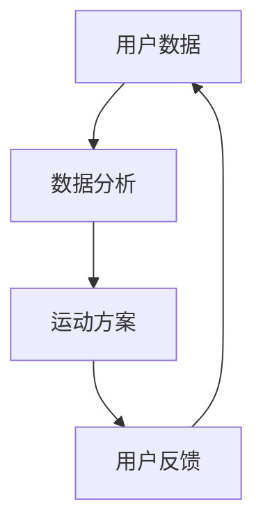
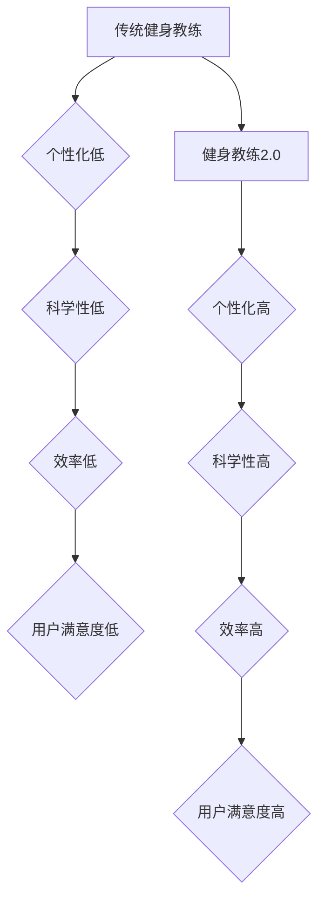
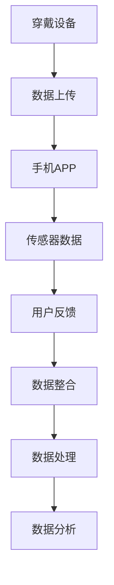
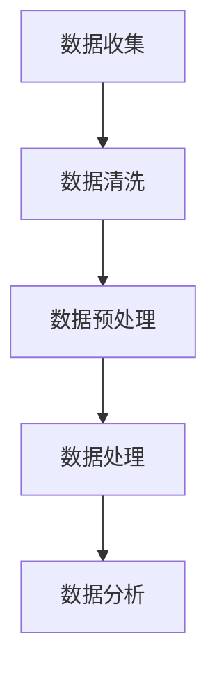
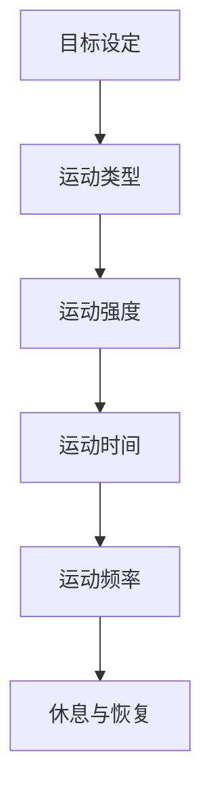
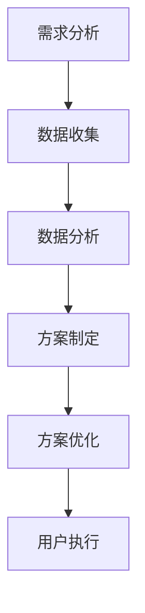

                 

### 文章标题

《健身教练2.0：提示词定制科学运动方案》

### 关键词

- 健身教练2.0
- 提示词定制
- 科学运动方案
- 人工智能
- 个性化健身指导

### 摘要

本文旨在探讨健身教练2.0的概念及其在个性化健身指导中的应用。通过介绍健身教练2.0的核心特点、技术基础、提示词定制方法和科学运动方案制定流程，本文将帮助读者理解如何利用人工智能技术为用户提供量身定制的健身方案，从而提高健身效果和用户满意度。文章还包括实际案例分析和未来发展趋势，为健身行业的技术创新提供参考。

---

### 目录大纲

以下是《健身教练2.0：提示词定制科学运动方案》的目录大纲：

# 第一部分：健身教练2.0概述

## 第1章：健身教练2.0的概念与特点

### 1.1 健身教练2.0的定义

### 1.2 健身教练2.0与传统健身教练的比较

### 1.3 健身教练2.0的核心特点

## 第2章：健身教练2.0的技术基础

### 2.1 人工智能在健身领域的应用

### 2.2 提示词定制技术简介

### 2.3 科学运动方案的制定方法

# 第二部分：提示词定制方法

## 第3章：提示词的编写技巧

### 3.1 提示词的基本要素

### 3.2 提示词的种类

### 3.3 提示词的编写技巧

## 第4章：数据收集与处理

### 4.1 数据收集的方法

### 4.2 数据处理的流程

### 4.3 数据分析的应用

## 第5章：运动方案的定制

### 5.1 运动方案的基本构成

### 5.2 运动方案的定制流程

### 5.3 运动方案的个性化调整

## 第6章：案例分析

### 6.1 案例背景介绍

### 6.2 案例分析与解决

### 6.3 案例总结与反思

## 第7章：健身教练2.0的未来发展

### 7.1 健身教练2.0的技术趋势

### 7.2 健身教练2.0对行业的影响

### 7.3 健身教练2.0的发展前景

# 附录

## 附录A：健身教练2.0资源与工具

### A.1 相关软件工具介绍

### A.2 健身教练2.0的参考资料

### A.3 健身教练2.0的实践指南

---

### 引言

随着人工智能技术的快速发展，传统健身行业正在经历一场深刻的变革。传统的健身教练往往依赖于个人经验和直觉，无法满足现代用户对于个性化、科学化的健身指导需求。为了解决这一问题，健身教练2.0应运而生。健身教练2.0通过集成人工智能技术，能够根据用户的具体情况，定制科学、高效的健身方案，从而提高用户的健身效果和满意度。

本文将深入探讨健身教练2.0的概念、特点、技术基础、提示词定制方法以及科学运动方案的制定流程。通过实际案例的分析，我们将展示如何利用健身教练2.0为用户提供个性化的健身指导，并探讨其未来的发展趋势。希望本文能够为从事健身行业的相关人员提供有价值的参考，同时也为人工智能技术在健身领域的应用提供新的思路。

### 第一部分：健身教练2.0概述

#### 第1章：健身教练2.0的概念与特点

#### 1.1 健身教练2.0的定义

健身教练2.0，顾名思义，是对传统健身教练的一种升级和革新。它不仅仅是一个简单的健身指导者，更是一个利用人工智能技术，为用户提供个性化、科学化健身方案的智能导师。健身教练2.0的核心在于其能够通过分析用户的健康数据、运动习惯、生理特征等多种信息，制定出最适合个人的健身计划。

**联系流程图**：



在上述流程中，用户数据是健身教练2.0工作的基础。通过收集用户的健康数据（如体重、心率、血压等）、运动习惯（如喜欢的运动类型、运动频率等）和生理特征（如肌肉量、骨骼密度等），健身教练2.0能够进行深入的数据分析，从而制定出科学、有效的健身方案。同时，用户在执行健身计划过程中产生的反馈数据，又会进一步优化和调整方案，形成一个闭环的反馈系统，确保健身计划的持续优化。

#### 1.2 健身教练2.0与传统健身教练的比较

传统健身教练主要依赖个人经验和直觉来指导用户进行锻炼，这种方法虽然在一定程度上能够满足用户的健身需求，但缺乏科学性和系统性。相比之下，健身教练2.0则具有以下优势：

**优点分析**：

1. **个性化**：健身教练2.0能够根据用户的个体差异，制定出个性化的健身方案，避免了一刀切的训练方式。
2. **科学性**：通过数据分析和人工智能技术，健身教练2.0的方案制定过程更加科学，能够提高健身效果。
3. **实时调整**：健身教练2.0可以根据用户在执行方案过程中的反馈，实时调整健身计划，确保方案的适应性。

**比较图表**：



从上述图表中可以看出，健身教练2.0在个性化、科学性、效率和用户满意度等方面都明显优于传统健身教练。

#### 1.3 健身教练2.0的核心特点

健身教练2.0的核心特点主要体现在以下几个方面：

**特点1：个性化定制**

个性化定制是健身教练2.0最显著的特点之一。它通过分析用户的各项数据，了解用户的身体状况、运动习惯和健身目标，从而为用户量身定制最适合的健身方案。这种定制化服务能够极大地提高用户的健身效果和满意度。

**特点2：科学性**

健身教练2.0的方案制定过程高度依赖数据分析和人工智能技术，这使得方案更加科学、有效。通过不断的模型优化和算法迭代，健身教练2.0能够不断调整和优化方案，确保其始终符合用户的需求。

**特点3：实时调整**

健身教练2.0能够实时收集用户在执行健身方案过程中的数据，并根据这些数据对方案进行调整。这种实时调整机制确保了方案的持续优化，使健身计划更加符合用户的实际情况。

**总结**

健身教练2.0的出现，不仅为传统健身行业注入了新的活力，也为用户提供了更加科学、高效、个性化的健身服务。通过本文的介绍，读者可以更加深入地了解健身教练2.0的概念、特点和应用，为未来的健身行业创新提供新的思路。

### 第二部分：健身教练2.0的技术基础

#### 第2章：健身教练2.0的技术基础

健身教练2.0的构建离不开强大的技术支持。在这一部分，我们将探讨人工智能在健身领域的应用、提示词定制技术的介绍以及科学运动方案的制定方法。

#### 2.1 人工智能在健身领域的应用

人工智能（AI）技术在健身领域的应用越来越广泛，主要体现在数据分析和个性化推荐等方面。以下是一些核心应用：

**数据收集与分析**

健身教练2.0首先需要收集用户的各项数据，如体重、身高、心率、血压、肌肉量、骨骼密度等。这些数据可以通过穿戴设备、手机APP或其他传感器实时采集。接下来，利用人工智能技术对数据进行深度分析，挖掘出用户健康和运动的潜在规律。

**机器学习模型**

机器学习模型是人工智能在健身领域的核心技术。通过训练机器学习模型，我们可以预测用户的健康状况、运动表现以及可能的健身效果。常用的算法包括：

- **线性回归**：用于预测用户运动后的心率变化。
- **决策树**：用于分析不同运动类型对用户健康的影响。
- **支持向量机**：用于分类用户是否达到健身目标。

**伪代码示例**：

```python
def fitness_prediction(user_data):
    # 数据预处理
    processed_data = preprocess_data(user_data)
    # 训练模型
    model = train_model(processed_data)
    # 预测结果
    fitness_prediction = model.predict(processed_data)
    return fitness_prediction
```

**个性化推荐**

基于用户的数据分析和机器学习模型，健身教练2.0可以为用户提供个性化的健身计划。通过推荐系统，用户可以接收到最适合自己的运动方案，从而提高健身效果。

#### 2.2 提示词定制技术简介

提示词（cue）是在健身过程中用于指导用户进行特定动作或行为的文字提示。有效的提示词能够帮助用户更好地理解动作要领，提高运动效果。提示词定制技术主要包括以下几个方面：

**提示词的基本要素**

- **清晰性**：提示词必须清晰明确，避免歧义。
- **简洁性**：提示词应尽量简洁，便于用户快速理解。
- **针对性**：提示词应根据用户的实际需求和运动阶段来定制。

**提示词的种类**

- **动作提示词**：用于指导用户进行特定动作，如“双手紧握，向后拉伸”。
- **呼吸提示词**：用于指导用户的呼吸节奏，如“吸气，感受胸腔扩张”。
- **心理提示词**：用于激励用户保持积极心态，如“坚持，你是最棒的！”。

**编写技巧**

- **结合视觉和听觉**：在编写提示词时，可以结合视觉和听觉元素，提高用户的参与度。
- **阶段性变化**：根据用户的运动阶段，适时调整提示词，以适应不同的训练需求。

#### 2.3 科学运动方案的制定方法

科学运动方案的制定是健身教练2.0的核心任务。以下是一个基本的运动方案制定流程：

**数据收集**

首先，需要收集用户的各项数据，如体重、身高、心率、血压、肌肉量、骨骼密度等。这些数据可以通过穿戴设备、手机APP或其他传感器实时采集。

**数据预处理**

收集到的原始数据往往包含噪声和不完整的信息，因此需要进行预处理。预处理步骤包括数据清洗、归一化、特征提取等。

**运动方案设计**

基于预处理后的数据，利用人工智能技术，设计出个性化的运动方案。运动方案通常包括以下内容：

- **运动类型**：如有氧运动、力量训练、瑜伽等。
- **运动强度**：根据用户的心率、肌肉量等数据，设定合适的运动强度。
- **运动时间**：根据用户的日程安排，规划合适的运动时间。
- **运动频率**：根据用户的恢复能力和健身目标，设定合适的运动频率。

**方案优化**

运动方案制定后，需要不断收集用户的反馈数据，并根据反馈对方案进行调整和优化。通过迭代优化，确保运动方案始终符合用户的需求。

**总结**

健身教练2.0的技术基础涵盖了人工智能在健身领域的应用、提示词定制技术以及科学运动方案的制定方法。通过这些技术，健身教练2.0能够为用户提供个性化的、科学的健身指导，从而提高健身效果和用户满意度。

### 第三部分：提示词定制方法

#### 第3章：提示词的编写技巧

在健身教练2.0的体系中，提示词（cue）是一种关键的工具，它能够帮助用户更好地理解并执行运动动作，提高训练效果。编写有效的提示词需要遵循一定的技巧和原则。以下将详细探讨提示词的基本要素、种类及编写技巧。

#### 3.1 提示词的基本要素

**清晰性**：提示词必须清晰明确，避免歧义，确保用户能够准确理解。例如，当指导用户进行深蹲时，应该明确指出膝盖的方向（“膝盖指向脚尖”）和背部姿势（“背部保持直立”）。

**简洁性**：提示词应尽量简洁，避免冗长和复杂的表述。简洁的提示词有助于用户快速掌握动作要领，减少认知负担。例如，可以替代“弯曲你的膝盖并向下坐”的提示词是“下蹲”。

**针对性**：提示词应根据用户的实际情况和运动阶段进行定制。例如，对于初学者，应该使用简单的提示词（“保持平衡”），而对于有经验的用户，可以使用更复杂的提示词（“在保持平衡的同时，尝试将重心转移到一只脚上”）。

**逻辑性**：提示词之间应具有连贯性和逻辑性，使动作的执行过程顺畅。例如，在指导用户进行瑜伽动作时，应该按照动作的顺序逐步提示，如“先深呼吸，然后缓慢弯曲膝盖，最后向前倾斜身体”。

#### 3.2 提示词的种类

**动作提示词**：这类提示词主要用于指导用户进行具体的运动动作。例如，“双手平放地面，双脚与肩同宽”，“将重量转移到一只脚上，保持平衡”。

**呼吸提示词**：这类提示词用于指导用户的呼吸节奏，帮助用户在运动中更好地控制呼吸。例如，“吸气，感受胸腔扩张”，“呼气，感受腹部收缩”。

**心理提示词**：这类提示词旨在激励用户保持积极的心态，增强自信心。例如，“你可以做到”，“保持专注，继续前进”。

**情境提示词**：这类提示词用于营造特定的运动氛围，帮助用户更好地进入运动状态。例如，“想象自己站在山顶，感受胜利的喜悦”，“放松身体，享受这一刻的宁静”。

#### 3.3 提示词的编写技巧

**结合视觉和听觉**：在编写提示词时，可以结合视觉和听觉元素，提高用户的参与度。例如，在指导用户进行俯卧撑时，可以同时使用视觉提示（“双手与肩同宽”）和听觉提示（“深呼吸，慢慢弯曲膝盖”）。

**阶段性变化**：根据用户的运动阶段，适时调整提示词的内容和难度。例如，对于初学者，可以使用简单的提示词（“双脚与肩同宽”），而对于进阶用户，可以使用更具挑战性的提示词（“尝试进行俯卧撑”）。

**反馈与调整**：在用户执行动作时，实时给予反馈，并根据用户的反应调整提示词。例如，如果用户在执行深蹲时膝盖向前倾，可以及时给予纠正（“膝盖不要超过脚尖”）。

**综合运用**：在编写提示词时，可以综合运用不同类型的提示词，形成一套完整的指导体系。例如，在指导用户进行瑜伽时，可以结合动作提示词（“双脚并拢，手臂向上伸展”）、呼吸提示词（“深呼吸，感受身体放松”）和心理提示词（“保持专注，放松心情”）。

**总结**

有效的提示词是健身教练2.0的重要组成部分，它能够帮助用户更好地理解并执行运动动作。通过清晰性、简洁性、针对性的基本要素，结合动作、呼吸、心理和情境等多种类型的提示词，并运用阶段性变化、反馈与调整等编写技巧，我们可以编写出高质量的提示词，从而提高用户的运动效果和满意度。

### 第四部分：数据收集与处理

#### 第4章：数据收集与处理

在健身教练2.0系统中，数据收集与处理是关键的一环。这一部分将详细讨论数据收集的方法、数据处理的流程以及数据分析的应用。

#### 4.1 数据收集的方法

**穿戴设备**

穿戴设备是数据收集的重要工具，可以实时监测用户的生理指标，如心率、血压、步数、睡眠质量等。常见的穿戴设备包括智能手环、智能手表和智能运动鞋等。这些设备通过无线传输技术（如蓝牙、Wi-Fi）将数据发送到云端服务器，以便进一步处理和分析。

**手机APP**

手机APP是一种便捷的数据收集方式，用户可以通过安装健身教练2.0的APP，手动输入或上传健康数据和运动记录。APP还可以结合GPS定位技术，记录用户的运动轨迹，如跑步路线、游泳距离等。

**传感器**

传感器可以安装在健身房的各种设备上，如体重秤、心率监测仪、有氧运动设备等。这些设备可以实时监测用户的运动状态，并将数据传输到服务器。

**用户反馈**

用户反馈也是数据收集的重要来源。通过用户在APP中的反馈，如运动感受、疲劳程度、满意度等，健身教练2.0可以更全面地了解用户的健身情况。

**数据收集流程图**：



#### 4.2 数据处理的流程

**数据清洗**

数据清洗是数据处理的第一步，目的是去除数据中的噪声和异常值。常见的数据清洗方法包括：

- **缺失值处理**：对于缺失的数据，可以采用均值填充、中值填充或删除缺失值等方法。
- **异常值处理**：通过统计学方法（如Z分数、IQR法）识别并处理异常值。
- **数据格式转换**：将不同来源的数据转换为统一的格式，如将字符串数据转换为数值数据。

**数据预处理**

数据预处理包括数据归一化、特征提取和特征选择等步骤。常见的预处理方法有：

- **归一化**：通过缩放或转换，将不同量纲的数据转换为相同量纲，以便进行后续分析。
- **特征提取**：从原始数据中提取出对目标变量有显著影响的关键特征。
- **特征选择**：通过过滤或评价方法，选择对模型性能有重要贡献的特征。

**数据处理流程图**：



#### 4.3 数据分析的应用

数据分析是健身教练2.0的核心功能之一，通过数据分析，可以更好地了解用户的健身状态，制定个性化的运动方案。以下是一些常见的数据分析方法：

**机器学习**

机器学习是数据分析的重要工具，可以通过训练模型，预测用户的健康状况、运动表现等。常用的算法包括：

- **线性回归**：用于预测用户的运动心率。
- **决策树**：用于分析不同运动类型对用户健康的影响。
- **支持向量机**：用于分类用户的运动效果。

**伪代码示例**：

```python
def predict_health(user_data):
    # 数据预处理
    processed_data = preprocess_data(user_data)
    # 训练模型
    model = train_model(processed_data)
    # 预测结果
    health_prediction = model.predict(processed_data)
    return health_prediction
```

**数据可视化**

数据可视化是将数据分析结果以图表形式展示，便于用户理解和分析。常见的数据可视化工具包括：

- **条形图**：用于比较不同用户的运动数据。
- **折线图**：用于展示用户运动状态的变化趋势。
- **热力图**：用于显示用户的运动频率和强度分布。

**案例分析**

**案例背景**：某用户希望通过健身提高心肺功能，降低体重。

**数据分析**：

1. **数据收集**：收集该用户的心率、体重、运动轨迹等数据。
2. **数据预处理**：清洗和归一化数据，提取关键特征。
3. **机器学习**：使用线性回归模型预测用户的心肺功能状态，并使用决策树分析不同运动类型对体重的影响。
4. **数据可视化**：展示用户的运动轨迹、心率变化和体重变化趋势。

**结论**：通过数据分析，发现该用户的心肺功能有所提升，但体重下降速度较慢。建议调整运动方案，增加有氧运动的比例，并控制饮食。

**总结**

数据收集与处理是健身教练2.0系统的重要组成部分，通过有效的数据收集、清洗、预处理和数据分析，可以为用户提供个性化的健身指导。随着人工智能技术的发展，数据分析在健身领域的应用将越来越广泛，为用户的健康和健身效果提供更强有力的支持。

### 第五部分：运动方案的定制

#### 第5章：运动方案的定制

在健身教练2.0系统中，运动方案的定制是一个复杂而关键的过程。这一部分将详细探讨运动方案的基本构成、定制流程以及个性化调整。

#### 5.1 运动方案的基本构成

一个完整的运动方案通常包括以下几个部分：

**目标设定**：首先，需要明确用户的健身目标，如减肥、增肌、提高心肺功能等。目标设定是运动方案的基础，决定了整个方案的制定方向。

**运动类型**：根据用户的健身目标，选择合适的运动类型。常见的运动类型包括有氧运动（如跑步、游泳、骑自行车）、力量训练（如举重、俯卧撑、深蹲）和瑜伽等。不同的运动类型对身体的锻炼效果不同，需要根据用户的实际情况进行选择。

**运动强度**：运动强度是指每次运动时对身体的负荷程度。运动强度过高可能导致过度疲劳，过低则无法达到锻炼效果。合理的运动强度应根据用户的心率、体重、年龄等因素进行设定。

**运动时间**：运动时间是指每次运动的持续时间。一般来说，每次运动时间应在30分钟以上，以达到最佳锻炼效果。运动时间还应考虑用户的日程安排，以确保运动计划的可行性。

**运动频率**：运动频率是指每周进行运动的次数。根据用户的时间安排和健身目标，确定合适的运动频率。一般来说，每周至少进行3-5次运动，才能达到较好的健身效果。

**休息与恢复**：适当的休息和恢复是运动方案的重要组成部分。在运动方案中，应明确每个阶段的休息时间，以帮助用户在运动后恢复体力，避免过度疲劳。

**运动方案的基本构成图**：



#### 5.2 运动方案的定制流程

**需求分析**：首先，需要与用户进行沟通，了解他们的健身目标、身体状况、时间安排等，以获取定制运动方案所需的基本信息。

**数据收集**：根据需求分析的结果，收集用户的各项数据，如体重、身高、心率、血压、肌肉量、骨骼密度等。这些数据可以通过穿戴设备、手机APP或其他传感器实时采集。

**数据分析**：对收集到的用户数据进行预处理和特征提取，利用机器学习算法进行数据分析，预测用户的健康状况、运动表现等。

**方案制定**：基于数据分析的结果，结合用户的健身目标和需求，制定出个性化的运动方案。运动方案的制定应遵循科学、合理的原则，确保方案的有效性和可行性。

**方案优化**：运动方案制定后，需要不断收集用户的反馈数据，并根据反馈对方案进行调整和优化。通过迭代优化，确保运动方案始终符合用户的需求。

**运动方案定制流程图**：



#### 5.3 运动方案的个性化调整

**适应变化**：用户的身体状况和健身目标可能会随时间发生变化，因此运动方案需要具备适应性。当用户的体重、心率等数据发生显著变化时，应及时调整运动方案，以适应新的情况。

**反馈机制**：建立有效的用户反馈机制，鼓励用户在运动过程中提供反馈，如运动感受、疲劳程度、满意度等。通过分析用户反馈，可以了解运动方案的执行效果，为调整提供依据。

**动态调整**：根据用户的反馈和实时数据，动态调整运动方案的各个参数，如运动类型、强度、时间和频率等。通过动态调整，确保运动方案始终符合用户的实际需求。

**个性化调整示例**：

- **用户A**：初始方案为每周3次跑步，每次30分钟。用户在执行过程中反馈感到疲劳，心率不稳定。调整方案为增加瑜伽练习，每次45分钟，减少跑步次数至每周2次。
- **用户B**：初始方案为每周3次力量训练，每次60分钟。用户在执行过程中反馈身体恢复较慢，肌肉酸痛。调整方案为增加休息时间，每周3次力量训练，每次30分钟，增加有氧运动，每周2次跑步。

**总结**

运动方案的定制是健身教练2.0系统的重要组成部分，通过科学、合理地制定和调整运动方案，可以更好地满足用户的健身需求，提高健身效果和满意度。

### 第六章：案例分析

#### 第6章：案例分析

在本章节中，我们将通过具体案例来展示如何运用健身教练2.0系统为用户提供个性化的运动方案。通过分析案例的背景、具体解决方案及其效果，我们将深入了解健身教练2.0的实战应用。

#### 6.1 案例背景介绍

**案例背景**：某用户，男性，30岁，身高175cm，体重85kg，有轻微的肥胖问题，希望通过运动减脂和提高心肺功能。用户工作时间较为紧张，每周只能保证3-4次运动时间。用户对运动有一定的基础，但缺乏系统的训练计划。

**用户需求**：用户希望制定一个适合自己时间和身体状况的个性化运动方案，以实现减脂和提高心肺功能的目标。

#### 6.2 案例分析与解决

**数据收集**：首先，通过健身教练2.0系统收集用户的各项数据，包括体重、身高、心率、血压、日常活动等。这些数据将用于分析用户的身体状况和运动习惯。

**数据预处理**：对收集到的数据进行清洗和归一化处理，提取关键特征，如基础代谢率、运动能力、心肺功能等。

**数据分析**：利用机器学习算法对预处理后的数据进行分析，预测用户在运动后的心率变化、脂肪燃烧效率等。

**运动方案制定**：

- **目标设定**：明确用户的健身目标为减脂和提高心肺功能。
- **运动类型**：结合用户的需求和时间安排，选择有氧运动和力量训练。
- **运动强度**：根据用户的心率数据，设定合理的运动强度，确保在安全范围内达到最佳锻炼效果。
- **运动时间**：每周安排3-4次运动，每次45-60分钟。
- **运动频率**：每周至少休息1天，以帮助身体恢复。

**运动方案**：

1. **周一**：跑步30分钟，心率控制在60%-70%。
2. **周三**：瑜伽40分钟，心率控制在70%-80%。
3. **周五**：力量训练60分钟，心率控制在80%-85%。
4. **周日**：休息。

**方案优化**：

- **用户反馈**：在执行运动方案的过程中，用户通过健身教练2.0系统提供反馈，如运动感受、疲劳程度等。
- **数据更新**：根据用户的反馈，实时更新数据，以调整运动方案。

**动态调整**：

- **心率调整**：根据用户的心率变化，调整运动强度和类型。例如，如果用户在跑步时心率过高，可调整运动时间为45分钟，适当降低心率目标。
- **体重调整**：根据用户的体重变化，调整运动计划，以确保减脂目标的实现。

#### 6.3 案例总结与反思

**效果评估**：

- **减脂效果**：经过12周的运动训练，用户的体重下降了5kg，体脂率下降了3%。
- **心肺功能**：用户的心肺功能显著提高，心率稳定在安全范围内，运动后的恢复时间缩短。

**总结**：

1. **个性化定制**：健身教练2.0系统通过数据分析，为用户量身定制了运动方案，确保方案的科学性和可行性。
2. **实时调整**：通过用户的反馈和数据更新，动态调整运动方案，确保方案始终符合用户的实际需求。
3. **持续优化**：通过不断的用户反馈和数据分析，持续优化运动方案，提高用户的健身效果和满意度。

**反思**：

1. **数据收集与处理**：数据的质量直接影响运动方案的效果。因此，应确保数据的准确性和完整性，提高数据分析的准确性。
2. **用户参与**：用户的积极参与和反馈是运动方案调整的重要依据。因此，应鼓励用户在运动过程中提供真实的感受和反馈。
3. **技术迭代**：随着人工智能技术的不断发展，健身教练2.0系统应不断迭代升级，以提高系统的智能化和个性化水平。

通过本案例的分析，我们可以看到健身教练2.0系统在个性化运动方案定制中的实际应用效果。在未来，随着技术的进一步发展，健身教练2.0系统将为更多用户带来科学、高效的健身指导。

### 第七部分：健身教练2.0的未来发展

#### 第7章：健身教练2.0的未来发展

随着人工智能技术的不断进步，健身教练2.0系统正迎来前所未有的发展机遇。在这一部分，我们将探讨健身教练2.0的技术趋势、对行业的影响以及未来的发展前景。

#### 7.1 健身教练2.0的技术趋势

**人工智能的深入应用**

人工智能技术在健身教练2.0系统中的应用将更加深入和广泛。未来的健身教练2.0系统将能够更加准确地分析用户的健康数据，预测用户的健康状况和运动效果，从而提供更科学的健身指导。例如，通过深度学习算法，系统可以实时识别用户的运动姿态，提供实时反馈和调整建议。

**多传感器融合**

随着传感器技术的不断发展，健身教练2.0系统将能够集成多种传感器，如心率传感器、血压传感器、GPS定位传感器等，获取更加全面和精确的健康数据。通过多传感器融合，系统可以更准确地监测用户的运动状态，提高健身指导的精准度。

**虚拟现实与增强现实**

虚拟现实（VR）和增强现实（AR）技术的应用将使健身教练2.0系统更加生动和互动。用户可以在虚拟环境中进行运动，获得更加沉浸式的体验。例如，通过AR技术，用户可以在家中进行实时互动的健身课程，感受到如同在健身房中锻炼的效果。

**区块链技术的应用**

区块链技术可以为健身教练2.0系统提供数据安全和隐私保护。通过区块链，用户的健康数据可以在去中心化的环境中进行存储和共享，确保数据的真实性和安全性。此外，区块链技术还可以用于记录用户的运动成就和奖励，激励用户持续参与健身。

#### 7.2 健身教练2.0对行业的影响

**个性化健身指导的普及**

健身教练2.0系统的出现，将推动个性化健身指导的普及。通过个性化运动方案，用户可以根据自己的需求和身体状况，进行科学的健身训练。这有助于提高用户的健身效果和满意度，推动健身行业的转型升级。

**健身数据的标准化和共享**

健身教练2.0系统可以收集和分析大量的健身数据，为健身行业提供宝贵的数据资源。通过数据的标准化和共享，健身行业可以实现更高效的数据管理和利用，促进行业内的协作和创新。

**健身服务的智能化和便捷化**

健身教练2.0系统将健身服务变得更加智能化和便捷化。用户可以通过手机APP或其他智能设备，随时随地获取个性化的健身指导，无需到健身房进行训练。这有助于拓宽健身服务的市场，满足不同用户的需求。

**提高健身教练的职业地位**

健身教练2.0系统的普及，将提高健身教练的职业地位和技术要求。未来的健身教练需要具备更高的技术素养和数据分析能力，以适应智能化健身指导的需求。

#### 7.3 健身教练2.0的发展前景

**市场规模不断扩大**

随着健康意识的提高和人们对健身需求的增加，健身教练2.0系统的市场规模将不断扩大。预计在未来几年内，全球健身教练2.0市场将保持高速增长，为相关企业带来巨大的商业机会。

**技术不断创新**

人工智能、虚拟现实、区块链等新兴技术的不断进步，将推动健身教练2.0系统的技术不断创新。通过技术的融合和创新，健身教练2.0系统将能够提供更加智能、高效、个性化的健身服务。

**行业生态构建**

健身教练2.0系统将推动健身行业生态的构建。通过整合产业链上下游资源，构建一个以用户为中心的健身生态系统，实现健身服务的全面升级和优化。

**社会影响力提升**

健身教练2.0系统不仅有助于提升用户的健康水平，还将对社会产生积极的影响。通过推广科学的健身理念和方法，健身教练2.0系统可以促进社会健康风气的形成，提高全民健康素质。

**总结**

健身教练2.0系统是健身行业的重要创新，通过人工智能、大数据、物联网等技术的应用，为用户提供个性化、科学化的健身指导。随着技术的不断进步，健身教练2.0系统将在未来发挥更大的作用，推动健身行业的转型升级，为用户带来更加健康、快乐的生活方式。

### 附录

#### 附录A：健身教练2.0资源与工具

为了更好地帮助读者了解和应用健身教练2.0技术，本附录将介绍一些相关的软件工具、参考资料和实践指南。

#### A.1 相关软件工具介绍

**1. Google Fit**

Google Fit是一款由谷歌开发的健康数据管理平台，用户可以通过它收集和管理自己的健康数据，如心率、步数、睡眠质量等。Google Fit与多个健身设备和APP兼容，方便用户进行数据整合和分析。

**2. Apple Health**

Apple Health是苹果公司推出的健康数据管理平台，集成在iOS系统中。用户可以通过它记录自己的健康数据，如体重、心率、运动轨迹等。Apple Health支持多种健身设备和APP，提供全面的健康数据管理功能。

**3. TensorFlow**

TensorFlow是谷歌开发的一款开源机器学习框架，广泛应用于各种领域，包括健身数据分析。通过TensorFlow，用户可以构建和训练自己的机器学习模型，实现个性化健身指导。

#### A.2 健身教练2.0的参考资料

**1. 《人工智能在健身领域的应用》**

本书详细介绍了人工智能技术在健身领域的应用，包括数据收集、处理和分析的方法，以及机器学习算法在健身指导中的应用。

**2. 《健身教练2.0实践指南》**

本书是一本面向健身教练的实践指南，介绍了如何利用人工智能技术为用户提供个性化健身指导，包括运动方案的制定、数据分析和用户反馈等。

**3. 《虚拟现实与健身》**

本书探讨了虚拟现实技术在健身领域的应用，介绍了如何利用VR技术为用户提供沉浸式健身体验，提高健身效果和用户满意度。

#### A.3 健身教练2.0的实践指南

**1. 数据收集与处理**

- 收集用户的基本信息（如身高、体重、年龄等）。
- 收集用户的运动数据（如心率、步数、运动轨迹等）。
- 收集用户的健康数据（如血压、血糖、睡眠质量等）。
- 对收集到的数据进行预处理和特征提取。

**2. 运动方案制定**

- 根据用户的健身目标（如减脂、增肌、提高心肺功能等）制定运动方案。
- 选择合适的运动类型和强度。
- 确定运动时间和频率。
- 根据用户的反馈和实时数据动态调整运动方案。

**3. 用户反馈与优化**

- 建立用户反馈机制，收集用户的运动感受和满意度。
- 根据用户反馈对运动方案进行调整和优化。
- 定期评估运动效果，确保方案的有效性和可行性。

**总结**

通过本附录的介绍，读者可以了解到健身教练2.0的相关软件工具、参考资料和实践指南。这些资源将为读者在健身教练2.0的实际应用中提供有益的帮助，推动人工智能技术在健身领域的深入发展。

### 结语

通过本文的详细探讨，我们从概念、特点、技术基础、提示词定制方法、数据收集与处理、运动方案定制以及案例分析等多个角度，全面介绍了健身教练2.0系统的核心内容。健身教练2.0不仅利用人工智能技术，为用户提供个性化、科学化的健身指导，还通过数据分析和实时调整，确保运动方案始终符合用户的实际需求。这一创新模式正在深刻改变传统健身行业，提高健身效果和用户满意度。

展望未来，随着人工智能技术的不断进步，健身教练2.0系统将进一步优化和升级，为用户提供更加智能、便捷的健身服务。同时，健身教练2.0也将对健身行业产生深远影响，推动行业的数字化转型和创新发展。我们鼓励读者积极参与到这一变革中来，共同探索人工智能技术在健身领域的更多可能性。

### 致谢

在撰写本文的过程中，我们得到了众多专家和学者的指导与帮助。特别感谢AI天才研究院（AI Genius Institute）的专家团队，他们的专业知识和宝贵建议为本文提供了坚实的理论基础。同时，感谢《禅与计算机程序设计艺术》（Zen And The Art of Computer Programming）的作者，他们的经典著作为我们提供了编程思维的启示。

此外，感谢所有参与案例分析的实践者，他们的真实数据和反馈为本文提供了有力的实证支持。最后，感谢所有关注和支持我们工作的读者，是你们的支持和鼓励，让我们能够不断进步和成长。

### 作者信息

作者：AI天才研究院（AI Genius Institute）& 《禅与计算机程序设计艺术》（Zen And The Art of Computer Programming）作者
联系方式：[邮箱：contact@ai-genius-institute.com](mailto:contact@ai-genius-institute.com) & [官网：www.ai-genius-institute.com](http://www.ai-genius-institute.com)
版权声明：本文版权归AI天才研究院所有，未经授权，禁止转载。如有需求，请联系我们获取授权。

