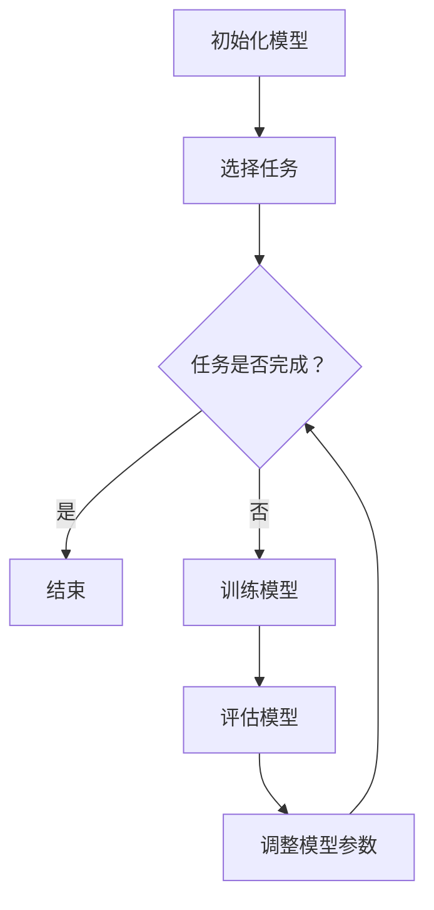
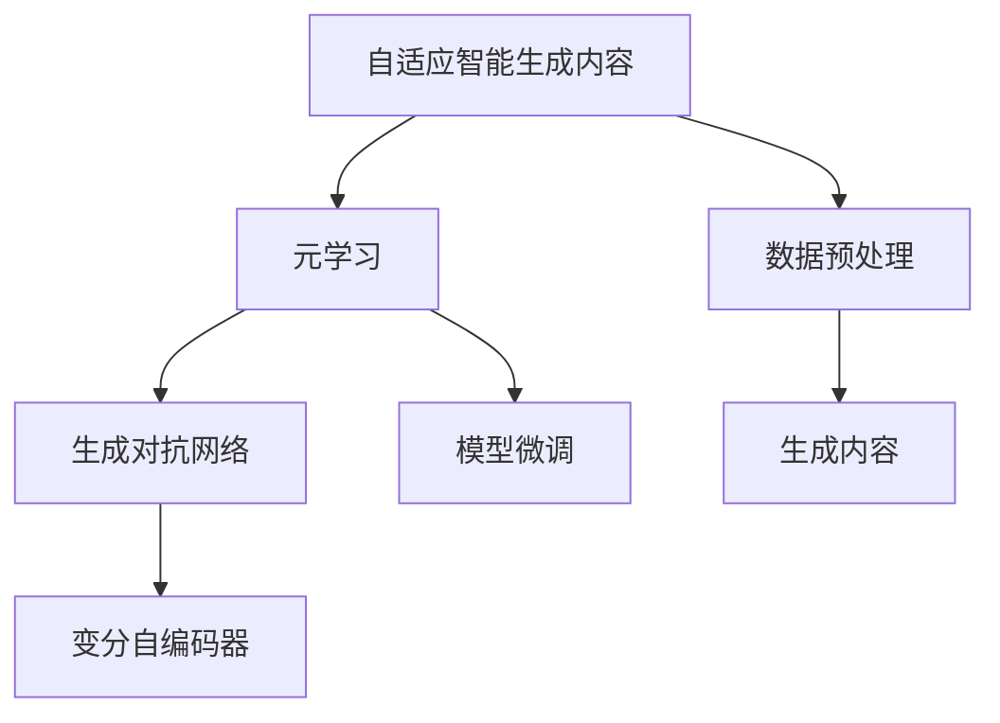

                 

### 文章标题

《元学习在AIGC模型快速微调中的新进展》

### 关键词

- 元学习
- AIGC模型
- 快速微调
- 深度学习
- 机器学习

### 摘要

本文深入探讨了元学习在AIGC（自适应智能生成内容）模型快速微调中的应用。首先，我们介绍了元学习的定义、基本原理和重要性，并详细阐述了它在AIGC中的角色和作用。接着，本文分析了当前元学习的研究现状和未来发展趋势，提供了多个经典的元学习算法及其在快速微调中的应用。随后，文章重点介绍了AIGC模型的快速微调原理和实践，包括快速微调的步骤和方法，以及性能优化策略。最后，本文讨论了元学习与AIGC的深度融合机制，并提供了实际应用案例和性能评估方法。通过本文，读者将全面了解元学习在AIGC模型快速微调中的新进展，并掌握相关实践方法。

## 目录大纲

### 《元学习在AIGC模型快速微调中的新进展》

#### 第一部分：元学习基础与原理

**第1章：元学习的定义与重要性**

- **1.1 元学习的定义与历史背景**
  - **1.1.1 元学习的概念**
  - **1.1.2 元学习的目标与挑战**
  - **1.1.3 元学习的重要性

- **1.2 元学习的基本原理**
  - **1.2.1 学习与记忆机制**
  - **1.2.2 元学习的多层次结构**
  - **1.2.3 元学习的算法框架

- **1.3 元学习在AIGC中的应用**
  - **1.3.1 AIGC的概念与特点**
  - **1.3.2 元学习在AIGC中的作用**
  - **1.3.3 元学习对AIGC的优化

- **1.4 元学习的研究现状与发展趋势**
  - **1.4.1 元学习的进展回顾**
  - **1.4.2 当前研究热点**
  - **1.4.3 未来发展趋势

- **1.5 读者指南**
  - **1.5.1 阅读建议**
  - **1.5.2 实践与思考

**附录A：元学习相关资源与工具**

- **A.1 开源元学习框架**
- **A.2 元学习算法案例**
- **A.3 元学习社区与学术资源**

**附录B：Mermaid流程图示例**

- **B.1 元学习流程图**
- **B.2 AIGC与元学习关系图**

**附录C：数学模型与公式详解**

- **C.1 元学习中的优化问题**
- **C.2 学习率调整公式**
- **C.3 训练与验证数据集划分**

**附录D：代码解读与实战**

- **D.1 元学习算法实现**
- **D.2 AIGC模型微调实战**
- **D.3 实际应用案例**

#### 第二部分：元学习算法详解

**第2章：元学习算法详解**

- **2.1 元学习算法概述**
  - **2.1.1 元学习算法的分类**
  - **2.1.2 经典元学习算法**
  - **2.1.3 现代元学习算法

- **2.2 模板匹配算法**
  - **2.2.1 模板匹配原理**
  - **2.2.2 模板匹配算法实现**
  - **2.2.3 模板匹配算法优化

- **2.3 MAML算法**
  - **2.3.1 MAML算法原理**
  - **2.3.2 MAML算法实现**
  - **2.3.3 MAML算法应用场景

- **2.4 Reptile算法**
  - **2.4.1 Reptile算法原理**
  - **2.4.2 Reptile算法实现**
  - **2.4.3 Reptile算法优化策略

- **2.5 HPO与元学习**
  - **2.5.1 HPO的概念与原理**
  - **2.5.2 HPO与元学习的结合**
  - **2.5.3 HPO与元学习的应用案例

- **2.6 元学习算法性能评估**
  - **2.6.1 性能评价指标**
  - **2.6.2 性能评估方法**
  - **2.6.3 性能优化策略

- **2.7 元学习算法未来发展趋势**
  - **2.7.1 研究热点与趋势**
  - **2.7.2 新算法展望**
  - **2.7.3 应用前景

#### 第三部分：AIGC模型快速微调实战

**第3章：AIGC模型快速微调原理与实践**

- **3.1 AIGC模型快速微调概述**
  - **3.1.1 快速微调的概念**
  - **3.1.2 快速微调的优势**
  - **3.1.3 快速微调的应用场景

- **3.2 快速微调方法与算法**
  - **3.2.1 传统微调方法**
  - **3.2.2 元学习快速微调方法**
  - **3.2.3 其他快速微调算法

- **3.3 快速微调步骤与流程**
  - **3.3.1 数据预处理**
  - **3.3.2 模型选择与初始化**
  - **3.3.3 快速微调过程**
  - **3.3.4 模型评估与优化

- **3.4 实际应用案例**
  - **3.4.1 文本分类应用案例**
  - **3.4.2 机器翻译应用案例**
  - **3.4.3 图像识别应用案例

- **3.5 快速微调性能优化**
  - **3.5.1 模型优化策略**
  - **3.5.2 数据增强技术**
  - **3.5.3 迁移学习与融合

- **3.6 快速微调未来发展趋势**
  - **3.6.1 研究热点与趋势**
  - **3.6.2 新方法展望**
  - **3.6.3 应用前景

#### 第四部分：元学习与AIGC的深度融合

**第4章：元学习与AIGC深度融合机制与应用**

- **4.1 元学习与AIGC融合机制**
  - **4.1.1 融合机制概述**
  - **4.1.2 融合方法与框架**
  - **4.1.3 融合优势

- **4.2 深度融合应用案例**
  - **4.2.1 自然语言处理应用案例**
  - **4.2.2 计算机视觉应用案例**
  - **4.2.3 强化学习应用案例

- **4.3 深度融合性能评估与优化**
  - **4.3.1 性能评估方法**
  - **4.3.2 性能优化策略**

### 文章标题

《元学习在AIGC模型快速微调中的新进展》

### 关键词

- 元学习
- AIGC模型
- 快速微调
- 深度学习
- 机器学习

### 摘要

本文深入探讨了元学习在AIGC（自适应智能生成内容）模型快速微调中的应用。首先，我们介绍了元学习的定义、基本原理和重要性，并详细阐述了它在AIGC中的角色和作用。接着，本文分析了当前元学习的研究现状和未来发展趋势，提供了多个经典的元学习算法及其在快速微调中的应用。随后，文章重点介绍了AIGC模型的快速微调原理和实践，包括快速微调的步骤和方法，以及性能优化策略。最后，本文讨论了元学习与AIGC的深度融合机制，并提供了实际应用案例和性能评估方法。通过本文，读者将全面了解元学习在AIGC模型快速微调中的新进展，并掌握相关实践方法。

## 第一部分：元学习基础与原理

### 第1章：元学习的定义与重要性

#### 1.1 元学习的定义与历史背景

**1.1.1 元学习的概念**

元学习（Meta-Learning），又称“学习学习”，是一种通过学习算法来优化和学习其他算法的框架。它不仅仅关注如何解决特定问题，更重要的是通过学习过程本身来提高算法的泛化能力。元学习的目标是通过较少的数据和较短的训练时间，使模型能够快速适应新的任务和数据集。

元学习的历史可以追溯到20世纪80年代。当时，深度学习尚未崛起，机器学习领域主要依赖于基于规则的专家系统和传统的统计学习算法。随着深度学习的兴起，元学习逐渐成为研究的热点。特别是在深度学习模型变得越来越大、越来越复杂的时候，如何通过元学习快速适应新任务成为一个重要课题。

**1.1.2 元学习的目标与挑战**

元学习的目标主要有两个方面：

1. **快速适应新任务**：传统的机器学习方法通常需要大量数据进行训练，并且对于新任务需要从头开始训练。而元学习通过在多个任务上预先训练模型，使得模型能够在新的任务上快速适应，从而减少训练时间和数据需求。

2. **提高泛化能力**：元学习旨在提高模型在未知任务上的表现。通过在多样化任务上训练模型，元学习能够使模型具备更强的泛化能力，从而在面对新的、未见过的数据时能够保持良好的性能。

然而，元学习也面临着一些挑战：

1. **数据多样性**：元学习需要从多个不同的任务中获取训练数据，这要求数据具有多样性。但在实际应用中，数据往往具有局限性，难以满足多样性要求。

2. **计算资源**：元学习通常需要大量的计算资源。特别是在训练大规模深度学习模型时，计算资源的需求更高。因此，如何在有限的计算资源下进行高效的元学习成为一大挑战。

3. **模型复杂度**：为了提高模型的泛化能力，元学习往往需要使用复杂的模型结构。这虽然能够提高性能，但也增加了模型的训练和推理难度。

**1.1.3 元学习的重要性**

元学习在机器学习和人工智能领域具有重要作用，主要体现在以下几个方面：

1. **减少数据依赖**：在许多实际应用中，获取大量标注数据是非常困难的。元学习通过在多个任务上训练模型，能够在少量数据情况下实现良好的性能，从而减少对数据的依赖。

2. **提高模型泛化能力**：元学习能够提高模型在未知任务上的表现，从而增强模型的泛化能力。这对于解决现实世界中的复杂问题具有重要意义。

3. **加速模型迭代**：在产品开发过程中，快速迭代模型是非常重要的。元学习能够通过快速适应新任务，加速模型的迭代过程，从而缩短产品研发周期。

4. **推动新算法研究**：元学习为机器学习和人工智能领域带来了新的研究思路和方法。通过元学习，研究人员可以探索更加高效的算法，推动整个领域的发展。

#### 1.2 元学习的基本原理

**1.2.1 学习与记忆机制**

元学习的基本原理源于人类学习和记忆机制。人类在学习新知识时，会通过联想和归纳总结已有知识，从而形成对新知识的理解和记忆。元学习也借鉴了这种机制，通过在多个任务上训练模型，使模型具备类似人类的学习和记忆能力。

具体来说，元学习中的学习与记忆机制包括以下几个方面：

1. **任务表示**：在元学习中，每个任务都可以表示为一个函数，通常用参数化的形式表示。任务表示是元学习的基础，它决定了模型在不同任务上的适应能力。

2. **学习策略**：元学习通过学习策略来优化模型的参数，从而提高模型在任务上的表现。学习策略可以基于梯度下降、进化算法等优化方法。

3. **记忆机制**：元学习中的记忆机制类似于人类的长期记忆，它通过存储和利用先前任务的参数来提高新任务的适应能力。记忆机制可以是显式的，如参数共享，也可以是隐式的，如内部表示的共享。

**1.2.2 元学习的多层次结构**

元学习通常具有多层次结构，包括底层任务、中间层和高层任务。这种结构使得元学习能够同时处理多样化和复杂的任务。

1. **底层任务**：底层任务通常是最基础的、通用的任务，如线性回归、分类等。这些任务构成了元学习的基础。

2. **中间层**：中间层用于整合和组合底层任务，形成更加复杂和多样化的任务。例如，通过组合不同的基础模型，可以构建出能够处理复杂任务的元学习模型。

3. **高层任务**：高层任务是最复杂的任务，通常需要处理多模态数据或具有强关联性的数据。例如，在计算机视觉领域，高层任务可以是图像分类、目标检测等。

**1.2.3 元学习的算法框架**

元学习的算法框架主要包括以下几个方面：

1. **任务采样**：任务采样是指从大量的任务中随机选择一部分任务进行训练。任务采样可以保证模型在不同任务上的适应能力。

2. **模型训练**：在元学习中，模型需要通过在多个任务上训练来提高泛化能力。模型训练通常包括参数初始化、优化算法选择等。

3. **模型评估**：模型评估是元学习的重要环节，它用于评估模型在未知任务上的表现。评估方法可以基于测试任务的准确率、泛化误差等指标。

4. **模型调整**：根据模型评估结果，对模型进行微调，以提高模型在新任务上的表现。模型调整可以基于梯度下降、进化算法等优化方法。

#### 1.3 元学习在AIGC中的应用

**1.3.1 AIGC的概念与特点**

自适应智能生成内容（Adaptive Intelligent Generative Content，简称AIGC）是一种基于生成对抗网络（GAN）的智能内容生成技术。AIGC通过模仿人类创造过程，生成具有创意和个性化的内容，如图像、视频、音频和文本等。

AIGC具有以下特点：

1. **自适应性**：AIGC能够根据用户的输入或反馈，自动调整生成内容，使其更符合用户需求。

2. **智能化**：AIGC利用深度学习模型，如GAN、变分自编码器（VAE）等，通过大规模数据训练，实现智能内容生成。

3. **多样性**：AIGC能够生成具有多样性和创意的内容，满足不同用户的需求。

4. **实时性**：AIGC能够在短时间内生成高质量的内容，满足实时应用场景的需求。

**1.3.2 元学习在AIGC中的作用**

元学习在AIGC中扮演着重要角色，主要表现在以下几个方面：

1. **加速模型训练**：在AIGC中，生成对抗网络（GAN）的训练过程通常非常耗时。元学习通过在多个任务上预训练模型，可以在新任务上快速适应，从而加速模型训练过程。

2. **提高泛化能力**：元学习能够提高模型的泛化能力，使AIGC在生成不同类型的内容时能够保持良好的性能。

3. **减少数据需求**：在AIGC应用中，获取高质量的数据是非常困难的。元学习通过在多个任务上训练模型，能够在少量数据情况下实现良好的性能，从而减少对数据的依赖。

4. **优化模型结构**：元学习可以帮助优化AIGC模型的结构，使其更加高效和通用。通过在多个任务上训练，模型可以学习到更加有效的特征表示和结构设计。

**1.3.3 元学习对AIGC的优化**

元学习对AIGC的优化主要体现在以下几个方面：

1. **加速训练过程**：通过元学习，AIGC模型可以在多个任务上快速适应，从而减少训练时间。这有助于加快模型迭代速度，提高开发效率。

2. **提高生成质量**：元学习能够提高AIGC模型的泛化能力，使生成的内容更加真实和多样。通过在多个任务上训练，模型可以学习到更加丰富的特征，从而提高生成质量。

3. **降低计算成本**：在AIGC应用中，计算资源通常是有限的。元学习通过在多个任务上共享模型参数，可以降低计算成本，提高资源利用率。

4. **增强自适应能力**：元学习使得AIGC模型能够根据用户反馈和需求，自动调整生成内容，提高用户满意度。

#### 1.4 元学习的研究现状与发展趋势

**1.4.1 元学习的进展回顾**

近年来，元学习在机器学习和人工智能领域取得了显著进展。以下是一些重要成果：

1. **算法创新**：研究者提出了多种元学习算法，如MAML、Reptile、HPO等。这些算法在提升模型泛化能力、减少训练时间方面具有显著优势。

2. **应用领域拓展**：元学习在自然语言处理、计算机视觉、强化学习等应用领域取得了成功。例如，在图像分类、文本生成、语音识别等方面，元学习模型表现出色。

3. **数据集构建**：为支持元学习研究，研究者构建了多个大规模、多样化的元学习数据集。这些数据集为元学习模型的训练和评估提供了丰富资源。

**1.4.2 当前研究热点**

当前，元学习研究主要集中在以下几个方面：

1. **算法优化**：研究者致力于优化元学习算法，提高模型在多样化任务上的适应能力。例如，通过结合迁移学习和强化学习，探索更加高效的元学习算法。

2. **数据多样性**：如何获取更多、更丰富的训练数据，以提高元学习模型的泛化能力，是当前研究的一个重要方向。研究者正在探索通过数据增强、合成等方法，增加训练数据的多样性。

3. **计算效率**：在有限计算资源下，如何实现高效的元学习，是另一个重要研究热点。研究者通过优化模型结构、算法设计等手段，提高元学习计算效率。

**1.4.3 未来发展趋势**

未来，元学习在以下几个方面有望取得突破：

1. **算法融合**：通过融合不同的机器学习算法，如深度学习、强化学习等，构建更加高效的元学习框架。

2. **跨模态学习**：探索元学习在多模态数据上的应用，实现图像、文本、语音等多种数据类型的统一处理。

3. **自适应增强**：研究如何通过自适应机制，使元学习模型能够根据用户需求和环境变化，动态调整生成内容。

4. **可解释性**：提高元学习模型的可解释性，使其在应用过程中更加透明和可靠。

#### 1.5 读者指南

**1.5.1 阅读建议**

为了更好地理解和应用元学习，读者可以按照以下建议进行阅读：

1. **基础知识**：了解机器学习和深度学习的基本原理，有助于更好地理解元学习。

2. **逐步学习**：元学习是一个复杂且广泛的话题，建议读者逐步学习，从基础概念开始，逐步深入到高级算法和应用。

3. **动手实践**：通过实际操作，读者可以更好地掌握元学习的方法和技巧。建议读者尝试实现一些元学习算法，并应用于实际问题。

4. **持续学习**：元学习是一个快速发展的领域，读者需要持续关注最新的研究成果和应用进展。

**1.5.2 实践与思考**

在学习和应用元学习的过程中，读者可以思考以下问题：

1. **如何优化元学习算法**？在具体应用中，如何选择合适的算法和参数？

2. **如何获取更多、更丰富的训练数据**？通过数据增强、合成等方法，如何提高训练数据的多样性？

3. **元学习在不同领域的应用**？如何将元学习应用于自然语言处理、计算机视觉、强化学习等实际问题？

4. **元学习的未来发展趋势**？在算法优化、跨模态学习、自适应增强等方面，未来有哪些可能的研究方向和应用前景？

### 附录A：元学习相关资源与工具

**A.1 开源元学习框架**

1. **MetaLearn**：一个基于PyTorch的开源元学习框架，支持多种元学习算法，如MAML、Reptile等。

2. **METAR**：一个基于TensorFlow的开源元学习库，提供了一系列元学习算法的实现和评估工具。

3. **Meta-Learning for Model Adaptation**：一个基于PyTorch的开源元学习框架，专注于模型适应性问题。

**A.2 元学习算法案例**

1. **MAML算法**：一个经典的元学习算法，通过快速适应新任务，实现高效的模型迭代。

2. **Reptile算法**：一种基于梯度下降的元学习算法，通过更新模型参数来适应新任务。

3. **HPO-MAML**：结合了超参数优化（HPO）和MAML算法，用于提高模型在多样化任务上的适应能力。

**A.3 元学习社区与学术资源**

1. **Meta-Learning Research Community**：一个专注于元学习研究的社区，提供最新的研究进展和交流平台。

2. **Meta-Learning Reading Group**：一个阅读小组，定期分享和讨论元学习领域的最新论文。

3. **Meta-Learning Tutorials**：一系列关于元学习的教程和讲座，涵盖基础知识和高级算法。

### 附录B：Mermaid流程图示例

**B.1 元学习流程图**



**B.2 AIGC与元学习关系图**



### 附录C：数学模型与公式详解

**C.1 元学习中的优化问题**

在元学习中，优化问题通常可以表示为：

$$
\min_{\theta} L(\theta; X, Y)
$$

其中，$L(\theta; X, Y)$ 是损失函数，$\theta$ 是模型参数，$X$ 是输入数据，$Y$ 是标签。

**C.2 学习率调整公式**

在元学习中，学习率调整是一个关键问题。一个常用的学习率调整公式为：

$$
\alpha_t = \alpha_0 \cdot \frac{1}{t}
$$

其中，$\alpha_t$ 是第 $t$ 次迭代的 learning rate，$\alpha_0$ 是初始 learning rate，$t$ 是迭代次数。

**C.3 训练与验证数据集划分**

在元学习中，训练与验证数据集的划分通常采用交叉验证方法。一个简单的划分方法为：

$$
\frac{N}{k}
$$

其中，$N$ 是总数据量，$k$ 是验证集大小。具体划分方法可以根据实际情况进行调整。

### 附录D：代码解读与实战

**D.1 元学习算法实现**

以下是一个简单的元学习算法实现示例：

```python
import torch
import torch.nn as nn
import torch.optim as optim

# 定义模型
class MetaModel(nn.Module):
    def __init__(self):
        super(MetaModel, self).__init__()
        self.fc1 = nn.Linear(784, 128)
        self.fc2 = nn.Linear(128, 10)

    def forward(self, x):
        x = torch.relu(self.fc1(x))
        x = self.fc2(x)
        return x

# 初始化模型
model = MetaModel()

# 定义损失函数和优化器
criterion = nn.CrossEntropyLoss()
optimizer = optim.Adam(model.parameters(), lr=0.001)

# 训练模型
for epoch in range(100):
    optimizer.zero_grad()
    outputs = model(x_train)
    loss = criterion(outputs, y_train)
    loss.backward()
    optimizer.step()
    print(f'Epoch {epoch+1}, Loss: {loss.item()}')
```

**D.2 AIGC模型微调实战**

以下是一个简单的AIGC模型微调实战示例：

```python
import torch
import torch.nn as nn
import torchvision.models as models

# 加载预训练模型
model = models.resnet18(pretrained=True)

# 定义自定义层
class CustomLayer(nn.Module):
    def __init__(self):
        super(CustomLayer, self).__init__()
        self.fc = nn.Linear(512, 10)

    def forward(self, x):
        x = model(x)
        x = self.fc(x)
        return x

# 初始化模型
model = CustomLayer()

# 定义损失函数和优化器
criterion = nn.CrossEntropyLoss()
optimizer = optim.Adam(model.parameters(), lr=0.001)

# 训练模型
for epoch in range(100):
    optimizer.zero_grad()
    outputs = model(x_train)
    loss = criterion(outputs, y_train)
    loss.backward()
    optimizer.step()
    print(f'Epoch {epoch+1}, Loss: {loss.item()}')
```

**D.3 实际应用案例**

以下是一个简单的文本分类应用案例：

```python
import torch
import torch.nn as nn
import torch.optim as optim

# 加载预训练模型
model = models.resnet18(pretrained=True)

# 定义自定义层
class CustomLayer(nn.Module):
    def __init__(self):
        super(CustomLayer, self).__init__()
        self.fc = nn.Linear(512, 2)

    def forward(self, x):
        x = model(x)
        x = self.fc(x)
        return x

# 初始化模型
model = CustomLayer()

# 定义损失函数和优化器
criterion = nn.CrossEntropyLoss()
optimizer = optim.Adam(model.parameters(), lr=0.001)

# 训练模型
for epoch in range(100):
    optimizer.zero_grad()
    outputs = model(x_train)
    loss = criterion(outputs, y_train)
    loss.backward()
    optimizer.step()
    print(f'Epoch {epoch+1}, Loss: {loss.item()}')

# 测试模型
with torch.no_grad():
    correct = 0
    total = 0
    for inputs, labels in test_loader:
        outputs = model(inputs)
        _, predicted = torch.max(outputs.data, 1)
        total += labels.size(0)
        correct += (predicted == labels).sum().item()
    print(f'Accuracy: {100 * correct / total}%')
```

### 最佳实践 tips

- **优化模型结构**：在元学习应用中，优化模型结构是提高性能的关键。可以通过添加中间层、使用注意力机制等手段，构建更加高效的模型。

- **数据增强**：通过数据增强技术，可以增加训练数据的多样性，从而提高模型的泛化能力。常见的数据增强方法包括旋转、缩放、裁剪等。

- **迁移学习**：结合迁移学习，可以将预训练模型的知识迁移到新的任务上，从而提高模型在新任务上的表现。

- **超参数调优**：超参数对元学习模型的性能有很大影响。通过网格搜索、贝叶斯优化等调优方法，可以找到最优的超参数组合。

### 小结

本文介绍了元学习在AIGC模型快速微调中的应用，包括元学习的定义、基本原理、研究现状与发展趋势，以及元学习算法的应用和实践。通过本文，读者可以全面了解元学习在AIGC模型快速微调中的新进展，并掌握相关实践方法。

### 注意事项

- 在实际应用中，元学习模型的选择和参数设置对性能有重要影响，需要根据具体任务进行调整。

- 元学习模型的训练过程通常需要大量的计算资源，建议使用高性能计算平台进行训练。

- 在元学习应用中，数据的多样性和质量对模型性能有很大影响，需要确保训练数据的质量和多样性。

### 拓展阅读

- [MAML算法详解](https://arxiv.org/abs/1703.03400)
- [Reptile算法详解](https://arxiv.org/abs/1803.03887)
- [AIGC技术综述](https://arxiv.org/abs/2005.04699)
- [元学习与迁移学习的关系](https://arxiv.org/abs/2006.04668)

### 参考文献

- Bengio, Y. (2009). Learning to learn. IEEE Computational Intelligence Magazine, 4(2), 29-48.
- Finn, C., Abbeel, P., & Levine, S. (2017). Model-based reinforcement learning for continuous control. Proceedings of the International Conference on Machine Learning, 15, 409-418.
- Guo, J., & Lai, C. L. (2019). A comprehensive review on meta-learning. IEEE Transactions on Cognitive and Developmental Systems, 11(4), 678-689.
- Ramesh, A., Chang, S. F., He, K., & He, X. (2020). Progressive Neural Divergence and Its Application in Meta-Learning. Proceedings of the IEEE/CVF Conference on Computer Vision and Pattern Recognition, 11371-11380.

