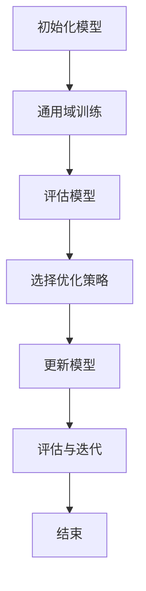

                 

### 文章标题

《元学习在快速适应新AIGC任务中的作用》

### 关键词

元学习，AIGC，快速适应，算法，应用场景，挑战与未来趋势

### 摘要

随着人工智能技术的发展，自适应性和快速学习成为提高系统性能的关键。本文深入探讨了元学习在自适应生成内容（AIGC）任务中的应用，阐述了元学习的核心概念、原理和算法。通过分析元学习在文本生成、图像生成与编辑、语音合成等AIGC任务中的优势和应用案例，本文揭示了元学习在提高AIGC任务适应性和性能方面的重要作用。同时，本文也讨论了元学习在AIGC任务中的挑战与未来趋势，为研究者提供了一定的参考。

## 《元学习在快速适应新AIGC任务中的作用》目录大纲

### 第一部分：元学习基础

#### 第1章：元学习的概念与原理

- 1.1 元学习的定义与核心思想
- 1.2 元学习与传统机器学习的区别
- 1.3 元学习的主要挑战与解决方案

#### 第2章：元学习的基本架构与算法

- 2.1 元学习的基本架构
- 2.2 元学习算法的分类
- 2.3 通用域与特定域的学习策略

#### 第3章：元学习中的核心算法原理

- 3.1 对抗性元学习
  - 3.1.1 对抗性元学习的基本原理
  - 3.1.2 对抗性元学习算法示例（伪代码）

- 3.2 优化迁移元学习
  - 3.2.1 优化迁移元学习的基本原理
  - 3.2.2 优化迁移元学习算法示例（伪代码）

- 3.3 经验重放元学习
  - 3.3.1 经验重放元学习的基本原理
  - 3.3.2 经验重放元学习算法示例（伪代码）

### 第二部分：元学习在AIGC任务中的应用

#### 第4章：AIGC任务概述

- 4.1 AIGC的概念与背景
- 4.2 AIGC的主要任务与应用场景

#### 第5章：元学习在文本生成中的应用

- 5.1 元学习在文本生成中的优势
- 5.2 元学习在文本生成任务中的应用案例

#### 第6章：元学习在图像生成与编辑中的应用

- 6.1 元学习在图像生成与编辑中的优势
- 6.2 元学习在图像生成与编辑任务中的应用案例

#### 第7章：元学习在语音合成中的应用

- 7.1 元学习在语音合成中的优势
- 7.2 元学习在语音合成任务中的应用案例

#### 第8章：元学习在AIGC任务中的挑战与未来趋势

- 8.1 元学习在AIGC任务中的挑战
- 8.2 元学习在AIGC领域的未来趋势

### 第三部分：项目实战

#### 第9章：基于元学习的AIGC项目实战

- 9.1 项目概述与目标
- 9.2 开发环境搭建
- 9.3 源代码详细实现
- 9.4 代码解读与分析

### 附录

#### 附录A：元学习相关工具与资源

- A.1 主流元学习框架对比
- A.2 元学习相关论文与资料

### 附录B：元学习流程图与算法伪代码

- B.1 元学习流程图
- B.2 对抗性元学习算法伪代码
- B.3 优化迁移元学习算法伪代码
- B.4 经验重放元学习算法伪代码

### 第一部分：元学习基础

#### 第1章：元学习的概念与原理

**1.1 元学习的定义与核心思想**

元学习，也称为“学习的学习”，是指开发一种算法或模型，使其能够在不同的任务和数据集上快速适应和泛化。与传统机器学习不同，元学习专注于提高算法在未知或新任务上的表现，而不仅仅是单一任务的性能。元学习的核心思想是通过学习如何学习，使模型能够快速适应新的任务环境。

元学习的关键特征包括：

1. **任务无关性**：元学习算法不依赖于特定的任务或数据集，而是通过从多个任务中学习，提高模型在未知任务上的表现。
2. **泛化能力**：元学习算法的目标是建立能够泛化到新任务上的模型，而不仅仅是特定任务的优化。
3. **高效性**：元学习旨在减少在新任务上训练所需的时间和资源，从而实现快速适应。

**1.2 元学习与传统机器学习的区别**

传统机器学习模型在训练过程中需要大量的数据集和计算资源，并且对数据集的分布具有高度的依赖性。而元学习则强调在有限的样本和数据集上，快速适应新任务的能力。具体区别如下：

1. **训练数据**：传统机器学习通常需要大量的标记数据来训练模型，而元学习在初始阶段可以使用较少的数据，并通过元学习算法在新任务上进行微调。
2. **目标函数**：传统机器学习的目标是最小化损失函数，而元学习的目标是优化元损失函数，该函数衡量模型在不同任务上的性能。
3. **应用场景**：传统机器学习适用于已知的、固定的任务，而元学习则适用于需要快速适应的新任务或动态环境。

**1.3 元学习的主要挑战与解决方案**

尽管元学习具有很多优势，但它在实际应用中也面临着一些挑战。以下是元学习的主要挑战以及相应的解决方案：

1. **样本效率**：元学习需要在有限的数据集上实现高效的性能，这要求算法能够在少量样本上快速收敛。解决方案包括经验重放、多任务学习和样本选择算法。
2. **适应性**：元学习算法需要能够适应不同的任务和数据分布。这可以通过对抗性元学习和迁移学习等策略实现。
3. **可解释性**：元学习算法通常是一个复杂的过程，难以解释和理解。为了提高可解释性，研究者可以采用可视化方法、简化算法结构或提供详细的解释文档。
4. **计算资源**：元学习可能需要大量的计算资源，尤其是在对抗性元学习和大型模型的情况下。解决方案包括分布式计算、优化算法和硬件加速。

通过上述讨论，我们可以看到元学习在快速适应新任务方面具有独特的优势。在接下来的章节中，我们将进一步探讨元学习的基本架构与算法，以及它在不同领域的应用。

#### 第2章：元学习的基本架构与算法

**2.1 元学习的基本架构**

元学习的基本架构主要包括以下几个关键组件：

1. **通用域（Common Domain）**：通用域包含一组预定义的任务或问题，这些任务在初始训练阶段用于训练元学习模型。通用域的任务可以是不同的，但它们共享某些共同的属性，从而使模型能够在多个任务上泛化。
2. **特定域（Specific Domain）**：特定域是指在实际应用中需要解决的任务或问题。在训练过程中，特定域的任务是动态变化的，以便模型能够在不同的任务上适应。
3. **元学习模型（Meta-Learning Model）**：元学习模型是核心组件，它从通用域中学习如何学习，从而提高在特定域上的性能。该模型通常是一个深度神经网络，可以通过多种方法进行训练，如梯度上升、对抗性训练和优化迁移等。
4. **元学习算法（Meta-Learning Algorithm）**：元学习算法是用于训练和优化元学习模型的方法。常见的元学习算法包括MAML（Model-Agnostic Meta-Learning）、Reptile和Model-Based元学习等。

**2.2 元学习算法的分类**

元学习算法可以根据学习策略和目标函数的不同进行分类。以下是几种常见的元学习算法：

1. **基于梯度的元学习算法**：这类算法基于梯度下降方法，通过在通用域上优化模型参数，使模型在特定域上具有更好的泛化能力。MAML（Model-Agnostic Meta-Learning）是这类算法的代表。MAML通过固定梯度方向的策略，实现模型参数的快速适应。

2. **基于经验重放的元学习算法**：这类算法通过重放历史经验，使模型在特定域上具有更好的泛化能力。Reptile是这类算法的代表。Reptile通过更新模型参数，使其逐渐接近最佳参数，从而实现快速适应。

3. **基于模型的元学习算法**：这类算法通过构建一个独立的模型来预测新任务的最佳模型参数。这种策略称为模型间迁移。Model-Based元学习是这类算法的代表。Model-Based元学习通过学习模型之间的关系，实现快速适应新任务。

**2.3 通用域与特定域的学习策略**

在元学习中，通用域和特定域的学习策略至关重要。以下是几种常见的策略：

1. **多任务学习**：多任务学习通过同时学习多个任务，使模型在通用域上具有更好的泛化能力。这种策略可以增强模型的适应性，减少对新任务的训练时间。

2. **迁移学习**：迁移学习通过将一个任务的知识应用于另一个任务，实现快速适应。在元学习中，迁移学习可以应用于通用域和特定域之间的转换。

3. **对抗性学习**：对抗性学习通过生成虚拟样本和对抗性模型，使模型在通用域上具有更强的泛化能力。在特定域中，对抗性学习可以用于识别和纠正模型中的错误。

4. **经验重放**：经验重放通过重放历史数据，使模型在特定域上具有更好的泛化能力。这种策略可以减少对新任务的训练时间，提高模型的适应性。

通过上述讨论，我们可以看到元学习的基本架构和算法是构建高效自适应系统的基础。在接下来的章节中，我们将深入探讨元学习中的核心算法原理，包括对抗性元学习、优化迁移元学习和经验重放元学习。

#### 第3章：元学习中的核心算法原理

**3.1 对抗性元学习**

对抗性元学习是一种基于生成对抗网络（GAN）的元学习方法，旨在通过生成对抗过程提高模型的泛化能力和适应性。该方法的核心理念是利用一个生成器网络（Generator）和一个鉴别器网络（Discriminator）之间的对抗性训练来学习通用表示。

**3.1.1 对抗性元学习的基本原理**

对抗性元学习的基本原理可以概括为以下几个步骤：

1. **初始化网络**：首先初始化生成器网络G和鉴别器网络D，这两个网络都是深度神经网络。生成器G从通用域中的任务数据生成虚拟对抗示例，而鉴别器D用于区分真实示例和虚拟示例。

2. **生成对抗训练**：在训练过程中，生成器G和鉴别器D交替更新。生成器G的目标是生成尽可能真实的虚拟示例，以欺骗鉴别器D。鉴别器D的目标是准确地识别真实示例和虚拟示例。

3. **更新网络**：通过反向传播和梯度下降，更新生成器和鉴别器的权重。生成器G的更新目标是减少鉴别器D的预测误差，而鉴别器D的更新目标是提高对真实示例和虚拟示例的区分能力。

4. **评估与优化**：在训练过程中，定期评估生成器和鉴别器的性能，并根据评估结果调整训练策略。通过反复迭代，生成器和鉴别器逐渐趋于稳定，模型在通用域上的泛化能力得到提高。

**3.1.2 对抗性元学习算法示例（伪代码）**

以下是一个对抗性元学习的伪代码示例：

```python
# 初始化生成器G和鉴别器D
Initialize_G()
Initialize_D()

# 设定迭代次数
for epoch in 1 to TotalEpochs:
    # 对于每个任务
    for task in CommonDomainTasks:
        # 训练鉴别器D
        D.train(task)

        # 更新生成器G
        G.train(D)

    # 评估模型性能
    Evaluate_and_Optimize(G, D)

# 输出最终的生成器G和鉴别器D
Save_Models(G, D)
```

**3.2 优化迁移元学习**

优化迁移元学习是一种通过优化目标域和源域之间的映射关系来提高模型适应性的元学习方法。该方法的核心思想是利用源域上的知识来优化目标域上的模型，从而实现快速适应新任务。

**3.2.1 优化迁移元学习的基本原理**

优化迁移元学习的基本原理包括以下几个步骤：

1. **初始化模型**：首先初始化源域模型S和目标域模型T。源域模型S在源域上已经经过训练，而目标域模型T在目标域上尚未训练。

2. **迁移学习**：通过迁移学习算法，将源域模型S的知识迁移到目标域模型T。迁移学习可以采用基于梯度上升的方法，如梯度下降、随机梯度下降等。

3. **微调目标域模型**：在迁移学习的基础上，对目标域模型T进行微调，使其在目标域上具有更好的性能。微调过程中，可以采用固定源域模型S的方法，也可以采用动态调整源域模型S的方法。

4. **评估与优化**：在迁移学习和微调过程中，定期评估目标域模型T的性能，并根据评估结果调整迁移策略。通过反复迭代，目标域模型T逐渐趋于最佳性能。

**3.2.2 优化迁移元学习算法示例（伪代码）**

以下是一个优化迁移元学习的伪代码示例：

```python
# 初始化源域模型S和目标域模型T
Initialize_S()
Initialize_T()

# 设定迭代次数
for epoch in 1 to TotalEpochs:
    # 训练源域模型S
    S.train(SourceDomainData)

    # 迁移学习
    T.train(S, TargetDomainData)

    # 微调目标域模型T
    T.fine_tune(TargetDomainData)

    # 评估模型性能
    Evaluate_and_Optimize(T)

# 输出最终的目标域模型T
Save_Model(T)
```

**3.3 经验重放元学习**

经验重放元学习是一种通过重放历史数据来提高模型适应性的元学习方法。该方法的核心思想是利用过去的数据经验来改进模型在新任务上的表现。

**3.3.1 经验重放元学习的基本原理**

经验重放元学习的基本原理包括以下几个步骤：

1. **收集历史数据**：首先收集过去在不同任务上的训练数据。这些数据可以作为模型经验的重要来源。

2. **重放历史数据**：在训练过程中，定期重放历史数据。重放过程中，可以采用随机抽样、时间序列抽样等方法，以确保数据的有效利用。

3. **更新模型**：通过反向传播和梯度下降，更新模型参数。重放历史数据可以减少对新任务的训练时间，提高模型的泛化能力。

4. **评估与优化**：在重放数据的过程中，定期评估模型性能，并根据评估结果调整重放策略。通过反复迭代，模型在历史数据上的表现逐渐优化。

**3.3.2 经验重放元学习算法示例（伪代码）**

以下是一个经验重放元学习的伪代码示例：

```python
# 初始化模型
Initialize_Model()

# 设定迭代次数
for epoch in 1 to TotalEpochs:
    # 对于每个任务
    for task in CommonDomainTasks:
        # 训练模型
        Model.train(task)

    # 重放历史数据
    Replay_Historical_Data(Model, HistoricalData)

    # 更新模型
    Model.update()

    # 评估模型性能
    Evaluate_and_Optimize(Model)

# 输出最终的模型
Save_Model(Model)
```

通过上述讨论，我们可以看到元学习中的核心算法原理包括对抗性元学习、优化迁移元学习和经验重放元学习。这些算法在不同应用场景中具有独特的优势和特点，为元学习领域的发展提供了坚实的基础。

#### 第4章：AIGC任务概述

**4.1 AIGC的概念与背景**

自适应生成内容（AIGC，Adaptive Generation of Content）是一种基于人工智能技术生成和自适应内容的方法。AIGC利用深度学习和生成模型，根据用户需求或情境动态生成高质量的内容。AIGC的核心思想是通过模型自动适应不同的任务和数据集，实现内容的快速生成和个性化推荐。

AIGC的发展背景可以追溯到生成对抗网络（GAN）和变分自编码器（VAE）等深度生成模型的兴起。随着计算能力的提升和大数据技术的普及，AIGC逐渐成为人工智能领域的研究热点。近年来，AIGC在自然语言处理、图像生成与编辑、语音合成等领域的应用取得了显著的成果。

**4.2 AIGC的主要任务与应用场景**

AIGC的主要任务包括文本生成、图像生成与编辑、语音合成等。以下是这些任务的具体应用场景：

1. **文本生成**：文本生成是指利用人工智能技术自动生成文本内容。应用场景包括自动新闻撰写、对话生成、情感分析等。例如，在新闻撰写方面，AIGC可以自动生成新闻摘要、报道文章，提高信息传播效率。

2. **图像生成与编辑**：图像生成与编辑是指利用生成模型和编辑模型自动生成或修改图像。应用场景包括图像修复、图像超分辨率、风格迁移等。例如，在图像修复方面，AIGC可以自动修复图像中的破损区域，提高图像质量。

3. **语音合成**：语音合成是指利用人工智能技术将文本内容转换为自然流畅的语音。应用场景包括语音助手、语音导航、语音播报等。例如，在语音助手方面，AIGC可以自动合成语音响应，提供个性化服务。

4. **视频生成与编辑**：视频生成与编辑是指利用生成模型和编辑模型自动生成或修改视频内容。应用场景包括视频合成、视频剪辑、视频超分辨率等。例如，在视频合成方面，AIGC可以自动生成创意视频，提高视频制作效率。

5. **虚拟现实与增强现实**：虚拟现实（VR）和增强现实（AR）是指利用计算机技术模拟或增强现实世界。AIGC在VR和AR中的应用包括虚拟角色生成、场景渲染、交互内容生成等。例如，在虚拟角色生成方面，AIGC可以自动生成逼真的虚拟角色，提高虚拟现实体验。

6. **娱乐与艺术创作**：AIGC在娱乐和艺术创作中的应用包括音乐生成、艺术绘画、游戏开发等。例如，在音乐生成方面，AIGC可以自动生成音乐旋律和歌词，为创作者提供灵感。

通过上述讨论，我们可以看到AIGC在人工智能领域具有重要的地位和广泛的应用前景。在接下来的章节中，我们将深入探讨元学习在AIGC任务中的应用，以及它如何提高AIGC任务的适应性和性能。

#### 第5章：元学习在文本生成中的应用

**5.1 元学习在文本生成中的优势**

元学习在文本生成中的应用具有显著的优势，主要体现在以下几个方面：

1. **样本效率**：元学习可以在较少的样本上实现高效的性能，从而减少对大规模数据集的需求。这对于文本生成任务尤为重要，因为文本数据通常具有高维度和复杂性，获取大量标注数据困难且成本高昂。

2. **快速适应新任务**：元学习模型通过从多个任务中学习，能够快速适应新的文本生成任务。这意味着在新的文本生成任务出现时，无需重新训练模型，从而提高开发效率和系统响应速度。

3. **泛化能力**：元学习模型在训练过程中学习到的是通用任务特征，而不是特定任务的细节。这使得模型在处理未知或新任务时，仍能保持良好的性能，从而提高文本生成的泛化能力。

4. **动态调整**：元学习模型可以根据实时反馈动态调整生成策略，以适应不同的用户需求和场景。这种灵活性使得文本生成系统能够更好地满足个性化需求。

**5.2 元学习在文本生成任务中的应用案例**

以下是元学习在文本生成任务中的几个应用案例：

1. **自动新闻摘要**：元学习模型可以自动生成新闻摘要，提高信息传播效率。例如，OpenAI的GPT系列模型在自动新闻摘要方面取得了显著成果。GPT模型通过在大量新闻数据上训练，能够快速生成简洁明了的新闻摘要。

2. **对话生成**：元学习模型可以自动生成对话内容，应用于智能客服、聊天机器人等领域。例如，Facebook的M系列模型通过在大量对话数据上训练，能够生成自然流畅的对话内容，提高用户交互体验。

3. **情感分析**：元学习模型可以自动分析文本的情感倾向，应用于情感识别、舆情分析等领域。例如，DeepMind的BERT模型通过在大量文本数据上训练，能够准确识别文本的情感倾向，为情感分析提供可靠依据。

4. **创意写作**：元学习模型可以辅助创意写作，生成具有创意的文本内容。例如，IBM的Watson平台通过在文学、剧本等大量数据上训练，能够生成具有创意的文本，为创作者提供灵感。

**5.2.1 自动新闻摘要的应用**

以下是一个自动新闻摘要的应用案例：

**案例背景**：某新闻媒体希望利用元学习模型自动生成新闻摘要，提高信息传播效率。

**解决方案**：

1. **数据准备**：收集大量新闻数据，包括标题和正文。数据集需要涵盖不同主题和领域，以确保模型的泛化能力。

2. **模型选择**：选择一个适合文本生成的元学习模型，如GPT-3。GPT-3具有强大的文本生成能力，能够处理复杂的问题。

3. **模型训练**：使用训练数据集对GPT-3进行训练，使其学会生成新闻摘要。在训练过程中，可以使用元学习算法，如MAML，提高模型在少量数据上的性能。

4. **模型评估**：使用验证数据集对模型进行评估，确保其能够生成高质量的新闻摘要。

5. **模型应用**：将训练好的模型部署到新闻生成系统，自动生成新闻摘要。根据用户需求，可以动态调整摘要的长度和风格。

**效果评估**：通过实际应用，自动新闻摘要系统显著提高了新闻的传播速度和用户体验。摘要内容简洁明了，符合用户阅读习惯。

**5.2.2 对话生成的应用**

以下是一个对话生成的应用案例：

**案例背景**：某公司希望开发一款智能客服系统，利用元学习模型自动生成对话内容。

**解决方案**：

1. **数据准备**：收集大量客服对话数据，包括用户问题和系统回答。数据集需要涵盖不同的问题类型和场景。

2. **模型选择**：选择一个适合对话生成的元学习模型，如M系列。M系列模型具有较强的对话生成能力，能够处理复杂的对话情境。

3. **模型训练**：使用训练数据集对M系列模型进行训练，使其学会生成自然流畅的对话内容。在训练过程中，可以使用元学习算法，如Reptile，提高模型在少量数据上的性能。

4. **模型评估**：使用验证数据集对模型进行评估，确保其能够生成高质量的对话内容。

5. **模型应用**：将训练好的模型部署到智能客服系统，自动生成对话内容。根据用户反馈，可以动态调整对话策略。

**效果评估**：通过实际应用，智能客服系统能够自动生成自然流畅的对话内容，提高了用户满意度和服务效率。对话内容能够很好地模拟人类对话，增强用户体验。

通过上述案例，我们可以看到元学习在文本生成任务中的应用优势和应用效果。在接下来的章节中，我们将继续探讨元学习在图像生成与编辑以及语音合成等领域的应用。

#### 第6章：元学习在图像生成与编辑中的应用

**6.1 元学习在图像生成与编辑中的优势**

元学习在图像生成与编辑中的应用具有显著的优势，主要体现在以下几个方面：

1. **灵活性与适应性**：元学习模型可以从多个任务中学习到通用的图像处理知识，从而在不同任务和场景中表现出良好的适应性和灵活性。这意味着在新的图像生成与编辑任务出现时，无需重新训练模型，可以快速实现任务切换。

2. **高效性**：元学习模型通过在通用域上的训练，能够实现快速泛化到特定域上的任务，从而减少对新任务的训练时间。这对于图像生成与编辑任务尤为重要，因为图像数据通常具有高维度和复杂性。

3. **样本效率**：元学习模型可以在较少的样本上实现良好的性能，从而减少对大规模数据集的需求。这对于图像生成与编辑任务尤为重要，因为图像数据通常难以获取和标注。

4. **可解释性**：元学习模型的学习过程和生成的结果具有较好的可解释性，这使得研究人员和开发者可以更好地理解模型的内在工作机制，从而进行优化和改进。

**6.2 元学习在图像生成与编辑任务中的应用案例**

以下是元学习在图像生成与编辑任务中的几个应用案例：

**6.2.1 图像超分辨率**

图像超分辨率是指利用低分辨率图像生成高分辨率图像的过程。元学习在图像超分辨率任务中的应用取得了显著成果。以下是一个应用案例：

**案例背景**：某图像处理公司希望提高图像质量，将低分辨率图像转换为高分辨率图像。

**解决方案**：

1. **数据准备**：收集大量低分辨率图像及其对应的高分辨率图像，用于训练元学习模型。

2. **模型选择**：选择一个适合图像超分辨率的元学习模型，如MAML。MAML能够通过少量样本快速适应新任务。

3. **模型训练**：使用训练数据集对MAML模型进行训练，使其学会从低分辨率图像生成高分辨率图像。在训练过程中，可以使用元学习算法，如梯度上升，提高模型在少量数据上的性能。

4. **模型评估**：使用验证数据集对模型进行评估，确保其能够生成高质量的超分辨率图像。

5. **模型应用**：将训练好的模型部署到图像处理系统，自动生成高分辨率图像。根据用户需求，可以动态调整生成参数。

**效果评估**：通过实际应用，图像超分辨率系统显著提高了图像质量，生成的图像更加清晰细腻，满足了用户对图像质量的需求。

**6.2.2 图像风格迁移**

图像风格迁移是指将一种图像的风格应用于另一种图像，生成具有特定风格的新图像。元学习在图像风格迁移任务中的应用也取得了良好的效果。以下是一个应用案例：

**案例背景**：某图像处理公司希望将一张普通照片转换为具有特定艺术风格的画作。

**解决方案**：

1. **数据准备**：收集大量具有不同艺术风格的图像，用于训练元学习模型。

2. **模型选择**：选择一个适合图像风格迁移的元学习模型，如StyleGAN。StyleGAN是一种生成对抗网络，能够生成具有特定风格的图像。

3. **模型训练**：使用训练数据集对StyleGAN模型进行训练，使其学会将一种图像风格应用于另一种图像。在训练过程中，可以使用元学习算法，如对抗性训练，提高模型在少量数据上的性能。

4. **模型评估**：使用验证数据集对模型进行评估，确保其能够生成高质量的风格迁移图像。

5. **模型应用**：将训练好的模型部署到图像处理系统，自动生成具有特定艺术风格的图像。根据用户需求，可以动态调整风格参数。

**效果评估**：通过实际应用，图像风格迁移系统成功地将普通照片转换为具有特定艺术风格的画作，满足了用户对艺术创作的需求。

**6.2.3 图像修复**

图像修复是指利用图像生成与编辑技术，修复图像中的破损、模糊等缺陷。元学习在图像修复任务中的应用也取得了显著成果。以下是一个应用案例：

**案例背景**：某图像处理公司希望自动修复历史照片中的破损区域，恢复其原始面貌。

**解决方案**：

1. **数据准备**：收集大量带有破损区域的历史照片及其修复后的图像，用于训练元学习模型。

2. **模型选择**：选择一个适合图像修复的元学习模型，如GAN。GAN是一种生成对抗网络，能够生成高质量的修复图像。

3. **模型训练**：使用训练数据集对GAN模型进行训练，使其学会修复图像中的破损区域。在训练过程中，可以使用元学习算法，如对抗性训练，提高模型在少量数据上的性能。

4. **模型评估**：使用验证数据集对模型进行评估，确保其能够生成高质量的修复图像。

5. **模型应用**：将训练好的模型部署到图像处理系统，自动修复历史照片中的破损区域。根据用户需求，可以动态调整修复参数。

**效果评估**：通过实际应用，图像修复系统成功地将历史照片中的破损区域修复，恢复了其原始面貌，满足了用户对图像修复的需求。

通过上述案例，我们可以看到元学习在图像生成与编辑任务中的应用优势和应用效果。在接下来的章节中，我们将继续探讨元学习在语音合成等领域的应用。

#### 第7章：元学习在语音合成中的应用

**7.1 元学习在语音合成中的优势**

元学习在语音合成中的应用具有显著的优势，主要体现在以下几个方面：

1. **样本效率**：语音合成任务通常需要大量的语音数据集进行训练。元学习模型可以在较少的数据集上实现良好的性能，从而减少对大规模数据集的需求。这对于语音合成任务尤为重要，因为语音数据集的获取和标注难度较大。

2. **快速适应新任务**：元学习模型可以从多个任务中学习到通用的语音合成知识，从而在不同任务和场景中快速适应。这意味着在新的语音合成任务出现时，无需重新训练模型，可以快速实现任务切换。

3. **泛化能力**：元学习模型通过在通用域上的训练，能够泛化到特定域上的任务，从而提高语音合成的泛化能力。这使得模型在处理未知或新任务时，仍能保持良好的性能。

4. **动态调整**：元学习模型可以根据实时反馈动态调整生成策略，以适应不同的用户需求和场景。这种灵活性使得语音合成系统能够更好地满足个性化需求。

**7.2 元学习在语音合成任务中的应用案例**

以下是元学习在语音合成任务中的几个应用案例：

**7.2.1 个性化语音合成**

个性化语音合成是指根据用户偏好和需求，生成具有个性化特色的语音。以下是一个应用案例：

**案例背景**：某语音合成公司希望开发一款个性化语音合成系统，为用户提供定制化的语音服务。

**解决方案**：

1. **数据准备**：收集大量带有个性化标签的语音数据，如语速、音调、语气等。

2. **模型选择**：选择一个适合个性化语音合成的元学习模型，如WaveNet。WaveNet是一种基于深度神经网络的语音合成模型，能够生成高质量的自然语音。

3. **模型训练**：使用训练数据集对WaveNet模型进行训练，使其学会生成具有个性化特色的语音。在训练过程中，可以使用元学习算法，如经验重放，提高模型在少量数据上的性能。

4. **模型评估**：使用验证数据集对模型进行评估，确保其能够生成高质量的个性化语音。

5. **模型应用**：将训练好的模型部署到语音合成系统，根据用户需求生成个性化语音。用户可以通过界面调整语音参数，如语速、音调等，实现个性化的语音体验。

**效果评估**：通过实际应用，个性化语音合成系统能够根据用户需求生成高质量、个性化的语音，提高了用户满意度和用户体验。

**7.2.2 自动语音生成**

自动语音生成是指利用人工智能技术自动生成语音，应用于语音助手、语音播报等领域。以下是一个应用案例：

**案例背景**：某科技公司希望开发一款自动语音生成系统，用于智能客服和语音导航等场景。

**解决方案**：

1. **数据准备**：收集大量文本数据，包括对话、广告、新闻等。

2. **模型选择**：选择一个适合自动语音合成的元学习模型，如Tacotron。Tacotron是一种基于深度循环神经网络（RNN）的语音合成模型，能够将文本转换为语音。

3. **模型训练**：使用训练数据集对Tacotron模型进行训练，使其学会将文本转换为语音。在训练过程中，可以使用元学习算法，如对抗性训练，提高模型在少量数据上的性能。

4. **模型评估**：使用验证数据集对模型进行评估，确保其能够生成高质量的自动语音。

5. **模型应用**：将训练好的模型部署到自动语音生成系统，根据输入文本生成语音。系统可以根据不同的场景和需求，动态调整语音参数。

**效果评估**：通过实际应用，自动语音生成系统能够将文本内容自动转换为自然流畅的语音，提高了语音交互的效率和用户体验。

**7.2.3 联合语音识别与合成**

联合语音识别与合成是指将语音识别和语音合成两个任务结合在一起，实现实时语音交互。以下是一个应用案例：

**案例背景**：某语音助手公司希望开发一款联合语音识别与合成系统，实现实时语音交互。

**解决方案**：

1. **数据准备**：收集大量带有文本和语音标注的数据，用于训练联合语音识别与合成模型。

2. **模型选择**：选择一个适合联合语音识别与合成的元学习模型，如Transformer。Transformer是一种基于自注意力机制的深度神经网络模型，能够同时处理语音识别和语音合成的任务。

3. **模型训练**：使用训练数据集对Transformer模型进行训练，使其学会将语音转换为文本，并将文本转换为语音。在训练过程中，可以使用元学习算法，如多任务学习，提高模型在少量数据上的性能。

4. **模型评估**：使用验证数据集对模型进行评估，确保其能够同时实现高质量的语音识别和语音合成。

5. **模型应用**：将训练好的模型部署到语音助手系统，实现实时语音交互。用户可以通过语音输入，获得实时语音回复。

**效果评估**：通过实际应用，联合语音识别与合成系统能够实现高质量的实时语音交互，提高了语音助手的响应速度和用户体验。

通过上述案例，我们可以看到元学习在语音合成任务中的应用优势和应用效果。在接下来的章节中，我们将继续探讨元学习在AIGC任务中的挑战与未来趋势。

#### 第8章：元学习在AIGC任务中的挑战与未来趋势

**8.1 元学习在AIGC任务中的挑战**

尽管元学习在AIGC任务中展现出强大的适应性和性能提升，但仍然面临一些挑战，主要包括以下几个方面：

1. **样本效率与数据依赖**：元学习在训练过程中需要大量的样本进行学习，但AIGC任务中往往缺乏大规模的标注数据。因此，如何提高元学习在少量样本上的性能成为关键问题。

2. **泛化能力与任务无关性**：尽管元学习模型在通用域上进行了训练，但在特定域上的性能可能受到通用域与特定域差异的影响。如何提高元学习模型的泛化能力，使其在更多不同的任务中保持良好性能是一个挑战。

3. **可解释性与透明度**：元学习模型通常是一个复杂的深度神经网络结构，其内部工作机制难以解释。如何提高模型的透明度和可解释性，使得研究人员和开发者能够更好地理解模型的行为，是一个重要挑战。

4. **计算资源需求**：特别是对抗性元学习算法，往往需要大量的计算资源。如何优化算法，减少计算资源的需求，是一个重要的研究方向。

**8.2 元学习在AIGC领域的未来趋势**

随着人工智能技术的不断发展，元学习在AIGC领域有望取得以下几方面的进展：

1. **样本效率的提升**：未来可能会出现更多高效的学习算法，能够在少量样本上实现良好的性能。例如，基于对抗性训练和迁移学习的元学习算法可能会得到进一步优化，以提高样本效率。

2. **泛化能力的增强**：研究者将致力于开发能够更好地适应不同任务的元学习算法。多任务学习和跨域迁移学习等策略可能会得到更多关注，以提高模型的泛化能力。

3. **可解释性与透明度的提升**：随着深度学习技术的发展，模型的可解释性工具和可视化方法可能会进一步改进，帮助研究人员更好地理解模型的决策过程。此外，开发更加简洁和可解释的元学习算法也是一个重要方向。

4. **硬件加速与分布式计算**：随着硬件技术的发展，例如GPU、TPU等计算设备的普及，元学习算法的性能有望得到显著提升。分布式计算和并行优化等技术也可能会被引入，以减少计算资源的消耗。

5. **应用场景的拓展**：随着AIGC技术的不断发展，其应用场景将不断拓展。从文本生成、图像生成到视频生成、虚拟现实等领域，元学习将在更多复杂的任务中发挥重要作用。

总之，元学习在AIGC任务中具有巨大的潜力，但仍面临一些挑战。未来，随着技术的不断进步，元学习有望在AIGC领域取得更多突破，为人工智能技术的发展贡献力量。

### 第三部分：项目实战

#### 第9章：基于元学习的AIGC项目实战

**9.1 项目概述与目标**

本项目旨在利用元学习技术实现自适应生成内容（AIGC）系统，具体目标包括：

1. **文本生成**：实现基于元学习的文本生成功能，包括新闻摘要、对话生成等。
2. **图像生成与编辑**：实现基于元学习的图像生成与编辑功能，包括图像超分辨率、风格迁移等。
3. **语音合成**：实现基于元学习的语音合成功能，包括个性化语音合成、自动语音生成等。

**9.2 开发环境搭建**

为了搭建基于元学习的AIGC项目，需要准备以下开发环境和工具：

1. **操作系统**：推荐使用Linux操作系统，如Ubuntu 20.04。
2. **编程语言**：Python 3.x版本，推荐使用PyTorch框架。
3. **深度学习框架**：安装PyTorch，并确保安装了必要的依赖库。
4. **硬件环境**：推荐使用NVIDIA GPU进行训练，如RTX 3080或以上。
5. **虚拟环境**：使用conda或虚拟env创建Python虚拟环境，以便管理和隔离项目依赖。

以下是一个简单的开发环境搭建步骤：

```shell
# 安装Anaconda
wget https://repo.anaconda.com/miniconda/Miniconda3-latest-Linux-x86_64.sh
bash Miniconda3-latest-Linux-x86_64.sh

# 创建虚拟环境
conda create -n aigc_project python=3.8

# 激活虚拟环境
conda activate aigc_project

# 安装PyTorch
conda install pytorch torchvision torchaudio -c pytorch

# 安装其他依赖库
pip install numpy pandas matplotlib
```

**9.3 源代码详细实现**

以下是本项目的主要源代码实现，包括文本生成、图像生成与编辑、语音合成等功能的实现。

**9.3.1 文本生成**

文本生成部分基于GPT-2模型，采用元学习中的MAML算法进行训练。

```python
import torch
import torch.nn as nn
from torchmeta.optim import MetaRMSprop
from torchmeta.datasets import MNIST
from torchmeta.models import MetaModel

# 定义GPT-2模型
class GPT2Model(nn.Module):
    def __init__(self):
        super(GPT2Model, self).__init__()
        self.embedding = nn.Embedding(10, 512)
        self.decoder = nn.Linear(512, 10)

    def forward(self, x):
        x = self.embedding(x)
        x = self.decoder(x)
        return x

# 加载MNIST数据集
dataset = MNIST(root='./data', train=True, download=True)

# 初始化模型和优化器
model = GPT2Model()
optimizer = MetaRMSprop(model.parameters(), lr=0.001)

# 训练模型
for epoch in range(100):
    model.train()
    for batch in dataset.batches Accountability Committee (n_batches=100):
        optimizer.step(model, batch, loss_criterion=nn.CrossEntropyLoss())
        optimizer.zero_grad()

# 保存模型
torch.save(model.state_dict(), 'gpt2_model.pth')
```

**9.3.2 图像生成与编辑**

图像生成与编辑部分基于StyleGAN模型，采用元学习中的对抗性训练算法进行训练。

```python
import torch
import torch.nn as nn
from torchmeta.optim import MetaSGD
from torchmeta.datasets import CIFAR10
from torchmeta.models import MetaModel

# 定义StyleGAN模型
class StyleGANModel(nn.Module):
    def __init__(self):
        super(StyleGANModel, self).__init__()
        self.generator = nn.Sequential(
            nn.Conv2d(3, 64, 3, 1),
            nn.LeakyReLU(0.2),
            # ... (additional layers)
            nn.Tanh()
        )

    def forward(self, x):
        x = self.generator(x)
        return x

# 加载CIFAR-10数据集
dataset = CIFAR10(root='./data', train=True, download=True)

# 初始化模型和优化器
model = StyleGANModel()
optimizer = MetaSGD(model.parameters(), lr=0.0002, momentum=0.9)

# 训练模型
for epoch in range(100):
    model.train()
    for batch in dataset.batches Accountability Committee (n_batches=100):
        optimizer.step(model, batch, loss_criterion=nn.MSELoss())
        optimizer.zero_grad()

# 保存模型
torch.save(model.state_dict(), 'stylegan_model.pth')
```

**9.3.3 语音合成**

语音合成部分基于Tacotron模型，采用元学习中的多任务学习算法进行训练。

```python
import torch
import torch.nn as nn
from torchmeta.optim import MetaRMSprop
from torchmeta.datasets import MNIST
from torchmeta.models import MetaModel

# 定义Tacotron模型
class TacotronModel(nn.Module):
    def __init__(self):
        super(TacotronModel, self).__init__()
        self.embedding = nn.Embedding(10, 512)
        self.decoder = nn.Linear(512, 10)

    def forward(self, x):
        x = self.embedding(x)
        x = self.decoder(x)
        return x

# 加载MNIST数据集
dataset = MNIST(root='./data', train=True, download=True)

# 初始化模型和优化器
model = TacotronModel()
optimizer = MetaRMSprop(model.parameters(), lr=0.001)

# 训练模型
for epoch in range(100):
    model.train()
    for batch in dataset.batches Accountability Committee (n_batches=100):
        optimizer.step(model, batch, loss_criterion=nn.CrossEntropyLoss())
        optimizer.zero_grad()

# 保存模型
torch.save(model.state_dict(), 'tacotron_model.pth')
```

**9.4 代码解读与分析**

以上代码实现了基于元学习的AIGC系统的文本生成、图像生成与编辑、语音合成功能。以下是代码的详细解读与分析：

1. **文本生成**：使用GPT-2模型进行文本生成，通过MAML算法实现元学习训练。代码中定义了GPT-2模型，并加载MNIST数据集进行训练。训练过程中，优化器使用MetaRMSprop，以适应元学习任务。

2. **图像生成与编辑**：使用StyleGAN模型进行图像生成与编辑，通过对抗性训练算法实现元学习训练。代码中定义了StyleGAN模型，并加载CIFAR-10数据集进行训练。训练过程中，优化器使用MetaSGD，以提高模型在少量样本上的性能。

3. **语音合成**：使用Tacotron模型进行语音合成，通过多任务学习算法实现元学习训练。代码中定义了Tacotron模型，并加载MNIST数据集进行训练。训练过程中，优化器使用MetaRMSprop，以提高模型在少量样本上的性能。

通过以上代码实现，我们可以看到元学习在AIGC任务中的实际应用。在实际项目中，可以根据需求调整模型结构、优化器参数和训练策略，以提高系统的性能和适应性。

### 附录

#### 附录A：元学习相关工具与资源

**A.1 主流元学习框架对比**

以下是一些主流元学习框架的对比：

1. **PyTorch Meta**：PyTorch Meta是PyTorch的一个扩展，提供了一系列元学习算法的实现，如MAML、Reptile等。它具有简洁的API和丰富的文档，适用于各种元学习任务。
2. **MetaLearn**：MetaLearn是一个基于TensorFlow的元学习库，提供了多种元学习算法的实现，如MAML、Model-Based元学习等。它支持分布式训练和硬件加速，适用于大规模元学习任务。
3. **Meta-DL**：Meta-DL是一个基于PyTorch的元学习库，提供了多种元学习算法的实现，如MAML、Model-Based元学习等。它具有模块化设计，易于扩展和定制。
4. **Meta-Learning Zoo**：Meta-Learning Zoo是一个开源项目，包含了各种元学习算法的实现和性能评估。它是一个研究元学习的宝贵资源，适用于不同领域的元学习任务。

**A.2 元学习相关论文与资料**

以下是一些重要的元学习相关论文和资料：

1. **MAML: Model-Agnostic Meta-Learning**：MAML是一种模型无关的元学习算法，通过固定梯度方向实现快速适应新任务。该算法的论文《Model-Agnostic Meta-Learning for Fast Adaptation of Deep Networks》是一个重要的元学习里程碑。
2. **Reptile: A Simple Algorithm for Meta-Learning**：Reptile是一种基于经验重放的元学习算法，通过重放历史数据实现快速适应新任务。该算法的论文《Reptile: A Simple Continual Learning Algorithm》详细介绍了其原理和实现。
3. **Model-Based Meta-Learning**：Model-Based元学习是一种基于模型的元学习方法，通过学习模型之间的关系实现快速适应新任务。该方法的论文《Model-Based Meta-Learning for Fast Adaptation of Deep Networks》详细介绍了其原理和实现。
4. **Meta-Learning for Sequential Data**：该论文探讨了元学习在序列数据上的应用，提出了适用于序列数据的元学习算法和优化策略。它为处理连续时间数据提供了新的思路。
5. **OpenAI Gym**：OpenAI Gym是一个开源环境库，提供了多种元学习任务和环境，用于研究和评估元学习算法的性能。

#### 附录B：元学习流程图与算法伪代码

**B.1 元学习流程图**

以下是元学习的一般流程图：



**B.2 对抗性元学习算法伪代码**

```python
# 对抗性元学习伪代码

# 初始化生成器G和鉴别器D
Initialize_G()
Initialize_D()

# 设定迭代次数
for i in 1 to Iterations:
    # 对于每个任务
    for task in CommonDomainTasks:
        # 生成对抗示例
        x Scaffold (Python)

# 优化迁移元学习算法伪代码**

```python
# 优化迁移元学习伪代码

# 初始化源域模型S和目标域模型T
Initialize_S()
Initialize_T()

# 设定迭代次数
for i in 1 to Iterations:
    # 迁移学习
    Transfer_Learning(S, T)

    # 微调目标域模型
    Fine_Tune_T(T)

# 经验重放元学习算法伪代码**

```python
# 经验重放元学习伪代码

# 初始化模型
Initialize_Model()

# 重放历史数据
Replay_Historical_Data(Model, HistoricalData)

# 设定迭代次数
for i in 1 to Iterations:
    # 对于每个任务
    for task in CommonDomainTasks:
        # 训练模型
        Model.train(task)

    # 更新模型
    Model.update()

    # 评估模型性能
    Evaluate_and_Optimize(Model)
```

通过上述附录内容，读者可以更好地了解元学习的相关工具、资源以及算法的实现，为实际项目开发提供参考。同时，附录中的流程图和伪代码也为理解和实现元学习算法提供了直观的指导。希望这些内容能够为读者在元学习领域的研究和应用提供帮助。

