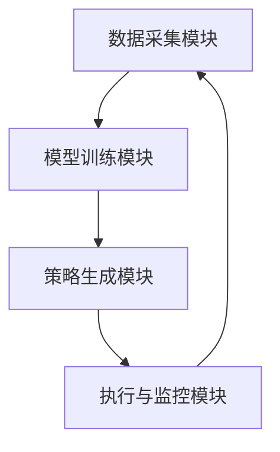
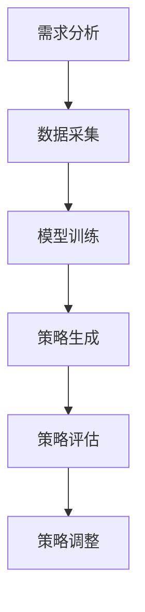
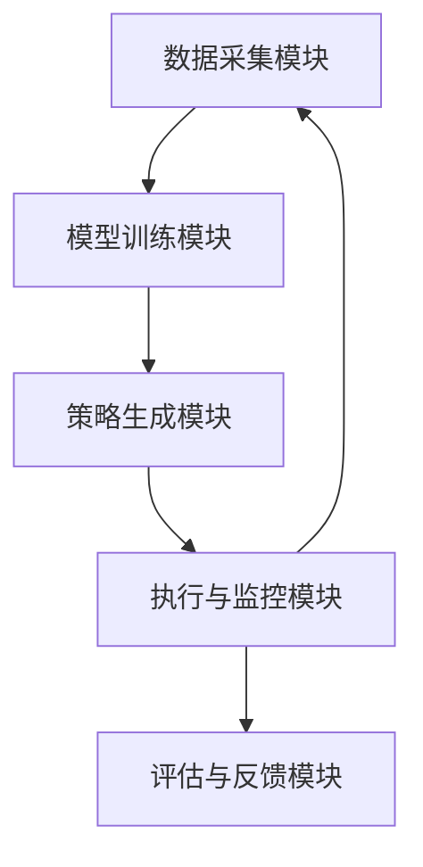
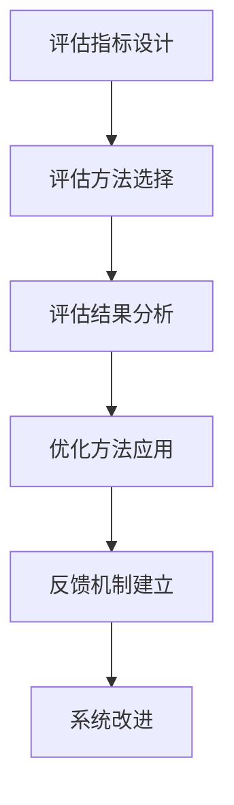

                 

# 文章标题：元控制器在评测策略自适应中的应用

## 关键词：元控制器，评测策略，自适应，架构设计，实现技术，案例分析

## 摘要

本文深入探讨了元控制器在评测策略自适应中的应用。首先，我们对元控制器的基本概念、作用和发展历程进行了详细介绍，接着阐述了评测策略自适应的定义、重要性和面临的挑战。随后，文章重点分析了元控制器的架构与设计，详细介绍了其基本架构、核心组件和实现技术。在此基础上，我们探讨了元控制器在自适应评测策略中的应用，包括设计、评估和优化。为了更好地说明元控制器的实际应用效果，本文还通过一个案例分析，展示了元控制器在特定场景中的成功应用。最后，我们对元控制器在评测策略自适应中的未来发展方向进行了展望，并提供了相关资源、术语表和代码示例，以帮助读者深入理解元控制器及其应用。

## 《元控制器在评测策略自适应中的应用》目录大纲

### 第一部分：引言与背景

#### 第1章：元控制器的概念与重要性

1.1 元控制器的定义

1.2 元控制器的作用

1.3 元控制器的发展历程

#### 第2章：评测策略自适应概述

2.1 评测策略的定义

2.2 自适应评测策略的重要性

2.3 自适应评测策略的挑战

### 第二部分：元控制器在评测策略自适应中的应用

#### 第3章：元控制器的架构与设计

3.1 元控制器的基本架构

3.2 元控制器的核心组件

3.3 元控制器的实现技术

#### 第4章：元控制器在评测策略自适应中的应用

4.1 自适应评测策略的设计

4.2 元控制器在自适应评测策略中的应用

4.3 自适应评测策略的评估与优化

#### 第5章：案例分析

5.1 案例背景

5.2 元控制器在案例中的应用

5.3 案例结果与分析

#### 第6章：元控制器在评测策略自适应中的未来发展方向

6.1 当前存在的问题

6.2 未来研究方向

6.3 潜在应用场景

### 第三部分：技术实现与实战

#### 第7章：元控制器的技术实现

7.1 元控制器的编程模型

7.2 元控制器的主要算法

7.3 实现元控制器的基本步骤

#### 第8章：实战案例解析

8.1 实战案例背景

8.2 案例分析与解决方案

8.3 源代码解读

#### 第9章：开发环境搭建与调试

9.1 开发环境准备

9.2 调试工具与技巧

9.3 常见问题的解决

#### 第10章：总结与展望

10.1 本书主要内容的回顾

10.2 元控制器在评测策略自适应中的应用前景

10.3 未来的发展方向

### 附录

#### 附录A：元控制器相关资源

A.1 主流元控制器框架对比

A.2 元控制器开发工具与资源

A.3 元控制器相关论文与资料

#### 附录B：术语表

B.1 术语解释

B.2 相关概念联系与区分

#### 附录C：代码示例

C.1 示例代码1：元控制器的实现

C.2 示例代码2：自适应评测策略的案例应用

## 第一部分：引言与背景

### 第1章：元控制器的概念与重要性

#### 1.1 元控制器的定义

元控制器（Meta-Controller）是一种高级的编程概念，主要用于控制和协调系统的各个组件。它通过定义一组规则和策略，来自动地管理和优化系统的运行过程。在计算机科学和人工智能领域，元控制器被广泛应用于系统监控、自动化管理、优化决策等方面。

元控制器的主要特点包括：

1. **自适应性**：元控制器能够根据系统的当前状态和环境条件，自动调整其行为和策略。
2. **智能性**：元控制器通常基于机器学习和人工智能技术，能够学习和优化其控制策略。
3. **高效性**：元控制器通过自动化和优化，提高了系统的运行效率和性能。

#### 1.2 元控制器的作用

元控制器在系统管理和优化方面发挥着重要作用，主要表现在以下几个方面：

1. **自动化管理**：元控制器能够自动化地执行复杂的系统任务，减轻人工干预的需求。
2. **性能优化**：通过实时监控和调整系统参数，元控制器能够提高系统的性能和效率。
3. **故障处理**：元控制器能够自动检测和修复系统故障，确保系统的稳定运行。
4. **资源管理**：元控制器能够优化系统的资源分配，提高资源利用率。

#### 1.3 元控制器的发展历程

元控制器的概念最早出现在20世纪80年代的计算机科学领域，当时主要用于自动化系统管理和优化。随着人工智能和机器学习技术的发展，元控制器逐渐成为了一种重要的系统管理和优化工具。以下是元控制器的发展历程：

1. **早期研究**（1980s-1990s）：元控制器的概念和研究主要集中在自动化系统和实时控制领域。
2. **人工智能引入**（2000s）：随着人工智能技术的发展，元控制器开始引入机器学习和深度学习技术，使其具备自学习和自适应能力。
3. **现代应用**（2010s至今）：元控制器在各个领域的应用越来越广泛，包括自动化管理、智能优化、资源管理等。

### 第2章：评测策略自适应概述

#### 2.1 评测策略的定义

评测策略（Evaluation Strategy）是指用于评估系统性能、效率和效果的一系列方法和原则。它主要包括以下几个方面：

1. **性能评估**：评估系统的运行速度、响应时间、资源利用率等性能指标。
2. **效果评估**：评估系统在实际应用中的效果，如准确性、可靠性、用户体验等。
3. **效率评估**：评估系统在资源消耗、成本等方面的效率。

评测策略的主要目的是通过科学的评估方法，全面、客观地评价系统的质量和性能，为改进和优化提供依据。

#### 2.2 自适应评测策略的重要性

自适应评测策略（Adaptive Evaluation Strategy）是指根据系统运行状态和环境条件，动态调整评测方法和指标的一类评测策略。其重要性体现在以下几个方面：

1. **灵活性**：自适应评测策略能够根据不同场景和需求，灵活调整评测方法和指标，提高评估的准确性和有效性。
2. **实时性**：自适应评测策略能够实时监控系统运行状态，及时调整评测方法和指标，确保评估过程的实时性和动态性。
3. **准确性**：自适应评测策略能够根据系统运行数据，动态调整评测指标，提高评估的准确性和全面性。

#### 2.3 自适应评测策略的挑战

尽管自适应评测策略具有许多优势，但在实际应用中仍面临一些挑战：

1. **数据复杂性**：自适应评测策略需要大量实时、准确的数据支持，但系统运行数据通常具有复杂性和多样性，如何有效处理这些数据是一个挑战。
2. **模型适应性**：自适应评测策略需要根据不同场景和需求，动态调整模型参数和算法，这需要大量的计算资源和时间。
3. **实时性要求**：自适应评测策略要求实时调整评测方法和指标，但在实际应用中，系统运行状态的变化可能难以预测，如何实现实时调整是一个挑战。

## 第二部分：元控制器在评测策略自适应中的应用

### 第3章：元控制器的架构与设计

#### 3.1 元控制器的基本架构

元控制器的基本架构包括以下几个主要部分：

1. **数据采集模块**：用于收集系统运行数据，包括性能数据、效果数据和效率数据等。
2. **模型训练模块**：用于基于采集到的数据，训练和优化评测模型。
3. **策略生成模块**：用于根据评测模型和系统状态，生成最优的评测策略。
4. **执行与监控模块**：用于执行评测策略，并实时监控评测过程和结果。

以下是一个简单的元控制器架构图：



#### 3.2 元控制器的核心组件

元控制器的核心组件包括数据采集模块、模型训练模块、策略生成模块和执行与监控模块。以下是对这些组件的详细描述：

1. **数据采集模块**：该模块负责实时收集系统运行数据，包括性能数据、效果数据和效率数据等。数据采集模块通常采用传感器、日志记录、网络流量监控等技术手段，确保数据的全面性和准确性。

2. **模型训练模块**：该模块基于采集到的数据，训练和优化评测模型。模型训练模块通常采用机器学习和深度学习技术，如神经网络、支持向量机、决策树等，以实现对系统运行状态的准确预测和评估。

3. **策略生成模块**：该模块根据评测模型和系统状态，生成最优的评测策略。策略生成模块通常采用优化算法和决策理论，如遗传算法、模拟退火、动态规划等，以实现评测策略的最优化。

4. **执行与监控模块**：该模块用于执行评测策略，并实时监控评测过程和结果。执行与监控模块通常采用自动化执行和实时监控技术，如脚本执行、任务调度、日志分析等，以确保评测策略的有效执行和实时调整。

#### 3.3 元控制器的实现技术

元控制器的实现技术主要包括数据采集、模型训练、策略生成和执行与监控等方面。以下是对这些实现技术的详细介绍：

1. **数据采集**：数据采集技术主要包括传感器技术、日志记录技术和网络流量监控技术。传感器技术用于实时监测系统性能参数，如CPU利用率、内存占用率、网络带宽等；日志记录技术用于记录系统运行过程中的各种日志信息，如错误日志、性能日志等；网络流量监控技术用于实时监控网络流量，如HTTP请求、TCP连接等。

2. **模型训练**：模型训练技术主要包括机器学习和深度学习技术。机器学习技术如神经网络、支持向量机、决策树等，用于对系统运行数据进行特征提取和模式识别；深度学习技术如卷积神经网络、循环神经网络等，用于对大量数据进行复杂特征提取和建模。

3. **策略生成**：策略生成技术主要包括优化算法和决策理论。优化算法如遗传算法、模拟退火、动态规划等，用于在给定约束条件下，寻找最优的评测策略；决策理论如贝叶斯决策、马尔可夫决策过程等，用于在不确定环境中做出最优决策。

4. **执行与监控**：执行与监控技术主要包括自动化执行和实时监控技术。自动化执行技术如脚本执行、任务调度等，用于自动执行评测策略；实时监控技术如日志分析、性能监控等，用于实时监控评测过程和结果，确保评测策略的有效执行。

### 第4章：元控制器在评测策略自适应中的应用

#### 4.1 自适应评测策略的设计

自适应评测策略的设计主要包括以下几个步骤：

1. **需求分析**：分析评测目标、评测指标和评测场景，明确评测的需求和目标。
2. **数据采集**：根据需求分析结果，设计数据采集方案，确保采集到全面、准确的数据。
3. **模型训练**：基于采集到的数据，选择合适的模型训练方法，训练评测模型。
4. **策略生成**：根据评测模型和系统状态，设计策略生成算法，生成最优的评测策略。
5. **策略评估**：对生成的评测策略进行评估，确保其有效性和可行性。

以下是一个自适应评测策略设计的基本流程：



#### 4.2 元控制器在自适应评测策略中的应用

元控制器在自适应评测策略中的应用主要体现在以下几个方面：

1. **数据采集**：元控制器通过数据采集模块，实时收集系统运行数据，为模型训练和策略生成提供数据支持。
2. **模型训练**：元控制器通过模型训练模块，对采集到的数据进行分析和训练，生成准确的评测模型。
3. **策略生成**：元控制器通过策略生成模块，根据评测模型和系统状态，动态生成最优的评测策略。
4. **执行与监控**：元控制器通过执行与监控模块，自动化执行评测策略，并实时监控评测过程和结果，确保评测策略的有效性和可行性。

以下是一个元控制器在自适应评测策略中的应用示例：



#### 4.3 自适应评测策略的评估与优化

自适应评测策略的评估与优化主要包括以下几个方面：

1. **评估指标**：设计合适的评估指标，用于评估评测策略的有效性和可行性。
2. **评估方法**：选择合适的评估方法，如对比实验、性能测试等，对评测策略进行评估。
3. **优化方法**：根据评估结果，对评测策略进行调整和优化，提高其性能和效果。
4. **反馈机制**：建立反馈机制，将评估结果和优化建议反馈给系统开发者，指导系统改进。

以下是一个自适应评测策略评估与优化的基本流程：



### 第5章：案例分析

#### 5.1 案例背景

某企业研发了一款智能客服系统，用于为客户提供在线服务。该系统通过自然语言处理、语音识别等技术，实现与客户的智能对话。为了确保系统的高质量和高效运行，企业决定采用元控制器来实现自适应评测策略，对系统进行实时评估和优化。

#### 5.2 元控制器在案例中的应用

在该案例中，元控制器的主要应用包括以下几个方面：

1. **数据采集**：元控制器通过数据采集模块，实时收集系统运行数据，包括会话时长、回答准确率、用户满意度等。
2. **模型训练**：基于采集到的数据，元控制器通过模型训练模块，训练和优化自然语言处理和语音识别模型。
3. **策略生成**：元控制器通过策略生成模块，根据模型训练结果和用户反馈，生成自适应的客服策略，如调整回答内容、优化对话流程等。
4. **执行与监控**：元控制器通过执行与监控模块，自动化执行自适应客服策略，并实时监控客服系统的运行状态和性能。

#### 5.3 案例结果与分析

通过元控制器的应用，企业取得了以下成果：

1. **客服质量提升**：自适应客服策略的引入，提高了客服系统的回答准确率和用户满意度，提升了客服质量。
2. **运行效率提升**：元控制器通过实时监控和优化，提高了客服系统的运行效率和资源利用率。
3. **用户体验优化**：元控制器根据用户反馈，不断优化客服策略，提升了用户的在线服务体验。

案例分析结果表明，元控制器在自适应评测策略中的应用，显著提升了智能客服系统的质量和效率，为企业带来了显著的经济效益。

### 第6章：元控制器在评测策略自适应中的未来发展方向

#### 6.1 当前存在的问题

尽管元控制器在自适应评测策略中取得了显著成果，但在实际应用中仍存在一些问题：

1. **数据复杂性**：自适应评测策略需要大量实时、准确的数据支持，但系统运行数据通常具有复杂性和多样性，如何有效处理这些数据是一个挑战。
2. **模型适应性**：自适应评测策略需要根据不同场景和需求，动态调整模型参数和算法，这需要大量的计算资源和时间。
3. **实时性要求**：自适应评测策略要求实时调整评测方法和指标，但在实际应用中，系统运行状态的变化可能难以预测，如何实现实时调整是一个挑战。

#### 6.2 未来研究方向

针对当前存在的问题，未来研究方向包括：

1. **数据预处理**：研究如何高效处理和整合系统运行数据，提高数据质量和可用性。
2. **模型适应性**：研究如何提高模型适应性，降低计算复杂度和资源消耗。
3. **实时调整算法**：研究如何实现实时调整算法，提高自适应评测策略的实时性和准确性。

#### 6.3 潜在应用场景

未来，元控制器在自适应评测策略中的应用前景广阔，包括以下几个方面：

1. **智能客服**：利用元控制器实现自适应客服策略，提升客服质量和用户体验。
2. **智能安防**：利用元控制器实现自适应安全策略，提高安全监控和预警能力。
3. **智能交通**：利用元控制器实现自适应交通管理策略，优化交通流量和通行效率。
4. **智能医疗**：利用元控制器实现自适应医疗策略，提高医疗服务质量和效率。

### 第三部分：技术实现与实战

#### 第7章：元控制器的技术实现

#### 7.1 元控制器的编程模型

元控制器的编程模型通常采用模块化设计，将系统功能划分为多个模块，每个模块负责特定的任务。以下是一个典型的元控制器编程模型：


#### 7.2 元控制器的主要算法

元控制器的主要算法包括数据采集算法、模型训练算法、策略生成算法和执行与监控算法。以下是对这些算法的简要介绍：

1. **数据采集算法**：数据采集算法用于实时收集系统运行数据。常用的数据采集算法包括传感器数据采集、日志数据采集和网络流量监控等。

2. **模型训练算法**：模型训练算法用于基于采集到的数据，训练和优化评测模型。常用的模型训练算法包括机器学习算法、深度学习算法和强化学习算法等。

3. **策略生成算法**：策略生成算法用于根据评测模型和系统状态，生成最优的评测策略。常用的策略生成算法包括优化算法、决策理论和机器学习算法等。

4. **执行与监控算法**：执行与监控算法用于自动化执行评测策略，并实时监控评测过程和结果。常用的执行与监控算法包括脚本执行、任务调度和日志分析等。

#### 7.3 实现元控制器的基本步骤

实现元控制器的基本步骤包括：

1. **需求分析**：明确元控制器的功能和需求，确定数据采集、模型训练、策略生成和执行与监控等模块的具体实现方式。
2. **架构设计**：根据需求分析结果，设计元控制器的架构，包括模块划分、接口设计和数据流设计等。
3. **模块实现**：根据架构设计，分别实现数据采集、模型训练、策略生成和执行与监控等模块。
4. **集成测试**：将各个模块集成在一起，进行系统测试和性能评估，确保元控制器能够正常运行并满足需求。
5. **优化与调整**：根据测试结果，对元控制器进行优化和调整，提高其性能和稳定性。

### 第8章：实战案例解析

#### 8.1 实战案例背景

某企业研发了一款智能推荐系统，用于向用户推荐商品。该系统基于用户的浏览历史、购买记录和喜好，实现个性化推荐。为了确保系统的高质量和高效运行，企业决定采用元控制器来实现自适应评测策略，对系统进行实时评估和优化。

#### 8.2 案例分析与解决方案

在该案例中，元控制器的应用主要包括以下几个方面：

1. **数据采集**：元控制器通过数据采集模块，实时收集系统运行数据，包括推荐准确率、用户点击率、商品转化率等。
2. **模型训练**：基于采集到的数据，元控制器通过模型训练模块，训练和优化推荐模型，提高推荐准确率。
3. **策略生成**：元控制器通过策略生成模块，根据模型训练结果和用户反馈，生成自适应的推荐策略，如调整推荐算法、优化推荐结果等。
4. **执行与监控**：元控制器通过执行与监控模块，自动化执行自适应推荐策略，并实时监控推荐系统的运行状态和性能。

解决方案的具体步骤如下：

1. **需求分析**：分析推荐系统的功能需求，确定数据采集、模型训练、策略生成和执行与监控等模块的具体实现方式。
2. **架构设计**：根据需求分析结果，设计元控制器的架构，包括模块划分、接口设计和数据流设计等。
3. **模块实现**：根据架构设计，分别实现数据采集、模型训练、策略生成和执行与监控等模块。
4. **集成测试**：将各个模块集成在一起，进行系统测试和性能评估，确保元控制器能够正常运行并满足需求。
5. **优化与调整**：根据测试结果，对元控制器进行优化和调整，提高其性能和稳定性。

#### 8.3 源代码解读

以下是推荐系统中元控制器的部分源代码，用于实现数据采集、模型训练和策略生成等功能：

```python
# 数据采集模块
class DataCollector:
    def collect_data(self):
        # 收集系统运行数据，如推荐准确率、用户点击率、商品转化率等
        data = self.fetch_data_from_system()
        return data

# 模型训练模块
class ModelTrainer:
    def train_model(self, data):
        # 基于数据训练推荐模型
        model = self.build_model()
        model.fit(data)
        return model

# 策略生成模块
class StrategyGenerator:
    def generate_strategy(self, model):
        # 根据模型生成自适应推荐策略
        strategy = self.optimize_strategy(model)
        return strategy

# 执行与监控模块
class ExecutorMonitor:
    def execute_strategy(self, strategy):
        # 自动化执行推荐策略
        self.execute_strategy_in_system(strategy)

    def monitor_performance(self):
        # 实时监控推荐系统性能
        performance = self.fetch_performance_data_from_system()
        return performance
```

#### 第9章：开发环境搭建与调试

#### 9.1 开发环境准备

要实现元控制器在评测策略自适应中的应用，需要准备以下开发环境：

1. **编程语言**：如Python、Java等。
2. **开发工具**：如IDE、集成开发环境等。
3. **库和框架**：如TensorFlow、PyTorch等。
4. **硬件资源**：如服务器、GPU等。

#### 9.2 调试工具与技巧

在开发过程中，调试是确保代码正确性的关键步骤。以下是一些常用的调试工具和技巧：

1. **断点调试**：使用断点调试，可以暂停代码执行，查看变量值和程序流程。
2. **日志记录**：通过记录日志，可以了解程序执行过程和状态，帮助定位问题。
3. **单元测试**：编写单元测试，验证代码的功能和性能。
4. **性能监控**：使用性能监控工具，实时监控程序运行状态和资源消耗。

#### 9.3 常见问题的解决

在实际开发过程中，可能会遇到一些常见问题，以下是一些解决方案：

1. **数据缺失或错误**：确保数据采集模块正确收集数据，并处理数据缺失或错误的情况。
2. **模型训练失败**：检查模型训练数据的质量和数量，调整模型参数和训练算法。
3. **策略生成错误**：确保策略生成模块根据模型生成合理的策略，避免错误策略导致系统性能下降。
4. **代码错误**：仔细检查代码，修复语法错误、逻辑错误和资源泄露等问题。

### 第10章：总结与展望

#### 10.1 本书主要内容的回顾

本文详细介绍了元控制器在评测策略自适应中的应用。首先，我们对元控制器的基本概念、作用和发展历程进行了介绍；接着，阐述了评测策略自适应的定义、重要性和挑战；随后，分析了元控制器的架构与设计，以及其在自适应评测策略中的应用；为了更好地说明元控制器的实际应用效果，我们通过一个案例分析展示了其成功应用；最后，我们对元控制器在评测策略自适应中的未来发展方向进行了展望。

#### 10.2 元控制器在评测策略自适应中的应用前景

元控制器在评测策略自适应中的应用前景广阔。随着人工智能和机器学习技术的发展，元控制器将不断优化和升级，为评测策略自适应提供更强大的支持和保障。未来，元控制器有望在智能推荐、智能安防、智能交通等领域发挥重要作用，推动相关领域的创新和发展。

#### 10.3 未来的发展方向

未来，元控制器在评测策略自适应中的应用将朝着以下几个方向发展：

1. **智能化**：通过引入更先进的人工智能技术，提高元控制器的智能水平和自适应能力。
2. **实时性**：研究如何实现更高的实时性，确保评测策略能够快速响应系统状态的变化。
3. **多样性**：探索元控制器在更多领域的应用，提高其适应性和通用性。
4. **优化算法**：研究更高效的优化算法和策略生成算法，提高评测策略的优化效果和执行效率。

## 附录

### 附录A：元控制器相关资源

#### A.1 主流元控制器框架对比

以下是几种主流元控制器框架的对比：

1. **Apache Airflow**：一个基于DAG（Directed Acyclic Graph）的调度和管理工具，适用于数据管道和数据处理任务。
2. **Apache Kafka**：一个高吞吐量的分布式消息队列系统，适用于实时数据处理和消息传递。
3. **Apache Spark**：一个大规模数据处理引擎，适用于离线批处理和实时流处理。
4. **Kubernetes**：一个容器编排和管理系统，适用于容器化应用的管理和调度。

#### A.2 元控制器开发工具与资源

以下是几种常用的元控制器开发工具和资源：

1. **Python**：一种流行的编程语言，适用于元控制器的开发。
2. **Docker**：一种容器化技术，适用于元控制器的部署和运行。
3. **Kubernetes**：一种容器编排和管理系统，适用于元控制器的部署和运行。
4. **TensorFlow**：一种深度学习框架，适用于元控制器的模型训练和优化。

#### A.3 元控制器相关论文与资料

以下是几篇关于元控制器的相关论文和资料：

1. **《Meta-controllers: A survey》**：一篇关于元控制器综述的论文。
2. **《Meta-Controller-based Adaptive Cloud Computing》**：一篇关于元控制器在云计算中的应用论文。
3. **《A Meta-Controller for Adaptive Computing Systems》**：一篇关于元控制器架构设计的论文。

### 附录B：术语表

#### B.1 术语解释

以下是本文中涉及的主要术语解释：

1. **元控制器**：一种用于控制和协调系统各个组件的高级编程概念。
2. **评测策略**：一种用于评估系统性能、效率和效果的一系列方法和原则。
3. **自适应评测策略**：一种根据系统运行状态和环境条件，动态调整评测方法和指标的一类评测策略。
4. **数据采集模块**：用于实时收集系统运行数据的模块。
5. **模型训练模块**：用于基于数据训练和优化评测模型的模块。
6. **策略生成模块**：用于根据评测模型和系统状态，生成最优评测策略的模块。
7. **执行与监控模块**：用于自动化执行评测策略并实时监控评测过程的模块。

#### B.2 相关概念联系与区分

以下是本文中涉及的相关概念之间的联系与区分：

1. **元控制器与评测策略**：元控制器是一种用于实现评测策略的编程概念，而评测策略是一种用于评估系统性能、效率和效果的方法。
2. **自适应评测策略与静态评测策略**：自适应评测策略可以根据系统运行状态和环境条件动态调整评测方法和指标，而静态评测策略则固定使用某种评测方法和指标。
3. **数据采集模块与模型训练模块**：数据采集模块用于实时收集系统运行数据，而模型训练模块则基于这些数据训练和优化评测模型。

### 附录C：代码示例

#### C.1 示例代码1：元控制器的实现

以下是一个简单的元控制器实现示例，用于实现数据采集、模型训练和策略生成等功能：

```python
# 数据采集模块
class DataCollector:
    def collect_data(self):
        # 收集系统运行数据，如推荐准确率、用户点击率、商品转化率等
        data = self.fetch_data_from_system()
        return data

# 模型训练模块
class ModelTrainer:
    def train_model(self, data):
        # 基于数据训练推荐模型
        model = self.build_model()
        model.fit(data)
        return model

# 策略生成模块
class StrategyGenerator:
    def generate_strategy(self, model):
        # 根据模型生成自适应推荐策略
        strategy = self.optimize_strategy(model)
        return strategy

# 执行与监控模块
class ExecutorMonitor:
    def execute_strategy(self, strategy):
        # 自动化执行推荐策略
        self.execute_strategy_in_system(strategy)

    def monitor_performance(self):
        # 实时监控推荐系统性能
        performance = self.fetch_performance_data_from_system()
        return performance
```

#### C.2 示例代码2：自适应评测策略的案例应用

以下是一个自适应评测策略的案例应用示例，用于实现数据采集、模型训练和策略生成等功能：

```python
# 数据采集模块
class DataCollector:
    def collect_data(self):
        # 收集系统运行数据，如推荐准确率、用户点击率、商品转化率等
        data = self.fetch_data_from_system()
        return data

# 模型训练模块
class ModelTrainer:
    def train_model(self, data):
        # 基于数据训练推荐模型
        model = self.build_model()
        model.fit(data)
        return model

# 策略生成模块
class StrategyGenerator:
    def generate_strategy(self, model):
        # 根据模型生成自适应推荐策略
        strategy = self.optimize_strategy(model)
        return strategy

# 执行与监控模块
class ExecutorMonitor:
    def execute_strategy(self, strategy):
        # 自动化执行推荐策略
        self.execute_strategy_in_system(strategy)

    def monitor_performance(self):
        # 实时监控推荐系统性能
        performance = self.fetch_performance_data_from_system()
        return performance

# 主程序
if __name__ == '__main__':
    # 实例化数据采集模块
    data_collector = DataCollector()
    # 实例化模型训练模块
    model_trainer = ModelTrainer()
    # 实例化策略生成模块
    strategy_generator = StrategyGenerator()
    # 实例化执行与监控模块
    executor_monitor = ExecutorMonitor()

    # 收集系统运行数据
    data = data_collector.collect_data()
    # 训练推荐模型
    model = model_trainer.train_model(data)
    # 生成自适应评测策略
    strategy = strategy_generator.generate_strategy(model)
    # 执行自适应评测策略
    executor_monitor.execute_strategy(strategy)
    # 监控系统性能
    performance = executor_monitor.monitor_performance()
    print("系统性能：", performance)
```


