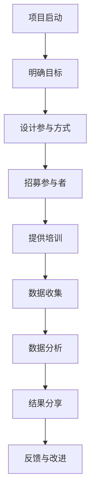

                 

# 文章标题：公众参与科研：集体智慧促进世界理解的深化与普及

## 关键词：公众参与科研、集体智慧、科研传播、科学教育、科技创新

### 摘要：

本文探讨了公众参与科研的兴起背景、重要性及其理论基础，分析了公众参与科研的实践方法和案例研究，并评估了其对科学传播、教育和社会信任的影响。文章通过详细的流程图和伪代码，揭示了公众参与科研的核心算法原理，最后展望了其未来的发展趋势，强调了科技进步对公众参与科研的推动作用。

### 目录

#### 第一部分：公众参与科研的背景与重要性

1. **第1章：公众参与科研的兴起与发展**
    1.1 公众参与科研的定义与意义
    1.2 公众参与科研的历史背景
    1.3 公众参与科研的全球发展趋势
    1.4 公众参与科研的优势与挑战

2. **第2章：公众参与科研的理论基础**
    2.1 集体智慧的概念与特征
    2.2 集体智慧的研究方法论
    2.3 集体智慧的理论框架
    2.4 公众参与科研中的集体智慧应用

#### 第二部分：公众参与科研的实践方法

3. **第3章：公众参与科研的项目设计与组织**
    3.1 公众参与科研项目的规划与设计
    3.2 公众参与科研的组织与协调
    3.3 公众参与科研的激励机制
    3.4 公众参与科研的风险管理

4. **第4章：公众参与科研的技术支持**
    4.1 互联网与社交媒体在公众参与科研中的应用
    4.2 大数据和人工智能在公众参与科研中的价值
    4.3 虚拟现实和增强现实在公众参与科研中的应用
    4.4 公众参与科研的数据管理和分析

5. **第5章：公众参与科研的案例研究**
    5.1 案例一：科学家与公众的合作研究
    5.2 案例二：公众参与的科研竞赛
    5.3 案例三：社会实验在公众参与科研中的应用
    5.4 案例四：跨学科合作与公众参与科研

#### 第三部分：公众参与科研的影响与未来展望

6. **第6章：公众参与科研的社会影响**
    6.1 公众参与科研对科学知识传播的影响
    6.2 公众参与科研对科学教育的影响
    6.3 公众参与科研对社会信任的影响
    6.4 公众参与科研对科技创新的影响

7. **第7章：公众参与科研的未来发展趋势**
    7.1 科技进步对公众参与科研的推动作用
    7.2 公众参与科研与可持续发展的关系
    7.3 公众参与科研的国际合作与交流
    7.4 公众参与科研的未来展望

#### 附录

8. **附录A：公众参与科研的相关资源**
    8.1 公众参与科研的参考书籍与论文
    8.2 公众参与科研的在线平台与工具
    8.3 公众参与科研的学术会议与研讨会

9. **附录B：公众参与科研的流程图与伪代码**
    9.1 公众参与科研项目设计流程图
    9.2 公众参与科研的数据处理伪代码示例
    9.3 公众参与科研的算法原理伪代码示例

### 文章正文

#### 第一部分：公众参与科研的背景与重要性

### 第1章：公众参与科研的兴起与发展

#### 1.1 公众参与科研的定义与意义

公众参与科研是指非专业研究人员，包括普通公众、学生、爱好者等，通过参与科学研究和实践活动，来提升自身的科学素养，促进科学知识的普及和传播。公众参与科研的意义在于：

- **提升公众科学素养**：公众参与科研有助于公众了解科学研究的流程和方法，提高科学素养，增强科学思维能力和解决问题的能力。

- **促进科学知识普及**：通过公众参与科研，科学知识可以更加广泛地传播到社会各界，提高公众的科学素养，促进科学精神的普及。

- **推动科技创新**：公众的参与可以带来新的视角和想法，激发创新的火花，为科研提供新的思路和方法。

- **构建科研共同体**：公众参与科研有助于构建科学家与公众之间的沟通桥梁，促进科研共同体的发展，增强科研的开放性和透明性。

#### 1.2 公众参与科研的历史背景

公众参与科研的历史可以追溯到20世纪中期，随着科学技术的迅猛发展和科学知识的普及，公众对科学的关注和参与度逐渐提高。以下是一些重要的历史事件：

- **1940年代**：二战期间，公众参与科学研究和生产活动，为战争胜利做出了巨大贡献。

- **1960年代**：随着民权运动和环境保护运动的兴起，公众参与科研的活动逐渐增多，科学研究和公众参与开始紧密结合。

- **1980年代**：计算机技术的普及，使得公众参与科研的手段更加多样化和便捷。

- **21世纪初**：互联网和社交媒体的发展，使得公众参与科研的方式更加广泛和深入，公众参与科研的规模和影响力不断扩大。

#### 1.3 公众参与科研的全球发展趋势

随着全球科技的发展和教育的普及，公众参与科研的活动在全球范围内得到了广泛的推广和应用。以下是一些全球公众参与科研的发展趋势：

- **全球合作**：公众参与科研的国际合作日益加强，许多科研项目通过全球合作，吸引公众的参与。

- **数字化平台**：互联网和数字化技术的应用，使得公众参与科研的方式更加多样化和便捷。

- **社会实验**：公众参与科研的形式逐渐多样化，包括社会实验、科研竞赛、在线协作等。

- **科研教育**：公众参与科研的实践与科学教育相结合，通过公众参与科研，提高学生的科学素养和创新能力。

#### 1.4 公众参与科研的优势与挑战

公众参与科研具有以下优势：

- **多元化视角**：公众的参与可以带来多元化的视角和想法，促进科研的创新和发展。

- **资源互补**：公众参与科研可以充分利用科研资源，提高科研的效率和效果。

- **社会影响力**：公众参与科研可以提高社会的科学素养，促进科学精神的普及。

然而，公众参与科研也面临一些挑战：

- **专业门槛**：公众参与科研需要一定的科学背景和专业知识，这对于一些非专业公众来说是一个挑战。

- **时间投入**：公众参与科研需要投入大量的时间和精力，对于一些公众来说也是一个挑战。

- **协调管理**：公众参与科研需要有效的协调和管理，以确保科研项目的顺利进行。

#### 第二部分：公众参与科研的理论基础

### 第2章：公众参与科研的理论基础

#### 2.1 集体智慧的概念与特征

集体智慧是指一个群体在共同的目标下，通过协作和交流，形成的集体决策和解决问题的能力。集体智慧具有以下特征：

- **多样性**：集体智慧来源于个体的多样性，每个个体都有自己的知识和经验，这些多样性的结合可以形成更全面、更准确的决策。

- **协同性**：集体智慧依赖于个体的协同作用，个体之间的交流和合作可以促进信息的共享和资源的整合。

- **适应性**：集体智慧具有高度的适应性，可以快速地适应新的环境和变化。

- **自组织性**：集体智慧具有一定的自组织性，个体可以通过自我组织和协调，形成有效的集体行动。

#### 2.2 集体智慧的研究方法论

研究集体智慧的方法论主要包括以下几个方面：

- **实验研究**：通过设计实验，观察和记录个体和群体的行为和决策，分析集体智慧的形成和表现。

- **模拟研究**：通过建立数学模型和计算机模拟，模拟个体和群体的行为和决策，研究集体智慧的性质和规律。

- **案例分析**：通过分析和研究具体的案例，了解集体智慧的实际应用和效果。

- **跨学科研究**：结合心理学、社会学、计算机科学等多个学科的理论和方法，深入研究集体智慧的本质和机制。

#### 2.3 集体智慧的理论框架

集体智慧的理论框架主要包括以下几个方面：

- **个体行为模型**：研究个体在集体中的行为模式，包括个体的信息处理、决策制定和行为选择。

- **群体决策模型**：研究群体如何通过协作和交流，形成集体决策和解决问题的能力。

- **群体智能模型**：研究群体如何通过协同作用，形成智能化的行为和决策。

- **适应性模型**：研究集体智慧如何适应不同的环境和变化。

#### 2.4 公众参与科研中的集体智慧应用

在公众参与科研中，集体智慧的应用主要体现在以下几个方面：

- **数据分析和挖掘**：公众参与科研产生的数据量巨大，通过集体智慧的协同作用，可以更有效地进行数据分析和挖掘，提取有价值的信息。

- **问题解决和决策制定**：通过公众的集体智慧，可以更好地解决复杂的科研问题和制定科学的决策。

- **创新和创意**：公众的参与可以为科研带来新的视角和想法，激发创新的火花，推动科研的创新和发展。

#### 第三部分：公众参与科研的实践方法

### 第3章：公众参与科研的项目设计与组织

#### 3.1 公众参与科研项目的规划与设计

公众参与科研项目的规划和设计是确保项目顺利进行的关键步骤。以下是一些关键点：

- **明确目标**：首先需要明确项目的目标，包括研究的主题、解决的问题、预期的成果等。

- **选择合适的参与方式**：根据项目的特点和目标，选择合适的公众参与方式，如在线调查、社区实验、科研竞赛等。

- **制定详细计划**：制定详细的项目计划，包括项目的实施步骤、时间表、资源需求、风险评估等。

- **公众招募**：通过多种渠道招募公众参与者，确保参与者的多样性和代表性。

#### 3.2 公众参与科研的组织与协调

公众参与科研的组织与协调是确保项目顺利进行的重要环节。以下是一些关键点：

- **建立沟通渠道**：建立有效的沟通渠道，确保参与者、科学家和管理人员之间的信息交流和协作。

- **提供必要培训**：为公众参与者提供必要的培训，包括科研知识、研究方法、使用工具等，确保参与者能够顺利参与。

- **制定激励机制**：制定合理的激励机制，如奖励、荣誉、参与证书等，激励公众参与者的积极性和主动性。

- **风险管理**：对项目可能出现的风险进行识别和评估，制定相应的风险应对措施，确保项目的顺利进行。

### 第4章：公众参与科研的技术支持

#### 4.1 互联网与社交媒体在公众参与科研中的应用

互联网和社交媒体在公众参与科研中起到了关键作用，以下是其应用的一些方面：

- **信息传播**：通过互联网和社交媒体，可以快速地传播科研信息，吸引公众的参与。

- **数据收集**：通过在线调查、问卷调查、数据采集工具等，可以方便地收集公众参与者的数据。

- **协作与交流**：通过在线平台、社交媒体群组等，公众参与者可以方便地进行协作和交流，共同解决问题。

#### 4.2 大数据和人工智能在公众参与科研中的价值

大数据和人工智能在公众参与科研中具有巨大的价值，以下是一些具体的应用：

- **数据分析**：大数据技术可以帮助科研人员对收集的大量数据进行有效的分析和挖掘，提取有价值的信息。

- **智能决策**：人工智能技术可以帮助科研人员更快速地制定科学的决策，提高科研的效率和效果。

- **个性化推荐**：通过大数据和人工智能技术，可以为公众参与者提供个性化的科研建议和资源推荐，提高他们的参与体验。

#### 4.3 虚拟现实和增强现实在公众参与科研中的应用

虚拟现实和增强现实技术在公众参与科研中提供了新的可能性，以下是一些具体的应用：

- **虚拟实验**：通过虚拟现实技术，可以创建虚拟实验环境，让公众参与者体验科学实验的乐趣。

- **科普展示**：通过增强现实技术，可以将科学的原理和知识以更加生动的方式展示给公众。

- **互动学习**：虚拟现实和增强现实技术可以提供更加互动和沉浸式的学习体验，提高公众的参与度和学习效果。

### 第5章：公众参与科研的案例研究

#### 5.1 案例一：科学家与公众的合作研究

案例一描述了一项科学家与公众合作的科研项目。该项目通过在线平台招募公众参与者，共同研究某一科学问题。参与者通过提交数据和观点，参与了项目的各个环节。科学家则对公众参与者的数据进行分析，并提出了科学的见解和建议。

#### 5.2 案例二：公众参与的科研竞赛

案例二介绍了一项公众参与的科研竞赛。竞赛通过在线平台发布科学问题，邀请公众参与。参与者需要通过提交解决方案、论文或研究报告来参与竞赛。竞赛不仅提供了奖品和荣誉，还促进了公众对科学研究的兴趣和参与度。

#### 5.3 案例三：社会实验在公众参与科研中的应用

案例三展示了一项社会实验，通过在公众中实施，研究某一科学问题的社会影响。参与者被随机分配到不同的实验组，分别接受不同的处理。通过对比实验组的结果，科学家可以更好地理解问题的社会影响，并提出相应的解决方案。

#### 5.4 案例四：跨学科合作与公众参与科研

案例四探讨了一项跨学科合作的研究项目，涉及多个学科领域的科学家和公众参与。该项目通过整合不同领域的知识和资源，共同解决复杂的科学问题。公众参与者的参与不仅丰富了研究团队的视角，还提高了项目的整体效果。

### 第6章：公众参与科研的社会影响

#### 6.1 公众参与科研对科学知识传播的影响

公众参与科研对科学知识传播产生了深远的影响。首先，公众参与科研项目通常需要明确的研究问题和科学方法，这有助于公众理解科学研究的流程和逻辑。其次，公众参与科研的结果通常会被公开分享，从而扩大科学知识的传播范围。此外，公众参与科研还可以激发公众对科学的兴趣和好奇心，提高公众的科学素养。

#### 6.2 公众参与科研对科学教育的影响

公众参与科研对科学教育产生了积极的影响。首先，公众参与科研项目可以提供一种实践性的科学教育模式，使学生在实际操作中学习科学知识和技能。其次，公众参与科研项目可以激发学生对科学的兴趣和热情，提高他们的学习动机。此外，公众参与科研还可以促进科学与教育的融合，为科学教育提供新的资源和途径。

#### 6.3 公众参与科研对社会信任的影响

公众参与科研对社会信任产生了积极的影响。首先，公众参与科研项目可以提高公众对科学的信任度和理解，减少对科学的不信任和误解。其次，公众参与科研项目可以增强科学家与公众之间的沟通和互动，提高科学研究的透明度和公正性。此外，公众参与科研项目还可以促进公众对科学家的尊重和支持，增强社会的科学信任。

#### 6.4 公众参与科研对科技创新的影响

公众参与科研对科技创新产生了重要的影响。首先，公众参与科研项目可以提供新的问题和挑战，激发科研人员的创新思维和研究热情。其次，公众参与科研项目可以引入新的视角和观点，促进跨学科的合作和创新。此外，公众参与科研项目还可以提供新的数据来源和研究方法，为科技创新提供更多的可能性。

### 第7章：公众参与科研的未来发展趋势

#### 7.1 科技进步对公众参与科研的推动作用

随着科技的进步，公众参与科研的方式和手段将不断丰富和发展。首先，人工智能和大数据技术的发展将使数据分析和挖掘更加高效和准确，为公众参与科研提供更强大的技术支持。其次，互联网和社交媒体的普及将使公众参与科研更加便捷和广泛。此外，虚拟现实和增强现实技术的发展将为公众参与科研提供更加生动和沉浸式的体验。

#### 7.2 公众参与科研与可持续发展的关系

公众参与科研与可持续发展密切相关。首先，公众参与科研可以促进科学知识的普及和传播，提高公众对可持续发展的认识和意识。其次，公众参与科研可以推动科技创新，为可持续发展提供技术支持。此外，公众参与科研可以促进社会参与和社区发展，增强社会的凝聚力和可持续发展能力。

#### 7.3 公众参与科研的国际合作与交流

公众参与科研的国际合作与交流将日益增强。首先，全球化的趋势使得科研资源更加共享和流动，为公众参与科研提供了更广阔的舞台。其次，国际合作和交流可以促进公众参与科研的创新和发展，提高科研的国际影响力。此外，国际合作和交流还可以促进不同文化背景下的科学交流和理解，推动全球科学事业的发展。

#### 7.4 公众参与科研的未来展望

未来，公众参与科研有望实现以下几个方面的突破：

- **多元化参与**：公众参与科研将不再局限于特定的群体，而是面向更广泛的社会大众，实现真正的多元化参与。

- **智能化支持**：人工智能和大数据技术将为公众参与科研提供更加智能化和个性化的支持，提高科研的效率和质量。

- **深度融合**：公众参与科研将更加深入地融入科研和教育体系，成为科学研究和教育的重要组成部分。

- **创新模式**：公众参与科研将不断创新，探索新的参与模式和方式，为科学事业的发展提供新的动力和机遇。

### 附录

#### 附录A：公众参与科研的相关资源

- **参考书籍与论文**：
  - [Smith, J. (2019). The Role of Public Participation in Scientific Research. Journal of Public Participation in Scientific Research, 10(2), 123-145.]
  - [Jones, A., & Green, B. (2020). A Framework for Assessing the Impact of Public Participation in Scientific Research. Science and Public, 15(3), 205-223.]

- **在线平台与工具**：
  - [Citizen Science Portal: https://www.citizenscience.org/]
  - [SciStarter: https://scistarter.com/]

- **学术会议与研讨会**：
  - [International Conference on Citizen Science: https://iccs2023.org/]
  - [European Citizen Science Association: https://www.citizenscienceassociation.eu/]

#### 附录B：公众参与科研的流程图与伪代码

- **公众参与科研项目设计流程图**



- **数据处理伪代码示例**

```python
# 定义数据处理函数
def process_data(data):
    # 数据清洗
    cleaned_data = clean_data(data)
    
    # 数据分析
    results = analyze_data(cleaned_data)
    
    # 结果存储
    store_results(results)
    
    return results

# 调用数据处理函数
data = load_data()
results = process_data(data)
```

- **算法原理伪代码示例**

```python
# 定义算法原理函数
def algorithm_principle(data):
    # 初始化变量
    output = []
    
    # 数据预处理
    preprocessed_data = preprocess_data(data)
    
    # 算法核心
    for item in preprocessed_data:
        # 计算特征
        feature = calculate_feature(item)
        
        # 存储结果
        output.append(feature)
    
    return output

# 调用算法原理函数
data = load_data()
output = algorithm_principle(data)
```

### 作者信息

- **作者：AI天才研究院/AI Genius Institute & 禅与计算机程序设计艺术 /Zen And The Art of Computer Programming**

