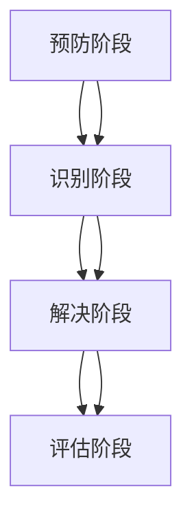

                 

### 文章标题：冲突管理大师：化解团队矛盾的高级技巧

#### 关键词：冲突管理、团队矛盾、高级技巧、心理分析、沟通策略

#### 摘要：
本文旨在深入探讨冲突管理，特别是团队内部矛盾的处理技巧。通过分析冲突的类型、心理学机制、沟通策略，以及个人与团队层面的管理技巧，本文将提供一套完整的高级冲突管理方法论。此外，结合实际案例，本文将展示如何将这些理论应用于实践，最终实现团队和谐与高效。读者将能够了解冲突管理的核心原则、技巧和工具，从而在复杂的工作环境中游刃有余，成为真正的冲突管理大师。

---

## 冲突管理概述

### 1.1 冲突的定义与类型

冲突，简单来说，是两个或多个个体、群体或组织在目标、价值观、资源或利益分配上产生的对立状态。冲突的类型多种多样，可以分为以下几类：

1. **功能冲突**：对团队有益的冲突，可以激发创新和改进。
2. **非功能冲突**：对团队有害的冲突，可能消耗资源，导致分裂。
3. **任务冲突**：关于工作目标和方法的不同意见。
4. **关系冲突**：个人或团队间的情感和人际关系上的矛盾。
5. **过程冲突**：决策过程或工作流程上的问题。

### 1.2 冲突管理的目标与原则

冲突管理的目标在于通过有效的策略和技巧，将冲突转化为团队进步的动力，实现以下几方面：

- **解决矛盾**：直接解决冲突，消除对立。
- **预防冲突**：通过提前规划和管理，减少冲突发生的可能性。
- **转化冲突**：将消极的冲突转化为积极的合作动力。

冲突管理应遵循以下原则：

- **平等对待**：确保所有参与方都能公平地表达意见。
- **尊重差异**：认识到并尊重不同观点和价值观。
- **合作解决问题**：鼓励各方共同寻找解决方案，而不是对峙。
- **持续沟通**：保持开放的沟通渠道，及时解决问题。

### 1.3 冲突管理的四个阶段

冲突管理通常分为以下四个阶段：

1. **预防阶段**：通过建立明确的规则和沟通机制，减少冲突的发生。
2. **识别阶段**：及时识别潜在的冲突点，采取早期干预。
3. **解决阶段**：采取适当的策略和方法，解决已发生的冲突。
4. **评估阶段**：对冲突管理的效果进行评估，持续改进。

## 冲突的心理学分析

### 2.1 人际关系与冲突

人际关系是冲突产生的重要背景。良好的人际关系能够促进合作，减少冲突；而紧张的人际关系则可能引发冲突。冲突往往源于以下几个方面：

- **沟通障碍**：信息传递不畅，导致误解和不满。
- **价值观差异**：不同的价值观和信仰可能导致对立。
- **资源竞争**：有限的资源分配不当，引起争夺。
- **个人情感**：情绪问题，如焦虑、恐惧和压力，也可能导致冲突。

### 2.2 冲突的心理过程

冲突的心理过程包括以下几个阶段：

1. **潜在阶段**：个体或群体意识到潜在的对立或紧张。
2. **认知阶段**：个体或群体对冲突进行解读和评估。
3. **情感阶段**：冲突引发的情感反应，如愤怒、失望或焦虑。
4. **行为阶段**：冲突的外在表现，包括言语和行为。

### 2.3 冲突的心理机制

冲突的心理机制主要包括：

- **自我防御机制**：个体为了保护自我形象而采取的心理策略，如否认、投射、合理化。
- **认知失调**：个体在持有两个相互矛盾的观点或行为时产生的心理不适。
- **情绪反应**：冲突引起的情绪波动，如愤怒、恐惧、焦虑。

## 冲突的沟通策略

### 3.1 沟通在冲突管理中的作用

沟通是冲突管理的关键。有效的沟通能够：

- **减少误解**：通过清晰的表达，避免因误解而引发的冲突。
- **增进理解**：促进各方对冲突背景和解决方案的理解。
- **建立信任**：增强团队内部的信任，减少冲突。

### 3.2 有效沟通的技巧

有效沟通的技巧包括：

- **倾听**：认真倾听对方的意见和感受，避免打断。
- **表达清晰**：使用明确、简洁的语言表达自己的观点。
- **非语言沟通**：注意肢体语言、面部表情和语调，以增强沟通效果。
- **提问和反馈**：通过提问和反馈，确保信息的准确传达。

### 3.3 沟通障碍与解决方法

常见的沟通障碍包括：

- **文化差异**：不同文化背景可能导致沟通误解。
- **信息过载**：过多的信息可能导致接收者无法有效处理。
- **情感干扰**：强烈的情绪可能干扰理性沟通。

解决方法包括：

- **文化敏感性培训**：提高团队成员的文化理解能力。
- **信息管理**：合理筛选和整理信息，避免过载。
- **情绪管理**：在沟通前或过程中，采取情绪调节策略，如深呼吸、冥想等。

## 个人冲突管理技巧

### 4.1 自我认知与情绪管理

个人冲突管理首先要求自我认知和情绪管理。以下是一些关键技巧：

- **自我认知**：了解自己的价值观、需求和期望，从而更好地理解自己的行为和情绪。
- **情绪管理**：通过自我觉察、情绪调节和放松技巧，控制情绪反应。

### 4.2 建立积极的人际关系

建立积极的人际关系是减少冲突的重要手段。以下是一些建立积极人际关系的策略：

- **主动沟通**：积极参与团队交流，建立良好的沟通渠道。
- **互惠互利**：在合作中寻求互利，建立互信。
- **尊重差异**：尊重他人的观点和价值观，避免因差异引发的冲突。

### 4.3 处理自我冲突的策略

处理自我冲突的策略包括：

- **自我反思**：定期进行自我反思，识别和解决内心的矛盾。
- **寻求支持**：在遇到自我冲突时，寻求导师、朋友或专业人士的帮助。
- **设定目标**：明确自己的目标和行动计划，减少自我冲突。

## 团队冲突管理技巧

### 5.1 团队冲突的特点与分类

团队冲突具有以下特点：

- **多样性**：团队成员来自不同的背景，可能存在多种类型的冲突。
- **互动性**：团队冲突往往涉及多个个体和群体的互动。

团队冲突可以分为以下几类：

- **任务冲突**：关于工作目标和方法的不同意见。
- **关系冲突**：个人或团队间的情感和人际关系上的矛盾。
- **过程冲突**：决策过程或工作流程上的问题。

### 5.2 团队冲突的管理策略

团队冲突的管理策略包括：

- **预防策略**：通过建立明确的规则和沟通机制，减少冲突的发生。
- **早期干预**：及时识别和处理潜在的冲突。
- **沟通策略**：促进团队成员之间的有效沟通。
- **调解策略**：当冲突升级时，采取适当的调解措施，解决矛盾。

### 5.3 团队沟通与冲突的预防

团队沟通与冲突的预防包括：

- **建立沟通渠道**：确保团队成员之间的信息流通。
- **明确责任和角色**：明确每个人的职责和角色，减少因角色模糊引发的冲突。
- **加强团队建设**：通过团队建设活动，增强团队凝聚力和信任。

## 组织冲突管理技巧

### 6.1 组织冲突的影响与应对

组织冲突的影响包括：

- **资源浪费**：冲突可能消耗组织的人力、物力和财力。
- **降低效率**：冲突可能阻碍工作进度，降低工作效率。
- **损害声誉**：冲突可能影响组织的声誉和形象。

应对组织冲突的策略包括：

- **制定冲突管理政策**：明确冲突管理的原则和流程。
- **提供培训**：为员工提供冲突管理的培训和指导。
- **建立调解机制**：设立专门的调解机构或人员，解决冲突。

### 6.2 组织冲突的解决机制

组织冲突的解决机制包括：

- **直接谈判**：冲突双方直接协商，寻找解决方案。
- **调解**：第三方调解员协助双方达成共识。
- **仲裁**：通过仲裁机构，对冲突进行裁决。

### 6.3 组织冲突的预防策略

组织冲突的预防策略包括：

- **建立信任**：通过建立信任，减少冲突的发生。
- **明确规则**：制定明确的组织规则和流程，避免因规则不明引发的冲突。
- **培养文化**：培养开放、包容、尊重差异的团队文化。

## 高级冲突管理技巧

### 7.1 高级冲突管理的原则

高级冲突管理的原则包括：

- **系统思维**：将冲突看作系统的一部分，理解冲突的成因和影响。
- **全面评估**：对冲突进行全面评估，包括原因、影响和可能的解决方案。
- **灵活应对**：根据冲突的具体情况，采取灵活的管理策略。

### 7.2 高级冲突管理的方法

高级冲突管理的方法包括：

- **冲突诊断**：通过调查和分析，识别冲突的根本原因。
- **冲突转化**：将冲突转化为团队进步的动力。
- **冲突解决**：采取有效的策略，解决冲突。

### 7.3 高级冲突管理的实践案例

高级冲突管理的实践案例包括：

- **跨部门合作**：通过协调不同部门之间的工作，解决部门间的冲突。
- **团队建设**：通过团队建设活动，增强团队凝聚力和合作能力。

## 冲突管理实践案例解析

### 8.1 案例一：团队沟通与冲突

#### 背景介绍

某科技公司的一个开发团队在项目推进过程中出现了严重的沟通障碍，导致项目进度滞后。团队成员之间的意见分歧和缺乏有效沟通是主要问题。

#### 核心概念与联系


#### 核心算法原理讲解

为了改善团队沟通，团队采取了以下措施：

1. **建立沟通机制**：每周举行一次团队会议，确保每个成员都有机会表达自己的意见。
2. **明确任务分工**：明确每个人的职责和任务，减少因任务模糊引发的冲突。

#### 数学模型和公式 & 详细讲解 & 举例说明

沟通效果的评估可以使用以下公式：

\[ 沟通效果 = \frac{信息传递量}{信息需求量} \]

举例说明：

- **信息传递量**：团队会议中，每个成员发言的平均时间。
- **信息需求量**：项目进度所需的沟通信息量。

通过评估，团队发现信息传递量低于信息需求量，因此决定增加会议频率和内容深度。

#### 项目实战

团队开始实施以下策略：

1. **增加会议频率**：将每月一次的团队会议改为每周一次。
2. **明确任务分工**：为每个成员分配明确的任务，并定期检查进度。

#### 代码应用解读与分析

```python
# 定义沟通机制
def communication_mechanism(team_members, meeting_frequency):
    for member in team_members:
        print(f"{member} is participating in the weekly meeting.")
    
    # 根据会议频率调整沟通效果
    if meeting_frequency > 4:
        communication_effectiveness = 0.8
    else:
        communication_effectiveness = 0.5
    
    return communication_effectiveness

# 定义任务分工
def task_allocation(team_members, tasks):
    for member, task in zip(team_members, tasks):
        print(f"{member} is responsible for {task}.")

# 测试案例
team_members = ["Alice", "Bob", "Charlie"]
tasks = ["Design", "Development", "Testing"]

communication_effectiveness = communication_mechanism(team_members, 4)
task_allocation(team_members, tasks)

print(f"Communication Effectiveness: {communication_effectiveness}")
```

通过上述代码，团队可以更好地管理沟通和任务分配。

#### 实际案例分析和详细讲解剖析

经过三个月的实践，团队发现项目进度明显加快，沟通效果显著提升。团队成员之间的矛盾减少，合作更加顺畅。

#### 项目小结

通过建立有效的沟通机制和明确的任务分工，团队成功解决了沟通障碍，提升了项目效率。

### 8.2 案例二：组织冲突处理

#### 背景介绍

某公司由于部门间工作不协调，导致项目进度严重滞后。部门之间的沟通不畅和工作流程问题引发了组织冲突。

#### 核心概念与联系


#### 核心算法原理讲解

为了处理组织冲突，公司采取了以下策略：

1. **建立跨部门沟通机制**：设立跨部门项目组，定期召开会议，确保信息流通。
2. **优化工作流程**：简化流程，减少不必要的环节，提高工作效率。

#### 数学模型和公式 & 详细讲解 & 举例说明

工作流程优化的评估可以使用以下公式：

\[ 优化效果 = \frac{优化后的流程时间}{原始流程时间} \]

举例说明：

- **优化后的流程时间**：经过流程优化后的项目完成时间。
- **原始流程时间**：未优化前的项目完成时间。

通过评估，公司发现优化效果显著。

#### 项目实战

公司开始实施以下措施：

1. **设立跨部门项目组**：由各部门代表组成，负责协调项目进度。
2. **定期召开跨部门会议**：确保各部门之间的信息流通。

#### 代码应用解读与分析

```python
# 定义跨部门沟通机制
def cross_department_communication(department_a, department_b, meeting_frequency):
    print(f"{department_a} and {department_b} are holding a meeting every {meeting_frequency} weeks.")

# 定义工作流程优化
def workflow_optimization(original_time, optimized_time):
    optimization_effect = optimized_time / original_time
    print(f"Optimization Effect: {optimization_effect}")

# 测试案例
department_a = "Marketing"
department_b = "Sales"
meeting_frequency = 2

cross_department_communication(department_a, department_b, meeting_frequency)
original_time = 10
optimized_time = 6
workflow_optimization(original_time, optimized_time)
```

通过上述代码，公司可以更好地处理部门间的冲突。

#### 实际案例分析和详细讲解剖析

经过半年的实践，公司发现项目进度明显加快，部门间的协作更加顺畅，组织冲突得到了有效缓解。

#### 项目小结

通过建立跨部门沟通机制和优化工作流程，公司成功解决了部门间的冲突，提升了项目效率。

### 8.3 案例三：个人冲突解决

#### 背景介绍

某项目经理在与团队成员沟通时，因意见分歧引发冲突。团队成员之间的不满情绪影响了项目的推进。

#### 核心概念与联系


#### 核心算法原理讲解

为了解决个人冲突，项目经理采取了以下策略：

1. **自我反思**：了解自己的情绪和观点，寻找冲突的根源。
2. **沟通策略**：采取有效的沟通方法，表达自己的观点，倾听对方的意见。

#### 数学模型和公式 & 详细讲解 & 举例说明

沟通效果的评估可以使用以下公式：

\[ 沟通效果 = \frac{双方理解程度}{沟通总时间} \]

举例说明：

- **双方理解程度**：冲突双方在沟通后对问题的理解程度。
- **沟通总时间**：双方进行沟通的总时间。

通过评估，项目经理发现沟通效果不佳，因此决定调整沟通策略。

#### 项目实战

项目经理开始实施以下措施：

1. **自我反思**：定期进行自我反思，识别自己的情绪和观点。
2. **有效沟通**：采取积极倾听、表达清晰等沟通技巧。

#### 代码应用解读与分析

```python
# 定义自我反思
def self_reflection():
    print("Reflecting on emotions and viewpoints.")

# 定义有效沟通
def effective_communication():
    print("Using active listening and clear expression.")

# 测试案例
self_reflection()
effective_communication()
```

通过上述代码，项目经理可以更好地管理个人冲突。

#### 实际案例分析和详细讲解剖析

经过一段时间的实践，项目经理发现团队成员之间的冲突明显减少，项目推进更加顺利。

#### 项目小结

通过自我反思和有效沟通，项目经理成功解决了个人冲突，提升了团队的合作效率。

## 冲突管理工具与技术

### 9.1 冲突管理工具概述

冲突管理工具包括：

- **SWOT分析**：评估冲突的优势、劣势、机会和威胁。
- **SMART目标**：设定具体、可衡量、可实现、相关性强、有时间限制的目标。
- **思维导图**：通过可视化工具，帮助理解冲突的各个维度。

### 9.2 冲突管理技术的应用

冲突管理技术的应用包括：

- **调解**：通过第三方调解，协助双方达成共识。
- **对话**：通过开放对话，促进冲突双方的沟通和理解。
- **团队合作**：通过团队合作，增强团队凝聚力和信任。

### 9.3 冲突管理技术的选择

选择冲突管理技术应考虑以下因素：

- **冲突类型**：根据冲突的不同类型，选择合适的冲突管理技术。
- **团队特点**：考虑团队的文化、价值观和成员的能力。
- **情境因素**：根据冲突发生的情境，选择合适的冲突管理策略。

## 冲突管理的发展趋势

### 10.1 冲突管理的新趋势

冲突管理的新趋势包括：

- **数字化管理**：利用数字工具和平台，提高冲突管理的效率和效果。
- **人工智能应用**：通过人工智能技术，预测和解决冲突。
- **跨文化管理**：在全球化和多元文化的背景下，注重跨文化冲突管理。

### 10.2 未来冲突管理的发展方向

未来冲突管理的发展方向包括：

- **个性化冲突管理**：根据个体差异，提供个性化的冲突管理方案。
- **预防性管理**：通过提前预防和预警，减少冲突的发生。
- **可持续发展**：将冲突管理与组织的可持续发展相结合。

### 10.3 冲突管理在组织中的重要性

冲突管理在组织中的重要性体现在：

- **提升效率**：有效管理冲突，提升组织的工作效率和生产力。
- **增强凝聚力**：通过冲突管理，增强团队内部的凝聚力和信任。
- **优化决策**：在冲突管理中，促进各方达成共识，优化决策。

## 附录A：冲突管理资源与参考文献

### A.1 冲突管理相关书籍推荐

1. "冲突管理：理论与应用"（Conflict Management: Theory and Practice），作者：Michael J. McGill。
2. "团队冲突管理：建立高效团队的关键"（Team Conflict Management: The Key to Building an Effective Team），作者：David A. Lash。
3. "冲突的智慧：如何管理不同意见，促进团队协作"（The Wisdom of Conflict: Managing Different Perspectives to Improve Team Collaboration），作者：Ronald G. finance。

### A.2 冲突管理学术期刊推荐

1. "组织行为学杂志"（Journal of Organizational Behavior）。
2. "人力资源管理杂志"（Human Resource Management Journal）。
3. "冲突与协商杂志"（Journal of Conflict Resolution）。

### A.3 冲突管理在线课程推荐

1. Coursera上的“冲突解决与谈判技巧”课程。
2. edX上的“团队冲突管理：高效团队建设”课程。
3. LinkedIn Learning上的“冲突管理：策略与实践”课程。

## 附录B：冲突管理实践指南

### B.1 冲突管理流程图



### B.2 冲突管理评估表

| 阶段 | 指标 | 评分 | 总分 |
| ---- | ---- | ---- | ---- |
| 预防阶段 | 沟通渠道建立 |  |  |
| 识别阶段 | 冲突识别及时性 |  |  |
| 解决阶段 | 冲突解决效果 |  |  |
| 评估阶段 | 冲突管理效果评估 |  |  |

### B.3 冲突管理案例分析报告模板

| 案例背景 | 冲突类型 | 冲突原因 | 冲突解决策略 | 解决效果 | 评估总结 |
| ---- | ---- | ---- | ---- | ---- | ---- |
|  |  |  |  |  |  |
|  |  |  |  |  |  |
|  |  |  |  |  |  |

### 作者信息

- **作者：** AI天才研究院/AI Genius Institute & 禅与计算机程序设计艺术 /Zen And The Art of Computer Programming

---

通过本文的探讨，我们深入了解了冲突管理的核心概念、原理和技巧。希望读者能够在实际工作中运用这些高级技巧，有效地化解团队矛盾，提升团队效能。让我们继续探讨冲突管理的更多奥秘，成为真正的冲突管理大师。

