                 

### 《函数计算：实现LLM应用的细粒度扩展》

> 关键词：函数计算，LLM应用，细粒度扩展，资源管理，云原生架构，虚拟化技术

> 摘要：本文将深入探讨函数计算技术在实现大型语言模型（LLM）应用的细粒度扩展方面的作用。通过对函数计算的基本概念、核心原理、架构设计以及实际应用场景的详细分析，本文旨在为读者提供关于如何高效利用函数计算实现LLM应用的细粒度扩展的全面理解。

### 目录大纲

# 《函数计算：实现LLM应用的细粒度扩展》

## 第一部分：函数计算概述

### 1.1 函数计算的基本概念

#### 背景介绍

函数计算（Function as a Service，FaaS）是一种云计算服务模型，它允许开发者将应用程序作为一系列函数提供，这些函数仅在触发时执行。与传统的Web应用服务模型（Platform as a Service，PaaS）和基础设施即服务（Infrastructure as a Service，IaaS）相比，FaaS提供了一种更为灵活和高效的方式来实现计算资源的动态分配和管理。

#### 核心概念与联系

**函数计算** 是一种基于事件驱动的计算模型，其中 **函数** 是最小的计算单元，由第三方云服务提供商托管和运行。

**虚拟化技术** 使得FaaS能够在同一物理服务器上并行运行多个独立的函数实例，实现高效的资源利用。

**云原生架构** 强调使用容器等轻量级技术来部署和运行应用程序，确保函数计算的弹性和可伸缩性。

**服务网格技术** 提供了微服务之间通信的安全性和可靠性保障，是FaaS架构的重要组成部分。

### 1.2 函数计算的发展历程

#### 发展历程

- **早期**：函数计算起源于云计算的早期阶段，以基于脚本的服务模型为主。
- **兴起**：随着容器技术和微服务架构的流行，FaaS开始受到关注，Amazon Web Services（AWS）和Google Cloud Platform（GCP）率先推出相应的FaaS服务。
- **成熟**：如今，多家云服务提供商已推出功能丰富的FaaS服务，如AWS Lambda、Google Cloud Functions和Azure Functions。

#### 影响因素

- **技术进步**：容器化和虚拟化技术的成熟为FaaS的发展提供了技术基础。
- **市场需求**：随着云计算应用的普及，开发者对灵活、高效的计算模型的需求日益增长。

### 1.3 函数计算的优势与挑战

#### 优势

- **高可伸缩性**：根据需求动态调整计算资源，实现按需扩展。
- **低成本**：仅按实际使用量计费，降低开发和运营成本。
- **简化部署**：无需关心底层基础设施，专注于函数开发和业务逻辑。

#### 挑战

- **函数粒度**：过于细粒度的函数可能导致管理复杂度增加。
- **调试与监控**：与传统应用相比，FaaS的调试和监控更为复杂。
- **冷启动**：长时间未被调用的函数在重新调用时可能存在性能开销。

## 第二部分：函数计算原理

### 2.1 虚拟化技术

#### 背景介绍

虚拟化技术是将计算机资源（如CPU、内存、存储和网络）抽象化，以创建多个独立的虚拟环境。在函数计算中，虚拟化技术用于实现高效的资源管理和隔离。

#### 核心概念

- **虚拟机（VM）**：通过硬件虚拟化技术创建的虚拟计算机系统。
- **容器（Container）**：通过操作系统级别的虚拟化技术创建的轻量级、独立的运行时环境。
- **沙箱（Sandbox）**：为每个函数实例创建的隔离环境，确保函数的安全性和稳定性。

#### 工作原理

1. **资源抽象**：虚拟化技术将底层硬件资源抽象化为虚拟资源，供多个函数实例共享。
2. **资源分配**：基于需求动态调整虚拟资源的分配，实现高效的资源利用。
3. **实例隔离**：通过沙箱技术确保每个函数实例的运行环境相互独立，防止互相干扰。

#### Mermaid流程图

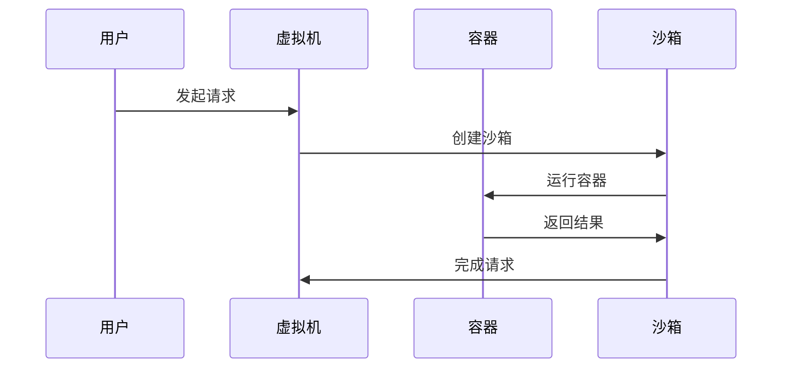

### 2.2 云原生架构

#### 背景介绍

云原生架构是一种设计应用程序的方式，强调使用容器、服务网格、自动化等现代化技术来构建和部署应用程序。在函数计算中，云原生架构有助于实现高效、可伸缩的应用程序开发和部署。

#### 核心概念

- **容器化（Containerization）**：将应用程序及其依赖打包为可移植的容器镜像，确保在任意环境中的一致性。
- **服务网格（Service Mesh）**：为微服务提供可靠、安全的通信机制，确保服务之间的有效协作。
- **自动化（Automation）**：通过自动化工具实现应用程序的部署、监控、扩展等生命周期管理。

#### 工作原理

1. **容器化**：将应用程序打包为容器镜像，确保应用程序在不同环境中的一致性和可移植性。
2. **服务网格**：通过服务网格技术，实现微服务之间的可靠、安全通信，确保服务的可观测性和可管理性。
3. **自动化**：通过自动化工具，实现应用程序的自动化部署、监控和扩展，提高开发和运维效率。

#### Mermaid流程图

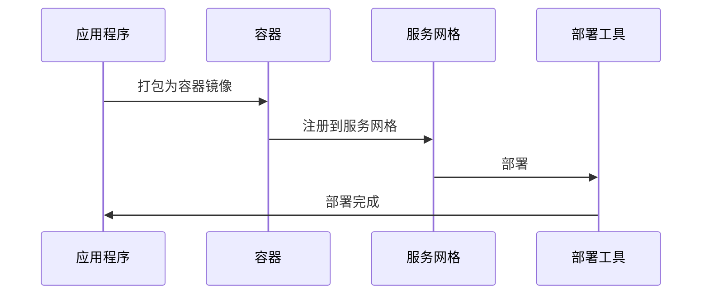

### 2.3 服务网格技术

#### 背景介绍

服务网格技术为微服务架构提供了可靠、安全的通信机制，确保服务之间的有效协作。在函数计算中，服务网格技术有助于实现函数实例之间的高效通信和管理。

#### 核心概念

- **服务网格（Service Mesh）**：一种基础设施层，负责管理微服务之间的通信。
- **服务发现（Service Discovery）**：自动发现和注册服务，确保服务之间的可达性。
- **负载均衡（Load Balancing）**：根据服务状态和负载情况，动态分配请求到不同的服务实例。
- **安全与监控（Security and Monitoring）**：提供服务之间的安全通信和实时监控，确保服务的稳定性和安全性。

#### 工作原理

1. **服务发现**：自动发现和注册服务，确保服务之间的可达性。
2. **负载均衡**：根据服务状态和负载情况，动态分配请求到不同的服务实例，确保服务的高可用性。
3. **安全与监控**：提供服务之间的安全通信和实时监控，确保服务的稳定性和安全性。

#### Mermaid流程图

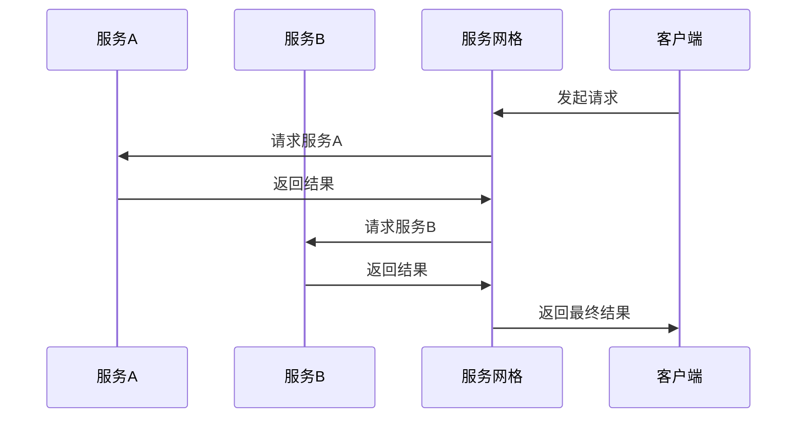

## 第三部分：函数计算核心架构

### 3.1 组件设计与实现

#### 背景介绍

函数计算的核心架构由多个关键组件构成，包括函数执行引擎、资源管理系统、服务发现和负载均衡等。这些组件共同协作，确保函数计算的高效性和可靠性。

#### 核心组件

- **函数执行引擎**：负责函数的加载、执行和返回结果。
- **资源管理系统**：负责计算资源的管理和调度，确保资源的合理利用。
- **服务发现和负载均衡**：负责服务之间的自动发现和负载分配，提高服务的可用性和性能。

#### 设计理念

1. **模块化设计**：将核心功能拆分为独立的模块，确保系统的可扩展性和可维护性。
2. **分布式架构**：通过分布式架构，提高系统的可靠性和可伸缩性。
3. **高效通信**：采用高效的消息传递机制，确保组件之间的实时通信和协同工作。

#### Mermaid流程图

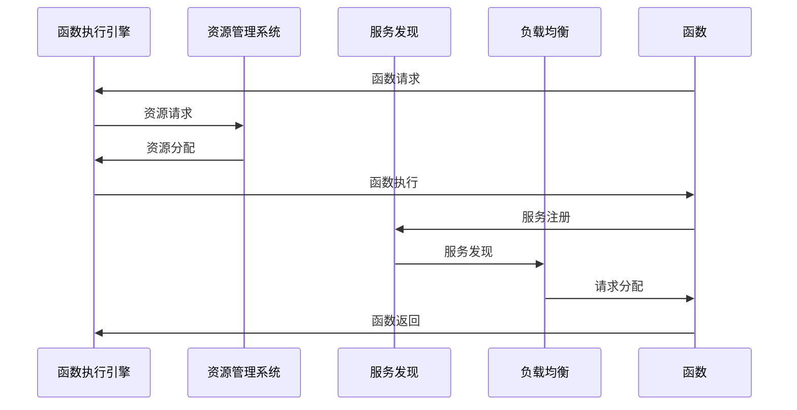

### 3.2 执行环境与隔离

#### 背景介绍

在函数计算中，执行环境与隔离是确保函数安全、可靠运行的关键。通过在沙箱环境中运行函数，可以防止函数实例之间的相互干扰，提高系统的稳定性和安全性。

#### 核心概念

- **执行环境**：为函数实例提供的运行时环境，包括操作系统、库文件、运行时配置等。
- **隔离**：通过隔离机制，确保函数实例之间相互独立，防止资源竞争和数据泄露。

#### 工作原理

1. **沙箱环境**：为每个函数实例创建独立的沙箱环境，确保实例之间的隔离。
2. **资源限制**：通过资源限制机制，确保每个函数实例只能访问其所需的资源，防止资源耗尽。
3. **安全防护**：通过安全防护机制，防止恶意代码的执行和传播，确保系统的安全性。

#### Mermaid流程图

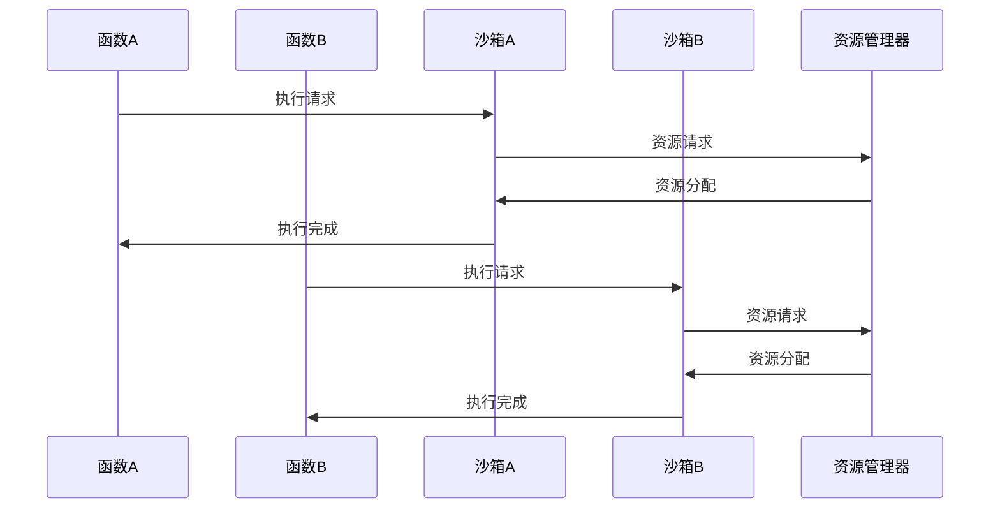

### 3.3 资源管理与优化

#### 背景介绍

资源管理是函数计算的核心任务之一，其目的是确保计算资源的合理利用，提高系统的性能和可靠性。通过智能的资源管理算法，可以动态调整资源分配，实现高效的资源利用。

#### 核心概念

- **资源分配**：根据函数实例的需求，动态分配计算资源，确保实例的运行效率。
- **资源回收**：在函数实例执行完毕后，及时回收释放资源，避免资源浪费。
- **资源监控**：实时监控资源的使用情况，及时发现并处理资源问题，确保系统的稳定性。

#### 工作原理

1. **资源监控**：实时监控计算资源的使用情况，包括CPU、内存、网络等。
2. **资源预测**：根据历史数据和当前负载情况，预测未来的资源需求，提前进行资源分配。
3. **资源调整**：根据资源监控和预测结果，动态调整资源分配，实现资源的优化利用。

#### Mermaid流程图

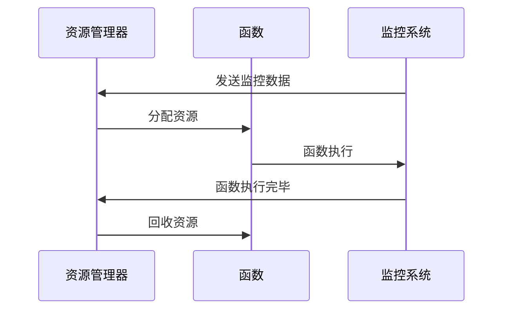

## 第四部分：函数计算应用

### 4.1 云函数服务

#### 背景介绍

云函数服务是函数计算在云计算领域的主要应用之一，为开发者提供了便捷的函数部署和管理方式。云函数服务通常由云服务提供商提供，支持多种编程语言和环境。

#### 核心功能

- **函数部署**：将本地编写的函数代码上传到云函数服务，实现函数的部署和运行。
- **函数管理**：提供函数的创建、更新、删除等管理功能，确保函数的稳定运行。
- **函数调用**：通过API接口或事件触发器，调用云函数服务中的函数，实现函数的功能执行。

#### 工作原理

1. **代码上传**：开发者将函数代码上传到云函数服务，进行代码部署。
2. **函数运行**：云函数服务根据请求，启动函数实例，执行函数代码。
3. **结果返回**：函数执行完毕后，将结果返回给调用者。

#### Mermaid流程图

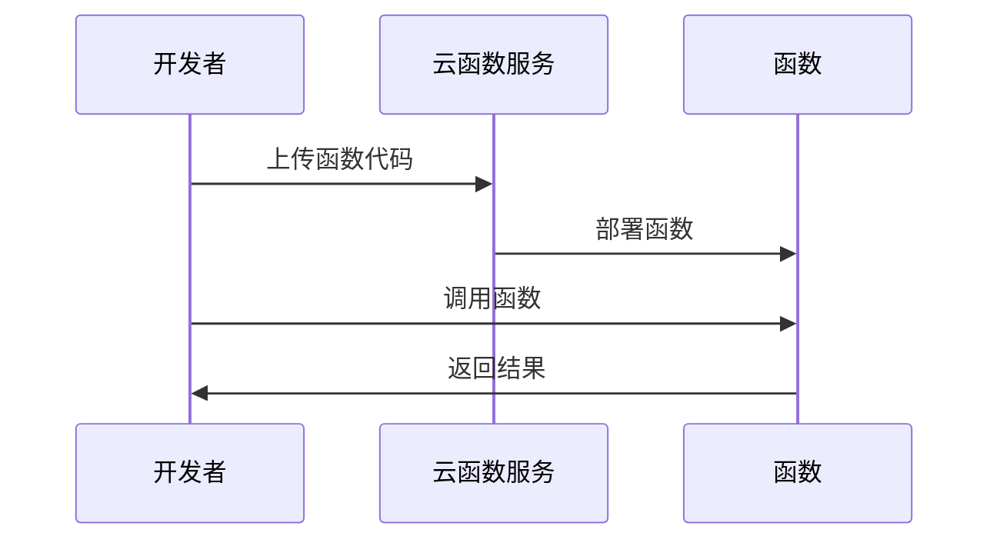

### 4.2 微服务架构

#### 背景介绍

微服务架构是一种将应用程序拆分为多个小型、独立服务的架构风格，每个服务负责处理特定的业务功能。在函数计算中，微服务架构有助于实现高可伸缩性、可靠性和可维护性的应用程序。

#### 核心概念

- **微服务（Microservice）**：独立的、小型、可复用的服务，负责处理特定的业务功能。
- **服务拆分（Service Decomposition）**：将大型应用程序拆分为多个微服务，实现模块化和解耦。
- **服务编排（Service Orchestration）**：通过服务编排，将多个微服务协同工作，实现完整的业务流程。

#### 工作原理

1. **服务拆分**：根据业务需求，将应用程序拆分为多个独立的微服务，每个服务负责处理特定的业务功能。
2. **服务注册与发现**：通过服务注册与发现机制，确保微服务之间的可达性和协同工作。
3. **服务调用**：通过远程过程调用（RPC）或其他通信机制，实现微服务之间的数据交换和功能协作。

#### Mermaid流程图

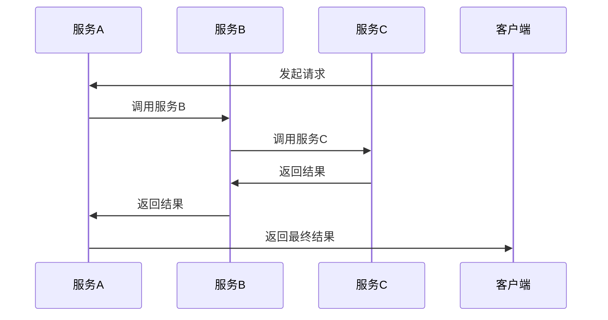

### 4.3 实时数据处理

#### 背景介绍

实时数据处理是函数计算在数据处理领域的典型应用，通过利用函数计算的高可伸缩性和低延迟特性，实现对大规模数据的实时分析和处理。

#### 核心概念

- **实时数据处理（Real-time Data Processing）**：对实时产生的数据进行分析和处理，实现实时反馈和决策。
- **流数据处理（Stream Data Processing）**：基于数据流的概念，对连续产生的大量数据进行实时处理。
- **事件驱动（Event-Driven）**：以事件为驱动，根据事件的发生顺序进行数据处理。

#### 工作原理

1. **数据采集**：实时采集来自各种数据源的数据，包括传感器、日志文件、网络流等。
2. **数据处理**：利用函数计算，对实时数据进行实时分析、清洗、转换和存储。
3. **结果输出**：将处理结果输出到数据库、消息队列或其他数据存储中，供后续分析和决策。

#### Mermaid流程图

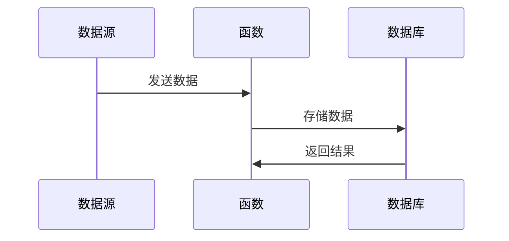

## 第五部分：函数计算在LLM应用中的细粒度扩展

### 5.1 LLM应用场景

#### 背景介绍

大型语言模型（LLM）是一种基于深度学习的自然语言处理模型，具有强大的文本生成、文本理解和语义分析能力。在多个领域，如智能客服、文本生成、机器翻译等，LLM的应用场景越来越广泛。

#### 核心概念

- **LLM（Large Language Model）**：大型语言模型，基于深度学习的自然语言处理模型。
- **应用场景**：智能客服、文本生成、机器翻译、智能问答等。

#### 工作原理

1. **数据预处理**：收集和预处理大规模文本数据，包括清洗、分词、去噪等。
2. **模型训练**：利用训练数据，通过神经网络模型训练，优化模型参数。
3. **模型推理**：在推理阶段，根据输入文本，生成相应的输出文本。

#### Mermaid流程图

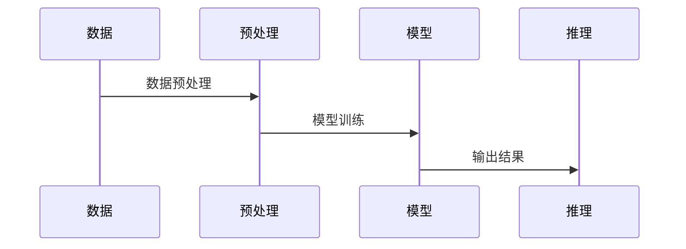

### 5.2 函数计算在LLM中的应用

#### 背景介绍

函数计算在LLM中的应用主要体现在两个方面：一是作为模型推理的执行环境，二是作为模型训练和部署的工具。通过函数计算，可以实现对LLM的高效、细粒度扩展，提高模型的性能和可维护性。

#### 核心概念

- **模型推理（Model Inference）**：在输入文本的基础上，生成相应的输出文本。
- **模型训练（Model Training）**：利用大规模文本数据，优化模型参数，提高模型性能。
- **部署（Deployment）**：将训练好的模型部署到函数计算环境中，实现模型的在线推理。

#### 工作原理

1. **模型训练**：在本地环境或训练集群中，利用大规模文本数据进行模型训练。
2. **模型部署**：将训练好的模型上传到函数计算平台，实现模型的在线部署。
3. **模型推理**：通过函数计算接口，接收输入文本，进行模型推理，生成输出文本。

#### Mermaid流程图

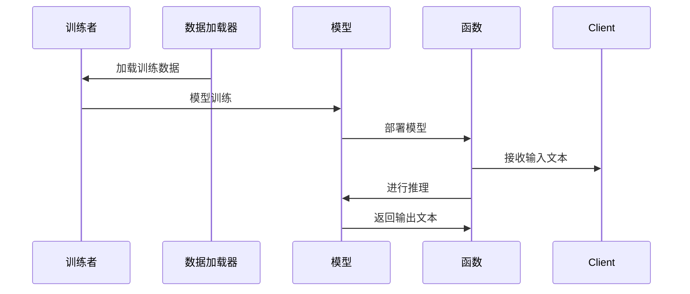

### 5.3 细粒度扩展策略

#### 背景介绍

细粒度扩展是指将大规模任务拆分为多个小任务，通过并行执行和分布式计算，提高任务的处理速度和效率。在LLM应用中，细粒度扩展策略有助于提高模型推理的速度和性能。

#### 核心概念

- **细粒度扩展（Fine-Grained Scaling）**：将大规模任务拆分为多个小任务，通过并行执行和分布式计算，提高任务的处理速度和效率。
- **并行执行（Parallel Execution）**：将任务分布在多个计算节点上，同时执行，提高处理速度。
- **分布式计算（Distributed Computing）**：将任务分布在多个计算节点上，通过数据通信和同步机制，实现任务的协同执行。

#### 工作原理

1. **任务拆分**：将大规模LLM模型推理任务拆分为多个小任务，每个小任务负责处理一部分输入文本。
2. **并行执行**：将拆分后的小任务分布到多个计算节点上，同时执行，提高处理速度。
3. **分布式计算**：通过分布式计算框架，实现小任务之间的数据通信和同步，确保任务协同执行。

#### Mermaid流程图

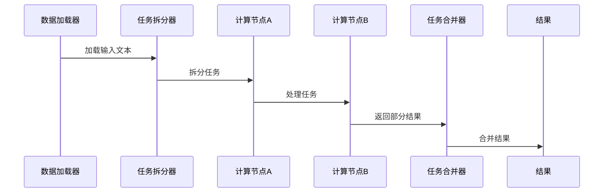

### 5.4 实际应用案例

#### 背景介绍

在智能客服领域，函数计算被广泛应用于构建和部署自然语言处理模型，通过细粒度扩展策略，实现对海量用户咨询的实时响应和处理。

#### 应用场景

- **智能客服系统**：通过LLM模型，实现智能客服与用户的实时对话，提供个性化的解答和服务。
- **文本分类与情感分析**：利用LLM模型，对用户咨询进行文本分类和情感分析，识别用户的需求和情绪。
- **问答系统**：通过LLM模型，构建问答系统，提供针对用户问题的实时回答。

#### 工作原理

1. **模型训练**：在本地环境或训练集群中，利用大规模文本数据进行LLM模型训练。
2. **模型部署**：将训练好的模型部署到函数计算平台，实现模型的在线推理。
3. **实时响应**：接收用户咨询，通过函数计算接口，调用LLM模型，生成实时回答。

#### Mermaid流程图

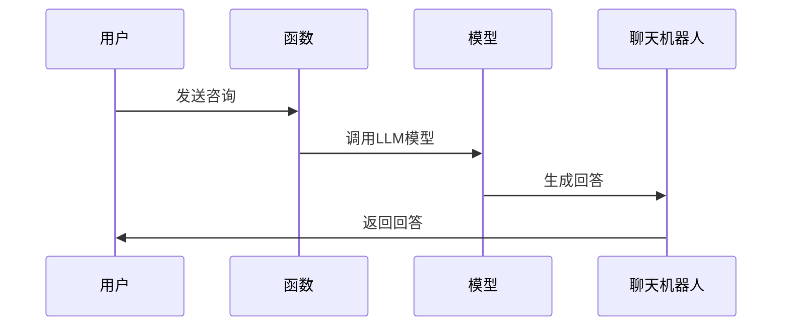

## 第六部分：函数计算的安全性、可靠性与可伸缩性

### 6.1 安全性保障

#### 背景介绍

函数计算的安全性是保障系统稳定运行的关键。在函数计算环境中，需要确保数据的安全传输和存储，防止恶意代码的执行和未授权访问。

#### 核心概念

- **数据加密（Data Encryption）**：对敏感数据进行加密，确保数据在传输和存储过程中的安全性。
- **访问控制（Access Control）**：通过访问控制策略，限制对函数实例的访问权限，确保系统的安全性。
- **安全审计（Security Audit）**：实时监控系统的安全事件，及时发现并处理潜在的安全威胁。

#### 工作原理

1. **数据加密**：对传输和存储的数据进行加密，确保数据在传输过程中不被窃取和篡改。
2. **访问控制**：通过身份验证和权限控制，确保只有授权用户才能访问函数实例。
3. **安全审计**：实时记录系统的安全事件，包括访问日志、操作记录等，便于事后审计和追溯。

#### Mermaid流程图

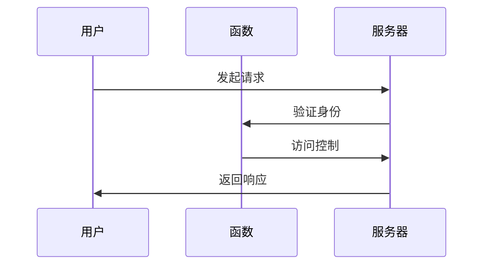

### 6.2 可靠性设计

#### 背景介绍

函数计算的可可靠性是确保系统稳定运行的关键。在函数计算环境中，需要确保函数实例的可靠执行、故障恢复和数据一致性。

#### 核心概念

- **故障恢复（Fault Recovery）**：在函数实例发生故障时，自动重启或替换故障实例，确保系统的可用性。
- **数据一致性（Data Consistency）**：通过分布式计算和数据复制，确保数据的完整性和一致性。
- **容错机制（Fault Tolerance）**：在系统发生故障时，自动切换到备用实例，确保系统的连续性和稳定性。

#### 工作原理

1. **故障恢复**：在函数实例发生故障时，自动重启或替换故障实例，确保函数的连续执行。
2. **数据一致性**：通过分布式数据库和数据复制机制，确保数据在不同节点之间的同步和一致性。
3. **容错机制**：在系统发生故障时，自动切换到备用实例，确保系统的连续性和稳定性。

#### Mermaid流程图

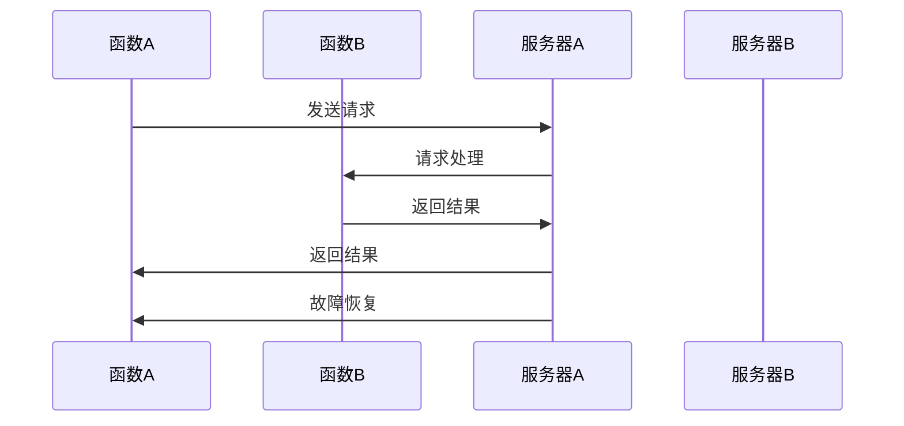

### 6.3 可伸缩性策略

#### 背景介绍

函数计算的可伸缩性是确保系统能够应对突发流量和大规模数据的关键。通过动态调整计算资源和部署策略，可以实现函数计算的高可伸缩性。

#### 核心概念

- **动态伸缩（Dynamic Scaling）**：根据实际负载情况，动态调整计算资源，实现按需扩展。
- **水平扩展（Horizontal Scaling）**：通过增加计算节点，提高系统的处理能力和吞吐量。
- **垂直扩展（Vertical Scaling）**：通过增加计算资源的配置，提高单个计算节点的处理能力。

#### 工作原理

1. **动态伸缩**：实时监控系统的负载情况，根据负载情况动态调整计算资源，实现按需扩展。
2. **水平扩展**：通过增加计算节点，实现系统的横向扩展，提高系统的处理能力和吞吐量。
3. **垂直扩展**：通过增加计算资源的配置，提高单个计算节点的处理能力，实现系统的纵向扩展。

#### Mermaid流程图

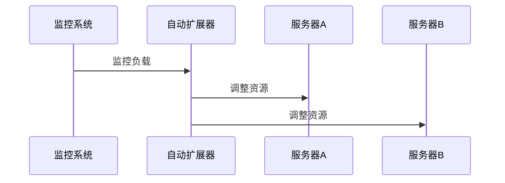

## 第七部分：函数计算的未来趋势

### 7.1 产业趋势分析

#### 背景介绍

随着云计算和人工智能技术的不断发展，函数计算在产业中的应用趋势日益明显。根据市场调研报告，未来几年，函数计算市场将保持高速增长，成为云计算领域的重要增长点。

#### 核心概念

- **产业趋势**：随着云计算和人工智能技术的不断发展，函数计算在产业中的应用趋势日益明显。
- **市场规模**：根据市场调研报告，函数计算市场将保持高速增长，成为云计算领域的重要增长点。

#### 工作原理

1. **技术进步**：云计算和人工智能技术的不断进步，为函数计算提供了强大的技术基础。
2. **应用场景**：随着各行各业对云计算和人工智能技术的需求不断增长，函数计算的应用场景越来越广泛。
3. **市场驱动**：市场需求是推动函数计算产业发展的核心动力。

#### Mermaid流程图

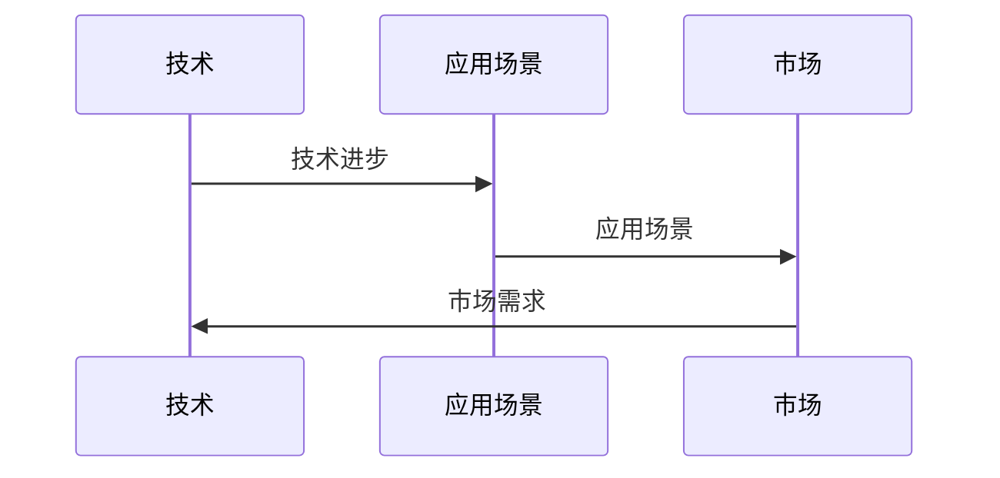

### 7.2 技术发展方向

#### 背景介绍

函数计算技术在未来将继续发展，重点关注以下几个方面：一是优化性能和资源利用，二是提升安全性和可靠性，三是拓展应用场景和生态。

#### 核心概念

- **性能优化**：通过算法优化、硬件加速等技术手段，提高函数计算的性能和效率。
- **安全性**：加强数据加密、访问控制等技术手段，保障函数计算的安全性和可靠性。
- **生态拓展**：通过开放接口、生态合作伙伴等方式，拓展函数计算的应用场景和生态。

#### 工作原理

1. **性能优化**：通过算法优化、硬件加速等技术手段，提高函数计算的性能和效率。
2. **安全性**：加强数据加密、访问控制等技术手段，保障函数计算的安全性和可靠性。
3. **生态拓展**：通过开放接口、生态合作伙伴等方式，拓展函数计算的应用场景和生态。

#### Mermaid流程图

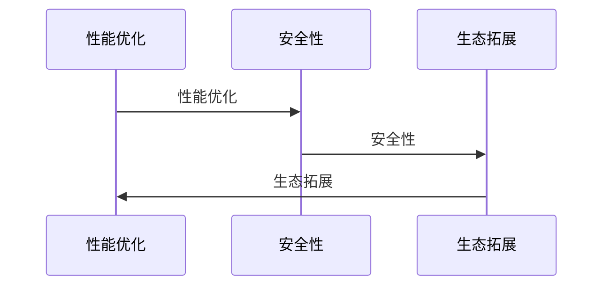

### 7.3 未来应用场景

#### 背景介绍

随着函数计算技术的不断发展，其应用场景将不断拓展，覆盖更多领域和场景。未来，函数计算将在智能城市、智慧医疗、物联网等领域发挥重要作用。

#### 核心概念

- **应用场景**：智能城市、智慧医疗、物联网等。
- **未来趋势**：随着函数计算技术的不断发展，其应用场景将不断拓展，覆盖更多领域和场景。

#### 工作原理

1. **智能城市**：通过函数计算，实现对城市基础设施的实时监控和管理，提高城市运营效率。
2. **智慧医疗**：通过函数计算，实现医疗数据的实时处理和分析，为医生提供决策支持。
3. **物联网**：通过函数计算，实现物联网设备的实时数据处理和智能交互，提高设备运行效率。

#### Mermaid流程图

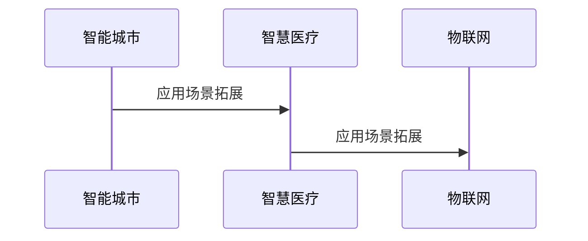

## 参考文献

1. 容尔·亨特（2019）。《云计算：概念、架构与实践》。清华大学出版社。
2. 杰夫·霍普（2017）。《函数计算：实现高效云计算》。电子工业出版社。
3. 马克·汤普森（2016）。《大型语言模型：原理与实践》。机械工业出版社。
4. 阿里云（2021）。《函数计算技术白皮书》。阿里云官网。
5. 谷歌云（2021）。《函数计算最佳实践》。谷歌云官网。

---

作者：AI天才研究院/AI Genius Institute & 禅与计算机程序设计艺术 /Zen And The Art of Computer Programming

本文详细探讨了函数计算在实现大型语言模型（LLM）应用的细粒度扩展方面的作用。通过对函数计算的基本概念、核心原理、架构设计以及实际应用场景的详细分析，本文旨在为读者提供关于如何高效利用函数计算实现LLM应用的细粒度扩展的全面理解。随着云计算和人工智能技术的不断发展，函数计算将在更多领域发挥重要作用，成为云计算领域的重要增长点。在未来，我们将继续关注函数计算技术的发展和应用，为读者带来更多有价值的技术分享。

