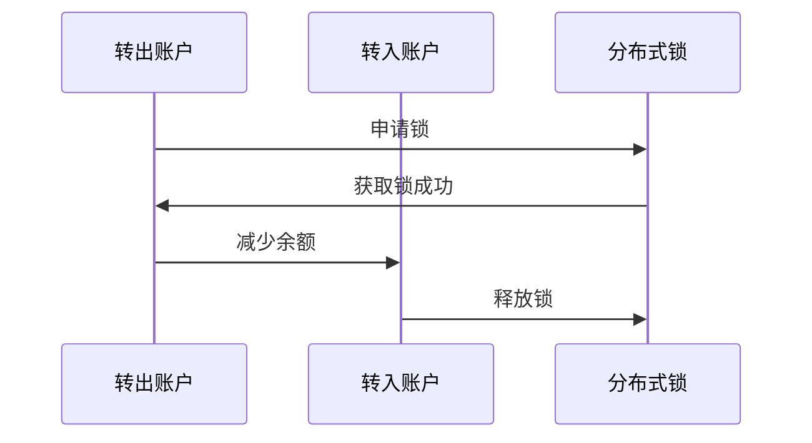
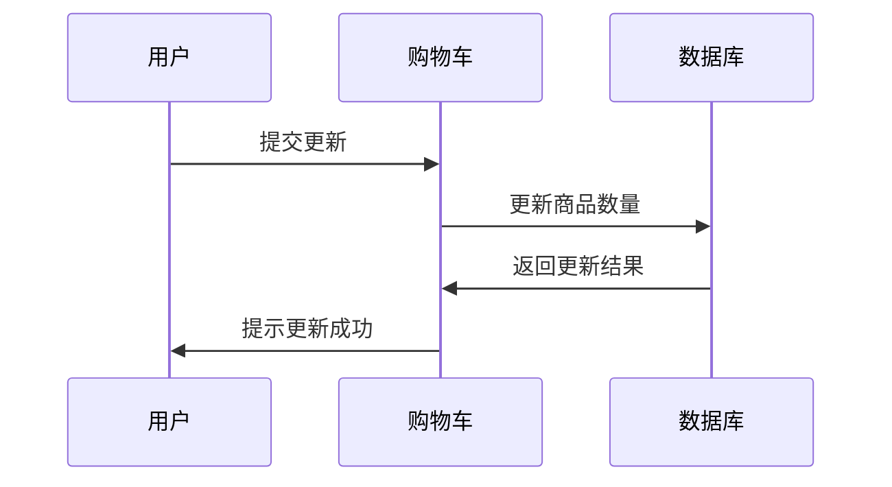
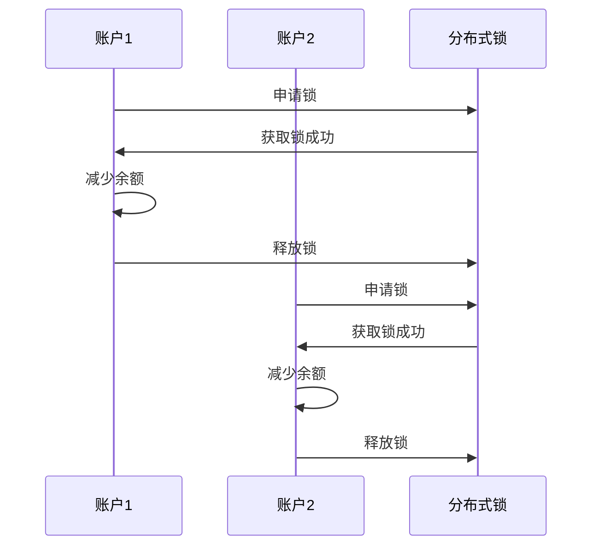
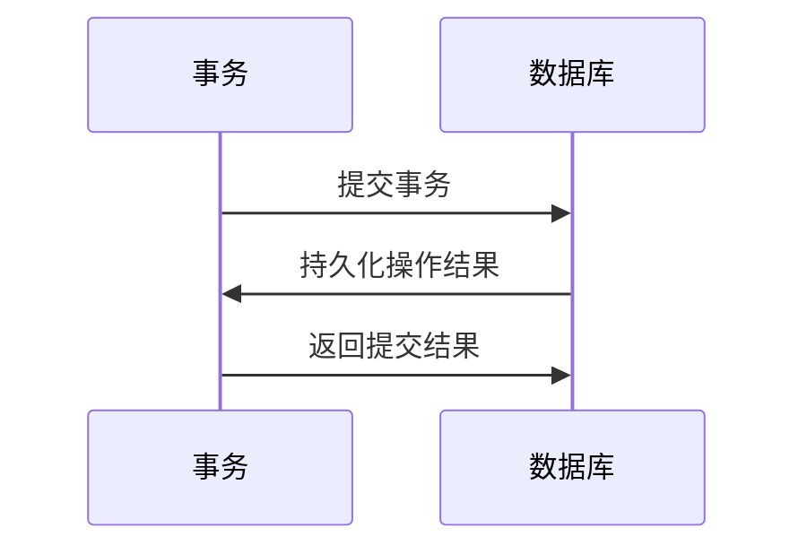
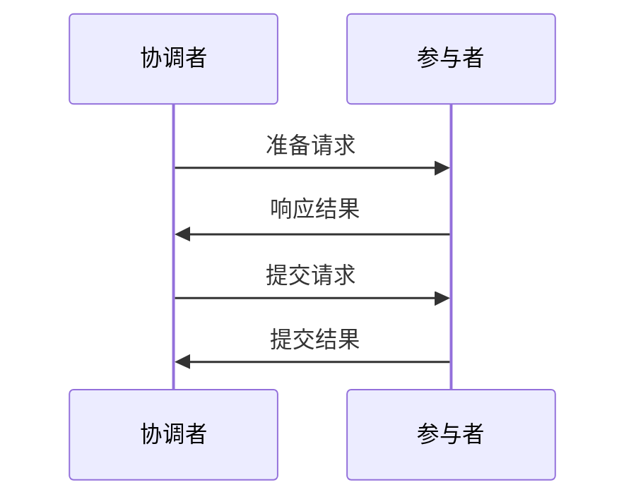
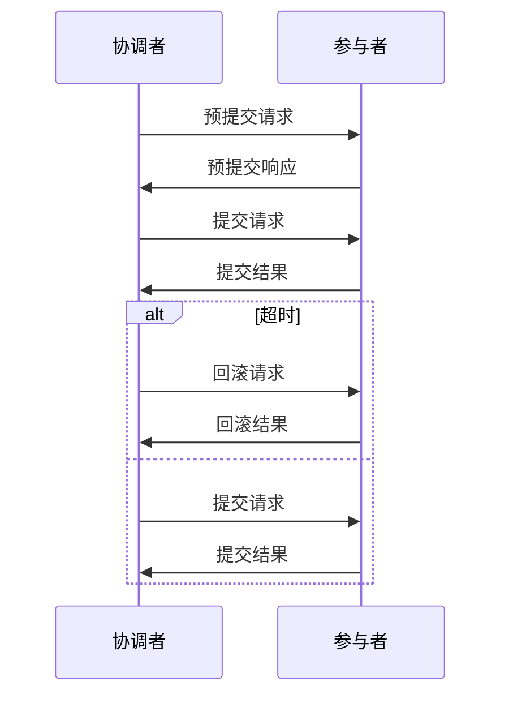
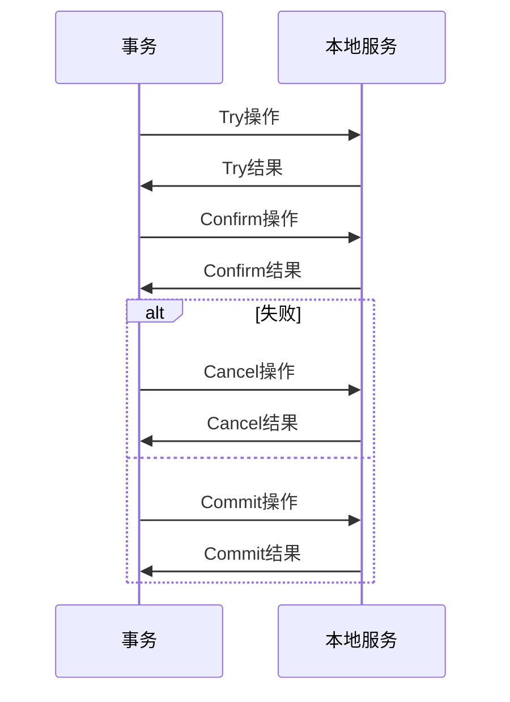
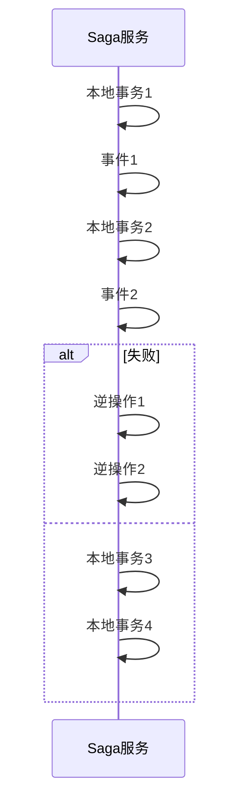

                 

### 分布式事务在LLM应用中的处理策略

#### 关键词：分布式事务、LLM应用、处理策略、一致性、容错、性能优化

#### 摘要：

随着人工智能（AI）技术的发展，大型语言模型（LLM）在自然语言处理（NLP）领域取得了显著进展。LLM在应用场景中需要处理海量数据和复杂业务逻辑，这就带来了分布式事务处理的需求。本文将从分布式事务的基础概念入手，深入探讨分布式事务在LLM应用中的处理策略。通过分析分布式事务的ACID特性、分布式事务处理技术，以及分布式事务在LLM应用中的挑战，本文将给出具体的处理策略和实践案例，旨在为开发者提供有价值的参考。

## 第一部分：分布式事务基础

### 第1章：分布式系统与分布式事务概述

#### 1.1 分布式系统的基本概念

**分布式系统定义**

分布式系统是指由多个独立的计算机节点通过网络互联组成的系统。这些节点协同工作，共同完成一个整体任务。分布式系统中的每个节点可以独立处理任务，并通过网络进行通信和协同。

**分布式系统的优势与挑战**

优势：
- **可扩展性**：分布式系统可以水平扩展，通过增加节点数量来提升系统处理能力。
- **可用性**：分布式系统中的节点可以独立工作，即使某些节点发生故障，系统仍能正常运行。
- **容错性**：分布式系统具有较好的容错性，可以容忍部分节点的故障。

挑战：
- **数据一致性**：分布式系统中，数据的一致性是一个重要的挑战。不同节点可能同时访问和修改同一数据，导致数据不一致。
- **分布式事务**：分布式事务处理涉及到多个节点的数据操作，如何保证事务的原子性、一致性、隔离性和持久性，是一个复杂的问题。

**分布式事务的概念**

分布式事务是指涉及多个数据库或数据源的原子操作序列。在分布式系统中，事务可以跨越多个节点执行，并且需要保证事务的ACID特性。

#### 1.2 分布式事务的特点

**数据一致性的重要性**

数据一致性是分布式事务的核心目标之一。在分布式系统中，数据可能分布在多个节点上，如何保证这些节点的数据在事务执行前后保持一致，是一个关键问题。

**分布式事务的ACID特性**

- **原子性（Atomicity）**：事务中的所有操作要么全部执行，要么全部不执行。即事务执行过程中不可分割，要么成功，要么失败。
- **一致性（Consistency）**：事务执行前后的数据状态应满足一定的业务规则。即事务执行前后，系统的数据应保持一致。
- **隔离性（Isolation）**：事务之间的操作应相互隔离，防止并发操作相互干扰。即一个事务在执行过程中，不应受到其他事务的影响。
- **持久性（Durability）**：一旦事务提交，其操作结果应永久保存，即使系统发生故障也不会丢失。即事务提交后，其结果应被持久化到数据库中。

**分布式事务的常见问题**

- **数据不一致**：由于网络延迟、节点故障等原因，分布式事务可能面临数据不一致的问题。
- **分布式死锁**：多个事务在多个节点上相互等待，导致系统瘫痪。
- **分布式事务隔离性**：如何在分布式系统中实现严格的隔离性，是一个挑战。

### 第2章：分布式事务的ACID特性

#### 2.1 原子性（Atomicity）

**定义与作用**

原子性是指事务中的所有操作要么全部执行，要么全部不执行。即事务执行过程中不可分割，要么成功，要么失败。

**保障原子性的方法**

- **两阶段提交协议（2PC）**：通过协调者节点来控制事务的提交过程，确保事务的原子性。
- **分布式锁**：在分布式系统中，通过分布式锁来保证事务的原子性。

**例子：银行转账操作**

在银行转账操作中，需要将资金的转出账户和转入账户同时更新。为了保证操作的原子性，可以采用分布式锁来控制转账操作。



#### 2.2 一致性（Consistency）

**定义与作用**

一致性是指事务执行前后的数据状态应满足一定的业务规则。即事务执行前后，系统的数据应保持一致。

**保障一致性的方法**

- **数据校验**：在事务执行前后，对数据进行校验，确保数据的一致性。
- **分布式事务框架**：使用分布式事务框架来保障事务的一致性。

**例子：购物车更新操作**

在购物车更新操作中，需要同时更新数据库中的商品数量和用户订单状态。为了保证操作的一致性，可以采用分布式事务框架来控制更新操作。



#### 2.3 隔离性（Isolation）

**定义与作用**

隔离性是指事务之间的操作应相互隔离，防止并发操作相互干扰。即一个事务在执行过程中，不应受到其他事务的影响。

**保障隔离性的方法**

- **分布式锁**：通过分布式锁来保障事务的隔离性。
- **隔离级别**：根据业务需求，选择适当的隔离级别来保障事务的隔离性。

**例子：并发账户操作**

在并发账户操作中，需要同时更新多个账户的余额。为了保证操作的隔离性，可以采用分布式锁来控制并发操作。



#### 2.4 持久性（Durability）

**定义与作用**

持久性是指一旦事务提交，其操作结果应永久保存，即使系统发生故障也不会丢失。即事务提交后，其结果应被持久化到数据库中。

**保障持久性的方法**

- **数据库持久化**：将事务的操作结果持久化到数据库中，确保数据的持久性。
- **分布式事务框架**：使用分布式事务框架来保障事务的持久性。

**例子：数据库提交操作**

在数据库提交操作中，需要将事务的操作结果持久化到数据库中。为了保证操作的持久性，可以采用分布式事务框架来控制提交操作。



## 第二部分：分布式事务处理技术

### 第3章：分布式事务协议

#### 3.1 二阶段提交协议（2PC）

**协议原理**

二阶段提交协议（2PC）是一种分布式事务处理协议，用于保证分布式系统中多个节点之间的事务一致性。2PC将事务提交过程分为两个阶段：准备阶段和提交阶段。

**协议流程**

1. **准备阶段**：协调者节点向参与者节点发送准备请求，参与者节点执行本地事务，并返回是否准备就绪的响应。
2. **提交阶段**：协调者节点根据参与者节点的响应结果，决定是否提交事务。如果所有参与者节点都准备就绪，协调者节点向参与者节点发送提交请求，参与者节点执行本地事务的提交操作；否则，协调者节点向参与者节点发送回滚请求，参与者节点执行本地事务的回滚操作。

**优缺点分析**

优点：
- **一致性保障**：2PC能够确保分布式系统中多个节点之间的事务一致性。
- **简单实现**：2PC的协议实现相对简单。

缺点：
- **性能开销**：2PC需要进行多次网络通信，性能开销较大。
- **分布式死锁风险**：2PC可能导致分布式死锁问题。

#### 3.2 三阶段提交协议（3PC）

**协议原理**

三阶段提交协议（3PC）是对二阶段提交协议的改进，通过引入预提交阶段，进一步降低分布式死锁的风险。

**协议流程**

1. **预提交阶段**：协调者节点向参与者节点发送预提交请求，参与者节点执行本地事务，并返回是否预提交就绪的响应。
2. **提交阶段**：协调者节点根据参与者节点的响应结果，决定是否提交事务。如果所有参与者节点都预提交就绪，协调者节点向参与者节点发送提交请求，参与者节点执行本地事务的提交操作；否则，协调者节点向参与者节点发送回滚请求，参与者节点执行本地事务的回滚操作。
3. **超时阶段**：在预提交阶段和提交阶段，如果协调者节点在一定时间内未收到参与者节点的响应，协调者节点将自动执行回滚操作。

**优缺点分析**

优点：
- **降低分布式死锁风险**：3PC通过引入预提交阶段，降低分布式死锁的风险。
- **性能提升**：3PC减少了一次网络通信，性能相对2PC有所提升。

缺点：
- **复杂度增加**：3PC的协议实现相对复杂。
- **性能仍需优化**：虽然3PC相对2PC性能有所提升，但在高并发场景下，性能仍需优化。

#### 3.3 脂肪指针与最终一致性

**脂肪指针原理**

脂肪指针是一种实现最终一致性的数据同步机制。在分布式系统中，多个节点之间通过脂肪指针实现数据的同步。脂肪指针包括两个部分：指向真实数据的指针和指向旧数据的指针。当新数据生成时，旧数据不会立即被丢弃，而是保留在旧数据指针中。通过比较指针，可以确定数据是否保持一致。

**最终一致性模型**

最终一致性模型是指分布式系统中的数据最终会达到一致性，但可能需要一定时间。在最终一致性模型中，多个节点之间的数据同步是通过事件驱动的方式实现的。当某个节点发生变更时，会将变更事件通知其他节点，其他节点根据事件进行数据更新。

**实现与优缺点分析**

优点：
- **最终一致性**：最终一致性模型能够实现分布式系统中的最终一致性。
- **数据同步灵活**：通过事件驱动的方式实现数据同步，数据同步更加灵活。

缺点：
- **数据一致性延迟**：最终一致性模型可能导致数据一致性的延迟。
- **实现复杂度**：最终一致性模型的实现相对复杂。

### 第4章：分布式事务框架

#### 4.1 分布式事务框架概述

**分布式事务框架的作用**

分布式事务框架用于解决分布式系统中的分布式事务处理问题。其主要作用包括：
- **事务管理**：分布式事务框架提供事务管理机制，确保分布式事务的原子性、一致性、隔离性和持久性。
- **数据同步**：分布式事务框架提供数据同步机制，实现分布式系统中的数据一致性。
- **容错与恢复**：分布式事务框架提供容错与恢复机制，确保分布式系统在发生故障时能够快速恢复。

**常见的分布式事务框架**

- **TCC（Try-Confirm-Cancel）补偿事务框架**：TCC是一种基于补偿事务的分布式事务框架，通过Try、Confirm和Cancel三个阶段来保障分布式事务的一致性。
- **SAGA模式**：SAGA模式是一种基于事件驱动的分布式事务框架，通过多个独立的本地事务来实现分布式事务的一致性。
- **分布式锁框架**：分布式锁框架用于实现分布式系统中的分布式锁，保障分布式事务的隔离性。

#### 4.2 TCC（Try-Confirm-Cancel）补偿事务

**TCC协议原理**

TCC是一种基于补偿事务的分布式事务框架。TCC将分布式事务分为三个阶段：Try、Confirm和Cancel。

- **Try阶段**：尝试执行本地事务，并记录相关日志。
- **Confirm阶段**：确认本地事务是否成功，并执行相应的提交操作。
- **Cancel阶段**：在本地事务失败时，执行补偿操作以恢复系统状态。

**TCC实现流程**

1. **Try阶段**：调用本地服务的Try接口，执行本地事务。
2. **Confirm阶段**：调用本地服务的Confirm接口，确认本地事务是否成功。
3. **Cancel阶段**：在本地事务失败时，调用本地服务的Cancel接口，执行补偿操作。

**TCC优缺点分析**

优点：
- **易实现**：TCC的实现相对简单，易于理解和实现。
- **高容错性**：TCC通过补偿操作来恢复系统状态，具有较高的容错性。

缺点：
- **性能开销**：TCC需要进行多次网络通信，性能开销较大。
- **代码复杂性**：TCC需要编写额外的补偿代码，增加了代码复杂性。

#### 4.3 Saga模式

**Saga模式原理**

Saga模式是一种基于事件驱动的分布式事务框架。在Saga模式中，分布式事务由多个独立的本地事务组成，每个本地事务都有一个对应的逆操作。

- **本地事务**：执行具体的业务操作。
- **逆操作**：在本地事务失败时，执行逆操作来恢复系统状态。

**Saga实现流程**

1. **本地事务执行**：执行本地事务，记录日志。
2. **事件监听**：监听事务执行结果，判断是否成功。
3. **逆操作执行**：在本地事务失败时，执行逆操作。

**Saga优缺点分析**

优点：
- **灵活性**：Saga模式具有较好的灵活性，适用于各种复杂业务场景。
- **代码可读性**：Saga模式的代码结构清晰，易于理解和维护。

缺点：
- **复杂性**：Saga模式的实现相对复杂，需要编写大量的逆操作代码。
- **数据一致性**：Saga模式可能导致数据一致性的延迟。

## 第三部分：分布式事务在LLM应用中的挑战

### 第5章：分布式事务在LLM应用中的挑战

#### 5.1 大规模数据处理

**数据规模对事务处理的影响**

随着LLM应用的规模不断扩大，数据规模对事务处理带来了巨大的挑战。大规模数据处理需要考虑以下问题：

- **并发控制**：在大量并发请求下，如何保证事务的隔离性，防止数据冲突。
- **数据一致性**：在分布式系统中，如何保障数据的一致性，防止数据不一致。
- **性能优化**：如何优化分布式事务的处理性能，提高系统的响应速度。

**大规模数据处理的解决方案**

- **分布式数据库**：采用分布式数据库来处理大规模数据，实现数据的分布式存储和查询。
- **分库分表**：将数据按照不同的维度进行拆分，实现数据的水平扩展。
- **事务隔离级别优化**：根据业务需求，选择适当的事务隔离级别，提高系统的并发性能。

#### 5.2 多语言环境下的分布式事务

**多语言环境下的挑战**

在多语言环境中，分布式事务处理面临以下挑战：

- **数据类型兼容性**：不同编程语言的数据类型和格式可能存在差异，需要处理数据类型的兼容性。
- **事务隔离级别兼容性**：不同编程语言的事务隔离级别可能不一致，需要协调不同语言的事务隔离级别。
- **网络通信协议**：不同编程语言的分布式事务处理可能采用不同的网络通信协议，需要实现协议的兼容性。

**多语言环境下的分布式事务解决方案**

- **统一数据格式**：采用统一的数据格式，如JSON或Protobuf，实现不同编程语言之间的数据交换。
- **事务隔离级别映射**：将不同编程语言的事务隔离级别映射到统一的事务隔离级别，确保事务的一致性。
- **网络通信协议适配**：实现不同编程语言的网络通信协议适配器，确保分布式事务的网络通信。

#### 5.3 容错与恢复

**分布式系统的容错机制**

分布式系统需要具备一定的容错能力，以应对节点故障、网络故障等异常情况。分布式系统的容错机制包括：

- **副本机制**：通过数据冗余和副本机制，实现数据的备份和恢复。
- **故障检测与恢复**：通过故障检测和恢复机制，及时发现并处理节点故障。
- **自愈机制**：通过自愈机制，自动恢复系统的正常运行。

**分布式事务的恢复策略**

分布式事务的恢复策略包括：

- **事务日志恢复**：通过事务日志记录，实现分布式事务的恢复。
- **补偿事务恢复**：在分布式事务失败时，通过补偿事务来恢复系统状态。
- **重试机制**：在分布式事务失败时，采用重试机制来重新执行事务。

## 第三部分：分布式事务处理策略实践

### 第6章：分布式事务处理策略设计

#### 6.1 分布式事务处理策略设计原则

**设计原则与目标**

分布式事务处理策略的设计原则包括：

- **一致性保障**：确保分布式事务的一致性，防止数据不一致。
- **性能优化**：优化分布式事务的处理性能，提高系统的响应速度。
- **容错与恢复**：确保分布式事务的容错能力，快速恢复系统正常运行。

**事务处理策略的设计流程**

分布式事务处理策略的设计流程包括以下步骤：

1. **需求分析**：分析业务需求，明确分布式事务处理的业务场景和性能要求。
2. **架构设计**：设计分布式事务处理架构，包括分布式数据库、分布式锁、分布式事务框架等。
3. **策略选择**：根据业务需求和架构设计，选择合适的事务处理策略，如TCC、SAGA等。
4. **实现与优化**：根据选定的策略，实现分布式事务处理功能，并进行性能优化。

#### 6.2 分布式事务处理策略案例分析

**案例背景**

某电商平台采用分布式事务处理策略来处理订单系统中的分布式事务。订单系统需要同时更新数据库中的商品库存、订单状态等数据，并保证数据的一致性。

**案例解决方案**

1. **分布式数据库**：采用分布式数据库来存储商品库存和订单数据，实现数据的分布式存储和查询。
2. **分布式锁**：在订单处理过程中，使用分布式锁来保证并发操作的隔离性，防止数据冲突。
3. **TCC补偿事务**：采用TCC补偿事务来处理分布式事务，确保事务的原子性、一致性和容错性。

**案例评价**

该分布式事务处理策略能够保障订单系统中的数据一致性，提高系统的并发性能。但在高并发场景下，TCC补偿事务的性能存在一定的瓶颈。因此，需要进一步优化分布式事务处理策略，提高系统的整体性能。

### 第7章：分布式事务处理策略实战

#### 7.1 分布式事务处理策略开发环境搭建

**开发环境配置**

1. **分布式数据库**：选择合适的分布式数据库，如Apache Cassandra、Hazelcast等。
2. **分布式锁**：选择合适的分布式锁库，如RedLock、Zookeeper等。
3. **分布式事务框架**：选择合适的分布式事务框架，如TCC、SAGA等。

**开发工具选择**

1. **IDE**：选择合适的集成开发环境（IDE），如IntelliJ IDEA、Eclipse等。
2. **版本控制**：选择合适的版本控制工具，如Git、SVN等。
3. **构建工具**：选择合适的构建工具，如Maven、Gradle等。

#### 7.2 分布式事务处理策略代码实现

**分布式事务处理框架搭建**

1. **分布式数据库连接**：实现分布式数据库的连接和操作。
2. **分布式锁实现**：实现分布式锁的功能，如锁的获取、释放等。
3. **分布式事务框架**：实现分布式事务的框架功能，如Try、Confirm、Cancel等。

**分布式事务处理策略代码示例**

```java
// 分布式数据库连接
Connection connection = distributedDatabase.getConnection();

// 分布式锁获取
distributedLock.acquire(lockKey);

// 分布式事务执行
try {
    // 执行本地事务
    localTransaction.execute(connection);
    
    // 确认事务
    distributedTransaction.confirm();
} catch (Exception e) {
    // 补偿事务
    distributedTransaction.cancel();
} finally {
    // 分布式锁释放
    distributedLock.release(lockKey);
}
```

#### 7.3 分布式事务处理策略代码解读与分析

**代码实现细节解析**

- **分布式数据库连接**：通过分布式数据库连接池实现分布式数据库的连接和操作。
- **分布式锁实现**：通过分布式锁库实现分布式锁的功能，如RedLock、Zookeeper等。
- **分布式事务框架**：通过分布式事务框架实现分布式事务的框架功能，如TCC、SAGA等。

**代码性能优化**

- **数据库连接池优化**：通过优化数据库连接池参数，提高数据库连接的性能。
- **分布式锁性能优化**：通过优化分布式锁的实现，提高分布式锁的性能。
- **分布式事务框架优化**：通过优化分布式事务框架的内部逻辑，提高分布式事务的性能。

### 第8章：分布式事务处理策略应用总结

#### 8.1 分布式事务处理策略总结

**分布式事务处理策略的优缺点**

- **TCC补偿事务**：优点是易实现、高容错性；缺点是性能开销较大、代码复杂性较高。
- **SAGA模式**：优点是灵活性、代码可读性；缺点是复杂性较高、数据一致性延迟。

**分布式事务处理策略的应用场景**

- **高并发场景**：在需要高并发性能的场景下，可以选择TCC补偿事务。
- **复杂业务场景**：在需要灵活性和代码可读性的复杂业务场景下，可以选择SAGA模式。

#### 8.2 未来分布式事务处理趋势展望

**新技术的发展趋势**

- **分布式数据库技术**：随着分布式数据库技术的发展，分布式事务处理将更加高效和可靠。
- **分布式锁技术**：分布式锁技术将不断发展，提高分布式事务的隔离性。
- **分布式事务框架**：分布式事务框架将逐步成熟，提供更加丰富的功能和更好的性能。

**分布式事务处理策略的未来发展方向**

- **性能优化**：通过优化分布式事务处理策略，提高系统的响应速度和处理性能。
- **数据一致性保障**：通过新的技术和方法，提高分布式事务的数据一致性保障能力。
- **自动化与智能化**：通过自动化和智能化手段，降低分布式事务处理的人工干预，提高系统的可靠性和稳定性。

## 附录

### 附录 A：分布式事务处理资源列表

**分布式事务处理相关书籍**

- 《分布式系统原理与范型》
- 《分布式数据库系统》
- 《大规模分布式存储系统》

**分布式事务处理开源框架**

- TCC-Transaction：https://github.com/dromara/TCC-Transaction
- SAGA模式：https://github.com/jira/saga-pattern
- RedLock：https://github.com/nats-io/redlock

**分布式事务处理社区与论坛**

- 分布式事务处理论坛：https://www.distributed-transaction.org/
- 大规模分布式存储技术社区：https://www.distributed-storage.org/

### 附录 B：分布式事务处理常用算法伪代码

**二阶段提交协议伪代码**



**三阶段提交协议伪代码**



**TCC补偿事务伪代码**



**Saga模式伪代码**



### 附录 C：分布式事务处理常见问题与解决方案

**分布式事务处理常见问题**

- **数据不一致**：分布式系统中的数据不一致是一个常见问题，可能导致业务逻辑错误。
- **分布式死锁**：分布式系统中可能发生死锁，导致系统瘫痪。
- **事务隔离性**：如何在分布式系统中实现严格的隔离性，是一个挑战。
- **性能开销**：分布式事务处理可能带来额外的性能开销。

**分布式事务处理解决方案**

- **数据一致性保障**：通过分布式锁、分布式事务框架等机制，保障数据的一致性。
- **分布式死锁预防**：通过合理的锁策略和死锁检测算法，预防分布式死锁的发生。
- **事务隔离性保障**：根据业务需求，选择适当的事务隔离级别，保障事务的隔离性。
- **性能优化**：通过数据库优化、分布式锁优化等手段，提高分布式事务的处理性能。

