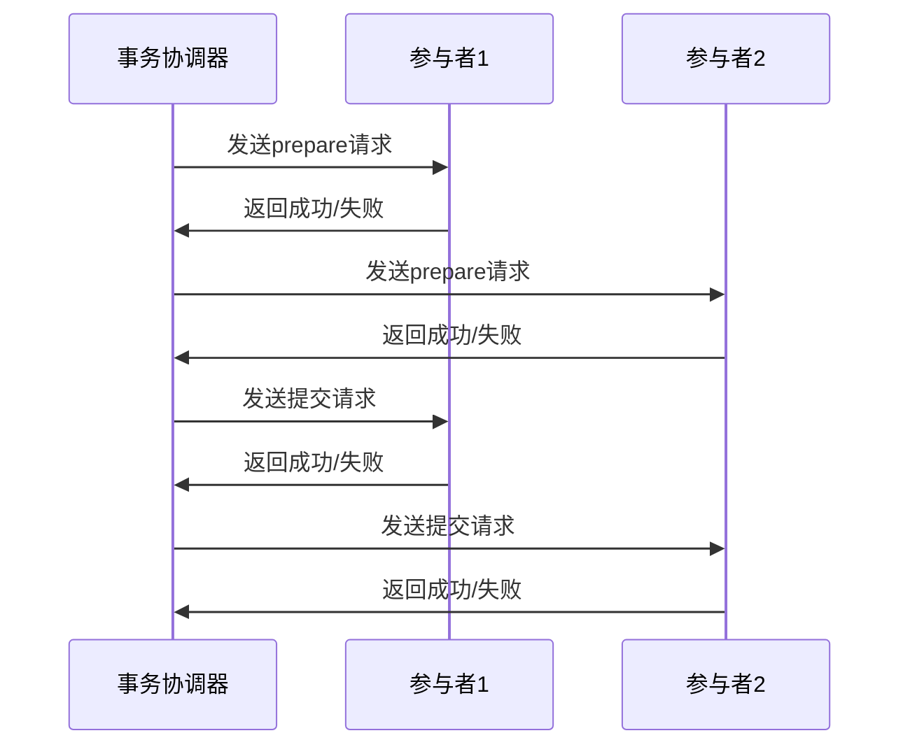
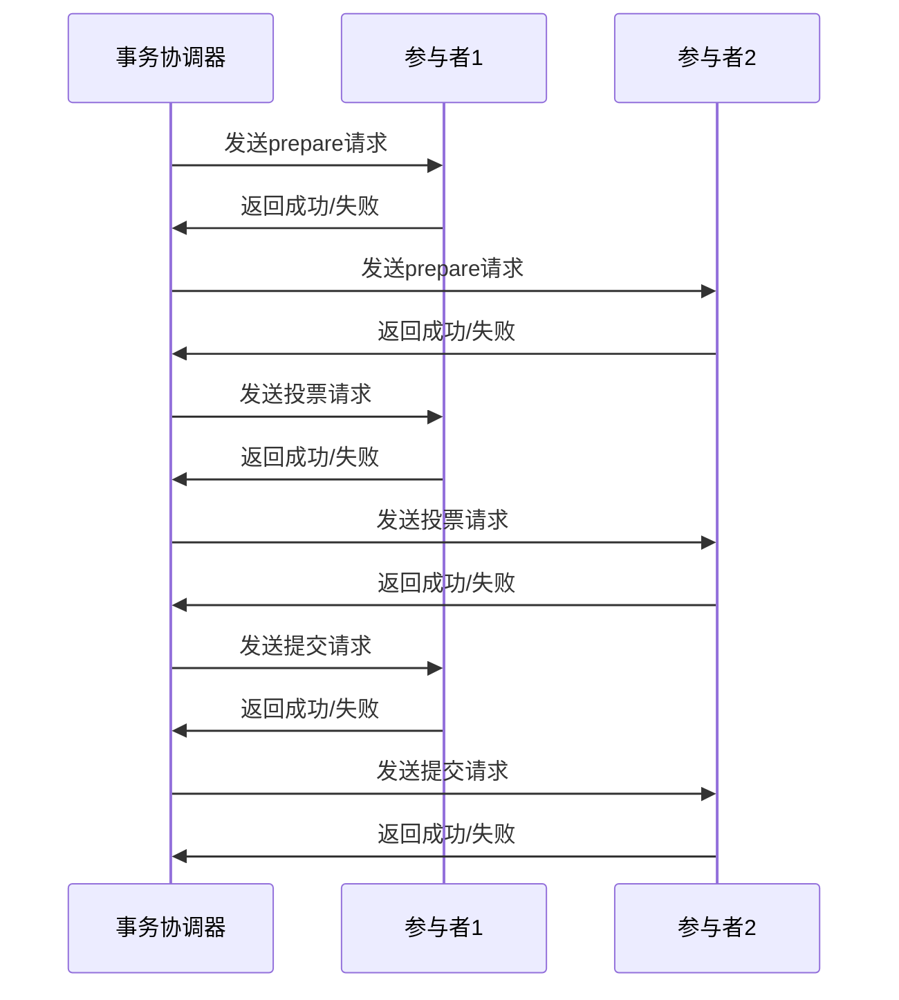
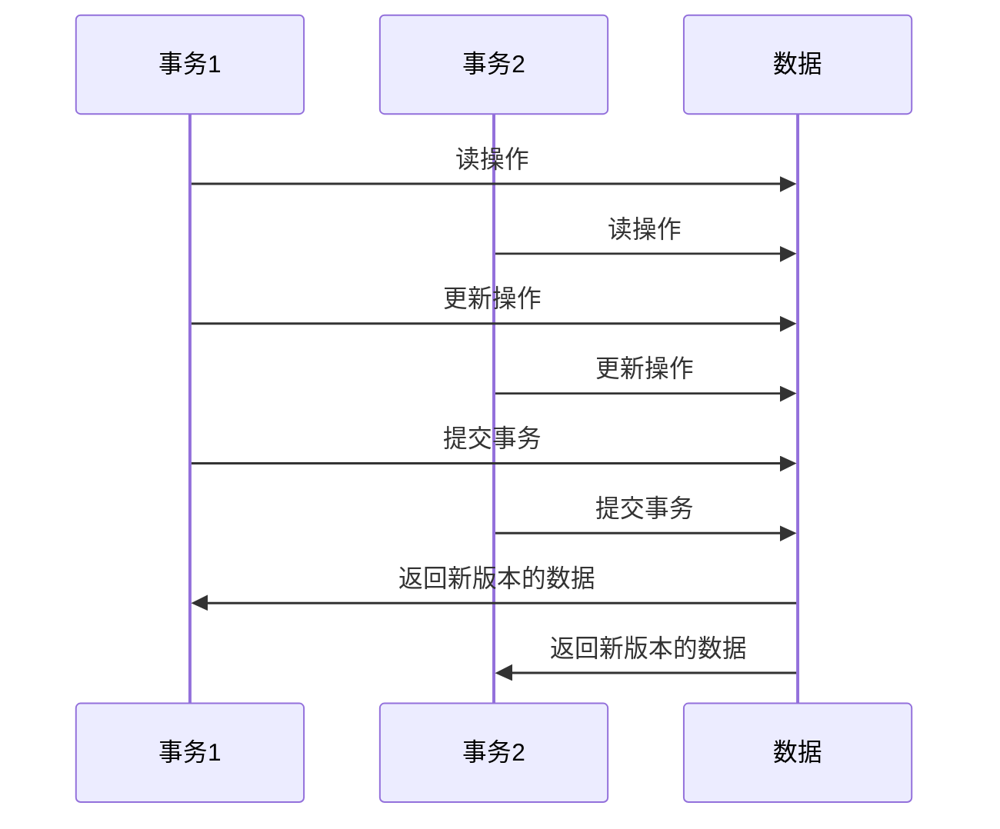

                 

### 文章标题：分布式事务管理器在LLM应用中的应用

#### 关键词：分布式事务管理器、LLM应用、两阶段提交协议、三阶段提交协议、多版本并发控制

#### 摘要：
随着大规模语言模型（LLM）的兴起，分布式事务管理器在确保数据一致性和系统可靠性方面的重要性日益凸显。本文将深入探讨分布式事务管理器的基本概念、核心算法以及其在LLM应用中的实际应用和挑战。通过分析分布式事务管理器在LLM中的应用场景，本文旨在提供一套完整的解决方案，并展望其未来的发展方向。通过对多个实际案例的研究，本文将展示分布式事务管理器如何有效提升LLM应用的性能和可靠性。

## 分布式事务管理器基础

### 第1章：分布式系统与事务

#### 1.1 分布式系统的概念

分布式系统是由多个独立的计算节点组成的系统，这些节点通过网络相互连接，共同完成计算任务。与集中式系统相比，分布式系统具有更高的可扩展性、容错性和可用性。然而，分布式系统也面临着一系列的挑战，如数据一致性、节点故障、网络延迟等。

#### 1.1.1 分布式系统与集中式系统的比较

集中式系统通常由一个中央服务器负责所有的数据处理任务。这种系统的优势在于设计简单，易于管理和维护。然而，其扩展性较差，一旦中央服务器出现故障，整个系统将无法正常运行。

分布式系统则通过将计算任务分配到多个节点上，从而提高了系统的扩展性和容错性。每个节点都可以独立处理任务，并且节点之间的通信是通过网络进行的。分布式系统的优势在于可以轻松地扩展计算能力，同时提高系统的可靠性。

#### 1.1.2 分布式系统的挑战

分布式系统面临的挑战主要包括以下几个方面：

1. **数据一致性**：在分布式系统中，数据可能分布在多个节点上，如何确保这些数据的一致性是一个关键问题。例如，当一个节点上的数据发生更改时，如何确保其他节点上的数据也进行相应的更新？

2. **节点故障**：分布式系统中的节点可能会因硬件故障、软件错误或网络问题而失效。如何检测和恢复这些故障节点，以保持系统的正常运行，是一个重要的挑战。

3. **网络延迟**：在分布式系统中，节点之间的通信是通过网络进行的，网络延迟可能会影响系统的性能。如何优化网络通信，减少延迟，是一个重要的课题。

#### 1.2 事务的基本概念

事务是一系列操作序列，这些操作要么全部成功执行，要么全部不执行。事务的目的是确保数据的一致性和完整性。在数据库系统中，事务通常具有以下特性：

1. **原子性**（Atomicity）：事务的所有操作要么全部成功执行，要么全部不执行。如果事务中的某个操作失败，整个事务将回滚到初始状态。

2. **一致性**（Consistency）：事务执行前后，数据应保持一致性。即，事务的执行不应破坏数据的完整性和规则。

3. **隔离性**（Isolation）：事务的执行是隔离的，即一个事务的执行不应受到其他事务的影响。每个事务都应独立执行，以确保数据的正确性。

4. **持久性**（Durability）：一旦事务成功提交，其修改的效果应永久保存，即使系统发生故障。

#### 1.2.1 事务的ACID特性

ACID特性是事务的基本特性，它们确保了事务的正确性和可靠性：

1. **原子性**：事务的所有操作要么全部成功执行，要么全部不执行。
2. **一致性**：事务执行前后，数据应保持一致性。
3. **隔离性**：事务的执行是隔离的，即一个事务的执行不应受到其他事务的影响。
4. **持久性**：一旦事务成功提交，其修改的效果应永久保存。

#### 1.2.2 事务处理在分布式系统中的重要性

在分布式系统中，事务处理至关重要。分布式事务可以确保以下目标：

1. **数据一致性**：通过确保分布式系统中的数据在不同节点上的一致性，事务处理有助于维护数据的正确性和完整性。

2. **容错性**：通过事务的原子性和持久性，系统可以在节点故障时恢复数据，从而提高系统的容错性。

3. **并发控制**：分布式事务可以确保多个事务的并发执行不会相互干扰，从而提高系统的性能和吞吐量。

### 1.3 分布式事务管理器的作用

分布式事务管理器（Distributed Transaction Manager，简称DTC）是分布式系统中负责事务管理的关键组件。DTC的主要作用包括：

1. **事务协调**：DTC负责协调分布式系统中各个节点上的事务，确保事务的原子性、一致性和持久性。

2. **故障恢复**：DTC可以检测和恢复节点故障，确保系统的容错性。

3. **并发控制**：DTC负责管理多个事务的并发执行，确保事务的隔离性。

#### 1.3.1 分布式事务管理器的架构

分布式事务管理器的架构通常包括以下组件：

1. **事务协调器**：事务协调器是DTC的核心组件，负责协调分布式系统中的事务。事务协调器通常具有全局视图，可以决定哪些节点参与事务，以及事务的执行顺序。

2. **事务参与者**：事务参与者是分布式系统中的各个节点，它们负责执行事务操作，并向事务协调器报告执行结果。

3. **日志服务**：日志服务负责记录事务的执行过程和状态，以便在故障恢复时进行数据恢复。

#### 1.3.2 分布式事务管理器的工作原理

分布式事务管理器的工作原理可以分为以下几个步骤：

1. **事务初始化**：当一个事务开始时，事务协调器为该事务生成一个全局唯一的标识符（事务ID），并将事务的初始状态记录在日志服务中。

2. **参与者注册**：事务协调器通知各个参与者加入事务，并分配每个参与者的角色（如协调器、参与者等）。

3. **事务执行**：参与者根据事务协调器的指示执行相应的操作，并将操作结果报告给事务协调器。

4. **事务提交或回滚**：根据参与者的报告，事务协调器决定事务是提交还是回滚。如果所有参与者都成功执行了操作，事务将提交；否则，事务将回滚。

5. **日志记录与恢复**：事务协调器将事务的执行过程和状态记录在日志服务中，以便在故障恢复时进行数据恢复。

### 第2章：分布式事务管理器的核心算法

#### 2.1 两阶段提交协议（2PC）

两阶段提交协议（Two-Phase Commit Protocol，简称2PC）是分布式事务管理中最常用的协议之一。2PC通过两个阶段来确保分布式事务的原子性和一致性。

#### 2.1.1 2PC的基本原理

2PC的基本原理如下：

1. **准备阶段**：事务协调器向所有参与者发送prepare请求，询问是否可以开始执行事务。参与者收到请求后，会执行相应的操作，并将结果（成功或失败）返回给协调器。

2. **提交阶段**：如果所有参与者都返回成功，事务协调器将向所有参与者发送提交请求，指示参与者提交事务。如果协调器收到任何失败响应，将向所有参与者发送回滚请求，指示参与者回滚事务。

#### 2.1.2 2PC的优缺点分析

2PC的优点：

- **确保事务的原子性和一致性**：2PC通过两个阶段来确保分布式事务的原子性和一致性，从而提高系统的可靠性。
- **简单易实现**：2PC的算法相对简单，容易实现和理解。

2PC的缺点：

- **性能瓶颈**：2PC在提交阶段需要协调器与参与者之间进行多次通信，这可能导致性能瓶颈。
- **单点故障问题**：如果事务协调器发生故障，整个事务将无法完成。

#### 2.2 三阶段提交协议（3PC）

三阶段提交协议（Three-Phase Commit Protocol，简称3PC）是2PC的改进版本，旨在解决2PC的性能瓶颈和单点故障问题。

#### 2.2.1 3PC的基本原理

3PC的基本原理如下：

1. **准备阶段**：事务协调器向所有参与者发送prepare请求，询问是否可以开始执行事务。参与者收到请求后，会执行相应的操作，并将结果（成功或失败）返回给协调器。

2. **投票阶段**：如果所有参与者都返回成功，事务协调器将向所有参与者发送投票请求，询问是否可以提交事务。参与者收到请求后，将根据当前的状态（成功或失败）进行投票。

3. **提交阶段**：如果所有参与者都返回成功投票，事务协调器将向所有参与者发送提交请求，指示参与者提交事务。如果协调器收到任何失败投票，将向所有参与者发送回滚请求，指示参与者回滚事务。

#### 2.2.2 3PC的优缺点分析

3PC的优点：

- **减少通信次数**：3PC在提交阶段只需要一次通信，从而减少了通信次数，提高了性能。
- **解决单点故障问题**：3PC通过引入投票阶段，可以在协调器发生故障时，由参与者进行投票决定事务的提交或回滚。

3PC的缺点：

- **复杂度增加**：3PC的算法相对2PC更复杂，实现和理解都更加困难。
- **潜在的性能瓶颈**：3PC在投票阶段可能需要多次通信，这可能导致性能瓶颈。

#### 2.3 多版本并发控制（MVCC）

多版本并发控制（Multi-Version Concurrency Control，简称MVCC）是一种用于解决分布式事务一致性的算法。MVCC通过维护多个版本的数据，允许多个事务并发执行，从而提高系统的性能。

#### 2.3.1 MVCC的基本原理

MVCC的基本原理如下：

- **数据版本化**：每个数据项都会维护多个版本，每个版本对应一个事务的时间戳。当事务读取数据时，会读取对应时间戳的数据版本。
- **读-写隔离**：多个事务可以并发读取不同版本的数据，从而避免了冲突。
- **写冲突处理**：当多个事务需要同时修改同一数据时，MVCC会为新版本分配一个新的时间戳，并将修改结果保存为新版本。

#### 2.3.2 MVCC在分布式事务中的应用

MVCC在分布式事务中的应用主要包括以下几个方面：

- **提高并发性能**：通过允许多个事务并发读取数据，MVCC可以提高系统的并发性能和吞吐量。
- **解决数据一致性问题**：MVCC可以确保多个事务之间的数据一致性，避免了“脏读”、“不可重复读”和“幻读”等问题。
- **简化事务管理**：MVCC简化了事务管理，事务无需进行锁机制，从而降低了系统的复杂性。

### 第3章：分布式事务管理器在LLM应用中的挑战

#### 3.1 LLM应用的特性

大规模语言模型（Large Language Model，简称LLM）是近年来人工智能领域的热门技术。LLM具有以下特性：

- **并行处理能力**：LLM可以并行处理大量文本数据，从而提高系统的性能和吞吐量。
- **内存和计算需求**：LLM的训练和推理过程需要大量的内存和计算资源，这对分布式系统提出了较高的要求。
- **数据一致性要求**：LLM应用通常需要对大量数据进行实时处理和分析，因此对数据的一致性有较高的要求。

#### 3.2 分布式事务管理器在LLM应用中的挑战

分布式事务管理器在LLM应用中面临以下挑战：

- **数据一致性**：LLM应用需要对大量数据进行实时处理和分析，如何确保分布式系统中的数据一致性是一个关键问题。
- **性能问题**：LLM应用通常需要高性能的分布式系统，分布式事务管理器的性能问题将对系统的整体性能产生重要影响。
- **伸缩性问题**：随着LLM应用的规模不断扩大，分布式事务管理器需要能够动态扩展，以应对不断增长的数据和处理需求。

### 第4章：分布式事务管理器在LLM应用中的实现

#### 4.1 分布式事务管理器的设计

分布式事务管理器在LLM应用中的设计主要包括以下几个方面：

- **架构设计**：设计分布式事务管理器的整体架构，包括事务协调器、事务参与者、日志服务等组件。
- **组件设计**：设计事务协调器、事务参与者、日志服务等的内部结构和功能。

#### 4.2 分布式事务管理器的实现细节

分布式事务管理器在LLM应用中的实现细节主要包括以下几个方面：

- **数据库端的实现**：实现分布式事务管理器在数据库端的存储和管理功能。
- **应用端的实现**：实现分布式事务管理器在应用端的接口和调用方式。

#### 4.3 分布式事务管理器的测试与优化

分布式事务管理器在LLM应用中的测试与优化主要包括以下几个方面：

- **测试策略**：设计测试用例，验证分布式事务管理器的功能、性能和稳定性。
- **优化方法**：针对测试中发现的问题，优化分布式事务管理器的算法和实现。

### 第5章：案例研究1：XX公司的LLM应用实践

#### 5.1 公司背景与业务需求

XX公司是一家专注于人工智能技术的企业，其主要业务包括自然语言处理、计算机视觉等。随着公司业务的不断发展，其对大规模语言模型（LLM）的需求日益增长。为了确保LLM应用的数据一致性和系统可靠性，XX公司决定引入分布式事务管理器。

#### 5.2 分布式事务管理器的应用

XX公司采用了基于两阶段提交协议（2PC）的分布式事务管理器，实现了以下功能：

- **事务协调**：事务协调器负责协调分布式系统中的事务，确保事务的原子性、一致性和持久性。
- **故障恢复**：分布式事务管理器可以检测和恢复节点故障，确保系统的容错性。
- **并发控制**：分布式事务管理器可以管理多个事务的并发执行，确保事务的隔离性。

#### 5.3 遇到的问题与解决方案

在实施分布式事务管理器的过程中，XX公司遇到了以下问题：

1. **性能瓶颈**：2PC协议的通信次数较多，导致系统性能瓶颈。为此，XX公司对2PC协议进行了优化，减少通信次数，提高了系统性能。
2. **单点故障问题**：事务协调器的单点故障可能导致整个事务无法完成。为此，XX公司引入了备份协调器，确保在协调器故障时可以快速切换，避免事务失败。

#### 5.4 应用效果评估

通过引入分布式事务管理器，XX公司的LLM应用在数据一致性、系统可靠性和性能方面取得了显著提升。具体表现如下：

- **数据一致性**：分布式事务管理器确保了分布式系统中的数据一致性，避免了数据不一致带来的问题。
- **系统可靠性**：分布式事务管理器的故障恢复功能提高了系统的可靠性，降低了故障对业务的影响。
- **性能提升**：通过优化2PC协议，XX公司的LLM应用性能得到了显著提升，满足了业务需求。

### 第6章：案例研究2：YY公司的LLM应用实践

#### 6.1 公司背景与业务需求

YY公司是一家在线教育平台，其业务涵盖了课程发布、学生问答、作业提交等。为了提升用户体验，YY公司决定引入大规模语言模型（LLM）来提供智能问答和作业批改功能。然而，大规模LLM应用的数据一致性和系统可靠性成为了关键挑战。

#### 6.2 分布式事务管理器的应用

YY公司采用了基于三阶段提交协议（3PC）的分布式事务管理器，实现了以下功能：

- **事务协调**：事务协调器负责协调分布式系统中的事务，确保事务的原子性、一致性和持久性。
- **故障恢复**：分布式事务管理器可以检测和恢复节点故障，确保系统的容错性。
- **并发控制**：分布式事务管理器可以管理多个事务的并发执行，确保事务的隔离性。

#### 6.3 遇到的问题与解决方案

在实施分布式事务管理器的过程中，YY公司遇到了以下问题：

1. **复杂度增加**：3PC协议相对2PC更加复杂，实现和理解都更加困难。为此，YY公司加大了对开发团队的培训力度，确保团队成员能够熟练掌握3PC协议。
2. **性能瓶颈**：3PC协议的投票阶段可能需要多次通信，导致性能瓶颈。为此，YY公司对网络通信进行了优化，提高了系统的性能。

#### 6.4 应用效果评估

通过引入分布式事务管理器，YY公司的LLM应用在数据一致性、系统可靠性和性能方面取得了显著提升。具体表现如下：

- **数据一致性**：分布式事务管理器确保了分布式系统中的数据一致性，避免了数据不一致带来的问题。
- **系统可靠性**：分布式事务管理器的故障恢复功能提高了系统的可靠性，降低了故障对业务的影响。
- **性能提升**：通过优化3PC协议，YY公司的LLM应用性能得到了显著提升，满足了业务需求。

### 第7章：分布式事务管理器在LLM应用中的未来发展

#### 7.1 当前趋势与挑战

分布式事务管理器在LLM应用中面临着以下趋势和挑战：

- **趋势**：
  1. **自动化与智能化**：随着人工智能技术的发展，分布式事务管理器将实现更多的自动化和智能化功能，提高系统的性能和可靠性。
  2. **透明性与可靠性**：分布式事务管理器需要具备更高的透明性和可靠性，以确保用户和系统的信任。
  3. **与其他技术的融合**：分布式事务管理器将与其他技术（如区块链、容器化技术等）进行融合，实现更高效的分布式事务处理。

- **挑战**：
  1. **性能优化**：分布式事务管理器的性能优化仍然是一个关键挑战，特别是在处理大规模LLM应用时。
  2. **一致性保证**：如何在保证数据一致性的同时，提高系统的性能和吞吐量，是一个重要的挑战。
  3. **可扩展性**：分布式事务管理器需要具备良好的可扩展性，以应对不断增长的数据和处理需求。

#### 7.2 未来发展方向

分布式事务管理器在LLM应用中的未来发展方向主要包括以下几个方面：

- **分布式事务管理器2.0**：下一代分布式事务管理器将更加自动化和智能化，具备更强的性能和可靠性。
- **分布式事务处理引擎**：分布式事务管理器将发展成为一个分布式事务处理引擎，不仅负责事务管理，还负责数据同步、故障恢复等功能。
- **与其他技术的融合**：分布式事务管理器将与其他技术（如区块链、容器化技术等）进行融合，实现更高效的分布式事务处理。

### 第8章：分布式事务管理器相关资源

#### 8.1 学术论文推荐

1. **《分布式事务管理：挑战与解决方案》** - 该论文详细分析了分布式事务管理的挑战和解决方案，对分布式事务管理器的设计和应用提供了有价值的参考。
2. **《两阶段提交协议的优化与性能分析》** - 该论文对两阶段提交协议进行了深入分析，提出了多种优化方法，以提高分布式事务管理器的性能。

#### 8.2 开源框架推荐

1. **Apache ZooKeeper** - Apache ZooKeeper是一个分布式协调服务，可以用于实现分布式事务管理器。
2. **Apache Kafka** - Apache Kafka是一个分布式流处理平台，可以与分布式事务管理器结合，实现高效的事务处理。

#### 8.3 实用工具推荐

1. **Docker** - Docker是一种容器化技术，可以用于快速搭建分布式事务管理器的开发环境。
2. **Kubernetes** - Kubernetes是一种容器编排工具，可以用于管理分布式事务管理器的集群环境。

### 第9章：分布式事务管理器相关Mermaid流程图

#### 9.1 两阶段提交协议（2PC）

#### 9.2 三阶段提交协议（3PC）

#### 9.3 多版本并发控制（MVCC）

## 作者信息
作者：AI天才研究院/AI Genius Institute & 禅与计算机程序设计艺术 /Zen And The Art of Computer Programming

