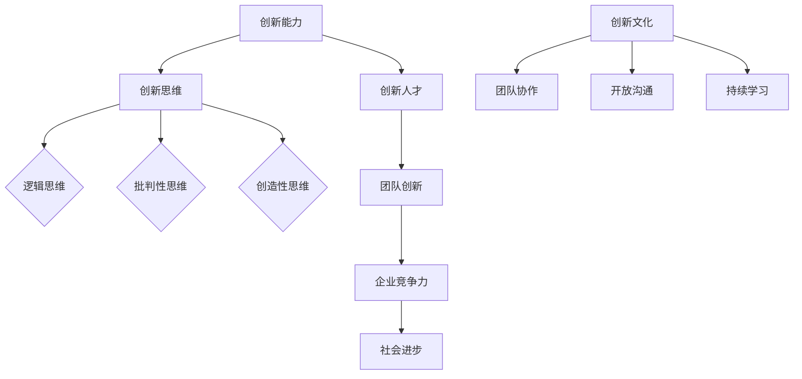

                 

### 文章标题

### 创新型人才培养：为团队注入创新活力的策略

#### 关键词

- 创新型人才培养
- 团队创新活力
- 创新思维
- 创新文化
- 创新激励机制

#### 摘要

本文围绕创新型人才培养展开，探讨了创新人才在团队中发挥的关键作用。文章首先分析了创新人才培养的理论基础，包括创新能力的定义、创新思维的理论与方法、创新文化的建设等。接着，详细介绍了创新人才培养的策略与实践，包括组织架构、课程设置、实践案例、环境营造、激励机制等方面。最后，提出了创新人才培养面临的挑战及未来展望，为团队注入创新活力提供了全面、系统的策略。

---

### 引言

在当今快速变化的世界，创新已成为推动社会进步和经济发展的核心动力。企业、教育机构和社会组织都需要具备创新能力的团队和个人来应对不断变化的市场需求和技术挑战。然而，如何培养出具有创新精神的优秀人才，成为了一个亟待解决的问题。本文旨在探讨创新型人才培养的策略与实践，为团队注入创新活力提供理论支持和实践指导。

#### 背景介绍

随着信息技术的飞速发展，各行业都面临着前所未有的变革。企业竞争的核心从传统的产品和服务，转向了创新能力和创新能力。创新能力不仅体现在技术创新上，还包括商业模式创新、管理创新、文化创新等各个方面。因此，培养具备创新精神和能力的人才，成为企业可持续发展的关键。

#### 核心概念与联系

创新型人才的成功培养离不开对核心概念的深入理解。以下是对文章中核心概念及其关系的Mermaid流程图：



#### 核心算法原理讲解

在创新人才培养过程中，评估创新思维的算法是一个重要的环节。以下是一个简单的创新思维评估算法的伪代码：

```python
# 创新思维评估算法（伪代码）
def evaluate_innovation_thinking(thinking_patterns):
    """
    评估创新思维的算法
    :param thinking_patterns: 创新思维模式列表
    :return: 创新思维得分
    """
    # 初始化得分
    score = 0
    
    # 对每个思维模式进行评分
    for pattern in thinking_patterns:
        if pattern == "逻辑思维":
            score += 10
        elif pattern == "批判性思维":
            score += 15
        elif pattern == "创造性思维":
            score += 20
        
        # 根据思维模式的组合加成
        if "逻辑思维" in thinking_patterns and "批判性思维" in thinking_patterns:
            score += 5
        if "创造性思维" in thinking_patterns:
            score += 10
        
    return score
```

#### 数学模型和公式

为了更精确地评估创新思维，可以使用以下数学模型来计算综合创新得分：

$$
\text{综合创新得分} = 10 \times (\text{逻辑思维比例}) + 15 \times (\text{批判性思维比例}) + 20 \times (\text{创造性思维比例}) + (\text{组合加成得分})
$$

#### 举例说明

假设一个团队成员的思维模式包括逻辑思维、批判性思维和创造性思维，其比例分别为0.4、0.3和0.3，并且这两个思维模式同时出现时有5分的组合加成，则其综合创新得分为：

$$
\text{综合创新得分} = 10 \times 0.4 + 15 \times 0.3 + 20 \times 0.3 + 5 = 13 + 4.5 + 6 + 5 = 28.5
$$

#### 项目实战

在某一创新实验室中，通过实际项目来培养团队成员的创新思维。该项目要求团队成员在一个月内提出至少三个创新解决方案。通过使用上述评估算法，对每个解决方案的创新思维进行评分，最终得出团队的综合创新得分。实践证明，这种项目实战对于提升团队成员的创新思维和实际应用能力具有显著效果。

#### 最佳实践 tips

- 定期开展创新思维训练，如思维导图、头脑风暴等。
- 鼓励团队成员跨部门合作，拓宽思维视野。
- 为团队成员提供充足的学习资源，如创新书籍、在线课程等。
- 定期进行创新成果分享会，激发团队创新活力。

#### 小结

创新人才是团队的核心竞争力，培养创新型团队需要系统化的策略和实践。本文通过理论基础、核心概念联系、核心算法原理讲解以及项目实战等角度，为团队注入创新活力提供了全面的指导。

---

### 第一部分：创新人才培养的理论基础

#### 1.1 创新人才培养的必要性

##### 1.1.1 创新的时代背景

在全球化和信息化的时代背景下，创新已经成为推动社会进步和经济发展的关键动力。随着技术的不断进步和市场的快速变化，企业、教育机构和社会组织都需要具备创新能力的团队和个人来应对不断涌现的新机遇和挑战。

##### 1.1.2 创新对团队发展的意义

创新不仅能够提升企业的竞争力，还能够推动团队的发展。创新思维和创新能力是团队在面对复杂问题和挑战时的核心优势。通过培养创新型人才，团队能够不断优化产品和服务，提高市场占有率，实现可持续发展。

##### 1.1.3 创新人才培养的挑战

虽然创新对团队发展具有重要意义，但培养创新型人才也面临着诸多挑战。首先，教育体系的传统模式往往注重知识传授，而忽视创新能力培养。其次，企业文化中可能存在对创新的限制和束缚，导致团队成员缺乏创新动力。此外，创新环境的营造也是一个重要挑战，需要提供充足的资源和支持。

#### 1.2 创新能力的定义与构成

##### 1.2.1 创新能力的定义

创新能力是指个体在面对问题时，通过创新思维和方法，产生新颖且有价值的想法或解决方案的能力。创新能力不仅包括技术层面的创新，还包括商业模式创新、管理创新和文化创新等各个方面。

##### 1.2.2 创新能力的构成

创新能力由多个维度构成，包括逻辑思维、批判性思维、创造性思维等。逻辑思维是创新能力的基石，通过分析和推理，帮助个体理解问题并提出合理的解决方案。批判性思维则强调对现有方案和观点的质疑和反思，以发现潜在的问题和改进空间。创造性思维则是创新能力的核心，通过独特的视角和思维方法，产生新颖且具有创新性的想法。

##### 1.2.3 创新能力的重要性

创新能力对于团队和个人都具有重要的意义。对于团队而言，创新能力能够提升团队的竞争力，推动团队的发展和创新。对于个人而言，创新能力能够提升个人的职业发展，增加在职场中的竞争力。同时，创新能力还能够激发个人的创造力和潜能，实现个人价值和成就感。

#### 1.3 创新思维的理论与方法

##### 1.3.1 创新思维的类型

创新思维可以分为多种类型，包括逻辑思维、批判性思维、创造性思维等。每种思维类型都有其独特的特点和应用场景。逻辑思维强调分析和推理，通过逻辑推理得出结论。批判性思维则强调质疑和反思，通过批判性思维发现问题的本质和潜在的问题。创造性思维则强调创新和创造，通过独特的视角和思维方法产生新颖的想法。

##### 1.3.2 创新思维的培养策略

培养创新思维需要系统的策略和方法。首先，需要培养个体的好奇心和求知欲，激发其对未知领域的探索。其次，需要提供多样化的学习资源和实践机会，帮助个体拓宽思维视野。此外，还需要鼓励团队成员进行跨部门合作和交流，促进思维的碰撞和激发。最后，需要建立创新激励机制，激发团队成员的创新动力和积极性。

##### 1.3.3 创新思维的实践应用

创新思维在实践中具有广泛的应用。在企业中，创新思维可以帮助团队解决复杂问题，优化产品和服务。在科研中，创新思维可以帮助科研人员提出新的研究问题和解决方案。在教育中，创新思维可以帮助学生培养批判性思维和创造性思维，提升学习效果和创新能力。

#### 1.4 创新文化的建设

##### 1.4.1 创新文化的概念

创新文化是一种以创新为核心价值观的文化，鼓励团队成员进行创新和尝试，并对创新行为给予认可和支持。创新文化不仅包括物质层面，如创新设施和创新项目，还包括精神层面，如创新价值观和创新精神。

##### 1.4.2 创新文化的要素

创新文化包括多个要素，包括开放沟通、团队合作、持续学习等。开放沟通是创新文化的基础，通过开放沟通，团队成员能够分享想法和经验，促进思维的碰撞和激发。团队合作是创新文化的重要组成部分，通过团队合作，团队成员能够共同解决问题，实现创新目标。持续学习是创新文化的重要特征，通过持续学习，团队成员能够不断提升自身能力和创新能力。

##### 1.4.3 创新文化的营造方法

营造创新文化需要系统的方法和策略。首先，需要建立开放沟通的机制，鼓励团队成员分享想法和意见。其次，需要提供充足的学习资源和实践机会，帮助团队成员提升自身能力。此外，还需要建立创新激励机制，激发团队成员的创新动力和积极性。最后，需要领导者的支持和引导，为创新文化提供必要的资源和支持。

#### 1.5 创新人才培养的国际比较

##### 1.5.1 各国创新人才培养模式概述

不同国家的创新人才培养模式有所不同，但都注重创新能力的培养。例如，美国注重创新教育的普及，鼓励学生进行跨学科学习和创新实践。德国注重创新人才培养的系统性和实践性，通过职业教育和创新项目，培养具备实际能力的创新人才。日本注重创新文化的建设，鼓励企业进行创新和研发。

##### 1.5.2 国际创新人才培养的经验与启示

国际创新人才培养的经验对于我国具有一定的启示意义。首先，需要加强创新教育的普及，提高学生的创新意识和能力。其次，需要建立创新人才培养的系统机制，包括教育、培训和实践等环节。此外，还需要营造创新文化，鼓励团队成员进行创新和尝试。最后，需要借鉴国际先进经验，结合我国实际情况，制定适合我国国情的创新人才培养策略。

---

### 第二部分：创新人才培养的策略与实践

#### 2.1 创新人才培养的组织架构

##### 2.1.1 创新人才培养的体系设计

创新人才培养需要建立系统的组织架构，包括教育、培训和实践三个环节。教育环节主要通过学校教育和社会教育，培养学生的基础知识和创新意识。培训环节主要通过企业培训和社会培训，提升学生的专业技能和创新实践能力。实践环节主要通过创新项目和创新实验，培养学生的创新思维和创新能力。

##### 2.1.2 创新人才培养的组织职责

创新人才培养的组织架构需要明确各组织的职责。教育机构主要负责创新教育，提供丰富的课程资源和实践机会。企业主要负责创新培训和实践，提供实际项目和创新环境。政府和社会组织则提供政策支持和资源保障，为创新人才培养提供良好的外部环境。

##### 2.1.3 创新人才培养的流程管理

创新人才培养需要建立规范的流程管理，确保各个环节的顺利进行。首先，需要制定创新人才培养计划，明确培养目标和任务。其次，需要建立课程体系和培训体系，提供丰富的课程资源和培训机会。此外，还需要建立评估机制，对创新人才培养的效果进行评估和反馈，不断优化培养策略。

#### 2.2 创新人才培养的课程设置

##### 2.2.1 创新课程的内容与目标

创新课程的内容应涵盖创新思维、创新能力、创新方法等多个方面。创新思维课程旨在培养学生的逻辑思维、批判性思维和创造性思维。创新能力课程旨在提升学生的实际操作能力和创新能力。创新方法课程则教授学生创新方法和技巧，帮助学生更好地运用创新思维和创新能力。

##### 2.2.2 创新课程的教学方法

创新课程的教学方法应注重实践性和互动性。可以通过案例教学、项目教学、小组讨论等多种教学方法，激发学生的创新思维和参与度。此外，还可以引入虚拟仿真技术、在线学习平台等新兴技术，提升教学效果和学生的学习体验。

##### 2.2.3 创新课程的评估与反馈

创新课程的评估应注重过程性和结果性。过程性评估可以通过课堂表现、小组讨论、项目报告等多种形式进行。结果性评估则通过考试、评估等方式，对学生的创新能力和创新能力进行评估。评估结果应及时反馈给学生，帮助他们了解自身的学习情况和需要改进的地方，不断优化学习效果。

#### 2.3 创新人才培养的实践案例

##### 2.3.1 创新实验室的建设与实践

创新实验室是培养创新人才的重要平台。通过创新实验室，学生可以亲身体验创新的整个过程，从问题识别到解决方案提出，再到方案实施和评估。创新实验室应配备先进的实验设备和软件工具，提供丰富的实验项目和案例，鼓励学生进行自主探索和创造。

##### 2.3.2 创新项目的管理与实施

创新项目是培养创新人才的重要实践途径。通过创新项目，学生可以将所学知识应用于实际，解决真实问题。创新项目的管理应注重项目的可行性、创新性和可持续性。项目实施过程中，应培养学生的团队协作能力、项目管理能力和创新实践能力。

##### 2.3.3 创新人才的选拔与培养

创新人才的选拔应注重综合素质和创新潜力。选拔过程中，可以采用面试、评估、竞赛等多种方式，全面评估学生的创新能力和潜力。创新人才的培养则应注重个性化培养和持续发展。通过个性化培养计划，为学生提供定制化的培养方案，激发他们的创新潜能。同时，应建立持续发展的机制，帮助学生不断提升自身能力和创新能力。

#### 2.4 创新人才培养的环境营造

##### 2.4.1 创新环境的设计原则

创新环境的营造应遵循开放性、灵活性、多样性等原则。开放性指鼓励团队成员之间的交流和合作，促进思维碰撞和知识共享。灵活性指提供多样化的学习资源和实践机会，满足不同团队成员的需求。多样性指营造包容性的文化氛围，鼓励团队成员进行多样化的创新尝试。

##### 2.4.2 创新环境的维护与管理

创新环境的维护与管理是确保创新人才培养效果的重要环节。首先，应建立完善的设施和维护机制，确保实验室设备和软件工具的正常运行。其次，应建立规范的管理制度，确保创新环境的安全和有序。此外，还应建立反馈机制，及时了解团队成员的需求和意见，不断改进和创新环境。

##### 2.4.3 创新环境的评估与改进

创新环境的评估应注重过程性和结果性。过程性评估可以通过团队成员的满意度调查、设施使用情况分析等方式进行。结果性评估则通过创新成果的数量和质量来评估。评估结果应及时反馈，为改进和创新环境提供依据。同时，还应根据社会需求和科技发展，不断更新和创新环境，确保其适应性和前瞻性。

#### 2.5 创新人才培养的激励机制

##### 2.5.1 创新激励的概念与作用

创新激励是指通过物质和精神奖励等方式，激发团队成员的创新动力和积极性。创新激励在创新人才培养中具有重要作用，可以提升团队成员的参与度、创新热情和创新成果。

##### 2.5.2 创新激励机制的设计与实施

创新激励机制的设计应遵循公平性、激励性和可持续性等原则。公平性指确保激励机制的公正性和透明度，让团队成员感受到公平待遇。激励性指通过合理的奖励制度，激发团队成员的创新热情和积极性。可持续性指确保激励机制的长期有效，避免出现短期行为和消极影响。

创新激励机制的实施需要建立完善的评估和反馈机制。首先，应建立创新成果评估体系，对团队成员的创新成果进行客观评估。其次，应建立奖励发放机制，确保奖励的及时性和准确性。此外，还应建立反馈机制，及时了解团队成员的需求和意见，不断优化激励制度。

##### 2.5.3 创新激励效果的评估与优化

创新激励效果的评估可以通过团队成员的满意度调查、创新成果的数量和质量等指标进行。评估结果应及时反馈，为优化创新激励机制提供依据。同时，还应根据实际情况和社会需求，不断调整和创新激励机制，确保其持续性和有效性。

---

### 第三部分：创新人才培养的挑战与展望

#### 3.1 创新人才培养的挑战

##### 3.1.1 教育体系的挑战

当前的教育体系在创新人才培养方面存在一些挑战。首先，教育模式较为传统，注重知识传授，而忽视创新能力培养。其次，课程设置和教学方法相对单一，难以满足多样化的创新需求。此外，教育资源和机会的分配不均，导致部分学生无法充分发展其创新能力。

##### 3.1.2 企业文化的挑战

企业文化在创新人才培养中起到关键作用，但现实中存在一些挑战。首先，企业文化中可能存在对创新的限制和束缚，导致团队成员缺乏创新动力。其次，企业对创新的重视程度和投入不足，导致创新项目难以得到充分支持。此外，企业内部的沟通和协作机制可能不够完善，影响创新思维的交流和碰撞。

##### 3.1.3 创新环境的挑战

创新环境是培养创新人才的重要基础，但现实中存在一些挑战。首先，创新基础设施和资源不足，难以提供充足的支持。其次，创新政策和支持机制不够完善，影响创新环境的营造。此外，社会对创新的认知和支持度不够，导致创新人才流失和难以吸引优秀人才。

#### 3.2 创新人才培养的解决方案

##### 3.2.1 教育体系的改革方案

为了应对教育体系的挑战，可以采取以下改革方案。首先，推动教育模式的创新，注重培养学生的创新能力。其次，丰富课程设置，引入跨学科课程和创新项目。此外，优化教育资源的分配，提高教育公平性。最后，加强教师培训，提升教师的教育教学能力和创新意识。

##### 3.2.2 企业文化的建设方案

为了打造有利于创新的企业文化，可以采取以下建设方案。首先，建立开放、包容和鼓励创新的企业价值观。其次，提高企业对创新的重视程度，加大创新投入。此外，完善内部沟通和协作机制，促进创新思维的交流和碰撞。最后，建立激励机制，激发团队成员的创新动力和积极性。

##### 3.2.3 创新环境的优化方案

为了营造有利于创新的环境，可以采取以下优化方案。首先，加强创新基础设施和资源建设，提供充足的支持。其次，完善创新政策和支持机制，鼓励企业和个人进行创新。此外，提高社会对创新的认知和支持度，营造良好的创新氛围。最后，建立创新生态体系，促进创新要素的集聚和互动。

#### 3.3 创新人才培养的未来展望

##### 3.3.1 技术进步对创新人才培养的影响

技术进步将为创新人才培养带来新的机遇和挑战。一方面，新技术的发展将提供更多的创新机会和应用场景。另一方面，技术的快速发展也对创新人才提出了更高的要求。未来，创新人才需要具备跨学科知识、快速学习和适应变化的能力。

##### 3.3.2 社会发展趋势对创新人才培养的影响

社会发展趋势也将对创新人才培养产生深远影响。全球化、数字化和智能化等趋势将促使创新人才具备国际视野、跨文化沟通能力和技术创新能力。同时，社会对创新的重视程度不断提高，将为创新人才培养提供更加有利的条件。

##### 3.3.3 创新人才培养的发展方向

未来，创新人才培养将朝着更加个性化、系统化和国际化的方向发展。个性化培养将根据个体特点和需求，提供定制化的培养方案。系统化培养将建立完善的创新教育、培训和实践活动体系，确保创新能力的全面培养。国际化培养将促进国内外创新资源和人才的交流与合作，提升创新人才培养的质量和水平。

---

### 附录

#### 附录 A：创新人才培养的资源与工具

##### A.1 创新人才培养的相关网站

- 美国国家创新政策研究所（NPR）官网：[www.npr.org](http://www.npr.org)
- 创新思维训练平台：[thinkersbox.com](http://thinkersbox.com)
- 知识图谱工具：[neo4j.com](http://neo4j.com)

##### A.2 创新人才培养的工具与平台

- 知识管理平台：[confluence.com](http://confluence.com)
- 项目管理工具：[trello.com](http://trello.com)
- 云计算平台：[aws.amazon.com](http://aws.amazon.com)

##### A.3 创新人才培养的书籍与文献推荐

- 《创新者的窘境》：作者克里斯坦森
- 《创意的秩序》：作者威廉·吉布森
- 《创新者的基因》：作者史蒂夫·布兰克
- 《创新思维训练》：作者安德斯·艾利克森

#### 附录 B：创新人才培养的实践案例汇编

##### B.1 国内创新人才培养案例

- 清华大学创新实践课程案例
- 华为创新人才培养计划
- 阿里巴巴创新实验室建设

##### B.2 国际创新人才培养案例

- 麻省理工学院创新教育案例
- 斯坦福大学创新项目案例
- 谷歌创新实验室建设

##### B.3 创新人才培养案例分析与启示

- 案例分析：如何在教育体系中融入创新教育？
- 案例分析：企业如何通过创新项目培养人才？
- 案例分析：创新人才培养中的文化建设和激励机制。

---

### 作者信息

**作者：AI天才研究院/AI Genius Institute & 禅与计算机程序设计艺术 /Zen And The Art of Computer Programming** 

本文由AI天才研究院（AI Genius Institute）和《禅与计算机程序设计艺术》（Zen And The Art of Computer Programming）的作者联合撰写，旨在为读者提供关于创新型人才培养的全面、系统的指导和策略。希望本文能够帮助团队和组织培养出具有创新精神和能力的优秀人才，为团队注入创新活力。

