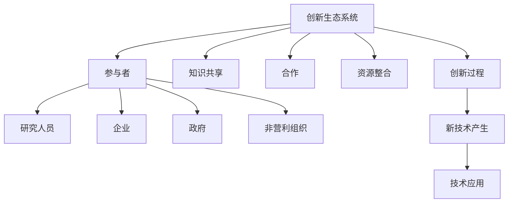

                 

### 文章标题: 创新生态系统设计：培育有利于世界理解的科研环境

> 关键词：创新生态系统、科研环境、设计原则、构建要素、实践案例、持续优化

> 摘要：本文深入探讨了创新生态系统的设计原则、构建要素、实践案例以及持续优化的策略，旨在为全球科研环境的提升提供参考。通过分析创新生态系统的概念与重要性，提出了一种综合性的设计方法，详细阐述了研究环境建设、知识共享与传播机制、政策与法规等方面的实践路径，并结合具体案例进行剖析，总结了创新生态系统的成功经验和挑战解决方案，为培育有利于世界理解的科研环境提供了理论指导和实践启示。

### 目录大纲：

#### 第一部分: 引入与背景

1. **第1章: 创新生态系统的概念与重要性**
   - 1.1 定义创新生态系统
   - 1.2 创新生态系统的组成部分
   - 1.3 创新生态系统的重要性

2. **第2章: 创新生态系统设计的原则与方法**
   - 2.1 设计原则
     - 2.1.1 开放性
     - 2.1.2 合作性
     - 2.1.3 可持续性
     - 2.1.4 鼓励多样性
   - 2.2 设计方法
     - 2.2.1 SWOT分析
     - 2.2.2 情景分析法
     - 2.2.3 建模与模拟

#### 第二部分: 创新生态系统构建要素

3. **第3章: 研究环境的建设**
   - 3.1 研究环境设计
     - 3.1.1 物理空间设计
     - 3.1.2 网络基础设施
     - 3.1.3 研究工具与设备
   - 3.2 研究团队建设
     - 3.2.1 团队构成
     - 3.2.2 能力培养
     - 3.2.3 团队协作机制

4. **第4章: 知识共享与传播机制**
   - 4.1 知识共享
     - 4.1.1 知识共享的重要性
     - 4.1.2 知识共享的障碍
     - 4.1.3 知识共享的促进策略
   - 4.2 知识传播
     - 4.2.1 知识传播渠道
     - 4.2.2 知识传播效果评估
     - 4.2.3 知识传播策略

5. **第5章: 创新生态系统中的政策与法规**
   - 5.1 创新政策
     - 5.1.1 创新政策的作用
     - 5.1.2 主要创新政策介绍
     - 5.1.3 创新政策的评估与调整
   - 5.2 法律法规
     - 5.2.1 创新生态系统中法律法规的重要性
     - 5.2.2 创新法律法规的主要内容
     - 5.2.3 法律法规的实施与监督

#### 第三部分: 创新生态系统实践与案例分析

6. **第6章: 创新生态系统的成功案例**
   - 6.1 案例介绍
   - 6.2 案例分析
   - 6.3 案例对其他生态系统的启示

7. **第7章: 创新生态系统的持续优化**
   - 7.1 评估与反馈
   - 7.2 优化策略
   - 7.3 适应外部环境变化的策略

#### 附录

8. **附录A: 创新生态系统设计工具与资源**
   - 8.1 设计工具
   - 8.2 资源推荐

### 核心概念与联系

在探讨创新生态系统的设计时，我们首先要明确几个核心概念及其相互关系。

**创新生态系统**

创新生态系统是一个包含多个参与者（如研究人员、企业、政府、非营利组织等）和多种互动关系的复杂系统。它通过知识共享、合作、资源整合等方式，推动创新过程，加速新技术的产生与应用。

下面我们通过Mermaid流程图来展示这些核心概念及其关系：



### 核心算法原理讲解

由于本书主要关注创新生态系统的设计与实施，而非算法本身，因此不会详细讨论具体的算法原理。但是，在构建创新生态系统时，算法可以用于优化资源分配、预测创新趋势、评估生态系统健康状况等。

下面，我们通过一个简化的伪代码来解释如何评估创新生态系统的健康状态。

```python
def assess_ecosystem_health(data):
    """
    评估创新生态系统的健康状态。
    
    参数:
    - data: 包含生态系统各项指标的字典。
    
    返回:
    - health_score: 健康得分，范围0-100。
    """
    # 初始化健康得分
    health_score = 0
    
    # 计算知识共享得分
    knowledge_score = data['knowledge_share'] * weight['knowledge_share']
    
    # 计算合作得分
    cooperation_score = data['cooperation'] * weight['cooperation']
    
    # 计算资源整合得分
    integration_score = data['resource_integration'] * weight['integration']
    
    # 计算创新过程得分
    innovation_process_score = data['innovation_process'] * weight['innovation_process']
    
    # 计算总得分
    health_score = (knowledge_score + cooperation_score + integration_score + innovation_process_score) / total_weights
    
    return health_score
```

在这个伪代码中，我们首先定义了一个评估函数`assess_ecosystem_health`，它接收一个包含生态系统各项指标的数据字典`data`。然后，我们根据不同的权重（`weight`）计算各项指标的得分，并最终计算总的健康得分。

### 第一部分：引入与背景

#### 第1章: 创新生态系统的概念与重要性

##### 1.1 定义创新生态系统

创新生态系统是一个复杂的社会技术系统，它由多个参与者（如研究人员、企业、政府、非营利组织等）以及他们之间的互动关系构成。创新生态系统不仅包括技术创新，还涵盖知识共享、合作、资源整合等多个方面，是推动科技创新和社会进步的重要力量。

创新生态系统的主要组成部分包括：

1. **参与者**：创新生态系统的核心成员，包括研究人员、企业、政府、非营利组织等。这些参与者通过各自的专长和资源，共同推动创新过程。
2. **知识共享**：创新生态系统中的知识共享是推动创新的重要手段。通过建立有效的知识共享机制，可以加速新技术的产生和应用。
3. **合作**：合作是创新生态系统的重要特征。不同参与者之间的合作可以整合各自的资源，提高创新效率。
4. **资源整合**：创新生态系统需要整合各类资源，包括资金、人力、技术等，以支持创新活动的开展。
5. **创新过程**：创新生态系统通过知识共享、合作和资源整合，推动创新过程，加速新技术的产生和应用。

##### 1.2 创新生态系统的组成部分

创新生态系统的组成部分可以进一步细分为以下几个方面：

1. **技术基础设施**：包括实验室、研究中心、测试平台等，为创新活动提供必要的技术支持。
2. **政策环境**：政府制定的政策和法规，对创新生态系统的健康发展具有重要影响。
3. **知识库**：包括学术论文、专利、标准文档等，为创新活动提供知识支持。
4. **人才培养**：包括教育机构、培训机构等，为创新生态系统提供人才储备。
5. **资金支持**：包括风险投资、政府资金等，为创新活动提供资金保障。

##### 1.3 创新生态系统的重要性

创新生态系统在现代社会中具有极其重要的作用，主要体现在以下几个方面：

1. **推动技术创新**：创新生态系统通过知识共享、合作和资源整合，加速新技术的产生和应用，推动技术创新。
2. **促进经济增长**：技术创新是经济增长的重要驱动力。创新生态系统可以促进技术创新，从而推动经济增长。
3. **提升国家竞争力**：创新生态系统有助于提高国家的科技创新能力，增强国家的竞争力。
4. **推动社会进步**：创新生态系统不仅推动技术创新，还可以推动社会进步。例如，通过创新解决社会问题、提高生活质量等。

### 第一部分：引入与背景

#### 第2章: 创新生态系统设计的原则与方法

##### 2.1 设计原则

创新生态系统的设计原则是确保其有效运作和可持续发展的重要保障。以下是几个关键的设计原则：

1. **开放性**：创新生态系统应具备开放性，鼓励各参与者之间的知识共享和合作。开放性有助于吸引更多的资源和技术，促进创新生态系统的成长。
   
2. **合作性**：合作是创新生态系统的核心特征。通过建立合作机制，不同参与者可以共同分享资源、知识和成果，提高创新效率。

3. **可持续性**：创新生态系统应具备可持续性，确保其长期健康运行。可持续性要求在设计和运营过程中考虑生态系统的可持续性和持续性。

4. **鼓励多样性**：多样性是创新的重要源泉。创新生态系统应鼓励多样性的参与，包括不同学科、不同文化和不同背景的参与者，以激发更多的创新思维。

##### 2.2 设计方法

创新生态系统设计的方法包括以下几种：

1. **SWOT分析**：SWOT分析是一种常用的战略规划工具，用于评估创新生态系统的优势（Strengths）、劣势（Weaknesses）、机会（Opportunities）和威胁（Threats）。通过SWOT分析，可以明确创新生态系统的现状和潜在发展方向。

   **步骤**：
   - **优势**：分析创新生态系统的内部优势，如技术优势、人才优势等。
   - **劣势**：识别创新生态系统的内部劣势，如资源不足、技术瓶颈等。
   - **机会**：分析外部环境中的机会，如市场需求、政策支持等。
   - **威胁**：识别外部环境中的威胁，如竞争压力、法律法规限制等。

2. **情景分析法**：情景分析法是一种基于未来可能情景的分析方法，用于预测创新生态系统的发展趋势和潜在问题。

   **步骤**：
   - **定义情景**：根据外部环境的变化，定义可能的未来情景。
   - **评估情景**：分析每个情景对创新生态系统的影响，包括正面和负面影响。
   - **制定策略**：根据评估结果，制定应对策略，以降低潜在风险和利用机会。

3. **建模与模拟**：建模与模拟是一种基于数学和计算机科学的方法，用于模拟创新生态系统的运行机制和性能。

   **步骤**：
   - **建立模型**：根据创新生态系统的特点，建立数学模型或计算机模拟模型。
   - **模拟运行**：运行模型，模拟创新生态系统的运行过程。
   - **分析结果**：分析模拟结果，评估创新生态系统的性能和优化方案。

### 第二部分：创新生态系统构建要素

#### 第3章: 研究环境的建设

##### 3.1 研究环境设计

一个良好的研究环境是创新生态系统的重要组成部分，它直接影响创新活动的效率和成果。研究环境设计包括以下几个方面：

1. **物理空间设计**：物理空间设计要充分考虑研究团队的规模、需求和工作方式。一个宽敞、舒适、具有良好通风和光照的实验室或办公室，有助于提高研究人员的创造力和工作效率。

2. **网络基础设施**：网络基础设施是现代研究环境的关键。高速稳定的网络连接、可靠的云计算平台和先进的存储设备，可以支持大量数据的存储、处理和传输，为研究提供强大的技术支撑。

3. **研究工具与设备**：研究工具和设备的种类和性能直接影响研究的深度和广度。实验室需要配备先进的仪器设备、软件工具和实验材料，以满足不同研究项目的需求。

##### 3.2 研究团队建设

一个高效的研究团队是创新生态系统的核心力量。研究团队建设包括以下几个方面：

1. **团队构成**：团队构成要充分考虑成员的专业背景、技能和经验。一个多元化的团队可以带来不同的视角和思路，促进创新。

2. **能力培养**：通过培训、学术交流和研究实践，不断提升团队成员的专业能力和技术水平。

3. **团队协作机制**：建立有效的团队协作机制，如定期会议、项目计划和资源共享等，确保团队成员之间的沟通和合作。

### 第二部分：创新生态系统构建要素

#### 第4章: 知识共享与传播机制

##### 4.1 知识共享

知识共享是创新生态系统中的关键环节，它直接影响创新的效果和效率。以下是关于知识共享的几个重要方面：

1. **知识共享的重要性**：知识共享可以促进知识的传播和应用，提高创新效率。在创新生态系统中，知识共享有助于不同参与者之间的协同创新，加速新技术的产生和应用。

2. **知识共享的障碍**：知识共享面临一些障碍，如信息不对称、知识产权保护、组织文化差异等。这些障碍需要通过有效的机制和策略来克服。

3. **知识共享的促进策略**：为了促进知识共享，可以采取以下策略：
   - **建立知识共享平台**：建立线上或线下的知识共享平台，提供知识存储、检索和共享功能。
   - **加强交流与合作**：通过组织学术会议、研讨会和培训等活动，促进参与者之间的交流和合作。
   - **建立激励机制**：通过奖励机制激励参与者积极参与知识共享，提高知识共享的积极性。

##### 4.2 知识传播

知识传播是知识共享的延伸，它涉及知识的传播渠道、效果评估和传播策略等方面。

1. **知识传播渠道**：知识传播可以通过多种渠道进行，包括学术期刊、会议论文、报告、书籍等。选择合适的传播渠道可以最大程度地扩大知识的影响范围。

2. **知识传播效果评估**：知识传播的效果需要通过评估来衡量。评估指标可以包括知识的传播范围、影响力、应用效果等。

3. **知识传播策略**：为了提高知识传播的效果，可以采取以下策略：
   - **加强宣传推广**：通过媒体、社交媒体和宣传材料等，加强知识的宣传和推广。
   - **定制化传播**：根据不同受众的需求和特点，制定个性化的知识传播方案。
   - **构建知识网络**：建立知识网络，促进知识在不同参与者之间的流通和互动。

### 第二部分：创新生态系统构建要素

#### 第5章: 创新生态系统中的政策与法规

##### 5.1 创新政策

创新政策是推动创新生态系统发展的重要手段。以下是对创新政策的作用、主要政策介绍和评估调整的探讨：

1. **创新政策的作用**：创新政策对创新生态系统的健康发展具有重要作用。它可以通过提供资金支持、税收优惠、知识产权保护等手段，激励企业、研究人员和高校等参与创新活动，推动技术创新和科技成果转化。

2. **主要创新政策介绍**：不同国家和地区根据自身情况，制定了一系列创新政策。以下是几个主要创新政策的介绍：
   - **科技创新计划**：许多国家制定了科技创新计划，通过提供资金支持、组织项目攻关等方式，推动科技创新。
   - **税收优惠政策**：为了鼓励企业进行研发和创新，许多国家提供了税收优惠政策，如研发费用加计扣除、高新技术企业税收优惠等。
   - **知识产权保护政策**：知识产权保护政策是激励创新的重要手段。通过加强知识产权保护，可以保护创新者的权益，提高创新积极性。

3. **创新政策的评估与调整**：创新政策的评估与调整是确保其有效性的关键。以下是对评估与调整的探讨：
   - **评估指标**：评估创新政策的效果可以采用多个指标，如研发投入、专利申请数量、技术创新成果等。
   - **评估方法**：评估方法可以包括定量分析和定性分析，如统计分析、案例研究等。
   - **调整策略**：根据评估结果，及时调整创新政策，以适应不断变化的外部环境和技术发展趋势。

##### 5.2 法律法规

法律法规是创新生态系统中的重要组成部分，对创新活动的规范和保障具有重要作用。以下是对创新生态系统中法律法规的重要性和主要内容、实施与监督的探讨：

1. **法律法规的重要性**：法律法规对创新生态系统的健康发展具有重要作用。它可以为创新活动提供法律保障，规范市场秩序，保护知识产权，促进科技成果转化。

2. **创新法律法规的主要内容**：创新法律法规主要包括以下几个方面：
   - **知识产权法律**：如专利法、商标法、著作权法等，保护创新者的知识产权，激励创新。
   - **科研法律法规**：如科技促进法、科技成果转化法等，规范科研活动，促进科技成果转化。
   - **市场竞争法律**：如反垄断法、反不正当竞争法等，保护市场竞争秩序，促进公平竞争。

3. **法律法规的实施与监督**：法律法规的实施与监督是确保其有效性的关键。以下是对实施与监督的探讨：
   - **实施机制**：建立健全的实施机制，如法律体系、执法机构、法律服务体系等。
   - **监督机制**：建立有效的监督机制，如立法监督、执法监督、社会监督等。
   - **法律宣传与培训**：加强法律宣传与培训，提高公众的法律意识和素质。

### 第三部分：创新生态系统实践与案例分析

#### 第6章: 创新生态系统的成功案例

##### 6.1 案例介绍

本章节将介绍几个创新生态系统的成功案例，包括案例背景、目标和实施过程。通过这些案例，我们将深入了解创新生态系统如何在不同领域取得成功。

1. **案例一：人工智能创新生态系统**  
   - **背景**：随着人工智能技术的快速发展，各国纷纷投入大量资源建设人工智能创新生态系统。  
   - **目标**：建立全球领先的人工智能创新生态系统，推动人工智能技术的应用和产业发展。  
   - **实施过程**：通过政策支持、资金投入、人才培养和合作机制建设，推动人工智能技术的创新和应用。

2. **案例二：绿色能源创新生态系统**  
   - **背景**：全球气候变化和环境问题日益严重，绿色能源成为各国关注的焦点。  
   - **目标**：建立全球领先的绿色能源创新生态系统，推动绿色能源技术的研发和应用。  
   - **实施过程**：通过政策引导、资金支持、技术创新和合作共享，推动绿色能源技术的发展和普及。

##### 6.2 案例分析

通过对成功案例的分析，我们可以总结出以下几个关键因素和挑战解决方案：

1. **关键因素**：成功案例的共同特点包括政策支持、资金投入、人才培养、合作机制和知识共享。这些因素共同推动了创新生态系统的快速发展。

2. **挑战解决方案**：在实施创新生态系统过程中，面临一些挑战，如技术瓶颈、市场竞争、知识产权保护等。以下是几个挑战及其解决方案：
   - **技术瓶颈**：通过加强技术研发和人才培养，提高技术创新能力，突破技术瓶颈。
   - **市场竞争**：通过建立公平竞争的市场秩序，鼓励企业进行创新和竞争，促进产业发展。
   - **知识产权保护**：通过加强知识产权法律保护，提高知识产权意识，保护创新者的权益。

##### 6.3 案例对其他生态系统的启示

成功案例为其他创新生态系统提供了宝贵的经验和启示，包括以下几个方面：

1. **政策引导**：政府应制定科学合理的创新政策，引导和支持创新生态系统的建设和发展。

2. **资金投入**：政府和社会应加大资金投入，为创新提供充足的资金支持。

3. **人才培养**：加强人才培养，提高创新团队的专业水平和创新能力。

4. **合作机制**：建立有效的合作机制，促进不同参与者之间的合作和共享。

5. **知识共享**：加强知识共享，提高创新生态系统的整体效能。

### 第三部分：创新生态系统实践与案例分析

#### 第7章: 创新生态系统的持续优化

##### 7.1 评估与反馈

创新生态系统的持续优化需要建立有效的评估与反馈机制。以下是对评估与反馈机制的探讨：

1. **评估指标**：评估创新生态系统的健康状态和效能，可以采用多个指标，如知识共享度、创新成果数量、专利申请数量、市场占有率等。

2. **评估方法**：评估方法可以包括定量分析、定性分析、综合评估等。定量分析可以通过数据统计和分析来评估创新生态系统的效能，定性分析可以通过专家评审和用户反馈来评估创新生态系统的满意度。

3. **反馈机制**：建立反馈机制，收集用户和专家的反馈意见，对创新生态系统的运行情况进行实时监控和调整。

##### 7.2 优化策略

创新生态系统的持续优化需要采取一系列策略，以适应外部环境的变化和提升生态系统效能。以下是一些优化策略：

1. **针对性优化措施**：根据评估结果和用户反馈，采取针对性的优化措施，如改进知识共享平台、提升技术支持服务、加强人才培养等。

2. **生态系统的可持续性发展**：确保创新生态系统的可持续性发展，需要从资源利用、环境保护、社会责任等方面进行考虑。通过可持续性发展，实现生态系统的长期稳定和健康发展。

3. **适应外部环境变化的策略**：随着外部环境的变化，创新生态系统需要及时调整策略，以适应新的发展趋势。以下是一些适应外部环境变化的策略：
   - **政策调整**：根据外部环境的变化，及时调整创新政策，以支持创新生态系统的健康发展。
   - **技术创新**：紧跟技术发展趋势，加强技术研发和创新能力，保持竞争优势。
   - **国际合作**：加强国际合作，共享资源和经验，提升创新生态系统的全球影响力。

### 附录

#### 附录A: 创新生态系统设计工具与资源

本附录提供了一些创新生态系统设计工具和资源的推荐，以帮助读者更好地理解和应用创新生态系统的设计原则和方法。

##### A.1 设计工具

1. **SWOT分析工具**：SWOT分析是创新生态系统设计的重要工具，以下是一些常用的SWOT分析工具：
   - **Excel表格**：通过Excel表格进行SWOT分析，可以直观地记录和分析各项指标。
   - **思维导图**：使用思维导图工具，如MindManager或XMind，可以直观地展示SWOT分析的各个方面。

2. **情景分析法工具**：情景分析法是预测创新生态系统发展趋势的重要方法，以下是一些常用的情景分析法工具：
   - **鱼骨图**：通过鱼骨图分析，可以识别出创新生态系统中的关键因素和潜在问题。
   - **时间线**：使用时间线工具，可以直观地展示不同情景的发展过程和关键节点。

3. **建模与模拟工具**：建模与模拟是创新生态系统设计的关键步骤，以下是一些常用的建模与模拟工具：
   - **Matlab**：Matlab是一款强大的数学建模与仿真工具，适用于复杂系统的建模与模拟。
   - **Python**：Python是一种灵活的编程语言，适用于多种建模与模拟任务。

##### A.2 资源推荐

1. **创新生态系统相关书籍**：以下是一些关于创新生态系统的经典书籍，有助于深入理解和应用创新生态系统的设计原则和方法：
   - **《创新生态系统：构建可持续的创新网络》**：作者阐述了创新生态系统的概念、构建要素和实践方法。
   - **《创新与创业管理》**：本书涵盖了创新管理的基本理论和实践方法，包括创新生态系统的设计和实施。

2. **创新生态系统研究报告**：以下是一些关于创新生态系统的权威研究报告，提供了丰富的数据和案例分析：
   - **《全球创新指数报告》**：由世界知识产权组织发布的全球创新指数报告，分析了各国创新生态系统的现状和发展趋势。
   - **《中国创新生态系统报告》**：由中国科学技术发展战略研究院发布的报告，分析了中国创新生态系统的构建和发展。

3. **创新生态系统在线课程**：以下是一些关于创新生态系统的在线课程，提供了系统的学习和实践机会：
   - **《创新生态系统设计》**：由Coursera平台提供的课程，涵盖了创新生态系统的设计原则、构建要素和优化策略。
   - **《创新管理》**：由edX平台提供的课程，介绍了创新管理的基本理论和方法，包括创新生态系统的设计和实施。

