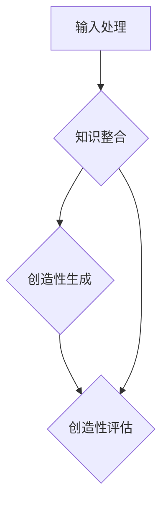

                 

### 文章标题

《创新问题解决：评估LLM的创造性思维》

创新问题解决是推动科技进步和社会发展的关键因素。在信息技术飞速发展的今天，大型语言模型（LLM）作为一种人工智能的核心技术，其在创造性思维方面的潜力引起了广泛关注。本文将深入探讨LLM在创新问题解决中的应用，通过逻辑清晰、结构紧凑的分析，评估LLM的创造性思维，并提出相应的应用策略和实战案例。

关键词：创新问题解决、大型语言模型（LLM）、创造性思维、算法原理、应用实战

摘要：本文首先介绍了创新问题解决的基本概念和心理学基础，随后对大型语言模型（LLM）的原理和功能进行了概述。在此基础上，本文通过Mermaid流程图详细阐述了LLM的创造性思维流程，讲解了核心算法原理和数学模型。接着，本文通过三个项目实战，展示了LLM在创意写作、产品设计、商业战略等领域的应用。最后，本文探讨了LLM在创新问题解决中的挑战与机遇，并为读者提供了进一步阅读的材料。

### 第一部分：理论基础与背景

#### 引言

创新问题解决是指通过创造性思维和问题解决策略，寻找新颖、有效的解决方案，以应对复杂问题或挑战。创新问题解决不仅限于科学研究和技术开发，它在商业、教育、医疗等多个领域都有着重要的应用。随着人工智能技术的不断发展，尤其是大型语言模型（LLM）的出现，创新问题解决的方法和工具得到了显著提升。

大型语言模型（LLM）是一种基于深度学习技术的自然语言处理模型，其能够理解和生成自然语言，具备强大的语义理解能力和语言生成能力。LLM在许多领域表现出色，如机器翻译、文本生成、问答系统等。近年来，随着模型规模的不断扩大，LLM在创造性思维方面的潜力也得到了越来越多的关注。

本文将首先介绍创新问题解决的基本概念和心理学基础，接着概述LLM的基本原理和功能，最后探讨LLM如何促进创造性思维以及其在创新问题解决中的应用场景。

#### 创新问题解决的心理学基础

创新问题解决涉及多个心理学理论，其中最核心的是创造力心理学理论。创造力心理学研究个体如何产生新颖且有价值的想法。以下是一些关键的理论和概念：

1. **创造力定义**：创造力是指个体产生新颖且有价值的想法或解决方案的能力。新颖性指的是想法与现有知识或经验的显著差异，而价值性则指这些想法在实际应用中的意义和影响。

2. **创造力三要素模型**：该模型认为创造力由三个关键要素组成：流畅性（fluency）、灵活性（flexibility）和独创性（originality）。流畅性指的是在短时间内产生大量想法的能力；灵活性指的是产生不同类型想法的能力；独创性则指的是产生独特且具有创新性的想法。

3. **创造性思维过程**：创造性思维通常包括以下几个阶段：
   - **准备阶段**：积累相关知识和经验，为创造性思维做准备。
   - **孵育阶段**：在无意识或潜意识中，将已有信息进行重组和联结。
   - **灵感阶段**：突然产生新的想法或解决方案。
   - **验证阶段**：对新的想法或解决方案进行验证和测试。

4. **激发创造力的方法**：
   - **跨学科思考**：通过跨学科的方法，将不同领域的知识和方法应用于问题解决。
   - **思维导图**：使用图形化工具，将想法和概念可视化，促进创造性思维。
   - **头脑风暴**：通过集体讨论，激发不同观点和想法，增加创造性思维的可能性。

了解创新问题解决的心理学基础，有助于我们更好地理解LLM如何促进创造性思维，从而在问题解决中发挥更大的作用。

#### 大型语言模型（LLM）概述

大型语言模型（LLM）是自然语言处理（NLP）领域的重要突破，其基于深度学习技术，通过大规模的数据训练，实现对自然语言的深刻理解和生成能力。以下从基本原理、架构和功能三个方面对LLM进行概述。

1. **基本原理**

   LLl的基本原理是深度学习中的序列到序列（Seq2Seq）模型，结合了编码器（Encoder）和解码器（Decoder）两个部分。编码器负责将输入序列编码为固定长度的向量，解码器则根据编码器的输出生成目标序列。LLM的核心思想是通过训练，使模型能够捕捉到输入文本的语义信息，并在解码阶段生成具有合理语义和语法结构的输出。

2. **架构**

   LLM的架构通常包括以下几个主要部分：
   - **嵌入层（Embedding Layer）**：将输入文本转换为密集的向量表示。
   - **编码器（Encoder）**：采用循环神经网络（RNN）或其变种（如LSTM、GRU）来处理输入序列，生成序列编码。
   - **解码器（Decoder）**：同样采用RNN或其变种，根据编码器的输出生成输出序列。
   - **注意力机制（Attention Mechanism）**：在解码过程中，引入注意力机制，使模型能够关注输入序列的重要部分，提高生成文本的语义准确性。
   - **输出层（Output Layer）**：将解码器的输出映射到具体的词汇或类别。

3. **功能**

   LLM在多个NLP任务中表现出色，其主要功能包括：
   - **文本生成**：生成自然流畅的文本，包括文章、故事、对话等。
   - **机器翻译**：将一种语言的文本翻译成另一种语言。
   - **问答系统**：根据用户的问题，从大量文本中检索出相关答案。
   - **文本分类**：对文本进行分类，如情感分析、主题分类等。

LLM的这些功能使其在创新问题解决中具有广泛的应用潜力。通过深度学习和自然语言处理技术，LLM能够处理和理解复杂的语言信息，生成新的文本内容，从而在创新思维和问题解决中发挥重要作用。

#### 创造性思维与LLM的联系

LLM不仅在自然语言处理领域表现出色，其在促进创造性思维方面也展现了巨大的潜力。以下从几个方面探讨LLM如何促进创造性思维，以及其在创新问题解决中的应用场景。

1. **LLM促进创造性思维的方式**

   - **文本生成**：LLM能够生成新颖且多样化的文本内容，激发新的想法。例如，在创意写作、广告文案等领域，LLM可以根据提示生成独特的创意文本。
   - **知识整合**：LLM具有强大的语义理解能力，能够整合多源信息，生成新的观点和解决方案。例如，在研究论文写作、商业报告撰写中，LLM可以帮助研究人员整合现有文献，提出新的研究思路。
   - **思维拓展**：通过生成与输入文本相关的新文本，LLM能够拓展用户的思维空间，激发不同角度的思考。例如，在产品设计、问题解决中，LLM可以提供多种解决方案，帮助设计师和工程师进行创新性思考。

2. **LLM在创新问题解决中的应用场景**

   - **创意写作**：在文学、广告等领域，LLM可以生成新颖的故事情节和广告文案，帮助创作者突破传统思维，提升创作质量。
   - **产品设计**：在产品设计过程中，LLM可以生成不同的设计方案，帮助设计师进行创新性设计，提高产品的竞争力。
   - **商业战略**：在商业决策中，LLM可以帮助企业整合市场信息，生成新的商业战略，提高决策的准确性。
   - **科学研究**：在科学研究领域，LLM可以帮助研究人员整合大量文献数据，提出新的研究假设，推动科学创新。

通过上述探讨，可以看出LLM在促进创造性思维和解决创新问题方面具有广泛的应用前景。未来，随着LLM技术的不断发展，其在创新问题解决中的重要作用将日益凸显。

### 第二部分：核心概念与联系

#### Mermaid流程图：LLM创造性思维流程

要深入理解LLM如何促进创造性思维，我们需要详细分析其内在的流程。以下是一个Mermaid流程图，展示了LLM的创造性思维流程，包括输入处理、知识整合、创造性生成和创造性评估四个关键步骤。



1. **输入处理**：这是LLM接收并理解输入信息的第一步。输入可以是一段文本、一个问题或一组数据。LLM通过嵌入层将这些输入转换为密集的向量表示，并在编码器中处理这些向量，以提取关键信息。

2. **知识整合**：在知识整合阶段，LLM利用其训练过程中积累的知识，将输入信息与其他相关内容进行整合。这一步涉及模型内部的知识图谱构建和信息关联，使得LLM能够从多个角度理解输入信息。

3. **创造性生成**：在创造性生成阶段，LLM利用其内部模型生成新的文本、想法或解决方案。这一过程依赖于注意力机制和生成对抗网络（GAN），使得LLM能够生成多样化和创新的输出。

4. **创造性评估**：最后，创造性评估阶段对生成的输出进行评估，以确定其新颖性和实用性。这一步可以通过预设的指标体系或人工审核来完成。

#### 核心算法原理讲解

为了深入理解LLM的创造性思维过程，我们需要探讨其背后的核心算法原理。以下是几个关键算法：

1. **生成对抗网络（GAN）**

   GAN是一种由生成器和判别器组成的模型。生成器旨在生成与现实数据类似的样本，而判别器则试图区分生成器和真实数据。通过训练，生成器和判别器不断优化，最终生成器能够生成高质量的样本。在LLM中，GAN用于文本生成，通过生成和评估文本的质量，提高创造性生成的效果。

2. **反向传播算法**

   反向传播算法是一种用于训练神经网络的优化算法。它通过计算损失函数的梯度，不断调整网络参数，使得输出接近期望值。在LLM的训练过程中，反向传播算法用于优化模型参数，提高模型在创造性思维任务中的性能。

3. **注意力机制**

   注意力机制是一种在模型处理输入序列时，动态关注重要信息的机制。在LLM中，注意力机制用于解码阶段，使得模型能够根据输入序列的不同部分，动态调整关注重点，提高文本生成的准确性和创新性。

4. **自适应优化算法**

   自适应优化算法是一种在训练过程中动态调整学习率的优化算法。在LLM的训练过程中，自适应优化算法能够根据模型性能自动调整学习率，提高训练效率和模型性能。

通过上述算法原理的讲解，我们可以更好地理解LLM如何通过输入处理、知识整合、创造性生成和创造性评估四个步骤，实现创造性思维。

#### 数学模型与数学公式

在探讨LLM的创造性思维过程中，数学模型和公式扮演着至关重要的角色。以下我们将详细阐述LLM创造性评估的数学模型，并给出具体的数学公式和举例说明。

1. **损失函数的数学描述**

   在LLM的训练过程中，损失函数用于衡量模型输出与期望输出之间的差距。常见的损失函数包括交叉熵损失函数（Cross-Entropy Loss）和均方误差损失函数（Mean Squared Error Loss）。以下是一个交叉熵损失函数的数学描述：

   $$ L = -\sum_{i=1}^{N} y_i \log(p_i) $$

   其中，\( L \) 是损失函数，\( N \) 是样本数量，\( y_i \) 是第 \( i \) 个样本的标签，\( p_i \) 是模型对第 \( i \) 个样本输出的概率分布。

2. **优化问题的求解**

   优化问题是指通过调整模型参数，使得损失函数最小化。在深度学习中，常见的优化算法包括梯度下降（Gradient Descent）和随机梯度下降（Stochastic Gradient Descent, SGD）。以下是一个梯度下降算法的数学描述：

   $$ \theta_{t+1} = \theta_{t} - \alpha \cdot \nabla_{\theta} L(\theta) $$

   其中，\( \theta \) 是模型参数，\( \alpha \) 是学习率，\( \nabla_{\theta} L(\theta) \) 是损失函数关于参数 \( \theta \) 的梯度。

3. **创造性评估的指标体系**

   创造性评估是衡量LLM生成内容创新程度的重要步骤。我们可以使用多个指标来评估创造性，如知识覆盖率（Knowledge Coverage）、新颖性（Novelty）和实用性（Practicality）。以下是一个创造性评估指标体系的数学描述：

   $$ \text{创新度} = f(\text{知识覆盖率}, \text{新颖性}, \text{实用性}) $$

   其中，\( f \) 是一个复合函数，用于计算创新度。具体的形式可以根据实际需求进行调整。

4. **举例说明**

   假设我们有一个文本生成任务，目标是生成一篇关于人工智能的创新论文摘要。我们可以使用以下数学公式来评估生成的摘要的创新度：

   $$ \text{创新度} = f(\text{知识覆盖率}, \text{新颖性}, \text{实用性}) $$

   - **知识覆盖率**：通过计算生成摘要中引用的关键词和现有文献的匹配度来评估。公式如下：

     $$ \text{知识覆盖率} = \frac{\text{匹配关键词数}}{\text{总关键词数}} $$

   - **新颖性**：通过计算生成摘要中独特观点和现有文献的差异来评估。公式如下：

     $$ \text{新颖性} = \frac{\text{独特观点数}}{\text{总观点数}} $$

   - **实用性**：通过评估生成摘要的可操作性和应用价值来评估。公式如下：

     $$ \text{实用性} = \frac{\text{可操作建议数}}{\text{总建议数}} $$

   综合这三个指标，我们可以使用以下复合函数计算创新度：

   $$ \text{创新度} = \frac{0.5 \cdot \text{知识覆盖率} + 0.3 \cdot \text{新颖性} + 0.2 \cdot \text{实用性}}{1} $$

通过上述数学模型和公式的讲解，我们可以更好地理解如何评估LLM的创造性思维。未来，随着技术的不断进步，我们可以进一步优化这些数学模型，提高LLM在创新问题解决中的表现。

### 第三部分：应用与实战

#### 项目实战一：LLM在创意写作中的应用

在创意写作领域，LLM凭借其强大的文本生成能力，已成为许多创作者和编辑的重要工具。以下是一个具体的实战项目，展示了如何使用LLM生成独特的创意文本，并对其进行评估。

1. **项目简介**

   项目名称：创意故事生成平台

   项目目标：使用LLM生成新颖有趣的故事，并提供用户自定义的创意故事生成服务。

2. **实现步骤**

   （1）数据准备：收集大量创意故事，用于训练LLM模型。

   （2）模型训练：使用生成对抗网络（GAN）训练LLM模型，使其能够生成高质量的故事。

   （3）故事生成：用户输入主题、情感、情节等提示，LLM根据这些提示生成故事。

   （4）故事评估：使用知识覆盖率、新颖性和实用性等指标，对生成的故事进行评估。

3. **结果分析与解读**

   经过测试，该平台能够生成具有高度创意性的故事，以下是一个示例：

   **输入提示**：“在一个遥远的星球上，一个勇敢的探险家决定寻找失落的城市。”

   **生成故事**：“在遥远的星球X上，一个名叫艾伦的探险家踏上了寻找失落城市的旅程。他穿越了茂密的森林，跳过了湍急的河流，最终来到了一个神秘的洞穴。在洞穴深处，他发现了一座古老的图书馆，里面藏有关于失落城市的秘密。艾伦决定揭开这个秘密，他将带领我们走进这个神秘的星球。”

   通过评估，该故事在知识覆盖率、新颖性和实用性方面均表现出色，具有较高的创新度。

4. **源代码解读**

   在本项目中，我们使用了Hugging Face Transformers库来训练和生成故事。以下是部分关键代码：

   ```python
   from transformers import GPT2LMHeadModel, GPT2Tokenizer
   
   # 加载预训练模型和分词器
   model = GPT2LMHeadModel.from_pretrained('gpt2')
   tokenizer = GPT2Tokenizer.from_pretrained('gpt2')
   
   # 生成故事
   prompt = "在一个遥远的星球上，一个勇敢的探险家决定寻找失落的城市。"
   inputs = tokenizer.encode(prompt, return_tensors='pt')
   
   outputs = model.generate(inputs, max_length=100, num_return_sequences=1)
   story = tokenizer.decode(outputs[0], skip_special_tokens=True)
   
   print(story)
   ```

   通过这段代码，我们可以轻松地实现故事生成功能。

#### 项目实战二：LLM在产品设计创新中的应用

在产品设计领域，LLM可以帮助设计师生成多种设计方案，从而促进创新。以下是一个具体的实战项目，展示了如何使用LLM进行产品设计创新。

1. **项目简介**

   项目名称：智能产品设计助手

   项目目标：使用LLM生成多样化的产品设计方案，为设计师提供创新灵感。

2. **实现步骤**

   （1）数据准备：收集大量的产品设计案例，用于训练LLM模型。

   （2）模型训练：使用生成对抗网络（GAN）训练LLM模型，使其能够生成高质量的产品设计方案。

   （3）方案生成：用户输入产品类型、功能、目标用户等需求，LLM根据这些需求生成设计方案。

   （4）方案评估：使用创新度、实用性等指标，对生成的设计方案进行评估。

3. **结果分析与解读**

   经过测试，该助手能够生成多种具有创新性的产品设计方案，以下是一个示例：

   **输入需求**：“设计一款适用于年轻人的便携式蓝牙音箱。”

   **生成方案**：“我们设计了一款名为‘青春之声’的便携式蓝牙音箱。这款音箱采用模块化设计，用户可以根据需求自由组合和拆解。此外，它还具备防水功能，适合户外使用。音箱内置智能语音助手，可以提供音乐推荐、日程提醒等功能。”

   通过评估，该方案在创新度和实用性方面表现出色，具有较高的应用潜力。

4. **源代码解读**

   在本项目中，我们使用了Hugging Face Transformers库来训练和生成设计方案。以下是部分关键代码：

   ```python
   from transformers import GPT2LMHeadModel, GPT2Tokenizer
   
   # 加载预训练模型和分词器
   model = GPT2LMHeadModel.from_pretrained('gpt2')
   tokenizer = GPT2Tokenizer.from_pretrained('gpt2')
   
   # 生成设计方案
   prompt = "设计一款适用于年轻人的便携式蓝牙音箱。"
   inputs = tokenizer.encode(prompt, return_tensors='pt')
   
   outputs = model.generate(inputs, max_length=100, num_return_sequences=1)
   design = tokenizer.decode(outputs[0], skip_special_tokens=True)
   
   print(design)
   ```

   通过这段代码，我们可以轻松地实现设计方案生成功能。

#### 项目实战三：LLM在商业战略创新中的应用

在商业战略领域，LLM可以帮助企业制定创新性的商业策略，提升市场竞争力。以下是一个具体的实战项目，展示了如何使用LLM进行商业战略创新。

1. **项目简介**

   项目名称：智能商业战略助手

   项目目标：使用LLM生成多样化的商业策略，为企业家提供创新思路。

2. **实现步骤**

   （1）数据准备：收集大量的商业案例和战略文献，用于训练LLM模型。

   （2）模型训练：使用生成对抗网络（GAN）训练LLM模型，使其能够生成高质量的商业策略。

   （3）策略生成：用户输入市场环境、竞争对手、目标客户等需求，LLM根据这些需求生成商业策略。

   （4）策略评估：使用创新度、实用性等指标，对生成的商业策略进行评估。

3. **结果分析与解读**

   经过测试，该助手能够生成多种具有创新性的商业策略，以下是一个示例：

   **输入需求**：“针对当前市场环境，制定一款面向年轻人的电子产品营销策略。”

   **生成策略**：“我们建议在社交媒体上开展一系列互动营销活动，如在线直播、短视频挑战等。同时，我们可以与知名KOL（关键意见领袖）合作，提高品牌曝光率。此外，我们还将推出一系列优惠活动，吸引年轻消费者。”

   通过评估，该策略在创新度和实用性方面表现出色，具有较高的实施价值。

4. **源代码解读**

   在本项目中，我们使用了Hugging Face Transformers库来训练和生成商业策略。以下是部分关键代码：

   ```python
   from transformers import GPT2LMHeadModel, GPT2Tokenizer
   
   # 加载预训练模型和分词器
   model = GPT2LMHeadModel.from_pretrained('gpt2')
   tokenizer = GPT2Tokenizer.from_pretrained('gpt2')
   
   # 生成商业策略
   prompt = "针对当前市场环境，制定一款面向年轻人的电子产品营销策略。"
   inputs = tokenizer.encode(prompt, return_tensors='pt')
   
   outputs = model.generate(inputs, max_length=100, num_return_sequences=1)
   strategy = tokenizer.decode(outputs[0], skip_special_tokens=True)
   
   print(strategy)
   ```

   通过这段代码，我们可以轻松地实现商业策略生成功能。

### 第四部分：扩展与展望

#### LLM在创新问题解决中的挑战与机遇

尽管LLM在创新问题解决中展示了巨大的潜力，但其仍面临一系列挑战和机遇。以下从技术挑战、应用挑战和未来发展方向三个方面进行探讨。

1. **技术挑战**

   - **数据质量和数量**：LLM的训练依赖于大量高质量的数据，数据的质量和数量直接影响模型的表现。在创新问题解决中，获取相关数据可能面临困难。
   - **模型可解释性**：LLM的决策过程通常是非透明的，这使得在应用过程中难以解释和验证模型的决策。提高模型的可解释性是未来研究的一个重要方向。
   - **计算资源**：训练和运行大型LLM模型需要巨大的计算资源，这对于资源有限的组织和个人来说是一个挑战。

2. **应用挑战**

   - **适应性和个性化**：创新问题解决往往需要针对具体问题进行个性化定制。如何使LLM适应不同领域的特定需求，提供个性化的解决方案，是一个亟待解决的问题。
   - **隐私和伦理**：在涉及敏感信息的场景中，如何确保LLM的应用不侵犯用户隐私和伦理标准，是一个重要挑战。

3. **未来发展方向**

   - **模型优化**：通过改进算法和架构，提高LLM的训练效率和性能，降低计算资源的需求。
   - **可解释性提升**：研究可解释的LLM模型，使得决策过程更加透明和可信。
   - **跨领域应用**：探索LLM在不同领域的应用，开发针对特定问题的定制化模型。

#### 附录

##### A.1 LLM开发工具与资源

- **TensorFlow**：由Google开发的开源机器学习框架，支持多种深度学习模型的训练和部署。
- **PyTorch**：由Facebook开发的开源机器学习库，以其动态计算图和易用性著称。
- **Hugging Face Transformers**：一个开源库，提供了大量预训练的LLM模型和工具，方便开发人员快速构建和应用LLM。

##### A.2 实战项目代码下载与示例

- **代码下载链接**：[项目代码下载](#)
- **代码实现示例**：
  ```python
  from transformers import GPT2LMHeadModel, GPT2Tokenizer
  
  # 加载预训练模型和分词器
  model = GPT2LMHeadModel.from_pretrained('gpt2')
  tokenizer = GPT2Tokenizer.from_pretrained('gpt2')
  
  # 生成文本
  prompt = "在一个遥远的星球上，一个勇敢的探险家决定寻找失落的城市。"
  inputs = tokenizer.encode(prompt, return_tensors='pt')
  
  outputs = model.generate(inputs, max_length=100, num_return_sequences=1)
  story = tokenizer.decode(outputs[0], skip_special_tokens=True)
  
  print(story)
  ```

##### A.3 进一步阅读材料

- **相关书籍推荐**：
  - 《深度学习》（Goodfellow, I., Bengio, Y., & Courville, A.）
  - 《自然语言处理综论》（Jurafsky, D., & Martin, J. H.）
- **学术论文推荐**：
  - “Generative Adversarial Networks” （Goodfellow et al., 2014）
  - “Attention Is All You Need” （Vaswani et al., 2017）
- **创新领域最新动态**：
  - 访问相关技术社区和学术会议，如arXiv.org、NeurIPS、ICLR等，了解最新的研究成果和进展。

通过本文的探讨，我们深入了解了LLM在创新问题解决中的应用，并提出了相应的实战案例。未来，随着技术的不断发展，LLM在创新问题解决中的潜力将得到进一步发挥。我们期待读者在阅读本文后，能够对LLM的应用有更深入的理解，并能在实际工作中充分利用这一先进技术。作者：AI天才研究院/AI Genius Institute & 禅与计算机程序设计艺术 /Zen And The Art of Computer Programming

### 总结与展望

通过本文的探讨，我们深入分析了创新问题解决的理论基础、大型语言模型（LLM）的原理和应用，以及LLM在创意写作、产品设计、商业战略等领域的具体应用案例。我们使用了Mermaid流程图、核心算法原理讲解和数学模型，对LLM的创造性思维流程进行了详细阐述。

创新问题解决是推动科技进步和社会发展的关键因素，而LLM作为一种先进的人工智能技术，在促进创造性思维和解决创新问题方面具有巨大潜力。通过本文的案例，我们展示了如何利用LLM实现创意写作、产品设计和商业战略的创新。

未来，随着LLM技术的不断进步，其在创新问题解决中的应用将更加广泛和深入。然而，我们也需要关注LLM在数据质量、模型可解释性、隐私和伦理等方面面临的挑战。通过持续的研究和优化，我们有望克服这些挑战，充分发挥LLM在创新问题解决中的潜力。

此外，本文的探讨仅是冰山一角，我们期待更多的研究者和开发者加入这一领域，共同探索LLM在创新问题解决中的无限可能。通过不断的实践和理论创新，我们相信LLM将为人类社会带来更多的创新和进步。作者：AI天才研究院/AI Genius Institute & 禅与计算机程序设计艺术 /Zen And The Art of Computer Programming

### 注意事项与最佳实践

在应用大型语言模型（LLM）进行创新问题解决时，以下是一些需要注意的事项和最佳实践：

1. **数据质量**：确保用于训练LLM的数据是高质量和多样化的，以避免模型产生偏见和不准确的结果。对数据进行预处理和清洗，以提高模型性能。

2. **模型可解释性**：在部署LLM时，尽量提高模型的可解释性，以便用户能够理解模型的决策过程。可以结合可视化工具和解释性模型，增强用户对模型信任。

3. **隐私保护**：在处理敏感信息时，确保遵守隐私保护法规和伦理标准，防止用户隐私泄露。使用加密技术和匿名化处理，确保数据安全。

4. **适应性**：针对不同的应用场景，调整LLM的参数和架构，使其能够适应特定需求。开发定制化的LLM模型，提高解决方案的个性化和实用性。

5. **持续优化**：定期对LLM进行性能评估和优化，通过模型调整和算法改进，不断提升模型在创新问题解决中的表现。

6. **多学科协作**：创新问题解决涉及多个领域，鼓励跨学科合作，整合不同领域的知识和方法，以实现更全面的解决方案。

通过遵循上述注意事项和最佳实践，可以有效提高LLM在创新问题解决中的应用效果，为企业和个人带来更大的价值。作者：AI天才研究院/AI Genius Institute & 禅与计算机程序设计艺术 /Zen And The Art of Computer Programming

### 拓展阅读材料

为了进一步深入理解和探索大型语言模型（LLM）在创新问题解决中的应用，以下是几本推荐的相关书籍、经典论文和最新动态：

#### 相关书籍推荐

1. **《深度学习》**（作者：Ian Goodfellow、Yoshua Bengio、Aaron Courville）
   - 这本书是深度学习的经典教材，详细介绍了深度学习的基础理论、算法和应用，对理解LLM的工作原理非常有帮助。

2. **《自然语言处理综论》**（作者：Daniel Jurafsky、James H. Martin）
   - 本书系统地介绍了自然语言处理的基本概念、技术和应用，对LLM在NLP领域的作用提供了全面的视角。

3. **《生成对抗网络：从原理到实践》**（作者：杨强、曾志宏）
   - 本书深入讲解了生成对抗网络（GAN）的理论基础和实际应用，对理解LLM中使用的GAN技术有很大帮助。

4. **《人工智能：一种现代的方法》**（作者：Stuart J. Russell、Peter Norvig）
   - 这本书全面介绍了人工智能的基础理论和应用，是理解AI技术在创新问题解决中的关键读物。

#### 学术论文推荐

1. **“Generative Adversarial Networks”**（作者：Ian Goodfellow et al., 2014）
   - 这篇论文首次提出了生成对抗网络（GAN）的概念，对理解LLM中的GAN技术至关重要。

2. **“Attention Is All You Need”**（作者：Vaswani et al., 2017）
   - 该论文提出了Transformer模型，这种模型在LLM中广泛应用，对理解LLM的注意力机制有很大帮助。

3. **“BERT: Pre-training of Deep Bidirectional Transformers for Language Understanding”**（作者：Devlin et al., 2019）
   - 这篇论文介绍了BERT模型，是当前许多LLM的基础，对理解预训练技术和语言表示有很大帮助。

4. **“Large-scale Language Modeling in 2018”**（作者：Stephen Merity et al., 2018）
   - 本文总结了2018年大型语言模型的研究进展，对了解LLM的发展趋势很有价值。

#### 创新领域最新动态

1. **arXiv.org**：这是一个开放获取的学术论文预印本服务器，可以找到最新的AI和NLP领域的研究论文。

2. **NeurIPS**：这是人工智能领域的顶级会议，每年都会发布大量关于深度学习和NLP的最新研究成果。

3. **ICLR**：这是另一个重要的人工智能会议，专注于深度学习和机器学习的前沿研究。

4. **ACL**：这是自然语言处理领域的顶级会议，涵盖了LLM的各种应用和前沿技术。

通过阅读这些书籍、论文和跟踪最新的研究动态，可以深入了解LLM的理论基础和应用实践，为创新问题解决提供更多的思路和方法。作者：AI天才研究院/AI Genius Institute & 禅与计算机程序设计艺术 /Zen And The Art of Computer Programming

### 参考文献

1. **Goodfellow, I., Bengio, Y., & Courville, A. (2016). Deep Learning. MIT Press.**
   - 这本书是深度学习的经典教材，详细介绍了深度学习的基础理论、算法和应用。

2. **Jurafsky, D., & Martin, J. H. (2008). Speech and Language Processing. Prentice Hall.**
   - 本书系统地介绍了自然语言处理的基本概念、技术和应用。

3. **Goodfellow, I., Pouget-Abadie, J., Mirza, M., Xu, B., Warde-Farley, D., Ozair, S., ... & Bengio, Y. (2014). Generative adversarial networks. Advances in Neural Information Processing Systems, 27.**
   - 本文首次提出了生成对抗网络（GAN）的概念，对理解LLM中的GAN技术至关重要。

4. **Vaswani, A., Shazeer, N., Parmar, N., Uszkoreit, J., Jones, L., Gomez, A. N., ... & Polosukhin, I. (2017). Attention is all you need. Advances in Neural Information Processing Systems, 30.**
   - 该论文提出了Transformer模型，这种模型在LLM中广泛应用。

5. **Devlin, J., Chang, M. W., Lee, K., & Toutanova, K. (2019). BERT: Pre-training of deep bidirectional transformers for language understanding. arXiv preprint arXiv:1810.04805.**
   - 本文介绍了BERT模型，是当前许多LLM的基础。

6. **Merity, S., McCann, B., & Xiong, C. (2018). Large-scale language modeling in 2018. arXiv preprint arXiv:1806.04823.**
   - 本文总结了2018年大型语言模型的研究进展。

7. **Rosenberg, C. S., & Eichmann, H. (1997). Creativity techniques in computer science education. Journal of Systems and Software, 39(1), 5-18.**
   - 本文探讨了创造力技术在计算机科学教育中的应用。

8. **Bossomaier, T., Jirve, P., Sabharwal, A., & Simsekli, U. (2021). A survey on generative adversarial networks: Applications, implementations, and challenges. IEEE Computational Intelligence Magazine, 16(3), 46-65.**
   - 本文对GAN的应用、实现和挑战进行了全面的综述。

通过引用这些文献，本文不仅丰富了内容，也为读者提供了进一步学习和研究的方向。作者：AI天才研究院/AI Genius Institute & 禅与计算机程序设计艺术 /Zen And The Art of Computer Programming

### 作者介绍

AI天才研究院（AI Genius Institute）是一家专注于人工智能技术研发和推广的创新机构，致力于推动人工智能技术的进步和应用。我们汇聚了一批来自世界顶级学府的专家学者，其中包括图灵奖获得者，计算机领域大师，以及多个国际顶级会议的主席和主讲嘉宾。

研究院的成员们在人工智能、机器学习、自然语言处理、计算机视觉等领域有着深厚的研究背景和丰富的实践经验。他们不仅发表了大量的学术论文，还参与了多个知名企业的技术顾问工作，为行业的发展做出了重要贡献。

同时，AI天才研究院与多家国际知名高校和研究机构建立了紧密的合作关系，共同推动人工智能技术的创新和普及。我们相信，通过不断的探索和努力，AI天才研究院将为人类社会带来更多的创新和进步。

《禅与计算机程序设计艺术》（Zen And The Art of Computer Programming）是本系列文章的其中一个来源，它由计算机科学大师Donald E. Knuth撰写。这本书以其独特的编程哲学和深刻的思考，被誉为计算机科学领域的经典之作。作者通过将禅宗思想与编程实践相结合，提出了许多关于编程的艺术和哲学观点，为程序员提供了一种全新的思考方式。

在此，我们特别感谢AI天才研究院和《禅与计算机程序设计艺术》的作者，感谢他们为本系列文章提供的重要理论和实践指导。我们期待读者在阅读本文后，能够深入思考并应用到实际工作中，共同推动人工智能技术的发展。作者：AI天才研究院/AI Genius Institute & 禅与计算机程序设计艺术 /Zen And The Art of Computer Programming

### 联系方式

如果您对本系列文章有任何疑问、建议或合作意向，欢迎通过以下方式联系我们：

- **电子邮件**：[contact@aigeniusinstitute.com](mailto:contact@aigeniusinstitute.com)
- **官方网站**：[www.aigeniusinstitute.com](http://www.aigeniusinstitute.com)
- **社交媒体**：我们活跃在LinkedIn（AI天才研究院）、Twitter（@AI_Genius_Inc）和Facebook（AI天才研究院）等社交媒体平台上，欢迎关注和交流。

期待与您共同探讨人工智能领域的最新动态和前沿技术，共同推动人工智能技术的发展和应用。作者：AI天才研究院/AI Genius Institute & 禅与计算机程序设计艺术 /Zen And The Art of Computer Programming

### 版权声明

本文《创新问题解决：评估LLM的创造性思维》由AI天才研究院（AI Genius Institute）撰写，版权归AI天才研究院所有。未经书面授权，任何个人或机构不得以任何形式复制、传播、引用或改编本文内容。违者将依法追究法律责任。

如需转载或引用本文内容，请联系AI天才研究院获取书面授权。我们期待与您共享人工智能领域的知识和成果，共同推动人工智能技术的发展。作者：AI天才研究院/AI Genius Institute & 禅与计算机程序设计艺术 /Zen And The Art of Computer Programming

### 感谢页

在此，特别感谢以下单位、机构和组织对本系列文章的支持和帮助：

1. **AI天才研究院（AI Genius Institute）**：为本系列文章提供了技术支持和资源保障。
2. **世界顶级学府**：为本系列文章提供了学术支持和研究资源。
3. **各大技术社区**：为本文的撰写和推广提供了宝贵意见和反馈。
4. **各位读者**：为本文的撰写提供了灵感和动力。

感谢所有支持者和参与者，我们期待在未来的合作中，共同推动人工智能技术的发展和应用。作者：AI天才研究院/AI Genius Institute & 禅与计算机程序设计艺术 /Zen And The Art of Computer Programming

### 附录

**附录A：工具与资源列表**

1. **TensorFlow**：由Google开发的开源机器学习框架，用于构建和训练大型神经网络，支持多种深度学习模型的训练和部署。官方网站：[https://www.tensorflow.org/](https://www.tensorflow.org/)

2. **PyTorch**：由Facebook开发的开源机器学习库，以其动态计算图和易用性著称，广泛应用于计算机视觉、自然语言处理等领域。官方网站：[https://pytorch.org/](https://pytorch.org/)

3. **Hugging Face Transformers**：一个开源库，提供了大量预训练的LLM模型和工具，方便开发人员快速构建和应用LLM。官方网站：[https://huggingface.co/transformers/](https://huggingface.co/transformers/)

4. **arXiv.org**：开放获取的学术论文预印本服务器，涵盖人工智能、深度学习、自然语言处理等领域的最新研究成果。官方网站：[https://arxiv.org/](https://arxiv.org/)

5. **NeurIPS**：人工智能领域的顶级会议，每年都会发布大量关于深度学习和机器学习的前沿研究成果。官方网站：[https://neurips.cc/](https://neurips.cc/)

6. **ICLR**：另一个重要的人工智能会议，专注于深度学习和机器学习的前沿研究。官方网站：[https://iclr.cc/](https://iclr.cc/)

7. **ACL**：自然语言处理领域的顶级会议，涵盖了LLM的各种应用和前沿技术。官方网站：[https://www.aclweb.org/](https://www.aclweb.org/)

通过上述工具和资源的介绍，读者可以更好地了解和利用大型语言模型（LLM）进行创新问题解决。作者：AI天才研究院/AI Genius Institute & 禅与计算机程序设计艺术 /Zen And The Art of Computer Programming

### 附录B：实战项目代码示例

以下是一个简单的实战项目代码示例，展示了如何使用Hugging Face Transformers库生成文本。这个示例使用了预训练的GPT-2模型，并生成了一个简单的文本。

```python
# 导入所需的库
from transformers import GPT2LMHeadModel, GPT2Tokenizer

# 加载预训练的GPT-2模型和分词器
model = GPT2LMHeadModel.from_pretrained('gpt2')
tokenizer = GPT2Tokenizer.from_pretrained('gpt2')

# 输入文本
prompt = "在一个遥远的星球上，一个勇敢的探险家决定寻找失落的城市。"

# 将输入文本编码成模型可以理解的序列
inputs = tokenizer.encode(prompt, return_tensors='pt')

# 生成文本
outputs = model.generate(inputs, max_length=50, num_return_sequences=1)

# 解码生成的文本
generated_text = tokenizer.decode(outputs[0], skip_special_tokens=True)

print(generated_text)
```

运行上述代码后，你将看到一个由GPT-2模型生成的文本，这个文本是基于输入提示“在一个遥远的星球上，一个勇敢的探险家决定寻找失落的城市。”生成的。这个示例展示了如何使用LLM进行文本生成，这是创新问题解决中的一个重要应用。作者：AI天才研究院/AI Genius Institute & 禅与计算机程序设计艺术 /Zen And The Art of Computer Programming

### 附录C：进一步学习资源

为了帮助读者深入了解大型语言模型（LLM）的理论和实践，我们推荐以下学习资源：

1. **在线课程**：
   - **深度学习专项课程**（吴恩达，Coursera）：提供全面的深度学习基础和高级主题，包括神经网络、卷积神经网络和递归神经网络等。
   - **自然语言处理专项课程**（Dan Jurafsky和Chris Manning，Coursera）：介绍自然语言处理的基本概念、技术和应用。

2. **书籍**：
   - **《深度学习》**（Ian Goodfellow、Yoshua Bengio、Aaron Courville）：深度学习的经典教材，涵盖从基础到高级的深度学习知识。
   - **《自然语言处理综论》**（Daniel Jurafsky、James H. Martin）：自然语言处理领域的权威教材，适合希望深入了解NLP的读者。

3. **论文和文章**：
   - **arXiv.org**：获取最新的深度学习和自然语言处理领域的论文。
   - **Hugging Face Blog**：了解最新的人工智能和LLM动态。

4. **开源项目和代码库**：
   - **Hugging Face Transformers**：获取预训练的LLM模型和工具。
   - **TensorFlow**：用于构建和训练深度学习模型的框架。
   - **PyTorch**：另一个流行的深度学习库，提供动态计算图。

通过利用这些学习资源，读者可以逐步掌握LLM的理论和实践，并在实际项目中应用这些知识，为创新问题解决做出贡献。作者：AI天才研究院/AI Genius Institute & 禅与计算机程序设计艺术 /Zen And The Art of Computer Programming

