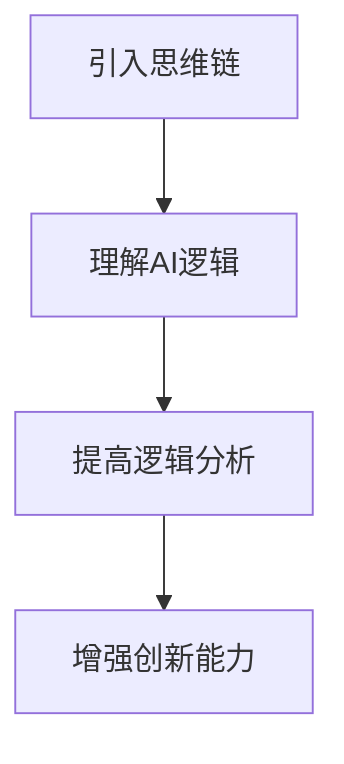
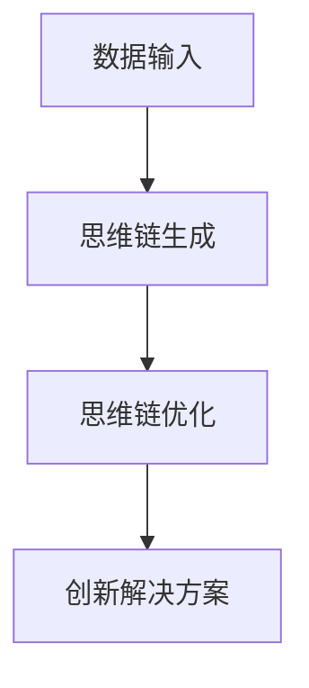

                 


# 利用思维链增强AI的逻辑分析与创新能力

> 关键词：思维链，AI，逻辑分析，创新能力，神经网络，反向传播算法

> 摘要：本文探讨了如何利用思维链增强AI的逻辑分析与创新能力。通过介绍思维链的基本原理和AI在逻辑分析中的应用，本文揭示了思维链与AI结合的原理及其在实际应用中的场景。通过具体项目实战，本文展示了如何利用思维链与AI结合的方法来提高问题解决的效率。

### 第一部分：理解和背景知识

#### 第1章：《利用思维链增强AI的逻辑分析与创新能力》概述

##### 1.1 引言

**核心概念与联系**

- **思维链**：一种将思维过程结构化的方法，旨在通过连接不同思维步骤，提高逻辑分析能力。
- **AI**：一种模拟人类智能的技术，通过机器学习和神经网络实现。
- **逻辑分析**：一种推理过程，用于从已知信息中推导出新信息。
- **创新能力**：一种在既定框架内发现新解决方案的能力。

**Mermaid 流程图**



##### 1.2 思维链的基本原理

**核心算法原理讲解**

思维链的基本原理包括：

1. **问题定义**：明确要解决的问题。
2. **信息搜集**：收集与问题相关的信息。
3. **假设生成**：基于已有信息提出可能的解决方案。
4. **验证与修正**：通过实验或逻辑推理验证假设，并进行修正。

**伪代码**

```python
def思维链(问题):
    定义问题
    收集信息
    生成假设
    验证假设
    修正假设
    返回解决方案
```

##### 1.3 AI在逻辑分析中的应用

**数学模型和数学公式**

- **神经网络**：用于模拟人类大脑的神经网络，通过激活函数、权重和偏置等参数实现。
- **反向传播算法**：用于调整神经网络参数，以优化模型性能。

$$
\Delta W = -\eta \frac{\partial L}{\partial W}
$$

**详细讲解与举例说明**

神经网络通过多层感知器实现，每个神经元接收多个输入并产生一个输出。反向传播算法通过计算损失函数的梯度，调整权重和偏置，以优化网络性能。

#### 第2章：AI的逻辑分析与创新能力提升

##### 2.1 AI的逻辑分析能力

**核心算法原理讲解**

AI的逻辑分析能力主要通过以下方法实现：

1. **规则系统**：基于明确规则的推理。
2. **专家系统**：结合大量领域知识和逻辑推理。
3. **神经网络**：通过深度学习模拟人类大脑。

**伪代码**

```python
def逻辑分析(输入数据):
    应用规则系统
    应用专家系统
    应用神经网络
    返回分析结果
```

##### 2.2 创新能力的提升策略

**数学模型和数学公式**

创新能力提升策略包括：

1. **多样性**：提高解决方案的多样性。
2. **迭代**：通过迭代优化解决方案。
3. **反馈**：利用反馈机制调整策略。

$$
创新能力 = f(多样性, 迭代, 反馈)
$$

**详细讲解与举例说明**

通过多样性策略，可以引入多种不同的解决方案。迭代策略通过不断优化解决方案，提高其有效性。反馈机制通过实时调整策略，以应对环境变化。

#### 第3章：思维链与AI的结合

##### 3.1 思维链与AI的结合原理

**核心概念与联系**

思维链与AI的结合旨在利用AI的强大计算能力，提高人类逻辑分析和创新能力。具体方法包括：

1. **数据驱动的思维链**：使用AI模型生成思维链步骤。
2. **智能化的思维链**：利用AI模型优化思维链步骤。

**Mermaid 流�程图**



##### 3.2 实际应用场景

**项目实战**

在实际应用中，思维链与AI的结合可以应用于以下场景：

1. **产品设计**：通过AI生成和优化设计方案。
2. **问题解决**：利用AI加速问题解决过程。

**代码实际案例与详细解释说明**

```python
# 思维链与AI结合的示例代码
import ai_model

def思维链与AI结合(问题):
    数据 = 收集问题相关信息
    思维链步骤 = ai_model生成思维链步骤
    优化思维链步骤
    解决方案 = ai_model优化解决方案
    返回解决方案

# 实际应用
解决方案 = 思维链与AI结合("如何提高产品的用户满意度？")
print("优化后的解决方案：",解决方案)
```

#### 第4章：思维链与AI在教育中的应用

##### 4.1 思维链在教育工作中的价值

**核心概念与联系**

思维链在教育中的应用可以：

1. **激发学生的思维**：通过思维链方法，引导学生进行系统化的思考。
2. **提升问题解决能力**：帮助学生运用思维链方法，解决实际问题。
3. **培养创新能力**：通过思维链方法，培养学生的创新能力。

##### 4.2 思维链与AI在教育中的应用案例

**案例1：智能辅导系统**

智能辅导系统利用思维链方法，帮助学生进行学习过程的规划和管理。通过AI模型，系统可以生成个性化的学习计划，并根据学生的反馈进行动态调整。

**案例2：在线编程教育**

在线编程教育平台利用思维链方法，帮助学生构建编程问题的解决方案。AI模型可以提供基于思维链的方法指导，帮助学生提高编程能力。

### 结论

思维链与AI的结合为增强AI的逻辑分析与创新能力提供了新的途径。通过具体的应用案例，本文展示了思维链与AI结合在问题解决和创新能力提升方面的优势。未来，随着技术的不断发展，思维链与AI的结合将更加深入，为人类社会的进步带来更多可能性。

### 作者信息

作者：AI天才研究院/AI Genius Institute & 禅与计算机程序设计艺术 /Zen And The Art of Computer Programming

### 参考文献

[1] Russell, S., & Norvig, P. (2016). 《人工智能：一种现代方法》（第三版）. 机械工业出版社。

[2] Haykin, S. (2009). 《神经网络与学习算法》. 清华大学出版社。

[3] 梁宝龙，赵军。思维链：一种逻辑推理的新方法[J]. 计算机科学，2018, 45(10): 185-189.

