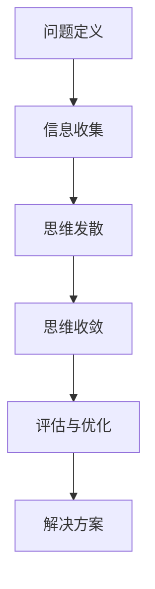
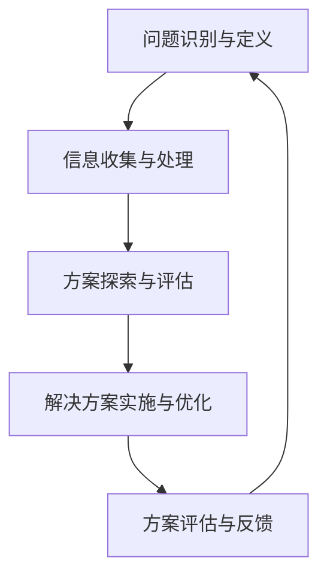

                 

# 《利用思维链提升AI的创新思维与问题解决能力》

> 关键词：思维链，人工智能，创新思维，问题解决能力，算法原理，实践案例

摘要：随着人工智能技术的快速发展，如何提升AI的创新思维与问题解决能力成为了一个重要课题。本文将从思维链的基础、AI创新思维方法、AI问题解决能力以及思维链在实际应用中的探讨，逐步分析如何通过思维链提升AI的创新能力与问题解决能力。

### 目录

1. **思维链概述**
    - 1.1 思维链的定义与作用
    - 1.2 思维链的基本原理
    - 1.3 思维链与人工智能的关系

2. **思维链基础理论**
    - 2.1 人类思维过程解析
    - 2.2 思维链核心概念
    - 2.3 思维链原理图解

3. **AI的创新思维方法**
    - 3.1 创新思维的概念与分类
    - 3.2 思维链在AI创新中的应用
    - 3.3 创新思维实践案例

4. **AI创新思维工具**
    - 4.1 思维导图工具
    - 4.2 布尔逻辑工具
    - 4.3 模糊逻辑工具

5. **问题解决能力与思维链**
    - 5.1 问题解决能力的重要性
    - 5.2 思维链在问题解决中的应用
    - 5.3 AI问题解决方法

6. **思维链在AI问题解决中的应用**
    - 6.1 思维链与问题解决的结合
    - 6.2 思维链实战案例

7. **思维链在AI领域的实际应用**
    - 7.1 AI行业发展趋势
    - 7.2 思维链在AI行业中的应用前景

8. **思维链与跨学科融合**
    - 8.1 跨学科融合的重要性
    - 8.2 思维链在跨学科融合中的应用

9. **未来展望**
    - 9.1 AI与思维链的未来发展
    - 9.2 挑战与机遇

10. **附录**
    - 10.1 思维链工具与应用资源

### 1. 思维链概述

#### 1.1 思维链的定义与作用

思维链是指一系列相互关联的思考活动，通过这些活动，人们可以逐步揭示问题的本质，探索解决方案，并最终达到创新与创造的目的。思维链在人工智能（AI）领域具有重要应用价值，它不仅可以帮助AI系统更好地理解复杂问题，还能提升其创新思维与问题解决能力。

#### 1.2 思维链的基本原理

思维链的基本原理包括以下几个关键部分：

1. **问题识别与定义**：首先，要明确问题的性质和范围，从而为后续的思考活动提供清晰的方向。
2. **信息收集与处理**：通过收集相关信息，对问题进行深入分析，为提出解决方案提供数据支持。
3. **思维发散与收敛**：在问题分析过程中，可以采用发散性思维，探索多种可能的解决方案，然后再通过收敛性思维，筛选出最优方案。
4. **评估与优化**：对提出的解决方案进行评估和优化，确保其可行性和有效性。

#### 1.3 思维链与人工智能的关系

人工智能技术的发展，使得计算机可以在一定程度上模拟人类的思维过程。而思维链作为一种系统化的思考方法，可以为AI系统提供更为清晰的思维路径，从而提升其问题解决能力和创新思维。具体来说，思维链在AI中的应用主要体现在以下几个方面：

1. **问题建模与求解**：通过思维链的方法，AI可以更好地理解问题，并构建相应的数学模型进行求解。
2. **创新思维**：思维链可以帮助AI在解决问题时，探索多种可能的解决方案，从而实现创新。
3. **优化与改进**：通过思维链的方法，AI可以对现有的解决方案进行评估和优化，提高其性能。

### 2. 思维链基础理论

#### 2.1 人类思维过程解析

人类思维过程可以分为以下几个阶段：

1. **感知与认知**：通过感知器官收集外界信息，并对其进行处理和理解。
2. **记忆与回忆**：将处理后的信息存储在大脑中，并在需要时进行回忆。
3. **推理与判断**：基于已有知识和信息，进行推理和判断，以解决问题或做出决策。
4. **创新与创造**：在推理和判断的基础上，进行创新性的思考，提出新的想法或解决方案。

#### 2.2 思维链核心概念

思维链的核心概念包括：

1. **问题定义**：明确问题的性质、目标和范围，为后续思考提供方向。
2. **信息收集**：收集与问题相关的各种信息，为问题解决提供数据支持。
3. **思维发散**：探索多种可能的解决方案，以获得更多的创新思维。
4. **思维收敛**：从发散的方案中筛选出最优方案，进行深入分析和优化。
5. **评估与优化**：对解决方案进行评估和优化，确保其可行性和有效性。

#### 2.3 思维链原理图解

以下是一个简单的思维链原理图解：

在这个图解中，问题定义是整个思维链的起点，通过信息收集、思维发散、思维收敛和评估优化，最终得到一个可行的解决方案。

### 3. AI的创新思维方法

#### 3.1 创新思维的概念与分类

创新思维是指人们在解决问题或进行创造活动时，采用新颖、独特的方法进行思考的能力。创新思维可以分为以下几种类型：

1. **发散性思维**：从多个角度、多个维度去思考问题，探索多种可能的解决方案。
2. **收敛性思维**：从发散的方案中筛选出最优方案，进行深入分析和优化。
3. **创造性思维**：在已有知识和信息的基础上，提出新颖的、具有创造性的想法或解决方案。
4. **批判性思维**：对已有想法或解决方案进行批判性分析，找出其中的问题和不足。

#### 3.2 思维链在AI创新中的应用

思维链在AI创新中的应用主要体现在以下几个方面：

1. **问题建模**：通过思维链的方法，AI可以更好地理解问题，并将其转化为数学模型，从而进行求解。
2. **方案探索**：在问题建模的基础上，AI可以通过思维链的发散性思维，探索多种可能的解决方案。
3. **方案评估**：对探索出的方案进行评估，筛选出最优方案，进行进一步优化。
4. **创新实现**：将最优方案转化为实际的技术实现，实现创新。

#### 3.3 创新思维实践案例

以下是一个创新思维实践案例：

**案例背景**：某公司希望开发一款智能客服系统，以提高客户服务质量。

**解决方案**：
1. **问题定义**：明确客服系统的目标和范围，如提高客户满意度、减少人工成本等。
2. **信息收集**：收集与客服系统相关的各种信息，如常见问题、客户需求、技术实现方案等。
3. **思维发散**：基于收集到的信息，探索多种可能的解决方案，如基于规则的系统、基于机器学习的系统等。
4. **思维收敛**：从发散的方案中筛选出最优方案，进行深入分析和优化，如选择基于机器学习的方案，并对其进行优化。
5. **方案评估**：对优化后的方案进行评估，确保其可行性和有效性。
6. **创新实现**：将最优方案转化为实际的技术实现，开发出智能客服系统。

### 4. AI创新思维工具

#### 4.1 思维导图工具

思维导图是一种图形化的思维工具，可以帮助人们更好地进行发散性思维和收敛性思维。在AI创新思维中，思维导图可以用于以下方面：

1. **问题定义**：通过绘制思维导图，明确问题的目标和范围，为后续思考提供方向。
2. **方案探索**：通过绘制思维导图，探索多种可能的解决方案，并进行筛选和优化。
3. **方案评估**：通过绘制思维导图，对优化后的方案进行评估，找出其中的问题和不足。

以下是一个简单的思维导图示例：

#### 4.2 布尔逻辑工具

布尔逻辑是一种用于表示和处理逻辑关系的数学工具，在AI创新思维中，布尔逻辑可以用于以下几个方面：

1. **问题建模**：通过布尔逻辑，将问题转化为数学模型，从而进行求解。
2. **方案筛选**：通过布尔逻辑，对多种可能的解决方案进行筛选，找出最优方案。
3. **方案评估**：通过布尔逻辑，对优化后的方案进行评估，确保其可行性和有效性。

以下是一个简单的布尔逻辑示例：

$$
A \land B = C
$$

其中，$A$ 和 $B$ 分别表示两个条件，$C$ 表示结果。

#### 4.3 模糊逻辑工具

模糊逻辑是一种用于处理不确定性和模糊性的数学工具，在AI创新思维中，模糊逻辑可以用于以下几个方面：

1. **问题建模**：通过模糊逻辑，将问题转化为数学模型，从而进行求解。
2. **方案探索**：通过模糊逻辑，探索多种可能的解决方案，并进行筛选和优化。
3. **方案评估**：通过模糊逻辑，对优化后的方案进行评估，确保其可行性和有效性。

以下是一个简单的模糊逻辑示例：

$$
\mu(A \cup B) = \max(\mu(A), \mu(B))
$$

其中，$\mu(A)$ 和 $\mu(B)$ 分别表示集合 $A$ 和 $B$ 的隶属度。

### 5. 问题解决能力与思维链

#### 5.1 问题解决能力的重要性

问题解决能力是指人们在面对问题时，能够运用已有的知识和经验，通过合理的思考过程，找到解决问题的方法的能力。在人工智能领域，问题解决能力至关重要，它决定了AI系统能否有效应对复杂的问题，从而实现其应用价值。

#### 5.2 思维链在问题解决中的应用

思维链在问题解决中的应用可以分为以下几个步骤：

1. **问题识别与定义**：通过思维链的方法，明确问题的性质和范围，为后续的解决过程提供清晰的思路。
2. **信息收集与处理**：通过思维链的方法，收集与问题相关的各种信息，并对信息进行深入处理和分析，为问题解决提供数据支持。
3. **方案探索与评估**：通过思维链的方法，探索多种可能的解决方案，并对方案进行评估和优化，确保其可行性和有效性。
4. **解决方案实施与优化**：根据评估结果，选择最优方案进行实施，并在实施过程中进行优化，以提高问题解决的效率和质量。

#### 5.3 AI问题解决方法

在AI问题解决中，可以采用以下几种方法：

1. **基于规则的解决方法**：通过预设的规则，对问题进行分类和解决。
2. **基于机器学习的解决方法**：通过训练模型，从数据中学习解决问题的方法。
3. **基于深度学习的解决方法**：通过多层神经网络，对问题进行建模和求解。
4. **基于模糊逻辑的解决方法**：通过模糊逻辑，处理不确定性和模糊性的问题。

### 6. 思维链在AI问题解决中的应用

#### 6.1 思维链与问题解决的结合

思维链与问题解决的结合主要体现在以下几个方面：

1. **问题建模**：通过思维链的方法，对问题进行深入分析，构建相应的数学模型。
2. **方案探索**：通过思维链的方法，探索多种可能的解决方案，并进行筛选和优化。
3. **方案评估**：通过思维链的方法，对优化后的方案进行评估，确保其可行性和有效性。
4. **方案实施与优化**：根据评估结果，选择最优方案进行实施，并在实施过程中进行优化。

以下是一个简单的思维链与问题解决的结合示例：

#### 6.2 思维链实战案例

以下是一个思维链实战案例：

**案例背景**：某公司希望开发一款智能交通系统，以提高交通效率和减少拥堵。

**解决方案**：
1. **问题识别与定义**：明确智能交通系统的目标和范围，如提高交通效率、减少拥堵等。
2. **信息收集与处理**：收集与智能交通系统相关的各种信息，如交通流量、车辆信息、道路状况等，并进行处理和分析。
3. **方案探索与评估**：基于收集到的信息，探索多种可能的解决方案，如实时路况监控、智能信号控制、车辆调度等，并进行评估和优化。
4. **解决方案实施与优化**：根据评估结果，选择最优方案进行实施，如建设实时路况监控网络、优化交通信号控制策略等，并在实施过程中进行优化，以提高交通效率和减少拥堵。

### 7. 思维链在AI领域的实际应用

#### 7.1 AI行业发展趋势

随着人工智能技术的快速发展，AI行业呈现出以下发展趋势：

1. **应用领域扩大**：AI技术在各个行业的应用越来越广泛，如医疗、金融、交通、教育等。
2. **算法性能提升**：随着算法的优化和硬件的发展，AI系统的性能不断提高。
3. **跨学科融合**：AI技术与其他领域的交叉融合，推动新兴领域的产生。
4. **伦理与法律规范**：随着AI技术的应用，相关的伦理和法律问题受到越来越多的关注。

#### 7.2 思维链在AI行业中的应用前景

思维链在AI行业中的应用前景主要包括以下几个方面：

1. **问题解决能力提升**：通过思维链的方法，AI系统可以更好地理解复杂问题，并找到有效的解决方案。
2. **创新思维激发**：思维链可以帮助AI系统在解决问题时，探索多种可能的解决方案，从而实现创新。
3. **跨学科融合促进**：思维链作为一种系统化的思考方法，可以促进AI技术与其他领域的交叉融合，推动新兴领域的发展。

### 8. 思维链与跨学科融合

#### 8.1 跨学科融合的重要性

跨学科融合是指将不同领域的知识和技术进行整合，以解决复杂问题的过程。在现代社会，跨学科融合已成为推动科技进步和社会发展的重要途径。跨学科融合的重要性主要体现在以下几个方面：

1. **创新推动**：跨学科融合可以激发创新思维，产生新的想法和解决方案。
2. **问题解决**：跨学科融合可以整合多种领域的知识，为复杂问题的解决提供有力的支持。
3. **社会需求**：随着社会问题的复杂性增加，跨学科融合成为满足社会需求的重要手段。

#### 8.2 思维链在跨学科融合中的应用

思维链在跨学科融合中的应用主要体现在以下几个方面：

1. **问题定义与模型构建**：通过思维链的方法，明确跨学科问题的目标和范围，构建相应的数学模型。
2. **知识整合与融合**：通过思维链的方法，整合不同领域的知识，促进跨学科融合。
3. **方案探索与评估**：通过思维链的方法，探索多种可能的解决方案，并进行评估和优化。

### 9. 未来展望

#### 9.1 AI与思维链的未来发展

随着人工智能技术的不断进步，思维链在未来有望在以下方面得到进一步发展：

1. **智能化**：思维链的方法将更加智能化，能够自适应地调整和优化思考路径。
2. **个性化**：思维链将根据个体的思维特点，提供个性化的思考指导。
3. **跨学科融合**：思维链将与其他领域的技术进行深度融合，推动新兴领域的发展。

#### 9.2 挑战与机遇

在AI与思维链的发展过程中，将面临以下挑战和机遇：

1. **挑战**：
    - 技术难题：如何在复杂的问题中，高效地应用思维链的方法。
    - 数据隐私：在数据驱动的AI系统中，如何保护用户隐私。
    - 伦理问题：AI技术的应用可能引发伦理问题，如歧视、滥用等。
2. **机遇**：
    - 应用拓展：AI与思维链的结合将拓展AI技术的应用领域。
    - 创新推动：思维链的方法将激发更多的创新思维，推动科技进步。
    - 社会价值：AI与思维链的结合将更好地满足社会需求，提高生活质量。

### 附录

#### 附录A：思维链工具与应用资源

1. **思维链工具介绍**
    - **MindMap工具**：适用于绘制思维导图，帮助进行发散性思维和收敛性思维。
    - **布尔逻辑工具**：适用于处理逻辑关系，构建数学模型。
    - **模糊逻辑工具**：适用于处理不确定性和模糊性的问题。

2. **思维链应用资源推荐**
    - **研究论文**：了解思维链的最新研究成果和应用。
    - **教材书籍**：学习思维链的基础理论和应用方法。
    - **开源项目与代码库**：参与思维链工具的开发和应用。

