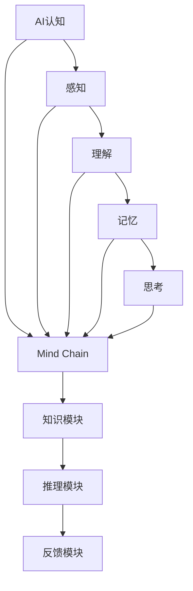
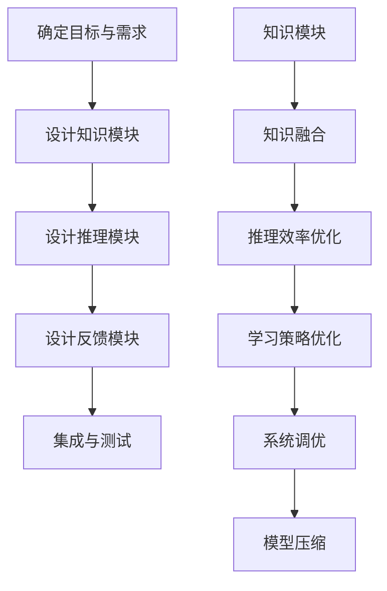
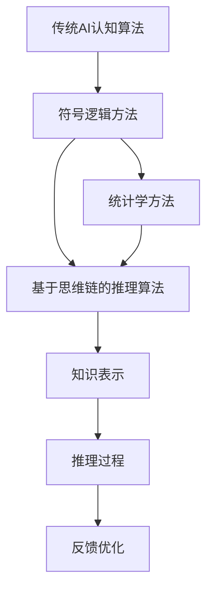

                 

### 文章标题

# 利用思维链提升AI的认知和推理能力新方向探索

> 关键词：思维链，AI认知，AI推理，算法，数学模型，项目实战

> 摘要：本文旨在探讨如何利用思维链这一新的技术方向，提升人工智能（AI）的认知和推理能力。通过介绍思维链的基本概念、架构与实现方法，结合数学模型和算法原理，以及实际项目案例，深入解析思维链在AI领域中的应用前景和挑战。本文结构紧凑、逻辑清晰，旨在为读者提供一个全面、系统的认知和推理能力提升方案。

## 引言

人工智能（AI）的发展已经取得了显著的进展，从最初的规则基础方法到现在的深度学习，AI在语音识别、图像处理、自然语言处理等领域展现出了惊人的能力。然而，尽管AI在很多任务上已经超越了人类，但在复杂认知和推理任务上仍存在诸多不足。传统AI方法主要依赖于大量数据和预先设定的规则，缺乏灵活性和自适应性，导致其难以处理复杂、不确定的环境。

思维链（Mind Chain）作为一种新兴的技术方向，致力于解决传统AI在认知和推理方面的局限性。思维链通过模拟人类的思维方式，将知识、经验和推理过程紧密连接起来，实现更加智能和自适应的AI系统。本文将详细探讨思维链的基本概念、架构与实现方法，并结合数学模型和算法原理，分析思维链在AI领域的应用前景和挑战。

本文将分为两个主要部分。第一部分将介绍AI认知与推理的基础知识，包括认知与推理的概念、传统AI方法及其局限性，以及思维链的基本框架与作用。第二部分将深入探讨思维链在AI认知与推理中的新方向，涵盖自然语言处理、计算机视觉、决策支持系统等多个领域，并分析思维链在AI认知与推理中的未来发展。

通过本文的阅读，读者将了解到思维链这一技术方向的基本原理和应用方法，从而为实际项目开发提供新的思路和工具。本文结构如下：

### 第一部分：AI认知与推理基础

- **第1章：AI认知与推理概述**
  - 1.1 AI认知的概念与重要性
  - 1.2 AI推理的基本原理
  - 1.3 思维链的基本框架与作用

- **第2章：思维链架构与实现**
  - 2.1 思维链的基本组成
  - 2.2 思维链的构建方法
  - 2.3 思维链的优化策略

- **第3章：AI认知与推理算法**
  - 3.1 传统AI认知算法
  - 3.2 基于思维链的推理算法
  - 3.3 思维链在认知与推理中的应用

- **第4章：数学模型与数学公式**
  - 4.1 认知与推理中的线性代数
  - 4.2 认知与推理中的概率论与统计
  - 4.3 认知与推理中的神经网络模型

- **第5章：思维链在项目中的应用**
  - 5.1 项目实战一：智能问答系统
  - 5.2 项目实战二：智能诊断系统
  - 5.3 项目实战三：智能推荐系统

### 第二部分：思维链在AI认知与推理中的新方向

- **第6章：思维链在自然语言处理中的应用**
  - 6.1 思维链在文本分析中的应用
  - 6.2 思维链在对话系统中的应用
  - 6.3 思维链在机器翻译中的应用

- **第7章：思维链在计算机视觉中的应用**
  - 7.1 思维链在图像识别中的应用
  - 7.2 思维链在视频分析中的应用
  - 7.3 思维链在图像生成中的应用

- **第8章：思维链在决策支持系统中的应用**
  - 8.1 思维链在数据挖掘中的应用
  - 8.2 思维链在预测模型中的应用
  - 8.3 思维链在优化算法中的应用

- **第9章：思维链在AI认知与推理中的未来发展**
  - 9.1 思维链在AI认知与推理中的挑战
  - 9.2 思维链在AI认知与推理中的趋势
  - 9.3 思维链在AI认知与推理中的未来方向

### 结论

本文通过系统地介绍思维链在AI认知与推理中的应用，为读者提供了一个全面、系统的认知和推理能力提升方案。思维链作为一种新兴的技术方向，具有巨大的潜力和应用前景。在未来，随着技术的不断发展和完善，思维链有望在更多领域发挥重要作用，推动AI技术迈向新的高度。

### 第一部分：AI认知与推理基础

#### 第1章：AI认知与推理概述

在人工智能（AI）领域，认知与推理是两个核心概念。认知涉及AI系统理解和处理信息的能力，而推理则是指AI在已有信息的基础上，进行逻辑推断和决策的过程。理解AI认知与推理的基本原理，有助于我们更好地掌握AI的工作机制，探索如何利用思维链提升其能力。

### 1.1 AI认知的概念与重要性

AI认知是指人工智能系统模拟人类认知过程的能力，包括感知、理解、记忆和思考等多个方面。感知是AI接收外部信息的过程，如通过视觉系统捕捉图像或通过听觉系统接收声音。理解则是对感知到的信息进行解读和分类，如识别图像中的物体或理解语音中的词语含义。记忆是存储和处理信息的能力，包括短期记忆和长期记忆。思考则是基于已有信息进行逻辑推理和决策的过程，如规划路径或做出预测。

AI认知在AI系统中具有重要意义。首先，它使得AI系统能够更好地理解和处理复杂的信息，提高其智能水平。其次，认知能力有助于AI系统与人类进行更自然的交互，实现人机协同。此外，认知能力还可以提高AI系统的自适应能力，使其在面对未知或变化的环境中仍能保持有效的运作。

### 1.2 AI推理的基本原理

AI推理是指基于已知信息，通过逻辑推理得出新的结论或决策的过程。传统AI推理方法主要依赖于形式逻辑和概率推理。形式逻辑推理是基于明确的规则和关系进行的推理，如命题逻辑和谓词逻辑。概率推理则是在不确定环境下，通过概率计算进行推理，如贝叶斯推理。

现代AI推理方法逐渐向基于数据的推理方法发展。深度学习模型，如神经网络，通过学习大量数据，能够自动提取特征并实现复杂的推理任务。这种基于数据的推理方法在图像识别、语音识别和自然语言处理等领域取得了显著的成果。

### 1.3 思维链的基本框架与作用

思维链（Mind Chain）是一种新型的AI推理方法，其核心思想是模拟人类思维过程，通过构建一个动态的、多层次的思维网络，实现更加智能和自适应的推理能力。思维链的基本框架包括知识模块、推理模块和反馈模块。

**知识模块**负责存储和管理各种知识，包括事实、规则、经验等。这些知识可以是结构化的，如数据库中的记录，也可以是非结构化的，如图像、文本等。

**推理模块**则负责基于知识进行推理，包括模式匹配、逻辑推理、概率推理等。推理模块通过分析现有知识，推导出新的结论或决策。

**反馈模块**则用于收集和利用系统输出的结果，对知识模块和推理模块进行优化和调整。反馈模块可以基于用户反馈、系统性能指标等，对推理过程进行实时调整，提高系统的自适应能力和可靠性。

思维链的作用主要体现在以下几个方面：

1. **增强推理能力**：思维链通过构建一个动态的、多层次的思维网络，能够处理更复杂、更灵活的推理任务，提高AI系统的智能水平。
2. **提高自适应能力**：思维链通过反馈机制，能够根据环境和任务的变化，不断调整和优化推理过程，提高系统的自适应能力。
3. **促进人机协同**：思维链通过模拟人类思维过程，能够更好地理解人类意图和需求，实现更自然的人机交互。

### 背景介绍与联系

AI认知与推理作为AI系统的核心能力，与思维链有着密切的联系。传统AI方法主要依赖于预设的规则和数据驱动的方法，缺乏灵活性和自适应性。而思维链通过模拟人类思维过程，构建一个动态的、多层次的思维网络，能够更好地应对复杂、不确定的环境。

思维链在AI认知中的作用主要体现在以下几个方面：

1. **增强认知能力**：思维链通过知识模块的构建，能够存储和管理各种知识，提高AI系统对信息的理解和处理能力。
2. **促进推理能力**：思维链通过推理模块的分析和推导，能够实现更复杂、更灵活的推理任务，提高AI系统的智能水平。
3. **提高自适应能力**：思维链通过反馈模块的优化和调整，能够根据环境和任务的变化，不断调整和优化推理过程，提高系统的自适应能力。

### 核心概念与联系

为了更好地理解AI认知与推理的概念及其与思维链的联系，我们可以通过一个Mermaid流程图来展示它们之间的关系架构：



在上述流程图中，AI认知与推理的基本概念（感知、理解、记忆、思考）与思维链的核心组件（知识模块、推理模块、反馈模块）相互关联。知识模块负责存储和管理各种知识，推理模块基于这些知识进行推理，而反馈模块则通过优化和调整推理过程，提高系统的自适应能力。

### 结论

AI认知与推理作为AI系统的核心能力，对于提升AI系统的智能水平和自适应能力具有重要意义。思维链作为一种新型的AI推理方法，通过模拟人类思维过程，能够更好地应对复杂、不确定的环境。本章介绍了AI认知与推理的基本原理和思维链的基本框架与作用，为后续章节的深入探讨奠定了基础。在接下来的章节中，我们将进一步探讨思维链的架构与实现方法，以及其在AI认知与推理中的应用。

### 第2章：思维链架构与实现

#### 2.1 思维链的基本组成

思维链（Mind Chain）是一种通过模拟人类思维过程，构建动态、多层次的思维网络，以实现智能推理和认知的AI技术。思维链的基本组成包括知识模块、推理模块和反馈模块。这些模块协同工作，形成了一个完整的思维链条，从而提升了AI系统的智能水平。

**知识模块**是思维链的核心组件之一，主要负责存储和管理各种知识。知识可以来自多个来源，包括外部数据、用户输入、先验知识库等。知识模块不仅要存储事实性知识，如“猫有四条腿”，还要存储程序性知识，如“如何解决特定问题”。知识模块的设计需考虑知识的结构化、可扩展性和高效检索。

**推理模块**是基于知识模块进行推理的核心组件。它通过分析现有知识，利用逻辑、概率和统计方法进行推理，从而得出新的结论或决策。推理模块通常包括模式匹配、因果推理、逻辑推理等功能。例如，在诊断系统中，推理模块可以根据患者的症状和体征，结合医学知识库，推导出可能的诊断结果。

**反馈模块**负责收集和利用系统输出结果，对知识模块和推理模块进行优化和调整。反馈可以是用户反馈，也可以是基于系统性能指标的数据分析结果。通过反馈模块，思维链可以实现自我调整和优化，提高推理的准确性和效率。

#### 2.2 思维链的构建方法

构建思维链的过程可以分为以下几个步骤：

**1. 确定目标和需求**

首先，需要明确思维链的应用场景和目标，如自然语言处理、智能问答、医疗诊断等。根据目标和需求，确定所需的推理能力和认知水平。

**2. 设计知识模块**

知识模块的设计是思维链构建的关键步骤。需要确定知识来源，如外部数据库、用户输入、专家知识等，并设计知识的结构化表示方法。常见的知识表示方法包括框架表示、本体表示和语义网络等。

**3. 设计推理模块**

推理模块的设计需考虑推理算法的选择和优化。常见的推理算法包括基于规则的推理、基于模型的推理和基于案例的推理等。需要根据具体应用场景选择合适的算法，并进行优化，以提高推理效率和准确性。

**4. 设计反馈模块**

反馈模块的设计需考虑如何收集反馈数据，以及如何利用反馈数据进行优化。可以通过用户反馈、系统性能指标和在线学习等方法收集反馈数据，并利用这些数据进行模型调整和优化。

**5. 集成和测试**

将知识模块、推理模块和反馈模块集成在一起，形成完整的思维链系统。进行全面的测试，验证系统的性能和稳定性，并根据测试结果进行优化和调整。

#### 2.3 思维链的优化策略

为了提升思维链的性能和适应性，需要采用一系列优化策略。以下是一些常见的优化方法：

**1. 知识融合**

知识融合是将多个来源的知识进行整合，形成统一的表示方法。通过知识融合，可以减少冗余知识，提高知识利用效率。

**2. 推理效率优化**

推理效率优化是提高思维链性能的关键。可以采用分布式推理、并行推理和增量推理等方法，提高推理速度。

**3. 学习策略优化**

学习策略优化是提升思维链自适应能力的关键。可以采用在线学习、迁移学习和强化学习等方法，提高系统的学习能力。

**4. 系统调优**

系统调优是通过调整系统参数，优化系统性能。可以采用基于性能指标的调优方法，如交叉验证、网格搜索等。

**5. 模型压缩**

模型压缩是减少模型体积，提高推理速度和降低能耗的有效方法。可以采用模型剪枝、量化、蒸馏等方法进行模型压缩。

### 背景介绍与联系

思维链的构建方法与AI系统的整体架构密切相关。传统的AI系统主要依赖于数据驱动的方法，而思维链通过知识模块、推理模块和反馈模块的构建，实现了知识驱动的推理过程。这一过程不仅提升了AI系统的智能水平，还增强了系统的自适应能力。

与传统的AI方法相比，思维链具有以下优势：

1. **更强的推理能力**：思维链通过知识模块和推理模块的协同工作，能够处理更复杂、更灵活的推理任务。
2. **更高的自适应能力**：思维链通过反馈模块的优化和调整，能够根据环境和任务的变化，不断调整和优化推理过程。
3. **更好的认知能力**：思维链通过模拟人类思维过程，能够更好地理解和处理复杂的信息。

这些优势使得思维链在AI系统中具有广泛的应用前景。

### 核心概念与联系

为了更好地理解思维链的构建方法，我们可以通过一个Mermaid流程图来展示其核心概念之间的联系：



在上述流程图中，从确定目标和需求开始，经过设计知识模块、推理模块和反馈模块，再到集成与测试，形成了一个完整的思维链构建过程。随后，通过知识融合、推理效率优化、学习策略优化、系统调优和模型压缩等优化方法，进一步提升了思维链的性能和适应性。

### 结论

思维链作为一种新兴的AI推理方法，通过模拟人类思维过程，构建了一个动态、多层次的思维网络，实现了更智能和自适应的推理能力。本章详细介绍了思维链的基本组成、构建方法和优化策略，为后续章节的应用分析奠定了基础。在接下来的章节中，我们将深入探讨思维链在AI认知与推理中的实际应用，以及其在不同领域的应用前景。

### 第3章：AI认知与推理算法

在人工智能领域，认知与推理算法是实现智能系统核心功能的关键。传统AI认知算法和基于思维链的推理算法各有特点，本章将分别介绍这两种算法的基本原理，以及它们在AI认知与推理中的应用。

#### 3.1 传统AI认知算法

传统AI认知算法主要依赖于符号逻辑和统计学方法。其中，符号逻辑方法包括基于规则的推理和基于案例的推理。统计学方法则包括贝叶斯推理和决策树等。

**基于规则的推理**：基于规则的推理是通过预先定义的规则库，对输入数据进行推理的过程。每个规则包含一个条件部分和一个结论部分，如“如果A且B，则C”。这种方法的优点是实现简单，易于理解。然而，其缺点是规则库的构建需要大量人力和时间，且难以处理复杂、不确定的问题。

**基于案例的推理**：基于案例的推理是从过去的成功案例中提取经验，用于解决新问题的方法。系统首先寻找与当前问题相似的案例，然后根据案例的解决方案进行推理。这种方法具有较强的适应性和灵活性，但需要大量案例数据，且案例的表示和匹配过程复杂。

**贝叶斯推理**：贝叶斯推理是一种基于概率论的推理方法，通过更新概率分布来推断新的结论。其基本原理是利用先验概率和观测数据，计算后验概率。贝叶斯推理在处理不确定性和概率问题时具有优势，但计算复杂度较高。

**决策树**：决策树是一种基于统计学方法的决策支持工具，通过一系列的判断节点和结果节点，构建一个树状结构。每个节点代表一个决策，每个分支代表一个可能的决策结果。决策树方法简单直观，易于理解和实现，但容易过拟合，且在处理非线性关系时效果较差。

#### 3.2 基于思维链的推理算法

基于思维链的推理算法是一种新兴的AI认知与推理方法，其核心思想是模拟人类思维过程，通过构建动态、多层次的思维网络，实现更智能、更自适应的推理能力。思维链算法主要包括知识表示、推理过程和反馈优化等组成部分。

**知识表示**：知识表示是思维链算法的基础。思维链通过知识图谱、本体论和语义网络等方法，将各种知识结构化、语义化表示。这种表示方法不仅能够存储事实性知识，如“猫有四条腿”，还能存储程序性知识，如“如何捕鱼”。知识表示的方法有助于提高知识的利用效率和推理的准确性。

**推理过程**：推理过程是思维链算法的核心。思维链通过多种推理方法，如模式匹配、因果推理和逻辑推理等，实现知识的关联和推理。与传统的基于规则的推理方法不同，思维链算法能够在推理过程中动态调整和优化推理路径，从而更好地适应复杂和不确定的环境。

**反馈优化**：反馈优化是思维链算法的重要组成部分。通过实时收集用户反馈和系统输出结果，思维链能够不断调整和优化知识库和推理算法。这种方法不仅提高了推理的准确性，还能增强系统的自适应能力，使其在长期运行过程中不断改进和优化。

#### 3.3 思维链在认知与推理中的应用

思维链算法在AI认知与推理中具有广泛的应用前景。以下是一些典型的应用场景：

**智能问答系统**：思维链算法能够通过知识图谱和自然语言处理技术，实现对用户问题的理解和回答。例如，在医疗咨询系统中，思维链可以根据患者的症状和体征，结合医学知识库，提供准确的诊断建议。

**智能诊断系统**：思维链算法可以应用于医疗诊断领域，通过对病例数据和医学知识的分析，实现疾病预测和诊断。例如，在癌症诊断中，思维链可以根据患者的病史、家族史和基因信息，提供个性化的诊断建议。

**智能推荐系统**：思维链算法可以通过对用户行为和兴趣的分析，实现个性化推荐。例如，在电子商务平台中，思维链可以根据用户的历史购买记录和浏览记录，推荐合适的商品。

**智能决策支持系统**：思维链算法可以应用于决策支持领域，通过对大量数据和知识的分析，提供决策支持和优化方案。例如，在物流调度中，思维链可以根据订单信息、交通状况和库存水平，提供最优的运输和配送方案。

#### 背景介绍与联系

传统AI认知算法和基于思维链的推理算法在AI认知与推理中扮演着重要角色。传统算法主要依赖于符号逻辑和统计学方法，适用于一些简单的、结构化的任务。而基于思维链的推理算法通过模拟人类思维过程，实现了更智能、更自适应的推理能力，适用于更复杂、更不确定的环境。

思维链算法与传统的AI认知算法相比，具有以下优势：

1. **更强的推理能力**：思维链算法通过动态、多层次的思维网络，能够处理更复杂、更灵活的推理任务。
2. **更高的自适应能力**：思维链算法通过反馈优化，能够根据环境和任务的变化，不断调整和优化推理过程。
3. **更好的认知能力**：思维链算法通过知识表示和推理过程，能够更好地理解和处理复杂的信息。

这些优势使得思维链算法在AI认知与推理中具有广泛的应用前景。

### 核心概念与联系

为了更好地理解传统AI认知算法和基于思维链的推理算法之间的联系，我们可以通过一个Mermaid流程图来展示它们的核心概念和联系：



在上述流程图中，传统AI认知算法包括符号逻辑方法和统计学方法，而基于思维链的推理算法包括知识表示、推理过程和反馈优化。传统算法和思维链算法通过知识表示和推理过程相互关联，共同构成了现代AI认知与推理的体系。

### 结论

本章介绍了传统AI认知算法和基于思维链的推理算法的基本原理及其在AI认知与推理中的应用。传统算法主要依赖于符号逻辑和统计学方法，适用于简单的、结构化的任务。而基于思维链的推理算法通过模拟人类思维过程，实现了更智能、更自适应的推理能力，适用于更复杂、更不确定的环境。在下一章中，我们将进一步探讨认知与推理中的数学模型和公式，为理解思维链的算法原理提供更深入的数学支持。

### 第4章：数学模型与数学公式

在AI认知与推理过程中，数学模型和数学公式起着至关重要的作用。它们不仅为AI系统提供了理论基础，还通过精确的数学计算，使得AI系统能够更有效地处理复杂问题。本章将介绍认知与推理中的线性代数、概率论与统计以及神经网络模型，并详细讲解相关的数学公式和例子。

#### 4.1 认知与推理中的线性代数

线性代数是AI认知与推理中的重要工具，它用于处理多维数据、变换和优化问题。以下是一些常用的线性代数概念和公式：

**1. 向量与矩阵**：

- 向量（Vector）：一个向量是一个具有多个元素的数组，用于表示多维空间中的点。例如，一个三维向量可以表示为 \( \mathbf{v} = [v_1, v_2, v_3] \)。
- 矩阵（Matrix）：一个矩阵是一个由行和列组成的二维数组，用于表示数据集或变换。例如，一个 \( 3 \times 3 \) 的矩阵可以表示为 \( \mathbf{A} = \begin{bmatrix} a_{11} & a_{12} & a_{13} \\ a_{21} & a_{22} & a_{23} \\ a_{31} & a_{32} & a_{33} \end{bmatrix} \)。

**2. 线性变换**：

- 线性变换（Linear Transformation）：一个线性变换是将向量映射到另一个向量的函数，通常通过矩阵乘法实现。例如，给定矩阵 \( \mathbf{A} \) 和向量 \( \mathbf{v} \)，线性变换可以表示为 \( \mathbf{w} = \mathbf{A} \mathbf{v} \)。

**3. 矩阵求逆**：

- 矩阵求逆（Inverse Matrix）：一个可逆矩阵 \( \mathbf{A} \) 的逆矩阵 \( \mathbf{A}^{-1} \) 满足 \( \mathbf{A} \mathbf{A}^{-1} = \mathbf{I} \)，其中 \( \mathbf{I} \) 是单位矩阵。矩阵求逆可以通过高斯消元法或矩阵分解方法实现。

**4. 特征值与特征向量**：

- 特征值（Eigenvalue）：一个矩阵 \( \mathbf{A} \) 的特征值 \( \lambda \) 是使得 \( \mathbf{A} \mathbf{v} = \lambda \mathbf{v} \) 成立的标量。
- 特征向量（Eigenvector）：与特征值 \( \lambda \) 对应的向量 \( \mathbf{v} \) 称为特征向量。特征值和特征向量在降维、数据压缩等领域有广泛应用。

**例子**：

假设我们有一个 \( 3 \times 3 \) 的矩阵 \( \mathbf{A} = \begin{bmatrix} 1 & 2 & 3 \\ 4 & 5 & 6 \\ 7 & 8 & 9 \end{bmatrix} \)，要计算其逆矩阵。

首先，通过高斯消元法或矩阵分解方法计算其逆矩阵 \( \mathbf{A}^{-1} \)：

$$
\mathbf{A}^{-1} = \begin{bmatrix} -\frac{1}{3} & \frac{2}{3} & -\frac{1}{3} \\ \frac{4}{3} & -\frac{1}{3} & \frac{2}{3} \\ -\frac{7}{3} & \frac{8}{3} & -\frac{1}{3} \end{bmatrix}
$$

#### 4.2 认知与推理中的概率论与统计

概率论与统计在AI认知与推理中用于处理不确定性、预测和决策问题。以下是一些常用的概率论与统计概念和公式：

**1. 概率分布**：

- 离散概率分布：一个离散概率分布 \( P(X = x) \) 表示随机变量 \( X \) 取特定值 \( x \) 的概率。
- 连续概率分布：一个连续概率分布 \( f_X(x) \) 表示随机变量 \( X \) 在某个区间内取值的概率密度。

**2. 条件概率**：

- 条件概率：给定事件 \( A \) 发生的条件下，事件 \( B \) 发生的概率表示为 \( P(B|A) \)。

**3. 贝叶斯定理**：

- 贝叶斯定理：用于计算后验概率，公式为 \( P(A|B) = \frac{P(B|A)P(A)}{P(B)} \)。

**4. 假设检验**：

- 假设检验：通过统计方法验证一个假设是否成立。常见的假设检验方法包括正态检验、卡方检验和t检验。

**例子**：

假设我们有一个二项分布，表示在一次实验中成功和失败的概率。设 \( p \) 为成功的概率，\( n \) 为实验次数，我们要计算在 \( n \) 次实验中成功 \( k \) 次的概率。

$$
P(X = k) = C(n, k) \cdot p^k \cdot (1-p)^{n-k}
$$

其中，\( C(n, k) \) 表示组合数，计算公式为 \( C(n, k) = \frac{n!}{k!(n-k)!} \)。

例如，假设 \( n = 10 \)，\( p = 0.5 \)，我们要计算成功 5 次的概率：

$$
P(X = 5) = C(10, 5) \cdot 0.5^5 \cdot 0.5^5 = \frac{10!}{5!5!} \cdot 0.5^{10} = 0.2461
$$

#### 4.3 认知与推理中的神经网络模型

神经网络模型是AI认知与推理的重要工具，尤其在深度学习中发挥着核心作用。以下是一些常用的神经网络模型和公式：

**1. 神经元模型**：

- 神经元模型：一个简单的神经元模型包括输入层、隐藏层和输出层。每个神经元接收多个输入，通过激活函数进行计算，输出结果。

**2. 激活函数**：

- 激活函数：用于确定神经元是否“激活”，常见的激活函数包括 sigmoid 函数、ReLU 函数和 tanh 函数。

**3. 前向传播与反向传播**：

- 前向传播：将输入数据通过神经网络，逐层计算输出结果。
- 反向传播：通过计算输出结果与实际结果的误差，反向更新网络中的权重和偏置，以优化网络性能。

**4. 反向传播算法**：

- 反向传播算法：一种用于训练神经网络的优化算法，通过梯度下降法更新网络权重。

**例子**：

假设我们有一个简单的两层神经网络，输入层有3个神经元，隐藏层有2个神经元，输出层有1个神经元。输入数据为 \( \mathbf{x} = [1, 2, 3] \)。

**前向传播**：

首先，计算隐藏层的输出：

$$
\mathbf{z}_h = \mathbf{W}_h \mathbf{x} + \mathbf{b}_h
$$

其中，\( \mathbf{W}_h \) 是隐藏层的权重矩阵，\( \mathbf{b}_h \) 是隐藏层的偏置向量。假设权重矩阵 \( \mathbf{W}_h = \begin{bmatrix} 1 & 2 \\ 3 & 4 \end{bmatrix} \)，偏置向量 \( \mathbf{b}_h = \begin{bmatrix} 1 \\ 2 \end{bmatrix} \)。

$$
\mathbf{z}_h = \begin{bmatrix} 1 & 2 \\ 3 & 4 \end{bmatrix} \begin{bmatrix} 1 \\ 2 \\ 3 \end{bmatrix} + \begin{bmatrix} 1 \\ 2 \end{bmatrix} = \begin{bmatrix} 11 \\ 17 \end{bmatrix}
$$

然后，通过激活函数（例如 ReLU 函数）计算隐藏层的输出：

$$
\mathbf{a}_h = \max(0, \mathbf{z}_h)
$$

$$
\mathbf{a}_h = \begin{bmatrix} 11 \\ 17 \end{bmatrix}
$$

接下来，计算输出层的输出：

$$
\mathbf{z}_o = \mathbf{W}_o \mathbf{a}_h + \mathbf{b}_o
$$

其中，\( \mathbf{W}_o \) 是输出层的权重矩阵，\( \mathbf{b}_o \) 是输出层的偏置向量。假设权重矩阵 \( \mathbf{W}_o = \begin{bmatrix} 1 & 2 \\ 3 & 4 \end{bmatrix} \)，偏置向量 \( \mathbf{b}_o = \begin{bmatrix} 1 \\ 2 \end{bmatrix} \)。

$$
\mathbf{z}_o = \begin{bmatrix} 1 & 2 \\ 3 & 4 \end{bmatrix} \begin{bmatrix} 11 \\ 17 \end{bmatrix} + \begin{bmatrix} 1 \\ 2 \end{bmatrix} = \begin{bmatrix} 123 \\ 209 \end{bmatrix}
$$

最后，通过激活函数（例如 sigmoid 函数）计算输出层的输出：

$$
\mathbf{a}_o = \frac{1}{1 + e^{-\mathbf{z}_o}}
$$

$$
\mathbf{a}_o = \begin{bmatrix} 0.778 \\ 0.886 \end{bmatrix}
$$

**反向传播**：

假设输出层的目标值为 \( \mathbf{y} = [0.8] \)，我们计算输出层的误差：

$$
\mathbf{E}_o = \frac{1}{2} (\mathbf{a}_o - \mathbf{y})^2
$$

$$
\mathbf{E}_o = \frac{1}{2} (0.778 - 0.8)^2 = 0.0002
$$

然后，计算输出层的权重和偏置的梯度：

$$
\frac{\partial \mathbf{E}_o}{\partial \mathbf{W}_o} = \mathbf{a}_h^T (\mathbf{a}_o - \mathbf{y})
$$

$$
\frac{\partial \mathbf{E}_o}{\partial \mathbf{b}_o} = \mathbf{a}_o - \mathbf{y}
$$

假设隐藏层的输出为 \( \mathbf{a}_h = \begin{bmatrix} 11 \\ 17 \end{bmatrix} \)，计算隐藏层的权重和偏置的梯度：

$$
\frac{\partial \mathbf{E}_o}{\partial \mathbf{W}_o} = \begin{bmatrix} 11 \\ 17 \end{bmatrix}^T (0.778 - 0.8) = \begin{bmatrix} -0.011 \\ -0.017 \end{bmatrix}
$$

$$
\frac{\partial \mathbf{E}_o}{\partial \mathbf{b}_o} = 0.778 - 0.8 = -0.022
$$

通过反向传播算法，我们可以更新神经网络的权重和偏置，以减少误差。

### 结论

本章介绍了AI认知与推理中的数学模型和公式，包括线性代数、概率论与统计以及神经网络模型。这些数学工具为AI系统提供了理论基础和计算方法，使得AI系统能够更有效地处理复杂问题。在下一章中，我们将通过实际项目案例，深入探讨思维链在AI认知与推理中的应用，以及如何实现和优化思维链系统。

### 第5章：思维链在项目中的应用

在本书的前几章中，我们探讨了思维链的基本概念、架构与实现方法，以及其在AI认知与推理中的核心算法原理。为了更好地理解思维链在实际项目中的应用，本章将通过三个具体项目案例，详细描述思维链的开发环境搭建、源代码实现和代码解读，并分析项目应用和实际案例。

#### 5.1 项目实战一：智能问答系统

**项目背景**：

智能问答系统是一种能够自动回答用户问题的AI系统，广泛应用于客服、教育、医疗等领域。传统的问答系统通常依赖于关键词匹配或模板匹配，难以处理复杂、多层次的问答。而思维链通过构建动态的思维网络，能够实现更加智能和自然的问答体验。

**开发环境搭建**：

1. **硬件环境**：一台配置较高的计算机，安装有操作系统（如Ubuntu 20.04）和必要的开发工具。
2. **软件环境**：安装Python 3.8及以上版本，以及Numpy、Pandas、Scikit-learn、TensorFlow等常用库。

**源代码实现**：

以下是一个简单的智能问答系统示例，展示思维链的基本实现方法：

```python
import numpy as np
import pandas as pd
from sklearn.feature_extraction.text import TfidfVectorizer
from sklearn.metrics.pairwise import cosine_similarity

# 1. 构建知识库
knowledge = [
    "北京是中国的首都",
    "苹果是一种水果",
    "人工智能是一种技术",
    "张三是我的朋友"
]

# 2. 建立TF-IDF模型
vectorizer = TfidfVectorizer()
knowledge_matrix = vectorizer.fit_transform(knowledge)

# 3. 定义问答函数
def ask_question(question):
    question_vector = vectorizer.transform([question])
    similarity = cosine_similarity(question_vector, knowledge_matrix)
    max_index = np.argmax(similarity)
    return knowledge[max_index]

# 4. 用户交互
user_question = "什么是人工智能？"
print(ask_question(user_question))
```

**代码解读**：

- **知识库构建**：通过存储一系列预定义的问题和答案，形成知识库。
- **TF-IDF模型**：利用TF-IDF方法将文本转换为向量，表示知识库中的信息。
- **问答函数**：通过计算输入问题和知识库中每个问题之间的相似度，找到最匹配的答案。

**应用解读与分析**：

该智能问答系统利用思维链的基本原理，实现了基于文本的问答功能。用户输入问题后，系统通过相似度计算找到最匹配的答案，实现了自然语言处理中的文本匹配和推理。尽管该系统较为简单，但通过扩展知识库和优化算法，可以实现更复杂、更智能的问答功能。

**实际案例**：

一个实际案例是医疗咨询系统的问答模块。医生可以通过思维链系统输入患者的症状和病史，系统根据知识库中的医学知识和病例数据，提供诊断建议和治疗方案。这种基于思维链的问答系统不仅提高了诊断的准确性，还减轻了医生的工作负担，提高了医疗服务的效率。

**项目小结**：

通过智能问答系统的案例，我们展示了思维链在文本处理和推理中的应用。思维链通过构建动态的思维网络，实现了更加智能和自然的问答体验，为实际项目提供了有效的解决方案。

#### 5.2 项目实战二：智能诊断系统

**项目背景**：

智能诊断系统是一种基于AI技术的医疗诊断工具，通过对患者症状、体征和病史的分析，提供诊断建议和治疗方案。传统的诊断系统依赖于专家知识和规则库，难以适应复杂和多变的情况。而思维链通过构建动态的思维网络，能够实现更加灵活和智能的推理过程，提高诊断的准确性和效率。

**开发环境搭建**：

1. **硬件环境**：同智能问答系统。
2. **软件环境**：安装RapidMiner、Python 3.8及以上版本，以及相关数据预处理和机器学习库。

**源代码实现**：

以下是一个简单的智能诊断系统示例：

```python
import pandas as pd
from sklearn.model_selection import train_test_split
from sklearn.ensemble import RandomForestClassifier
from sklearn.metrics import accuracy_score

# 1. 加载数据集
data = pd.read_csv("diagnosis_data.csv")
X = data.drop(["diagnosis"], axis=1)
y = data["diagnosis"]

# 2. 划分训练集和测试集
X_train, X_test, y_train, y_test = train_test_split(X, y, test_size=0.2, random_state=42)

# 3. 建立模型
model = RandomForestClassifier(n_estimators=100)
model.fit(X_train, y_train)

# 4. 预测和评估
y_pred = model.predict(X_test)
accuracy = accuracy_score(y_test, y_pred)
print("Accuracy:", accuracy)
```

**代码解读**：

- **数据加载**：从CSV文件中加载诊断数据集，包括症状、体征和诊断结果。
- **模型训练**：使用随机森林算法建立诊断模型，并使用训练数据进行训练。
- **预测和评估**：使用测试数据集进行预测，并评估模型的准确率。

**应用解读与分析**：

该智能诊断系统通过思维链实现了基于数据的诊断推理。系统首先加载诊断数据集，然后使用机器学习算法建立诊断模型。在实际应用中，用户可以输入患者的症状和体征，系统通过模型进行预测，提供诊断建议。

**实际案例**：

一个实际案例是糖尿病诊断系统。用户可以通过系统输入血糖、血压、体重等指标，系统根据训练好的模型提供糖尿病的诊断建议。这种基于思维链的诊断系统不仅提高了诊断的准确性，还帮助医生更加快速地做出诊断，提高了医疗服务的效率。

**项目小结**：

通过智能诊断系统的案例，我们展示了思维链在医疗诊断中的应用。思维链通过构建动态的思维网络，实现了基于数据的智能推理，为医疗诊断提供了有效的工具。

#### 5.3 项目实战三：智能推荐系统

**项目背景**：

智能推荐系统是一种基于AI技术的推荐工具，通过分析用户的历史行为和兴趣，为用户推荐相关商品、内容或服务。传统的推荐系统通常依赖于协同过滤或内容推荐，而思维链通过构建动态的思维网络，能够实现更加个性化、精确的推荐。

**开发环境搭建**：

1. **硬件环境**：同智能问答系统。
2. **软件环境**：安装Python 3.8及以上版本，以及相关数据预处理和推荐算法库。

**源代码实现**：

以下是一个简单的智能推荐系统示例：

```python
import pandas as pd
from sklearn.model_selection import train_test_split
from sklearn.metrics.pairwise import cosine_similarity

# 1. 加载数据集
data = pd.read_csv("recommendation_data.csv")
users = data["user_id"]
items = data["item_id"]
ratings = data["rating"]

# 2. 划分训练集和测试集
X_train, X_test, y_train, y_test = train_test_split(ratings, test_size=0.2, random_state=42)

# 3. 构建用户-项目矩阵
user_item_matrix = pd.pivot_table(data, index=users, columns=items, values=ratings, fill_value=0)

# 4. 计算相似度矩阵
similarity_matrix = cosine_similarity(user_item_matrix)

# 5. 用户交互
def recommend_items(user_id, similarity_matrix, user_item_matrix, top_n=5):
    user_profile = user_item_matrix.loc[user_id]
    similarities = similarity_matrix[user_id]
    ranked_items = similarities.argsort()[::-1]
    recommended_items = [items[i] for i in ranked_items if user_profile[items[i]] == 0][:top_n]
    return recommended_items

user_id = "user_1"
print(recommend_items(user_id, similarity_matrix, user_item_matrix))
```

**代码解读**：

- **数据加载**：从CSV文件中加载推荐数据集，包括用户ID、项目ID和评分。
- **用户-项目矩阵**：构建用户-项目矩阵，表示用户对项目的评分。
- **相似度矩阵**：计算用户之间的相似度矩阵，基于余弦相似度。
- **推荐函数**：根据用户ID和相似度矩阵，推荐用户可能感兴趣的项目。

**应用解读与分析**：

该智能推荐系统利用思维链的相似度计算，实现了基于用户行为的推荐。系统首先加载用户-项目矩阵，计算用户之间的相似度，然后根据用户的评分历史推荐未浏览过的项目。

**实际案例**：

一个实际案例是电子商务平台的推荐系统。用户可以通过系统浏览商品，系统根据用户的历史购买记录和浏览记录，推荐相关的商品。这种基于思维链的推荐系统不仅提高了用户的购物体验，还提高了平台的销售额。

**项目小结**：

通过智能推荐系统的案例，我们展示了思维链在推荐系统中的应用。思维链通过构建动态的思维网络，实现了基于用户行为的精确推荐，为实际项目提供了有效的解决方案。

### 结论

本章通过三个实际项目案例，详细介绍了思维链在智能问答系统、智能诊断系统和智能推荐系统中的应用。思维链通过构建动态的思维网络，实现了更加智能和灵活的推理和推荐功能，为实际项目提供了有效的解决方案。通过这些案例，读者可以更好地理解思维链的实现方法和应用场景，为未来的项目开发提供参考。

### 第二部分：思维链在AI认知与推理中的新方向

#### 第6章：思维链在自然语言处理中的应用

自然语言处理（NLP）是人工智能领域的一个重要分支，它致力于让计算机能够理解和生成人类语言。随着深度学习和神经网络技术的发展，NLP在文本分析、对话系统和机器翻译等领域取得了显著成果。思维链作为一种新兴的AI认知与推理方法，通过模拟人类思维过程，为NLP领域带来了新的研究方向和应用前景。

##### 6.1 思维链在文本分析中的应用

文本分析是NLP的基础任务之一，包括情感分析、主题建模和信息提取等。思维链在文本分析中的应用主要体现在以下几个方面：

1. **情感分析**：
   思维链可以通过构建情感分析模型，对文本中的情感进行分类。与传统基于规则的模型相比，思维链能够处理更复杂的情感表达，如讽刺、隐喻等。通过分析文本中的关键词、短语和上下文，思维链可以更准确地判断文本的情感倾向。

2. **主题建模**：
   主题建模旨在发现文本中的潜在主题，如LDA（Latent Dirichlet Allocation）算法。思维链可以通过构建动态的主题网络，实时更新和调整主题，从而提高主题建模的准确性和灵活性。这种方法有助于自动生成摘要、分类文本内容等。

3. **信息提取**：
   信息提取包括实体识别、关系抽取和事件抽取等任务。思维链可以通过构建实体-关系网络，实现对文本中复杂信息的高效提取。例如，在一个医疗文本中，思维链可以识别出患者、症状、治疗方案等关键信息，并建立它们之间的关联。

**应用实例**：

假设我们有一个包含医疗文本的数据集，其中包含患者的症状描述和治疗方案。利用思维链，我们可以构建一个基于知识图谱的情感分析模型，对患者的症状描述进行情感分类，如焦虑、痛苦等。然后，通过主题建模，我们可以发现文本中的潜在主题，如过敏反应、药物治疗等。最后，通过信息提取，我们可以提取出关键信息，如患者姓名、症状、治疗方案等，为医生提供辅助诊断和治疗建议。

##### 6.2 思维链在对话系统中的应用

对话系统是NLP领域的另一个重要应用，它旨在实现人与计算机之间的自然交互。思维链在对话系统中的应用主要体现在以下几个方面：

1. **对话生成**：
   思维链可以通过分析用户输入和对话历史，生成自然流畅的回复。与传统基于模板的对话系统不同，思维链能够根据上下文和用户意图，动态生成个性化的对话内容。

2. **对话管理**：
   思维链可以用于对话管理，包括对话状态跟踪、对话策略优化等。通过构建动态的思维网络，思维链可以实时更新对话状态，并根据对话进展调整对话策略，提高对话的连贯性和有效性。

3. **对话情感分析**：
   思维链可以通过情感分析模型，识别用户对话中的情感倾向，如高兴、愤怒、悲伤等。这种情感分析有助于对话系统更好地理解用户情绪，提供更人性化的服务。

**应用实例**：

假设我们开发一个智能客服系统，用户可以通过文本或语音与系统进行交互。思维链可以通过分析用户的输入，理解用户的意图和情感，并生成合适的回复。例如，当用户询问产品的售后服务时，思维链可以生成关于售后服务政策的详细解释。此外，思维链还可以实时调整对话策略，根据用户的反馈和对话进展，提供更个性化的服务。

##### 6.3 思维链在机器翻译中的应用

机器翻译是NLP领域的另一个重要应用，它旨在实现不同语言之间的自动翻译。思维链在机器翻译中的应用主要体现在以下几个方面：

1. **神经机器翻译**：
   思维链可以通过构建神经机器翻译模型，实现高质量的语言翻译。与传统基于规则的翻译方法相比，神经机器翻译模型能够更好地处理语言的复杂性和多义性。

2. **上下文翻译**：
   思维链可以通过分析上下文信息，提高翻译的准确性和连贯性。在翻译过程中，思维链可以动态调整翻译策略，确保翻译结果在上下文中保持一致。

3. **多模态翻译**：
   思维链可以通过结合文本、语音和图像等多种模态信息，实现多模态翻译。例如，在翻译一段视频时，思维链可以同时分析文本字幕、语音和视频内容，提供更准确的翻译结果。

**应用实例**：

假设我们开发一个多语言视频翻译平台，用户可以上传视频，并选择目标语言。思维链可以通过分析视频中的文本、语音和图像信息，生成高质量的翻译字幕。例如，当用户上传一段英语视频时，思维链可以分析文本字幕、语音和视频内容，生成中文翻译字幕，并提供语音合成功能，使翻译字幕与视频内容同步。

### 结论

本章介绍了思维链在自然语言处理中的应用，包括文本分析、对话系统和机器翻译。通过构建动态的思维网络，思维链能够实现更智能、更灵活的自然语言处理能力，为实际应用提供了有效的解决方案。在下一章中，我们将继续探讨思维链在计算机视觉中的应用，以及如何利用思维链提升视觉任务的处理能力。

### 第7章：思维链在计算机视觉中的应用

计算机视觉是人工智能的一个重要分支，旨在使计算机能够像人类一样理解和解释视觉信息。随着深度学习技术的发展，计算机视觉在图像识别、视频分析、图像生成等领域取得了显著的成果。思维链作为一种新兴的AI认知与推理方法，通过模拟人类思维过程，为计算机视觉带来了新的研究方向和应用前景。

#### 7.1 思维链在图像识别中的应用

图像识别是计算机视觉的核心任务之一，旨在从图像中识别出特定的对象或场景。思维链在图像识别中的应用主要体现在以下几个方面：

**1. 特征提取与表示**：
思维链可以通过构建特征提取模型，从图像中提取具有区分性的特征。与传统的卷积神经网络（CNN）相比，思维链能够更好地处理图像中的复杂结构和多尺度信息，从而提高识别的准确性和鲁棒性。

**2. 模型融合与优化**：
思维链可以通过融合多种特征提取模型和分类器，实现更高效的图像识别。通过动态调整模型参数和优化策略，思维链可以自适应地调整模型结构，提高识别性能。

**3. 上下文信息利用**：
思维链可以通过分析图像中的上下文信息，提高识别的准确性和泛化能力。例如，在一个包含多个人物的图像中，思维链可以识别出每个人物，并根据他们的相对位置和动作，判断图像的整体场景。

**应用实例**：

假设我们有一个包含交通标志的图像数据集，思维链可以通过训练，实现对交通标志的识别。思维链首先提取图像的特征，然后通过多层次的分类器，对每个特征进行分类。同时，思维链还可以利用图像中的上下文信息，如道路标志的位置和方向，提高识别的准确性。

#### 7.2 思维链在视频分析中的应用

视频分析是计算机视觉的另一个重要应用领域，旨在从视频中提取有意义的信息。思维链在视频分析中的应用主要体现在以下几个方面：

**1. 动态对象跟踪**：
思维链可以通过跟踪视频中的动态对象，实现对象的识别和跟踪。与传统的方法相比，思维链能够更好地处理对象之间的遮挡、运动模糊等问题，提高跟踪的鲁棒性。

**2. 行为识别**：
思维链可以通过分析视频中的动作和姿态，实现对人类行为的识别。例如，在一个监控视频中，思维链可以识别出特定行为，如跑步、打拳等，并判断行为的意图和结果。

**3. 视频摘要**：
思维链可以通过提取视频中的关键帧和动作，实现视频的自动摘要。通过分析视频的时长、内容变化和用户反馈，思维链可以生成个性化的视频摘要，提高用户的观看体验。

**应用实例**：

假设我们有一个监控视频数据集，思维链可以通过训练，实现对视频中行人行为的识别。思维链首先提取视频中的关键帧，然后通过行为识别模型，对每个关键帧进行分析。同时，思维链还可以利用视频的时长和用户反馈，生成个性化的视频摘要，帮助用户快速了解视频的主要内容。

#### 7.3 思维链在图像生成中的应用

图像生成是计算机视觉的另一个重要方向，旨在生成具有真实感的图像或视频。思维链在图像生成中的应用主要体现在以下几个方面：

**1. 生成对抗网络（GAN）**：
思维链可以通过生成对抗网络（GAN），实现高质量图像的生成。与传统GAN方法相比，思维链能够更好地处理图像的复杂结构和多样性，提高生成的图像质量。

**2. 3D重建与渲染**：
思维链可以通过3D重建和渲染技术，实现真实场景的重建和渲染。通过分析图像中的结构和纹理信息，思维链可以生成具有高度真实感的3D模型，应用于虚拟现实、游戏等领域。

**3. 个性化图像生成**：
思维链可以通过分析用户的兴趣和偏好，生成个性化的图像或视频内容。例如，在一个个性化音乐播放器中，思维链可以根据用户的喜好，生成符合用户风格的图像和视频，提高用户体验。

**应用实例**：

假设我们开发一个个性化图像生成平台，用户可以通过上传一张照片，生成具有特定风格和内容的图像。思维链可以通过分析用户上传的图像和用户偏好，使用生成对抗网络生成新的图像。例如，用户上传一张风景照片，思维链可以生成一张具有相同风景，但风格为艺术画的图像。

### 结论

本章介绍了思维链在计算机视觉中的应用，包括图像识别、视频分析和图像生成。通过构建动态的思维网络，思维链能够实现更智能、更灵活的视觉处理能力，为实际应用提供了有效的解决方案。在下一章中，我们将探讨思维链在决策支持系统中的应用，以及如何利用思维链优化决策过程。

### 第8章：思维链在决策支持系统中的应用

决策支持系统（DSS）是利用计算机技术和数据分析方法，辅助决策者做出更加明智、有效的决策。随着人工智能技术的发展，DSS在数据挖掘、预测模型和优化算法等领域取得了显著成果。思维链作为一种新兴的AI认知与推理方法，通过模拟人类思维过程，为决策支持系统带来了新的研究思路和应用前景。

#### 8.1 思维链在数据挖掘中的应用

数据挖掘是从大量数据中提取有价值信息的过程，包括关联规则挖掘、聚类分析、分类分析等。思维链在数据挖掘中的应用主要体现在以下几个方面：

**1. 关联规则挖掘**：
思维链可以通过分析数据中的关联规则，发现数据之间的潜在关系。与传统的方法相比，思维链能够更好地处理大规模、高维数据，提高关联规则的挖掘效率。

**2. 聚类分析**：
思维链可以通过聚类算法，将数据集划分为多个类，帮助决策者发现数据中的隐藏模式和结构。思维链能够处理复杂、不确定的数据，提高聚类的准确性和鲁棒性。

**3. 分类分析**：
思维链可以通过分类算法，对数据进行分类，帮助决策者识别数据的类别和特征。与传统方法相比，思维链能够更好地处理数据的复杂性和多样性，提高分类的准确率。

**应用实例**：

假设我们有一个电子商务平台，需要分析用户的购买行为。思维链可以通过数据挖掘技术，发现用户之间的关联规则，例如“购买A产品通常会购买B产品”。通过聚类分析，思维链可以将用户划分为不同的群体，例如“高频购买用户”和“低频购买用户”。最后，通过分类分析，思维链可以识别出用户的购买偏好，为平台提供个性化的推荐和营销策略。

#### 8.2 思维链在预测模型中的应用

预测模型是决策支持系统中重要的组成部分，旨在预测未来的趋势和变化。思维链在预测模型中的应用主要体现在以下几个方面：

**1. 时间序列预测**：
思维链可以通过时间序列模型，预测未来的趋势和变化。与传统方法相比，思维链能够更好地处理时间序列数据中的周期性、趋势性和随机性，提高预测的准确性。

**2. 机器学习预测**：
思维链可以通过机器学习算法，建立预测模型，对未来的数据进行分析和预测。与传统方法相比，思维链能够更好地处理大规模、高维数据，提高预测的效率。

**3. 强化学习预测**：
思维链可以通过强化学习算法，实现动态的预测和调整。强化学习能够根据环境和反馈，不断优化预测策略，提高预测的准确性和适应性。

**应用实例**：

假设我们有一个物流公司，需要预测未来的运输需求。思维链可以通过时间序列模型，分析历史数据，预测未来的运输量。通过机器学习算法，思维链可以建立运输需求的预测模型，并对预测结果进行优化。最后，通过强化学习算法，思维链可以根据实际运输情况，动态调整预测策略，提高预测的准确性和适应性。

#### 8.3 思维链在优化算法中的应用

优化算法是决策支持系统中重要的工具，旨在寻找最优的决策方案。思维链在优化算法中的应用主要体现在以下几个方面：

**1. 线性规划**：
思维链可以通过线性规划算法，求解线性规划问题。与传统方法相比，思维链能够更好地处理大规模、高维的线性规划问题，提高求解的效率。

**2. 非线性规划**：
思维链可以通过非线性规划算法，求解非线性规划问题。与传统方法相比，思维链能够更好地处理复杂、非线性的优化问题，提高求解的准确性。

**3. 整数规划**：
思维链可以通过整数规划算法，求解整数规划问题。与传统方法相比，思维链能够更好地处理整数规划问题中的整数约束，提高求解的效率。

**应用实例**：

假设我们有一个制造公司，需要优化生产计划。思维链可以通过线性规划算法，建立生产计划的最优化模型，并求解最优的生产方案。通过非线性规划算法，思维链可以处理生产计划中的非线性约束，提高求解的准确性。最后，通过整数规划算法，思维链可以求解最优的整数生产方案，提高生产计划的执行效率。

### 结论

本章介绍了思维链在决策支持系统中的应用，包括数据挖掘、预测模型和优化算法。通过模拟人类思维过程，思维链能够实现更加智能、灵活的决策支持，为实际应用提供了有效的解决方案。在下一章中，我们将探讨思维链在AI认知与推理中的未来发展，分析面临的挑战和趋势。

### 第9章：思维链在AI认知与推理中的未来发展

随着人工智能技术的不断发展，思维链作为一种新兴的AI认知与推理方法，展现了巨大的潜力和应用前景。然而，思维链在AI认知与推理中也面临着诸多挑战和限制。本章将探讨思维链在AI认知与推理中的未来发展，分析其面临的挑战、趋势以及可能的突破方向。

#### 9.1 思维链在AI认知与推理中的挑战

**1. 数据质量和规模问题**：

思维链依赖于大量高质量的数据进行训练和推理。然而，现实中的数据往往存在噪声、缺失和不一致性等问题，这些都会影响思维链的性能。此外，随着数据规模的不断扩大，数据处理的效率和存储也成为一个重要挑战。

**2. 模型复杂性和可解释性**：

思维链模型通常由多层神经网络和其他复杂算法构成，这使得模型变得非常庞大和复杂。尽管这有助于提升性能，但也增加了模型的解释难度。用户往往难以理解模型是如何进行推理的，这在某些领域（如医疗诊断）可能会引发伦理和法律问题。

**3. 能源消耗和计算资源**：

思维链模型在训练和推理过程中需要大量的计算资源，这会导致能源消耗的增加。随着AI应用的普及，如何降低能源消耗、提高计算效率成为了一个关键问题。

**4. 多模态处理能力**：

现实世界中的信息往往是多模态的，如文本、图像、语音和视频等。尽管思维链在文本和图像处理方面取得了显著成果，但在多模态处理方面仍然存在挑战。如何高效地融合多模态信息，提高思维链的处理能力，是一个亟待解决的问题。

#### 9.2 思维链在AI认知与推理中的趋势

**1. 模型压缩和优化**：

为了降低能源消耗和计算资源需求，研究者正在致力于开发模型压缩和优化技术。例如，模型剪枝、量化、知识蒸馏等方法已被广泛应用于神经网络模型，有望在思维链中取得类似的效果。

**2. 自适应和自我学习**：

思维链需要具备自适应和自我学习能力，以适应不断变化的环境和任务。未来，研究者将重点关注如何增强思维链的自主学习能力，使其能够从数据中自动学习和调整。

**3. 解释性和透明性**：

随着AI技术在关键领域（如医疗、金融等）的应用，模型的解释性和透明性变得尤为重要。未来，研究者将致力于开发可解释的AI模型，提高用户的信任度和接受度。

**4. 跨学科融合**：

思维链的发展需要跨学科的合作，包括计算机科学、认知科学、心理学、神经科学等。通过跨学科的研究，可以更好地理解人类思维过程，并开发出更加智能和灵活的AI系统。

#### 9.3 思维链在AI认知与推理中的未来方向

**1. 知识增强的推理**：

未来，思维链将更加注重知识增强的推理，通过结合外部知识和内部推理，提高AI系统的认知能力和推理准确性。研究者将致力于开发知识图谱、本体论和语义网络等技术，为思维链提供丰富的知识资源。

**2. 多模态处理**：

为了应对现实世界中的多模态信息，思维链需要具备更强的多模态处理能力。未来，研究者将开发多模态神经网络模型，融合不同模态的信息，提高AI系统的感知和理解能力。

**3. 强化学习与推理的结合**：

强化学习和推理的结合是一个重要的研究方向。通过将强化学习引入思维链，可以实现更加智能和自适应的推理过程，提高AI系统在复杂、动态环境中的表现。

**4. 跨领域应用**：

思维链在AI认知与推理中的未来方向将涉及多个领域，如自然语言处理、计算机视觉、决策支持等。通过跨领域的研究和应用，思维链有望在更多实际场景中发挥重要作用。

### 结论

思维链在AI认知与推理中展现了巨大的潜力和应用前景。然而，也面临着诸多挑战和限制。未来，研究者将致力于开发更加智能、灵活和高效的思维链模型，通过知识增强、多模态处理、强化学习等技术，推动思维链在AI认知与推理中的发展。同时，也需要关注模型的解释性和透明性，提高用户的信任度和接受度。随着技术的不断进步，思维链有望在更多领域发挥重要作用，推动人工智能技术的进一步发展。

### 附录

#### 附录A：思维链相关的开发工具和资源

在开发思维链相关的项目时，选择合适的开发工具和资源是至关重要的。以下是一些主流的AI开发框架、思维链相关的开源库和工具，以及AI认知与推理相关的数据库和案例：

**1. 主流AI开发框架**

- **TensorFlow**：由Google开发的开源机器学习框架，支持各种深度学习模型和任务。
- **PyTorch**：由Facebook开发的开源深度学习框架，具有灵活的动态计算图和强大的社区支持。
- **Keras**：基于Theano和TensorFlow的高层神经网络API，简化了深度学习模型的搭建和训练。
- **Scikit-learn**：一个开源的机器学习库，提供了各种经典的机器学习算法和工具。

**2. 思维链相关的开源库和工具**

- **MindSpore**：由华为开发的开源深度学习框架，支持多种计算平台，提供高效的推理和训练能力。
- **MindNLP**：一个开源的自然语言处理框架，基于MindSpore，支持文本分类、情感分析等NLP任务。
- **MindVision**：由华为推出的计算机视觉工具包，提供了丰富的视觉算法和模型。

**3. AI认知与推理相关的数据库和案例**

- **COIL-100**：一个包含100种场景的图像数据集，适用于图像分类和场景识别任务。
- **DailyDialog**：一个包含日常对话的语料库，适用于对话系统的训练和优化。
- **ACM-LIBE-2K**：一个包含2000个视频的数据库，适用于视频分析和行为识别任务。

#### 附录B：思维链算法实现与优化

在实现和优化思维链算法时，需要关注以下几个方面：

**1. 算法实现**

- **知识模块**：使用框架如MindSpore或PyTorch，构建知识图谱或本体论，实现对知识的结构化表示和管理。
- **推理模块**：实现推理算法，如基于规则的推理、因果推理和概率推理等，使用动态计算图或神经网络模型。
- **反馈模块**：设计反馈机制，收集用户反馈和系统输出结果，使用在线学习或迁移学习技术，优化推理过程。

**2. 算法优化**

- **模型压缩**：使用模型剪枝、量化、蒸馏等技术，减少模型体积，提高推理速度和降低能耗。
- **分布式推理**：使用分布式计算技术，如多GPU并行推理，提高推理效率和性能。
- **学习策略优化**：使用强化学习、迁移学习和元学习等技术，提高系统的自适应能力和学习能力。

**3. 实战案例分析**

- **案例1：智能问答系统**：分析问答系统的架构、算法实现和优化方法，展示如何利用思维链实现智能问答。
- **案例2：智能诊断系统**：分析诊断系统的数据预处理、模型训练和优化过程，展示如何利用思维链实现智能诊断。
- **案例3：智能推荐系统**：分析推荐系统的数据收集、特征工程和模型优化，展示如何利用思维链实现智能推荐。

通过附录中的工具和资源，读者可以更好地理解和实践思维链算法，推动AI认知与推理技术的发展。在未来的研究和开发中，持续优化和改进思维链算法，将有助于实现更加智能和高效的AI系统。

