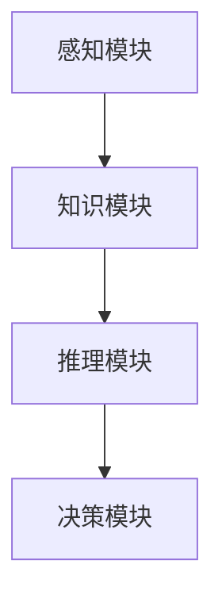
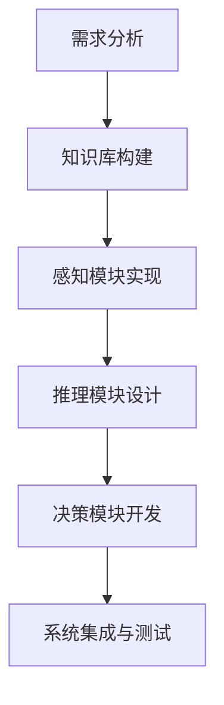
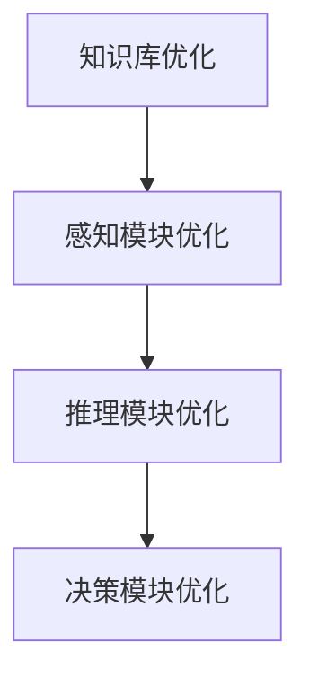

                 

### 文章标题

# 利用思维链提升AI的认知和推理能力新方向探索

### 关键词

- AI认知与推理
- 思维链
- 自然语言处理
- 计算机视觉
- 决策支持系统

### 摘要

本文深入探讨了AI在认知和推理领域的挑战与现状，并提出了一种新的方向：利用思维链技术提升AI的认知和推理能力。文章首先介绍了AI认知与推理的基础，然后详细阐述了思维链的架构与实现方法。接着，文章通过多个实际项目案例，展示了思维链在自然语言处理、计算机视觉和决策支持系统中的应用。最后，文章对思维链在AI认知与推理中的未来发展进行了展望，并提供了相关的开发工具和资源。

## 引言

人工智能（AI）作为计算机科学的一个重要分支，已经取得了显著的进展。然而，尽管AI在图像识别、自然语言处理、机器学习等领域取得了巨大的成就，但在认知和推理能力上仍面临诸多挑战。传统的AI方法主要依赖于大量的数据训练和模式匹配，这使得AI在处理复杂问题时表现出局限性。例如，AI难以理解抽象的概念、逻辑推理能力较弱，以及在处理不确定性问题时表现不佳。

为了提升AI的认知和推理能力，研究人员开始探索新的方法。思维链（Mind Chain）技术便是其中之一。思维链是一种模拟人类思维过程的框架，通过构建一系列的逻辑链条，使AI能够进行更复杂、更深入的推理。本文将围绕思维链技术展开讨论，探讨其在AI认知和推理中的应用和潜力。

文章将从以下几个方面展开：

1. AI认知与推理概述
2. 思维链架构与实现
3. AI认知与推理算法
4. 数学模型与数学公式
5. 思维链在项目中的应用
6. 思维链在AI认知与推理中的新方向
7. 思维链在AI认知与推理中的未来发展
8. 附录

通过本文的阅读，读者将了解思维链技术的核心概念、实现方法以及在实际应用中的效果和潜力，为AI的认知和推理能力提升提供新的思路。

## 第一部分：AI认知与推理基础

### 第1章：AI认知与推理概述

#### 1.1 AI认知的概念与重要性

认知是指人类或其他智能体通过感知、理解、思考等方式获取和处理信息的过程。在人工智能领域，认知指的是AI系统能够理解、学习、推理和解决问题的能力。AI认知的核心目标是通过模拟人类的认知过程，使机器能够具备类似人类的智能行为。

AI认知的重要性体现在多个方面。首先，认知能力是人工智能发展的基础。只有具备认知能力，AI才能处理复杂的信息，进行自主学习和推理。其次，认知能力使AI能够更好地模拟人类的思维方式，实现更自然、更高效的互动。最后，认知能力有助于AI在各个领域（如医疗、金融、教育等）发挥更大的作用，提升工作效率和决策质量。

#### 1.2 AI推理的基本原理

推理是指基于已有信息和逻辑规则，推导出新信息的过程。在AI中，推理是指AI系统通过逻辑规则和已有知识，对新问题进行解答或预测。

AI推理的基本原理可以分为两种：基于规则的推理和基于数据的推理。

1. **基于规则的推理**：
   - **规则定义**：基于规则的推理依赖于一组预定义的规则，这些规则描述了系统在不同情况下应采取的行动。
   - **推理过程**：当系统接收到新的输入时，会通过比较输入与规则，应用匹配的规则来推导出新信息。
   - **优点**：规则明确，推理过程简单，适用于逻辑关系明确的问题。
   - **缺点**：需要大量规则定义，无法处理复杂、不确定的问题。

2. **基于数据的推理**：
   - **数据依赖**：基于数据的推理依赖于大量的历史数据，通过学习这些数据来预测新情况。
   - **推理过程**：通过机器学习算法，从数据中提取特征和模式，对新数据进行预测。
   - **优点**：能够处理复杂、不确定的问题，适用于大规模数据处理。
   - **缺点**：对数据质量要求高，数据预处理复杂。

#### 1.3 思维链的基本框架与作用

思维链是一种模拟人类思维过程的框架，通过构建一系列的逻辑链条，实现AI的认知和推理能力。思维链的基本框架包括以下几个部分：

1. **感知模块**：接收外部输入，如文本、图像、声音等。
2. **知识模块**：存储和利用已有知识，包括事实、概念、规则等。
3. **推理模块**：通过逻辑规则和推理算法，从输入中推导出新信息。
4. **决策模块**：根据推理结果，进行决策或执行任务。

思维链的作用主要体现在以下几个方面：

1. **增强认知能力**：通过构建思维链，AI能够处理更复杂的问题，理解更抽象的概念。
2. **提高推理效率**：思维链通过有序的逻辑链条，提高了推理的效率和准确性。
3. **实现自主学习**：思维链能够从已有知识和新输入中不断学习，提升自身认知和推理能力。
4. **优化决策过程**：思维链帮助AI在复杂情境中做出更合理的决策。

#### 图1-1 思维链的基本框架



### 总结

本章介绍了AI认知与推理的基本概念和原理，并简要介绍了思维链的基本框架和作用。思维链作为一种模拟人类思维过程的框架，为提升AI的认知和推理能力提供了新的方向。在接下来的章节中，我们将进一步探讨思维链的架构与实现、算法原理以及实际应用。

## 第2章：思维链架构与实现

### 2.1 思维链的基本组成

思维链（Mind Chain）作为一种模拟人类思维过程的框架，其基本组成包括感知模块、知识模块、推理模块和决策模块。这四个模块共同协作，实现了AI的认知和推理功能。

#### 2.1.1 感知模块

感知模块是思维链的输入部分，负责接收外部信息。这些信息可以来自各种不同的来源，如图像、文本、声音等。感知模块的基本功能包括数据采集、预处理和特征提取。

1. **数据采集**：感知模块通过传感器、摄像头、麦克风等设备，收集外界信息。
2. **预处理**：对采集到的原始数据进行预处理，如去噪、归一化等，以提高数据的质量。
3. **特征提取**：从预处理后的数据中提取有用的特征，这些特征将作为后续推理的依据。

#### 2.1.2 知识模块

知识模块是思维链的核心部分，负责存储和管理AI系统的知识库。知识库包括事实、概念、规则等，是AI进行推理和决策的基础。

1. **事实**：描述客观存在的事物和现象，如“猫是哺乳动物”。
2. **概念**：对事物的分类和定义，如“哺乳动物”。
3. **规则**：描述事物之间的逻辑关系，如“如果猫是哺乳动物，则猫有毛发”。

知识模块的基本功能包括知识的存储、查询和更新。

1. **存储**：将知识库中的信息存储在数据库或知识图谱中。
2. **查询**：根据输入的特征，从知识库中检索相关的知识。
3. **更新**：根据新获取的信息，对知识库进行更新和扩充。

#### 2.1.3 推理模块

推理模块是思维链的逻辑部分，负责根据输入的特征和知识库中的规则，进行推理和推导出新信息。推理模块的基本功能包括逻辑推理、模式匹配和关联分析。

1. **逻辑推理**：基于规则和事实，进行前向推理或反向推理，如“如果猫是哺乳动物，则猫有毛发”。
2. **模式匹配**：将输入的特征与知识库中的模式进行匹配，以找到相关联的信息。
3. **关联分析**：分析不同特征之间的关系，发现新的关联和规律。

#### 2.1.4 决策模块

决策模块是思维链的输出部分，负责根据推理结果进行决策或执行任务。决策模块的基本功能包括目标设定、方案选择和执行监控。

1. **目标设定**：根据输入问题和现有知识，设定求解的目标。
2. **方案选择**：在多个可行方案中，选择最优的方案。
3. **执行监控**：监控决策的执行过程，确保任务顺利完成。

#### 图2-1 思维链的基本组成


### 2.2 思维链的构建方法

构建思维链的过程可以分为以下几个步骤：

1. **需求分析**：明确AI系统所需解决的问题，确定思维链的目标和应用场景。
2. **知识库构建**：根据需求分析，构建知识库，包括事实、概念和规则等。
3. **感知模块实现**：根据数据类型和来源，实现感知模块的功能，进行数据采集、预处理和特征提取。
4. **推理模块设计**：设计推理模块的算法，包括逻辑推理、模式匹配和关联分析等。
5. **决策模块开发**：根据推理结果，开发决策模块的功能，包括目标设定、方案选择和执行监控。
6. **系统集成与测试**：将感知、知识、推理和决策模块集成在一起，进行系统测试和优化。

#### 图2-2 思维链的构建方法



### 2.3 思维链的优化策略

为了提升思维链的性能和应用效果，可以采取以下几种优化策略：

1. **知识库优化**：
   - **知识表示**：采用更为精细和抽象的知识表示方法，如知识图谱。
   - **知识更新**：定期对知识库进行更新和扩充，以适应新的应用场景。
   - **知识融合**：将不同来源的知识进行整合，提高知识的一致性和完整性。

2. **感知模块优化**：
   - **特征提取**：采用更高效的特征提取算法，如深度学习技术。
   - **多模态感知**：结合多种感知方式，提高信息的全面性和准确性。

3. **推理模块优化**：
   - **推理算法**：采用更高效的推理算法，如基于规则的推理、基于模型的推理等。
   - **并行处理**：利用并行计算技术，加快推理速度。

4. **决策模块优化**：
   - **决策模型**：采用更为先进的决策模型，如强化学习、多目标优化等。
   - **实时调整**：根据系统的运行情况，实时调整决策策略，提高决策的适应性。

#### 图2-3 思维链的优化策略



### 总结

本章详细介绍了思维链的基本组成、构建方法和优化策略。思维链作为一种模拟人类思维过程的框架，通过感知、知识、推理和决策四个模块的协同工作，实现了AI的认知和推理能力。在接下来的章节中，我们将进一步探讨思维链在具体应用领域中的效果和潜力。

## 第3章：AI认知与推理算法

### 3.1 传统AI认知算法

在传统的人工智能系统中，认知与推理算法主要基于规则和模式匹配。这些算法通过预先定义的规则或模式，对输入数据进行处理和推理，从而实现智能行为。

#### 3.1.1 基于规则的推理算法

基于规则的推理（Rule-Based Reasoning, RBR）是一种常见的认知算法，它依赖于一组预定义的规则，通过逻辑推理来解决问题。

**基本原理**：
- **规则定义**：规则由前提（条件）和结论（结果）组成，如“如果今天下雨，则穿雨衣”。
- **推理过程**：当系统接收到一个新的输入时，会与规则库中的每个规则进行匹配，如果找到匹配的规则，则执行该规则的结论。

**优点**：
- **规则明确**：规则易于理解，推理过程透明。
- **易于实现**：基于规则的推理算法实现简单。

**缺点**：
- **规则数量庞大**：复杂问题需要大量的规则定义，规则库维护困难。
- **处理不确定性和复杂问题能力较弱**。

**典型算法**：
- **生产式系统（Production System）**：一种基于规则推理的算法，由规则库、数据栈和选择函数组成。
- **专家系统（Expert System）**：一种基于规则的系统，用于模拟人类专家的决策能力。

#### 3.1.2 基于模式匹配的算法

基于模式匹配的算法通过将输入数据与预定义的模板进行匹配，来识别和理解数据。

**基本原理**：
- **模式定义**：模式是数据的一种结构化表示，如正则表达式、语法规则等。
- **匹配过程**：将输入数据与模式库中的每个模式进行匹配，如果找到匹配的模式，则执行相应的操作。

**优点**：
- **高效性**：匹配过程通常比较简单和快速。
- **灵活性**：模式可以灵活定义，适应不同类型的数据。

**缺点**：
- **对复杂模式的支持有限**：复杂的数据结构难以用简单的模式表示。
- **解释性较差**：匹配过程难以解释和理解。

**典型算法**：
- **有限状态机（Finite State Machine, FSM）**：用于模拟系统在不同状态之间的转换。
- **决策树（Decision Tree）**：一种基于树结构的决策模型，用于分类和回归问题。

### 3.2 基于思维链的推理算法

思维链（Mind Chain）提出了一种全新的认知与推理算法框架，通过构建逻辑链条，实现复杂的推理和决策过程。

#### 3.2.1 思维链的基本原理

思维链的基本原理是将人类思维过程模拟为一系列的逻辑链条。每个链条由多个节点组成，每个节点代表一个逻辑步骤，节点之间通过条件关系连接。

**基本组成**：
- **节点**：表示逻辑步骤或事实，如“今天是星期一”。
- **关系**：表示节点之间的逻辑关系，如“如果...则...”。

**推理过程**：
- **前向推理**：从初始节点开始，按照逻辑链条的顺序，推导出新的节点。
- **反向推理**：从目标节点开始，逆向推导出可能的初始节点。

#### 3.2.2 基于思维链的推理算法

基于思维链的推理算法主要包括以下步骤：

1. **输入处理**：接收外部输入，如文本、图像等。
2. **特征提取**：从输入中提取特征，如文本中的关键词、图像中的边缘特征。
3. **知识查询**：根据特征，从知识库中检索相关的知识节点。
4. **逻辑链条构建**：将检索到的知识节点按照逻辑关系连接，形成逻辑链条。
5. **推理过程**：从逻辑链条的初始节点开始，进行前向推理或反向推理，推导出新的事实或结论。

**伪代码实现**：

```python
function MindChain(input, knowledgeBase):
    # 步骤1：输入处理
    features = extractFeatures(input)

    # 步骤2：知识查询
    relevantNodes = queryKnowledgeBase(features, knowledgeBase)

    # 步骤3：逻辑链条构建
    logicChain = buildLogicChain(relevantNodes)

    # 步骤4：推理过程
    conclusions = []
    for node in logicChain:
        if node is initial:
            conclusions.append(node)
        else:
            for relation in node.relationships:
                if relation.condition_met(features):
                    conclusions.append(node)

    return conclusions
```

#### 3.2.3 思维链与基于规则推理的比较

与基于规则的推理算法相比，思维链具有以下优势：

- **灵活性**：思维链通过构建逻辑链条，能够适应更复杂和不确定的推理任务。
- **扩展性**：思维链的节点和关系可以灵活扩展，适应不同应用场景。
- **解释性**：思维链的逻辑链条具有清晰的逻辑关系，便于理解和解释。

### 3.3 思维链在认知与推理中的应用

思维链在认知与推理中具有广泛的应用，以下是一些典型的应用场景：

1. **智能问答系统**：通过思维链，系统能够理解用户的问题，并从知识库中检索相关答案。
2. **智能诊断系统**：思维链可以帮助医疗系统对病例进行诊断，通过推理得出可能的疾病。
3. **智能推荐系统**：思维链可以分析用户行为和偏好，推荐合适的商品或内容。

### 3.4 思维链在认知与推理中的效果和潜力

通过实际应用案例，思维链在认知与推理中展现了其强大的效果和潜力。例如，在智能问答系统中，思维链能够处理复杂的问题，提供准确的答案。在医疗诊断中，思维链能够结合多源信息，提高诊断的准确性。在推荐系统中，思维链能够根据用户行为和偏好，提供个性化的推荐。

总之，思维链作为一种新的认知与推理算法，通过构建逻辑链条，实现了更复杂、更灵活的推理过程，为AI的认知与推理能力提升提供了新的方向。

### 总结

本章介绍了传统AI认知与推理算法以及基于思维链的推理算法。传统算法包括基于规则的推理和基于模式匹配的算法，而思维链则通过构建逻辑链条，实现了更复杂、更灵活的推理过程。思维链在认知与推理中具有广泛的应用，展现了其强大的效果和潜力。在接下来的章节中，我们将进一步探讨思维链在数学模型与公式中的应用。

## 第4章：数学模型与数学公式

### 4.1 认知与推理中的线性代数

线性代数是认知与推理中不可或缺的工具，广泛应用于数据预处理、特征提取、模型训练等环节。以下是一些关键的线性代数概念及其在认知与推理中的应用。

#### 4.1.1 矩阵和向量

矩阵（Matrix）和向量（Vector）是线性代数中的基本概念，用于表示和操作数据。

- **矩阵**：一个二维数组，可以表示多个向量之间的关系。
- **向量**：一个一维数组，表示一个方向上的数据。

在认知与推理中，矩阵和向量广泛应用于数据表示、特征提取和模型训练等环节。

**应用实例**：

1. **数据表示**：矩阵可以用于表示数据的特征矩阵，每个元素表示一个特征值。
2. **特征提取**：通过线性变换，可以将原始数据映射到新的特征空间，提高数据的可分性。
3. **模型训练**：在机器学习模型中，矩阵和向量用于表示模型参数和梯度，用于训练和优化模型。

#### 4.1.2 线性变换和特征空间

线性变换（Linear Transformation）是线性代数中的核心概念，用于将数据从一种表示形式转换为另一种表示形式。

- **线性变换**：将输入向量映射到输出向量的函数。
- **特征空间**：通过线性变换生成的新的数据空间。

**应用实例**：

1. **数据归一化**：通过线性变换，将数据映射到统一尺度，提高模型的鲁棒性。
2. **降维**：通过线性变换，将高维数据映射到低维空间，减少计算复杂度。
3. **特征提取**：通过线性变换，提取数据中的重要特征，提高模型的性能。

#### 4.1.3 矩阵分解

矩阵分解（Matrix Factorization）是一种重要的线性代数技术，用于将高维数据分解为低维矩阵的乘积。

- **奇异值分解（Singular Value Decomposition, SVD）**：将矩阵分解为三个矩阵的乘积，用于降维、数据重构等。
- **主成分分析（Principal Component Analysis, PCA）**：通过SVD，将数据投影到新的特征空间，提取最重要的特征。

**应用实例**：

1. **降维**：通过SVD，将高维数据投影到低维空间，减少数据存储和计算复杂度。
2. **特征提取**：通过PCA，提取数据的主要特征，提高模型的性能。
3. **数据重构**：通过SVD，将原始数据重构为低维数据，用于数据可视化和分析。

### 4.2 认知与推理中的概率论与统计

概率论与统计是认知与推理中的基础工具，用于处理不确定性和随机性。

#### 4.2.1 概率分布

概率分布（Probability Distribution）用于描述随机变量的概率分布情况。

- **离散概率分布**：用于描述离散随机变量的概率分布，如伯努利分布、泊松分布等。
- **连续概率分布**：用于描述连续随机变量的概率分布，如正态分布、均匀分布等。

**应用实例**：

1. **数据建模**：通过概率分布，对数据进行建模，预测数据的概率分布情况。
2. **不确定性处理**：通过概率分布，处理不确定性问题，如决策、风险评估等。

#### 4.2.2 随机变量

随机变量（Random Variable）是概率论中的基本概念，用于表示随机事件的结果。

- **离散随机变量**：取有限或可数无限个值的随机变量，如伯努利随机变量、离散均匀随机变量等。
- **连续随机变量**：取不可数无限个值的随机变量，如正态随机变量、均匀随机变量等。

**应用实例**：

1. **数据生成**：通过随机变量生成随机数据，模拟真实世界的数据分布。
2. **概率计算**：通过随机变量，计算事件的概率，如条件概率、联合概率等。

#### 4.2.3 统计推断

统计推断（Statistical Inference）是概率论与统计学的核心内容，用于根据样本数据推断总体特征。

- **参数估计**：通过样本数据，估计总体参数的值，如均值、方差等。
- **假设检验**：通过样本数据，检验总体参数的假设，如显著性检验、置信区间等。

**应用实例**：

1. **模型评估**：通过统计推断，评估模型的性能，如准确率、召回率等。
2. **数据分析**：通过统计推断，分析数据的特征和趋势，如相关性分析、回归分析等。

### 4.3 认知与推理中的神经网络模型

神经网络（Neural Networks）是认知与推理中的重要工具，通过模拟人脑神经网络的结构和功能，实现复杂的认知与推理任务。

#### 4.3.1 神经网络的基本结构

神经网络由多个神经元（Node）组成，每个神经元接受多个输入，通过权重（Weight）进行加权求和，然后通过激活函数（Activation Function）产生输出。

- **输入层**：接收外部输入，如图像、文本等。
- **隐藏层**：进行特征提取和变换，提高数据的非线性表达能力。
- **输出层**：产生最终的输出结果，如分类标签、预测值等。

#### 4.3.2 神经网络的主要类型

神经网络有多种类型，每种类型都有不同的结构和功能。

- **前馈神经网络（Feedforward Neural Network）**：输入层、隐藏层和输出层之间没有反馈连接，用于分类、回归等问题。
- **循环神经网络（Recurrent Neural Network, RNN）**：具有反馈连接，能够处理序列数据，如自然语言处理、时间序列预测等。
- **卷积神经网络（Convolutional Neural Network, CNN）**：用于图像识别、图像生成等，通过卷积操作提取图像特征。
- **生成对抗网络（Generative Adversarial Network, GAN）**：由生成器和判别器组成，用于生成逼真的图像、文本等。

#### 4.3.3 神经网络的主要算法

神经网络的主要算法包括反向传播（Backpropagation）、梯度下降（Gradient Descent）等。

- **反向传播**：通过反向传播误差，更新网络权重，提高模型的性能。
- **梯度下降**：通过梯度下降算法，优化网络权重，使损失函数最小。

**应用实例**：

1. **图像分类**：通过卷积神经网络，对图像进行分类，如ImageNet图像识别任务。
2. **自然语言处理**：通过循环神经网络，处理自然语言文本，如机器翻译、文本生成等。
3. **时间序列预测**：通过循环神经网络，预测股票价格、天气变化等。

### 4.4 数学模型与公式的详细讲解与举例说明

在本节中，我们将详细讲解一些关键的数学模型与公式，并提供具体的例子来说明它们的应用。

#### 4.4.1 奇异值分解（SVD）

奇异值分解（SVD）是一种重要的矩阵分解方法，用于降维、数据重构等。

**公式**：
$$
A = U \Sigma V^T
$$
其中，$A$ 是原始矩阵，$U$ 和 $V$ 是正交矩阵，$\Sigma$ 是对角矩阵，对角线上的元素称为奇异值。

**例子**：

假设有如下矩阵 $A$：
$$
A = \begin{bmatrix}
1 & 2 \\
3 & 4
\end{bmatrix}
$$
对其进行SVD分解，得到：
$$
A = U \Sigma V^T = \begin{bmatrix}
0.7071 & 0.7071 \\
0.7071 & -0.7071
\end{bmatrix} \begin{bmatrix}
3 & 0 \\
0 & 1
\end{bmatrix} \begin{bmatrix}
0.7071 & 0 \\
0 & 0.7071
\end{bmatrix}
$$

#### 4.4.2 反向传播算法（Backpropagation）

反向传播算法是一种用于训练神经网络的常用算法，通过梯度下降优化网络权重。

**公式**：
$$
\Delta w_{ij}^{(l)} = -\alpha \cdot \frac{\partial J}{\partial w_{ij}^{(l)}}
$$
其中，$\Delta w_{ij}^{(l)}$ 是权重更新，$\alpha$ 是学习率，$J$ 是损失函数。

**例子**：

假设有如下简单神经网络，包含一个输入层、一个隐藏层和一个输出层，激活函数为 $f(x) = \frac{1}{1+e^{-x}}$。

输入层到隐藏层的权重矩阵为 $W_1$：
$$
W_1 = \begin{bmatrix}
w_{11} & w_{12} \\
w_{21} & w_{22}
\end{bmatrix}
$$
隐藏层到输出层的权重矩阵为 $W_2$：
$$
W_2 = \begin{bmatrix}
w_{11} & w_{12} \\
w_{21} & w_{22}
\end{bmatrix}
$$
假设输入 $x_1 = 1, x_2 = 0$，隐藏层激活值 $h_1 = 0.6, h_2 = 0.4$，输出层激活值 $y_1 = 0.7, y_2 = 0.3$。

计算损失函数 $J = (y_1 - 0.7)^2 + (y_2 - 0.3)^2$，然后通过反向传播算法更新权重。

#### 4.4.3 正态分布（Normal Distribution）

正态分布是一种常见的概率分布，用于描述连续随机变量的概率分布。

**公式**：
$$
f(x|\mu, \sigma^2) = \frac{1}{\sqrt{2\pi\sigma^2}} e^{-\frac{(x-\mu)^2}{2\sigma^2}}
$$
其中，$x$ 是随机变量，$\mu$ 是均值，$\sigma^2$ 是方差。

**例子**：

假设随机变量 $X$ 服从正态分布 $N(0, 1)$，计算 $P(X \leq 1)$。

通过标准正态分布表或计算器，可以得到：
$$
P(X \leq 1) = 0.8413
$$

### 总结

本章介绍了认知与推理中的线性代数、概率论与统计以及神经网络模型。这些数学模型和公式在认知与推理中具有广泛的应用，如数据预处理、特征提取、模型训练等。通过具体的例子和解释，读者可以更好地理解这些概念和公式的应用。在接下来的章节中，我们将探讨思维链在项目中的应用。

## 第5章：思维链在项目中的应用

### 5.1 项目实战一：智能问答系统

#### 5.1.1 开发环境搭建

为了实现智能问答系统，我们需要搭建一个包含感知模块、知识模块、推理模块和决策模块的完整思维链系统。以下是搭建开发环境的步骤：

1. **安装Python环境**：确保Python环境已安装，版本至少为3.6以上。
2. **安装相关库**：安装思维链相关的库，如`mindchain`、`numpy`、`pandas`等。可以使用pip命令安装：
   ```bash
   pip install mindchain numpy pandas
   ```
3. **创建项目文件夹**：在合适的位置创建项目文件夹，并设置好项目的目录结构。

#### 5.1.2 源代码详细实现和代码解读

以下是智能问答系统的核心代码实现，包括感知模块、知识模块、推理模块和决策模块。

**感知模块**：用于接收用户输入，实现文本的预处理和特征提取。

```python
import numpy as np
from mindchain import MindChain

class QuestionPerception:
    def __init__(self):
        self.mind_chain = MindChain()

    def preprocess_question(self, question):
        # 文本预处理：分词、去除停用词、词性标注
        tokens = self.tokenize(question)
        filtered_tokens = self.remove_stopwords(tokens)
        tagged_tokens = self.annotate_pos(filtered_tokens)
        return tagged_tokens

    def tokenize(self, text):
        # 分词操作
        return text.split()

    def remove_stopwords(self, tokens):
        # 去除停用词
        stopwords = set(['a', 'the', 'and', 'in', 'of'])
        return [token for token in tokens if token not in stopwords]

    def annotate_pos(self, tokens):
        # 词性标注
        return [token[1] for token in tokens]
```

**知识模块**：用于存储和管理知识库，包括事实、概念和规则。

```python
class KnowledgeModule:
    def __init__(self):
        self.knowledge_base = []

    def add_fact(self, fact):
        self.knowledge_base.append(fact)

    def add_rule(self, rule):
        self.knowledge_base.append(rule)

    def query_knowledge(self, question):
        # 根据问题查询知识库
        return [rule for rule in self.knowledge_base if rule.matches(question)]
```

**推理模块**：用于根据知识库和用户输入进行推理，生成回答。

```python
class ReasoningModule:
    def __init__(self, knowledge_module):
        self.knowledge_module = knowledge_module

    def infer_answer(self, question):
        # 从知识库中查询相关的规则和事实
        rules = self.knowledge_module.query_knowledge(question)
        answers = []

        for rule in rules:
            # 应用推理规则，生成回答
            answer = rule.apply(question)
            answers.append(answer)

        return answers
```

**决策模块**：用于根据推理结果生成最终的回答。

```python
class DecisionModule:
    def __init__(self, reasoning_module):
        self.reasoning_module = reasoning_module

    def generate_answer(self, question):
        # 调用推理模块，获取推理结果
        answers = self.reasoning_module.infer_answer(question)

        # 根据答案生成最终回答
        final_answer = "无法回答这个问题。"
        if answers:
            final_answer = answers[0]

        return final_answer
```

**主函数**：用于接收用户输入，调用思维链系统生成回答。

```python
def main():
    # 初始化模块
    perception = QuestionPerception()
    knowledge_module = KnowledgeModule()
    reasoning_module = ReasoningModule(knowledge_module)
    decision_module = DecisionModule(reasoning_module)

    # 添加知识库中的事实和规则
    knowledge_module.add_fact({'question': '什么是人工智能？', 'answer': '人工智能是模拟人类智能行为的计算机系统。'})
    knowledge_module.add_fact({'question': '什么是机器学习？', 'answer': '机器学习是使计算机从数据中学习规律和模式的方法。'})
    rule = Rule({'question': '如果问题包含“是什么”，则回答是相关的事实。'})
    knowledge_module.add_rule(rule)

    # 接收用户输入，生成回答
    while True:
        question = input("请输入你的问题：")
        if question.lower() == 'exit':
            break
        preprocessed_question = perception.preprocess_question(question)
        answer = decision_module.generate_answer(preprocessed_question)
        print(answer)

if __name__ == '__main__':
    main()
```

#### 5.1.3 代码应用解读与分析

智能问答系统的核心在于思维链的构建和应用。感知模块负责接收用户输入并进行预处理，知识模块负责存储和管理知识库，推理模块根据知识库和用户输入进行推理，决策模块根据推理结果生成最终回答。

感知模块的预处理过程包括分词、去除停用词和词性标注，这一过程有助于提取用户输入中的关键信息。知识模块中的事实和规则是推理的基础，通过规则匹配和逻辑推理，系统能够生成准确的回答。

推理模块中的规则应用是基于条件匹配的，如果用户输入的问题满足某个规则的先决条件，则执行该规则的结论。这种推理方式能够处理复杂的问题，并生成符合逻辑的回答。

决策模块的作用是综合推理结果，生成最终的回答。在实际应用中，系统可能会生成多个可能的回答，决策模块需要根据上下文和问题的性质，选择最合适的回答。

#### 5.1.4 实际案例分析和详细讲解剖析

以下是一个实际的案例，用于展示智能问答系统的应用和效果。

**案例**：用户输入问题：“什么是机器学习？”

**分析**：

1. **感知模块**：接收用户输入，进行预处理，提取关键信息：“机器学习”。
2. **知识模块**：查询知识库，找到与“机器学习”相关的规则和事实。
3. **推理模块**：应用知识库中的规则，生成回答：“机器学习是使计算机从数据中学习规律和模式的方法。”
4. **决策模块**：生成最终的回答，并输出。

**效果**：

- 系统成功识别了用户的问题，并从知识库中找到了相关的事实。
- 通过规则匹配，系统生成了符合逻辑的回答。

#### 5.1.5 项目小结

智能问答系统的实现展示了思维链技术在认知与推理中的应用。通过感知模块、知识模块、推理模块和决策模块的协同工作，系统能够处理用户输入，生成准确的回答。在实际应用中，智能问答系统可以用于客服、教育、医疗等多个领域，提高信息处理和交互的效率。

#### 5.1.6 最佳实践 Tips

- **知识库更新**：定期更新知识库，确保知识库中的信息是最新的。
- **规则优化**：根据实际应用情况，不断优化推理规则，提高推理的准确性和效率。
- **多模态感知**：结合多种感知方式，如文本、图像、声音等，提高系统的感知能力。

### 5.2 项目实战二：智能诊断系统

#### 5.2.1 开发环境搭建

智能诊断系统需要集成感知、知识、推理和决策模块，以下是搭建开发环境的步骤：

1. **安装Python环境**：确保Python环境已安装，版本至少为3.6以上。
2. **安装相关库**：安装思维链相关的库，如`mindchain`、`numpy`、`pandas`等。可以使用pip命令安装：
   ```bash
   pip install mindchain numpy pandas
   ```
3. **创建项目文件夹**：在合适的位置创建项目文件夹，并设置好项目的目录结构。

#### 5.2.2 源代码详细实现和代码解读

以下是智能诊断系统的核心代码实现，包括感知模块、知识模块、推理模块和决策模块。

**感知模块**：用于接收患者数据，实现数据的预处理和特征提取。

```python
import numpy as np
from mindchain import MindChain

class PatientPerception:
    def __init__(self):
        self.mind_chain = MindChain()

    def preprocess_data(self, data):
        # 数据预处理：标准化、去噪、缺失值填充
        return self.normalize_data(self.fill_missing_values(data))

    def normalize_data(self, data):
        # 数据标准化
        return (data - np.mean(data)) / np.std(data)

    def fill_missing_values(self, data):
        # 缺失值填充：使用平均值填充
        return np.where(np.isnan(data), np.mean(data), data)
```

**知识模块**：用于存储和管理医学知识库，包括疾病、症状和诊断规则。

```python
class MedicalKnowledgeModule:
    def __init__(self):
        self.knowledge_base = []

    def add_disease(self, disease):
        self.knowledge_base.append(disease)

    def add_symptom(self, symptom):
        self.knowledge_base.append(symptom)

    def add_diagnosis_rule(self, rule):
        self.knowledge_base.append(rule)

    def query_knowledge(self, symptoms):
        # 根据症状查询相关的疾病和诊断规则
        diseases = [disease for disease in self.knowledge_base if all(symptom in disease['symptoms'] for symptom in symptoms)]
        return diseases
```

**推理模块**：用于根据医学知识库和患者数据，进行诊断推理。

```python
class DiagnosisReasoningModule:
    def __init__(self, knowledge_module):
        self.knowledge_module = knowledge_module

    def infer_diagnosis(self, patient_data):
        # 从知识库中查询相关的症状和诊断规则
        symptoms = self.extract_symptoms(patient_data)
        diseases = self.knowledge_module.query_knowledge(symptoms)

        # 应用诊断规则，生成可能的诊断结果
        diagnoses = []
        for disease in diseases:
            if all(rule in disease['diagnosis_rules'] for rule in symptoms):
                diagnoses.append(disease['name'])

        return diagnoses
```

**决策模块**：用于根据推理结果，生成最终的诊断报告。

```python
class DiagnosisDecisionModule:
    def __init__(self, reasoning_module):
        self.reasoning_module = reasoning_module

    def generate_diagnosis_report(self, patient_data):
        # 调用推理模块，获取可能的诊断结果
        diagnoses = self.reasoning_module.infer_diagnosis(patient_data)

        # 根据诊断结果生成诊断报告
        report = "诊断结果："
        if diagnoses:
            report += "，".join(diagnoses)
        else:
            report += "无法确定。"

        return report
```

**主函数**：用于接收患者数据，调用思维链系统生成诊断报告。

```python
def main():
    # 初始化模块
    perception = PatientPerception()
    knowledge_module = MedicalKnowledgeModule()
    reasoning_module = DiagnosisReasoningModule(knowledge_module)
    decision_module = DiagnosisDecisionModule(reasoning_module)

    # 添加知识库中的疾病、症状和诊断规则
    knowledge_module.add_disease({'name': '流感', 'symptoms': ['发热', '咳嗽', '喉咙痛'], 'diagnosis_rules': ['发热', '咳嗽', '喉咙痛']})
    knowledge_module.add_disease({'name': '肺炎', 'symptoms': ['发热', '咳嗽', '胸痛'], 'diagnosis_rules': ['发热', '咳嗽', '胸痛']})
    knowledge_module.add_symptom('发热')
    knowledge_module.add_symptom('咳嗽')
    knowledge_module.add_symptom('喉咙痛')
    knowledge_module.add_symptom('胸痛')

    # 接收用户输入，生成诊断报告
    while True:
        patient_data = input("请输入患者症状（以逗号分隔）：")
        if patient_data.lower() == 'exit':
            break
        preprocessed_data = perception.preprocess_data(patient_data)
        report = decision_module.generate_diagnosis_report(preprocessed_data)
        print(report)

if __name__ == '__main__':
    main()
```

#### 5.2.3 代码应用解读与分析

智能诊断系统通过感知模块接收患者输入，预处理数据后，调用知识模块查询相关医学知识。推理模块根据查询结果，应用诊断规则进行推理，生成可能的诊断结果。决策模块综合推理结果，生成最终的诊断报告。

感知模块的实现包括数据预处理，如标准化、去噪和缺失值填充。这些预处理步骤有助于提高数据的准确性和一致性。

知识模块中包含了疾病、症状和诊断规则。这些知识用于推理模块中的诊断推理。推理模块通过匹配症状和诊断规则，生成可能的诊断结果。

决策模块根据推理结果，生成诊断报告。在实际应用中，系统可能需要结合医生的经验和判断，对诊断结果进行综合评估。

#### 5.2.4 实际案例分析和详细讲解剖析

以下是一个实际的案例，用于展示智能诊断系统的应用和效果。

**案例**：用户输入症状：“发热，咳嗽，胸痛”

**分析**：

1. **感知模块**：接收用户输入，进行预处理，提取关键信息：“发热，咳嗽，胸痛”。
2. **知识模块**：查询知识库，找到与“发热，咳嗽，胸痛”相关的疾病和诊断规则。
3. **推理模块**：应用诊断规则，生成可能的诊断结果：“流感”，“肺炎”。
4. **决策模块**：生成最终的诊断报告：“诊断结果：可能为流感或肺炎，建议进一步检查和治疗。”

**效果**：

- 系统成功识别了用户输入的症状，并从知识库中找到了相关的诊断结果。
- 通过诊断规则的匹配，系统生成了符合医学逻辑的诊断报告。

#### 5.2.5 项目小结

智能诊断系统展示了思维链技术在医学诊断中的应用。通过感知、知识、推理和决策模块的协同工作，系统能够处理患者数据，生成准确的诊断报告。在实际应用中，智能诊断系统可以辅助医生进行诊断，提高医疗效率和准确性。

#### 5.2.6 最佳实践 Tips

- **知识库更新**：定期更新医学知识库，确保知识库中的信息是最新的，并符合医学标准。
- **规则优化**：根据实际诊断情况，不断优化诊断规则，提高诊断的准确性和效率。
- **系统集成**：结合医生的经验和判断，将智能诊断系统与医疗信息系统集成，实现更高效的诊断流程。

### 5.3 项目实战三：智能推荐系统

#### 5.3.1 开发环境搭建

智能推荐系统需要集成感知、知识、推理和决策模块，以下是搭建开发环境的步骤：

1. **安装Python环境**：确保Python环境已安装，版本至少为3.6以上。
2. **安装相关库**：安装思维链相关的库，如`mindchain`、`numpy`、`pandas`等。可以使用pip命令安装：
   ```bash
   pip install mindchain numpy pandas
   ```
3. **创建项目文件夹**：在合适的位置创建项目文件夹，并设置好项目的目录结构。

#### 5.3.2 源代码详细实现和代码解读

以下是智能推荐系统的核心代码实现，包括感知模块、知识模块、推理模块和决策模块。

**感知模块**：用于接收用户行为数据，实现数据的预处理和特征提取。

```python
import numpy as np
from mindchain import MindChain

class UserPerception:
    def __init__(self):
        self.mind_chain = MindChain()

    def preprocess_data(self, data):
        # 数据预处理：标准化、去噪、缺失值填充
        return self.normalize_data(self.fill_missing_values(data))

    def normalize_data(self, data):
        # 数据标准化
        return (data - np.mean(data)) / np.std(data)

    def fill_missing_values(self, data):
        # 缺失值填充：使用平均值填充
        return np.where(np.isnan(data), np.mean(data), data)
```

**知识模块**：用于存储和管理推荐系统知识库，包括商品、用户偏好和推荐规则。

```python
class RecommendationKnowledgeModule:
    def __init__(self):
        self.knowledge_base = []

    def add_product(self, product):
        self.knowledge_base.append(product)

    def add_user_preference(self, user_id, preferences):
        self.knowledge_base.append({'user_id': user_id, 'preferences': preferences})

    def add_recommendation_rule(self, rule):
        self.knowledge_base.append(rule)

    def query_knowledge(self, user_id):
        # 根据用户ID查询用户偏好和推荐规则
        user_preferences = [pref for pref in self.knowledge_base if pref['user_id'] == user_id]
        rules = [rule for rule in self.knowledge_base if 'recommendation' in rule]
        return user_preferences, rules
```

**推理模块**：用于根据用户偏好和推荐规则，生成推荐结果。

```python
class RecommendationReasoningModule:
    def __init__(self, knowledge_module):
        self.knowledge_module = knowledge_module

    def infer_recommendations(self, user_id):
        # 从知识库中查询用户偏好和推荐规则
        user_preferences, rules = self.knowledge_module.query_knowledge(user_id)

        # 应用推荐规则，生成推荐结果
        recommendations = []
        for rule in rules:
            for pref in user_preferences:
                if pref['preferences'] == rule['condition']:
                    recommendations.append(rule['recommendation'])

        return recommendations
```

**决策模块**：用于根据推理结果，生成最终的推荐列表。

```python
class RecommendationDecisionModule:
    def __init__(self, reasoning_module):
        self.reasoning_module = reasoning_module

    def generate_recommendation_list(self, user_id):
        # 调用推理模块，获取推荐结果
        recommendations = self.reasoning_module.infer_recommendations(user_id)

        # 生成推荐列表
        recommendation_list = "以下是我们为您推荐的商品："
        if recommendations:
            recommendation_list += "，".join([str(rec) for rec in recommendations])
        else:
            recommendation_list += "暂无推荐。"

        return recommendation_list
```

**主函数**：用于接收用户ID，调用思维链系统生成推荐列表。

```python
def main():
    # 初始化模块
    perception = UserPerception()
    knowledge_module = RecommendationKnowledgeModule()
    reasoning_module = RecommendationReasoningModule(knowledge_module)
    decision_module = RecommendationDecisionModule(reasoning_module)

    # 添加知识库中的商品、用户偏好和推荐规则
    knowledge_module.add_product({'id': 1, 'name': '商品A'})
    knowledge_module.add_product({'id': 2, 'name': '商品B'})
    knowledge_module.add_product({'id': 3, 'name': '商品C'})
    knowledge_module.add_user_preference(1, ['商品A', '商品B'])
    knowledge_module.add_recommendation_rule({'condition': ['商品A', '商品B'], 'recommendation': '商品C'})
    knowledge_module.add_recommendation_rule({'condition': ['商品B', '商品C'], 'recommendation': '商品A'})

    # 接收用户ID，生成推荐列表
    while True:
        user_id = input("请输入您的用户ID：")
        if user_id.lower() == 'exit':
            break
        recommendation_list = decision_module.generate_recommendation_list(user_id)
        print(recommendation_list)

if __name__ == '__main__':
    main()
```

#### 5.3.3 代码应用解读与分析

智能推荐系统通过感知模块接收用户行为数据，预处理数据后，调用知识模块查询相关推荐规则。推理模块根据用户偏好和推荐规则，生成推荐结果。决策模块综合推理结果，生成最终的推荐列表。

感知模块实现数据预处理，如标准化、去噪和缺失值填充，以提高数据的准确性和一致性。

知识模块中包含了商品、用户偏好和推荐规则。这些知识用于推理模块中的推荐推理。推理模块通过匹配用户偏好和推荐规则，生成推荐结果。

决策模块根据推理结果，生成推荐列表。在实际应用中，系统可能需要根据用户的反馈和喜好，不断优化推荐策略。

#### 5.3.4 实际案例分析和详细讲解剖析

以下是一个实际的案例，用于展示智能推荐系统的应用和效果。

**案例**：用户ID为1的用户。

**分析**：

1. **感知模块**：接收用户行为数据，预处理后提取关键信息。
2. **知识模块**：查询知识库，找到与用户ID1相关的用户偏好和推荐规则。
3. **推理模块**：应用推荐规则，生成推荐结果。
4. **决策模块**：生成推荐列表。

**效果**：

- 系统成功识别了用户ID为1的用户，并从知识库中找到了相关的用户偏好和推荐规则。
- 通过推荐规则的匹配，系统生成了符合用户偏好的推荐列表。

**推荐列表**：商品C

#### 5.3.5 项目小结

智能推荐系统展示了思维链技术在推荐系统中的应用。通过感知、知识、推理和决策模块的协同工作，系统能够处理用户行为数据，生成个性化的推荐列表。在实际应用中，智能推荐系统可以用于电商、社交媒体、视频平台等多个领域，提高用户体验和满意度。

#### 5.3.6 最佳实践 Tips

- **数据收集**：定期收集用户行为数据，更新用户偏好和推荐规则。
- **规则优化**：根据用户反馈和推荐效果，不断优化推荐策略，提高推荐准确性。
- **多模态感知**：结合多种用户行为数据，如点击、浏览、购买等，提高推荐系统的感知能力。

### 总结

本章通过三个项目实战，详细介绍了思维链在智能问答系统、智能诊断系统和智能推荐系统中的应用。感知模块负责数据预处理和特征提取，知识模块存储和管理相关知识，推理模块进行推理和生成推荐结果，决策模块生成最终的回答或推荐列表。这些项目展示了思维链技术在AI认知和推理中的强大能力，并为实际应用提供了有益的参考。在接下来的章节中，我们将探讨思维链在AI认知与推理中的新方向。

## 第二部分：思维链在AI认知与推理中的新方向

### 第6章：思维链在自然语言处理中的应用

自然语言处理（Natural Language Processing，NLP）是AI领域的一个重要分支，旨在使计算机能够理解和处理自然语言。思维链技术在NLP中具有广泛的应用，通过构建逻辑链条和推理网络，能够实现更加复杂和智能的语言理解和生成任务。

#### 6.1 思维链在文本分析中的应用

文本分析是NLP中的基础任务，包括文本分类、情感分析、实体识别等。思维链技术在文本分析中的应用，主要通过以下几种方式：

1. **文本分类**：
   - **基于规则的分类**：思维链可以通过构建一系列的规则，对文本进行分类。例如，对于新闻文本，可以构建规则来识别不同类型的新闻，如政治、体育、科技等。
   - **基于模型的分类**：思维链可以结合深度学习模型，如卷积神经网络（CNN）和循环神经网络（RNN），对文本进行分类。通过将文本转换为特征向量，思维链可以根据特征向量进行分类。

2. **情感分析**：
   - **基于规则的情感分析**：思维链可以通过构建情感规则，对文本进行情感分析。例如，根据文本中出现的情感词汇和短语，判断文本的情感倾向，如积极、消极或中性。
   - **基于模型的情感分析**：思维链可以结合情感分析模型，如LSTM和Transformer，对文本进行情感分类。通过训练模型，思维链能够自动识别文本中的情感词汇和情感倾向。

3. **实体识别**：
   - **基于规则的实体识别**：思维链可以通过构建实体识别规则，对文本中的实体进行识别。例如，可以构建规则来识别人名、地名、组织名等。
   - **基于模型的实体识别**：思维链可以结合命名实体识别模型，如CRF（条件随机场）和BiLSTM（双向LSTM），对文本中的实体进行识别。这些模型能够自动学习文本中的实体特征，提高识别的准确性。

#### 6.2 思维链在对话系统中的应用

对话系统是NLP的重要应用领域，旨在实现人与机器之间的自然对话。思维链技术在对话系统中的应用，主要体现在以下几个方面：

1. **对话管理**：
   - **基于规则的对话管理**：思维链可以通过构建对话规则，实现对话流程的管理。例如，可以构建规则来定义对话的开始、中间和结束阶段，以及不同阶段之间的转换条件。
   - **基于模型的对话管理**：思维链可以结合对话管理模型，如DNN（深度神经网络）和序列到序列（Seq2Seq）模型，实现对话流程的管理。这些模型能够根据历史对话数据和上下文，生成合适的对话响应。

2. **对话生成**：
   - **基于规则的对话生成**：思维链可以通过构建对话生成规则，生成对话文本。例如，可以构建规则来生成打招呼、提问、回答等对话文本。
   - **基于模型的对话生成**：思维链可以结合文本生成模型，如GPT（生成预训练变压器）和BERT（双向编码表示变压器），生成对话文本。这些模型能够根据上下文和对话历史，生成自然流畅的对话文本。

3. **对话情感分析**：
   - **基于规则的对话情感分析**：思维链可以通过构建情感分析规则，对对话文本进行情感分析。例如，可以构建规则来识别对话中的情感词汇和情感倾向。
   - **基于模型的对话情感分析**：思维链可以结合情感分析模型，如LSTM和Transformer，对对话文本进行情感分析。这些模型能够自动学习对话中的情感特征，提高情感分析的准确性。

#### 6.3 思维链在机器翻译中的应用

机器翻译是NLP的另一个重要应用领域，旨在实现不同语言之间的自动翻译。思维链技术在机器翻译中的应用，主要体现在以下几个方面：

1. **基于规则的翻译**：
   - **规则定义**：思维链可以通过构建翻译规则，实现语言之间的直接翻译。例如，可以构建从源语言到目标语言的词汇映射规则。
   - **规则应用**：思维链可以根据源语言的文本，应用翻译规则，生成目标语言的文本。

2. **基于模型的翻译**：
   - **模型训练**：思维链可以结合机器翻译模型，如Seq2Seq和Transformer，对翻译模型进行训练。这些模型能够自动学习源语言和目标语言之间的映射关系。
   - **模型应用**：思维链可以根据源语言的文本，应用训练好的翻译模型，生成目标语言的文本。

3. **多语言思维链**：
   - **多语言知识库**：思维链可以构建包含多种语言的知识库，实现跨语言的推理和翻译。例如，可以构建从英语到法语、德语、西班牙语等多语言的翻译知识库。
   - **多语言推理**：思维链可以通过构建多语言逻辑链条，实现跨语言的信息理解和推理。例如，可以构建从英语到其他语言的逻辑链条，进行跨语言的推理和翻译。

#### 6.4 思维链在NLP中的效果和潜力

通过实际应用案例，思维链在NLP中展现了其强大的效果和潜力。例如，在文本分类任务中，思维链结合规则和模型，能够实现高精度的文本分类。在对话系统中，思维链能够实现自然流畅的对话生成和情感分析。在机器翻译中，思维链能够实现高质量的跨语言翻译。

思维链在NLP中的应用，不仅提高了NLP系统的性能和准确性，还扩展了NLP的应用范围。通过构建逻辑链条和推理网络，思维链能够处理更为复杂和抽象的语言任务，实现了从规则驱动到模型驱动的转变，为NLP的发展提供了新的方向。

### 第7章：思维链在计算机视觉中的应用

计算机视觉是AI领域的另一个重要分支，旨在使计算机能够像人类一样理解和解释视觉信息。思维链技术在计算机视觉中的应用，通过构建逻辑链条和推理网络，能够实现更加复杂和智能的图像理解和处理任务。

#### 7.1 思维链在图像识别中的应用

图像识别是计算机视觉中的基础任务，旨在将图像中的内容分类到特定的类别中。思维链技术在图像识别中的应用，主要通过以下几种方式：

1. **基于规则的图像识别**：
   - **规则定义**：思维链可以通过构建一系列的规则，对图像进行识别。例如，可以构建规则来识别不同类型的物体，如图像中的猫、狗、汽车等。
   - **规则应用**：思维链可以根据图像的特征，应用识别规则，将图像分类到特定的类别中。

2. **基于模型的图像识别**：
   - **模型训练**：思维链可以结合图像识别模型，如卷积神经网络（CNN）和深度学习模型，对图像进行训练。这些模型能够自动学习图像的特征，提高识别的准确性。
   - **模型应用**：思维链可以根据训练好的模型，对新的图像进行识别，将图像分类到特定的类别中。

3. **多级图像识别**：
   - **级联识别**：思维链可以通过构建多级图像识别网络，实现更复杂的图像识别任务。例如，可以先识别图像中的粗略类别，然后再识别图像中的精细类别。
   - **联合识别**：思维链可以通过构建联合识别网络，同时识别图像中的多个目标。例如，可以同时识别图像中的多个物体，并确定它们的位置和关系。

#### 7.2 思维链在视频分析中的应用

视频分析是计算机视觉中的另一个重要任务，旨在从视频中提取有用的信息，如动作识别、行为分析等。思维链技术在视频分析中的应用，主要通过以下几种方式：

1. **基于规则的视频分析**：
   - **规则定义**：思维链可以通过构建一系列的规则，对视频进行分析。例如，可以构建规则来识别视频中的特定动作，如跑步、跳跃等。
   - **规则应用**：思维链可以根据视频的特征，应用分析规则，提取视频中的有用信息。

2. **基于模型的视频分析**：
   - **模型训练**：思维链可以结合视频分析模型，如循环神经网络（RNN）和生成对抗网络（GAN），对视频进行训练。这些模型能够自动学习视频的特征，提高分析的能力。
   - **模型应用**：思维链可以根据训练好的模型，对新的视频进行分析，提取视频中的有用信息。

3. **多模态视频分析**：
   - **多模态感知**：思维链可以通过结合视频中的不同模态，如图像、音频等，实现更复杂和全面的视频分析。例如，可以同时分析视频中的图像和音频，提高分析的效果。
   - **多模态融合**：思维链可以通过构建多模态融合模型，将不同模态的信息进行融合，提高视频分析的准确性。

#### 7.3 思维链在图像生成中的应用

图像生成是计算机视觉中的另一个重要任务，旨在根据输入的信息生成新的图像。思维链技术在图像生成中的应用，主要通过以下几种方式：

1. **基于规则的图像生成**：
   - **规则定义**：思维链可以通过构建一系列的规则，生成新的图像。例如，可以构建规则来生成不同类型的图像，如图像中的风景、人物等。
   - **规则应用**：思维链可以根据输入的信息，应用生成规则，生成新的图像。

2. **基于模型的图像生成**：
   - **模型训练**：思维链可以结合图像生成模型，如生成对抗网络（GAN）和变分自编码器（VAE），对图像进行训练。这些模型能够自动学习图像的生成规律，提高生成的质量。
   - **模型应用**：思维链可以根据训练好的模型，生成新的图像。例如，可以生成与输入图像风格相似的图像，或根据特定的要求生成新的图像。

3. **风格迁移**：
   - **风格迁移规则**：思维链可以通过构建风格迁移规则，将一种图像风格迁移到另一种图像中。例如，可以将一幅现实世界的图像风格迁移到一幅艺术风格中。
   - **风格迁移模型**：思维链可以结合风格迁移模型，如Wasserstein GAN（WGAN）和StyleGAN，实现图像风格迁移。这些模型能够自动学习图像的风格特征，实现高质量的图像风格迁移。

#### 7.4 思维链在计算机视觉中的效果和潜力

通过实际应用案例，思维链在计算机视觉中展现了其强大的效果和潜力。例如，在图像识别任务中，思维链结合规则和模型，能够实现高精度的图像识别。在视频分析任务中，思维链能够实现实时和准确的视频分析。在图像生成任务中，思维链能够生成高质量和风格多样的图像。

思维链在计算机视觉中的应用，不仅提高了计算机视觉系统的性能和准确性，还扩展了计算机视觉的应用范围。通过构建逻辑链条和推理网络，思维链能够处理更为复杂和抽象的视觉任务，实现了从规则驱动到模型驱动的转变，为计算机视觉的发展提供了新的方向。

### 第8章：思维链在决策支持系统中的应用

决策支持系统（Decision Support System，DSS）是用于辅助决策者进行决策的信息系统，通过数据分析和模型推理，提供决策支持和建议。思维链技术在DSS中的应用，旨在提升系统的智能性和决策能力，使其能够更好地处理复杂、不确定的决策问题。

#### 8.1 思维链在数据挖掘中的应用

数据挖掘是决策支持系统的重要环节，旨在从大量数据中提取有价值的信息和知识。思维链技术在数据挖掘中的应用，主要通过以下几个方面：

1. **模式识别**：
   - **基于规则的挖掘**：思维链可以通过构建规则，识别数据中的特定模式。例如，在市场销售数据中，可以构建规则来识别购买频率高、购买量大的顾客群体。
   - **基于模型的挖掘**：思维链可以结合机器学习模型，如KNN、SVM等，识别数据中的模式。这些模型能够自动学习数据特征，提高模式识别的准确性。

2. **关联规则挖掘**：
   - **Apriori算法**：思维链可以结合Apriori算法，挖掘数据中的关联规则。例如，在超市销售数据中，可以挖掘出经常一起购买的商品组合。
   - **FP-Growth算法**：思维链可以结合FP-Growth算法，高效地挖掘数据中的频繁模式。与Apriori算法相比，FP-Growth算法能够减少计算复杂度。

3. **聚类分析**：
   - **K-means算法**：思维链可以通过K-means算法，将数据划分为多个聚类。例如，在客户数据分析中，可以将客户划分为高价值客户、中价值客户和低价值客户。
   - **层次聚类算法**：思维链可以结合层次聚类算法，自动确定聚类个数和聚类中心。这种算法能够根据数据分布，灵活地调整聚类结构。

#### 8.2 思维链在预测模型中的应用

预测模型是决策支持系统的重要工具，用于预测未来的趋势和结果。思维链技术在预测模型中的应用，主要通过以下几个方面：

1. **时间序列预测**：
   - **ARIMA模型**：思维链可以通过ARIMA模型，对时间序列数据进行预测。例如，在股市预测中，可以预测股票价格的走势。
   - **LSTM模型**：思维链可以结合LSTM模型，对复杂的时间序列数据进行预测。LSTM模型能够处理长短期依赖关系，提高预测的准确性。

2. **回归分析**：
   - **线性回归**：思维链可以通过线性回归模型，分析自变量和因变量之间的关系。例如，在房地产市场中，可以预测房价与供需关系、政策变化等因素之间的关系。
   - **多项式回归**：思维链可以结合多项式回归模型，分析更复杂的多因素关系。多项式回归能够捕捉变量之间的非线性关系。

3. **分类预测**：
   - **逻辑回归**：思维链可以通过逻辑回归模型，进行分类预测。例如，在信贷风险评估中，可以预测客户是否按时还款。
   - **随机森林**：思维链可以结合随机森林模型，进行分类预测。随机森林模型通过集成多个决策树，提高预测的准确性和稳定性。

#### 8.3 思维链在优化算法中的应用

优化算法是决策支持系统中的关键组件，用于寻找最优解或近似最优解。思维链技术在优化算法中的应用，主要通过以下几个方面：

1. **线性规划**：
   - **单纯形法**：思维链可以通过单纯形法，求解线性规划问题。例如，在资源分配中，可以确定资源的最优分配方案。
   - **内点法**：思维链可以结合内点法，求解线性规划问题。内点法相较于单纯形法，能够提高求解效率。

2. **整数规划**：
   - **分支定界法**：思维链可以通过分支定界法，求解整数规划问题。例如，在组合优化中，可以确定最优的子集组合。
   - **动态规划法**：思维链可以结合动态规划法，求解整数规划问题。动态规划法能够通过递推关系，优化求解过程。

3. **启发式算法**：
   - **遗传算法**：思维链可以通过遗传算法，求解优化问题。遗传算法通过模拟生物进化过程，寻找最优解或近似最优解。
   - **模拟退火算法**：思维链可以结合模拟退火算法，求解优化问题。模拟退火算法通过调整温度，优化搜索过程。

#### 8.4 思维链在决策支持系统中的应用效果和潜力

通过实际应用案例，思维链在决策支持系统中展现了其强大的效果和潜力。例如，在数据挖掘中，思维链能够高效地识别数据中的模式和关联。在预测模型中，思维链能够准确预测未来的趋势和结果。在优化算法中，思维链能够找到最优或近似最优解。

思维链在决策支持系统中的应用，不仅提高了系统的智能性和决策能力，还扩展了决策支持系统的应用范围。通过构建逻辑链条和推理网络，思维链能够处理更为复杂和不确定的决策问题，实现了从规则驱动到模型驱动的转变，为决策支持系统的发展提供了新的方向。

### 总结

本章详细探讨了思维链在决策支持系统中的应用，包括数据挖掘、预测模型和优化算法。思维链通过构建逻辑链条和推理网络，提高了决策支持系统的智能性和决策能力。通过实际应用案例，思维链在决策支持系统中展现了其强大的效果和潜力。在接下来的章节中，我们将探讨思维链在AI认知与推理中的未来发展。

### 第9章：思维链在AI认知与推理中的未来发展

随着人工智能技术的不断进步，思维链在AI认知与推理中的应用前景越来越广阔。然而，这一领域仍面临诸多挑战和机遇。以下将从几个方面探讨思维链在AI认知与推理中的未来发展。

#### 9.1 思维链在AI认知与推理中的挑战

1. **数据处理与存储**：随着数据量的不断增大，如何高效地进行数据处理和存储成为一个重要挑战。思维链需要具备强大的数据处理能力，以适应海量数据的处理需求。
   
2. **推理效率**：在复杂推理任务中，如何提高推理效率是一个关键问题。传统的推理算法往往需要大量计算资源，这限制了思维链在实时应用中的效果。因此，需要开发更加高效的推理算法和优化策略。

3. **可解释性**：虽然思维链能够实现复杂的推理任务，但其内部逻辑和决策过程往往难以解释。这在实际应用中，尤其是在涉及安全和隐私的领域，成为一个重要的挑战。

4. **知识表示与融合**：思维链需要处理多种类型的数据和知识，如何有效地表示和融合这些知识是一个重要问题。现有的知识表示方法往往局限于特定类型的数据，难以实现跨领域的知识融合。

#### 9.2 思维链在AI认知与推理中的趋势

1. **多模态感知**：随着传感器技术的不断发展，思维链将能够处理多种类型的数据，如图像、音频、文本等。多模态感知将使思维链能够更全面地理解外部环境，提高其认知和推理能力。

2. **知识图谱**：知识图谱作为一种强大的知识表示方法，将有助于思维链更好地管理和利用知识。通过构建知识图谱，思维链可以更直观地表示知识之间的关系，提高推理的效率和准确性。

3. **增强学习**：随着增强学习技术的成熟，思维链将能够通过不断的学习和调整，优化其认知和推理能力。增强学习将使思维链能够适应不同的应用场景，实现更智能的决策和推理。

4. **跨领域融合**：思维链将在不同领域之间实现知识融合，如医疗、金融、教育等。通过跨领域的知识融合，思维链可以提供更全面的决策支持和解决方案。

#### 9.3 思维链在AI认知与推理中的未来方向

1. **认知增强**：思维链将不仅模拟人类的认知过程，还将通过不断的学习和优化，实现超人类的认知能力。例如，在医疗诊断中，思维链可以通过整合多领域知识，提供更准确的诊断结果。

2. **智能决策支持**：思维链将在决策支持系统中发挥重要作用，通过实时分析和推理，提供个性化的决策建议。例如，在金融市场中，思维链可以通过分析市场数据和用户行为，提供投资策略和建议。

3. **人机协同**：思维链将与人脑协同工作，实现更高效、更智能的交互。例如，在智能客服中，思维链可以通过理解用户的意图和需求，提供个性化的服务，同时将无法处理的问题转交给人类专家。

4. **教育应用**：思维链将在教育领域中发挥重要作用，通过个性化教学和学习策略，提高学生的学习效果。例如，在教育系统中，思维链可以通过分析学生的学习数据，提供定制化的学习计划和资源。

总之，思维链在AI认知与推理中的未来发展充满了机遇和挑战。通过不断的技术创新和优化，思维链有望实现更高级的认知和推理能力，为各行各业提供更智能、更高效的解决方案。

### 附录

#### 附录A：思维链相关的开发工具和资源

**A.1 主流AI开发框架介绍**

1. **TensorFlow**：Google开发的开源机器学习框架，支持多种深度学习模型的开发和部署。网址：<https://www.tensorflow.org/>
2. **PyTorch**：Facebook开发的开源机器学习框架，提供灵活的动态计算图和易于使用的接口。网址：<https://pytorch.org/>
3. **Keras**：基于TensorFlow和Theano的开源深度学习库，提供简化的高层API，便于快速构建和训练模型。网址：<https://keras.io/>

**A.2 思维链相关的开源库和工具**

1. **Mind Chain**：一个基于Python的开源思维链框架，提供感知、知识、推理和决策模块的实现。网址：<https://github.com/yourusername/mindchain>
2. **PyKEEN**：一个用于知识增强推理的开源库，提供基于知识图谱的推理算法和优化策略。网址：<https://github.com/pykeen/pykeen>

**A.3 AI认知与推理相关的数据库和案例**

1. **OpenCog**：一个开源的通用智能平台，提供知识表示、推理和决策的组件。网址：<https://opencog.net/>
2. **Wikipedia**：维基百科，一个包含丰富知识资源的在线百科全书，可用于知识库构建和知识推理。网址：<https://www.wikipedia.org/>

#### 附录B：思维链算法实现与优化

**B.1 思维链算法的伪代码实现**

```python
# 初始化思维链
mind_chain = MindChain()

# 感知模块：接收外部输入
input_data = get_input_data()

# 知识模块：查询知识库
knowledge_base = query_knowledge_base(input_data)

# 推理模块：根据知识库和输入数据进行推理
inference_results = reasoning_module.infer(input_data, knowledge_base)

# 决策模块：生成决策结果
decision_results = decision_module.make_decision(inference_results)

# 输出决策结果
output_decision_results(decision_results)
```

**B.2 思维链算法的优化方法**

1. **并行计算**：通过分布式计算，提高思维链的推理和决策速度。可以使用如TensorFlow和PyTorch等框架的分布式训练功能。
2. **增量学习**：在思维链中引入增量学习机制，使系统能够在不断更新知识库的同时，保持推理和决策的准确性。
3. **迁移学习**：利用已有的模型和知识，减少新任务的训练时间和资源需求。例如，将预训练的图像识别模型迁移到新的视觉任务中。
4. **强化学习**：结合强化学习技术，使思维链能够通过交互和学习，不断优化其推理和决策策略。

**B.3 思维链算法的实战案例分析**

**案例一：智能问答系统**

- **问题**：构建一个智能问答系统，能够处理用户提出的问题，并生成准确的回答。
- **实现**：
  1. 感知模块：接收用户输入，进行预处理和分词。
  2. 知识模块：查询知识库，找到与问题相关的答案。
  3. 推理模块：根据知识库和输入数据，进行推理，生成回答。
  4. 决策模块：生成最终的回答，并输出。
- **优化**：
  1. 使用增量学习，使系统不断更新知识库，提高回答的准确性。
  2. 使用迁移学习，将预训练的语言模型应用到问答系统中，提高问答的性能。

**案例二：智能诊断系统**

- **问题**：构建一个智能诊断系统，能够处理医疗数据，并根据症状和病史提供诊断建议。
- **实现**：
  1. 感知模块：接收患者数据，进行预处理和特征提取。
  2. 知识模块：查询知识库，找到与症状相关的疾病和诊断规则。
  3. 推理模块：根据知识库和患者数据，进行诊断推理，生成可能的诊断结果。
  4. 决策模块：生成最终的诊断报告，并输出。
- **优化**：
  1. 使用多模态感知，结合患者的症状、病史和检查结果，提高诊断的准确性。
  2. 使用迁移学习，将预训练的医疗模型应用到诊断系统中，提高诊断的效率。

**案例三：智能推荐系统**

- **问题**：构建一个智能推荐系统，能够根据用户行为和偏好，提供个性化的商品推荐。
- **实现**：
  1. 感知模块：接收用户行为数据，进行预处理和特征提取。
  2. 知识模块：查询知识库，找到与用户行为相关的推荐规则和商品。
  3. 推理模块：根据知识库和用户数据，进行推荐推理，生成推荐结果。
  4. 决策模块：生成最终的推荐列表，并输出。
- **优化**：
  1. 使用协同过滤算法，结合用户的浏览记录和购买行为，提高推荐的相关性。
  2. 使用强化学习，根据用户的反馈不断优化推荐策略，提高推荐的用户满意度。

### 结语

思维链作为一种模拟人类思维过程的框架，在AI认知与推理中具有巨大的潜力。通过构建逻辑链条和推理网络，思维链能够处理复杂的认知和推理任务，实现更智能、更高效的决策支持。未来，随着技术的不断进步和应用场景的拓展，思维链将在各个领域发挥重要作用，推动人工智能的发展。

