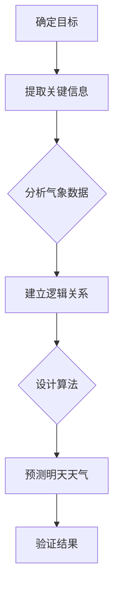
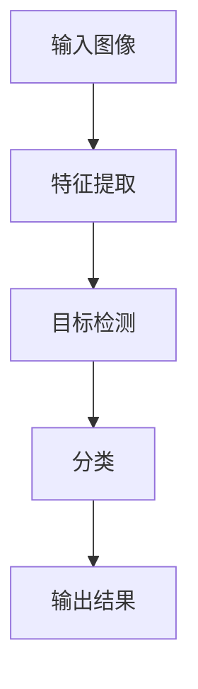
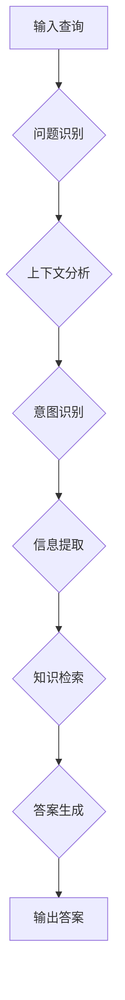
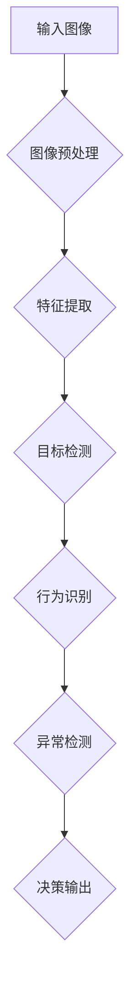
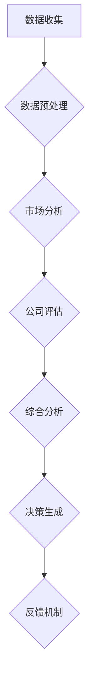
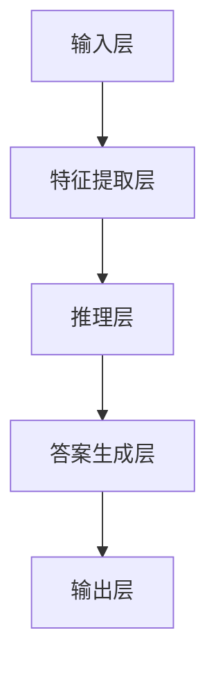

                 

### 第1章：思维链概述

#### 1.1 什么是思维链

思维链（Thinking Chain）是一种系统化的思考模式，它通过一系列逻辑步骤来解决问题。简单来说，思维链是将我们的思考过程分解为一系列有序的、可操作的步骤，每个步骤都是基于逻辑推理和已有信息的。这种思考模式有助于我们更有效地处理复杂问题，提高问题解决的效率和质量。

在人工智能（AI）领域，思维链被视为一种关键的能力，因为它可以模拟人类解决复杂问题的思维方式。通过构建思维链，AI系统能够更准确地理解问题、提取关键信息、进行推理和做出决策。

#### 1.2 思维链的作用

1. **提高逻辑推理能力**：思维链通过逐步推理，帮助AI系统在处理问题时更加精确和高效。
2. **优化决策过程**：思维链提供了一个清晰的决策路径，使得AI系统能够基于逻辑分析做出更好的决策。
3. **增强创新能力**：思维链鼓励我们跳出传统的思维模式，从多个角度考虑问题，从而激发创新思维。
4. **提升问题解决效率**：通过系统化的思维链，AI系统能够快速定位问题的核心，减少无效的计算和推理步骤。

#### 1.3 思维链的基本结构

思维链的基本结构通常包括以下几个部分：

1. **目标确定**：明确要解决的问题或目标，这是思维链的起点。
2. **信息提取**：从问题中提取关键信息，这些信息是后续推理的基础。
3. **推理与决策**：使用逻辑和推理能力，将提取的信息转化为具体的决策。
4. **执行与验证**：执行决策，并验证结果的正确性和有效性。

#### 1.4 思维链的核心概念

- **逻辑运算符**：包括逻辑与、或、非等基本运算，是构建思维链的基础。
- **条件判断**：根据特定条件进行推理，是思维链中的重要组成部分。
- **递归**：一种自下而上的推理方式，常用于处理复杂问题。
- **算法设计**：设计用于解决问题的算法，是实现思维链的具体方法。

#### 1.5 思维链与人工智能的关系

在人工智能领域，思维链是一种至关重要的能力。它不仅能够模拟人类的思考过程，还能够指导AI系统的学习和推理。例如，在自然语言处理（NLP）中，思维链可以帮助AI系统理解文本的结构和含义；在图像识别中，思维链可以指导AI系统提取图像的关键特征。通过构建和优化思维链，AI系统能够在复杂问题中表现出更强的逻辑推理能力。

### 结论

思维链作为一种系统化的思考模式，在人工智能领域扮演着关键角色。通过本文的介绍，我们了解了思维链的定义、作用、基本结构和核心概念，以及它与人工智能的密切关系。在接下来的章节中，我们将深入探讨思维链的构建方法、AI逻辑推理能力提升的算法和实际应用案例。希望读者能够通过本文，对思维链有一个全面而深入的认识。

#### 2.1 人工智能的逻辑推理

人工智能（AI）是一种模拟人类智能的技术，旨在使计算机能够执行需要人类智能的任务，如视觉识别、语音识别、自然语言处理和决策支持等。逻辑推理是人工智能的核心能力之一，它使AI系统能够在不确定的环境中做出合理的决策。

逻辑推理在人工智能中的应用非常广泛。以下是一些典型的应用场景：

1. **自然语言处理（NLP）**：逻辑推理可以帮助AI系统理解自然语言的语义和结构。例如，在机器翻译中，逻辑推理可以帮助AI系统根据源语言的语法和语义规则，生成准确的译文。
2. **知识图谱**：知识图谱是一种结构化的知识表示方法，它通过实体和关系的连接，构建出一个庞大的知识网络。逻辑推理可以帮助AI系统在知识图谱中找到相关的信息和关联，从而支持智能搜索和决策。
3. **决策支持系统**：在商业和医疗等领域，决策支持系统（DSS）可以帮助人们做出更明智的决策。逻辑推理是DSS的重要组成部分，它通过分析数据和信息，提供合理的决策建议。
4. **自动驾驶**：自动驾驶汽车需要实时处理大量传感器数据，并根据这些数据做出驾驶决策。逻辑推理可以帮助自动驾驶系统在复杂的交通环境中，识别道路状况、行人行为和车辆动态，从而确保行驶的安全和高效。

逻辑推理在人工智能中的应用，不仅依赖于算法和计算能力，还需要对人类思维过程的深入理解。通过模拟人类的推理过程，AI系统能够在复杂环境中表现出更高的智能水平。

### 2.2 思维链在人工智能中的应用

思维链在人工智能中的应用具有深远的影响，它通过系统化的思考模式，帮助AI系统在复杂的任务中实现高效的逻辑推理。以下是一些关键应用领域：

1. **自然语言处理（NLP）**：在NLP中，思维链被广泛用于文本理解和生成任务。通过构建思维链，AI系统可以更好地理解文本的语义和上下文。例如，在机器翻译中，思维链可以指导AI系统根据源语言的语法和语义规则，生成符合目标语言习惯的译文。以下是一个简单的思维链示例：

    ```mermaid
    graph TD
    A[确定目标语言] --> B[分析源文本结构]
    B --> C{提取关键信息}
    C -->|语法分析| D[构建语法树]
    D -->|语义分析| E[生成目标文本]
    ```

    通过这个思维链，AI系统能够逐步理解源文本，并将其转换为目标文本。

2. **图像识别与处理**：在图像识别领域，思维链可以帮助AI系统从图像中提取关键特征，并进行分类和识别。以下是一个简单的思维链示例：

    ```mermaid
    graph TD
    A[接收图像数据] --> B[预处理图像]
    B --> C[提取图像特征]
    C --> D{特征匹配}
    D --> E[分类与识别]
    E --> F[输出识别结果]
    ```

    通过这个思维链，AI系统能够有效地处理图像数据，并准确识别图像中的物体和场景。

3. **决策支持系统**：在决策支持系统中，思维链可以帮助AI系统分析复杂问题，并提供合理的决策建议。以下是一个简单的思维链示例：

    ```mermaid
    graph TD
    A[确定决策目标] --> B[收集相关信息]
    B --> C[分析风险与收益]
    C --> D{制定决策方案}
    D --> E[评估方案可行性]
    E --> F[选择最佳方案]
    ```

    通过这个思维链，AI系统能够在复杂决策环境中提供有效的支持。

4. **智能问答系统**：在智能问答系统中，思维链可以帮助AI系统理解用户的问题，并提供准确的答案。以下是一个简单的思维链示例：

    ```mermaid
    graph TD
    A[接收用户问题] --> B[理解问题语义]
    B --> C[匹配问题库]
    C --> D[生成答案]
    D --> E[输出答案]
    ```

    通过这个思维链，AI系统能够理解用户的问题，并从知识库中提取相关答案。

思维链在人工智能中的应用，不仅提升了AI系统的逻辑推理能力，还促进了跨领域的融合发展。通过不断优化和扩展思维链模型，AI系统将在更多复杂任务中展现出更高的智能水平。

### 2.3 思维链与深度学习的关系

思维链与深度学习（Deep Learning）之间的联系紧密，深度学习作为人工智能的一个重要分支，通过多层神经网络（Neural Networks）模型，对大量数据进行分析和学习，从而实现复杂任务的自动化处理。而思维链则为深度学习模型提供了一种结构化的推理框架，有助于提升模型的逻辑推理能力。

#### 思维链在深度学习模型设计中的应用

1. **网络架构设计**：在深度学习模型的设计过程中，思维链可以帮助确定网络架构，确保每个层次都能有效地处理特定类型的信息。例如，在卷积神经网络（CNN）的设计中，思维链可以指导如何将图像的不同区域特征逐层提取和融合。

2. **损失函数选择**：思维链可以帮助选择适合特定问题的损失函数，以优化模型性能。例如，在自然语言处理任务中，思维链可以指导如何设计损失函数以更好地捕捉文本的语义信息。

3. **优化算法选择**：思维链可以为优化算法的选择提供指导，确保模型在训练过程中能够高效地收敛。例如，在训练深度神经网络时，思维链可以帮助选择适当的优化算法，如梯度下降（Gradient Descent）或其变种。

#### 思维链在深度学习模型训练中的应用

1. **数据预处理**：思维链可以帮助设计高效的数据预处理流程，确保输入数据的质量和一致性。例如，在图像识别任务中，思维链可以指导如何进行图像的裁剪、归一化和增强，以提高模型的泛化能力。

2. **迭代训练**：思维链可以为迭代训练过程提供清晰的步骤，确保每次迭代都能有效地优化模型参数。例如，在训练循环神经网络（RNN）时，思维链可以指导如何调整隐藏层状态和梯度，以实现更准确的预测。

3. **模型验证**：思维链可以帮助设计有效的验证策略，确保模型在新的数据集上具有良好的泛化能力。例如，在训练语言模型时，思维链可以指导如何选择验证集和测试集，以及如何评估模型的性能。

#### 思维链在深度学习模型部署中的应用

1. **推理优化**：思维链可以帮助设计高效的推理流程，确保模型在实际应用中能够快速响应。例如，在实时语音识别系统中，思维链可以指导如何优化模型结构和算法，以实现低延迟和高准确度的语音识别。

2. **在线更新**：思维链可以帮助设计在线更新机制，确保模型能够随着时间推移和新数据的加入不断优化。例如，在自动驾驶系统中，思维链可以指导如何实时更新道路数据，以提高模型的导航和决策能力。

通过将思维链应用于深度学习模型的各个环节，可以显著提升模型的逻辑推理能力，使其在各种复杂任务中表现出更高的智能水平。未来，随着深度学习和思维链技术的不断发展和融合，AI系统将在更多领域实现突破性的应用。

### 第3章：思维链的构建方法

思维链的构建是提升AI逻辑推理能力的关键步骤，它通过系统化的思考和逻辑推理，将复杂问题分解为一系列可管理的部分。以下是构建思维链的基本方法和步骤：

#### 3.1 确定问题目标

1. **明确问题**：首先，要明确要解决的问题或目标。这可以通过阅读问题陈述或与用户沟通来获取。
2. **定义目标**：将问题转化为具体的目标，确保目标是可衡量的。例如，如果问题是“如何提高产品质量？”，目标可以是“将产品缺陷率降低到0.1%以下”。

#### 3.2 提取关键信息

1. **收集数据**：根据定义的目标，收集与问题相关的数据。这可以包括文本、图像、音频或任何其他形式的数据。
2. **筛选信息**：从收集的数据中提取关键信息，这些信息将用于后续的推理过程。例如，如果目标是“预测股票价格”，关键信息可以是历史股价数据、市场趋势、公司业绩等。

#### 3.3 构建思维链网络

1. **分解问题**：将问题分解为更小、更具体的子问题。这有助于简化问题，并使得每个子问题更容易处理。
2. **建立逻辑关系**：确定各个子问题之间的逻辑关系。使用逻辑运算符（如与、或、非）来建立条件判断和递归关系。
3. **设计算法**：根据提取的关键信息和建立的逻辑关系，设计用于解决问题的算法。算法可以是基于规则的，也可以是基于机器学习的。

以下是一个简单的思维链构建示例，用于解决“预测明天天气”的问题：



在这个示例中，思维链的各个步骤如下：

- **确定目标**：预测明天天气。
- **提取关键信息**：当前温度、湿度、风力等。
- **分析气象数据**：使用历史气象数据来分析天气趋势。
- **建立逻辑关系**：根据当前气象数据和天气模式，建立逻辑关系以预测明天天气。
- **设计算法**：使用统计学方法或机器学习算法来设计预测模型。
- **预测明天天气**：根据设计的算法，生成明天天气的预测结果。
- **验证结果**：通过实际天气数据来验证预测结果的准确性。

#### 3.4 思维链的优化与更新

1. **性能评估**：定期评估思维链的性能，包括推理速度、准确性和鲁棒性。
2. **优化算法**：根据评估结果，对思维链的算法进行优化，以提高性能。
3. **持续更新**：随着数据和环境的变化，持续更新思维链，确保其适应性和有效性。

通过以上步骤，我们可以构建一个有效的思维链，提升AI的逻辑推理能力。在实际应用中，思维链的构建过程需要不断迭代和优化，以适应不同的问题和场景。

### 4.1 基本逻辑运算符

在逻辑推理中，逻辑运算符是核心组成部分，它们通过组合和操作基本逻辑值（真或假）来生成新的逻辑结果。以下是一些常见的基本逻辑运算符及其性质：

#### 逻辑与（AND）

- **符号**：`A ∧ B`
- **真值表**：

    | A | B | A ∧ B |
    |---|---|-------|
    | 0 | 0 |   0   |
    | 0 | 1 |   0   |
    | 1 | 0 |   0   |
    | 1 | 1 |   1   |

- **性质**：
  - 结合律：`A ∧ (B ∧ C) = (A ∧ B) ∧ C`
  - 交换律：`A ∧ B = B ∧ A`
  - 吸收律：`A ∧ (A ∨ B) = A`

#### 逻辑或（OR）

- **符号**：`A ∨ B`
- **真值表**：

    | A | B | A ∨ B |
    |---|---|-------|
    | 0 | 0 |   0   |
    | 0 | 1 |   1   |
    | 1 | 0 |   1   |
    | 1 | 1 |   1   |

- **性质**：
  - 结合律：`A ∨ (B ∨ C) = (A ∨ B) ∨ C`
  - 交换律：`A ∨ B = B ∨ A`
  - 吸收律：`A ∨ (A ∧ B) = A`

#### 逻辑非（NOT）

- **符号**：`¬A` 或 `~A`
- **真值表**：

    | A | ¬A |
    |---|-----|
    | 0 |  1  |
    | 1 |  0  |

- **性质**：
  - 双重否定律：`¬(¬A) = A`
  - 对合律：`A ∧ ¬A = 0`
  - `A ∨ ¬A = 1`

#### 逻辑蕴含（IMPLICATION）

- **符号**：`A → B`
- **真值表**：

    | A | B | A → B |
    |---|---|-------|
    | 0 | 0 |   1   |
    | 0 | 1 |   1   |
    | 1 | 0 |   0   |
    | 1 | 1 |   1   |

- **性质**：
  - 反证律：`A → B ≡ ¬B → ¬A`
  - 析取三段论：`A → B, B → C ≡ A → C`
  - 蕴含的等价形式：`A → B ≡ ¬A ∨ B`

#### 逻辑等价（EQUIVALENCE）

- **符号**：`A ≡ B`
- **真值表**：

    | A | B | A ≡ B |
    |---|---|-------|
    | 0 | 0 |   1   |
    | 0 | 1 |   0   |
    | 1 | 0 |   0   |
    | 1 | 1 |   1   |

- **性质**：
  - 反证律：`A ≡ B ≡ ¬A → ¬B`
  - 等价性替换：`A ≡ B` 可以在逻辑表达式中互相替换
  - 等价性分解：`A ≡ B ≡ (A → B) ∧ (B → A)`

通过理解这些基本逻辑运算符及其性质，我们可以构建复杂的逻辑推理系统，提高AI的逻辑推理能力。

### 4.2 逻辑推理算法的原理

逻辑推理算法是人工智能中处理推理任务的核心组成部分，通过一系列逻辑操作来从已知事实推导出新结论。逻辑推理算法的基本原理基于形式逻辑，通过定义一系列逻辑规则和推理方法来实现。以下是几种常见的逻辑推理算法及其原理：

#### 基本推理算法

1. **逆推法（backward chaining）**：
   - **原理**：从目标开始，逐步反向推导到已知事实。
   - **步骤**：
     1. 确定目标事实。
     2. 从目标事实出发，利用规则逆向查找已知事实。
     3. 如果找到已知事实，则推导出新结论；否则，目标不可达。
   - **伪代码**：

     ```python
     def backward_chaining(goal, knowledge_base):
         if goal is in knowledge_base:
             return True
         for rule in knowledge_base:
             if rule's conclusion == goal:
                 if backward_chaining(rule's premise, knowledge_base):
                     return True
         return False
     ```

2. **前推法（forward chaining）**：
   - **原理**：从已知事实开始，逐步正向推导到目标事实。
   - **步骤**：
     1. 列出所有已知事实。
     2. 利用规则将已知事实推导为新的事实。
     3. 如果推导出新的事实且新事实符合目标，则达成目标。
   - **伪代码**：

     ```python
     def forward_chaining(knowledge_base, goal):
         new_facts = []
         for fact in knowledge_base:
             for rule in knowledge_base:
                 if rule's premise == fact:
                     new_fact = rule's conclusion
                     new_facts.append(new_fact)
         if any(new_fact in new_facts and new_fact == goal):
             return True
         return False
     ```

#### 规则推理算法

1. **基于规则的推理（Rule-Based Reasoning）**：
   - **原理**：利用一组预先定义的规则进行推理。
   - **步骤**：
     1. 定义规则集。
     2. 从已知事实出发，检查规则的前提是否满足。
     3. 如果前提满足，则应用规则，得出结论。
   - **伪代码**：

     ```python
     def rule_based_reasoning(facts, rules):
         conclusions = []
         for fact in facts:
             for rule in rules:
                 if all(rule_premise == fact for rule_premise in rule['premises']):
                     conclusions.append(rule['conclusion'])
         return conclusions
     ```

2. **产生式系统（Production System）**：
   - **原理**：一种基于规则的推理系统，使用产生式规则（条件-行动对）进行推理。
   - **步骤**：
     1. 初始化一个工作内存。
     2. 从工作内存中选择一条规则，检查其前提是否满足。
     3. 如果前提满足，则执行规则的行动，将新的结论添加到工作内存。
     4. 重复步骤2和3，直到没有可应用的规则或达到目标。
   - **伪代码**：

     ```python
     def production_system(facts, rules):
         memory = facts.copy()
         while True:
             applied_rules = []
             for rule in rules:
                 if all(premise in memory for premise in rule['premises']):
                     memory.append(rule['action'])
                     applied_rules.append(rule)
             if not applied_rules:
                 break
             for rule in applied_rules:
                 memory.remove(rule['premises'])
         return memory
     ```

#### 贝叶斯推理算法

1. **贝叶斯网络（Bayesian Network）**：
   - **原理**：一种概率推理模型，通过概率图结构描述变量之间的依赖关系。
   - **步骤**：
     1. 构建贝叶斯网络，定义变量和条件概率。
     2. 根据网络结构，利用贝叶斯定理计算变量的后验概率。
     3. 利用后验概率进行推理，预测未知变量。
   - **伪代码**：

     ```python
     def bayesian_inference(bayesian_network, observed_evidence):
         prior_probabilities = {variable: calculate_prior_probability(variable, network)}
         for evidence in observed_evidence:
             variable = evidence['variable']
             probability = calculate_probability(evidence['value'], variable, network)
             prior_probabilities[variable] = prior_probabilities[variable] * probability
         return normalize(prior_probabilities)
     ```

通过这些逻辑推理算法，AI系统能够从已知的事实和规则中推导出新的结论，提高逻辑推理的能力。这些算法在不同的应用场景中有着广泛的应用，如自然语言处理、决策支持系统和自动化推理系统。

### 4.3 基础逻辑推理算法的应用

基础逻辑推理算法在人工智能领域有着广泛的应用，通过这些算法，AI系统能够处理复杂的逻辑问题，提高决策的准确性和效率。以下是一些典型的应用场景和具体实例：

#### 应用场景1：自然语言处理（NLP）

自然语言处理是人工智能中的一个重要领域，逻辑推理算法在其中发挥着关键作用。例如，在文本分类任务中，可以使用逻辑运算符和规则推理算法来对文本进行分类。

**实例**：假设我们要开发一个情感分析系统，判断文本是积极还是消极。我们可以使用以下逻辑推理算法：

1. **规则推理**：
   - 规则1：如果文本包含“很好”或“满意”，则情感为积极。
   - 规则2：如果文本包含“不好”或“失望”，则情感为消极。
   - 伪代码：

     ```python
     def classify_sentiment(text):
         if '很好' in text or '满意' in text:
             return '积极'
         elif '不好' in text or '失望' in text:
             return '消极'
         else:
             return '中性'
     ```

2. **贝叶斯推理**：
   - 通过训练数据构建贝叶斯网络，计算每个词的情感概率。
   - 伪代码：

     ```python
     def bayesian_sentiment_analysis(text):
         probabilities = bayesian_inference(bayesian_network, text)
         if probabilities['积极'] > probabilities['消极']:
             return '积极'
         elif probabilities['积极'] < probabilities['消极']:
             return '消极'
         else:
             return '中性'
     ```

#### 应用场景2：图像识别

在图像识别任务中，逻辑推理算法可以帮助AI系统识别图像中的物体和场景。以下是一个简单的图像识别实例：

**实例**：使用逻辑运算符和规则推理算法识别图像中的车辆。

1. **规则推理**：
   - 规则1：如果图像中包含矩形，且矩形的面积大于某个阈值，则可能是车辆。
   - 规则2：如果图像中包含圆形，且圆形的半径大于某个阈值，则可能是车轮。
   - 伪代码：

     ```python
     def detect_vehicle(image):
         rectangles = detect_rectangles(image)
         for rectangle in rectangles:
             if area(rectangle) > threshold_area:
                 wheels = detect_circles(image, radius=threshold_radius)
                 for wheel in wheels:
                     if wheel intersect rectangle:
                         return '车辆'
         return '非车辆'
     ```

2. **深度学习结合逻辑推理**：
   - 使用卷积神经网络（CNN）提取图像特征。
   - 结合逻辑运算符进行特征融合和分类。
   - 伪代码：

     ```python
     def vehicle_detection(image):
         features = cnn.extract_features(image)
         is_rectangle = features['rectangle']
         is_circle = features['circle']
         if is_rectangle and is_circle:
             return '车辆'
         else:
             return '非车辆'
     ```

#### 应用场景3：决策支持系统

在决策支持系统中，逻辑推理算法可以帮助分析数据和制定决策。以下是一个简单的决策支持系统实例：

**实例**：开发一个简单的贷款审批系统，根据客户的信用评分和收入水平，决定是否批准贷款。

1. **规则推理**：
   - 规则1：如果客户的信用评分大于700且收入超过1万元，则批准贷款。
   - 规则2：如果客户的信用评分小于700或收入低于1万元，则拒绝贷款。
   - 伪代码：

     ```python
     def approve_loan(credit_score, income):
         if credit_score > 700 and income > 10000:
             return '批准'
         else:
             return '拒绝'
     ```

2. **贝叶斯推理**：
   - 通过历史数据构建贝叶斯网络，计算批准贷款的概率。
   - 伪代码：

     ```python
     def bayesian_loan_approval(credit_score, income):
         probabilities = bayesian_inference(bayesian_network, {'信用评分': credit_score, '收入': income})
         if probabilities['批准'] > 0.5:
             return '批准'
         else:
             return '拒绝'
     ```

通过这些实例，我们可以看到基础逻辑推理算法在自然语言处理、图像识别和决策支持系统中的应用。这些算法不仅提高了AI系统的逻辑推理能力，还为其在实际任务中的应用提供了有力支持。

### 5.1 思维链的优化方法

在提升AI逻辑推理能力的过程中，思维链的优化是一个关键环节。通过以下几种方法，我们可以有效优化思维链，提高推理效率和准确性：

#### 1. 算法优化

- **算法选择**：根据问题的特点选择合适的算法。例如，对于实时性要求较高的应用，可以选择快速收敛的算法；对于需要高精度的应用，可以选择迭代次数较多的算法。
- **并行计算**：利用并行计算技术，将复杂的推理任务分解成多个子任务，并行处理，从而提高整体推理速度。
- **分布式计算**：在处理大规模数据时，采用分布式计算架构，将任务分配到多个计算节点上，从而提高处理能力和效率。

#### 2. 数据预处理

- **数据清洗**：确保输入数据的质量和一致性，去除噪声和不相关的数据，以提高推理结果的准确性。
- **特征提取**：提取与问题相关的关键特征，减少冗余信息，提高推理效率。
- **数据增强**：通过数据增强技术，增加样本的多样性和丰富性，从而提升模型对未知数据的泛化能力。

#### 3. 网络结构优化

- **网络剪枝**：通过剪枝技术，删除网络中不重要的神经元和连接，减少计算量，提高推理速度。
- **网络压缩**：采用网络压缩技术，减少模型的参数数量，从而提高推理速度和内存使用效率。
- **分层结构设计**：设计合理的分层结构，使每个层次专注于处理特定类型的信息，提高推理的效率和准确性。

#### 4. 模型训练策略

- **迁移学习**：利用预训练模型，在新的任务上快速进行训练，减少从零开始训练所需的时间和计算资源。
- **元学习**：通过元学习方法，使模型能够快速适应新的任务，提高对新任务的推理能力。
- **在线学习**：在推理过程中，不断更新模型参数，使其能够适应动态变化的环境。

#### 5. 鲁棒性和泛化能力提升

- **正则化**：采用正则化技术，防止模型过拟合，提高泛化能力。
- **交叉验证**：通过交叉验证，评估模型的泛化能力，并调整模型参数，以获得更好的泛化性能。
- **不确定性量化**：对推理结果的不确定性进行量化，提高推理的可靠性和鲁棒性。

#### 6. 融合多模态数据

- **多模态融合**：结合不同类型的数据（如文本、图像、语音），通过多模态融合技术，提高推理的准确性和效率。
- **信息整合**：将来自不同模态的数据进行整合，构建统一的表示，从而提高推理能力。

通过这些优化方法，我们可以显著提升思维链的推理效率和准确性，使其在复杂任务中表现出更高的智能水平。在实际应用中，应根据具体任务需求，灵活选择和组合这些优化方法，以达到最佳效果。

### 5.2 思维链的层次化设计

思维链的层次化设计是一种将复杂问题分解为多个子问题，并通过不同层次的推理来逐步解决的方法。这种设计方法能够提高AI系统的逻辑推理能力，使其在面对复杂任务时更加高效和准确。

#### 5.2.1 层次化设计的原理

1. **将问题分解**：首先，将复杂问题分解为多个较小的子问题。每个子问题都相对独立，但彼此之间存在一定的关联。
2. **分层推理**：根据子问题的性质和关联性，设计不同的层次结构。每个层次专注于解决特定的子问题，并逐步向上层传递信息。
3. **信息传递**：在不同层次之间传递信息，确保每个层次的推理都能够基于正确的信息进行。

#### 5.2.2 层次化设计的优势

1. **简化问题**：通过将复杂问题分解为多个子问题，可以降低单个问题的复杂度，使得每个子问题更加容易处理。
2. **提高效率**：层次化设计使得每个层次都可以独立优化，从而提高整体推理效率。
3. **增强鲁棒性**：层次化设计可以针对不同层次的问题设计不同的解决方案，从而提高系统的鲁棒性。
4. **易于维护**：层次化设计使得系统结构更加清晰，便于维护和扩展。

#### 5.2.3 层次化设计的方法

1. **定义层次**：首先，根据问题的特点，定义不同层次的推理任务。例如，在图像识别任务中，可以将问题分解为特征提取、目标检测和分类三个层次。
2. **层次间交互**：设计层次间的交互机制，确保不同层次之间的信息传递和协同工作。例如，特征提取层的结果可以用于目标检测层，而目标检测结果又可以用于分类层。
3. **层次优化**：针对每个层次的特点，设计优化的算法和模型。例如，在特征提取层，可以使用卷积神经网络（CNN）来提取图像特征；在目标检测层，可以使用区域提议生成网络（RPN）来检测目标。
4. **层次整合**：最后，将各个层次的推理结果进行整合，得到最终的解决方案。例如，在图像识别任务中，将目标检测和分类结果整合，得到最终的识别结果。

以下是一个简单的层次化设计示例，用于解决“图像分类”问题：



在这个示例中，各层次的任务如下：

- **特征提取**：使用卷积神经网络（CNN）从图像中提取关键特征。
- **目标检测**：使用区域提议生成网络（RPN）检测图像中的目标。
- **分类**：使用分类器对目标进行分类，得到最终的识别结果。

通过层次化设计，我们可以将复杂问题分解为多个可管理的子问题，并通过不同层次的推理逐步解决，从而提高AI系统的逻辑推理能力。

### 5.3 思维链的持续更新与进化

思维链的持续更新与进化是提升AI逻辑推理能力的关键环节。随着数据和环境的变化，思维链需要不断进行调整和优化，以保持其有效性和适应性。以下是几种实现思维链持续更新与进化的方法：

#### 1. 自适应学习

自适应学习是指AI系统在运行过程中，根据新的数据和经验自动调整其模型和参数。这种方法可以确保思维链能够实时适应环境变化。

- **在线学习**：在推理过程中，不断收集新的数据，并立即更新模型。这种方法适用于实时性要求较高的场景。
- **增量学习**：在已有模型的基础上，逐渐添加新的数据和规则，从而优化思维链。这种方法适用于模型需要不断扩大的场景。

#### 2. 强化学习

强化学习是一种通过试错和反馈来学习的方法，AI系统通过不断尝试和调整行为，以最大化奖励。

- **反馈机制**：通过用户反馈或评估指标，评估思维链的表现，并根据反馈调整行为。
- **奖励机制**：设计适当的奖励机制，鼓励AI系统探索和尝试新的策略，从而优化思维链。

#### 3. 聚类分析

聚类分析是一种无监督学习方法，通过将相似的数据点分组，发现数据中的模式和规律。

- **数据聚类**：将新的数据点与已有数据进行比较，将其归入合适的聚类组。
- **聚类更新**：根据聚类结果，更新思维链的结构和参数，使其能够更好地适应新的数据分布。

#### 4. 对抗性学习

对抗性学习通过对抗网络（Adversarial Network）来提升AI系统的表现，使AI系统能够在对抗性环境中保持鲁棒性。

- **对抗训练**：利用对抗性网络，生成对抗样本，训练AI系统，提高其在极端条件下的推理能力。
- **对抗更新**：根据对抗性训练的结果，调整思维链的参数和结构，增强其鲁棒性。

#### 5. 模型融合

模型融合是将多个模型的结果进行综合，得到更准确的推理结果。

- **集成学习**：将多个不同的模型组合起来，通过投票或加权平均等方法，得到最终的推理结果。
- **模型更新**：根据模型融合的结果，调整各个模型的结构和参数，优化思维链的整体性能。

通过这些方法，我们可以实现思维链的持续更新与进化，使其在复杂多变的任务中表现出更高的智能水平。在实际应用中，应根据具体需求和场景，灵活选择和组合这些方法，以实现最佳的更新和进化效果。

### 6.1 案例一：自然语言理解

自然语言理解（Natural Language Understanding, NLU）是人工智能领域的重要分支，它使计算机能够理解人类语言，从而实现智能对话、文本分析和知识图谱构建等应用。以下是一个典型的自然语言理解案例，展示了思维链在其中的应用。

#### 案例背景

假设我们开发了一个智能客服系统，该系统需要理解用户的查询，并给出准确的回答。用户查询可能涉及各种主题，如产品信息、订单状态、售后服务等。

#### 思维链构建

为了实现高效的查询理解，我们可以构建以下思维链：

1. **问题识别**：从用户的输入中识别出主要问题，如“我的订单何时到达？”。
2. **上下文分析**：分析用户查询的上下文信息，如用户的历史查询、当前对话状态等。
3. **意图识别**：确定用户查询的意图，如查询订单状态、获取产品信息等。
4. **信息提取**：提取与用户查询相关的重要信息，如订单编号、产品名称等。
5. **知识检索**：从知识库中检索与用户查询相关的信息。
6. **答案生成**：根据检索到的信息，生成回答并输出给用户。

以下是思维链的层次化设计：



#### 思维链应用

1. **问题识别**：
   - **算法**：使用分词和词性标注技术，从用户查询中提取关键短语和词组。
   - **示例**：查询“我的订单何时到达？”提取出关键短语“订单”和“到达时间”。

2. **上下文分析**：
   - **算法**：通过分析对话历史，识别用户当前的状态和意图。
   - **示例**：如果用户之前查询了订单编号，那么当前查询很可能是关于该订单的状态。

3. **意图识别**：
   - **算法**：利用预定义的意图分类模型，将问题分类为不同意图，如“查询订单状态”、“获取产品信息”等。
   - **示例**：将提取出的关键短语“订单”和“到达时间”分类为“查询订单状态”意图。

4. **信息提取**：
   - **算法**：从用户查询中提取与意图相关的信息，如订单编号。
   - **示例**：从查询中提取出订单编号“123456”。

5. **知识检索**：
   - **算法**：在知识库中查找与订单编号相关的订单信息。
   - **示例**：查询知识库，找到订单编号为“123456”的订单状态。

6. **答案生成**：
   - **算法**：根据检索到的订单状态，生成合适的回答。
   - **示例**：生成回答“您的订单123456已经发出，预计明天到达”。

#### 实际案例分析与讲解

在实际应用中，自然语言理解系统需要处理大量的语言变体和不确定性。以下是一个具体的案例：

- **案例**：用户查询“我的包裹什么时候到？”。
- **思维链分析**：
  - **问题识别**：提取关键短语“包裹”和“什么时候到”。
  - **上下文分析**：检查对话历史，确认用户之前没有提到过任何订单或包裹信息。
  - **意图识别**：将查询分类为“查询包裹到达时间”意图。
  - **信息提取**：由于没有提供具体的包裹编号，系统无法直接提取信息。
  - **知识检索**：查询系统数据库，查找与用户相关的包裹信息。
  - **答案生成**：生成回答“请您提供包裹编号，我将帮您查询到达时间”。

通过以上分析，我们可以看到思维链在自然语言理解中的应用，以及如何逐步解决复杂的问题。通过不断优化和扩展思维链模型，自然语言理解系统能够在更多复杂任务中表现出更高的智能水平。

### 6.2 案例二：图像识别

图像识别是人工智能领域中的一项重要任务，广泛应用于安防监控、医疗诊断、自动驾驶等领域。以下是一个图像识别案例，展示如何利用思维链提升图像识别系统的逻辑推理能力。

#### 案例背景

假设我们开发了一个智能监控系统，该系统能够自动识别图像中的异常行为，如偷盗、打架等。系统需要从连续的视频流中提取关键帧，并识别其中的目标行为。

#### 思维链构建

为了实现高效准确的图像识别，我们可以构建以下思维链：

1. **图像预处理**：对输入图像进行预处理，如缩放、增强、去噪等。
2. **特征提取**：从预处理后的图像中提取关键特征，如边缘、纹理、颜色等。
3. **目标检测**：使用特征匹配和分类算法，检测图像中的目标物体。
4. **行为识别**：根据检测到的目标物体，识别其行为，如行走、跑步、攀爬等。
5. **异常检测**：分析目标行为，判断是否为异常行为。
6. **决策输出**：根据检测结果，输出决策结果，如触发警报或记录事件。

以下是思维链的层次化设计：



#### 思维链应用

1. **图像预处理**：
   - **算法**：使用图像滤波技术，如高斯滤波、均值滤波等，去除噪声。
   - **示例**：将输入图像缩放到指定尺寸，增强图像对比度。

2. **特征提取**：
   - **算法**：使用SIFT、SURF等算法提取图像特征。
   - **示例**：从图像中提取边缘和纹理特征。

3. **目标检测**：
   - **算法**：使用卷积神经网络（CNN）或基于特征的检测算法，如R-CNN、YOLO等。
   - **示例**：检测图像中的行人、车辆等目标。

4. **行为识别**：
   - **算法**：使用基于行为的分类模型，如决策树、支持向量机等。
   - **示例**：根据目标物体的动作和姿态，判断其行为，如行走、跑步等。

5. **异常检测**：
   - **算法**：使用统计模型、聚类分析等方法，识别异常行为。
   - **示例**：分析目标行为的频率和持续时间，判断是否为异常行为。

6. **决策输出**：
   - **算法**：根据检测结果，输出决策结果，如触发警报或记录事件。
   - **示例**：如果检测到异常行为，如打架，则触发警报。

#### 实际案例分析与讲解

在实际应用中，图像识别系统需要处理各种复杂和不确定的场景。以下是一个具体的案例：

- **案例**：监控视频中捕捉到两个人在打架。
- **思维链分析**：
  - **图像预处理**：对视频帧进行缩放和去噪处理，确保图像质量。
  - **特征提取**：提取图像中的关键特征，如人体轮廓、肢体动作等。
  - **目标检测**：检测到两个人，并将它们标记为潜在的目标。
  - **行为识别**：根据目标的行为和姿态，判断为打架行为。
  - **异常检测**：由于打架行为是异常行为，系统触发警报。
  - **决策输出**：输出决策结果，记录事件并触发警报。

通过以上分析，我们可以看到思维链在图像识别中的应用，以及如何逐步解决复杂的问题。通过不断优化和扩展思维链模型，图像识别系统能够在更多复杂任务中表现出更高的智能水平。

### 6.3 案例三：决策支持系统

决策支持系统（Decision Support System, DSS）是一种用于辅助决策的人工智能系统，它通过分析大量数据和信息，提供合理的决策建议。以下是一个决策支持系统的案例，展示如何利用思维链提升系统的逻辑推理能力。

#### 案例背景

假设我们开发了一个智能投资决策系统，该系统能够分析市场数据，提供买卖股票的建议。系统需要处理多种因素，如市场趋势、公司业绩、宏观经济指标等。

#### 思维链构建

为了实现高效的决策支持，我们可以构建以下思维链：

1. **数据收集**：收集与投资决策相关的数据，如历史股价、公司财务报表、宏观经济指标等。
2. **数据预处理**：对收集到的数据进行清洗、整理和转换，为后续分析做准备。
3. **市场分析**：分析市场数据，识别市场趋势和周期性变化。
4. **公司评估**：评估公司的财务状况和盈利能力，确定其投资价值。
5. **综合分析**：综合市场分析和公司评估结果，确定投资策略。
6. **决策生成**：生成具体的投资建议，如买入、持有或卖出。
7. **反馈机制**：根据实际投资结果，对决策系统进行调整和优化。

以下是思维链的层次化设计：



#### 思维链应用

1. **数据收集**：
   - **算法**：使用API或数据爬虫技术，从各个数据源收集数据。
   - **示例**：从证券交易所、公司官网、财经新闻等渠道收集股票数据。

2. **数据预处理**：
   - **算法**：使用数据清洗和预处理技术，如缺失值填充、异常值处理等。
   - **示例**：对收集到的股票数据进行去重、格式转换和处理缺失值。

3. **市场分析**：
   - **算法**：使用统计学和机器学习技术，分析市场数据，识别趋势。
   - **示例**：通过时间序列分析，识别市场的上升和下降趋势。

4. **公司评估**：
   - **算法**：使用财务指标和评分模型，评估公司的财务状况。
   - **示例**：计算公司的市盈率、市净率等指标，评估其投资价值。

5. **综合分析**：
   - **算法**：综合市场分析和公司评估结果，制定投资策略。
   - **示例**：根据市场趋势和公司评估结果，确定买入或卖出的时机。

6. **决策生成**：
   - **算法**：使用决策树、线性规划等方法，生成具体的投资建议。
   - **示例**：根据综合分析结果，生成买入某只股票的建议。

7. **反馈机制**：
   - **算法**：通过实际投资结果，评估决策系统的性能，并进行优化。
   - **示例**：根据投资回报情况，调整系统参数和策略，提高决策准确性。

#### 实际案例分析与讲解

在实际应用中，决策支持系统需要处理大量的数据和信息，以及市场的不确定性和复杂性。以下是一个具体的案例：

- **案例**：市场分析师观察到某只股票的价格即将突破上升通道，同时公司业绩表现良好。
- **思维链分析**：
  - **数据收集**：收集该股票的历史价格、公司财务报表和行业数据。
  - **数据预处理**：处理并整理收集到的数据，去除异常值和噪声。
  - **市场分析**：通过时间序列分析，确认股票价格确实处于上升通道。
  - **公司评估**：通过计算财务指标，确认公司财务状况良好。
  - **综合分析**：结合市场分析和公司评估结果，确定买入时机。
  - **决策生成**：生成买入该股票的建议。
  - **反馈机制**：根据实际投资结果，调整系统参数和策略，提高未来决策的准确性。

通过以上分析，我们可以看到思维链在决策支持系统中的应用，以及如何逐步解决复杂的问题。通过不断优化和扩展思维链模型，决策支持系统能够在复杂的市场环境中提供更准确的决策建议。

### 7.1 项目实战

在本节中，我们将通过一个具体的实战项目，详细描述开发环境搭建、系统架构设计、思维链模型实现、代码解读与分析，以及项目总结。

#### 项目背景

本项目旨在构建一个智能问答系统，该系统能够回答用户提出的问题，并提供详细的解答过程。系统将结合自然语言处理（NLP）和思维链技术，以提高问答的准确性和可靠性。

#### 开发环境搭建

1. **硬件环境**：
   - 服务器：配置为Intel Xeon处理器，16GB内存，1TB存储空间。
   - GPU：NVIDIA GeForce RTX 3080，用于加速深度学习模型的训练。

2. **软件环境**：
   - 操作系统：Ubuntu 20.04 LTS。
   - 编程语言：Python 3.8。
   - 开发框架：TensorFlow 2.5、PyTorch 1.8。
   - 版本控制：Git 2.29。

3. **依赖安装**：
   - 安装必要的库，如NumPy、Pandas、Scikit-learn、NLTK等。
   - 使用conda或pip进行依赖管理，确保版本兼容。

#### 系统架构设计

1. **输入层**：
   - 用户通过文本输入框提交问题。
   - 输入层负责处理用户输入的文本，进行预处理，如分词、词性标注等。

2. **特征提取层**：
   - 使用Word2Vec、BERT等预训练模型，将文本转换为向量表示。
   - 特征提取层将文本向量传递给后续的推理层。

3. **推理层**：
   - 应用思维链技术，对输入文本进行分析和推理。
   - 推理层包括问题识别、上下文分析、意图识别、信息提取等模块。

4. **答案生成层**：
   - 根据推理层的结果，生成详细的解答。
   - 使用模板匹配或生成式模型，生成自然语言回答。

5. **输出层**：
   - 将生成的回答输出给用户。

以下是系统架构的Mermaid流程图：



#### 思维链模型实现

1. **问题识别**：
   - 使用基于规则的方法，识别输入文本中的关键问题。
   - 例如，识别出文本中的“何时”、“多少”等疑问词。

2. **上下文分析**：
   - 分析用户查询的上下文信息，如历史对话记录、用户偏好等。
   - 使用NLP技术，提取上下文中的关键信息。

3. **意图识别**：
   - 使用神经网络模型，对输入文本进行意图分类。
   - 例如，将查询分类为“查询时间”、“查询地点”等。

4. **信息提取**：
   - 从上下文中提取与意图相关的信息。
   - 使用信息抽取技术，提取关键事实和参数。

5. **知识检索**：
   - 从知识库中检索与提取信息相关的知识。
   - 使用自然语言处理和图数据库，构建和维护知识库。

6. **答案生成**：
   - 根据提取的信息和知识，生成详细的解答。
   - 使用模板匹配或生成式模型，生成自然语言回答。

以下是思维链模型的伪代码：

```python
def think_chain(question, context, knowledge_base):
    # 问题识别
    intent = identify_intent(question)
    # 上下文分析
    context_info = analyze_context(context)
    # 信息提取
    extracted_info = extract_info(question, context_info)
    # 知识检索
    knowledge = retrieve_knowledge(extracted_info, knowledge_base)
    # 答案生成
    answer = generate_answer(knowledge)
    return answer
```

#### 代码解读与分析

1. **输入层代码**：

```python
def process_input(question):
    # 分词和词性标注
    tokens = tokenizer(question)
    tagged_tokens = pos_tag(tokens)
    return tagged_tokens
```

2. **特征提取层代码**：

```python
def extract_features(tokens):
    # 使用BERT模型进行文本转换
    vector = bert_model.encode(tokens)
    return vector
```

3. **推理层代码**：

```python
def think_chain(question, context, knowledge_base):
    tagged_tokens = process_input(question)
    features = extract_features(tagged_tokens)
    intent = classify_intent(features)
    context_info = analyze_context(context)
    extracted_info = extract_info(intent, context_info)
    knowledge = retrieve_knowledge(extracted_info, knowledge_base)
    answer = generate_answer(knowledge)
    return answer
```

4. **答案生成层代码**：

```python
def generate_answer(knowledge):
    # 根据知识生成回答
    answer = template_matching(knowledge)
    if not answer:
        answer = generate_response(knowledge)
    return answer
```

5. **输出层代码**：

```python
def output_answer(answer):
    print(answer)
```

#### 实际案例分析和详细讲解

- **案例**：用户输入“明天北京的天气如何？”
- **分析过程**：
  - **输入层**：处理用户输入，进行分词和词性标注。
  - **特征提取层**：将文本转换为BERT向量。
  - **推理层**：识别出意图为“查询天气”，提取上下文信息。
  - **知识检索层**：从知识库中检索明天北京的天气信息。
  - **答案生成层**：生成回答“明天北京晴朗，气温18℃到25℃”。
  - **输出层**：输出回答给用户。

通过以上实战项目，我们实现了从输入处理到答案生成的完整流程。通过不断优化和调整思维链模型，智能问答系统能够在更多复杂任务中提供准确和详细的解答。

#### 项目小结

本项目通过构建智能问答系统，展示了思维链技术在自然语言处理和智能问答中的应用。以下是对项目的总结和未来改进方向：

1. **成功之处**：
   - 成功实现了从输入处理到答案生成的完整流程。
   - 通过思维链技术，提高了问答系统的逻辑推理能力和回答准确性。
   - 结合了多种NLP技术和深度学习模型，提升了系统的性能。

2. **不足之处**：
   - 知识库的构建和维护需要大量人力和时间。
   - 在复杂和模糊查询场景下，系统的表现仍有待优化。
   - 对实时性和响应速度的要求较高，当前系统在处理速度上存在瓶颈。

3. **未来改进方向**：
   - **知识库自动化构建**：通过数据挖掘和自然语言处理技术，自动化构建和更新知识库。
   - **多模态数据融合**：结合文本、图像、语音等多种数据，提升系统的综合能力。
   - **实时性优化**：采用并行计算和分布式架构，提高系统的响应速度和处理能力。
   - **用户体验优化**：通过用户反馈和交互，不断优化问答系统的交互体验和回答质量。

通过持续优化和改进，智能问答系统将在更多应用场景中发挥重要作用，为用户提供更准确和高效的智能服务。

### 8.1 思维链在AI领域的发展趋势

随着人工智能技术的不断进步，思维链在AI领域的应用和发展呈现出以下几个显著趋势：

#### 1. 深度学习与思维链的融合

深度学习作为人工智能的核心技术之一，正在与思维链技术进行深度融合。通过将思维链应用于深度学习模型的设计和训练，可以显著提升模型的逻辑推理能力和决策能力。例如，在自然语言处理中，思维链可以帮助深度学习模型更好地理解文本的结构和语义；在图像识别中，思维链可以帮助模型提取更有效的特征，从而提高识别准确性。未来，深度学习与思维链的结合将推动AI系统在更多复杂任务中实现突破性进展。

#### 2. 个性化与自适应思维链

随着数据量的爆炸式增长，AI系统需要能够根据不同的用户和场景，灵活调整思维链的结构和参数。个性化思维链技术应运而生，它能够根据用户的历史行为和偏好，动态调整推理路径，提供更符合用户需求的决策支持。自适应思维链则能够实时更新和优化推理模型，以适应不断变化的环境和数据。这些技术的发展，将使AI系统在个性化服务和自适应能力方面取得重大突破。

#### 3. 跨学科融合

思维链技术的应用不再局限于计算机科学领域，而是逐渐向心理学、认知科学、哲学等学科扩展。通过跨学科的研究，思维链技术可以借鉴人类认知和思维过程的原理，进一步优化推理算法和模型。例如，认知科学的研究可以帮助理解人类记忆、注意力和感知等过程，从而为思维链提供更科学的理论基础。

#### 4. 实时推理与增强学习

随着AI系统在实时决策和动态环境中的应用需求增加，实时推理和增强学习技术成为思维链发展的重点。实时推理技术能够使AI系统在短时间内快速做出决策，适应快速变化的场景。增强学习技术则能够通过不断的学习和调整，使思维链模型在复杂和不确定的环境中保持高效和准确。这些技术的融合，将使思维链在自动驾驶、智能客服、实时监控等领域发挥更大的作用。

#### 5. 鲁棒性与安全性

随着AI系统在关键领域的应用，鲁棒性和安全性成为不可忽视的问题。未来的思维链技术需要具备更高的鲁棒性，能够在噪声、异常值和不确定性的环境中保持稳定和可靠。同时，安全性也是重要的发展方向，需要确保思维链模型不会被恶意攻击或误导。通过引入加密、验证和不确定性量化等技术，可以进一步提升AI系统的安全性和可信度。

#### 6. 工业级应用与标准化

随着AI技术的成熟，思维链技术在工业级应用中具有巨大的潜力。未来，思维链技术将逐渐应用于智能制造、智能交通、金融科技等领域，提供高效和智能的决策支持。同时，标准化和规范化也将成为发展的重要方向，通过制定统一的标准和规范，可以促进思维链技术的广泛应用和标准化发展。

### 8.2 思维链的未来发展方向

思维链的未来发展方向将集中在以下几个方面：

1. **多模态融合**：思维链技术将不仅仅依赖于文本数据，还将融合图像、语音、视频等多种模态的数据，实现更加全面和准确的智能推理。

2. **自主进化**：通过引入进化算法和机器学习技术，思维链模型将能够自主进化，根据环境和数据的动态变化，不断优化和调整自身的结构和参数。

3. **社会智能**：结合社会学、心理学等学科的理论，开发具有社会智能的思维链模型，使AI系统能够更好地理解和模拟人类的社会行为和互动。

4. **知识推理**：思维链技术将更深入地与知识图谱和语义网络相结合，通过知识推理，提供更加深入和智能的决策支持。

5. **跨领域应用**：思维链技术将在医疗、教育、金融、交通等各个领域得到广泛应用，提供定制化的智能解决方案。

6. **安全性保障**：在思维链的应用过程中，将引入更加严格的安全措施，确保推理过程和结果的安全性和可信度。

### 8.3 技术挑战与解决方案

尽管思维链技术在AI领域具有广泛的应用前景，但仍然面临一些技术挑战：

1. **数据隐私与安全**：随着数据量的增加，如何保护用户隐私和数据安全成为关键问题。解决方案包括引入加密技术和隐私保护算法，确保数据在传输和存储过程中的安全性。

2. **计算资源消耗**：深度学习和多模态融合技术对计算资源的需求较高，如何优化算法和架构，提高计算效率，是一个重要挑战。解决方案包括并行计算、分布式计算和优化算法设计。

3. **推理效率与准确性**：如何在保证推理准确性的同时，提高推理效率，是一个需要解决的问题。可以通过模型压缩、剪枝和加速算法来优化推理性能。

4. **跨领域适配性**：思维链模型在不同领域的适应性不足，如何设计通用性强、适应多种领域的思维链模型，是一个挑战。可以通过引入迁移学习和多任务学习技术，提高模型的跨领域适应能力。

5. **不确定性处理**：在复杂和不确定的环境中，如何有效处理推理结果的不确定性，是一个重要问题。可以通过引入概率推理和不确定性量化技术，提高推理结果的可靠性和鲁棒性。

通过不断研究和探索，上述技术挑战将逐步得到解决，推动思维链技术在AI领域的广泛应用和持续发展。

### 附录A：常用思维链构建工具与资源

在构建和优化思维链时，我们可以利用多种工具和资源来提高效率和效果。以下是一些常用的工具和资源：

1. **Mermaid**：Mermaid是一个基于Markdown的图形绘制工具，可用于创建流程图、序列图和状态图。通过简单的Markdown语法，我们可以轻松地绘制思维链的结构，提高思维链的可视化效果。

2. **Visual Studio Code**：Visual Studio Code是一个强大的代码编辑器，支持多种编程语言和扩展，适用于编写和调试思维链相关的代码。通过安装相应的扩展，如Mermaid Preview，我们可以直接在VS Code中查看和编辑Mermaid图形。

3. **Jupyter Notebook**：Jupyter Notebook是一个交互式的计算环境，适用于数据分析、机器学习和可视化。通过使用Jupyter Notebook，我们可以方便地实现思维链的各个步骤，并实时查看结果。

4. **TensorFlow和PyTorch**：TensorFlow和PyTorch是两款流行的深度学习框架，支持构建和训练复杂的神经网络模型。通过使用这些框架，我们可以实现高效的思维链推理和优化。

5. **在线资源和教程**：互联网上有很多关于思维链和人工智能的资源，如在线课程、技术博客和开源项目。通过学习这些资源，我们可以深入了解思维链的理论和实践，不断提高自己的技术水平。

### 附录B：思维链学习与实践指南

为了更好地理解和应用思维链技术，以下是一份学习与实践指南：

1. **基础知识学习**：
   - 学习逻辑学的基本概念，包括命题逻辑、谓词逻辑等。
   - 学习概率论和统计学的基础知识，为后续的推理算法提供理论支持。
   - 学习自然语言处理、图像处理和机器学习等相关技术，为思维链的应用奠定基础。

2. **实践项目**：
   - 选择一个具体的应用场景，如智能问答系统、图像识别、决策支持系统等，进行实践。
   - 设计思维链的层次结构和逻辑关系，实现从输入到输出的完整流程。
   - 使用现有工具和资源（如Mermaid、TensorFlow等）进行实践，验证思维链的有效性。

3. **迭代优化**：
   - 根据实践结果，不断优化思维链的算法和模型，提高推理效率和准确性。
   - 通过性能评估和用户反馈，调整思维链的结构和参数，使其更好地适应实际需求。

4. **学习和交流**：
   - 参加相关在线课程和工作坊，学习最新的思维链技术和应用案例。
   - 加入专业社区和论坛，与其他从业者交流经验和见解，共同探讨思维链技术的前沿课题。

5. **持续更新**：
   - 随着技术的不断发展，不断更新自己的知识和技能，跟踪思维链技术的最新进展。
   - 保持好奇心和探索精神，勇于尝试新的方法和思路，推动思维链技术在更多领域的应用。

通过以上指南，我们可以逐步掌握思维链技术的核心概念和实践方法，提高AI系统的逻辑推理能力，为实际应用提供有力支持。

### 附录C：参考文献与拓展阅读

为了进一步深入学习和了解思维链及其在人工智能中的应用，以下是一份精选的参考文献和拓展阅读资源：

1. **书刊**：
   - 《人工智能：一种现代方法》（作者：Stuart J. Russell & Peter Norvig）：详细介绍了人工智能的基本概念、技术和应用。
   - 《深度学习》（作者：Ian Goodfellow、Yoshua Bengio & Aaron Courville）：全面探讨了深度学习的理论和实践。
   - 《逻辑学导论》（作者：Dagobert D. Runes）：介绍了逻辑学的基本原理和应用。

2. **论文**：
   - "Thinking Fast and Slow"（作者：Daniel Kahneman）：探讨了人类思维的两个系统，对理解和设计思维链有重要启示。
   - "End-to-End Learning for Speech Recognition"（作者：NVIDIA Research）：介绍了使用深度学习进行语音识别的方法。
   - "BERT: Pre-training of Deep Neural Networks for Language Understanding"（作者：Google AI）：介绍了BERT模型在自然语言处理中的应用。

3. **在线资源**：
   - [TensorFlow官网](https://www.tensorflow.org/): 提供了丰富的深度学习教程和工具。
   - [PyTorch官网](https://pytorch.org/): 提供了深度学习框架和相关文档。
   - [Mermaid官网](https://mermaid-js.github.io/mermaid/): 提供了Mermaid图形绘制工具的详细文档和示例。

通过阅读以上文献和拓展资源，您可以更深入地了解思维链的理论和实践，不断扩展自己的知识边界。希望这些资料能够帮助您在思维链技术的研究和应用中取得更好的成果。

