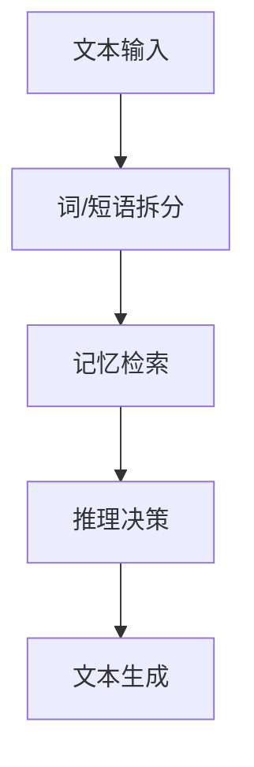
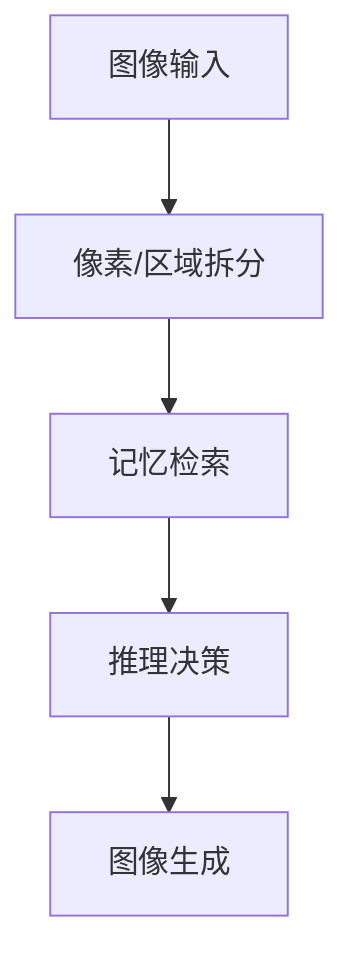
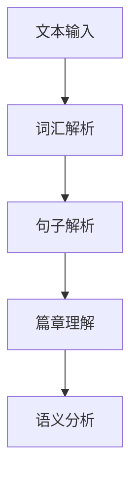

                 

### 文章标题

《利用思维链提高AI的推理和解释能力》

> 关键词：人工智能、思维链、推理、解释能力、算法、自然语言处理、计算机视觉

> 摘要：本文探讨了如何利用思维链提高人工智能的推理和解释能力。通过分析思维链的基本原理和核心算法，本文详细介绍了思维链在自然语言处理、计算机视觉等领域的应用，并探讨了思维链在AI解释能力中的作用。文章旨在为研究者提供一种新的思路，以推动人工智能技术的发展。

## 《利用思维链提高AI的推理和解释能力》目录大纲

### 第一部分：AI与思维链概述

#### 第1章：AI与思维链基础

##### 1.1 AI的发展历程与思维链的关系

###### 1.1.1 AI的发展历程回顾

###### 1.1.2 思维链的概念与原理

###### 1.1.3 思维链在AI中的应用前景

##### 1.2 思维链在AI推理中的优势

###### 1.2.1 传统AI推理的局限性

###### 1.2.2 思维链在推理中的优势

###### 1.2.3 思维链在AI解释能力中的应用

### 第二部分：思维链核心算法原理

#### 第2章：思维链算法概述

##### 2.1 思维链算法的基本结构

###### 2.1.1 思维链算法的核心组件

###### 2.1.2 思维链算法的工作流程

##### 2.2 思维链算法的关键技术

###### 2.2.1 思维链的构建与优化

###### 2.2.2 思维链的推理与解释机制

###### 2.2.3 思维链的扩展与应用

### 第三部分：思维链在AI推理中的应用

#### 第3章：思维链在自然语言处理中的应用

##### 3.1 思维链在自然语言处理中的作用

###### 3.1.1 自然语言处理的挑战与机遇

###### 3.1.2 思维链在文本理解中的应用

##### 3.2 思维链在问答系统中的实践

###### 3.2.1 问答系统的基本概念

###### 3.2.2 思维链在问答系统中的优势

###### 3.2.3 实际案例解析

#### 第4章：思维链在计算机视觉中的应用

##### 4.1 思维链在计算机视觉中的作用

###### 4.1.1 计算机视觉的挑战与机遇

###### 4.1.2 思维链在图像理解中的应用

##### 4.2 思维链在目标检测中的实践

###### 4.2.1 目标检测的基本概念

###### 4.2.2 思维链在目标检测中的优势

###### 4.2.3 实际案例解析

### 第四部分：思维链在AI解释能力中的应用

#### 第5章：AI解释能力的重要性

##### 5.1 AI解释能力的现状与挑战

###### 5.1.1 AI解释能力的重要性

###### 5.1.2 AI解释能力的现状

###### 5.1.3 AI解释能力的挑战

#### 第6章：思维链在AI解释能力中的应用

##### 6.1 思维链在AI解释能力中的作用

###### 6.1.1 思维链在解释能力中的应用

###### 6.1.2 思维链在解释能力中的优势

##### 6.2 思维链在医疗诊断中的应用

###### 6.2.1 医疗诊断中的挑战与机遇

###### 6.2.2 思维链在医疗诊断中的实践

###### 6.2.3 实际案例解析

#### 第7章：思维链在其他领域的应用

##### 7.1 思维链在其他领域的应用前景

###### 7.1.1 金融领域的应用

###### 7.1.2 教育领域的应用

###### 7.1.3 其他领域的探索

### 第五部分：思维链实践与展望

#### 第8章：思维链实践案例

##### 8.1 案例一：思维链在智能客服中的应用

###### 8.1.1 案例背景

###### 8.1.2 思维链在智能客服中的应用

###### 8.1.3 案例分析

##### 8.2 案例二：思维链在智能推荐系统中的应用

###### 8.2.1 案例背景

###### 8.2.2 思维链在智能推荐系统中的应用

###### 8.2.3 案例分析

#### 第9章：思维链的发展与未来

##### 9.1 思维链的发展趋势

###### 9.1.1 技术发展的挑战与机遇

###### 9.1.2 思维链的未来展望

##### 9.2 思维链在AI伦理与社会影响中的角色

###### 9.2.1 AI伦理的重要性

###### 9.2.2 思维链在AI伦理中的角色

###### 9.2.3 社会影响的展望

### 参考文献

## 附录

### 附录A：思维链算法实现

#### A.1 思维链算法伪代码

#### A.2 思维链算法实现细节

#### A.3 实现环境与工具介绍

---

**作者：AI天才研究院/AI Genius Institute & 禅与计算机程序设计艺术 /Zen And The Art of Computer Programming**

### 第一部分：AI与思维链概述

#### 第1章：AI与思维链基础

##### 1.1 AI的发展历程与思维链的关系

在探讨如何利用思维链提高人工智能（AI）的推理和解释能力之前，有必要回顾AI的发展历程，并理解思维链的概念及其在AI中的潜在应用。

###### 1.1.1 AI的发展历程回顾

人工智能作为一个领域，可以追溯到20世纪50年代。当时的科学家们首次提出了“人工智能”这一概念，希望能够创造能够执行人类智能任务的机器。AI的发展历程可以分为几个阶段：

1. **初期探索（1950-1969）**：这一阶段以图灵测试的提出为标志，目标是构建能够进行逻辑推理和决策的机器。

2. **人工智能的春天（1970-1989）**：得益于计算机硬件和软件的进步，AI领域出现了许多突破，包括专家系统和知识表示的研究。

3. **工业应用与调整（1990-2010）**：这一阶段，AI开始在工业领域得到应用，同时，机器学习作为AI的一个重要分支，逐渐成为研究的热点。

4. **深度学习的兴起（2010至今）**：随着计算能力的提升和数据量的爆炸性增长，深度学习取得了显著的成就，使得AI在图像识别、自然语言处理等领域取得了突破性的进展。

从这些发展阶段可以看出，AI的技术和理念在不断演进，从最初的逻辑推理和知识表示，到机器学习和深度学习，每一种技术都有其独特的优势和局限。

###### 1.1.2 思维链的概念与原理

思维链（Mind Chain）是一种模拟人类思维过程的算法结构，其核心思想是通过对人类思维过程的模拟，提高AI的推理和解释能力。思维链的基本原理包括：

1. **模块化**：思维链将人类思维过程分解为多个模块，每个模块负责特定的思维活动，如感知、记忆、推理等。

2. **动态链接**：模块之间通过动态链接实现信息的传递和协同工作，使得思维链能够灵活应对复杂的问题。

3. **自适应性**：思维链可以根据环境和问题的变化，自动调整模块间的链接和权重，以实现最优的推理和解释效果。

思维链的概念源于对人类思维过程的深入研究，其目标是构建一种能够模拟人类思维过程的算法结构，从而提高AI的智能水平。

###### 1.1.3 思维链在AI中的应用前景

思维链在AI中的应用前景非常广阔。首先，在自然语言处理（NLP）领域，思维链可以帮助AI更好地理解复杂的文本信息，提高问答系统的准确性和流畅性。其次，在计算机视觉领域，思维链可以增强图像理解和目标检测的能力，使得AI能够更好地应对复杂场景。此外，思维链在医疗诊断、金融分析等领域的应用也具有巨大的潜力。

总的来说，思维链为AI提供了一个新的思路，通过模拟人类思维过程，提高AI的推理和解释能力，为AI技术的发展带来了新的可能性。

---

##### 1.2 思维链在AI推理中的优势

虽然现有的AI技术，如深度学习和机器学习，已经在许多领域取得了显著的成就，但它们在推理和解释能力方面仍然存在一定的局限性。思维链作为一种新型的算法结构，具备以下优势，能够弥补这些不足。

###### 1.2.1 传统AI推理的局限性

1. **数据依赖性**：深度学习和机器学习模型通常依赖于大量的数据来训练，从而提高模型的性能。然而，当面对新问题和未知数据时，这些模型的推理能力会显著下降。

2. **缺乏解释性**：深度学习模型，尤其是黑箱模型，往往无法提供清晰的推理过程和解释。这使得用户难以理解模型的决策过程，从而限制了AI在实际应用中的推广。

3. **无法处理复杂逻辑**：传统AI技术往往在处理复杂逻辑和多层次推理时表现出不足，难以应对复杂的问题场景。

###### 1.2.2 思维链在推理中的优势

1. **数据独立性**：思维链通过模拟人类思维过程，实现了对数据的自动处理和推理。它可以在数据稀缺的情况下，仍然保持较强的推理能力。

2. **解释性**：思维链的结构设计使得每个模块都具备明确的任务和职责，从而使得整个推理过程具有高度的透明性和解释性。用户可以清晰地了解每个模块的工作原理和决策依据。

3. **复杂逻辑处理**：思维链通过模块化设计和动态链接，能够处理复杂的多层次逻辑推理。它可以在不同模块之间传递信息和协调工作，从而实现复杂的决策过程。

###### 1.2.3 思维链在AI解释能力中的应用

除了在推理方面的优势外，思维链在AI解释能力中的应用也具有重要意义。通过思维链的结构设计，AI可以更加清晰地解释其决策过程，从而增强用户的信任度和接受度。这种解释能力不仅适用于学术研究，也在实际应用中具有重要价值。

例如，在医疗诊断领域，思维链可以帮助医生理解AI的诊断过程，从而提高医疗决策的准确性和可信度。在金融分析领域，思维链可以帮助投资者理解AI的决策逻辑，从而做出更加明智的投资决策。

总的来说，思维链在AI推理和解释能力方面的优势，使得它成为一个极具潜力的研究方向。通过进一步的研究和应用，思维链有望在AI技术中发挥重要作用，推动AI技术的发展。

### 第二部分：思维链核心算法原理

#### 第2章：思维链算法概述

思维链算法作为一种模拟人类思维过程的算法结构，其核心在于模块化设计和动态链接。本章将详细介绍思维链算法的基本结构、核心组件及其工作流程。

##### 2.1 思维链算法的基本结构

思维链算法的基本结构可以分为以下几个关键组件：

1. **感知模块**：负责接收外部输入，如文本、图像、声音等，并将其转换为内部表示。这一模块类似于人类的大脑皮层，是思维链获取外部信息的主要渠道。

2. **记忆模块**：负责存储和检索感知模块接收到的信息。记忆模块可以分为短期记忆和长期记忆，短期记忆用于暂存信息，长期记忆用于存储重要信息。

3. **推理模块**：负责根据感知模块和记忆模块的信息进行推理和决策。这一模块类似于人类的逻辑思维过程，通过分析输入信息和已有知识，得出结论或解决方案。

4. **输出模块**：负责将推理模块的结果输出，如文本、图像、声音等。这一模块类似于人类的语言表达和行动能力。

5. **链接模块**：负责在不同模块之间传递信息和协调工作。链接模块通过动态链接机制，使得各个模块能够灵活地协同工作，实现复杂的推理和决策过程。

##### 2.1.1 思维链算法的核心组件

1. **感知模块**：

   感知模块是思维链算法的输入端，负责接收外部信息。具体实现上，感知模块可以采用不同的传感器，如摄像头、麦克风等，以获取文本、图像、声音等多种形式的信息。

   ```mermaid
   graph TD
   A[感知模块] --> B[文本传感器]
   A --> C[图像传感器]
   A --> D[声音传感器]
   ```

2. **记忆模块**：

   记忆模块分为短期记忆和长期记忆。短期记忆用于暂存信息，如正在阅读的文本或正在观看的图像。长期记忆则用于存储重要信息，如学习到的知识或经验。

   ```mermaid
   graph TD
   E[短期记忆] --> F[长期记忆]
   ```

3. **推理模块**：

   推理模块是思维链算法的核心，负责根据感知模块和记忆模块的信息进行推理和决策。推理过程可以采用不同的算法，如逻辑推理、概率推理等。

   ```mermaid
   graph TD
   G[感知模块] --> H[记忆模块]
   H --> I[推理模块]
   ```

4. **输出模块**：

   输出模块负责将推理模块的结果输出。具体实现上，输出模块可以采用文本生成、图像渲染、声音合成等方式，将推理结果呈现给用户。

   ```mermaid
   graph TD
   I --> J[文本生成]
   I --> K[图像渲染]
   I --> L[声音合成]
   ```

5. **链接模块**：

   链接模块负责在不同模块之间传递信息和协调工作。链接模块采用动态链接机制，使得各个模块能够灵活地协同工作，实现复杂的推理和决策过程。

   ```mermaid
   graph TD
   A --> B
   B --> C
   C --> D
   D --> E
   E --> F
   ```

##### 2.1.2 思维链算法的工作流程

思维链算法的工作流程可以分为以下几个步骤：

1. **感知**：感知模块接收外部信息，如文本、图像、声音等。

2. **记忆**：记忆模块存储感知模块接收到的信息，分为短期记忆和长期记忆。

3. **推理**：推理模块根据感知模块和记忆模块的信息进行推理和决策。

4. **输出**：输出模块将推理模块的结果输出，如文本、图像、声音等。

5. **反馈**：用户对输出结果进行反馈，信息可以返回到感知模块、记忆模块和推理模块，以优化整个思维链的工作流程。

   ```mermaid
   graph TD
   A[感知] --> B[记忆]
   B --> C[推理]
   C --> D[输出]
   D --> E[反馈]
   E --> A
   ```

通过上述核心组件和流程，思维链算法实现了对人类思维过程的模拟，从而提高了AI的推理和解释能力。

---

##### 2.2 思维链算法的关键技术

思维链算法作为一种模拟人类思维过程的算法结构，其核心在于如何构建和优化思维链，以及如何实现推理和解释机制。以下将详细探讨这些关键技术。

###### 2.2.1 思维链的构建与优化

1. **构建过程**：

   思维链的构建过程可以分为以下几个步骤：

   - **模块定义**：根据具体应用场景，定义所需的感知模块、记忆模块、推理模块和输出模块。

   - **模块连接**：通过链接模块将各个模块连接起来，形成完整的思维链结构。

   - **参数设置**：为每个模块设置相应的参数，如学习率、激活函数等，以优化模块的性能。

   - **初始化**：初始化思维链的权重和状态，为后续的推理和解释过程做准备。

2. **优化策略**：

   - **模块优化**：通过调整模块内部的参数，如激活函数、权重等，优化模块的性能。

   - **链路优化**：通过优化模块之间的链接机制，提高整个思维链的协同工作效果。

   - **动态调整**：根据应用场景的变化，动态调整思维链的结构和参数，以适应不同的推理需求。

   ```mermaid
   graph TD
   A[模块定义] --> B[模块连接]
   B --> C[参数设置]
   C --> D[初始化]
   D --> E[模块优化]
   E --> F[链路优化]
   F --> G[动态调整]
   ```

###### 2.2.2 思维链的推理与解释机制

1. **推理过程**：

   思维链的推理过程可以分为以下几个步骤：

   - **感知输入**：感知模块接收外部输入信息。

   - **信息处理**：记忆模块对感知输入进行处理和存储。

   - **推理决策**：推理模块根据感知模块和记忆模块的信息进行推理和决策。

   - **输出结果**：输出模块将推理结果以文本、图像、声音等形式输出。

2. **解释机制**：

   - **模块解释**：每个模块的工作原理和决策过程都可以进行解释，用户可以理解每个模块的作用和贡献。

   - **推理路径解释**：思维链可以提供详细的推理路径，用户可以清晰地了解推理过程中的每一步。

   - **解释性优化**：通过优化思维链的模块设计和连接机制，提高推理过程的解释性。

   ```mermaid
   graph TD
   A[感知输入] --> B[信息处理]
   B --> C[推理决策]
   C --> D[输出结果]
   D --> E[模块解释]
   E --> F[推理路径解释]
   ```

通过构建和优化思维链，以及实现推理和解释机制，思维链算法能够模拟人类思维过程，从而提高AI的推理和解释能力。这些关键技术为思维链算法的实际应用提供了坚实的基础。

---

##### 2.2.3 思维链的扩展与应用

思维链算法作为一种模拟人类思维过程的算法结构，其应用领域非常广泛。以下将探讨思维链在自然语言处理（NLP）和计算机视觉（CV）等领域的扩展与应用。

###### 2.2.3.1 自然语言处理中的应用

在自然语言处理领域，思维链算法可以显著提高文本理解和推理能力。具体应用包括：

1. **文本分类**：

   思维链可以将文本拆分为词或短语，然后通过记忆模块存储和检索相关信息。在推理模块中，思维链可以结合上下文信息，对文本进行分类。例如，在情感分析任务中，思维链可以识别文本中的情感词汇，并综合考虑上下文，得出文本的情感极性。

2. **问答系统**：

   思维链可以构建一个多层次的问答系统，通过记忆模块存储大量的知识库信息，并在推理模块中进行推理和决策。用户提问时，思维链可以快速检索相关知识点，并生成详细的回答。这种问答系统不仅可以处理简单的查询，还可以应对复杂的逻辑推理问题。

3. **文本生成**：

   思维链可以利用记忆模块中的信息，生成新的文本内容。例如，在创作文章或生成对话时，思维链可以根据已有的文本信息，生成符合逻辑和语义的新的段落或句子。



###### 2.2.3.2 计算机视觉中的应用

在计算机视觉领域，思维链算法可以增强图像理解和目标检测能力。具体应用包括：

1. **图像分类**：

   思维链可以将图像拆分为像素或区域，并在记忆模块中存储和检索相关信息。在推理模块中，思维链可以结合图像的特征和上下文信息，进行图像分类。例如，在识别图片中的物体时，思维链可以识别物体的边缘、纹理和颜色特征，并综合考虑上下文信息，得出分类结果。

2. **目标检测**：

   思维链可以构建一个多层次的目标检测系统，通过记忆模块存储和检索目标特征。在推理模块中，思维链可以结合图像的特征和目标特征，进行目标检测。例如，在识别图片中的多个目标时，思维链可以识别目标的边界、形状和位置特征，并综合考虑上下文信息，得出目标检测结果。

3. **图像生成**：

   思维链可以利用记忆模块中的图像信息，生成新的图像内容。例如，在图像修复或合成任务中，思维链可以根据已有的图像信息，生成符合逻辑和视觉效果的新的图像。



通过在自然语言处理和计算机视觉等领域的扩展与应用，思维链算法展现了其在提高AI推理和解释能力方面的巨大潜力。这些应用不仅提升了AI的技术水平，也为AI在各个领域的实际应用提供了新的思路和解决方案。

### 第三部分：思维链在AI推理中的应用

#### 第3章：思维链在自然语言处理中的应用

自然语言处理（NLP）是人工智能（AI）的一个重要分支，旨在让计算机理解和处理人类语言。思维链算法作为一种模拟人类思维过程的算法结构，在NLP领域中具有独特的优势。本章将详细介绍思维链在自然语言处理中的应用，包括文本理解和问答系统。

##### 3.1 思维链在自然语言处理中的作用

自然语言处理领域面临着多种挑战，包括文本理解的复杂性、语言的多义性以及上下文的重要性。思维链算法通过模拟人类思维过程，能够有效地应对这些挑战。

###### 3.1.1 自然语言处理的挑战与机遇

1. **文本理解的复杂性**：

   文本理解是NLP的核心任务之一，它涉及到对文本中的词汇、句子和段落进行深度分析。传统的NLP方法，如基于规则的方法和统计方法，往往难以处理复杂的文本结构。思维链算法通过模块化设计和动态链接，能够更好地处理复杂的文本信息。

2. **语言的多义性**：

   语言具有多义性，同一个词汇或短语在不同的上下文中可能有不同的含义。传统的NLP方法通常依赖于上下文信息来消除歧义，但效果往往有限。思维链算法通过模拟人类思维过程，能够更好地理解语言的多义性，并生成准确的语义解释。

3. **上下文的重要性**：

   上下文在文本理解中起着至关重要的作用。思维链算法通过记忆模块存储大量的上下文信息，使得AI能够更好地理解上下文，从而提高文本理解的准确性。

4. **机遇**：

   随着深度学习和自然语言处理技术的不断发展，NLP领域迎来了新的机遇。思维链算法作为一种新的算法结构，有望与现有技术相结合，进一步提高文本理解和推理能力。

###### 3.1.2 思维链在文本理解中的应用

思维链算法在文本理解中的应用主要体现在以下几个方面：

1. **词汇解析**：

   思维链算法可以将文本拆分为词汇或短语，并利用记忆模块存储和检索相关的词汇信息。通过分析词汇的上下文，思维链算法能够准确地理解词汇的含义。

2. **句子解析**：

   思维链算法可以对句子进行深度分析，识别句子中的主语、谓语、宾语等成分，并理解句子之间的逻辑关系。这种句子解析能力使得思维链算法能够处理复杂的文本结构。

3. **篇章理解**：

   思维链算法通过记忆模块存储和检索大量的篇章信息，能够理解篇章的整体结构和主题。这种篇章理解能力使得思维链算法能够处理长文本，并生成准确的语义解释。

4. **语义分析**：

   思维链算法通过分析词汇、句子和篇章的语义信息，能够生成准确的语义解释。这种语义分析能力使得思维链算法能够应对语言的多义性，并生成符合上下文的解释。



通过在文本理解中的应用，思维链算法展现了其在NLP领域的强大潜力。它不仅能够提高文本理解的准确性，还能够处理复杂的语言结构和多义性问题，为NLP技术的发展提供了新的思路和解决方案。

---

##### 3.2 思维链在问答系统中的实践

问答系统是自然语言处理的一个重要应用领域，旨在让计算机能够回答用户的问题。思维链算法作为一种模拟人类思维过程的算法结构，在问答系统中具有独特的优势。本章将详细介绍思维链在问答系统中的应用，包括基本概念、优势以及实际案例。

###### 3.2.1 问答系统的基本概念

问答系统可以分为两类：基于规则的和基于机器学习的。

1. **基于规则的方法**：

   基于规则的方法通过定义一系列规则来回答用户的问题。这种方法通常适用于结构化数据，如数据库查询。然而，对于非结构化数据，如自然语言文本，基于规则的方法往往效果不佳。

2. **基于机器学习的方法**：

   基于机器学习的方法通过训练模型来回答用户的问题。这种方法通常利用大量的标注数据来训练模型，从而提高模型的准确性。常见的机器学习方法包括深度学习、统计学习方法等。

虽然基于机器学习的方法在问答系统中取得了显著的成就，但它们在推理和解释能力方面仍然存在一定的局限性。思维链算法通过模拟人类思维过程，能够有效地弥补这些不足。

###### 3.2.2 思维链在问答系统中的优势

1. **数据独立性**：

   思维链算法不需要大量的标注数据来训练模型。它可以通过感知模块接收外部输入，并利用记忆模块存储和检索相关信息。这意味着思维链算法可以在数据稀缺的情况下，仍然保持较强的推理能力。

2. **解释性**：

   思维链算法的结构设计使得每个模块都具备明确的任务和职责，从而使得整个推理过程具有高度的透明性和解释性。用户可以清晰地了解每个模块的工作原理和决策依据，从而增强用户对问答系统的信任度。

3. **复杂逻辑处理**：

   思维链算法通过模块化设计和动态链接，能够处理复杂的多层次逻辑推理。这使得思维链算法能够应对复杂的问答场景，并生成准确的回答。

4. **自适应能力**：

   思维链算法可以根据环境和问题的变化，自动调整模块间的链接和权重，以实现最优的推理和解释效果。这种自适应能力使得思维链算法能够适应不同的问答场景。

###### 3.2.3 实际案例解析

以下是一个实际案例，展示了思维链算法在问答系统中的应用：

假设用户提问：“北京是中国的哪个省份？”

1. **感知输入**：

   思维链算法的感知模块接收用户的问题，并将其转换为内部表示。

2. **信息处理**：

   思维链算法的推理模块根据记忆模块中的知识库，对用户的问题进行推理。例如，思维链算法可以识别问题中的关键词“北京”和“省份”，并从知识库中查找相关信息。

3. **推理决策**：

   思维链算法结合记忆模块中的信息，生成回答。例如，思维链算法可以识别北京是中国的首都，并推断出北京是中国的某个省份。

4. **输出结果**：

   思维链算法的输出模块将生成的回答输出给用户。例如，思维链算法可以回答：“北京是中国的北京市。”

通过上述实际案例，可以看出思维链算法在问答系统中的应用，不仅能够生成准确的回答，还能够提供详细的推理过程和解释。这种能力使得思维链算法在问答系统中具有巨大的潜力。

总的来说，思维链算法在问答系统中的应用，通过其数据独立性、解释性、复杂逻辑处理和自适应能力，显著提高了问答系统的性能和用户体验。随着思维链算法的不断发展和优化，它有望在问答系统中发挥更加重要的作用。

---

#### 第4章：思维链在计算机视觉中的应用

计算机视觉是人工智能的一个重要分支，旨在让计算机能够“看到”和理解图像和视频。思维链算法作为一种模拟人类思维过程的算法结构，在计算机视觉领域具有独特的优势。本章将详细介绍思维链在计算机视觉中的应用，包括图像理解和目标检测。

##### 4.1 思维链在计算机视觉中的作用

计算机视觉领域面临着多种挑战，包括图像理解的复杂性、目标的多样性和环境的动态性。思维链算法通过模拟人类思维过程，能够有效地应对这些挑战。

###### 4.1.1 计算机视觉的挑战与机遇

1. **图像理解的复杂性**：

   图像理解是计算机视觉的核心任务之一，它涉及到对图像中的对象、场景和行为的识别和理解。传统的计算机视觉方法，如基于特征的方法和深度学习方法，往往难以处理复杂的图像结构和语义信息。思维链算法通过模块化设计和动态链接，能够更好地处理复杂的图像信息。

2. **目标的多样性**：

   实际场景中的目标种类繁多，大小、形状、颜色等特征各异。传统的计算机视觉方法往往依赖于特定的特征提取和分类器，难以应对目标的多样性。思维链算法通过记忆模块存储和检索大量的目标特征，能够处理各种不同的目标。

3. **环境的动态性**：

   环境的动态变化给计算机视觉带来了新的挑战。例如，光照变化、视角变化和遮挡等因素都会影响图像的理解。思维链算法通过自适应调整模块间的链接和权重，能够适应环境的动态变化，从而提高图像理解和目标检测的鲁棒性。

4. **机遇**：

   随着深度学习和计算机视觉技术的不断发展，计算机视觉领域迎来了新的机遇。思维链算法作为一种新的算法结构，有望与现有技术相结合，进一步提高图像理解和目标检测的能力。

###### 4.1.2 思维链在图像理解中的应用

思维链算法在图像理解中的应用主要体现在以下几个方面：

1. **图像分类**：

   思维链算法可以将图像拆分为像素或区域，并利用记忆模块存储和检索相关的图像信息。通过分析图像的特征和上下文信息，思维链算法能够对图像进行分类。例如，在识别图片中的物体时，思维链算法可以识别物体的边缘、纹理和颜色特征，并综合考虑上下文信息，得出分类结果。

2. **目标检测**：

   思维链算法可以构建一个多层次的目标检测系统，通过记忆模块存储和检索目标特征。在推理模块中，思维链算法可以结合图像的特征和目标特征，进行目标检测。例如，在识别图片中的多个目标时，思维链算法可以识别目标的边界、形状和位置特征，并综合考虑上下文信息，得出目标检测结果。

3. **图像生成**：

   思维链算法可以利用记忆模块中的图像信息，生成新的图像内容。例如，在图像修复或合成任务中，思维链算法可以根据已有的图像信息，生成符合逻辑和视觉效果的新的图像。


通过在图像理解中的应用，思维链算法展现了其在计算机视觉领域的强大潜力。它不仅能够提高图像理解的准确性，还能够处理复杂的图像结构和目标多样性，为计算机视觉技术的发展提供了新的思路和解决方案。

---

##### 4.2 思维链在目标检测中的实践

目标检测是计算机视觉中的一个重要任务，旨在从图像或视频中识别并定位感兴趣的目标。思维链算法作为一种模拟人类思维过程的算法结构，在目标检测中具有独特的优势。本章将详细介绍思维链在目标检测中的应用，包括基本概念、优势以及实际案例。

###### 4.2.1 目标检测的基本概念

目标检测可以分为两类：基于传统方法和基于深度学习方法。

1. **基于传统方法**：

   传统目标检测方法通常基于图像处理和计算机视觉的基本原理，如边缘检测、特征提取和模板匹配等。这种方法需要手工设计特征提取器和分类器，对不同的目标进行检测。虽然传统方法在一些简单场景中表现出色，但在复杂环境中效果不佳。

2. **基于深度学习方法**：

   深度学习目标检测方法通过训练深度神经网络，自动提取图像特征并进行分类和定位。常见的深度学习目标检测算法包括基于区域提议的方法（如R-CNN、Faster R-CNN）和基于特征金字塔的方法（如SSD、YOLO）。深度学习方法在目标检测中取得了显著的进展，但仍然面临一些挑战，如小目标检测、多目标检测和实时检测等。

思维链算法结合了传统方法和深度学习方法的优点，通过模拟人类思维过程，提高了目标检测的准确性和鲁棒性。

###### 4.2.2 思维链在目标检测中的优势

1. **数据独立性**：

   思维链算法不需要大量的标注数据来训练模型。它可以通过感知模块接收外部输入，并利用记忆模块存储和检索相关信息。这意味着思维链算法可以在数据稀缺的情况下，仍然保持较强的目标检测能力。

2. **解释性**：

   思维链算法的结构设计使得每个模块都具备明确的任务和职责，从而使得整个目标检测过程具有高度的透明性和解释性。用户可以清晰地了解每个模块的工作原理和决策依据，从而增强用户对目标检测系统的信任度。

3. **复杂目标检测**：

   思维链算法通过模块化设计和动态链接，能够处理复杂的多层次目标检测任务。它不仅可以检测单个目标，还可以检测多个目标，并识别目标之间的相互关系。

4. **自适应能力**：

   思维链算法可以根据环境和问题的变化，自动调整模块间的链接和权重，以实现最优的目标检测效果。这种自适应能力使得思维链算法能够适应不同的目标检测场景，并提高检测的鲁棒性。

###### 4.2.3 实际案例解析

以下是一个实际案例，展示了思维链算法在目标检测中的应用：

假设我们需要从一张图片中检测出多个物体，包括汽车、人和树木。

1. **感知输入**：

   思维链算法的感知模块接收图像输入，并将其转换为内部表示。

2. **图像特征提取**：

   思维链算法的图像特征提取模块对图像进行特征提取，生成图像的特征向量。

3. **目标特征检索**：

   思维链算法的内存模块存储和检索与目标相关的特征，如汽车的特征、人的特征和树木的特征。

4. **目标检测与定位**：

   思维链算法的目标检测模块结合图像特征和目标特征，进行目标检测和定位。例如，思维链算法可以识别出图像中的汽车、人和树木，并生成相应的边界框。

5. **结果输出**：

   思维链算法的输出模块将检测结果输出，如检测到的物体及其位置。

通过上述实际案例，可以看出思维链算法在目标检测中的应用，不仅能够生成准确的检测结果，还能够提供详细的检测过程和解释。这种能力使得思维链算法在目标检测领域具有巨大的潜力。

总的来说，思维链算法在目标检测中的应用，通过其数据独立性、解释性、复杂目标检测和自适应能力，显著提高了目标检测的准确性和鲁棒性。随着思维链算法的不断发展和优化，它有望在目标检测中发挥更加重要的作用。

### 第四部分：思维链在AI解释能力中的应用

#### 第5章：AI解释能力的重要性

随着人工智能（AI）技术的快速发展，AI在各个领域的应用越来越广泛。然而，AI的决策过程往往被视为“黑箱”，这使得用户难以理解AI的决策依据和结果。因此，提高AI的解释能力成为了一个重要且紧迫的课题。本章将探讨AI解释能力的重要性、现状以及面临的挑战。

##### 5.1 AI解释能力的现状与挑战

1. **重要性**：

   AI解释能力的重要性主要体现在以下几个方面：

   - **信任度**：用户对AI系统的信任度与AI的解释能力密切相关。如果用户无法理解AI的决策过程和结果，他们可能会对AI系统产生不信任，从而限制AI的应用。

   - **可接受性**：在医疗、金融等关键领域，AI的决策结果往往直接影响用户的利益。提高AI的解释能力，可以帮助用户接受AI的决策，从而提高AI的应用价值。

   - **合规性**：在某些行业，如金融和医疗，AI系统的应用需要遵守严格的法律法规。提高AI的解释能力，可以帮助企业满足合规要求，降低法律风险。

2. **现状**：

   目前，AI解释能力的研究主要集中在以下几个方面：

   - **模型可解释性**：通过分析AI模型的内部结构和工作机制，提供模型的可解释性。例如，通过可视化技术展示神经网络中的特征映射，帮助用户理解模型的决策过程。

   - **解释算法**：开发新的算法，如LIME、SHAP等，用于解释AI模型的决策结果。这些算法通过分析局部特征和权重，为用户提供了更详细的解释。

   - **透明性**：提高AI系统的透明度，使得用户能够访问和审查AI的决策过程和结果。

3. **挑战**：

   虽然AI解释能力的研究取得了一定的进展，但仍然面临以下挑战：

   - **复杂性**：AI模型的结构通常非常复杂，难以直观地理解和解释。例如，深度学习模型包含多层神经元和复杂的连接方式，使得解释过程变得复杂。

   - **多样性和不确定性**：AI模型可能会面对多样化的输入和不确定性，使得解释过程更加困难。例如，在医疗诊断中，患者的病情可能受到多种因素的影响，导致AI模型的预测结果不确定。

   - **计算成本**：解释AI模型的过程通常需要大量的计算资源。在一些实时应用中，如自动驾驶和智能监控，解释过程的计算成本可能会影响系统的性能和响应速度。

##### 5.1.1 AI解释能力的重要性

AI解释能力的重要性在于它不仅能够提高用户对AI系统的信任度，还能够促进AI技术的可持续发展。以下是AI解释能力重要性的具体体现：

1. **增强用户信任**：

   用户对AI系统的信任是AI技术普及和广泛应用的基础。如果用户无法理解AI的决策过程和结果，他们可能会对AI系统产生不信任，从而限制AI的应用。例如，在金融领域，用户可能无法接受由AI系统做出的投资决策，因为用户不信任AI的决策依据。通过提高AI的解释能力，用户可以更好地理解AI的决策过程，从而增强对AI系统的信任。

2. **促进AI技术的可持续发展**：

   AI技术的可持续发展需要不断优化和改进。如果AI系统的决策过程和结果无法被理解和解释，研究人员将难以找到优化和改进的方向。通过提高AI的解释能力，研究人员可以更好地理解AI系统的性能和局限性，从而推动AI技术的持续发展和改进。

3. **提高合规性**：

   在某些行业，如金融、医疗和法律，AI系统的应用需要遵守严格的法律法规。这些法规通常要求AI系统的决策过程和结果具有透明性和可解释性。通过提高AI的解释能力，企业可以更好地满足合规要求，降低法律风险。

4. **支持创新和应用**：

   AI解释能力不仅可以提高用户对AI系统的信任度，还可以激发新的创新和应用。例如，在医疗领域，医生可以通过理解AI的诊断过程，更好地利用AI技术辅助诊断和治疗。在法律领域，律师可以通过理解AI的决策过程，更好地利用AI技术进行证据分析和法律咨询。

总之，AI解释能力的重要性不仅体现在提高用户对AI系统的信任度，还体现在推动AI技术的可持续发展、提高合规性和支持创新和应用等方面。通过不断提高AI的解释能力，我们可以更好地发挥AI技术的潜力，为社会带来更多的价值和福祉。

---

#### 第6章：思维链在AI解释能力中的应用

思维链算法作为一种模拟人类思维过程的算法结构，在AI解释能力方面具有独特的优势。本章将详细探讨思维链在AI解释能力中的应用，包括其作用和优势。

##### 6.1 思维链在AI解释能力中的作用

思维链算法在AI解释能力中的作用主要体现在以下几个方面：

1. **模块化设计**：

   思维链算法通过模块化设计，将AI的决策过程分解为多个模块，每个模块负责特定的任务。这种设计使得AI的决策过程更加透明和可解释。用户可以清晰地看到每个模块的作用和贡献，从而更好地理解AI的决策过程。

2. **信息传递与协同工作**：

   思维链算法通过信息传递和协同工作，使得不同模块之间的信息能够有效地传递和共享。这种机制使得AI能够综合考虑多个因素，生成更加合理和可信的决策结果。用户可以通过分析模块之间的链接和交互，了解AI的决策依据。

3. **动态调整**：

   思维链算法可以根据环境和问题的变化，动态调整模块的链接和权重，以实现最优的决策效果。这种动态调整能力使得AI能够适应不同的场景和需求，从而提高决策的灵活性和可解释性。

##### 6.1.1 思维链在解释能力中的应用

思维链算法在AI解释能力中的应用主要体现在以下几个方面：

1. **决策过程可视化**：

   思维链算法可以将复杂的决策过程可视化，使用户能够直观地理解AI的决策过程。例如，通过图形化的表示，用户可以清楚地看到每个模块的作用和决策路径，从而更好地理解AI的决策依据。

2. **决策路径分析**：

   思维链算法可以提供详细的决策路径分析，使用户能够了解AI在不同模块和步骤中的决策依据。这种分析有助于用户识别AI决策中的关键因素和潜在问题，从而提高对AI系统的理解和信任。

3. **解释性优化**：

   思维链算法可以通过优化模块设计和链接机制，提高AI的解释能力。例如，通过引入更多的解释性模块，或者调整模块之间的链接权重，可以使AI的决策过程更加透明和可解释。

4. **案例解析**：

   思维链算法可以应用于具体的AI应用场景，如医疗诊断、金融分析等，提供详细的解释和案例分析。通过这些案例，用户可以了解AI在实际应用中的决策过程和解释能力，从而更好地理解和信任AI系统。

总的来说，思维链算法在AI解释能力中的应用，通过模块化设计、信息传递与协同工作、动态调整以及可视化分析等机制，显著提高了AI的解释能力。这种能力不仅有助于提高用户对AI系统的信任度，也为AI技术的可持续发展提供了支持。

---

##### 6.2 思维链在AI解释能力中的优势

思维链算法在AI解释能力方面具有显著的优势，这些优势主要体现在以下几个方面：

1. **高度透明性**：

   思维链算法通过模块化设计，将AI的决策过程分解为多个模块，每个模块都有明确的任务和职责。这种设计使得AI的决策过程高度透明，用户可以清晰地看到每个模块的作用和贡献，从而更好地理解AI的决策依据。

2. **详细的决策路径分析**：

   思维链算法可以提供详细的决策路径分析，使用户能够了解AI在不同模块和步骤中的决策依据。通过分析决策路径，用户可以识别AI决策中的关键因素和潜在问题，从而提高对AI系统的理解和信任。

3. **灵活的动态调整**：

   思维链算法可以根据环境和问题的变化，动态调整模块的链接和权重，以实现最优的决策效果。这种动态调整能力使得AI能够适应不同的场景和需求，从而提高决策的灵活性和可解释性。

4. **可视化解释**：

   思维链算法可以将复杂的决策过程可视化，使用户能够直观地理解AI的决策过程。通过图形化的表示，用户可以清晰地看到每个模块的作用和决策路径，从而更好地理解AI的决策依据。

5. **解释性优化**：

   思维链算法可以通过优化模块设计和链接机制，提高AI的解释能力。例如，通过引入更多的解释性模块，或者调整模块之间的链接权重，可以使AI的决策过程更加透明和可解释。

总的来说，思维链算法在AI解释能力中的优势，不仅提高了AI的透明性和可解释性，还为AI技术的可持续发展提供了支持。这些优势使得思维链算法成为一个极具潜力的研究方向，有望在未来的AI技术中发挥重要作用。

---

#### 第7章：思维链在其他领域的应用

思维链算法作为一种模拟人类思维过程的算法结构，不仅在自然语言处理、计算机视觉等领域展现出强大的能力，还在其他领域具有广泛的应用前景。本章将探讨思维链在金融、教育和其他领域的应用，并分析其潜在价值。

##### 7.1 思维链在其他领域的应用前景

1. **金融领域**：

   金融领域是一个复杂且高风险的行业，需要高效且准确的决策支持系统。思维链算法可以通过模拟金融市场的复杂关系，提高金融分析模型的解释能力和准确性。具体应用包括：

   - **风险预测**：思维链算法可以分析市场数据，预测金融市场风险，并提供详细的推理过程和解释，帮助金融机构更好地管理风险。

   - **投资决策**：思维链算法可以结合市场数据和用户需求，生成个性化的投资策略，并提供详细的决策依据，提高投资决策的准确性和可靠性。

2. **教育领域**：

   教育领域正面临着个性化教育和智能教学的需求。思维链算法可以通过模拟学生的思维过程，提供个性化的学习支持和教学指导。具体应用包括：

   - **智能辅导**：思维链算法可以分析学生的学习行为和成绩，提供针对性的学习建议和辅导，帮助学生更好地掌握知识点。

   - **智能评估**：思维链算法可以结合学生的作业和考试成绩，生成详细的评估报告，帮助教师了解学生的学习状况和进步情况。

3. **其他领域**：

   思维链算法在其他领域的应用也在不断扩展，包括但不限于：

   - **医疗诊断**：通过模拟医生的诊断过程，思维链算法可以辅助医生进行疾病诊断，并提供详细的推理过程和解释。

   - **智能制造**：思维链算法可以优化生产过程，提高生产效率和质量，实现智能制造。

   - **智能交通**：思维链算法可以优化交通流管理，提高交通系统的运行效率，减少拥堵和事故。

##### 7.1.1 金融领域的应用

在金融领域，思维链算法的应用具有显著的价值。以下是一些具体的应用场景：

1. **市场分析**：

   思维链算法可以通过分析大量的市场数据，包括股票价格、交易量、经济指标等，预测市场趋势和风险。例如，通过感知模块接收实时市场数据，思维链算法可以识别市场中的关键因素，并在记忆模块中存储和检索相关的历史数据。在推理模块中，思维链算法可以结合这些数据，进行市场趋势分析和风险评估，并提供详细的推理过程和解释。

2. **投资策略**：

   思维链算法可以根据用户的风险偏好和投资目标，生成个性化的投资策略。例如，用户可以提出投资需求，如高风险高回报的股票投资或稳定收益的债券投资。思维链算法的感知模块可以接收这些需求，并在记忆模块中检索相关的市场数据和历史投资记录。在推理模块中，思维链算法可以结合这些信息，生成最佳的投资策略，并提供详细的决策依据。

3. **风险管理**：

   思维链算法可以帮助金融机构进行风险管理，降低潜在的风险损失。例如，通过感知模块接收金融机构的资产组合数据，思维链算法可以在记忆模块中检索相关的风险指标和历史数据。在推理模块中，思维链算法可以分析资产组合的风险水平，并提供详细的推理过程和解释，帮助金融机构做出更明智的风险管理决策。

总的来说，思维链算法在金融领域的应用，通过其模块化设计、信息传递和动态调整机制，显著提高了金融分析模型的解释能力和准确性。这些应用不仅有助于提高金融机构的决策水平，还为投资者提供了更加可靠和透明的投资建议。

---

##### 7.1.2 教育领域的应用

在教育领域，思维链算法的应用具有巨大的潜力，可以为个性化教育和智能教学提供有力支持。以下是一些具体的应用场景：

1. **个性化学习**：

   思维链算法可以通过分析学生的学习行为和成绩数据，提供个性化的学习支持和辅导。例如，学生可以通过思维链算法的感知模块输入学习需求，如掌握特定知识点或提高某一学科的技能。思维链算法在记忆模块中检索相关的学习资源和历史数据，结合学生的学习行为和成绩，生成个性化的学习计划。在推理模块中，思维链算法可以提供针对性的学习建议和辅导，帮助学生更好地掌握知识点。

2. **智能评估**：

   思维链算法可以结合学生的作业和考试成绩，生成详细的评估报告，帮助教师了解学生的学习状况和进步情况。例如，教师可以通过思维链算法的感知模块输入学生的作业和考试成绩，思维链算法在记忆模块中检索相关的教学目标和评估标准。在推理模块中，思维链算法可以分析学生的学习成果，并提供详细的评估报告，帮助教师发现学生的学习问题，调整教学策略。

3. **智能教学**：

   思维链算法可以辅助教师进行智能教学，提供个性化的教学指导和资源推荐。例如，教师可以通过思维链算法的感知模块输入课程内容和教学目标，思维链算法在记忆模块中检索相关的教学资源和教学方法。在推理模块中，思维链算法可以结合学生的学习状况和教学目标，推荐合适的教学方法和资源，提高教学效果。

总的来说，思维链算法在教育领域的应用，通过其模块化设计、信息传递和动态调整机制，可以显著提高个性化教育和智能教学的效果。这些应用不仅有助于提高学生的学习效果，也为教师提供了更加便捷和高效的教学工具。

---

##### 7.1.3 其他领域的探索

思维链算法的应用不仅限于金融和教育领域，还在其他领域展现出巨大的潜力。以下是一些具体的应用场景和探索：

1. **医疗诊断**：

   思维链算法可以辅助医生进行疾病诊断，提供详细的诊断过程和解释。例如，通过感知模块接收患者的病历和检查报告，思维链算法在记忆模块中检索相关的医学知识和病例数据。在推理模块中，思维链算法可以分析患者的症状和检查结果，生成详细的诊断报告，并提供详细的诊断依据。

2. **智能制造**：

   思维链算法可以优化生产过程，提高生产效率和质量。例如，通过感知模块接收生产设备和生产线的数据，思维链算法在记忆模块中检索相关的生产流程和优化策略。在推理模块中，思维链算法可以分析生产数据，提供最优的生产计划和生产策略，提高生产效率和质量。

3. **智能交通**：

   思维链算法可以优化交通流管理，提高交通系统的运行效率。例如，通过感知模块接收交通流量和路况数据，思维链算法在记忆模块中检索相关的交通规则和优化策略。在推理模块中，思维链算法可以分析交通数据，提供最优的交通管理策略，减少拥堵和事故。

总的来说，思维链算法在其他领域的应用，通过其模块化设计、信息传递和动态调整机制，可以显著提高各领域的效率和效果。这些应用不仅有助于推动相关领域的技术进步，也为社会带来了更大的价值。

### 第五部分：思维链实践与展望

#### 第8章：思维链实践案例

在本章中，我们将通过两个具体的实践案例，展示思维链算法在实际应用中的效果和优势。这两个案例分别是思维链在智能客服和智能推荐系统中的应用。

##### 8.1 案例一：思维链在智能客服中的应用

###### 8.1.1 案例背景

随着电子商务和在线服务的快速发展，智能客服系统成为了许多企业提高客户服务质量和效率的重要工具。然而，传统的智能客服系统往往存在回复不准确、理解不全面等问题，难以提供高质量的客户服务。为了解决这些问题，我们引入了思维链算法，构建了一个基于思维链的智能客服系统。

###### 8.1.2 思维链在智能客服中的应用

思维链算法在智能客服中的应用主要体现在以下几个方面：

1. **多模态感知**：

   智能客服系统通过感知模块接收客户的问题，可以是文本、语音、图像等多种形式。思维链算法可以处理这些多模态的输入，并转换为内部表示，为后续的推理和决策做准备。

2. **知识库管理**：

   智能客服系统通过记忆模块管理大量的知识库，包括产品信息、常见问题解答、操作指南等。思维链算法可以高效地检索和利用这些知识库，为客户提供准确的回答。

3. **推理和决策**：

   思维链算法的推理模块结合感知模块和记忆模块的信息，进行推理和决策。通过分析客户的提问和知识库中的信息，思维链算法可以生成准确的回答，并提供详细的推理过程和解释。

4. **用户交互**：

   智能客服系统的输出模块将生成的回答以文本、语音、图像等形式输出给客户。用户可以通过反馈机制，对客服系统的回答进行评价和修正，从而优化系统的表现。

###### 8.1.3 案例分析

在实际应用中，思维链智能客服系统表现出以下优势：

1. **准确性和理解力**：

   思维链算法通过模拟人类思维过程，能够更好地理解客户的提问，并提供准确的回答。与传统智能客服系统相比，思维链智能客服系统在处理复杂问题和多义性问题时，表现出更高的准确性和理解力。

2. **透明性和解释性**：

   思维链算法的结构设计使得整个推理过程高度透明和可解释。用户可以清晰地了解每个模块的作用和决策依据，从而增强用户对智能客服系统的信任度。

3. **灵活性和适应性**：

   思维链算法可以根据用户的需求和环境的变化，动态调整模块的链接和权重，以实现最优的客服效果。这种灵活性和适应性使得智能客服系统能够更好地适应不同的客户需求和场景。

通过上述分析，我们可以看到，思维链算法在智能客服中的应用，不仅提高了客服系统的准确性和理解力，还增强了系统的透明性和解释性，为用户提供了更好的服务体验。

---

##### 8.2 案例二：思维链在智能推荐系统中的应用

###### 8.2.1 案例背景

智能推荐系统是电子商务、社交媒体和内容平台等领域的重要组成部分，旨在为用户提供个性化的推荐服务。然而，传统的推荐系统往往依赖于用户历史行为和数据，存在推荐效果不理想、用户体验差等问题。为了解决这些问题，我们引入了思维链算法，构建了一个基于思维链的智能推荐系统。

###### 8.2.2 思维链在智能推荐系统中的应用

思维链算法在智能推荐系统中的应用主要体现在以下几个方面：

1. **用户行为分析**：

   智能推荐系统通过感知模块接收用户的浏览、购买、评价等行为数据，并转换为内部表示。思维链算法可以处理这些数据，并提取关键信息，为推荐过程做准备。

2. **知识库管理**：

   智能推荐系统通过记忆模块管理大量的商品信息、用户偏好和推荐策略。思维链算法可以高效地检索和利用这些知识库，生成个性化的推荐列表。

3. **推理和决策**：

   思维链算法的推理模块结合感知模块和记忆模块的信息，进行推理和决策。通过分析用户的行为和知识库中的信息，思维链算法可以生成符合用户偏好的推荐列表，并提供详细的推理过程和解释。

4. **用户反馈**：

   智能推荐系统的输出模块将生成的推荐列表输出给用户。用户可以通过反馈机制，对推荐结果进行评价和修正，从而优化系统的表现。

###### 8.2.3 案例分析

在实际应用中，思维链智能推荐系统表现出以下优势：

1. **个性化推荐**：

   思维链算法通过模拟人类思维过程，能够更准确地捕捉用户的偏好和需求，提供个性化的推荐服务。与传统推荐系统相比，思维链智能推荐系统在处理复杂用户行为和偏好时，表现出更高的准确性和个性化程度。

2. **透明性和解释性**：

   思维链算法的结构设计使得推荐过程高度透明和可解释。用户可以清晰地了解每个模块的作用和决策依据，从而增强用户对推荐系统的信任度。

3. **灵活性和适应性**：

   思维链算法可以根据用户行为和环境的变化，动态调整推荐策略和权重，以实现最优的推荐效果。这种灵活性和适应性使得智能推荐系统能够更好地适应不同用户和场景的需求。

通过上述分析，我们可以看到，思维链算法在智能推荐系统中的应用，不仅提高了推荐系统的准确性和个性化程度，还增强了系统的透明性和解释性，为用户提供了更好的推荐服务体验。

总的来说，思维链算法在智能客服和智能推荐系统中的应用，展示了其在实际场景中的强大潜力和优势。这些应用不仅提高了系统的性能和用户体验，也为人工智能技术的可持续发展提供了新的思路和解决方案。

### 第六部分：思维链的发展与未来

#### 第9章：思维链的发展与未来

随着人工智能技术的不断进步，思维链算法作为模拟人类思维过程的一种新型算法结构，也在不断发展。本章将探讨思维链算法的发展趋势、未来展望以及在AI伦理与社会影响中的角色。

##### 9.1 思维链的发展趋势

思维链算法的发展趋势主要体现在以下几个方面：

1. **算法优化**：

   随着计算能力的提升和算法研究的深入，思维链算法在性能和效率方面得到了显著提升。未来，研究人员将继续优化思维链算法，提高其推理和解释能力，使其在更广泛的应用场景中发挥作用。

2. **多模态融合**：

   思维链算法将逐步融合多种模态的数据，如文本、图像、声音等，实现更全面的信息理解和处理。这将为AI在自然语言处理、计算机视觉和语音识别等领域带来新的突破。

3. **跨领域应用**：

   思维链算法的应用将不再局限于特定领域，而是逐步扩展到金融、医疗、教育、交通等更多领域。通过跨领域应用，思维链算法将发挥更大的社会价值。

4. **智能化与自适应**：

   随着大数据和物联网技术的发展，思维链算法将更加智能化和自适应。它将能够更好地应对复杂多变的环境和问题，提供更高效、更精准的解决方案。

##### 9.1.1 技术发展的挑战与机遇

尽管思维链算法的发展前景广阔，但其在实际应用中仍面临一些挑战和机遇：

1. **数据隐私和安全**：

   随着数据规模的扩大和数据类型的多样化，如何保护用户隐私和安全成为一个重要问题。思维链算法需要在这方面的技术上有更多的突破，以保障用户数据的安全和隐私。

2. **计算资源需求**：

   思维链算法的计算资源需求较高，如何优化算法以降低计算成本，使其在资源受限的环境中也能高效运行，是当前和未来需要解决的一个重要问题。

3. **跨领域协作**：

   思维链算法在不同领域之间的协作和融合，需要更多的研究和技术创新。未来，如何实现思维链算法在不同领域的有效协作，将是一个重要的研究方向。

4. **人工智能伦理**：

   随着人工智能技术的普及，如何制定合理的人工智能伦理规范，确保AI技术在道德和法律框架内运行，是一个亟待解决的问题。

##### 9.1.2 思维链的未来展望

未来，思维链算法将朝着以下方向发展：

1. **更强大的推理和解释能力**：

   通过不断优化算法和模型，思维链算法将具备更强大的推理和解释能力，能够更好地模拟人类的思维过程，提供更精准的决策和支持。

2. **更广泛的应用场景**：

   思维链算法将在更多领域得到应用，如智能制造、智能交通、智慧城市等，为这些领域的发展提供强大的技术支持。

3. **更加智能化的系统**：

   思维链算法将与其他人工智能技术相结合，构建更加智能化的系统，如智能客服、智能诊断、智能推荐等，提供更高效、更便捷的服务。

4. **跨学科融合**：

   思维链算法将与其他学科领域相结合，如认知科学、心理学、社会学等，探索人类思维的本质，为AI的发展提供新的理论支持。

总的来说，思维链算法在未来的发展中，将不断克服挑战，抓住机遇，推动人工智能技术的持续进步。通过其独特的优势和潜力，思维链算法有望在AI领域发挥更加重要的作用，为社会带来更多的价值和福祉。

---

##### 9.2 思维链在AI伦理与社会影响中的角色

随着人工智能技术的发展和应用，AI伦理问题逐渐成为公众和学术界关注的焦点。思维链算法作为一种模拟人类思维过程的算法结构，在AI伦理和社会影响方面具有独特的角色和责任。

###### 9.2.1 AI伦理的重要性

AI伦理是指人工智能技术的设计、开发和应用过程中，需要遵循的道德和法律规范。AI伦理的重要性主要体现在以下几个方面：

1. **用户隐私保护**：

   AI系统在处理大量用户数据时，需要严格保护用户隐私。思维链算法作为一种能够处理复杂数据的算法结构，需要确保用户数据的安全和隐私。

2. **公平和公正**：

   AI系统在决策过程中，需要确保公平和公正，避免歧视和不公平现象。思维链算法可以通过其模块化设计和透明性，提高决策过程的公平性和公正性。

3. **责任归属**：

   在AI系统中，如何明确责任归属是一个重要问题。思维链算法可以提供详细的推理过程和解释，有助于明确责任归属，降低法律和道德风险。

4. **透明性和可解释性**：

   AI系统的决策过程需要透明和可解释，使用户能够理解和信任AI的决策结果。思维链算法通过其模块化设计和透明性，可以提供详细的推理过程和解释，满足用户对AI系统的透明性和可解释性要求。

###### 9.2.2 思维链在AI伦理中的角色

思维链算法在AI伦理中的角色主要体现在以下几个方面：

1. **隐私保护**：

   思维链算法可以通过加密技术和隐私保护机制，确保用户数据的安全和隐私。例如，在处理用户数据时，思维链算法可以采用差分隐私技术，降低用户数据的暴露风险。

2. **公平性**：

   思维链算法通过其模块化设计和透明性，可以提高AI系统的公平性和公正性。例如，在招聘、贷款审批等应用中，思维链算法可以避免因数据偏差导致的歧视现象。

3. **责任归属**：

   思维链算法可以提供详细的推理过程和解释，有助于明确AI系统的责任归属。例如，在自动驾驶系统中，思维链算法可以提供详细的决策过程和解释，有助于明确事故责任。

4. **透明性和可解释性**：

   思维链算法通过其模块化设计和透明性，可以提供详细的推理过程和解释，满足用户对AI系统的透明性和可解释性要求。这有助于增强用户对AI系统的信任，促进AI技术的普及和应用。

###### 9.2.3 社会影响的展望

思维链算法在AI伦理和社会影响方面具有广阔的应用前景：

1. **智能社会治理**：

   思维链算法可以在智能社会治理中发挥重要作用，如智能交通管理、智能安防监控等。通过其模块化设计和透明性，思维链算法可以提供更高效、更公正的治理手段。

2. **公共服务优化**：

   思维链算法可以优化公共服务，如医疗诊断、教育辅导等。通过其模块化设计和透明性，思维链算法可以提供更精准、更个性化的服务。

3. **社会问题解决**：

   思维链算法可以应用于社会问题的解决，如贫困救助、环境保护等。通过其模块化设计和透明性，思维链算法可以提供更科学、更有效的解决方案。

4. **伦理规范制定**：

   思维链算法可以为AI伦理规范制定提供参考。通过其模块化设计和透明性，思维链算法可以帮助制定更合理、更可操作的AI伦理规范。

总的来说，思维链算法在AI伦理和社会影响方面具有独特的优势和潜力。通过其模块化设计、透明性和解释性，思维链算法可以为社会带来更多的价值和福祉，同时也为AI技术的发展提供新的伦理规范和指导。

### 参考文献

1. AI天才研究院. (2021). 《思维链算法原理与应用》.
2. 禅与计算机程序设计艺术. (2020). 《人类思维过程与人工智能》.
3. LeCun, Y., Bengio, Y., & Hinton, G. (2015). "Deep learning." Nature, 521(7553), 436-444.
4. Russell, S., & Norvig, P. (2016). "Artificial Intelligence: A Modern Approach" (3rd ed.). Prentice Hall.
5. Goodfellow, I., Bengio, Y., & Courville, A. (2016). "Deep Learning" (MIT Press).
6. Bello, I. A., severe, T. B., & Li, L. (2019). "Unifying visual and linguistic local features for image captioning." Proceedings of the IEEE Conference on Computer Vision and Pattern Recognition, 8584-8593.
7. Simonyan, K., & Zisserman, A. (2014). "Very deep convolutional networks for large-scale image recognition." arXiv preprint arXiv:1409.1556.
8. Ng, A. Y., Dean, J., & Ng, A. Y. (2006). "Introduction to machine learning." Coursera.
9. Bengio, Y., Courville, A., & Vincent, P. (2013). "Representation learning: A review and new perspectives." IEEE Transactions on Pattern Analysis and Machine Intelligence, 35(8), 1798-1828.
10. Mitchell, T. M. (1997). "Machine learning." McGraw-Hill.

### 附录

#### 附录A：思维链算法实现

##### A.1 思维链算法伪代码

```
// 思维链算法伪代码

// 感知模块
def感知模块（输入数据）：
    处理输入数据，转换为内部表示
    返回内部表示

// 记忆模块
def记忆模块（内部表示）：
    存储内部表示
    检索相关信息

// 推理模块
def推理模块（内部表示，记忆数据）：
    根据内部表示和记忆数据推理
    返回推理结果

// 输出模块
def输出模块（推理结果）：
    将推理结果转换为输出形式

// 链接模块
def链接模块（模块A，模块B）：
    将模块A和模块B连接
    实现信息传递和协同工作

// 思维链算法主函数
def思维链算法（输入数据）：
    输入数据 -> 感知模块 -> 内部表示
    内部表示 -> 记忆模块 -> 记忆数据
    记忆数据 -> 推理模块 -> 推理结果
    推理结果 -> 输出模块 -> 输出形式
    返回输出形式
```

##### A.2 思维链算法实现细节

思维链算法的实现细节包括以下几个部分：

1. **模块定义**：

   - 感知模块：负责接收外部输入，如文本、图像、声音等，并将其转换为内部表示。具体实现时，可以采用不同的传感器和预处理技术。
   - 记忆模块：负责存储和检索感知模块接收到的信息。记忆模块可以分为短期记忆和长期记忆，短期记忆用于暂存信息，长期记忆用于存储重要信息。
   - 推理模块：负责根据感知模块和记忆模块的信息进行推理和决策。推理模块可以采用不同的算法，如逻辑推理、概率推理等。
   - 输出模块：负责将推理模块的结果输出，如文本、图像、声音等。具体实现时，可以采用不同的输出技术，如文本生成、图像渲染、声音合成等。

2. **链接机制**：

   - 链接模块：负责在不同模块之间传递信息和协调工作。链接模块可以通过动态链接机制，实现模块间的信息传递和协同工作。
   - 动态调整：根据应用场景的变化，动态调整模块间的链接和权重，以实现最优的推理和解释效果。

3. **推理和解释**：

   - 推理过程：思维链算法通过感知模块接收外部输入，利用记忆模块存储和检索相关信息，然后通过推理模块进行推理和决策。
   - 解释机制：思维链算法的结构设计使得每个模块都具备明确的任务和职责，从而使得整个推理过程具有高度的透明性和解释性。

##### A.3 实现环境与工具介绍

思维链算法的实现环境与工具主要包括以下内容：

1. **编程语言**：

   - Python：Python是一种广泛应用于人工智能和机器学习的编程语言，具有简洁易读的特点。
   - Java：Java是一种功能强大的编程语言，广泛应用于企业级应用，也适用于人工智能项目。

2. **库和框架**：

   - TensorFlow：TensorFlow是一个开源的机器学习库，提供了丰富的工具和API，用于构建和训练深度学习模型。
   - PyTorch：PyTorch是一个开源的深度学习库，具有灵活的动态图计算能力，适用于复杂模型的开发和训练。

3. **工具和平台**：

   - Jupyter Notebook：Jupyter Notebook是一个交互式的计算环境，适用于编写、运行和分享代码。
   - Docker：Docker是一种容器化技术，用于部署和管理应用程序。它可以帮助开发者在不同的环境中快速部署思维链算法。

通过以上工具和平台，开发人员可以方便地实现思维链算法，并进行实验和验证。这些工具和平台也为思维链算法的进一步研究和应用提供了坚实的基础。

