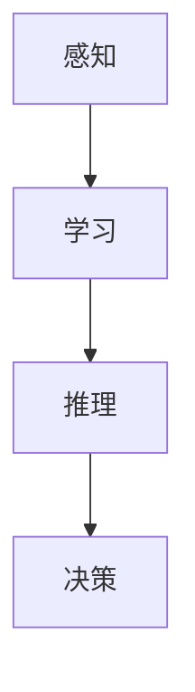
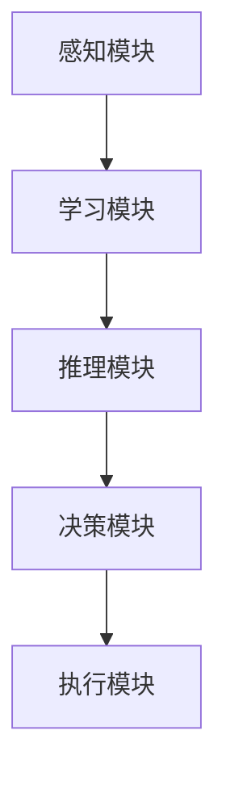
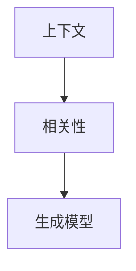
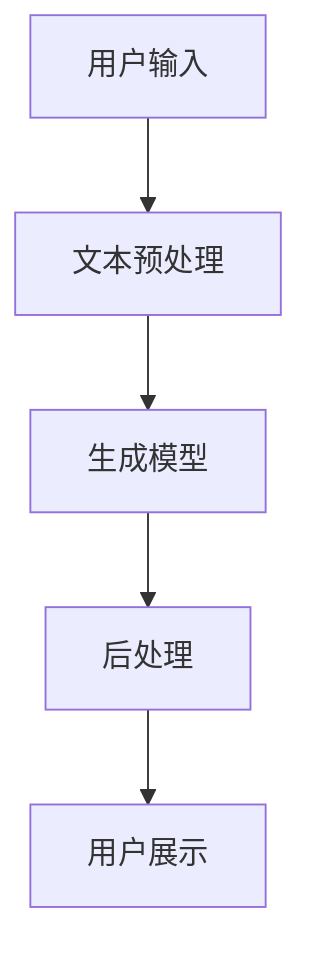
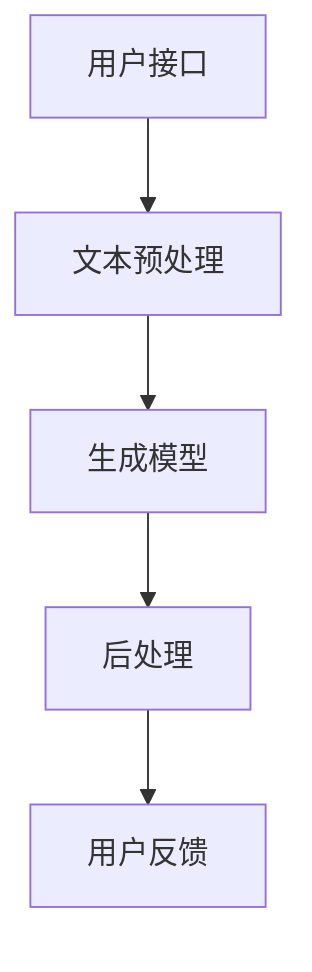
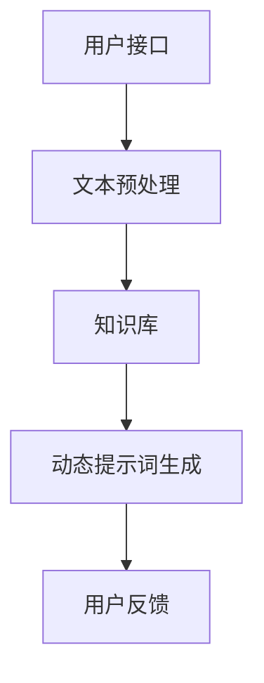

                 

### 第1章：智能系统概述

#### 1.1 智能系统的定义与分类

智能系统是一种能够模拟人类智能行为，具备感知、学习、推理和决策能力的系统。它通过计算机算法和数据处理技术，从大量数据中提取信息，进行复杂任务的处理和执行。根据功能和应用领域的不同，智能系统可以分为以下几类：

1. **自然语言处理（NLP）系统**：这类系统专注于处理人类语言，包括语言识别、语言翻译、文本分析等。例如，搜索引擎、语音助手和聊天机器人。
2. **计算机视觉（CV）系统**：这类系统专注于图像和视频数据的处理，包括图像识别、目标检测、图像分割等。例如，人脸识别、自动驾驶和医疗影像分析。
3. **智能决策系统**：这类系统通过数据分析、机器学习等技术，提供智能化的决策支持。例如，供应链管理、金融风控和智能推荐。
4. **自动驾驶系统**：这类系统利用传感器、计算机视觉和机器学习技术，实现车辆的自主驾驶。例如，无人驾驶汽车和无人机。

#### 核心概念与联系

智能系统中的核心概念包括：

- **感知**：系统通过传感器或其他方式获取外部环境的信息。
- **学习**：系统通过训练模型，从数据中学习规律和模式。
- **推理**：系统使用学习到的规律，对未知信息进行推断和预测。
- **决策**：系统根据推理结果，做出相应的决策和行动。

这些概念相互关联，共同构成了智能系统的核心架构。可以用以下Mermaid流程图表示：



#### 1.2 智能系统的核心架构

智能系统的核心架构通常包括以下几个模块：

1. **感知模块**：负责收集外部环境的信息，如图像、声音和文本。
2. **学习模块**：负责从数据中学习规律，包括特征提取和模型训练。
3. **推理模块**：负责根据学习到的规律，对未知信息进行推理和预测。
4. **决策模块**：负责根据推理结果，做出相应的决策和行动。
5. **执行模块**：负责执行决策结果，如控制机械臂、发送邮件等。

可以用以下Mermaid流程图表示：



### 第2章：动态提示词生成技术概述

#### 2.1 动态提示词生成的概念

动态提示词生成是指根据用户的需求和上下文信息，实时生成相关提示词的技术。这种技术在自然语言处理、智能客服、信息检索等领域有着广泛的应用。动态提示词生成的关键在于如何根据用户输入的信息，自动生成合适的提示词，以引导用户完成特定任务。

例如，在智能客服系统中，当用户提出一个问题时，系统会根据用户的问题内容，动态生成一系列相关的问题和回答选项，以帮助用户更好地理解问题，并快速找到解决方案。

#### 核心概念与联系

动态提示词生成涉及以下几个核心概念：

- **上下文**：指用户输入的信息所处的环境和背景。
- **相关性**：指生成的提示词与用户输入的信息之间的关联程度。
- **生成模型**：指用于生成提示词的算法和模型。

这些概念相互关联，共同构成了动态提示词生成的技术框架。可以用以下Mermaid流程图表示：



#### 2.2 动态提示词生成的应用场景

动态提示词生成技术可以应用于多种场景，包括：

1. **智能客服**：通过动态提示词生成，智能客服系统能够更好地理解用户的问题，并提供更准确的回答。
2. **信息检索**：在搜索引擎中，动态提示词生成可以帮助用户更好地定位搜索目标，提高搜索效率。
3. **智能写作**：在写作辅助工具中，动态提示词生成可以帮助用户更好地构思文章结构和内容。

#### 2.3 动态提示词生成技术的发展历程

动态提示词生成技术的发展历程可以分为以下几个阶段：

1. **基于规则的方法**：早期的方法主要依赖预定义的规则，如关键词匹配和模板匹配。这种方法简单但效果有限。
2. **基于统计的方法**：随着自然语言处理技术的发展，基于统计的方法开始出现，如隐马尔可夫模型（HMM）和条件概率模型。这种方法在一定程度上提高了生成效果。
3. **基于机器学习的方法**：近年来，基于深度学习的生成模型，如循环神经网络（RNN）和变分自编码器（VAE），被广泛应用于动态提示词生成。这种方法在生成效果上取得了显著提升。

### 第3章：动态提示词生成系统架构设计

#### 3.1 系统架构设计原则

动态提示词生成系统的架构设计应遵循以下几个原则：

1. **模块化**：系统应具有清晰的模块化结构，便于开发和维护。
2. **可扩展性**：系统应具备良好的可扩展性，能够适应不同的应用场景和需求。
3. **高可用性**：系统应具备高可用性，能够确保服务的连续性和稳定性。
4. **高效性**：系统应具备高效的处理能力，能够快速响应用户请求。

#### 3.2 系统组件划分

动态提示词生成系统通常包括以下几个主要组件：

1. **用户接口**：负责接收用户输入，展示生成的提示词。
2. **文本预处理**：负责对用户输入的文本进行清洗、分词和标记等预处理操作。
3. **生成模型**：负责根据预处理后的文本生成提示词。
4. **后处理**：负责对生成的提示词进行格式化、排序和筛选等操作。

#### 3.3 数据流设计

动态提示词生成系统的数据流设计如下：

1. **用户输入**：用户通过用户接口提交问题或请求。
2. **文本预处理**：系统对用户输入的文本进行预处理，生成特征向量。
3. **模型预测**：生成模型根据特征向量生成提示词。
4. **后处理**：系统对生成的提示词进行后处理，得到最终的提示词列表。
5. **用户展示**：系统将生成的提示词展示给用户。

### Mermaid 数据流图



### 第4章：自然语言处理基础算法

#### 4.1 语言模型

语言模型是自然语言处理中的核心概念，用于描述自然语言中的概率分布。语言模型的主要目标是预测一个单词序列的概率，从而为自然语言处理任务提供基础。

**核心概念与联系**：

- **n-gram模型**：一种简单但有效的语言模型，通过计算单词序列的频率来估计概率。
- **神经网络语言模型**：基于神经网络的复杂语言模型，能够更好地捕捉语言中的复杂结构。

**数学模型**：

语言模型通常使用以下概率公式来计算：

$$
P(w_1, w_2, \ldots, w_n) = \frac{C(w_1, w_2, \ldots, w_n)}{C(w_1, w_2, \ldots, w_{n-1}, w_n)}
$$

其中，$C(w_1, w_2, \ldots, w_n)$ 表示单词序列的频率。

**伪代码**：

```python
def n_gram_model(context, target_word):
    # 计算前文 context 的频率
    context_frequency = count_frequency(context)
    # 计算目标单词 target_word 的频率
    target_word_frequency = count_frequency(target_word)
    # 计算概率
    probability = context_frequency / target_word_frequency
    return probability
```

#### 4.2 词嵌入

词嵌入是将单词映射到高维向量空间的技术，用于捕捉单词之间的语义关系。词嵌入在自然语言处理中具有重要意义，能够提高模型的性能。

**核心概念与联系**：

- **分布式表示**：词嵌入将单词表示为向量的形式，使得单词之间的关系可以通过向量之间的距离来表示。
- **上下文依赖**：词嵌入能够捕捉单词在不同上下文中的语义变化。

**数学模型**：

词嵌入通常使用以下公式来计算：

$$
\vec{w}_i = \text{embedding}(i)
$$

其中，$\vec{w}_i$ 表示单词 $i$ 的词嵌入向量。

**伪代码**：

```python
def embedding(word_index):
    # 加载预训练的词嵌入模型
    embedding_model = load_embedding_model()
    # 获取单词的词嵌入向量
    embedding_vector = embedding_model[word_index]
    return embedding_vector
```

#### 4.3 序列到序列模型

序列到序列（Seq2Seq）模型是自然语言处理中的一种重要模型，用于将一个序列映射到另一个序列。它广泛应用于机器翻译、对话生成等任务。

**核心概念与联系**：

- **编码器**：将输入序列编码为一个固定长度的向量。
- **解码器**：将编码器的输出解码为一个输出序列。

**数学模型**：

Seq2Seq模型通常使用以下公式来计算：

$$
\text{Encoder}(\vec{x}) = \text{h_T}
$$

$$
\text{Decoder}(\vec{h_T}, \vec{y}_{T-1}) = \vec{y}_T
$$

其中，$\vec{x}$ 是输入序列，$\vec{h_T}$ 是编码器的输出，$\vec{y}_T$ 是解码器的输出。

**伪代码**：

```python
def seq2seq_encoder(input_sequence):
    # 使用编码器对输入序列进行编码
    encoded_sequence = encoder(input_sequence)
    return encoded_sequence

def seq2seq_decoder(encoded_sequence, previous_output):
    # 使用解码器对编码器的输出进行解码
    output_sequence = decoder(encoded_sequence, previous_output)
    return output_sequence
```

### 第5章：动态提示词生成算法

#### 5.1 动态提示词生成算法概述

动态提示词生成算法是指根据用户输入的信息，实时生成相关提示词的算法。它通常基于自然语言处理技术和机器学习算法，通过学习大量的语言数据和用户交互数据，生成高质量的提示词。

#### 核心概念与联系

动态提示词生成算法涉及以下几个核心概念：

- **上下文理解**：通过理解用户输入的上下文信息，生成相关的提示词。
- **用户交互**：根据用户的反馈和交互行为，调整生成的提示词。
- **多任务学习**：同时学习多个任务，提高算法的泛化能力。

#### 5.2 基于上下文的动态提示词生成算法

基于上下文的动态提示词生成算法是指通过分析用户输入的上下文信息，生成相关的提示词。这类算法通常基于自然语言处理技术和词嵌入技术，能够有效地捕捉语言中的上下文关系。

**核心算法原理讲解**：

1. **文本预处理**：对用户输入的文本进行分词、去停用词和词性标注等预处理操作。
2. **上下文表示**：使用词嵌入技术，将文本转化为向量表示。
3. **生成提示词**：使用序列到序列模型，根据上下文向量生成提示词。

**伪代码**：

```python
def context_based_dynamic_hint Generation(context):
    # 文本预处理
    preprocessed_context = preprocess(context)
    # 上下文表示
    context_vector = embed_context(preprocessed_context)
    # 生成提示词
    hint = generate_hint(context_vector)
    return hint
```

**数学模型和公式**：

$$
\text{hint} = \text{Seq2Seq}(\text{context_vector}, \text{hint_vector})
$$

其中，$\text{context_vector}$ 是上下文向量，$\text{hint_vector}$ 是提示词向量。

#### 5.3 基于用户的动态提示词生成算法

基于用户的动态提示词生成算法是指根据用户的喜好、行为和反馈，生成个性化的提示词。这类算法通常结合用户行为分析和推荐系统技术，能够更好地满足用户的需求。

**核心算法原理讲解**：

1. **用户行为分析**：收集用户的交互数据，如搜索历史、点击行为和评价等。
2. **用户兴趣建模**：使用机器学习算法，构建用户的兴趣模型。
3. **生成提示词**：根据用户的兴趣模型，生成个性化的提示词。

**伪代码**：

```python
def user_based_dynamic_hint_generation(user_profile):
    # 用户行为分析
    user_behavior = analyze_user_behavior(user_profile)
    # 用户兴趣建模
    user_interest_model = build_user_interest_model(user_behavior)
    # 生成提示词
    hint = generate_hint(user_interest_model)
    return hint
```

**数学模型和公式**：

$$
\text{hint} = \text{UserInterestModel}(\text{user_behavior})
$$

其中，$\text{user_behavior}$ 是用户行为数据，$\text{UserInterestModel}$ 是用户兴趣模型。

### 第6章：增强学习在动态提示词生成中的应用

#### 6.1 增强学习的基本概念

增强学习是一种通过与环境交互来学习最优策略的机器学习方法。它与监督学习和无监督学习不同，强调在动态环境中通过探索和反馈来优化行为。

**核心概念与联系**：

- **代理（Agent）**：进行学习和决策的实体。
- **环境（Environment）**：代理行动所处的环境。
- **状态（State）**：代理在环境中的位置。
- **动作（Action）**：代理可以执行的操作。
- **奖励（Reward）**：代理行动后环境给予的反馈。

**数学模型**：

增强学习通常使用以下公式来表示：

$$
Q(s, a) = \sum_{s'} P(s' | s, a) \cdot \max_a' Q(s', a')
$$

其中，$Q(s, a)$ 表示在状态 $s$ 下执行动作 $a$ 的期望回报，$P(s' | s, a)$ 表示从状态 $s$ 执行动作 $a$ 后转移到状态 $s'$ 的概率，$\max_a' Q(s', a')$ 表示在状态 $s'$ 下执行动作 $a'$ 的最大回报。

#### 6.2 增强学习在动态提示词生成中的实现

增强学习在动态提示词生成中的应用主要集中在如何根据用户的反馈调整提示词生成的策略。以下是一个简单的实现框架：

1. **定义状态和动作**：状态可以是用户的输入和历史提示词，动作是生成的下一个提示词。
2. **定义奖励函数**：奖励函数根据用户对提示词的反应（如点击率、满意度等）来评估生成的提示词的质量。
3. **训练模型**：使用增强学习算法（如深度强化学习）来优化生成策略。

**伪代码**：

```python
class DynamicHintAgent:
    def __init__(self):
        self.model = build_model()
        self.reward_function = define_reward_function()

    def select_action(self, state):
        return self.model.predict(state)

    def update_model(self, state, action, reward):
        # 使用奖励信号更新模型
        self.model.train(state, action, reward)

    def generate_hint(self, state):
        action = self.select_action(state)
        reward = self.reward_function(state, action)
        self.update_model(state, action, reward)
        return action
```

#### 6.3 增强学习算法的性能评估

评估增强学习算法的性能通常包括以下几个指标：

- **收敛速度**：模型在训练过程中达到特定性能水平所需的时间。
- **策略质量**：生成的提示词的质量，通常通过用户满意度或点击率来衡量。
- **稳定性**：模型在不同环境下的一致性和可靠性。

为了评估增强学习算法的性能，可以设计以下实验：

1. **基准测试**：在标准数据集上评估模型的性能，比较不同算法的收敛速度和策略质量。
2. **实际应用**：在真实场景中部署模型，收集用户反馈，评估模型在实践中的应用效果。
3. **A/B测试**：将新模型与现有模型进行比较，通过实际用户行为数据来评估模型的改进效果。

### 第7章：动态提示词生成系统的开发环境搭建

#### 7.1 开发环境准备

在搭建动态提示词生成系统之前，需要准备以下开发环境：

- **操作系统**：Linux或MacOS
- **编程语言**：Python（建议使用Python3.6及以上版本）
- **依赖库**：TensorFlow或PyTorch（用于深度学习模型的训练和推理）
- **文本预处理库**：NLTK或spaCy（用于文本分词、去停用词和词性标注等操作）
- **其他工具**：Jupyter Notebook（用于开发调试）

**步骤**：

1. 安装操作系统：根据个人需求选择合适的操作系统并进行安装。
2. 安装Python：从Python官网下载并安装Python，确保版本在3.6及以上。
3. 安装依赖库：使用pip命令安装所需的依赖库，例如：

   ```bash
   pip install tensorflow
   pip install spacy
   pip install nltk
   ```

4. 安装其他工具：安装Jupyter Notebook，方便开发调试：

   ```bash
   pip install notebook
   ```

#### 7.2 数据集准备

动态提示词生成系统的训练需要大量的数据集。以下是一个简单的方法来准备数据集：

1. **数据收集**：从互联网或公开数据集中收集相关数据，如用户提问和回答对、问答对数据等。
2. **数据预处理**：对收集到的数据进行清洗、分词、去停用词和词性标注等操作，将其转换为适合训练的格式。
3. **数据存储**：将预处理后的数据存储在本地文件或数据库中，便于后续使用。

**示例**：

1. **数据收集**：使用爬虫工具从论坛、问答社区等网站收集用户提问和回答数据。
2. **数据预处理**：使用NLTK或spaCy库对数据进行预处理，例如：

   ```python
   import nltk
   from nltk.tokenize import word_tokenize

   # 加载停用词表
   stop_words = set(nltk.corpus.stopwords.words('english'))

   # 分词和去停用词
   def preprocess(text):
       tokens = word_tokenize(text.lower())
       filtered_tokens = [token for token in tokens if token not in stop_words]
       return filtered_tokens
   ```

3. **数据存储**：将预处理后的数据存储为CSV文件或使用数据库进行存储，例如：

   ```python
   import pandas as pd

   # 保存数据到CSV文件
   data = {'question': questions, 'answer': answers}
   df = pd.DataFrame(data)
   df.to_csv('data.csv', index=False)
   ```

### 第8章：动态提示词生成系统的设计与实现

#### 8.1 系统设计

动态提示词生成系统的设计主要包括以下几个模块：

1. **用户接口**：接收用户输入，展示生成的提示词。
2. **文本预处理**：对用户输入的文本进行分词、去停用词和词性标注等预处理操作。
3. **生成模型**：使用基于上下文的动态提示词生成算法生成提示词。
4. **后处理**：对生成的提示词进行格式化、排序和筛选等操作。
5. **用户反馈**：收集用户对提示词的反馈，用于模型优化。

**系统架构图**：



#### 8.2 系统实现

以下是一个简单的动态提示词生成系统的实现示例：

1. **用户接口**：

   ```python
   import Flask

   app = Flask(__name__)

   @app.route('/hint', methods=['POST'])
   def generate_hint():
       user_input = request.form['input']
       hint = context_based_dynamic_hint_generation(user_input)
       return hint

   if __name__ == '__main__':
       app.run(debug=True)
   ```

2. **文本预处理**：

   ```python
   import nltk
   from nltk.tokenize import word_tokenize

   def preprocess_text(text):
       tokens = word_tokenize(text.lower())
       stop_words = set(nltk.corpus.stopwords.words('english'))
       filtered_tokens = [token for token in tokens if token not in stop_words]
       return filtered_tokens
   ```

3. **生成模型**：

   ```python
   import tensorflow as tf
   from tensorflow.keras.models import Sequential
   from tensorflow.keras.layers import LSTM, Dense, Embedding

   # 加载预训练的词嵌入模型
   embedding_model = load_embedding_model()

   # 构建序列到序列模型
   model = Sequential()
   model.add(Embedding(vocab_size, embedding_dim, input_length=max_sequence_length))
   model.add(LSTM(units=128, return_sequences=True))
   model.add(LSTM(units=128, return_sequences=False))
   model.add(Dense(units=max_words))

   # 编译模型
   model.compile(optimizer='adam', loss='categorical_crossentropy', metrics=['accuracy'])

   # 加载预训练的权重
   model.load_weights('model_weights.h5')
   ```

4. **后处理**：

   ```python
   def postprocess_hint(hint):
       # 对生成的提示词进行格式化、排序和筛选等操作
       processed_hint = ' '.join(hint)
       return processed_hint
   ```

5. **用户反馈**：

   ```python
   def collect_user_feedback(hint, user_input):
       # 收集用户对提示词的反馈
       feedback = input("请对生成的提示词进行评价：")
       # 保存反馈数据到文件或数据库
       save_feedback(hint, user_input, feedback)
   ```

#### 8.3 系统性能优化

为了提高动态提示词生成系统的性能，可以考虑以下优化策略：

1. **模型压缩**：使用模型压缩技术（如剪枝、量化等）减小模型大小，提高推理速度。
2. **分布式训练**：使用分布式训练技术（如多GPU训练、参数服务器等）提高训练效率。
3. **增量学习**：根据用户反馈，动态调整模型参数，实现增量学习。
4. **多任务学习**：同时学习多个相关任务，提高模型的泛化能力。

### 第9章：案例研究：基于动态提示词生成的智能客服系统

#### 9.1 案例背景

随着互联网和电子商务的快速发展，客户服务成为企业竞争的关键因素之一。传统的客户服务方式通常依赖于人工客服，效率低下且成本较高。为了提高客户服务质量，许多企业开始采用智能客服系统，利用动态提示词生成技术，实现自动化的客户服务。

#### 9.2 系统架构

基于动态提示词生成的智能客服系统通常包括以下几个模块：

1. **用户接口**：接收用户的问题或请求，并展示生成的提示词。
2. **文本预处理**：对用户输入的文本进行分词、去停用词和词性标注等预处理操作。
3. **知识库**：存储企业的产品信息、常见问题及其解答等知识。
4. **动态提示词生成**：根据用户输入和知识库中的信息，生成相关的提示词。
5. **用户反馈**：收集用户对提示词的反馈，用于模型优化。

**系统架构图**：



#### 9.3 实现细节

以下是一个简单的基于动态提示词生成的智能客服系统的实现示例：

1. **用户接口**：

   ```python
   import Flask

   app = Flask(__name__)

   @app.route('/help', methods=['POST'])
   def help():
       user_input = request.form['input']
       hint = context_based_dynamic_hint_generation(user_input)
       return hint

   if __name__ == '__main__':
       app.run(debug=True)
   ```

2. **文本预处理**：

   ```python
   import nltk
   from nltk.tokenize import word_tokenize

   def preprocess_text(text):
       tokens = word_tokenize(text.lower())
       stop_words = set(nltk.corpus.stopwords.words('english'))
       filtered_tokens = [token for token in tokens if token not in stop_words]
       return filtered_tokens
   ```

3. **知识库**：

   ```python
   import pandas as pd

   # 加载知识库数据
   knowledge_base = pd.read_csv('knowledge_base.csv')
   ```

4. **动态提示词生成**：

   ```python
   import tensorflow as tf
   from tensorflow.keras.models import Sequential
   from tensorflow.keras.layers import LSTM, Dense, Embedding

   # 加载预训练的词嵌入模型
   embedding_model = load_embedding_model()

   # 构建序列到序列模型
   model = Sequential()
   model.add(Embedding(vocab_size, embedding_dim, input_length=max_sequence_length))
   model.add(LSTM(units=128, return_sequences=True))
   model.add(LSTM(units=128, return_sequences=False))
   model.add(Dense(units=max_words))

   # 编译模型
   model.compile(optimizer='adam', loss='categorical_crossentropy', metrics=['accuracy'])

   # 加载预训练的权重
   model.load_weights('model_weights.h5')

   def context_based_dynamic_hint_generation(user_input):
       # 文本预处理
       preprocessed_input = preprocess_text(user_input)
       # 生成提示词
       hint = generate_hint(preprocessed_input)
       return hint

   def generate_hint(preprocessed_input):
       # 构建输入序列
       input_sequence = [word_index[token] for token in preprocessed_input]
       input_sequence = pad_sequences([input_sequence], maxlen=max_sequence_length)
       # 预测生成的提示词
       hint_sequence = model.predict(input_sequence)
       # 解码生成的提示词
       hint = decode_sequence(hint_sequence)
       return hint
   ```

5. **用户反馈**：

   ```python
   def collect_user_feedback(hint, user_input):
       # 收集用户对提示词的反馈
       feedback = input("请对生成的提示词进行评价：")
       # 保存反馈数据到文件或数据库
       save_feedback(hint, user_input, feedback)
   ```

#### 9.4 性能评估

为了评估基于动态提示词生成的智能客服系统的性能，可以进行以下实验：

1. **基准测试**：在标准数据集上评估系统的问答准确率、响应时间和用户满意度等指标。
2. **实际应用**：在实际客户服务场景中部署系统，收集用户反馈，评估系统的实际应用效果。
3. **A/B测试**：将新系统和现有系统进行比较，通过实际用户行为数据来评估新系统的改进效果。

### 第10章：未来发展趋势与挑战

#### 10.1 动态提示词生成技术的发展趋势

动态提示词生成技术在未来将继续发展，主要趋势包括：

1. **深度学习技术的进一步发展**：随着深度学习技术的不断进步，动态提示词生成算法将更加复杂和高效，能够更好地捕捉语言中的复杂结构。
2. **多模态数据的整合**：将文本、图像、语音等多种数据源整合到动态提示词生成中，实现更丰富的交互体验。
3. **个性化推荐**：结合用户行为分析和推荐系统技术，实现更加个性化的提示词生成。

#### 10.2 当前挑战与解决方案

动态提示词生成技术当前面临的主要挑战包括：

1. **数据质量**：高质量的训练数据是动态提示词生成的基础，但获取大量高质量的标注数据仍然是一个挑战。
2. **计算资源**：深度学习模型的训练和推理需要大量的计算资源，特别是在实时交互场景中，如何优化计算效率是一个重要问题。
3. **泛化能力**：动态提示词生成模型需要在各种不同的场景和任务中表现出良好的性能，但当前模型的泛化能力仍然有限。

**解决方案**：

1. **数据增强**：通过数据增强技术，如数据扩充、数据生成等，提高训练数据的质量和多样性。
2. **模型压缩和优化**：使用模型压缩和优化技术，如剪枝、量化等，减小模型大小，提高推理速度。
3. **迁移学习**：利用迁移学习技术，将预训练的模型应用到不同的任务和场景中，提高模型的泛化能力。

#### 10.3 未来发展方向

动态提示词生成技术在未来的发展方向包括：

1. **跨语言和跨模态**：实现动态提示词生成技术在跨语言和跨模态场景中的应用，提供更加全球化和多样化的交互体验。
2. **智能化和自适应**：通过引入更多的智能技术和自适应算法，使动态提示词生成系统能够更好地理解和满足用户需求。
3. **开源社区和生态系统**：鼓励更多的开发者和研究人员参与动态提示词生成技术的开源社区和生态系统建设，推动技术的创新和发展。

### 附录：技术资料与资源推荐

为了更好地理解和应用动态提示词生成技术，以下是一些推荐的技术资料和资源：

1. **《深度学习》（Goodfellow, Bengio, Courville）**：介绍了深度学习的基础理论和实践方法，适合对深度学习感兴趣的研究人员和开发者。
2. **《自然语言处理综论》（Jurafsky, Martin）**：详细介绍了自然语言处理的基本概念和算法，适合自然语言处理领域的初学者和专业人士。
3. **《强化学习》（Sutton, Barto）**：全面介绍了强化学习的基本理论和方法，适合对强化学习感兴趣的研究人员和开发者。
4. **GitHub开源项目**：许多优秀的动态提示词生成项目可以在GitHub上找到，如TensorFlow和PyTorch的预训练模型等。
5. **在线课程和教程**：许多在线平台（如Coursera、Udacity、edX等）提供了关于动态提示词生成技术的免费课程和教程，适合自学和深入学习。 

### 小结

本文详细介绍了动态提示词生成技术的基本概念、应用场景、核心算法原理、系统设计与实现，以及未来发展趋势。通过逐步分析推理，我们了解了动态提示词生成技术的核心原理和实现方法，并对当前的技术挑战和发展方向进行了探讨。希望本文能够为读者提供有价值的参考和启示。在未来的发展中，动态提示词生成技术将继续推动人工智能和自然语言处理领域的创新，为人们带来更加智能和便捷的交互体验。作者：AI天才研究院/AI Genius Institute & 禅与计算机程序设计艺术 /Zen And The Art of Computer Programming。

