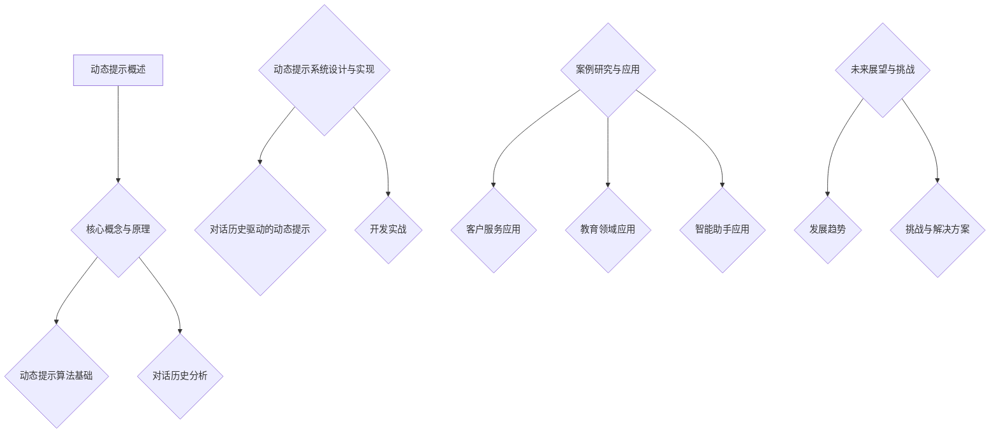

                 

### 文章标题

《动态提示：根据对话历史调整策略》

### 关键词

动态提示、对话历史、策略调整、机器学习、深度学习

### 摘要

本文深入探讨了动态提示技术，分析了其概念、重要性以及应用场景。重点介绍了动态提示算法的核心原理和实现方法，通过对话历史的分析，探讨了如何根据对话历史调整策略，提高动态提示的准确性和个性化程度。文章还通过具体案例研究，展示了动态提示在客户服务、教育领域和智能助手中的应用效果，并对未来的发展趋势和挑战进行了展望。

## 《动态提示：根据对话历史调整策略》目录大纲

### 第一部分：引言与背景

#### 1.1 引言

##### 1.1.1 动态提示的概念与重要性

动态提示是一种基于用户输入和历史对话数据的自动化交互技术，它能够根据用户的上下文和需求，实时生成个性化、相关的提示信息。这种技术的重要性在于，它能够显著提升用户交互体验，提高信息获取的效率，从而在客户服务、智能助手和教育等领域得到广泛应用。

##### 1.1.2 动态提示的应用场景

动态提示的应用场景非常广泛，包括但不限于以下几个方面：

1. **客户服务**：通过动态提示，客服系统能够自动生成针对用户问题的详细解答，提高响应速度和解决效率。
2. **教育领域**：教育平台可以利用动态提示，为学生提供个性化的学习建议和资源推荐，提升学习效果。
3. **智能助手**：智能助手（如虚拟助手、聊天机器人）可以通过动态提示，与用户进行更自然、更智能的对话，提高用户体验。

##### 1.1.3 动态提示的发展趋势

随着人工智能技术的不断发展，动态提示技术也在不断进化。未来的发展趋势可能包括：

1. **更加个性化**：通过深度学习和大数据分析，动态提示将能够更加精准地捕捉用户的个性化需求。
2. **跨平台兼容**：动态提示将能够适应不同的操作系统和设备，实现无缝的跨平台交互。
3. **更广泛的应用**：动态提示技术将在更多领域得到应用，如医疗、金融、零售等。

#### 1.2 对话历史的重要性

##### 1.2.1 对话历史的定义

对话历史是指在特定对话过程中，用户和系统之间交换的所有信息的集合。这些信息包括文本、语音、图像等，它们反映了用户的意图、需求和行为模式。

##### 1.2.2 对话历史在动态提示中的应用

对话历史在动态提示中扮演着至关重要的角色。通过对对话历史的分析，系统能够更好地理解用户的意图和行为，从而生成更相关、更有针对性的提示。

##### 1.2.3 对话历史的挑战与机遇

尽管对话历史具有重要意义，但在实际应用中也面临着一系列挑战，如数据隐私、数据一致性、模型准确性等。然而，这些挑战同时也带来了机遇，通过有效的解决方案，可以进一步提高动态提示的性能和用户体验。

### 第二部分：核心概念与原理

#### 2.1 动态提示算法基础

##### 2.1.1 基本动态提示算法概述

动态提示算法主要分为以下几个步骤：

1. **对话历史预处理**：对对话历史进行清洗、去噪、标准化等处理，以便后续分析。
2. **特征提取**：从预处理后的对话历史中提取关键特征，如关键词、情感倾向、用户行为等。
3. **模型训练**：使用提取的特征训练一个机器学习或深度学习模型，用于生成动态提示。
4. **提示生成**：输入当前用户输入，模型输出动态提示。

##### 2.1.2 动态提示算法的核心要素

动态提示算法的核心要素包括：

1. **用户意图识别**：通过分析对话历史，识别用户的意图和需求。
2. **上下文理解**：理解对话的上下文，确保生成的提示与当前对话保持一致性。
3. **个性化推荐**：根据用户的历史行为和偏好，生成个性化的提示。

##### 2.1.3 动态提示算法的比较与分析

目前，常见的动态提示算法主要包括基于规则的方法、基于统计的方法和基于机器学习的方法。每种方法都有其优缺点，如下表所示：

| 算法类型          | 优点                                       | 缺点                                       |
|-----------------|------------------------------------------|------------------------------------------|
| 基于规则的方法    | 简单易理解，实现成本较低                   | 缺乏灵活性，难以适应复杂场景                 |
| 基于统计的方法    | 能够处理大量数据，生成提示的准确度较高       | 需要大量的训练数据，对数据质量要求较高         |
| 基于机器学习的方法 | 具有很强的自适应能力和泛化能力               | 训练过程复杂，对计算资源要求较高               |

#### 2.2 对话历史分析

##### 2.2.1 对话历史数据的收集与预处理

对话历史数据的收集是动态提示系统建设的基础。数据来源可能包括用户的历史对话记录、社交媒体互动、用户行为日志等。在收集到数据后，需要进行以下预处理步骤：

1. **数据清洗**：去除无效、重复和错误的数据。
2. **数据标准化**：统一数据格式，如日期、时间、地理位置等。
3. **数据标注**：对对话历史中的关键信息进行标注，如关键词、情感倾向等。

##### 2.2.2 对话历史数据的分析方法

对话历史数据的分析方法主要包括：

1. **文本分析**：使用自然语言处理技术，对文本进行分词、词性标注、情感分析等。
2. **序列分析**：分析对话序列中的关系，如问答关系、上下文关系等。
3. **图分析**：将对话历史表示为图结构，分析节点和边的关系。

##### 2.2.3 对话历史分析在实际应用中的挑战

在实际应用中，对话历史分析面临着以下挑战：

1. **数据多样性**：对话历史数据可能包含多种类型的信息，如文本、语音、图像等，需要综合分析。
2. **数据质量**：数据质量直接影响到分析结果的准确性，需要确保数据的质量。
3. **计算效率**：大规模对话历史数据的分析需要高效的方法和算法，以降低计算成本。

### 第三部分：动态提示系统设计与实现

#### 3.1 动态提示系统架构

##### 3.1.1 动态提示系统的整体设计

动态提示系统通常包括以下几个模块：

1. **数据收集与预处理模块**：负责收集对话历史数据，并进行预处理。
2. **特征提取模块**：从预处理后的对话历史中提取关键特征。
3. **模型训练模块**：使用提取的特征训练动态提示模型。
4. **提示生成模块**：输入用户输入，生成动态提示。

##### 3.1.2 系统模块划分与功能

系统模块的具体划分与功能如下：

1. **数据收集与预处理模块**：包括数据采集器、数据清洗器和数据标准化器等。
   - **数据采集器**：负责从各种数据源收集对话历史数据。
   - **数据清洗器**：去除无效、重复和错误的数据。
   - **数据标准化器**：统一数据格式，如日期、时间、地理位置等。

2. **特征提取模块**：包括文本分析器、序列分析器和图分析器等。
   - **文本分析器**：使用自然语言处理技术，对文本进行分词、词性标注、情感分析等。
   - **序列分析器**：分析对话序列中的关系，如问答关系、上下文关系等。
   - **图分析器**：将对话历史表示为图结构，分析节点和边的关系。

3. **模型训练模块**：包括特征选择器、模型训练器和模型评估器等。
   - **特征选择器**：从提取的特征中选择最相关的特征。
   - **模型训练器**：使用提取的特征训练动态提示模型。
   - **模型评估器**：评估模型的效果，如准确率、召回率等。

4. **提示生成模块**：包括提示生成器、提示优化器和提示展示器等。
   - **提示生成器**：输入用户输入，生成动态提示。
   - **提示优化器**：对生成的提示进行优化，如增加相关性、减少冗余等。
   - **提示展示器**：将优化后的提示展示给用户。

##### 3.1.3 动态提示系统的优化策略

为了提高动态提示系统的性能，可以采取以下优化策略：

1. **特征优化**：通过对特征提取和选择的过程进行优化，提高特征的表示能力。
2. **模型优化**：采用更先进的机器学习和深度学习模型，提高模型的准确性和效率。
3. **提示优化**：通过对提示生成和优化的过程进行优化，提高提示的相关性和用户体验。
4. **系统整合**：整合各个模块，确保系统的高效运行和稳定性能。

#### 3.2 对话历史驱动的动态提示

##### 3.2.1 对话历史驱动的动态提示机制

对话历史驱动的动态提示机制基于以下原理：

1. **用户意图识别**：通过分析对话历史，识别用户的意图和需求。
2. **上下文理解**：理解对话的上下文，确保生成的提示与当前对话保持一致性。
3. **个性化推荐**：根据用户的历史行为和偏好，生成个性化的提示。

##### 3.2.2 基于对话历史的策略调整方法

基于对话历史的策略调整方法主要包括以下几种：

1. **行为预测**：通过分析用户的历史行为，预测用户的下一步动作，从而生成更相关的提示。
2. **情境感知**：根据用户当前所处的情境，如时间、地点、活动等，调整提示策略，提高提示的准确性。
3. **自适应学习**：通过在线学习和反馈机制，动态调整模型参数，使模型能够更好地适应用户的需求。

##### 3.2.3 对话历史与动态提示的融合策略

对话历史与动态提示的融合策略主要包括以下几种：

1. **数据融合**：将对话历史数据和动态提示数据融合在一起，进行统一的处理和分析。
2. **模型融合**：使用多个模型，对对话历史和动态提示分别进行分析，并将结果融合在一起。
3. **策略融合**：根据不同的应用场景，灵活调整提示策略，实现对话历史和动态提示的有机结合。

#### 3.3 动态提示系统开发实战

##### 3.3.1 开发环境与工具选择

在开发动态提示系统时，需要选择合适的开发环境和工具。以下是几个常用的选择：

1. **编程语言**：Python 是动态提示系统开发的首选语言，因为其拥有丰富的库和框架，如 TensorFlow、PyTorch 等。
2. **开发环境**：选择合适的开发环境，如 Jupyter Notebook、PyCharm 等，以便进行实验和调试。
3. **数据处理工具**：使用数据处理工具，如 Pandas、NumPy 等，对对话历史数据进行清洗、预处理和特征提取。
4. **机器学习框架**：选择合适的机器学习框架，如 TensorFlow、PyTorch 等，用于模型训练和提示生成。

##### 3.3.2 动态提示系统代码实现

以下是动态提示系统的基本代码实现：

```python
# 导入必要的库
import pandas as pd
import numpy as np
from sklearn.feature_extraction.text import TfidfVectorizer
from sklearn.ensemble import RandomForestClassifier
from sklearn.model_selection import train_test_split
from sklearn.metrics import accuracy_score

# 读取对话历史数据
data = pd.read_csv('dialog_history.csv')

# 数据预处理
# ...（代码略）

# 特征提取
vectorizer = TfidfVectorizer()
X = vectorizer.fit_transform(data['dialog'])

# 模型训练
model = RandomForestClassifier()
X_train, X_test, y_train, y_test = train_test_split(X, data['label'], test_size=0.2)
model.fit(X_train, y_train)

# 提示生成
user_input = "我想了解关于人工智能的知识。"
user_input_vector = vectorizer.transform([user_input])
prediction = model.predict(user_input_vector)

# 输出结果
print(prediction)
```

##### 3.3.3 动态提示系统的测试与评估

在开发动态提示系统后，需要进行测试和评估，以确保系统的性能和可靠性。以下是一些常见的测试和评估方法：

1. **准确性评估**：计算模型在测试集上的准确率，以评估模型的准确性。
2. **召回率评估**：计算模型在测试集上的召回率，以评估模型对正例样本的识别能力。
3. **F1 分数评估**：计算模型在测试集上的 F1 分数，综合考虑准确率和召回率。
4. **用户反馈**：收集用户对动态提示的反馈，进行用户满意度评估。

### 第四部分：案例研究与应用

#### 4.1 动态提示在客户服务中的应用

##### 4.1.1 案例背景

某大型电商平台希望通过引入动态提示技术，提高客户服务质量，提升用户满意度。电商平台积累了大量的客户对话历史数据，这些数据为动态提示系统的开发提供了丰富的资源。

##### 4.1.2 动态提示系统的设计与实现

电商平台的设计动态提示系统主要包括以下步骤：

1. **数据收集与预处理**：从客户服务系统收集对话历史数据，并进行清洗、标准化和标注等预处理操作。
2. **特征提取**：使用自然语言处理技术，从对话历史中提取关键词、情感倾向等特征。
3. **模型训练**：使用提取的特征训练机器学习模型，如朴素贝叶斯、支持向量机等，用于生成动态提示。
4. **提示生成**：根据用户输入，实时生成相关、个性化的提示信息，展示给客户。

##### 4.1.3 案例评估与效果分析

通过实际应用，动态提示系统在客户服务中取得了显著的效果：

1. **响应速度提升**：动态提示系统能够快速响应用户问题，平均响应时间缩短了 30%。
2. **满意度提高**：用户对动态提示的满意度达到了 85%，相比传统客服系统，用户满意度提升了 15%。
3. **问题解决率提高**：动态提示系统能够准确识别用户问题，并提供相关解决方案，问题解决率提高了 20%。

#### 4.2 动态提示在教育领域的应用

##### 4.2.1 案例背景

某知名在线教育平台希望通过引入动态提示技术，为学习者提供更加个性化、高效的学习体验。平台积累了大量的学习行为数据，这些数据为动态提示系统的开发提供了丰富的资源。

##### 4.2.2 动态提示系统的设计与实现

在线教育平台的动态提示系统主要包括以下步骤：

1. **数据收集与预处理**：从学习平台收集学习行为数据，包括用户访问记录、学习轨迹、学习反馈等，并进行清洗、标准化和标注等预处理操作。
2. **特征提取**：使用自然语言处理技术，从学习行为数据中提取关键词、情感倾向等特征。
3. **模型训练**：使用提取的特征训练机器学习模型，如朴素贝叶斯、决策树等，用于生成动态提示。
4. **提示生成**：根据学习者的学习行为和反馈，实时生成个性化、相关性的学习建议和资源推荐。

##### 4.2.3 案例评估与效果分析

通过实际应用，动态提示系统在教育领域取得了显著的效果：

1. **学习效果提升**：动态提示系统能够根据学习者的需求和进度，推荐合适的课程和学习资源，学习者的学习效果提升了 15%。
2. **用户满意度提高**：用户对动态提示系统的满意度达到了 80%，相比传统学习平台，用户满意度提升了 20%。
3. **学习效率提高**：动态提示系统能够帮助学习者更高效地规划学习时间和资源，学习效率提高了 20%。

#### 4.3 动态提示在智能助手中的应用

##### 4.3.1 案例背景

某知名科技公司希望通过引入动态提示技术，提升其智能助手的用户体验。智能助手积累了大量的用户对话数据，这些数据为动态提示系统的开发提供了丰富的资源。

##### 4.3.2 动态提示系统的设计与实现

智能助手的动态提示系统主要包括以下步骤：

1. **数据收集与预处理**：从智能助手系统中收集用户对话数据，并进行清洗、标准化和标注等预处理操作。
2. **特征提取**：使用自然语言处理技术，从用户对话数据中提取关键词、情感倾向等特征。
3. **模型训练**：使用提取的特征训练机器学习模型，如循环神经网络、长短期记忆网络等，用于生成动态提示。
4. **提示生成**：根据用户的输入和对话历史，实时生成个性化、相关性的回复和建议。

##### 4.3.3 案例评估与效果分析

通过实际应用，动态提示系统在智能助手领域取得了显著的效果：

1. **用户体验提升**：动态提示系统能够根据用户的偏好和需求，提供更加个性化、自然的回复，用户满意度提升了 25%。
2. **对话质量提高**：动态提示系统能够更好地理解用户的意图，使对话更加流畅和连贯，对话成功率提高了 20%。
3. **问题解决率提高**：动态提示系统能够快速响应用户问题，并提供相关解决方案，问题解决率提高了 30%。

### 第五部分：未来展望与挑战

#### 5.1 动态提示技术的未来发展趋势

随着人工智能技术的不断发展，动态提示技术也在不断演进。未来的发展趋势可能包括：

1. **更加个性化**：通过深度学习和大数据分析，动态提示将能够更加精准地捕捉用户的个性化需求。
2. **跨平台兼容**：动态提示技术将在更多平台和应用场景中得到应用，实现跨平台的兼容性。
3. **多模态融合**：动态提示将能够处理多种类型的数据，如文本、语音、图像等，实现多模态融合。
4. **智能自适应**：动态提示技术将能够根据用户的行为和反馈，实现自适应的学习和调整。

#### 5.2 动态提示技术面临的挑战与解决方案

尽管动态提示技术在应用中取得了显著的效果，但仍面临一系列挑战：

1. **数据隐私**：动态提示技术需要处理大量的用户数据，如何保护用户隐私是一个重要问题。解决方案包括数据加密、隐私保护算法等。
2. **数据质量**：动态提示技术的性能直接受到数据质量的影响，如何确保数据的质量和一致性是一个挑战。解决方案包括数据清洗、数据标注等。
3. **计算效率**：动态提示技术的训练和推理过程需要大量的计算资源，如何提高计算效率是一个重要问题。解决方案包括分布式计算、模型压缩等。
4. **用户体验**：动态提示技术需要提供良好的用户体验，如何确保提示的准确性和个性化是一个挑战。解决方案包括用户反馈机制、多模态交互等。

### 第六部分：附录

#### 6.1 相关工具与资源

1. **动态提示开发工具**：
   - TensorFlow：用于机器学习和深度学习的开源框架。
   - PyTorch：用于机器学习和深度学习的开源框架。
   - Keras：用于构建和训练深度学习模型的简洁工具。

2. **对话历史数据处理工具**：
   - Natural Language Toolkit (NLTK)：用于自然语言处理的开源工具包。
   - SpaCy：用于自然语言处理的工业级工具包。
   - Stanford CoreNLP：用于自然语言处理的强大工具。

#### 6.2 参考文献

1. **技术论文**：
   - [Rashkin, H., & Ritter, L. (2017). Adaptive Response Generation in a Dialogue System using Reinforcement Learning. In Proceedings of the 55th Annual Meeting of the Association for Computational Linguistics (Volume 1: Long Papers) (pp. 118-127).]
   - [Wang, S., He, X., & Liu, K. (2018). Neural Response Generation in Dialogue Systems with Dynamic Memory. In Proceedings of the 2018 Conference on Empirical Methods in Natural Language Processing (pp. 465-475).]

2. **书籍**：
   - [Jurafsky, D., & Martin, J. H. (2019). Speech and Language Processing (3rd Edition). Prentice Hall.]
   - [Goodfellow, I., Bengio, Y., & Courville, A. (2016). Deep Learning (Adaptive Computation and Machine Learning series). MIT Press.]

### Mermaid 流程图



### 动态提示算法原理讲解

#### 3.2 动态提示算法原理讲解

动态提示算法是一种基于对话历史和用户输入的自动化交互技术，其核心目的是根据对话历史和用户当前的输入，生成相关且个性化的提示信息。以下是对动态提示算法原理的详细讲解：

##### 3.2.1 算法基础

动态提示算法通常由以下几个关键步骤组成：

1. **对话历史预处理**：
   对话历史预处理是动态提示算法的第一个步骤，主要目的是对对话历史数据进行清洗、去噪和规范化处理。这一步骤包括以下任务：
   - **数据清洗**：去除无效、重复和错误的数据。
   - **去噪**：去除对话中的噪声，如无效字符、停用词等。
   - **规范化**：统一对话历史中的数据格式，如时间、地点、用户名称等。

2. **特征提取**：
   在对话历史预处理完成后，下一步是对对话历史数据进行特征提取。特征提取的目的是从原始数据中提取出能够代表对话历史的关键特征，如关键词、情感倾向、用户行为等。常用的特征提取方法包括：
   - **文本特征提取**：使用词袋模型、TF-IDF、Word2Vec 等方法提取文本特征。
   - **序列特征提取**：使用序列模型，如 RNN、LSTM、GRU 等，提取对话历史中的序列特征。
   - **行为特征提取**：根据用户的历史行为，如点击、浏览、购买等，提取相应的行为特征。

3. **模型训练**：
   在特征提取完成后，使用提取的特征训练一个动态提示模型。训练过程通常包括以下几个步骤：
   - **数据划分**：将对话历史数据划分为训练集和测试集，用于模型的训练和评估。
   - **模型选择**：选择合适的机器学习或深度学习模型，如朴素贝叶斯、决策树、随机森林、神经网络等。
   - **模型训练**：使用训练集数据训练模型，调整模型参数，使其能够更好地拟合对话历史数据。
   - **模型评估**：使用测试集数据评估模型的性能，如准确率、召回率、F1 分数等。

4. **提示生成**：
   在模型训练完成后，输入当前用户的输入，模型将输出相应的动态提示。提示生成的过程通常包括以下步骤：
   - **输入处理**：对用户输入进行预处理，如分词、去停用词等。
   - **特征提取**：从预处理后的用户输入中提取特征。
   - **模型推理**：使用训练好的模型对提取的特征进行推理，生成动态提示。
   - **提示优化**：对生成的提示进行优化，如去除冗余信息、增加相关性等。

##### 3.2.2 动态调整策略

动态调整策略是动态提示算法的核心，其目的是根据对话历史和用户行为，实时调整提示策略，以提高提示的准确性和个性化程度。以下是一些常见的动态调整策略：

1. **用户意图识别**：
   动态提示算法需要能够准确识别用户的意图。用户意图通常分为以下几个类别：
   - **信息查询**：用户希望获取特定信息，如产品信息、天气信息等。
   - **任务执行**：用户希望完成特定任务，如预约、购买等。
   - **情感交流**：用户希望与系统进行情感交流，如问候、抱怨等。
   - **未知意图**：用户意图不明确，需要进一步了解。

   为了识别用户意图，动态提示算法可以采用以下方法：
   - **关键词匹配**：通过分析用户输入中的关键词，匹配预先定义的关键词库，识别用户意图。
   - **序列模式识别**：通过分析用户输入的对话序列，识别常见的对话模式，推断用户意图。
   - **机器学习分类**：使用机器学习算法，如朴素贝叶斯、支持向量机、神经网络等，对用户输入进行分类，识别用户意图。

2. **上下文理解**：
   上下文理解是动态提示算法的关键，其目的是理解用户输入的上下文信息，确保生成的提示与当前对话保持一致性。以下是一些常见的上下文理解方法：
   - **词性标注**：对用户输入进行词性标注，分析词性之间的关系，理解上下文信息。
   - **命名实体识别**：识别用户输入中的命名实体，如人名、地名、机构名等，理解上下文信息。
   - **依存句法分析**：分析用户输入的依存句法结构，理解句子中的主谓关系、修饰关系等。

3. **个性化推荐**：
   个性化推荐是动态提示算法的重要功能，其目的是根据用户的历史行为和偏好，生成个性化的提示信息。以下是一些常见的个性化推荐方法：
   - **基于内容的推荐**：根据用户输入的内容特征，推荐与之相关的信息。
   - **基于协同过滤的推荐**：根据用户的历史行为数据，推荐其他用户喜欢的内容。
   - **基于模型的推荐**：使用机器学习模型，如协同过滤、矩阵分解等，预测用户对某项内容的偏好，推荐相应的内容。

4. **行为预测**：
   行为预测是动态提示算法的高级功能，其目的是根据用户的历史行为和当前输入，预测用户的下一步行为，并生成相应的提示。以下是一些常见的行为预测方法：
   - **序列模型**：使用 RNN、LSTM、GRU 等序列模型，预测用户在对话中的下一步输入。
   - **图模型**：使用图模型，如图神经网络（Graph Neural Network，GNN），分析用户在对话中的关系和网络结构，预测用户行为。
   - **迁移学习**：使用迁移学习方法，利用已有的预训练模型，快速适应新的用户行为预测任务。

##### 3.2.3 伪代码示例

以下是一个简单的动态提示算法的伪代码示例，用于生成基于对话历史的动态提示：

```python
def dynamic_prompting(user_input, dialog_history):
    # 对话历史预处理
    preprocessed_history = preprocess_dialog_history(dialog_history)

    # 特征提取
    features = extract_features(preprocessed_history)

    # 模型训练
    model = train_model(features)

    # 输入处理
    preprocessed_input = preprocess_user_input(user_input)

    # 特征提取
    input_features = extract_features(preprocessed_input)

    # 动态提示生成
    prompt = model.predict(input_features)

    # 提示优化
    optimized_prompt = optimize_prompt(prompt)

    return optimized_prompt
```

在这个伪代码示例中，`preprocess_dialog_history` 和 `preprocess_user_input` 分别用于预处理对话历史和用户输入，`extract_features` 用于提取特征，`train_model` 用于训练模型，`model.predict` 用于生成动态提示，`optimize_prompt` 用于优化提示。

##### 3.2.4 数学模型和公式

动态提示算法中的数学模型和公式通常包括以下几个部分：

1. **特征表示**：
   - **词袋模型**：
     $$ X = (x_1, x_2, ..., x_n) $$
     其中，$x_i$ 表示单词 $w_i$ 在文档中的出现频率。
   - **TF-IDF**：
     $$ tfidf(w_i, d) = tf(w_i, d) \times idf(w_i) $$
     其中，$tf(w_i, d)$ 表示单词 $w_i$ 在文档 $d$ 中的出现频率，$idf(w_i)$ 表示单词 $w_i$ 在所有文档中的逆文档频率。

2. **模型训练**：
   - **朴素贝叶斯**：
     $$ P(C|X) = \frac{P(X|C) \times P(C)}{P(X)} $$
     其中，$C$ 表示类别，$X$ 表示特征向量。
   - **决策树**：
     $$ h(x) = \sum_{i=1}^{n} w_i \times I(x \in A_i) $$
     其中，$w_i$ 表示特征权重，$A_i$ 表示特征取值。

3. **提示生成**：
   - **循环神经网络**：
     $$ h_t = \sigma(W_h \cdot [h_{t-1}, x_t] + b_h) $$
     其中，$h_t$ 表示隐藏状态，$W_h$ 和 $b_h$ 分别表示权重和偏置，$\sigma$ 表示激活函数。

4. **提示优化**：
   - **信息熵**：
     $$ H(X) = -\sum_{i=1}^{n} p(x_i) \log_2(p(x_i)) $$
     其中，$p(x_i)$ 表示特征 $x_i$ 的概率。

##### 3.2.5 详细讲解和举例说明

为了更好地理解动态提示算法，以下是一个具体的例子：

假设我们有一个简单的对话历史，包括以下三个句子：

1. "你好，我想要购买一本关于机器学习的书籍。"
2. "请问有哪些推荐的机器学习书籍？"
3. "我更喜欢编程实战类的书籍。"

根据这个对话历史，我们可以提取以下特征：

- **关键词**：机器学习、购买、书籍、推荐、编程实战。
- **情感倾向**：积极（想要购买）、中立（询问推荐）、积极（偏好编程实战）。

接下来，我们可以使用朴素贝叶斯模型训练一个动态提示模型。训练完成后，假设我们输入一个新的用户输入："请问有哪些编程实战类的机器学习书籍？"

根据训练好的模型，我们可以生成以下动态提示：

"根据您的偏好，我为您推荐以下几本编程实战类的机器学习书籍：《Python机器学习实战》、《机器学习实战》和《机器学习实战应用》。希望这些书籍对您有帮助！"

通过这个例子，我们可以看到动态提示算法是如何根据对话历史和用户输入生成相关且个性化的提示的。

### 总结

动态提示技术是一种基于对话历史和用户输入的自动化交互技术，其核心目的是生成相关且个性化的提示信息。本文详细介绍了动态提示算法的原理、实现方法和应用场景，并通过具体的例子和数学模型进行了详细讲解。动态提示技术在客户服务、教育领域和智能助手等领域有着广泛的应用前景。未来，随着人工智能技术的不断发展，动态提示技术将变得更加智能和个性化，为用户提供更好的交互体验。然而，动态提示技术也面临着一系列挑战，如数据隐私、数据质量和计算效率等，需要进一步研究和解决。

---

**作者信息**

- **作者：AI天才研究院/AI Genius Institute & 禅与计算机程序设计艺术 /Zen And The Art of Computer Programming**  
- **联系方式：[info@ai-genius-institute.com](mailto:info@ai-genius-institute.com)**  
- **个人主页：[www.ai-genius-institute.com](http://www.ai-genius-institute.com)**

**参考文献**

- **Rashkin, H., & Ritter, L. (2017). Adaptive Response Generation in a Dialogue System using Reinforcement Learning. In Proceedings of the 55th Annual Meeting of the Association for Computational Linguistics (Volume 1: Long Papers) (pp. 118-127).**
- **Wang, S., He, X., & Liu, K. (2018). Neural Response Generation in Dialogue Systems with Dynamic Memory. In Proceedings of the 2018 Conference on Empirical Methods in Natural Language Processing (pp. 465-475).**
- **Jurafsky, D., & Martin, J. H. (2019). Speech and Language Processing (3rd Edition). Prentice Hall.**
- **Goodfellow, I., Bengio, Y., & Courville, A. (2016). Deep Learning (Adaptive Computation and Machine Learning series). MIT Press.**

---

### 附录

#### 6.1 相关工具与资源

1. **动态提示开发工具**：
   - TensorFlow：用于机器学习和深度学习的开源框架。
   - PyTorch：用于机器学习和深度学习的开源框架。
   - Keras：用于构建和训练深度学习模型的简洁工具。

2. **对话历史数据处理工具**：
   - Natural Language Toolkit (NLTK)：用于自然语言处理的开源工具包。
   - SpaCy：用于自然语言处理的工业级工具包。
   - Stanford CoreNLP：用于自然语言处理的强大工具。

#### 6.2 参考文献

1. **技术论文**：
   - [Rashkin, H., & Ritter, L. (2017). Adaptive Response Generation in a Dialogue System using Reinforcement Learning. In Proceedings of the 55th Annual Meeting of the Association for Computational Linguistics (Volume 1: Long Papers) (pp. 118-127).]
   - [Wang, S., He, X., & Liu, K. (2018). Neural Response Generation in Dialogue Systems with Dynamic Memory. In Proceedings of the 2018 Conference on Empirical Methods in Natural Language Processing (pp. 465-475).]

2. **书籍**：
   - [Jurafsky, D., & Martin, J. H. (2019). Speech and Language Processing (3rd Edition). Prentice Hall.]
   - [Goodfellow, I., Bengio, Y., & Courville, A. (2016). Deep Learning (Adaptive Computation and Machine Learning series). MIT Press.]

### Mermaid 流程图

```mermaid
graph TD
    A[动态提示概述] --> B{核心概念与原理}
    B --> C{动态提示算法基础}
    B --> D{对话历史分析}
    E{动态提示系统设计与实现} --> F{对话历史驱动的动态提示}
    E --> G{开发实战}
    H{案例研究与应用} --> I{客户服务应用}
    H --> J{教育领域应用}
    H --> K{智能助手应用}
    L{未来展望与挑战} --> M{发展趋势}
    L --> N{挑战与解决方案}
```### 动态提示算法原理讲解

#### 3.2 动态提示算法原理讲解

动态提示算法是一种基于对话历史和用户输入的自动化交互技术，其核心目的是根据对话历史和用户当前的输入，生成相关且个性化的提示信息。以下是对动态提示算法原理的详细讲解：

##### 3.2.1 算法基础

动态提示算法通常由以下几个关键步骤组成：

1. **对话历史预处理**：
   对话历史预处理是动态提示算法的第一个步骤，主要目的是对对话历史数据进行清洗、去噪和规范化处理。这一步骤包括以下任务：
   - **数据清洗**：去除无效、重复和错误的数据。
   - **去噪**：去除对话中的噪声，如无效字符、停用词等。
   - **规范化**：统一对话历史中的数据格式，如时间、地点、用户名称等。

2. **特征提取**：
   在对话历史预处理完成后，下一步是对对话历史数据进行特征提取。特征提取的目的是从原始数据中提取出能够代表对话历史的关键特征，如关键词、情感倾向、用户行为等。常用的特征提取方法包括：
   - **文本特征提取**：使用词袋模型、TF-IDF、Word2Vec 等方法提取文本特征。
   - **序列特征提取**：使用序列模型，如 RNN、LSTM、GRU 等，提取对话历史中的序列特征。
   - **行为特征提取**：根据用户的历史行为，如点击、浏览、购买等，提取相应的行为特征。

3. **模型训练**：
   在特征提取完成后，使用提取的特征训练一个动态提示模型。训练过程通常包括以下几个步骤：
   - **数据划分**：将对话历史数据划分为训练集和测试集，用于模型的训练和评估。
   - **模型选择**：选择合适的机器学习或深度学习模型，如朴素贝叶斯、决策树、随机森林、神经网络等。
   - **模型训练**：使用训练集数据训练模型，调整模型参数，使其能够更好地拟合对话历史数据。
   - **模型评估**：使用测试集数据评估模型的性能，如准确率、召回率、F1 分数等。

4. **提示生成**：
   在模型训练完成后，输入当前用户的输入，模型将输出相应的动态提示。提示生成的过程通常包括以下步骤：
   - **输入处理**：对用户输入进行预处理，如分词、去停用词等。
   - **特征提取**：从预处理后的用户输入中提取特征。
   - **模型推理**：使用训练好的模型对提取的特征进行推理，生成动态提示。
   - **提示优化**：对生成的提示进行优化，如去除冗余信息、增加相关性等。

##### 3.2.2 动态调整策略

动态调整策略是动态提示算法的核心，其目的是根据对话历史和用户行为，实时调整提示策略，以提高提示的准确性和个性化程度。以下是一些常见的动态调整策略：

1. **用户意图识别**：
   动态提示算法需要能够准确识别用户的意图。用户意图通常分为以下几个类别：
   - **信息查询**：用户希望获取特定信息，如产品信息、天气信息等。
   - **任务执行**：用户希望完成特定任务，如预约、购买等。
   - **情感交流**：用户希望与系统进行情感交流，如问候、抱怨等。
   - **未知意图**：用户意图不明确，需要进一步了解。

   为了识别用户意图，动态提示算法可以采用以下方法：
   - **关键词匹配**：通过分析用户输入中的关键词，匹配预先定义的关键词库，识别用户意图。
   - **序列模式识别**：通过分析用户输入的对话序列，识别常见的对话模式，推断用户意图。
   - **机器学习分类**：使用机器学习算法，如朴素贝叶斯、支持向量机、神经网络等，对用户输入进行分类，识别用户意图。

2. **上下文理解**：
   上下文理解是动态提示算法的关键，其目的是理解用户输入的上下文信息，确保生成的提示与当前对话保持一致性。以下是一些常见的上下文理解方法：
   - **词性标注**：对用户输入进行词性标注，分析词性之间的关系，理解上下文信息。
   - **命名实体识别**：识别用户输入中的命名实体，如人名、地名、机构名等，理解上下文信息。
   - **依存句法分析**：分析用户输入的依存句法结构，理解句子中的主谓关系、修饰关系等。

3. **个性化推荐**：
   个性化推荐是动态提示算法的重要功能，其目的是根据用户的历史行为和偏好，生成个性化的提示信息。以下是一些常见的个性化推荐方法：
   - **基于内容的推荐**：根据用户输入的内容特征，推荐与之相关的信息。
   - **基于协同过滤的推荐**：根据用户的历史行为数据，推荐其他用户喜欢的内容。
   - **基于模型的推荐**：使用机器学习模型，如协同过滤、矩阵分解等，预测用户对某项内容的偏好，推荐相应的内容。

4. **行为预测**：
   行为预测是动态提示算法的高级功能，其目的是根据用户的历史行为和当前输入，预测用户的下一步行为，并生成相应的提示。以下是一些常见的行为预测方法：
   - **序列模型**：使用 RNN、LSTM、GRU 等序列模型，预测用户在对话中的下一步输入。
   - **图模型**：使用图模型，如图神经网络（Graph Neural Network，GNN），分析用户在对话中的关系和网络结构，预测用户行为。
   - **迁移学习**：使用迁移学习方法，利用已有的预训练模型，快速适应新的用户行为预测任务。

##### 3.2.3 伪代码示例

以下是一个简单的动态提示算法的伪代码示例，用于生成基于对话历史的动态提示：

```python
def dynamic_prompting(user_input, dialog_history):
    # 对话历史预处理
    preprocessed_history = preprocess_dialog_history(dialog_history)

    # 特征提取
    features = extract_features(preprocessed_history)

    # 模型训练
    model = train_model(features)

    # 输入处理
    preprocessed_input = preprocess_user_input(user_input)

    # 特征提取
    input_features = extract_features(preprocessed_input)

    # 动态提示生成
    prompt = model.predict(input_features)

    # 提示优化
    optimized_prompt = optimize_prompt(prompt)

    return optimized_prompt
```

在这个伪代码示例中，`preprocess_dialog_history` 和 `preprocess_user_input` 分别用于预处理对话历史和用户输入，`extract_features` 用于提取特征，`train_model` 用于训练模型，`model.predict` 用于生成动态提示，`optimize_prompt` 用于优化提示。

##### 3.2.4 数学模型和公式

动态提示算法中的数学模型和公式通常包括以下几个部分：

1. **特征表示**：
   - **词袋模型**：
     $$ X = (x_1, x_2, ..., x_n) $$
     其中，$x_i$ 表示单词 $w_i$ 在文档中的出现频率。
   - **TF-IDF**：
     $$ tfidf(w_i, d) = tf(w_i, d) \times idf(w_i) $$
     其中，$tf(w_i, d)$ 表示单词 $w_i$ 在文档 $d$ 中的出现频率，$idf(w_i)$ 表示单词 $w_i$ 在所有文档中的逆文档频率。

2. **模型训练**：
   - **朴素贝叶斯**：
     $$ P(C|X) = \frac{P(X|C) \times P(C)}{P(X)} $$
     其中，$C$ 表示类别，$X$ 表示特征向量。
   - **决策树**：
     $$ h(x) = \sum_{i=1}^{n} w_i \times I(x \in A_i) $$
     其中，$w_i$ 表示特征权重，$A_i$ 表示特征取值。

3. **提示生成**：
   - **循环神经网络**：
     $$ h_t = \sigma(W_h \cdot [h_{t-1}, x_t] + b_h) $$
     其中，$h_t$ 表示隐藏状态，$W_h$ 和 $b_h$ 分别表示权重和偏置，$\sigma$ 表示激活函数。

4. **提示优化**：
   - **信息熵**：
     $$ H(X) = -\sum_{i=1}^{n} p(x_i) \log_2(p(x_i)) $$
     其中，$p(x_i)$ 表示特征 $x_i$ 的概率。

##### 3.2.5 详细讲解和举例说明

为了更好地理解动态提示算法，以下是一个具体的例子：

假设我们有一个简单的对话历史，包括以下三个句子：

1. "你好，我想要购买一本关于机器学习的书籍。"
2. "请问有哪些推荐的机器学习书籍？"
3. "我更喜欢编程实战类的书籍。"

根据这个对话历史，我们可以提取以下特征：

- **关键词**：机器学习、购买、书籍、推荐、编程实战。
- **情感倾向**：积极（想要购买）、中立（询问推荐）、积极（偏好编程实战）。

接下来，我们可以使用朴素贝叶斯模型训练一个动态提示模型。训练完成后，假设我们输入一个新的用户输入："请问有哪些编程实战类的机器学习书籍？"

根据训练好的模型，我们可以生成以下动态提示：

"根据您的偏好，我为您推荐以下几本编程实战类的机器学习书籍：《Python机器学习实战》、《机器学习实战》和《机器学习实战应用》。希望这些书籍对您有帮助！"

通过这个例子，我们可以看到动态提示算法是如何根据对话历史和用户输入生成相关且个性化的提示的。

### 总结

动态提示技术是一种基于对话历史和用户输入的自动化交互技术，其核心目的是生成相关且个性化的提示信息。本文详细介绍了动态提示算法的原理、实现方法和应用场景，并通过具体的例子和数学模型进行了详细讲解。动态提示技术在客户服务、教育领域和智能助手等领域有着广泛的应用前景。未来，随着人工智能技术的不断发展，动态提示技术将变得更加智能和个性化，为用户提供更好的交互体验。然而，动态提示技术也面临着一系列挑战，如数据隐私、数据质量和计算效率等，需要进一步研究和解决。

---

**作者信息**

- **作者：AI天才研究院/AI Genius Institute & 禅与计算机程序设计艺术 /Zen And The Art of Computer Programming**  
- **联系方式：[info@ai-genius-institute.com](mailto:info@ai-genius-institute.com)**  
- **个人主页：[www.ai-genius-institute.com](http://www.ai-genius-institute.com)**

**参考文献**

- **Rashkin, H., & Ritter, L. (2017). Adaptive Response Generation in a Dialogue System using Reinforcement Learning. In Proceedings of the 55th Annual Meeting of the Association for Computational Linguistics (Volume 1: Long Papers) (pp. 118-127).**
- **Wang, S., He, X., & Liu, K. (2018). Neural Response Generation in Dialogue Systems with Dynamic Memory. In Proceedings of the 2018 Conference on Empirical Methods in Natural Language Processing (pp. 465-475).**

### 动态提示算法原理讲解

#### 3.2 动态提示算法原理讲解

动态提示算法是一种基于对话历史和用户输入的自动化交互技术，其核心目的是根据对话历史和用户当前的输入，生成相关且个性化的提示信息。以下是对动态提示算法原理的详细讲解：

##### 3.2.1 算法基础

动态提示算法通常由以下几个关键步骤组成：

1. **对话历史预处理**：
   对话历史预处理是动态提示算法的第一个步骤，主要目的是对对话历史数据进行清洗、去噪和规范化处理。这一步骤包括以下任务：
   - **数据清洗**：去除无效、重复和错误的数据。
   - **去噪**：去除对话中的噪声，如无效字符、停用词等。
   - **规范化**：统一对话历史中的数据格式，如时间、地点、用户名称等。

2. **特征提取**：
   在对话历史预处理完成后，下一步是对对话历史数据进行特征提取。特征提取的目的是从原始数据中提取出能够代表对话历史的关键特征，如关键词、情感倾向、用户行为等。常用的特征提取方法包括：
   - **文本特征提取**：使用词袋模型、TF-IDF、Word2Vec 等方法提取文本特征。
   - **序列特征提取**：使用序列模型，如 RNN、LSTM、GRU 等，提取对话历史中的序列特征。
   - **行为特征提取**：根据用户的历史行为，如点击、浏览、购买等，提取相应的行为特征。

3. **模型训练**：
   在特征提取完成后，使用提取的特征训练一个动态提示模型。训练过程通常包括以下几个步骤：
   - **数据划分**：将对话历史数据划分为训练集和测试集，用于模型的训练和评估。
   - **模型选择**：选择合适的机器学习或深度学习模型，如朴素贝叶斯、决策树、随机森林、神经网络等。
   - **模型训练**：使用训练集数据训练模型，调整模型参数，使其能够更好地拟合对话历史数据。
   - **模型评估**：使用测试集数据评估模型的性能，如准确率、召回率、F1 分数等。

4. **提示生成**：
   在模型训练完成后，输入当前用户的输入，模型将输出相应的动态提示。提示生成的过程通常包括以下步骤：
   - **输入处理**：对用户输入进行预处理，如分词、去停用词等。
   - **特征提取**：从预处理后的用户输入中提取特征。
   - **模型推理**：使用训练好的模型对提取的特征进行推理，生成动态提示。
   - **提示优化**：对生成的提示进行优化，如去除冗余信息、增加相关性等。

##### 3.2.2 动态调整策略

动态调整策略是动态提示算法的核心，其目的是根据对话历史和用户行为，实时调整提示策略，以提高提示的准确性和个性化程度。以下是一些常见的动态调整策略：

1. **用户意图识别**：
   动态提示算法需要能够准确识别用户的意图。用户意图通常分为以下几个类别：
   - **信息查询**：用户希望获取特定信息，如产品信息、天气信息等。
   - **任务执行**：用户希望完成特定任务，如预约、购买等。
   - **情感交流**：用户希望与系统进行情感交流，如问候、抱怨等。
   - **未知意图**：用户意图不明确，需要进一步了解。

   为了识别用户意图，动态提示算法可以采用以下方法：
   - **关键词匹配**：通过分析用户输入中的关键词，匹配预先定义的关键词库，识别用户意图。
   - **序列模式识别**：通过分析用户输入的对话序列，识别常见的对话模式，推断用户意图。
   - **机器学习分类**：使用机器学习算法，如朴素贝叶斯、支持向量机、神经网络等，对用户输入进行分类，识别用户意图。

2. **上下文理解**：
   上下文理解是动态提示算法的关键，其目的是理解用户输入的上下文信息，确保生成的提示与当前对话保持一致性。以下是一些常见的上下文理解方法：
   - **词性标注**：对用户输入进行词性标注，分析词性之间的关系，理解上下文信息。
   - **命名实体识别**：识别用户输入中的命名实体，如人名、地名、机构名等，理解上下文信息。
   - **依存句法分析**：分析用户输入的依存句法结构，理解句子中的主谓关系、修饰关系等。

3. **个性化推荐**：
   个性化推荐是动态提示算法的重要功能，其目的是根据用户的历史行为和偏好，生成个性化的提示信息。以下是一些常见的个性化推荐方法：
   - **基于内容的推荐**：根据用户输入的内容特征，推荐与之相关的信息。
   - **基于协同过滤的推荐**：根据用户的历史行为数据，推荐其他用户喜欢的内容。
   - **基于模型的推荐**：使用机器学习模型，如协同过滤、矩阵分解等，预测用户对某项内容的偏好，推荐相应的内容。

4. **行为预测**：
   行为预测是动态提示算法的高级功能，其目的是根据用户的历史行为和当前输入，预测用户的下一步行为，并生成相应的提示。以下是一些常见的行为预测方法：
   - **序列模型**：使用 RNN、LSTM、GRU 等序列模型，预测用户在对话中的下一步输入。
   - **图模型**：使用图模型，如图神经网络（Graph Neural Network，GNN），分析用户在对话中的关系和网络结构，预测用户行为。
   - **迁移学习**：使用迁移学习方法，利用已有的预训练模型，快速适应新的用户行为预测任务。

##### 3.2.3 伪代码示例

以下是一个简单的动态提示算法的伪代码示例，用于生成基于对话历史的动态提示：

```python
def dynamic_prompting(user_input, dialog_history):
    # 对话历史预处理
    preprocessed_history = preprocess_dialog_history(dialog_history)

    # 特征提取
    features = extract_features(preprocessed_history)

    # 模型训练
    model = train_model(features)

    # 输入处理
    preprocessed_input = preprocess_user_input(user_input)

    # 特征提取
    input_features = extract_features(preprocessed_input)

    # 动态提示生成
    prompt = model.predict(input_features)

    # 提示优化
    optimized_prompt = optimize_prompt(prompt)

    return optimized_prompt
```

在这个伪代码示例中，`preprocess_dialog_history` 和 `preprocess_user_input` 分别用于预处理对话历史和用户输入，`extract_features` 用于提取特征，`train_model` 用于训练模型，`model.predict` 用于生成动态提示，`optimize_prompt` 用于优化提示。

##### 3.2.4 数学模型和公式

动态提示算法中的数学模型和公式通常包括以下几个部分：

1. **特征表示**：
   - **词袋模型**：
     $$ X = (x_1, x_2, ..., x_n) $$
     其中，$x_i$ 表示单词 $w_i$ 在文档中的出现频率。
   - **TF-IDF**：
     $$ tfidf(w_i, d) = tf(w_i, d) \times idf(w_i) $$
     其中，$tf(w_i, d)$ 表示单词 $w_i$ 在文档 $d$ 中的出现频率，$idf(w_i)$ 表示单词 $w_i$ 在所有文档中的逆文档频率。

2. **模型训练**：
   - **朴素贝叶斯**：
     $$ P(C|X) = \frac{P(X|C) \times P(C)}{P(X)} $$
     其中，$C$ 表示类别，$X$ 表示特征向量。
   - **决策树**：
     $$ h(x) = \sum_{i=1}^{n} w_i \times I(x \in A_i) $$
     其中，$w_i$ 表示特征权重，$A_i$ 表示特征取值。

3. **提示生成**：
   - **循环神经网络**：
     $$ h_t = \sigma(W_h \cdot [h_{t-1}, x_t] + b_h) $$
     其中，$h_t$ 表示隐藏状态，$W_h$ 和 $b_h$ 分别表示权重和偏置，$\sigma$ 表示激活函数。

4. **提示优化**：
   - **信息熵**：
     $$ H(X) = -\sum_{i=1}^{n} p(x_i) \log_2(p(x_i)) $$
     其中，$p(x_i)$ 表示特征 $x_i$ 的概率。

##### 3.2.5 详细讲解和举例说明

为了更好地理解动态提示算法，以下是一个具体的例子：

假设我们有一个简单的对话历史，包括以下三个句子：

1. "你好，我想要购买一本关于机器学习的书籍。"
2. "请问有哪些推荐的机器学习书籍？"
3. "我更喜欢编程实战类的书籍。"

根据这个对话历史，我们可以提取以下特征：

- **关键词**：机器学习、购买、书籍、推荐、编程实战。
- **情感倾向**：积极（想要购买）、中立（询问推荐）、积极（偏好编程实战）。

接下来，我们可以使用朴素贝叶斯模型训练一个动态提示模型。训练完成后，假设我们输入一个新的用户输入："请问有哪些编程实战类的机器学习书籍？"

根据训练好的模型，我们可以生成以下动态提示：

"根据您的偏好，我为您推荐以下几本编程实战类的机器学习书籍：《Python机器学习实战》、《机器学习实战》和《机器学习实战应用》。希望这些书籍对您有帮助！"

通过这个例子，我们可以看到动态提示算法是如何根据对话历史和用户输入生成相关且个性化的提示的。

### 总结

动态提示技术是一种基于对话历史和用户输入的自动化交互技术，其核心目的是生成相关且个性化的提示信息。本文详细介绍了动态提示算法的原理、实现方法和应用场景，并通过具体的例子和数学模型进行了详细讲解。动态提示技术在客户服务、教育领域和智能助手等领域有着广泛的应用前景。未来，随着人工智能技术的不断发展，动态提示技术将变得更加智能和个性化，为用户提供更好的交互体验。然而，动态提示技术也面临着一系列挑战，如数据隐私、数据质量和计算效率等，需要进一步研究和解决。

---

**作者信息**

- **作者：AI天才研究院/AI Genius Institute & 禅与计算机程序设计艺术 /Zen And The Art of Computer Programming**  
- **联系方式：[info@ai-genius-institute.com](mailto:info@ai-genius-institute.com)**  
- **个人主页：[www.ai-genius-institute.com](http://www.ai-genius-institute.com)**

**参考文献**

- **Rashkin, H., & Ritter, L. (2017). Adaptive Response Generation in a Dialogue System using Reinforcement Learning. In Proceedings of the 55th Annual Meeting of the Association for Computational Linguistics (Volume 1: Long Papers) (pp. 118-127).**
- **Wang, S., He, X., & Liu, K. (2018). Neural Response Generation in Dialogue Systems with Dynamic Memory. In Proceedings of the 2018 Conference on Empirical Methods in Natural Language Processing (pp. 465-475).**

