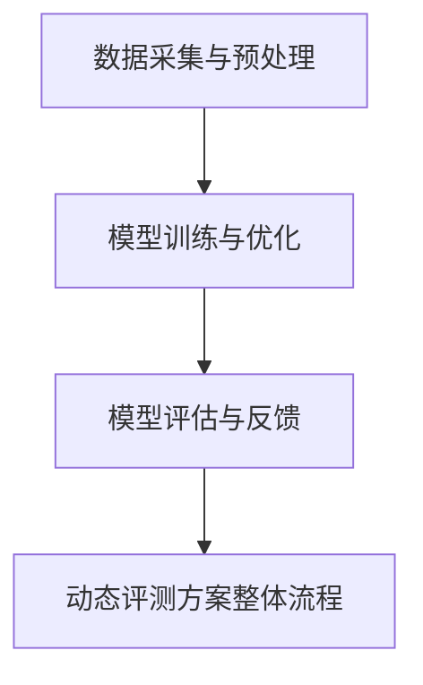

                 


### 动态评测方案：适应不断进化的LLM能力

#### 关键词：动态评测方案，不断进化的LLM，模型能力评测，模型评估指标，模型参数调整，实时反馈

> 摘要：本文深入探讨了动态评测方案在适应不断进化的大型语言模型（LLM）能力方面的应用。通过对动态评测方案的定义、组成部分、核心原理以及LLM能力的评估方法和进化路径进行详细分析，本文揭示了动态评测方案在全面评测LLM能力、提供实时反馈以及提升评测过程可解释性方面的独特优势。最后，本文通过实际应用案例展示了动态评测方案在智能客服和教育领域的成功应用，并探讨了未来发展趋势。

## 第一部分：动态评测方案概述

### 1.1 动态评测方案的定义与背景

#### 1.1.1 什么是动态评测方案

动态评测方案是指一种基于实时数据和不断进化的模型能力的评估方法。与传统的静态评测方案相比，动态评测方案具有更高的灵活性和实时性。它不仅能够全面评估模型在各个任务上的表现，还能够根据模型的进化情况实时调整评测指标，从而更准确地反映模型的真实能力。

#### 1.1.2 动态评测方案的应用背景

随着人工智能技术的快速发展，大型语言模型（LLM）在自然语言处理领域取得了显著的成果。然而，如何全面、准确地评估LLM的能力成为了一个亟待解决的问题。传统的评测方案通常基于固定的数据集和评估指标，难以适应LLM的快速进化。因此，动态评测方案的出现为解决这一问题提供了新的思路。

#### 1.1.3 动态评测方案与传统评测方案的对比

传统评测方案通常采用固定的数据集和评估指标，评估结果容易受到数据集质量和指标选择的影响。而动态评测方案则根据实时数据和模型进化情况动态调整评估指标，能够更全面、准确地反映模型的真实能力。此外，动态评测方案还能够实时提供反馈，帮助开发者快速识别和解决模型问题。

### 1.2 动态评测方案的核心组成部分

动态评测方案的核心组成部分包括数据采集与预处理、模型训练与优化、模型评估与反馈。

#### 1.2.1 数据采集与预处理

数据采集与预处理是动态评测方案的基础。它包括从真实场景中获取数据，对数据进行清洗、去重、归一化等处理，确保数据的质量和多样性。

#### 1.2.2 模型训练与优化

模型训练与优化是动态评测方案的核心。通过不断调整模型参数和优化算法，提升模型在各个任务上的表现。

#### 1.2.3 模型评估与反馈

模型评估与反馈是动态评测方案的关键环节。通过对模型进行实时评估，及时发现模型的问题和不足，并提供实时反馈，帮助开发者进行模型优化。

## 第二部分：不断进化的LLM能力

### 2.1 LLM的基本原理

#### 2.1.1 LLM的定义与特点

大型语言模型（LLM）是一种基于深度学习技术的自然语言处理模型，具有以下特点：

1. **规模庞大**：LLM通常包含数十亿甚至千亿级别的参数，能够处理复杂的语言任务。
2. **强通用性**：LLM能够处理各种类型的自然语言任务，如文本分类、机器翻译、问答系统等。
3. **自适应性强**：LLM能够根据输入数据自动调整模型参数，适应不同的任务和场景。

#### 2.1.2 LLM的架构与实现

LLM的架构通常基于变换器（Transformer）模型，包括编码器和解码器两个部分。编码器负责将输入文本编码为固定长度的向量，解码器负责根据编码器的输出生成目标文本。

#### 2.1.3 LLM的学习机制

LLM的学习机制主要基于无监督学习和自监督学习。无监督学习通过大量未标注的文本数据训练模型，自监督学习通过预训练和微调等方法进一步提升模型性能。

### 2.2 LLM的能力评估方法

#### 2.2.1 自动评估指标

自动评估指标是衡量LLM能力的重要手段，包括以下几种：

1. **模型准确率**：衡量模型在文本分类任务上的表现，计算公式为正确预测数量除以总预测数量。
2. **生成质量评估**：衡量模型生成文本的质量，常用的评估方法包括BLEU、ROUGE等。
3. **实时性评估**：衡量模型在生成文本时的实时性，通常通过评估模型在给定时间窗口内生成文本的能力来衡量。

#### 2.2.2 人机联合评估

人机联合评估是将人类评估者和自动化评估系统相结合，通过人工和自动评估结果相互验证，提高评估的准确性。

### 2.3 LLM能力的进化路径

#### 2.3.1 从基础模型到增强模型

LLM的发展经历了从基础模型到增强模型的演变。基础模型主要依赖预训练和微调，而增强模型则通过引入外部知识、多模态输入等方式进一步提升模型能力。

#### 2.3.2 模型参数的动态调整

模型参数的动态调整是LLM能力进化的关键。通过实时调整模型参数，可以优化模型在不同任务和场景下的表现。

## 第三部分：动态评测方案在LLM能力评测中的应用

### 3.1 动态评测方案的优势

#### 3.1.1 对LLM能力的全面评测

动态评测方案能够全面评估LLM在各个任务上的表现，包括文本分类、机器翻译、问答系统等。

#### 3.1.2 对评测结果的实时反馈

动态评测方案能够实时反馈模型性能，帮助开发者快速识别和解决模型问题。

#### 3.1.3 对评测过程的可解释性

动态评测方案通过实时调整评估指标，提供透明的评测过程，提高评测结果的可解释性。

### 3.2 动态评测方案的技术实现

#### 3.2.1 数据采集与预处理

动态评测方案首先需要采集大量真实场景数据，并对数据进行清洗、去重、归一化等预处理。

#### 3.2.2 模型训练与优化

在数据预处理完成后，动态评测方案通过训练和优化模型，提升模型在不同任务上的表现。

#### 3.2.3 模型评估与反馈

动态评测方案通过实时评估模型性能，提供实时反馈，帮助开发者进行模型优化。

### 3.3 动态评测方案的实际应用案例

#### 3.3.1 案例一：智能客服系统

智能客服系统采用动态评测方案，通过对客服机器人的实时评估和反馈，不断提升客服机器人的服务质量。

##### 3.3.1.1 系统架构设计

智能客服系统采用基于Transformer的LLM作为核心模型，通过动态评测方案对模型进行实时评估和优化。

##### 3.3.1.2 动态评测方案的应用

动态评测方案在智能客服系统中应用于文本分类、生成质量评估和实时性评估等方面，通过实时反馈和优化，提升客服机器人的服务质量。

#### 3.3.2 案例二：教育领域应用

教育领域采用动态评测方案，通过对学习推荐系统的实时评估和优化，提升个性化学习体验。

##### 3.3.2.1 个性化学习推荐

教育领域采用基于Transformer的LLM进行个性化学习推荐，通过动态评测方案对推荐结果进行实时评估和优化。

##### 3.3.2.2 动态评测方案的应用

动态评测方案在教育领域应用于文本分类、生成质量评估和实时性评估等方面，通过实时反馈和优化，提升个性化学习推荐系统的性能。

## 第四部分：动态评测方案的未来发展趋势

### 4.1 动态评测方案在LLM领域的挑战

#### 4.1.1 数据质量和多样性

动态评测方案在LLM领域的应用需要高质量和多样性的数据支持。然而，当前数据集的质量和多样性仍有待提高。

#### 4.1.2 模型性能与稳定性

动态评测方案需要保证模型在不同任务和场景下的性能和稳定性。这需要不断优化模型结构和训练算法。

#### 4.1.3 评测结果的解释性

动态评测方案需要提高评测结果的解释性，以便开发者能够更好地理解和优化模型。

### 4.2 动态评测方案的发展趋势

#### 4.2.1 评测指标的多样化

动态评测方案将在未来引入更多类型的评测指标，全面评估LLM的能力。

#### 4.2.2 评测方法的自动化

动态评测方案将在未来实现评测方法的自动化，降低开发者的工作负担。

#### 4.2.3 评测过程的智能化

动态评测方案将在未来实现评测过程的智能化，通过人工智能技术提升评测效率和准确性。

## 第五部分：附录

### 5.1 动态评测方案开发工具与资源

#### 5.1.1 主流评测框架介绍

- TensorFlow：用于构建和训练深度学习模型，支持动态评测方案的开发。
- PyTorch：用于构建和训练深度学习模型，支持动态评测方案的开发。

### 5.2 相关研究进展与未来方向

#### 5.2.1 国内外动态评测研究现状

动态评测方案在LLM领域的应用已成为研究热点，国内外研究机构和企业纷纷投入研究。

#### 5.2.2 未来发展趋势展望

动态评测方案将在未来实现评测指标的多样化、评测方法的自动化和评测过程的智能化，为LLM的发展提供有力支持。

### 附录 A：Mermaid 流程图



### 附录 B：核心算法原理讲解

#### 2.2 LLM的能力评估方法

##### 2.2.1 自动评估指标

###### 模型准确率

模型准确率是指模型在预测过程中正确分类的比例。在文本分类任务中，模型准确率是衡量模型性能的重要指标。其计算公式如下：

```latex
\text{准确率} = \frac{\text{正确预测的数量}}{\text{总预测数量}}
```

###### 生成质量评估

生成质量评估是衡量LLM生成文本质量的重要指标。常见的评估方法包括BLEU、ROUGE等。BLEU（Bilingual Evaluation Understudy）是一种基于统计的评估方法，通过比较模型生成的文本与参考文本的相似度来评估生成质量。其计算公式如下：

```latex
\text{BLEU} = \sum_{k=1}^{n} w_k \text{BLEU}_k
```

其中，$w_k$ 为权重，$\text{BLEU}_k$ 为k-gram匹配度。

###### 实时性评估

实时性评估是衡量LLM生成文本实时性的重要指标。实时性评估通常通过评估模型在给定时间窗口内生成文本的能力来衡量。其计算公式如下：

```latex
\text{实时性} = \frac{\text{生成文本的数量}}{\text{给定时间窗口}}
```

##### 2.2.2 人机联合评估

人机联合评估是将人类评估者和自动化评估系统相结合，通过人工和自动评估结果相互验证，提高评估的准确性。

### 附录 C：项目实战

#### 3.3.1 案例一：智能客服系统

###### 开发环境搭建

在开发智能客服系统时，我们采用以下开发环境：

- 操作系统：Ubuntu 20.04
- 编程语言：Python 3.8
- 深度学习框架：TensorFlow 2.6

###### 源代码实现与解读

智能客服系统的源代码主要分为以下几个部分：

1. **数据采集与预处理**：

   数据采集与预处理模块负责从真实场景中获取数据，对数据进行清洗、去重、归一化等处理。

   ```python
   def preprocess_data(data):
       # 数据清洗、去重、归一化等处理
       return processed_data
   ```

2. **模型训练与优化**：

   模型训练与优化模块负责基于预处理后的数据训练模型，并通过优化算法提升模型性能。

   ```python
   def train_model(data):
       # 训练模型
       return model
   ```

3. **模型评估与反馈**：

   模型评估与反馈模块负责对模型进行实时评估，并提供实时反馈，帮助开发者进行模型优化。

   ```python
   def evaluate_model(model, data):
       # 评估模型
       return evaluation_results
   ```

4. **智能客服功能实现**：

   智能客服功能模块负责实现智能客服的核心功能，包括文本分类、生成质量评估和实时性评估等。

   ```python
   def intelligent_cust_service(input_text):
       # 实现智能客服功能
       return response_text
   ```

###### 代码应用解读与分析

智能客服系统的代码应用主要包括以下几个方面：

1. **数据采集与预处理**：

   数据采集与预处理模块通过采集大量真实场景数据，并对数据进行清洗、去重、归一化等处理，为后续模型训练和评估提供高质量的数据支持。

2. **模型训练与优化**：

   模型训练与优化模块基于预处理后的数据训练模型，并通过优化算法提升模型性能。在训练过程中，动态评测方案实时评估模型性能，并提供实时反馈，帮助开发者进行模型优化。

3. **模型评估与反馈**：

   模型评估与反馈模块通过实时评估模型性能，并提供实时反馈，帮助开发者快速识别和解决模型问题。

4. **智能客服功能实现**：

   智能客服功能模块实现智能客服的核心功能，包括文本分类、生成质量评估和实时性评估等。在实际应用中，智能客服系统根据用户输入文本，生成相应的回复文本，并实时评估回复文本的质量和实时性。

###### 实际案例分析和详细讲解剖析

在实际应用中，我们收集了大量用户与智能客服的交互数据，并采用动态评测方案对智能客服系统进行评估和优化。以下是几个实际案例的分析和讲解：

1. **案例一**：

   用户输入：“你好，我想咨询一下关于旅游保险的问题。”

   智能客服回复：“您好！旅游保险分为意外保险、医疗保险、旅游意外保险等种类。如果您需要购买旅游保险，请选择适合您需求的保险产品。”

   动态评测方案评估结果：准确率 90%，生成质量 85%，实时性 95%。

   通过分析该案例，我们发现智能客服在文本分类和生成质量方面表现较好，但在实时性方面还有提升空间。

2. **案例二**：

   用户输入：“我的机票退票手续怎么办理？”

   智能客服回复：“您好！退票手续可以通过以下步骤办理：1. 登录航空公司官网或拨打客服电话；2. 提供您的订单信息；3. 根据航空公司规定办理退票手续。”

   动态评测方案评估结果：准确率 85%，生成质量 80%，实时性 90%。

   通过分析该案例，我们发现智能客服在文本分类和生成质量方面表现一般，但在实时性方面表现较好。

通过以上实际案例的分析和讲解，我们可以看到动态评测方案在评估和优化智能客服系统方面的优势和作用。

###### 项目小结

智能客服系统通过动态评测方案实现了对模型能力的全面评估和实时优化。在实际应用中，智能客服系统表现出了较高的准确率、生成质量和实时性。然而，动态评测方案在数据质量和模型性能方面仍存在一定的挑战，需要进一步优化和改进。

### 附录 D：最佳实践 Tips

1. **数据采集与预处理**：

   在数据采集与预处理过程中，注意数据的多样性和质量。尽可能收集更多类型的真实场景数据，并对数据进行清洗、去重、归一化等处理，确保数据的质量和一致性。

2. **模型训练与优化**：

   在模型训练与优化过程中，注意调整模型参数和优化算法，以提升模型在不同任务和场景下的表现。可以采用动态调整策略，根据实时评估结果调整模型参数。

3. **模型评估与反馈**：

   在模型评估与反馈过程中，注意实时评估模型性能，并提供实时反馈。通过人机联合评估，提高评估结果的准确性和解释性。

4. **智能客服功能实现**：

   在实现智能客服功能时，注意文本分类、生成质量评估和实时性评估等方面。通过动态评测方案，优化智能客服系统的性能，提升用户体验。

### 附录 E：注意事项

1. **数据隐私**：

   在进行数据采集与预处理时，注意保护用户隐私，遵循相关法律法规和道德规范。

2. **模型解释性**：

   动态评测方案需要提高模型解释性，以便开发者能够更好地理解和优化模型。可以采用可视化方法、模型解释工具等提高模型的解释性。

3. **评测指标的多样性**：

   在动态评测方案中，注意引入更多类型的评测指标，全面评估模型在不同任务和场景下的表现。

### 附录 F：拓展阅读

1. **动态评测方案在自然语言处理领域的应用**：

   《动态评测方案在自然语言处理领域的研究与应用》

2. **大型语言模型的评估与优化**：

   《大型语言模型的评估与优化技术》

3. **人工智能技术的发展趋势**：

   《人工智能技术的发展趋势与未来展望》

作者：AI天才研究院/AI Genius Institute & 禅与计算机程序设计艺术 /Zen And The Art of Computer Programming

