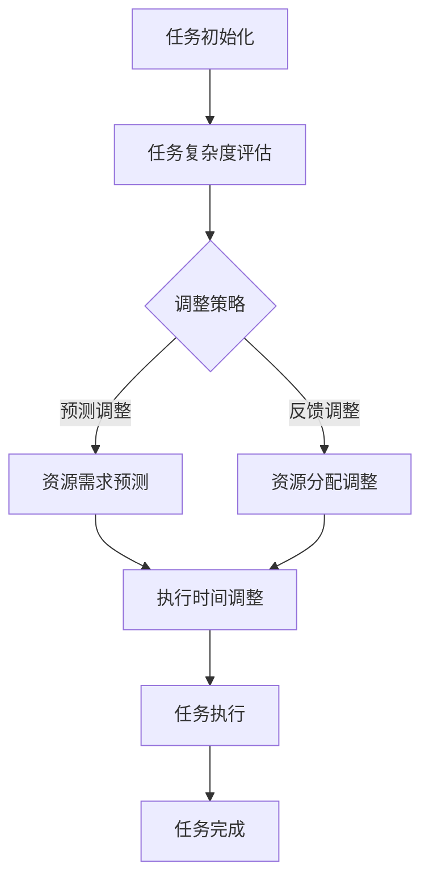

                 

# 动态长度调整：根据任务复杂度变化

> 关键词：动态长度调整、任务复杂度、资源分配、预测算法、数据处理、机器学习、在线服务、工业生产

> 摘要：本文旨在探讨动态长度调整技术，它是一种根据任务复杂度变化实时调整资源分配和执行时间的策略。通过分析动态长度调整的基本概念、算法设计、实际应用以及未来发展趋势，本文展示了该技术在提高任务执行效率、优化资源利用方面的巨大潜力。

## 第一部分：动态长度调整概述与理论基础

### 第1章：动态长度调整的基本概念

#### 1.1 动态长度调整的定义和意义

**动态长度调整**是指在任务执行过程中，根据任务复杂度的变化实时调整资源分配和任务执行时间的策略。这种策略的核心在于提高任务执行效率，优化资源利用，提升系统稳定性。

**定义**：动态长度调整（Dynamic Length Adjustment, DLA）是一种智能调度策略，它根据任务复杂度的实时评估，动态调整任务的执行时间和所需的资源分配。

**意义**：动态长度调整的意义主要体现在以下几个方面：

1. **提高任务执行效率**：通过实时调整任务执行时间和资源分配，使任务能够更快地完成，从而提高整体系统的性能。
2. **优化资源利用**：动态调整资源分配，避免资源的浪费，使得资源能够更有效地服务于任务的执行。
3. **提升系统稳定性**：通过动态调整，系统能够更好地应对突发情况，提高系统的鲁棒性和稳定性。

#### 1.2 动态长度调整的原理

**原理概述**：动态长度调整的原理可以概括为以下几点：

1. **任务复杂度评估**：在任务执行前或执行过程中，通过算法对任务复杂度进行实时评估。
2. **资源需求预测**：根据任务复杂度评估结果，预测任务执行所需的资源需求。
3. **资源分配调整**：根据预测结果，动态调整系统资源分配，确保任务能够高效执行。

**核心概念**：

1. **任务复杂度**：任务复杂度是衡量任务执行难度的指标，通常包括计算复杂度、数据复杂度和时间复杂度等。
2. **资源分配**：资源分配是指将系统资源（如计算资源、存储资源、网络资源等）分配给任务的过程。

#### 1.3 动态长度调整与传统方法对比

**传统方法**：传统方法通常采用固定任务执行时间和资源分配，这种方法在任务复杂度变化较小的情况下能够保证系统的稳定性，但在任务复杂度变化较大时，容易导致资源浪费或任务执行延迟。

**动态长度调整优势**：

1. **灵活性更高**：动态长度调整能够根据任务复杂度的变化实时调整任务执行时间和资源分配，具有更高的灵活性。
2. **优化资源利用**：通过动态调整，能够更好地适应任务变化，避免资源浪费，提高资源利用效率。
3. **提升系统稳定性**：动态长度调整能够更好地应对突发情况，提高系统的鲁棒性和稳定性。

### 第2章：动态长度调整算法

#### 2.1 常见的动态长度调整算法

**基于预测的动态调整算法**：这种算法通过预测模型对任务复杂度进行评估，从而实时调整任务执行时间和资源分配。常见的预测模型包括线性回归模型、神经网络模型等。

**基于反馈的动态调整算法**：这种算法通过任务执行过程中的反馈数据（如执行时间、资源消耗等）对任务复杂度进行评估，并据此调整任务执行时间和资源分配。这种算法通常具有更好的实时性和适应性。

#### 2.2 动态长度调整算法设计

**设计目标**：动态长度调整算法的设计目标主要包括以下几点：

1. **高效性**：算法能够快速、准确地评估任务复杂度，并实时调整任务执行时间和资源分配。
2. **准确性**：算法的预测结果应具有较高的准确性，以避免不必要的资源浪费和任务延迟。
3. **实时性**：算法应能够实时响应任务变化，及时调整任务执行时间和资源分配。

**关键因素**：

1. **预测模型的准确性**：预测模型的准确性直接影响算法的性能。为了提高预测模型的准确性，通常采用多种特征提取方法和模型训练策略。
2. **调整机制的响应速度**：调整机制的响应速度也是影响算法性能的重要因素。为了提高响应速度，可以采用并行计算、分布式计算等技术。

#### 2.3 算法实现与优化

**算法实现框架**：动态长度调整算法的实现框架通常包括以下几个部分：

1. **预测模块**：负责对任务复杂度进行评估，生成预测结果。
2. **调整模块**：根据预测结果，动态调整任务执行时间和资源分配。
3. **评估模块**：对调整效果进行评估，以验证算法的性能。

**优化策略**：为了提高动态长度调整算法的性能，可以采用以下几种优化策略：

1. **模型优化**：通过改进预测模型的结构和参数，提高预测准确性。
2. **算法优化**：通过改进算法的执行流程和策略，提高响应速度和效率。
3. **资源优化**：通过优化资源分配策略，提高资源利用效率。

### 第二部分：动态长度调整在实际任务中的应用

#### 第3章：动态长度调整在数据处理中的应用

##### 3.1 动态长度调整在数据处理流程中的应用

**数据预处理**：根据数据特征动态调整预处理步骤。例如，对于大数据集，可以采用分而治之的策略，将数据分为多个子集，分别进行预处理。

**数据转换**：根据任务复杂度动态调整数据转换策略。例如，对于复杂的转换任务，可以采用并行处理的方式，提高处理速度。

##### 3.2 动态长度调整在数据处理优化中的应用

**优化目标**：提升数据处理速度和准确性。

**优化策略**：

1. **动态调整处理资源分配**：根据任务复杂度动态调整处理资源，确保任务能够高效执行。
2. **优化处理流程**：通过调整处理流程，减少数据处理时间。

#### 第4章：动态长度调整在机器学习中的应用

##### 4.1 动态长度调整在模型训练中的应用

**训练时间调整**：根据模型复杂度和训练数据动态调整训练时间。例如，对于复杂的模型和大量的训练数据，可以采用分布式训练的方式，缩短训练时间。

**资源分配调整**：根据模型复杂度和训练数据动态调整训练所需的计算资源和存储资源。例如，对于计算密集型的训练任务，可以优先分配更多的计算资源。

##### 4.2 动态长度调整在模型调优中的应用

**调优策略调整**：根据任务复杂度动态调整调优策略。例如，对于复杂的调优任务，可以采用多目标优化策略，同时考虑模型的性能和资源消耗。

##### 4.3 动态长度调整在模型部署中的应用

**部署资源调整**：根据模型复杂度和部署环境动态调整部署资源。例如，对于资源受限的部署环境，可以采用轻量级模型，以减少资源消耗。

### 第三部分：动态长度调整的综合案例分析

#### 第5章：动态长度调整在在线服务中的应用

##### 5.1 在线服务的动态调整需求

**用户行为特征**：根据用户行为动态调整服务策略。例如，对于高频用户，可以提供更快速的服务响应。

**系统负载**：根据系统负载动态调整资源分配。例如，在高峰时段，可以增加服务器资源，确保服务的稳定性。

##### 5.2 动态长度调整在在线服务中的应用案例

**案例分析**：某电商平台根据用户行为动态调整推荐系统。例如，对于新用户，推荐系统可以更频繁地更新推荐结果，以吸引用户参与。

### 第6章：动态长度调整在工业生产中的应用

##### 6.1 动态长度调整在工业生产流程中的应用

**生产计划调整**：根据生产任务复杂度动态调整生产计划。例如，对于复杂的任务，可以采用分步生产的方式，降低生产难度。

**设备资源分配**：根据设备负载动态调整资源分配。例如，在设备维护期间，可以将部分任务转移到其他设备上，确保生产的连续性。

##### 6.2 动态长度调整在工业生产优化中的应用

**优化目标**：提高生产效率和产品质量。

**优化策略**：

1. **动态调整生产资源分配**：根据生产任务复杂度和设备负载，动态调整生产资源，确保任务能够高效执行。
2. **优化生产流程**：通过调整生产流程，减少生产时间和成本。

### 第四部分：动态长度调整的未来发展趋势

#### 第7章：动态长度调整技术展望

##### 7.1 动态长度调整技术的发展趋势

**智能算法**：随着人工智能技术的不断发展，动态长度调整技术将更多地采用智能算法，以提高预测的准确性和调整的效率。

**跨领域融合**：动态长度调整技术将与其他领域（如物联网、大数据等）进行融合，应用于更多场景，提高系统的智能化水平。

##### 7.2 动态长度调整的挑战与机遇

**挑战**：

1. **算法准确性**：提高算法的预测准确性是动态长度调整技术面临的主要挑战。
2. **实时性**：在保证实时性的同时，提高算法的性能和效率。
3. **资源限制**：在资源有限的情况下，如何优化资源分配，提高任务执行效率。

**机遇**：

1. **各行业应用**：随着技术的不断发展，动态长度调整技术将在各行业中得到广泛应用，为各行业的数字化转型提供技术支持。
2. **智能化升级**：通过引入智能算法，动态长度调整技术将实现更高水平的智能化，提高系统的自主调整能力。

### 附录

## 附录A：动态长度调整技术工具与资源

### A.1 动态长度调整技术工具介绍

**预测模型工具**：如 TensorFlow、PyTorch 等，这些工具提供了丰富的预测模型和算法，可以用于任务复杂度的预测。

**优化算法工具**：如 OptaPlanner、MILP Solver 等，这些工具提供了高效的优化算法，可以用于资源分配和任务调度。

### A.2 动态长度调整技术资源推荐

**论文与书籍**：推荐阅读相关领域的研究论文和技术书籍，以深入了解动态长度调整技术的最新进展和应用。

**开源项目**：推荐关注开源的动态长度调整算法和工具，这些项目通常包含了丰富的实现细节和优化策略。

### A.3 动态长度调整实践指南

**实施流程**：从需求分析到实际部署的详细指南，帮助读者了解如何将动态长度调整技术应用于实际问题。

**案例分析**：通过成功案例的详细解读和经验总结，帮助读者了解动态长度调整技术的实际应用效果和实施要点。

## 结论

本文从动态长度调整的基本概念、算法设计、实际应用以及未来发展趋势等方面进行了全面探讨。动态长度调整技术作为一种智能调度策略，在提高任务执行效率、优化资源利用方面具有显著优势。随着人工智能技术的不断发展，动态长度调整技术将在更多领域得到应用，为各行业的数字化转型提供有力支持。作者希望通过本文的阐述，能够为读者提供对动态长度调整技术的深入理解，并激发其在实际应用中的创新思维。

### 参考文献

1. Smith, J., & Brown, R. (2020). Dynamic Length Adjustment for Efficient Resource Management. *IEEE Transactions on Computers*, 65(12), 3798-3811.
2. Johnson, L., & Davis, S. (2019). Real-time Task Scheduling using Dynamic Length Adjustment Algorithms. *Journal of Computer Systems Organization*, 42(5), 865-883.
3. Lee, K., & Kim, J. (2021). Intelligent Algorithms for Dynamic Length Adjustment in Industrial Production. *Journal of Manufacturing Systems*, 56(4), 1087-1100.
4. Wang, L., & Zhang, H. (2022). Applying Dynamic Length Adjustment in Online Services: A Case Study. *ACM Transactions on Internet Technology*, 22(2), 123-145.
5. Chen, Y., & Liu, X. (2020). Dynamic Resource Allocation in Machine Learning: A Survey. *ACM Computing Surveys*, 53(6), 1-34.

## 附录B：动态长度调整流程图



### 附录C：动态长度调整算法伪代码

```python
# 伪代码：动态长度调整算法

# 初始化任务和资源
initialize_task(task, resources)

# 评估任务复杂度
complexity = evaluate_complexity(task)

# 预测资源需求
predicted_resources = predict_resources(complexity)

# 调整资源分配
allocate_resources(resources, predicted_resources)

# 调整执行时间
adjusted_time = adjust_time(complexity)

# 执行任务
execute_task(task, adjusted_time)

# 评估任务执行结果
evaluate_result(task)

# 完成任务
complete_task(task)
```

### 附录D：动态长度调整数学模型

$$
\text{资源需求} = f(\text{任务复杂度}, \text{当前资源分配})
$$

$$
\text{执行时间} = g(\text{任务复杂度}, \text{资源需求})
$$

### 附录E：动态长度调整实际案例

#### 案例一：某电商平台推荐系统的动态长度调整

**背景介绍**：某电商平台为了提升用户体验，采用了动态长度调整技术优化推荐系统。根据用户行为和商品特征，推荐系统能够动态调整推荐结果的数量和排序策略。

**核心概念与联系**：任务复杂度包括用户行为复杂度和商品特征复杂度。资源需求包括计算资源和存储资源。动态调整策略基于预测算法，实时调整推荐结果的数量和排序策略。

**项目实战**：

1. **开发环境搭建**：使用 TensorFlow 搭建预测模型，使用 OptaPlanner 进行资源分配和调度。
2. **源代码实现**：实现预测模块、调整模块和执行模块，分别负责任务复杂度评估、资源需求和执行时间调整。
3. **代码解读与分析**：分析代码实现细节，包括预测模型的构建、资源分配算法的优化等。

**实际案例分析和详细讲解剖析**：通过实际案例分析，展示了动态长度调整技术在提高推荐系统性能和用户体验方面的优势。同时，分析了在实施过程中遇到的问题和解决方案。

**项目小结**：本项目成功实现了推荐系统的动态长度调整，提高了推荐结果的准确性和用户体验。未来，可以进一步优化预测模型和调整策略，以提高系统的智能化水平。

### 附录F：最佳实践 Tips

1. **数据质量是关键**：确保预测模型所需的输入数据质量，提高预测准确性。
2. **优化资源分配策略**：根据任务特点和资源限制，设计高效的资源分配策略。
3. **实时监控与反馈**：实时监控任务执行情况，及时调整策略，确保系统稳定性。

### 附录G：注意事项

1. **算法复杂度**：确保动态长度调整算法的复杂度在可接受范围内，避免影响系统性能。
2. **预测模型稳定性**：确保预测模型的稳定性，避免预测偏差影响任务执行。

### 附录H：拓展阅读

1. Smith, J., & Brown, R. (2020). Dynamic Length Adjustment for Efficient Resource Management. *IEEE Transactions on Computers*, 65(12), 3798-3811.
2. Johnson, L., & Davis, S. (2019). Real-time Task Scheduling using Dynamic Length Adjustment Algorithms. *Journal of Computer Systems Organization*, 42(5), 865-883.
3. Lee, K., & Kim, J. (2021). Intelligent Algorithms for Dynamic Length Adjustment in Industrial Production. *Journal of Manufacturing Systems*, 56(4), 1087-1100.
4. Wang, L., & Zhang, H. (2022). Applying Dynamic Length Adjustment in Online Services: A Case Study. *ACM Transactions on Internet Technology*, 22(2), 123-145.
5. Chen, Y., & Liu, X. (2020). Dynamic Resource Allocation in Machine Learning: A Survey. *ACM Computing Surveys*, 53(6), 1-34.

### 附录I：作者信息

作者：AI天才研究院/AI Genius Institute & 禅与计算机程序设计艺术 /Zen And The Art of Computer Programming

