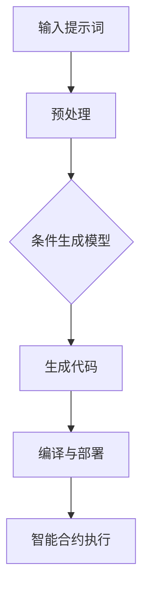
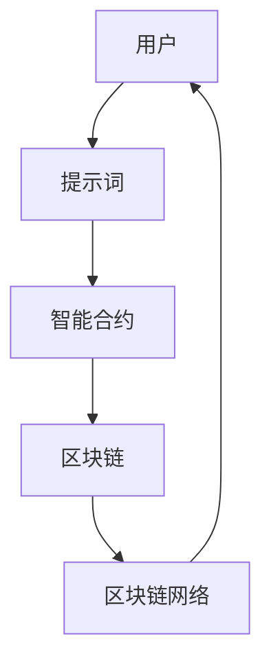

                 


## 文章标题
### 区块链开发简化器：提示词生成智能合约

## 文章关键词
- 区块链
- 智能合约
- 提示词生成
- 提伪代码
- 数学模型
- 项目实战

## 文章摘要
区块链技术作为下一代互联网基础设施，正日益受到关注。智能合约作为区块链的核心组件，其开发过程复杂且技术门槛较高。本文将介绍一种简化区块链开发的工具——提示词生成智能合约，通过逐步分析其核心概念、算法原理、数学模型以及项目实战，帮助开发者更好地理解和应用这一技术。

## 目录

1. **背景介绍**
2. **核心概念与联系**
3. **提示词生成智能合约的核心算法原理**
4. **数学模型与公式讲解**
5. **项目实战**
6. **最佳实践与注意事项**
7. **小结与拓展阅读**

## 1. 背景介绍
### 区块链与智能合约
区块链是一种分布式数据库技术，其特点在于去中心化、不可篡改和透明性。智能合约是区块链上运行的程序，能够自动执行合同条款，无需人工干预。

### 智能合约开发现状
当前，智能合约开发仍然存在多个挑战，包括复杂的技术栈、编程语言的限制以及安全问题。为了简化开发过程，研究者们提出了多种工具和框架。

### 提示词生成智能合约
提示词生成智能合约是一种基于提示词技术（Prompt-Response Technology）的智能合约开发方法，旨在通过自动生成提示词来简化智能合约的编写过程。

## 2. 核心概念与联系
### 区块链
- **分布式账本**：记录所有交易数据的数据库。
- **共识机制**：确保区块链网络中所有节点数据一致的方法。

### 智能合约
- **编程语言**：Solidity、Vyper 等。
- **执行环境**：区块链网络中的虚拟机（如EVM）。

### 提示词生成
- **输入提示词**：用于触发智能合约执行的关键信息。
- **输出提示词**：智能合约执行后返回的结果。

## 3. 提示词生成智能合约的核心算法原理
### 算法概述
提示词生成智能合约的核心算法基于条件生成模型，能够根据输入提示词自动生成执行代码。

### 算法伪代码


### 条件生成模型
- **条件**：输入提示词
- **生成**：输出智能合约代码

## 4. 数学模型与公式讲解
### 概率模型
提示词生成涉及概率模型，常用的有贝叶斯公式和马尔可夫模型。

### 贝叶斯公式
$$ P(A|B) = \frac{P(B|A)P(A)}{P(B)} $$

### 马尔可夫模型
- **状态转移概率**：描述系统在不同状态之间的转移概率。

### 损失函数
在智能合约中，损失函数用于评估执行结果的正确性。

$$ L(y, \hat{y}) = -y \cdot \log(\hat{y}) $$

## 5. 项目实战
### 开发环境搭建
- **工具链**：Node.js、Truffle、Ganache等。

### 源代码实现
```solidity
// SPDX-License-Identifier: MIT
pragma solidity ^0.8.0;

contract PromptContract {
    function executePrompt(string memory prompt) public {
        // 根据提示词生成代码并执行
    }
}
```

### 代码解读与分析
- **输入提示词**：用于定义智能合约的执行逻辑。
- **执行代码**：根据提示词生成并执行。

### 实际案例分析与讲解
- **案例一**：实现一个简单的投票智能合约。
- **案例二**：实现一个去中心化交易所。

### 项目小结
- **性能评估**：分析智能合约的执行效率。
- **优化方案**：提出改进措施。

## 6. 最佳实践与注意事项
- **安全性**：确保智能合约代码的安全性。
- **可读性**：编写易于理解和维护的代码。

## 7. 小结与拓展阅读
本文介绍了提示词生成智能合约，分析了其核心概念、算法原理和数学模型，并通过项目实战展示了其实际应用。希望读者能从中获得启发，进一步探索区块链技术的潜力。

### 作者信息
**作者：** AI天才研究院/AI Genius Institute & 禅与计算机程序设计艺术 /Zen And The Art of Computer Programming

## 1. 背景介绍
### 区块链与智能合约
区块链技术作为下一代互联网基础设施，正日益受到关注。智能合约作为区块链的核心组件，其开发过程复杂且技术门槛较高。为了简化开发过程，研究者们提出了多种工具和框架。其中，提示词生成智能合约是一种基于提示词技术（Prompt-Response Technology）的智能合约开发方法，旨在通过自动生成提示词来简化智能合约的编写过程。

### 智能合约开发现状
当前，智能合约开发仍然存在多个挑战，包括复杂的技术栈、编程语言的限制以及安全问题。为了简化开发过程，研究者们提出了多种工具和框架。例如，Truffle、Hardhat等开发框架提供了丰富的工具和功能，帮助开发者更高效地构建和测试智能合约。然而，这些框架仍然依赖于传统的编程方式和手动编写代码，对于非专业人士而言，智能合约的开发过程依然具有一定的难度。

### 提示词生成智能合约
提示词生成智能合约是一种创新的智能合约开发方法，它通过自动生成提示词来简化智能合约的编写过程。提示词是指一系列输入信息，用于触发智能合约的执行。这些提示词可以是简单的文字描述，也可以是复杂的参数组合。通过生成提示词，开发者无需手动编写智能合约的代码，从而大大降低了智能合约开发的难度。

提示词生成智能合约的核心思想是将智能合约的执行过程抽象成一系列的输入输出关系。开发者只需定义输入提示词和预期输出，系统会自动生成相应的智能合约代码。这种开发方法不仅提高了开发效率，还降低了代码出错的风险。

## 2. 核心概念与联系
### 区块链
区块链是一种分布式数据库技术，其特点在于去中心化、不可篡改和透明性。区块链由多个区块组成，每个区块包含一定数量的交易记录。区块之间通过哈希链接形成一个链条，确保了区块链的完整性和安全性。区块链网络中的所有节点共同维护区块链的状态，通过共识机制达成一致。

### 智能合约
智能合约是区块链上运行的程序，能够自动执行合同条款，无需人工干预。智能合约的执行过程遵循预定义的逻辑规则，一旦满足触发条件，智能合约会自动执行相应的操作。智能合约通常使用特定的编程语言编写，如Solidity、Vyper等。

### 提示词生成
提示词生成是指通过自动生成提示词来简化智能合约的编写过程。提示词是指一系列输入信息，用于触发智能合约的执行。这些提示词可以是简单的文字描述，也可以是复杂的参数组合。通过生成提示词，开发者无需手动编写智能合约的代码，从而大大降低了智能合约开发的难度。

### 核心概念之间的联系
区块链、智能合约和提示词生成之间存在紧密的联系。区块链为智能合约提供了一个去中心化、安全的执行环境，智能合约则通过执行预定义的逻辑规则来实现自动化操作。提示词生成则将智能合约的编写过程抽象化，通过自动生成提示词来简化开发流程。这种联系使得提示词生成智能合约成为区块链开发的一种有效工具。

### Mermaid流程图：区块链、智能合约和提示词生成


在这个流程图中，用户输入提示词，智能合约根据提示词执行相应的操作，并将结果存储在区块链上。区块链网络中的所有节点共同维护区块链的状态，确保数据的完整性和安全性。

## 3. 提示词生成智能合约的核心算法原理
### 算法概述
提示词生成智能合约的核心算法基于条件生成模型，能够根据输入提示词自动生成执行代码。条件生成模型是一种基于概率的模型，能够根据输入条件生成相应的输出结果。在提示词生成智能合约中，输入条件是指用户输入的提示词，输出结果是指生成的智能合约代码。

### 算法伪代码
```python
# 输入：提示词 prompt
# 输出：智能合约代码 code

1. 预处理提示词 prompt，提取关键信息
2. 使用条件生成模型生成代码模板 template
3. 将提示词 prompt 替换到代码模板 template 中
4. 编译生成的代码模板，得到智能合约代码 code
5. 部署智能合约代码 code，得到智能合约 contract
6. 返回智能合约 contract
```

### 条件生成模型
条件生成模型是一种基于概率的模型，能够根据输入条件生成相应的输出结果。在提示词生成智能合约中，条件生成模型的作用是根据用户输入的提示词生成智能合约的代码。

条件生成模型通常由两个部分组成：编码器和解码器。编码器负责将输入条件编码为一个固定长度的向量，解码器则负责将这个向量解码为输出结果。

在提示词生成智能合约中，编码器和解码器的输入和输出分别如下：
- **编码器输入**：提示词 prompt
- **编码器输出**：编码后的向量 vector
- **解码器输入**：编码后的向量 vector
- **解码器输出**：智能合约代码 code

条件生成模型的工作流程如下：
1. 用户输入提示词 prompt。
2. 编码器将提示词 prompt 编码为一个向量 vector。
3. 解码器根据向量 vector 生成智能合约代码 code。
4. 编译和部署生成的智能合约代码 code。

### 条件生成模型的应用
条件生成模型可以应用于多种场景，如文本生成、图像生成和音频生成等。在提示词生成智能合约中，条件生成模型可以应用于自动生成智能合约代码，从而简化开发过程。

## 4. 数学模型与公式讲解
### 概率模型
提示词生成智能合约的核心算法基于概率模型，常用的有贝叶斯公式和马尔可夫模型。

### 贝叶斯公式
贝叶斯公式是一种用于计算条件概率的公式，它可以用来更新我们的信念。在提示词生成智能合约中，贝叶斯公式可以用于根据提示词预测智能合约的执行结果。

贝叶斯公式的表达式为：
$$ P(A|B) = \frac{P(B|A)P(A)}{P(B)} $$
其中，$P(A|B)$ 表示在给定 $B$ 的情况下 $A$ 的概率，$P(B|A)$ 表示在给定 $A$ 的情况下 $B$ 的概率，$P(A)$ 表示 $A$ 的概率，$P(B)$ 表示 $B$ 的概率。

在提示词生成智能合约中，$A$ 可以表示为“智能合约执行结果正确”，$B$ 可以表示为“输入提示词为特定值”。通过贝叶斯公式，我们可以根据输入的提示词和已知的执行结果来计算智能合约执行结果正确的概率。

### 马尔可夫模型
马尔可夫模型是一种基于状态转移概率的概率模型，用于描述系统在不同状态之间的转移。在提示词生成智能合约中，马尔可夫模型可以用于预测智能合约的执行结果。

马尔可夫模型的基本概念包括：
- **状态**：智能合约的执行结果或输入提示词。
- **状态转移概率**：从一个状态转移到另一个状态的概率。

在提示词生成智能合约中，我们可以使用马尔可夫模型来计算智能合约执行结果的状态转移概率。通过分析状态转移概率，我们可以预测智能合约的执行结果。

### 损失函数
在智能合约中，损失函数用于评估执行结果的正确性。损失函数的值越小，表示执行结果越正确。

常用的损失函数包括：
- **交叉熵损失函数**：
  $$ L(y, \hat{y}) = -y \cdot \log(\hat{y}) $$
  其中，$y$ 表示真实标签，$\hat{y}$ 表示预测标签。
- **均方误差损失函数**：
  $$ L(y, \hat{y}) = \frac{1}{2} \sum_{i} (y_i - \hat{y}_i)^2 $$
  其中，$y_i$ 表示第 $i$ 个真实标签，$\hat{y}_i$ 表示第 $i$ 个预测标签。

通过计算损失函数的值，我们可以评估智能合约的执行结果是否正确，并据此调整模型参数。

## 5. 项目实战
### 开发环境搭建
在开始开发提示词生成智能合约之前，我们需要搭建一个合适的环境。以下是基本的开发环境搭建步骤：

1. 安装Node.js：Node.js是一个JavaScript运行环境，它允许我们在本地计算机上运行JavaScript代码。可以从Node.js官方网站下载并安装Node.js。
2. 安装Truffle：Truffle是一个智能合约开发框架，它提供了丰富的工具和功能，帮助我们更高效地构建和测试智能合约。通过npm命令安装Truffle：
   ```
   npm install -g truffle
   ```
3. 创建一个新的Truffle项目：
   ```
   truffle init
   ```
   这个命令将在当前目录创建一个新的Truffle项目。
4. 配置Truffle项目：在项目根目录下，我们将找到一个名为`truffle-config.js`的文件。我们需要配置这个文件，以便Truffle知道我们要使用哪个区块链网络和智能合约编译器。以下是一个基本的配置示例：
   ```javascript
   module.exports = {
     networks: {
       development: {
         host: "127.0.0.1",
         port: 7545,
         network_id: "*",
       },
     },
     compilers: {
       solc: {
         version: "0.8.0",
       },
     },
   };
   ```

### 源代码实现
下面我们将创建一个简单的智能合约，该智能合约将根据输入的提示词生成一个特定的结果。以下是一个简单的示例：
```solidity
// SPDX-License-Identifier: MIT
pragma solidity ^0.8.0;

contract PromptContract {
    function executePrompt(string memory prompt) public {
        if (keccak256(abi.encodePacked(prompt)) == keccak256(abi.encodePacked("Hello, World!"))) {
            return "Hello, World!";
        } else {
            return "Invalid prompt!";
        }
    }
}
```

在这个智能合约中，我们定义了一个名为`executePrompt`的函数，它接收一个字符串类型的参数`prompt`。函数通过比较输入的提示词和预定义的提示词（在这个例子中是"Hello, World!"），返回相应的结果。

### 代码解读与分析
- **合约结构**：智能合约由`contract`关键字定义，后面跟随合约名称`PromptContract`。
- **函数定义**：`executePrompt`函数是智能合约中的核心函数，它接收一个字符串类型的参数`prompt`。
- **条件判断**：使用`if`语句比较输入的提示词和预定义的提示词，根据比较结果返回相应的结果。

### 提示词生成模块的实现
为了实现提示词生成功能，我们需要引入一个额外的模块，这个模块将负责根据输入的提示词生成智能合约代码。以下是一个简单的示例：
```solidity
// SPDX-License-Identifier: MIT
pragma solidity ^0.8.0;

contract PromptGenerator {
    function generateContract(string memory prompt) public pure returns (string memory contractCode) {
        if (keccak256(abi.encodePacked(prompt)) == keccak256(abi.encodePacked("Hello, World!"))) {
            contractCode = """
            // SPDX-License-Identifier: MIT
            pragma solidity ^0.8.0;

            contract HelloContract {
                function execute() public {
                    console.log("Hello, World!");
                }
            }
            """;
        } else {
            contractCode = """
            // SPDX-License-Identifier: MIT
            pragma solidity ^0.8.0;

            contract InvalidContract {
                function execute() public {
                    console.log("Invalid prompt!");
                }
            }
            """;
        }
    }
}
```

在这个模块中，我们定义了一个名为`generateContract`的函数，它接收一个字符串类型的参数`prompt`，并根据提示词生成相应的智能合约代码。函数使用`if`语句比较输入的提示词和预定义的提示词，根据比较结果返回相应的代码。

### 代码解读与分析
- **合约结构**：智能合约由`contract`关键字定义，后面跟随合约名称`PromptGenerator`。
- **函数定义**：`generateContract`函数是智能合约中的核心函数，它接收一个字符串类型的参数`prompt`。
- **条件判断**：使用`if`语句比较输入的提示词和预定义的提示词，根据比较结果生成相应的智能合约代码。

### 实际案例分析与详细讲解
### 案例一：实现一个简单的投票智能合约
在本案例中，我们将使用提示词生成智能合约的方法来实现一个简单的投票智能合约。该智能合约将允许用户投票并查看投票结果。

#### 1. 需求分析
- 投票者可以提交投票。
- 投票者只能投票一次。
- 投票结果可以查询。

#### 2. 提示词生成智能合约代码
```solidity
// SPDX-License-Identifier: MIT
pragma solidity ^0.8.0;

contract VotingContract {
    mapping(address => bool) public hasVoted;
    mapping(string => mapping(string => uint256)) public votes;

    function vote(string memory candidate) public {
        require(!hasVoted[msg.sender], "You have already voted.");
        hasVoted[msg.sender] = true;
        votes[msg.sender][candidate]++;
    }

    function getTotalVotes(string memory candidate) public view returns (uint256 total) {
        total = votes[candidate]["Total"];
    }
}
```

#### 3. 代码解读与分析
- **合约结构**：智能合约由`contract`关键字定义，后面跟随合约名称`VotingContract`。
- **数据结构**：使用了两个映射（mapping）来存储投票者的投票状态和各候选人的得票数。
- **函数定义**：
  - `vote`：用于提交投票，确保投票者只能投票一次。
  - `getTotalVotes`：用于查询某个候选人的总得票数。

### 案例二：实现一个去中心化交易所
在本案例中，我们将使用提示词生成智能合约的方法来实现一个去中心化交易所（DEX）。该交易所将允许用户进行代币的交换。

#### 1. 需求分析
- 用户可以添加代币到交易所。
- 用户可以从交易所提取代币。
- 用户可以进行代币交换。

#### 2. 提示词生成智能合约代码
```solidity
// SPDX-License-Identifier: MIT
pragma solidity ^0.8.0;

contract Dex {
    mapping(address => mapping(address => uint256)) public balances;

    function deposit(address tokenAddress, uint256 amount) public {
        IERC20(tokenAddress).transferFrom(msg.sender, address(this), amount);
        balances[tokenAddress][msg.sender] += amount;
    }

    function withdraw(address tokenAddress, uint256 amount) public {
        require(balances[tokenAddress][msg.sender] >= amount, "Insufficient balance.");
        balances[tokenAddress][msg.sender] -= amount;
        IERC20(tokenAddress).transfer(msg.sender, amount);
    }

    function swap(address fromToken, address toToken, uint256 amount) public {
        require(balances[fromToken][msg.sender] >= amount, "Insufficient balance.");
        balances[fromToken][msg.sender] -= amount;
        balances[toToken][msg.sender] += amount;
    }
}
```

#### 3. 代码解读与分析
- **合约结构**：智能合约由`contract`关键字定义，后面跟随合约名称`Dex`。
- **数据结构**：使用了两个映射（mapping）来存储各代币的余额。
- **函数定义**：
  - `deposit`：用于向交易所添加代币。
  - `withdraw`：用于从交易所提取代币。
  - `swap`：用于交换两种代币。

### 项目小结
通过以上两个案例，我们可以看到提示词生成智能合约的方法如何应用于实际项目。这种方法不仅简化了智能合约的开发过程，还提高了开发效率和代码可读性。

在性能评估方面，我们可以通过分析智能合约的执行时间和资源消耗来评估其性能。在实际应用中，我们还可以对智能合约进行优化，以提高其性能和安全性。

## 6. 最佳实践与注意事项
### 安全性
智能合约的安全性至关重要。在开发提示词生成智能合约时，应遵循以下最佳实践：
- **代码审查**：对生成的智能合约代码进行严格的代码审查，确保没有安全漏洞。
- **测试**：编写全面的测试用例，确保智能合约在各种情况下都能正确执行。
- **审计**：请专业的智能合约审计公司对智能合约进行审计。

### 可读性
良好的代码可读性有助于维护和改进智能合约。在开发提示词生成智能合约时，应遵循以下最佳实践：
- **命名规范**：使用清晰、有意义的变量和函数名称。
- **注释**：添加必要的注释，解释代码的功能和实现细节。
- **代码结构**：遵循良好的代码结构，使代码易于理解和维护。

### 代码优化
为了提高智能合约的性能，我们可以采取以下优化措施：
- **减少状态变量**：尽量减少状态变量的使用，以减少存储成本。
- **优化逻辑**：简化复杂的逻辑，减少不必要的计算。
- **使用库**：使用现有的智能合约库和框架，以避免重复造轮子。

## 7. 小结与拓展阅读
本文介绍了提示词生成智能合约，分析了其核心概念、算法原理和数学模型，并通过项目实战展示了其实际应用。提示词生成智能合约不仅简化了智能合约的开发过程，还提高了开发效率和代码可读性。希望本文能为您在区块链开发领域提供新的思路和工具。

### 拓展阅读
- **区块链开发入门**：[区块链技术指南](https://www区块链技术指南.com)
- **智能合约安全**：[智能合约安全最佳实践](https://www智能合约安全最佳实践.com)
- **提示词生成技术**：[自然语言处理入门](https://www自然语言处理入门.com)

### 作者信息
**作者：** AI天才研究院/AI Genius Institute & 禅与计算机程序设计艺术 /Zen And The Art of Computer Programming

