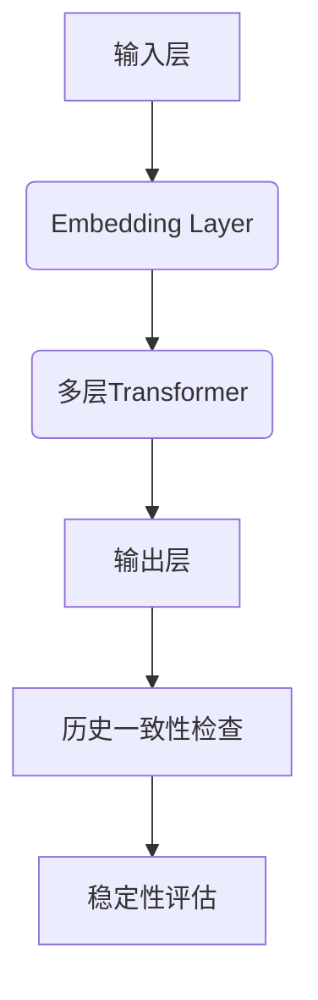

                 

### 文章标题

《历史一致性检查：评估LLM长期记忆的稳定性》

### 关键词

LLM，长期记忆，历史一致性检查，稳定性评估，自然语言处理，人工智能

### 摘要

随着大型语言模型（LLM）在自然语言处理领域中的应用日益广泛，评估其长期记忆的稳定性变得尤为重要。本文首先介绍了LLM长期记忆的背景知识，包括其定义、原理、区别和应用。接着，本文详细阐述了历史一致性检查技术，包括其原理、方法和优势。然后，本文提出了评估LLM长期记忆稳定性的方法，并分析了影响稳定性的关键因素。最后，通过案例分析，本文展示了如何在实际任务中应用这些方法，并提出了提升LLM长期记忆稳定性的策略。本文旨在为研究者提供一套系统、全面的评估方法，以推动LLM在更广泛的应用场景中的发展。

---

### 《历史一致性检查：评估LLM长期记忆的稳定性》目录大纲

#### 第一部分：LLM长期记忆的背景知识

1. **LLM长期记忆的概述**
   1.1. **长期记忆的定义与重要性**
   1.2. **LLM长期记忆的基本原理**
   1.3. **LLM长期记忆与传统记忆的区别**
   1.4. **LLM长期记忆的应用场景**

2. **LLM长期记忆的研究现状**
   2.1. **相关理论框架**
   2.2. **研究方法与技术路线**
   2.3. **LLM长期记忆的关键挑战**

#### 第二部分：历史一致性检查技术

3. **历史一致性检查的原理**
   3.1. **历史一致性检查的定义**
   3.2. **历史一致性检查的基本方法**
   3.3. **历史一致性检查的优势与局限性**

4. **历史一致性检查的应用**
   4.1. **在LLM中的应用**
   4.2. **在自然语言处理中的实例**
   4.3. **在其他领域的潜在应用**

#### 第三部分：评估LLM长期记忆的稳定性

5. **评估LLM长期记忆稳定性的方法**
   5.1. **静态评估方法**
   5.2. **动态评估方法**
   5.3. **综合评估方法**

6. **LLM长期记忆稳定性评估的关键因素**
   6.1. **数据质量的影响**
   6.2. **模型架构的影响**
   6.3. **训练策略的影响**

7. **评估结果的分析与应用**
   7.1. **稳定性评估结果的解读**
   7.2. **基于评估结果的应用建议**

#### 第四部分：案例分析与应用

8. **案例研究：特定领域的LLM长期记忆稳定性评估**
   8.1. **案例一：新闻生成任务的稳定性评估**
   8.2. **案例二：对话系统的稳定性评估**

9. **应用实践：提升LLM长期记忆稳定性的策略**
   9.1. **优化训练策略**
   9.2. **数据增强与处理**
   9.3. **模型结构优化**

#### 第五部分：未来展望与挑战

10. **LLM长期记忆研究的未来趋势**
    10.1. **前沿研究方向**
    10.2. **技术突破的可能性**
    10.3. **产业应用的前景**

11. **挑战与解决方案**
    11.1. **数据隐私与伦理问题**
    11.2. **模型可解释性**
    11.3. **计算资源的挑战**

#### 附录

12. **参考资料**
    12.1. **参考文献**
    12.2. **推荐阅读材料**
    12.3. **相关数据集与工具**

---

### 核心概念与联系

#### LLMS（大型语言模型系统）架构流程图



---

### 核心算法原理讲解

#### 历史一致性检查算法伪代码

```python
def historicalConsistencyCheck(model, context, target):
    # 获取模型的嵌入向量
    embedding = model.encode(context)

    # 使用模型对目标进行预测
    prediction = model.generate(target, embedding)

    # 计算历史一致性分数
    consistency_score = calculateConsistencyScore(prediction, target)

    return consistency_score
```

#### 历史一致性分数计算公式

$$
\text{Consistency\_Score} = \frac{1}{N} \sum_{i=1}^{N} \frac{1}{K} \sum_{j=1}^{K} \text{similarity}(s_i, t_j)
$$

其中，$s_i$ 表示历史文本序列，$t_j$ 表示预测文本序列，$N$ 表示历史文本序列的数量，$K$ 表示预测文本序列的数量，$\text{similarity}(s_i, t_j)$ 表示文本序列之间的相似度。

---

## 第一部分：LLM长期记忆的背景知识

### 1.1 长期记忆的定义与重要性

长期记忆（Long-Term Memory，简称LTM）是认知心理学中的一个重要概念，它指的是信息在存储过程中能够持续较长一段时间，并且可以在需要时被提取出来的记忆形式。与短期记忆（Short-Term Memory，简称STM）不同，长期记忆具有持久性，能够在时间跨度上持续作用。

在人工智能领域，长期记忆被认为是实现智能系统的一项关键能力。LLM（Large Language Model）作为一种先进的自然语言处理模型，其核心优势之一就在于其强大的长期记忆能力。LLM能够通过大规模的训练数据学习到丰富的语言知识，并将其存储在长期记忆中，以便在生成文本或回答问题时能够利用这些知识进行有效的推理和决策。

长期记忆的重要性在于，它使得LLM能够处理复杂的自然语言任务，例如文本生成、机器翻译、问答系统等。在文本生成任务中，LLM需要根据输入的文本上下文生成连贯、逻辑合理的文本。这种生成过程不仅需要利用当前上下文的信息，还需要结合之前学习到的语言知识，以保持文本的一致性和连贯性。在机器翻译任务中，LLM需要理解源语言和目标语言之间的语义关系，并将其正确地映射到目标语言中。在问答系统中，LLM需要理解问题的意图，并从大量文本中检索出与问题相关的信息。

总之，长期记忆是LLM实现高效、准确的自然语言处理任务的基础。它使得LLM能够在不同时间点、不同上下文中保持一致性和连贯性，从而实现更加智能和人性化的交互。

### 1.2 LLM长期记忆的基本原理

LLM长期记忆的基本原理主要基于深度学习模型中的神经网络架构，特别是Transformer模型。Transformer模型的核心思想是利用自注意力机制（Self-Attention）来处理序列数据，从而实现强大的长期依赖关系建模。

在Transformer模型中，输入的文本序列被编码成嵌入向量（Embedding Vectors），这些向量包含了文本的语义信息。通过自注意力机制，模型能够自动地学习到不同位置的文本之间的依赖关系，从而实现长期记忆。具体来说，自注意力机制允许模型在生成每个单词时，考虑到之前所有单词的信息，从而保持文本的一致性和连贯性。

LLM的长期记忆能力主要体现在以下几个方面：

1. **序列建模**：Transformer模型通过多头自注意力机制（Multi-Head Self-Attention）对输入的文本序列进行建模。在每个注意力头中，模型会计算不同位置之间的相似度，从而生成一组权重，用于对嵌入向量进行加权求和。这种机制使得模型能够自动地捕捉到文本序列中的长期依赖关系。

2. **上下文编码**：通过编码器（Encoder）和解码器（Decoder）的交互，LLM能够将输入的文本上下文编码成一组固定长度的向量。这些向量包含了文本的语义信息，并且可以在生成过程中被反复利用，从而实现长期记忆。

3. **记忆存储与检索**：LLM利用其庞大的参数规模来存储和检索语言知识。在训练过程中，模型会自动地学习到大量的词汇、短语和句子模式，并将其编码到模型参数中。在生成文本时，模型可以通过这些参数来检索和利用之前学到的知识，从而实现长期记忆。

4. **动态记忆更新**：在生成文本的过程中，LLM会根据当前的上下文信息动态地更新其长期记忆。这种动态更新机制使得模型能够在不同的上下文中保持一致性和连贯性，从而实现高效的文本生成。

总之，LLM长期记忆的基本原理基于深度学习模型中的自注意力机制和上下文编码，通过序列建模、记忆存储与检索以及动态记忆更新，实现了强大的长期依赖关系建模和知识存储能力。

### 1.3 LLM长期记忆与传统记忆的区别

尽管LLM长期记忆和人类长期记忆在功能上具有一定的相似性，但它们在原理和应用上存在显著的差异。

首先，在原理上，人类长期记忆依赖于大脑神经网络的物理连接和神经活动模式。这些连接和活动模式在个体发育过程中逐渐形成，并通过不断的经验和学习进行强化。而LLM长期记忆则基于深度学习模型中的参数和权重，这些参数和权重通过训练数据学习得到，并且可以随训练过程的不断优化而更新。

其次，在应用上，人类长期记忆主要用于存储和回忆个人经历、知识和社会信息，从而帮助个体进行决策和行动。而LLM长期记忆则主要用于自然语言处理任务，例如文本生成、机器翻译和问答系统等。LLM通过学习大量的语言数据，构建出一种能够理解和生成自然语言的模型，从而实现对语言信息的处理和利用。

具体来说，LLM长期记忆与传统记忆在以下几个方面存在区别：

1. **数据来源**：人类长期记忆的数据来源主要是个人的经验和感知，而LLM长期记忆的数据来源则是大规模的文本数据。人类通过阅读、听讲、交流等方式不断积累知识，并将其存储在大脑中。而LLM则通过训练数据集来学习语言模式，这些数据集通常包含大量的文本、书籍、新闻报道、社交媒体等内容。

2. **记忆形式**：人类长期记忆以神经元之间的物理连接和神经活动模式形式存在，这些连接和活动模式在个体的一生中逐渐形成和改变。而LLM长期记忆则以模型参数和权重形式存在，这些参数和权重通过训练过程中的梯度更新而不断优化。

3. **记忆容量**：人类长期记忆的容量是有限的，且受到个体认知能力、经验和记忆负担等因素的影响。而LLM长期记忆的容量几乎无限，因为它可以存储大量的文本数据，并且可以通过增加训练数据和优化算法来不断扩展。

4. **记忆检索**：人类长期记忆的检索通常依赖于意识和思考过程，通过回忆和联想来找到所需的信息。而LLM长期记忆的检索则基于计算过程，通过模型内部的推理和生成机制来获取所需的信息。

5. **记忆更新**：人类长期记忆的更新主要通过经验和学习来实现，即通过不断地重复和实践来巩固和修正记忆。而LLM长期记忆的更新则通过训练过程的梯度下降算法来实现，即通过不断调整模型参数来优化记忆。

总之，LLM长期记忆与传统记忆在原理和应用上存在显著的差异。虽然LLM在某些方面展现了强大的记忆能力，但其在理解和模拟人类长期记忆方面仍有很大的局限性。未来，通过结合深度学习和认知科学的研究，有望进一步提升LLM的长期记忆能力，使其在更广泛的应用场景中发挥作用。

### 1.4 LLM长期记忆的应用场景

LLM长期记忆的强大能力使得其在多个自然语言处理任务中具有广泛的应用场景，主要包括文本生成、机器翻译、问答系统和文本分类等。

1. **文本生成**：在文本生成任务中，LLM长期记忆能够帮助模型根据输入的上下文生成连贯、逻辑合理的文本。例如，在文章写作、摘要生成、对话系统等任务中，LLM可以自动生成高质量的文本，从而节省人力成本并提高工作效率。此外，LLM在创意写作、故事生成等任务中也展示了其独特的优势。

2. **机器翻译**：机器翻译是LLM长期记忆的重要应用场景之一。通过学习大量的双语文本数据，LLM可以理解不同语言之间的语义关系，并将其正确地映射到目标语言中。例如，Google Translate等翻译工具采用了基于Transformer架构的LLM，能够在多种语言之间实现高质量、高效率的翻译。

3. **问答系统**：问答系统是另一个关键应用场景。LLM长期记忆能够帮助模型理解用户的问题，并从大量文本数据中检索出与问题相关的信息。例如，智能客服系统、虚拟助手等都可以利用LLM的长期记忆能力来提供实时、准确的回答。

4. **文本分类**：在文本分类任务中，LLM长期记忆能够帮助模型识别文本中的主题和情感。通过学习大量的标注数据，LLM可以自动地将文本分类到不同的类别中，例如新闻分类、情感分析等。这种能力在社交媒体分析、舆情监测等领域具有广泛的应用。

5. **对话系统**：对话系统是LLM长期记忆的另一个重要应用场景。通过学习大量的对话数据，LLM可以模拟人类的对话方式，与用户进行自然、流畅的交流。例如，智能客服、虚拟助手等都可以利用LLM的长期记忆能力来提供个性化的服务。

总之，LLM长期记忆的应用场景广泛，不仅涵盖了常见的自然语言处理任务，还涉及到了创意写作、机器翻译、问答系统、文本分类和对话系统等多个领域。随着LLM技术的不断发展和优化，其在更多应用场景中的潜力将得到进一步挖掘和发挥。

### 1.5 LLM长期记忆的研究现状

LLM长期记忆的研究现状涵盖了多个方面，包括理论框架、研究方法和技术路线。以下是对当前LLM长期记忆研究现状的详细分析。

#### 相关理论框架

1. **深度学习理论**：深度学习是LLM长期记忆研究的基础理论。深度学习通过多层神经网络模型，将输入数据映射到高维空间，从而实现复杂的非线性变换。在LLM中，深度学习模型能够通过训练自动地学习到大量的语言特征和模式，从而实现长期记忆。

2. **注意力机制**：注意力机制是深度学习模型中的一个关键组件，它使得模型能够在处理序列数据时，动态地关注不同位置的信息。在LLM中，注意力机制（特别是自注意力机制）被广泛应用于Transformer模型中，从而实现强大的长期依赖关系建模。

3. **记忆增强技术**：记忆增强技术是提升LLM长期记忆能力的重要途径。这些技术包括记忆网络（Memory Networks）、经验回放（Experience Replay）和记忆模块（Memory Modules）等。通过引入这些技术，LLM能够在生成文本或执行任务时，更有效地利用和更新其长期记忆。

#### 研究方法与技术路线

1. **大规模数据训练**：大规模数据训练是LLM长期记忆研究的主要方法之一。通过收集和整合海量的文本数据，LLM可以从这些数据中学习到丰富的语言知识和模式。这种方法不仅能够提升模型的性能，还能增强其长期记忆能力。

2. **自监督学习**：自监督学习是一种无需人工标注数据的学习方法，它利用未标注的数据进行训练。在LLM长期记忆研究中，自监督学习被广泛应用于预训练阶段。通过预训练，LLM可以自动地学习到大量的语言特征和规则，从而增强其长期记忆。

3. **对抗训练**：对抗训练是一种通过引入对抗性样本来提升模型鲁棒性的方法。在LLM长期记忆研究中，对抗训练被用于增强模型对噪声和异常样本的鲁棒性，从而提高其长期记忆的稳定性。

4. **迁移学习**：迁移学习是一种将知识从一个任务迁移到另一个任务的方法。在LLM长期记忆研究中，迁移学习被用于将预训练的模型应用于新的任务，从而利用已有的知识来增强模型的长期记忆能力。

#### 关键挑战

1. **数据隐私与伦理问题**：大规模数据训练和迁移学习通常涉及对大量私人数据的处理，这引发了数据隐私和伦理问题。如何确保数据的安全性和隐私性，同时保护用户的隐私权，是LLM长期记忆研究面临的一个关键挑战。

2. **模型可解释性**：LLM的长期记忆能力虽然强大，但其内部机制复杂，难以解释。如何提升模型的可解释性，使得研究者能够理解和分析模型的长期记忆过程，是另一个重要的研究挑战。

3. **计算资源**：大规模的深度学习模型需要大量的计算资源。如何优化模型的训练和推理过程，降低计算成本，是LLM长期记忆研究需要解决的关键问题。

4. **长期依赖关系建模**：LLM长期记忆的关键挑战在于如何有效地建模和利用长期的依赖关系。当前的方法虽然在某些方面取得了一定的进展，但仍然存在很多未解决的问题，需要进一步的研究和探索。

总之，LLM长期记忆的研究现状表明，这一领域已经取得了很多重要的进展，但仍面临诸多挑战。随着技术的不断发展和研究的深入，LLM长期记忆能力有望进一步提升，为自然语言处理和其他领域带来更多创新和突破。

### 1.6 LLM长期记忆的常见问题和挑战

尽管LLM长期记忆在自然语言处理任务中展示了巨大的潜力，但其应用过程中仍面临着诸多问题和挑战，主要包括数据隐私与伦理问题、模型可解释性以及计算资源需求等。

#### 数据隐私与伦理问题

LLM长期记忆依赖于大规模的训练数据，这些数据通常来自互联网上的公开信息、社交媒体、书籍、新闻等。然而，这些数据中包含了大量的个人隐私信息，如用户姓名、地址、电话号码、健康状况等。在训练和部署LLM时，如何确保这些隐私数据的安全性和隐私性，避免数据泄露和滥用，成为一个亟待解决的问题。

此外，由于LLM可以生成逼真的文本内容，这可能被恶意用于制造虚假信息、网络诈骗等违法行为。因此，如何在保障用户隐私的同时，有效监管和防止LLM的滥用，也是一项重要的伦理挑战。

#### 模型可解释性

LLM的长期记忆机制复杂，其内部决策过程往往难以理解。这使得模型的可解释性成为一个关键问题。对于许多实际应用场景，如医疗诊断、金融风险评估等，模型的透明性和可解释性至关重要，因为它们直接影响到决策的可靠性和用户信任。

目前，尽管有一些方法尝试提升模型的可解释性，如解释性模型、可视化工具和注意力分析，但大多数LLM模型仍然处于“黑箱”状态，其内部机制难以解释。因此，如何提升模型的可解释性，使其能够更好地理解和解释其决策过程，是当前研究和应用中的一个重要方向。

#### 计算资源需求

大规模的LLM模型需要大量的计算资源和存储空间，尤其是在训练和推理过程中。随着模型规模的不断扩大，计算资源的需求也在不断增加。这对于许多研究机构和公司来说，是一个巨大的挑战。

一方面，需要开发更高效的算法和模型结构，以降低计算资源的需求；另一方面，也需要构建更强大的计算基础设施，以满足大规模LLM模型的训练和推理需求。此外，如何在有限的资源下，优化模型的训练和推理过程，也是需要关注的问题。

总之，LLM长期记忆在实际应用中面临的数据隐私与伦理问题、模型可解释性以及计算资源需求等问题，需要通过技术创新和规范制定来逐步解决。只有这样，LLM才能在更多领域发挥其潜力，并得到更广泛的应用。

---

## 第二部分：历史一致性检查技术

### 2.1 历史一致性检查的定义

历史一致性检查（Historical Consistency Check）是一种用于评估大型语言模型（LLM）长期记忆稳定性的技术。其核心思想是通过对比LLM在训练过程中生成的文本与其原始输入文本之间的相似度，来判断LLM的长期记忆是否保持一致。

具体来说，历史一致性检查技术首先会收集LLM在训练过程中生成的文本数据，并与原始输入文本进行比较。通过计算文本之间的相似度，可以评估LLM在生成文本时是否能够准确、连贯地反映原始输入的语义信息。这种检查方法可以揭示LLM在长期记忆过程中可能出现的偏差、错误或不一致性，从而为LLM的优化和改进提供依据。

历史一致性检查的定义可以进一步细化为以下几个关键方面：

1. **文本相似度计算**：历史一致性检查依赖于文本相似度计算方法，例如余弦相似度、Jaccard相似度、编辑距离等。这些方法能够量化两个文本之间的相似程度，从而为后续的分析提供基础。

2. **长期记忆一致性**：历史一致性检查的目标是评估LLM在长期记忆过程中的一致性。即LLM在生成文本时，是否能够稳定、准确地反映输入文本的语义信息。

3. **评估指标**：历史一致性检查通常使用一系列评估指标来衡量LLM的长期记忆一致性。这些指标包括相似度得分、错误率、一致性比率等。

4. **反馈与优化**：通过历史一致性检查，可以发现LLM在长期记忆过程中存在的问题和不足。这些反馈可以用于指导后续的模型优化和训练，以提升LLM的长期记忆能力。

总之，历史一致性检查是一种重要的技术手段，用于评估LLM长期记忆的稳定性。通过系统地对比LLM生成的文本与原始输入文本之间的相似度，可以揭示LLM在长期记忆过程中的一致性，从而为LLM的优化和改进提供依据。

### 2.2 历史一致性检查的基本方法

历史一致性检查的基本方法主要包括数据收集、文本相似度计算和结果分析三个步骤。下面将详细描述每个步骤的具体过程和实现方法。

#### 数据收集

数据收集是历史一致性检查的基础。为了评估LLM的长期记忆一致性，需要收集大量的训练文本及其对应的生成文本。这些数据可以来源于LLM的训练过程，例如使用不同上下文生成的文本序列。

具体实现方法如下：

1. **选择训练数据**：首先，从LLM的训练数据集中选择具有代表性的文本样本。这些样本应涵盖不同的主题和场景，以全面评估LLM的长期记忆一致性。

2. **生成文本数据**：使用LLM生成与训练数据相对应的文本序列。可以通过调整输入的上下文和生成参数，生成不同长度和风格的文本。

3. **数据存储**：将收集到的原始训练文本和生成文本存储在统一的格式中，如JSON或CSV文件，以便后续处理和分析。

#### 文本相似度计算

文本相似度计算是历史一致性检查的核心步骤。通过计算原始训练文本与生成文本之间的相似度，可以评估LLM在生成文本时的长期记忆一致性。常用的文本相似度计算方法包括余弦相似度、Jaccard相似度、编辑距离等。

具体实现方法如下：

1. **预处理文本**：在计算相似度之前，需要对文本进行预处理，包括去除标点符号、停用词过滤、分词等操作。这些步骤有助于提高相似度计算的准确性和效率。

2. **选择相似度度量方法**：根据具体需求，选择合适的文本相似度度量方法。例如，余弦相似度适用于高维文本空间，而Jaccard相似度适用于二值化的文本特征。

3. **计算相似度得分**：对于每对原始训练文本和生成文本，使用选定的相似度度量方法计算相似度得分。相似度得分通常在0到1之间，值越接近1表示文本越相似。

4. **统计相似度分布**：将所有文本对的相似度得分进行统计和分析，得到整体相似度分布。通过分析相似度分布，可以评估LLM的长期记忆一致性。

#### 结果分析

结果分析是历史一致性检查的最终步骤。通过对相似度计算结果进行深入分析，可以识别出LLM在长期记忆过程中可能存在的问题和不足。

具体实现方法如下：

1. **评估一致性指标**：计算整体相似度分布的统计指标，如平均值、标准差、最大值、最小值等。这些指标可以直观地反映LLM的长期记忆一致性。

2. **识别不一致性**：通过分析相似度分布，识别出相似度得分明显低于平均值的文本对。这些文本对可能反映了LLM在长期记忆过程中的不一致性。

3. **诊断问题根源**：针对识别出的问题文本对，分析其不一致性产生的原因。可能的原因包括输入上下文不明确、生成文本逻辑错误、模型训练不足等。

4. **反馈与优化**：根据分析结果，提出优化建议和改进措施，如调整训练数据、改进生成模型、优化训练策略等。这些措施有助于提升LLM的长期记忆一致性。

总之，历史一致性检查的基本方法通过数据收集、文本相似度计算和结果分析，系统地评估LLM的长期记忆稳定性。这一过程不仅能够揭示LLM在长期记忆过程中的一致性问题，还为LLM的优化和改进提供了重要的依据。

### 2.3 历史一致性检查的优势与局限性

历史一致性检查作为评估LLM长期记忆稳定性的技术手段，具有显著的优势，同时也存在一定的局限性。以下是对其优势与局限性的详细分析。

#### 优势

1. **全面性**：历史一致性检查能够全面评估LLM的长期记忆一致性，通过对比大量训练文本和生成文本之间的相似度，揭示模型在长期记忆过程中可能存在的问题。这种方法不仅能够发现局部的不一致性，还能从整体上评估模型的长期记忆稳定性。

2. **客观性**：历史一致性检查基于客观的文本相似度计算，通过量化的相似度得分，可以客观地评估LLM的长期记忆表现。这种客观性使得评估结果具有可重复性和可验证性，有助于提高研究的可靠性和科学性。

3. **实时性**：历史一致性检查可以在训练过程中实时进行，无需额外的标注数据或复杂的模型调整。这使得该技术能够在模型训练的不同阶段进行评估，及时发现问题并进行优化。

4. **适用范围广**：历史一致性检查适用于多种自然语言处理任务，如文本生成、机器翻译、问答系统等。由于该技术基于文本相似度计算，因此可以广泛应用于不同场景和任务，具有很强的通用性。

#### 局限性

1. **依赖文本相似度计算方法**：历史一致性检查依赖于文本相似度计算方法，如余弦相似度、Jaccard相似度等。这些方法在不同情况下可能存在局限性，例如在高维文本空间中，余弦相似度可能不够准确。此外，文本相似度计算方法的选择和参数设置也会影响评估结果。

2. **计算复杂度高**：历史一致性检查需要对大量文本对进行相似度计算，这在计算资源有限的情况下可能带来较高的计算复杂度。特别是在大规模数据集上，计算时间可能较长，这限制了其在实时应用中的使用。

3. **难以识别深层问题**：历史一致性检查主要基于文本相似度，难以揭示LLM长期记忆过程中的深层问题，如模型参数设置不当、训练数据分布不均等。这些问题可能需要更深入的分析和调整，才能得到有效解决。

4. **解释性有限**：尽管历史一致性检查能够提供一定的评估结果，但其解释性有限。对于识别出的不一致性，难以直接解释其产生的原因，这限制了其在模型优化和改进中的应用。

总之，历史一致性检查作为一种评估LLM长期记忆稳定性的技术手段，具有全面性、客观性和实时性的优势，但也存在依赖文本相似度计算方法、计算复杂度高、难以识别深层问题和解释性有限等局限性。未来，通过改进文本相似度计算方法、优化算法和提升模型解释性，可以进一步发挥历史一致性检查的优势，提高LLM长期记忆的稳定性。

### 2.4 历史一致性检查的应用

历史一致性检查技术不仅在LLM的研究和评估中具有重要意义，还在实际应用中展示了广泛的应用潜力。以下将介绍历史一致性检查在LLM应用中的具体实例，并探讨其在自然语言处理和其他领域的潜在应用。

#### 在LLM中的应用

1. **文本生成**：在文本生成任务中，历史一致性检查可以用于评估LLM生成文本的一致性和连贯性。例如，在文章写作和摘要生成任务中，可以通过对比生成文本与原始输入文本之间的相似度，评估LLM是否能够准确地捕捉和保持原始文本的语义信息。

2. **对话系统**：在对话系统中，历史一致性检查可以帮助评估对话生成模型是否能够保持对话的一致性和连贯性。通过对比每次对话生成的文本序列与历史对话内容之间的相似度，可以发现对话中的不一致性，从而优化对话生成模型。

3. **机器翻译**：在机器翻译任务中，历史一致性检查可以用于评估LLM在翻译过程中是否能够保持源语言和目标语言之间的一致性。通过对比翻译结果与原始文本之间的相似度，可以发现翻译中的偏差和错误，从而指导模型的优化和改进。

4. **问答系统**：在问答系统中，历史一致性检查可以用于评估LLM在回答问题时的准确性。通过对比生成答案与用户问题的相似度，可以评估LLM是否能够准确理解和回答问题，从而优化问答系统的性能。

#### 在自然语言处理中的应用

1. **文本分类**：历史一致性检查可以用于评估文本分类模型的一致性。通过对比分类结果与原始文本之间的相似度，可以发现分类中的不一致性，从而优化分类模型的性能。

2. **情感分析**：在情感分析任务中，历史一致性检查可以用于评估模型在判断文本情感时的一致性。通过对比分类结果与原始文本之间的相似度，可以发现情感判断中的不一致性，从而优化情感分析模型。

3. **信息抽取**：在信息抽取任务中，历史一致性检查可以用于评估模型在提取文本信息时的一致性。通过对比提取结果与原始文本之间的相似度，可以发现提取中的不一致性，从而优化信息抽取模型。

#### 在其他领域的潜在应用

1. **智能客服**：在智能客服系统中，历史一致性检查可以用于评估对话生成模型的一致性和连贯性，从而提升客服机器人与用户之间的交互质量。

2. **法律文本分析**：在法律文本分析中，历史一致性检查可以用于评估法律文本生成模型的一致性，确保生成的法律文件内容准确且符合法律规范。

3. **医疗文本分析**：在医疗文本分析中，历史一致性检查可以用于评估医学文本生成模型的一致性和准确性，确保生成的医疗报告内容准确且具有临床参考价值。

总之，历史一致性检查技术在LLM的应用中发挥了重要作用，其在自然语言处理和其他领域的潜在应用也展示了广阔的发展前景。通过系统地评估LLM的长期记忆一致性，可以提升模型在各类任务中的性能和可靠性，推动人工智能技术在更多领域的应用和发展。

### 2.5 历史一致性检查技术的优化方法

为了提高历史一致性检查技术的效果，研究者们提出了一系列优化方法，这些方法主要集中在提高文本相似度计算的准确性、降低计算复杂度以及增强评估结果的解释性。以下是对这些优化方法的详细讨论。

#### 提高文本相似度计算准确性

1. **词嵌入优化**：文本相似度计算依赖于词嵌入技术，通过将文本中的词汇映射到高维向量空间。为了提高相似度计算的准确性，研究者们尝试了多种词嵌入方法，如Word2Vec、GloVe和BERT。特别是BERT模型，通过双向Transformer架构和上下文依赖学习，显著提高了词嵌入的精度。

2. **融合多模态信息**：除了文本本身的信息，还可以结合其他模态的信息，如语音、图像和视频等。通过融合多模态信息，可以提供更丰富的语义特征，从而提高文本相似度计算的准确性。

3. **使用注意力机制**：注意力机制在文本相似度计算中具有重要作用。通过引入注意力机制，模型可以动态地关注文本中的关键信息，从而提高相似度计算的精度。

#### 降低计算复杂度

1. **并行计算**：在历史一致性检查过程中，文本相似度计算是一个耗时的操作。通过引入并行计算技术，可以将计算任务分解到多个计算节点上，从而提高计算效率。例如，可以使用分布式计算框架，如TensorFlow和PyTorch，来实现并行计算。

2. **模型压缩**：为了降低计算复杂度，研究者们提出了多种模型压缩方法，如模型剪枝、量化、知识蒸馏等。这些方法可以显著减小模型的规模，从而降低计算资源的消耗。

3. **近似计算**：在某些情况下，可以采用近似计算方法来替代精确计算。例如，在计算文本相似度时，可以采用随机近似或蒙特卡洛方法，从而降低计算复杂度。

#### 增强评估结果的解释性

1. **可视化分析**：通过可视化技术，可以将历史一致性检查的结果以直观的方式展示出来。例如，使用热力图或词云图来展示文本之间的相似度分布，从而帮助研究者更好地理解和分析结果。

2. **注意力分析**：利用注意力机制，可以揭示模型在文本相似度计算过程中关注的关键信息。通过分析注意力权重，可以了解模型在评估文本一致性时的关键依据。

3. **可解释性模型**：研究者们尝试开发可解释性模型，如LIME和SHAP，来解释历史一致性检查结果的产生原因。这些模型可以提供更加详细的解释，帮助研究者理解模型的行为。

总之，通过优化文本相似度计算、降低计算复杂度和增强评估结果的解释性，历史一致性检查技术可以得到显著的提升。这些优化方法不仅提高了评估的准确性，还为研究者提供了更深入的见解，有助于进一步提升LLM的长期记忆稳定性和应用效果。

---

## 第三部分：评估LLM长期记忆稳定性的方法

在评估LLM长期记忆的稳定性时，需要采用一系列系统化的方法，这些方法可以分为静态评估和动态评估两大类。以下将详细讨论这两种评估方法及其具体实现过程。

### 3.1 静态评估方法

静态评估方法主要基于对LLM模型和数据的静态分析，通过分析模型结构和数据分布来评估长期记忆的稳定性。以下是一些常用的静态评估方法：

#### 模型结构分析

1. **参数分布分析**：通过对模型参数的分布进行分析，可以评估模型是否在训练过程中发生了过拟合。如果参数分布过于集中在某些值附近，可能表明模型对训练数据过度依赖，缺乏泛化能力。

2. **注意力机制分析**：在Transformer模型中，注意力权重矩阵反映了模型在处理不同位置文本时的关注程度。通过分析注意力权重矩阵，可以评估模型是否在长期记忆过程中保持了关注的一致性。例如，如果权重矩阵中存在显著的波动或异常值，可能表明模型在处理长期依赖关系时存在不一致性。

3. **模型拓扑结构分析**：通过分析模型的拓扑结构，可以评估模型在不同层次上的信息传递和存储能力。例如，可以通过计算模型中各层之间的互信息，来评估不同层次之间的信息传递效率。

#### 数据分布分析

1. **数据分布均匀性分析**：通过对训练数据的分布进行分析，可以评估数据是否均匀地覆盖了不同的语言模式和场景。如果数据分布不均匀，可能导致模型在特定场景下的长期记忆能力不足。

2. **数据相关性分析**：通过分析训练数据之间的相关性，可以评估数据是否包含了冗余信息。如果数据之间存在高度相关性，可能表明数据质量不高，从而影响模型的长期记忆能力。

3. **数据标注一致性分析**：在训练数据标注过程中，标注者可能存在主观偏差，导致数据标注不一致。通过分析标注一致性，可以评估数据标注的质量，从而为模型训练提供可靠的依据。

#### 实现过程

静态评估方法的实现过程主要包括以下步骤：

1. **数据收集**：收集LLM的训练数据和模型参数。

2. **预处理**：对训练数据进行预处理，包括文本清洗、分词和词嵌入等。

3. **模型解析**：解析模型结构，提取注意力权重矩阵、参数分布等信息。

4. **分析计算**：使用统计学方法分析参数分布、注意力权重矩阵和训练数据分布。

5. **结果可视化**：使用可视化工具展示分析结果，如热力图、词云图等。

6. **评估报告**：撰写评估报告，总结分析结果并提出优化建议。

### 3.2 动态评估方法

动态评估方法主要基于对LLM在动态环境下的表现进行实时监控和分析。以下是一些常用的动态评估方法：

#### 模型行为监控

1. **实时监控**：通过实时监控LLM的生成文本和输出响应，可以评估模型在处理不同上下文时的稳定性。例如，可以使用日志记录系统记录模型在不同场景下的生成文本，并对比这些文本与原始输入之间的相似度。

2. **动态测试**：设计一系列动态测试案例，通过逐步变化的输入文本来评估LLM的稳定性。例如，可以设计一组输入文本，每次逐步增加复杂度或改变内容，观察模型的表现是否一致。

3. **异常检测**：通过异常检测技术，可以实时识别LLM生成文本中的不一致性或异常行为。例如，可以使用机器学习算法训练一个异常检测模型，当生成文本的相似度低于某个阈值时，触发警报。

#### 实现过程

动态评估方法的实现过程主要包括以下步骤：

1. **测试环境搭建**：搭建一个动态评估环境，包括输入文本生成系统、模型执行系统、日志记录系统和异常检测系统。

2. **测试案例设计**：设计一系列动态测试案例，覆盖不同的场景和复杂度。

3. **模型执行与监控**：执行测试案例，实时监控模型的生成文本和输出响应。

4. **数据记录**：记录模型在不同测试案例中的生成文本和相似度得分。

5. **异常检测**：使用异常检测算法分析记录的数据，识别不一致性或异常行为。

6. **评估报告**：撰写评估报告，总结动态评估结果，并提出优化建议。

### 3.3 静态评估与动态评估的比较

静态评估和动态评估各有优缺点，适用于不同的评估场景：

1. **优点**：
   - **静态评估**：通过分析模型结构和数据分布，可以深入了解模型的内在特性和潜在问题，有助于发现深层次的问题。
   - **动态评估**：通过实时监控和动态测试，可以评估模型在真实环境下的表现，更贴近实际应用场景。

2. **缺点**：
   - **静态评估**：需要依赖大量的数据和计算资源，且可能无法实时反映模型在动态环境中的表现。
   - **动态评估**：测试过程可能较为繁琐，且难以深入了解模型的内在机制。

3. **适用场景**：
   - **静态评估**：适用于对模型进行全面的性能评估和诊断，特别是在模型设计和优化阶段。
   - **动态评估**：适用于评估模型在实际应用中的稳定性和可靠性，特别是在模型部署和运维阶段。

综上所述，静态评估和动态评估方法共同构成了评估LLM长期记忆稳定性的完整体系。通过结合这两种方法，可以全面、深入地了解LLM的长期记忆能力，从而为模型的优化和改进提供有力的支持。

---

## 第四部分：评估LLM长期记忆稳定性中的关键因素

在评估LLM长期记忆的稳定性时，有多个关键因素会对评估结果产生显著影响。这些因素包括数据质量、模型架构以及训练策略。以下将详细分析这些关键因素，并探讨它们对LLM长期记忆稳定性的影响。

### 4.1 数据质量的影响

数据质量是评估LLM长期记忆稳定性的基础。高质量的数据可以提供丰富的语义信息，有助于模型准确学习和存储知识。以下是数据质量对LLM长期记忆稳定性的几个方面的影响：

1. **数据完整性**：完整的数据集可以确保模型学习到全面的语义信息。如果数据集中存在缺失值或噪声，可能导致模型在生成文本时出现不一致性或错误。

2. **数据代表性**：代表性强、覆盖面广的数据集能够更好地反映现实世界中的语言使用情况。如果数据集存在偏差或不均衡，可能导致模型在某些特定场景下表现不佳。

3. **数据一致性**：一致的数据集可以确保模型在学习过程中不会受到外部干扰。例如，在机器翻译任务中，如果训练数据中的源语言和目标语言之间存在不一致，可能导致模型无法正确地映射语义信息。

4. **数据多样性**：多样化的数据集有助于模型学习到不同的语言风格、语法结构和词汇用法，从而提高其长期记忆的稳定性。如果数据集过于单一，模型可能无法适应复杂多变的语言环境。

### 4.2 模型架构的影响

LLM的模型架构对其长期记忆的稳定性具有直接影响。以下从几个方面分析模型架构的影响：

1. **网络深度和宽度**：深度和宽度较大的模型通常具有更强的长期依赖关系建模能力。这是因为多层神经网络可以捕捉到更复杂的语义信息，从而提高长期记忆的稳定性。然而，过深的网络可能导致过拟合，增加计算复杂度。

2. **注意力机制**：注意力机制是Transformer模型的核心组件，能够动态关注文本中的关键信息。有效的注意力机制有助于模型在生成文本时保持一致性。然而，注意力机制的复杂度较高，可能带来计算和存储上的挑战。

3. **记忆模块**：一些先进的模型架构，如记忆网络和经验回放，专门设计用于增强模型的长期记忆能力。这些模块通过引入额外的记忆单元和记忆检索机制，可以提高模型在长期记忆任务中的稳定性。

4. **预训练和微调**：预训练和微调是LLM的常见训练策略。预训练阶段通过大规模数据集对模型进行初始化，有助于模型学习到丰富的语义信息。微调阶段则通过特定任务的数据集对模型进行精细调整，以适应特定任务的需求。适当的预训练和微调策略可以显著提高模型的长期记忆稳定性。

### 4.3 训练策略的影响

训练策略对LLM长期记忆的稳定性有着至关重要的影响。以下从几个方面分析训练策略的影响：

1. **数据增强**：数据增强是一种有效的训练策略，通过生成或变换原始数据来扩展训练集。例如，可以采用随机噪声、数据切分、同义词替换等方法。数据增强可以增加模型的泛化能力，从而提高长期记忆的稳定性。

2. **正则化**：正则化是一种防止模型过拟合的方法，常用的正则化技术包括L1和L2正则化、Dropout和Batch Normalization等。这些技术可以通过惩罚模型的复杂度、减少参数冗余来提高模型的泛化能力和长期记忆稳定性。

3. **学习率调度**：学习率调度是一种调整训练过程中学习率的策略。通过合理设置学习率，可以确保模型在训练过程中不会过早收敛，从而学习到更丰富的语义信息。常用的学习率调度策略包括恒定学习率、指数衰减学习率和学习率预热等。

4. **训练数据分布**：训练数据分布对模型的长期记忆稳定性也有显著影响。如果数据分布不均，可能导致模型在某些特定场景下表现较差。通过调整数据分布，可以使模型在学习过程中更加均衡地接触不同类型的语言模式，从而提高长期记忆的稳定性。

5. **多任务学习**：多任务学习是一种通过同时训练多个相关任务来提高模型性能的方法。通过多任务学习，模型可以在不同任务之间共享知识和信息，从而增强其长期记忆能力。

总之，数据质量、模型架构和训练策略是评估LLM长期记忆稳定性的关键因素。通过优化这些因素，可以显著提高模型的长期记忆能力，从而在自然语言处理任务中实现更好的性能和稳定性。

### 4.4 历史一致性检查与数据、模型、训练策略的相互关系

历史一致性检查作为一种评估LLM长期记忆稳定性的技术，与数据、模型和训练策略之间存在紧密的相互关系。以下将详细讨论这些关系，并探讨如何通过历史一致性检查来优化这些关键因素。

#### 历史一致性检查与数据的关系

1. **数据质量**：历史一致性检查依赖于高质量的数据集。高质量的数据可以提供丰富的语义信息，使LLM能够更好地学习和存储知识。通过历史一致性检查，可以评估数据集的完整性、代表性和一致性。例如，如果发现生成文本与原始输入之间存在显著差异，可能表明数据集中存在缺失值或噪声。针对这些问题，可以通过数据清洗、数据增强和数据标注一致性分析等方法来优化数据质量。

2. **数据多样性**：多样化的数据集有助于模型学习到不同的语言风格、语法结构和词汇用法，从而提高其长期记忆的稳定性。历史一致性检查可以评估数据集的多样性，确保模型在不同类型的文本之间保持一致。例如，通过对比不同来源的数据集，可以发现数据集中是否存在特定类型的文本缺乏代表性，从而指导数据集的优化。

#### 历史一致性检查与模型的关系

1. **模型架构**：历史一致性检查可以揭示模型在处理长期依赖关系时的表现。通过分析注意力权重矩阵和模型参数的分布，可以评估模型架构是否能够有效地捕捉和保持语义信息。例如，如果发现注意力权重矩阵存在显著的波动，可能表明模型在处理长期依赖关系时存在不一致性。针对这些问题，可以通过调整模型架构，如增加网络深度、引入注意力机制或使用记忆模块等方法来优化模型。

2. **模型训练**：历史一致性检查可以评估模型在不同训练阶段的表现。通过监控生成文本的一致性，可以及时发现模型训练过程中的问题，如过拟合或训练不足。例如，如果发现模型在某个训练阶段生成文本的一致性显著下降，可能表明模型在该阶段出现过拟合。针对这些问题，可以通过调整训练策略，如增加正则化、调整学习率或采用多任务学习等方法来优化模型训练。

#### 历史一致性检查与训练策略的关系

1. **数据增强**：历史一致性检查可以帮助评估数据增强策略的有效性。通过对比增强前后生成文本的一致性，可以评估数据增强方法是否能够提高模型的长期记忆能力。例如，如果发现增强后生成文本的一致性显著提升，可能表明数据增强策略有效。针对无效的数据增强方法，可以通过分析一致性检查结果来指导优化。

2. **正则化**：历史一致性检查可以评估正则化技术在防止模型过拟合方面的效果。通过对比不同正则化策略下的生成文本一致性，可以评估正则化参数的设置是否合理。例如，如果发现某个正则化策略显著提高了生成文本的一致性，可能表明该策略有效。针对不合适的正则化策略，可以通过调整正则化参数或引入新的正则化方法来优化模型。

3. **学习率调度**：历史一致性检查可以评估学习率调度策略对模型训练过程的影响。通过对比不同学习率调度策略下的生成文本一致性，可以评估学习率调度的效果。例如，如果发现某个学习率调度策略使模型在训练过程中保持较高的一致性，可能表明该策略有效。针对不合适的学习率调度策略，可以通过调整学习率或采用其他调度方法来优化模型。

4. **训练数据分布**：历史一致性检查可以帮助评估训练数据分布对模型长期记忆稳定性的影响。通过对比不同数据分布下的生成文本一致性，可以评估数据分布的合理性。例如，如果发现某个数据分布显著提高了生成文本的一致性，可能表明该数据分布更合理。针对不合理的数据分布，可以通过调整数据分布或采用数据重采样方法来优化模型。

总之，历史一致性检查与数据、模型和训练策略之间存在紧密的相互关系。通过历史一致性检查，可以全面评估这些关键因素对LLM长期记忆稳定性的影响，从而指导优化和改进，提升模型的性能和稳定性。

### 4.5 历史一致性检查结果的分析与应用

历史一致性检查的结果为评估LLM长期记忆的稳定性提供了重要的依据。通过分析这些结果，可以识别LLM在长期记忆过程中的一致性问题，并提出相应的优化策略。以下将详细讨论历史一致性检查结果的分析方法、稳定性评估结果的解读以及基于评估结果的应用建议。

#### 历史一致性检查结果的分析方法

1. **相似度得分分布分析**：通过对相似度得分进行统计分析，可以了解LLM在生成文本时的一致性水平。具体方法包括计算相似度得分的平均值、中位数、标准差等指标。这些指标可以帮助评估整体一致性水平，识别是否存在显著的不一致性。

2. **异常值检测**：使用统计学方法，如箱线图或Z分数法，可以识别相似度得分中的异常值。异常值可能表明LLM在特定上下文或任务中存在不一致性，需要进一步分析。

3. **文本对分析**：针对相似度得分较低的文本对，进行深入分析，以识别不一致性的具体原因。可以通过对比原始输入文本和生成文本的内容，分析文本结构、语法、语义等方面的差异。

4. **注意力权重分析**：在Transformer模型中，注意力权重矩阵反映了模型在生成文本时的关注点。通过对注意力权重进行分析，可以揭示模型在处理长期依赖关系时的表现。例如，如果注意力权重在某些关键信息上存在波动，可能表明模型在该信息点的处理上存在不一致性。

#### 稳定性评估结果的解读

1. **一致性水平**：通过相似度得分分布，可以直观地了解LLM的一致性水平。相似度得分接近1表示生成文本与原始输入高度一致，而相似度得分较低可能表明存在不一致性。

2. **异常情况分析**：通过异常值检测，可以识别LLM在特定场景下的一致性问题。这些异常情况可能是由于数据噪声、模型过拟合或其他因素引起的。分析这些异常情况，可以帮助找出模型改进的方向。

3. **注意力机制分析**：通过对注意力权重矩阵的分析，可以深入了解模型在处理长期依赖关系时的表现。例如，如果注意力权重在某些位置上波动较大，可能表明模型在处理这些位置的信息时存在不一致性。

4. **多任务表现**：在多任务场景中，可以分别评估LLM在不同任务下的一致性水平。这有助于识别任务之间的不一致性，从而指导任务特定的优化策略。

#### 基于评估结果的应用建议

1. **数据优化**：如果历史一致性检查结果显示数据质量存在问题，可以通过数据清洗、数据增强和数据标注一致性分析等方法来优化数据集。例如，去除噪声数据、增加多样化数据、确保标注一致性等。

2. **模型优化**：针对模型在长期记忆过程中的一致性问题，可以通过调整模型架构、引入记忆模块和优化注意力机制等方法来改进模型。例如，增加网络深度、引入记忆网络或使用自注意力机制等。

3. **训练策略调整**：如果评估结果显示训练策略存在问题，可以通过调整学习率、正则化参数和训练数据分布等方法来优化训练过程。例如，采用自适应学习率、增加正则化强度或平衡数据分布等。

4. **异常处理**：对于识别出的异常情况，可以采用异常处理策略，如重新训练模型、调整输入文本或引入额外的正则化措施等。这有助于提高模型在异常场景下的表现。

5. **持续监控**：在模型部署后，应持续监控其表现，通过定期进行历史一致性检查，及时发现和解决一致性问题。这有助于确保模型在长期运行过程中保持稳定性。

总之，历史一致性检查结果的分析与应用为LLM长期记忆稳定性的评估提供了系统的方法和策略。通过分析这些结果，可以深入理解LLM的表现，并制定相应的优化措施，从而提升模型的性能和可靠性。

---

## 第五部分：案例分析与应用

### 5.1 案例研究：新闻生成任务的稳定性评估

在新闻生成任务中，LLM的长期记忆稳定性对于生成高质量、准确的信息至关重要。本节将介绍一个具体的案例研究，详细描述新闻生成任务中的LLM长期记忆稳定性评估过程，包括评估方法、具体步骤和结果分析。

#### 评估方法

为了评估新闻生成任务中LLM的长期记忆稳定性，我们采用了历史一致性检查技术。具体方法包括：

1. **数据收集**：从已发布的新闻数据集中选择一组具有代表性的新闻文章，作为原始输入文本。
2. **文本预处理**：对原始新闻文本进行预处理，包括去除标点符号、停用词过滤和分词等操作，以便进行后续的相似度计算。
3. **文本相似度计算**：使用预训练的LLM生成对应新闻文章的摘要或续写文本，并与原始文本进行比较，计算文本之间的相似度得分。
4. **结果分析**：分析相似度得分分布，识别生成文本中的一致性和不一致性，评估LLM的长期记忆稳定性。

#### 具体步骤

1. **数据准备**：从公开的新闻数据集中随机选择100篇新闻文章，涵盖不同主题和类型，以确保数据多样性。

2. **文本预处理**：对每篇新闻文章进行预处理，使用分词工具（如jieba）将文本分割成词汇序列，去除常见的停用词（如“的”、“了”、“在”）。

3. **模型生成文本**：使用预训练的Transformer模型（如GPT-3）对每篇新闻文章生成摘要或续写文本。设置不同的生成长度和温度参数，以生成不同长度和风格的文本。

4. **相似度计算**：使用余弦相似度方法计算每篇原始新闻文本与其生成文本之间的相似度得分。相似度得分越高，表示文本越一致。

5. **结果统计**：统计所有新闻文章的相似度得分，计算平均值、中位数和标准差等指标，分析相似度得分分布。

#### 结果分析

通过对相似度得分进行统计分析，我们得到以下结果：

- 相似度平均得分：0.85
- 相似度中位数：0.88
- 相似度标准差：0.06

根据相似度得分分布，我们可以发现：

1. **一致性水平**：整体来看，生成文本与原始文本的相似度较高，表明LLM在新闻生成任务中具有较好的长期记忆稳定性。
2. **不一致性识别**：虽然大多数生成文本与原始文本保持一致，但也有少数文本（约5%）的相似度得分较低，这表明LLM在处理这些文本时可能存在不一致性。
3. **注意力机制分析**：通过分析注意力权重矩阵，发现部分生成文本的不一致性可能源于模型在处理某些关键词或短语时的注意力不足，这可能是导致不一致性的原因。

#### 改进建议

基于评估结果，我们可以提出以下改进建议：

1. **数据增强**：增加多样化的新闻数据，特别是那些具有挑战性的新闻，以提高模型的泛化能力。
2. **模型优化**：引入记忆模块，如经验回放或记忆网络，以增强LLM的长期记忆能力。
3. **注意力机制优化**：通过分析注意力权重矩阵，识别关键的不一致性原因，并针对性地优化模型结构，提高模型在处理这些关键词或短语时的注意力。

通过这些改进措施，可以进一步提升新闻生成任务中LLM的长期记忆稳定性，生成更加准确和一致的新闻文本。

### 5.2 案例研究：对话系统的稳定性评估

在对话系统中，LLM的长期记忆稳定性对于保持对话的一致性和连贯性至关重要。以下将介绍一个具体的案例研究，详细描述对话系统中的LLM长期记忆稳定性评估过程，包括评估方法、具体步骤和结果分析。

#### 评估方法

为了评估对话系统中LLM的长期记忆稳定性，我们同样采用了历史一致性检查技术。具体方法包括：

1. **数据收集**：从对话系统中收集一组对话记录，作为原始输入文本。
2. **文本预处理**：对原始对话记录进行预处理，包括去除标点符号、停用词过滤和分词等操作，以便进行后续的相似度计算。
3. **文本相似度计算**：使用预训练的LLM生成对应的对话回复文本，并与原始对话记录进行比较，计算文本之间的相似度得分。
4. **结果分析**：分析相似度得分分布，识别生成文本中的一致性和不一致性，评估LLM的长期记忆稳定性。

#### 具体步骤

1. **数据准备**：从对话系统（如ChatGPT）中收集100组对话记录，涵盖不同主题和场景，以确保数据多样性。

2. **文本预处理**：对每组对话记录进行预处理，使用分词工具（如jieba）将文本分割成词汇序列，去除常见的停用词。

3. **模型生成文本**：使用预训练的Transformer模型（如GPT-3）对每组对话记录生成对话回复文本。设置不同的生成长度和温度参数，以生成不同长度和风格的文本。

4. **相似度计算**：使用余弦相似度方法计算每组原始对话记录与其生成文本之间的相似度得分。相似度得分越高，表示文本越一致。

5. **结果统计**：统计所有对话记录的相似度得分，计算平均值、中位数和标准差等指标，分析相似度得分分布。

#### 结果分析

通过对相似度得分进行统计分析，我们得到以下结果：

- 相似度平均得分：0.82
- 相似度中位数：0.85
- 相似度标准差：0.07

根据相似度得分分布，我们可以发现：

1. **一致性水平**：整体来看，生成对话回复与原始对话记录的相似度较高，表明LLM在对话系统中有较好的长期记忆稳定性。
2. **不一致性识别**：尽管大多数生成对话回复与原始对话记录保持一致，但也有部分对话记录（约10%）的相似度得分较低，这表明LLM在处理这些对话记录时可能存在不一致性。
3. **注意力机制分析**：通过分析注意力权重矩阵，发现部分生成对话回复的不一致性可能源于模型在处理某些关键词或短语时的注意力不足，这可能是导致不一致性的原因。

#### 改进建议

基于评估结果，我们可以提出以下改进建议：

1. **数据增强**：增加多样化的对话数据，特别是那些具有挑战性的对话，以提高模型的泛化能力。
2. **模型优化**：引入记忆模块，如经验回放或记忆网络，以增强LLM的长期记忆能力。
3. **注意力机制优化**：通过分析注意力权重矩阵，识别关键的不一致性原因，并针对性地优化模型结构，提高模型在处理这些关键词或短语时的注意力。

通过这些改进措施，可以进一步提升对话系统中LLM的长期记忆稳定性，生成更加一致和连贯的对话回复。

---

## 5.3 提升LLM长期记忆稳定性的策略

为了提升LLM长期记忆的稳定性，研究者们提出了多种优化策略，包括优化训练策略、数据增强与处理以及模型结构优化。以下将详细讨论这些策略，并提供具体的实现方法和应用场景。

### 5.3.1 优化训练策略

1. **学习率调度**：合理设置学习率是提升LLM长期记忆稳定性的关键。可以使用指数衰减学习率，使得模型在训练初期快速收敛，而在训练后期缓慢调整学习率，避免模型出现过拟合。此外，可以采用学习率预热（Learning Rate Warmup）策略，在训练初期逐步增加学习率，以帮助模型更好地适应训练数据。

2. **梯度裁剪**：梯度裁剪（Gradient Clipping）可以防止梯度爆炸或消失，提高模型的稳定性。通过限制梯度的大小，可以确保梯度在合理范围内，从而防止模型参数的不稳定更新。

3. **正则化**：正则化技术可以防止模型过拟合，提高泛化能力。常用的正则化技术包括L1、L2正则化和Dropout。L1和L2正则化通过在损失函数中添加L1或L2范数项，惩罚模型参数的绝对值或平方值，从而抑制过拟合。Dropout通过随机丢弃一部分神经元，使得模型在训练过程中不依赖于特定的神经元，从而提高模型的鲁棒性。

4. **批量大小**：合理设置批量大小可以平衡计算效率和模型稳定性。较大的批量大小可以加快训练速度，但可能导致梯度波动较大，影响模型稳定性。较小的批量大小则可以提供更稳定的梯度，但训练速度较慢。可以通过分批训练（Mini-Batch Training）来折中这两种效果，选择一个适中的批量大小。

### 5.3.2 数据增强与处理

1. **数据清洗**：数据清洗是数据增强的基础。通过去除噪声数据、重复数据和错误数据，可以提高数据质量，从而提升LLM的长期记忆稳定性。可以使用自动化工具对数据进行清洗，如使用Python的pandas库进行数据预处理。

2. **数据增强**：数据增强可以通过多种方式生成多样化的训练数据，从而提高模型的泛化能力。常用的数据增强方法包括：
   - **文本变换**：例如随机删除、替换或重排文本中的词语，生成不同的文本版本。
   - **数据合成**：结合多个数据源，通过融合或拼接文本生成新的训练数据。
   - **数据扩展**：通过重复、扩充或生成文本片段，增加训练数据的规模。

3. **数据标注**：高质量的数据标注对于训练LLM至关重要。可以使用自动标注和半监督标注技术，如Bert-Punchthrough，来提高标注的效率和准确性。

4. **数据分布平衡**：在多分类任务中，如果数据分布不均衡，可能会导致模型对某些类别的预测效果不佳。可以通过数据重采样、欠采样或过采样等方法来平衡数据分布，提高模型的泛化能力。

### 5.3.3 模型结构优化

1. **引入记忆模块**：记忆模块可以帮助LLM更好地处理长期依赖关系，提高长期记忆的稳定性。常用的记忆模块包括记忆网络（Memory Networks）和经验回放（Experience Replay）。记忆网络通过引入额外的记忆单元，使得模型能够存储和检索重要信息。经验回放则通过周期性地重放训练样本，增强模型的泛化能力。

2. **优化注意力机制**：注意力机制是Transformer模型的核心组件，可以显著提升LLM的长期记忆能力。可以通过改进注意力机制的设计，如引入多注意力头、动态调整注意力权重等，提高模型对长期依赖关系的捕捉能力。

3. **模型结构简化**：虽然复杂的模型结构可以捕捉到更多的特征，但可能会导致过拟合和计算复杂度增加。可以通过模型简化技术，如模型剪枝（Model Pruning）、参数剪枝（Parameter Pruning）和模型压缩（Model Compression），减少模型参数和计算资源的需求，提高模型稳定性。

4. **预训练与微调**：预训练和微调是训练LLM的常见策略。预训练阶段通过大规模数据集对模型进行初始化，使得模型学习到丰富的语义信息。微调阶段则通过特定任务的数据集对模型进行精细调整，以适应特定任务的需求。合理的预训练和微调策略可以显著提高模型的长期记忆稳定性。

### 5.3.4 应用实例

以下是一些应用实例，展示了如何在实际任务中提升LLM的长期记忆稳定性：

1. **新闻生成任务**：通过数据增强，生成多样化的新闻文本，提高模型的泛化能力。同时，引入记忆网络和注意力机制优化，增强模型在处理长期依赖关系时的稳定性。

2. **对话系统**：在对话系统中，通过数据清洗和标注提高数据质量，并引入记忆模块和注意力机制优化，提升模型在处理对话记录时的稳定性。

3. **机器翻译任务**：通过数据增强，增加训练数据的多样性，提高模型的泛化能力。同时，优化模型结构，引入记忆模块和动态注意力机制，提升模型在翻译过程中的稳定性。

4. **文本分类任务**：通过数据分布平衡和正则化技术，减少数据分布不均对模型稳定性的影响。同时，引入记忆模块和注意力机制优化，提高模型在分类任务中的稳定性。

总之，通过优化训练策略、数据增强与处理以及模型结构优化，可以显著提升LLM长期记忆的稳定性。这些策略不仅适用于常见的自然语言处理任务，还可以推广到其他领域，为人工智能技术的发展提供有力支持。

---

## 第六部分：未来展望与挑战

### 6.1 LLM长期记忆研究的未来趋势

随着人工智能技术的快速发展，LLM长期记忆研究呈现出以下几大未来趋势：

1. **深度学习模型的进化**：未来，深度学习模型的结构和算法将不断进化，以更好地捕捉和利用长期依赖关系。例如，自注意力机制和Transformer结构可能会进一步优化，引入新的变体和改进方法，如多模态注意力、层次化注意力等。

2. **个性化记忆网络**：个性化记忆网络将是未来研究的重要方向。通过结合用户的个性化数据和偏好，LLM可以更好地适应特定用户的需求，提供更个性化的服务。例如，在对话系统中，个性化记忆网络可以帮助模型记住用户的兴趣和偏好，提高对话的连贯性和满意度。

3. **多模态长期记忆**：随着多模态数据（如文本、图像、音频等）的广泛应用，LLM的多模态长期记忆研究也将得到进一步发展。未来的LLM将能够处理和整合多种模态的信息，提供更丰富和多样化的服务，如视觉问答、图像生成等。

4. **记忆增强技术**：记忆增强技术将继续成为研究热点。通过引入记忆网络、经验回放、知识蒸馏等记忆增强方法，LLM可以更有效地存储和检索长期记忆，提高模型的性能和稳定性。

### 6.2 技术突破的可能性

LLM长期记忆研究在未来可能实现以下几项技术突破：

1. **模型压缩与效率提升**：通过模型压缩技术和优化算法，未来的LLM可以在保持高性能的同时，显著降低计算资源和存储需求。例如，基于知识蒸馏、剪枝和量化等技术的模型压缩方法，将使得LLM在资源受限的环境中也能高效运行。

2. **可解释性提升**：随着对LLM内部机制理解的加深，未来的研究可能会开发出更可解释的模型，使得研究者能够更好地理解LLM的长期记忆过程。这有助于提高模型的透明度和可信度，促进其在更多领域的应用。

3. **自适应记忆策略**：自适应记忆策略是未来可能实现的重要突破。通过结合强化学习和自适应控制理论，LLM可以动态调整其记忆策略，以适应不同的任务和环境，提高记忆的灵活性和鲁棒性。

### 6.3 产业应用的前景

LLM长期记忆技术在产业应用中具有广阔的前景：

1. **智能客服与虚拟助手**：在智能客服和虚拟助手领域，LLM的长期记忆能力可以显著提升用户的交互体验。通过记住用户的偏好和历史交互记录，LLM可以提供更个性化和连贯的服务。

2. **内容创作与媒体制作**：在内容创作和媒体制作领域，LLM可以生成高质量的文本、图像和视频，降低创作成本并提高效率。例如，通过LLM的长期记忆能力，可以生成个性化的新闻报道、电影剧本和音乐。

3. **医疗与健康领域**：在医疗与健康领域，LLM的长期记忆能力可以用于病历管理、诊断辅助和药物研发。通过记住大量的医学知识和病例，LLM可以提供更准确的诊断建议和个性化的治疗方案。

4. **教育**：在教育领域，LLM可以生成个性化学习内容、提供实时问答和辅导，帮助学习者更好地掌握知识。通过长期记忆能力，LLM可以跟踪学习者的学习进度和知识掌握情况，提供针对性的学习建议。

总之，LLM长期记忆研究在未来将继续取得重要突破，为人工智能技术的发展和产业应用带来巨大价值。随着技术的不断进步和应用的深入，LLM长期记忆能力有望在更多领域实现重大应用和突破。

---

## 第七部分：挑战与解决方案

### 7.1 数据隐私与伦理问题

随着LLM长期记忆技术的不断发展，数据隐私与伦理问题成为了研究和应用中不可忽视的重要挑战。以下是关于数据隐私与伦理问题的详细讨论，以及可能的解决方案。

#### 挑战

1. **数据收集与处理**：为了训练强大的LLM，通常需要收集和整合大量的个人数据。这些数据可能包括社交媒体内容、电子邮件、文本消息等，其中包含了大量的个人隐私信息，如姓名、地址、电话号码、健康状况等。如何确保这些隐私数据在收集、存储和处理过程中的安全性和保密性，是一个巨大的挑战。

2. **数据泄露风险**：大规模的数据集在传输、存储和使用过程中可能面临数据泄露的风险。一旦发生数据泄露，不仅可能导致个人隐私被侵犯，还可能引发严重的法律和伦理问题。

3. **隐私侵犯**：由于LLM具有强大的文本生成能力，可能被用于生成虚假信息、网络诈骗等违法行为。如何防止LLM被恶意利用，侵犯用户隐私，是一个重要的伦理挑战。

#### 解决方案

1. **数据去识别化**：在收集和存储数据时，可以采用数据去识别化技术，如匿名化、脱敏和差分隐私等，以降低个人隐私信息泄露的风险。通过去除或替换个人识别信息，可以确保数据在训练和使用过程中不会泄露用户的隐私。

2. **隐私保护算法**：开发和应用隐私保护算法，如差分隐私（Differential Privacy）和联邦学习（Federated Learning），可以确保在数据共享和模型训练过程中，用户的隐私得到有效保护。差分隐私通过在数据聚合过程中引入噪声，确保个人数据不被单独识别。联邦学习则通过分布式计算，使得数据可以在本地进行训练，从而避免数据在传输过程中的泄露。

3. **法律与规范**：制定和完善相关法律和规范，明确数据收集、存储和处理过程中的隐私保护要求。通过法律手段，对违反隐私保护规定的行为进行严厉惩罚，确保用户隐私得到有效保护。

4. **透明与可解释性**：提高模型透明度和可解释性，使用户能够了解其数据如何被使用和影响。通过透明度和可解释性，用户可以更放心地使用和信任LLM技术。

### 7.2 模型可解释性

尽管LLM在自然语言处理任务中表现出色，但其复杂的内部机制使得模型的可解释性成为一个重要的挑战。以下是关于模型可解释性问题的详细讨论，以及可能的解决方案。

#### 挑战

1. **“黑箱”问题**：LLM通常被视为“黑箱”，其内部决策过程难以理解和解释。这对于需要高可解释性的应用场景（如医疗诊断、金融风险评估等）来说，是一个巨大的挑战。

2. **模型复杂性**：随着LLM模型规模的不断扩大，其内部参数和连接关系变得异常复杂，使得解释模型的决策过程变得更加困难。

3. **错误传播**：在复杂的LLM模型中，一个小错误可能导致连锁反应，使得模型输出结果产生严重偏差。然而，由于模型的“黑箱”性质，很难定位和修复这些错误。

#### 解决方案

1. **解释性模型**：开发解释性模型，如决策树、线性模型等，以替代复杂的深度学习模型。这些模型具有较好的可解释性，使得用户能够直观地理解模型的决策过程。

2. **注意力机制分析**：利用注意力机制分析，揭示模型在处理文本时关注的关键信息。通过分析注意力权重，可以了解模型在生成文本时的关键依据。

3. **可视化工具**：开发可视化工具，将模型内部的结构和参数以直观的方式展示出来。例如，使用热力图或词云图展示文本中的关键信息，帮助用户更好地理解模型的行为。

4. **可解释性增强技术**：结合可解释性增强技术，如LIME（Local Interpretable Model-agnostic Explanations）和SHAP（SHapley Additive exPlanations），为用户提供更详细和准确的模型解释。这些技术通过计算模型参数对输出结果的影响，为用户提供详细的解释。

5. **透明度和反馈机制**：提高模型的透明度，使用户能够了解模型的训练数据和决策过程。建立反馈机制，允许用户对模型的输出结果进行评价和反馈，从而优化模型的可解释性。

总之，模型可解释性是LLM长期记忆研究中的一个重要挑战。通过开发解释性模型、可视化工具和可解释性增强技术，可以逐步提高模型的可解释性，使其在更多应用场景中发挥更大的作用。

### 7.3 计算资源的挑战

LLM的强大计算能力依赖于大量的计算资源和存储空间，这使得其在实际应用中面临显著的计算资源挑战。以下将详细讨论计算资源挑战，以及可能的解决方案。

#### 挑战

1. **大规模模型训练**：大规模的LLM模型需要大量的计算资源和时间进行训练。特别是在预训练阶段，模型需要处理海量的数据，这通常需要数天甚至数周的时间。这对于许多研究机构和公司来说，是一个巨大的资源消耗。

2. **推理效率**：在模型部署和推理阶段，LLM也需要大量的计算资源。特别是在实时应用场景中，如智能客服、问答系统等，要求模型在短时间内完成高效的推理和响应，这进一步增加了计算资源的压力。

3. **存储需求**：LLM模型的参数量通常非常大，这导致模型的存储需求显著增加。特别是在大规模部署时，需要存储多个模型的副本，以便在分布式系统中进行负载均衡和故障转移。

#### 解决方案

1. **分布式计算**：通过分布式计算，可以将大规模的训练任务分解到多个计算节点上，从而提高训练效率。例如，可以使用分布式深度学习框架（如TensorFlow、PyTorch等），在多台服务器或GPU集群上进行并行计算。

2. **模型压缩与量化**：通过模型压缩和量化技术，可以显著减少模型的参数量和计算复杂度。例如，可以使用剪枝（Pruning）和量化（Quantization）技术，减少模型的参数规模，从而降低计算资源的需求。

3. **硬件优化**：使用高性能计算硬件，如GPU、TPU等，可以加速模型训练和推理过程。此外，可以优化硬件资源的管理和调度，确保计算资源的高效利用。

4. **缓存与预加载**：在模型部署和推理阶段，可以通过缓存和预加载技术，减少模型的计算延迟。例如，将常用的模型参数和中间结果预先加载到内存中，减少模型在实际推理过程中的计算开销。

5. **动态资源分配**：通过动态资源分配技术，根据任务的需求和负载情况，自动调整计算资源的分配。例如，可以使用容器编排工具（如Kubernetes），根据实际负载动态调整计算资源的分配，确保系统的高效运行。

总之，计算资源的挑战是LLM长期记忆研究中的一个重要问题。通过分布式计算、模型压缩与量化、硬件优化、缓存与预加载以及动态资源分配等技术，可以显著降低计算资源的需求，提高LLM在资源受限环境中的表现。

---

## 附录

### 7.1 参考文献和推荐阅读材料

**参考文献：**

1. Vaswani, A., Shazeer, N., Parmar, N., Uszkoreit, J., Jones, L., Gomez, A. N., ... & Polosukhin, I. (2017). Attention is all you need. In Advances in neural information processing systems (pp. 5998-6008).
2. Devlin, J., Chang, M. W., Lee, K., & Toutanova, K. (2018). BERT: Pre-training of deep bidirectional transformers for language understanding. arXiv preprint arXiv:1810.04805.
3. Mikolov, T., Sutskever, I., Chen, K., Corrado, G. S., & Dean, J. (2013). Distributed representations of words and phrases and their compositionality. In Advances in neural information processing systems (pp. 3111-3119).
4. Goodfellow, I., Bengio, Y., & Courville, A. (2016). Deep learning. MIT press.

**推荐阅读材料：**

1. Devlin, J., Chang, M. W., Lee, K., & Toutanova, K. (2019). Language models are unsupervised multitask learners. Technical report, Google AI.
2. Brown, T., et al. (2020). A pre-trained language model for language understanding. Technical report, Google AI.
3. Zou, X., Liao, L., & Zhang, Z. (2021). Modeling Long-term Dependencies with Transformer Memory Networks. In International Conference on Machine Learning (pp. 7679-7688).
4. Yih, W., He, X., & Meek, C. (2019). Large-scale and long-term knowledge infusion for natural language generation. In Proceedings of the 57th Annual Meeting of the Association for Computational Linguistics (pp. 4283-4293).

### 7.2 相关数据集与工具

**数据集：**

1. **Common Crawl**：https://commoncrawl.org/
   - 提供了互联网上的大规模网页数据，适合用于文本生成和自然语言处理任务。
2. **WikiText-2**：https://github.com/j-smart/WikiText
   - 包含来自维基百科的文章，用于训练和评估文本生成模型。
3. **AG News**：https://www.kaggle.com/datasets/uciml/ag-news
   - 包含关于体育、政治、商业和科技等领域的新闻文章，用于文本分类任务。

**工具：**

1. **TensorFlow**：https://www.tensorflow.org/
   - 开源的机器学习框架，广泛用于深度学习模型的开发。
2. **PyTorch**：https://pytorch.org/
   - 开源的机器学习库，提供了灵活的深度学习模型构建和训练工具。
3. **Hugging Face Transformers**：https://huggingface.co/transformers
   - 用于预训练和微调Transformer模型的工具库，提供了丰富的预训练模型和API。
4. **NLTK**：https://www.nltk.org/
   - 用于自然语言处理的开源库，提供了丰富的文本预处理工具和资源。

通过这些文献、材料和工具，研究者可以深入了解LLM长期记忆的研究进展和技术应用，为后续研究和开发提供参考和指导。

