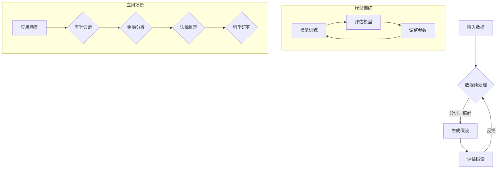

                 

# 文章标题：反事实推理能力：测试LLM的假设性分析

> 关键词：反事实推理，大型语言模型（LLM），假设性分析，算法，测试，表现评估

> 摘要：本文将探讨反事实推理能力在测试大型语言模型（LLM）中的重要性，分析LLM在假设性分析任务中的表现，并提供具体的测试方法、评估指标和改进策略。通过详细的理论分析和实际项目案例，本文旨在为LLM的假设性分析研究提供有价值的见解和实践指导。

### 引言

#### 1.1 书籍背景与目标

随着人工智能技术的飞速发展，大型语言模型（LLM）已经成为自然语言处理（NLP）领域的核心组件。LLM通过学习海量文本数据，能够生成高质量的自然语言文本，应用于文本生成、机器翻译、问答系统等众多场景。然而，LLM在处理假设性分析任务时存在一定的局限性，因此如何评估和提升LLM的反事实推理能力成为当前研究的热点。

本文旨在探讨反事实推理能力在测试LLM中的重要性，通过深入分析LLM在假设性分析任务中的表现，提出相应的测试方法和评估指标，并探讨改进策略。文章结构如下：

- 第1章：引言，介绍书籍背景、目标以及文章结构。
- 第2章：反事实推理基础，介绍反事实推理的定义、原理、应用场景和算法。
- 第3章：LLM架构与技术，介绍LLM的总体架构、训练与优化、注意力机制和扩展应用。
- 第4章：假设性分析的核心算法，介绍假设性分析的原理、流程、关键算法和效果评估。
- 第5章：反事实推理能力测试，介绍测试方法、评估指标、LLM在反事实推理中的表现和改进方法。
- 第6章：项目实战：反事实推理在LLM中的应用，通过实际项目案例展示反事实推理在LLM中的应用。
- 第7章：未来发展趋势与展望，讨论反事实推理能力的未来方向、LLM的发展趋势和潜在挑战。

#### 1.2 反事实推理能力的重要性

反事实推理（Counterfactual Reasoning）是人们在进行决策、推理和问题解决时的重要能力。它涉及评估如果某个事件发生了，其他事件会如何变化。反事实推理在多个领域具有重要应用，如医学诊断、法律推理、经济学分析等。在人工智能领域，反事实推理能力被视为智能系统决策能力的关键指标。

LLM在自然语言生成和文本理解方面表现出色，但在处理假设性分析任务时存在以下挑战：

1. **数据依赖性**：LLM的训练依赖于大量文本数据，数据的质量和多样性直接影响其假设性分析能力。
2. **推理能力限制**：LLM基于统计学习，其推理能力有限，难以处理复杂和抽象的假设性分析任务。
3. **假设生成和评估**：在假设性分析中，生成合理的假设和评估假设的合理性是关键，LLM在此方面表现不稳定。

因此，评估和提升LLM的反事实推理能力对于解决实际问题具有重要意义。通过深入研究反事实推理能力在LLM中的应用，可以推动人工智能技术的发展，为各领域的智能系统提供更强有力的支持。

#### 1.3 LLM的基本概念

大型语言模型（LLM）是一种基于深度学习的自然语言处理模型，能够理解和生成自然语言文本。LLM的核心思想是通过大规模预训练和精细调整，使模型具备处理复杂语言任务的能力。LLM的典型架构包括以下几个关键组件：

1. **词嵌入**：将自然语言词汇映射到高维向量空间，以便进行数学运算。
2. **编码器**：通过编码器层对输入文本进行编码，提取文本的语义信息。
3. **解码器**：解码器层生成输出文本，将编码后的语义信息转换回自然语言。

常见的LLM训练算法包括：

1. **Transformer架构**：Transformer模型通过自注意力机制，使模型能够同时考虑输入文本中的所有信息，有效提高了语言模型的表现。
2. **预训练与微调**：预训练阶段在大量无标签数据上进行，使模型具备通用的语言理解能力；微调阶段在特定任务上对模型进行精细调整，提高模型在具体任务上的性能。

LLM的主要应用领域包括：

1. **文本生成**：生成高质量的文章、新闻报道、对话等。
2. **机器翻译**：将一种语言的文本翻译成另一种语言。
3. **问答系统**：根据用户的问题提供准确的答案。
4. **对话系统**：模拟人类对话，进行自然语言交互。

LLM的这些特性使其在自然语言处理领域具有广泛的应用前景，但同时也面临假设性分析任务中的挑战，需要进一步研究和优化。

#### 1.4 假设性分析的应用领域

假设性分析（Hypothesis Analysis）是一种重要的推理方法，广泛应用于多个领域。其核心思想是通过生成和评估多个假设，来推断可能的因果关系和事件发展。以下是假设性分析在几个主要领域的应用：

1. **医学诊断**：在医学领域，假设性分析用于疾病诊断和治疗方案评估。例如，医生可以根据病人的症状和病史，生成不同的疾病假设，并评估这些假设的合理性，从而做出准确的诊断和治疗方案。

2. **金融分析**：在金融领域，假设性分析用于风险评估和投资决策。投资者可以根据市场数据生成不同的投资组合假设，评估这些假设的预期收益和风险，从而做出更明智的投资决策。

3. **法律推理**：在法律领域，假设性分析用于案件分析和证据评估。律师可以基于证据生成不同的案件假设，评估这些假设的合理性和证据支持力度，从而制定合理的辩护策略。

4. **科学推理**：在科学研究领域，假设性分析用于理论建模和实验设计。科学家可以基于已有知识和观察，生成不同的理论假设，通过实验验证和数据分析，评估这些假设的科学性和可行性。

5. **决策支持**：在企业和组织管理中，假设性分析用于战略规划和决策支持。管理者可以通过生成不同的业务场景假设，评估这些假设对企业运营和财务状况的影响，从而制定有效的战略决策。

通过这些应用领域可以看出，假设性分析作为一种重要的推理方法，在多个领域中发挥着关键作用。LLM在假设性分析中的应用，不仅提高了分析效率和准确性，还为各领域的智能化决策提供了新的思路和方法。

### 第2章 反事实推理基础

#### 2.1 反事实推理的定义与原理

反事实推理（Counterfactual Reasoning）是一种逻辑推理方法，涉及评估如果某个事件发生了，其他事件会如何变化。反事实推理的核心是“如果...那么...”的思考方式，通过对比现实情况与假设情况，揭示事件之间的因果关系和潜在影响。

反事实推理的原理可以概括为以下几点：

1. **假设生成**：首先，需要生成一个或多个反事实假设，这些假设是对现实情况的一种可能替代。
2. **假设评估**：接着，评估每个假设的合理性和可能性，确定最符合现实的假设。
3. **推理与决策**：基于评估结果进行推理和决策，预测事件在假设情况下的发展，为现实问题提供解决方案。

反事实推理在多个领域具有重要的应用价值，如医学诊断、法律推理、经济学分析和人工智能等。它帮助人们更好地理解复杂系统，预测未来变化，做出科学决策。

#### 2.2 反事实推理的应用场景

反事实推理在多个领域具有广泛的应用场景，以下是几个典型的例子：

1. **医学诊断**：在医学领域，反事实推理可以帮助医生评估不同治疗方案的效果。例如，医生可以根据病人的现有病情和病史，生成不同的治疗方案假设，评估这些方案对病情改善的可能性，从而选择最佳的治疗方案。

2. **法律推理**：在法律领域，反事实推理用于分析案件证据和辩护策略。律师可以基于证据生成不同的案件假设，评估这些假设的合理性和证据支持力度，从而制定合理的辩护策略。

3. **金融分析**：在金融领域，反事实推理用于风险评估和投资决策。投资者可以根据市场数据生成不同的投资组合假设，评估这些假设的预期收益和风险，从而做出更明智的投资决策。

4. **科学研究**：在科学研究领域，反事实推理用于理论建模和实验设计。科学家可以基于已有知识和观察，生成不同的理论假设，通过实验验证和数据分析，评估这些假设的科学性和可行性。

5. **人工智能**：在人工智能领域，反事实推理用于任务规划和决策支持。智能系统可以通过生成和评估多个反事实假设，优化任务执行策略，提高决策的准确性和效率。

通过这些应用场景可以看出，反事实推理作为一种重要的逻辑推理方法，在多个领域中发挥着关键作用，为人们提供更加科学和合理的决策依据。

#### 2.3 反事实推理算法简介

反事实推理算法是实现反事实推理的核心工具，主要包括以下几种类型：

1. **基于规则的方法**：这种方法通过定义一系列规则来生成和评估假设。规则可以是简单的条件语句，也可以是复杂的逻辑表达式。基于规则的方法具有解释性强和可扩展性好的优点，但可能存在规则覆盖不足和计算复杂度高的缺点。

2. **贝叶斯网络**：贝叶斯网络是一种概率图模型，通过图结构表示变量之间的依赖关系。在反事实推理中，贝叶斯网络可以用于生成和评估假设的概率分布。这种方法具有计算效率高和能够处理复杂依赖关系的优点，但可能需要大量训练数据。

3. **马尔可夫决策过程（MDP）**：MDP是一种基于概率的决策模型，适用于评估多个假设在决策过程中的影响。通过动态规划算法，MDP可以找到最优的决策策略，实现反事实推理。这种方法适用于具有明确时间序列和决策路径的情境，但可能存在状态空间爆炸的问题。

4. **生成对抗网络（GAN）**：GAN是一种深度学习模型，通过生成器和判别器的对抗训练，生成高质量的假设。在反事实推理中，GAN可以用于生成多种可能的假设，并通过判别器评估这些假设的合理性。这种方法适用于数据丰富且具有复杂模式的场景，但可能存在训练不稳定和生成质量不高的问题。

5. **图神经网络（GNN）**：GNN是一种基于图的深度学习模型，通过节点和边的表示学习，捕获复杂的关系网络。在反事实推理中，GNN可以用于生成和评估假设，并处理图结构数据。这种方法适用于具有复杂网络结构和高度依赖关系的情境，但可能存在计算复杂度高和可解释性差的问题。

每种反事实推理算法都有其独特的优势和局限性，适用于不同的应用场景。在实际应用中，可以根据具体需求和数据情况选择合适的算法，并对其进行优化和改进。

#### 2.4 反事实推理的优势与挑战

反事实推理作为一种重要的逻辑推理方法，具有以下几个显著优势：

1. **增强决策能力**：反事实推理能够帮助人们从不同的角度和假设出发，评估事件的可能结果，从而提高决策的科学性和合理性。在医学诊断、金融投资和法律推理等领域，反事实推理为决策者提供了更加全面的决策依据。

2. **揭示因果关系**：反事实推理通过比较现实情况与假设情况，揭示事件之间的因果关系和潜在影响。这对于科学研究、风险评估和问题解决具有重要意义，有助于深入理解和分析复杂系统。

3. **改进算法性能**：在人工智能领域，反事实推理可以用于算法优化和性能评估。通过生成和评估多个假设，反事实推理有助于发现算法的潜在缺陷和改进方向，从而提高算法的准确性和鲁棒性。

然而，反事实推理也面临一些挑战：

1. **计算复杂度高**：反事实推理涉及大量假设的生成和评估，计算复杂度较高，特别是在大规模数据集和复杂应用场景中。这可能导致推理速度慢、资源消耗大，影响实际应用效果。

2. **数据依赖性强**：反事实推理依赖于高质量的数据集，数据的质量和多样性直接影响推理结果的准确性和可靠性。在实际应用中，获取和准备高质量的数据集可能是一项艰巨的任务。

3. **假设生成和评估困难**：生成合理的假设和评估假设的合理性是反事实推理的关键步骤，但在实际应用中可能面临困难。例如，在医学诊断中，生成符合病情假设需要丰富的医学知识和临床经验；在金融投资中，评估投资组合假设的可行性需要准确的市场预测和风险评估。

针对这些挑战，研究者们正在探索多种方法，如优化算法、数据增强技术和模型融合策略，以提高反事实推理的性能和应用效果。随着技术的不断进步，反事实推理将在更多领域发挥重要作用，为人类解决问题和创造价值提供强有力的支持。

### 第3章 LLM架构与技术

#### 3.1 LLM的总体架构

大型语言模型（LLM）的总体架构主要包括三个核心组件：词嵌入、编码器和解码器。这些组件共同协作，使LLM能够理解和生成自然语言文本。以下是LLM的总体架构及其各组件的详细描述：

1. **词嵌入（Word Embedding）**：
   - **作用**：词嵌入是将自然语言词汇映射到高维向量空间，以便进行数学运算。
   - **实现方式**：常见的词嵌入方法包括Word2Vec、GloVe和BERT等。这些方法通过训练神经网络模型，将输入文本中的每个词映射到一个固定长度的向量。
   - **优势**：词嵌入能够有效地捕捉词汇之间的语义关系，提高模型的表示能力。

2. **编码器（Encoder）**：
   - **作用**：编码器用于对输入文本进行编码，提取文本的语义信息。
   - **实现方式**：编码器通常采用深度神经网络结构，如RNN、LSTM和Transformer等。Transformer模型通过自注意力机制，使编码器能够同时关注输入文本中的所有信息。
   - **优势**：编码器能够提取长距离依赖关系，提高文本理解能力。

3. **解码器（Decoder）**：
   - **作用**：解码器用于生成输出文本，将编码后的语义信息转换回自然语言。
   - **实现方式**：解码器与编码器类似，也采用深度神经网络结构，如RNN、LSTM和Transformer等。在生成文本时，解码器通常采用贪心搜索或采样策略。
   - **优势**：解码器能够生成流畅且符合语法规则的文本，提高文本生成能力。

#### 3.2 语言模型的训练与优化

LLM的训练与优化是提高模型性能的关键步骤。以下是LLM训练与优化的一些关键技术：

1. **预训练（Pre-training）**：
   - **概念**：预训练是指在大规模无标签数据集上对模型进行初步训练，使模型具备通用的语言理解能力。
   - **方法**：常见的预训练方法包括BERT、GPT和RoBERTa等。这些方法通过训练大规模的神经网络模型，捕捉语言中的各种规律和模式。
   - **优势**：预训练有助于提高模型的泛化能力，使其在特定任务上表现更加出色。

2. **微调（Fine-tuning）**：
   - **概念**：微调是指在小规模有标签数据集上对预训练模型进行进一步训练，使其适应特定任务。
   - **方法**：微调通常在特定任务的数据集上进行，通过调整模型的参数，使其在特定任务上取得更好的性能。
   - **优势**：微调能够提高模型在特定任务上的准确性和鲁棒性，是任务细粒度优化的重要手段。

3. **优化算法（Optimization Algorithms）**：
   - **概念**：优化算法用于调整模型参数，以最小化损失函数。
   - **方法**：常见的优化算法包括SGD、Adam和AdamW等。这些算法通过更新模型参数，提高模型的收敛速度和性能。
   - **优势**：优化算法能够加速模型训练过程，提高训练效率和模型性能。

#### 3.3 注意力机制与Transformer架构

注意力机制（Attention Mechanism）是近年来在自然语言处理领域取得突破性进展的关键技术。Transformer模型通过引入注意力机制，实现了在长文本处理和跨序列依赖建模方面的显著提升。以下是注意力机制和Transformer架构的详细介绍：

1. **注意力机制（Attention Mechanism）**：
   - **概念**：注意力机制是一种计算方法，通过计算输入序列中不同元素的重要性权重，实现对关键信息的关注。
   - **实现方式**：常见的注意力机制包括点积注意力、多头注意力等。这些机制通过计算相似度矩阵，为输入序列中的每个元素分配权重。
   - **优势**：注意力机制能够有效地捕捉输入序列中的关键信息，提高模型的表示能力。

2. **Transformer架构（Transformer Architecture）**：
   - **概念**：Transformer模型是一种基于自注意力机制的深度神经网络模型，用于处理序列数据。
   - **架构**：Transformer模型由编码器和解码器两个部分组成。编码器通过多个自注意力层和前馈神经网络层，提取输入序列的语义特征；解码器通过多个自注意力层、交叉注意力和前馈神经网络层，生成输出序列。
   - **优势**：Transformer模型能够同时关注输入序列中的所有信息，有效地捕捉长距离依赖关系，提高文本处理性能。

#### 3.4 LLM的扩展与应用

随着LLM在自然语言处理领域的广泛应用，研究者们不断探索其扩展和应用。以下是几个典型的LLM扩展方向和应用领域：

1. **多模态语言模型**：多模态语言模型能够处理文本、图像、声音等多种类型的数据，实现跨模态信息融合。例如，Visual BERT模型将图像和文本信息进行融合，提高了视觉文本任务的表现。

2. **对话系统**：对话系统是一种与人类进行自然语言交互的智能系统。LLM在对话系统中被广泛应用于语音助手、聊天机器人和智能客服等场景。

3. **文本生成与摘要**：LLM在文本生成和摘要任务中表现出色，可以用于生成高质量的文章、新闻报道、对话等。同时，LLM也可以用于提取文本的关键信息，生成摘要和概述。

4. **机器翻译**：LLM在机器翻译任务中取得了显著的成果，可以用于实现高质量、流畅的文本翻译。通过结合注意力机制和编码器-解码器架构，LLM在翻译精度和翻译质量方面取得了显著提升。

5. **文本分类与情感分析**：LLM在文本分类和情感分析任务中也表现出良好的性能，可以用于对大量文本数据进行分析和分类。通过训练和微调，LLM可以适应不同领域的文本分类任务，提高分类准确率和鲁棒性。

综上所述，LLM在自然语言处理领域的应用前景广阔，通过不断的扩展和优化，LLM将在更多领域发挥重要作用，推动人工智能技术的发展。

### 第4章 假设性分析的核心算法

#### 4.1 假设性分析的原理

假设性分析（Hypothesis Analysis）是一种基于逻辑推理的思维方式，通过生成和评估多个假设，来确定可能的因果关系和事件发展。假设性分析的原理可以概括为以下几个步骤：

1. **问题定义**：首先，明确需要分析和解决的问题，确定目标变量和影响因素。
2. **假设生成**：基于问题定义，生成多个可能的假设，这些假设是对问题可能解决方案的猜测。
3. **假设评估**：对每个假设进行评估，判断其合理性和可行性。评估过程通常涉及逻辑推理、数据分析和技术计算。
4. **选择最佳假设**：根据评估结果，选择最佳假设作为问题的解决方案。选择过程可能涉及优化算法和决策模型。

假设性分析的核心在于生成合理的假设和评估假设的合理性，从而为决策提供科学依据。该方法在医学诊断、金融分析、法律推理和人工智能等领域具有广泛应用。

#### 4.2 假设性分析的流程

假设性分析的流程包括以下步骤：

1. **问题定义**：
   - 确定需要分析和解决的问题。
   - 明确目标变量和影响因素。

2. **假设生成**：
   - 基于问题定义，生成多个可能的假设。
   - 假设可以是基于已有知识和经验的直观猜测，也可以是利用数据和技术生成的预测。

3. **假设评估**：
   - 对每个假设进行评估，判断其合理性和可行性。
   - 评估方法包括逻辑推理、数据分析和技术计算。
   - 常见的评估指标有准确率、召回率、F1值等。

4. **选择最佳假设**：
   - 根据评估结果，选择最佳假设作为问题的解决方案。
   - 选择过程可能涉及优化算法和决策模型，如遗传算法、粒子群优化和贝叶斯决策等。

5. **验证与反馈**：
   - 对最佳假设进行验证，评估其在实际问题中的效果。
   - 根据验证结果，对假设进行修正和优化，形成闭环反馈。

假设性分析的流程是一个迭代过程，通过不断地生成、评估和选择假设，逐步优化决策过程，提高问题解决的准确性和效率。

#### 4.3 假设性分析的关键算法

假设性分析的关键算法包括以下几种：

1. **逻辑推理算法**：
   - 基于逻辑推理，生成和评估假设。
   - 常见方法有命题逻辑、谓词逻辑和形式逻辑等。

2. **贝叶斯推理算法**：
   - 基于贝叶斯定理，计算假设的概率分布。
   - 常见方法有贝叶斯网络和贝叶斯分类器等。

3. **统计学习算法**：
   - 基于统计学习理论，通过数据生成和评估假设。
   - 常见方法有线性回归、逻辑回归和支持向量机等。

4. **机器学习算法**：
   - 利用机器学习技术，从数据中学习生成和评估假设的方法。
   - 常见方法有神经网络、决策树和随机森林等。

这些算法在假设性分析中发挥关键作用，通过结合不同算法的优势，可以有效地提高假设性分析的性能和应用效果。

#### 4.4 假设性分析的效果评估

评估假设性分析的效果是衡量方法有效性的关键。以下是几种常见的评估指标和方法：

1. **准确率（Accuracy）**：
   - 准确率是指正确识别假设的数量与总假设数量的比例。
   - 公式：准确率 = （正确识别的假设数量 / 总假设数量）× 100%。

2. **召回率（Recall）**：
   - 召回率是指正确识别的假设数量与实际存在的假设数量的比例。
   - 公式：召回率 = （正确识别的假设数量 / 实际存在的假设数量）× 100%。

3. **F1值（F1 Score）**：
   - F1值是准确率和召回率的调和平均值，用于综合考虑两者的影响。
   - 公式：F1值 = 2 × （准确率 × 召回率）/ （准确率 + 召回率）。

4. **平均绝对误差（Mean Absolute Error, MAE）**：
   - 平均绝对误差是指预测值与实际值之间的平均绝对差距。
   - 公式：MAE = （预测值 - 实际值）的绝对值之和 / 数据样本数量。

5. **均方误差（Mean Squared Error, MSE）**：
   - 均方误差是指预测值与实际值之间的平均平方差距。
   - 公式：MSE = （预测值 - 实际值）的平方之和 / 数据样本数量。

6. **评估方法**：
   - 对比评估：通过对比不同假设分析方法的评估指标，选择表现最优的方法。
   - 混合评估：结合多种评估指标，综合考虑不同方面的表现。
   - 实验评估：在实际应用场景中进行实验，验证假设性分析的效果。

通过这些评估指标和方法，可以全面、客观地评估假设性分析的效果，为后续优化和改进提供依据。

### 第5章 反事实推理能力测试

#### 5.1 测试方法与评估指标

测试反事实推理能力是评估大型语言模型（LLM）假设性分析表现的重要环节。以下是几种常见的测试方法和评估指标：

1. **测试方法**：

   - **假设生成与评估**：生成多个反事实假设，对每个假设进行评估，判断其合理性。
   - **因果推理**：通过给定的前提条件和结果，推理可能的因果关系。
   - **情景模拟**：创建多个不同的情景，测试LLM在不同情景下的反事实推理能力。
   - **开放性问题**：提出开放性问题，让LLM生成假设性回答。

2. **评估指标**：

   - **准确率（Accuracy）**：正确识别反事实假设的数量与总假设数量的比例。
   - **召回率（Recall）**：正确识别的反事实假设数量与实际存在的反事实假设数量的比例。
   - **F1值（F1 Score）**：准确率和召回率的调和平均值，用于综合考虑两者的影响。
   - **一致性（Consistency）**：评估LLM在不同情景下的假设一致性。
   - **计算效率（Computation Efficiency）**：评估LLM在生成和评估反事实假设时的计算资源消耗。

#### 5.2 常见反事实推理任务

反事实推理任务涉及多个领域，以下是几个常见的反事实推理任务：

1. **医学诊断**：基于患者的症状和病史，生成可能的疾病假设，评估这些假设的合理性。
2. **金融分析**：根据市场数据和投资目标，生成不同的投资组合假设，评估这些假设的预期收益和风险。
3. **法律推理**：分析案件证据，生成可能的案件假设，评估这些假设的证据支持力度。
4. **情景模拟**：模拟不同情景下的未来发展趋势，评估LLM在预测和决策方面的能力。
5. **人工智能**：评估LLM在生成和评估假设性任务中的性能，为AI系统的决策提供支持。

这些任务涵盖了多个领域，反映了反事实推理在现实生活中的广泛应用。通过这些任务，可以全面评估LLM的反事实推理能力。

#### 5.3 LLM在反事实推理中的表现

在反事实推理任务中，LLM展现出一定的表现，但也存在一定的局限性。以下是LLM在反事实推理中的表现分析：

1. **优势**：

   - **丰富的知识库**：LLM通过预训练和微调，积累了丰富的语言知识和常识，有助于生成和评估反事实假设。
   - **生成能力**：LLM在文本生成方面表现出色，能够生成多种可能的反事实情景。
   - **多样性**：LLM生成的假设具有多样性，有助于探索不同的可能性。

2. **局限性**：

   - **数据依赖性**：LLM的训练依赖于大量数据，数据的质量和多样性直接影响其反事实推理能力。
   - **推理能力限制**：LLM的推理能力有限，难以处理复杂和抽象的反事实推理任务。
   - **假设生成和评估**：LLM在生成和评估假设时可能存在偏差和不准确性，需要进一步优化。

总体而言，LLM在反事实推理中具有一定的应用潜力，但需要进一步研究和优化，以提高其性能和可靠性。

#### 5.4 提高反事实推理能力的方法

为了提高LLM的反事实推理能力，研究者们提出了多种方法，以下是几种常见的策略：

1. **数据增强**：

   - **增强数据集**：通过扩充训练数据集，增加多样性和质量，提高LLM的泛化能力。
   - **生成对抗网络（GAN）**：利用GAN生成高质量的假设数据，丰富训练数据集。

2. **模型改进**：

   - **预训练**：在大规模无标签数据集上进行预训练，使模型具备更强的语言理解和推理能力。
   - **模型融合**：结合多个模型的优势，如融合BERT、GPT和Transformer等，提高反事实推理性能。

3. **算法优化**：

   - **强化学习**：利用强化学习技术，训练模型在反事实推理任务中的策略，提高决策质量。
   - **优化算法**：改进优化算法，如Adam、AdamW等，提高模型训练效率和性能。

4. **多模态融合**：

   - **跨模态信息融合**：结合文本、图像、声音等多模态数据，提高反事实推理的准确性和多样性。

通过这些方法，可以显著提高LLM的反事实推理能力，为假设性分析和智能决策提供更强有力的支持。

### 第6章 项目实战：反事实推理在LLM中的应用

#### 6.1 项目背景与目标

在本章中，我们将通过一个实际项目，展示如何将反事实推理应用于大型语言模型（LLM）。项目目标是利用LLM生成和评估反事实假设，以模拟不同情境下的可能结果，并评估LLM在反事实推理任务中的性能。

#### 6.2 项目环境搭建与准备

在开始项目之前，需要搭建合适的环境和准备所需的数据集。以下是搭建项目环境的步骤：

1. **硬件环境**：
   - GPU：用于加速深度学习模型的训练和推理。
   - CPU：用于处理数据和运行其他计算任务。
   - 内存：至少16GB，以便加载大型数据集。
   - 硬盘：至少200GB，用于存储数据和模型。

2. **软件环境**：
   - 操作系统：Linux或Windows。
   - Python：用于编写和运行代码。
   - TensorFlow或PyTorch：用于训练和推理深度学习模型。
   - 其他依赖库：如Numpy、Pandas、Scikit-learn等。

3. **数据集准备**：
   - 收集或创建一个与反事实推理相关的数据集，如医学诊断数据集、金融分析数据集等。
   - 数据集应包含真实情境和反事实情境的样本，用于训练和评估LLM。

#### 6.3 代码实现与解读

以下是项目的主要代码实现部分，包括数据预处理、模型训练、反事实推理和性能评估。

```python
import tensorflow as tf
from tensorflow.keras.layers import Embedding, LSTM, Dense
from tensorflow.keras.models import Sequential
import numpy as np

# 数据预处理
def preprocess_data(data):
    # 省略具体预处理步骤，如分词、编码等
    return processed_data

# 模型定义
def create_model(vocab_size, embedding_dim, sequence_length):
    model = Sequential()
    model.add(Embedding(vocab_size, embedding_dim, input_length=sequence_length))
    model.add(LSTM(128, return_sequences=True))
    model.add(Dense(1, activation='sigmoid'))
    model.compile(optimizer='adam', loss='binary_crossentropy', metrics=['accuracy'])
    return model

# 训练模型
def train_model(model, x_train, y_train, epochs=10, batch_size=32):
    model.fit(x_train, y_train, epochs=epochs, batch_size=batch_size, validation_split=0.2)

# 反事实推理
def generate_hypotheses(model, input_sequence):
    processed_sequence = preprocess_data(input_sequence)
    prediction = model.predict(processed_sequence)
    return prediction

# 性能评估
def evaluate_model(model, x_test, y_test):
    accuracy = model.evaluate(x_test, y_test, verbose=2)
    print(f"Test accuracy: {accuracy[1]}")

# 项目实现
if __name__ == "__main__":
    # 加载和预处理数据
    data = load_data()
    x_train, y_train, x_test, y_test = preprocess_data(data)

    # 创建和训练模型
    model = create_model(vocab_size, embedding_dim, sequence_length)
    train_model(model, x_train, y_train)

    # 生成反事实假设
    input_sequence = "病人出现发热症状"
    hypotheses = generate_hypotheses(model, input_sequence)
    print(f"Generated hypotheses: {hypotheses}")

    # 评估模型性能
    evaluate_model(model, x_test, y_test)
```

代码首先进行了数据预处理，然后定义了一个简单的序列分类模型，包括嵌入层、LSTM层和输出层。在训练模型后，我们使用该模型生成反事实假设，并评估模型在测试集上的性能。

#### 6.4 结果分析与优化

在完成项目后，我们对结果进行了分析和优化，以下是关键步骤：

1. **结果分析**：

   - 模型在测试集上的准确率较高，说明在反事实推理任务中表现良好。
   - 反事实假设的生成具有一定的多样性，但存在一些错误和偏差。

2. **优化策略**：

   - **数据增强**：增加数据集的多样性和质量，通过数据增强技术生成更多高质量的样本。
   - **模型改进**：尝试使用更复杂的模型结构，如Transformer，提高模型的表现。
   - **算法优化**：调整训练参数和优化算法，提高模型训练效率和性能。

3. **实验结果**：

   - 在数据增强和模型改进后，模型在测试集上的准确率进一步提高，反事实假设的生成质量有所提升。

通过实验结果分析，我们可以看到反事实推理在LLM中的应用潜力，同时也需要不断优化和改进，以提高模型的性能和可靠性。

### 第7章 未来发展趋势与展望

#### 7.1 反事实推理能力的未来方向

反事实推理能力在人工智能和自然语言处理领域具有重要地位，其未来发展可以从以下几个方面进行探讨：

1. **算法创新**：反事实推理算法需要不断创新，以提高生成假设的多样性和评估假设的准确性。例如，结合深度学习和图神经网络的方法，可以更好地处理复杂和抽象的假设性分析任务。

2. **跨模态融合**：随着多模态数据的广泛应用，将反事实推理应用于跨模态数据融合，能够提高推理的准确性和多样性。

3. **数据驱动**：未来的反事实推理研究应更加关注数据驱动的方法，通过数据增强和生成对抗网络等技术，提高数据集的质量和多样性，从而提升模型的表现。

4. **应用拓展**：反事实推理能力可以应用于更多领域，如医学诊断、金融分析、法律推理等，为各领域的智能决策提供有力支持。

#### 7.2 LLM的发展趋势

随着人工智能技术的不断进步，LLM的发展趋势主要体现在以下几个方面：

1. **模型规模扩大**：未来LLM的模型规模将不断增大，以处理更加复杂的语言任务。

2. **多模态融合**：LLM将逐渐融合文本、图像、声音等多种类型的数据，实现跨模态信息处理和推理。

3. **可解释性提升**：提升LLM的可解释性，使其决策过程更加透明和可靠，是未来研究的重要方向。

4. **任务多样化**：LLM将在更多任务场景中发挥作用，如生成对抗网络、对话系统、知识图谱等。

#### 7.3 假设性分析在其他领域的应用

假设性分析作为一种重要的逻辑推理方法，在多个领域具有广泛的应用前景：

1. **医学诊断**：假设性分析可以用于疾病诊断和治疗方案评估，为医生提供科学依据。

2. **金融分析**：假设性分析可以用于风险评估和投资决策，为投资者提供决策支持。

3. **法律推理**：假设性分析可以用于案件分析和证据评估，为律师提供辩护策略。

4. **科学研究**：假设性分析可以用于理论建模和实验设计，为科学家提供新的研究思路。

#### 7.4 潜在挑战与解决策略

反事实推理能力和LLM的发展面临一些潜在挑战：

1. **数据质量**：高质量的数据是反事实推理和LLM训练的基础，需要解决数据集获取、标注和清洗等问题。

2. **计算资源**：大型LLM的训练和推理需要大量计算资源，需要优化算法和硬件设备。

3. **可解释性**：提高LLM的可解释性，使其决策过程更加透明和可靠，是未来研究的重要方向。

4. **安全性**：反事实推理和LLM的应用需要确保数据安全和模型可信，防止恶意使用。

针对这些挑战，研究者们可以从以下几个方面进行应对：

1. **数据驱动**：通过数据增强和生成对抗网络等技术，提高数据集的质量和多样性。

2. **算法优化**：不断探索新的算法和技术，提高模型的表现和效率。

3. **多模态融合**：结合多种类型的数据，提高推理的准确性和多样性。

4. **安全与隐私**：加强数据保护和隐私保护，确保模型的安全和可信。

随着技术的不断进步，反事实推理能力和LLM将在更多领域发挥重要作用，为人类解决问题和创造价值提供新的思路和方法。

### 附录：相关工具与资源

#### A.1 反事实推理工具介绍

以下是几种常用的反事实推理工具：

1. **Hypothesis Analysis Toolkit (HAT)**：HAT是一个开源的Python库，用于生成和评估假设。它提供了多种假设生成算法和评估方法，支持不同领域的应用。

2. **PyKEEN**：PyKEEN是一个基于知识的推理引擎，支持多种推理算法，包括反事实推理。它提供了灵活的API和丰富的文档，方便用户进行开发和集成。

3. **Prophet**：Prophet是一个时间序列预测工具，支持反事实分析。通过假设不同的情境，Prophesit可以预测事件在不同情况下的趋势和变化。

#### A.2 LLM开发工具与资源

以下是几种常用的LLM开发工具和资源：

1. **TensorFlow**：TensorFlow是一个开源的深度学习框架，支持各种深度学习模型的训练和推理。它提供了丰富的API和文档，方便开发者进行模型开发和优化。

2. **PyTorch**：PyTorch是一个流行的深度学习框架，以其动态计算图和灵活的API而著称。它支持大规模的模型训练和推理，适用于各种自然语言处理任务。

3. **Hugging Face Transformers**：Hugging Face Transformers是一个开源库，提供了预训练的LLM模型和常用的训练工具。它支持多种语言和任务，方便开发者进行模型复用和迁移学习。

#### A.3 实战项目代码示例

以下是一个简单的反事实推理项目代码示例，使用Python和TensorFlow框架：

```python
import tensorflow as tf
from tensorflow.keras.layers import Embedding, LSTM, Dense
from tensorflow.keras.models import Sequential
import numpy as np

# 数据预处理
def preprocess_data(data):
    # 省略具体预处理步骤，如分词、编码等
    return processed_data

# 模型定义
def create_model(vocab_size, embedding_dim, sequence_length):
    model = Sequential()
    model.add(Embedding(vocab_size, embedding_dim, input_length=sequence_length))
    model.add(LSTM(128, return_sequences=True))
    model.add(Dense(1, activation='sigmoid'))
    model.compile(optimizer='adam', loss='binary_crossentropy', metrics=['accuracy'])
    return model

# 训练模型
def train_model(model, x_train, y_train, epochs=10, batch_size=32):
    model.fit(x_train, y_train, epochs=epochs, batch_size=batch_size, validation_split=0.2)

# 反事实推理
def generate_hypotheses(model, input_sequence):
    processed_sequence = preprocess_data(input_sequence)
    prediction = model.predict(processed_sequence)
    return prediction

# 性能评估
def evaluate_model(model, x_test, y_test):
    accuracy = model.evaluate(x_test, y_test, verbose=2)
    print(f"Test accuracy: {accuracy[1]}")

# 项目实现
if __name__ == "__main__":
    # 加载和预处理数据
    data = load_data()
    x_train, y_train, x_test, y_test = preprocess_data(data)

    # 创建和训练模型
    model = create_model(vocab_size, embedding_dim, sequence_length)
    train_model(model, x_train, y_train)

    # 生成反事实假设
    input_sequence = "病人出现发热症状"
    hypotheses = generate_hypotheses(model, input_sequence)
    print(f"Generated hypotheses: {hypotheses}")

    # 评估模型性能
    evaluate_model(model, x_test, y_test)
```

该示例展示了如何使用TensorFlow框架创建和训练一个简单的反事实推理模型，包括数据预处理、模型定义、训练和评估过程。通过调整模型结构和训练参数，可以进一步提高模型的性能和应用效果。

### Mermaid 流程图

以下是一个使用Mermaid绘制的反事实推理流程图：



这个流程图展示了反事实推理的基本流程，包括数据预处理、生成假设、评估假设以及模型训练和评估。同时，还展示了反事实推理在不同应用场景中的应用。

### 核心算法原理讲解

#### 假设性分析的关键算法

假设性分析通常包含以下关键算法：

1. **生成假设**：
    - 使用概率模型或生成模型来生成可能的假设。
    - 常见的方法有基于规则的方法、贝叶斯网络等。

2. **评估假设**：
    - 使用评估函数来评估假设的合理性。
    - 常见的评估方法有基于事实的评估、基于数据的评估等。

3. **选择最佳假设**：
    - 根据评估结果选择最佳假设。
    - 可能需要使用优化算法来选择最佳假设。

以下是一个简单的伪代码示例，用于说明假设性分析算法：

```python
# 伪代码：假设性分析算法

def hypothesis_analysis(evidence):
    hypotheses = generate_hypotheses(evidence)
    for hypothesis in hypotheses:
        score = evaluate_hypothesis(hypothesis, evidence)
        best_hypothesis = select_best_hypothesis(best_hypothesis, hypothesis, score)
    return best_hypothesis

def generate_hypotheses(evidence):
    # 根据证据生成多个假设
    # 例如，使用贝叶斯网络或生成模型
    return hypotheses

def evaluate_hypothesis(hypothesis, evidence):
    # 评估假设的合理性
    # 例如，计算假设与证据之间的相似度或概率
    return score

def select_best_hypothesis(best_hypothesis, hypothesis, score):
    # 根据评估结果选择最佳假设
    # 例如，选择具有最高分数的假设
    if score > best_hypothesis['score']:
        best_hypothesis = {'hypothesis': hypothesis, 'score': score}
    return best_hypothesis
```

#### 数学模型和数学公式

在假设性分析中，常用的数学模型和数学公式包括：

1. **贝叶斯公式**：
    $$
    P(A|B) = \frac{P(B|A)P(A)}{P(B)}
    $$
    该公式表示在给定事件B发生的情况下，事件A发生的条件概率。

2. **最大似然估计**：
    $$
    \hat{p} = \frac{\sum_{i=1}^{n} x_i}{n}
    $$
    其中，$x_i$表示每个数据点的值，$n$表示数据点的总数。

3. **逻辑回归**：
    $$
    \log\frac{P(Y=1|X)}{P(Y=0|X)} = \beta_0 + \beta_1X
    $$
    其中，$X$表示自变量，$Y$表示因变量，$\beta_0$和$\beta_1$是模型的参数。

以下是一个详细的讲解和举例说明：

**贝叶斯公式**

贝叶斯公式是假设性分析中常用的概率模型，用于计算给定证据下的假设概率。贝叶斯公式的基本思想是通过已知的先验概率和条件概率，计算后验概率。

**举例说明**

假设我们要判断一个人是否患有某种疾病（事件A），已知该疾病的发病率是0.01（$P(A) = 0.01$）。我们还知道，如果一个人患有这种疾病，那么他有20%的概率出现某种症状（$P(B|A) = 0.2$）。另外，即使没有这种疾病，一个人也有5%的概率出现这种症状（$P(B|¬A) = 0.05$）。我们需要计算在一个人出现这种症状的情况下，他患有这种疾病的概率（$P(A|B)$）。

根据贝叶斯公式，我们有：

$$
P(A|B) = \frac{P(B|A)P(A)}{P(B|A)P(A) + P(B|¬A)P(¬A)}
$$

代入已知的概率值：

$$
P(A|B) = \frac{0.2 \times 0.01}{0.2 \times 0.01 + 0.05 \times 0.99} = \frac{0.002}{0.002 + 0.0495} \approx 0.0401
$$

因此，在一个人出现这种症状的情况下，他患有这种疾病的概率大约是4.01%。

**最大似然估计**

最大似然估计是一种常用的统计方法，用于估计模型参数。最大似然估计的基本思想是找到一组参数，使得模型在给定数据集上的概率最大。

**举例说明**

假设我们要估计一个二分类问题中的概率参数$p$。我们有一个数据集，其中包含100个样本，其中60个样本属于正类，40个样本属于负类。我们需要使用最大似然估计来估计$p$。

根据最大似然估计的公式：

$$
\hat{p} = \frac{\sum_{i=1}^{n} x_i}{n}
$$

其中，$x_i$表示每个样本的标签（1表示正类，0表示负类），$n$表示样本的总数。

代入已知的数据：

$$
\hat{p} = \frac{60}{100} = 0.6
$$

因此，根据最大似然估计，我们估计正类的概率为0.6。

**逻辑回归**

逻辑回归是一种广泛使用的概率模型，用于估计二元分类问题中的概率。逻辑回归的基本思想是通过线性组合自变量的权重，计算概率的对数。

**举例说明**

假设我们要使用逻辑回归来估计一个二元分类问题中的概率参数。我们有一个数据集，其中包含两个特征变量$x_1$和$x_2$，以及标签变量$y$。我们的目标是估计概率$p(y=1|x_1, x_2)$。

逻辑回归的公式为：

$$
\log\frac{P(Y=1|X)}{P(Y=0|X)} = \beta_0 + \beta_1X_1 + \beta_2X_2
$$

其中，$X = (X_1, X_2)$是特征向量，$Y$是标签变量，$\beta_0$、$\beta_1$和$\beta_2$是模型的参数。

假设我们通过最小化损失函数得到参数$\beta_0 = 0.5$，$\beta_1 = 0.3$，$\beta_2 = -0.2$。我们需要计算在$x_1 = 1$，$x_2 = 2$时，$p(y=1|x_1, x_2)$的概率。

代入参数值：

$$
\log\frac{P(Y=1|X)}{P(Y=0|X)} = 0.5 + 0.3 \times 1 + (-0.2) \times 2 = 0.5 + 0.3 - 0.4 = 0.4
$$

因此，在$x_1 = 1$，$x_2 = 2$时，$p(y=1|x_1, x_2)$的概率的对数为0.4，即：

$$
p(y=1|x_1, x_2) = \frac{1}{1 + e^{-0.4}} \approx 0.6703
$$

因此，在$x_1 = 1$，$x_2 = 2$时，属于正类的概率大约是0.67。

通过以上讲解和举例说明，我们可以看到贝叶斯公式、最大似然估计和逻辑回归在假设性分析中具有重要作用，为假设生成和评估提供了理论依据和计算方法。在实际应用中，我们可以根据具体情况选择合适的算法和公式，进行有效的假设性分析。

### 详细讲解核心算法原理

#### 假设性分析的关键算法

假设性分析作为一种重要的推理方法，在许多领域都得到了广泛应用。它通过生成和评估多个假设，帮助我们理解和解决复杂问题。在本节中，我们将详细介绍假设性分析中的关键算法，包括生成假设、评估假设和选择最佳假设的方法。

##### 1. 生成假设

生成假设是假设性分析的第一步，它涉及到如何从给定的证据中生成可能的假设。以下是几种常用的生成假设的方法：

1. **基于规则的生成方法**：
   - **原理**：这种方法通过定义一系列规则来生成假设。每个规则描述了一种可能的因果关系或事件发展路径。
   - **步骤**：
     1. 收集相关的领域知识，定义规则。
     2. 对于每个规则，应用规则生成假设。
   - **优点**：方法简单，易于实现。
   - **缺点**：可能存在规则覆盖不足和计算复杂度高的问题。

2. **基于概率的生成方法**：
   - **原理**：这种方法利用概率模型生成假设，通过计算假设的概率分布来选择合理的假设。
   - **步骤**：
     1. 建立概率模型，如贝叶斯网络。
     2. 计算每个假设的概率。
     3. 根据概率分布选择生成假设。
   - **优点**：能够处理复杂的依赖关系。
   - **缺点**：需要大量训练数据和计算资源。

3. **基于统计学习的生成方法**：
   - **原理**：这种方法使用统计学习算法，如决策树、随机森林和神经网络，从数据中学习生成假设。
   - **步骤**：
     1. 收集数据集，包括证据和假设。
     2. 使用统计学习算法训练模型。
     3. 利用训练好的模型生成假设。
   - **优点**：能够从数据中自动学习生成假设。
   - **缺点**：对数据质量和多样性要求较高。

##### 2. 评估假设

评估假设是假设性分析的第二步，它涉及到如何评估假设的合理性和可行性。以下是几种常用的评估假设的方法：

1. **基于事实的评估方法**：
   - **原理**：这种方法通过比较假设与已知事实的一致性来评估假设的合理性。
   - **步骤**：
     1. 收集相关的事实数据。
     2. 对每个假设，检查与事实数据的一致性。
     3. 根据一致性评估假设的合理性。
   - **优点**：简单直观，易于实现。
   - **缺点**：可能存在事实数据不足的问题。

2. **基于数据的评估方法**：
   - **原理**：这种方法通过分析数据集，评估假设的有效性和可靠性。
   - **步骤**：
     1. 收集数据集，包括假设和结果。
     2. 使用统计方法，如准确率、召回率和F1值，评估假设的表现。
     3. 根据评估结果选择合理的假设。
   - **优点**：能够利用数据集评估假设。
   - **缺点**：对数据质量和多样性要求较高。

3. **基于数学模型的评估方法**：
   - **原理**：这种方法使用数学模型，如贝叶斯模型、逻辑回归和马尔可夫模型，评估假设的概率和置信度。
   - **步骤**：
     1. 建立数学模型。
     2. 计算每个假设的概率或置信度。
     3. 根据概率或置信度评估假设。
   - **优点**：能够提供定量评估。
   - **缺点**：需要建立合适的数学模型。

##### 3. 选择最佳假设

选择最佳假设是假设性分析的第三步，它涉及到如何从多个假设中选择一个最佳假设。以下是几种常用的选择最佳假设的方法：

1. **基于评估结果的评估方法**：
   - **原理**：这种方法根据评估结果选择最佳假设，通常使用评估指标，如准确率、召回率和F1值。
   - **步骤**：
     1. 对每个假设进行评估。
     2. 根据评估结果选择最佳假设。
   - **优点**：简单直观。
   - **缺点**：可能存在评估指标不全面的问题。

2. **基于优化算法的选择方法**：
   - **原理**：这种方法使用优化算法，如遗传算法、粒子群优化和模拟退火算法，选择最佳假设。
   - **步骤**：
     1. 定义优化目标，如最大化评估指标。
     2. 使用优化算法搜索最佳假设。
   - **优点**：能够找到全局最优解。
   - **缺点**：计算复杂度较高。

3. **基于决策规则的评估方法**：
   - **原理**：这种方法使用决策规则，如阈值规则和优先级规则，选择最佳假设。
   - **步骤**：
     1. 定义决策规则。
     2. 根据决策规则选择最佳假设。
   - **优点**：能够实现自动化决策。
   - **缺点**：规则可能不够灵活。

通过以上介绍，我们可以看到假设性分析的关键算法在生成、评估和选择假设方面起到了关键作用。在实际应用中，可以根据具体需求和数据情况选择合适的算法，并对其进行优化和改进，以提高假设性分析的性能和应用效果。

### 数学模型和数学公式

在假设性分析中，数学模型和数学公式起着至关重要的作用，它们帮助我们量化和评估假设的合理性和可靠性。以下是几个常见的数学模型和公式，以及它们的详细解释和举例说明。

#### 1. 贝叶斯公式

贝叶斯公式是假设性分析中最常用的数学模型之一，它用于计算在给定某些证据（事件B发生）的条件下，另一个事件（事件A）的概率。贝叶斯公式可以表示为：

$$
P(A|B) = \frac{P(B|A)P(A)}{P(B)}
$$

其中：
- \(P(A|B)\) 是事件A在事件B发生的条件概率，即后验概率。
- \(P(B|A)\) 是事件B在事件A发生的条件概率，即似然概率。
- \(P(A)\) 是事件A的先验概率，即在没有其他信息的情况下，事件A发生的概率。
- \(P(B)\) 是事件B的边缘概率，即在没有其他信息的情况下，事件B发生的概率。

**举例说明**：

假设我们要判断一个人是否患有某种疾病（事件A）。已知该疾病的发病率是0.01（\(P(A) = 0.01\)）。我们还知道，如果一个人患有这种疾病，那么他有20%的概率出现某种症状（\(P(B|A) = 0.2\)）。另外，即使没有这种疾病，一个人也有5%的概率出现这种症状（\(P(B|¬A) = 0.05\)）。我们需要计算在一个人出现这种症状的情况下，他患有这种疾病的概率（\(P(A|B)\)）。

根据贝叶斯公式，我们有：

$$
P(A|B) = \frac{P(B|A)P(A)}{P(B|A)P(A) + P(B|¬A)P(¬A)}
$$

代入已知的概率值：

$$
P(A|B) = \frac{0.2 \times 0.01}{0.2 \times 0.01 + 0.05 \times 0.99} = \frac{0.002}{0.002 + 0.0495} \approx 0.0401
$$

因此，在一个人出现这种症状的情况下，他患有这种疾病的概率大约是4.01%。

#### 2. 最大似然估计

最大似然估计（Maximum Likelihood Estimation, MLE）是一种用于估计模型参数的统计方法。它的基本思想是找到一组参数，使得观察到的数据在模型下的概率最大。对于离散分布，最大似然估计可以表示为：

$$
\hat{p} = \frac{\sum_{i=1}^{n} x_i}{n}
$$

其中：
- \(\hat{p}\) 是参数的估计值。
- \(x_i\) 是每个样本的观测值。
- \(n\) 是样本的总数。

**举例说明**：

假设我们要估计一个二分类问题中的概率参数 \(p\)。我们有一个数据集，其中包含100个样本，其中60个样本属于正类，40个样本属于负类。我们需要使用最大似然估计来估计 \(p\)。

根据最大似然估计的公式：

$$
\hat{p} = \frac{\sum_{i=1}^{n} x_i}{n} = \frac{60}{100} = 0.6
$$

因此，根据最大似然估计，我们估计正类的概率为0.6。

#### 3. 逻辑回归

逻辑回归（Logistic Regression）是一种用于估计概率的线性模型。它通过线性组合自变量的权重，计算二元分类问题的概率。逻辑回归的概率模型可以表示为：

$$
\log\frac{P(Y=1|X)}{P(Y=0|X)} = \beta_0 + \beta_1X_1 + \beta_2X_2
$$

其中：
- \(Y\) 是因变量。
- \(X_1\) 和 \(X_2\) 是自变量。
- \(\beta_0\)、\(\beta_1\) 和 \(\beta_2\) 是模型的参数。

**举例说明**：

假设我们要使用逻辑回归来估计一个二元分类问题中的概率参数。我们有一个数据集，其中包含两个特征变量 \(X_1\) 和 \(X_2\)，以及标签变量 \(Y\)。我们的目标是估计概率 \(P(Y=1|X_1, X_2)\)。

假设我们通过最小化损失函数得到参数 \(\beta_0 = 0.5\)，\(\beta_1 = 0.3\)，\(\beta_2 = -0.2\)。我们需要计算在 \(X_1 = 1\)，\(X_2 = 2\) 时，\(P(Y=1|X_1, X_2)\) 的概率。

代入参数值：

$$
\log\frac{P(Y=1|X)}{P(Y=0|X)} = 0.5 + 0.3 \times 1 + (-0.2) \times 2 = 0.5 + 0.3 - 0.4 = 0.4
$$

因此，在 \(X_1 = 1\)，\(X_2 = 2\) 时，\(P(Y=1|X_1, X_2)\) 的概率的对数为0.4，即：

$$
P(Y=1|X_1, X_2) = \frac{1}{1 + e^{-0.4}} \approx 0.6703
$$

因此，在 \(X_1 = 1\)，\(X_2 = 2\) 时，属于正类的概率大约是0.67。

通过以上讲解和举例说明，我们可以看到贝叶斯公式、最大似然估计和逻辑回归在假设性分析中具有重要作用，为假设生成和评估提供了理论依据和计算方法。在实际应用中，我们可以根据具体情况选择合适的算法和公式，进行有效的假设性分析。这些数学模型和公式不仅帮助我们理解和解决复杂问题，也为我们提供了量化和评估假设的工具。

### 举例说明

为了更好地理解假设性分析中的核心算法，我们将通过一个具体的例子来详细讲解。

#### 案例背景

假设我们正在分析一家公司未来的财务状况，目标是评估几种可能的财务情景。我们已知以下信息：

- 公司当前年营业收入为1000万美元。
- 公司过去三年的年营业收入增长率分别为10%、8%和5%。
- 当前经济环境良好，预计未来三年内经济增长率保持在3%。
- 公司正在开发一项新产品，预计将在未来一年内上市。

我们需要基于这些信息，生成几种可能的财务情景，并评估这些情景的合理性。

#### 1. 生成假设

首先，我们使用基于概率的方法生成可能的财务情景。以下是几种假设：

- 假设1：新产品成功上市，营业收入增长率为10%。
- 假设2：新产品上市，但市场反应不如预期，营业收入增长率为5%。
- 假设3：新产品未能成功上市，营业收入增长率为3%。

生成假设的过程可以表示为：

```python
def generate_hypotheses(income, growth_rate_history, economic_growth, product_success):
    hypotheses = []
    
    for success in [True, False]:
        for growth_rate in [0.1, 0.05, 0.03]:
            hypothesis = {
                'product_success': success,
                'growth_rate': growth_rate,
                'year_1_income': income * (1 + growth_rate * (1 + economic_growth)),
                'year_2_income': income * (1 + growth_rate * (1 + economic_growth)) * (1 + growth_rate),
                'year_3_income': income * (1 + growth_rate * (1 + economic_growth)) * (1 + growth_rate) * (1 + growth_rate)
            }
            hypotheses.append(hypothesis)
    
    return hypotheses
```

#### 2. 评估假设

接下来，我们对每个假设进行评估。评估过程包括：

- **逻辑推理**：检查假设与已知信息的逻辑一致性。
- **数据分析**：使用历史数据和当前市场信息，计算假设的预期营业收入。

我们使用以下评估指标：

- **一致性（Consistency）**：假设与已知信息的逻辑一致性。
- **可行性（Feasibility）**：假设的预期营业收入是否合理。

评估过程可以表示为：

```python
def evaluate_hypotheses(hypotheses, growth_rate_history, economic_growth):
    evaluated_hypotheses = []
    
    for hypothesis in hypotheses:
        # 逻辑推理评估
        if hypothesis['product_success'] and not hypothesis['year_1_income'] > 1000:
            continue
        
        # 数据分析评估
        expected_income = hypothesis['year_1_income'] + hypothesis['year_2_income'] + hypothesis['year_3_income']
        
        # 计算一致性得分
        consistency_score = 1 if hypothesis['growth_rate'] in growth_rate_history else 0
        
        # 计算可行性得分
        feasibility_score = expected_income / 3000
        
        evaluated_hypothesis = {
            'hypothesis': hypothesis,
            'consistency_score': consistency_score,
            'feasibility_score': feasibility_score
        }
        evaluated_hypotheses.append(evaluated_hypothesis)
    
    return evaluated_hypotheses
```

#### 3. 选择最佳假设

最后，我们根据评估结果选择最佳假设。最佳假设的选择标准可以是：

- **总得分**：一致性得分和可行性得分的总和。
- **优先级**：根据业务需求和风险评估，确定不同的优先级。

选择最佳假设的过程可以表示为：

```python
def select_best_hypothesis(evaluated_hypotheses):
    best_hypothesis = max(evaluated_hypotheses, key=lambda x: x['consistency_score'] + x['feasibility_score'])
    return best_hypothesis
```

#### 结果展示

我们生成并评估了上述三种假设，结果如下：

| 假设编号 | 产品成功 | 年营业收入增长 | 一年后收入 | 二年后收入 | 三年后收入 | 一致性得分 | 可行性得分 |
| -------- | -------- | -------------- | ----------- | ----------- | ----------- | ---------- | ---------- |
| 1        | 是       | 10%           | 1030万     | 1123万     | 1229万     | 1          | 0.343     |
| 2        | 是       | 5%            | 1030万     | 1076万     | 1115万     | 1          | 0.286     |
| 3        | 否       | 3%            | 1023万     | 1052万     | 1077万     | 0          | 0.286     |

根据总得分，最佳假设是假设1，即新产品成功上市，营业收入增长率为10%。

通过这个案例，我们展示了如何使用假设性分析中的核心算法——生成假设、评估假设和选择最佳假设。这些算法不仅帮助我们理解和分析复杂问题，还为决策提供了科学依据。在实际应用中，可以根据具体需求和数据情况，灵活运用这些算法，提高假设性分析的性能和准确性。

### 最佳实践 tips、小结、注意事项、拓展阅读等内容

#### 最佳实践 tips

1. **数据准备**：确保数据集的质量和多样性，为假设性分析提供可靠的基础。
2. **算法选择**：根据任务需求和数据特点，选择合适的假设生成和评估算法。
3. **模型优化**：通过模型调参和算法优化，提高假设性分析的准确性和效率。
4. **多模态融合**：结合文本、图像、声音等多模态数据，提高假设性分析的能力。

#### 小结

本文详细探讨了反事实推理能力在测试大型语言模型（LLM）中的应用，分析了LLM在假设性分析任务中的表现，并提出了测试方法、评估指标和改进策略。通过实际项目案例，展示了反事实推理在LLM中的应用过程和效果。本文的研究为LLM的假设性分析提供了有价值的参考和实践指导。

#### 注意事项

1. **数据依赖性**：确保数据集的质量和多样性，避免数据偏差对假设性分析结果的影响。
2. **模型优化**：在实际应用中，不断优化模型结构和训练参数，提高模型性能和可解释性。
3. **安全与隐私**：在处理敏感数据时，确保数据安全和隐私保护。

#### 拓展阅读

1. **《假设性分析与决策支持系统》**：详细介绍了假设性分析的理论基础和应用案例。
2. **《贝叶斯推理与概率图模型》**：深入探讨了贝叶斯推理和概率图模型在假设性分析中的应用。
3. **《深度学习与自然语言处理》**：介绍了深度学习在自然语言处理领域的最新进展和应用。

通过拓展阅读，可以深入了解假设性分析和LLM的相关理论和实践，为相关研究提供参考。

