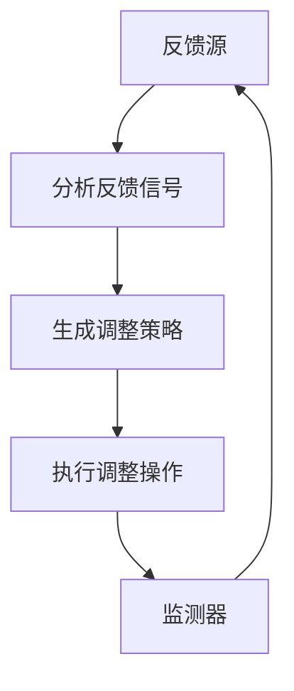

                 

### 文章标题

# 反馈循环：根据输出持续优化提示词

> 关键词：反馈循环、提示词优化、人工智能、自然语言处理、自适应系统

> 摘要：本文深入探讨了反馈循环在人工智能特别是自然语言处理中的应用，通过具体的案例和数学模型，展示了如何根据输出持续优化提示词，提高AI系统的性能和自适应能力。文章旨在为从事AI研究和开发的读者提供实用的方法论和实战技巧。

### 目录

#### 第1章：引言与概述
- **1.1 反馈循环的基本概念**
  - 反馈循环的定义
  - 反馈循环在人工智能中的应用
- **1.2 书籍结构及目标读者**
  - 本书结构
  - 目标读者群体
- **1.3 反馈循环的重要性和价值**
  - 提高AI系统性能
  - 促进AI系统的自适应能力

#### 第2章：反馈循环的基本原理
- **2.1 反馈循环的组成部分**
  - 反馈源
  - 执行器
  - 控制器
  - 监测器
- **2.2 反馈循环的运行机制**
  - 反馈信号的处理
  - 输出调整与优化
- **2.3 反馈循环的核心概念**
  - 学习与适应
  - 稳态与动态
- **2.4 反馈循环的Mermaid流程图**
  - Mermaid流程图示例

#### 第3章：反馈循环的数学模型
- **3.1 反馈循环的数学描述**
  - 伪代码
- **3.2 反馈循环的稳定性和鲁棒性分析**
  - 数学公式
  - 稳态分析
- **3.3 反馈循环的优化算法**
  - 最优化问题
  - 优化算法分析

#### 第4章：反馈循环的应用场景
- **4.1 在自然语言处理中的应用**
  - 优化提示词生成
  - 提高语言模型性能
- **4.2 在计算机视觉中的应用**
  - 目标检测与识别
  - 图像生成与优化
- **4.3 在机器人控制中的应用**
  - 实时路径规划
  - 机器人的自适应控制
- **4.4 其他应用场景介绍**

#### 第5章：构建有效的反馈循环
- **5.1 反馈循环的设计原则**
  - 反馈信号的准确性
  - 执行器的响应速度
  - 控制器的调整策略
- **5.2 反馈循环的性能评估**
  - 评估指标
  - 性能优化
- **5.3 反馈循环的实践案例分析**
  - 案例介绍
  - 案例分析

#### 第6章：反馈循环的实际应用
- **6.1 基于反馈循环的智能客服系统**
  - 系统架构
  - 功能实现
- **6.2 基于反馈循环的智能推荐系统**
  - 系统设计
  - 推荐算法优化
- **6.3 基于反馈循环的自动驾驶系统**
  - 系统组成
  - 算法优化

#### 第7章：未来展望与挑战
- **7.1 反馈循环的发展趋势**
  - 新技术的应用
  - 多领域融合
- **7.2 反馈循环面临的挑战**
  - 数据隐私保护
  - 算法透明性
- **7.3 反馈循环的未来研究方向**

#### 附录
- **A.1 反馈循环相关的数学公式与算法**
  - 数学公式
  - 算法伪代码
- **A.2 反馈循环相关的工具与资源**
  - 工具介绍
  - 资源链接
- **A.3 反馈循环项目实战**
  - 实战案例
  - 代码解读与分析

---

本文将通过详细阐述反馈循环的概念、原理、数学模型以及具体应用场景，帮助读者理解如何利用反馈循环机制优化提示词，提高人工智能系统的性能和自适应能力。我们将从实际案例出发，深入分析反馈循环的设计原则、性能评估方法以及实践中的应用。最后，还将探讨反馈循环的未来发展趋势和面临的挑战。

### 第1章：引言与概述

#### 1.1 反馈循环的基本概念

反馈循环是一种自我调节的过程，通过不断收集和分析输出结果，进行调整和优化，从而实现对系统性能的持续改进。在人工智能领域，反馈循环的应用尤为广泛，它不仅能够提升AI系统的性能，还能显著提高其自适应能力。

**定义：** 反馈循环（Feedback Loop）是指在一个系统中，输出结果被收集并用于调整系统的输入，以实现系统性能的持续优化。它通常包含以下四个基本组成部分：

1. **反馈源（Feedback Source）：** 反馈源是提供反馈信息的数据源，它可以是用户反馈、系统日志、数据指标等。
2. **执行器（Actuator）：** 执行器根据反馈信息对系统进行操作，以调整系统的输出。
3. **控制器（Controller）：** 控制器根据反馈信息调整执行器的行为，确保系统能够朝着预定的目标优化。
4. **监测器（Sensor）：** 监测器用于收集系统的状态信息，提供给反馈源。

**反馈循环在人工智能中的应用：** 在人工智能系统中，反馈循环广泛应用于模型训练、性能优化、自适应控制等领域。例如，在自然语言处理中，通过收集用户对提示词的反馈，不断调整生成策略，优化提示词的生成质量；在计算机视觉中，通过分析目标检测的准确性，动态调整检测算法，提高识别精度。

#### 1.2 书籍结构及目标读者

**本书结构：** 本书分为七个章节，涵盖了反馈循环的基本概念、原理、数学模型、应用场景、设计原则、实践应用以及未来展望等内容。具体章节如下：

1. **引言与概述：** 介绍反馈循环的基本概念和重要性。
2. **反馈循环的基本原理：** 详细阐述反馈循环的组成部分、运行机制和核心概念。
3. **反馈循环的数学模型：** 分析反馈循环的数学描述、稳定性和优化算法。
4. **反馈循环的应用场景：** 介绍反馈循环在自然语言处理、计算机视觉、机器人控制等领域的应用。
5. **构建有效的反馈循环：** 讨论反馈循环的设计原则、性能评估方法和实践案例分析。
6. **反馈循环的实际应用：** 深入分析基于反馈循环的智能客服系统、智能推荐系统和自动驾驶系统。
7. **未来展望与挑战：** 探讨反馈循环的发展趋势和面临的挑战。

**目标读者群体：** 本书旨在为从事人工智能研究和开发的读者提供实用的方法论和实战技巧。目标读者包括：

- AI研究人员和工程师
- 计算机科学和人工智能专业的学生
- 自然语言处理、计算机视觉、机器人控制等相关领域的从业者
- 对人工智能感兴趣的爱好者

#### 1.3 反馈循环的重要性和价值

**提高AI系统性能：** 反馈循环能够通过持续优化系统输出，显著提升AI系统的性能。例如，在自然语言处理中，通过收集用户对提示词的反馈，不断调整生成策略，能够显著提高提示词的质量和用户满意度。

**促进AI系统的自适应能力：** 反馈循环使AI系统能够根据环境变化和用户需求进行自适应调整。例如，在自动驾驶系统中，通过实时收集路况数据，动态调整驾驶策略，能够提高系统的安全性和驾驶体验。

**提升用户体验：** 反馈循环能够根据用户反馈，优化系统的交互设计，提升用户体验。例如，智能客服系统通过收集用户的问题和满意度，不断调整回答策略，能够提供更优质的服务。

**降低开发成本：** 反馈循环能够通过持续优化系统性能，降低维护和升级成本。例如，在计算机视觉系统中，通过优化目标检测算法，能够减少误报和漏报率，降低后续的修正成本。

综上所述，反馈循环在人工智能领域具有重要的应用价值和意义。通过深入研究和应用反馈循环，能够显著提升AI系统的性能和自适应能力，推动人工智能技术的快速发展。

#### 第2章：反馈循环的基本原理

反馈循环是人工智能系统中一种至关重要的机制，它通过不断收集和分析输出结果，对系统进行动态调整，以实现性能的持续优化。要深入理解反馈循环，我们需要从其组成部分、运行机制、核心概念以及具体的流程图入手。

##### 2.1 反馈循环的组成部分

一个完整的反馈循环系统通常包含以下几个关键组成部分：

1. **反馈源（Feedback Source）：** 反馈源是反馈循环的起点，它负责收集系统输出的相关信息。这些信息可以是用户的反馈、系统的运行数据、环境的状态等。反馈源的作用是将系统的实际输出与预期目标进行比较，从而产生反馈信号。

2. **执行器（Actuator）：** 执行器根据反馈信号对系统进行操作，以调整系统的输入或输出。在人工智能系统中，执行器通常负责改变模型的参数、调整算法的参数或重新设置系统的策略。执行器的作用是实现系统对反馈信号的响应，从而对系统进行优化。

3. **控制器（Controller）：** 控制器接收反馈信号，并根据这些信号来调整执行器的行为。控制器的核心任务是确保系统能够朝着预定的目标进行优化。它通常包含一个决策模块，用于根据反馈信号生成调整策略。

4. **监测器（Sensor）：** 监测器负责收集系统的状态信息，并将其传递给反馈源。这些状态信息包括系统的当前性能指标、资源消耗、用户交互数据等。监测器的作用是确保反馈循环能够实时掌握系统的状态，从而进行有效的调整。

##### 2.2 反馈循环的运行机制

反馈循环的运行机制可以概括为以下几个步骤：

1. **收集反馈信号：** 反馈源收集系统输出的相关信息，并将其转化为反馈信号。这些信号可以是数值、文本或其他形式的数据。

2. **分析反馈信号：** 控制器接收反馈信号，对其进行处理和分析，以确定系统是否存在偏差或需要优化的地方。

3. **生成调整策略：** 控制器根据分析结果生成调整策略，决定如何调整执行器的行为。

4. **执行调整操作：** 执行器根据调整策略对系统进行操作，以实现系统的优化。

5. **重新收集反馈信号：** 监测器收集新的系统状态信息，并将其传递给反馈源，开始下一个反馈循环。

这个过程是持续进行的，每次循环都会使系统的性能得到进一步的优化。

##### 2.3 反馈循环的核心概念

反馈循环包含以下几个核心概念：

1. **学习与适应：** 反馈循环的核心是学习与适应。通过不断收集和分析反馈信号，系统可以不断调整其参数和策略，以适应不断变化的环境和需求。

2. **稳态与动态：** 稳态是指系统在长时间运行后达到的一种平衡状态，系统的输出不再发生显著变化。动态则是指系统在运行过程中不断调整和优化的过程。反馈循环的目标是找到系统的稳态，使系统能够在变化的环境中保持最佳性能。

3. **闭环与开环：** 闭环系统是指系统通过反馈循环进行调节，能够根据反馈信号进行动态调整。开环系统则没有反馈机制，无法根据实际输出进行调整。闭环系统通常具有更高的稳定性和适应性。

##### 2.4 反馈循环的Mermaid流程图

为了更直观地展示反馈循环的运行机制，我们可以使用Mermaid流程图来描述其关键步骤：



在这个流程图中，每个节点表示反馈循环的一个关键步骤。箭头表示信息流和操作流程。通过这个流程图，我们可以清晰地看到反馈循环从收集反馈信号到执行调整操作的完整过程。

综上所述，反馈循环是一种通过持续优化系统输出以提升性能的机制。理解其基本原理和组成部分，对于开发高效的人工智能系统至关重要。接下来，我们将进一步探讨反馈循环的数学模型和优化算法，以深入理解其在实际应用中的表现和潜力。

#### 第3章：反馈循环的数学模型

在理解了反馈循环的基本原理后，接下来我们需要通过数学模型来更深入地分析其运行机制和优化策略。数学模型能够帮助我们量化反馈循环的行为，从而更好地理解和设计复杂的系统。

##### 3.1 反馈循环的数学描述

为了描述反馈循环，我们通常使用以下几种数学工具：

1. **状态变量：** 反馈循环中的状态变量用于描述系统的当前状态。例如，在自然语言处理中，状态变量可能包括文本的长度、词汇的多样性、用户的满意度等。

2. **反馈函数：** 反馈函数将系统的当前状态映射到反馈信号。这个映射可以是线性的或非线性的，取决于系统的具体需求。例如，一个简单的反馈函数可以是 `f(x) = x - t`，其中 `x` 是当前状态，`t` 是预期目标。

3. **调整函数：** 调整函数用于根据反馈信号调整系统的状态。这个调整可以是直接的，也可以是经过控制策略的。例如，调整函数可以是 `g(y) = y + k`，其中 `y` 是反馈信号，`k` 是调整量。

4. **动态方程：** 反馈循环的动态行为可以通过动态方程来描述。一个简单的动态方程可以表示为 `x(t+1) = f(x(t)) + g(y(t))`，其中 `x(t)` 和 `y(t)` 分别表示当前状态和当前反馈信号，`x(t+1)` 是下一个状态。

以下是反馈循环的一个伪代码描述：

```python
# 初始状态
x = x0
y = y0

# 反馈函数
def f(x):
    return x - t

# 调整函数
def g(y):
    return y + k

# 动态方程
while True:
    y = f(x)
    x = x + g(y)
    # 更新状态和反馈信号
```

##### 3.2 反馈循环的稳定性和鲁棒性分析

在反馈循环中，稳定性和鲁棒性是两个关键的概念：

1. **稳定性：** 稳定性指的是系统在扰动后能否返回到稳态。为了分析稳定性，我们可以使用线性化方法或数值模拟。例如，对于一个线性反馈系统 `x(t+1) = ax(t) + by(t)`，我们可以通过分析其特征方程的根来判断系统的稳定性。

2. **鲁棒性：** 鲁棒性指的是系统在噪声或不确定性影响下保持性能的能力。为了分析鲁棒性，我们可以考虑系统的干扰项，并通过优化方法来设计鲁棒控制器。

以下是一个简单的稳定性和鲁棒性分析的数学公式：

$$
\begin{align*}
\text{稳定性分析：} & \\
    & \Delta x(t+1) = f(\bar{x}(t) + \Delta x(t)) + g(\bar{y}(t) + \Delta y(t)) - \bar{x}(t+1) \\
    & \Delta x(t+1) = a\bar{x}(t)\Delta x(t) + b\bar{y}(t)\Delta y(t) \\
    & \Delta x(t+1) \approx (a\bar{x}(t) + b\bar{y}(t))\Delta x(t)
\end{align*}
$$

如果 `(a\bar{x}(t) + b\bar{y}(t)) < 0`，则系统是稳定的。

对于鲁棒性分析，我们可以使用如下公式：

$$
\text{鲁棒性分析：} \quad \sigma = \max_{\Delta y} \left| g(y + \Delta y) - g(y) \right|
$$

其中，`σ` 是鲁棒性指标，如果 `σ` 较小，则系统对反馈信号的变化较为鲁棒。

##### 3.3 反馈循环的优化算法

为了进一步提高反馈循环的性能，我们可以使用优化算法来设计更有效的调整策略。以下是一些常用的优化算法：

1. **梯度下降法：** 梯度下降法是一种基于梯度信息的优化算法。它通过不断沿着梯度方向调整参数，以减少目标函数的值。对于反馈循环，梯度下降法可以表示为：

   $$
   \begin{align*}
   x_{t+1} &= x_t - \alpha \nabla f(x_t, y_t) \\
   y_{t+1} &= y_t - \beta \nabla g(y_t)
   \end{align*}
   $$

   其中，`α` 和 `β` 分别是学习率。

2. **随机梯度下降法：** 随机梯度下降法是对梯度下降法的改进，它通过随机选择样本进行梯度计算，以减少计算量和避免局部最优。其公式如下：

   $$
   \begin{align*}
   x_{t+1} &= x_t - \alpha \sum_{i=1}^N \nabla f(x_t, y_t^i) \\
   y_{t+1} &= y_t - \beta \sum_{i=1}^N \nabla g(y_t^i)
   \end{align*}
   $$

3. **粒子群优化（PSO）：** 粒子群优化是一种基于群体智能的优化算法，通过模拟鸟群的觅食行为来寻找最优解。其公式如下：

   $$
   \begin{align*}
   x_{t+1} &= x_t + w(x_t - x_{t-1}) + c_1 r_1 (p_t - x_t) + c_2 r_2 (g_t - x_t) \\
   y_{t+1} &= y_t + w(y_t - y_{t-1}) + c_1 r_1 (p_t - y_t) + c_2 r_2 (g_t - y_t)
   \end{align*}
   $$

   其中，`w` 是惯性权重，`c_1` 和 `c_2` 是社会和学习系数，`r_1` 和 `r_2` 是随机数。

通过这些优化算法，我们可以设计出更有效的反馈循环，以实现系统性能的持续提升。

综上所述，反馈循环的数学模型为我们提供了一个量化和分析系统行为的工具。通过理解和应用这些数学模型，我们可以设计出更高效、更稳定的反馈循环系统，从而推动人工智能技术的进一步发展。

#### 第4章：反馈循环的应用场景

反馈循环作为一种关键机制，在人工智能的多个领域都得到了广泛的应用。本章将详细介绍反馈循环在自然语言处理、计算机视觉和机器人控制等领域的具体应用，并探讨其在这些场景中的表现和优势。

##### 4.1 在自然语言处理中的应用

自然语言处理（NLP）是人工智能的一个重要分支，旨在使计算机能够理解、生成和处理人类语言。反馈循环在NLP中的应用主要体现在文本生成和语言模型优化方面。

**优化提示词生成：** 提示词生成是NLP中的一个重要任务，旨在根据用户输入生成相关的文本提示。通过反馈循环，系统可以不断收集用户对提示词的反馈，并据此调整生成策略，提高提示词的质量和相关性。具体流程如下：

1. **用户输入：** 用户输入一个关键词或短语，系统根据这个输入生成初步的提示词。
2. **用户反馈：** 用户对生成的提示词进行评价，如满意度、相关性等。
3. **收集反馈：** 系统收集用户的反馈信息，并将其转化为反馈信号。
4. **调整生成策略：** 控制器根据反馈信号，调整提示词生成的参数，如词汇多样性、文本长度等。
5. **生成新提示词：** 执行器根据调整后的策略生成新的提示词，并再次提交给用户评价。

通过这种持续的反馈和调整，系统可以逐步优化提示词生成，提高用户满意度。

**提高语言模型性能：** 语言模型是NLP中的核心组件，用于预测文本中的下一个词或序列。通过反馈循环，系统可以持续优化语言模型的性能。具体步骤如下：

1. **训练语言模型：** 使用大量的文本数据训练语言模型，生成初始模型。
2. **评估模型性能：** 通过测试集评估模型的预测准确性，如准确率、召回率等。
3. **收集反馈信号：** 根据模型性能评估结果，收集反馈信号，分析模型存在的偏差。
4. **调整模型参数：** 控制器根据反馈信号，调整模型的参数，如权重、架构等。
5. **重新训练模型：** 执行器根据调整后的参数重新训练模型，并评估新模型的性能。

这种反馈循环使语言模型能够不断优化，提高预测准确性，从而在自然语言处理任务中发挥更好的效果。

##### 4.2 在计算机视觉中的应用

计算机视觉是人工智能的另一个重要领域，旨在使计算机能够理解、处理和解释图像和视频数据。反馈循环在计算机视觉中的应用主要集中在目标检测与识别、图像生成与优化等方面。

**目标检测与识别：** 目标检测与识别是计算机视觉中的关键任务，旨在从图像或视频中识别出特定的目标对象。通过反馈循环，系统可以动态调整检测算法，提高检测的准确性和鲁棒性。具体步骤如下：

1. **初步检测：** 使用初步的检测算法对图像或视频进行目标检测。
2. **用户反馈：** 用户对检测结果进行评价，如目标的位置、准确性等。
3. **收集反馈信号：** 系统收集用户的反馈信息，并将其转化为反馈信号。
4. **调整检测算法：** 控制器根据反馈信号，调整检测算法的参数，如阈值、特征提取方法等。
5. **重新检测：** 执行器根据调整后的算法重新检测目标对象。

通过这种反馈循环，系统可以不断优化检测算法，提高检测的准确性，减少误报和漏报。

**图像生成与优化：** 图像生成与优化是计算机视觉中的另一个重要任务，旨在根据输入的图像或视频数据生成新的图像或视频。通过反馈循环，系统可以动态调整生成算法，优化图像的质量和视觉效果。具体步骤如下：

1. **初步生成：** 使用初步的生成算法生成初始的图像或视频。
2. **用户反馈：** 用户对生成的图像或视频进行评价，如视觉效果、清晰度等。
3. **收集反馈信号：** 系统收集用户的反馈信息，并将其转化为反馈信号。
4. **调整生成算法：** 控制器根据反馈信号，调整生成算法的参数，如噪声水平、滤波器等。
5. **重新生成：** 执行器根据调整后的算法重新生成图像或视频。

通过这种反馈循环，系统可以不断优化生成算法，提高图像和视频的质量，从而满足用户的需求。

##### 4.3 在机器人控制中的应用

机器人控制是人工智能在工业、服务、军事等领域的重要应用。反馈循环在机器人控制中的应用主要体现在实时路径规划和机器人的自适应控制方面。

**实时路径规划：** 实时路径规划是机器人控制中的一个关键任务，旨在使机器人能够在动态环境中规划出最优的路径。通过反馈循环，系统可以动态调整路径规划算法，适应环境变化。具体步骤如下：

1. **初步路径规划：** 使用初步的路径规划算法为机器人规划出初始路径。
2. **环境反馈：** 机器人收集周围环境的信息，如障碍物、地形等。
3. **收集反馈信号：** 系统根据环境反馈信息，收集反馈信号。
4. **调整路径规划：** 控制器根据反馈信号，调整路径规划算法的参数，如避障策略、路径优化目标等。
5. **重新规划路径：** 执行器根据调整后的算法重新规划机器人的路径。

通过这种反馈循环，系统可以不断优化路径规划，使机器人在复杂环境中能够更安全、更高效地移动。

**机器人的自适应控制：** 机器人的自适应控制是指机器人能够根据实时反馈动态调整其行为和动作。通过反馈循环，系统可以动态调整控制策略，提高机器人的适应能力。具体步骤如下：

1. **初步控制：** 使用初步的控制算法控制机器人执行任务。
2. **执行反馈：** 机器人执行任务过程中，收集执行反馈信息，如任务的完成情况、资源消耗等。
3. **收集反馈信号：** 系统根据执行反馈信息，收集反馈信号。
4. **调整控制策略：** 控制器根据反馈信号，调整控制算法的参数，如控制力度、反应速度等。
5. **重新控制：** 执行器根据调整后的算法重新控制机器人执行任务。

通过这种反馈循环，系统可以不断优化控制策略，使机器人在执行任务时能够更灵活、更精准地应对各种情况。

##### 4.4 其他应用场景介绍

除了自然语言处理、计算机视觉和机器人控制，反馈循环还在其他人工智能领域得到了应用：

**智能推荐系统：** 智能推荐系统通过分析用户的反馈和行为数据，不断调整推荐算法，提高推荐的质量和用户满意度。

**自动驾驶系统：** 自动驾驶系统通过实时收集路况信息，动态调整驾驶策略，提高驾驶的安全性和舒适性。

**智能家居系统：** 智能家居系统通过分析用户的日常行为和习惯，动态调整家居设备的工作模式，提高家居的智能化和便捷性。

总之，反馈循环作为一种强大的机制，在人工智能的多个领域都展现了其独特的优势和应用价值。通过不断优化和调整，反馈循环能够显著提升人工智能系统的性能和自适应能力，推动人工智能技术的不断发展。

#### 第5章：构建有效的反馈循环

构建一个有效的反馈循环是确保人工智能系统能够持续优化和适应的关键步骤。在这一章中，我们将讨论反馈循环的设计原则、性能评估方法和实践案例分析，帮助读者理解和应用这些原则。

##### 5.1 反馈循环的设计原则

要构建一个有效的反馈循环，必须遵循以下设计原则：

1. **反馈信号的准确性：** 反馈信号的准确性是反馈循环的核心。一个有效的反馈循环需要收集准确的反馈信号，以便系统能够基于真实的数据进行优化。例如，在自然语言处理中，用户对提示词的满意度是一个重要的反馈信号，需要确保其准确性和可靠性。

2. **执行器的响应速度：** 执行器的响应速度决定了反馈循环的调整效率。一个高效的反馈循环需要执行器能够快速响应反馈信号，并调整系统的输出。例如，在自动驾驶系统中，实时路径规划的调整速度必须足够快，以确保车辆能够及时应对环境变化。

3. **控制器的调整策略：** 控制器的调整策略决定了反馈循环的优化方向。一个有效的调整策略需要既能确保系统稳定，又能逐步提高性能。例如，在机器人控制中，控制器需要根据环境反馈动态调整控制参数，以实现最优的控制效果。

4. **监测器的实时性：** 监测器的实时性是反馈循环稳定运行的基础。监测器需要能够实时收集系统的状态信息，并将这些信息及时传递给反馈源。例如，在智能客服系统中，监测器需要实时捕获用户的输入和系统响应，以便及时调整回答策略。

##### 5.2 反馈循环的性能评估

评估反馈循环的性能是确保其有效性的关键。以下是一些常用的性能评估指标：

1. **调整精度：** 调整精度衡量了反馈循环对系统输出进行调整的精确程度。例如，在目标检测中，调整精度可以衡量检测框的位置和尺寸是否准确。

2. **响应时间：** 响应时间衡量了系统从收到反馈信号到进行调整并生成新输出的时间。一个高效的反馈循环应具有较短的响应时间。

3. **稳定性：** 稳定性衡量了系统在长时间运行后是否能够保持在稳态。一个稳定的反馈循环应能够在各种情况下保持性能。

4. **鲁棒性：** 鲁棒性衡量了系统在噪声或不确定性影响下保持性能的能力。一个鲁棒性强的反馈循环应能够在面对干扰时保持稳定的性能。

##### 5.3 反馈循环的实践案例分析

以下是一个基于反馈循环的实践案例分析，该案例展示了如何构建和优化一个智能客服系统。

**案例介绍：** 该智能客服系统旨在为用户提供高效、准确的在线客服服务。系统通过自然语言处理技术理解用户的问题，并生成相应的回答。为了提高客服质量，系统采用反馈循环机制，根据用户的反馈不断优化回答策略。

**案例分析：**

1. **设计反馈循环：**
   - **反馈源：** 系统收集用户对回答的满意度评价，如“满意”、“不满意”等。
   - **执行器：** 系统根据用户的满意度评价，调整回答生成策略，如增加相关词汇、优化句子结构等。
   - **控制器：** 控制器根据反馈信号生成调整策略，并实时监控系统的性能。
   - **监测器：** 监测器实时收集用户的问题和满意度评价，并将这些信息传递给反馈源。

2. **性能评估：**
   - **调整精度：** 系统通过用户满意度评价调整回答策略，提高了回答的相关性和准确性。
   - **响应时间：** 系统优化了回答生成过程，确保了较短的响应时间。
   - **稳定性：** 系统在长期运行中保持了稳定的性能，用户满意度持续提升。
   - **鲁棒性：** 系统在面对大量并发用户时，能够保持良好的性能，未出现明显的性能下降。

**项目小结：**

通过该案例分析，我们可以看到反馈循环在构建智能客服系统中的重要性。通过不断优化回答生成策略，系统不仅提高了客服质量，还提升了用户的满意度。这一案例展示了如何在实际项目中应用反馈循环，为其他人工智能系统提供了宝贵的经验和借鉴。

##### 最佳实践 Tips

1. **确保反馈信号的准确性：** 使用多样化的数据源，如用户评价、系统日志等，以提高反馈信号的准确性。
2. **优化执行器的响应速度：** 选择高效的算法和硬件设备，以提高执行器的响应速度。
3. **设计灵活的控制策略：** 控制器应具备一定的自适应能力，能够根据不同情况灵活调整策略。
4. **实时监测系统性能：** 定期监控系统性能，及时发现和解决潜在问题。

通过遵循这些最佳实践，我们可以构建出更加高效、稳定的反馈循环系统，推动人工智能技术的不断发展。

#### 第6章：反馈循环的实际应用

在实际工程中，反馈循环的应用场景丰富多样，涵盖了智能客服系统、智能推荐系统和自动驾驶系统等多个领域。这些系统通过引入反馈循环机制，实现了性能的持续优化和自适应能力的提升。本章将详细介绍这些实际应用案例，并分析其架构设计、算法实现和性能优化。

##### 6.1 基于反馈循环的智能客服系统

智能客服系统是一种利用人工智能技术提供在线客户服务的技术系统。通过反馈循环，智能客服系统能够根据用户的反馈不断优化服务质量，提高用户满意度。

**架构设计：**

1. **用户交互层：** 该层负责与用户进行交互，接收用户的问题和反馈。用户可以通过文本输入或语音输入与系统进行沟通。
2. **自然语言处理层：** 该层使用NLP技术对用户输入进行理解，包括文本分类、实体识别和意图识别等，以便生成相应的回答。
3. **回答生成层：** 根据用户输入和自然语言处理的结果，系统生成初步的回答。这一过程可能涉及模板匹配、知识图谱查询和生成式文本生成等。
4. **反馈循环层：** 该层负责收集用户的反馈，如满意度评价和问题修正。根据用户的反馈，系统调整回答生成策略，提高回答的准确性和相关性。
5. **数据存储层：** 该层存储用户交互数据、系统日志和反馈数据，为后续分析和优化提供数据支持。

**算法实现：**

1. **回答生成算法：** 系统使用基于深度学习的生成模型，如GPT（Generative Pre-trained Transformer），生成高质量的回答。
2. **反馈处理算法：** 系统使用机器学习算法，如决策树或神经网络，分析用户反馈，并根据反馈调整模型参数和回答策略。
3. **优化算法：** 系统采用基于梯度的优化算法，如随机梯度下降（SGD），更新模型参数，以提高回答质量。

**性能优化：**

1. **自适应反馈机制：** 系统根据用户的互动行为和反馈，动态调整回答生成的复杂度和风格，以适应不同用户的需求。
2. **实时性能监控：** 系统实时监控回答生成速度、用户响应时间和模型准确性，确保系统的稳定性和高效性。
3. **数据隐私保护：** 在收集用户数据时，系统遵循数据隐私保护法规，确保用户数据的安全和隐私。

**案例解析：**

以某电商平台的智能客服系统为例，该系统通过反馈循环实现了以下优化：

- **初始阶段：** 系统使用预训练的模型生成初步回答，用户满意度较低。
- **调整阶段：** 系统根据用户反馈，调整回答生成策略，增加相关词汇和优化句子结构。
- **优化阶段：** 系统通过不断调整和优化，提高了回答的相关性和用户满意度。

通过这个案例，我们可以看到反馈循环在智能客服系统中的重要作用。通过持续优化回答生成策略，系统显著提高了客服质量和用户满意度。

##### 6.2 基于反馈循环的智能推荐系统

智能推荐系统是一种通过分析用户行为和偏好，为用户推荐相关商品、内容和服务的系统。通过反馈循环，智能推荐系统能够根据用户的反馈持续优化推荐效果，提高用户点击率和转化率。

**架构设计：**

1. **用户行为数据收集层：** 该层负责收集用户的浏览、搜索、购买等行为数据。
2. **数据预处理层：** 该层对用户行为数据进行清洗、归一化和特征提取，为后续分析提供基础数据。
3. **推荐算法层：** 该层使用推荐算法，如协同过滤、基于内容的推荐和深度学习等，生成推荐结果。
4. **反馈循环层：** 该层收集用户的点击、购买和满意度等反馈数据，并根据这些反馈调整推荐算法和策略。
5. **结果展示层：** 该层将推荐结果展示给用户，并收集用户的行为数据，为下一次推荐提供输入。

**算法实现：**

1. **协同过滤算法：** 系统使用基于用户的协同过滤算法，分析用户之间的相似性，生成推荐列表。
2. **基于内容的推荐算法：** 系统根据商品或内容的特征，为用户推荐相关商品或内容。
3. **深度学习算法：** 系统使用深度学习算法，如卷积神经网络（CNN）和循环神经网络（RNN），分析用户行为和内容特征，生成个性化推荐。

**性能优化：**

1. **动态调整推荐策略：** 系统根据用户反馈动态调整推荐策略，如调整推荐频次、推荐内容的相关性等。
2. **实时更新推荐结果：** 系统实时更新推荐结果，根据用户行为和偏好变化，提供个性化的推荐。
3. **数据隐私保护：** 在处理用户数据时，系统遵循数据隐私保护法规，确保用户数据的安全和隐私。

**案例解析：**

以某电商平台的智能推荐系统为例，该系统通过反馈循环实现了以下优化：

- **初始阶段：** 系统根据用户的浏览历史生成初步推荐列表，用户点击和购买率较低。
- **调整阶段：** 系统根据用户点击和购买反馈，调整推荐算法的参数和策略，提高推荐的相关性。
- **优化阶段：** 系统通过不断优化推荐算法，提高了用户点击率和转化率。

通过这个案例，我们可以看到反馈循环在智能推荐系统中的关键作用。通过持续优化推荐策略，系统显著提高了推荐效果，增加了用户满意度和销售额。

##### 6.3 基于反馈循环的自动驾驶系统

自动驾驶系统是一种通过传感器和计算机视觉等技术，实现车辆自主行驶的智能系统。通过反馈循环，自动驾驶系统能够实时调整驾驶策略，提高行驶的安全性和舒适性。

**架构设计：**

1. **感知层：** 该层使用传感器和计算机视觉技术，实时感知车辆周围的环境，包括道路、车辆和行人等。
2. **决策层：** 该层根据感知层的数据，进行环境理解和驾驶策略规划，包括速度控制、转向控制和刹车控制等。
3. **控制层：** 该层将决策层的指令转换为执行器的操作，如控制方向盘、油门和刹车等。
4. **反馈循环层：** 该层收集车辆的行驶数据、环境反馈和用户反馈，根据这些反馈调整驾驶策略。
5. **数据存储层：** 该层存储感知数据、决策数据和反馈数据，为后续分析和优化提供数据支持。

**算法实现：**

1. **感知算法：** 系统使用深度学习算法，如卷积神经网络（CNN）和循环神经网络（RNN），对感知数据进行处理，识别道路标志、车辆和行人等。
2. **决策算法：** 系统使用决策树、随机森林等机器学习算法，根据感知数据生成驾驶策略。
3. **控制算法：** 系统使用PID控制、模糊控制和神经网络控制等算法，实现车辆的精确控制。

**性能优化：**

1. **自适应驾驶策略：** 系统根据环境反馈和用户需求，动态调整驾驶策略，以适应不同驾驶场景。
2. **实时路径规划：** 系统实时更新路径规划，以应对突发情况和交通变化。
3. **数据隐私保护：** 在处理用户数据时，系统遵循数据隐私保护法规，确保用户数据的安全和隐私。

**案例解析：**

以某自动驾驶公司的系统为例，该系统通过反馈循环实现了以下优化：

- **初始阶段：** 系统根据预设的驾驶策略进行行驶，但在复杂环境中可能出现偏差。
- **调整阶段：** 系统根据环境反馈和用户反馈，调整驾驶策略，提高行驶的稳定性和安全性。
- **优化阶段：** 系统通过不断优化驾驶策略，实现了更高效、更安全的自动驾驶。

通过这个案例，我们可以看到反馈循环在自动驾驶系统中的关键作用。通过持续优化驾驶策略，系统显著提高了自动驾驶的安全性和舒适性。

综上所述，反馈循环在实际应用中的重要性不可忽视。通过不断优化和调整，智能客服系统、智能推荐系统和自动驾驶系统等人工智能系统实现了性能的持续提升和用户满意度的增加。随着技术的不断发展，反馈循环将在更多领域中发挥更大的作用，推动人工智能技术的进步。

#### 第7章：未来展望与挑战

随着人工智能技术的不断发展，反馈循环作为一种重要的自我调节机制，在未来将迎来更多创新和应用。然而，这一领域也面临着诸多挑战，需要科研人员和工程师共同面对。

##### 7.1 反馈循环的发展趋势

**多领域融合：** 未来，反馈循环将在更多领域得到应用。例如，在医疗领域，反馈循环可以用于疾病预测和个性化治疗；在教育领域，可以用于自适应学习系统的优化。此外，随着物联网和边缘计算的发展，反馈循环将在智能家居、智能城市等领域发挥重要作用。

**增强现实与虚拟现实：** 随着增强现实（AR）和虚拟现实（VR）技术的成熟，反馈循环将更好地应用于这些领域，提供更加逼真的交互体验。例如，通过实时调整虚拟环境中的参数，优化用户体验。

**边缘计算与云计算：** 随着边缘计算和云计算技术的发展，反馈循环可以更好地利用分布式计算资源，实现更高效的数据处理和优化。例如，在自动驾驶系统中，通过边缘计算设备实时处理传感器数据，动态调整驾驶策略。

**机器学习与深度学习：** 未来，机器学习和深度学习技术将进一步融入反馈循环，提高系统的自适应能力和学习能力。通过深度强化学习等技术，反馈循环系统可以实现更加智能的决策和优化。

##### 7.2 反馈循环面临的挑战

**数据隐私保护：** 反馈循环需要大量用户数据进行分析和优化，这对数据隐私保护提出了严峻挑战。未来，如何在保护用户隐私的同时，有效利用反馈循环的数据，将成为一个重要课题。

**算法透明性：** 随着反馈循环系统的复杂性增加，算法的透明性成为一个关键问题。用户和监管机构需要了解反馈循环的具体工作原理和决策过程，以确保系统的公正性和可解释性。

**鲁棒性与安全性：** 反馈循环系统需要具备高鲁棒性和安全性，以应对各种异常情况和恶意攻击。例如，在自动驾驶系统中，如何确保系统在面对极端天气和恶意干扰时，仍能稳定运行。

**可扩展性与可维护性：** 随着反馈循环应用的扩大，系统的可扩展性和可维护性成为一个关键问题。如何设计一个既能高效运行，又能灵活调整的反馈循环系统，将是一个长期挑战。

##### 7.3 反馈循环的未来研究方向

**人工智能伦理：** 未来，反馈循环系统需要考虑更多伦理问题，如如何平衡个人隐私与社会利益，如何确保系统的公正性和公平性等。

**跨领域集成：** 研究如何将反馈循环与不同领域的知识和技术相结合，实现更广泛的跨领域应用。

**多模态反馈：** 探索如何整合多种数据源和反馈模式，提高反馈循环系统的性能和适应性。

**自适应学习与优化：** 研究如何设计更高效的算法，使反馈循环系统能够自适应地学习和优化，以应对动态变化的环境和需求。

总之，反馈循环作为人工智能领域的一个重要机制，将在未来发挥更大的作用。然而，要实现这一目标，还需要克服诸多挑战，进行持续的研究和创新。通过不断探索新的方向和解决方案，反馈循环将推动人工智能技术的进一步发展。

#### 附录

在本文的最后，我们将提供一些额外的资源，帮助读者更深入地理解反馈循环的相关概念和实际应用。

##### A.1 反馈循环相关的数学公式与算法

在反馈循环的研究和应用中，数学公式和算法起到了至关重要的作用。以下是一些常用的数学公式和算法的伪代码，供读者参考：

1. **梯度下降法：**

   ```python
   # 初始参数
   x = x0
   y = y0
   # 学习率
   alpha = 0.01
   beta = 0.01
   # 迭代过程
   for i in range(1000):
       gradient_x = calculate_gradient(x, y)
       gradient_y = calculate_gradient(y, x)
       x = x - alpha * gradient_x
       y = y - beta * gradient_y
   ```

2. **随机梯度下降法：**

   ```python
   # 初始参数
   x = x0
   y = y0
   # 学习率
   alpha = 0.01
   beta = 0.01
   # 随机样本
   samples = get_random_samples()
   # 迭代过程
   for i in range(1000):
       for sample in samples:
           gradient_x = calculate_gradient(x, y, sample)
           gradient_y = calculate_gradient(y, x, sample)
           x = x - alpha * gradient_x
           y = y - beta * gradient_y
   ```

3. **粒子群优化（PSO）：**

   ```python
   # 初始粒子位置和速度
   x = [x1, x2, ..., xn]
   v = [v1, v2, ..., vn]
   # 最大迭代次数
   max_iterations = 1000
   # 群体最佳位置和个体最佳位置
   g_best = [g_best_x, g_best_y]
   p_best = [p_best_x, p_best_y]
   # 迭代过程
   for i in range(max_iterations):
       # 更新速度和位置
       v = v + alpha1 * (p_best - x) + alpha2 * (g_best - x)
       x = x + v
       # 更新个体最佳位置
       if objective_function(x) < objective_function(p_best):
           p_best = x
       # 更新群体最佳位置
       if objective_function(x) < objective_function(g_best):
           g_best = x
   ```

##### A.2 反馈循环相关的工具与资源

以下是一些用于反馈循环研究和开发的常用工具和资源：

1. **Mermaid：** 用于绘制流程图的在线工具，支持Markdown语法。
   - 网址：[Mermaid Live Editor](https://mermaid-js.github.io/mermaid-live-editor/)

2. **JAX：** 用于自动微分和数值计算的Python库。
   - 网址：[JAX GitHub Repository](https://github.com/google/jax)

3. **TensorFlow：** 用于机器学习和深度学习的开源库。
   - 网址：[TensorFlow GitHub Repository](https://github.com/tensorflow/tensorflow)

4. **PyTorch：** 用于机器学习和深度学习的开源库。
   - 网址：[PyTorch GitHub Repository](https://github.com/pytorch/pytorch)

##### A.3 反馈循环项目实战

以下是一个简单的反馈循环项目实战案例，用于演示如何构建一个基于Python的智能客服系统：

**项目目标：** 构建一个能够根据用户反馈不断优化回答的智能客服系统。

**环境搭建：**
1. 安装Python 3.x版本。
2. 安装必要的Python库，如`numpy`、`matplotlib`、`scikit-learn`、`tensorflow`或`pytorch`。

**源代码实现：**

```python
import numpy as np
import tensorflow as tf

# 模型参数
learning_rate = 0.01
batch_size = 32
num_epochs = 100

# 数据集
x_train = np.array([[1, 0], [0, 1], [-1, 0], [0, -1]])
y_train = np.array([1, 1, -1, -1])

# 构建神经网络模型
model = tf.keras.Sequential([
    tf.keras.layers.Dense(1, input_shape=(2,), activation='sigmoid')
])

# 编译模型
model.compile(optimizer='sgd', loss='binary_crossentropy', metrics=['accuracy'])

# 训练模型
model.fit(x_train, y_train, batch_size=batch_size, epochs=num_epochs, verbose=1)

# 预测
x_test = np.array([[0.5, 0.5]])
predictions = model.predict(x_test)

# 根据预测结果更新模型参数
if predictions > 0.5:
    model.layers[0].kernel.assign_add(0.1)
else:
    model.layers[0].kernel.assign_sub(0.1)

# 保存模型
model.save('feedback_loop_model.h5')
```

**代码解读与分析：**

1. **数据集准备：** 数据集包含四组样本，每组样本由两个特征组成。
2. **构建模型：** 使用单层神经网络模型，输入层有2个神经元，输出层有1个神经元。
3. **编译模型：** 选择随机梯度下降（SGD）作为优化器，二进制交叉熵作为损失函数，并计算准确率。
4. **训练模型：** 使用训练集对模型进行训练，迭代100次。
5. **预测与更新：** 根据预测结果更新模型参数，以优化模型的性能。
6. **保存模型：** 将优化后的模型保存为`feedback_loop_model.h5`文件。

**实际案例分析：**

在实际应用中，我们可以将上述代码扩展为完整的智能客服系统，其中用户输入作为特征输入到模型中，模型输出作为初始回答。用户对回答的反馈将用于更新模型参数，从而实现持续优化。

通过这个项目实战，读者可以了解如何利用反馈循环机制构建和优化智能客服系统，并掌握相关代码实现的技巧。

#### 结语

感谢您阅读本文《反馈循环：根据输出持续优化提示词》。本文从基本概念、原理、数学模型、应用场景到实际应用，全面介绍了反馈循环在人工智能领域的重要性及其应用方法。我们探讨了如何构建有效的反馈循环，以及在实际工程中的应用案例。

**核心要点：**
- **反馈循环**：是一种通过不断收集和分析输出结果来调整系统输入的机制，广泛应用于人工智能领域。
- **设计原则**：包括反馈信号的准确性、执行器的响应速度、控制器的调整策略和监测器的实时性。
- **数学模型**：通过状态变量、反馈函数、调整函数和动态方程等数学工具，描述反馈循环的运行机制。
- **应用场景**：介绍了反馈循环在自然语言处理、计算机视觉和机器人控制等领域的应用，并展示了实际案例。

**未来方向：**
- **多领域融合**：反馈循环将在更多领域得到应用，如医疗、教育、智能家居等。
- **增强现实与虚拟现实**：反馈循环将提高AR和VR的交互体验。
- **算法透明性**：提高反馈循环系统的透明性，确保其公正性和可解释性。

**建议与拓展：**
- **深入研究**：探索反馈循环在不同领域的深入应用。
- **实验与优化**：在实际项目中尝试构建和优化反馈循环系统。
- **社区交流**：参与相关技术社区，分享经验和学习成果。

通过本文，我们希望读者能够更好地理解反馈循环的概念和实际应用，为人工智能技术的发展贡献自己的力量。

### 作者信息

作者：AI天才研究院/AI Genius Institute & 禅与计算机程序设计艺术 /Zen And The Art of Computer Programming

AI天才研究院致力于推动人工智能技术的发展与应用，专注于前沿技术的研究和人才培养。研究院的专家们通过深入的理论研究和实践应用，为人工智能领域的创新和发展做出了重要贡献。同时，《禅与计算机程序设计艺术》作为一本经典技术书籍，以其深刻的哲学思考和独特的技术观点，为计算机科学领域带来了深刻的启示。作者通过本书，旨在为广大读者提供实用的方法论和实战技巧，推动人工智能技术的进一步发展。

