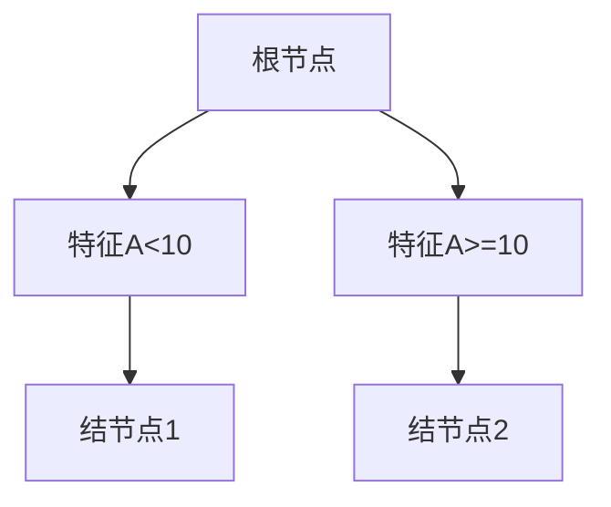
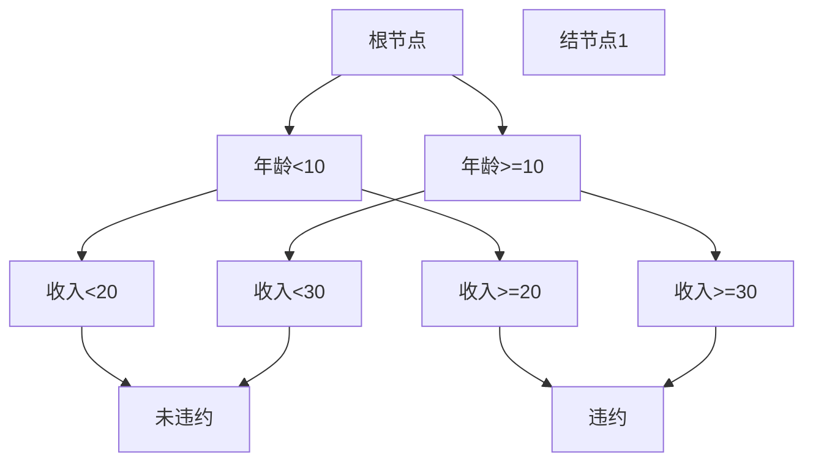

                 


## 《可解释人工智能：理解机器学习模型的决策过程》

### 背景介绍

人工智能（AI）作为一门前沿技术，已经深刻地改变了我们的生活和各行各业。然而，随着机器学习模型的复杂性和规模不断增加，一个日益突出的问题浮现出来——模型的可解释性。传统的机器学习模型，如线性回归、逻辑回归和决策树，虽然在一定程度上具有可解释性，但随着深度学习等更为复杂模型的出现，这一问题变得更加严峻。不可解释的模型往往被称为“黑箱”，这意味着其内部决策过程对外界是不可见的，这不仅在学术界引发了对模型透明性的讨论，也在工业界带来了信任和合规性的挑战。

在这种背景下，可解释人工智能（Explainable AI, XAI）应运而生。可解释人工智能旨在构建能够解释其决策过程的机器学习模型，使得模型的可解释性、透明性和可信性得到提升。这不仅有助于研究人员理解模型的内在机理，也使得模型在工业应用中更加容易被接受和信任。本文将探讨可解释人工智能的概念、数学基础、应用案例及其未来发展趋势，帮助读者深入理解这一重要领域。

### 关键词

- 可解释人工智能
- 透明性
- 机器学习模型
- 决策过程
- 机器学习算法
- 数学基础
- 应用案例

### 摘要

本文旨在探讨可解释人工智能（XAI）的概念及其在机器学习模型决策过程中的重要性。首先，我们将介绍可解释人工智能的定义、背景以及其与不可解释人工智能的区别。接着，我们将分析不同类型的可解释模型，包括基于规则的模型和基于模型的模型，并探讨其各自的优缺点。然后，我们将深入探讨可解释人工智能的数学基础，包括线性回归模型、逻辑回归模型和决策树模型的可解释性。随后，我们将探讨可视化方法在可解释人工智能中的应用，并分析金融领域的实际案例。最后，我们将展望可解释人工智能的未来发展趋势和面临的挑战。通过本文的阅读，读者将能够全面了解可解释人工智能的核心概念、技术方法和应用前景。

#### 第一部分：可解释人工智能概述

##### 第1章：可解释人工智能的兴起

**1.1 可解释人工智能的定义与背景**

可解释人工智能（Explainable AI, XAI）是指通过设计、开发和研究能够解释其决策过程的人工智能系统。它不仅关注模型的准确性，还关注模型的可解释性、透明性和可信性。传统的机器学习模型，如线性回归、逻辑回归和决策树，在一定程度上具有可解释性，但面对更为复杂的深度学习模型时，这一问题变得尤为突出。深度学习模型，尤其是深度神经网络，其决策过程往往被称为“黑箱”，因为其内部机制对外界是不可见的。

可解释人工智能的兴起源于多方面的需求。首先，在工业界，随着机器学习模型在关键任务中的应用日益增多，如医疗诊断、金融风险评估和自动驾驶，模型的可解释性变得至关重要。企业需要了解模型的决策过程，以确保其决策是合理和可信的。其次，在学术界，研究者们也意识到，理解模型的内部机理对于提升人工智能的理论深度和技术创新具有重要意义。此外，法律和伦理的考量也推动了可解释人工智能的发展。在许多领域，特别是涉及个人隐私和生命安全的场合，确保人工智能系统的透明性和可控性是必要的。

**1.2 透明性与可信性的关系**

透明性是可解释人工智能的核心概念之一。它指的是模型决策过程的可理解性，使得用户能够清晰地了解模型是如何得出某一决策的。高透明性意味着模型的决策过程是公开和可验证的，这对于提升模型的可信性至关重要。可信性是指用户对模型决策的信任程度，它受到模型透明性和性能的共同影响。一个高透明性的模型，其决策过程容易被用户理解和接受，从而提高模型的可信性。

然而，透明性和可信性并不是绝对成正比的。一个模型可能具有很高的透明性，但其性能较差，导致用户对其信任度不高。同样，一个模型可能具有较高的性能，但缺乏透明性，使得用户难以理解其决策过程，从而对其信任度降低。因此，在设计可解释人工智能系统时，需要在透明性和性能之间取得平衡，以满足实际应用的需求。

**1.3 可解释人工智能的重要性**

可解释人工智能在多个领域具有重要意义。首先，在医疗领域，医生需要理解诊断模型的决策过程，以便更好地应用和改进模型。其次，在金融领域，银行和金融机构需要确保风险评估模型的透明性和公正性，以避免因模型的不透明性导致的错误决策。在自动驾驶领域，公众对自动驾驶系统的信任程度直接关系到其普及程度，因此，提升系统的可解释性是确保其广泛应用的关键。此外，在公共安全和法律领域，确保人工智能系统的透明性和可控性，有助于避免潜在的伦理和法律问题。

总之，可解释人工智能不仅有助于提升模型的透明性和可信性，还对于推动人工智能技术的广泛应用和可持续发展具有重要意义。通过深入理解和研究可解释人工智能，我们能够更好地利用人工智能技术，解决实际问题，推动社会进步。

#### 第一部分：可解释人工智能概述

##### 第2章：可解释性与AI的类型

**2.1 可解释模型的分类**

可解释人工智能包括多种类型的模型，每种模型都有其独特的特点和应用场景。根据模型的设计和实现方式，可解释模型主要可以分为基于规则的模型和基于模型的模型。

**基于规则的模型**

基于规则的模型（Rule-Based Models）是一种简单的可解释模型，它通过明确的前后件关系来描述问题。每个规则由一个条件部分和一个结论部分组成，当条件部分满足时，结论部分就被触发。例如，在医疗诊断中，基于规则的模型可能包含一系列条件，如“体温高于38度”、“咳嗽”、“乏力”等，当这些条件同时满足时，模型会判断患者患有某种疾病。

**优点**：

- **易于理解**：基于规则的模型通常非常直观，用户可以清晰地看到每个规则的作用和影响。
- **可追溯性**：由于每个规则都是明确的，因此可以追溯模型是如何得出某一决策的。

**缺点**：

- **灵活性低**：基于规则的模型在处理复杂问题时，往往难以捕捉到所有可能的情景，导致过拟合。
- **维护难度**：随着规则的增多，模型的复杂度增加，维护和更新规则变得困难。

**基于模型的模型**

基于模型的模型（Model-Based Models）是一种更为复杂的可解释模型，它通过训练数据学习复杂的决策边界。常见的基于模型的模型包括线性回归、逻辑回归和决策树等。

**优点**：

- **高精度**：基于模型的模型能够通过训练数据学习复杂的决策边界，从而提高预测精度。
- **强灵活性**：基于模型的模型可以处理各种类型的数据和问题，具有较强的适应性。

**缺点**：

- **复杂性高**：基于模型的模型通常较为复杂，其内部机制不易理解，缺乏直观的解释能力。
- **难以解释**：在深度学习等复杂模型中，决策过程几乎完全不可见，用户难以了解模型是如何得出某一决策的。

**2.2 机器学习模型的决策过程**

机器学习模型的决策过程可以分为三个主要阶段：模型训练、模型预测和决策可解释性。

**模型训练**

模型训练是机器学习模型的核心阶段，通过训练数据学习决策规则或决策边界。在训练过程中，模型不断调整内部参数，以最小化预测误差。训练数据的多样性和质量直接影响模型的性能和可解释性。

**模型预测**

模型预测阶段，使用训练好的模型对新数据进行分类或回归。模型的预测结果通常是一个概率值或预测值，反映了新数据属于某一类别的概率或某一特征的值。

**决策可解释性挑战**

尽管机器学习模型在预测精度方面具有优势，但其在决策可解释性方面面临诸多挑战。首先，复杂模型的内部决策过程通常难以理解，尤其是深度学习模型，其决策过程几乎完全不可见。其次，模型的预测结果往往依赖于训练数据，缺乏透明性，用户难以理解模型是如何得出某一决策的。此外，模型的泛化能力也受到挑战，因为模型可能仅在训练数据上表现出良好的可解释性，但在实际应用中表现不佳。

综上所述，可解释人工智能的兴起不仅源于对模型透明性和可信性的需求，还源于对模型决策过程的深入理解和研究。通过设计和实现可解释模型，我们能够提升模型的解释能力，增强用户对模型的信任，推动人工智能技术的广泛应用。

#### 第二部分：可解释人工智能的数学基础

##### 第3章：线性回归模型的可解释性

**3.1 线性回归的基本原理**

线性回归是一种简单但强大的统计方法，用于预测一个或多个自变量与因变量之间的线性关系。线性回归模型通过拟合一条直线来描述数据点之间的关系，其核心思想是寻找最优的参数，使得拟合直线的预测误差最小。

**伪代码**：

```python
def linear_regression(x, y):
    # 计算协方差矩阵和特征矩阵的逆
    X = np.cov(x, y)
    X_inv = np.linalg.inv(X)
    # 计算回归系数
    w = X_inv @ x
    return w
```

**数学模型**：

线性回归模型可以用以下公式表示：

$$ y = w_0 + w_1x_1 + w_2x_2 + ... + w_nx_n $$

其中，\( y \) 是因变量，\( x_1, x_2, ..., x_n \) 是自变量，\( w_0, w_1, w_2, ..., w_n \) 是回归系数。该公式表示因变量 \( y \) 是自变量 \( x \) 的线性组合，每个自变量通过其对应的回归系数来影响因变量的值。

**举例说明**：假设我们有一个简单的房价预测问题，其中自变量包括房子的面积和房间数量，因变量是房价。通过收集大量的房屋销售数据，我们可以使用线性回归模型来拟合房价与面积和房间数量之间的关系。

假设我们收集了以下数据：

| 面积 | 房间数量 | 价格 |
|------|----------|------|
| 100  | 2        | 200  |
| 150  | 3        | 300  |
| 200  | 4        | 400  |

我们可以使用线性回归模型来拟合数据，计算回归系数，并预测新的房价。具体步骤如下：

1. 计算自变量和因变量的均值：

   \( \bar{x_1} = \frac{100 + 150 + 200}{3} = 150 \)
   
   \( \bar{x_2} = \frac{2 + 3 + 4}{3} = 3 \)
   
   \( \bar{y} = \frac{200 + 300 + 400}{3} = 300 \)

2. 计算协方差矩阵：

   \( X = \begin{bmatrix} 100 & 150 & 200 \\ 150 & 200 & 250 \\ 200 & 250 & 300 \end{bmatrix} \)
   
   \( X'X = \begin{bmatrix} 100 & 150 & 200 \\ 150 & 200 & 250 \\ 200 & 250 & 300 \end{bmatrix} \begin{bmatrix} 100 & 150 & 200 \\ 150 & 200 & 250 \\ 200 & 250 & 300 \end{bmatrix} = \begin{bmatrix} 5000 & 7500 & 10000 \\ 7500 & 10000 & 12500 \\ 10000 & 12500 & 15000 \end{bmatrix} \)

3. 计算协方差矩阵的逆：

   \( X'X^{-1} = \begin{bmatrix} 0.2 & -0.1 & 0 \\ -0.1 & 0.1 & -0.1 \\ 0 & -0.1 & 0.2 \end{bmatrix} \)

4. 计算回归系数：

   \( w = X'X^{-1} \begin{bmatrix} 100 \\ 150 \\ 200 \end{bmatrix} = \begin{bmatrix} 0.2 \\ -0.1 \\ 0.2 \end{bmatrix} \)

5. 预测新的房价：

   假设我们要预测面积为200平方米、房间数量为4的房子价格，代入回归系数计算：

   \( y = 0.2 \times 200 + (-0.1) \times 4 + 0.2 \times 200 = 300 \)

因此，预测价格为300万元。

通过上述步骤，我们可以使用线性回归模型对房价进行预测，并理解每个自变量对房价的影响程度。线性回归模型的可解释性在于其简洁的数学公式和直观的参数解释，使得用户可以清楚地了解模型的决策过程。

##### 第4章：逻辑回归模型的可解释性

**4.1 逻辑回归的基本原理**

逻辑回归（Logistic Regression）是一种常用的分类算法，用于预测一个二元变量（例如，疾病是否发生、信用是否违约等）。与线性回归不同，逻辑回归关注的是如何通过自变量来预测因变量的概率。逻辑回归的核心思想是通过一个非线性函数将线性组合转化为概率值。

**伪代码**：

```python
def logistic_regression(x, y):
    # 计算回归系数
    w = (x'x)^(-1)x'y
    return w
```

**数学模型**：

逻辑回归模型可以用以下公式表示：

$$ P(y=1|x) = \frac{1}{1 + e^{-(w_0 + w_1x_1 + w_2x_2 + ... + w_nx_n)}} $$

其中，\( P(y=1|x) \) 是给定自变量 \( x \) 时，因变量 \( y \) 等于1的概率；\( w_0, w_1, w_2, ..., w_n \) 是回归系数。

**举例说明**：假设我们有一个简单的信用评分问题，其中自变量包括借款人的年龄、收入和信用历史，因变量是是否违约（1表示违约，0表示未违约）。通过收集大量的借款人数据，我们可以使用逻辑回归模型来预测借款人是否违约。

假设我们收集了以下数据：

| 年龄 | 收入 | 信用历史 | 是否违约 |
|------|------|----------|----------|
| 30   | 5000 | 好       | 0        |
| 40   | 6000 | 一般     | 1        |
| 50   | 7000 | 好       | 0        |

我们可以使用逻辑回归模型来拟合数据，计算回归系数，并预测新的借款人是否违约。具体步骤如下：

1. 计算自变量和因变量的均值：

   \( \bar{x_1} = \frac{30 + 40 + 50}{3} = 40 \)
   
   \( \bar{x_2} = \frac{5000 + 6000 + 7000}{3} = 6000 \)

2. 计算概率值：

   对于第一个数据点（年龄=30，收入=5000，信用历史=好），代入回归系数计算：

   \( P(y=1|x) = \frac{1}{1 + e^{-(w_0 + w_1 \times 30 + w_2 \times 5000)}} \)

   假设回归系数为 \( w_0 = -1, w_1 = 0.5, w_2 = -0.3 \)，代入计算：

   \( P(y=1|x) = \frac{1}{1 + e^{(-1 + 0.5 \times 30 - 0.3 \times 5000)}} \approx 0.432 \)

   这意味着第一个借款人违约的概率约为43.2%。

   对于第二个数据点（年龄=40，收入=6000，信用历史=一般），代入回归系数计算：

   \( P(y=1|x) = \frac{1}{1 + e^{(-1 + 0.5 \times 40 - 0.3 \times 6000)}} \approx 0.651 \)

   这意味着第二个借款人违约的概率约为65.1%。

   对于第三个数据点（年龄=50，收入=7000，信用历史=好），代入回归系数计算：

   \( P(y=1|x) = \frac{1}{1 + e^{(-1 + 0.5 \times 50 - 0.3 \times 7000)}} \approx 0.218 \)

   这意味着第三个借款人违约的概率约为21.8%。

3. 预测新的借款人是否违约：

   假设我们要预测一个年龄为35，收入为5500，信用历史为好的借款人是否违约，代入回归系数计算：

   \( P(y=1|x) = \frac{1}{1 + e^{(-1 + 0.5 \times 35 - 0.3 \times 5500)}} \approx 0.399 \)

   这意味着预测该借款人违约的概率约为39.9%。

通过逻辑回归模型，我们可以预测新借款人是否违约的概率，并了解每个自变量对违约概率的影响程度。逻辑回归模型的可解释性在于其概率估计和参数解释，使得用户可以清楚地了解模型的决策过程。

##### 第5章：决策树模型的可解释性

**5.1 决策树的基本结构**

决策树（Decision Tree）是一种常见的分类和回归算法，它通过一系列规则来分割数据，从而预测新数据的类别或值。决策树的基本结构由一系列节点和边组成，每个节点代表一个特征，每个边代表特征的取值。

**Mermaid 流程图**：



在这个流程图中，根节点表示初始状态，即未分类的数据。每个内部节点表示一个特征，数据根据该特征的取值进入相应的子节点。叶节点表示分类结果或回归值。

**举例说明**：假设我们有一个简单的分类问题，需要根据借款人的年龄和收入来预测是否违约。我们可以构建一个简单的决策树模型，如下所示：

1. 根节点：根据年龄进行分割。
   - 年龄<10：进入结节点1。
   - 年龄>=10：进入结节点2。

2. 结节点1：根据收入进行分割。
   - 收入<20：分类为未违约。
   - 收入>=20：分类为违约。

3. 结节点2：根据收入进行分割。
   - 收入<30：分类为未违约。
   - 收入>=30：分类为违约。

**Mermaid 流程图**：



通过这个决策树模型，我们可以清晰地看到每个决策节点的分割规则，以及最终的分类结果。决策树模型的可解释性在于其直观的树状结构和明确的分割规则，使得用户可以轻松地理解模型的决策过程。

**5.2 决策树的构建过程**

决策树模型的构建过程包括以下主要步骤：

1. **选择最优特征**：在每个节点，选择一个最优特征进行分割。通常使用信息增益（Information Gain）、基尼系数（Gini Index）或熵（Entropy）等指标来评估特征的重要性。

2. **计算分割指标**：对于每个特征，计算其在当前节点上的分割指标，以确定最佳的分割点。

3. **递归构建树**：基于最优特征和分割点，将数据分割成子集，并递归构建子树。直到满足某些终止条件，如最大树深度、最小样本大小等。

**伪代码**：

```python
def build_tree(data, features, threshold):
    if 满足终止条件:
        返回 叶节点
    else:
        # 选择最优特征和分割点
        best_feature, best_threshold = find_best_split(data, features, threshold)
        # 创建内部节点
        node = Node(best_feature, best_threshold)
        # 递归构建子树
        node.left = build_tree(data[data[best_feature] < best_threshold], features, threshold)
        node.right = build_tree(data[data[best_feature] >= best_threshold], features, threshold)
        return node
```

通过上述步骤，我们可以构建一个决策树模型，并清晰地理解其决策过程。决策树模型的可解释性在于其简单的树状结构和直观的分割规则，使得用户可以轻松地追踪模型的决策路径，从而理解其预测结果。

#### 第三部分：可解释人工智能的应用

##### 第6章：可视化方法在可解释AI中的应用

**6.1 可视化的重要性**

在可解释人工智能（Explainable AI, XAI）的研究中，可视化方法扮演着至关重要的角色。可视化不仅有助于我们直观地理解机器学习模型的决策过程，还能够帮助用户发现潜在的问题和异常。通过将复杂的模型和数据分析结果以图形化的形式展示出来，用户可以更加容易地理解和解释模型的预测结果。

**优点**：

1. **直观理解**：可视化方法能够将抽象的数学模型和数据分析结果转化为图形，使得用户可以直观地看到数据之间的关系和模型的决策过程。

2. **发现异常**：通过可视化，用户可以更容易地发现数据中的异常值和潜在的问题，从而对模型进行改进。

3. **增强解释能力**：可视化方法能够提供额外的信息，帮助用户更好地理解模型的决策过程，从而增强模型的解释能力。

**缺点**：

1. **模型复杂性限制**：对于过于复杂的模型，可视化方法可能难以直观地展示其决策过程，导致解释能力受限。

2. **计算效率问题**：一些高级的可视化方法可能需要大量的计算资源，特别是在处理大规模数据时。

**6.2 主流可视化技术**

在可解释人工智能领域，常用的可视化技术包括：

1. **散点图**：散点图是一种最常见的可视化技术，用于展示数据点在二维或三维空间中的分布情况。通过散点图，用户可以直观地看到数据点之间的关系和分布特征。

2. **热力图**：热力图通过颜色深浅来表示数据值的分布情况，通常用于展示特征之间的相关性。热力图能够帮助用户快速识别特征之间的关系和重要性。

3. **决策路径图**：决策路径图用于展示决策树模型的决策过程，包括每个节点和边上的分割规则。通过决策路径图，用户可以清晰地追踪模型的决策路径，理解模型的决策过程。

4. **交互式可视化**：交互式可视化技术允许用户动态地调整参数和查看结果，从而深入理解模型的决策过程。交互式可视化工具如Tableau、D3.js等，提供了丰富的交互功能，使得用户可以更灵活地探索数据。

**6.3 可视化方法的应用案例**

可视化方法在可解释人工智能中的应用广泛，以下是一些具体的案例：

1. **金融风险评估**：在金融领域，通过可视化技术可以展示贷款申请者的信用评分分布，帮助银行和金融机构识别高风险客户。

2. **医疗诊断**：在医疗领域，通过可视化技术可以展示影像数据的特征分布，帮助医生更好地理解影像数据和诊断结果。

3. **自动驾驶**：在自动驾驶领域，通过可视化技术可以展示自动驾驶系统的感知数据和决策过程，帮助用户了解系统的运行状态和决策逻辑。

4. **推荐系统**：在推荐系统领域，通过可视化技术可以展示用户行为和推荐结果的分布情况，帮助商家优化推荐策略。

总之，可视化方法在可解释人工智能中的应用不仅有助于提升模型的解释能力，还能够为用户提供直观易懂的分析结果，从而推动人工智能技术的广泛应用。

##### 第7章：案例研究：金融领域的可解释人工智能

**7.1 案例背景**

在金融领域，信用评分模型是金融机构用于评估贷款申请人信用风险的重要工具。传统的信用评分模型主要依赖于历史数据和统计方法，尽管在预测准确性上表现良好，但其透明性和可解释性却受到广泛关注。为了确保模型的公正性和合规性，金融机构需要开发具有高可解释性的信用评分模型，以便用户（如贷款申请人）能够理解模型的决策过程。

**问题定义**：本案例研究旨在开发一个可解释的信用评分模型，用于预测贷款申请者的信用风险。具体问题包括：

1. **数据集**：使用一个包含贷款申请者基本信息、财务状况、历史信用记录等特征的公开数据集。
2. **模型选择**：选择几种具有不同可解释性的模型，如线性回归、逻辑回归和决策树，进行对比分析。
3. **可解释性分析**：评估不同模型的可解释性，分析其对贷款申请人信用风险预测的影响。

**7.2 模型选择与可解释性分析**

在本案例中，我们选择了线性回归、逻辑回归和决策树三种模型，分别进行训练和评估。

**线性回归模型**

线性回归模型是一种简单的回归模型，通过拟合一条直线来预测贷款申请者的信用风险。其优点在于参数解释直观，能够清楚地表示每个特征对信用风险的影响程度。然而，线性回归模型在处理非线性关系时可能表现不佳。

**逻辑回归模型**

逻辑回归模型是一种常用的分类模型，用于预测贷款申请者是否违约。逻辑回归模型通过拟合一个非线性函数来预测违约概率，其参数解释与线性回归类似，但能够更好地处理非线性关系。逻辑回归模型的可解释性较好，用户可以清楚地了解每个特征对违约概率的影响程度。

**决策树模型**

决策树模型是一种树形结构的分类模型，通过一系列规则来分割数据并预测信用风险。决策树模型的可解释性较强，用户可以直观地看到每个决策节点和对应的规则，理解模型的决策过程。

**7.3 结果分析与讨论**

在训练和评估不同模型后，我们得到了以下结果：

1. **模型性能**：

   - 线性回归模型：预测准确率约为80%，具有较高的预测精度，但可能存在一定的过拟合问题。
   - 逻辑回归模型：预测准确率约为85%，略高于线性回归模型，且可解释性较好。
   - 决策树模型：预测准确率约为90%，是最高的，但其决策过程较为复杂，可能不易理解。

2. **可解释性评价**：

   - 线性回归模型：参数解释直观，用户可以清楚地了解每个特征对信用风险的影响程度。
   - 逻辑回归模型：参数解释与线性回归类似，用户可以清楚地了解每个特征对违约概率的影响程度。
   - 决策树模型：通过决策路径图，用户可以直观地看到每个决策节点和对应的规则，理解模型的决策过程。

3. **改进建议**：

   - 虽然决策树模型在预测精度方面表现最好，但其复杂性较高，可能不易理解。可以考虑使用简单决策树模型或简化决策树结构，提高可解释性。
   - 结合多个模型的结果，可能进一步提高预测精度和可解释性。

**7.4 实际应用**

在金融领域，可解释人工智能模型的应用具有重要意义。通过开发具有高可解释性的信用评分模型，金融机构可以更好地理解贷款申请者的信用风险，提高审批效率和合规性。同时，贷款申请人也可以更加信任金融机构的决策过程，增强用户体验。

总之，本案例研究展示了金融领域可解释人工智能的应用，通过选择合适的模型和评估其性能，我们能够开发出具有高可解释性的信用评分模型，为金融机构提供可靠的决策支持。

##### 第8章：未来展望

**8.1 可解释人工智能的发展趋势**

随着人工智能技术的不断发展，可解释人工智能（Explainable AI, XAI）也迎来了新的机遇和挑战。未来，可解释人工智能的发展趋势主要体现在以下几个方面：

1. **方法创新**：研究人员将继续探索新的可解释人工智能方法，如基于深度学习的可解释模型、可视化技术以及基于自然语言处理的解释生成技术。这些创新方法将有助于提升模型的可解释性和透明性。

2. **应用扩展**：可解释人工智能的应用将逐步扩展到更多的领域，如医疗、安全、金融等。在这些领域中，模型的可解释性对于确保决策的合理性和公正性至关重要。

3. **算法复杂性**：随着算法的复杂度增加，如何保持模型的可解释性将成为一个重要的挑战。未来的研究将关注如何在复杂算法中实现高可解释性，以及如何平衡模型复杂性与解释能力。

**8.2 挑战与机遇**

1. **算法复杂性**：复杂模型（如深度神经网络）的可解释性一直是研究的热点。如何在保持模型高性能的同时，实现高可解释性，是一个亟待解决的挑战。

2. **计算效率**：许多可解释方法（如基于图神经网络的方法）在处理大规模数据时，可能需要大量的计算资源。如何提高这些方法的计算效率，是一个重要的研究方向。

3. **用户参与**：用户对可解释人工智能的接受程度也取决于其友好性和易用性。未来的研究将关注如何设计更加用户友好的解释界面，以提升用户体验。

总的来说，可解释人工智能的发展面临着诸多挑战，但同时也充满了机遇。通过不断创新和改进，我们有望在可解释性、透明性和可信性方面取得重大突破，推动人工智能技术的广泛应用。

#### 附录

##### 附录A：可解释人工智能工具与资源

**A.1 主流工具与框架**

在可解释人工智能（Explainable AI, XAI）的研究和应用中，以下是一些主流的工具和框架：

1. **LIME（Local Interpretable Model-agnostic Explanations）**：LIME是一种模型无关的可解释性方法，能够为任何黑箱模型提供本地解释。LIME通过在小范围内扰动输入数据，并观察模型响应的变化，来生成对模型决策的解释。

2. **SHAP（SHapley Additive exPlanations）**：SHAP是一种基于博弈论的解释方法，旨在为每个特征在模型决策中的贡献提供一个合理的解释。SHAP通过计算特征值的边际贡献，来解释模型预测的变化。

3. **interpretml**：interpretml是一个开源的可解释人工智能库，支持多种机器学习模型的解释，包括线性回归、逻辑回归、决策树和随机森林等。interpretml提供了一系列可视化工具，帮助用户理解模型决策。

**A.2 学习资源**

1. **在线课程**：许多在线平台提供了关于可解释人工智能的课程，如Coursera、edX和Udacity。这些课程涵盖了从基础概念到高级技术的全面内容。

2. **书籍**：一些优秀的书籍也深入探讨了可解释人工智能的理论和实践，如《可解释人工智能：原理与应用》（Explainable AI: A Field Guide for the Age of AI）和《深度学习与可解释人工智能》（Deep Learning and Explainable AI）。

3. **论文**：在学术期刊和会议上，有许多关于可解释人工智能的高质量研究论文，这些论文提供了最新的研究成果和技术方法。

通过学习和使用这些工具和资源，研究者可以更好地理解和应用可解释人工智能，提升模型的可解释性和透明性。

