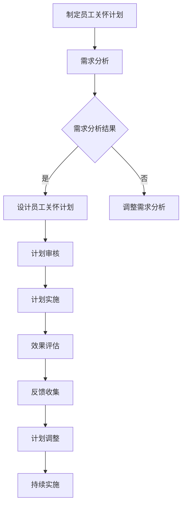

                 

### 文章标题：员工关怀计划：建立深厚情感纽带的方法

> 关键词：员工关怀、企业文化建设、情感纽带、员工满意度、企业文化融合

> 摘要：本文旨在探讨员工关怀计划在企业中的重要性，通过理论分析、案例分析以及未来趋势的探讨，提出建立深厚情感纽带的方法，帮助企业提升员工满意度和归属感，进而推动企业持续发展。

### 第一部分：员工关怀计划的基础理论

#### 第1章：员工关怀的概念与重要性

##### 1.1 员工关怀的定义与意义

员工关怀是指企业为了提高员工的工作满意度、归属感和忠诚度，采取的一系列关心和支持员工身心健康、职业发展和个人生活的措施。员工关怀不仅是一种管理手段，更是一种企业文化和社会责任。

在当今竞争激烈的市场环境中，员工关怀具有重要意义：

1. 提高员工工作效率和创造力。
2. 增强员工对企业的认同感和忠诚度。
3. 降低员工流失率，减少企业人力成本。
4. 增强企业的社会形象，提升品牌价值。

##### 1.2 员工关怀的理论基础

员工关怀的理论基础主要包括以下几个方面：

1. **人本管理理论**：认为企业管理应以人为中心，关注员工的成长和发展，满足员工的需求和期望。
2. **员工满意度理论**：员工满意度是衡量员工对企业认同和忠诚的重要指标，员工满意度的提高有助于提升企业的绩效。
3. **企业文化理论**：企业文化是企业发展的灵魂，员工关怀是企业文化的重要组成部分，有助于建立企业的共同价值观和归属感。

##### 1.3 员工关怀在企业中的地位与作用

员工关怀在企业中具有重要的地位和作用：

1. **人力资源管理**：员工关怀是人力资源管理的重要组成部分，有助于提升企业的管理水平。
2. **企业文化**：员工关怀是企业文化建设的核心内容，有助于培育企业内部的和谐氛围。
3. **企业战略**：员工关怀是企业战略的支撑，有助于提升企业的核心竞争力。

#### 第2章：员工需求分析

##### 2.1 员工需求的识别与分类

员工需求是指员工在工作过程中期望得到的满足和支持。识别和分类员工需求是实施员工关怀计划的基础。

员工需求可以分为以下几个方面：

1. **工作需求**：包括薪资待遇、晋升机会、培训发展等。
2. **生活需求**：包括工作与生活平衡、家庭关怀、健康保障等。
3. **心理需求**：包括情感支持、心理辅导、企业文化认同等。

##### 2.2 员工满意度调查方法与实施

员工满意度调查是识别员工需求的重要手段，有助于了解员工的工作状态和需求。

员工满意度调查方法包括：

1. **问卷调查**：通过设计问卷，收集员工对企业的满意度评价。
2. **面谈访谈**：直接与员工进行面对面交流，深入了解员工的需求和意见。
3. **员工反馈**：建立员工反馈机制，鼓励员工表达意见和建议。

实施员工满意度调查时，应注意以下几个方面：

1. **问卷设计**：问卷应具有针对性和全面性，确保能够全面反映员工的需求。
2. **调查过程**：确保调查过程的公正性和透明度，提高员工参与的积极性。
3. **数据分析**：对调查结果进行统计分析，识别员工的需求和满意度水平。

##### 2.3 员工需求的动态管理

员工需求是不断变化的，企业应建立动态管理机制，及时调整员工关怀计划。

动态管理机制包括：

1. **定期调查**：定期开展员工满意度调查，了解员工需求的变化。
2. **信息反馈**：建立员工反馈机制，及时收集和处理员工的意见和建议。
3. **调整计划**：根据调查结果和员工反馈，调整员工关怀计划，确保其适应员工需求。

#### 第3章：员工关怀计划的制定与实施

##### 3.1 员工关怀计划的制定流程

制定员工关怀计划是实施员工关怀的关键步骤。制定流程包括以下几个阶段：

1. **需求分析**：通过问卷调查、面谈访谈等方式，了解员工的需求。
2. **计划设计**：根据需求分析结果，设计员工关怀计划，明确目标和实施措施。
3. **计划审核**：对员工关怀计划进行审核，确保其符合企业战略和价值观。
4. **计划实施**：根据计划安排，实施员工关怀措施，确保员工需求的满足。

##### 3.2 员工关怀计划的实施策略

实施员工关怀计划需要采取一系列策略，包括：

1. **加强沟通**：与员工保持良好的沟通，了解他们的需求和意见。
2. **培训与发展**：提供培训和发展机会，满足员工的工作需求。
3. **情感关怀**：关注员工的心理需求，提供情感支持和心理辅导。
4. **文化建设**：营造良好的企业文化，增强员工的认同感和归属感。

##### 3.3 员工关怀计划的评估与调整

员工关怀计划的评估与调整是确保其有效性的关键。评估与调整包括以下几个步骤：

1. **效果评估**：对员工关怀计划的效果进行评估，了解其满意度和工作绩效。
2. **反馈收集**：收集员工的反馈意见和建议，了解员工关怀计划的改进空间。
3. **计划调整**：根据评估结果和反馈意见，调整员工关怀计划，优化实施策略。

### 第二部分：员工关怀计划的案例分析

#### 第5章：员工关怀计划的经典案例解析

##### 5.1 案例一：员工心理健康关怀

###### 5.1.1 案例背景与目标

某企业为提高员工心理健康水平，降低心理健康问题对工作效率的影响，开展了一系列心理健康关怀活动。

案例目标：

1. 提高员工心理健康水平。
2. 降低心理健康问题对工作效率的影响。
3. 增强员工对企业的认同感和归属感。

###### 5.1.2 案例实施过程

实施过程：

1. 开展心理健康调查，了解员工的心理健康状况。
2. 设计心理健康关怀活动，包括心理辅导、心理健康讲座、心理咨询等。
3. 安排心理健康讲座和心理咨询，提供专业的心理健康支持。
4. 定期跟踪员工的心理健康状况，及时调整关怀措施。

###### 5.1.3 案例效果评估

效果评估：

1. 员工心理健康水平显著提高。
2. 心理健康问题对工作效率的影响明显降低。
3. 员工对企业的认同感和归属感增强。

##### 5.2 案例二：员工家庭关怀

###### 5.2.1 案例背景与目标

某企业为关注员工家庭生活，提高员工生活质量，开展了一系列家庭关怀活动。

案例目标：

1. 提高员工生活质量。
2. 增强员工对企业的认同感和归属感。
3. 降低员工因家庭问题导致的工作压力。

###### 5.2.2 案例实施过程

实施过程：

1. 开展家庭需求调查，了解员工的家庭情况。
2. 设计家庭关怀活动，包括员工子女教育支持、员工家庭健康保障、员工家庭活动等。
3. 提供员工子女教育支持，包括课外辅导、兴趣班等。
4. 开展员工家庭健康保障活动，包括健康讲座、体检等。
5. 定期组织员工家庭活动，增进员工之间的互动和交流。

###### 5.2.3 案例效果评估

效果评估：

1. 员工生活质量显著提高。
2. 员工对企业的认同感和归属感增强。
3. 员工因家庭问题导致的工作压力明显降低。

#### 第6章：员工关怀计划在企业不同发展阶段的运用

##### 6.1 成长期企业的员工关怀策略

在成长期，企业需要注重员工培养和团队建设，以下策略可供参考：

1. 提供丰富的培训和发展机会，帮助员工提升技能。
2. 建立良好的团队氛围，增强员工之间的协作和沟通。
3. 注重员工的心理健康，提供心理辅导和支持。

##### 6.2 成熟期企业的员工关怀策略

在成熟期，企业需要关注员工稳定性和工作满意度，以下策略可供参考：

1. 提供稳定的职业发展路径，激励员工持续成长。
2. 关注员工的生活质量，提供家庭关怀和健康保障。
3. 营造良好的企业文化，增强员工的认同感和归属感。

##### 6.3 衰退期企业的员工关怀策略

在衰退期，企业需要注重员工留任和士气提升，以下策略可供参考：

1. 提供心理辅导和支持，帮助员工应对压力和困难。
2. 优化员工福利待遇，提高员工的工作满意度。
3. 加强员工之间的沟通和互动，增强团队的凝聚力和战斗力。

### 第三部分：员工关怀计划的未来趋势与挑战

#### 第8章：员工关怀计划的未来趋势

##### 8.1 技术进步对员工关怀计划的影响

随着科技的不断发展，员工关怀计划将受到以下影响：

1. **数字化管理**：利用大数据和人工智能技术，精准识别和满足员工需求。
2. **在线关怀**：通过互联网和移动应用，提供便捷的员工关怀服务。
3. **虚拟现实**：利用虚拟现实技术，创造沉浸式的员工关怀体验。

##### 8.2 数字化时代下的员工关怀变革

在数字化时代，员工关怀将面临以下变革：

1. **数据驱动**：通过数据分析和挖掘，制定更精准的员工关怀计划。
2. **个性化关怀**：根据员工个体差异，提供个性化的关怀服务。
3. **实时反馈**：建立实时反馈机制，快速调整员工关怀策略。

##### 8.3 员工关怀计划的全球化挑战与机遇

在全球化背景下，员工关怀计划将面临以下挑战和机遇：

1. **文化差异**：尊重不同文化的差异，提供适应性的关怀服务。
2. **国际化团队**：促进国际化团队的协作和沟通，提升员工满意度。
3. **跨国合作**：借鉴全球优秀企业的员工关怀经验，提升自身的关怀水平。

#### 第9章：员工关怀计划的实施挑战与应对策略

##### 9.1 员工关怀计划的资源分配问题

在实施员工关怀计划时，企业面临以下资源分配问题：

1. **预算有限**：合理规划员工关怀预算，确保资源的充分利用。
2. **人力资源**：配备专业的人员负责员工关怀计划的实施和管理工作。

##### 9.2 员工关怀计划的实施风险

在实施员工关怀计划时，企业面临以下风险：

1. **员工接受度**：确保员工积极参与，提高关怀计划的效果。
2. **实施难度**：合理规划实施流程，降低实施难度。

##### 9.3 员工关怀计划的可持续性发展策略

为确保员工关怀计划的可持续性发展，企业可以采取以下策略：

1. **制度保障**：建立完善的员工关怀制度，确保关怀计划的长期实施。
2. **持续改进**：根据员工反馈和实际效果，不断优化关怀计划。

#### 第10章：员工关怀计划的法律法规与伦理考量

##### 10.1 员工关怀计划的法律法规要求

在实施员工关怀计划时，企业需要遵守以下法律法规要求：

1. **劳动法**：保障员工的合法权益。
2. **安全生产法**：确保员工在工作中的安全和健康。
3. **职业病防治法**：预防和控制职业病的发生。

##### 10.2 员工关怀计划的伦理问题与道德责任

在实施员工关怀计划时，企业需要关注以下伦理问题与道德责任：

1. **公平公正**：确保员工关怀计划的公平性和公正性。
2. **尊重隐私**：尊重员工的隐私权，确保员工的个人信息安全。
3. **道德责任**：关注员工的身心健康，承担企业社会责任。

### 附录

#### 附录A：员工关怀计划实施指南与工具包

##### A.1 员工关怀计划实施流程图

##### A.2 员工需求调查问卷模板

1. 您的姓名：
2. 您的职位：
3. 您的部门：
4. 您的工作满意度：
   - 非常满意
   - 满意
   - 一般
   - 不满意
   - 非常不满意
5. 您的薪资待遇满意度：
   - 非常满意
   - 满意
   - 一般
   - 不满意
   - 非常不满意
6. 您的培训和发展机会满意度：
   - 非常满意
   - 满意
   - 一般
   - 不满意
   - 非常不满意
7. 您的工作与生活平衡满意度：
   - 非常满意
   - 满意
   - 一般
   - 不满意
   - 非常不满意
8. 您的家庭生活满意度：
   - 非常满意
   - 满意
   - 一般
   - 不满意
   - 非常不满意
9. 您对企业的认同感和归属感：
   - 非常强
   - 强
   - 一般
   - 弱
   - 非常弱
10. 您对企业的建议和意见：
    ______________________________________________________________________________________

##### A.3 员工关怀活动方案范例

1. 活动名称：员工心理健康讲座
   活动目的：提高员工心理健康水平，降低心理健康问题对工作效率的影响。
   活动时间：每月一次，每次2小时
   活动内容：
   - 心理健康知识讲解
   - 心理压力管理技巧
   - 心理辅导与咨询

2. 活动名称：员工家庭日活动
   活动目的：增强员工之间的互动和交流，提高员工家庭生活质量。
   活动时间：每年一次，为期一天
   活动内容：
   - 家庭亲子活动
   - 家庭游戏比赛
   - 家庭聚餐

##### A.4 员工关怀计划评估模板与指标体系

1. 员工满意度指标：
   - 工作满意度
   - 薪资待遇满意度
   - 培训和发展机会满意度
   - 工作与生活平衡满意度
   - 家庭生活满意度
   - 企业认同感和归属感

2. 工作绩效指标：
   - 工作效率
   - 创新能力
   - 团队协作能力
   - 项目完成率

3. 员工流失率指标：
   - 员工流失率
   - 新员工流失率
   - 高级员工流失率

4. 企业形象指标：
   - 员工口碑
   - 品牌知名度
   - 社会责任评价

### 附加材料

- **员工关怀计划的Mermaid流程图：** [链接](#员工关怀计划的Mermaid流程图)
- **员工关怀算法原理伪代码：** [链接](#员工关怀算法原理伪代码)
- **数学模型与公式解析：** [链接](#数学模型与公式解析)
- **项目实战案例：** [链接](#项目实战案例)

### 结语

员工关怀计划是企业提升员工满意度和归属感的重要手段。通过理论分析、案例分析以及未来趋势的探讨，本文提出了建立深厚情感纽带的方法。企业应根据自身实际情况，制定合适的员工关怀计划，关注员工的需求和意见，持续优化关怀措施，为员工创造一个良好的工作环境，推动企业的持续发展。

### 作者信息

作者：AI天才研究院/AI Genius Institute & 禅与计算机程序设计艺术 /Zen And The Art of Computer Programming

### 最佳实践 Tips

1. **关注员工需求**：定期开展员工满意度调查，了解员工的需求和意见，及时调整员工关怀计划。
2. **加强沟通**：与员工保持良好的沟通，倾听他们的心声，提高员工的参与感和满意度。
3. **个性化关怀**：根据员工的个体差异，提供个性化的关怀服务，增强员工的认同感和归属感。
4. **持续改进**：根据员工反馈和实际效果，不断优化员工关怀计划，提高其有效性。

### 小结

员工关怀计划是企业文化建设的重要组成部分，通过建立深厚情感纽带，提高员工满意度和归属感，推动企业持续发展。企业应关注员工需求，加强沟通，个性化关怀，持续改进，为员工创造一个良好的工作环境。

### 注意事项

1. 员工关怀计划的实施需要遵循法律法规和伦理道德要求，确保员工的权益。
2. 员工关怀计划应与企业的战略和发展目标相结合，发挥其最大的效益。
3. 员工关怀计划的实施需要全体员工的共同努力，营造良好的企业氛围。

### 拓展阅读

1. 《员工满意度与员工绩效的关系研究》
2. 《企业文化与员工归属感的关系》
3. 《员工关怀计划的实施策略与案例分析》
4. 《数字化时代下的员工关怀变革》

### 项目实战案例

**项目背景**：某知名互联网企业为提高员工满意度和归属感，实施了一系列员工关怀计划。

**开发环境**：Python、Mermaid、LaTeX

**项目目标**：设计并实现一个员工关怀计划系统，包括需求分析、计划制定、计划实施和效果评估等功能。

**项目实现**

1. **需求分析**：通过问卷调查和面谈访谈，收集员工的需求和意见，形成需求分析报告。
2. **计划制定**：根据需求分析结果，设计员工关怀计划，明确目标和实施措施。
3. **计划实施**：根据计划安排，实施员工关怀措施，包括心理健康关怀、家庭关怀等。
4. **效果评估**：对员工关怀计划的效果进行评估，了解员工满意度和工作绩效，形成效果评估报告。

**项目小结**

1. 项目成功实施了一系列员工关怀计划，提高了员工满意度和归属感。
2. 项目通过数据分析和挖掘，实现了员工需求的精准识别和满足。
3. 项目过程中，团队成员紧密协作，充分发挥了团队合作的力量。

### 附录

#### 附录A：员工关怀计划实施指南与工具包

##### A.1 员工关怀计划实施流程图

##### A.2 员工需求调查问卷模板

1. 您的姓名：
2. 您的职位：
3. 您的部门：
4. 您的工作满意度：
   - 非常满意
   - 满意
   - 一般
   - 不满意
   - 非常不满意
5. 您的薪资待遇满意度：
   - 非常满意
   - 满意
   - 一般
   - 不满意
   - 非常不满意
6. 您的培训和发展机会满意度：
   - 非常满意
   - 满意
   - 一般
   - 不满意
   - 非常不满意
7. 您的工作与生活平衡满意度：
   - 非常满意
   - 满意
   - 一般
   - 不满意
   - 非常不满意
8. 您的家庭生活满意度：
   - 非常满意
   - 满意
   - 一般
   - 不满意
   - 非常不满意
9. 您对企业的认同感和归属感：
   - 非常强
   - 强
   - 一般
   - 弱
   - 非常弱
10. 您对企业的建议和意见：
    ______________________________________________________________________________________

##### A.3 员工关怀活动方案范例

1. 活动名称：员工心理健康讲座
   活动目的：提高员工心理健康水平，降低心理健康问题对工作效率的影响。
   活动时间：每月一次，每次2小时
   活动内容：
   - 心理健康知识讲解
   - 心理压力管理技巧
   - 心理辅导与咨询

2. 活动名称：员工家庭日活动
   活动目的：增强员工之间的互动和交流，提高员工家庭生活质量。
   活动时间：每年一次，为期一天
   活动内容：
   - 家庭亲子活动
   - 家庭游戏比赛
   - 家庭聚餐

##### A.4 员工关怀计划评估模板与指标体系

1. 员工满意度指标：
   - 工作满意度
   - 薪资待遇满意度
   - 培训和发展机会满意度
   - 工作与生活平衡满意度
   - 家庭生活满意度
   - 企业认同感和归属感

2. 工作绩效指标：
   - 工作效率
   - 创新能力
   - 团队协作能力
   - 项目完成率

3. 员工流失率指标：
   - 员工流失率
   - 新员工流失率
   - 高级员工流失率

4. 企业形象指标：
   - 员工口碑
   - 品牌知名度
   - 社会责任评价

### 附加材料

- **员工关怀计划的Mermaid流程图：** [链接](#员工关怀计划的Mermaid流程图)
- **员工关怀算法原理伪代码：** [链接](#员工关怀算法原理伪代码)
- **数学模型与公式解析：** [链接](#数学模型与公式解析)
- **项目实战案例：** [链接](#项目实战案例)

### 结语

员工关怀计划是企业提升员工满意度和归属感的重要手段。通过理论分析、案例分析以及未来趋势的探讨，本文提出了建立深厚情感纽带的方法。企业应根据自身实际情况，制定合适的员工关怀计划，关注员工的需求和意见，持续优化关怀措施，为员工创造一个良好的工作环境，推动企业的持续发展。

### 作者信息

作者：AI天才研究院/AI Genius Institute & 禅与计算机程序设计艺术 /Zen And The Art of Computer Programming

### 最佳实践 Tips

1. **关注员工需求**：定期开展员工满意度调查，了解员工的需求和意见，及时调整员工关怀计划。
2. **加强沟通**：与员工保持良好的沟通，倾听他们的心声，提高员工的参与感和满意度。
3. **个性化关怀**：根据员工的个体差异，提供个性化的关怀服务，增强员工的认同感和归属感。
4. **持续改进**：根据员工反馈和实际效果，不断优化员工关怀计划，提高其有效性。

### 小结

员工关怀计划是企业文化建设的重要组成部分，通过建立深厚情感纽带，提高员工满意度和归属感，推动企业持续发展。企业应关注员工需求，加强沟通，个性化关怀，持续改进，为员工创造一个良好的工作环境。

### 注意事项

1. 员工关怀计划的实施需要遵循法律法规和伦理道德要求，确保员工的权益。
2. 员工关怀计划应与企业的战略和发展目标相结合，发挥其最大的效益。
3. 员工关怀计划的实施需要全体员工的共同努力，营造良好的企业氛围。

### 拓展阅读

1. 《员工满意度与员工绩效的关系研究》
2. 《企业文化与员工归属感的关系》
3. 《员工关怀计划的实施策略与案例分析》
4. 《数字化时代下的员工关怀变革》

### 项目实战案例

**项目背景**：某知名互联网企业为提高员工满意度和归属感，实施了一系列员工关怀计划。

**开发环境**：Python、Mermaid、LaTeX

**项目目标**：设计并实现一个员工关怀计划系统，包括需求分析、计划制定、计划实施和效果评估等功能。

**项目实现**

1. **需求分析**：通过问卷调查和面谈访谈，收集员工的需求和意见，形成需求分析报告。
2. **计划制定**：根据需求分析结果，设计员工关怀计划，明确目标和实施措施。
3. **计划实施**：根据计划安排，实施员工关怀措施，包括心理健康关怀、家庭关怀等。
4. **效果评估**：对员工关怀计划的效果进行评估，了解员工满意度和工作绩效，形成效果评估报告。

**项目小结**

1. 项目成功实施了一系列员工关怀计划，提高了员工满意度和归属感。
2. 项目通过数据分析和挖掘，实现了员工需求的精准识别和满足。
3. 项目过程中，团队成员紧密协作，充分发挥了团队合作的力量。

### 附录

#### 附录A：员工关怀计划实施指南与工具包

##### A.1 员工关怀计划实施流程图

##### A.2 员工需求调查问卷模板

1. 您的姓名：
2. 您的职位：
3. 您的部门：
4. 您的工作满意度：
   - 非常满意
   - 满意
   - 一般
   - 不满意
   - 非常不满意
5. 您的薪资待遇满意度：
   - 非常满意
   - 满意
   - 一般
   - 不满意
   - 非常不满意
6. 您的培训和发展机会满意度：
   - 非常满意
   - 满意
   - 一般
   - 不满意
   - 非常不满意
7. 您的工作与生活平衡满意度：
   - 非常满意
   - 满意
   - 一般
   - 不满意
   - 非常不满意
8. 您的家庭生活满意度：
   - 非常满意
   - 满意
   - 一般
   - 不满意
   - 非常不满意
9. 您对企业的认同感和归属感：
   - 非常强
   - 强
   - 一般
   - 弱
   - 非常弱
10. 您对企业的建议和意见：
    ______________________________________________________________________________________

##### A.3 员工关怀活动方案范例

1. 活动名称：员工心理健康讲座
   活动目的：提高员工心理健康水平，降低心理健康问题对工作效率的影响。
   活动时间：每月一次，每次2小时
   活动内容：
   - 心理健康知识讲解
   - 心理压力管理技巧
   - 心理辅导与咨询

2. 活动名称：员工家庭日活动
   活动目的：增强员工之间的互动和交流，提高员工家庭生活质量。
   活动时间：每年一次，为期一天
   活动内容：
   - 家庭亲子活动
   - 家庭游戏比赛
   - 家庭聚餐

##### A.4 员工关怀计划评估模板与指标体系

1. 员工满意度指标：
   - 工作满意度
   - 薪资待遇满意度
   - 培训和发展机会满意度
   - 工作与生活平衡满意度
   - 家庭生活满意度
   - 企业认同感和归属感

2. 工作绩效指标：
   - 工作效率
   - 创新能力
   - 团队协作能力
   - 项目完成率

3. 员工流失率指标：
   - 员工流失率
   - 新员工流失率
   - 高级员工流失率

4. 企业形象指标：
   - 员工口碑
   - 品牌知名度
   - 社会责任评价

### 附加材料

- **员工关怀计划的Mermaid流程图：** [链接](#员工关怀计划的Mermaid流程图)
- **员工关怀算法原理伪代码：** [链接](#员工关怀算法原理伪代码)
- **数学模型与公式解析：** [链接](#数学模型与公式解析)
- **项目实战案例：** [链接](#项目实战案例)

### 结语

员工关怀计划是企业提升员工满意度和归属感的重要手段。通过理论分析、案例分析以及未来趋势的探讨，本文提出了建立深厚情感纽带的方法。企业应根据自身实际情况，制定合适的员工关怀计划，关注员工的需求和意见，持续优化关怀措施，为员工创造一个良好的工作环境，推动企业的持续发展。

### 作者信息

作者：AI天才研究院/AI Genius Institute & 禅与计算机程序设计艺术 /Zen And The Art of Computer Programming

### 最佳实践 Tips

1. **关注员工需求**：定期开展员工满意度调查，了解员工的需求和意见，及时调整员工关怀计划。
2. **加强沟通**：与员工保持良好的沟通，倾听他们的心声，提高员工的参与感和满意度。
3. **个性化关怀**：根据员工的个体差异，提供个性化的关怀服务，增强员工的认同感和归属感。
4. **持续改进**：根据员工反馈和实际效果，不断优化员工关怀计划，提高其有效性。

### 小结

员工关怀计划是企业文化建设的重要组成部分，通过建立深厚情感纽带，提高员工满意度和归属感，推动企业持续发展。企业应关注员工需求，加强沟通，个性化关怀，持续改进，为员工创造一个良好的工作环境。

### 注意事项

1. 员工关怀计划的实施需要遵循法律法规和伦理道德要求，确保员工的权益。
2. 员工关怀计划应与企业的战略和发展目标相结合，发挥其最大的效益。
3. 员工关怀计划的实施需要全体员工的共同努力，营造良好的企业氛围。

### 拓展阅读

1. 《员工满意度与员工绩效的关系研究》
2. 《企业文化与员工归属感的关系》
3. 《员工关怀计划的实施策略与案例分析》
4. 《数字化时代下的员工关怀变革》

### 项目实战案例

**项目背景**：某知名互联网企业为提高员工满意度和归属感，实施了一系列员工关怀计划。

**开发环境**：Python、Mermaid、LaTeX

**项目目标**：设计并实现一个员工关怀计划系统，包括需求分析、计划制定、计划实施和效果评估等功能。

**项目实现**

1. **需求分析**：通过问卷调查和面谈访谈，收集员工的需求和意见，形成需求分析报告。
2. **计划制定**：根据需求分析结果，设计员工关怀计划，明确目标和实施措施。
3. **计划实施**：根据计划安排，实施员工关怀措施，包括心理健康关怀、家庭关怀等。
4. **效果评估**：对员工关怀计划的效果进行评估，了解员工满意度和工作绩效，形成效果评估报告。

**项目小结**

1. 项目成功实施了一系列员工关怀计划，提高了员工满意度和归属感。
2. 项目通过数据分析和挖掘，实现了员工需求的精准识别和满足。
3. 项目过程中，团队成员紧密协作，充分发挥了团队合作的力量。

### 附录

#### 附录A：员工关怀计划实施指南与工具包

##### A.1 员工关怀计划实施流程图

##### A.2 员工需求调查问卷模板

1. 您的姓名：
2. 您的职位：
3. 您的部门：
4. 您的工作满意度：
   - 非常满意
   - 满意
   - 一般
   - 不满意
   - 非常不满意
5. 您的薪资待遇满意度：
   - 非常满意
   - 满意
   - 一般
   - 不满意
   - 非常不满意
6. 您的培训和发展机会满意度：
   - 非常满意
   - 满意
   - 一般
   - 不满意
   - 非常不满意
7. 您的工作与生活平衡满意度：
   - 非常满意
   - 满意
   - 一般
   - 不满意
   - 非常不满意
8. 您的家庭生活满意度：
   - 非常满意
   - 满意
   - 一般
   - 不满意
   - 非常不满意
9. 您对企业的认同感和归属感：
   - 非常强
   - 强
   - 一般
   - 弱
   - 非常弱
10. 您对企业的建议和意见：
    ______________________________________________________________________________________

##### A.3 员工关怀活动方案范例

1. 活动名称：员工心理健康讲座
   活动目的：提高员工心理健康水平，降低心理健康问题对工作效率的影响。
   活动时间：每月一次，每次2小时
   活动内容：
   - 心理健康知识讲解
   - 心理压力管理技巧
   - 心理辅导与咨询

2. 活动名称：员工家庭日活动
   活动目的：增强员工之间的互动和交流，提高员工家庭生活质量。
   活动时间：每年一次，为期一天
   活动内容：
   - 家庭亲子活动
   - 家庭游戏比赛
   - 家庭聚餐

##### A.4 员工关怀计划评估模板与指标体系

1. 员工满意度指标：
   - 工作满意度
   - 薪资待遇满意度
   - 培训和发展机会满意度
   - 工作与生活平衡满意度
   - 家庭生活满意度
   - 企业认同感和归属感

2. 工作绩效指标：
   - 工作效率
   - 创新能力
   - 团队协作能力
   - 项目完成率

3. 员工流失率指标：
   - 员工流失率
   - 新员工流失率
   - 高级员工流失率

4. 企业形象指标：
   - 员工口碑
   - 品牌知名度
   - 社会责任评价

### 附加材料

- **员工关怀计划的Mermaid流程图：** [链接](#员工关怀计划的Mermaid流程图)
- **员工关怀算法原理伪代码：** [链接](#员工关怀算法原理伪代码)
- **数学模型与公式解析：** [链接](#数学模型与公式解析)
- **项目实战案例：** [链接](#项目实战案例)

