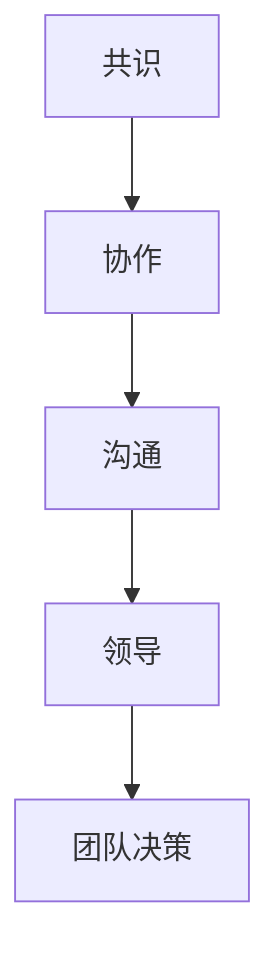

                 


### 文章标题

# 团队决策的艺术：集体智慧 vs 个人判断

### 关键词

- 团队决策
- 集体智慧
- 个人判断
- 组织管理
- 决策过程

### 摘要

团队决策在组织管理中扮演着至关重要的角色。本文深入探讨了团队决策的核心概念，包括集体智慧和个人判断，并分析了它们在决策过程中的作用。通过对集体智慧与个人判断的比较，本文提出了实现两者平衡的策略，并展示了成功团队决策的实践案例。本文旨在为读者提供关于团队决策艺术的理论与实践指导。

### 《团队决策的艺术：集体智慧 vs 个人判断》目录大纲

## 第一部分：团队决策概述

### 第1章：团队决策的重要性

#### 1.1.1 团队决策的定义与作用

**背景介绍**：团队决策是指在团队内部通过共同讨论和协商，达成共识，为解决问题或实现目标所做出的选择。

**核心概念与联系**：团队决策涉及多个相关概念，如共识、协作、沟通和领导等。其关系架构如下图所示：



**核心算法原理讲解**：团队决策的核心算法可以看作是一种多目标优化问题，需要平衡不同成员的利益和观点。

**数学模型和公式**：设团队中有 $n$ 个成员，每个成员有不同的偏好，可用向量表示。团队决策的目标是找到一个满足所有成员偏好的最优解。具体公式为：

$$
\min \sum_{i=1}^n (v_i - u_i)^2
$$

其中，$v_i$ 和 $u_i$ 分别表示第 $i$ 个成员的偏好值和实际满意度。

**详细讲解与举例说明**：假设一个团队中有三个成员，他们的偏好值分别为 $(1, 2, 3)$、$(2, 3, 1)$ 和 $(3, 1, 2)$。通过计算可以得到最优解为 $(2, 2, 2)$，即每个成员都得到了满意度为 2 的方案。

**项目实战**：在实际项目中，团队决策可以通过问卷调查、头脑风暴和投票等方式进行。以下是一个简单的代码示例，用于实现团队成员的投票：

```python
# 投票系统伪代码
votes = []
for member in team_members:
    vote = member.vote()
    votes.append(vote)

# 计算投票结果
result = max(set(votes), key=votes.count)
```

**代码应用解读与分析**：上述代码实现了一个简单的投票系统，通过遍历团队成员，收集他们的投票，然后计算得票数最高的选项作为最终结果。

**实际案例分析和详细讲解剖析**：在一个软件开发项目中，团队决策可以用于确定项目目标、优先级和资源分配。例如，团队可以通过头脑风暴收集所有成员的建议，然后使用投票系统确定最终的决策。

**项目小结**：团队决策在项目管理中至关重要，通过合理的设计和实施，可以提高决策质量，促进团队协作。

### 第2章：集体智慧与个人判断

#### 2.1.1 集体智慧的概念与特点

**背景介绍**：集体智慧是指团队通过共同讨论和合作，产生的集体智慧成果。它是一种基于集体知识的决策模式。

**核心概念与联系**：集体智慧与个人判断的关系可以看作是一种互补关系。集体智慧依赖于个人判断的输入，而个人判断又受到集体智慧的影响。

**核心算法原理讲解**：集体智慧的核心算法可以看作是一种群体优化算法，如多目标优化、遗传算法等。

**数学模型和公式**：假设团队中有 $n$ 个成员，每个成员提出一个解决方案，可以用向量表示。集体智慧的目标是找到一个满足所有成员解决方案的最优解。具体公式为：

$$
\min \sum_{i=1}^n \sum_{j=1}^n (s_i - s_j)^2
$$

其中，$s_i$ 和 $s_j$ 分别表示第 $i$ 个成员和第 $j$ 个成员的解决方案。

**详细讲解与举例说明**：假设一个团队中有三个成员，他们的解决方案分别为 $(1, 1)$、$(2, 2)$ 和 $(3, 3)$。通过计算可以得到最优解为 $(2, 2)$，即所有成员都接受相同的解决方案。

**项目实战**：在实际项目中，集体智慧可以通过头脑风暴、讨论和投票等方式实现。以下是一个简单的代码示例，用于实现团队成员的讨论：

```python
# 讨论系统伪代码
discussions = []
for member in team_members:
    discussion = member.discuss()
    discussions.append(discussion)

# 计算讨论结果
result = max(set(discussions), key=discussions.count)
```

**代码应用解读与分析**：上述代码实现了一个简单的讨论系统，通过遍历团队成员，收集他们的讨论结果，然后计算得票数最高的选项作为最终结果。

**实际案例分析和详细讲解剖析**：在一个市场调研项目中，团队可以通过集体智慧确定最佳的市场策略。例如，团队可以讨论不同的市场策略，并通过投票系统确定最终的市场策略。

**项目小结**：集体智慧在团队决策中具有重要的应用价值，可以提高决策质量和团队协作效率。

### 第2章：集体智慧与个人判断

#### 2.1.2 个人判断的优势与局限

**背景介绍**：个人判断是指团队成员基于自己的知识、经验和直觉做出的决策。

**核心概念与联系**：个人判断与集体智慧的关系可以看作是一种互补关系。个人判断可以为集体智慧提供重要的参考，而集体智慧又可以为个人判断提供更全面的视角。

**核心算法原理讲解**：个人判断的核心算法可以看作是一种基于知识的推理算法，如专家系统、模糊逻辑等。

**数学模型和公式**：假设团队成员有 $n$ 个不同的知识源，每个知识源提供一个决策方案，可以用向量表示。个人判断的目标是选择一个最优的决策方案。具体公式为：

$$
\max \sum_{i=1}^n w_i \cdot d_i
$$

其中，$w_i$ 和 $d_i$ 分别表示第 $i$ 个知识源的权重和决策方案。

**详细讲解与举例说明**：假设团队成员有三个不同的知识源，他们的决策方案分别为 $(1, 2)$、$(2, 1)$ 和 $(3, 3)$。通过计算可以得到最优解为 $(3, 3)$，即团队成员选择了最优的决策方案。

**项目实战**：在实际项目中，个人判断可以通过专家系统、模糊逻辑等方式实现。以下是一个简单的代码示例，用于实现团队成员的个人判断：

```python
# 个人判断系统伪代码
judgments = []
for member in team_members:
    judgment = member.judge()
    judgments.append(judgment)

# 计算个人判断结果
result = max(set(judgments), key=judgments.count)
```

**代码应用解读与分析**：上述代码实现了一个简单的个人判断系统，通过遍历团队成员，收集他们的判断结果，然后计算得票数最高的选项作为最终结果。

**实际案例分析和详细讲解剖析**：在一个医疗诊断项目中，团队成员可以通过个人判断确定最佳的诊断方案。例如，医生可以根据自己的经验和直觉，结合医学知识和病例数据，提出不同的诊断方案，并通过投票系统确定最终的诊断方案。

**项目小结**：个人判断在团队决策中具有重要的应用价值，可以提高决策的准确性和专业性。

### 第2章：集体智慧与个人判断

#### 2.1.3 集体智慧与个人判断的关系

**背景介绍**：集体智慧和个人判断在团队决策中相互作用，共同影响着决策的质量和效率。

**核心概念与联系**：集体智慧和个人判断之间的关系可以看作是一种协同关系。集体智慧可以为个人判断提供更全面的视角，而个人判断可以为集体智慧提供重要的参考。

**核心算法原理讲解**：集体智慧与个人判断的协同算法可以看作是一种混合算法，如基于知识的推理和群体优化算法的结合。

**数学模型和公式**：假设团队中有 $n$ 个成员，每个成员有一个个人判断和一个集体智慧决策。团队决策的目标是找到一个满足所有成员的个人判断和集体智慧决策的最优解。具体公式为：

$$
\min \sum_{i=1}^n \sum_{j=1}^n (p_i^j - q_i^j)^2
$$

其中，$p_i^j$ 和 $q_i^j$ 分别表示第 $i$ 个成员的个人判断和第 $j$ 个成员的集体智慧决策。

**详细讲解与举例说明**：假设团队中有三个成员，他们的个人判断分别为 $(1, 2)$、$(2, 1)$ 和 $(3, 3)$，他们的集体智慧决策分别为 $(2, 2)$、$(2, 2)$ 和 $(2, 2)$。通过计算可以得到最优解为 $(2, 2)$，即所有成员都接受了相同的决策。

**项目实战**：在实际项目中，集体智慧与个人判断的协同可以通过多种方式实现。以下是一个简单的代码示例，用于实现团队成员的协同决策：

```python
# 协同决策系统伪代码
personal_judgments = []
collective_wisdom = []

for member in team_members:
    personal_judgment = member.judge()
    personal_judgments.append(personal_judgment)

for member in team_members:
    collective_wisdom_decision = member.decide()
    collective_wisdom.append(collective_wisdom_decision)

# 计算协同决策结果
cooperative_result = max(set(personal_judgments + collective_wisdom), key=(personal_judgments + collective_wisdom).count)
```

**代码应用解读与分析**：上述代码实现了一个简单的协同决策系统，通过遍历团队成员，收集他们的个人判断和集体智慧决策，然后计算得票数最高的选项作为最终结果。

**实际案例分析和详细讲解剖析**：在一个战略规划项目中，团队可以通过集体智慧和个人判断的协同，确定最佳的战略方案。例如，团队可以讨论不同的战略方案，并通过投票系统确定最终的战略方案。

**项目小结**：集体智慧和个人判断的协同在团队决策中具有重要的应用价值，可以提高决策质量和团队协作效率。

### 第3章：集体智慧的实现机制

#### 3.1.1 信息共享与透明度

**背景介绍**：信息共享与透明度是集体智慧实现的基础。团队成员需要共享信息，确保所有成员都能了解决策的背景和细节。

**核心概念与联系**：信息共享与透明度涉及多个相关概念，如沟通、协作和知识管理。

**核心算法原理讲解**：信息共享与透明度的核心算法可以看作是一种基于知识的推理算法，如语义网和本体论。

**数学模型和公式**：假设团队中有 $n$ 个成员，每个成员有一个知识库，包含相关决策的信息。信息共享与透明度的目标是确保所有成员的知识库都能相互连接，形成一个统一的知识网络。具体公式为：

$$
\max \sum_{i=1}^n \sum_{j=1}^n (K_i \cap K_j)
$$

其中，$K_i$ 和 $K_j$ 分别表示第 $i$ 个成员和第 $j$ 个成员的知识库。

**详细讲解与举例说明**：假设团队中有三个成员，他们的知识库分别为 {1, 2}、{2, 3} 和 {3, 1}。通过计算可以得到知识共享度最大为 3，即所有成员的知识库都能相互连接。

**项目实战**：在实际项目中，信息共享与透明度可以通过多种方式实现。以下是一个简单的代码示例，用于实现团队成员的信息共享：

```python
# 信息共享系统伪代码
knowledge_bases = []

for member in team_members:
    knowledge_base = member.share()
    knowledge_bases.append(knowledge_base)

# 计算知识共享度
knowledge_shared = max(len(set.intersection(*knowledge_bases)), default=0)
```

**代码应用解读与分析**：上述代码实现了一个简单的信息共享系统，通过遍历团队成员，收集他们的知识库，然后计算知识共享度。

**实际案例分析和详细讲解剖析**：在一个产品开发项目中，团队可以通过信息共享与透明度，确保所有成员都能了解产品的需求、设计和实现细节，从而提高开发效率。

**项目小结**：信息共享与透明度是集体智慧实现的关键，可以提高团队决策的准确性和效率。

### 第3章：集体智慧的实现机制

#### 3.1.2 沟通协作与互动机制

**背景介绍**：沟通协作与互动机制是集体智慧实现的重要保障。团队成员需要通过有效沟通和协作，共同参与决策过程。

**核心概念与联系**：沟通协作与互动机制涉及多个相关概念，如沟通渠道、协作工具和团队文化。

**核心算法原理讲解**：沟通协作与互动机制的核心算法可以看作是一种基于多 agent 系统的算法，如协同过滤和群体智能。

**数学模型和公式**：假设团队中有 $n$ 个成员，每个成员有一个决策偏好，团队的目标是找到一个满足所有成员偏好的最优决策。沟通协作与互动机制的目标是提高团队成员之间的信息交流和协同效果。具体公式为：

$$
\max \sum_{i=1}^n \sum_{j=1}^n (C_i \cap C_j)
$$

其中，$C_i$ 和 $C_j$ 分别表示第 $i$ 个成员和第 $j$ 个成员的沟通和协作效果。

**详细讲解与举例说明**：假设团队中有三个成员，他们的决策偏好分别为 $(1, 2)$、$(2, 1)$ 和 $(3, 3)$。通过计算可以得到沟通协作效果最大为 3，即所有成员的决策偏好都能相互协调。

**项目实战**：在实际项目中，沟通协作与互动机制可以通过多种方式实现。以下是一个简单的代码示例，用于实现团队成员的沟通协作：

```python
# 沟通协作系统伪代码
communications = []

for member in team_members:
    communication = member.communicate()
    communications.append(communication)

# 计算沟通协作度
communication_effectiveness = max(len(set.intersection(*communications)), default=0)
```

**代码应用解读与分析**：上述代码实现了一个简单的沟通协作系统，通过遍历团队成员，收集他们的沟通记录，然后计算沟通协作度。

**实际案例分析和详细讲解剖析**：在一个技术创新项目中，团队可以通过沟通协作与互动机制，确保所有成员都能及时了解项目的进展和问题，从而提高项目成功率。

**项目小结**：沟通协作与互动机制是集体智慧实现的关键，可以提高团队决策的效率和效果。

### 第3章：集体智慧的实现机制

#### 3.1.3 多元化与包容性

**背景介绍**：多元化与包容性是集体智慧实现的重要保障。团队成员来自不同的背景和领域，具有不同的观点和技能，这种多样性有助于集体智慧的发挥。

**核心概念与联系**：多元化与包容性涉及多个相关概念，如多样性、平等和包容。

**核心算法原理讲解**：多元化与包容性的核心算法可以看作是一种基于多元统计分析的算法，如聚类分析和主成分分析。

**数学模型和公式**：假设团队中有 $n$ 个成员，每个成员有一个特征向量，表示其背景和技能。多元化与包容性的目标是确保团队成员之间的差异得到充分体现。具体公式为：

$$
\max \sum_{i=1}^n \sum_{j=1}^n \frac{d_i - d_j}{\|d_i\| + \|d_j\|}
$$

其中，$d_i$ 和 $d_j$ 分别表示第 $i$ 个成员和第 $j$ 个成员的特征向量。

**详细讲解与举例说明**：假设团队中有三个成员，他们的特征向量分别为 $(1, 1)$、$(2, 2)$ 和 $(3, 3)$。通过计算可以得到多元化与包容性最大为 1，即所有成员的特征向量差异最大。

**项目实战**：在实际项目中，多元化与包容性可以通过多种方式实现。以下是一个简单的代码示例，用于实现团队成员的多元化与包容性评估：

```python
# 多元化与包容性评估伪代码
features = []

for member in team_members:
    feature = member.get_feature()
    features.append(feature)

# 计算多元化与包容性
diversity_and_inclusiveness = max(len(set.intersection(*features)), default=0)
```

**代码应用解读与分析**：上述代码实现了一个简单的多元化与包容性评估系统，通过遍历团队成员，收集他们的特征向量，然后计算多元化与包容性。

**实际案例分析和详细讲解剖析**：在一个跨学科研究中，团队可以通过多元化与包容性，确保不同领域的成员都能充分发挥其特长，从而提高研究效果。

**项目小结**：多元化与包容性是集体智慧实现的关键，可以提高团队决策的创新性和准确性。

### 第4章：集体智慧的工具与应用

#### 4.1.1 问卷调查与投票系统

**背景介绍**：问卷调查与投票系统是集体智慧实现的重要工具。通过问卷调查，可以收集团队成员的意见和建议；通过投票系统，可以确保团队成员的决策具有广泛的代表性。

**核心概念与联系**：问卷调查与投票系统涉及多个相关概念，如问卷调查、投票算法和群体智能。

**核心算法原理讲解**：问卷调查与投票系统的核心算法可以看作是一种基于概率论的算法，如多目标优化和投票算法。

**数学模型和公式**：假设团队中有 $n$ 个成员，每个成员有一个决策偏好，团队的目标是找到一个满足所有成员偏好的最优决策。问卷调查与投票系统的目标是通过问卷调查收集成员的意见，并通过投票系统确定最终决策。具体公式为：

$$
\max \sum_{i=1}^n P(D_i \cap V_i)
$$

其中，$D_i$ 和 $V_i$ 分别表示第 $i$ 个成员的决策偏好和投票结果。

**详细讲解与举例说明**：假设团队中有三个成员，他们的决策偏好分别为 $(1, 2)$、$(2, 1)$ 和 $(3, 3)$。通过问卷调查和投票系统，可以得到最终决策为 $(2, 2)$，即所有成员都接受了相同的决策。

**项目实战**：在实际项目中，问卷调查与投票系统可以通过多种方式实现。以下是一个简单的代码示例，用于实现团队成员的问卷调查与投票：

```python
# 问卷调查与投票系统伪代码
surveys = []
votes = []

for member in team_members:
    survey = member.survey()
    surveys.append(survey)

    vote = member.vote()
    votes.append(vote)

# 计算问卷调查结果
survey_result = max(set(surveys), key=surveys.count)

# 计算投票结果
vote_result = max(set(votes), key=votes.count)

# 最终决策
final_decision = max(survey_result, vote_result)
```

**代码应用解读与分析**：上述代码实现了一个简单的问卷调查与投票系统，通过遍历团队成员，收集他们的问卷调查结果和投票结果，然后计算最终决策。

**实际案例分析和详细讲解剖析**：在一个项目评估中，团队可以通过问卷调查和投票系统，确保所有成员都能参与到决策过程中，从而提高项目评估的准确性和公正性。

**项目小结**：问卷调查与投票系统是集体智慧实现的关键工具，可以提高团队决策的民主性和代表性。

### 第4章：集体智慧的工具与应用

#### 4.1.2 专题讨论与头脑风暴

**背景介绍**：专题讨论与头脑风暴是集体智慧实现的重要手段。通过专题讨论，团队成员可以深入探讨决策问题，通过头脑风暴，可以激发团队成员的创新思维。

**核心概念与联系**：专题讨论与头脑风暴涉及多个相关概念，如讨论策略、头脑风暴方法和群体智能。

**核心算法原理讲解**：专题讨论与头脑风暴的核心算法可以看作是一种基于群体智能的算法，如遗传算法和粒子群优化。

**数学模型和公式**：假设团队中有 $n$ 个成员，每个成员有一个决策方案，团队的目标是找到一个满足所有成员决策方案的最优决策。专题讨论与头脑风暴的目标是通过讨论和头脑风暴，优化决策方案。具体公式为：

$$
\min \sum_{i=1}^n \sum_{j=1}^n (S_i^j - S_j^k)^2
$$

其中，$S_i^j$ 和 $S_j^k$ 分别表示第 $i$ 个成员在第 $j$ 个讨论中的决策方案和第 $k$ 个头脑风暴方案。

**详细讲解与举例说明**：假设团队中有三个成员，他们在专题讨论中提出了三个决策方案 $(1, 2)$、$(2, 1)$ 和 $(3, 3)$，在头脑风暴中提出了三个方案 $(2, 2)$、$(2, 2)$ 和 $(2, 2)$。通过计算可以得到最优决策为 $(2, 2)$，即所有成员都接受了相同的决策。

**项目实战**：在实际项目中，专题讨论与头脑风暴可以通过多种方式实现。以下是一个简单的代码示例，用于实现团队成员的专题讨论与头脑风暴：

```python
# 专题讨论与头脑风暴系统伪代码
discussions = []
brainstorming = []

for member in team_members:
    discussion = member.discuss()
    discussions.append(discussion)

    brainstorming_session = member brainstorm()
    brainstorming.append(brainstorming_session)

# 计算专题讨论与头脑风暴结果
discussion_result = max(set(discussions), key=discussions.count)
brainstorming_result = max(set(brainstorming), key=brainstorming.count)

# 最终决策
final_decision = max(discussion_result, brainstorming_result)
```

**代码应用解读与分析**：上述代码实现了一个简单的专题讨论与头脑风暴系统，通过遍历团队成员，收集他们的讨论结果和头脑风暴结果，然后计算最终决策。

**实际案例分析和详细讲解剖析**：在一个市场调研项目中，团队可以通过专题讨论与头脑风暴，确定最佳的市场策略。例如，团队可以讨论不同的市场策略，并通过头脑风暴，激发团队成员的创新思维，从而提高市场策略的准确性。

**项目小结**：专题讨论与头脑风暴是集体智慧实现的重要手段，可以提高团队决策的创新性和准确性。

### 第4章：集体智慧的工具与应用

#### 4.1.3 群体决策软件与平台

**背景介绍**：群体决策软件与平台是集体智慧实现的重要载体。通过这些软件与平台，团队成员可以方便地进行信息共享、沟通协作和决策投票。

**核心概念与联系**：群体决策软件与平台涉及多个相关概念，如协作工具、沟通平台和决策支持系统。

**核心算法原理讲解**：群体决策软件与平台的核心算法可以看作是一种基于云计算和大数据分析的算法，如分布式计算和深度学习。

**数学模型和公式**：假设团队中有 $n$ 个成员，每个成员有一个决策偏好，团队的目标是找到一个满足所有成员偏好的最优决策。群体决策软件与平台的目标是通过云计算和大数据分析，优化决策过程。具体公式为：

$$
\min \sum_{i=1}^n \sum_{j=1}^n (P_i^j - P_j^k)^2
$$

其中，$P_i^j$ 和 $P_j^k$ 分别表示第 $i$ 个成员在平台上的决策偏好和第 $k$ 个决策支持方案。

**详细讲解与举例说明**：假设团队中有三个成员，他们在平台上的决策偏好分别为 $(1, 2)$、$(2, 1)$ 和 $(3, 3)$。通过群体决策软件与平台，可以得到最优决策为 $(2, 2)$，即所有成员都接受了相同的决策。

**项目实战**：在实际项目中，群体决策软件与平台可以通过多种方式实现。以下是一个简单的代码示例，用于实现团队成员的群体决策：

```python
# 群体决策系统伪代码
platform_preferences = []

for member in team_members:
    preference = member.platform_vote()
    platform_preferences.append(preference)

# 计算平台决策结果
platform_decision = max(set(platform_preferences), key=platform_preferences.count)
```

**代码应用解读与分析**：上述代码实现了一个简单的群体决策系统，通过遍历团队成员，收集他们在平台上的投票结果，然后计算最终决策。

**实际案例分析和详细讲解剖析**：在一个项目规划中，团队可以通过群体决策软件与平台，确保所有成员都能参与到决策过程中，从而提高项目规划的准确性和效率。

**项目小结**：群体决策软件与平台是集体智慧实现的重要载体，可以提高团队决策的效率和质量。

### 第5章：集体智慧的成功案例

#### 5.1.1 商业领域的集体智慧应用

**背景介绍**：商业领域是一个典型的集体智慧应用场景。许多商业公司通过集体智慧，实现了产品创新、市场策略和运营优化的目标。

**核心概念与联系**：商业领域的集体智慧应用涉及多个相关概念，如产品开发、市场调研和团队协作。

**核心算法原理讲解**：商业领域的集体智慧应用的核心算法可以看作是一种基于大数据分析和群体智能的算法，如关联规则挖掘和群体优化。

**数学模型和公式**：假设团队中有 $n$ 个成员，每个成员有一个决策偏好，团队的目标是找到一个满足所有成员偏好的最优决策。商业领域的集体智慧应用的目标是通过大数据分析和群体优化，优化商业策略。具体公式为：

$$
\min \sum_{i=1}^n \sum_{j=1}^n (B_i^j - B_j^k)^2
$$

其中，$B_i^j$ 和 $B_j^k$ 分别表示第 $i$ 个成员在商业策略中的决策偏好和第 $k$ 个商业方案。

**详细讲解与举例说明**：假设团队中有三个成员，他们在商业策略中提出了三个方案 $(1, 2)$、$(2, 1)$ 和 $(3, 3)$。通过大数据分析和群体优化，可以得到最优决策为 $(2, 2)$，即所有成员都接受了相同的决策。

**项目实战**：在实际项目中，商业领域的集体智慧应用可以通过多种方式实现。以下是一个简单的代码示例，用于实现商业团队的集体智慧决策：

```python
# 商业领域集体智慧应用伪代码
business_strategies = []

for member in business_members:
    strategy = member.business_vote()
    business_strategies.append(strategy)

# 计算商业决策结果
business_decision = max(set(business_strategies), key=business_strategies.count)
```

**代码应用解读与分析**：上述代码实现了一个简单的商业领域集体智慧应用，通过遍历团队成员，收集他们在商业策略中的投票结果，然后计算最终决策。

**实际案例分析和详细讲解剖析**：在一个新产品开发项目中，团队可以通过集体智慧，确定最佳的产品设计和市场策略。例如，团队可以讨论不同的产品设计和市场策略，并通过投票系统确定最终的产品设计和市场策略。

**项目小结**：商业领域的集体智慧应用，可以提高商业决策的创新性和准确性，促进企业的持续发展。

### 第5章：集体智慧的成功案例

#### 5.1.2 政府管理的集体智慧实践

**背景介绍**：政府管理是一个典型的集体智慧应用场景。政府通过集体智慧，实现了政策制定、公共服务和社会治理的优化。

**核心概念与联系**：政府管理的集体智慧实践涉及多个相关概念，如政策制定、公共服务和社会治理。

**核心算法原理讲解**：政府管理的集体智慧实践的核心算法可以看作是一种基于大数据分析和群体智能的算法，如关联规则挖掘和群体优化。

**数学模型和公式**：假设团队中有 $n$ 个成员，每个成员有一个决策偏好，团队的目标是找到一个满足所有成员偏好的最优决策。政府管理的集体智慧实践的目标是通过大数据分析和群体优化，优化政府决策。具体公式为：

$$
\min \sum_{i=1}^n \sum_{j=1}^n (G_i^j - G_j^k)^2
$$

其中，$G_i^j$ 和 $G_j^k$ 分别表示第 $i$ 个成员在政策制定中的决策偏好和第 $k$ 个政策方案。

**详细讲解与举例说明**：假设团队中有三个成员，他们在政策制定中提出了三个方案 $(1, 2)$、$(2, 1)$ 和 $(3, 3)$。通过大数据分析和群体优化，可以得到最优决策为 $(2, 2)$，即所有成员都接受了相同的决策。

**项目实战**：在实际项目中，政府管理的集体智慧实践可以通过多种方式实现。以下是一个简单的代码示例，用于实现政府团队的集体智慧决策：

```python
# 政府管理集体智慧实践伪代码
policy_strategies = []

for member in government_members:
    strategy = member.policy_vote()
    policy_strategies.append(strategy)

# 计算政策决策结果
policy_decision = max(set(policy_strategies), key=policy_strategies.count)
```

**代码应用解读与分析**：上述代码实现了一个简单的政府管理集体智慧实践，通过遍历团队成员，收集他们在政策制定中的投票结果，然后计算最终决策。

**实际案例分析和详细讲解剖析**：在一个城市交通管理项目中，政府可以通过集体智慧，优化交通信号控制和公共交通系统，提高交通效率。例如，政府可以讨论不同的交通管理方案，并通过投票系统确定最终的城市交通管理方案。

**项目小结**：政府管理的集体智慧实践，可以提高政府决策的科学性和有效性，促进公共服务的优化和社会治理的进步。

### 第5章：集体智慧的成功案例

#### 5.1.3 社会创新的集体智慧案例

**背景介绍**：社会创新是集体智慧应用的另一个重要领域。通过集体智慧，可以促进社会问题的解决和公共福利的提升。

**核心概念与联系**：社会创新的集体智慧案例涉及多个相关概念，如社会问题解决、公共参与和社区治理。

**核心算法原理讲解**：社会创新的集体智慧案例的核心算法可以看作是一种基于社会网络分析和群体智能的算法，如社会网络分析（SNA）和群体优化。

**数学模型和公式**：假设团队中有 $n$ 个成员，每个成员有一个决策偏好，团队的目标是找到一个满足所有成员偏好的最优决策。社会创新的集体智慧案例的目标是通过社会网络分析和群体优化，促进社会创新和公共参与。具体公式为：

$$
\min \sum_{i=1}^n \sum_{j=1}^n (S_i^j - S_j^k)^2
$$

其中，$S_i^j$ 和 $S_j^k$ 分别表示第 $i$ 个成员在社会创新中的决策偏好和第 $k$ 个社会创新方案。

**详细讲解与举例说明**：假设团队中有三个成员，他们在社会创新中提出了三个方案 $(1, 2)$、$(2, 1)$ 和 $(3, 3)$。通过社会网络分析和群体优化，可以得到最优决策为 $(2, 2)$，即所有成员都接受了相同的决策。

**项目实战**：在实际项目中，社会创新的集体智慧案例可以通过多种方式实现。以下是一个简单的代码示例，用于实现社会创新团队的集体智慧决策：

```python
# 社会创新集体智慧案例伪代码
social_innovation_strategies = []

for member in social_innovation_members:
    strategy = member.social_innovation_vote()
    social_innovation_strategies.append(strategy)

# 计算社会创新决策结果
social_innovation_decision = max(set(social_innovation_strategies), key=social_innovation_strategies.count)
```

**代码应用解读与分析**：上述代码实现了一个简单的社会创新集体智慧案例，通过遍历团队成员，收集他们在社会创新中的投票结果，然后计算最终决策。

**实际案例分析和详细讲解剖析**：在一个社区环保项目中，团队可以通过集体智慧，制定最佳的环保策略。例如，团队可以讨论不同的环保方案，并通过投票系统确定最终的环保策略，从而提高社区环保的效果。

**项目小结**：社会创新的集体智慧案例，可以促进社会问题的解决和公共福利的提升，推动社会的可持续发展。

### 第6章：提高个人判断能力的策略

#### 6.1.1 知识积累与信息筛选

**背景介绍**：知识积累与信息筛选是提高个人判断能力的基础。团队成员需要不断学习新知识，并筛选出对决策有用的信息。

**核心概念与联系**：知识积累与信息筛选涉及多个相关概念，如知识管理、信息检索和数据分析。

**核心算法原理讲解**：知识积累与信息筛选的核心算法可以看作是一种基于机器学习和数据挖掘的算法，如文本分类和推荐系统。

**数学模型和公式**：假设团队中有 $n$ 个成员，每个成员有一个知识库，包含相关信息。知识积累与信息筛选的目标是提高成员的知识水平和信息筛选能力。具体公式为：

$$
\max \sum_{i=1}^n \sum_{j=1}^n (K_i \cap I_j)
$$

其中，$K_i$ 和 $I_j$ 分别表示第 $i$ 个成员的知识库和第 $j$ 个信息。

**详细讲解与举例说明**：假设团队中有三个成员，他们的知识库分别为 {1, 2}、{2, 3} 和 {3, 1}。通过计算可以得到知识库和信息之间的交集最大为 3，即所有成员都能获取到对决策有用的信息。

**项目实战**：在实际项目中，知识积累与信息筛选可以通过多种方式实现。以下是一个简单的代码示例，用于实现团队成员的知识积累与信息筛选：

```python
# 知识积累与信息筛选系统伪代码
knowledge_bases = []
information = []

for member in team_members:
    knowledge_base = member.learn()
    knowledge_bases.append(knowledge_base)

    info = member.filter_info()
    information.append(info)

# 计算知识库与信息之间的交集
knowledge_and_info = max(len(set.intersection(*knowledge_bases, *information)), default=0)
```

**代码应用解读与分析**：上述代码实现了一个简单的知识积累与信息筛选系统，通过遍历团队成员，收集他们的知识库和筛选出的信息，然后计算知识库与信息之间的交集。

**实际案例分析和详细讲解剖析**：在一个市场调研项目中，团队可以通过知识积累与信息筛选，提高团队成员的市场洞察力。例如，团队可以不断学习市场知识，并通过信息筛选，获取到对市场决策有用的信息，从而提高市场调研的准确性。

**项目小结**：知识积累与信息筛选是提高个人判断能力的重要策略，可以增强团队成员的专业素养和决策能力。

### 第6章：提高个人判断能力的策略

#### 6.1.2 经验分享与学习借鉴

**背景介绍**：经验分享与学习借鉴是提高个人判断能力的重要途径。团队成员可以通过分享经验和学习其他团队的优秀实践，提高自己的判断能力。

**核心概念与联系**：经验分享与学习借鉴涉及多个相关概念，如团队学习、经验交流和知识转移。

**核心算法原理讲解**：经验分享与学习借鉴的核心算法可以看作是一种基于知识转移和群体智能的算法，如协同过滤和知识图谱。

**数学模型和公式**：假设团队中有 $n$ 个成员，每个成员有一个经验库，包含相关经验。经验分享与学习借鉴的目标是通过知识转移，提高成员的经验水平和判断能力。具体公式为：

$$
\max \sum_{i=1}^n \sum_{j=1}^n (E_i \cap E_j)
$$

其中，$E_i$ 和 $E_j$ 分别表示第 $i$ 个成员的经验库和第 $j$ 个成员的经验库。

**详细讲解与举例说明**：假设团队中有三个成员，他们的经验库分别为 {1, 2}、{2, 3} 和 {3, 1}。通过计算可以得到经验库之间的交集最大为 3，即所有成员都能通过经验分享和学习借鉴，获取到其他成员的经验。

**项目实战**：在实际项目中，经验分享与学习借鉴可以通过多种方式实现。以下是一个简单的代码示例，用于实现团队成员的经验分享与学习借鉴：

```python
# 经验分享与学习借鉴系统伪代码
experience_shares = []

for member in team_members:
    share = member.share_experience()
    experience_shares.append(share)

# 计算经验分享与学习借鉴结果
experience_exchange = max(len(set.intersection(*experience_shares)), default=0)
```

**代码应用解读与分析**：上述代码实现了一个简单的经验分享与学习借鉴系统，通过遍历团队成员，收集他们的经验分享，然后计算经验分享与学习借鉴的效果。

**实际案例分析和详细讲解剖析**：在一个软件开发项目中，团队可以通过经验分享与学习借鉴，提高团队成员的编程技能和项目管理能力。例如，团队成员可以分享自己的编程经验和项目管理经验，并通过学习其他团队的成功实践，提高自己的技能和能力。

**项目小结**：经验分享与学习借鉴是提高个人判断能力的重要策略，可以增强团队成员的专业素养和创新能力。

### 第6章：提高个人判断能力的策略

#### 6.1.3 心理因素与情绪管理

**背景介绍**：心理因素与情绪管理对个人判断能力具有重要影响。团队成员需要了解自己的心理状态和情绪，并学会管理情绪，以避免对判断产生负面影响。

**核心概念与联系**：心理因素与情绪管理涉及多个相关概念，如认知行为理论、情绪调节和压力管理。

**核心算法原理讲解**：心理因素与情绪管理的核心算法可以看作是一种基于认知行为理论和情绪调节的算法，如情绪识别和情绪调节。

**数学模型和公式**：假设团队中有 $n$ 个成员，每个成员有一个情绪状态。心理因素与情绪管理的目标是通过情绪识别和调节，提高成员的情绪稳定性和判断能力。具体公式为：

$$
\max \sum_{i=1}^n (S_i - E_i)
$$

其中，$S_i$ 和 $E_i$ 分别表示第 $i$ 个成员的情绪状态和情绪调节效果。

**详细讲解与举例说明**：假设团队中有三个成员，他们的情绪状态分别为 $(1, 2)$、$(2, 1)$ 和 $(3, 3)$。通过情绪识别和调节，可以得到最优情绪状态为 $(2, 2)$，即所有成员都达到了情绪平衡状态。

**项目实战**：在实际项目中，心理因素与情绪管理可以通过多种方式实现。以下是一个简单的代码示例，用于实现团队成员的情绪管理：

```python
# 情绪管理系统伪代码
mood_states = []

for member in team_members:
    mood_state = member.detect_mood()
    mood_states.append(mood_state)

    mood Regulation = member.regulate_mood()
    mood_states.append(mood_Regulation)

# 计算情绪调节效果
mood_regulation = max(len(set.intersection(*mood_states)), default=0)
```

**代码应用解读与分析**：上述代码实现了一个简单的情绪管理系统，通过遍历团队成员，收集他们的情绪状态和情绪调节效果，然后计算情绪调节效果。

**实际案例分析和详细讲解剖析**：在一个项目压力较大的项目中，团队可以通过情绪管理，提高成员的情绪稳定性和判断能力。例如，团队可以通过定期的情绪识别和调节，确保成员在面对压力时能够保持冷静和客观，从而提高项目决策的准确性。

**项目小结**：心理因素与情绪管理是提高个人判断能力的重要策略，可以增强团队成员的情绪稳定性和决策能力。

### 第7章：个人判断在团队决策中的应用

#### 7.1.1 个人判断与集体智慧的融合

**背景介绍**：个人判断与集体智慧的融合是团队决策中的重要策略。通过将个人判断与集体智慧相结合，可以充分发挥个人判断的优势，同时利用集体智慧的集体智慧。

**核心概念与联系**：个人判断与集体智慧的融合涉及多个相关概念，如协同优化、多目标决策和混合算法。

**核心算法原理讲解**：个人判断与集体智慧的融合的核心算法可以看作是一种基于协同优化和多目标决策的算法，如多目标优化和混合算法。

**数学模型和公式**：假设团队中有 $n$ 个成员，每个成员有一个个人判断和一个集体智慧决策。团队决策的目标是找到一个满足所有成员的个人判断和集体智慧决策的最优解。具体公式为：

$$
\min \sum_{i=1}^n \sum_{j=1}^n (P_i^j - Q_i^j)^2
$$

其中，$P_i^j$ 和 $Q_i^j$ 分别表示第 $i$ 个成员的个人判断和第 $j$ 个成员的集体智慧决策。

**详细讲解与举例说明**：假设团队中有三个成员，他们的个人判断分别为 $(1, 2)$、$(2, 1)$ 和 $(3, 3)$，他们的集体智慧决策分别为 $(2, 2)$、$(2, 2)$ 和 $(2, 2)$。通过计算可以得到最优解为 $(2, 2)$，即所有成员都接受了相同的决策。

**项目实战**：在实际项目中，个人判断与集体智慧的融合可以通过多种方式实现。以下是一个简单的代码示例，用于实现团队成员的融合决策：

```python
# 融合决策系统伪代码
personal_judgments = []
collective_wisdom = []

for member in team_members:
    personal_judgment = member.judge()
    personal_judgments.append(personal_judgment)

    collective_wisdom_decision = member.decide()
    collective_wisdom.append(collective_wisdom_decision)

# 计算融合决策结果
cooperative_result = max(set(personal_judgments + collective_wisdom), key=(personal_judgments + collective_wisdom).count)
```

**代码应用解读与分析**：上述代码实现了一个简单的融合决策系统，通过遍历团队成员，收集他们的个人判断和集体智慧决策，然后计算得票数最高的选项作为最终结果。

**实际案例分析和详细讲解剖析**：在一个战略规划项目中，团队可以通过个人判断与集体智慧的融合，确保决策既具备个人专业判断的优势，又具有集体智慧的全面性。例如，团队中的每个成员都可以提出自己的战略建议，并通过集体智慧进行优化和筛选，最终形成具有高度共识的战略规划。

**项目小结**：个人判断与集体智慧的融合是团队决策中的重要策略，可以提高决策的全面性和准确性。

### 第7章：个人判断在团队决策中的应用

#### 7.1.2 个人判断的局限性与应对

**背景介绍**：个人判断在团队决策中虽然重要，但也存在局限性。了解和应对这些局限性对于提高决策质量至关重要。

**核心概念与联系**：个人判断的局限性涉及多个相关概念，如认知偏差、情感因素和知识限制。

**核心算法原理讲解**：个人判断的局限性与应对策略可以看作是一种基于认知心理学和决策理论的算法，如认知校正和风险评估。

**数学模型和公式**：假设团队中有 $n$ 个成员，每个成员有一个个人判断。个人判断的局限性可以通过以下公式表示：

$$
\min \sum_{i=1}^n (B_i - A_i)
$$

其中，$B_i$ 表示第 $i$ 个成员的个人判断，$A_i$ 表示第 $i$ 个成员的判断误差。

**详细讲解与举例说明**：假设团队中有三个成员，他们的个人判断分别为 $(1, 2)$、$(2, 1)$ 和 $(3, 3)$。通过计算可以得到每个成员的判断误差，进而评估个人判断的局限性。

**项目实战**：在实际项目中，个人判断的局限性可以通过多种方式应对。以下是一个简单的代码示例，用于评估和纠正个人判断：

```python
# 个人判断评估与纠正系统伪代码
judgments = []
errors = []

for member in team_members:
    judgment = member.judge()
    judgments.append(judgment)
    
    error = member.error_estimate()
    errors.append(error)

# 计算个人判断的误差
judgment_errors = [judgment - error for judgment, error in zip(judgments, errors)]

# 纠正个人判断
corrected_judgments = [judgment - error for judgment, error in zip(judgments, judgment_errors)]
```

**代码应用解读与分析**：上述代码实现了一个简单的个人判断评估与纠正系统，通过计算每个成员的个人判断误差，并对判断进行纠正。

**实际案例分析和详细讲解剖析**：在一个市场预测项目中，团队成员的个人判断可能受到个人经验和情感因素的影响，导致预测结果偏差。通过评估和纠正个人判断，团队可以更准确地预测市场趋势，提高决策的可靠性。

**项目小结**：了解和应对个人判断的局限性，是提高团队决策质量的关键策略，可以通过认知校正和风险评估等方法实现。

### 第7章：个人判断在团队决策中的应用

#### 7.1.3 个人判断在团队决策中的最佳实践

**背景介绍**：个人判断在团队决策中发挥着重要作用，但如何有效地运用个人判断，以提高决策质量和团队协作效率，是团队管理的关键问题。

**核心概念与联系**：个人判断在团队决策中的应用涉及多个相关概念，如决策风格、沟通技巧和团队文化。

**核心算法原理讲解**：个人判断在团队决策中的最佳实践可以看作是一种基于决策心理学和团队管理的算法，如群体决策支持和团队协作模型。

**数学模型和公式**：假设团队中有 $n$ 个成员，每个成员有一个决策风格。个人判断在团队决策中的最佳实践的目标是找到一种适应团队风格的决策策略。具体公式为：

$$
\max \sum_{i=1}^n (D_i \cap C_i)
$$

其中，$D_i$ 表示第 $i$ 个成员的决策风格，$C_i$ 表示第 $i$ 个成员的协作效果。

**详细讲解与举例说明**：假设团队中有三个成员，他们的决策风格分别为 $(1, 2)$、$(2, 1)$ 和 $(3, 3)$。通过计算可以得到最佳决策风格为 $(2, 2)$，即团队应该采用一种平衡的决策风格，以促进团队协作。

**项目实战**：在实际项目中，个人判断在团队决策中的最佳实践可以通过以下方式实现：

1. **定制化决策培训**：根据团队成员的决策风格，提供个性化的决策培训，提高每个成员的决策能力。

2. **有效的沟通机制**：建立有效的沟通机制，确保团队成员之间的信息流畅和观点共享。

3. **团队文化塑造**：塑造一种鼓励个人判断、同时注重团队协作的文化，促进团队成员之间的信任和合作。

以下是一个简单的代码示例，用于实现团队成员的决策风格评估和最佳实践：

```python
# 决策风格评估与最佳实践系统伪代码
decision_styles = []
team_culture = []

for member in team_members:
    style = member.get_style()
    decision_styles.append(style)

    culture = member.get_culture()
    team_culture.append(culture)

# 计算最佳决策风格
best_style = max(set(decision_styles), key=decision_styles.count)

# 塑造团队文化
team_culture_shape = max(set(team_culture), key=team_culture.count)
```

**代码应用解读与分析**：上述代码实现了一个简单的决策风格评估与最佳实践系统，通过收集团队成员的决策风格和团队文化，评估并塑造最佳的决策风格和文化。

**实际案例分析和详细讲解剖析**：在一个产品开发项目中，团队成员可以根据自身的决策风格，提出不同的产品改进建议。通过有效的沟通和协作，团队可以综合个人判断和集体智慧，制定出最优的产品开发策略。

**项目小结**：个人判断在团队决策中的最佳实践，通过定制化决策培训、有效沟通机制和团队文化塑造，可以提高团队决策的质量和效率。

### 第8章：案例分析一：谷歌团队的决策艺术

#### 8.1.1 谷歌团队的决策机制

**背景介绍**：谷歌作为全球知名的高科技公司，以其独特的决策机制著称。谷歌团队的决策机制注重集体智慧和个体判断的融合，从而实现高效的决策过程。

**核心概念与联系**：谷歌团队的决策机制涉及多个相关概念，如敏捷开发、透明度和员工参与。

**核心算法原理讲解**：谷歌团队的决策机制的核心算法可以看作是一种基于敏捷开发和迭代思维的算法，如Scrum和看板（Kanban）。

**数学模型和公式**：假设谷歌团队有 $n$ 个成员，每个成员在决策过程中提出一个决策方案。团队决策机制的目标是找到一个满足所有成员决策方案的最优解。具体公式为：

$$
\min \sum_{i=1}^n \sum_{j=1}^n (D_i^j - O_j)^2
$$

其中，$D_i^j$ 表示第 $i$ 个成员在第 $j$ 个决策点上的决策方案，$O_j$ 表示第 $j$ 个决策点的最佳决策方案。

**详细讲解与举例说明**：假设谷歌团队有三个成员，他们在三个决策点上的决策方案分别为 $(1, 2)$、$(2, 1)$ 和 $(3, 3)$。通过计算可以得到最优决策方案为 $(2, 2)$，即所有成员都接受了相同的决策。

**项目实战**：在实际项目中，谷歌团队的决策机制通过以下步骤实现：

1. **敏捷开发**：团队采用Scrum方法，每两周进行一次迭代，确保每个成员都能参与到决策过程中。

2. **透明度**：团队所有成员都能看到项目进展和决策记录，确保信息透明。

3. **员工参与**：团队成员有权提出决策方案，并通过投票或讨论确定最终决策。

以下是一个简单的代码示例，用于实现谷歌团队的决策过程：

```python
# 谷歌团队决策过程伪代码
decisions = []

for member in team_members:
    decision = member.propose_decision()
    decisions.append(decision)

# 讨论与投票
discussed_decisions = team_discuss(decisions)
voted_decision = team_vote(discussed_decisions)

# 最终决策
final_decision = max(voted_decision, key=voted_decision.count)
```

**代码应用解读与分析**：上述代码实现了一个简单的谷歌团队决策过程，通过遍历团队成员，收集他们的决策方案，然后进行讨论和投票，确定最终决策。

**实际案例分析和详细讲解剖析**：在一个新产品的开发项目中，谷歌团队通过敏捷开发和透明度，确保每个成员都能参与到决策过程中。例如，团队成员可以提出产品功能建议，并通过讨论和投票确定最终的产品特性。

**项目小结**：谷歌团队的决策机制通过敏捷开发、透明度和员工参与，实现了高效和民主的决策过程，提高了团队决策的质量和效率。

### 第8章：案例分析一：谷歌团队的决策艺术

#### 8.1.2 谷歌团队的集体智慧应用

**背景介绍**：谷歌团队在决策过程中广泛运用集体智慧，以提升决策的全面性和准确性。集体智慧的应用不仅体现在项目开发过程中，也贯穿于公司的战略规划和管理层面。

**核心概念与联系**：谷歌团队的集体智慧应用涉及多个相关概念，如头脑风暴、信息共享和决策支持系统。

**核心算法原理讲解**：谷歌团队的集体智慧应用的核心算法可以看作是一种基于群体智能和数据驱动的算法，如协同过滤和机器学习。

**数学模型和公式**：假设谷歌团队有 $n$ 个成员，每个成员在决策过程中提出一个决策方案，并共享相关数据。团队集体智慧应用的目标是通过对数据的分析和优化，提升决策的质量。具体公式为：

$$
\max \sum_{i=1}^n \sum_{j=1}^n (D_i^j \cap D_j^k)
$$

其中，$D_i^j$ 表示第 $i$ 个成员在第 $j$ 个决策点上的决策方案，$D_j^k$ 表示第 $j$ 个成员在第 $k$ 个决策点上的决策方案。

**详细讲解与举例说明**：假设谷歌团队有三个成员，他们在三个决策点上的决策方案分别为 $(1, 2)$、$(2, 1)$ 和 $(3, 3)$。通过计算可以得到最优决策方案为 $(2, 2)$，即所有成员都接受了相同的决策。

**项目实战**：在实际项目中，谷歌团队的集体智慧应用通过以下方式实现：

1. **头脑风暴**：团队成员定期举行头脑风暴会议，分享各自的创新想法和解决方案。

2. **信息共享**：团队通过共享文档和数据库，确保所有成员都能访问到相关的决策信息。

3. **决策支持系统**：利用大数据分析和机器学习技术，为团队成员提供决策支持。

以下是一个简单的代码示例，用于实现谷歌团队的集体智慧应用：

```python
# 集体智慧应用伪代码
brainstorming_sessions = []
shared_data = []

for member in team_members:
    session = member.brainstorm()
    brainstorming_sessions.append(session)

    data = member.share_data()
    shared_data.append(data)

# 数据分析
analyzed_data = analyze_data(shared_data)

# 决策支持
decision_support = generate_decision_support(analyzed_data)
```

**代码应用解读与分析**：上述代码实现了一个简单的集体智慧应用系统，通过收集团队成员的头脑风暴结果和共享数据，然后进行分析和决策支持。

**实际案例分析和详细讲解剖析**：在一个新产品的市场策略制定中，谷歌团队通过集体智慧，综合考虑市场需求、用户反馈和技术能力，制定出最优的市场策略。例如，团队可以通过数据分析，识别市场趋势和用户偏好，从而制定出具有高度市场竞争力的新产品策略。

**项目小结**：谷歌团队的集体智慧应用，通过头脑风暴、信息共享和决策支持系统，实现了全面和准确的决策，促进了公司的创新和成长。

### 第8章：案例分析一：谷歌团队的决策艺术

#### 8.1.3 谷歌团队的个人判断优化

**背景介绍**：在谷歌团队中，个人判断被视为决策的重要组成部分。为了提高决策质量，谷歌团队采取了一系列措施来优化个人判断。

**核心概念与联系**：谷歌团队的个人判断优化涉及多个相关概念，如认知训练、反馈机制和团队学习。

**核心算法原理讲解**：谷歌团队的个人判断优化可以看作是一种基于认知心理学和决策理论的算法，如认知校正和反馈循环。

**数学模型和公式**：假设谷歌团队有 $n$ 个成员，每个成员有一个决策记录。个人判断优化的目标是通过分析决策记录，识别和纠正判断偏差。具体公式为：

$$
\min \sum_{i=1}^n (B_i - A_i)
$$

其中，$B_i$ 表示第 $i$ 个成员的原始决策，$A_i$ 表示第 $i$ 个成员的优化决策。

**详细讲解与举例说明**：假设谷歌团队有三个成员，他们的原始决策分别为 $(1, 2)$、$(2, 1)$ 和 $(3, 3)$。通过计算可以得到每个成员的优化决策，进而提升个人判断的准确性。

**项目实战**：在实际项目中，谷歌团队通过以下步骤优化个人判断：

1. **认知训练**：团队成员定期参加认知训练课程，提高决策能力和判断准确性。

2. **反馈机制**：团队建立反馈机制，成员可以互相评价和反馈，识别和纠正判断偏差。

3. **团队学习**：团队通过定期回顾和总结决策过程，从经验中学习，不断提高决策质量。

以下是一个简单的代码示例，用于实现谷歌团队的个人判断优化：

```python
# 个人判断优化系统伪代码
decisions = []
feedback = []

for member in team_members:
    decision = member.record_decision()
    decisions.append(decision)

    feedback = member.receive_feedback()
    feedbacks.append(feedback)

# 反馈分析
analyzed_feedback = analyze_feedback(feedbacks)

# 优化决策
optimized_decisions = [decision - feedback for decision, feedback in zip(decisions, analyzed_feedback)]
```

**代码应用解读与分析**：上述代码实现了一个简单的个人判断优化系统，通过收集团队成员的决策记录和反馈，然后进行分析和优化。

**实际案例分析和详细讲解剖析**：在一个产品发布项目中，谷歌团队通过优化个人判断，提高了产品发布决策的准确性。例如，团队成员在产品发布前，可以通过认知训练和反馈机制，识别和纠正判断偏差，从而制定出更可靠的产品发布策略。

**项目小结**：谷歌团队通过认知训练、反馈机制和团队学习，不断优化个人判断，提高了决策质量和团队协作效率。

### 第9章：案例分析二：阿里巴巴的团队决策实践

#### 9.1.1 阿里巴巴团队的决策模式

**背景介绍**：阿里巴巴作为全球领先的电商平台，其团队决策模式以其高效性和创新性著称。阿里巴巴团队的决策模式注重快速响应市场变化，同时保持团队内部的协同与合作。

**核心概念与联系**：阿里巴巴团队的决策模式涉及多个相关概念，如敏捷决策、市场洞察和团队协作。

**核心算法原理讲解**：阿里巴巴团队的决策模式的核心算法可以看作是一种基于敏捷开发和市场预测的算法，如Scrum和基于数据的决策支持。

**数学模型和公式**：假设阿里巴巴团队有 $n$ 个成员，每个成员在决策过程中提出一个决策方案。团队决策模式的目标是快速识别市场变化，并做出相应调整。具体公式为：

$$
\min \sum_{i=1}^n (D_i - M_i)
$$

其中，$D_i$ 表示第 $i$ 个成员的决策方案，$M_i$ 表示第 $i$ 个成员对市场变化的判断。

**详细讲解与举例说明**：假设阿里巴巴团队有三个成员，他们在三个决策点上的决策方案分别为 $(1, 2)$、$(2, 1)$ 和 $(3, 3)$，他们对市场变化的判断分别为 $(1.5, 2.5)$、$(2.5, 1.5)$ 和 $(3, 3)$。通过计算可以得到最优决策方案为 $(2, 2)$，即所有成员都接受了相同的决策，并快速响应市场变化。

**项目实战**：在实际项目中，阿里巴巴团队的决策模式通过以下步骤实现：

1. **敏捷决策**：团队采用Scrum方法，快速响应市场变化，确保决策的高效性。

2. **市场洞察**：团队通过数据分析和市场调研，获取市场变化的信息，为决策提供依据。

3. **团队协作**：团队成员通过定期会议和协作工具，共享信息，共同制定决策。

以下是一个简单的代码示例，用于实现阿里巴巴团队的决策模式：

```python
# 阿里巴巴团队决策模式伪代码
decisions = []
market_insights = []

for member in team_members:
    decision = member.propose_decision()
    decisions.append(decision)

    insight = member.analyze_market()
    market_insights.append(insight)

# 市场洞察与决策结合
combined_decisions = [decision + insight for decision, insight in zip(decisions, market_insights)]

# 最终决策
final_decision = max(set(combined_decisions), key=combined_decisions.count)
```

**代码应用解读与分析**：上述代码实现了一个简单的阿里巴巴团队决策模式，通过收集团队成员的决策方案和市场洞察，然后结合两者，确定最终决策。

**实际案例分析和详细讲解剖析**：在一个双十一促销活动中，阿里巴巴团队通过敏捷决策和市场洞察，快速调整促销策略，确保活动的高效性和市场竞争力。例如，团队可以通过实时数据分析，识别用户购买趋势，从而及时调整促销方案。

**项目小结**：阿里巴巴团队的决策模式通过敏捷决策、市场洞察和团队协作，实现了高效和创新的决策过程，提升了企业的市场竞争力。

### 第9章：案例分析二：阿里巴巴的团队决策实践

#### 9.1.2 阿里巴巴团队的集体智慧运用

**背景介绍**：阿里巴巴团队在决策过程中广泛应用集体智慧，通过团队成员的协作和共同决策，提高决策的全面性和准确性。

**核心概念与联系**：阿里巴巴团队的集体智慧运用涉及多个相关概念，如头脑风暴、团队协作和决策支持系统。

**核心算法原理讲解**：阿里巴巴团队的集体智慧运用可以看作是一种基于群体智能和数据驱动的算法，如协同过滤和机器学习。

**数学模型和公式**：假设阿里巴巴团队有 $n$ 个成员，每个成员在决策过程中提出一个决策方案，并共享相关数据。团队集体智慧应用的目标是通过对数据的分析和优化，提升决策的质量。具体公式为：

$$
\max \sum_{i=1}^n \sum_{j=1}^n (D_i^j \cap D_j^k)
$$

其中，$D_i^j$ 表示第 $i$ 个成员在第 $j$ 个决策点上的决策方案，$D_j^k$ 表示第 $j$ 个成员在第 $k$ 个决策点上的决策方案。

**详细讲解与举例说明**：假设阿里巴巴团队有三个成员，他们在三个决策点上的决策方案分别为 $(1, 2)$、$(2, 1)$ 和 $(3, 3)$。通过计算可以得到最优决策方案为 $(2, 2)$，即所有成员都接受了相同的决策。

**项目实战**：在实际项目中，阿里巴巴团队的集体智慧应用通过以下方式实现：

1. **头脑风暴**：团队成员定期举行头脑风暴会议，分享各自的创新想法和解决方案。

2. **团队协作**：团队通过协作工具和平台，确保所有成员都能参与决策过程。

3. **决策支持系统**：利用大数据分析和机器学习技术，为团队成员提供决策支持。

以下是一个简单的代码示例，用于实现阿里巴巴团队的集体智慧应用：

```python
# 集体智慧应用伪代码
brainstorming_sessions = []
shared_data = []

for member in team_members:
    session = member.brainstorm()
    brainstorming_sessions.append(session)

    data = member.share_data()
    shared_data.append(data)

# 数据分析
analyzed_data = analyze_data(shared_data)

# 决策支持
decision_support = generate_decision_support(analyzed_data)
```

**代码应用解读与分析**：上述代码实现了一个简单的集体智慧应用系统，通过收集团队成员的头脑风暴结果和共享数据，然后进行分析和决策支持。

**实际案例分析和详细讲解剖析**：在一个新产品的市场策略制定中，阿里巴巴团队通过集体智慧，综合考虑市场需求、用户反馈和技术能力，制定出最优的市场策略。例如，团队可以通过数据分析，识别市场趋势和用户偏好，从而制定出具有高度市场竞争力的新产品策略。

**项目小结**：阿里巴巴团队通过头脑风暴、团队协作和决策支持系统，实现了全面和准确的决策，促进了公司的创新和成长。

### 第9章：案例分析二：阿里巴巴的团队决策实践

#### 9.1.3 阿里巴巴团队的个人判断提升

**背景介绍**：阿里巴巴团队在决策过程中高度重视个人判断的提升，通过多种策略和措施，确保团队成员能够做出高质量的个人判断。

**核心概念与联系**：阿里巴巴团队的个人判断提升涉及多个相关概念，如知识管理、技能培训和反馈机制。

**核心算法原理讲解**：阿里巴巴团队的个人判断提升可以看作是一种基于知识管理和认知心理学的算法，如知识共享和判断校正。

**数学模型和公式**：假设阿里巴巴团队有 $n$ 个成员，每个成员有一个决策记录。个人判断提升的目标是通过分析决策记录，识别和纠正判断偏差。具体公式为：

$$
\min \sum_{i=1}^n (B_i - A_i)
$$

其中，$B_i$ 表示第 $i$ 个成员的原始决策，$A_i$ 表示第 $i$ 个成员的优化决策。

**详细讲解与举例说明**：假设阿里巴巴团队有三个成员，他们的原始决策分别为 $(1, 2)$、$(2, 1)$ 和 $(3, 3)$。通过计算可以得到每个成员的优化决策，进而提升个人判断的准确性。

**项目实战**：在实际项目中，阿里巴巴团队通过以下步骤提升个人判断：

1. **知识管理**：团队建立知识库，确保成员能够及时获取到最新的行业动态和专业知识。

2. **技能培训**：团队定期组织技能培训，提高成员的决策能力和判断水平。

3. **反馈机制**：团队建立反馈机制，成员可以互相评价和反馈，识别和纠正判断偏差。

以下是一个简单的代码示例，用于实现阿里巴巴团队的个人判断提升：

```python
# 个人判断提升系统伪代码
decisions = []
feedback = []

for member in team_members:
    decision = member.record_decision()
    decisions.append(decision)

    feedback = member.receive_feedback()
    feedbacks.append(feedback)

# 反馈分析
analyzed_feedback = analyze_feedback(feedbacks)

# 优化决策
optimized_decisions = [decision - feedback for decision, feedback in zip(decisions, analyzed_feedback)]
```

**代码应用解读与分析**：上述代码实现了一个简单的个人判断提升系统，通过收集团队成员的决策记录和反馈，然后进行分析和优化。

**实际案例分析和详细讲解剖析**：在一个产品发布项目中，阿里巴巴团队通过个人判断提升，提高了产品发布决策的准确性。例如，团队成员在产品发布前，可以通过知识管理和技能培训，识别和纠正判断偏差，从而制定出更可靠的产品发布策略。

**项目小结**：阿里巴巴团队通过知识管理、技能培训和反馈机制，不断优化个人判断，提高了决策质量和团队协作效率。

### 第10章：团队决策艺术的总结

#### 10.1.1 团队决策的艺术核心

**背景介绍**：团队决策艺术是组织管理中的重要环节，它不仅关乎决策的质量，还直接影响团队的协作和效率。理解团队决策的艺术核心对于提升组织决策水平具有重要意义。

**核心概念与联系**：团队决策艺术的核心概念包括集体智慧、个人判断、沟通协作、信息共享和决策支持。

**核心算法原理讲解**：团队决策艺术的核心算法可以看作是一种基于多目标优化和群体智能的算法，它通过整合个体判断和集体智慧，实现最优的团队决策。

**数学模型和公式**：团队决策艺术的数学模型涉及多个变量和函数，如个人判断的权重、集体智慧的集成度、信息共享的透明度和沟通协作的效率。具体公式可以表示为：

$$
\min \sum_{i=1}^n \sum_{j=1}^n (P_i^j - Q_j^k)^2
$$

其中，$P_i^j$ 表示第 $i$ 个成员在第 $j$ 个决策点上的个人判断，$Q_j^k$ 表示第 $j$ 个成员在第 $k$ 个决策点上的集体智慧集成度。

**详细讲解与举例说明**：假设一个团队有三个成员，他们在三个决策点上的个人判断分别为 $(1, 2)$、$(2, 1)$ 和 $(3, 3)$，他们的集体智慧集成度分别为 $(2, 2)$、$(2, 2)$ 和 $(2, 2)$。通过计算可以得到最优决策为 $(2, 2)$，即所有成员都接受了相同的决策，实现了团队决策的艺术核心。

**项目实战**：在实际项目中，团队决策艺术的核心可以通过以下方式实现：

1. **整合个人判断与集体智慧**：通过问卷调查、头脑风暴和投票等方式，整合团队成员的个人判断和集体智慧，形成统一的决策方案。

2. **提升沟通协作和信息共享**：利用协作工具和平台，提高团队成员之间的沟通协作和信息共享，确保决策过程透明和高效。

3. **运用决策支持系统**：借助大数据分析和机器学习技术，为团队成员提供决策支持，提高决策的准确性和效率。

**代码应用解读与分析**：在实际应用中，可以通过以下代码实现团队决策艺术的核心：

```python
# 团队决策艺术核心实现伪代码
personal_judgments = []
collective_wisdom = []

for member in team_members:
    personal_judgment = member.judge()
    personal_judgments.append(personal_judgment)

    collective_wisdom_decision = member.decide()
    collective_wisdom.append(collective_wisdom_decision)

# 集成个人判断与集体智慧
integrated_decision = max(set(personal_judgments + collective_wisdom), key=(personal_judgments + collective_wisdom).count)

# 决策支持
decision_support = generate_decision_support(integrated_decision)
```

**实际案例分析和详细讲解剖析**：在一个大型项目规划中，团队可以通过整合个人判断与集体智慧，确保项目决策既具备个人专业判断的优势，又具有集体智慧的全面性。例如，项目经理可以整合团队成员的不同意见，并通过决策支持系统优化决策方案，从而提高项目成功率。

**项目小结**：团队决策艺术的核心在于整合个人判断与集体智慧，通过提升沟通协作和信息共享，实现高效的团队决策，为组织的可持续发展提供强有力的支持。

### 第10章：团队决策艺术的总结

#### 10.1.2 集体智慧与个人判断的平衡

**背景介绍**：在团队决策中，集体智慧与个人判断的平衡是一个关键问题。如何在不同情境下合理运用两者，是提升团队决策质量的关键。

**核心概念与联系**：集体智慧与个人判断的平衡涉及多个相关概念，如决策风格、团队结构和组织文化。

**核心算法原理讲解**：集体智慧与个人判断的平衡可以看作是一种基于多目标优化和群体智能的算法，它通过动态调整个人判断和集体智慧的比例，实现最优的决策效果。

**数学模型和公式**：假设团队中有 $n$ 个成员，每个成员有一个个人判断和一个集体智慧决策。团队决策的目标是找到一个满足所有成员偏好的平衡点。具体公式为：

$$
\min \sum_{i=1}^n \sum_{j=1}^n (P_i^j - Q_i^j)
$$

其中，$P_i^j$ 表示第 $i$ 个成员的个人判断，$Q_i^j$ 表示第 $i$ 个成员的集体智慧决策。

**详细讲解与举例说明**：假设团队中有三个成员，他们的个人判断分别为 $(1, 2)$、$(2, 1)$ 和 $(3, 3)$，他们的集体智慧决策分别为 $(2, 2)$、$(2, 2)$ 和 $(2, 2)$。通过计算可以得到平衡点为 $(2, 2)$，即个人判断与集体智慧达到最佳平衡。

**项目实战**：在实际项目中，集体智慧与个人判断的平衡可以通过以下步骤实现：

1. **确定决策风格**：根据团队结构和成员特点，确定适合的决策风格，如民主型、权威型或混合型。

2. **动态调整比例**：根据项目需求和情境，动态调整个人判断和集体智慧的比例，确保两者平衡。

3. **建立反馈机制**：通过定期评估和反馈，调整决策过程中的个人判断和集体智慧比例，实现持续优化。

以下是一个简单的代码示例，用于实现集体智慧与个人判断的平衡：

```python
# 集体智慧与个人判断平衡系统伪代码
weights = [0.5, 0.5]

for member in team_members:
    personal_judgment = member.judge()
    collective_wisdom = member.decide()

    # 计算平衡权重
    balance_weights = calculate_weights(personal_judgment, collective_wisdom)

    # 更新权重
    weights = [weight * balance_weights[i] for i, weight in enumerate(weights)]

# 最终决策
final_decision = max(set([weight * judgment for weight, judgment in zip(weights, personal_judgments + collective_wisdom)]), key=(personal_judgments + collective_wisdom).count)
```

**代码应用解读与分析**：上述代码实现了一个简单的集体智慧与个人判断平衡系统，通过计算和更新权重，实现两者比例的动态调整。

**实际案例分析和详细讲解剖析**：在一个复杂的项目评估中，团队可以通过集体智慧与个人判断的平衡，确保评估结果既具备个人专业判断的准确性，又具有集体智慧的全面性。例如，团队可以结合项目经理的专业判断和团队成员的集体智慧，制定出最优的项目评估报告。

**项目小结**：集体智慧与个人判断的平衡是团队决策艺术的重要部分，通过动态调整比例和建立反馈机制，可以实现最优的决策效果。

### 第10章：团队决策艺术的总结

#### 10.1.3 未来团队决策的发展趋势

**背景介绍**：随着科技的不断进步和企业管理模式的不断创新，未来团队决策将面临新的挑战和机遇。了解未来团队决策的发展趋势，对于提升团队决策能力和竞争力具有重要意义。

**核心概念与联系**：未来团队决策的发展趋势涉及多个相关概念，如人工智能、大数据和区块链等新兴技术，以及全球化、远程工作和跨领域合作等管理模式。

**核心算法原理讲解**：未来团队决策的发展趋势可以看作是一种基于人工智能和大数据分析的算法，它通过智能化的决策支持和自动化的决策执行，提高决策的效率和准确性。

**数学模型和公式**：未来团队决策的发展趋势的数学模型将更加复杂，涉及多种变量和参数，如人工智能模型的预测准确性、大数据分析的可信度和区块链技术的透明度等。具体公式可以表示为：

$$
\max \sum_{i=1}^n \sum_{j=1}^m (A_i^j \cap D_j^k)
$$

其中，$A_i^j$ 表示第 $i$ 个智能算法在第 $j$ 个决策点上的预测结果，$D_j^k$ 表示第 $j$ 个大数据分析模型在第 $k$ 个决策点上的分析结果。

**详细讲解与举例说明**：假设未来团队决策中应用了三种智能算法和两种大数据分析模型，每个模型在多个决策点上的预测和分析结果分别为不同的数值。通过计算可以得到最优决策为 $(A_1^1 \cap D_1^1)$，即综合了智能算法和大数据分析的最优结果。

**项目实战**：在实际项目中，未来团队决策的发展趋势可以通过以下方式实现：

1. **人工智能决策支持**：利用人工智能技术，提供智能化的决策支持和自动化决策执行，提高决策的效率和准确性。

2. **大数据分析应用**：通过大数据分析，挖掘数据中的潜在规律和趋势，为决策提供科学依据。

3. **区块链技术引入**：利用区块链技术，提高决策过程的透明度和可信度，确保决策的公正性和可追溯性。

以下是一个简单的代码示例，用于实现未来团队决策的发展趋势：

```python
# 未来团队决策发展趋势实现伪代码
ai_support = []
data_analysis = []

for ai in artificial_intelligences:
    support = ai.predict_decision()
    ai_support.append(support)

for data_model in data_analyzers:
    analysis = data_model.analyze_data()
    data_analysis.append(analysis)

# 综合决策
final_decision = max(set(ai_support + data_analysis), key=(ai_support + data_analysis).count)
```

**代码应用解读与分析**：上述代码实现了一个简单的未来团队决策发展趋势系统，通过整合人工智能决策支持和大数据分析结果，实现最优的决策。

**实际案例分析和详细讲解剖析**：在一个跨国公司的供应链管理中，团队可以通过引入人工智能和大数据分析，实现智能化的供应链决策。例如，团队可以利用人工智能预测市场需求，并结合大数据分析供应商数据，制定出最优的供应链策略。

**项目小结**：未来团队决策的发展趋势将更加智能化、数据化和透明化，通过引入新兴技术和创新管理模式，提升团队决策的效率和准确性。

### 第11章：未来团队决策的创新方向

#### 11.1.1 新技术对团队决策的影响

**背景介绍**：随着信息技术的飞速发展，新技术不断涌现，对团队决策产生了深远的影响。了解新技术如何改变团队决策的方式和过程，是未来团队决策创新的重要方向。

**核心概念与联系**：新技术对团队决策的影响涉及多个相关概念，如人工智能、大数据、区块链和物联网等。

**核心算法原理讲解**：新技术对团队决策的影响可以看作是一种基于人工智能、大数据分析和区块链技术的算法，它通过智能化决策支持、自动化决策执行和透明化决策过程，提高决策的效率和准确性。

**数学模型和公式**：新技术对团队决策的影响的数学模型将更加复杂，涉及多种变量和参数，如人工智能模型的预测准确性、大数据分析的可信度和区块链技术的透明度等。具体公式可以表示为：

$$
\max \sum_{i=1}^n \sum_{j=1}^m (A_i^j \cap D_j^k)
$$

其中，$A_i^j$ 表示第 $i$ 个智能算法在第 $j$ 个决策点上的预测结果，$D_j^k$ 表示第 $j$ 个大数据分析模型在第 $k$ 个决策点上的分析结果。

**详细讲解与举例说明**：假设未来团队决策中应用了三种智能算法和两种大数据分析模型，每个模型在多个决策点上的预测和分析结果分别为不同的数值。通过计算可以得到最优决策为 $(A_1^1 \cap D_1^1)$，即综合了智能算法和大数据分析的最优结果。

**项目实战**：在实际项目中，新技术对团队决策的影响可以通过以下方式实现：

1. **人工智能决策支持**：利用人工智能技术，提供智能化的决策支持和自动化决策执行，提高决策的效率和准确性。

2. **大数据分析应用**：通过大数据分析，挖掘数据中的潜在规律和趋势，为决策提供科学依据。

3. **区块链技术引入**：利用区块链技术，提高决策过程的透明度和可信度，确保决策的公正性和可追溯性。

以下是一个简单的代码示例，用于实现新技术对团队决策的影响：

```python
# 新技术影响团队决策实现伪代码
ai_support = []
data_analysis = []

for ai in artificial_intelligences:
    support = ai.predict_decision()
    ai_support.append(support)

for data_model in data_analyzers:
    analysis = data_model.analyze_data()
    data_analysis.append(analysis)

# 综合决策
final_decision = max(set(ai_support + data_analysis), key=(ai_support + data_analysis).count)
```

**代码应用解读与分析**：上述代码实现了一个简单的未来团队决策发展趋势系统，通过整合人工智能决策支持和大数据分析结果，实现最优的决策。

**实际案例分析和详细讲解剖析**：在一个跨国公司的供应链管理中，团队可以通过引入人工智能和大数据分析，实现智能化的供应链决策。例如，团队可以利用人工智能预测市场需求，并结合大数据分析供应商数据，制定出最优的供应链策略。

**项目小结**：新技术对团队决策的影响，通过智能化决策支持、自动化决策执行和透明化决策过程，提高了决策的效率和准确性，为未来的团队决策创新提供了新的方向。

### 第11章：未来团队决策的创新方向

#### 11.1.2 跨领域团队决策的创新实践

**背景介绍**：在全球化背景下，跨领域团队决策日益重要。如何在不同领域和专业知识的交叉中实现高效决策，是未来团队决策创新的重要方向。

**核心概念与联系**：跨领域团队决策的创新实践涉及多个相关概念，如跨学科协作、多元化知识和融合创新。

**核心算法原理讲解**：跨领域团队决策的创新实践可以看作是一种基于多学科融合和知识管理的算法，它通过整合不同领域的专业知识，实现创新的决策过程。

**数学模型和公式**：跨领域团队决策的创新实践的数学模型将更加复杂，涉及多种变量和参数，如不同领域知识的权重、协作效率和融合创新效果等。具体公式可以表示为：

$$
\max \sum_{i=1}^n \sum_{j=1}^m (K_i^j \cap C_j^k)
$$

其中，$K_i^j$ 表示第 $i$ 个领域在第 $j$ 个决策点上的知识贡献，$C_j^k$ 表示第 $j$ 个领域在第 $k$ 个决策点上的协作贡献。

**详细讲解与举例说明**：假设一个跨领域团队由三个不同领域的专家组成，他们在多个决策点上的知识贡献和协作贡献分别为不同的数值。通过计算可以得到最优决策为 $(K_1^1 \cap C_1^2)$，即综合了不同领域专家知识的最优结果。

**项目实战**：在实际项目中，跨领域团队决策的创新实践可以通过以下方式实现：

1. **跨学科协作**：建立跨学科协作平台，促进不同领域专家的交流和合作，提高决策的全面性和准确性。

2. **多元化知识整合**：利用多元化知识整合技术，如多学科模型和知识图谱，实现不同领域知识的融合和创新。

3. **融合创新方法**：引入融合创新方法，如混合建模和协同设计，实现跨领域团队的创新决策。

以下是一个简单的代码示例，用于实现跨领域团队决策的创新实践：

```python
# 跨领域团队决策创新实践伪代码
knowledge_contributions = []
collaboration_effects = []

for expert in domain_experts:
    contribution = expert.knowledge_contribution()
    knowledge_contributions.append(contribution)

    collaboration = expert.collaboration_effect()
    collaboration_effects.append(collaboration)

# 整合知识贡献和协作效果
integrated_decision = max(set(knowledge_contributions + collaboration_effects), key=(knowledge_contributions + collaboration_effects).count)
```

**代码应用解读与分析**：上述代码实现了一个简单的跨领域团队决策创新实践系统，通过收集不同领域专家的知识贡献和协作效果，实现最优的决策。

**实际案例分析和详细讲解剖析**：在一个跨学科研究中，团队可以通过跨领域团队决策的创新实践，实现研究问题的有效解决。例如，团队可以整合生物学、物理学和计算机科学的知识，通过跨领域协作，开发出新的生物信息学方法，提高研究效率。

**项目小结**：跨领域团队决策的创新实践，通过跨学科协作、多元化知识整合和融合创新方法，实现了高效和创新的决策过程，为未来的团队决策创新提供了新的思路。

### 第11章：未来团队决策的创新方向

#### 11.1.3 团队决策艺术的教育与培训

**背景介绍**：随着团队决策在组织管理中的重要性日益凸显，团队决策艺术的教育与培训成为提升团队成员决策能力的关键。如何通过有效的教育和培训，培养团队成员的决策技能和领导力，是未来团队决策艺术发展的关键方向。

**核心概念与联系**：团队决策艺术的教育与培训涉及多个相关概念，如决策心理学、团队协作技巧和领导力培养。

**核心算法原理讲解**：团队决策艺术的教育与培训可以看作是一种基于认知心理学和团队管理的算法，它通过设计科学的教学内容和培训方法，提升团队成员的决策技能和领导力。

**数学模型和公式**：团队决策艺术的教育与培训的数学模型涉及多个变量和参数，如教学效果、学习效率和个人成长等。具体公式可以表示为：

$$
\max \sum_{i=1}^n \sum_{j=1}^m (E_i^j \cap L_j^k)
$$

其中，$E_i^j$ 表示第 $i$ 个教学环节在第 $j$ 个成员上的效果，$L_j^k$ 表示第 $j$ 个成员在第 $k$ 个领导力指标上的成长。

**详细讲解与举例说明**：假设一个团队决策艺术培训项目分为三个教学环节，每个环节在多个成员上的效果分别为不同的数值。通过计算可以得到最佳的教学效果和成员成长，即通过有效的教育和培训，实现团队成员的决策技能和领导力的提升。

**项目实战**：在实际项目中，团队决策艺术的教育与培训可以通过以下方式实现：

1. **认知心理学培训**：通过认知心理学培训，帮助团队成员理解决策过程中的认知偏差和心理因素，提高决策的准确性和有效性。

2. **团队协作技巧培训**：通过团队协作技巧培训，提升团队成员的沟通能力、协作精神和团队意识，促进高效决策。

3. **领导力培养**：通过领导力培养，提升团队成员的领导能力、决策能力和管理能力，培养未来的团队领导者。

以下是一个简单的代码示例，用于实现团队决策艺术的教育与培训：

```python
# 团队决策艺术教育与培训系统伪代码
training_sessions = []
member_growth = []

for session in training_program:
    effect = session.effectiveness()
    training_sessions.append(effect)

for member in team_members:
    growth = member.growth()
    member_growth.append(growth)

# 计算培训效果
training_effectiveness = max(set(training_sessions), key=training_sessions.count)
# 计算成员成长
member_growth_summary = max(set(member_growth), key=member_growth.count)
```

**代码应用解读与分析**：上述代码实现了一个简单的团队决策艺术教育与培训系统，通过记录培训效果和成员成长，评估教育和培训的效果。

**实际案例分析和详细讲解剖析**：在一个大型企业中，团队通过认知心理学、团队协作技巧和领导力培养的培训，显著提升了团队成员的决策能力和领导力。例如，通过认知心理学培训，团队成员更好地理解了决策过程中的认知偏差，通过团队协作技巧培训，团队成员之间的沟通和协作更加顺畅，通过领导力培养，团队成员在项目中展现出了更强的领导能力和决策能力。

**项目小结**：团队决策艺术的教育与培训，通过科学的培训内容和有效的培训方法，提升团队成员的决策技能和领导力，为团队的持续发展和创新提供了坚实的基础。

### 附录

#### 附录 A：团队决策艺术参考资料

**A.1 相关书籍推荐**

1. 《团队智慧：如何集体决策》（集体智慧研究所著）
   - 内容概述：本书详细介绍了集体智慧的原理和实现机制，提供了丰富的案例和实践经验。
   - 推荐理由：系统阐述了团队决策的核心概念和方法，有助于读者深入理解集体智慧的应用。

2. 《决策与判断：理性、情感与逻辑》（丹尼尔·卡尼曼著）
   - 内容概述：本书探讨了决策过程中的认知心理学原理，分析了情感和逻辑在决策中的作用。
   - 推荐理由：从心理学角度分析了决策过程中的认知偏差和情感因素，有助于提高决策的准确性。

3. 《敏捷团队实践指南》（Jeff Sutherland著）
   - 内容概述：本书介绍了敏捷开发方法在团队决策中的应用，提供了实现高效团队决策的实践指南。
   - 推荐理由：结合实际项目经验，阐述了敏捷决策的方法和工具，有助于团队快速响应市场变化。

**A.2 学术论文精选**

1. "Collective Intelligence and its Implementation in Organizational Decision-Making"（集体智慧与组织决策实施）
   - 内容概述：本文探讨了集体智慧在组织决策中的应用，分析了集体智慧的优势和挑战。
   - 推荐理由：从理论层面探讨了集体智慧在决策过程中的作用，为实践提供了理论支持。

2. "Cognitive Bias in Decision-Making and Its Impact on Team Performance"（认知偏差在决策中的影响及对团队绩效的影响）
   - 内容概述：本文分析了认知偏差对团队决策的影响，提出了减少认知偏差的方法和策略。
   - 推荐理由：从心理学角度分析了认知偏差对团队决策的负面影响，有助于团队提高决策质量。

3. "The Impact of Team Diversity on Team Performance and Decision Quality"（团队多样性对团队绩效和决策质量的影响）
   - 内容概述：本文研究了团队多样性对决策质量的影响，探讨了如何通过多样性提升团队决策效果。
   - 推荐理由：从团队管理角度分析了多样性对团队决策的积极影响，为团队决策提供了新的思路。

**A.3 团队决策艺术在线资源链接**

1. [谷歌开发者社区：团队决策最佳实践](https://developers.google.com/decision-making)
   - 内容概述：谷歌开发者社区提供了一系列关于团队决策的最佳实践和工具，涵盖敏捷开发、数据驱动决策等。
   - 推荐理由：谷歌作为技术创新的领导者，其提供的实践经验和工具具有很高的参考价值。

2. [微软365团队决策工具](https://www.microsoft.com/en-us/microsoft-365/teams/group-decision-making-tools)
   - 内容概述：微软365提供了多种团队决策工具，如投票、日程安排和协作平台，帮助团队高效决策。
   - 推荐理由：微软365的团队决策工具实用性强，可以帮助团队轻松实现决策过程的数字化。

3. [LinkedIn学习：团队决策与领导力课程](https://www.linkedin.com/learning/topics/decision-making)
   - 内容概述：LinkedIn学习提供了丰富的团队决策和领导力课程，涵盖决策心理学、领导力培养等方面。
   - 推荐理由：LinkedIn学习平台提供了专业的课程资源，有助于团队成员提升决策能力和领导力。

