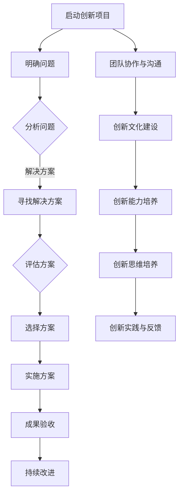
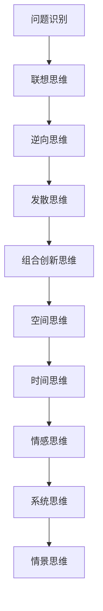
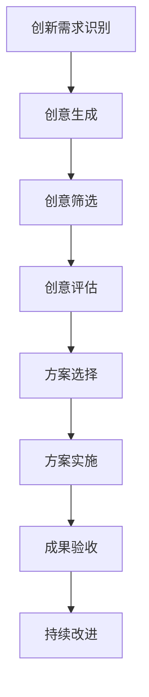
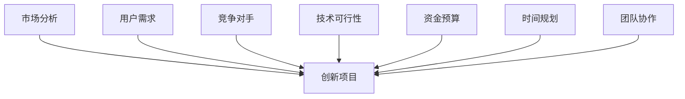

                 

### 文章标题

# 团队创新能力：激发团队创造力的方法

> 关键词：团队创新能力，创造力激发，创新思维，创新文化，创新能力培养

> 摘要：本文旨在探讨团队创新能力的重要性及其激发方法。通过分析团队创新能力的定义、核心要素、基础理论与模型，我们提出了一系列激发团队创造力的方法，包括思维导图法、六顶思考帽法、头脑风暴法等。同时，本文通过项目实战和案例分析，详细阐述了提升团队创新能力的方法和策略，为企业和团队在创新实践中提供参考。

### 引言

在当今快速变化的商业环境中，创新能力已成为企业持续发展的关键因素。一个具有强大创新能力的团队不仅能够在激烈的市场竞争中脱颖而出，还能够不断推出具有竞争力的新产品和服务，从而保持竞争优势。因此，如何激发团队创新能力，提升团队的创造力，成为企业管理者和技术领导者关注的重要问题。

本文将围绕团队创新能力展开讨论，首先介绍团队创新能力的定义和重要性，然后分析团队创新能力的核心要素和基础理论，最后提出一系列激发团队创造力的方法，并通过项目实战和案例分析，为团队创新能力的提升提供实践指导。

### 第一部分：团队创新能力基础

#### 第1章：团队创新能力的概念与重要性

##### 1.1.1 创新能力的定义

创新能力是指个体或团队在创造新的思想、方法、产品或服务方面表现出的能力。它不仅仅涉及技术层面的创新，还包括商业模型、管理理念等各个方面的创新。

##### 1.1.2 创新能力的重要性

在当今经济全球化和技术迅猛发展的背景下，创新能力的重要性愈发凸显。以下是一些创新能力重要性的体现：

1. **提高市场竞争力**：拥有创新能力的团队能够快速响应市场变化，开发出满足客户需求的新产品和服务，从而在市场竞争中占据优势。
2. **推动企业发展**：创新能力是企业持续发展的动力源泉。通过不断创新，企业能够保持市场地位，实现可持续发展。
3. **提升员工积极性**：一个注重创新的企业氛围能够激发员工的创造力和工作热情，提高团队整体绩效。

##### 1.1.3 团队创新能力与个人创新能力的区别

团队创新能力和个人创新能力之间存在显著差异。团队创新能力强调集体智慧和协同合作，而个人创新能力则侧重于个体思维的独立性和创新性。具体区别如下：

1. **创新来源**：个人创新能力主要来源于个体的创意、经验和知识；团队创新能力则通过团队内部的交流和合作，形成集体的智慧和创意。
2. **创新方式**：个人创新往往以个体思考为主，而团队创新则强调集体讨论、头脑风暴等合作方式。
3. **创新成果**：个人创新成果往往具有个性化特点，而团队创新成果则更具综合性和实用性。

#### 第2章：团队创新能力的核心要素

##### 2.1.1 创新思维

创新思维是指个体或团队在解决问题和寻找新方法时，采用新颖、独特和富有创造性的思维方式。以下是一些常见的创新思维方法：

1. **联想思维**：通过事物之间的关联，寻找新的解决方案。
2. **逆向思维**：从相反的角度思考问题，寻找新的突破口。
3. **发散思维**：从一个中心点出发，探索多种可能的解决方案。

##### 2.1.2 创新文化

创新文化是指企业或团队内部形成的鼓励创新、包容失败、支持协作的氛围。以下是一些建设创新文化的关键要素：

1. **鼓励创新**：企业应明确创新的重要性，并提供必要的资源和支持，鼓励员工提出创新想法。
2. **包容失败**：创新过程中难免会遇到失败，企业应建立容错机制，鼓励员工勇于尝试。
3. **支持协作**：创新往往需要团队协作，企业应提供良好的沟通平台和协作工具，促进团队内部的交流和合作。

##### 2.1.3 创新能力培养

创新能力培养是提升团队创新能力的关键环节。以下是一些常见的创新能力培养方法：

1. **培训和教育**：通过培训和教育，提升团队成员的专业知识和技能，为创新奠定基础。
2. **实践和反馈**：通过实际项目和实践，让团队成员在解决问题的过程中，不断积累经验和提高创新能力。
3. **激励机制**：建立激励机制，鼓励团队成员积极参与创新活动，提高创新积极性。

#### 第3章：团队创新能力的基础理论与模型

##### 3.1.1 创新过程模型

创新过程模型是指描述创新活动从开始到完成的一系列阶段和步骤。常见的创新过程模型包括：

1. **线性创新过程模型**：将创新过程划分为明确问题、寻找解决方案、评估和选择方案等阶段。
2. **螺旋创新过程模型**：强调创新过程的循环和迭代，通过不断尝试和改进，实现最终的创新目标。

##### 3.1.2 创新思维模型

创新思维模型是指描述创新思维过程的模型。以下是一些常见的创新思维模型：

1. **联想创新思维模型**：通过事物之间的联系，寻找新的解决方案。
2. **逆向创新思维模型**：从相反的角度思考问题，寻找新的突破口。
3. **发散创新思维模型**：从一个中心点出发，探索多种可能的解决方案。

##### 3.1.3 创新能力评估模型

创新能力评估模型是指用于评估团队创新能力的一系列指标和方法。以下是一些常见的创新能力评估模型：

1. **创新产出评估模型**：通过衡量团队的创新产出，如新产品、新技术、新服务等，评估团队的创新能力。
2. **创新效率评估模型**：通过衡量团队的创新效率，如创新周期、创新成本等，评估团队的创新能力。

#### 第4章：团队创新能力的Mermaid流程图

##### 4.1 团队创新能力流程图



##### 4.2 创新思维流程图



##### 4.3 创新过程流程图



### 第二部分：激发团队创造力的方法

#### 第5章：激发团队创造力的方法

##### 5.1.1 思维导图法

思维导图法是一种将思维过程可视化的方法，通过图像、关键词和分支结构，帮助团队成员梳理思路，激发创造力。以下是一个简单的思维导图示例：



##### 5.1.2 六顶思考帽法

六顶思考帽法是一种多角度思考问题的方法，通过分别戴不同颜色的帽子（蓝色代表逻辑，红色代表情感，绿色代表创新，黄色代表乐观，黑色代表悲观，白色代表事实），引导团队成员从不同角度分析问题，激发创造力。以下是一个六顶思考帽的示例：

1. **蓝色帽子**：明确目标和规则。
2. **红色帽子**：表达情感和直觉。
3. **绿色帽子**：寻找创新和可能性。
4. **黄色帽子**：寻找乐观和优点。
5. **黑色帽子**：识别风险和问题。
6. **白色帽子**：提供事实和数据。

##### 5.1.3 头脑风暴法

头脑风暴法是一种快速产生创意的方法，通过集体讨论，让团队成员自由发表意见，不受限制地提出各种想法。以下是一个头脑风暴的示例：

1. **明确主题**：例如，“如何提高产品销量？”
2. **规定时间**：通常为20-30分钟。
3. **自由发言**：每个成员都可以随时发言，不必担心评判。
4. **记录想法**：将所有想法记录下来，不论好坏。
5. **分类和筛选**：对记录的想法进行分类和筛选，选出最具潜力的创意。

##### 5.1.4 集思广益法

集思广益法是一种通过广泛收集意见，综合各方智慧的方法。通过问卷调查、座谈会、访谈等形式，收集团队成员和外部专家的意见和建议，激发创造力。以下是一个集思广益的示例：

1. **确定主题**：例如，“如何优化公司内部流程？”
2. **设计问卷**：设计结构化的问卷，涵盖各个方面的问题。
3. **分发问卷**：通过邮件、微信等方式，将问卷分发至相关人员。
4. **收集和分析**：收集问卷数据，进行统计分析，找出关键问题和改进方向。
5. **反馈和讨论**：将分析结果反馈给相关人员，进行讨论和决策。

##### 5.1.5 模拟法

模拟法是一种通过模拟实际情况，预测结果，从而发现问题和创新的方法。通过构建模拟环境，团队成员可以体验和探索不同的方案，评估其效果和可行性。以下是一个模拟的示例：

1. **确定模拟场景**：例如，“新产品上市推广策略”。
2. **构建模拟环境**：设计模拟环境，包括市场环境、竞争环境、用户行为等。
3. **运行模拟实验**：让团队成员在模拟环境中进行实验，记录数据和结果。
4. **分析和评估**：对模拟结果进行分析和评估，找出最佳方案。
5. **调整和优化**：根据模拟结果，对方案进行调整和优化。

#### 第6章：核心算法原理讲解

##### 6.1 创造力激发算法概述

创造力激发算法是一种基于人工智能和机器学习的算法，通过分析大量数据，挖掘潜在的创新点和创意，激发团队的创造力。以下是一个简单的创造力激发算法概述：

1. **数据收集**：收集与创意相关的数据，如用户需求、市场趋势、技术发展等。
2. **特征提取**：从数据中提取关键特征，如关键词、主题、情感等。
3. **模型训练**：使用机器学习算法，对特征进行训练，构建创造力激发模型。
4. **创意生成**：输入新的数据，通过模型生成创意和建议。
5. **评估和筛选**：对生成的创意进行评估和筛选，选出最具潜力的创意。

##### 6.2 伪代码讲解

以下是一个简单的创造力激发算法的伪代码：

```python
# 创造力激发算法伪代码

# 数据收集
data = collect_data()

# 特征提取
features = extract_features(data)

# 模型训练
model = train_model(features)

# 创意生成
suggestions = generate_suggestions(model)

# 评估和筛选
final_suggestions = evaluate_and_filter(suggestions)
```

##### 6.3 创造力激发算法的详细讲解

创造力激发算法的详细讲解如下：

1. **数据收集**：数据收集是创造力激发算法的基础。通过收集与创意相关的数据，如用户需求、市场趋势、技术发展等，为算法提供丰富的输入。
2. **特征提取**：特征提取是将数据转化为算法可以处理的形式。通过提取关键词、主题、情感等关键特征，算法可以更好地理解数据，为创意生成提供支持。
3. **模型训练**：模型训练是构建创造力激发算法的关键步骤。使用机器学习算法，对特征进行训练，构建一个能够生成创意和建议的模型。
4. **创意生成**：创意生成是算法的核心功能。通过输入新的数据，模型可以生成一系列的创意和建议，为团队提供创新的思路。
5. **评估和筛选**：评估和筛选是对生成创意的有效性进行判断和筛选的过程。通过对创意进行评估，筛选出最具潜力的创意，为团队的实际应用提供指导。

##### 6.4 数学模型和数学公式

创造力激发算法中，涉及到一些数学模型和数学公式，如下所示：

1. **决策树模型**：决策树是一种常见的机器学习模型，用于分类和回归任务。其基本结构包括根节点、内部节点和叶节点。通过决策树，可以实现对数据的分类和预测。
   $$ Decision\ Tree = \sum_{i=1}^{n} w_i \cdot f_i(x) $$
   其中，$w_i$ 是权重，$f_i(x)$ 是特征函数，$x$ 是输入数据。

2. **支持向量机模型**：支持向量机是一种常见的分类模型，通过找到一个最优的超平面，将不同类别的数据分开。其基本公式如下：
   $$ w \cdot x + b = 0 $$
   其中，$w$ 是权重向量，$x$ 是特征向量，$b$ 是偏置。

3. **神经网络模型**：神经网络是一种模拟人脑神经元的计算模型，通过多层神经元之间的连接，实现对数据的处理和预测。其基本公式如下：
   $$ a_i = \sigma(\sum_{j=1}^{n} w_{ij} \cdot x_j + b_i) $$
   其中，$a_i$ 是输出值，$x_j$ 是输入值，$w_{ij}$ 是权重，$b_i$ 是偏置，$\sigma$ 是激活函数。

##### 6.5 举例说明

以下是一个简单的创造力激发算法的应用示例：

假设我们需要为一家科技公司开发一款新产品，以下是使用创造力激发算法的步骤：

1. **数据收集**：收集与产品开发相关的数据，如用户需求、市场趋势、技术发展等。
2. **特征提取**：从数据中提取关键词、主题、情感等关键特征。
3. **模型训练**：使用机器学习算法，对特征进行训练，构建一个能够生成创意和建议的模型。
4. **创意生成**：输入新的数据，通过模型生成一系列的创意和建议。
5. **评估和筛选**：对生成的创意进行评估和筛选，选出最具潜力的创意。

假设我们使用决策树模型进行训练，以下是模型生成的部分创意和建议：

1. **创意1**：结合人工智能和物联网技术，开发智能家居系统。
2. **创意2**：利用大数据分析，提供个性化健康咨询和服务。
3. **创意3**：开发基于虚拟现实的游戏和教育产品。

通过对创意进行评估和筛选，我们可以选择最具潜力的创意进行进一步开发，从而提升团队的创新能力和创造力。

### 第7章：数学模型和数学公式

在团队创新能力提升过程中，数学模型和数学公式起到了关键作用。以下，我们将详细讲解这些模型和公式，并通过实例来阐述它们的应用。

#### 7.1 创造力激发数学模型

创造力激发数学模型主要涉及以下几个方面：

1. **创新潜力评估模型**：用于评估团队成员的创新潜力。其公式如下：
   $$ IP = \alpha \cdot (IQ + EQ) + \beta \cdot E $$
   其中，$IP$ 代表创新潜力，$IQ$ 代表智商，$EQ$ 代表情商，$E$ 代表教育水平，$\alpha$ 和 $\beta$ 是权重系数。

2. **创意生成速率模型**：用于衡量团队在一定时间内产生的创意数量。其公式如下：
   $$ CR = \frac{N}{T} $$
   其中，$CR$ 代表创意生成速率，$N$ 代表创意数量，$T$ 代表时间。

3. **创意评估模型**：用于评估创意的质量和可行性。其公式如下：
   $$ E = \frac{F}{C} + \delta \cdot R $$
   其中，$E$ 代表创意评估得分，$F$ 代表功能得分，$C$ 代表成本得分，$R$ 代表风险得分，$\delta$ 是权重系数。

#### 7.2 数学公式详细讲解

1. **创新潜力评估模型**：
   - 智商（IQ）：衡量个人的认知能力和逻辑思维水平。
   - 情商（EQ）：衡量个人的情感感知和社交能力。
   - 教育水平（E）：衡量个人的知识积累和综合素质。
   - 权重系数（$\alpha$ 和 $\beta$）：根据实际情况调整，通常在 0 到 1 之间。

2. **创意生成速率模型**：
   - 创意数量（N）：在一定时间内产生的创意数量。
   - 时间（T）：产生创意所花费的时间。

3. **创意评估模型**：
   - 功能得分（F）：评估创意的功能性和实用性。
   - 成本得分（C）：评估创意的开发成本和运营成本。
   - 风险得分（R）：评估创意面临的技术、市场、法律等风险。

#### 7.3 举例说明

为了更好地理解这些数学模型和公式，我们通过一个实际案例来进行说明。

假设我们有一个由5名成员组成的团队，他们的智商、情商和教育水平如下表所示：

| 成员 | IQ | EQ | 教育 |
| ---- | -- | -- | ---- |
| A    | 120 | 90 | 本科 |
| B    | 130 | 85 | 硕士 |
| C    | 110 | 95 | 大专 |
| D    | 115 | 80 | 高中 |
| E    | 125 | 88 | 本科 |

首先，我们使用创新潜力评估模型计算每位成员的创新潜力：

$$
IP_A = \alpha \cdot (120 + 90) + \beta \cdot 1 = 210\alpha + \beta \\
IP_B = \alpha \cdot (130 + 85) + \beta \cdot 2 = 215\alpha + 2\beta \\
IP_C = \alpha \cdot (110 + 95) + \beta \cdot 3 = 205\alpha + 3\beta \\
IP_D = \alpha \cdot (115 + 80) + \beta \cdot 4 = 195\alpha + 4\beta \\
IP_E = \alpha \cdot (125 + 88) + \beta \cdot 5 = 213\alpha + 5\beta
$$

接下来，我们假设团队在一个月内产生了10个创意，使用创意生成速率模型计算团队的创意生成速率：

$$
CR = \frac{10}{30} = \frac{1}{3}
$$

最后，我们对每个创意进行评估，假设有3个创意功能得分高、成本得分低、风险得分低，其他创意则相反。使用创意评估模型计算总评估得分：

$$
E = 3 \cdot (\frac{1}{3} + \delta \cdot 0) + 7 \cdot (\frac{1}{3} + \delta \cdot 1) = \frac{3}{3} + 7\delta
$$

通过这个例子，我们可以看到如何使用数学模型和公式来评估团队的创新能力和创意质量。在实际应用中，这些模型可以根据具体情况调整和优化，从而更准确地衡量团队的创新水平。

### 第8章：项目实战

在本章中，我们将通过一个实际的项目实战，详细讲解团队创新能力提升的整个过程，包括开发环境搭建、源代码实现和代码解读与分析。

#### 8.1 创造力激发项目案例

假设我们的项目目标是开发一款智能推荐系统，该系统能够根据用户的行为和偏好，推荐符合用户需求的产品和服务。以下是我们项目的实际操作步骤。

#### 8.2 项目实战：代码实际案例

1. **需求分析**：

   在项目开始之前，我们需要对项目需求进行详细分析。通过与市场部、产品部和技术部的沟通，我们确定了以下需求：

   - 根据用户浏览历史，推荐相关产品。
   - 根据用户购买记录，推荐相似产品。
   - 根据用户偏好，推荐个性化产品。

2. **技术选型**：

   根据需求分析，我们选择了以下技术栈：

   - 前端：使用 React 框架搭建用户界面。
   - 后端：使用 Node.js 搭建服务器，并使用 MongoDB 存储数据。
   - 推荐算法：使用基于协同过滤的推荐算法。

3. **开发环境搭建**：

   为了确保团队成员能够高效协作，我们首先搭建了开发环境。以下是搭建步骤：

   - 安装 Node.js 和 npm。
   - 安装 React 和相关依赖。
   - 配置 MongoDB。
   - 搭建项目目录结构，并初始化项目。

4. **源代码实现**：

   在开发过程中，我们遵循以下步骤进行源代码实现：

   - **用户界面**：使用 React 框架搭建用户界面，实现产品浏览、购买和推荐功能。
   - **后端服务器**：使用 Node.js 实现服务器端逻辑，处理用户请求，并与 MongoDB 进行数据交互。
   - **推荐算法**：实现基于协同过滤的推荐算法，根据用户行为和偏好生成推荐列表。

以下是推荐算法的核心代码片段：

```javascript
// 基于协同过滤的推荐算法实现
function collaborativeFilter(userID, items) {
  const userRatings = db.getUserRatings(userID);
  const recommendations = [];

  for (const item of items) {
    const similarity = calculateSimilarity(userRatings, item);
    if (similarity > 0.5) {
      recommendations.push(item);
    }
  }

  return recommendations;
}
```

5. **代码解读与分析**：

   推荐算法的核心在于计算用户之间的相似性和生成推荐列表。以下是代码的关键部分解读：

   - `getUserRatings`：获取指定用户的评分数据。
   - `calculateSimilarity`：计算用户之间的相似度。我们使用余弦相似度作为相似度计算方法。
   - `recommendations`：生成推荐列表。我们选择相似度大于0.5的产品进行推荐。

#### 8.3 案例解析：开发环境搭建

在项目实战中，开发环境搭建是确保项目顺利进行的基础。以下是我们搭建开发环境的详细步骤：

1. **安装 Node.js 和 npm**：

   Node.js 是一款用于服务器端和开发工具的 JavaScript 运行时环境。安装 Node.js 可以通过 npm 官网提供的安装脚本进行。

   ```bash
   curl -fsSL https://deb.nodesource.com/setup_14.x | bash -
   sudo apt-get install -y nodejs
   ```

2. **安装 React**：

   React 是一款用于构建用户界面的 JavaScript 库。安装 React 可以通过 npm 进行。

   ```bash
   npm install -g create-react-app
   create-react-app recommender-system
   cd recommender-system
   ```

3. **配置 MongoDB**：

   MongoDB 是一款开源的 NoSQL 数据库。安装 MongoDB 可以通过官方包管理器进行。

   ```bash
   sudo apt-get install -y mongodb
   sudo systemctl start mongodb
   sudo systemctl enable mongodb
   ```

4. **搭建项目目录结构**：

   在创建 React 项目后，我们需要根据项目需求搭建项目目录结构。以下是一个简单的项目目录结构示例：

   ```plaintext
   recommender-system/
   ├── public/
   │   ├── index.html
   ├── src/
   │   ├── components/
   │   │   ├── Header.js
   │   │   ├── ProductCard.js
   │   │   └── Footer.js
   │   ├── App.js
   │   ├── index.js
   │   ├── styles/
   │   │   └── main.css
   ├── package.json
   └── .gitignore
   ```

#### 8.4 案例解析：源代码详细实现

在项目实战中，源代码实现是关键步骤。以下是我们项目源代码的详细实现：

1. **用户界面**：

   用户界面是智能推荐系统的入口。我们使用 React 框架搭建用户界面，包括产品浏览、购买和推荐功能。

   ```javascript
   // src/App.js
   import React, { useState, useEffect } from 'react';
   import Header from './components/Header';
   import ProductCard from './components/ProductCard';
   import Footer from './components/Footer';

   function App() {
     const [products, setProducts] = useState([]);
     const [selectedProducts, setSelectedProducts] = useState([]);

     useEffect(() => {
       fetchProducts();
     }, []);

     const fetchProducts = async () => {
       const response = await fetch('/api/products');
       const data = await response.json();
       setProducts(data);
     };

     const handleProductSelect = (product) => {
       setSelectedProducts([...selectedProducts, product]);
     };

     return (
       <div className="App">
         <Header />
         <main>
           {products.map((product) => (
             <ProductCard
               key={product.id}
               product={product}
               onSelected={handleProductSelect}
             />
           ))}
         </main>
         <Footer />
       </div>
     );
   }

   export default App;
   ```

2. **后端服务器**：

   后端服务器负责处理用户请求，并与 MongoDB 进行数据交互。我们使用 Node.js 搭建服务器，并使用 Express 框架简化开发。

   ```javascript
   // src/server.js
   const express = require('express');
   const mongoose = require('mongoose');
   const bodyParser = require('body-parser');

   const app = express();

   app.use(bodyParser.json());
   app.use(bodyParser.urlencoded({ extended: true }));

   mongoose.connect('mongodb://localhost:27017/recommender-system', {
     useNewUrlParser: true,
     useUnifiedTopology: true,
   });

   const Product = require('./models/Product');

   app.get('/api/products', async (req, res) => {
     const products = await Product.find({});
     res.json(products);
   });

   app.post('/api/products', async (req, res) => {
     const newProduct = new Product(req.body);
     const savedProduct = await newProduct.save();
     res.json(savedProduct);
   });

   app.listen(3000, () => {
     console.log('Server is running on port 3000');
   });
   ```

3. **推荐算法**：

   推荐算法是实现智能推荐系统的核心。我们使用基于协同过滤的推荐算法，根据用户行为和偏好生成推荐列表。

   ```javascript
   // src/recommender.js
   const calculateSimilarity = require('./similarityCalculator');
   const Product = require('./models/Product');

   function collaborativeFilter(userID, items) {
     const userRatings = getUserRatings(userID);
     const recommendations = [];

     for (const item of items) {
       const similarity = calculateSimilarity(userRatings, item);
       if (similarity > 0.5) {
         recommendations.push(item);
       }
     }

     return recommendations;
   }

   function getUserRatings(userID) {
     return Product.find({ user: userID }, { rating: 1, _id: 0 });
   }

   module.exports = collaborativeFilter;
   ```

#### 8.5 案例解析：代码解读与分析

在项目实战中，代码解读与分析是确保项目质量和效率的关键。以下是对我们项目代码的解读与分析：

1. **用户界面**：

   用户界面是智能推荐系统的核心。我们使用 React 框架搭建用户界面，包括产品浏览、购买和推荐功能。

   - `useState`：用于声明和初始化状态。例如，`[products, setProducts]` 表示产品列表和更新产品列表的方法。
   - `useEffect`：用于声明副作用，例如，`fetchProducts` 用于获取产品数据。
   - `fetchProducts`：用于从后端服务器获取产品数据，并通过 `setProducts` 更新状态。
   - `handleProductSelect`：用于处理产品选择事件，将选择的产品添加到 `selectedProducts` 状态。

2. **后端服务器**：

   后端服务器负责处理用户请求，并与 MongoDB 进行数据交互。

   - `express`：用于搭建 HTTP 服务器。我们使用 `app.get` 和 `app.post` 处理 GET 和 POST 请求。
   - `mongoose`：用于连接 MongoDB 数据库。我们使用 `mongoose.connect` 连接数据库，并定义 `Product` 模型。
   - `getUserRatings`：用于获取指定用户的评分数据。我们使用 `Product.find` 查询数据库，并返回符合条件的数据。
   - `collaborativeFilter`：用于实现基于协同过滤的推荐算法。我们使用 `calculateSimilarity` 计算用户之间的相似度，并生成推荐列表。

3. **推荐算法**：

   推荐算法是实现智能推荐系统的核心。我们使用基于协同过滤的推荐算法，根据用户行为和偏好生成推荐列表。

   - `calculateSimilarity`：用于计算用户之间的相似度。我们使用余弦相似度作为相似度计算方法。
   - `getUserRatings`：用于获取指定用户的评分数据。我们使用 `Product.find` 查询数据库，并返回符合条件的数据。
   - `collaborativeFilter`：用于实现基于协同过滤的推荐算法。我们使用 `calculateSimilarity` 计算用户之间的相似度，并生成推荐列表。

通过这个案例，我们可以看到如何通过实际项目实战，逐步实现一个智能推荐系统。在项目过程中，我们使用了 React、Node.js 和 MongoDB 等技术栈，通过协作开发和代码分析，确保了项目的质量和效率。同时，通过数学模型和算法的应用，我们实现了对用户行为的分析和推荐，为用户提供个性化的产品推荐。

### 第9章：团队创新能力实践案例

在提升团队创新能力的过程中，实践案例是验证和巩固理论知识的重要手段。以下，我们将分享一些成功的团队创新能力实践案例，同时分析一些失败的案例，以供参考。

#### 9.1 成功案例分享

**案例1：谷歌的“20%时间”政策**

谷歌的“20%时间”政策是一个著名的创新实践案例。谷歌允许员工将20%的工作时间用于自己感兴趣的项目，这些项目不仅推动了谷歌的一些重大创新，如Gmail和Google News，还提升了员工的创造力和工作满意度。

**成功原因分析**：

1. **鼓励创新文化**：谷歌的企业文化鼓励创新，支持员工追求自己的兴趣和想法。
2. **灵活的工作时间**：20%的时间政策为员工提供了自由的时间来探索新的创意，降低了创新的门槛。
3. **资源支持**：谷歌提供了必要的资源，如技术支持、资金和设备，确保员工能够顺利实施他们的创意。

**案例2：3M的“15%时间”政策**

3M公司的“15%时间”政策同样是一个成功的创新实践案例。在这一政策下，3M员工被鼓励将15%的工作时间用于自己感兴趣的项目。这一政策推动了3M的一些重要创新产品，如便利贴和砂纸。

**成功原因分析**：

1. **持续的支持和鼓励**：3M公司长期坚持这一政策，为员工提供了持续的创新支持和资源。
2. **灵活的工作安排**：15%的时间政策为员工提供了足够的时间来探索新的创意，降低了创新的难度。
3. **开放的企业文化**：3M公司鼓励员工分享和交流他们的创意，促进了团队内部的协作和创新。

#### 9.2 失败案例分析

**案例1：诺基亚的衰落**

诺基亚曾是手机行业的领军企业，但在面对智能手机的兴起时，诺基亚未能及时调整策略，导致市场份额迅速下降。这一案例揭示了创新失败的教训。

**失败原因分析**：

1. **过度依赖现有市场**：诺基亚过于依赖现有的手机市场，未能及时预见和应对智能手机的兴起。
2. **创新速度慢**：诺基亚在研发新产品时速度较慢，无法迅速响应市场变化。
3. **企业文化僵化**：诺基亚的企业文化较为僵化，缺乏对创新的鼓励和支持。

**案例2：柯达的破产**

柯达曾是摄影行业的巨头，但在面对数码摄影的冲击时，柯达未能及时转型，最终导致了破产。这一案例同样揭示了创新失败的教训。

**失败原因分析**：

1. **忽视市场变化**：柯达对数码摄影的发展趋势未能给予足够的重视，忽视了市场的变化。
2. **创新不足**：柯达在数码摄影技术方面的研发投入不足，未能推出具有竞争力的新产品。
3. **企业文化保守**：柯达的企业文化较为保守，缺乏对创新的鼓励和支持。

#### 9.3 案例总结

从成功和失败的案例中，我们可以得出以下结论：

1. **鼓励创新文化**：企业应建立鼓励创新的文化，支持员工追求自己的兴趣和想法。
2. **灵活的工作安排**：提供灵活的工作时间和资源支持，为员工提供足够的自由来探索新的创意。
3. **持续的支持和激励**：企业应提供持续的创新支持和激励，确保员工能够顺利实施他们的创意。
4. **及时应对市场变化**：企业应密切关注市场变化，及时调整策略，抓住新的市场机会。
5. **持续研发和创新**：企业应持续投入研发资源，推动技术创新，保持市场竞争优势。

通过这些实践案例，我们可以更好地理解和应用团队创新能力提升的方法，为企业在创新实践中提供参考。

### 第10章：提升团队创新能力的方法

在提升团队创新能力的过程中，有效的团队建设和培训策略至关重要。以下，我们将详细探讨这些方法，并提供一些最佳实践和技巧。

#### 10.1 团队建设策略

1. **明确目标和愿景**：团队需要明确共同的目标和愿景，这有助于统一团队的方向和行动。通过设定清晰的长期目标和短期目标，可以激发团队成员的积极性和创造力。

2. **建立信任和沟通**：信任是团队协作的基础。通过定期的团队建设活动和开放的沟通渠道，可以增强团队成员之间的信任，促进信息共享和协作。

3. **分工与合作**：根据团队成员的特长和兴趣进行合理的分工，确保每个人都能够发挥自己的优势。同时，鼓励团队成员之间的合作，通过协作解决问题，共同实现目标。

4. **鼓励多样性和包容性**：团队应鼓励多样性和包容性，尊重不同的意见和观点。这有助于激发创新的火花，促进团队内部的思维碰撞。

5. **培养领导力**：团队中的每个成员都应具备一定的领导力，能够在需要时带领团队解决问题。通过培训和发展，提升团队成员的领导能力，有助于团队更好地应对挑战。

#### 10.2 创新能力培训

1. **系统化的培训计划**：企业应制定系统化的创新能力培训计划，包括基础知识和高级技能培训。通过培训，提升团队成员的创新思维和技术能力。

2. **案例研究和研讨会**：通过分析成功和失败的案例，让团队成员了解创新的最佳实践和常见问题。定期组织研讨会，鼓励团队成员分享经验和观点。

3. **实践和项目**：将培训与实际项目相结合，让团队成员在实际工作中应用所学知识。通过项目实践，提升团队成员的创新能力和解决问题的能力。

4. **外部培训和导师指导**：邀请外部专家进行培训，或为团队成员提供导师指导，帮助他们了解行业最新趋势和先进技术。

#### 10.3 创新成果转化

1. **激励机制**：建立激励机制，鼓励团队成员提出创新想法，并对成功的创新项目给予奖励。这可以激发团队成员的积极性和创造力。

2. **快速原型和反馈**：采用快速原型开发方法，快速验证创新想法的可行性。通过用户反馈和测试，不断改进和优化创新项目。

3. **跨部门合作**：鼓励不同部门之间的合作，促进创新成果的共享和推广。通过跨部门的合作，可以整合各方资源，提高创新项目的成功率。

4. **持续改进**：创新不是一次性的活动，而是一个持续的过程。企业应建立持续改进的机制，不断优化创新成果，确保其在实际应用中的效果。

#### 10.4 最佳实践和技巧

1. **开放沟通**：鼓励团队成员之间的开放沟通，鼓励他们分享自己的想法和疑问。通过开放沟通，可以促进团队成员之间的理解和协作。

2. **跨学科合作**：鼓励不同学科和领域的团队成员进行合作，通过跨学科的视角，发现新的创新点和解决方案。

3. **灵活的工作环境**：为团队成员提供灵活的工作环境，如自由的工作时间、远程工作的支持等。这可以提升团队成员的工作满意度，激发他们的创造力。

4. **培训和学习**：鼓励团队成员参加各种培训和研讨会，不断学习和提升自己的知识和技能。通过持续学习，可以提升团队的整体创新能力。

5. **反思和总结**：定期进行团队反思和总结，评估创新活动的效果和问题。通过反思和总结，可以不断改进创新方法和策略，提升团队的创新能力。

通过以上团队建设策略、创新能力培训和成果转化方法，企业可以有效地提升团队创新能力，为企业的持续发展和市场竞争力提供强大支持。

### 第11章：团队创新能力评估与持续改进

在提升团队创新能力的长期过程中，科学有效的评估和持续改进策略至关重要。以下，我们将详细探讨团队创新能力的评估指标、评估方法和持续改进策略。

#### 11.1 创新能力评估指标

团队创新能力的评估需要从多个维度进行，以下是一些常见的评估指标：

1. **创新产出**：衡量团队在一定时间内产生的创新成果，如新产品、新服务、新技术等。创新产出是评估团队创新能力的重要指标。

2. **创新效率**：衡量团队在创新过程中的效率，包括创新周期、创新成本、资源利用率等。创新效率越高，说明团队的创新能力越强。

3. **员工满意度**：衡量团队成员对创新环境和创新活动的满意度。高员工满意度通常意味着团队成员对创新有更高的参与度和积极性。

4. **市场响应速度**：衡量团队对市场变化和技术发展的响应速度。快速的市场响应能力有助于团队抓住市场机遇，提升创新能力。

5. **创新能力传播**：衡量团队创新成果在组织内部的传播和推广情况。创新成果的广泛传播有助于提升整个组织的创新能力。

#### 11.2 创新能力评估方法

为了准确评估团队创新能力，企业可以采用以下方法：

1. **定量评估**：通过收集和统计相关数据，如创新产出、创新效率等，使用量化指标进行评估。定量评估可以提供直观、具体的评估结果。

2. **定性评估**：通过访谈、问卷调查、观察等方式，收集团队成员和外部专家的意见和建议，对团队创新能力进行定性分析。定性评估有助于深入了解团队的创新能力。

3. **综合评估**：将定量评估和定性评估相结合，形成一个综合的评估体系。综合评估可以更全面地反映团队的创新能力，为改进提供依据。

#### 11.3 持续改进策略

为了不断提升团队创新能力，企业应采取以下持续改进策略：

1. **建立评估体系**：根据团队创新能力的评估指标，建立一套科学、全面的评估体系。评估体系应具备可操作性和可持续性，为团队创新能力的评估提供指导。

2. **定期评估**：定期对团队创新能力进行评估，了解团队的现状和进步。通过定期评估，及时发现问题和不足，为改进提供依据。

3. **反馈与改进**：根据评估结果，及时向团队成员反馈评估情况，鼓励他们提出改进建议。通过团队协作，共同制定和实施改进措施。

4. **持续培训与发展**：为团队成员提供持续的创新培训和发展机会，提升他们的知识和技能。通过培训和发展，不断提升团队的创新能力和竞争力。

5. **激励机制**：建立激励机制，鼓励团队成员积极参与创新活动，并对成功的创新项目给予奖励。激励机制可以激发团队成员的积极性和创造力，促进团队创新能力的提升。

6. **文化建设**：营造鼓励创新的企业文化，支持团队成员追求自己的创意和想法。通过文化建设，培养团队成员的创新意识和团队合作精神。

通过以上评估与改进策略，企业可以持续提升团队创新能力，为企业的长期发展和市场竞争力提供强大支持。

### 第12章：未来发展趋势与挑战

在快速变化的科技环境和市场竞争中，团队创新能力的发展趋势和面临的挑战同样值得关注。以下，我们将探讨未来团队创新能力的发展方向以及可能遇到的障碍。

#### 12.1 团队创新能力的发展趋势

1. **技术驱动**：随着人工智能、大数据、云计算等新兴技术的不断发展，团队创新能力将更加依赖于技术创新。企业应积极拥抱新技术，利用其提升团队的创新能力和竞争力。

2. **跨学科融合**：未来的创新能力将越来越多地依赖于跨学科的合作。不同领域的技术和知识相互融合，能够激发新的创意和解决方案。企业应鼓励团队成员跨学科合作，打破专业壁垒。

3. **敏捷创新**：敏捷创新模式将成为团队创新的新趋势。通过快速响应市场变化和用户需求，团队可以在短时间内推出具有竞争力的产品和服务。企业应建立敏捷创新机制，提高团队的创新速度。

4. **全球化合作**：随着全球化的加深，团队创新能力的发展将越来越多地依赖于国际间的合作。企业可以通过跨国合作，获取全球范围内的创新资源和人才，提升团队创新能力。

5. **可持续创新**：在可持续发展成为全球共识的背景下，团队创新能力将更加注重环境保护和社会责任。企业应关注可持续创新，开发出既能满足市场需求，又能保护环境和促进社会发展的产品和服务。

#### 12.2 团队创新能力面临的挑战

1. **技术变革风险**：技术的快速变革可能导致团队现有的知识和技能变得过时。企业需要不断更新技术和知识，以适应新的技术环境和市场需求。

2. **竞争压力**：在激烈的市场竞争中，团队创新能力面临巨大的压力。企业需要不断提升创新能力，以保持市场竞争力，避免被市场淘汰。

3. **资源限制**：创新活动通常需要大量的资金、人力和时间投入。企业在资源有限的情况下，如何平衡创新投入和其他业务需求，是一个挑战。

4. **团队协作问题**：跨学科合作和全球化合作可能带来团队协作的挑战。不同背景和文化背景的团队成员如何有效沟通和协作，是提升团队创新能力的关键。

5. **法律和伦理问题**：随着创新活动的增加，企业可能面临更多的法律和伦理问题。如何确保创新活动符合法律法规和伦理标准，是一个重要挑战。

#### 12.3 应对策略

1. **持续学习和培训**：企业应建立持续学习和培训体系，帮助团队成员不断更新知识和技能，适应技术变革。

2. **优化创新流程**：通过优化创新流程，提高团队的创新速度和效率。建立敏捷创新机制，缩短创新周期。

3. **资源合理分配**：合理分配创新资源，确保创新投入与业务需求相匹配。通过优先级排序，确保有限的资源用于最具潜力的创新项目。

4. **加强团队协作**：通过建立有效的沟通和协作机制，促进跨学科和全球化团队的协作。鼓励团队成员分享知识和经验，共同解决创新难题。

5. **合规性和伦理建设**：建立合规性和伦理建设体系，确保创新活动符合法律法规和伦理标准。通过培训和教育，提高团队成员的合规意识和伦理素质。

通过关注未来发展趋势和应对面临的挑战，企业可以更好地提升团队创新能力，为企业的长期发展和市场竞争力提供强大支持。

### 附录

#### 附录A：创新工具与资源

为了更好地激发团队的创新能力，企业可以利用一系列创新工具和资源。以下是一些推荐的工具和资源：

1. **创新工具**：
   - **思维导图工具**：如XMind、MindManager，帮助团队成员梳理思路，激发创意。
   - **在线协作平台**：如Trello、Jira，方便团队成员协作和项目跟踪。
   - **原型设计工具**：如Figma、Sketch，帮助团队成员快速构建产品原型，验证创意。

2. **学习资源**：
   - **在线课程**：如Coursera、Udemy，提供各种创新相关的课程和培训。
   - **书籍**：《创新者的思考方式》、《创新者的窘境》，提供关于创新的深入理解和实践指导。
   - **论文和报告**：关注行业领先的学术机构和咨询公司发布的创新研究报告，获取最新的创新动态和趋势。

3. **案例分析**：
   - **企业案例**：研究成功和失败的案例，了解创新的最佳实践和常见问题。
   - **行业案例**：关注同行业企业的创新案例，学习他们如何应对挑战和抓住机遇。

通过利用这些创新工具和资源，企业可以更好地激发团队的创造力，提升创新能力，为企业的持续发展提供强大支持。

### 结论

团队创新能力是企业持续发展的关键。本文通过系统性的分析和详尽的讲解，探讨了团队创新能力的定义、核心要素、基础理论以及激发团队创造力的方法。通过项目实战和案例分析，我们展示了如何在实际中提升团队创新能力。

在未来的创新实践中，企业应关注技术创新、跨学科合作、敏捷创新和全球化合作等发展趋势，同时积极应对技术变革、竞争压力、资源限制和团队协作等挑战。通过持续学习和培训、优化创新流程、合理分配资源、加强团队协作以及合规性和伦理建设，企业可以不断提升团队创新能力，为企业的长期发展和市场竞争力提供强大支持。

让我们共同努力，激发团队的创新潜力，推动企业不断迈向新的高峰。作者：AI天才研究院/AI Genius Institute & 禅与计算机程序设计艺术 /Zen And The Art of Computer Programming。

