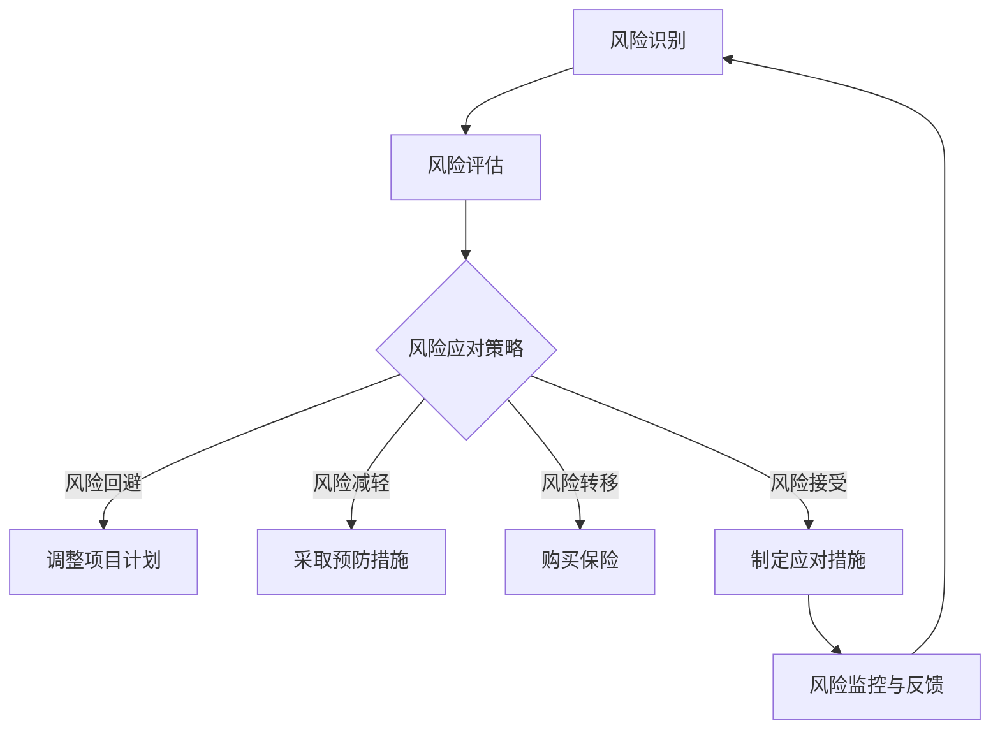

                 

### 文章标题

# 《团队协作：打造无缝配合的团队》

### 关键词

- 团队协作
- 无缝配合
- 团队模型
- 领导力
- 项目管理
- 跨团队协作

### 摘要

在当今快速变化的技术和商业环境中，高效团队协作是组织成功的关键。本文深入探讨了团队协作的理论基础、核心要素、协作模型与方法，以及团队协作环境建设、项目管理和跨团队协作等内容。通过分析团队协作中的障碍与挑战，提供了有效的解决策略和最佳实践，为打造无缝配合的团队提供了实用的指导。文章旨在帮助读者理解团队协作的重要性，掌握团队协作的理论与实践方法，从而提升团队整体效率和创新能力。

---

### 《团队协作：打造无缝配合的团队》目录大纲

#### 第一部分：团队协作理论基础

**第1章：团队协作概述**

- 1.1 团队协作的定义与重要性
- 1.1.1 团队协作的概念
- 1.1.2 团队协作的重要性
- 1.1.3 团队协作的类型

- 1.2 团队协作理论的发展
- 1.2.1 团队协作理论的历史演进
- 1.2.2 团队协作理论的核心观点
- 1.2.3 团队协作理论的最新趋势

- 1.3 团队协作的障碍与挑战
- 1.3.1 团队协作中的障碍
- 1.3.2 团队协作的挑战
- 1.3.3 如何克服团队协作中的障碍与挑战

**第2章：团队协作核心要素**

- 2.1 团队成员的角色与职责
- 2.1.1 团队成员的角色
- 2.1.2 团队成员的职责
- 2.1.3 团队成员之间的相互依赖

- 2.2 有效沟通在团队协作中的作用
- 2.2.1 沟通的定义与类型
- 2.2.2 沟通技巧
- 2.2.3 如何建立有效的沟通渠道

- 2.3 团队合作中的冲突管理与解决
- 2.3.1 冲突的定义与类型
- 2.3.2 冲突管理的策略
- 2.3.3 如何解决团队中的冲突

**第3章：团队协作模型与方法**

- 3.1 团队协作模型
- 3.1.1 团队协作模型的类型
- 3.1.2 团队协作模型的应用场景
- 3.1.3 如何选择合适的团队协作模型

- 3.2 团队协作方法
- 3.2.1 团队协作工具
- 3.2.2 团队协作流程
- 3.2.3 团队协作的最佳实践

- 3.3 团队协作中的领导力
- 3.3.1 团队领导的定义与角色
- 3.3.2 团队领导的技能
- 3.3.3 团队领导的挑战与应对策略

#### 第二部分：团队协作实践

**第4章：团队协作环境建设**

- 4.1 团队协作环境的构建
- 4.1.1 团队协作环境的要素
- 4.1.2 如何创建有利的团队协作环境
- 4.1.3 团队协作环境的持续优化

- 4.2 团队协作文化的培育
- 4.2.1 团队协作文化的概念
- 4.2.2 培育团队协作文化的策略
- 4.2.3 团队协作文化的评估与改进

- 4.3 团队协作中的个人成长与发展
- 4.3.1 团队协作对个人成长的影响
- 4.3.2 如何促进团队协作中的个人成长
- 4.3.3 个人成长与团队协作的相互促进

**第5章：团队协作中的项目管理**

- 5.1 项目管理的角色与职责
- 5.1.1 项目管理的定义与重要性
- 5.1.2 项目管理的角色
- 5.1.3 项目管理的职责

- 5.2 项目计划与执行
- 5.2.1 项目计划的内容与步骤
- 5.2.2 项目计划的制定与优化
- 5.2.3 项目执行中的问题与解决方案

- 5.3 项目监控与评估
- 5.3.1 项目监控的方法与工具
- 5.3.2 项目评估的指标与标准
- 5.3.3 项目评估的结果与应用

- 5.4 团队协作中的风险管理
- 5.4.1 风险管理的定义与目的
- 5.4.2 风险识别与评估
- 5.4.3 风险应对策略

**第6章：跨团队协作**

- 6.1 跨团队协作的挑战
- 6.1.1 跨团队协作的定义与特点
- 6.1.2 跨团队协作中的挑战
- 6.1.3 跨团队协作的解决策略

- 6.2 跨团队协作的最佳实践
- 6.2.1 跨团队协作的模式与机制
- 6.2.2 跨团队协作的工具与平台
- 6.2.3 跨团队协作的成功案例

- 6.3 跨文化协作
- 6.3.1 跨文化协作的定义与重要性
- 6.3.2 跨文化协作中的文化差异
- 6.3.3 跨文化协作的策略与技巧

**第7章：团队协作中的创新与变革**

- 7.1 团队协作与创新的联系
- 7.1.1 创新的定义与类型
- 7.1.2 团队协作在创新中的作用
- 7.1.3 团队协作促进创新的策略

- 7.2 变革管理与团队协作
- 7.2.1 变革管理的定义与目的
- 7.2.2 变革管理的角色与职责
- 7.2.3 变革管理的策略与技巧

- 7.3 团队协作中的持续改进
- 7.3.1 持续改进的概念与意义
- 7.3.2 持续改进的方法与工具
- 7.3.3 团队协作中的持续改进实践

**第8章：团队协作的未来趋势**

- 8.1 数字化与团队协作
- 8.1.1 数字化转型的定义与影响
- 8.1.2 数字化团队协作的优势与挑战
- 8.1.3 数字化团队协作的未来趋势

---

### 第一部分：团队协作理论基础

#### 第1章：团队协作概述

### 1.1 团队协作的定义与重要性

团队协作是现代组织中不可或缺的一部分，尤其在快速变化和高度竞争的商业环境中，它成为组织成功的关键因素。团队协作不仅关乎任务的高效完成，更关乎团队成员的共同成长和组织的可持续发展。

**1.1.1 团队协作的概念**

团队协作是指多个个体在相互依存的基础上，为实现共同的目标而进行协调和合作的过程。它涉及以下几个方面：

- **共同目标**：团队协作始于明确的目标设定，目标是团队前进的动力和方向。
- **角色与职责**：每个团队成员都有明确的角色和职责，角色和职责的合理分配是团队协作的基础。
- **相互依赖**：团队成员之间相互依赖，通过协作和共享资源，实现共同目标的达成。
- **沟通与协调**：良好的沟通和协调是团队协作的核心，它确保信息畅通无阻，减少误解和冲突。

**1.1.2 团队协作的重要性**

团队协作在组织中的重要性体现在以下几个方面：

- **提升效率**：通过团队协作，可以充分利用团队成员的专业技能和经验，提高任务完成的效率。
- **增强创新能力**：团队协作促进知识的共享和思维的碰撞，有助于创新想法的产生和实施。
- **增强团队凝聚力**：团队协作有助于增强团队成员之间的信任和尊重，提高团队的凝聚力和归属感。
- **提升组织竞争力**：高效的团队协作可以增强组织的竞争力，使组织在市场竞争中处于有利地位。

**1.1.3 团队协作的类型**

团队协作可以分为以下几种类型：

- **任务型团队**：为了完成特定任务而组建的团队，任务完成后团队解散。
- **功能型团队**：基于组织职能划分的团队，如开发团队、市场团队等。
- **跨职能团队**：由不同职能部门的成员组成的团队，旨在解决复杂问题或实施跨部门项目。
- **虚拟团队**：利用信息技术手段，跨越时间和空间进行协作的团队。

**1.2 团队协作理论的发展**

团队协作理论经历了长期的演变，从传统的分工协作到现代的协同合作，理论的发展为团队协作提供了深刻的洞察和指导。

- **早期理论**：早期的团队协作理论主要关注个体行为和激励，如泰勒的科学管理理论和梅奥的人际关系理论。
- **现代理论**：随着组织结构的复杂化和信息技术的快速发展，现代团队协作理论更加注重团队合作、沟通和领导力，如团队效能理论、动态系统理论和跨文化团队理论。

**1.2.1 团队协作理论的历史演进**

- **20世纪20年代**：泰勒提出了科学管理理论，强调通过分工和标准化提高生产效率。
- **20世纪40-50年代**：梅奥提出了人际关系理论，强调员工的心理需求和社会互动对工作效率的影响。
- **20世纪60-70年代**：斯托格迪尔和路易斯提出了团队效能理论，强调团队目标、任务结构和领导力对团队效能的影响。
- **20世纪80年代**：哈克曼和奥尔德里奇提出了动态系统理论，强调团队内部关系和外部环境对团队效能的影响。
- **21世纪初**：随着信息技术的发展，跨文化团队协作理论和虚拟团队协作理论得到了广泛关注和应用。

**1.2.2 团队协作理论的核心观点**

- **共同目标**：共同目标是团队协作的核心，它是团队存在的理由和方向。
- **角色与职责**：明确的角色和职责有助于提高团队协作的效率和效果。
- **相互依赖**：相互依赖是团队协作的基础，它要求团队成员之间相互支持、相互配合。
- **沟通与协调**：良好的沟通和协调是团队协作的关键，它有助于信息的传递和问题的解决。

**1.2.3 团队协作理论的最新趋势**

- **数字化团队协作**：随着信息技术的飞速发展，数字化团队协作成为趋势。数字化工具和平台为团队协作提供了新的手段和方式，如即时通讯、协作办公系统和虚拟会议。
- **跨文化团队协作**：全球化背景下，跨文化团队协作日益重要。跨文化团队协作理论强调文化差异的管理和跨文化沟通的技巧。
- **敏捷团队协作**：敏捷开发方法在软件行业中得到了广泛应用，敏捷团队协作强调快速响应变化、持续交付价值和团队自组织。

**1.3 团队协作的障碍与挑战**

虽然团队协作具有诸多优势，但在实际操作中仍然面临许多障碍和挑战。

- **沟通障碍**：团队成员之间的沟通不畅是常见的障碍，信息传递不准确、不及时，导致误解和冲突。
- **角色冲突**：角色定位不明确或角色重叠，导致团队成员之间的职责冲突和协作障碍。
- **资源限制**：资源不足或资源分配不公，影响团队协作的效率和效果。
- **组织文化**：组织文化不支持团队协作，如过度竞争、官僚主义等，阻碍团队协作的开展。

**1.3.1 团队协作中的障碍**

- **沟通障碍**：包括语言障碍、信息不对称、沟通渠道不畅等。
- **角色冲突**：团队成员角色不清晰、职责重叠或角色冲突。
- **资源限制**：资源不足或资源分配不公，影响团队协作的效率和效果。
- **组织文化**：组织文化不支持团队协作，如过度竞争、官僚主义等。

**1.3.2 团队协作的挑战**

- **跨文化协作**：在全球化背景下，跨文化协作的挑战日益凸显，如文化差异、沟通障碍、冲突管理等。
- **快速变化**：在快速变化的市场环境中，团队协作需要快速响应变化，这给团队协作带来了挑战。
- **敏捷性**：团队协作需要具备敏捷性，以适应不断变化的需求和条件。

**1.3.3 如何克服团队协作中的障碍与挑战**

- **提高沟通能力**：通过培训和实践，提高团队成员的沟通技巧，确保信息的准确传递。
- **明确角色与职责**：制定清晰的团队角色和职责说明书，避免角色冲突和职责重叠。
- **优化资源分配**：合理分配资源，确保每个团队成员都能充分利用资源。
- **培育协作文化**：营造支持团队协作的组织文化，鼓励合作、创新和开放。
- **应用协作工具**：利用现代协作工具和平台，提高团队协作的效率和效果。
- **建立跨文化团队**：通过培训和文化交流，促进跨文化团队的合作和理解。

#### 第2章：团队协作核心要素

### 2.1 团队成员的角色与职责

团队成员的角色和职责是团队协作的基础，明确的角色和职责有助于提高团队协作的效率和效果。在团队中，每个成员都有其特定的角色和职责，这些角色和职责相互依赖，共同推动团队目标的实现。

**2.1.1 团队成员的角色**

团队成员的角色可以分为以下几类：

- **领导者**：领导者负责团队的总体方向和目标，协调团队成员的工作，提供决策和支持。
- **执行者**：执行者负责执行具体的任务和工作，确保任务的完成。
- **协调者**：协调者负责团队内部和外部的沟通和协调，确保信息的畅通和团队的协同。
- **创新者**：创新者负责提出新的想法和解决方案，推动团队的创新和发展。
- **支持者**：支持者负责提供必要的支持和资源，帮助团队成员克服困难。

**2.1.2 团队成员的职责**

团队成员的职责包括以下几个方面：

- **理解团队目标**：团队成员需要明确团队的目标和任务，确保自己的工作与团队目标一致。
- **履行个人职责**：每个成员需要明确自己的职责和工作内容，确保任务的高效完成。
- **参与团队决策**：团队成员需要积极参与团队决策，提供意见和建议。
- **提供支持与合作**：团队成员需要相互支持，合作完成任务，共同推动团队目标的实现。
- **反馈与改进**：团队成员需要及时反馈工作情况，提出改进意见和建议，推动团队持续改进。

**2.1.3 团队成员之间的相互依赖**

团队成员之间的相互依赖是团队协作的重要特征，这种相互依赖体现在以下几个方面：

- **资源共享**：团队成员之间共享信息和资源，充分利用各自的优势，提高工作效率。
- **任务协作**：团队成员共同完成任务，通过分工和协作，实现任务的高效完成。
- **相互支持**：团队成员相互支持，帮助彼此克服困难，共同面对挑战。
- **反馈与改进**：团队成员之间的反馈和改进，有助于提高团队的整体效能。

**2.2 有效沟通在团队协作中的作用**

有效沟通是团队协作的核心要素之一，它直接影响团队的工作效率和效果。良好的沟通有助于信息的准确传递，减少误解和冲突，促进团队成员之间的合作和理解。

**2.2.1 沟通的定义与类型**

沟通是指信息的传递和理解的过程，它包括以下几个类型：

- **口头沟通**：通过语言、声音和表情进行信息传递，如面对面的讨论、电话会议等。
- **书面沟通**：通过文字、图表和符号进行信息传递，如电子邮件、报告、文档等。
- **非语言沟通**：通过身体语言、面部表情和姿态进行信息传递，如肢体动作、眼神交流等。
- **虚拟沟通**：通过互联网和数字工具进行信息传递，如即时通讯、视频会议、在线论坛等。

**2.2.2 沟通技巧**

有效的沟通技巧有助于提高沟通的效果，以下是一些常用的沟通技巧：

- **倾听**：倾听是有效沟通的基础，要耐心倾听对方的话语，理解其意图和感受。
- **表达清晰**：表达时要清晰、简洁，避免使用复杂的术语和晦涩的语言，确保信息的准确传递。
- **提问**：提问可以帮助澄清问题，获取更多信息，促进双方的沟通和理解。
- **反馈**：及时给予反馈，确认对方是否理解了信息，及时纠正误解和错误。
- **适应**：根据对方的沟通方式和风格，调整自己的沟通方式，确保沟通的顺畅。

**2.2.3 如何建立有效的沟通渠道**

建立有效的沟通渠道是确保团队协作顺畅的重要措施，以下是一些方法：

- **设立沟通会议**：定期召开沟通会议，讨论团队的工作进展、问题和计划。
- **明确沟通规则**：制定明确的沟通规则，如会议议程、发言顺序、沟通礼仪等，确保沟通的有序进行。
- **利用沟通工具**：利用电子邮件、即时通讯、视频会议等工具，确保信息传递的及时性和准确性。
- **建立反馈机制**：建立反馈机制，鼓励团队成员提出问题和建议，及时纠正沟通中的问题。
- **促进跨部门沟通**：促进跨部门之间的沟通，打破信息孤岛，确保信息的全面和准确。

**2.3 团队合作中的冲突管理与解决**

冲突是团队协作中不可避免的现象，有效的冲突管理是确保团队和谐和高效的重要手段。冲突管理包括冲突的识别、分析和解决，以下是一些冲突管理的策略：

**2.3.1 冲突的定义与类型**

冲突是指团队成员在目标、价值观、方法等方面存在分歧和争议的现象，冲突可以分为以下几种类型：

- **任务冲突**：因任务分工、工作进度和目标不一致而产生的冲突。
- **关系冲突**：因个人关系、文化背景和价值观差异而产生的冲突。
- **过程冲突**：因工作流程、决策过程和沟通方式不一致而产生的冲突。

**2.3.2 冲突管理的策略**

有效的冲突管理策略包括以下几个方面：

- **预防**：通过明确目标和规则、提供培训和沟通机会，预防冲突的发生。
- **识别**：及时发现和识别潜在的冲突，避免冲突的扩大和升级。
- **分析**：分析冲突的原因和影响，确定冲突的类型和处理方式。
- **解决**：采取适当的措施解决冲突，确保团队的和谐和高效。

**2.3.3 如何解决团队中的冲突**

解决团队中的冲突需要以下步骤：

- **了解冲突**：了解冲突的原因和参与者的观点，确保对冲突有全面的了解。
- **倾听和尊重**：倾听参与者的意见和感受，尊重对方的观点和立场。
- **寻找共识**：通过讨论和协商，寻找双方的共识和解决方案。
- **制定行动计划**：制定具体的行动计划，确保解决方案的有效实施。
- **跟进和评估**：跟进冲突的处理结果，评估解决方案的效果，为后续的冲突管理提供参考。

#### 第3章：团队协作模型与方法

### 3.1 团队协作模型

团队协作模型是指描述团队协作过程和结构的框架和方法。不同的团队协作模型适用于不同的协作场景和需求，以下是一些常见的团队协作模型：

**3.1.1 团队协作模型的类型**

- **矩阵型团队**：矩阵型团队是一种跨职能团队，成员来自不同的部门或领域，共同完成一个特定的项目或任务。
- **跨职能团队**：跨职能团队是由来自不同部门或领域的成员组成的团队，旨在解决复杂问题或实现跨部门的目标。
- **敏捷团队**：敏捷团队是一种采用敏捷开发方法的团队，强调快速响应变化、持续交付价值和团队成员的自组织。
- **虚拟团队**：虚拟团队是利用信息技术手段，跨越时间和空间进行协作的团队。

**3.1.2 团队协作模型的应用场景**

- **矩阵型团队**：适用于大型项目或复杂任务，需要跨部门协作和资源整合。
- **跨职能团队**：适用于需要跨部门合作解决的问题或项目，如市场推广、产品开发等。
- **敏捷团队**：适用于软件开发和信息技术项目，强调快速迭代和持续改进。
- **虚拟团队**：适用于远程工作或跨地区协作，提高团队的灵活性和响应速度。

**3.1.3 如何选择合适的团队协作模型**

选择合适的团队协作模型需要考虑以下因素：

- **项目需求**：根据项目的大小、复杂度和需求，选择适合的团队协作模型。
- **团队成员**：考虑团队成员的专业技能、经验和沟通能力，确保团队的有效协作。
- **组织文化**：考虑组织的文化和价值观，选择与组织文化相符的团队协作模型。
- **资源分配**：考虑资源的分配和利用，确保团队协作模型的实施有足够的支持。

### 3.2 团队协作方法

团队协作方法是指团队在协作过程中采取的具体行动和策略。有效的团队协作方法可以提高团队的工作效率和效果，以下是一些常用的团队协作方法：

**3.2.1 团队协作工具**

团队协作工具是支持团队协作的重要手段，以下是一些常用的团队协作工具：

- **即时通讯工具**：如Slack、Microsoft Teams、WhatsApp等，用于实时沟通和消息传递。
- **协作办公平台**：如Google Workspace、Microsoft Office 365等，用于文档共享、编辑和协作。
- **项目管理工具**：如Trello、Asana、Jira等，用于任务管理、进度跟踪和协作。
- **视频会议工具**：如Zoom、Microsoft Teams、Google Meet等，用于远程会议和视频沟通。

**3.2.2 团队协作流程**

团队协作流程是指团队在协作过程中遵循的步骤和流程，以下是一个典型的团队协作流程：

1. **目标设定**：明确团队的目标和任务，确保团队成员对任务有共同的理解和认识。
2. **任务分配**：根据团队成员的技能和职责，分配任务和责任，确保任务的高效完成。
3. **进度跟踪**：定期跟踪任务进度，确保任务按计划进行，及时调整和优化。
4. **沟通协调**：保持团队成员之间的沟通和协调，确保信息的畅通和问题的解决。
5. **评估与反馈**：完成任务后，进行评估和反馈，总结经验教训，为后续的工作提供参考。

**3.2.3 团队协作的最佳实践**

团队协作的最佳实践是指在实际工作中，团队通过经验积累和实践总结出的有效方法，以下是一些团队协作的最佳实践：

- **明确目标和任务**：确保团队成员对目标和任务有清晰的认识和理解。
- **合理分工与协作**：根据团队成员的技能和职责，合理分配任务，促进协作和合作。
- **定期沟通与会议**：定期召开沟通会议，讨论工作进展、问题和计划，确保团队的协同。
- **利用协作工具**：充分利用协作工具，提高团队协作的效率和效果。
- **鼓励反馈与改进**：鼓励团队成员提出反馈和建议，持续改进团队协作的方法和流程。
- **培养团队合作精神**：通过培训和活动，培养团队成员的团队合作精神和意识。

### 3.3 团队协作中的领导力

团队协作中的领导力是确保团队高效协作和实现目标的关键因素。优秀的团队领导者能够激发团队成员的潜力，引导团队克服困难，实现团队目标。

**3.3.1 团队领导的定义与角色**

团队领导是指负责团队管理和指导的人，其主要角色包括：

- **制定目标和计划**：根据组织目标和任务，制定团队的目标和计划，确保团队朝着正确的方向前进。
- **协调和沟通**：协调团队成员的工作，确保团队内部和外部沟通的畅通，减少误解和冲突。
- **激励和引导**：激励团队成员，提供积极的反馈和指导，帮助团队成员发挥最佳水平。
- **决策和问题解决**：在团队面临问题和挑战时，提供决策和支持，帮助团队找到解决问题的方法。

**3.3.2 团队领导的技能**

团队领导需要具备以下技能：

- **沟通能力**：良好的沟通能力是团队领导的重要技能，能够清晰、准确地表达自己的想法和意见，理解团队成员的观点和需求。
- **领导力**：优秀的领导力能够激发团队成员的潜力，引导团队克服困难，实现目标。
- **决策能力**：团队领导需要具备良好的决策能力，能够在复杂情况下快速做出正确的决策。
- **管理能力**：团队领导需要具备管理能力，能够合理分配资源，确保团队的高效运作。
- **团队合作能力**：团队领导需要具备团队合作能力，能够与团队成员建立良好的合作关系，促进团队协作。

**3.3.3 团队领导的挑战与应对策略**

团队领导面临以下挑战：

- **团队冲突**：团队成员之间的冲突会影响团队的工作效率和氛围，需要团队领导采取有效措施进行管理和解决。
- **团队动力不足**：团队成员的动力不足会影响团队的工作效率和目标实现，需要团队领导采取措施激发团队动力。
- **团队成员差异**：团队成员在年龄、经验、背景和技能方面存在差异，需要团队领导进行有效的管理和协调。
- **时间管理**：团队领导需要在有限的时间内完成大量的工作，需要有效的时间管理技能来确保工作的顺利进行。

应对策略包括：

- **积极沟通**：与团队成员保持积极沟通，了解他们的需求和问题，及时解决冲突和问题。
- **激励和奖励**：通过激励和奖励机制，激发团队成员的积极性和动力，提高团队的工作效率。
- **建立共识**：与团队成员建立共识，明确团队的目标和任务，确保团队成员对团队目标有共同的理解和认同。
- **培训和发展**：为团队成员提供培训和发展机会，提高他们的技能和知识，促进团队的整体进步。

#### 第二部分：团队协作实践

**第4章：团队协作环境建设**

团队协作环境是团队高效协作的基础，良好的团队协作环境能够促进团队成员的沟通、合作和创新能力。团队协作环境的构建包括物理环境、组织文化和工具支持等方面，以下将从这些方面详细探讨团队协作环境的构建和优化。

**4.1 团队协作环境的构建**

团队协作环境的构建是一个系统性工程，涉及多个方面的建设和优化。以下是一些关键要素：

**4.1.1 团队协作环境的要素**

- **物理环境**：良好的物理环境是团队协作的基础，包括办公空间、设备设施等。一个舒适、便捷的办公环境有助于提高团队的工作效率和满意度。
- **信息技术支持**：现代团队协作离不开信息技术的支持，包括网络、计算机、通信设备等。先进的信息技术工具能够提高团队协作的效率和效果。
- **沟通渠道**：建立多种沟通渠道，如面对面会议、电子邮件、即时通讯、电话会议等，确保信息传递的及时性和准确性。
- **资源分配**：合理分配资源，包括人力、物力和财力，确保团队有足够的资源支持协作活动的开展。
- **激励机制**：建立激励机制，鼓励团队成员积极参与团队协作，提高团队的整体绩效。

**4.1.2 如何创建有利的团队协作环境**

创建有利的团队协作环境需要以下步骤：

- **明确目标和需求**：首先，明确团队协作的目标和需求，了解团队协作的背景和目的，为后续的协作环境构建提供指导。
- **评估现有环境**：评估现有的团队协作环境，识别存在的问题和不足，为改进提供依据。
- **制定改进计划**：根据评估结果，制定改进计划，包括物理环境的优化、信息技术支持的提升、沟通渠道的完善等。
- **实施和监控**：实施改进计划，确保各项改进措施得到有效执行，并持续监控改进效果，根据实际情况进行调整。

**4.1.3 团队协作环境的持续优化**

团队协作环境的构建不是一蹴而就的，而是一个持续优化和改进的过程。以下是一些持续优化团队协作环境的策略：

- **定期评估和反馈**：定期对团队协作环境进行评估，收集团队成员的反馈，识别存在的问题和改进方向。
- **适应变化**：随着团队目标和外部环境的变化，及时调整和优化团队协作环境，确保其与团队需求保持一致。
- **引入新技术和工具**：积极引入新技术和工具，如协作办公平台、虚拟现实等，提高团队协作的效率和效果。
- **加强培训和沟通**：加强团队成员的培训和沟通，提高他们的协作能力和意识，促进团队协作的持续优化。

**4.2 团队协作文化的培育**

团队协作文化是团队协作环境的灵魂，它影响着团队成员的价值观、行为和协作方式。培育健康的团队协作文化是团队协作成功的关键。

**4.2.1 团队协作文化的概念**

团队协作文化是指团队在长期协作过程中形成的一种共同的价值观、行为规范和工作方式。它包括以下几个方面：

- **信任**：团队成员之间相互信任，尊重彼此的意见和贡献，共同实现团队目标。
- **开放**：团队成员保持开放心态，乐于分享知识和经验，接受不同的观点和建议。
- **合作**：团队成员相互支持，共同面对挑战，通过协作实现团队目标。
- **创新**：鼓励创新思维和实践，不断探索新的方法和解决方案，推动团队的发展。
- **责任**：团队成员对自己的工作负责，对团队的目标和任务负责，确保团队协作的顺利进行。

**4.2.2 培育团队协作文化的策略**

培育团队协作文化需要以下策略：

- **领导带头**：领导者的行为和态度对团队协作文化的形成具有重要影响。领导者应树立良好的榜样，带头践行团队协作文化。
- **培训和宣传**：通过培训和宣传，提高团队成员对团队协作文化的认识和认同，培养他们的协作意识和行为。
- **激励机制**：建立激励机制，鼓励团队成员积极参与团队协作，践行团队协作文化。
- **沟通与反馈**：加强团队成员之间的沟通和反馈，促进他们对团队协作文化的理解和认同，及时发现和解决协作中的问题。
- **文化融合**：在团队内部形成多样性和包容性的氛围，鼓励不同背景和文化的团队成员相互学习、相互尊重，促进团队协作文化的融合。

**4.2.3 团队协作文化的评估与改进**

团队协作文化的评估和改进是持续培育团队协作文化的重要环节。以下是一些评估与改进的方法：

- **定期评估**：定期对团队协作文化进行评估，了解团队成员对团队协作文化的满意度、认同度和实际效果。
- **员工调查**：通过员工调查，收集团队成员对团队协作文化的看法和建议，识别存在的问题和改进方向。
- **反馈与改进**：根据评估结果，及时反馈和改进团队协作文化，调整和优化团队协作政策和实践。
- **文化融合**：鼓励团队成员参与团队协作文化的制定和改进，确保团队协作文化的适应性和有效性。

**4.3 团队协作中的个人成长与发展**

团队协作不仅是任务完成的手段，更是团队成员个人成长和发展的平台。通过团队协作，团队成员可以不断提升自己的技能、知识和经验，实现个人与团队的双重发展。

**4.3.1 团队协作对个人成长的影响**

团队协作对个人成长的影响体现在以下几个方面：

- **技能提升**：在团队协作中，成员可以通过参与不同的任务和项目，学习和掌握新的技能和知识，提升个人能力。
- **经验积累**：通过团队协作，成员可以积累丰富的实践经验，学会如何应对各种挑战和问题，提高自己的应对能力。
- **知识共享**：团队协作促进知识的共享和传递，成员可以通过学习他人的经验和知识，丰富自己的知识体系。
- **人际关系**：团队协作有助于建立良好的人际关系，增强团队成员之间的信任和合作，为个人的职业发展创造有利条件。

**4.3.2 如何促进团队协作中的个人成长**

为了促进团队协作中的个人成长，可以采取以下措施：

- **提供培训和发展机会**：为团队成员提供培训和发展机会，帮助他们提升技能和知识，促进个人成长。
- **鼓励自主学习和探索**：鼓励团队成员自主学习和探索，培养他们的学习兴趣和创新能力。
- **建立反馈机制**：建立有效的反馈机制，鼓励团队成员之间相互反馈，帮助成员发现自身的不足，并得到改进的建议。
- **提供跨部门和工作领域的合作机会**：通过跨部门和工作领域的合作，帮助团队成员拓宽视野，积累多样化的经验。
- **激励和认可**：建立激励机制，对在团队协作中表现优秀的成员给予激励和认可，提高他们的积极性和成长动力。

**4.3.3 个人成长与团队协作的相互促进**

个人成长与团队协作之间是相互促进的关系。个人成长可以提升团队协作的效果，而团队协作也可以促进个人的成长。以下是一些相互促进的机制：

- **共同目标和价值观**：团队协作中的共同目标和价值观有助于个人明确自己的职业发展方向，推动个人成长。
- **相互支持和合作**：团队成员之间的相互支持和合作可以激发个人的潜力和积极性，促进个人成长。
- **资源共享和知识传递**：通过团队协作，成员可以共享资源和知识，提升个人的能力和知识水平。
- **反馈和改进**：团队协作中的反馈和改进机制可以帮助个人发现自身的不足，及时进行调整和改进，促进个人成长。
- **职业发展机会**：团队协作中的个人成长可以提升成员的职业竞争力，为他们在组织内的职业发展创造机会。

通过以上措施，团队协作不仅能够实现任务的高效完成，还能够促进团队成员的个人成长和发展，实现个人与团队的双重提升。

#### 第5章：团队协作中的项目管理

### 5.1 项目管理的角色与职责

项目管理是团队协作中不可或缺的一部分，它关系到项目的成功与否。项目管理的角色与职责是确保项目顺利进行和达成目标的关键。以下将详细探讨项目管理的定义、重要性、角色和职责。

**5.1.1 项目管理的定义与重要性**

项目管理是指通过计划、组织、协调、控制等活动，实现项目目标的过程。项目管理涉及多个方面，包括时间、成本、质量、范围、资源等。项目管理的重要性体现在以下几个方面：

- **确保项目成功**：项目管理能够确保项目按计划完成，达到预期的目标，提高项目的成功率。
- **优化资源利用**：通过项目管理，可以合理分配和利用资源，降低成本，提高项目的经济效益。
- **风险控制**：项目管理能够识别和评估项目风险，采取相应的应对措施，降低项目风险的发生和影响。
- **提高团队协作效率**：项目管理通过制定明确的目标和计划，提高团队成员的工作效率，促进团队协作。

**5.1.2 项目管理的角色**

在项目管理中，不同的角色承担着不同的职责，确保项目的顺利进行。以下是项目管理中常见的角色：

- **项目经理**：项目经理是项目的主导者，负责项目的整体规划和执行。项目经理需要具备领导能力、沟通能力和决策能力，确保项目目标的实现。
- **项目团队**：项目团队由各个领域的专家和成员组成，负责具体任务的实施。项目团队需要具备专业技能和协作能力，共同推动项目的进展。
- **利益相关者**：利益相关者包括项目的客户、供应商、监管机构等，他们关注项目的进展和结果。项目经理需要与利益相关者保持良好的沟通，确保他们的需求和期望得到满足。
- **项目管理团队**：项目管理团队负责项目的管理和协调工作，包括项目计划、资源分配、风险管理和进度控制等。项目管理团队通常由项目经理、项目团队成员和其他专业人员组成。

**5.1.3 项目管理的职责**

项目管理涉及到多个方面的职责，以下是一些关键职责：

- **项目计划**：制定项目计划，明确项目的范围、目标、任务、时间表和预算。项目计划是项目执行的指南，有助于团队成员了解项目的目标和任务。
- **资源分配**：合理分配项目资源，包括人力、物资、资金等。资源分配要考虑项目的需求、优先级和成本效益，确保资源的有效利用。
- **风险管理**：识别和评估项目风险，制定风险应对策略，降低项目风险的发生和影响。风险管理是项目管理的重要环节，有助于确保项目的顺利进行。
- **进度控制**：监控项目进度，确保项目按计划进行。进度控制包括任务跟踪、进度报告和调整计划，以确保项目按时完成。
- **质量保证**：确保项目成果符合质量标准，满足客户需求和期望。质量保证包括质量评审、质量控制和质量改进，确保项目成果的质量和可靠性。
- **沟通与协调**：与项目团队成员和利益相关者保持良好的沟通，确保信息畅通，协调各方资源，确保项目的顺利进行。
- **项目评估与总结**：在项目结束后，对项目进行评估和总结，总结项目经验教训，为未来的项目提供参考。

通过明确项目管理的角色和职责，可以确保项目的高效执行和成功完成，提高项目的经济效益和社会价值。

### 5.2 项目计划与执行

项目计划与执行是项目管理的关键环节，它关系到项目的顺利进行和目标的达成。项目计划包括任务分解、时间安排、资源分配等内容，而项目执行则是将这些计划付诸实践的过程。以下将详细探讨项目计划与执行的过程、方法及其重要性。

**5.2.1 项目计划的内容与步骤**

项目计划是项目管理的基础，它为项目的执行提供了清晰的指导。项目计划的内容通常包括以下几个方面：

- **项目目标**：明确项目的最终目标和预期成果，确保项目团队对项目的方向和目标有共同的理解。
- **任务分解**：将项目目标分解为具体的任务和工作包，明确每个任务的负责人、任务要求和完成标准。
- **时间安排**：根据任务的优先级和依赖关系，制定项目的时间表，确定每个任务的开始和完成时间。
- **资源分配**：根据任务的需求和资源情况，合理分配人力、物资和资金等资源，确保项目的顺利执行。
- **预算管理**：制定项目的预算计划，明确项目的成本预算，包括人力成本、物资成本和运营成本等。
- **风险管理**：识别和评估项目风险，制定风险应对策略，降低项目风险的发生和影响。
- **质量保证**：确保项目成果符合质量标准，制定质量保证计划，包括质量评审、质量控制和质量改进措施。

项目计划的制定通常遵循以下步骤：

1. **需求分析**：明确项目的需求和目标，与利益相关者进行沟通，了解他们的需求和期望。
2. **任务分解**：将项目目标分解为具体的任务和工作包，确定每个任务的负责人和任务要求。
3. **时间安排**：根据任务的依赖关系和优先级，制定项目的时间表，确定每个任务的开始和完成时间。
4. **资源分配**：根据任务的需求和资源情况，合理分配人力、物资和资金等资源，确保项目的顺利执行。
5. **预算管理**：制定项目的预算计划，明确项目的成本预算，包括人力成本、物资成本和运营成本等。
6. **风险管理**：识别和评估项目风险，制定风险应对策略，降低项目风险的发生和影响。
7. **质量保证**：制定质量保证计划，确保项目成果符合质量标准，制定质量评审、质量控制和质量改进措施。

**5.2.2 项目计划的制定与优化**

项目计划的制定是一个动态过程，需要根据项目的实际情况进行不断的优化和调整。以下是一些制定和优化项目计划的策略：

- **全面分析**：在制定项目计划时，要全面分析项目的需求、资源和风险等因素，确保项目计划的科学性和可行性。
- **优先级排序**：根据任务的优先级和依赖关系，合理安排任务的时间安排和资源分配，确保关键任务优先完成。
- **灵活调整**：项目计划制定后，要密切关注项目进展，根据实际情况进行灵活调整，确保项目计划能够适应变化。
- **团队协作**：项目计划的制定和优化需要项目团队成员的积极参与和协作，通过团队讨论和反馈，提高项目计划的准确性和可行性。
- **定期评审**：定期对项目计划进行评审和评估，识别存在的问题和改进方向，及时进行调整和优化。

**5.2.3 项目执行中的问题与解决方案**

项目执行过程中可能会遇到各种问题和挑战，以下是一些常见的问题及其解决方案：

- **进度延误**：项目进度延误是常见的问题，可能由于任务依赖关系不合理、资源分配不均等原因导致。解决方案包括调整任务优先级、重新分配资源、加强团队协作等。
- **资源不足**：资源不足可能影响项目的进展和效率，可能由于预算不足、人力资源短缺等原因导致。解决方案包括增加预算、招聘更多人员、优化资源利用等。
- **沟通不畅**：项目执行过程中，团队成员之间的沟通不畅可能导致误解和冲突，影响项目的进展。解决方案包括建立有效的沟通渠道、定期召开会议、使用协作工具等。
- **风险管理不足**：项目风险管理的不足可能导致项目风险的发生和影响。解决方案包括加强风险管理意识、制定详细的风险应对策略、定期进行风险评估等。
- **质量控制不严**：项目质量控制不严可能导致项目成果不符合质量标准，影响项目的交付和使用。解决方案包括加强质量评审、制定严格的质量控制措施、提高团队成员的质量意识等。

通过有效的项目计划和执行，可以确保项目的高效推进和成功完成，提高项目的经济效益和社会价值。

### 5.3 项目监控与评估

项目监控与评估是项目管理中至关重要的一环，它有助于确保项目按计划进行，及时发现和解决问题，从而提高项目的成功率和质量。以下将详细探讨项目监控与评估的方法、工具及其重要性。

**5.3.1 项目监控的方法**

项目监控是指对项目进展、资源使用、成本和质量等方面进行持续跟踪和监督的过程。以下是几种常用的项目监控方法：

- **进度监控**：进度监控是项目监控的核心内容，通过监控项目任务的完成情况，确保项目按计划进行。常用的进度监控方法包括甘特图、里程碑计划和任务进度报告等。
- **成本监控**：成本监控是指对项目预算的使用情况进行跟踪和监督，确保项目成本在预算范围内。常用的成本监控方法包括成本预算分析、成本报告和成本控制措施等。
- **资源监控**：资源监控是指对项目资源的分配和使用情况进行监控，确保资源的有效利用。常用的资源监控方法包括资源分配表、资源使用报告和资源优化策略等。
- **质量监控**：质量监控是指对项目成果的质量进行跟踪和评估，确保项目成果符合质量标准。常用的质量监控方法包括质量检查、质量评审和质量改进措施等。

**5.3.2 项目监控的工具**

项目监控需要借助各种工具和平台，以下是一些常用的项目监控工具：

- **项目管理软件**：如Microsoft Project、Jira、Trello等，这些软件可以帮助项目经理制定项目计划、跟踪任务进度、管理资源和使用成本。
- **协作平台**：如Slack、Microsoft Teams、Google Workspace等，这些平台提供了即时通讯、文档共享、任务分配和进度跟踪等功能，有助于团队协作和项目监控。
- **进度跟踪工具**：如GanttPRO、Smartsheet等，这些工具可以提供甘特图、里程碑计划和任务进度报告等功能，帮助项目经理实时监控项目进度。
- **成本管理工具**：如QuickBooks、Sage等，这些工具可以帮助项目经理跟踪项目成本、管理预算和优化资源使用。

**5.3.3 项目评估的指标与标准**

项目评估是指对项目完成情况和成果进行综合评价和评估的过程。以下是一些常用的项目评估指标和标准：

- **进度评估**：进度评估包括任务完成率、时间偏差、进度绩效指数等指标。任务完成率是指实际完成任务数与计划完成任务数的比例，时间偏差是指实际完成时间与计划完成时间的差异，进度绩效指数是实际完成率与计划完成率的比值。
- **成本评估**：成本评估包括成本偏差、成本绩效指数等指标。成本偏差是指实际成本与预算成本的差异，成本绩效指数是实际成本与预算成本的比值。
- **质量评估**：质量评估包括缺陷率、客户满意度等指标。缺陷率是指项目成果中存在的缺陷数量与总成果数量的比例，客户满意度是指客户对项目成果的满意程度。
- **风险评估**：风险评估包括风险发生概率、风险影响程度等指标。风险发生概率是指风险发生的可能性，风险影响程度是指风险对项目目标的影响程度。

**5.3.4 项目评估的结果与应用**

项目评估的结果对于项目管理和决策具有重要意义，以下是一些应用：

- **项目总结与反馈**：通过项目评估，可以总结项目过程中的经验教训，发现存在的问题和改进方向，为未来的项目提供参考。
- **改进与优化**：根据项目评估的结果，可以制定改进措施和优化方案，提高项目的执行效率和成果质量。
- **决策支持**：项目评估结果可以为项目管理团队提供决策支持，帮助他们制定下一步的项目计划和策略。
- **客户沟通**：项目评估结果可以作为与客户沟通的依据，向客户展示项目的进展情况和成果，增强客户的信任和满意度。

通过有效的项目监控与评估，可以确保项目按计划进行，提高项目的成功率和质量，为组织的可持续发展提供有力支持。

### 5.4 团队协作中的风险管理

在团队协作中，风险管理是确保项目顺利进行和成功完成的重要环节。风险管理包括风险识别、评估、应对和监控等方面，以下将详细探讨团队协作中的风险管理策略和方法。

**5.4.1 风险管理的定义与目的**

风险管理是指通过识别、评估、应对和监控风险，以确保项目目标和组织目标得以实现的过程。风险管理旨在：

- **减少损失**：通过识别和评估潜在风险，采取预防措施和应对策略，减少项目过程中可能发生的损失。
- **提高项目成功率**：通过有效的风险管理，降低风险的发生概率和影响，提高项目的成功率和成功率。
- **优化决策**：通过评估风险和其影响，为项目管理和决策提供依据，帮助团队做出更明智的决策。
- **增强团队协作**：风险管理有助于增强团队成员的风险意识，提高团队协作和沟通，共同应对风险。

**5.4.2 风险识别与评估**

风险识别是风险管理的第一步，旨在识别项目过程中可能出现的各种风险。以下是一些风险识别的方法：

- **历史数据分析**：通过分析以往类似项目的风险记录，识别潜在的风险。
- **专家访谈**：邀请相关领域的专家和团队成员，了解他们的经验和观点，识别潜在的风险。
- **头脑风暴**：组织团队成员进行头脑风暴，列出可能的风险。
- **故障模式与影响分析（FMEA）**：通过分析项目各个阶段和环节，识别潜在的风险。

风险识别后，需要对这些风险进行评估，确定其发生的概率和影响程度。以下是一些风险评估的方法：

- **定性评估**：通过专家意见、历史数据和主观判断，对风险的概率和影响进行定性评估。
- **定量评估**：通过数学模型和数据分析，对风险的概率和影响进行定量评估。
- **敏感性分析**：分析不同风险因素对项目目标的影响程度，确定关键风险因素。

**5.4.3 风险应对策略**

针对评估出的风险，需要制定相应的应对策略。以下是一些常见的风险应对策略：

- **风险回避**：通过调整项目计划或方案，避免高风险的发生。
- **风险减轻**：通过采取预防措施和应对策略，降低风险的发生概率和影响。
- **风险转移**：通过保险、合同等方式，将部分风险转移给第三方。
- **风险接受**：对于无法避免或转移的风险，接受其发生和影响，并制定应对措施。

**5.4.4 风险监控与反馈**

风险管理是一个持续的过程，需要定期对风险进行监控和评估。以下是一些风险监控的方法：

- **定期评审**：定期召开风险管理评审会议，评估风险的变化和影响，更新风险清单。
- **实时监控**：使用项目管理软件和工具，实时监控项目进展和风险变化。
- **风险报告**：定期编制风险报告，向项目团队成员和利益相关者通报风险状况。

通过风险监控和反馈，可以及时发现新出现的问题和风险，采取相应的应对措施，确保项目的顺利进行。以下是一个简化的风险管理流程图，用于指导实际操作：

通过有效的风险管理，团队可以降低项目风险，提高项目成功率，确保项目目标的实现。在实际操作中，需要根据项目特点和需求，灵活运用风险管理的策略和方法。

#### 第6章：跨团队协作

### 6.1 跨团队协作的挑战

跨团队协作在复杂项目和高效率要求的环境中至关重要，但同时也面临诸多挑战。以下将详细探讨跨团队协作的定义与特点、常见挑战以及解决策略。

**6.1.1 跨团队协作的定义与特点**

跨团队协作是指多个不同团队之间为了共同目标而进行的合作。跨团队协作具有以下几个特点：

- **异质性**：跨团队协作通常涉及不同部门、不同职能和不同背景的团队成员，这种异质性为协作带来了复杂性和多样性。
- **复杂性**：跨团队协作需要协调多个团队的工作流程、目标和时间表，这使得协作过程更加复杂。
- **相互依赖**：跨团队协作要求不同团队之间相互依赖，一个团队的工作成果可能直接影响其他团队的工作进度和成果。
- **沟通障碍**：由于团队成员的背景、文化和沟通方式不同，跨团队协作中容易出现沟通障碍，影响协作效果。

**6.1.2 跨团队协作中的挑战**

跨团队协作面临以下主要挑战：

- **目标不一致**：不同团队可能有不同的目标和工作重点，导致协作过程中出现目标不一致的问题。
- **沟通不畅**：团队成员之间的沟通不畅是跨团队协作中的常见问题，信息传递不及时、不准确，容易导致误解和冲突。
- **资源竞争**：跨团队协作中，不同团队可能需要相同或类似的资源，如人力资源、物资等，资源竞争可能导致协作困难。
- **协作机制不完善**：跨团队协作的协作机制和流程可能不够完善，缺乏有效的协作工具和方法，影响协作效果。
- **文化差异**：跨团队协作中，不同团队可能有不同的文化背景和工作方式，文化差异可能导致协作中的冲突和误解。

**6.1.3 跨团队协作的解决策略**

为了克服跨团队协作中的挑战，可以采取以下策略：

- **明确共同目标**：确保所有团队成员对项目目标有共同的理解和认同，明确各自团队的目标和任务，减少目标不一致的问题。
- **加强沟通**：建立有效的沟通渠道和机制，确保信息传递的及时性和准确性。可以采用定期会议、即时通讯、电子邮件等方式，提高沟通效率。
- **资源共享**：合理分配和共享资源，确保每个团队都能获得所需的资源，减少资源竞争和冲突。
- **完善协作机制**：建立完善的协作机制和流程，明确各团队的职责和协作方式，使用协作工具和平台，提高协作效率。
- **文化融合**：尊重和包容不同团队的文化差异，通过培训和文化交流，促进团队成员之间的相互理解和信任，减少文化冲突。
- **培训与指导**：为团队成员提供跨团队协作的培训，提高他们的协作能力和意识，指导他们掌握有效的协作方法和技巧。
- **激励机制**：建立激励机制，鼓励团队成员积极参与跨团队协作，认可和奖励在协作中表现优秀的团队成员。

通过以上策略，可以有效地克服跨团队协作中的挑战，提高团队协作效率和项目成功率，实现组织目标。

### 6.2 跨团队协作的最佳实践

跨团队协作在复杂项目和高效率要求的环境中至关重要，以下将详细探讨跨团队协作的最佳实践，包括协作模式与机制、工具与平台、成功案例等方面。

**6.2.1 跨团队协作的模式与机制**

有效的跨团队协作模式与机制是确保协作顺利进行的关键。以下是一些常用的跨团队协作模式与机制：

- **矩阵式协作模式**：矩阵式协作模式将不同职能部门的团队成员组成一个跨职能团队，共同完成项目任务。这种模式能够充分利用团队成员的专业技能和经验，提高协作效率和项目质量。
- **敏捷开发模式**：敏捷开发模式强调快速响应变化、持续交付价值和团队成员的自组织。通过每日站会、迭代计划和评审会议等机制，确保团队成员之间的沟通和协作，提高项目的灵活性和适应性。
- **跨职能团队协作**：跨职能团队协作是将来自不同部门的团队成员组成一个团队，共同完成项目任务。这种模式能够减少部门之间的壁垒，促进信息共享和协同工作。
- **项目管理办公室（PMO）**：项目管理办公室是负责项目管理流程、方法和工具的部门，为跨团队协作提供指导和支持。PMO可以制定协作标准和流程，确保跨团队协作的一致性和效率。

**6.2.2 跨团队协作的工具与平台**

跨团队协作需要借助各种工具与平台，以提高协作效率和效果。以下是一些常用的跨团队协作工具与平台：

- **即时通讯工具**：如Slack、Microsoft Teams等，用于实时沟通和消息传递，确保团队成员之间的信息畅通。
- **协作办公平台**：如Google Workspace、Microsoft Office 365等，用于文档共享、编辑和协作，提高工作效率。
- **项目管理工具**：如Jira、Trello、Asana等，用于任务管理、进度跟踪和协作，确保项目按计划进行。
- **视频会议工具**：如Zoom、Microsoft Teams、Google Meet等，用于远程会议和视频沟通，促进团队成员之间的交流和协作。
- **知识管理平台**：如Confluence、Notion等，用于知识共享和文档管理，确保团队成员能够快速获取所需信息。

**6.2.3 跨团队协作的成功案例**

以下是一些成功的跨团队协作案例，展示了跨团队协作的最佳实践：

- **谷歌的X实验室**：谷歌的X实验室是一个跨部门、跨职能的团队，负责开发前沿技术和创新项目。通过敏捷开发模式和矩阵式协作模式，X实验室成功地推出了多个颠覆性产品，如谷歌眼镜、无人机等。
- **亚马逊的亚马逊雨林计划**：亚马逊的亚马逊雨林计划是一个跨部门、跨地域的项目，旨在保护亚马逊雨林。通过跨职能团队协作和远程协作工具，亚马逊雨林计划的团队成员在多个国家协调工作，取得了显著成果。
- **苹果的iPhone项目**：苹果的iPhone项目是一个跨部门、跨职能的团队，负责开发iPhone手机。通过矩阵式协作模式和项目管理工具，iPhone项目的团队成员高效协同，成功推出了多个版本的iPhone手机。

通过借鉴这些成功案例，组织可以优化跨团队协作模式与机制，选择合适的协作工具与平台，提高跨团队协作效率和项目成功率。

### 6.3 跨文化协作

在全球化背景下，跨文化协作成为团队协作的重要组成部分。不同文化背景的团队成员在沟通、工作方式和价值观等方面存在差异，这些差异可能对团队协作产生积极或消极的影响。以下将详细探讨跨文化协作的定义与重要性、文化差异及其影响以及跨文化协作的策略与技巧。

**6.3.1 跨文化协作的定义与重要性**

跨文化协作是指在不同文化背景下，团队成员之间为了共同目标而进行的合作。跨文化协作的重要性体现在以下几个方面：

- **提升创新能力**：跨文化团队可以通过不同文化背景的碰撞和融合，产生新的想法和解决方案，提高团队的创新能力。
- **拓展市场**：跨文化团队可以更好地理解和适应不同市场的需求和习惯，帮助组织拓展国际市场。
- **促进文化交流**：跨文化协作可以促进不同文化之间的交流和理解，增进团队成员之间的信任和尊重。
- **提高团队效能**：跨文化团队可以充分利用不同文化的优势，提高团队的整体效能和竞争力。

**6.3.2 跨文化协作中的文化差异**

跨文化协作中的文化差异主要体现在以下几个方面：

- **价值观差异**：不同文化对价值观的认知和重视程度不同，可能导致团队成员在目标、决策和行为上产生分歧。
- **沟通方式差异**：不同文化在沟通方式和风格上存在差异，如直接与间接沟通、高语境与低语境沟通等，可能影响团队协作的效率。
- **工作方式差异**：不同文化对工作方式和时间管理的理解不同，可能导致团队成员在工作习惯和效率上存在差异。
- **文化习惯差异**：不同文化在日常习惯和礼仪上存在差异，可能影响团队成员之间的相互理解和合作。

**6.3.3 跨文化协作的策略与技巧**

为了有效应对跨文化协作中的文化差异，可以采取以下策略与技巧：

- **文化敏感性与尊重**：培养文化敏感性，尊重不同文化的差异和习惯，避免对其他文化进行价值判断和偏见。
- **建立共同目标**：明确跨文化团队的目标和期望，确保所有团队成员对目标有共同的理解和认同，减少文化差异的负面影响。
- **加强沟通**：采用有效的沟通策略和技巧，如明确表达、主动倾听、避免使用模糊语言等，确保信息传递的准确性和及时性。
- **培训与交流**：为团队成员提供跨文化培训，提高他们的跨文化协作能力和意识，促进团队成员之间的文化交流和理解。
- **制定文化指南**：制定跨文化协作指南，明确团队成员在跨文化协作中的行为规范和沟通准则，减少文化冲突和误解。
- **灵活应对**：在跨文化协作中，灵活应对文化差异和冲突，采取包容和协商的态度，寻找共同点和解决方案。

通过以上策略与技巧，可以有效地应对跨文化协作中的文化差异，提高跨文化团队的合作效率和工作质量。

#### 第7章：团队协作中的创新与变革

### 7.1 团队协作与创新的联系

在当今快速变化的环境中，创新成为组织持续发展和竞争力的关键。团队协作与创新之间的联系日益紧密，高效的团队协作能够激发创新思维，推动创新成果的实现。以下将详细探讨创新的概念与类型、团队协作在创新中的作用以及促进团队协作创新的策略。

**7.1.1 创新的定义与类型**

创新是指通过新的想法、方法或技术，创造新的产品、服务或商业模式的过程。创新可以分为以下几种类型：

- **产品创新**：通过改进产品功能、外观、性能等方面，提升产品的竞争力。
- **过程创新**：通过改进生产或服务流程，提高效率和质量。
- **商业模式创新**：通过新的商业模式，创造新的市场和价值。
- **社会创新**：通过创新解决社会问题和改善生活质量。

**7.1.2 团队协作在创新中的作用**

团队协作在创新中发挥着至关重要的作用，具体体现在以下几个方面：

- **知识共享**：团队协作促进知识的共享和传递，团队成员可以分享各自的专业知识和经验，激发新的想法和灵感。
- **思维碰撞**：团队成员之间的交流和讨论，可以产生新的思路和观点，推动创新思维的碰撞和融合。
- **协同合作**：通过团队协作，可以充分利用团队成员的技能和专长，共同解决复杂问题，实现创新目标。
- **快速响应**：团队协作有助于快速响应市场变化和客户需求，提高创新的速度和效率。

**7.1.3 团队协作促进创新的策略**

为了促进团队协作中的创新，可以采取以下策略：

- **建立创新文化**：营造鼓励创新和实验的组织文化，鼓励团队成员提出新想法和解决方案，为创新提供良好的氛围。
- **组建跨职能团队**：跨职能团队的成员来自不同部门和专业领域，可以充分发挥各自的专业优势，促进知识的交叉和融合，推动创新。
- **提供资源和支持**：为团队提供充足的资源和支持，包括资金、技术、时间和人力等，为创新提供必要的保障。
- **建立创新流程**：制定明确的创新流程和机制，确保创新的系统性和持续性，如创新实验室、创新竞赛等。
- **鼓励实验和失败**：鼓励团队成员进行实验和尝试，从失败中吸取教训，不断改进和创新。
- **培养创新思维**：通过培训和实践活动，提高团队成员的创新思维能力和创新方法，如设计思维、头脑风暴等。

通过以上策略，团队协作可以更好地促进创新，提高组织的竞争力和发展潜力。

### 7.2 变革管理与团队协作

在快速变化的市场环境中，组织需要不断进行变革以适应新的挑战和机遇。变革管理是确保变革顺利进行和成功实施的关键环节，团队协作在变革管理中起着重要作用。以下将详细探讨变革管理的定义与目的、变革管理的角色与职责以及变革管理的策略与技巧。

**7.2.1 变革管理的定义与目的**

变革管理是指通过系统化的方法和策略，引导组织和管理团队进行变革，以适应外部环境的变化和内部需求。变革管理的目的主要包括：

- **确保变革成功**：通过有效的变革管理，确保变革目标的实现，减少变革过程中可能出现的负面影响。
- **提高组织适应力**：通过变革管理，提高组织对市场变化和竞争压力的适应能力，增强组织的竞争力。
- **促进组织发展**：通过变革管理，推动组织结构的优化、流程的改进和文化的变革，促进组织的可持续发展。

**7.2.2 变革管理的角色与职责**

在变革管理中，不同角色承担着不同的职责，确保变革的顺利进行。以下是变革管理中常见的角色与职责：

- **变革领导者**：变革领导者是变革的发起者和推动者，负责制定变革的战略和目标，协调各方资源，推动变革的进程。
- **变革团队**：变革团队是变革实施的主体，由不同职能部门的成员组成，负责制定具体的变革计划、实施策略和监控进展。
- **变革顾问**：变革顾问是变革管理的专业支持者，负责提供变革管理的理论指导、培训咨询和实施支持。
- **员工代表**：员工代表是员工利益的代表，参与变革的讨论和决策，提供员工的意见和建议，确保变革的公平性和可行性。

**7.2.3 变革管理的策略与技巧**

为了确保变革的成功实施，可以采取以下策略与技巧：

- **建立变革愿景**：明确变革的目标和愿景，使团队成员对变革有共同的理解和认同，为变革提供方向和动力。
- **沟通与宣传**：通过沟通和宣传，使团队成员了解变革的必要性和目标，增强他们的参与感和责任感。
- **制定变革计划**：制定详细的变革计划，包括变革的目标、步骤、时间表和资源需求，确保变革有序进行。
- **建立支持系统**：建立支持系统，包括培训、辅导和激励等，为团队成员提供必要的支持和帮助，促进他们的变革适应。
- **应对阻力**：识别和应对变革中的阻力和挑战，通过沟通、协商和调整，减少变革的负面影响。
- **监控与评估**：定期监控变革的进展和效果，评估变革的成效，根据实际情况进行调整和改进。

通过有效的变革管理，组织可以更好地应对外部环境的变化，提高适应能力和竞争力，实现持续发展。

### 7.3 团队协作中的持续改进

在快速变化和竞争激烈的环境中，持续改进是组织保持竞争优势和持续发展的关键。团队协作在持续改进中发挥着重要作用，以下将详细探讨持续改进的概念与意义、持续改进的方法与工具以及团队协作中的持续改进实践。

**7.3.1 持续改进的概念与意义**

持续改进是指通过不断优化和改进产品、过程、服务和组织管理，提高组织效能和竞争力的过程。持续改进的意义体现在以下几个方面：

- **提高产品质量**：通过持续改进，可以不断提高产品的质量，满足客户的需求和期望，提升客户满意度。
- **优化流程效率**：通过持续改进，可以优化工作流程，消除浪费，提高工作效率和生产力。
- **提升组织效能**：通过持续改进，可以提高组织的整体效能，减少成本，提高市场竞争力。
- **促进员工成长**：通过持续改进，可以为员工提供学习和成长的机会，提高他们的技能和知识，促进职业发展。

**7.3.2 持续改进的方法与工具**

持续改进的方法和工具多种多样，以下是一些常用的方法和工具：

- **PDCA循环**：PDCA循环（计划、执行、检查、行动）是一种常用的持续改进方法，通过不断循环迭代，实现持续改进。
- **质量功能展开（QFD）**：QFD是一种将客户需求转化为产品或服务特征的方法，通过分析客户需求和竞争产品，制定改进策略。
- **六西格玛（Six Sigma）**：六西格玛是一种以数据为基础的持续改进方法，通过减少过程变异，提高产品质量和客户满意度。
- **精益生产**：精益生产是一种以消除浪费为核心的生产管理方法，通过不断改进和优化生产流程，提高生产效率和产品质量。
- **目标管理（MBO）**：目标管理是一种通过设定明确的目标和计划，推动组织和个人持续改进的方法。

**7.3.3 团队协作中的持续改进实践**

在团队协作中，持续改进需要团队成员的共同参与和协作。以下是一些团队协作中的持续改进实践：

- **建立改进小组**：成立专门的改进小组，由不同职能部门的成员组成，负责组织和实施持续改进活动。
- **定期召开改进会议**：定期召开改进会议，讨论改进目标和计划，分析改进效果，制定下一步的改进措施。
- **设立改进指标**：设定明确的改进指标，如产品质量、流程效率、客户满意度等，用于评估改进效果。
- **实施改进项目**：根据改进目标和指标，实施具体的改进项目，如流程优化、技术改进等。
- **鼓励员工参与**：鼓励员工积极参与持续改进活动，提供培训和指导，提高他们的改进意识和能力。
- **反馈与评估**：及时收集员工和客户的反馈，评估改进效果，根据实际情况进行调整和优化。

通过以上实践，团队可以不断提高工作质量和效率，实现持续改进的目标。

#### 第8章：团队协作的未来趋势

### 8.1 数字化与团队协作

在数字化时代，信息技术和数字工具的飞速发展正在深刻改变团队协作的方式和效率。数字化不仅提高了团队协作的便利性，还带来了全新的协作模式和思维方式，为团队协作注入了新的活力。以下将详细探讨数字化转型的定义与影响、数字化团队协作的优势与挑战以及数字化团队协作的未来趋势。

**8.1.1 数字化转型的定义与影响**

数字化转型是指企业利用数字技术来改变其运营模式、客户体验和商业模式的过程。数字化转型不仅涉及技术层面的变革，还包括组织结构、业务流程和员工技能的全面提升。数字化转型的影响体现在以下几个方面：

- **提升效率**：数字化工具和系统能够自动化和优化许多业务流程，减少手动操作和重复劳动，提高工作效率。
- **优化决策**：数字化技术提供了大量的数据和分析工具，帮助团队更好地理解业务环境，做出更明智的决策。
- **增强灵活性**：数字化团队协作使得团队成员可以随时随地访问信息和资源，提高了团队的灵活性和响应速度。
- **改善沟通**：数字化工具如即时通讯、视频会议和协作平台，使得团队成员之间的沟通更加便捷和高效。

**8.1.2 数字化团队协作的优势与挑战**

数字化团队协作具有以下优势：

- **实时沟通**：通过数字化工具，团队成员可以实时沟通和协作，减少信息传递的延迟和错误。
- **远程协作**：数字化团队协作支持远程工作，团队成员可以跨越地理界限，共同完成任务。
- **资源共享**：数字化平台提供了资源共享的功能，团队成员可以轻松访问和共享文档、数据和其他资源。
- **数据驱动**：数字化工具和分析系统能够提供丰富的数据，帮助团队更好地了解业务状况，指导改进。

然而，数字化团队协作也面临以下挑战：

- **技术依赖**：团队成员过度依赖数字化工具和系统，可能会忽视面对面沟通和人际关系的重要性。
- **信息安全**：数字化协作带来了信息安全的挑战，如数据泄露、黑客攻击等。
- **数字鸿沟**：团队成员的数字技能和知识水平不同，可能会产生数字鸿沟，影响团队协作的效果。
- **适应性问题**：数字化转型需要团队成员适应新的工具和方法，可能面临适应困难和抵触情绪。

**8.1.3 数字化团队协作的未来趋势**

随着技术的不断进步和应用场景的拓展，数字化团队协作将继续呈现出以下趋势：

- **智能协作**：人工智能和机器学习技术将融入数字化团队协作平台，提供智能化的沟通、协作和决策支持。
- **社交协作**：社交媒体和社交网络将更加深入地融入团队协作，促进团队成员之间的互动和合作。
- **虚拟现实（VR）与增强现实（AR）**：VR和AR技术将用于虚拟会议、远程培训和协作，提供更加沉浸式的协作体验。
- **区块链技术**：区块链技术将用于数字化团队协作中的数据安全和信任管理，确保数据的安全和透明。
- **个性化协作**：数字化平台将根据团队成员的偏好和需求，提供个性化的协作体验和工具，提高协作效率。

通过充分利用数字化工具和平台，团队可以更好地应对未来挑战，提升协作效率和创新能力，实现组织目标。

### 结束语

团队协作是现代组织高效运作和持续发展的基石。通过深入了解团队协作的理论基础、核心要素、协作模型与方法，以及实践中的应用，我们可以更好地理解团队协作的重要性，掌握有效的团队协作策略和技巧。文章从团队协作的定义、重要性、障碍与挑战、核心要素、协作模型与方法、实践应用等方面进行了全面深入的探讨，提供了实用的指导和建议。

在未来，随着数字化和信息技术的发展，团队协作将迎来更多的变革和创新。通过充分利用数字化工具和平台，团队可以更加高效地进行协作和沟通，提高工作质量和效率。同时，随着全球化和跨文化团队的增多，跨文化协作和数字化团队协作将成为团队协作的重要趋势。

让我们共同努力，不断探索和实践团队协作的新方法和新模式，打造无缝配合的团队，推动组织的持续发展和成功。**作者：AI天才研究院/AI Genius Institute & 禅与计算机程序设计艺术 /Zen And The Art of Computer Programming**

