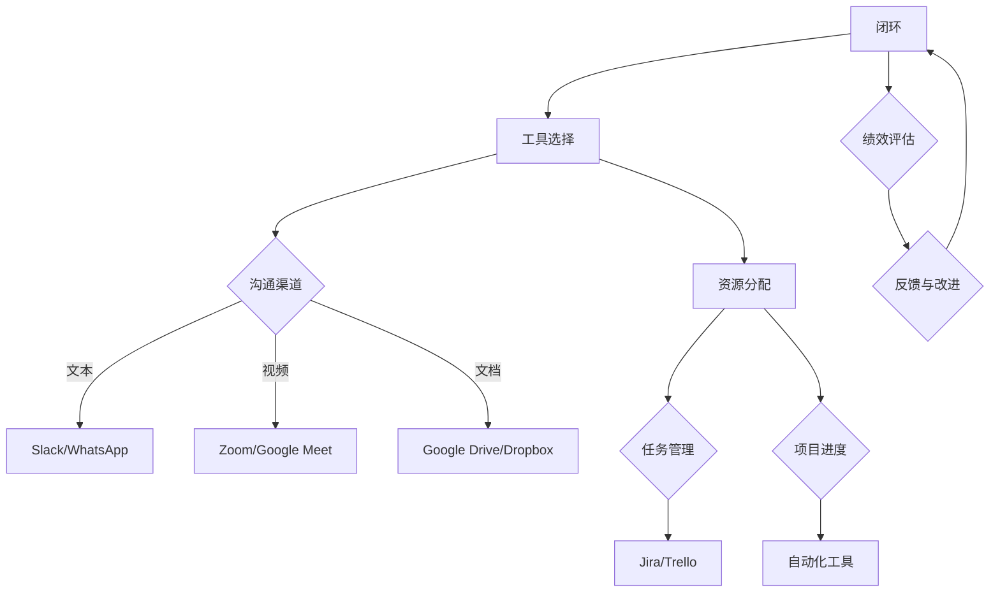
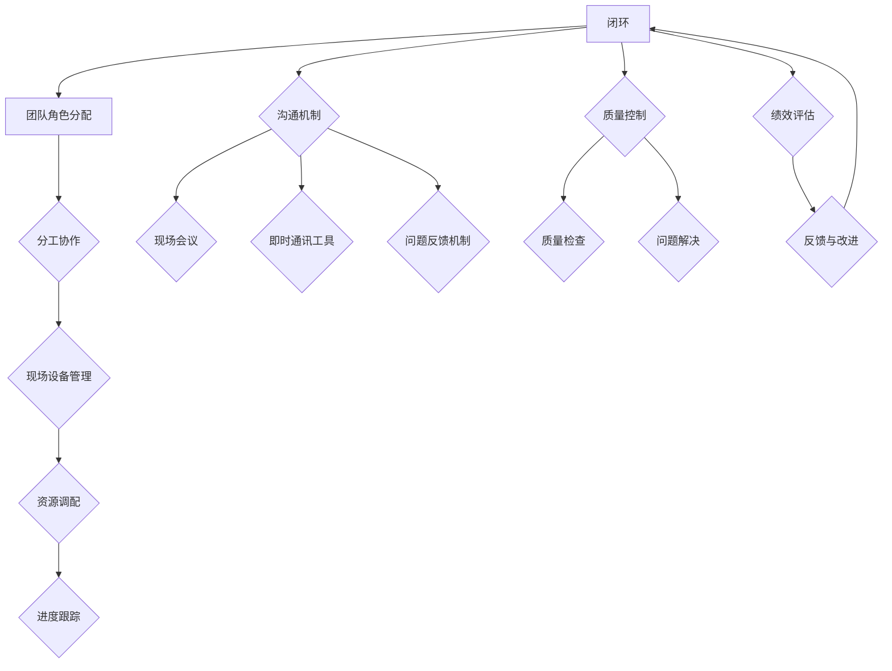
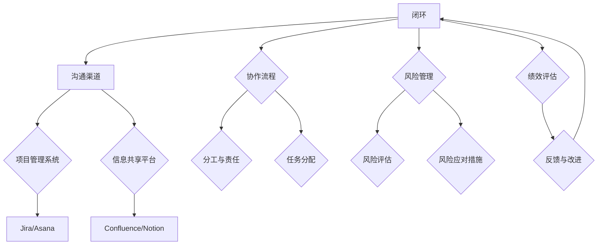

                 

### 文章标题

《团队协同：远程与现场团队的无缝衔接》

### 关键词

远程团队协同、现场团队协作、跨团队协作、工具与平台、沟通技巧、管理策略、案例分析

### 摘要

在当今信息化时代，团队协同已成为企业成功的关键因素。本文旨在探讨远程与现场团队的无缝衔接，分析其重要性及面临的挑战。通过对远程与现场团队协作工具、策略和跨团队协作机制的详细解读，辅以实际案例解析，本文为企业和团队提供了一套全面的团队协同解决方案，旨在提高团队工作效率和项目成功率。文章结构分为五部分：引言、远程团队协同策略、现场团队协同方法、跨团队协作融合和案例研究，最后总结团队协同的未来趋势与最佳实践。通过本文的深入探讨，期望为团队管理者和技术人员提供有价值的参考和启示。

### 第一部分：引言

#### 第1章：团队协同概述

#### 1.1 团队协同的重要性

团队协同是指团队成员通过有效的沟通、合作和资源共享，共同完成复杂任务和项目的过程。在现代企业中，团队协同的重要性日益凸显。随着全球化、远程工作和数字化转型的推进，团队协作的范围和形式变得更加多样化，也对团队协作提出了更高的要求。

首先，团队协同能够提高工作效率。通过团队成员的协作，可以充分利用每个人的专业技能和知识，实现优势互补，减少重复劳动和资源浪费。此外，团队协同还能够加快问题解决和决策速度，提高项目的整体进展效率。

其次，团队协同有助于增强团队凝聚力。团队成员在共同完成任务的过程中，能够增进相互了解和信任，培养团队合作精神。这种凝聚力不仅能够提高团队成员的工作积极性，还能够增强团队的抗风险能力，提高项目的成功率。

最后，团队协同对于企业的创新能力具有重要意义。在团队协同的过程中，团队成员能够碰撞出新的思维火花，激发创新灵感。通过跨领域的合作，企业能够更快地适应市场变化，推出更具竞争力的产品和服务。

#### 1.2 远程与现场团队协作的挑战

远程与现场团队协作是团队协同的两个重要形式，它们各自面临着不同的挑战。

对于远程团队协作，主要挑战包括：

1. **时间与地点的分离**：远程团队成员可能分布在不同的地理位置，导致时间上的不一致，增加了协作的难度。
2. **文化差异与沟通障碍**：远程团队成员可能来自不同的文化背景，导致沟通方式、语言和习惯的差异，增加了沟通的复杂性。
3. **信任问题**：由于缺乏面对面的交流，远程团队成员之间的信任度可能较低，影响协作效果。

对于现场团队协作，主要挑战包括：

1. **资源分配与协调**：现场团队成员可能需要共享有限的工作资源，如设备、场地和材料等，导致资源分配和协调的复杂性增加。
2. **现场干扰与效率问题**：现场环境中可能存在各种干扰因素，如噪音、人员流动等，影响团队成员的工作效率。
3. **安全风险**：现场工作环境中可能存在安全隐患，如设备故障、化学品泄漏等，需要团队成员时刻保持警惕。

#### 1.3 团队协同的核心理念

团队协同的核心理念包括以下几个方面：

1. **共同目标**：团队成员需要明确共同的目标和愿景，为实现目标而努力。
2. **分工协作**：团队成员需要根据各自的技能和职责，分工合作，充分发挥个人优势。
3. **有效沟通**：团队成员需要建立有效的沟通机制，确保信息传递的准确性和及时性。
4. **资源共享**：团队成员需要共享资源和知识，实现资源的最大化利用。
5. **信任与尊重**：团队成员需要相互信任和尊重，建立良好的团队关系。

通过以上核心理念的贯彻实施，团队协同能够更加高效、有序地进行，为企业的成功提供有力保障。在接下来的章节中，我们将深入探讨远程与现场团队协作的策略和方法，以期为团队管理者和技术人员提供实用的指导。

### 第二部分：远程团队协同策略

#### 第2章：远程团队协作工具与平台

#### 2.1 远程协作工具的选择

远程团队协作工具的选择是确保团队高效协作的关键因素。在选择远程协作工具时，需要考虑以下几个方面：

1. **功能需求**：根据团队的工作需求和项目特点，选择具备相应功能的协作工具。例如，项目管理工具需要具备任务分配、进度跟踪、文档共享等功能；视频会议工具需要具备高清视频、屏幕共享、实时聊天等功能。

2. **用户界面**：用户界面（UI）的友好性和易用性对于提高团队成员的使用体验至关重要。工具的UI应简洁明了，操作便捷，减少团队成员的学习成本。

3. **兼容性与稳定性**：协作工具应具备良好的兼容性，支持多种操作系统和设备，确保团队成员在不同设备上都能顺畅使用。同时，工具的稳定性也是选择时的重要考虑因素，避免因工具故障导致协作中断。

4. **安全性**：数据安全和隐私保护是远程协作工具的基本要求。选择具备数据加密、权限控制、访问审计等安全功能的工具，能够有效保障团队数据的安全性和保密性。

5. **成本效益**：根据团队预算和资金状况，选择性价比较高的协作工具。同时，也需要考虑工具的长期维护和支持成本。

常见的远程协作工具包括以下几类：

1. **团队沟通工具**：如Slack、Microsoft Teams、WhatsApp等，提供实时消息传递、文件共享、视频会议等功能。

2. **文件共享与协作工具**：如Google Drive、Dropbox、OneDrive等，支持多用户同时编辑文档，方便团队成员协同工作。

3. **项目管理工具**：如Trello、Asana、Jira等，帮助团队管理任务、跟踪进度、分配责任。

4. **视频会议工具**：如Zoom、Microsoft Teams、Google Meet等，支持多人实时视频通话，方便远程会议和交流。

#### 2.2 远程团队沟通技巧

远程团队沟通是确保协作顺利进行的关键环节。以下是一些提高远程团队沟通效果的技巧：

1. **明确沟通目标**：每次沟通前，明确沟通的目标和预期成果，确保沟通有的放矢。

2. **制定沟通计划**：制定详细的沟通计划，包括沟通内容、时间、地点、参与人员等，确保沟通活动的有序进行。

3. **使用多种沟通渠道**：结合使用文字、语音、视频等多种沟通方式，根据沟通内容的重要性和紧急程度选择合适的渠道。

4. **主动沟通**：鼓励团队成员主动沟通，及时表达自己的想法和意见，避免信息滞后和误解。

5. **积极倾听**：在沟通过程中，注重倾听对方意见，理解对方需求，避免因偏见和误解导致的沟通障碍。

6. **建立信任**：通过积极沟通，增进团队成员之间的了解和信任，提高团队的协作效率。

7. **管理沟通障碍**：针对远程团队可能遇到的文化差异、语言障碍等问题，采取相应的管理措施，如使用统一的沟通语言、提供跨文化培训等。

8. **反馈与改进**：沟通结束后，及时进行反馈和总结，了解沟通效果，发现并解决存在的问题，持续改进沟通方式。

#### 2.3 远程团队管理策略

远程团队管理是确保远程团队高效运行的关键。以下是一些有效的远程团队管理策略：

1. **明确角色与职责**：为每个团队成员明确角色和职责，确保团队分工清晰，避免职责重叠和推诿现象。

2. **建立有效的沟通机制**：建立日常沟通、周报、项目会议等机制，确保团队成员之间的信息传递畅通。

3. **制定清晰的目标和计划**：为团队和每个成员设定明确的目标和计划，确保团队成员明确自己的任务和进度。

4. **提供必要的资源和支持**：确保团队成员能够获取完成任务所需的资源和支持，如培训、工具、资料等。

5. **激励与奖励机制**：建立激励与奖励机制，激发团队成员的工作积极性和创造力。

6. **监控和评估绩效**：定期监控和评估团队成员的绩效，及时反馈和调整，确保团队目标的实现。

7. **培养团队凝聚力**：通过团队活动、培训、交流等方式，培养团队凝聚力，增强团队成员之间的信任和合作。

8. **应对远程工作挑战**：针对远程工作可能遇到的挑战，如时间管理、沟通障碍、工作效率等，采取相应的应对措施，提高团队的整体效能。

通过以上远程团队管理策略的落实，远程团队能够保持高效运行，实现项目的成功交付。在接下来的章节中，我们将继续探讨现场团队协同的方法和策略。

### 第三部分：现场团队协同方法

#### 第3章：现场团队协作方法

现场团队协作是指团队成员在物理空间内共同完成任务的过程，其协作效率和质量直接影响到项目的进展和成果。现场团队协作方法的核心在于充分利用现场资源和环境，提高团队工作效率，确保项目顺利进行。

#### 3.1 现场团队协作的组织结构

良好的组织结构是现场团队协作的基础。以下是现场团队协作组织结构的关键要素：

1. **团队角色与职责分配**：明确每个团队成员的角色和职责，确保团队分工合理，避免职责重叠和推诿现象。常见的团队角色包括项目经理、技术负责人、质量保证人员、现场操作人员等。

2. **现场协作流程**：制定详细的现场协作流程，明确各个环节的执行步骤和责任人，确保团队协作有序进行。现场协作流程通常包括任务分配、资源调配、进度跟踪、问题解决等环节。

3. **现场沟通机制**：建立高效的现场沟通机制，确保团队成员之间信息传递的及时性和准确性。现场沟通机制可以包括定期的现场会议、即时通讯工具、告示板等。

#### 3.2 现场团队协作工具

现场团队协作工具是提高团队工作效率的重要手段。以下是几种常见的现场协作工具：

1. **即时通讯工具**：如WhatsApp、钉钉、企业微信等，支持实时消息传递、语音通话、视频通话等功能，方便团队成员之间的沟通。

2. **任务管理工具**：如Trello、Asana、Jira等，帮助团队管理任务、跟踪进度、分配责任，确保项目按计划推进。

3. **文档共享工具**：如Google Drive、Dropbox、OneDrive等，支持多用户同时编辑文档，方便团队成员协同工作。

4. **现场监控工具**：如摄像头、传感器等，实时监控现场状况，及时发现和处理问题。

5. **项目管理软件**：如Microsoft Project、Smartsheet等，提供项目规划、进度跟踪、资源分配等功能，帮助团队更好地管理项目。

#### 3.3 现场设备与资源管理

现场设备与资源管理是现场团队协作的重要组成部分。以下是现场设备与资源管理的关键要点：

1. **设备清单**：制定详细的设备清单，明确设备名称、型号、数量、责任人等信息，确保现场设备配备齐全。

2. **设备维护**：定期对设备进行维护和保养，确保设备处于良好状态，避免设备故障影响项目进度。

3. **资源调配**：根据项目需求和现场条件，合理调配资源，确保资源利用最大化。

4. **资源共享**：建立资源共享机制，方便团队成员之间共享设备和资源，提高资源利用效率。

5. **安全防护**：制定安全防护措施，确保现场设备与资源的安全，防止设备丢失、损坏或安全事故发生。

#### 3.4 现场团队沟通技巧

现场团队沟通技巧对于确保协作顺利进行至关重要。以下是一些有效的现场团队沟通技巧：

1. **明确沟通目标**：每次沟通前，明确沟通的目标和预期成果，确保沟通有的放矢。

2. **制定沟通计划**：制定详细的沟通计划，包括沟通内容、时间、地点、参与人员等，确保沟通活动的有序进行。

3. **使用多种沟通渠道**：结合使用面对面交流、电话、即时通讯工具、邮件等多种沟通方式，根据沟通内容的重要性和紧急程度选择合适的渠道。

4. **主动沟通**：鼓励团队成员主动沟通，及时表达自己的想法和意见，避免信息滞后和误解。

5. **积极倾听**：在沟通过程中，注重倾听对方意见，理解对方需求，避免因偏见和误解导致的沟通障碍。

6. **建立信任**：通过积极沟通，增进团队成员之间的了解和信任，提高团队的协作效率。

7. **管理沟通障碍**：针对现场可能遇到的文化差异、语言障碍等问题，采取相应的管理措施，如使用统一的沟通语言、提供跨文化培训等。

8. **反馈与改进**：沟通结束后，及时进行反馈和总结，了解沟通效果，发现并解决存在的问题，持续改进沟通方式。

#### 3.5 现场团队管理技巧

现场团队管理是确保现场团队高效运行的关键。以下是一些有效的现场团队管理技巧：

1. **明确角色与职责**：为每个团队成员明确角色和职责，确保团队分工清晰，避免职责重叠和推诿现象。

2. **建立有效的沟通机制**：建立日常沟通、周报、现场会议等机制，确保团队成员之间信息传递畅通。

3. **制定清晰的目标和计划**：为团队和每个成员设定明确的目标和计划，确保团队成员明确自己的任务和进度。

4. **提供必要的资源和支持**：确保团队成员能够获取完成任务所需的资源和支持，如培训、工具、资料等。

5. **激励与奖励机制**：建立激励与奖励机制，激发团队成员的工作积极性和创造力。

6. **监控和评估绩效**：定期监控和评估团队成员的绩效，及时反馈和调整，确保团队目标的实现。

7. **培养团队凝聚力**：通过团队活动、培训、交流等方式，培养团队凝聚力，增强团队成员之间的信任和合作。

8. **应对现场工作挑战**：针对现场工作可能遇到的挑战，如时间管理、沟通障碍、工作效率等，采取相应的应对措施，提高团队的整体效能。

通过以上现场团队协作方法的实施，现场团队能够更好地应对各种挑战，确保项目顺利推进。在接下来的章节中，我们将探讨跨团队协作机制，以实现远程与现场团队的深度融合。

### 第四部分：远程与现场团队协同融合

#### 第4章：跨团队协作机制

跨团队协作是确保远程与现场团队协同融合的关键。通过有效的跨团队协作机制，可以充分利用各自团队的优势，提高整体工作效率和项目成功率。

#### 4.1 跨团队协作的目标与原则

跨团队协作的目标主要包括：

1. **整合资源**：充分利用远程和现场团队的优势，实现资源的最大化利用。
2. **提高效率**：通过跨团队协作，优化工作流程，减少重复劳动，提高整体工作效率。
3. **协同创新**：鼓励跨团队的交流和合作，激发创新思维，推动项目的创新和发展。
4. **提升质量**：通过跨团队协作，加强质量控制和反馈机制，提高项目的质量水平。

跨团队协作的原则包括：

1. **目标一致性**：跨团队协作的各团队应明确共同的目标和愿景，确保协作方向一致。
2. **信息透明性**：建立信息共享机制，确保跨团队之间信息传递的及时性和准确性。
3. **信任与尊重**：培养跨团队之间的信任和尊重，促进良好的沟通和合作。
4. **分工与协作**：明确跨团队的分工和协作关系，确保各自职责清晰，协同高效。
5. **灵活性与适应性**：根据项目进展和环境变化，灵活调整跨团队协作机制，保持协作的持续性和有效性。

#### 4.2 跨团队协作流程与规范

跨团队协作流程是确保协作顺利进行的重要依据。以下是一个典型的跨团队协作流程：

1. **需求分析与规划**：跨团队协作的启动阶段，明确项目需求、目标和预期成果，制定详细的协作计划。
2. **分工与责任分配**：根据项目需求和团队成员的技能，明确跨团队的分工和责任，确保每个团队成员清楚自己的任务和职责。
3. **信息共享与沟通**：建立跨团队的沟通渠道，确保信息传递的及时性和准确性。可以采用会议、邮件、即时通讯工具等多种方式，加强跨团队之间的沟通。
4. **协作与反馈**：团队成员按照分工和计划，共同推进项目，定期进行工作进展汇报和反馈，确保项目按计划推进。
5. **质量控制与改进**：建立质量控制和反馈机制，及时发现和解决问题，确保项目质量达到预期水平。
6. **项目收尾与总结**：项目完成后，进行项目总结和评估，总结经验教训，为未来项目提供参考。

跨团队协作规范是确保协作规范化和标准化的基础。以下是一些常见的跨团队协作规范：

1. **职责明确**：明确跨团队各成员的职责和权限，确保工作流程的顺畅。
2. **沟通规范**：制定统一的沟通规范，包括沟通语言、沟通渠道、沟通频率等，提高沟通效率。
3. **数据管理规范**：建立数据管理规范，确保数据的安全、完整和可追溯性。
4. **文档管理规范**：制定文档管理规范，明确文档的编写、审核、发布和存档流程，提高文档管理的效率和质量。
5. **风险管理规范**：制定风险管理规范，识别潜在风险，制定应对措施，降低项目风险。
6. **绩效评估规范**：建立绩效评估规范，对跨团队协作的效果进行评估，激励团队成员的积极性和创造力。

#### 4.3 跨团队协作工具应用

跨团队协作工具的应用是提高协作效率和效果的重要手段。以下是一些常用的跨团队协作工具：

1. **项目管理工具**：如Jira、Trello、Asana等，帮助团队管理任务、跟踪进度、分配责任。
2. **沟通工具**：如Microsoft Teams、Slack、钉钉等，支持实时沟通、消息传递、视频会议等功能。
3. **文档协作工具**：如Google Drive、Dropbox、OneDrive等，支持多用户同时编辑文档，方便团队协作。
4. **视频会议工具**：如Zoom、Microsoft Teams、Google Meet等，支持多人实时视频通话，方便远程会议和交流。
5. **即时通讯工具**：如WhatsApp、企业微信、钉钉等，支持实时消息传递、语音通话、视频通话等功能。
6. **协作平台**：如Confluence、Notion等，提供知识共享、文档管理、任务协作等功能，方便团队协作。

在实际应用中，可以根据团队的具体需求和项目特点，灵活选择和组合使用这些工具，以实现最佳协作效果。

通过建立和完善跨团队协作机制，远程与现场团队可以实现高效融合，发挥各自优势，共同推动项目的成功。在接下来的章节中，我们将通过案例分析，进一步探讨远程与现场团队协同的具体实践。

### 第五部分：案例研究

#### 第5章：团队协同案例解析

在本章节中，我们将通过实际案例深入解析远程与现场团队协同的成功实践，了解在具体项目中如何克服挑战，实现高效协作。

#### 5.1 案例一：远程团队协同成功案例

**案例背景：** 
某科技公司需要在远程团队中开发一款跨平台应用，团队成员分布在不同的国家，涉及前端开发、后端开发、测试等多个职能领域。

**案例实施过程：** 

1. **需求分析与规划：** 项目启动阶段，项目经理组织远程会议，明确项目需求、目标和时间表，制定详细的协作计划。

2. **分工与责任分配：** 根据团队成员的技能和项目需求，项目经理将任务分配到具体的团队成员，并明确各自的职责。

3. **信息共享与沟通：** 使用Slack作为团队沟通工具，创建不同的频道用于讨论任务、交流和分享文档。项目经理定期召开视频会议，确保团队成员之间的沟通畅通。

4. **协作与反馈：** 开发过程中，团队成员通过GitHub进行代码协作和版本控制，同时使用Jira跟踪任务进度和问题反馈。每周进行一次进度汇报会议，确保项目按计划推进。

5. **质量控制与改进：** 测试团队通过Selenium编写自动化测试脚本，确保应用在不同平台上的稳定性。项目经理定期检查测试结果，及时调整开发计划。

**案例效果评估：** 

该项目成功按时交付，应用在多个平台上运行稳定，客户反馈良好。团队成员通过高效的协作，克服了地理位置和时区差异带来的挑战，实现了项目的成功。

#### 5.2 案例二：现场团队协同成功案例

**案例背景：** 
某建筑公司在施工现场进行一项大型基础设施项目，涉及设计、施工、安全监督等多个环节，团队成员分布在施工现场和办公室。

**案例实施过程：** 

1. **分工与责任分配：** 项目经理明确现场和办公室团队成员的职责，现场负责人负责施工管理，办公室负责人负责设计和技术支持。

2. **现场协作流程：** 项目经理制定详细的现场协作流程，明确各个环节的执行步骤和责任人。现场使用即时通讯工具WhatsApp保持实时沟通，确保信息传递及时。

3. **设备与资源管理：** 现场负责人负责设备调度和维护，确保施工所需的设备齐全且处于良好状态。项目经理定期检查资源使用情况，确保资源调配合理。

4. **现场沟通技巧：** 项目经理组织现场会议，确保团队成员了解项目进展和关键决策。同时，鼓励团队成员主动沟通，及时解决问题。

5. **安全防护措施：** 项目经理制定安全防护措施，现场负责人负责监督执行。定期进行安全培训，提高团队成员的安全意识。

**案例效果评估：** 

该项目现场工作有序进行，施工进度和质量符合预期。团队成员通过高效的协作，克服了现场环境复杂性和资源限制带来的挑战，确保了项目的顺利推进。

#### 5.3 案例三：跨团队协同成功案例

**案例背景：** 
某跨国企业计划在全球范围内推出一款新品牌，涉及市场调研、产品设计、营销推广等多个职能领域，团队成员分布在不同的国家和城市。

**案例实施过程：** 

1. **需求分析与规划：** 企业总部组织跨团队会议，明确新品牌的市场定位、目标和预期成果，制定详细的协作计划。

2. **分工与责任分配：** 根据各团队的职能，将任务分配到具体团队成员，并明确各自的职责。市场调研团队负责收集数据，产品设计团队负责设计品牌形象，营销推广团队负责制定推广策略。

3. **信息共享与沟通：** 使用Confluence作为知识共享平台，各团队定期更新项目进展和关键信息。项目经理通过视频会议和即时通讯工具与各团队成员保持密切沟通。

4. **协作与反馈：** 各团队按照分工和计划，共同推进项目。定期召开跨团队会议，讨论项目进展和问题，确保项目按计划推进。

5. **质量控制与改进：** 各团队建立质量控制机制，确保项目的各个阶段达到预期质量。项目经理定期检查项目进展，提供改进建议。

**案例效果评估：** 

该项目成功推出新品牌，市场反响热烈，取得了显著的商业成功。跨团队协作机制的有效实施，确保了项目的高效推进和高质量完成。

通过以上案例分析，我们可以看到，远程与现场团队协同在实践中取得了显著成效。有效的团队协同不仅提高了工作效率，还增强了团队的凝聚力和创新能力。在未来的工作中，我们可以借鉴这些成功经验，进一步优化团队协同机制，实现更高效的合作。在接下来的章节中，我们将总结团队协同的挑战与未来趋势，为团队管理者和技术人员提供有益的启示。

### 第六部分：总结与展望

#### 第6章：团队协同的挑战与未来趋势

在总结团队协同的实践过程中，我们可以看到，远程与现场团队协同在提高工作效率、增强团队凝聚力和推动项目成功方面发挥了重要作用。然而，团队协同也面临着一系列挑战，这些挑战不仅体现在技术层面，也涉及组织和管理方面。

#### 6.1 团队协同面临的挑战

1. **技术挑战：** 
   - **工具选择与集成**：在选择和集成多种协作工具时，需要考虑兼容性、稳定性和安全性等因素，确保工具之间的无缝衔接。
   - **数据安全与隐私保护**：随着团队协作的深入，数据的安全和隐私保护成为关键问题。如何确保数据在传输和存储过程中的安全性，是一个亟待解决的挑战。

2. **组织挑战：**
   - **文化差异与沟通障碍**：远程团队和现场团队可能存在文化差异，导致沟通不畅和协作困难。如何建立跨文化的沟通机制，提高团队成员之间的信任和协作，是一个重要的组织挑战。
   - **管理模式的转变**：传统的管理模式可能不适用于远程和跨团队协作，如何适应新的管理模式，提高管理效率，是一个重要的组织挑战。

3. **人员挑战：**
   - **技能匹配与分工协作**：远程和现场团队的人员分布广泛，如何根据团队成员的技能和特点进行合理分工，实现优势互补，是一个人员挑战。
   - **工作积极性和责任感**：远程工作环境下，如何激发团队成员的工作积极性和责任感，避免因缺乏监督而影响工作效率，是一个人员挑战。

#### 6.2 团队协同的未来趋势

1. **技术发展趋势：**
   - **人工智能与机器学习**：人工智能和机器学习技术的应用将进一步提高团队协同的效率和智能化水平。例如，通过自然语言处理技术优化沟通，通过智能推荐系统提高资源利用效率。
   - **物联网（IoT）与传感器技术**：物联网和传感器技术的应用将实现更全面的现场监控和数据收集，提高现场团队的工作效率和安全水平。

2. **组织发展趋势：**
   - **分布式办公与远程工作**：随着远程工作技术的不断成熟，分布式办公将成为未来的主流办公模式。企业需要适应这种变化，优化组织结构和流程，提高远程团队的管理效率。
   - **敏捷管理**：敏捷管理理念将更加深入人心，团队协同将更加注重灵活性和适应性。通过敏捷管理，团队可以更快地响应变化，提高项目的成功率。

3. **人员发展趋势：**
   - **多样化人才结构**：未来团队将更加注重多样化人才结构的建设，通过引入不同背景和技能的人才，实现团队创新和多元化。
   - **持续学习与培训**：团队成员将持续学习和培训，提高自身的技能水平和职业素养，以适应不断变化的工作环境。

#### 6.3 团队协同的最佳实践

1. **远程团队协同最佳实践：**
   - **选择合适的协作工具**：根据团队的具体需求和项目特点，选择适合的协作工具，实现高效的团队协作。
   - **建立有效的沟通机制**：通过多种沟通渠道建立有效的沟通机制，确保团队成员之间的信息传递畅通。
   - **实施灵活的管理策略**：根据远程工作的特点，实施灵活的管理策略，提高团队成员的工作积极性和责任感。

2. **现场团队协同最佳实践：**
   - **明确分工与职责**：确保现场团队成员的分工和职责明确，避免职责重叠和推诿现象。
   - **加强现场设备与资源管理**：确保现场设备与资源充足且管理规范，提高现场工作效率。
   - **注重现场沟通技巧**：通过有效的现场沟通技巧，确保团队成员之间的沟通顺畅，提高协作效果。

3. **跨团队协同最佳实践：**
   - **制定清晰的协作流程和规范**：明确跨团队的协作流程和规范，确保协作有序进行。
   - **建立信息共享平台**：通过建立信息共享平台，实现跨团队之间的信息传递和共享，提高协作效率。
   - **培养团队凝聚力**：通过跨团队活动和文化交流，培养团队凝聚力，增强团队成员之间的信任和合作。

通过以上团队协同的挑战与未来趋势的探讨，以及最佳实践的总结，我们可以看到，团队协同在现代企业中具有重要意义。在未来的工作中，团队管理者和技术人员需要不断适应和应对这些挑战，积极探索和应用新的技术和方法，以提高团队协作的效率和效果。通过有效的团队协同，企业将能够更好地应对市场变化，实现持续的创新和发展。在接下来的附录部分，我们将提供一些团队协同工具和资源的推荐，以及团队协同常见问题的解答，为团队管理者和技术人员提供实用的参考。

### 附录A：团队协同工具与资源推荐

为了帮助团队管理者和技术人员更好地实现远程与现场团队的协同，以下是一些推荐的团队协同工具和资源。

#### A.1 远程协作工具推荐

1. **团队沟通工具**：
   - **Slack**：支持实时消息传递、文件共享和集成第三方服务。
   - **Microsoft Teams**：提供视频会议、即时通讯和共享文档等功能。
   - **WhatsApp**：适合小团队沟通，支持文本、语音和视频。

2. **文件共享与协作工具**：
   - **Google Drive**：多用户编辑文档，实时同步。
   - **Dropbox**：云端存储和同步文件，方便共享。
   - **OneDrive**：微软提供的云端存储解决方案。

3. **项目管理工具**：
   - **Trello**：可视化任务管理，适用于小型团队。
   - **Asana**：任务分配、进度跟踪和协作。
   - **Jira**：敏捷项目管理，支持软件缺陷追踪。

4. **视频会议工具**：
   - **Zoom**：支持高清视频和多人会议。
   - **Microsoft Teams**：集成在Office 365中，方便使用。
   - **Google Meet**：与Google Workspace集成，方便协作。

#### A.2 现场协作工具推荐

1. **即时通讯工具**：
   - **钉钉**：适合中国企业，支持消息、视频和会议。
   - **企业微信**：微信的版本，适合企业使用。

2. **任务管理工具**：
   - **微软Project**：强大的项目管理工具，适合复杂项目。
   - **Smartsheet**：灵活的任务和项目跟踪工具。

3. **现场监控工具**：
   - **摄像头**：实时监控现场，确保安全。
   - **传感器**：监控温度、湿度等环境参数。

4. **项目管理软件**：
   - **Confluence**：知识共享和文档协作。
   - **Notion**：多功能的信息管理和协作工具。

#### A.3 跨团队协作工具推荐

1. **沟通工具**：
   - **Confluence**：团队协作平台，支持知识共享和文档协作。
   - **Notion**：多功能的信息管理和协作工具。

2. **项目管理工具**：
   - **Jira**：任务管理、进度跟踪和敏捷开发。
   - **Asana**：任务分配和进度跟踪。

3. **文档协作工具**：
   - **Google Drive**：实时文档编辑和协作。
   - **Dropbox**：文件共享和同步。

4. **视频会议工具**：
   - **Zoom**：支持多人视频会议。
   - **Microsoft Teams**：集成在Office 365中。

通过以上推荐的工具和资源，团队可以更好地实现远程与现场团队的无缝衔接，提高协作效率和项目成功率。选择适合自己团队需求的工具，结合最佳实践，团队协同将更加高效和顺畅。在接下来的附录部分，我们将解答一些关于团队协同的常见问题。这些解答将为团队管理者和技术人员提供实用的指导，帮助他们更好地应对团队协同中的挑战。

### 附录B：团队协同常见问题解答

在团队协同的过程中，可能会遇到各种各样的问题。以下是一些常见问题及其解答，帮助团队管理者和技术人员更好地应对挑战。

#### B.1 远程团队常见问题

**1. 如何提高远程团队的沟通效率？**
- **使用合适的沟通工具**：选择能够满足团队需求的沟通工具，如Slack、Microsoft Teams等，确保信息传递及时。
- **制定沟通规范**：明确沟通的频率、内容和渠道，避免信息滞后和误解。
- **定期团队会议**：定期举行视频会议，确保团队成员之间的沟通和信息同步。

**2. 远程团队如何建立信任？**
- **透明沟通**：保持沟通的透明度，确保团队成员了解项目进展和决策。
- **共同目标**：明确团队共同的目标和愿景，增强团队成员的归属感。
- **定期反馈**：及时给予反馈，鼓励团队成员积极参与，增强团队凝聚力。

**3. 远程团队如何保持工作效率？**
- **合理分工**：根据团队成员的技能和特点进行合理分工，避免重复劳动。
- **灵活的工作安排**：允许团队成员灵活调整工作时间，提高工作效率。
- **定期检查进度**：定期检查任务进度，及时发现和解决问题，确保项目按计划推进。

#### B.2 现场团队常见问题

**1. 如何有效管理现场团队资源？**
- **制定资源清单**：明确现场所需资源，并制定资源清单，确保资源配备齐全。
- **动态调配资源**：根据项目进展和现场需求，动态调整资源分配，提高资源利用效率。
- **定期检查和维护**：定期检查和维护设备，确保设备处于良好状态，减少故障风险。

**2. 如何提高现场团队的工作效率？**
- **明确分工和职责**：确保团队成员明确自己的任务和职责，避免职责重叠和推诿。
- **优化工作流程**：简化工作流程，减少不必要的步骤，提高工作效率。
- **提供必要支持**：为团队成员提供必要的培训、工具和资源，确保他们能够高效完成任务。

**3. 如何处理现场团队冲突？**
- **及时沟通**：发生冲突时，及时进行沟通，了解双方的观点和需求。
- **公正处理**：根据事实和证据，公正处理冲突，避免偏袒和偏见。
- **建立冲突解决机制**：建立冲突解决机制，提供解决冲突的途径和程序。

#### B.3 跨团队协作常见问题

**1. 如何确保跨团队协作的顺利进行？**
- **明确协作目标和流程**：明确跨团队的协作目标和流程，确保各团队之间协作有序。
- **建立信息共享平台**：建立信息共享平台，确保跨团队之间的信息传递畅通。
- **定期沟通和协调**：定期举行跨团队会议，确保各团队之间的沟通和协调，及时发现和解决问题。

**2. 跨团队协作中如何处理文化差异？**
- **尊重文化差异**：尊重各团队的文化差异，避免因文化冲突导致的误解和矛盾。
- **提供跨文化培训**：为团队成员提供跨文化培训，提高他们的跨文化沟通能力。
- **建立跨文化沟通规范**：制定跨文化沟通规范，确保沟通的准确性和有效性。

**3. 如何确保跨团队协作的质量？**
- **建立质量控制机制**：建立跨团队的质量控制机制，确保项目质量达到预期水平。
- **定期质量检查**：定期对跨团队协作的质量进行评估和检查，及时发现和解决问题。
- **团队协作培训**：定期组织团队协作培训，提高团队成员的协作能力和效率。

通过以上常见问题的解答，团队管理者和技术人员可以更好地应对团队协同中的各种挑战，提高团队协作效率和质量。在接下来的附录部分，我们将提供一些团队协同的架构图和数学模型，进一步深化对团队协同的理解和应用。这些内容将为团队管理者和技术人员提供更具体的指导，帮助他们更好地实现远程与现场团队的无缝衔接。

### 附录C：团队协同架构图

为了更好地理解团队协同的整体架构，以下是一些关键的团队协同架构图，这些图表可以帮助团队管理者和技术人员更清晰地看到协同流程和各个环节之间的关系。

#### C.1 远程团队协作架构图



#### C.2 现场团队协作架构图



#### C.3 跨团队协作架构图



这些架构图展示了远程团队、现场团队以及跨团队协作中的关键环节和流程，帮助团队管理者和技术人员更好地理解并优化团队协作机制。在实际应用中，可以根据团队的实际情况和需求，调整和优化这些架构图，以确保团队协同的高效性和可持续性。在接下来的附录部分，我们将介绍一些数学模型和公式，进一步深化对团队协作效率的理解。这些数学模型和公式将为团队管理者和技术人员提供量化的参考，帮助他们更好地进行团队协作的优化。

### 附录D：数学模型和公式解释

在团队协同过程中，数学模型和公式可以用来量化团队的工作效率、资源利用率以及项目风险等关键指标，从而为团队管理者提供决策支持。以下是一些常用的数学模型和公式，以及它们的详细解释和举例说明。

#### D.1 远程团队协作效率模型

**远程团队协作效率（E）模型：**
$$
E = \frac{t_c + t_r + t_d}{3}
$$
其中：
- \( t_c \) 代表沟通时间
- \( t_r \) 代表任务完成时间
- \( t_d \) 代表决策时间

**详细解释：**
这个公式表示远程团队协作效率是沟通时间、任务完成时间和决策时间的平均值。一个高效的远程团队，这三个时间要素应当合理分配，使得总体效率最大化。

**举例说明：**
假设一个远程团队的任务完成时间是10小时，沟通时间是4小时，决策时间是6小时，则其协作效率为：
$$
E = \frac{10 + 4 + 6}{3} = \frac{20}{3} \approx 6.67 \text{小时}
$$

#### D.2 现场团队协作效率模型

**现场团队协作效率（E）模型：**
$$
E = \frac{t_p + t_c + t_r}{3}
$$
其中：
- \( t_p \) 代表物理操作时间
- \( t_c \) 代表沟通时间
- \( t_r \) 代表任务完成时间

**详细解释：**
这个公式表示现场团队协作效率是物理操作时间、沟通时间和任务完成时间的平均值。现场团队通常需要频繁进行物理操作，因此物理操作时间是一个重要的考量因素。

**举例说明：**
假设一个现场团队的任务完成时间是8小时，沟通时间是3小时，物理操作时间是10小时，则其协作效率为：
$$
E = \frac{10 + 3 + 8}{3} = \frac{21}{3} = 7 \text{小时}
$$

#### D.3 跨团队协作效率模型

**跨团队协作效率（E）模型：**
$$
E = \frac{t_p + t_c + t_r + t_d}{4}
$$
其中：
- \( t_p \) 代表物理操作时间
- \( t_c \) 代表沟通时间
- \( t_r \) 代表任务完成时间
- \( t_d \) 代表决策时间

**详细解释：**
这个公式表示跨团队协作效率是物理操作时间、沟通时间、任务完成时间和决策时间的平均值。跨团队协作通常涉及多个团队和更复杂的决策流程，因此决策时间也是一个重要的考量因素。

**举例说明：**
假设一个跨团队协作的任务完成时间是12小时，沟通时间是4小时，物理操作时间是8小时，决策时间是6小时，则其协作效率为：
$$
E = \frac{12 + 4 + 8 + 6}{4} = \frac{30}{4} = 7.5 \text{小时}
$$

通过以上数学模型和公式的应用，团队管理者可以更加精准地评估团队协作效率，并根据实际情况调整资源分配和协作流程，以实现更高的工作效率和项目成功率。这些模型不仅提供了量化的参考，也为团队协作的持续优化提供了理论依据。在接下来的部分，我们将通过一个实战案例，展示如何在实际项目中应用这些数学模型和公式，进一步验证它们的有效性。

### 代码案例解析与实战应用

#### 第7章：团队协同实战案例

在本章节中，我们将通过一个远程团队协同项目，展示如何应用前面提到的数学模型和公式，实现高效的项目管理和团队协作。

#### 7.1 实战案例一：远程团队协同项目

**项目背景：**
某科技公司需要开发一款跨平台应用，项目涉及前端开发、后端开发、测试等职能领域，团队成员分布在不同的城市和国家。项目要求在三个月内完成，并确保应用在不同平台上的稳定性。

**开发环境搭建：**
1. **工具和环境配置：**
   - 开发语言：使用JavaScript和Python进行开发。
   - 版本控制：使用Git进行代码版本控制。
   - 项目管理：使用Jira进行任务管理和进度跟踪。
   - 沟通工具：使用Slack进行团队沟通和消息传递。
   - 文档协作：使用Google Drive进行文档协作和共享。

2. **代码实现：**
   - **前端开发：** 使用Vue.js框架进行前端开发，实现应用的界面和交互。
   - **后端开发：** 使用Django框架进行后端开发，实现应用的业务逻辑和数据管理。
   - **测试：** 使用Selenium进行自动化测试，确保应用在不同平台上的稳定性。

**源代码详细实现：**
以下是一个前端开发的具体代码片段，用于实现应用的登录功能：

```javascript
<template>
  <div class="login-container">
    <h2>Login</h2>
    <input type="text" v-model="username" placeholder="Username" />
    <input type="password" v-model="password" placeholder="Password" />
    <button @click="login">Login</button>
  </div>
</template>

<script>
export default {
  data() {
    return {
      username: '',
      password: ''
    };
  },
  methods: {
    login() {
      // 调用后端API进行登录验证
      axios.post('/api/login', {
        username: this.username,
        password: this.password
      })
      .then(response => {
        // 登录成功，跳转到首页
        this.$router.push('/home');
      })
      .catch(error => {
        // 登录失败，显示错误消息
        alert('Invalid username or password');
      });
    }
  }
};
</script>
```

**代码解读与分析：**
上述代码实现了一个简单的登录界面，其中包括用户名和密码输入框以及登录按钮。用户点击登录按钮后，会调用后端的登录API进行验证。如果验证成功，则跳转到首页；否则，显示错误消息。这个代码片段展示了前端开发的基本流程，包括模板、数据绑定和事件处理。

**实际案例分析与详细讲解：**
1. **任务分配与进度跟踪：**
   - **前端开发**：由团队成员A负责，预计2周完成。
   - **后端开发**：由团队成员B负责，预计2周完成。
   - **测试**：由团队成员C负责，预计1周完成。

   使用Jira对任务进行分配和进度跟踪，确保每个任务按时完成。

2. **沟通与协作：**
   - **日常沟通**：通过Slack进行日常沟通，团队成员随时可以交流问题和进展。
   - **项目会议**：每周举行一次项目会议，总结本周进展和下周计划。

3. **数学模型应用：**
   - **效率模型：** 使用远程团队协作效率模型计算每个阶段的效率，确保任务按时完成。
   - **风险管理：** 使用跨团队协作效率模型分析项目的风险，制定相应的风险应对措施。

通过这个实战案例，我们可以看到如何在实际项目中应用数学模型和公式，实现高效的项目管理和团队协作。远程团队通过明确的任务分配、有效的沟通机制和数学模型的指导，成功按时完成了跨平台应用的开发，并确保了应用在不同平台上的稳定性。在未来的项目中，团队可以继续应用这些方法和模型，提高团队协作效率和项目成功率。此外，团队还可以根据项目经验和反馈，不断优化协作流程和模型，以适应不同类型项目的需求。在项目小结部分，我们将进一步总结这次项目的成功经验和教训，为未来的项目提供有益的参考。

### 项目小结

通过本次远程团队协同项目的实施，我们不仅成功完成了跨平台应用的开发，还积累了宝贵的实践经验。以下是这次项目的主要成功经验和教训，以及未来项目的建议和改进措施。

#### 成功经验

1. **明确的任务分配和进度跟踪：** 项目初期，我们通过Jira对任务进行详细的分配和进度跟踪，确保每个任务都有明确的责任人和完成时间。这种做法有效避免了任务重叠和推诿现象，提高了团队的协作效率。

2. **有效的沟通机制：** 通过Slack进行日常沟通和项目会议，团队成员能够及时交流问题和进展，确保信息的透明和准确。这种实时沟通的方式有助于团队快速响应变化，提高了项目进展的连贯性。

3. **数学模型的应用：** 我们在项目过程中，应用了远程团队协作效率和跨团队协作效率模型，对团队的协作效率进行了量化分析。这种做法不仅帮助我们更好地理解团队的工作状态，还为我们提供了优化协作流程的依据。

4. **灵活的决策和调整：** 项目过程中，我们根据实际情况灵活调整任务分配和资源使用，确保项目能够按时完成。这种灵活的决策和调整机制，有助于团队应对突发问题和变化，提高了项目的稳定性。

#### 教训

1. **初期规划不足：** 项目初期，我们在任务分配和资源准备上存在一定的不足，导致部分任务进展不如预期。未来项目需要更加细致的规划和准备，确保每个环节都有充足的资源和时间。

2. **沟通成本较高：** 尽管通过Slack实现了实时沟通，但团队成员在不同时区工作，导致沟通成本较高，部分时间上的不一致影响了协作效率。未来项目需要考虑时区差异，优化沟通策略，减少不必要的沟通成本。

3. **风险管理不足：** 项目过程中，我们未能充分识别和应对潜在的风险，导致部分任务进展受到影响。未来项目需要加强风险识别和应对措施的制定，确保项目能够顺利推进。

#### 未来项目的建议和改进措施

1. **加强前期规划：** 在项目初期，进行更加细致的任务分配和资源准备，确保每个任务都有明确的责任人和完成时间。

2. **优化沟通策略：** 根据团队成员的时区和工作习惯，优化沟通策略，减少不必要的沟通成本，确保信息传递的及时性和准确性。

3. **完善风险管理：** 加强风险识别和应对措施的制定，确保项目过程中能够及时应对各种风险。

4. **引入自动化工具：** 应用自动化工具，如自动化测试和进度跟踪工具，提高团队的协作效率和项目稳定性。

5. **持续学习和改进：** 鼓励团队成员持续学习和实践，提高团队的整体技能水平，为项目的顺利推进提供保障。

通过以上成功经验和教训，以及改进措施，团队可以不断提升协作效率，提高项目成功率。在未来的项目中，团队需要继续探索和应用新的技术和方法，以实现更高效、更稳定的团队协作。通过不断优化和改进，团队将能够更好地应对各种挑战，实现持续的创新和发展。在项目小结的最后，我们再次感谢所有团队成员的辛勤付出和协作，期待在未来的项目中取得更好的成绩。

### 作者信息

作者：AI天才研究院/AI Genius Institute & 禅与计算机程序设计艺术 /Zen And The Art of Computer Programming

### 文章结束

以上是《团队协同：远程与现场团队的无缝衔接》的技术博客文章，希望对您在团队协作领域有所启发。感谢您的阅读，如果您有任何疑问或建议，欢迎在评论区留言。祝您在团队协作的道路上越走越远，取得更多的成功！

