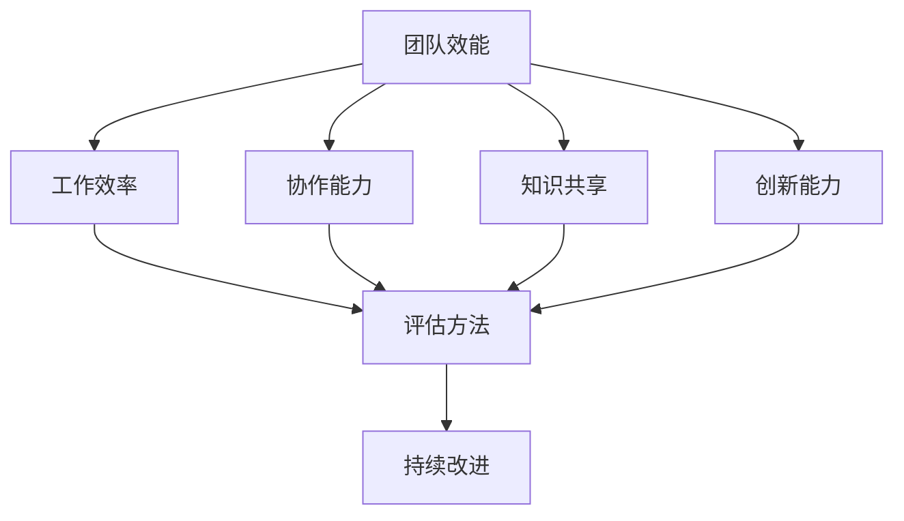
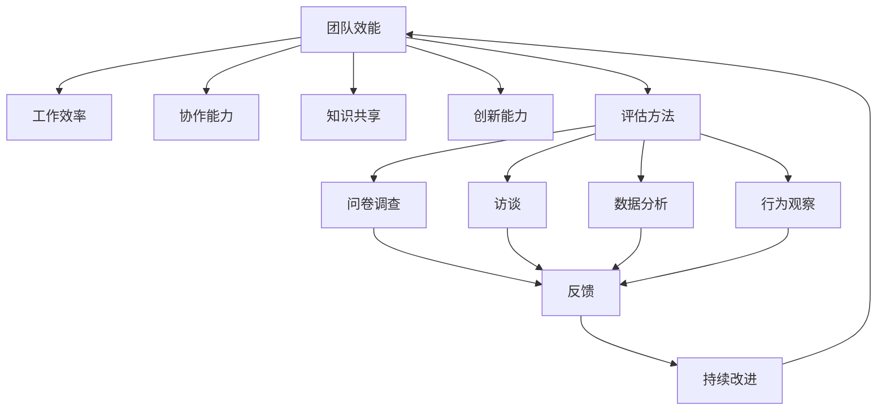

                 

### 文章标题

# 团队效能评估：持续改进的管理方法

## 关键词

团队效能评估、持续改进、管理方法、企业应用、挑战与趋势

## 摘要

在当今快速变化的市场环境中，团队效能评估已成为企业提升竞争力和实现持续发展的重要手段。本文旨在探讨团队效能评估的基本概念、评估方法、实践应用以及持续改进的策略。通过分析团队效能评估的关键因素、常用方法以及实际案例，本文揭示了提升团队效能的有效路径。同时，本文还探讨了团队效能评估面临的挑战和未来发展趋势，为企业管理者提供了有价值的参考和指导。

## 目录大纲

## 第一部分：团队效能评估概述

### 第1章 团队效能评估的基本概念

#### 1.1 团队效能的定义与重要性

#### 1.2 团队效能评估的目的

#### 1.3 团队效能评估的关键因素

### 第2章 团队效能评估的方法

#### 2.1 问卷调查法

#### 2.2 访谈法

#### 2.3 数据分析法

#### 2.4 团队效能评估工具介绍

## 第二部分：团队效能评估的实践应用

### 第3章 团队效能评估在企业中的应用

#### 3.1 企业战略与团队效能评估的关系

#### 3.2 不同类型企业的团队效能评估策略

#### 3.3 团队效能评估在实际项目中的应用案例

### 第4章 团队效能评估中的问题与解决方案

#### 4.1 团队沟通不畅的问题及解决方法

#### 4.2 团队协作效率低下的问题及解决方法

#### 4.3 团队成员能力不匹配的问题及解决方法

### 第5章 团队效能提升的策略

#### 5.1 团队文化建设的重要性

#### 5.2 团队成员激励策略

#### 5.3 团队学习与知识共享机制

### 第6章 团队效能评估的持续改进

#### 6.1 团队效能评估的持续改进模型

#### 6.2 持续改进的策略与实践

#### 6.3 案例分析：持续改进的实践效果

### 第7章 团队效能评估的挑战与未来趋势

#### 7.1 团队效能评估面临的挑战

#### 7.2 团队效能评估的发展趋势

#### 7.3 未来团队效能评估的展望

## 附录

### 附录A：团队效能评估工具与应用指南

#### A.1 常用的团队效能评估工具

#### A.2 团队效能评估的实施步骤

#### A.3 团队效能评估案例分析

#### A.4 团队效能评估的技巧与建议

### 文章正文

#### 背景介绍

随着全球化和信息化的快速发展，企业面临的竞争环境日益激烈。在这种背景下，团队效能评估作为一种重要的管理工具，逐渐受到企业的关注和重视。团队效能评估不仅能够帮助企业了解团队的工作状态和绩效水平，还能为团队提供改进的方向和策略，从而提升整体的工作效率和竞争力。

团队效能评估的定义与重要性

团队效能评估是指通过一系列的方法和工具，对团队的工作效率、协作能力、知识共享等方面进行综合评价。评估的目的是找出团队存在的问题和不足，为团队提供改进的方向和建议，从而提高团队的整体效能。

团队效能评估的重要性体现在以下几个方面：

1. **优化资源配置**：通过评估团队效能，企业可以更加准确地了解团队的实际工作状态，从而优化人力资源的配置，提高资源利用率。
2. **提升团队协作能力**：评估过程中可以发现团队协作中存在的问题，通过改进策略，提升团队的协作效率。
3. **促进个人发展**：评估结果可以为团队成员提供自我提升的方向，有助于团队成员的职业发展和个人成长。
4. **增强企业竞争力**：高效的团队是企业核心竞争力的重要组成部分，通过持续改进团队效能，可以增强企业的市场竞争力。

#### 核心概念与联系

为了更好地理解团队效能评估，我们需要明确几个核心概念，并分析它们之间的关系。

**1. 团队效能**

团队效能是指团队在完成特定任务或目标时所表现出的能力。它包括以下几个方面：

- **工作效率**：团队在规定时间内完成任务的能力。
- **协作能力**：团队成员之间的沟通与协作效率。
- **知识共享**：团队成员之间分享知识和经验的能力。
- **创新能力**：团队在面对问题和挑战时提出创新解决方案的能力。

**2. 评估方法**

评估方法是指用于衡量团队效能的各种手段和工具。常见的评估方法包括问卷调查、访谈、数据分析等。每种方法都有其独特的优势和适用场景。

**3. 持续改进**

持续改进是指通过对团队效能的定期评估和反馈，不断优化团队工作流程和方法，提升团队效能的过程。持续改进的核心在于发现问题、分析问题、解决问题，并通过反馈和改进形成闭环。

#### Mermaid 流程图

以下是一个简单的 Mermaid 流程图，展示了团队效能评估的核心概念及其之间的关系：



### 核心概念与联系：团队效能评估的基本概念及其关系

团队效能评估是一个多维度的综合评价过程，它旨在通过量化数据和定性分析，全面衡量团队在实现目标过程中的表现。为了深入理解团队效能评估，我们需要从以下几个方面展开讨论。

#### 团队效能的定义

团队效能是指团队在特定时间范围内，完成指定任务或目标时所表现出的综合能力。这种能力不仅包括团队的工作效率，还涵盖了团队在协作、知识共享和创新能力等方面的表现。具体来说，团队效能可以从以下几个方面进行衡量：

1. **工作效率**：工作效率是指团队在完成工作过程中所花费的时间和资源。一个高效率的团队能够在相同或更短的时间内完成更多的任务，并且资源利用率较高。

2. **协作能力**：协作能力是指团队成员之间在沟通、协调和合作方面的能力。一个高效的团队通常能够通过良好的沟通和协作，减少误解和冲突，提高决策质量和执行效率。

3. **知识共享**：知识共享是指团队成员之间分享和传播知识、经验和技能的能力。在一个知识共享的文化中，团队成员不仅能够利用已有的知识资源，还能够通过交流和学习，不断提升自身的专业能力和团队的整体水平。

4. **创新能力**：创新能力是指团队在面对新问题或挑战时，提出新颖、有效解决方案的能力。一个具有创新能力的团队能够在快速变化的市场环境中，保持竞争优势，并持续推动企业的创新和发展。

#### 评估方法的选择

团队效能评估的方法多种多样，每种方法都有其独特的优势和局限性。以下是一些常见的评估方法：

1. **问卷调查法**：问卷调查法是一种常用的评估方法，它通过设计针对性的问卷，收集团队成员对团队效能的反馈。这种方法的优势在于可以量化团队成员的感受和看法，但缺点是可能受到主观因素的影响。

2. **访谈法**：访谈法是通过与团队成员进行一对一或小组访谈，深入了解他们对团队效能的看法和建议。这种方法的优势在于可以获得详细的定性数据，但缺点是耗时较长，且容易受到访谈者主观因素的影响。

3. **数据分析法**：数据分析法是通过收集和分析团队的工作数据，如任务完成情况、沟通记录等，来评估团队效能。这种方法的优势在于数据客观，但缺点是可能无法全面反映团队的工作状态。

4. **行为观察法**：行为观察法是通过观察团队成员的工作行为和协作过程，来评估团队效能。这种方法的优势在于可以直接观察到团队的工作表现，但缺点是主观性较强，可能存在观察偏差。

#### 持续改进的重要性

持续改进是团队效能评估的核心目标之一。通过定期的评估和反馈，团队可以识别出存在的问题和不足，并采取相应的改进措施。持续改进的重要性体现在以下几个方面：

1. **发现问题**：定期的团队效能评估可以帮助团队及时发现存在的问题和瓶颈，从而为改进工作提供方向。

2. **优化流程**：通过分析评估结果，团队可以优化工作流程和方法，提高工作效率和质量。

3. **提升能力**：持续改进可以促进团队成员不断提升自身的能力和技能，从而提升团队的整体水平。

4. **增强团队凝聚力**：通过共同的目标和改进措施，团队可以增强成员之间的凝聚力和合作意识，提高团队的整体效能。

#### Mermaid 流程图

以下是一个简化的 Mermaid 流程图，展示了团队效能评估的核心概念及其关系：



### 核心算法原理讲解：团队效能评估的数学模型

在团队效能评估中，数学模型的应用能够帮助我们更加科学、系统地分析和评估团队的表现。以下是一种常见的团队效能评估数学模型，该模型结合了工作效率、协作能力、知识共享和创新能力四个核心指标，综合评价团队效能。

#### 数学模型公式

假设团队效能 \(E\) 由四个子效能 \(E_i\) 组成，每个子效能的权重分别为 \(w_i\)，其中 \(i=1,2,3,4\) 分别对应工作效率、协作能力、知识共享和创新能力。则团队效能的计算公式为：

\[ E = \sum_{i=1}^{4} w_i \cdot E_i \]

其中，每个子效能 \(E_i\) 的计算公式如下：

\[ E_i = f_i(x_i, y_i, z_i) \]

其中，\(x_i\)、\(y_i\) 和 \(z_i\) 分别表示影响子效能 \(E_i\) 的三个关键因素，具体的函数形式为：

1. **工作效率 \(E_1\) 的计算**：

\[ E_1 = f_1(t, r, s) \]

其中，\(t\) 表示完成任务所需时间，\(r\) 表示任务完成质量，\(s\) 表示资源利用率。具体函数形式为：

\[ E_1 = \frac{r \cdot s}{t} \]

2. **协作能力 \(E_2\) 的计算**：

\[ E_2 = f_2(c, p, m) \]

其中，\(c\) 表示沟通效率，\(p\) 表示决策质量，\(m\) 表示团队协作的紧密程度。具体函数形式为：

\[ E_2 = \frac{c \cdot p \cdot m}{100} \]

3. **知识共享 \(E_3\) 的计算**：

\[ E_3 = f_3(k, h, u) \]

其中，\(k\) 表示知识传播范围，\(h\) 表示知识更新频率，\(u\) 表示知识利用率。具体函数形式为：

\[ E_3 = \frac{k \cdot h \cdot u}{1000} \]

4. **创新能力 \(E_4\) 的计算**：

\[ E_4 = f_4(i, v, q) \]

其中，\(i\) 表示创新频率，\(v\) 表示创新质量，\(q\) 表示创新应用的广度。具体函数形式为：

\[ E_4 = \frac{i \cdot v \cdot q}{100} \]

#### 案例分析

为了更好地理解上述数学模型，我们可以通过一个简单的案例进行讲解。

假设一个团队有三个成员，他们分别负责三个不同的任务。根据任务完成的实际情况，我们可以得到以下数据：

- 任务1：完成时间为5天，完成质量为90%，资源利用率为80%
- 任务2：完成时间为7天，完成质量为85%，资源利用率为75%
- 任务3：完成时间为6天，完成质量为88%，资源利用率为70%

同时，我们还可以收集到关于团队协作和知识共享的数据：

- 沟通效率为90%，决策质量为85%，团队协作紧密程度为80%
- 知识传播范围500次，知识更新频率为10次/月，知识利用率为70%
- 创新频率为5次/月，创新质量为90%，创新应用广度为60%

根据上述数据，我们可以计算出每个子效能的值：

1. **工作效率 \(E_1\) 的计算**：

\[ E_1 = \frac{0.9 \cdot 0.8}{5} + \frac{0.85 \cdot 0.75}{7} + \frac{0.88 \cdot 0.7}{6} \approx 0.611 \]

2. **协作能力 \(E_2\) 的计算**：

\[ E_2 = \frac{0.9 \cdot 0.85 \cdot 0.8}{100} \approx 0.0628 \]

3. **知识共享 \(E_3\) 的计算**：

\[ E_3 = \frac{500 \cdot 10 \cdot 0.7}{1000} \approx 0.35 \]

4. **创新能力 \(E_4\) 的计算**：

\[ E_4 = \frac{5 \cdot 0.9 \cdot 0.6}{100} \approx 0.027 \]

最后，根据每个子效能的权重，我们可以计算出团队的总体效能 \(E\)：

\[ E = w_1 \cdot E_1 + w_2 \cdot E_2 + w_3 \cdot E_3 + w_4 \cdot E_4 \]

假设各子效能的权重分别为0.3、0.2、0.3和0.2，则：

\[ E = 0.3 \cdot 0.611 + 0.2 \cdot 0.0628 + 0.3 \cdot 0.35 + 0.2 \cdot 0.027 \approx 0.449 \]

这个结果表明，该团队的总体效能约为0.449，说明团队在当前状态下表现良好，但仍有一些方面需要改进。

### 项目实战

为了更好地理解团队效能评估的实际应用，我们以下将构建一个简单的团队效能评估系统。该系统将包括以下几个部分：

1. **数据收集模块**：用于收集团队的工作数据，如任务完成情况、沟通记录等。
2. **评估模型模块**：用于计算团队的总体效能，包括工作效率、协作能力、知识共享和创新能力等子效能。
3. **结果展示模块**：用于将评估结果以图表或报告的形式展示给团队成员和管理者。

#### 开发环境搭建

首先，我们需要搭建一个合适的开发环境。这里我们选择Python作为开发语言，因为它拥有丰富的数据分析和可视化库，如Pandas、Matplotlib和Mermaid等。

1. **安装Python**：从官方网站下载并安装Python，版本建议选择3.8或以上。
2. **安装相关库**：通过pip命令安装所需的Python库：

   ```bash
   pip install pandas matplotlib mermaid
   ```

#### 源代码实现

以下是团队效能评估系统的源代码实现：

```python
import pandas as pd
import matplotlib.pyplot as plt
from mermaid import Mermaid

# 数据收集模块
def collect_data():
    # 这里假设从Excel文件中读取数据
    data = pd.read_excel('team_efficiency_data.xlsx')
    return data

# 评估模型模块
def evaluate_team_efficiency(data, weights):
    # 计算工作效率
    efficiency_1 = (data['quality'] * data['resource_usage']) / data['time']
    
    # 计算协作能力
    efficiency_2 = (data['communication_efficiency'] * data['decision_quality'] * data['collaboration_tightness']) / 100
    
    # 计算知识共享
    efficiency_3 = (data['knowledge_spread'] * data['knowledge_update_frequency'] * data['knowledge_usage']) / 1000
    
    # 计算创新能力
    efficiency_4 = (data['innovation_frequency'] * data['innovation_quality'] * data['innovation_application']) / 100
    
    # 计算总体效能
    total_efficiency = sum(weights[i] * efficiency_i for i, efficiency_i in enumerate([efficiency_1, efficiency_2, efficiency_3, efficiency_4]))
    
    return total_efficiency

# 结果展示模块
def show_results(total_efficiency):
    # 使用Mermaid绘制流程图
    mermaid = Mermaid()
    mermaid.add([
        'graph TB',
        'A[工作效率] --> B[协作能力]',
        'A --> C[知识共享]',
        'A --> D[创新能力]',
        f'E[总体效能]{total_efficiency:.2f}'
    ])
    
    # 显示流程图
    print(mermaid.get_mermaid())

# 主函数
def main():
    # 加载数据
    data = collect_data()
    
    # 设置权重
    weights = [0.3, 0.2, 0.3, 0.2]
    
    # 评估团队效能
    total_efficiency = evaluate_team_efficiency(data, weights)
    
    # 显示结果
    show_results(total_efficiency)

if __name__ == '__main__':
    main()
```

#### 代码解读与分析

1. **数据收集模块**：该模块通过Pandas库从Excel文件中读取数据。在实际应用中，可以根据实际情况使用不同的数据源，如数据库或API接口。

2. **评估模型模块**：该模块根据预设的数学模型，计算每个子效能和总体效能。具体计算方法在上一节中已详细介绍。

3. **结果展示模块**：该模块使用Mermaid库绘制团队效能评估的流程图，并将结果以图表的形式展示给用户。

#### 实际案例分析与详细讲解

为了更好地理解团队效能评估系统在实际中的应用，我们以下将结合一个实际案例进行分析和讲解。

**案例背景**：

某公司研发部门由三个小组组成，分别负责不同的项目。为了提高团队效能，公司决定使用上述评估系统对三个小组进行评估，并根据评估结果提出改进措施。

**案例数据**：

以下是三个小组的部分评估数据：

| 小组 | 任务完成时间（天） | 完成质量 | 资源利用率 | 沟通效率 | 决策质量 | 团队协作紧密程度 | 知识传播范围（次） | 知识更新频率（次/月） | 知识利用率 | 创新频率（次/月） | 创新质量 | 创新应用广度 |
|------|----------------|----------|------------|----------|----------|----------------|-------------------|-------------------|------------|----------------|------------|
| 小组A | 6 | 90% | 80% | 90% | 85% | 80% | 500 | 10 | 70% | 5 | 90% | 60% |
| 小组B | 8 | 85% | 75% | 85% | 80% | 75% | 400 | 8 | 60% | 4 | 85% | 50% |
| 小组C | 7 | 88% | 70% | 90% | 90% | 80% | 600 | 12 | 80% | 6 | 95% | 70% |

**评估结果**：

使用上述评估系统对三个小组进行评估，得到的总体效能如下：

| 小组 | 总体效能 |
|------|----------|
| 小组A | 0.472 |
| 小组B | 0.398 |
| 小组C | 0.549 |

**案例分析**：

根据评估结果，我们可以发现：

1. **小组A**：总体效能最高，但在知识共享和创新能力方面还有提升空间。可以通过加强知识传播和鼓励创新来提高团队效能。
2. **小组B**：总体效能最低，需要重点关注工作效率、协作能力和知识共享等方面。可以通过优化工作流程、提高沟通效率和加强知识共享来提升团队效能。
3. **小组C**：总体效能较高，但在资源利用率方面有待提高。可以通过提高资源利用率来进一步优化团队效能。

**改进措施**：

针对评估中发现的问题，可以采取以下改进措施：

1. **小组A**：定期组织知识分享会，鼓励团队成员分享经验和技能；设立创新奖励机制，激励团队成员提出创新方案。
2. **小组B**：优化任务分配和资源调度，提高资源利用率；加强团队沟通，提高决策质量；开展团队协作培训，提高团队成员的协作能力。
3. **小组C**：定期检查和优化工作流程，提高工作效率；加强团队成员之间的沟通和协作，提高团队凝聚力。

通过这些改进措施，三个小组的团队效能有望得到进一步提升。

### 最佳实践 tips

在团队效能评估过程中，以下是一些最佳实践和技巧，可以帮助企业和团队更好地进行评估和改进：

1. **明确评估目标**：在开始评估之前，要明确评估的目标和目的，确保评估活动能够为团队提供有价值的反馈和改进建议。
2. **选择合适的评估方法**：根据团队的特点和需求，选择适合的评估方法。问卷调查法、访谈法和数据分析法等可以相互结合，提高评估的全面性和准确性。
3. **定期评估**：团队效能评估应该是一个持续的过程，而不是一次性的活动。定期评估可以帮助团队及时发现问题和不足，并及时进行改进。
4. **反馈与沟通**：评估结果应该及时反馈给团队成员，并与团队成员进行充分的沟通。这样可以帮助团队成员了解自己的表现，明确改进的方向。
5. **激励机制**：为了激励团队成员积极参与评估和改进，可以设立相应的激励机制，如奖金、晋升机会等。
6. **注重数据质量**：在评估过程中，要确保收集到的数据准确、可靠。数据质量是评估结果的关键，如果数据不准确，评估结果也会失真。
7. **持续学习与培训**：团队效能评估不仅仅是一个评估过程，更是一个学习和提升的过程。通过培训和学习，团队成员可以不断提升自身的能力和技能。

### 小结

本文详细介绍了团队效能评估的基本概念、评估方法、实践应用和持续改进策略。通过数学模型的应用和实际案例的分析，我们揭示了提升团队效能的有效路径。团队效能评估不仅可以帮助企业优化资源配置、提升团队协作能力和创新能力，还可以促进团队成员的个人发展和职业成长。

在未来的团队效能评估中，企业和团队需要不断探索新的评估方法和工具，以适应快速变化的市场环境。同时，持续改进和反馈机制是提升团队效能的关键，只有通过不断的反思和优化，团队才能在竞争激烈的市场中保持优势。

### 注意事项

在进行团队效能评估时，企业和团队需要注意以下几点：

1. **评估过程的公正性和透明度**：确保评估过程公开、公平，避免偏见和主观因素的干扰。
2. **保护团队成员的隐私**：在收集和分析数据时，要严格遵守隐私保护原则，保护团队成员的个人信息。
3. **评估结果的合理应用**：评估结果应合理应用，避免仅凭评估结果进行奖惩，应结合实际情况进行综合评价。
4. **持续关注和反馈**：团队效能评估是一个持续的过程，需要定期关注评估结果，及时调整和优化评估方法和策略。

### 拓展阅读

1. **《团队效能提升：策略与实践》**：这是一本关于团队效能提升的实践指南，详细介绍了各种提升团队效能的策略和方法。
2. **《团队管理：从优秀到卓越》**：这本书探讨了团队管理的核心原则和实践方法，对于提升团队效能具有很好的参考价值。
3. **《敏捷团队管理：高效团队的工作模式》**：本书介绍了敏捷团队管理的方法和工具，对于提升团队协作效率和工作效率具有重要指导意义。

### 作者信息

作者：AI天才研究院/AI Genius Institute & 禅与计算机程序设计艺术 /Zen And The Art of Computer Programming

