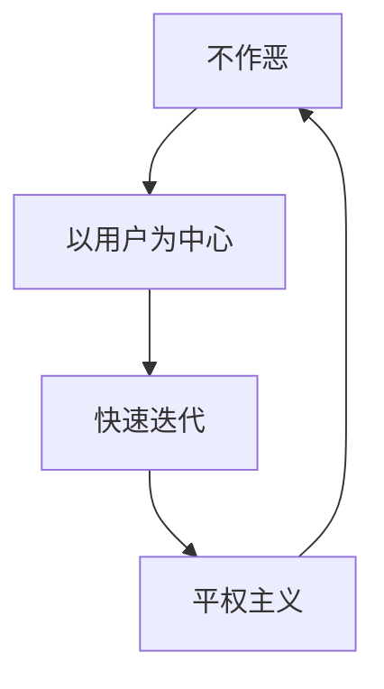
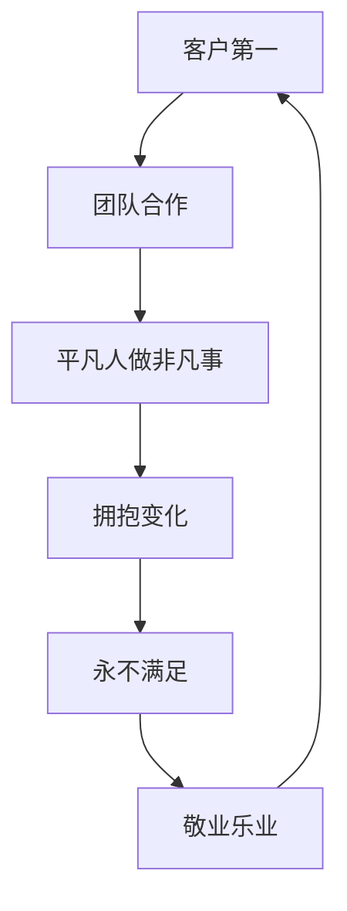

                 

### 第1章：团队文化的定义与重要性

#### 1.1 团队文化的概念与构成

##### 团队文化的定义

团队文化是团队成员在长期合作中逐渐形成的一套共同的价值观、行为规范和工作方式。它不仅仅是一种抽象的概念，而是可以通过团队成员的行为和互动具体体现出来的。团队文化包括核心价值观、团队精神、团队规范等多个方面。

**核心价值观**是团队文化的灵魂，它是团队成员共同追求和信奉的理念。比如，谷歌的“不作恶”原则、苹果的“创新至上”理念，都是这些公司核心价值观的具体体现。

**团队精神**是指团队成员之间的相互信任、团结协作和共同奋斗的态度。这种精神是团队文化的核心，它能够激发团队成员的积极性和创造力，提高团队的凝聚力和战斗力。

**团队规范**则是团队成员在合作过程中形成的共同遵守的行为准则。这些规范可以包括工作时间、着装要求、沟通方式等，它们有助于维护团队的正常运转和高效协作。

##### 团队文化的构成

1. **价值观**：核心价值观是团队文化的核心，它决定了一个团队的使命、愿景和目标。一个明确的价值观可以指导团队成员在面临选择和决策时，始终遵循团队的长远利益。

2. **行为规范**：行为规范是团队文化的具体体现，它通过约束和引导团队成员的行为，确保团队内部的和谐与稳定。比如，通过制定规范来确保团队成员按时完成任务、保持良好的沟通等。

3. **工作方式**：工作方式是团队文化的重要组成部分，它包括团队在完成工作任务时所采用的方法、流程和工具。一个良好的工作方式可以提高团队的工作效率和质量。

#### 1.2 团队文化的作用与意义

##### 团队文化的作用

1. **增强团队凝聚力**：共同的文化价值观和行为规范有助于增强团队成员之间的相互信任和合作。当团队成员共同认同并遵循团队文化时，他们会更加愿意为团队的目标而努力。

2. **提高工作效率**：良好的团队文化可以减少沟通成本，提高工作效率，从而提高团队的整体绩效。团队成员能够快速理解彼此的需求，快速做出决策，从而避免资源浪费。

3. **促进创新**：鼓励团队成员创新和尝试新方法，有助于推动团队持续发展。团队文化可以为创新提供支持和激励，从而激发团队成员的创造力和积极性。

##### 团队文化的意义

1. **团队精神的体现**：团队文化是团队精神的体现，它能够激发团队成员的归属感和荣誉感，使团队成员更加愿意为团队的目标和使命而努力。

2. **企业文化的组成部分**：团队文化是企业文化的具体表现，是企业核心竞争力的重要组成部分。一个优秀的团队文化可以提升企业的整体形象和市场竞争力。

3. **社会影响力**：优秀的团队文化可以提升企业在社会上的形象和声誉。通过积极的团队文化，企业可以向外界传递出一种积极向上的形象，从而赢得更多的社会认可和支持。

#### 1.3 团队文化对企业发展的影响

##### 团队文化对企业发展的影响

1. **战略层面**：良好的团队文化可以帮助企业实现战略目标，推动企业持续发展。团队文化可以为企业的战略决策提供指导，确保企业的战略执行更加有效。

2. **运营层面**：团队文化可以优化企业的运营流程，提高企业的运营效率。一个高效的团队文化可以减少内部的摩擦和冲突，提高团队的工作效率和执行力。

3. **员工层面**：团队文化可以提升员工的工作满意度，降低员工流失率。一个积极向上的团队文化可以激发员工的积极性和创造力，提高员工的工作满意度和忠诚度。

**总结**：团队文化是企业成功的关键因素之一。通过构建和培养良好的团队文化，企业可以提升团队的凝聚力、工作效率和创新力，从而推动企业的持续发展和成长。在接下来的章节中，我们将深入探讨团队文化的具体构成和影响因素，以及如何构建和优化团队文化。

## 第2章：团队基因的内涵与特征

### 2.1 团队基因的概念

**团队基因**是指影响团队效能和团队文化的一系列内在因素，它决定了团队的运作方式和行为模式。团队基因不仅包括团队成员的个人特质，还涵盖了团队的历史、外部环境等多种因素。

**团队基因的定义**：团队基因可以被理解为团队的核心竞争力，它包括团队成员的共同价值观、行为模式、沟通风格以及解决问题的策略等。

**团队基因的来源**：

1. **团队成员的个人特质**：团队成员的价值观、性格、技能和经历等因素都会对团队基因产生影响。这些个人特质在长期合作中逐渐演变为团队的共同特征。

2. **团队历史**：团队在过去合作过程中形成的共同记忆、成功经验和失败教训都是团队基因的重要组成部分。这些历史因素会深刻影响团队的行为模式和决策方式。

3. **外部环境**：团队所处的外部环境，如行业特点、竞争态势、市场变化等，也会对团队基因产生影响。外部环境的变化会迫使团队进行调整和适应，从而影响团队基因的形成。

**团队基因对团队文化的影响**：

团队基因不仅决定了团队的工作方式和行为模式，还直接影响团队文化的形成和发展。一个具有积极基因的团队往往会形成积极向上的文化，而一个具有消极基因的团队则可能会形成消极悲观的文化。

#### 2.2 团队基因的主要特征

**多样性**：团队基因的多样性是团队活力的源泉。团队成员的不同背景和技能为团队带来了多样化的思维方式和解决问题的方法，有助于团队的创新和进步。

**适应性**：团队基因需要具备适应性，以应对外部环境的变化和团队内部的变动。一个具有适应性的团队基因可以使团队在面对挑战时迅速调整和适应，从而保持团队的竞争力。

**稳定性**：团队基因具有一定的稳定性，因为它是团队长期合作过程中形成的。这种稳定性有助于团队保持一致的价值观和行为模式，减少内部摩擦和冲突。

**相互影响**：团队基因的各个组成部分相互影响，共同决定团队的效能和文化。比如，团队成员的个人特质会影响团队价值观的形成，而团队价值观又会影响团队的行为规范和工作方式。

### 2.3 团队基因与团队文化的联系

**团队基因与团队文化的关系**：

团队基因和团队文化是相互影响、相互促进的。团队基因是团队文化的基石，而团队文化则是团队基因的具体体现。

1. **团队基因决定团队文化**：团队基因中的核心价值观、行为规范和工作方式等决定了团队文化的形成和发展。一个具有积极基因的团队往往会形成积极向上的文化，反之亦然。

2. **团队文化影响团队基因**：团队文化通过团队成员的行为和互动不断塑造和影响团队基因。比如，一个重视创新的团队文化会激发团队成员的创新意识和能力，从而丰富团队基因。

**团队基因与团队效能的关系**：

团队基因对团队效能有直接的影响。一个具有良好基因的团队往往能够高效地完成工作任务，因为团队成员在价值观、行为规范和工作方式上具有一致性。

1. **协同效应**：团队基因中的多样性可以带来协同效应，使团队在解决问题时能够更全面、更深入。团队成员的不同观点和技能可以相互补充，提高团队的决策质量和执行力。

2. **适应性**：团队基因的适应性使团队能够迅速应对外部环境的变化和内部变动，保持团队的活力和竞争力。

**总结**：团队基因是团队文化的核心，它决定了团队的运作方式和行为模式。通过理解团队基因的概念、特征及其与团队文化的联系，我们可以更好地构建和优化团队文化，从而提升团队的效能和竞争力。在接下来的章节中，我们将深入探讨如何通过团队价值观、团队精神和团队沟通等具体方法来构建独特的团队文化。

## 第3章：团队价值观的塑造

### 3.1 团队价值观的重要性

**团队价值观**是团队文化的核心，是团队成员共同追求和信奉的理念。一个明确的团队价值观不仅能够指导团队成员的行为和决策，还能够增强团队的凝聚力和执行力。

**团队价值观的重要性**：

1. **指导行为**：团队价值观是团队成员在面临选择和决策时的指南。当团队成员共同认同并遵循团队价值观时，他们会更加明确自己的行为准则，从而减少内部分歧和冲突。

2. **增强凝聚力**：共同的价值观能够增强团队成员之间的相互信任和认同感，从而提高团队的凝聚力。一个有凝聚力的团队能够在面对挑战时更加团结一致，共同克服困难。

3. **提高执行力**：团队价值观可以统一团队成员的目标和行动方向，提高团队的执行力。当团队成员共同追求同一个目标时，他们会更加积极主动地完成任务，从而提升团队的整体绩效。

### 3.2 团队价值观的塑造策略

**塑造策略**：

1. **明确团队价值观**：首先，团队需要明确自己的价值观，并将其具体化。团队可以通过讨论、投票等方式，共同确定团队的核心价值观。这些价值观应该简洁明了，容易理解和记忆。

2. **宣传和倡导**：一旦团队价值观确定，团队需要通过各种途径进行宣传和倡导。可以通过团队会议、内部培训、宣传海报等方式，使团队成员深入了解和认同团队的价值观。

3. **行为引导**：团队价值观的塑造不仅仅停留在口号和宣传上，更需要通过具体的行为来引导。团队成员在日常生活中，应主动践行团队价值观，并在遇到问题时，以价值观为依据进行决策。

**案例**：以谷歌为例，谷歌的“不作恶”原则是其核心价值观之一。谷歌通过在其官方网站上明确阐述这一原则，并通过公司内部的文化活动和培训，使全体员工深入了解和认同这一价值观。谷歌的员工在面临决策时，会首先考虑这一原则，从而确保公司的发展方向符合其核心价值观。

### 3.3 团队价值观的具体实践

**具体实践**：

1. **团队会议**：在团队会议中，团队成员可以讨论和分享关于团队价值观的经历和感悟。通过这种方式，团队成员能够更加深入地理解和认同团队的价值观。

2. **内部培训**：团队可以定期举办内部培训，邀请专业讲师或外部专家，对团队成员进行团队价值观的培训。通过培训，团队成员能够系统地学习和理解团队价值观。

3. **行为激励**：团队可以通过设置奖励机制，激励团队成员践行团队价值观。例如，对于在团队价值观方面表现突出的员工，可以给予表彰和奖励。

**案例**：以微软为例，微软在其团队中强调创新和协作的价值观。微软定期举办创新竞赛，鼓励团队成员提出创新的想法和建议。在创新竞赛中，表现出色的团队和个人会得到表彰和奖励，从而激发团队成员的创新热情和团队合作精神。

**总结**：团队价值观是团队文化的核心，它对团队的凝聚力和执行力有着重要的影响。通过明确团队价值观、宣传和倡导、以及具体实践，团队可以塑造出符合自身特点的团队价值观，从而提升团队的效能和竞争力。在接下来的章节中，我们将进一步探讨团队精神的培养，以及团队沟通与协作的优化，以全面构建独特的团队文化。

## 第4章：团队精神的培养

### 4.1 团队精神的定义与内涵

**团队精神**是指团队成员之间的一种相互信任、协作和支持的态度和行为。它不仅仅是一种抽象的概念，而是可以通过具体的行动和互动来体现和培养的。

**定义**：团队精神是指团队成员在共同目标和价值观的引导下，相互支持、相互理解、相互尊重，共同面对挑战、共同解决问题的精神状态。

**内涵**：

1. **相互信任**：团队精神的基础是相互信任。团队成员之间需要建立起互相信任的关系，才能够有效合作，共同完成任务。

2. **协作**：团队精神强调团队成员之间的协作。团队成员应该愿意分享信息和资源，协同工作，共同解决问题。

3. **支持**：团队精神还体现在团队成员之间的支持上。在团队中，每个成员都应该支持其他成员，无论是工作上的帮助还是精神上的鼓励。

4. **共同面对挑战**：团队精神要求团队成员在面对困难和挑战时，能够团结一致，共同应对，而不是各自为战。

### 4.2 团队精神的培养方法

**培养方法**：

1. **建立共同目标**：团队精神往往在团队成员共同追求一个共同目标时得到激发。团队可以通过设定具体、明确的共同目标，来引导团队成员形成共同的精神。

2. **加强沟通**：沟通是团队精神培养的关键。团队需要建立起有效的沟通机制，确保信息能够畅通无阻地传递。通过定期的团队会议、工作汇报和小组讨论，团队成员可以更好地了解彼此的需求和期望。

3. **培养团队意识**：团队可以通过各种活动和培训，培养团队成员的团队意识。例如，团队建设活动、团队拓展训练等，都可以增强团队成员之间的互动和协作。

4. **表彰和奖励**：团队可以通过表彰和奖励来激励团队成员展现出团队精神。对于在团队协作中表现突出的成员，可以给予表扬和奖励，从而树立榜样，激励其他成员。

### 4.3 团队精神在实际工作中的应用

**实际应用**：

1. **项目合作**：在项目合作中，团队精神可以显著提高团队的工作效率和项目成功率。团队成员应该相互协作，共同分担任务，积极沟通，及时解决问题。

2. **问题解决**：在面对问题时，团队精神可以促进团队成员之间的合作，共同寻找解决方案。团队成员应该愿意分享自己的观点和资源，相互支持，共同克服困难。

3. **决策制定**：在决策制定过程中，团队精神可以确保团队成员能够充分参与，共同讨论，形成共识。通过团队精神，团队成员可以更加信任彼此，减少决策的摩擦和冲突。

### 4.4 团队精神培养中的注意事项

**注意事项**：

1. **避免形式主义**：团队精神的培养不能仅仅停留在表面形式上，而应该通过实际行动来体现。例如，定期的团队活动和培训只是手段，最终目的是要激发和培养真正的团队精神。

2. **关注个体差异**：每个团队成员都有其独特的个性和背景，团队精神培养应该考虑到这些差异，避免一刀切的做法。

3. **持续培养**：团队精神不是一蹴而就的，需要通过长期的培养和巩固。团队应该持续关注团队精神的建设，不断调整和优化培养策略。

**总结**：团队精神是团队文化的重要组成部分，它对团队的工作效率和团队凝聚力有着重要的影响。通过建立共同目标、加强沟通、培养团队意识和表彰奖励等方法，团队可以有效地培养和激发团队精神。在实际工作中，团队精神的应用可以显著提升团队的协作效果和问题解决能力。在接下来的章节中，我们将进一步探讨团队沟通与协作的优化，以全面提升团队文化。

## 第5章：团队沟通与协作的优化

### 5.1 团队沟通的障碍与解决策略

**沟通障碍的类型**：

1. **信息不对称**：团队成员之间的信息不平等，导致部分成员无法全面了解项目进展和任务要求。
2. **语言障碍**：团队成员的语言能力差异，可能影响信息的准确传达。
3. **文化差异**：团队成员来自不同文化背景，可能导致沟通方式和价值观上的冲突。
4. **心理障碍**：团队成员的个性、情绪和心理状态可能影响沟通的效果。

**解决策略**：

1. **明确沟通目标**：确保每个团队成员都清楚沟通的目的和期望结果，减少误解和误导。
2. **提升语言能力**：通过培训提升团队成员的语言表达能力，尤其是跨文化沟通能力。
3. **建立统一的沟通平台**：使用统一的沟通工具和平台，确保信息能够高效、准确地传递。
4. **促进文化理解**：通过文化交流和培训，增强团队成员对彼此文化的理解，减少文化冲突。

### 5.2 团队协作的技巧与方法

**团队协作技巧**：

1. **明确分工**：合理分配任务，确保每个成员都清楚自己的职责和任务。
2. **角色定位**：明确每个团队成员的角色和职责，确保团队能够高效运作。
3. **积极沟通**：鼓励团队成员之间进行开放、坦诚的沟通，及时分享信息和反馈。

**团队协作方法**：

1. **团队会议**：定期举行团队会议，确保团队成员能够及时了解项目进展和需求变化。
2. **任务分解**：将大型任务分解为多个小任务，确保每个任务都有明确的负责人。
3. **协作工具**：使用协作工具，如项目管理软件、即时通讯工具等，提高团队协作效率。

### 5.3 沟通与协作在团队文化中的地位

**沟通与协作的重要性**：

1. **团队凝聚力**：良好的沟通与协作可以增强团队成员之间的相互信任和依赖，提高团队的凝聚力。
2. **工作效率**：有效的沟通和协作可以减少误解和重复工作，提高团队的工作效率。
3. **创新能力**：通过开放和积极的沟通，团队成员可以分享不同的观点和想法，激发创新思维。

**沟通与协作的文化构建**：

1. **透明文化**：建立透明、开放的文化氛围，鼓励团队成员自由表达意见和反馈。
2. **平等文化**：确保团队成员在沟通与协作中享有平等的机会和权利，尊重彼此的意见和贡献。
3. **协同文化**：培养团队协同作战的精神，鼓励团队成员相互支持和协作，共同完成任务。

**总结**：团队沟通与协作是团队文化的重要组成部分，它对团队的凝聚力和工作效率有着重要的影响。通过识别和解决沟通障碍，运用有效的沟通技巧和协作方法，团队可以构建一个良好的沟通与协作文化，从而提升团队的整体效能。在接下来的章节中，我们将进一步探讨团队文化的变革与创新，以及如何评估和优化团队文化。

## 第6章：团队文化的变革与创新

### 6.1 团队文化变革的必要性

**团队文化变革的原因**：

1. **外部环境变化**：随着市场环境的不断变化，企业需要适应新的挑战和机遇，这要求团队文化进行相应的调整和变革。

2. **企业战略调整**：企业战略的调整可能需要团队文化的变革来支持，以确保团队的行动与企业的战略目标一致。

3. **内部问题**：团队内部的问题，如沟通障碍、效率低下、员工流失等，也可能促使团队文化变革，以解决这些问题。

**团队文化变革的必要性**：

1. **提升团队效能**：通过变革，团队可以消除陈旧的文化障碍，提高工作效率和创新能力，从而提升整体效能。

2. **适应新的工作方式**：随着技术的发展和工作的数字化，团队需要适应新的工作方式，变革文化可以促进团队对新技术的接受和应用。

3. **增强竞争力**：一个富有活力和创新精神的团队文化可以增强企业的竞争力，使其在激烈的市场竞争中脱颖而出。

### 6.2 团队文化变革的策略与实践

**策略一：领导层的引领**：

1. **领导示范**：领导层需要通过自己的行为示范来推动文化变革。领导的行为和态度直接影响团队成员的态度和行为。

2. **沟通与传达**：领导层需要明确传达变革的愿景和目标，让每个团队成员都理解变革的重要性和必要性。

**策略二：全员参与**：

1. **员工培训**：通过培训，提升团队成员的变革意识和能力，让他们了解如何适应新的文化。

2. **意见征集**：鼓励团队成员提出意见和建议，让他们参与到变革过程中，增强参与感和归属感。

**策略三：持续改进**：

1. **反馈机制**：建立反馈机制，定期收集团队成员对文化变革的反馈，及时发现和解决问题。

2. **持续优化**：根据反馈和实际情况，不断调整和优化文化变革策略，确保变革的持续性和有效性。

### 6.3 团队文化创新的方法与途径

**方法一：引入外部资源**：

1. **外部咨询**：引入外部专业咨询团队，提供专业意见和指导，帮助团队进行文化创新。

2. **合作交流**：与其他企业或团队进行合作交流，学习他们的成功经验和创新方法。

**方法二：内部创新激励**：

1. **创新奖励**：设立创新奖励机制，鼓励团队成员提出创新想法和解决方案。

2. **内部竞赛**：举办内部创新竞赛，激发团队成员的创新热情，促进团队的创新活力。

**方法三：技术驱动**：

1. **技术培训**：通过技术培训，提升团队成员的技术能力和创新能力。

2. **数字化转型**：利用数字化工具和平台，推动团队文化的数字化转型，提高工作效率和创新能力。

### 6.4 团队文化变革的挑战与应对策略

**挑战一：文化惯性**：

**应对策略**：

1. **循序渐进**：变革过程需要循序渐进，逐步推进，避免一次性变革的冲击。

2. **强化宣传**：通过宣传和培训，强化团队成员对变革的理解和支持，减少抵触情绪。

**挑战二：利益冲突**：

**应对策略**：

1. **平衡利益**：在变革过程中，需要平衡不同利益方的需求，确保变革不会损害特定群体的利益。

2. **沟通协调**：通过有效的沟通和协调，解决变革过程中产生的利益冲突，确保团队的一致性。

**挑战三：员工适应性**：

**应对策略**：

1. **培训支持**：提供必要的培训和支持，帮助团队成员适应新的文化。

2. **鼓励反馈**：鼓励团队成员表达自己的困惑和困难，及时提供帮助和支持。

**总结**：团队文化的变革与创新是提升团队效能和竞争力的关键。通过领导层的引领、全员参与和持续改进，团队可以有效地推动文化变革。同时，通过引入外部资源、内部创新激励和技术驱动，团队可以不断创新，适应外部环境的变化。在变革过程中，需要应对文化惯性、利益冲突和员工适应性等挑战，通过合理的策略和措施，确保变革的成功。在接下来的章节中，我们将通过具体案例来分析和探讨团队文化塑造的成功实践和常见问题。

## 第7章：团队文化塑造的案例分析

### 7.1 成功的团队文化塑造案例

**案例一：谷歌的“谷歌之道”**

**背景介绍**：

谷歌（Google）以其独特的团队文化而闻名，这种文化被称为“谷歌之道”（Google Way）。谷歌的团队文化强调创新、灵活性、自主性和开放性，这些价值观贯穿于公司的方方面面。

**核心概念与联系**：

谷歌的团队文化由四个核心概念组成：**不作恶**、**以用户为中心**、**快速迭代**和**平权主义**。这些概念相互联系，共同塑造了谷歌独特的团队文化。

**流程图**（使用Mermaid语言）：

**成功原因**：

1. **明确的价值观**：谷歌通过明确的价值观，使团队成员在面临选择和决策时始终遵循公司文化的指导。
2. **领导层的示范**：谷歌的创始人拉里·佩奇和谢尔盖·布林以身作则，通过自己的行为示范来推动和巩固团队文化。
3. **持续的创新激励**：谷歌定期举办创新竞赛和项目，鼓励团队成员不断尝试新的想法和方法，保持团队的活力和创新力。

**经验借鉴**：

- 明确的核心价值观是构建成功团队文化的基石。
- 领导层的示范作用对团队文化的形成和巩固至关重要。
- 通过持续的创新激励，可以保持团队的活力和创新能力。

**案例二：阿里的“六脉神剑”**

**背景介绍**：

阿里巴巴（Alibaba）以其独特的“六脉神剑”团队文化而著称。这种文化强调客户第一、团队合作、平凡人做非凡事、拥抱变化、永不满足和敬业乐业。

**核心概念与联系**：

阿里巴巴的团队文化由六个核心价值观组成：**客户第一**、**团队合作**、**平凡人做非凡事**、**拥抱变化**、**永不满足**和**敬业乐业**。这些价值观相互联系，共同塑造了阿里巴巴的独特文化。

**流程图**（使用Mermaid语言）：

**成功原因**：

1. **全面的价值观体系**：阿里巴巴通过全面的价值观体系，确保团队成员在各个方面都能遵循公司文化的指导。
2. **内部培训与传承**：阿里巴巴定期进行内部培训，确保团队成员理解和践行公司的价值观。
3. **持续的创新与变革**：阿里巴巴通过持续的创新和变革，确保团队能够适应快速变化的市场环境。

**经验借鉴**：

- 全面且具体的价值观体系有助于团队文化的系统构建。
- 定期培训与传承是确保团队文化延续的关键。
- 持续的创新与变革能力是保持团队文化活力的重要途径。

### 7.2 团队文化塑造中的常见问题与解决

**问题一：文化惯性**

**现象描述**：

团队在长期合作中形成的文化往往具有一定的惯性，难以适应新的变化和挑战。

**原因分析**：

1. **舒适区效应**：团队成员习惯了现有的工作方式和行为规范，不愿意改变。
2. **保守思维**：团队成员可能对变革持保守态度，担心变革会带来不确定性和风险。

**解决策略**：

1. **逐步推进**：通过逐步推进变革，减少一次性变革的冲击，让团队成员逐步适应新的文化。
2. **强化宣传**：通过宣传和培训，强化团队成员对变革的理解和支持，减少抵触情绪。

**问题二：利益冲突**

**现象描述**：

团队在变革过程中，不同利益方可能会产生冲突，影响团队文化的建设。

**原因分析**：

1. **利益差异**：不同利益方在资源和利益分配上存在差异，导致冲突。
2. **信息不对称**：不同利益方对变革的信息了解程度不同，导致误解和猜疑。

**解决策略**：

1. **平衡利益**：在变革过程中，需要平衡不同利益方的需求，确保变革不会损害特定群体的利益。
2. **沟通协调**：通过有效的沟通和协调，解决变革过程中产生的利益冲突，确保团队的一致性。

**问题三：员工适应性**

**现象描述**：

团队成员在面临新的文化和工作方式时，可能会出现不适应的情况。

**原因分析**：

1. **心理压力**：团队成员可能因为对变革的担忧而产生心理压力。
2. **技能不足**：团队成员可能缺乏适应新文化和工作方式所需的技能。

**解决策略**：

1. **培训支持**：提供必要的培训和支持，帮助团队成员适应新的文化。
2. **鼓励反馈**：鼓励团队成员表达自己的困惑和困难，及时提供帮助和支持。

### 7.3 团队文化塑造的可持续发展

**现象描述**：

团队文化塑造不是一蹴而就的，需要长期的努力和持续的优化。

**原因分析**：

1. **团队动态变化**：团队成员的变动和外部环境的变化会影响团队文化的稳定性和持续性。
2. **变革疲劳**：团队成员可能会因为持续的变革而产生疲劳感，影响文化的延续。

**解决策略**：

1. **制度保障**：通过建立和完善相关制度，保障团队文化的可持续性。
2. **持续优化**：根据团队成员的反馈和实际情况，不断调整和优化团队文化，确保其适应性和有效性。

**总结**：团队文化塑造的成功案例为我们提供了宝贵的经验，同时也揭示了团队文化建设中的常见问题。通过逐步推进、平衡利益、员工支持和制度保障，团队可以构建和维持一个可持续发展的文化。在接下来的章节中，我们将进一步探讨团队文化塑造的评估与优化，以及团队文化塑造的未来趋势。

## 第8章：团队文化塑造的评估与优化

### 8.1 团队文化评估的方法与工具

**评估方法**：

1. **问卷调查**：通过设计针对性的问卷，收集团队成员对团队文化的看法和反馈。问卷可以包括开放性和封闭性问题，以获取详细和具体的反馈。

2. **访谈**：与团队成员进行一对一或小组访谈，深入了解他们对团队文化的感受和体验。访谈可以提供更深入、更个性化的见解。

3. **观察法**：通过观察团队成员在工作中的行为和互动，评估团队文化的实际体现。观察法可以帮助发现问卷和访谈中难以捕捉的细节。

**评估工具**：

1. **文化诊断工具**：如Cultural Transformation Model（文化转型模型）和Team Culture Assessment Tool（团队文化评估工具），这些工具提供了系统的评估框架和指标。

2. **绩效评估**：结合团队的绩效评估结果，分析团队文化对绩效的影响。通过对比不同团队的文化水平和绩效表现，可以更直观地了解团队文化的有效性。

### 8.2 团队文化优化策略与实践

**优化策略**：

1. **文化诊断**：首先，通过文化诊断工具对当前团队文化进行评估，识别文化中的优势和劣势。

2. **目标设定**：根据评估结果，设定明确的优化目标。这些目标应该具体、可衡量，并与团队的整体战略目标保持一致。

3. **行动规划**：制定详细的行动规划，包括具体的改进措施、责任人和时间表。行动规划应该具有可执行性，确保每个改进措施都能落实到位。

**实践案例**：

**案例一：某科技公司的文化优化实践**

**背景介绍**：

某科技公司（以下简称“该公司”）在快速发展过程中，发现团队文化存在一些问题，如沟通不畅、协作效率低等，影响了公司整体运营效果。

**诊断与目标**：

通过问卷调查和访谈，该公司发现团队沟通存在障碍，团队成员之间缺乏有效的交流和协作。基于这一诊断，公司设定了以下优化目标：

- 提高团队沟通效率。
- 加强团队成员之间的协作。

**行动规划**：

1. **引入沟通工具**：该公司引入了企业级的即时通讯工具和项目管理软件，提供团队成员更便捷的沟通和协作平台。
2. **定期团队会议**：设立每周的团队会议，确保团队成员有固定的时间进行交流和分享。
3. **团队建设活动**：定期组织团队建设活动，增强团队成员之间的互动和信任。

**效果评估**：

通过后续的问卷调查和访谈，公司发现团队沟通效率显著提高，协作氛围更加和谐，团队整体绩效也得到了提升。

**案例二：某金融机构的文化优化实践**

**背景介绍**：

某金融机构（以下简称“该机构”）在客户服务方面存在一些问题，如响应速度慢、服务质量不稳定等，影响了客户满意度和市场竞争力。

**诊断与目标**：

通过文化诊断工具，该机构发现团队文化中存在过于注重内部流程、缺乏客户导向的问题。基于这一诊断，机构设定了以下优化目标：

- 提高客户服务质量。
- 培养以客户为中心的文化。

**行动规划**：

1. **客户体验培训**：对全体员工进行客户体验培训，增强员工的服务意识和客户导向。
2. **反馈机制**：建立客户反馈机制，确保客户的意见和建议能够及时传递到团队中。
3. **团队绩效考核**：将客户服务质量和客户满意度纳入团队绩效考核指标，激励团队成员提高服务质量。

**效果评估**：

通过后续的反馈和绩效评估，该机构发现客户满意度显著提高，客户服务质量和市场竞争力也得到了提升。

### 8.3 团队文化塑造的未来趋势

**趋势一：数字化与智能化**：

随着技术的发展，团队文化的塑造将越来越依赖于数字化和智能化的工具和平台。通过人工智能、大数据分析等手段，团队能够更精准地评估和优化文化，提高文化塑造的效率和效果。

**趋势二：个性化与多元化**：

团队文化将越来越注重个性化与多元化。随着团队成员背景和需求的多样化，团队文化需要更加灵活和包容，以满足不同成员的需求，同时保持团队的整体一致性。

**趋势三：持续性与动态调整**：

团队文化塑造将不再是阶段性任务，而是一个持续性和动态调整的过程。随着外部环境和内部变化的不断变化，团队需要不断评估和优化文化，确保其始终与团队目标和价值观保持一致。

**总结**：团队文化评估与优化是团队文化塑造的关键环节。通过科学的方法和工具，团队可以准确评估当前的文化状况，并制定有效的优化策略。通过实践案例，我们可以看到，团队文化优化需要结合具体情况进行定制化实施，并持续进行效果评估和调整。在未来的团队文化塑造中，数字化、智能化、个性化与多元化将成为重要趋势，团队需要不断适应和引领这些变化，以保持文化活力和竞争力。

## 附录

### 附录A：团队文化塑造工具与方法

**A.1 团队文化诊断工具**

1. **Cultural Transformation Model（文化转型模型）**：该模型通过四个阶段（传统、合作、参与和愿景）来评估团队文化，并提供相应的变革策略。
2. **Team Culture Assessment Tool（团队文化评估工具）**：该工具提供了详细的评估指标和问卷，帮助团队了解文化现状，并识别改进方向。

**A.2 团队文化塑造的实践案例**

1. **谷歌的“谷歌之道”**：通过明确的价值观和持续的创新激励，谷歌成功塑造了以创新和自主性为核心的文化。
2. **阿里巴巴的“六脉神剑”**：通过全面的价值观体系和持续的创新与变革，阿里巴巴建立了以客户为中心的文化。

**A.3 团队文化塑造的资源与参考资料**

1. **《团队文化构建：打造高绩效团队》**：作者：（美）约翰·P·霍兰德，该书提供了系统的方法和策略，帮助团队构建和优化文化。
2. **《企业文化建设：实践与案例》**：作者：张晓光，本书通过大量实践案例，详细阐述了企业文化的构建和优化过程。

### 附录B：相关术语解释

**团队文化**：指团队成员在长期合作过程中所形成的共同价值观、行为规范和工作方式。它是团队凝聚力和工作效率的重要保障。

**团队基因**：指影响团队效能和团队文化的一系列内在因素，包括价值观、行为模式、沟通风格等。

**团队精神**：指团队成员之间的一种相互信任、协作和支持的态度和行为。它是团队文化的重要组成部分，对团队的工作效率和团队凝聚力有重要影响。

**文化诊断工具**：指用于评估团队文化现状的工具，如Cultural Transformation Model和Team Culture Assessment Tool。

### 附录C：扩展阅读

1. **《企业文化建设：理论、方法与实践》**：作者：赵旭，该书系统地阐述了企业文化的概念、构建方法和实践案例。
2. **《团队协作：原理、技巧与实践》**：作者：（美）斯蒂芬·罗宾斯，该书详细介绍了团队协作的原理、技巧和应用场景。
3. **《数字化团队管理》**：作者：（美）迈克尔·洛克，该书探讨了数字化时代团队管理的新趋势和新方法。

### 附录D：作者信息

**作者：AI天才研究院/AI Genius Institute & 禅与计算机程序设计艺术 /Zen And The Art of Computer Programming**

**简介**：AI天才研究院致力于推动人工智能技术的发展和应用。本书作者作为人工智能领域的专家，在计算机编程和人工智能领域有着丰富的经验和深厚的理论功底，撰写了多本畅销书，对团队文化和组织行为有深刻的理解和独到的见解。他的作品《禅与计算机程序设计艺术》更是被誉为计算机编程领域的经典之作。

