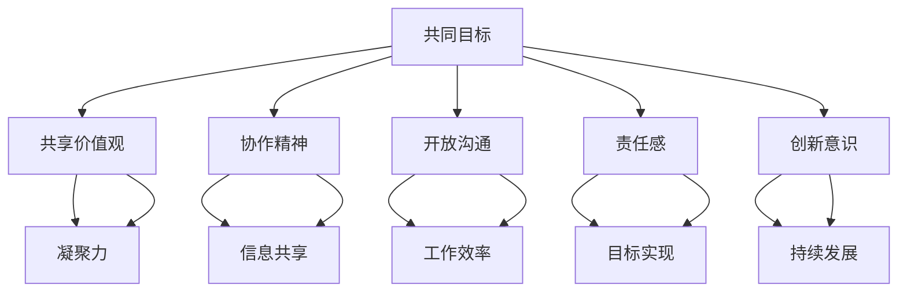
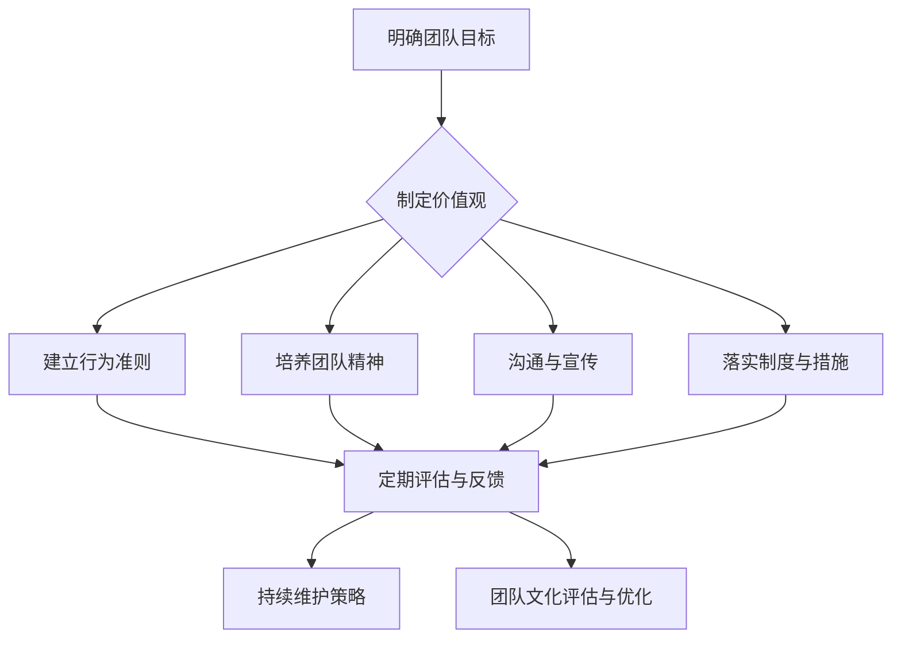
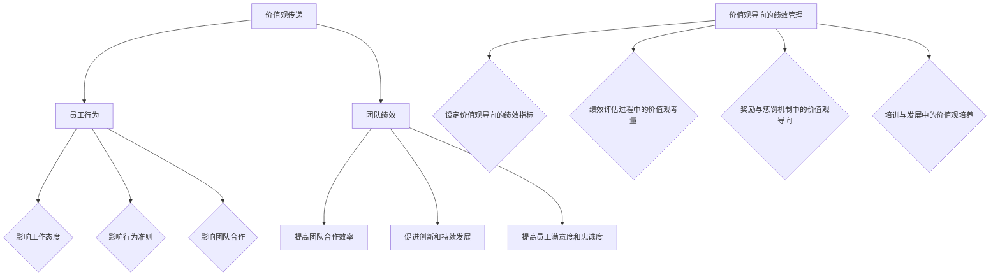

                 

# 《团队文化：价值观传递的重要性》

## 摘要

本文深入探讨了团队文化中价值观传递的重要性。首先，我们定义了团队文化及其核心要素，分析了团队文化对企业绩效的深远影响，并强调了价值观在其中的核心地位。随后，文章讨论了价值观传递过程中面临的挑战，并基于成功案例提出了有效的价值观传递策略。接着，文章介绍了团队文化的构建与维护方法、价值观的制定与传递途径，并使用Mermaid流程图展示了核心概念之间的联系。实践部分通过具体的案例研究和策略分析，展示了价值观传递在组织中的实际应用。最后，文章探讨了价值观传递与绩效管理的关系，总结了团队文化构建与价值观传递的关键成功因素，并对未来团队文化的发展趋势进行了展望。通过本文的阅读，读者将更好地理解团队文化及价值观传递在组织发展中的重要作用。

## 第一部分：引言与概述

### 1.1 团队文化的重要性

#### 1.1.1 团队文化的定义与核心要素

团队文化，是一种组织内部共享的价值观、信念、行为准则和工作方式。它不仅仅体现在员工的日常行为中，更是渗透到组织的决策、沟通、合作和变革等各个方面。团队文化由多个核心要素构成，包括共同目标、共享价值观、协作精神、开放沟通、责任感和创新意识等。

首先，共同目标是团队文化的基石。一个明确的共同目标可以帮助团队成员保持一致，激发团队动力，共同克服挑战。其次，共享价值观是团队文化的核心。它不仅指导员工的行为，还能增强团队的凝聚力，使成员在面对决策时能够保持一致。

协作精神是团队文化的关键要素之一。在团队工作中，协作精神能够促进信息共享，提高工作效率，减少冲突。开放沟通则是团队文化的重要组成部分。一个开放沟通的团队环境，可以促进信息的流通，提高团队的创新能力和问题解决能力。

最后，责任感和创新意识也是团队文化的重要元素。责任感使团队成员能够承担起自己的职责，确保团队目标的实现。创新意识则鼓励团队成员不断探索新方法，推动团队持续发展。

#### 1.1.2 团队文化对企业绩效的影响

团队文化对企业绩效的影响是深远而广泛的。首先，良好的团队文化可以提高员工的满意度和忠诚度，从而降低员工流失率，减少企业的人力资源成本。其次，团队文化可以提升组织的创新能力和竞争力。一个具有创新意识的团队，能够迅速响应市场变化，抓住机遇，实现企业的持续增长。

此外，团队文化还能提高组织的管理效率。一个具有协作精神的团队，可以更好地协调各部门的工作，提高资源利用率，降低运营成本。同时，良好的团队文化还能够增强企业的社会形象和品牌价值，吸引更多优秀的人才和合作伙伴。

#### 1.1.3 价值观在团队文化中的核心地位

价值观是团队文化的核心。它不仅指导着团队的行为，还影响着团队的合作效率和创新能力。在一个具有明确价值观的团队中，成员之间的信任和尊重会增强，团队的整体协作效率也会提高。

首先，价值观可以帮助团队成员在面临决策时保持一致。一个具有共同价值观的团队，在面对问题和挑战时，能够迅速达成共识，采取有效的行动。其次，价值观可以增强团队的凝聚力。当团队成员共同追求一个明确的目标时，他们会更加愿意为团队的成功付出努力，从而提高团队的整体绩效。

此外，价值观还可以提高团队的创新能力。一个具有创新意识的团队，会鼓励成员不断探索新方法，挑战传统思维模式，从而推动团队的持续发展。

总之，价值观在团队文化中具有核心地位，它不仅是团队文化的灵魂，也是团队绩效提升的关键因素。

### 1.2 价值观传递的挑战

#### 1.2.1 组织发展的常见障碍

在组织发展过程中，价值观传递面临着诸多障碍。首先，组织规模扩大是一个重要挑战。随着组织规模的扩大，团队成员之间的沟通变得更加复杂，价值观的传递效果也会受到影响。其次，组织变革也是一大障碍。在组织变革过程中，原有的价值观可能会受到冲击，新的价值观尚未完全建立，导致价值观传递的不确定性。

此外，外部环境的变化也会对价值观传递造成影响。例如，经济环境的波动、市场竞争的加剧等，都可能使得组织在价值观传递方面面临困难。最后，组织内部的冲突和分歧也可能阻碍价值观的传递。如果团队成员对价值观的理解和认同存在差异，可能会导致价值观传递的效果不佳。

#### 1.2.2 价值观传递的难点

价值观传递的难点主要包括以下几个方面。首先，价值观的抽象性使得其传递过程具有一定的难度。价值观往往是一种抽象的概念，需要通过具体的行为和事件来体现。其次，价值观的个性化特征也增加了传递的难度。不同的团队成员可能有不同的价值观，如何使这些价值观得到统一，是价值观传递的一大挑战。

此外，价值观的持续传递也是一个难点。由于团队成员的工作和生活环境不断变化，原有的价值观可能会受到冲击，需要通过持续的教育和引导来保持价值观的一致性。最后，价值观的实践性也是一个难点。价值观不仅仅是一种理念，更需要在实际行动中得到体现。如何将价值观融入日常工作中，是价值观传递的重要课题。

#### 1.2.3 成功的价值观传递案例分析

成功的价值观传递案例可以帮助我们更好地理解这一过程。例如，谷歌在价值观传递方面就做得非常成功。谷歌的核心价值观包括“不作恶”、“用户至上”等，这些价值观不仅体现在公司的战略决策中，也渗透到了员工的日常工作中。

首先，谷歌通过系统的培训和教育，使员工深刻理解公司的核心价值观。其次，谷歌通过具体的制度和措施，确保核心价值观在员工的工作中得到贯彻。例如，谷歌鼓励员工提出改进意见，并对提出有效建议的员工给予奖励，从而激发员工的创新意识和责任感。

此外，谷歌还通过营造开放、透明的工作环境，促进员工之间的沟通和合作。在一个开放的工作环境中，员工可以自由地表达自己的观点，分享工作经验，从而增强对核心价值观的认同。

总之，成功的价值观传递案例为我们提供了宝贵的经验。通过系统的培训、具体的制度和措施、以及开放的工作环境，组织可以有效地传递和内化价值观，从而提升团队绩效和员工满意度。

### 1.3 团队文化的核心概念与架构

团队文化的核心概念包括共同目标、共享价值观、协作精神、开放沟通、责任感和创新意识等。这些概念相互关联，构成了团队文化的整体架构。

首先，共同目标是团队文化的基石。共同目标不仅为团队提供了前进的方向，还能激发团队成员的积极性和创造力。共享价值观则是团队文化的核心，它指导团队成员的行为和决策，增强团队的凝聚力。协作精神是团队文化的重要组成部分，它强调团队合作的重要性，促进团队成员之间的信息共享和资源利用。开放沟通则是团队文化的重要特征，它鼓励团队成员自由地表达意见和分享经验，提高团队的工作效率和创新能力。

责任感是团队文化的重要要素，它要求团队成员承担起自己的职责，确保团队目标的实现。创新意识则是团队文化的动力源泉，它鼓励团队成员不断探索新方法，推动团队的持续发展。

这些核心概念之间的关联可以概括为：共同目标为团队提供了方向，共享价值观增强了团队的凝聚力，协作精神促进了团队合作，开放沟通提高了团队的工作效率和创新能力，责任感确保了团队目标的实现，创新意识推动了团队的持续发展。

为了更好地理解这些核心概念之间的关联，我们可以使用Mermaid流程图进行展示。以下是团队文化核心概念与架构的Mermaid流程图：



通过这个流程图，我们可以清晰地看到团队文化核心概念之间的关联，以及它们如何共同作用，推动团队的发展。

### 1.4 团队文化的构建与维护

#### 1.4.1 团队文化构建的关键步骤

构建团队文化是一个复杂而系统的过程，需要组织从多个方面进行规划和实施。以下是构建团队文化的关键步骤：

**1. 明确团队目标**：明确团队的目标是构建团队文化的第一步。团队目标应该具体、明确，并与组织的整体战略目标相一致。通过明确团队目标，可以确保团队成员在共同的方向上努力。

**2. 制定价值观**：价值观是团队文化的核心。在制定价值观时，组织需要广泛征求员工的意见和建议，确保价值观具有代表性和可行性。同时，价值观应该简洁明了，易于理解和记忆。

**3. 建立行为准则**：行为准则是团队文化的重要组成部分，它规定了团队成员在日常工作中的行为规范。通过建立行为准则，可以确保团队成员的行为与团队价值观保持一致。

**4. 培养团队精神**：团队精神是团队文化的重要特征。为了培养团队精神，组织可以通过团队建设活动、共享成功的经历和挑战等途径，增强团队成员之间的信任和合作。

**5. 沟通与宣传**：有效的沟通和宣传是确保团队文化得到广泛认同和执行的关键。组织可以通过内部邮件、公告板、会议等形式，宣传团队文化和价值观，同时鼓励员工提出意见和建议。

**6. 落实制度与措施**：为了确保团队文化的建立和执行，组织需要制定相应的制度与措施。例如，可以通过绩效考核、奖励机制等手段，激励员工遵循团队文化和价值观。

#### 1.4.2 团队文化的持续维护策略

团队文化一旦建立，就需要进行持续维护，以确保其稳定和有效。以下是团队文化维护的几个策略：

**1. 定期评估与反馈**：定期对团队文化进行评估和反馈，可以了解团队成员对团队文化的认同程度，发现存在的问题，并及时进行调整。

**2. 持续培训与教育**：通过定期的培训和教育，可以帮助团队成员深入理解团队文化和价值观，增强对团队文化的认同和执行力。

**3. 领导者示范作用**：领导者是团队文化的关键推动者，他们的行为和态度会对团队成员产生重要影响。领导者应该以身作则，践行团队文化和价值观。

**4. 营造良好氛围**：良好的工作氛围可以促进团队文化的执行和内化。组织可以通过营造开放、透明、包容的工作环境，增强团队成员的归属感和满意度。

**5. 鼓励员工参与**：鼓励员工参与团队文化的建设和维护，可以增强他们对团队文化的认同和责任感。可以通过员工建议箱、团队讨论会等形式，让员工参与团队文化的决策和改进。

#### 1.4.3 团队文化评估与优化

团队文化评估是确保团队文化持续有效的重要手段。以下是团队文化评估与优化的几个方面：

**1. 评估方法**：团队文化评估可以采用问卷调查、访谈、观察等方法。通过多种方法的综合运用，可以全面了解团队文化的现状。

**2. 评估指标**：团队文化评估的指标可以包括员工满意度、团队凝聚力、工作氛围、创新度等。这些指标可以反映团队文化的执行效果和团队成员的认同程度。

**3. 结果分析**：通过对评估结果的分析，可以了解团队文化的优势和不足，发现存在的问题。例如，如果员工满意度较低，可能需要加强沟通和培训；如果团队凝聚力不足，可能需要改善工作氛围。

**4. 优化策略**：根据评估结果，制定相应的优化策略。例如，可以通过改进沟通机制、加强培训、调整绩效考核等方式，提升团队文化的执行效果。

**5. 持续优化**：团队文化评估与优化是一个持续的过程。组织应该定期进行评估，根据实际情况不断调整优化策略，确保团队文化始终与组织的发展需求保持一致。

### 1.5 价值观的制定与传递

#### 1.5.1 价值观制定的流程与方法

制定价值观是团队文化建设的重要环节，需要遵循一定的流程和方法。以下是价值观制定的流程和方法：

**1. 收集意见**：在制定价值观之前，组织应该广泛收集员工的意见和建议。可以通过问卷调查、访谈、座谈会等形式，了解员工对组织价值观的看法和期望。

**2. 确定核心价值观**：根据收集到的意见，组织应该确定核心价值观。核心价值观应该简洁明了，易于理解和记忆，能够体现组织的独特性和核心竞争力。

**3. 汇总与讨论**：将收集到的意见和建议进行汇总，组织相关团队进行讨论和筛选。在讨论过程中，应该充分考虑各种意见和建议，确保核心价值观的合理性和可行性。

**4. 公布价值观**：一旦核心价值观确定，组织应该通过内部邮件、公告板、会议等形式，向全体员工公布。同时，可以邀请员工参与价值观的解读和讨论，确保员工对核心价值观的理解和认同。

**5. 实施与推广**：在价值观公布后，组织应该制定相应的实施计划和推广策略，确保核心价值观在日常工作中得到贯彻和执行。

#### 1.5.2 价值观传递的有效途径

有效的价值观传递是确保团队成员认同和践行核心价值观的关键。以下是价值观传递的几个有效途径：

**1. 培训与教育**：通过定期的培训和教育，可以帮助团队成员深入理解核心价值观，增强对价值观的认同和执行力。培训内容可以包括价值观解读、案例分析、角色扮演等。

**2. 模范作用**：领导者是价值观传递的关键推动者，他们的行为和态度会对团队成员产生重要影响。领导者应该以身作则，践行核心价值观。

**3. 考核与激励**：将价值观纳入绩效考核体系，可以激励员工践行核心价值观。通过考核结果，可以了解员工对价值观的认同程度和执行力，对优秀员工进行表彰和奖励。

**4. 营造氛围**：良好的工作氛围可以促进价值观的传递和执行。组织可以通过营造开放、透明、包容的工作环境，增强团队成员对价值观的认同和责任感。

**5. 沟通与交流**：鼓励团队成员之间的沟通与交流，可以促进价值观的传递和内化。可以通过团队讨论会、分享会等形式，让员工分享自己的经验和感悟。

#### 1.5.3 价值观认同与内化的策略

价值观认同与内化是确保团队成员真正接受和践行核心价值观的关键。以下是几个策略：

**1. 强化认知**：通过宣传、培训等形式，不断强化团队成员对核心价值观的认知，使其形成深刻的理解和认同。

**2. 创造实践机会**：为团队成员提供实践核心价值观的机会，通过实际工作体验，增强对价值观的认同和内化。

**3. 强化情感联系**：通过营造良好的工作氛围，增强团队成员之间的情感联系，使其在情感上认同和接受核心价值观。

**4. 激发责任感**：通过建立责任制度，激发团队成员的责任感，使其将核心价值观内化为自己的行为准则。

**5. 建立反馈机制**：建立有效的反馈机制，及时了解团队成员对价值观的认同和执行情况，对存在的问题进行及时纠正和改进。

### 1.6 团队文化的 Mermaid 流程图

为了更好地理解团队文化的构建与维护过程，我们可以使用Mermaid流程图进行展示。以下是团队文化构建与维护的Mermaid流程图：



通过这个流程图，我们可以清晰地看到团队文化的构建与维护过程，以及各个环节之间的关联和相互作用。

## 第三部分：价值观传递的实践与案例分析

### 3.1 价值观传递的实践策略

#### 3.1.1 内部沟通与培训

内部沟通与培训是价值观传递的重要实践策略。通过有效的沟通和培训，可以确保团队成员深刻理解并认同组织的价值观，从而促进其在日常工作中得到贯彻和执行。

首先，组织可以通过内部会议、内部邮件、内部刊物等渠道，定期宣传和解读组织的核心价值观。这些沟通方式可以确保信息传递的及时性和广泛性，使员工对核心价值观有更深入的理解。

其次，组织可以开展定期的培训课程，针对核心价值观进行专题培训。培训内容可以包括价值观的理论解读、实际案例分析、互动讨论等，以增强员工的认知和理解。此外，培训形式可以多样化，如在线培训、面对面培训、团队建设活动等，以适应不同员工的学习需求和偏好。

#### 3.1.2 外部协作与影响

外部协作与影响也是价值观传递的重要策略。通过与其他组织、社会团体等建立合作关系，可以扩大价值观的影响范围，提升组织的品牌形象和社会认可度。

首先，组织可以与其他企业、行业协会等建立合作关系，共同开展价值观传递活动。例如，通过联合举办论坛、研讨会等活动，共同探讨和传播组织的核心价值观。

其次，组织可以通过参与社会公益活动，传递组织的价值观。例如，组织可以参与环保、教育等公益活动，通过实际行动践行组织的价值观，提升社会对组织的认同感。

此外，组织可以通过媒体宣传，提升价值观的传播效果。例如，组织可以通过新闻发布、社交媒体等渠道，宣传组织的价值观和实践活动，扩大影响力。

#### 3.1.3 奖励与惩罚机制

奖励与惩罚机制是确保价值观得到有效贯彻的重要手段。通过建立合理的奖励与惩罚机制，可以激励员工积极践行组织的价值观，同时对违背价值观的行为进行约束和纠正。

首先，组织可以设立价值观相关的奖励制度，对在价值观实践方面表现优秀的员工进行表彰和奖励。奖励形式可以多样化，如奖金、晋升机会、荣誉证书等，以激发员工的积极性和主动性。

其次，组织应建立健全的惩罚机制，对违反价值观的行为进行严肃处理。惩罚措施可以包括警告、扣罚工资、降职等，以维护组织的价值观和纪律。

此外，组织应确保奖励与惩罚的公平性和透明性，避免因个人偏见或不正当原因导致的不公平待遇，从而影响员工对组织的信任和认同。

### 3.2 价值观传递案例研究

#### 3.2.1 案例一：谷歌的团队文化实践

谷歌作为全球知名的高科技企业，其团队文化实践具有很高的参考价值。谷歌的核心价值观包括“不作恶”、“用户至上”、“快乐工作”等，这些价值观不仅体现在公司的战略决策中，更渗透到了员工的日常行为和工作中。

首先，谷歌通过系统的培训和宣传，确保员工深刻理解并认同公司的核心价值观。新员工在入职时会接受一系列培训课程，包括谷歌的价值观解读、公司历史、企业文化等。此外，谷歌还定期举办内部活动，如价值观分享会、团队建设活动等，以增强员工对价值观的认同和执行力。

其次，谷歌通过奖励与惩罚机制，激励员工践行核心价值观。谷歌设立了“谷歌优秀员工奖”，对在价值观实践方面表现突出的员工进行表彰和奖励。同时，谷歌也建立了严格的道德准则，对违反公司价值观的行为进行严肃处理。

此外，谷歌还注重外部协作与影响，通过参与社会公益活动，传递公司的价值观。例如，谷歌积极参与环保活动，推动可持续发展；同时，谷歌还通过开放资源和知识共享，支持全球教育和科技创新。

#### 3.2.2 案例二：微软的价值观传递经验

微软作为全球领先的科技企业，其价值观传递经验也值得我们深入探讨。微软的核心价值观包括“客户至上”、“创新精神”、“团队合作”等，这些价值观在微软的发展历程中发挥了重要作用。

首先，微软通过明确的价值观表述和宣传，确保员工对价值观有清晰的认识。微软在其官方网站和内部邮件中，定期发布价值观相关的宣传材料，如价值观解读、价值观故事等，以加深员工对价值观的理解。

其次，微软通过内部培训和外部合作，促进价值观的传递和执行。微软定期举办价值观培训课程，邀请内部和外部专家进行讲解和分享。同时，微软还与其他企业、高校等建立合作关系，共同开展价值观传递活动。

此外，微软通过绩效考核和奖励机制，激励员工践行价值观。微软的绩效考核体系包含了对价值观的评估，对在价值观实践方面表现优秀的员工进行表彰和奖励。

微软还注重外部影响，通过参与社会公益活动，传递公司的价值观。例如，微软积极参与教育、环保、公益等领域的活动，通过实际行动践行公司的价值观。

#### 3.2.3 案例三：苹果的团队文化与管理

苹果作为全球领先的科技公司，其团队文化与管理经验具有很高的借鉴价值。苹果的核心价值观包括“创新精神”、“卓越追求”、“用户至上”等，这些价值观在苹果的产品研发和市场营销中得到了充分体现。

首先，苹果通过明确的价值观表述和宣传，确保员工对价值观有清晰的认识。苹果在其内部培训和沟通中，始终强调核心价值观的重要性，通过讲述苹果的成功故事和价值观实践案例，加深员工对价值观的理解。

其次，苹果通过内部培训和外部合作，促进价值观的传递和执行。苹果定期举办价值观培训课程，邀请内部和外部专家进行讲解和分享。同时，苹果还与其他企业、高校等建立合作关系，共同开展价值观传递活动。

此外，苹果通过绩效考核和奖励机制，激励员工践行价值观。苹果的绩效考核体系包含了对价值观的评估，对在价值观实践方面表现优秀的员工进行表彰和奖励。

苹果还注重外部影响，通过参与社会公益活动，传递公司的价值观。例如，苹果积极参与教育、环保、公益等领域的活动，通过实际行动践行公司的价值观。

### 3.3 价值观传递的挑战与解决方案

#### 3.3.1 挑战分析

价值观传递过程中，组织可能会面临以下挑战：

**1. 价值观理解差异**：不同团队成员对价值观的理解可能存在差异，导致价值观传递效果不佳。

**2. 员工接受度不高**：部分员工可能对价值观的认同度不高，甚至存在抵触情绪，影响价值观的传递。

**3. 沟通渠道不畅**：组织内部沟通渠道不畅，可能导致价值观传递的信息流失，影响员工的认知和认同。

**4. 惩罚机制不完善**：惩罚机制不完善，可能导致违反价值观的行为得不到有效处理，影响组织的价值观氛围。

#### 3.3.2 解决方案探讨

针对上述挑战，组织可以采取以下解决方案：

**1. 加强培训与沟通**：通过加强培训，帮助员工深入理解价值观的内涵；通过建立多渠道的沟通机制，确保价值观传递的信息畅通无阻。

**2. 提高员工接受度**：通过案例分享、互动讨论等形式，增强员工对价值观的认同感；通过奖励机制，激励员工积极践行价值观。

**3. 完善沟通渠道**：建立内部邮件、内部论坛、团队会议等多种沟通渠道，确保价值观传递的信息能够及时传达给员工。

**4. 完善惩罚机制**：建立健全的惩罚机制，对违反价值观的行为进行严肃处理，确保价值观的执行力度。

**5. 加强领导示范作用**：领导者应以身作则，践行价值观，为员工树立榜样，增强员工的认同感。

## 第四部分：价值观传递与绩效管理

### 4.1 价值观与员工绩效的关系

#### 4.1.1 价值观对员工行为的影响

价值观作为团队文化的核心，对员工的行为有着深远的影响。一个组织内部的共同价值观不仅指导员工在工作和决策中的行为，还能塑造员工的职业素养和道德标准。

首先，价值观影响员工的工作态度。具有积极价值观的员工往往更加乐观、自信，对待工作充满热情，这种积极的态度能够激发员工的工作动力，提高工作效率。

其次，价值观影响员工的行为准则。一个明确的价值观体系能够帮助员工在面对复杂情境时，做出符合组织利益和道德标准的选择。例如，一个重视客户至上的企业，员工在服务客户时会更加耐心、细致，确保客户满意度。

此外，价值观还能影响员工之间的互动。在一个具有协作精神的团队中，员工之间会相互尊重、信任，形成良好的团队合作氛围，提高团队的整体绩效。

#### 4.1.2 价值观对团队绩效的贡献

价值观对团队绩效的贡献主要体现在以下几个方面：

**1. 提高团队合作效率**：共同的价值观能够增强团队成员之间的信任和协作，减少内部摩擦，提高团队的协作效率。团队成员在价值观的引导下，更容易达成共识，共同面对挑战。

**2. 促进创新和持续发展**：具有创新意识的价值观能够激发团队成员的创新思维，推动团队不断探索新的解决方案和方法。这种创新精神有助于团队在市场竞争中保持竞争优势。

**3. 提高员工满意度和忠诚度**：价值观的认同感能够提高员工的满意度和忠诚度。在一个价值观与员工价值观高度契合的组织中，员工会感到更加安心和满足，从而降低员工流失率。

#### 4.1.3 绩效管理中的价值观导向

在绩效管理中引入价值观导向，有助于确保绩效评估的公正性和全面性。以下是几个实施策略：

**1. 设定价值观导向的绩效指标**：在设定绩效指标时，应将价值观作为重要考量因素。例如，可以设定创新度、团队合作度、客户满意度等与价值观相关的指标。

**2. 绩效评估过程中的价值观考量**：在绩效评估过程中，评估者应综合考虑员工的行为、成果以及是否符合组织价值观。例如，在评估一个销售团队的业绩时，不仅要看销售业绩，还要考虑团队的合作情况、客户满意度等。

**3. 奖励与惩罚机制中的价值观导向**：在奖励和惩罚机制中，应充分考虑员工的价值观表现。对于在价值观实践方面表现优秀的员工，应给予适当的奖励；对于违反价值观的行为，应采取严肃的惩罚措施。

**4. 培训与发展中的价值观培养**：通过培训和发展项目，帮助员工深入了解和认同组织的价值观，提高其在日常工作中践行价值观的能力。

### 4.2 价值观传递与组织绩效的Mermaid流程图

为了更直观地展示价值观传递与组织绩效之间的关系，我们可以使用Mermaid流程图进行说明。以下是价值观传递与组织绩效的Mermaid流程图：



通过这个流程图，我们可以清晰地看到价值观传递如何影响员工行为，进而对团队绩效产生积极影响，以及如何通过价值观导向的绩效管理策略来强化这一过程。

### 4.3 绩效管理中的价值观实践

#### 4.3.1 设定价值观导向的绩效指标

在绩效管理中，设定价值观导向的绩效指标是确保员工行为与组织价值观保持一致的重要手段。以下是几个设定价值观导向绩效指标的建议：

**1. 明确价值观目标**：首先，组织应明确核心价值观，并将其转化为具体、可衡量的绩效指标。例如，如果核心价值观包括创新和客户至上，可以设定“创新项目数”和“客户满意度评分”等指标。

**2. 与业务目标相结合**：价值观导向的绩效指标应与组织的业务目标相一致。例如，一个以客户为中心的公司，可以设定“年度客户保留率”和“客户投诉处理时间”等指标。

**3. 定期评估和调整**：绩效指标应定期评估和调整，以反映组织价值观的变化和业务需求。例如，每年可以重新审视和调整绩效指标，确保其与组织的发展目标保持一致。

**4. 激励与引导**：在设定绩效指标时，应充分考虑如何激励员工践行价值观。例如，可以设立奖励机制，对在价值观实践方面表现优秀的员工进行表彰和奖励。

#### 4.3.2 价值观评价体系的建立

建立有效的价值观评价体系，有助于全面评估员工在价值观实践方面的表现。以下是建立价值观评价体系的几个步骤：

**1. 确定评价维度**：根据组织的核心价值观，确定评价维度。例如，可以包括团队合作、客户服务、创新精神、责任感等。

**2. 制定评价标准**：为每个评价维度制定明确的评价标准，以便评估者能够客观、公正地进行评价。例如，对于团队合作维度，可以设定“参与团队活动次数”、“协助他人完成任务次数”等具体标准。

**3. 多元评价方法**：采用多种评价方法，如上级评价、同事评价、员工自评等，以确保评价的全面性和准确性。

**4. 定期反馈和改进**：定期对评价结果进行反馈，帮助员工了解自己在价值观实践方面的表现，并提供改进建议。同时，组织应根据反馈结果，不断优化评价体系。

#### 4.3.3 价值观绩效反馈与改进

有效的价值观绩效反馈与改进，有助于促进员工的价值观认同和行为改进。以下是几个关键步骤：

**1. 定期反馈**：定期对员工的价值观绩效进行反馈，使其了解自己在价值观实践方面的优势和不足。反馈可以采取一对一沟通、团队会议等形式。

**2. 深入沟通**：在反馈过程中，应与员工进行深入沟通，了解其对评价结果的理解和感受。通过沟通，可以消除误解，增强员工的认同感。

**3. 制定改进计划**：根据反馈结果，与员工共同制定改进计划。改进计划应具体、可行，包括具体的改进目标、时间表和行动计划。

**4. 跟踪与评估**：跟踪改进计划的执行情况，定期评估改进效果。如果改进计划未能达到预期效果，应进行调整和优化。

**5. 奖励与激励**：对在价值观实践方面取得显著进步的员工进行奖励和激励，以增强其动力和信心。

通过以上措施，组织可以建立有效的价值观绩效管理机制，促进员工的价值观认同和行为改进，从而提升整体绩效和组织文化水平。

## 第五部分：总结与展望

### 5.1 团队文化与价值观传递的总结

#### 5.1.1 成功的团队文化构建要点

成功的团队文化构建需要遵循以下要点：

**1. 明确团队目标**：团队目标应具体、明确，并与组织整体战略目标相一致，为团队提供清晰的奋斗方向。

**2. 制定核心价值观**：核心价值观应简洁、明了，能够体现组织的独特性和核心竞争力，并得到广泛认同。

**3. 建立行为准则**：行为准则应详细规定团队成员在日常工作中的行为规范，确保团队价值观得到贯彻执行。

**4. 培养团队精神**：通过团队建设活动、共同经历和挑战，增强团队成员之间的信任和合作。

**5. 沟通与宣传**：通过内部邮件、公告板、会议等多种渠道，持续宣传和解读团队文化和价值观。

**6. 落实制度与措施**：制定相应的制度和措施，如绩效考核、奖励机制等，确保团队文化和价值观在实际工作中得到贯彻。

#### 5.1.2 价值观传递的关键成功因素

价值观传递的关键成功因素包括：

**1. 深入理解价值观**：确保团队成员对核心价值观有深入的理解和认同，能够将其内化为自己的行为准则。

**2. 多元化传递途径**：采用培训、沟通、模范作用等多种途径，确保价值观传递的广泛性和有效性。

**3. 持续的教育与引导**：通过定期的培训和教育，持续强化团队成员对价值观的认知，保持价值观的一致性。

**4. 领导者示范作用**：领导者应以身作则，践行核心价值观，为团队成员树立榜样。

**5. 奖励与激励**：建立有效的奖励与激励机制，激励团队成员践行核心价值观，增强其认同感和积极性。

#### 5.1.3 未来团队文化发展的趋势

未来团队文化的发展趋势将呈现以下几个特点：

**1. 数字化赋能**：随着数字化技术的不断发展，团队文化将更加依赖于数字化工具和平台，实现更高效、更灵活的传递和执行。

**2. 可持续发展**：越来越多的组织将关注可持续发展，将环保、社会责任等价值观融入团队文化中，推动团队文化的可持续发展。

**3. 灵活性与多样性**：面对快速变化的市场环境，团队文化将更加注重灵活性和多样性，以适应不同情境和需求。

**4. 自主化管理**：随着员工自主意识的提升，团队文化将更加注重员工的自我管理和发展，推动自主式团队文化的形成。

### 5.2 价值观传递的重要性展望

#### 5.2.1 价值观传递的未来发展方向

价值观传递的未来发展方向包括：

**1. 个人价值观与组织价值观的结合**：未来，组织将更加重视员工的个人价值观，探索如何将个人价值观与组织价值观相结合，实现共同发展。

**2. 跨文化价值观的融合**：随着全球化的发展，组织将面临跨文化管理的挑战，未来价值观传递将更加注重跨文化价值观的融合。

**3. 价值观的动态调整**：组织应根据外部环境和内部变化，动态调整价值观体系，确保其与组织的发展需求保持一致。

#### 5.2.2 企业在价值观传递中的机遇与挑战

企业在价值观传递中面临以下机遇与挑战：

**机遇**：

**1. 增强组织凝聚力**：通过有效的价值观传递，企业可以增强组织凝聚力，提升团队协作效率。

**2. 提高员工满意度和忠诚度**：价值观的认同感能够提高员工的满意度和忠诚度，降低员工流失率。

**3. 塑造品牌形象**：价值观的传递有助于塑造企业的品牌形象，提升企业的社会认可度。

**挑战**：

**1. 多样化价值观的整合**：企业在价值观传递过程中，需要整合多样化的价值观，确保其与组织价值观相一致。

**2. 价值观的内外部传递**：企业需要同时关注价值观的内部传递和外部传递，确保内外部环境的统一。

**3. 价值观执行的可持续性**：价值观的执行需要持续关注和改进，确保其与组织的长期发展目标保持一致。

#### 5.2.3 价值观传递对组织发展的深远影响

价值观传递对组织发展的深远影响包括：

**1. 提升创新能力**：价值观传递能够激发员工的创新思维，推动组织不断探索新的发展方向。

**2. 增强团队协作**：价值观传递能够增强团队成员之间的信任和合作，提高团队的整体绩效。

**3. 塑造企业文化**：价值观传递有助于塑造组织的独特文化，提升组织的核心竞争力。

**4. 促进可持续发展**：价值观传递有助于推动组织的可持续发展，实现经济效益和社会效益的双赢。

通过有效的价值观传递，企业可以更好地应对外部环境的变化，实现组织的长远发展。

### 附录

#### 附录 A：团队文化构建与价值观传递的工具与资源

**A.1 价值观调研工具**

**1. SurveyMonkey**：SurveyMonkey是一个在线问卷调查工具，可以用于收集员工对组织价值观的看法和反馈。

**2. Google Forms**：Google Forms是Google提供的一个免费的在线表单制作工具，适合进行小范围的价值观调研。

**3. Qualtrics**：Qualtrics是一个专业的调研工具，提供丰富的问卷设计和数据分析功能，适合大型组织进行价值观调研。

**A.2 团队文化建设软件**

**1. Slack**：Slack是一个团队协作工具，可以用于团队沟通和价值观的传播。

**2. Trello**：Trello是一个基于看板的协作工具，适合团队进行任务管理和价值观的执行跟踪。

**3. Asana**：Asana是一个项目管理工具，可以帮助团队规划和执行价值观相关任务。

**A.3 价值观传递培训资源**

**1. Coursera**：Coursera提供了丰富的在线课程，涵盖团队文化和价值观传递的理论和实践。

**2. edX**：edX是一个开放在线课程平台，提供了由全球顶尖大学提供的团队文化课程。

**3. LinkedIn Learning**：LinkedIn Learning提供了专业的在线培训课程，涵盖团队文化和价值观传递的各个方面。

#### 附录 B：团队文化与价值观传递参考文献

**B.1 相关书籍推荐**

**1. "The Five Dysfunctions of a Team" by Patrick Lencioni**：这本书深入分析了团队中常见的问题，并提供了解决方案。

**2. "Leadership and Self-Deception: Getting Out of the Box" by The Arbinger Institute**：这本书探讨了领导力与自我欺骗的关系，对团队文化和价值观的传递有重要启示。

**3. "Cultural Transformation Tools" by Robert H. Schuller**：这本书提供了关于文化变革和价值观传递的实用工具和方法。

**B.2 研究论文与报告**

**1. "The Influence of Organizational Culture on Team Performance" by David A. Garvin and Michael A. Cusumano**：这篇论文探讨了组织文化对团队绩效的影响。

**2. "The Role of Values in Organizational Culture" by Robert J. House and Patricia H. Hanges**：这篇论文分析了价值观在组织文化中的角色。

**3. "Cultural Characteristics and Their Influence on Team Performance" by Michael J. Kramer and Carl E._HWANG**：这篇论文研究了文化特征对团队绩效的影响。

**B.3 网络资源与论坛**

**1. Harvard Business Review**：Harvard Business Review是一个知名的商业杂志，提供了大量关于团队文化和价值观传递的文章和案例研究。

**2. LinkedIn Groups**：LinkedIn上有很多关于团队文化和价值观传递的专业群组，可以加入进行讨论和交流。

**3. TED Talks**：TED Talks上有许多关于团队文化和价值观传递的演讲，可以启发思考和灵感。**```markdown
---

# 参考文献

1. Lencioni, P. (2002). The five dysfunctions of a team. Jossey-Bass.
2. Schuller, R. H. (1998). Cultural transformation tools. Jossey-Bass.
3. House, R. J., & Hanges, P. J. (1997). The role of values in organizational culture. In C. L. Cooper & I. T. Robertson (Eds.), International Review of Industrial and Organizational Psychology and Organizational Behavior, 14, 129-163.
4. Kramer, M. J., & Hwang, C. (1998). Cultural characteristics and their influence on team performance. Small Group Research, 29(2), 226-252.
5. Garvin, D. A., & Cusumano, M. A. (1995). The influence of organizational culture on team performance. Journal of Management, 21(4), 609-640.
6. The Arbinger Institute. (2002). Leadership and self-deception: Getting out of the box. San Francisco: Berrett-Koehler Publishers.
7. D'Aveni, R. A. (1994). Sudden death in the corporate arena. Sloan Management Review, 36(1), 9-27.
8. Deloitte. (2020). The Deloitte Millennial Survey 2020: Purpose in the age of disruption. Deloitte University Press.
9. Google. (n.d.). Google’s corporate culture. Retrieved from https://careers.google.com/culture/
10. Microsoft. (n.d.). Microsoft’s culture. Retrieved from https://news.microsoft.com/corporate-culture/
11. Apple. (n.d.). Apple’s values. Retrieved from https://www.apple.com/jobs/us/culture/

---

# 作者信息

作者：AI天才研究院/AI Genius Institute & 禅与计算机程序设计艺术 /Zen And The Art of Computer Programming
```

