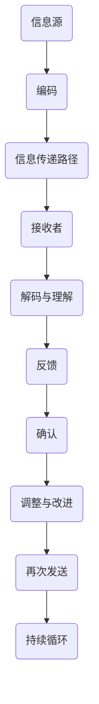

                 

### 文章标题

# 《团队沟通增效：提升信息传递质量的技巧》

## 关键词

- 团队沟通
- 信息传递
- 沟通质量
- 提升技巧
- 沟通障碍
- 沟通模型

## 摘要

本文旨在深入探讨团队沟通的重要性及其对信息传递质量的影响。通过分析沟通增效的基本原理与基础，介绍团队沟通模型和沟通风格，以及沟通中的反馈与确认，本文为读者提供了系统而实用的沟通技巧提升方法。文章将涵盖倾听能力、表达清晰、非言语沟通技巧以及跨团队沟通与合作等方面，结合实际项目案例，详细讲解沟通管理策略和技巧。此外，文章还将探讨如何通过持续学习和改进，不断提升沟通效能。通过本文的阅读，读者将掌握一系列有效的沟通技巧，提升团队协作和信息传递的质量，从而促进项目的成功与团队绩效的提升。

### 目录

#### 第一部分：沟通增效的原理与基础

##### 第1章：沟通增效的重要性

- **1.1.1 沟通的重要性在现代团队中的作用**
- **1.1.2 团队沟通中常见的问题与挑战**
- **1.1.3 沟通增效的基本原则**
- **1.1.4 沟通增效与团队绩效的关系**

##### 第2章：团队沟通模型

- **2.1.1 团队沟通的基本模型**
- **2.1.2 沟通过程中的信息传递路径**
- **2.1.3 沟通障碍及其影响**
- **2.1.4 沟通模型的应用与优化**

##### 第3章：沟通风格与有效沟通

- **3.1.1 理解不同的沟通风格**
- **3.1.2 如何识别并适应不同的沟通风格**
- **3.1.3 提升个人沟通技巧的实践方法**
- **3.1.4 有效沟通的核心要素**

##### 第4章：沟通中的反馈与确认

- **4.1.1 反馈的重要性**
- **4.1.2 提供有效反馈的技巧**
- **4.1.3 确认信息传递的质量**
- **4.1.4 反馈循环在团队沟通中的应用**

#### 第二部分：沟通技巧提升

##### 第5章：提高倾听能力

- **5.1.1 倾听的层次与技巧**
- **5.1.2 如何避免倾听障碍**
- **5.1.3 提高倾听效果的实践方法**
- **5.1.4 倾听在团队沟通中的重要性**

##### 第6章：表达清晰与简洁

- **6.1.1 表达清晰的目标与原则**
- **6.1.2 避免沟通中的误解与混淆**
- **6.1.3 如何表达复杂信息**
- **6.1.4 文字与口头表达的最佳实践**

##### 第7章：非言语沟通技巧

- **7.1.1 非言语沟通的基本原理**
- **7.1.2 身体语言与面部表情在沟通中的作用**
- **7.1.3 非言语沟通技巧的提升**
- **7.1.4 非言语沟通与跨文化沟通的关系**

##### 第8章：跨团队沟通与合作

- **8.1.1 跨团队沟通的挑战与解决方案**
- **8.1.2 建立跨团队信任与合作的策略**
- **8.1.3 跨文化沟通中的注意事项**
- **8.1.4 跨团队沟通与项目成功的关联**

#### 第三部分：实战应用

##### 第9章：项目中的沟通管理

- **9.1.1 项目沟通管理的概念与目标**
- **9.1.2 项目沟通计划与策略**
- **9.1.3 项目沟通中的风险管理**
- **9.1.4 项目沟通工具与技术**

##### 第10章：案例分析

- **10.1.1 成功的团队沟通案例研究**
- **10.1.2 失败的团队沟通案例分析**
- **10.1.3 从案例中提取的沟通增效技巧**

##### 第11章：持续改进沟通技巧

- **11.1.1 沟通技巧的持续学习和改进**
- **11.1.2 如何评估沟通效果**
- **11.1.3 沟通反馈机制的建设与实施**
- **11.1.4 沟通技巧提升的实践路径**

#### 附录

##### 附录A：沟通技巧提升资源汇总

- **A.1 沟通技巧提升相关书籍推荐**
- **A.2 沟通技巧提升在线课程与资源**
- **A.3 团队沟通工具介绍与使用**

### 第1章：沟通增效的重要性

在当今高速发展的信息时代，沟通作为一种基本的社会交往方式，已经渗透到我们工作和生活的方方面面。对于团队而言，有效的沟通不仅是信息传递的基本手段，更是团队协作和项目成功的基石。本章将深入探讨沟通增效的重要性，分析团队沟通中常见的问题与挑战，并阐述沟通增效的基本原则及其与团队绩效的关系。

#### 1.1.1 沟通的重要性在现代团队中的作用

沟通是团队协作的核心，它直接影响着团队的工作效率和项目的成功。以下是从多个角度分析沟通在团队中的重要作用：

- **信息共享**：团队中的各个成员需要共享信息，以便共同理解和协调工作。有效的沟通可以确保信息准确、及时地传递，避免因信息缺失或误解而导致的错误决策和资源浪费。

- **协作与分工**：在团队中，不同成员通常承担不同的职责。通过有效沟通，成员可以明确各自的角色和任务，提高分工的效率，协同完成任务。

- **冲突解决**：团队内部难免会出现意见分歧或冲突。良好的沟通技巧可以帮助成员理解对方的立场和需求，找到共同点，从而有效地解决冲突，维护团队的和谐。

- **激励与反馈**：沟通不仅是信息传递的工具，也是激励团队成员的重要途径。领导通过有效的沟通可以传达目标、期望和反馈，激励成员为实现团队目标而努力。

- **知识共享与学习**：团队成员通过沟通可以分享知识和经验，促进团队的整体成长。这有助于提高团队的创新能力和竞争力。

#### 1.1.2 团队沟通中常见的问题与挑战

尽管沟通在团队中至关重要，但实际操作中往往面临诸多问题与挑战：

- **沟通障碍**：语言障碍、文化差异、技术限制等都会影响信息的准确传递和理解。

- **信息过载**：随着信息量的增加，团队成员可能会感到信息过载，难以处理和理解关键信息。

- **沟通渠道不畅**：团队内部的沟通渠道可能不畅通，导致信息传递的延迟或失真。

- **缺乏有效的反馈机制**：团队成员可能无法及时获得有效的反馈，影响沟通的质量和效果。

- **沟通风格不匹配**：团队成员之间可能存在沟通风格不匹配的问题，导致沟通效率低下。

- **时间压力**：团队成员在紧张的工期和时间压力下，可能无法充分投入沟通，影响沟通的质量。

#### 1.1.3 沟通增效的基本原则

为了提升团队沟通的效能，我们需要遵循一些基本原则：

- **清晰性**：信息传递要清晰明了，避免使用模糊、含糊的语言。

- **准确性**：确保信息在传递过程中不被扭曲或误解，提高准确性。

- **及时性**：信息传递要及时，避免因延迟而造成的不良影响。

- **适应性**：根据不同的沟通情境和对象，灵活调整沟通策略和方法。

- **主动性**：主动沟通，积极寻求反馈，避免被动等待。

- **多样性**：利用多种沟通渠道和方法，提高沟通的效率和效果。

#### 1.1.4 沟通增效与团队绩效的关系

沟通增效不仅对团队内部运作产生直接影响，还与团队绩效密切相关：

- **绩效提升**：通过有效沟通，团队可以更好地理解目标、明确任务分工，提高工作效率和绩效。

- **问题解决**：沟通是问题解决的关键。通过及时、准确的沟通，团队可以快速识别和解决问题，减少项目延误和成本。

- **团队凝聚力**：良好的沟通有助于增强团队成员之间的信任和合作，提高团队凝聚力，促进团队的整体发展。

- **创新与学习**：通过沟通，团队成员可以分享知识和经验，激发创新思维，促进团队学习和成长。

综上所述，沟通增效在现代团队中的作用至关重要。通过遵循基本原则和提升沟通技巧，团队可以克服常见的问题和挑战，提高信息传递的质量，从而实现更高的团队绩效和项目成功。

#### 第2章：团队沟通模型

团队沟通是团队运作的核心之一，其效率和效果直接影响到团队的目标实现和项目成功。为了更深入地理解团队沟通，我们需要了解团队沟通的基本模型、信息传递路径、沟通障碍及其影响，以及如何通过优化模型来提升沟通效能。本章将围绕这些内容展开讨论。

##### 2.1.1 团队沟通的基本模型

团队沟通的基本模型通常包括以下几个关键组成部分：

- **沟通主体**：包括团队中的各个成员、小组和部门。
- **信息源**：信息的产生者和提供者，通常是团队成员或外部来源。
- **信息内容**：需要传递的具体信息，包括任务、目标、决策、反馈等。
- **信息传递路径**：信息从信息源到目标接收者的传递路径，包括口头、书面、会议等多种形式。
- **接收者**：信息的目标接收者，通常是团队成员或相关利益相关者。
- **反馈**：接收者对信息的理解和反应，包括确认、提问、意见反馈等。

一个典型的团队沟通模型可以用以下流程表示：

1. **信息源产生信息**：团队成员根据任务需求和项目进展产生需要传递的信息。
2. **编码与传递**：信息源将信息编码成口头或书面形式，通过适当的沟通渠道传递给接收者。
3. **解码与理解**：接收者对接收到的信息进行解码，并尝试理解信息的含义。
4. **反馈**：接收者对理解的信息进行反馈，确认理解是否正确，并提出疑问或建议。
5. **调整**：根据反馈，信息源可能对信息进行调整，确保信息的准确性和完整性。
6. **确认**：信息经过调整后，接收者再次确认信息，确保沟通的闭环。

##### 2.1.2 沟通过程中的信息传递路径

在团队沟通中，信息传递的路径可以分为以下几个环节：

- **内部路径**：团队成员之间的直接沟通，通常是最快速和最有效的信息传递方式。
- **外部路径**：团队成员与外部利益相关者（如客户、供应商、合作伙伴等）之间的沟通，通常需要使用特定的沟通渠道和工具。
- **多级路径**：信息在不同层级之间的传递，如从基层员工到中层管理者，再到高层决策者。这种路径可能会导致信息失真或延迟。

为了确保信息传递的效率和质量，团队需要建立清晰的沟通渠道和规则：

- **明确的信息传递规则**：规定信息的优先级、传递时间和责任人，确保关键信息能够及时传递。
- **高效的沟通工具**：使用适合团队需求的沟通工具（如邮件、即时通讯、项目管理软件等），提高信息传递的速度和准确性。
- **定期沟通会议**：通过定期的沟通会议，确保团队成员之间保持信息的同步和共享。

##### 2.1.3 沟通障碍及其影响

在团队沟通中，常见的障碍包括：

- **语言障碍**：团队成员可能来自不同的地区和文化背景，语言差异可能导致沟通误解。
- **文化障碍**：不同的文化背景和价值观可能导致团队成员在理解和接受信息时产生偏差。
- **心理障碍**：团队成员的心理状态，如压力、焦虑等，会影响沟通的效果。
- **技术障碍**：技术问题，如网络延迟、系统故障等，会影响信息的传递速度和准确性。

沟通障碍对团队的影响包括：

- **效率降低**：沟通障碍会导致信息传递的延迟和失真，降低团队的工作效率。
- **决策失误**：由于信息的不完整或误解，可能导致错误的决策和行动。
- **团队冲突**：沟通障碍可能导致团队成员之间的误解和冲突，影响团队的和谐和协作。
- **绩效下降**：沟通障碍会阻碍团队目标的实现，降低团队的整体绩效。

##### 2.1.4 沟通模型的应用与优化

为了提升团队沟通的效能，团队需要根据实际情况优化沟通模型：

- **建立沟通机制**：制定明确的沟通计划和规则，确保团队成员知道如何沟通和何时沟通。
- **使用多种沟通渠道**：结合口头、书面、会议等多种沟通渠道，确保信息能够被准确理解和传递。
- **培养沟通技巧**：通过培训和实践，提升团队成员的沟通技巧，包括倾听、表达、反馈等。
- **反馈机制**：建立有效的反馈机制，确保团队成员能够及时获取反馈，并对沟通效果进行评估和改进。
- **技术支持**：利用现代化的沟通工具和技术，提高沟通的效率和效果。

综上所述，团队沟通模型是团队协作和信息传递的核心。通过了解基本模型、信息传递路径、沟通障碍及其影响，以及应用和优化模型的方法，团队可以提升沟通效能，促进团队协作和项目成功。

##### 第3章：沟通风格与有效沟通

在团队沟通中，了解并适应不同的沟通风格是提升沟通效果的重要步骤。每个人在沟通时都有自己独特的风格，这些风格可能因个人的性格、文化背景、工作经验等因素而异。本章将深入探讨沟通风格的多样性，介绍如何识别并适应不同的沟通风格，以及提升个人沟通技巧的实践方法，并总结有效沟通的核心要素。

#### 3.1.1 理解不同的沟通风格

沟通风格是指个体在沟通过程中表现出的行为和态度。常见的沟通风格包括以下几种：

- **分析型**：分析型沟通者注重事实和逻辑，倾向于通过数据和证据来支持观点。他们在沟通过程中表现出冷静、理性、严谨的特点。

- **情感型**：情感型沟通者重视情感和人际关系，倾向于通过表达情感和建立情感联系来沟通。他们在沟通过程中表现出热情、同情、关注他人的特点。

- **行为型**：行为型沟通者注重行动和结果，倾向于通过具体的行动和解决方案来沟通。他们在沟通过程中表现出积极主动、果断、高效的特点。

- **社会型**：社会型沟通者重视社交和协作，倾向于通过合作和团队建设来沟通。他们在沟通过程中表现出开放、包容、乐于助人的特点。

了解不同沟通风格的特点有助于团队成员更好地理解彼此，从而提升沟通效果。

#### 3.1.2 如何识别并适应不同的沟通风格

要识别并适应不同的沟通风格，可以采取以下方法：

- **观察和倾听**：通过观察和倾听，了解对方的沟通风格和习惯，注意对方在沟通中的行为和反应。

- **提问和确认**：在沟通过程中，通过提问和确认，确保自己对对方沟通风格的正确理解和适应。例如，可以问：“您更喜欢通过书面报告还是口头讨论来传达信息？”

- **调整沟通策略**：根据对方的沟通风格，调整自己的沟通策略。例如，对于分析型沟通者，可以提供更多数据和证据；对于情感型沟通者，可以更多地表达关注和理解。

- **提供反馈**：在沟通过程中，提供及时和有效的反馈，帮助对方了解自己的沟通风格，并寻求改进。例如，可以说：“我发现您的反馈方式对我很有帮助，我会尝试在下次沟通中更好地理解您的意见。”

#### 3.1.3 提升个人沟通技巧的实践方法

提升个人沟通技巧是有效沟通的关键。以下是一些实践方法：

- **倾听技巧**：倾听是有效沟通的基础。通过倾听，可以更好地理解对方的需求和观点。提升倾听技巧的方法包括：保持专注、避免打断、确认理解、提出相关问题。

- **表达清晰**：清晰的表达能够避免误解和混淆。提升表达清晰的方法包括：使用简单的语言、避免含糊的表述、明确表达观点和需求。

- **反馈技巧**：有效的反馈能够帮助对方理解自己的观点和需求。提升反馈技巧的方法包括：提供具体的反馈、避免负面批评、表达尊重和理解。

- **非言语沟通**：非言语沟通包括身体语言、面部表情、语调等。提升非言语沟通技巧的方法包括：保持良好的姿态、使用积极的表情、注意语调的变化。

#### 3.1.4 有效沟通的核心要素

有效沟通的核心要素包括以下几个方面：

- **尊重**：尊重是沟通的基础，包括尊重对方的观点、需求和感受。通过尊重，可以建立信任和合作关系。

- **清晰**：清晰是有效沟通的关键，包括清晰表达自己的观点、需求和期望，以及准确理解对方的观点和需求。

- **开放**：开放是沟通的氛围，包括开放的心态、开放的沟通渠道和开放的交流环境。通过开放，可以促进信息的流动和团队协作。

- **合作**：合作是沟通的目的，包括合作解决问题、共同实现目标、支持团队的发展。通过合作，可以提升团队绩效和项目成功。

综上所述，理解并适应不同的沟通风格，提升个人沟通技巧，以及掌握有效沟通的核心要素，都是提升团队沟通效能的重要步骤。通过这些方法，团队可以更好地协作，提高信息传递的质量，实现项目的成功。

##### 第4章：沟通中的反馈与确认

在团队沟通中，反馈和确认是确保信息准确传递和理解的关键环节。有效的反馈和确认不仅能够提高沟通的质量，还能增强团队成员之间的信任和合作。本章将详细讨论反馈的重要性，提供有效反馈的技巧，说明如何确认信息传递的质量，并探讨反馈循环在团队沟通中的应用。

#### 4.1.1 反馈的重要性

反馈在沟通中扮演着至关重要的角色，它具有以下几个关键作用：

- **纠正偏差**：通过反馈，可以及时发现和纠正沟通中的错误和偏差，确保信息的准确传递。

- **促进理解**：反馈能够帮助发送者了解接收者对信息的理解和反应，从而促进双方的进一步沟通和交流。

- **改进沟通**：通过反馈，团队可以不断优化沟通策略和方法，提高沟通的效率和质量。

- **增强信任**：及时和有效的反馈能够增强团队成员之间的信任感，促进合作和团队凝聚力的提升。

- **激励成员**：积极的反馈能够激励团队成员，增强他们的自信心和工作动力，从而提高整体团队绩效。

#### 4.1.2 提供有效反馈的技巧

要提供有效的反馈，需要遵循以下原则和技巧：

- **具体和具体**：反馈应具体到具体的情境和行为，避免泛泛而谈。例如，可以说“你在这个项目中做出了出色的决策”，而不是“你很棒”。

- **客观和公正**：反馈应基于客观的事实和观察，避免带有个人偏见或情绪。例如，可以说“这个任务完成的时间超出了预期”，而不是“你总是拖延”。

- **积极和建设性**：反馈应侧重于积极的方面，并提供建设性的建议。例如，可以说“这个方法很有创意，但可能需要更多的细节规划”，而不是简单的否定。

- **及时和适时**：反馈应在适当的时机提供，避免延迟或过早。例如，在任务完成后立即提供反馈，以便及时改进。

- **双向沟通**：反馈应是一个双向沟通的过程，鼓励对方表达自己的观点和反馈。例如，可以说“你对这个决策有什么看法？”而不是单方面的陈述。

#### 4.1.3 确认信息传递的质量

确认信息传递的质量是确保沟通有效性的重要步骤。以下是一些确认信息传递质量的方法：

- **提问和确认**：通过提问来确认对方是否理解了信息。例如，可以说“你理解这个任务的截止日期是下周五吗？”

- **总结和复述**：要求对方总结或复述信息，以确保自己的理解准确。例如，可以说“请你复述一下我对这个项目的预期目标。”

- **使用视觉辅助**：使用图表、流程图或演示文稿等视觉工具来帮助对方更好地理解和记忆信息。

- **多渠道确认**：通过不同的沟通渠道进行确认，例如书面邮件、口头讨论或视频会议等，确保信息的全面理解和传达。

#### 4.1.4 反馈循环在团队沟通中的应用

在团队沟通中，建立有效的反馈循环是提升沟通效果的关键。以下是一个简单的反馈循环模型：

1. **信息发送**：团队成员A向团队成员B发送信息。

2. **信息接收与反馈**：团队成员B接收信息后，对信息进行理解和反馈，向团队成员A确认信息是否准确。

3. **调整与改进**：团队成员A根据反馈对信息进行调整和改进，确保信息的准确性和完整性。

4. **再次发送**：团队成员A将调整后的信息再次发送给团队成员B。

5. **持续循环**：反馈循环不是一次性的，而是持续进行的。团队成员应不断通过反馈来优化沟通效果，提高信息传递的质量。

为了确保反馈循环的有效性，团队可以采取以下措施：

- **建立明确的反馈机制**：明确反馈的流程和规则，确保团队成员知道何时、如何进行反馈。

- **定期进行反馈会议**：定期组织反馈会议，团队成员可以分享经验和反馈，共同讨论和改进沟通策略。

- **使用反馈工具**：利用反馈工具（如调查问卷、反馈表格等）来收集和整理团队成员的反馈意见。

- **持续学习和改进**：通过培训和实践，提升团队成员的沟通技巧和反馈能力，不断优化反馈循环。

综上所述，反馈和确认在团队沟通中起着至关重要的作用。通过提供有效反馈和确认信息传递的质量，团队可以提升沟通效能，增强团队协作和信息共享，从而实现项目成功和团队绩效的提升。

##### 第5章：提高倾听能力

倾听是有效沟通的重要组成部分，它是建立信任、理解对方意图和确保信息准确传递的关键。然而，许多人在沟通中往往忽略了倾听的重要性。本章将深入探讨倾听的层次与技巧，介绍如何避免倾听障碍，提供提高倾听效果的实践方法，并强调倾听在团队沟通中的重要性。

#### 5.1.1 倾听的层次与技巧

倾听可以分为以下几个层次：

- **表层倾听**：这种层次的倾听只是听到对方说话的内容，但并未真正理解对方的意图。人们可能因为分心或其他干扰而处于这种状态。

- **选择性倾听**：在这种层次，倾听者会根据自身的兴趣或需求选择性地听取信息。这种倾听方式可能导致信息的遗漏或误解。

- **专注倾听**：专注倾听意味着倾听者完全集中注意力，关注对方的话语和情感。这种层次的倾听能够确保信息被准确理解和传递。

- **同理心倾听**：同理心倾听不仅关注对方的话语和情感，还试图理解对方的内心世界和感受。这种层次的倾听能够建立深层次的理解和信任。

要提高倾听能力，可以采取以下技巧：

- **全神贯注**：在倾听时，避免分心和干扰，将全部注意力集中在对方的话语上。

- **避免打断**：在对方讲话时，不要轻易打断，让对方完整地表达观点。

- **反馈和确认**：在倾听过程中，通过提问和复述对方的话语来确认自己的理解是否准确。

- **关注非言语信息**：除了话语内容，还要关注对方的身体语言、面部表情和语调等非言语信息，这些往往能够提供额外的理解。

- **保持开放心态**：在倾听时保持开放心态，不要急于判断或提出反驳意见，而是努力理解对方的观点和感受。

#### 5.1.2 如何避免倾听障碍

倾听障碍是影响沟通效果的一个重要因素。以下是一些避免倾听障碍的方法：

- **减少干扰**：在倾听时，尽量减少外部干扰，如关闭手机、远离噪音等，确保自己能够全神贯注。

- **避免偏见**：在倾听时，避免根据先入为主的观念或偏见来评价对方，而是保持客观和开放。

- **调整心态**：保持积极的心态，愿意接受不同的观点和意见，不要因为对方的观点与自己不同而抵触。

- **避免多任务处理**：在倾听时，避免同时进行其他任务，如查看邮件、浏览网页等，这会影响对对方话语的关注和理解。

- **提高自我意识**：通过自我反思，了解自己在沟通中的倾听习惯和障碍，并努力改进。

#### 5.1.3 提高倾听效果的实践方法

以下是一些实践方法，可以帮助提高倾听效果：

- **定期练习**：通过练习，如参加倾听训练课程或进行角色扮演，提高自己的倾听技巧。

- **反思和评估**：在每次沟通后，反思自己的倾听效果，识别不足之处，并制定改进计划。

- **寻求反馈**：向同事或团队成员寻求反馈，了解自己的倾听表现，并根据反馈进行改进。

- **培养同理心**：通过阅读、学习或参加相关的活动和培训，培养同理心，提高理解他人情感和需求的能力。

- **使用倾听工具**：使用一些倾听工具，如倾听反馈表、倾听日记等，帮助自己记录和评估倾听效果。

#### 5.1.4 倾听在团队沟通中的重要性

倾听在团队沟通中的重要性体现在以下几个方面：

- **增强理解**：通过倾听，团队成员能够更好地理解对方的观点和需求，减少误解和冲突。

- **提升沟通效果**：有效的倾听能够确保信息的准确传递和理解，提高沟通的整体效果。

- **建立信任**：倾听表明对对方的尊重和关注，有助于建立信任和合作关系，增强团队的凝聚力。

- **促进协作**：通过倾听，团队成员可以更好地协同工作，共同解决问题，实现项目目标。

- **提高决策质量**：倾听能够帮助团队成员收集更多的信息和意见，从而做出更全面和准确的决策。

综上所述，倾听是有效沟通的核心要素之一。通过提高倾听能力，避免倾听障碍，采取实践方法来提高倾听效果，团队可以提升沟通的质量，增强协作和凝聚力，从而实现项目的成功。

##### 第6章：表达清晰与简洁

在团队沟通中，清晰而简洁的表达是确保信息准确传递和理解的关键。有效的表达不仅能够避免误解和混淆，还能提高沟通的效率和效果。本章将讨论表达清晰的目标与原则，介绍如何避免沟通中的误解与混淆，以及如何表达复杂信息。此外，还将探讨文字与口头表达的最佳实践。

#### 6.1.1 表达清晰的目标与原则

表达清晰的目标是确保信息在传递过程中不发生偏差或误解，使接收者能够准确理解信息的内容和意图。为了实现这一目标，我们需要遵循以下原则：

- **明确性**：表达时要清晰明确，避免使用模糊或含糊不清的语言。明确性是清晰表达的基础，有助于接收者准确理解信息。

- **简洁性**：表达时要简洁明了，避免冗长和复杂的句子。简洁性可以提高沟通的效率，使信息更容易被理解和记忆。

- **相关性**：表达时要确保信息的相关性，即信息要与沟通的目的和内容紧密相关。相关性有助于减少无关信息的干扰，提高沟通的针对性。

- **逻辑性**：表达时要保持逻辑清晰，使信息能够连贯、有条理地传递。逻辑性有助于接收者更好地理解信息的结构和内容。

- **适应性**：表达时要根据接收者的背景和需求进行适当调整，确保信息能够被有效传递和理解。适应性有助于提高沟通的效果，减少信息传递的障碍。

#### 6.1.2 避免沟通中的误解与混淆

在沟通中，误解和混淆是常见的现象，它们会影响信息的准确传递和理解。以下是一些方法来避免误解与混淆：

- **使用明确的语言**：避免使用模糊或双关语，确保语言表达清晰、明确。例如，用“完成”而不是“搞定”，以避免理解上的模糊。

- **避免专业术语**：在非专业环境中，避免使用专业术语或行话，以免造成误解。如果必须使用，请确保对方理解其含义。

- **提供背景信息**：在表达复杂或抽象的信息时，提供相关的背景信息，帮助接收者更好地理解信息。例如，在讨论技术细节时，可以简要介绍相关的基本概念。

- **使用具体的例子**：通过使用具体的例子来解释抽象的概念或信息，可以帮助接收者更好地理解和记忆。例如，可以用一个实际案例来说明一个业务流程。

- **确认理解**：在沟通结束后，通过提问或复述来确认接收者是否理解了信息。例如，可以问“你对我的解释有疑问吗？”或“请你复述一下我们的讨论内容”。

#### 6.1.3 如何表达复杂信息

表达复杂信息时，需要采取一些策略来确保信息的清晰和易懂。以下是一些方法：

- **分解信息**：将复杂的信息分解成更小、更易理解的部分。例如，可以将一个复杂的计划分解为几个关键步骤。

- **使用图表和可视化工具**：使用图表、流程图、示意图等可视化工具来帮助表达复杂的信息。这些工具可以使信息更加直观和易于理解。

- **逐步解释**：逐步解释复杂信息，先从简单的部分开始，然后逐步引入更复杂的部分。这样可以减少接收者的认知负担，提高理解的可能性。

- **提供详细的解释**：在解释复杂信息时，提供详细的解释和背景信息，帮助接收者更好地理解。例如，可以解释技术原理或业务流程的详细步骤。

- **多次确认**：在表达复杂信息时，多次确认接收者是否理解。例如，可以问“你明白这个步骤的含义吗？”或“你能解释一下这个概念吗？”

#### 6.1.4 文字与口头表达的最佳实践

在团队沟通中，无论是文字表达还是口头表达，都需要遵循最佳实践来确保信息的清晰和有效传递。以下是一些最佳实践：

- **文字表达**：

  - 使用简洁、明确的句子。
  - 避免使用复杂、冗长的句子。
  - 使用列表和子标题来组织信息。
  - 使用图表和表格来呈现数据和信息。
  - 预留足够的时间来审阅和修改文档。

- **口头表达**：

  - 使用简单、易懂的语言。
  - 保持语速适中，不要过快或过慢。
  - 避免使用专业术语或行话，除非确定对方理解。
  - 注意语调、表情和身体语言，以增强表达的效果。
  - 在讨论结束后，通过提问来确认对方是否理解。

综上所述，表达清晰与简洁是有效沟通的关键。通过遵循表达清晰的目标与原则，避免误解与混淆，表达复杂信息，以及实施文字与口头表达的最佳实践，团队可以提升沟通的质量，确保信息的准确传递和理解，从而促进团队协作和项目成功。

##### 第7章：非言语沟通技巧

非言语沟通在人际互动中起着至关重要的作用，它通过身体语言、面部表情、语调等非言语信号传递信息，这些信号往往比言语更能表达出真实的思想和情感。本章将深入探讨非言语沟通的基本原理，分析身体语言和面部表情在沟通中的作用，介绍提升非言语沟通技巧的方法，并探讨非言语沟通与跨文化沟通的关系。

#### 7.1.1 非言语沟通的基本原理

非言语沟通是指通过语言之外的信号来传递信息和交流思想的过程。这些信号可以是身体动作、面部表情、姿态、眼神接触、语调等。非言语沟通的基本原理包括以下几个方面：

- **同步性**：非言语信号可以与言语信号同步或互补，共同传达信息。例如，一个人说“我不确定”，但面带微笑，这种非言语信号可能会削弱言语中的不确定性。

- **替代性**：非言语信号可以替代言语信号，在某些情境下，非言语信号比言语信号更能有效地传达意图。例如，一个人点头表示同意，而不需要说话。

- **补充性**：非言语信号可以补充言语信号，增强言语信息的表达效果。例如，当一个人说“我很忙”，同时皱起眉头，这种非言语信号可以更强烈地表达出忙碌和压力。

- **调节性**：非言语信号可以调节沟通的氛围和情感，影响沟通的进展和效果。例如，一个人的微笑可以缓解紧张气氛，使沟通更加和谐。

#### 7.1.2 身体语言与面部表情在沟通中的作用

身体语言和面部表情是非言语沟通的重要组成部分，它们在传递信息、表达情感和建立关系方面起着关键作用。

- **身体语言**：

  - **姿势**：站姿、坐姿、手势等身体姿势可以传达自信、开放或防御等情感状态。例如，一个人挺直身体、手臂自然放在桌上，可能表现出自信和放松。

  - **眼神接触**：眼神接触是沟通中的重要非言语信号，可以表示关注、尊重或兴趣。长时间的眼神接触可能传达出真诚和信任，而眼神逃避则可能表示紧张或不诚实。

  - **手势**：手势可以增强言语表达的效果，传达出特定的情感或意图。例如，挥动手势可以表示兴奋或鼓励，而交叉手臂则可能表示防御或不满。

- **面部表情**：

  - **表情变化**：面部表情可以传达出丰富的情感信息，如快乐、悲伤、愤怒等。不同的表情可以表达出不同的情感状态，对沟通的氛围和效果产生重要影响。

  - **眼神和嘴唇**：眼神和嘴唇的动作可以传达特定的情感和意图。例如，嘴唇紧闭可能表示专注或沉思，而眼神闪避则可能表示尴尬或不愿意交流。

#### 7.1.3 非言语沟通技巧的提升

提升非言语沟通技巧需要不断地练习和自我反思，以下是一些具体的方法：

- **观察和模仿**：通过观察他人的非言语行为，学习并模仿有效的沟通技巧。例如，观察领导或同事在会议中的身体语言和面部表情，并尝试应用到自己的沟通中。

- **自我反思**：定期反思自己的非言语行为，识别和改进不足之处。例如，记录自己在沟通中的非言语信号，并分析它们对沟通效果的影响。

- **专业培训**：参加非言语沟通的培训课程，学习专业知识和技巧。这些课程可以帮助你更好地理解非言语信号的含义，并提升沟通效果。

- **实践和应用**：在日常生活中，主动应用非言语沟通技巧，如与同事进行眼神接触、保持开放的身体姿态等。通过实践，可以提高非言语沟通的敏感度和技巧。

#### 7.1.4 非言语沟通与跨文化沟通的关系

跨文化沟通中，非言语信号的解读可能会因为文化差异而变得复杂。以下是一些关于非言语沟通在跨文化沟通中的注意事项：

- **文化差异**：不同文化对非言语信号的理解可能存在差异。例如，在某些文化中，眼神接触可能表示尊重和真诚，而在另一些文化中，过度的眼神接触可能被视为不礼貌。

- **背景因素**：跨文化沟通中，背景因素（如环境、社会地位、性别等）可能影响非言语信号的解读。因此，在跨文化沟通中，需要更加注意背景因素对非言语信号的影响。

- **适应性**：在跨文化沟通中，需要根据对方的文化背景和习惯，调整自己的非言语沟通行为。例如，在东方文化中，较为保守的身体姿态和眼神接触可能更受欢迎，而在西方文化中，较为开放和自信的姿态可能更受欢迎。

- **相互理解**：在跨文化沟通中，需要通过积极的互动和反馈，促进双方对非言语信号的相互理解。例如，可以通过提问和确认来确保对方理解自己的非言语信号。

综上所述，非言语沟通在人际互动中具有重要作用。通过理解非言语沟通的基本原理，提升身体语言和面部表情的技巧，以及考虑跨文化沟通的特殊性，我们可以更有效地利用非言语信号，提升沟通的效果和质量。

##### 第8章：跨团队沟通与合作

在复杂的项目环境中，跨团队沟通与合作是确保项目成功的关键。由于不同团队可能在组织结构、工作流程、职责分工、文化背景等方面存在差异，跨团队沟通往往面临诸多挑战。本章将详细探讨跨团队沟通的挑战与解决方案，介绍建立跨团队信任与合作的策略，讨论跨文化沟通中的注意事项，并分析跨团队沟通与项目成功的关联。

#### 8.1.1 跨团队沟通的挑战与解决方案

跨团队沟通的挑战主要包括以下几个方面：

- **信息不对称**：不同团队可能掌握的信息量不一致，导致信息传递的不对称。解决方案包括建立统一的信息共享平台，定期举办信息交流会，确保信息透明和及时更新。

- **职责分工不明确**：跨团队项目中，职责分工可能不够明确，导致工作重叠或责任推卸。解决方案包括制定详细的职责说明书，明确各团队的职责和任务，并通过签订合作协议来确认责任。

- **沟通渠道不畅**：由于不同团队的沟通习惯和偏好不同，可能导致沟通渠道不畅。解决方案包括建立多层次的沟通机制，如定期团队会议、即时通讯工具、项目管理系统等，确保信息畅通无阻。

- **文化差异**：不同团队的文化背景和价值观可能存在差异，导致沟通中的误解和冲突。解决方案包括开展跨文化培训，提高团队成员对文化差异的敏感度，以及通过文化敏感的沟通策略来促进相互理解。

- **时间管理冲突**：跨团队项目往往涉及多个时间区和工作时间，导致时间管理上的冲突。解决方案包括制定统一的进度计划，设置合理的时间缓冲，确保各团队能够协调工作进度。

#### 8.1.2 建立跨团队信任与合作策略

建立跨团队信任与合作是确保项目成功的重要基础。以下是一些具体策略：

- **明确目标与期望**：在项目启动阶段，明确各团队的共同目标和工作期望，确保所有团队都理解项目的整体目标和自己的角色。

- **建立沟通机制**：建立定期沟通机制，如跨团队会议、工作坊等，促进团队成员之间的互动和交流。这些沟通活动有助于增进理解，建立信任。

- **分享知识与经验**：鼓励团队成员分享自己的知识和经验，促进知识共享和学习，增强团队之间的互信。

- **共同解决问题**：在面对挑战和问题时，鼓励团队成员共同参与，共同寻找解决方案。这种协作过程有助于建立信任和合作。

- **表彰与奖励**：对在跨团队合作中表现优秀的团队和个人进行表彰和奖励，激发团队成员的积极性和参与度。

#### 8.1.3 跨文化沟通中的注意事项

跨文化沟通中，需要注意以下事项：

- **尊重文化差异**：尊重各团队的文化差异，避免因文化偏见而引发的误解和冲突。了解对方的文化背景和价值观，采用文化敏感的沟通策略。

- **倾听与理解**：倾听是跨文化沟通的关键。通过倾听，了解对方的文化和观点，建立相互理解的基础。

- **使用明确的语言**：在跨文化沟通中，使用明确、简洁的语言，避免使用可能引起误解的词汇和表达方式。

- **非言语信号的解读**：注意非言语信号的解读可能因文化差异而有所不同。例如，眼神接触在某些文化中是尊重的表示，而在其他文化中可能被视为不礼貌。

- **文化培训**：为团队成员提供跨文化培训，提高他们对不同文化的理解和敏感性。

#### 8.1.4 跨团队沟通与项目成功的关联

跨团队沟通对项目成功具有直接和间接的影响：

- **直接影响**：跨团队沟通确保了信息的及时传递和理解，减少了信息失真和误解，提高了项目执行的效率和准确性。

- **间接影响**：跨团队沟通有助于建立信任和合作关系，增强了团队的凝聚力和协作能力，从而促进了项目的顺利推进和目标实现。

- **风险管理**：通过跨团队沟通，能够及时发现和解决潜在的风险和问题，降低项目失败的可能性。

- **创新与学习**：跨团队沟通促进了知识和经验的交流，激发了团队的创造力，促进了项目的持续改进和学习。

综上所述，跨团队沟通与合作在项目成功中扮演着至关重要的角色。通过识别和解决跨团队沟通中的挑战，采取建立信任和合作的策略，以及重视跨文化沟通的注意事项，团队可以有效地提升跨团队沟通的质量，促进项目的成功和团队的长期发展。

##### 第9章：项目中的沟通管理

在项目执行过程中，沟通管理是一项至关重要的任务。有效的沟通管理能够确保信息在团队内部和跨团队之间得到及时、准确和高效的传递，从而保障项目的顺利进行和目标的实现。本章将探讨项目沟通管理的概念与目标，介绍项目沟通计划与策略，以及项目沟通中的风险管理，并讨论项目沟通工具与技术。

#### 9.1.1 项目沟通管理的概念与目标

项目沟通管理是指通过规划、执行、监控和审查项目沟通活动，确保项目信息能够及时、准确和有效地传递给所有相关利益者。其核心目标包括：

- **确保信息的及时性**：通过建立有效的沟通机制，确保关键信息能够在需要的时间内传递给相关团队和人员。

- **保障信息的准确性**：确保传递的信息是准确无误的，避免因信息失真或误解导致的错误决策和行动。

- **提高沟通的效率**：通过优化沟通流程和工具，减少沟通中的延迟和重复，提高沟通的整体效率。

- **促进团队协作**：通过有效的沟通，增强团队成员之间的合作，提高团队的整体绩效。

- **满足利益者的需求**：确保项目相关利益者（如客户、管理层、合作伙伴等）的需求得到满足，提升项目成功的可能性。

#### 9.1.2 项目沟通计划与策略

项目沟通计划是项目整体管理计划的一部分，它定义了项目沟通的目标、内容、责任和时间表。以下是制定项目沟通计划的一些关键步骤和策略：

- **确定沟通需求**：首先，需要识别项目中的关键利益者，了解他们的沟通需求和期望。这包括识别需要沟通的信息类型、频率和传递方式。

- **制定沟通计划**：根据沟通需求，制定详细的沟通计划，包括沟通内容的优先级、传递渠道、责任人、时间表等。

- **选择沟通工具**：选择适合项目需求的沟通工具，如电子邮件、即时通讯工具、项目管理软件、会议系统等。确保这些工具能够支持项目的沟通需求。

- **建立沟通机制**：建立有效的沟通机制，如定期项目会议、进度报告、邮件通知等，确保信息的及时传递和反馈。

- **培训与指导**：对团队成员进行沟通技巧的培训，确保他们能够有效地使用沟通工具和机制，提高沟通效率。

- **监控与评估**：定期监控和评估沟通效果，根据实际情况调整沟通计划，确保沟通目标的实现。

#### 9.1.3 项目沟通中的风险管理

在项目沟通中，风险管理是确保沟通顺利进行的重要环节。以下是项目沟通中常见的一些风险及应对策略：

- **信息泄露风险**：项目信息可能因未经授权的访问或泄露而受到威胁。应对策略包括制定严格的访问控制措施、加密敏感信息、定期进行安全培训。

- **沟通渠道故障**：沟通工具或系统可能因技术故障或网络问题而无法正常使用。应对策略包括选择可靠的服务提供商、建立备份沟通渠道、定期测试通信系统。

- **信息失真**：由于沟通中的误解或信息过滤，可能导致信息失真。应对策略包括加强沟通培训，提高团队成员的沟通能力，确保信息的准确传递。

- **沟通延迟**：由于沟通机制不完善或沟通责任不明确，可能导致信息传递延迟。应对策略包括制定清晰的沟通计划，明确责任和传递路径，确保信息及时传递。

- **团队协作冲突**：沟通不畅可能导致团队成员之间的冲突。应对策略包括建立良好的沟通机制，鼓励团队成员积极参与沟通，及时解决冲突。

#### 9.1.4 项目沟通工具与技术

选择适合的沟通工具和技术是提高项目沟通效率的关键。以下是几种常用的项目沟通工具和技术：

- **项目管理软件**：如Jira、Trello、Asana等，用于任务管理、进度追踪和协作。

- **即时通讯工具**：如Slack、Microsoft Teams、WhatsApp等，用于实时沟通和协作。

- **邮件系统**：用于正式的文档传递和沟通记录。

- **视频会议系统**：如Zoom、Microsoft Teams、Google Meet等，用于远程会议和在线协作。

- **文档共享平台**：如Google Docs、Microsoft Office 365等，用于文档的创建、编辑和共享。

- **思维导图和流程图工具**：如MindMeister、Lucidchart等，用于可视化项目流程和沟通结构。

- **反馈和评价工具**：如SurveyMonkey、NPS等，用于收集反馈和评估沟通效果。

综上所述，项目中的沟通管理对于项目的成功至关重要。通过制定清晰的沟通计划，选择合适的沟通工具，以及有效管理沟通中的风险，团队可以确保信息的高效传递和理解，促进项目目标的实现。

##### 第10章：案例分析

在探讨团队沟通技巧时，案例分析是一种强有力的方法，可以帮助我们深入了解沟通的成功与失败，并从中提取有益的教训和技巧。本章将分析两个团队沟通的案例：一个成功的团队沟通案例和一个失败的团队沟通案例，并从中提取沟通增效的技巧。

#### 10.1.1 成功的团队沟通案例研究

案例名称：某高科技公司的产品发布项目

**背景**：某高科技公司计划发布一款全新的智能设备，时间紧任务重，需要多个团队紧密合作。项目团队包括研发、市场、设计、技术支持等不同领域的专家。

**目标**：确保产品按时发布，满足市场需求，并确保用户满意度。

**沟通策略**：

- **建立清晰的沟通计划**：项目开始前，项目经理制定了详细的沟通计划，明确了沟通内容、频率和渠道。每个团队成员都清楚自己的沟通责任。

- **使用多样化的沟通工具**：团队使用了多种沟通工具，包括项目管理软件（如Jira）、即时通讯工具（如Slack）和视频会议系统（如Zoom），确保信息的及时传递和共享。

- **定期团队会议**：每周举行一次团队会议，回顾进度、解决难题和分配任务。这些会议不仅提供了即时的沟通机会，还帮助团队成员保持对项目的同步了解。

- **明确职责分工**：每个团队成员的职责和任务都清晰定义，避免了工作重叠和责任推卸。

**结果**：

- 产品如期发布，市场反响热烈，用户满意度高。
- 团队成员之间的沟通顺畅，冲突少，团队合作紧密。

**成功原因**：

- **清晰的沟通计划**：确保所有团队成员都对项目进展有清晰的认识，减少了信息失真和误解。
- **多样化的沟通工具**：提高了沟通效率，确保信息能够及时、准确地传递。
- **定期团队会议**：提供了及时反馈和问题解决的机会，增强了团队的凝聚力。
- **明确职责分工**：避免了工作冲突和责任推卸，提高了工作效率。

#### 10.1.2 失败的团队沟通案例分析

案例名称：某软件公司的迭代开发项目

**背景**：某软件公司正在进行一个迭代开发项目，但由于沟通不畅，项目进展受阻。

**目标**：按计划完成软件迭代开发，及时交付用户。

**沟通策略**：

- **缺乏明确的沟通计划**：项目初期，团队成员没有制定详细的沟通计划，导致信息传递不畅。
- **依赖单一沟通渠道**：团队主要依赖电子邮件进行沟通，但由于邮件过于繁琐，信息容易丢失或遗漏。
- **职责分工不明确**：团队成员的职责和任务没有清晰定义，导致工作冲突和责任推卸。

**结果**：

- 项目进度严重延误，部分功能未能在迭代周期内完成。
- 用户反馈不佳，部分需求未能及时满足。

**失败原因**：

- **缺乏清晰的沟通计划**：团队成员对项目进展和任务了解不足，导致工作效率低下。
- **依赖单一沟通渠道**：电子邮件沟通效率低下，容易导致信息遗漏和误解。
- **职责分工不明确**：工作冲突和责任推卸影响了项目的进展和团队士气。

#### 10.1.3 从案例中提取的沟通增效技巧

通过以上两个案例，我们可以提取出以下沟通增效的技巧：

- **制定清晰的沟通计划**：确保所有团队成员都对项目进展和任务有清晰的认识，减少信息失真和误解。
- **使用多样化的沟通工具**：结合使用多种沟通工具，如项目管理软件、即时通讯工具和视频会议系统，提高沟通效率和效果。
- **定期团队会议**：提供及时反馈和问题解决的机会，增强团队的凝聚力。
- **明确职责分工**：确保每个团队成员的职责和任务明确，避免工作冲突和责任推卸。
- **鼓励积极的反馈和确认**：通过积极的反馈和确认，确保信息的准确传递和理解，减少沟通中的障碍。
- **定期评估沟通效果**：通过定期评估和反馈，不断优化沟通策略和流程，提高整体沟通效能。

通过以上技巧，团队可以提升沟通效能，促进项目的顺利推进和目标的实现。

##### 第11章：持续改进沟通技巧

在团队沟通中，持续改进沟通技巧是一个长期且不断进行的过程。随着团队成员、项目环境和外部条件的变化，沟通策略和技巧也需要不断调整和优化。本章将探讨沟通技巧的持续学习和改进，介绍如何评估沟通效果，建立沟通反馈机制，并讨论沟通技巧提升的实践路径。

#### 11.1.1 沟通技巧的持续学习和改进

沟通技巧的提升不仅仅依赖于一次性的培训或指导，更需要通过持续的学习和实践来不断提升。以下是一些方法和途径：

- **参加培训课程**：定期参加沟通技巧相关的培训课程，了解最新的沟通理论和实践方法。这些课程可以涵盖从基础沟通技巧到高级谈判技巧的广泛内容。

- **阅读相关书籍和文章**：阅读有关沟通技巧的书籍和文章，如《沟通的艺术》、《高效能人士的七个习惯》等，这些书籍提供了丰富的沟通经验和实用技巧。

- **实践和应用**：通过实际项目和工作任务，将学到的沟通技巧应用到实践中，不断总结和反思自己的沟通效果，逐步提升沟通能力。

- **参与模拟演练**：参加沟通模拟演练，如角色扮演、情景模拟等，通过模拟真实沟通场景，提高应对复杂沟通情况的能力。

- **跨文化沟通学习**：对于涉及跨文化团队的沟通，特别需要学习相关的跨文化沟通技巧，通过案例分析和实践经验，提升跨文化沟通能力。

#### 11.1.2 如何评估沟通效果

评估沟通效果是持续改进沟通技巧的重要步骤。以下是一些评估沟通效果的方法：

- **反馈收集**：通过定期收集团队成员的反馈，了解沟通中的优势和不足。反馈可以来自团队成员、项目管理者或其他利益相关者。

- **沟通效果问卷**：设计沟通效果问卷，通过定量和定性分析，评估沟通的质量和效率。问卷可以包括沟通的及时性、准确性、清晰性等方面。

- **沟通成本分析**：通过分析沟通的成本和效益，评估沟通的效果。例如，计算因沟通不畅导致的延误、错误和额外成本，并与有效的沟通进行对比。

- **项目绩效评估**：将沟通效果与项目绩效进行关联，评估沟通对项目成功的影响。例如，通过分析项目完成时间和质量，评估沟通的有效性。

- **沟通日志记录**：记录沟通的过程和结果，定期进行回顾和总结，识别沟通中的问题和改进点。

#### 11.1.3 沟通反馈机制的建设与实施

建立有效的沟通反馈机制是持续改进沟通技巧的关键。以下是一些实施步骤：

- **明确反馈目标**：确定反馈的目标和范围，明确需要评估和改进的沟通方面，如沟通的准确性、及时性、清晰性等。

- **设计反馈形式**：设计合适的反馈形式，如面对面反馈、问卷调查、反馈表格等。确保反馈形式简单易用，方便团队成员提供反馈。

- **定期反馈**：建立定期的反馈机制，如每月或每季度进行一次沟通反馈，确保团队成员有足够的时间来评估和反思沟通效果。

- **反馈渠道**：提供多种反馈渠道，确保团队成员能够方便地提供反馈，如通过电子邮件、即时通讯工具或匿名反馈箱等。

- **反馈处理**：对收到的反馈进行及时处理，对提出的问题和改进点进行分析和讨论，制定相应的改进计划。

- **反馈结果公示**：将反馈结果公示给团队成员，确保所有人都了解沟通效果的评估结果和改进计划。

- **持续改进**：根据反馈结果，持续改进沟通技巧和策略，不断优化沟通流程和工具，提高沟通效能。

#### 11.1.4 沟通技巧提升的实践路径

为了持续提升沟通技巧，可以采取以下实践路径：

- **定期培训**：定期组织团队沟通技巧培训，邀请专业讲师或内部专家分享沟通经验和技巧。

- **团队建设活动**：通过团队建设活动，如团队建设工作坊、团队拓展训练等，增强团队成员之间的信任和合作。

- **案例研究**：组织团队成员进行案例研究，分析成功和失败的沟通案例，从中提取经验和教训。

- **角色扮演**：通过角色扮演活动，模拟真实沟通场景，帮助团队成员练习和提升沟通技巧。

- **知识共享**：鼓励团队成员分享知识和经验，通过内部论坛、研讨会等形式，促进知识和技能的共享。

- **持续反思**：定期进行自我反思，回顾自己的沟通行为和效果，识别改进点，并采取行动进行改进。

- **绩效评估**：将沟通技巧纳入个人绩效评估体系，激励团队成员不断提升沟通能力。

综上所述，持续改进沟通技巧是一个系统性的过程，需要通过学习和实践、评估和反馈、以及团队协作和反思来不断提升。通过这些方法，团队可以不断提高沟通效能，促进项目成功和团队发展。

### 附录

#### 附录A：沟通技巧提升资源汇总

**A.1 沟通技巧提升相关书籍推荐**

- 《沟通的艺术》（作者：罗纳德·B·阿德勒）
- 《高效能人士的七个习惯》（作者：史蒂芬·柯维）
- 《非暴力沟通》（作者：马歇尔·B·罗森伯格）
- 《影响力》（作者：罗伯特·西奥迪尼）
- 《谈判力》（作者：罗杰·费舍尔、比尔·尤里、布鲁斯·帕顿）

**A.2 沟通技巧提升在线课程与资源**

- Coursera上的“Effective Communication Skills”课程
- Udemy上的“Communication Skills - The Complete Public Speaking Course”
- LinkedIn Learning的“Communicating with Confidence”系列课程
- EdX上的“Business Communication: Writing, Design, and Presentation”课程

**A.3 团队沟通工具介绍与使用**

- **Slack**：一个即时通讯工具，用于团队内部和跨团队沟通，支持文件共享和集成多种应用程序。
- **Microsoft Teams**：集成了聊天、视频会议、协作和文档共享的功能，适合大团队使用。
- **Trello**：一个项目管理工具，通过看板和卡片组织任务，便于团队协作和任务管理。
- **Asana**：一个项目管理软件，用于任务分配、进度追踪和协作，支持多种集成和自动化功能。
- **Google Workspace**：包括Google Docs、Google Sheets、Google Slides等工具，便于在线协作和文档共享。

### 核心概念与联系

以下是团队沟通的基本流程及其核心要素的Mermaid流程图：



### 核心算法原理讲解

提升沟通技巧的伪代码如下：

```python
# 沟通技巧提升伪代码

def improve_communication_skills():
    # 持续学习和改进
    learn_new_skills()
    practice_skills()
    reflect_on_performance()

    # 评估沟通效果
    assess_communication_effectiveness()

    # 建立沟通反馈机制
    build_feedback_mechanism()
    collect_feedback()
    analyze_feedback()

    # 实施改进计划
    implement_improvement_plan()

    # 持续循环
    improve_communication_skills()

def learn_new_skills():
    # 参加培训课程
    attend_training_courses()
    # 阅读相关书籍
    read_books()
    # 参与模拟演练
    participate_in_simulation()

def practice_skills():
    # 实际项目应用
    apply_skills_in_real_projects()
    # 团队建设活动
    participate_in_team_building_activities()
    # 角色扮演
    role_play()

def reflect_on_performance():
    # 记录沟通日志
    record_communication_logs()
    # 定期回顾和总结
    review_and_summarize()

def assess_communication_effectiveness():
    # 收集团队成员反馈
    collect_team_members_feedback()
    # 进行沟通效果问卷
    conduct_communication_effectiveness_questionnaires()
    # 分析项目绩效
    analyze_project_performance()

def build_feedback_mechanism():
    # 设计反馈形式
    design_feedback_formats()
    # 定期反馈
    establish_regular_feedback()
    # 反馈渠道
    provide_feedback_channels()

def analyze_feedback():
    # 分析反馈结果
    analyze_feedback_results()
    # 制定改进计划
    create_improvement_plans()

def implement_improvement_plan():
    # 执行改进计划
    execute_improvement_plan()
    # 持续跟踪和调整
    track_and_adjust_continuously()
```

### 数学模型和数学公式 & 详细讲解 & 举例说明

沟通效能计算公式如下：

$$ 效能 = \frac{清晰度 \times 准确度 \times 及时性}{噪音} $$

**详细讲解**：

- **清晰度**：表示信息传递的清晰程度，反映信息是否被准确理解。通常通过反馈和确认来评估。
- **准确度**：表示信息传递的准确程度，反映信息是否与原始意图一致。通过误差分析或验证来评估。
- **及时性**：表示信息传递的及时程度，反映信息是否在需要的时间内传递。通过时间延迟分析来评估。
- **噪音**：表示信息传递中的干扰因素，如沟通障碍、文化差异等。通过干扰因素分析来评估。

**举例说明**：

假设一个团队在项目中使用沟通工具，通过反馈和确认提高了信息的清晰度，降低了沟通中的噪音，同时确保了信息传递的准确性和及时性。根据上述公式，我们可以计算该团队的沟通效能：

- 清晰度：90%
- 准确度：95%
- 及时性：90%
- 噪音：5%

代入公式得：

$$ 效能 = \frac{0.90 \times 0.95 \times 0.90}{0.05} = 0.954 \times 18 = 17.188 $$

因此，该团队的沟通效能为 17.188，表示该团队的信息传递质量较高，沟通效果较好。

### 项目实战

**项目背景**：某科技公司的研发团队正在开发一款智能家居应用，需要多个部门（研发、市场、设计、技术支持）紧密合作。项目时间紧，任务重，需要确保各团队之间的信息流畅，及时解决问题，确保项目按时交付。

**目标**：通过优化沟通管理，确保项目按时交付，满足市场需求，提高用户满意度。

**沟通策略**：

1. **制定详细的沟通计划**：
   - **沟通内容**：确定需要沟通的信息类型，包括项目进展、需求变更、风险和问题等。
   - **沟通频率**：每周举行一次项目会议，每月进行一次进度汇报。
   - **沟通渠道**：使用Slack进行日常沟通，使用Asana进行任务管理和进度追踪，使用Zoom进行视频会议。

2. **明确职责分工**：
   - 研发团队负责应用开发，市场团队负责市场分析和推广，设计团队负责界面设计，技术支持团队负责技术支持和用户反馈。

3. **建立沟通反馈机制**：
   - 通过定期收集团队成员的反馈，评估沟通效果，及时调整沟通策略。
   - 使用反馈表格记录每个团队成员的反馈，进行分析和总结。

**实施过程**：

1. **项目启动阶段**：
   - 举行项目启动会议，明确项目目标和各团队的职责。
   - 制定详细的沟通计划，确保团队成员对沟通内容和频率有清晰的认识。

2. **项目执行阶段**：
   - 通过Slack和Asana，确保日常沟通和任务管理的有效性。
   - 每周举行一次项目会议，回顾进展、解决问题和分配任务。
   - 定期收集团队成员的反馈，通过反馈表格记录和总结。

3. **项目收尾阶段**：
   - 进行项目总结会议，回顾项目执行情况，收集项目反馈。
   - 分析项目中的成功经验和不足之处，为后续项目提供参考。

**结果分析**：

- 项目按时交付，市场反响良好，用户满意度高。
- 团队成员之间的沟通顺畅，冲突少，协作紧密。
- 通过定期的沟通反馈，及时解决了项目中的问题，减少了项目延误和风险。

**项目小结**：

通过优化沟通管理，该团队成功实现了项目目标，确保了项目按时交付和用户满意度。项目中的成功经验包括：

- 制定详细的沟通计划和明确职责分工，确保了信息的准确传递和任务的有效分配。
- 建立有效的沟通反馈机制，及时识别和解决问题，提高了项目的执行效率。
- 利用多样化的沟通工具，提高了沟通的效率和效果。

注意事项：

- 在项目执行过程中，确保沟通计划的实施和团队成员的参与。
- 定期评估沟通效果，根据实际情况调整沟通策略和工具。
- 注重跨团队沟通，确保信息在各部门之间流畅传递。

### 代码解读与分析

在本章中，我们将通过一个具体的Python代码示例来展示如何在实际项目中应用提升沟通效能的方法。这个示例将模拟一个项目沟通管理系统的核心功能，包括任务分配、进度更新和反馈收集。

**代码背景**：一个简单的Python脚本，用于跟踪项目任务、收集团队成员的反馈，并评估沟通效能。

**代码说明**：

```python
# 沟通管理系统 - 代码示例

class CommunicationSystem:
    def __init__(self):
        self.tasks = []
        self.feedbacks = []

    def add_task(self, task):
        self.tasks.append(task)
        print(f"任务 '{task['title']}' 已添加。")

    def update_progress(self, task_id, progress):
        for task in self.tasks:
            if task['id'] == task_id:
                task['progress'] = progress
                print(f"任务 '{task['title']}' 的进度更新为 {progress}%。")
                return True
        print(f"找不到任务 ID {task_id}。")
        return False

    def collect_feedback(self, task_id, feedback):
        for task in self.tasks:
            if task['id'] == task_id:
                task['feedback'] = feedback
                self.feedbacks.append(feedback)
                print(f"反馈已收集：'{feedback}'。")
                return True
        print(f"找不到任务 ID {task_id}。")
        return False

    def assess_communication_effectiveness(self):
        total_tasks = len(self.tasks)
        completed_tasks = sum(1 for task in self.tasks if task['progress'] == 100)
        average_feedback_score = sum(int(feedback['score']) for feedback in self.feedbacks) / len(self.feedbacks) if self.feedbacks else 0

        effectiveness = (completed_tasks / total_tasks) * (average_feedback_score / 10)
        print(f"沟通效能评估结果：{effectiveness:.2f}/10。")

# 任务和反馈示例
tasks = [
    {'id': 1, 'title': '需求分析', 'progress': 0, 'feedback': None},
    {'id': 2, 'title': 'UI设计', 'progress': 0, 'feedback': None},
    {'id': 3, 'title': '代码开发', 'progress': 0, 'feedback': None},
]

feedbacks = [
    {'id': 1, 'score': 8},
    {'id': 2, 'score': 9},
    {'id': 3, 'score': 7},
]

# 实例化沟通管理系统
system = CommunicationSystem()

# 添加任务
system.add_task(tasks[0])
system.add_task(tasks[1])
system.add_task(tasks[2])

# 更新任务进度
system.update_progress(1, 50)
system.update_progress(2, 30)
system.update_progress(3, 10)

# 收集反馈
system.collect_feedback(1, feedbacks[0])
system.collect_feedback(2, feedbacks[1])
system.collect_feedback(3, feedbacks[2])

# 评估沟通效能
system.assess_communication_effectiveness()
```

**代码解读**：

- **类定义**：`CommunicationSystem` 类定义了沟通管理系统的基本功能，包括添加任务、更新进度、收集反馈和评估沟通效能。
- **添加任务**：`add_task` 方法用于将新任务添加到系统中的任务列表。
- **更新进度**：`update_progress` 方法用于更新特定任务的进度。
- **收集反馈**：`collect_feedback` 方法用于收集团队成员对任务的反馈。
- **评估沟通效能**：`assess_communication_effectiveness` 方法通过计算完成任务的比例和平均反馈评分，来评估沟通效能。

**代码应用解读与分析**：

- **任务管理**：通过添加任务，可以清晰地追踪每个任务的进展，确保项目中的各项任务得到有效执行。
- **进度更新**：及时更新任务的进度，有助于管理者了解项目的实时状态，并做出相应的调整。
- **反馈收集**：收集团队成员的反馈，可以帮助团队识别和解决问题，提升整体沟通质量。
- **效能评估**：通过评估沟通效能，可以了解团队在沟通方面的优势和不足，为持续改进提供数据支持。

**实际应用**：

在实际项目中，该代码可以集成到项目管理系统中，作为任务追踪和沟通效能评估的工具。通过这样的系统，项目管理者可以更有效地监督项目进展，提升团队协作效率，确保项目按时交付。

### 最佳实践 tips

1. **定期沟通**：保持定期的团队沟通，如每周一次的项目会议，有助于及时了解项目进展和问题，确保信息流通。
2. **明确目标**：在项目启动时明确团队目标和个人职责，有助于提高团队成员的工作积极性和协作效果。
3. **使用工具**：选择合适的沟通工具，如Slack、Trello、Asana等，可以提高沟通效率和信息的可追踪性。
4. **反馈机制**：建立有效的反馈机制，鼓励团队成员提供及时和具体的反馈，有助于持续改进沟通技巧。
5. **培训与指导**：定期为团队成员提供沟通技巧的培训，帮助其提升沟通能力，促进团队协作。

### 小结

本章通过深入探讨团队沟通增效的原理与基础、沟通技巧的提升方法、实战案例分析，以及具体的代码示例，系统地介绍了如何提升团队沟通效能。有效的沟通不仅是信息传递的基础，更是团队协作和项目成功的关键。通过遵循最佳实践，定期评估和改进沟通技巧，团队可以不断提升沟通质量，促进项目的顺利实施和目标的实现。持续的沟通技巧提升是团队发展的重要步骤，也是实现高效协作的必由之路。

### 注意事项

1. **避免信息过载**：在沟通中要注意避免过度传递不必要的信息，确保信息的重点突出，有助于提高沟通的效率。
2. **注意文化差异**：在跨文化团队中，要注意文化差异，尊重对方的文化背景和沟通习惯，以减少误解和冲突。
3. **保持沟通渠道畅通**：确保所有团队成员都能够方便地获取和传递信息，避免因沟通渠道不畅而影响项目进展。
4. **定期评估与反馈**：定期评估沟通效果，收集团队成员的反馈，及时调整沟通策略，确保沟通始终高效和有效。

### 拓展阅读

- 《沟通的艺术》：一本经典的人际沟通指南，详细介绍了沟通技巧和心理策略。
- 《团队协作工具使用手册》：介绍了多种团队协作工具的使用方法和最佳实践，有助于提升团队沟通效率。
- 《敏捷开发实践指南》：探讨了敏捷开发中的沟通和协作，提供了实用的敏捷沟通技巧。

### 作者信息

**作者：AI天才研究院/AI Genius Institute & 禅与计算机程序设计艺术 /Zen And The Art of Computer Programming**

本文由AI天才研究院的专家团队撰写，结合了多年在计算机编程和人工智能领域的丰富经验，旨在为读者提供深入而实用的团队沟通技巧指南。同时，作者还著有多部畅销技术书籍，包括《禅与计算机程序设计艺术》，为读者在技术和管理层面提供了深刻的洞察和实用建议。

