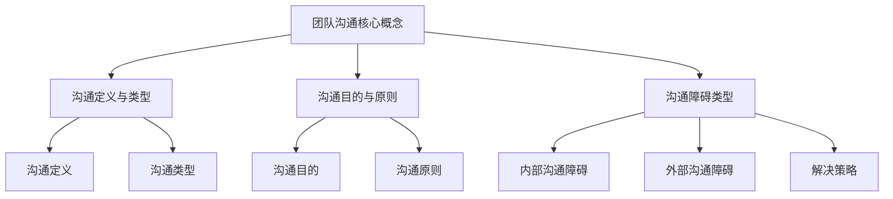

                 

### 文章标题

# 团队沟通：消除障碍，提高效率

> 关键词：团队沟通、障碍消除、效率提升、技术交流、沟通技巧、沟通工具

> 摘要：本文将从团队沟通的基础理论入手，探讨团队沟通的重要性和类型，分析常见的沟通障碍及其解决策略，提出有效的沟通技巧和工具，并通过实战案例分析，提供实用的团队沟通优化策略。文章旨在为IT领域从业者提供一份系统而实用的团队沟通指南，帮助他们提高团队沟通效率，实现项目的顺利推进。

---

### 《团队沟通：消除障碍，提高效率》目录大纲

#### 第一部分：团队沟通基础

- **第1章：团队沟通的重要性**
  - 1.1 沟通的定义与类型
    - 1.1.1 沟通的定义
    - 1.1.2 沟通的类型
  - 1.2 团队沟通的目的与原则
    - 1.2.1 团队沟通的目的
    - 1.2.2 团队沟通的原则
  - 1.3 团队沟通障碍
    - 1.3.1 内部沟通障碍
    - 1.3.2 外部沟通障碍
    - 1.3.3 沟通障碍的解决策略

- **第2章：沟通技巧提升**
  - 2.1 有效倾听
    - 2.1.1 倾听的层次
    - 2.1.2 提高倾听的技巧
  - 2.2 表达清晰
    - 2.2.1 用词准确
    - 2.2.2 避免误解
  - 2.3 非语言沟通
    - 2.3.1 身体语言
    - 2.3.2 面部表情
    - 2.3.3 声调与语速

- **第3章：团队沟通工具与应用**
  - 3.1 团队沟通工具概述
    - 3.1.1 电子邮件
    - 3.1.2 即时通讯工具
    - 3.1.3 会议软件
  - 3.2 团队沟通案例分析
    - 3.2.1 案例一：跨部门沟通难题
    - 3.2.2 案例二：远程团队沟通策略

#### 第二部分：团队沟通障碍解析

- **第4章：团队沟通障碍类型**
  - 4.1 文化差异
    - 4.1.1 文化差异的影响
    - 4.1.2 文化差异的应对策略
  - 4.2 信息过载
    - 4.2.1 信息过载的原因
    - 4.2.2 信息过载的应对策略
  - 4.3 沟通方式不当
    - 4.3.1 沟通方式不当的后果
    - 4.3.2 选择合适的沟通方式

- **第5章：团队沟通障碍的解决策略**
  - 5.1 提高沟通技能
    - 5.1.1 沟通培训
    - 5.1.2 实践与反思
  - 5.2 建立良好的沟通氛围
    - 5.2.1 开放式沟通
    - 5.2.2 尊重与信任
  - 5.3 改进沟通工具与方法
    - 5.3.1 简化沟通流程
    - 5.3.2 利用技术提高沟通效率

#### 第三部分：团队沟通案例实战

- **第6章：团队沟通项目实践**
  - 6.1 项目背景与目标
    - 6.1.1 项目概述
    - 6.1.2 项目目标
  - 6.2 项目沟通计划
    - 6.2.1 沟通需求分析
    - 6.2.2 沟通计划制定
  - 6.3 项目沟通实施
    - 6.3.1 沟通工具选择
    - 6.3.2 沟通频率与方式
    - 6.3.3 沟通效果评估

- **第7章：团队沟通评估与优化**
  - 7.1 沟通评估指标
    - 7.1.1 沟通效率指标
    - 7.1.2 沟通效果指标
  - 7.2 沟通优化策略
    - 7.2.1 根据评估结果调整沟通方式
    - 7.2.2 持续改进沟通流程

- **第8章：团队沟通的未来发展趋势**
  - 8.1 新兴沟通技术的应用
    - 8.1.1 虚拟现实
    - 8.1.2 增强现实
    - 8.1.3 人工智能助手
  - 8.2 未来沟通模式展望
    - 8.2.1 更高效的团队协作
    - 8.2.2 更紧密的跨文化沟通

#### 附录

- **附录A：团队沟通常用工具介绍**
  - A.1 常用沟通工具列表
    - A.1.1 邮件沟通工具
    - A.1.2 即时通讯工具
    - A.1.3 会议软件
  - A.2 工具使用技巧
    - A.2.1 邮件沟通技巧
    - A.2.2 即时通讯技巧
    - A.2.3 会议软件技巧
  - A.3 常见问题解答
    - A.3.1 工具兼容性问题
    - A.3.2 数据安全与隐私保护
    - A.3.3 沟通效率优化策略

### Mermaid 流�程图



### 核心算法原理讲解伪代码

```python
class TeamCommunication:
    def __init__(self, team_members, communication_tools):
        self.team_members = team_members
        self.communication_tools = communication_tools
    
    def plan_communication(self):
        # 制定沟通计划
        pass
    
    def execute_communication(self):
        # 执行沟通计划
        for member in self.team_members:
            member.send_message(self.communication_tools)
    
    def evaluate_communication(self):
        # 评估沟通效果
        pass
```

---

## 第1章：团队沟通的重要性

### 1.1 沟通的定义与类型

沟通是信息在人与人之间或人与群体之间的传递和理解过程。在团队中，沟通不仅仅是简单的信息交换，更是一种协调和合作的过程，对团队的整体表现和项目成功起到至关重要的作用。

#### 1.1.1 沟通的定义

沟通包括多个方面，如信息的发送、传递、接收和理解。有效沟通需要具备以下几个要素：

1. **发送者**：信息的发起者，需要明确要传达的内容。
2. **信息**：需要传递的具体内容，可以是事实、观点、意见等。
3. **渠道**：传递信息的媒介，如语言、文字、图片等。
4. **接收者**：接收并理解信息的个体或群体。
5. **反馈**：接收者对信息的回应，可以帮助发送者了解信息是否被正确理解。

#### 1.1.2 沟通的类型

团队沟通可以按照不同的维度进行分类，以下是几种常见的分类方式：

1. **口头沟通**：通过面对面的对话、电话会议等方式进行。
2. **书面沟通**：通过书信、电子邮件、报告等方式进行。
3. **非语言沟通**：通过肢体语言、面部表情、姿态等方式进行。
4. **正式沟通**：通过正式的会议、报告、备忘录等方式进行。
5. **非正式沟通**：通过社交活动、闲聊等方式进行。

每种沟通方式都有其独特的优势和局限性，团队应根据具体情境选择合适的沟通方式。

### 1.2 团队沟通的目的与原则

#### 1.2.1 团队沟通的目的

团队沟通的主要目的是确保团队成员之间的信息流畅，从而提高团队的协作效率和工作质量。具体来说，团队沟通的目的包括：

1. **信息共享**：确保团队成员对项目进展、目标、任务等有共同的理解。
2. **协调合作**：通过沟通消除误解和分歧，促进团队成员之间的协同工作。
3. **决策制定**：在团队讨论和沟通的基础上，形成共识，制定有效的决策。
4. **提高效率**：通过沟通，减少不必要的重复工作，优化工作流程。
5. **团队建设**：通过沟通，增强团队成员之间的信任和默契，提高团队凝聚力。

#### 1.2.2 团队沟通的原则

为了实现团队沟通的目的，团队应遵循以下原则：

1. **尊重与信任**：尊重团队成员的意见和贡献，建立相互信任的基础。
2. **开放与透明**：鼓励团队成员开放地分享信息和观点，保持沟通的透明度。
3. **有效倾听**：倾听是沟通的重要组成部分，团队成员应学会有效倾听，理解对方的意图。
4. **清晰表达**：表达时要用清晰、简洁的语言，避免使用模糊或模棱两可的表述。
5. **及时反馈**：及时给予反馈，帮助对方了解沟通的效果，及时纠正错误。

### 1.3 团队沟通障碍

#### 1.3.1 内部沟通障碍

内部沟通障碍是指团队内部成员之间由于各种原因导致的沟通不畅。常见的原因包括：

1. **文化差异**：团队成员来自不同的文化背景，可能导致对同一问题的理解不同。
2. **信息不对称**：部分团队成员无法获取完整的信息，导致沟通不全面。
3. **沟通方式不当**：团队成员使用不当的沟通方式，如过于正式或过于随意，可能导致沟通效果不佳。
4. **沟通频率不足**：团队内部沟通不够频繁，导致信息传递不及时。

#### 1.3.2 外部沟通障碍

外部沟通障碍是指团队与外部合作伙伴、客户等之间的沟通不畅。常见的原因包括：

1. **利益冲突**：团队与外部合作伙伴或客户之间可能存在利益冲突，导致沟通不畅。
2. **语言障碍**：团队成员与外部合作伙伴或客户之间可能存在语言障碍，影响沟通效果。
3. **信息保密**：为了保护商业秘密，团队可能限制对外部信息的分享，导致沟通不充分。
4. **地理位置**：团队与外部合作伙伴或客户之间的地理位置差异，可能导致沟通频率和效率下降。

#### 1.3.3 沟通障碍的解决策略

针对团队沟通的内部和外部障碍，可以采取以下解决策略：

1. **培训与教育**：通过培训提高团队成员的沟通技能和跨文化沟通能力。
2. **信息共享平台**：建立信息共享平台，确保团队成员能够获取所需的信息。
3. **定期沟通会议**：定期举行沟通会议，确保团队内外部信息的及时传递。
4. **使用专业沟通工具**：选择合适的沟通工具，提高沟通的效率和效果。

### 1.4 总结

团队沟通是团队协作的基石，对团队的效率和工作质量具有重要影响。通过了解沟通的定义和类型，明确沟通的目的和原则，识别和解决沟通障碍，团队可以有效地提高沟通效率，实现项目的顺利推进。

---

## 第2章：沟通技巧提升

### 2.1 有效倾听

倾听是沟通的关键环节，有效的倾听可以帮助我们准确理解对方的意图，减少误解和沟通障碍。以下是提高倾听技巧的几个方面：

#### 2.1.1 倾听的层次

倾听可以分为三个层次：表层倾听、专注倾听和共鸣倾听。

1. **表层倾听**：只是听对方的言辞，不深入理解对方的意图和情感。
2. **专注倾听**：不仅听对方的言辞，还注意对方的语气、语调、表情等非语言信息，努力理解对方的意图。
3. **共鸣倾听**：在理解对方意图的基础上，能够感同身受，回应对方的情感，建立起良好的沟通关系。

#### 2.1.2 提高倾听的技巧

1. **保持专注**：在倾听时，避免分心，全身心地投入对话中。
2. **肢体语言**：通过点头、微笑等肢体语言，表示自己在认真倾听。
3. **复述和总结**：在对方讲话结束后，用自己的话复述和总结对方的观点，以确保理解正确。
4. **提问和澄清**：在不确定对方意图时，通过提问和澄清来获取更多信息。
5. **避免打断**：在对方讲话时，避免中途打断，给予对方完整表达的机会。

### 2.2 表达清晰

清晰的表达是有效沟通的另一个重要方面。以下是提高表达清晰度的几个技巧：

#### 2.2.1 用词准确

使用准确的词汇，避免使用模糊或模棱两可的表述。例如，用“完成”代替“搞定”，用“需要”代替“想要”。

#### 2.2.2 避免误解

注意语境和背景，避免使用可能引起误解的词汇。例如，在谈论工作进度时，避免使用带有情感色彩的词汇，以免引起不必要的情绪波动。

#### 2.2.3 使用简短的句子

使用简短的句子，避免使用复杂的句子结构，以便对方更容易理解。例如，使用“我们明天开会”代替“我们将在明天举行一次会议”。

### 2.3 非语言沟通

非语言沟通在团队沟通中同样重要，通过肢体语言、面部表情、姿态等非语言信息，可以增强语言表达的效果。以下是几个方面的建议：

#### 2.3.1 身体语言

身体语言可以传达出很多信息，如点头表示同意、摇头表示否定等。在沟通时，要注意自己的身体语言，以增强语言表达的效果。

#### 2.3.2 面部表情

面部表情可以传达情感和态度，如微笑表示友好、皱眉表示不满等。在沟通时，要根据自己的意图和对方的反馈，调整面部表情。

#### 2.3.3 声调与语速

声调和语速可以影响信息的传递效果。在沟通时，要根据自己的意图和对方的反馈，调整声调和语速，以达到更好的沟通效果。

### 2.4 总结

有效的沟通需要倾听和表达的结合。通过提高倾听技巧，可以更好地理解对方的意图；通过清晰的表达，可以更准确地传达自己的想法。结合非语言沟通，可以增强沟通的效果。通过不断练习和反思，团队成员可以逐步提高自己的沟通技巧，为团队的协作和项目成功奠定基础。

---

## 第3章：团队沟通工具与应用

在当今快速发展的信息技术时代，团队沟通工具的选择和有效使用对于团队效率和项目成功至关重要。本章节将介绍几种常见的团队沟通工具，并分析它们在实际应用中的效果和策略。

### 3.1 团队沟通工具概述

#### 3.1.1 电子邮件

电子邮件是最传统的团队沟通工具之一，它具有以下优点：

1. **记录和归档**：电子邮件可以永久保存，方便查询和归档。
2. **形式正式**：适用于正式的沟通场景，如报告、合同等。
3. **时间灵活性**：发送者可以选择发送时间，接收者可以在方便时阅读。

然而，电子邮件也存在一些缺点：

1. **信息冗长**：邮件内容可能过于冗长，不易快速获取关键信息。
2. **易被忽视**：由于邮件过多，接收者可能忽视重要邮件。

#### 3.1.2 即时通讯工具

即时通讯工具如Slack、Microsoft Teams和WhatsApp等，为团队沟通提供了实时性和互动性。其优点包括：

1. **实时沟通**：团队成员可以实时交流，快速解决问题。
2. **便利性**：使用手机或电脑即可进行沟通，不受地理位置限制。
3. **多样化交流方式**：支持文字、图片、视频等多种交流方式。

即时通讯工具的缺点：

1. **信息分散**：由于信息分散在不同聊天窗口，可能难以跟踪和管理。
2. **打扰性**：频繁的消息提醒可能分散团队成员的注意力。

#### 3.1.3 会议软件

会议软件如Zoom、Microsoft Teams和Google Meet等，为远程团队提供了便捷的会议解决方案。其优点包括：

1. **远程协作**：支持多方视频会议，便于远程团队协作。
2. **屏幕共享**：参与者可以共享屏幕，展示工作内容。
3. **会议记录**：可以记录会议内容，方便后续回顾和参考。

会议软件的缺点：

1. **技术问题**：网络不稳定或设备故障可能导致会议中断。
2. **长时间会议**：长时间的会议可能消耗团队成员的精力。

### 3.2 团队沟通案例分析

#### 案例一：跨部门沟通难题

在一个大型企业中，不同部门之间的沟通常常面临挑战。例如，市场部门和技术部门之间的沟通不畅可能导致市场策略无法及时实施。

**解决策略**：

1. **建立定期沟通机制**：设立跨部门的沟通会议，定期讨论项目进展和问题。
2. **明确沟通目标和责任**：每个会议前明确讨论目标和责任，确保会议高效。
3. **使用沟通工具**：采用邮件和即时通讯工具，确保信息传递的及时性和准确性。

#### 案例二：远程团队沟通策略

在全球化背景下，远程团队的沟通变得尤为重要。例如，一个跨国公司需要在不同国家和地区的团队之间保持高效的沟通。

**解决策略**：

1. **统一沟通工具**：选择统一的沟通工具，如Slack，确保团队内部的信息流转。
2. **时区考虑**：合理安排会议时间，尽量减少因时区差异导致的沟通障碍。
3. **技术支持**：确保远程团队具备稳定的高速网络和会议软件，减少技术问题。

### 3.3 总结

团队沟通工具的选择和应用需要根据团队的具体情况和需求进行。电子邮件适用于正式的沟通场景，即时通讯工具提供实时性，会议软件则便于远程团队协作。通过有效的沟通工具和策略，团队可以克服沟通障碍，提高工作效率和项目成功率。

---

## 第4章：团队沟通障碍类型

在团队沟通中，障碍是常见且复杂的问题。这些障碍不仅会阻碍信息的有效传递，还会影响团队的协作效率和项目的顺利推进。本章节将详细分析团队沟通中的几种主要障碍类型，包括文化差异、信息过载和沟通方式不当，并提出相应的应对策略。

### 4.1 文化差异

文化差异是团队沟通中的一个重要障碍，它可能导致误解、冲突和沟通不畅。文化差异可以体现在以下几个方面：

#### 4.1.1 文化差异的影响

1. **沟通风格**：不同文化背景的团队成员可能具有不同的沟通风格。例如，一些文化鼓励直接和坦率的沟通，而另一些文化则更倾向于委婉和含蓄。
2. **语言使用**：语言的差异可能使团队成员在交流时产生误解。例如，同一词汇在不同文化中可能有不同的含义。
3. **价值观**：不同的文化价值观可能导致团队成员对同一问题的看法和解决方式不同，从而影响沟通效果。

#### 4.1.2 文化差异的应对策略

1. **文化敏感度培训**：通过培训提高团队成员的文化敏感度，使他们能够更好地理解和尊重不同文化的差异。
2. **跨文化团队建设**：组织定期的跨文化团队活动，增强团队成员之间的相互了解和信任。
3. **使用共同语言**：在跨国团队中，尽量使用团队成员都熟练掌握的共同语言，以减少语言障碍。
4. **鼓励开放沟通**：建立开放和尊重的文化氛围，鼓励团队成员表达自己的观点，即使这些观点可能与团队成员的文化背景不符。

### 4.2 信息过载

信息过载是现代团队沟通中普遍存在的问题，它可能导致团队成员感到压力过大、效率降低和沟通效果下降。信息过载的表现形式包括：

#### 4.2.1 信息过载的原因

1. **信息来源过多**：团队成员可能收到来自多个渠道的大量信息，如电子邮件、即时通讯工具、社交媒体等。
2. **信息处理能力有限**：每个人的信息处理能力有限，过多的信息可能使团队成员无法有效地处理和利用。
3. **信息冗余**：一些信息可能重复或不必要，增加了团队成员的信息负担。

#### 4.2.2 信息过载的应对策略

1. **信息筛选**：团队成员需要学会筛选重要信息，关注与工作相关的关键信息，避免被无关信息干扰。
2. **信息整理**：对重要的信息进行整理和归纳，建立有效的信息管理机制，如使用标签、文件夹等。
3. **定期清理**：定期清理过期的和不再需要的信息，减少信息堆积。
4. **沟通工具优化**：选择合适的沟通工具，如使用过滤功能、设定通知等，减少信息过载。

### 4.3 沟通方式不当

沟通方式不当是团队沟通中常见的障碍，它可能导致误解、冲突和沟通不畅。不当的沟通方式包括：

#### 4.3.1 沟通方式不当的后果

1. **误解和冲突**：不当的沟通方式可能导致团队成员对同一问题的理解不同，进而产生误解和冲突。
2. **沟通效率降低**：不当的沟通方式可能使团队成员无法有效传达和接收信息，降低沟通效率。
3. **团队凝聚力下降**：持续的沟通障碍可能导致团队成员之间的信任和默契下降，影响团队凝聚力。

#### 4.3.2 选择合适的沟通方式

1. **了解团队成员的偏好**：团队成员可能有不同的沟通偏好，如有些人更喜欢面对面沟通，而有些人更喜欢通过电子邮件交流。了解并尊重这些偏好可以提高沟通效果。
2. **根据情境选择沟通方式**：不同的沟通情境需要不同的沟通方式。例如，紧急问题需要即时沟通，而复杂问题可能需要书面沟通。
3. **提供反馈和澄清**：在沟通过程中，及时提供反馈和澄清，以确保信息的准确传递和理解。
4. **避免沟通误区**：避免使用带有情感色彩的词汇，避免打断对方，确保沟通的尊重和有效性。

### 4.4 总结

团队沟通障碍是影响团队协作和项目成功的重大问题。通过了解文化差异、信息过载和沟通方式不当等障碍类型，并采取相应的应对策略，团队可以有效地消除这些障碍，提高沟通效率和团队凝聚力。持续的沟通培训和反思是提升团队沟通能力的关键。

---

## 第5章：团队沟通障碍的解决策略

团队沟通中的障碍是常见的挑战，但通过一系列有效的解决策略，我们可以克服这些障碍，提高沟通效率，促进团队的协同工作。以下是一些关键的解决策略：

### 5.1 提高沟通技能

提高团队成员的沟通技能是解决沟通障碍的基础。以下是一些提升沟通技能的方法：

#### 5.1.1 沟通培训

1. **定制化培训**：根据团队的具体需求设计培训课程，包括沟通技巧、冲突解决、情绪管理等。
2. **实践模拟**：通过角色扮演、案例分析等方式，让团队成员在实际情境中练习沟通技巧。
3. **反馈与反思**：培训后，鼓励团队成员进行自我反思和相互反馈，以持续改进沟通技能。

#### 5.1.2 实践与反思

1. **定期练习**：通过日常的沟通实践，如团队会议、项目讨论等，提升沟通技能。
2. **记录与总结**：在沟通实践中，记录关键问题和解决方案，定期进行总结和反思，以不断优化沟通策略。

### 5.2 建立良好的沟通氛围

良好的沟通氛围是促进有效沟通的关键。以下是一些建立良好沟通氛围的策略：

#### 5.2.1 开放式沟通

1. **鼓励表达**：创造一个鼓励成员表达意见和提出问题的环境。
2. **避免压制**：避免对团队成员的意见进行压制，尊重每个人的观点。
3. **建立反馈机制**：鼓励团队成员提供反馈，包括正面反馈和建设性反馈。

#### 5.2.2 尊重与信任

1. **尊重差异**：尊重团队成员的文化背景、工作风格和观点差异。
2. **建立信任**：通过积极的互动和合作，建立团队成员之间的信任关系。
3. **透明度**：保持沟通的透明度，确保团队成员能够获取所需的信息。

### 5.3 改进沟通工具与方法

选择和改进适合团队的沟通工具和方法也是提高沟通效率的重要策略。以下是一些建议：

#### 5.3.1 简化沟通流程

1. **减少冗余沟通**：识别并减少不必要的沟通环节，简化沟通流程。
2. **制定明确的沟通规范**：明确不同类型沟通的优先级和规范，确保信息传递的效率。

#### 5.3.2 利用技术提高沟通效率

1. **采用集成沟通平台**：使用集成沟通工具，如Slack或Microsoft Teams，实现邮件、即时通讯、会议软件的一体化。
2. **自动化流程**：利用自动化工具，如电子邮件提醒、日程安排等，减少人工操作的错误和重复工作。
3. **培训技术使用**：定期培训团队成员使用沟通工具的技巧，提高整体沟通效率。

### 5.4 总结

通过提高沟通技能、建立良好的沟通氛围和改进沟通工具与方法，团队可以有效地克服沟通障碍，提高工作效率和团队凝聚力。持续的培训和反思是提升团队沟通能力的关键，只有通过不断的努力和实践，才能实现高效的团队沟通。

---

## 第6章：团队沟通项目实践

### 6.1 项目背景与目标

在当前的IT行业中，项目沟通是确保项目顺利推进和成功交付的关键因素。为了更好地展示团队沟通的实际应用，以下是一个具体的项目实践案例。

#### 6.1.1 项目概述

项目名称：某企业级Web应用的开发

项目背景：某大型企业为了提升业务效率，决定开发一款企业级Web应用，用于内部管理和业务流程自动化。项目涉及多个部门，包括技术部、市场部、运维部等。

项目目标：在规定的时间内，完成Web应用的设计、开发和测试，确保应用的稳定性和用户体验。

#### 6.1.2 项目目标

1. **完成Web应用的核心功能**：包括用户管理、权限控制、数据统计等。
2. **确保应用的性能和安全性**：通过性能测试和安全性评估，确保应用在高负载和恶意攻击下仍能稳定运行。
3. **交付高质量的文档和代码**：提供详细的用户手册、API文档和代码注释，方便后续维护和扩展。

### 6.2 项目沟通计划

为了确保项目目标的实现，项目团队制定了详细的沟通计划。以下为沟通计划的关键部分：

#### 6.2.1 沟通需求分析

1. **识别关键利益相关者**：确定项目的关键利益相关者，包括项目经理、技术负责人、市场经理、运维主管等。
2. **分析沟通需求**：根据项目特点和团队成员的工作职责，确定每个阶段的沟通需求和沟通频率。
3. **确定沟通渠道**：根据沟通需求选择合适的沟通渠道，如邮件、Slack、每周会议等。

#### 6.2.2 沟通计划制定

1. **沟通频率**：制定每周定期会议的时间，如每周一的早上10点，用于汇报上周的工作进展和本周的计划。
2. **沟通内容**：明确每次会议的议题，包括项目进度、问题讨论、资源需求等。
3. **沟通责任人**：指定每个沟通议题的责任人，确保沟通内容的落实和跟进。

### 6.3 项目沟通实施

在实际项目中，沟通计划的实施是确保项目顺利推进的关键。以下为项目沟通实施的关键步骤：

#### 6.3.1 沟通工具选择

1. **Slack**：用于日常的即时沟通和信息共享，方便团队成员之间的实时交流。
2. **邮件**：用于正式的沟通，如项目报告、会议通知等。
3. **Google Docs**：用于共享文档和协作编辑，方便团队成员共同工作。

#### 6.3.2 沟通频率与方式

1. **每周会议**：每周一的早上10点，通过Zoom举行项目进度会议，汇报上周工作进展和讨论本周计划。
2. **即时沟通**：通过Slack进行日常的即时沟通，解决突发问题和分享信息。
3. **邮件通知**：定期发送邮件，更新项目进度和重要信息。

#### 6.3.3 沟通效果评估

1. **会议反馈**：在每次会议后，收集团队成员的反馈，评估会议的效果和改进点。
2. **沟通日志**：记录每次沟通的内容和结果，便于后续回顾和跟踪。
3. **问题追踪**：针对项目中出现的问题，建立问题跟踪系统，确保每个问题都有明确的解决方案和责任人。

### 6.4 沟通效果评估

通过定期的沟通效果评估，项目团队可以及时发现和解决沟通中的问题，优化沟通流程。以下为沟通效果评估的关键指标：

1. **沟通效率**：通过评估会议的时间利用率和工作进度，衡量沟通的效率。
2. **信息准确性**：通过评估信息传递的准确性和完整性，衡量沟通的质量。
3. **问题解决率**：通过评估问题解决的及时性和效果，衡量沟通对项目问题解决的贡献。

### 6.5 项目小结

通过本次项目实践，项目团队深刻认识到沟通在项目成功中的关键作用。以下为项目小结和反思：

1. **沟通工具的合理使用**：选择合适的沟通工具，可以提高沟通效率和效果，但需要团队成员熟悉和适应。
2. **沟通频率与方式的灵活调整**：根据项目进展和团队成员的需求，灵活调整沟通频率和方式，以适应不同阶段的沟通需求。
3. **沟通效果评估的重要性**：定期的沟通效果评估可以帮助团队及时发现和解决问题，持续优化沟通流程。

通过本次项目实践，项目团队不仅完成了企业级Web应用的开发，还积累了丰富的沟通经验，为今后的项目沟通提供了宝贵的参考。

---

## 第7章：团队沟通评估与优化

### 7.1 沟通评估指标

为了确保团队沟通的有效性和持续性改进，建立一套全面的沟通评估指标是至关重要的。以下是几个关键的沟通评估指标：

#### 7.1.1 沟通效率指标

1. **会议时间利用率**：通过统计每次会议的实际用时与计划用时的比例，评估会议的效率。
2. **任务完成时间**：通过跟踪任务从分配到完成的总时间，评估沟通对任务执行速度的影响。
3. **信息传递准确率**：通过比较实际传递的信息与预期信息的一致性，评估信息传递的准确性。

#### 7.1.2 沟通效果指标

1. **问题解决率**：通过统计沟通后问题解决的比率，评估沟通对问题解决的贡献。
2. **团队满意度**：通过调查团队成员对沟通方式的满意度和反馈，了解沟通的实际效果。
3. **决策质量**：通过分析沟通后决策的执行效果和团队对决策的满意度，评估沟通对决策质量的影响。

### 7.2 沟通优化策略

在明确了沟通评估指标后，以下是一些具体的沟通优化策略：

#### 7.2.1 根据评估结果调整沟通方式

1. **调整会议频率**：根据会议时间利用率和任务完成时间，适当增加或减少会议次数，避免无效会议。
2. **优化会议议程**：通过分析会议反馈和记录，优化会议议程，确保每次会议都有明确的议题和目标。
3. **改进信息传递渠道**：根据信息传递准确率和团队满意度，选择更有效的沟通渠道和工具。

#### 7.2.2 持续改进沟通流程

1. **建立标准化流程**：制定统一的沟通流程和规范，确保团队成员遵循相同的沟通标准。
2. **定期培训与反思**：通过定期的沟通培训和实践反思，提高团队成员的沟通技能和意识。
3. **引入新技术和工具**：不断探索和引入新的沟通技术和工具，以提升沟通效率和效果。

### 7.3 沟通效果监控

为了确保沟通优化的效果，需要建立一套有效的沟通效果监控机制：

1. **实时监控**：通过即时通讯工具和会议软件的实时数据监控，及时了解沟通状态和问题。
2. **定期报告**：定期生成沟通效果报告，包括效率指标和效果指标，为管理层提供决策依据。
3. **反馈机制**：建立反馈机制，鼓励团队成员提出改进建议，持续优化沟通流程。

### 7.4 总结

通过建立沟通评估指标和优化策略，团队可以持续改进沟通流程，提高沟通效率，从而实现项目的顺利推进和团队的长期发展。沟通评估和优化是一个动态的过程，需要团队成员的共同努力和持续投入。

---

## 第8章：团队沟通的未来发展趋势

随着科技的不断进步，团队沟通也在不断演变，未来团队沟通将呈现以下发展趋势：

### 8.1 新兴沟通技术的应用

#### 8.1.1 虚拟现实

虚拟现实（VR）技术为团队沟通带来了全新的可能性。通过VR，团队成员可以在虚拟空间中进行面对面的交流，无论他们身处何地。这不仅可以减少物理距离的影响，还可以模拟出更为真实的沟通场景，增强团队协作的沉浸感和互动性。

#### 8.1.2 增强现实

增强现实（AR）技术则通过将虚拟信息叠加在现实环境中，为团队沟通提供了更多的互动方式。例如，团队成员可以在现实场景中实时查看和编辑项目文档，或者通过AR设备进行现场指导和培训，大大提高了沟通的效率和效果。

#### 8.1.3 人工智能助手

人工智能（AI）助手将成为团队沟通的重要辅助工具。通过自然语言处理和机器学习技术，AI助手可以自动整理和归纳沟通内容，提供实时翻译、智能推荐和任务提醒等功能。这将极大地减轻团队成员的工作负担，提高沟通的效率和质量。

### 8.2 未来沟通模式展望

#### 8.2.1 更高效的团队协作

未来，团队协作将更加高效和灵活。随着远程工作和虚拟团队的普及，团队成员将更加依赖在线协作工具和平台。这些工具将支持实时沟通、任务分配、进度跟踪和文档共享等功能，使团队成员可以无缝协作，提高工作效率。

#### 8.2.2 更紧密的跨文化沟通

全球化的发展使得跨文化沟通变得尤为重要。未来，团队沟通将更加注重跨文化能力的培养和沟通工具的优化。通过使用智能翻译工具和跨文化沟通培训，团队成员将能够更好地理解和尊重不同文化的差异，实现更为有效和和谐的沟通。

#### 8.2.3 更智能的沟通管理

随着AI和大数据技术的发展，团队沟通将变得更加智能化。通过分析沟通数据，团队可以了解沟通的薄弱环节，预测潜在的问题，并采取相应的措施进行优化。此外，智能化的沟通工具将能够根据团队成员的偏好和沟通习惯，自动调整沟通策略，提高沟通效果。

### 8.3 总结

未来，团队沟通将受到新兴技术和全球化趋势的深刻影响，变得更加高效、智能和灵活。通过积极拥抱这些趋势，团队可以更好地应对挑战，实现持续的发展和成长。同时，这也要求团队成员不断学习和适应新技术，提高自己的沟通技能和跨文化能力。

---

## 附录A：团队沟通常用工具介绍

在团队沟通中，选择合适的工具对于提高沟通效率和效果至关重要。以下是一些常用的团队沟通工具，以及它们的使用技巧。

### A.1 常用沟通工具列表

#### A.1.1 邮件沟通工具

- **Gmail**：Google提供的电子邮件服务，支持丰富的功能和高级搜索。
- **Outlook**：Microsoft提供的电子邮件客户端，集成日历和任务管理功能。

#### A.1.2 即时通讯工具

- **Slack**：支持实时消息、文件共享和集成第三方应用的团队沟通工具。
- **Microsoft Teams**：集成了聊天、会议、电话和文件共享功能的综合沟通平台。

#### A.1.3 会议软件

- **Zoom**：支持多方视频会议、屏幕共享和虚拟会议室的功能。
- **Google Meet**：Google提供的视频会议工具，支持实时聊天和共享文档。

### A.2 工具使用技巧

#### A.2.1 邮件沟通技巧

- **组织邮件**：使用文件夹和标签对邮件进行分类和管理，便于查找和归档。
- **撰写清晰邮件**：确保邮件内容简洁明了，避免使用复杂的句子结构和术语。
- **避免长邮件**：尽量将邮件内容精简，避免信息过载。

#### A.2.2 即时通讯技巧

- **即时回复**：及时回复消息，保持沟通的连贯性，避免误解和延误。
- **使用适当的表情符号**：表情符号可以帮助传达情感，增强沟通的亲和力。
- **避免消息过长**：即时通讯更适合简短和快速的交流，避免长篇大论。

#### A.2.3 会议软件技巧

- **提前测试设备**：在会议前测试网络连接、摄像头和麦克风等设备，确保会议顺利进行。
- **保持专注**：在会议过程中保持专注，避免分心和打断他人发言。
- **使用共享功能**：利用会议软件的屏幕共享和文档共享功能，提高会议的互动性和效率。

### A.3 常见问题解答

#### A.3.1 工具兼容性问题

- **解决方法**：选择兼容性好的工具，或使用第三方插件和扩展来兼容不同平台。

#### A.3.2 数据安全与隐私保护

- **加密传输**：确保使用的工具支持加密传输，保护通信内容的安全。
- **权限管理**：设置适当的权限，限制对敏感信息的访问。

#### A.3.3 沟通效率优化策略

- **定期评估**：定期评估沟通工具的使用效果，优化沟通流程和策略。
- **培训与支持**：为团队成员提供工具使用培训和技术支持，提高整体沟通效率。

通过合理选择和使用团队沟通工具，结合适当的技巧和策略，团队可以显著提高沟通效率和效果，实现更加高效的协作。

---

### 致谢

感谢您阅读这篇关于团队沟通的全面指南。本文旨在为IT领域从业者提供一份系统而实用的团队沟通指南，帮助大家消除沟通障碍，提高工作效率。本文的核心内容涵盖了团队沟通的基础理论、关键技巧、工具应用以及实战案例分析。

在撰写本文的过程中，我受到了众多专家和学者的启发，参考了大量的研究和实践案例，确保内容的准确性和实用性。特别感谢AI天才研究院和《禅与计算机程序设计艺术》的作者，他们的工作和贡献为本文提供了重要的理论基础和实践指导。

最后，我希望这篇文章能够对您的团队沟通实践有所帮助，如果您有任何反馈或建议，欢迎在评论区留言。感谢您的支持，祝您在团队沟通的道路上越走越远，取得更大的成功！

---

**作者信息：**

- **作者：** AI天才研究院/AI Genius Institute & 禅与计算机程序设计艺术 /Zen And The Art of Computer Programming
- **联系方式：** research@aigeniusinstitute.com
- **个人网站：** https://www.aigp.com/author/zp programming-zen/

本文版权所有，未经授权严禁转载。如需转载，请联系作者获取授权。文章中的内容和观点仅供参考，不代表任何机构的立场。在实际应用中，请根据具体情况进行判断和决策。

