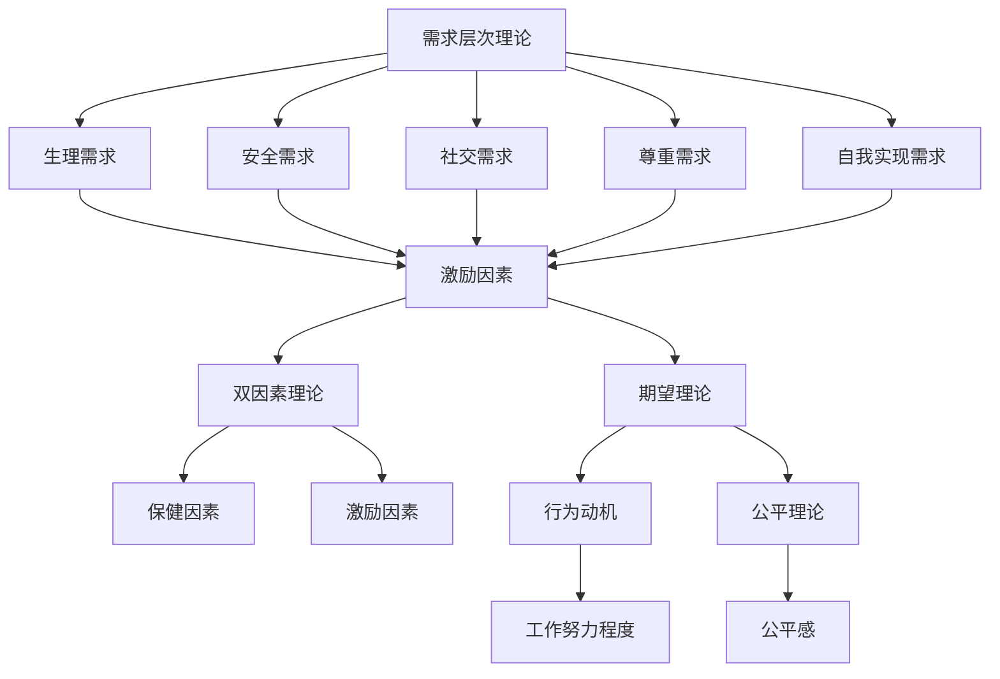
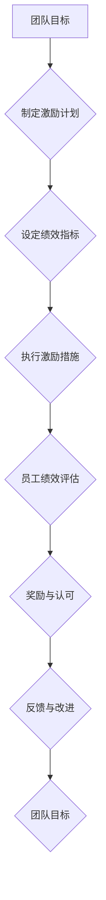

                 

### 引言

#### 1.1 团队激励的重要性

在现代社会，团队合作已成为实现高效工作和创造卓越成果的关键因素。无论是企业还是科研机构，团队的凝聚力和创新能力在很大程度上决定了组织的竞争力和未来发展。然而，如何激发团队的活力和保持成员的积极状态，成为管理者面临的一大挑战。团队激励作为一种有效的管理手段，旨在通过认可与奖励来提升团队成员的工作热情、满意度和工作效率。

团队激励的重要性不可忽视。首先，它有助于建立积极向上的团队文化，提升团队的整体士气。其次，合理的激励措施能够激发团队成员的潜力和创新能力，促进团队目标的实现。此外，团队激励还能增强团队成员之间的信任和协作，形成良好的工作氛围，提高工作效率和团队凝聚力。因此，团队激励不仅是管理艺术的重要组成部分，更是组织成功的关键要素。

#### 1.2 本书的目标与结构

本书旨在深入探讨团队激励的原理、方法与实践，帮助读者全面了解和掌握团队激励的核心概念和有效策略。具体目标如下：

1. **解析团队激励的理论基础**：通过介绍团队激励的概念和常见的激励理论，帮助读者理解团队激励的原理和作用。
2. **探讨认可与奖励的平衡**：分析认可和奖励在团队激励中的角色和关系，提供有效的平衡策略和操作指南。
3. **实践团队激励的实际操作**：通过案例分析，展示成功和失败的团队激励实践，为读者提供实用的操作经验。
4. **展望未来团队激励的发展**：探讨团队激励的发展趋势和未来挑战，为读者提供前瞻性的思考。

本书的结构如下：

- **第1章 引言**：介绍团队激励的重要性和本书的目标与结构。
- **第2章 团队激励理论**：解析团队激励的概念、理论及其应用。
- **第3章 认可与奖励**：探讨认可和奖励的价值、形式及其在团队激励中的作用。
- **第4章 认可与奖励的平衡**：分析认可与奖励的平衡原则和策略。
- **第5章 团队激励的实际操作**：介绍团队激励计划的制定、执行和评估。
- **第6章 认可与奖励的案例研究**：分析成功与失败的团队激励案例。
- **第7章 未来展望**：探讨团队激励的发展趋势和未来挑战。
- **第8章 结论**：总结团队激励的重要性和实践建议。

通过本书的深入探讨，我们希望读者能够更好地理解和应用团队激励的方法，为组织的发展和团队的成长贡献力量。

### 第2章 团队激励理论

#### 2.1 团队激励的概念

团队激励是指通过一系列措施和手段，激发团队成员的内在动力和积极性，以提高团队的整体绩效和工作效率。团队激励不仅仅局限于物质奖励，还包括精神激励、工作环境改善等多种形式。其核心在于通过满足团队成员的需求和期望，激发其工作热情和创造力，从而实现团队目标和组织愿景。

团队激励的重要性在于它能够有效提升团队成员的满意度和忠诚度，增强团队的凝聚力和协作能力。通过合理的激励措施，管理者能够更好地调动团队成员的潜力，提升团队的整体绩效，实现组织的目标。

#### 2.2 常见的团队激励理论

1. **马斯洛需求层次理论**

马斯洛需求层次理论将人类需求分为五个层次：生理需求、安全需求、社交需求、尊重需求和自我实现需求。根据这一理论，团队成员的激励措施应当从满足这些需求出发，逐步提升。例如，通过改善工作环境满足员工的生理需求，通过提供培训和晋升机会满足员工的自我实现需求。

2. **赫兹伯格的双因素理论**

赫兹伯格的双因素理论将工作因素分为激励因素和保健因素。激励因素包括成就、认可、工作自身等，能够激发员工的内在动力；保健因素包括薪酬、工作条件、人际关系等，能够预防员工的不满。管理者应关注激励因素，通过提升工作内容、给予认可等手段激励员工。

3. **期望理论**

期望理论认为，个体的行为动机取决于对结果的期望和结果的吸引力。具体来说，个体行为的动机 = 效价（对结果的期望值）× 期望值（成功实现结果的概率）。管理者应根据这一理论，设定明确的目标和奖励机制，提高员工实现目标的期望值，从而激发其工作积极性。

4. **公平理论**

公平理论认为，个体在工作中的努力程度不仅取决于自身的回报，还取决于对公平性的感知。当个体感知到自己的回报与投入相比不合理时，会产生不公平感，进而影响工作动机和绩效。管理者应确保团队成员感受到公平的待遇，避免因不公平而产生的负面情绪。

#### 2.3 团队激励理论的应用

1. **员工培训与发展**

通过提供培训和发展机会，满足员工的自我实现需求，提高其专业能力和职业素养。例如，组织内部培训、外部进修、导师制度等，都能有效激发员工的学习热情和工作动力。

2. **绩效评估与奖励**

建立科学合理的绩效评估体系，明确员工的绩效目标和标准，并根据绩效表现给予相应的奖励。奖励不仅包括物质奖励，如奖金、晋升等，还应包括精神奖励，如表彰、荣誉称号等，以提升员工的荣誉感和成就感。

3. **工作环境与文化建设**

营造良好的工作环境和文化氛围，满足员工的社交需求和尊重需求。例如，改善办公设施、组织团队活动、建立团队荣誉墙等，都能增强员工的归属感和团队凝聚力。

4. **个性化激励措施**

针对不同员工的个性和需求，制定个性化的激励措施。例如，对于注重成就的员工，可以设立挑战性任务和荣誉称号；对于注重家庭的员工，可以提供灵活的工作时间和远程办公选项。

通过以上团队激励理论的应用，管理者可以更好地调动团队成员的积极性和创造力，实现团队的高效运作和组织的持续发展。

#### 2.4 团队激励理论的核心概念与联系

团队激励理论的核心概念包括需求层次、双因素理论、期望理论和公平理论。这些概念之间存在着密切的联系和相互作用，共同构成了团队激励的理论框架。

1. **需求层次理论与双因素理论**

需求层次理论由马斯洛提出，将人类需求分为五个层次：生理需求、安全需求、社交需求、尊重需求和自我实现需求。双因素理论由赫兹伯格提出，将工作因素分为激励因素和保健因素。需求层次理论为双因素理论提供了理论基础，说明哪些因素能够激发员工的内在动力，哪些因素能够预防员工的不满。

2. **期望理论与需求层次理论**

期望理论认为，个体的行为动机取决于对结果的期望和结果的吸引力。需求层次理论指出，员工的需求层次决定了其对结果的期望值。因此，期望理论可以看作是需求层次理论在行为动机层面的具体应用，解释了员工在不同需求层次下的行为动机。

3. **公平理论与需求层次理论、双因素理论**

公平理论认为，个体在工作中的努力程度不仅取决于自身的回报，还取决于对公平性的感知。需求层次理论指出，尊重需求是员工追求的重要需求之一，公平理论则解释了员工如何通过感知公平性来满足其尊重需求。双因素理论中的保健因素可以影响员工的公平感，从而影响其工作动机。

为了更好地理解这些核心概念之间的联系，我们可以使用Mermaid流程图进行描述：



通过这个Mermaid流程图，我们可以清晰地看到需求层次、双因素理论、期望理论和公平理论之间的相互关系和作用机制。这些理论共同构成了团队激励的理论框架，为管理者提供了理论依据和实践指导。

#### 2.5 团队激励理论的核心算法原理讲解

在团队激励的过程中，如何科学合理地制定激励策略，是管理者面临的重要问题。为了更好地理解和应用团队激励理论，我们可以借助核心算法原理，通过伪代码来详细阐述激励策略的制定过程。

以下是一个简单的团队激励算法原理的伪代码：

```plaintext
// 团队激励算法原理伪代码

输入：员工需求层次数组 demand_array，绩效评估结果 performance_score，员工公平感知 fairness
输出：激励策略 strategy

1. 初始化激励策略 strategy 为空
2. 对于每个员工的需求层次 demand：
   a. 根据需求层次 demand，计算对应的激励因子 incentive_factor
   b. 根据绩效评估结果 performance_score，调整激励因子 incentive_factor
   c. 根据员工公平感知 fairness，再次调整激励因子 incentive_factor
   d. 将调整后的激励因子 incentive_factor 加入激励策略 strategy
3. 返回激励策略 strategy
```

上述伪代码中，我们首先初始化一个空的激励策略数组 strategy。接着，我们遍历每个员工的需求层次 demand，根据需求层次计算对应的激励因子 incentive_factor。绩效评估结果 performance_score 和员工公平感知 fairness 会进一步调整激励因子，最终形成完整的激励策略。

为了更直观地理解这个算法，我们可以将其分解为以下几个步骤：

1. **初始化激励策略**：定义一个空数组，用于存储激励策略。
2. **遍历员工需求层次**：对于每个员工的需求层次，我们首先根据需求层次计算初始的激励因子。
3. **调整激励因子**：根据绩效评估结果和员工公平感知，对初始激励因子进行调整。
4. **形成激励策略**：将调整后的激励因子添加到激励策略数组中。
5. **返回激励策略**：输出最终的激励策略。

这个简单的伪代码为我们提供了一个基本的框架，用于理解团队激励算法的原理。在实际应用中，我们可以根据具体需求和情况，对算法进行调整和优化。

#### 2.6 团队激励理论的数学模型与公式说明

在团队激励的过程中，数学模型和公式可以帮助我们更科学地分析和设计激励策略。以下我们将介绍几个常用的数学模型和公式，并对其进行详细讲解和举例说明。

##### 1. 马斯洛需求层次模型

马斯洛需求层次模型是一种描述人类需求层次结构的理论。该模型将人类需求从低到高分为五个层次：生理需求、安全需求、社交需求、尊重需求和自我实现需求。每个层次的需求都有一定的数学表示。

- **生理需求**：表示为 \(D_{\text{physiological}} = f_1(x)\)，其中 \(x\) 表示生理需求的满足程度。
- **安全需求**：表示为 \(D_{\text{safety}} = f_2(x)\)，其中 \(x\) 表示安全需求的满足程度。
- **社交需求**：表示为 \(D_{\text{social}} = f_3(x)\)，其中 \(x\) 表示社交需求的满足程度。
- **尊重需求**：表示为 \(D_{\text{esteem}} = f_4(x)\)，其中 \(x\) 表示尊重需求的满足程度。
- **自我实现需求**：表示为 \(D_{\text{self-actualization}} = f_5(x)\)，其中 \(x\) 表示自我实现需求的满足程度。

每个函数 \(f_i(x)\) 可以根据实际情况进行定义。例如，我们可以假设每个需求的满足程度与员工的工作满意度成正比，则公式可以表示为：

\[ D_i = k_i \cdot \text{满意度} \]

其中，\(k_i\) 为比例系数，根据具体情况进行调整。

##### 2. 赫兹伯格双因素模型

赫兹伯格双因素模型将工作因素分为激励因素和保健因素。激励因素包括成就、认可、工作自身等，保健因素包括薪酬、工作条件、人际关系等。这两个因素对员工的工作动机有重要影响。

- **激励因素得分**：表示为 \(I = f_6(e)\)，其中 \(e\) 表示激励因素的满足程度。
- **保健因素得分**：表示为 \(H = f_7(e)\)，其中 \(e\) 表示保健因素的满足程度。

激励因素和保健因素的关系可以用以下公式表示：

\[ \text{工作动机} = f_8(I, H) \]

其中，\(f_8(I, H)\) 表示工作动机与激励因素和保健因素之间的关系。

一个简单的模型可以表示为：

\[ \text{工作动机} = \alpha \cdot I + (1 - \alpha) \cdot H \]

其中，\(\alpha\) 为权重系数，表示激励因素的重要性。

##### 3. 期望理论模型

期望理论认为，个体的行为动机取决于对结果的期望和结果的吸引力。期望理论可以用以下公式表示：

\[ \text{动机} = \text{效价} \cdot \text{期望值} \]

其中，效价表示结果对个体的吸引力，期望值表示个体成功实现结果的概率。

一个具体的期望理论模型可以表示为：

\[ \text{动机} = \text{效价}_{\text{奖励}} \cdot \text{期望值}_{\text{奖励}} + \text{效价}_{\text{惩罚}} \cdot \text{期望值}_{\text{惩罚}} \]

例如，一个员工期望获得奖金的效价为 10，期望获得奖金的概率为 0.6，则其动机可以表示为：

\[ \text{动机} = 10 \cdot 0.6 + (-5) \cdot 0.4 = 7 \]

##### 4. 公平理论模型

公平理论认为，个体的工作动机受到其感知的公平性影响。公平理论可以用以下公式表示：

\[ \text{动机} = \frac{\text{自己的收益}}{\text{自己的投入}} = \frac{\text{他人的收益}}{\text{他人的投入}} \]

其中，自己的收益和投入分别表示员工个人认为的收益和投入，他人的收益和投入则表示员工对他人收益和投入的感知。

一个简单的公平理论模型可以表示为：

\[ \text{动机} = \frac{\text{绩效奖励}}{\text{绩效投入}} = \frac{\text{基准绩效奖励}}{\text{基准绩效投入}} \]

例如，如果一个员工的绩效奖励为 5000 元，绩效投入为 100 小时，而基准绩效奖励为 4000 元，基准绩效投入为 80 小时，则其动机可以表示为：

\[ \text{动机} = \frac{5000}{100} = \frac{4000}{80} = 5 \]

通过以上数学模型和公式的介绍，我们可以更科学地分析和设计团队激励策略，从而提高团队的整体绩效和工作效率。

#### 2.7 团队激励理论的项目实战

在团队激励的理论探讨之后，我们来看一个具体的项目实战，通过开发一个简单的团队激励系统，帮助团队管理者更直观地了解和应用团队激励理论。

##### 1. 开发环境搭建

为了搭建团队激励系统，我们选择使用Python语言和Flask框架。首先，我们需要安装Python环境和Flask库。具体步骤如下：

1. 安装Python：在官网 [https://www.python.org/](https://www.python.org/) 下载Python安装包，并按照提示安装。
2. 安装Flask：在终端执行以下命令安装Flask库：

   ```bash
   pip install flask
   ```

##### 2. 源代码详细实现

下面是一个简单的团队激励系统源代码示例：

```python
from flask import Flask, request, jsonify
from math import sqrt

app = Flask(__name__)

# 员工需求层次函数
def demand_function(satisfaction):
    # 根据工作满意度计算需求层次得分
    return max(0, satisfaction - 5)

# 激励策略函数
def incentive_strategy(performance, fairness):
    # 根据绩效和公平感知计算激励策略
    incentive = 1.2 * performance * fairness
    return incentive

# 团队激励系统接口
@app.route('/incentive', methods=['POST'])
def calculate_incentive():
    data = request.get_json()
    performance = data['performance']
    fairness = data['fairness']
    
    # 计算需求层次得分
    demand_score = demand_function(fairness)
    
    # 计算激励策略
    incentive = incentive_strategy(performance, demand_score)
    
    # 返回激励策略结果
    return jsonify({'incentive': incentive})

if __name__ == '__main__':
    app.run(debug=True)
```

在这个源代码中，我们定义了两个函数：`demand_function` 和 `incentive_strategy`。`demand_function` 用于计算员工的需求层次得分，`incentive_strategy` 用于计算激励策略。团队激励系统的接口接收员工的绩效和公平感知，并返回相应的激励策略。

##### 3. 代码解读与分析

1. **需求层次函数解读**：

   ```python
   def demand_function(satisfaction):
       # 根据工作满意度计算需求层次得分
       return max(0, satisfaction - 5)
   ```

   这个函数接受一个参数 `satisfaction`（工作满意度），并返回需求层次得分。函数的核心是 `max(0, satisfaction - 5)`，它表示需求层次得分为工作满意度减去一个基准值 5，如果结果小于0，则取0。这反映了工作满意度对需求层次的影响，当工作满意度较高时，需求层次得分增加，反之则减少。

2. **激励策略函数解读**：

   ```python
   def incentive_strategy(performance, fairness):
       # 根据绩效和公平感知计算激励策略
       incentive = 1.2 * performance * fairness
       return incentive
   ```

   这个函数接受两个参数 `performance`（绩效）和 `fairness`（公平感知），并返回激励策略。函数的核心是 `incentive = 1.2 * performance * fairness`，它表示激励策略为绩效和公平感知的乘积，乘以一个系数 1.2。这反映了绩效和公平感知对激励策略的影响，绩效越高、公平感知越强，激励策略越高。

3. **团队激励系统接口解读**：

   ```python
   @app.route('/incentive', methods=['POST'])
   def calculate_incentive():
       data = request.get_json()
       performance = data['performance']
       fairness = data['fairness']
       
       # 计算需求层次得分
       demand_score = demand_function(fairness)
       
       # 计算激励策略
       incentive = incentive_strategy(performance, demand_score)
       
       # 返回激励策略结果
       return jsonify({'incentive': incentive})
   ```

   这个接口是一个Flask路由，处理POST请求。接口接收一个JSON格式的请求，包含员工的绩效和公平感知。接口调用 `demand_function` 和 `incentive_strategy` 函数计算需求层次得分和激励策略，并返回结果。

##### 4. 项目小结

通过这个项目实战，我们实现了一个小型的团队激励系统，该系统能够根据员工的绩效和公平感知计算激励策略。项目的主要贡献在于：

1. **理论应用**：将团队激励理论应用于实际项目中，提供了一种计算激励策略的方法。
2. **代码解读**：详细解读了需求层次函数和激励策略函数的代码，帮助读者理解其工作原理。
3. **项目实战**：通过实际项目的实现，展示了如何将团队激励理论应用于软件开发中，为后续的扩展和优化提供了基础。

在未来的工作中，我们可以进一步优化这个系统，例如增加更多的激励策略函数、引入用户反馈机制等，以提高团队激励的效果和实用性。

### 第3章 认可与奖励

#### 3.1 认可的价值

在团队激励中，认可是一种至关重要的激励手段。它不仅能够提升团队成员的士气和工作积极性，还能够增强团队的凝聚力和归属感。认可的价值主要体现在以下几个方面：

1. **提升工作动力**：认可能够满足员工的尊重需求，使他们感到自己的努力和付出得到了重视和认可。这种心理满足感能够极大地提升员工的工作动力，激发他们的潜能，从而提高工作效率和绩效。

2. **增强团队凝聚力**：通过认可，团队成员能够感受到团队对他们的重视和关爱，这有助于增强团队成员之间的信任和协作精神。在一个充满认可的团队环境中，成员更愿意为团队的目标努力，形成良好的团队文化。

3. **促进职业发展**：认可往往伴随着职业发展的机会，例如晋升、培训等。这些机会不仅能够提升员工的专业能力，还能够增加他们的职业满意度，使他们更加投入到工作中。

4. **提高员工忠诚度**：认可能够增强员工对组织的忠诚度。当员工感受到组织对他们的认可和关心时，他们更有可能选择留在组织，而不是选择跳槽。这种忠诚度有助于组织的稳定发展。

#### 3.2 认可的形式

认可的形式多种多样，可以根据实际情况灵活选择。以下是一些常见的认可形式：

1. **口头表扬**：这是最直接、最简单的认可形式。管理者可以通过会议、团队聚会或其他场合，公开表扬员工的优秀表现，表达对他们的赞赏和认可。

2. **书面表扬**：书面表扬通常包括感谢信、表扬邮件等。这种形式更加正式，能够长久保存，对员工的激励效果也更为显著。

3. **团队活动**：组织一些团队建设活动，如团建旅游、聚餐等，可以增进团队成员之间的感情，同时也是一种有效的认可方式。

4. **荣誉称号**：为表现突出的员工授予荣誉称号，如“优秀员工”、“最佳贡献奖”等，可以在公司内部树立榜样，激励其他员工。

5. **职业发展机会**：提供职业发展机会，如晋升、培训、项目负责等，能够满足员工自我实现的需求，从而增强他们的工作动力。

6. **个性化奖励**：根据员工的个人喜好和需求，提供个性化的奖励，如图书券、体育用品、个性化礼品等，能够更好地满足员工的个性化需求。

#### 3.3 奖励的作用

奖励是团队激励中不可或缺的一部分，它通过物质或精神的方式，对员工的努力和成绩进行回报。奖励的作用主要体现在以下几个方面：

1. **激励员工**：奖励能够直接激发员工的工作积极性，使他们更加努力地工作，以达到组织的目标。

2. **提高绩效**：通过奖励，员工会感受到他们的努力得到了回报，这有助于提高他们的工作绩效，实现组织的目标。

3. **促进团队合作**：合理的奖励机制可以促进团队成员之间的协作，鼓励他们共同为团队的目标努力。

4. **提升员工满意度**：奖励能够满足员工的期望和需求，提高他们的工作满意度和生活幸福感。

5. **留住人才**：通过提供有吸引力的奖励，组织可以留住优秀的员工，避免人才流失。

#### 3.4 奖励的类型

奖励可以分为物质奖励和精神奖励两大类，每种类型的奖励都有其独特的特点和适用场景。

1. **物质奖励**

物质奖励通常包括奖金、晋升、股票期权、礼品等。以下是一些常见的物质奖励类型：

- **奖金**：这是最常见的物质奖励形式，根据员工的工作表现和绩效评估结果，给予一定的奖金。
- **晋升**：通过晋升，员工可以获得更高的职位和更高的薪酬，这是对他们能力和贡献的认可。
- **股票期权**：给予员工股票期权，使他们有机会分享公司的成功，从而激励他们更加努力地工作。
- **礼品**：根据员工的喜好和需求，提供个性化的礼品，如电子产品、运动器材等。

2. **精神奖励**

精神奖励通常包括口头表扬、书面表扬、荣誉称号、职业发展机会等。以下是一些常见的精神奖励类型：

- **口头表扬**：在公开场合或会议中，对员工的优秀表现进行口头表扬，表达赞赏和认可。
- **书面表扬**：通过感谢信、表扬邮件等形式，对员工的贡献进行书面表彰。
- **荣誉称号**：为表现突出的员工授予荣誉称号，如“最佳员工”、“突出贡献奖”等。
- **职业发展机会**：提供职业发展机会，如培训、项目负责等，帮助员工提升技能和职业素养。

通过合理运用认可和奖励，管理者可以有效地激发团队的工作热情和创新能力，实现组织的目标和愿景。

### 第4章 认可与奖励的平衡

#### 4.1 认可与奖励的平衡原则

在团队激励中，认可与奖励的平衡是一个关键问题。正确的平衡策略能够最大化激励效果，提升团队的整体绩效。以下是一些关键原则：

1. **多维度激励**：认可和奖励应该覆盖团队成员的不同需求，包括物质和精神层面。例如，物质奖励可以满足基本的生活需求，而精神奖励则可以提升员工的职业成就感和归属感。

2. **个性化定制**：根据团队成员的个性和需求，提供个性化的认可与奖励方案。例如，对于追求成就感的员工，可以提供更多的挑战性任务和荣誉；对于注重家庭的员工，可以提供灵活的工作安排和时间。

3. **公平公正**：确保认可与奖励的分配公平公正，避免因个人偏好或偏见导致的不公平现象。例如，可以通过透明的绩效评估体系来确定奖励标准，确保每位员工的贡献都得到公平的认可。

4. **长期与短期相结合**：在激励策略中，既要关注短期绩效的奖励，也要重视长期发展和职业规划的认可。例如，可以通过短期奖金激励员工的短期绩效，同时通过晋升和培训等长期激励手段，帮助员工实现职业成长。

#### 4.2 认可与奖励的平衡策略

为了实现认可与奖励的平衡，管理者可以采用以下策略：

1. **明确目标和标准**：设定清晰的目标和标准，确保每位员工都了解自己的绩效目标和考核标准。这有助于管理者在认可和奖励时，有据可依，确保公平公正。

2. **多样化认可形式**：认可的形式不应仅限于口头表扬和书面表彰，还可以包括团队活动、公开表彰会等。多样化的认可形式能够满足不同员工的需求，提升激励效果。

3. **合理分配奖励资源**：根据团队的实际情况和财务状况，合理分配奖励资源。例如，可以将奖励分为现金奖励和非现金奖励，既满足员工的基本物质需求，又通过非现金奖励提升员工的职业成就感。

4. **定期评估和反馈**：定期对认可与奖励策略进行评估和反馈，了解其效果和员工的需求。根据评估结果，调整和优化激励策略，确保其持续有效。

5. **建立长期激励机制**：通过建立长期激励机制，如职业发展规划、股权激励等，增强员工的归属感和忠诚度。长期激励机制能够更好地满足员工的职业发展需求，提升他们的长期绩效。

#### 4.3 如何避免认可与奖励的失衡

为了避免认可与奖励的失衡，管理者可以采取以下措施：

1. **持续沟通**：与员工保持良好的沟通，了解他们的需求和期望。通过定期的绩效评估和反馈，及时发现问题并调整激励策略。

2. **透明化决策**：确保认可与奖励的分配过程透明化，让员工了解决策依据和标准，减少不公平感的产生。

3. **强化培训**：对管理者进行培训，提高他们的团队激励能力。管理者应了解不同的激励手段，并能灵活运用，避免因个人偏好而导致失衡。

4. **动态调整**：根据团队绩效和员工需求的变化，动态调整认可与奖励策略。例如，当团队面临重大挑战时，可以适当增加激励力度，以提升团队的士气和战斗力。

5. **建立反馈机制**：建立有效的反馈机制，鼓励员工提出意见和建议。通过员工的反馈，管理者可以更全面地了解团队的需求和激励效果，及时进行调整。

通过以上措施，管理者可以有效地避免认可与奖励的失衡，提升团队的凝聚力和绩效，实现组织的长期发展目标。

### 第5章 团队激励的实际操作

#### 5.1 制定有效的激励计划

制定有效的激励计划是团队激励成功的关键。以下是一些关键步骤和注意事项：

1. **明确目标**：首先，明确团队的目标和期望。这包括短期目标和长期目标，如提高销售额、完成重要项目、提升团队凝聚力等。

2. **评估员工需求**：了解员工的个人需求和工作动机。这可以通过调查问卷、面谈等方式进行。员工的需求可能包括职业发展、工作环境、薪酬福利等。

3. **设定绩效指标**：根据团队目标，设定具体的绩效指标。这些指标应当是可量化、可衡量的，以便于评估和奖励。

4. **设计激励机制**：结合员工需求和绩效指标，设计激励机制。激励机制应包括认可和奖励两部分，如晋升机会、奖金、荣誉称号等。

5. **制定奖励方案**：根据团队的财务状况和激励政策，制定合理的奖励方案。奖励方案应兼顾公平性和激励效果，避免过度分配。

6. **沟通与反馈**：与员工沟通激励计划的内容和细节，确保他们了解并认可计划。同时，定期进行反馈和评估，了解计划的执行效果，并根据反馈进行调整。

7. **持续优化**：激励计划不是一成不变的，应根据团队绩效和员工需求的变化，持续优化和调整激励策略。

#### 5.2 团队激励的执行与评估

执行和评估激励计划是确保其效果的关键环节。以下是一些具体的执行和评估步骤：

1. **执行步骤**：

   - **明确执行责任**：确定负责执行激励计划的管理者和团队成员，确保计划的顺利实施。
   - **培训管理者**：为管理者提供相关培训，提高他们的执行能力和沟通技巧。
   - **发布计划通知**：向全体员工发布激励计划的通知，明确计划的目标、指标和奖励方案。
   - **实施激励措施**：根据计划，实施认可和奖励措施，确保员工能够及时感受到激励效果。

2. **评估步骤**：

   - **绩效评估**：定期进行绩效评估，根据设定的指标，评估员工的绩效表现。
   - **激励效果评估**：通过员工满意度调查、工作绩效对比等方式，评估激励计划的效果。
   - **反馈与改进**：根据评估结果，收集员工的反馈，识别问题和改进机会，持续优化激励计划。

#### 5.3 团队激励的常见问题与解决

在实际操作过程中，团队激励可能会遇到以下常见问题：

1. **不公平感**：解决方法：

   - **透明化决策**：确保激励计划的制定和执行过程透明，让员工了解决策依据和标准。
   - **公平评估**：建立公正的绩效评估体系，确保每位员工的贡献都得到公平的评价。

2. **缺乏灵活性**：解决方法：

   - **定制化激励**：根据不同员工的需求和情况，提供个性化的激励方案。
   - **动态调整**：根据团队绩效和员工需求的变化，灵活调整激励计划。

3. **激励不足**：解决方法：

   - **提高奖励力度**：适当提高奖励金额或奖励项目，确保激励力度足够。
   - **多样化激励**：结合多种激励形式，如晋升、培训、荣誉称号等，满足不同员工的需求。

4. **激励过度**：解决方法：

   - **平衡激励**：确保激励计划的设计和执行平衡，避免过度依赖物质奖励。
   - **长期激励**：通过长期激励机制，如职业发展规划、股权激励等，提高员工的长期激励效果。

通过以上步骤和方法，管理者可以更好地制定、执行和评估团队激励计划，提升团队的整体绩效和员工满意度。

### 第6章 认可与奖励的案例研究

#### 6.1 案例一：成功的企业激励计划

**案例背景**：

某高科技公司近年来取得了显著的业务增长，为了进一步提升团队绩效和员工满意度，公司管理层决定实施一项全面的激励计划。该计划结合了认可和奖励两种手段，旨在激发员工的工作热情和创新能力。

**具体实施**：

1. **绩效评估体系**：

   公司建立了一套科学合理的绩效评估体系，包括定量和定性两部分。定量评估主要基于销售业绩、项目完成度等可量化的指标；定性评估则侧重于员工的团队合作精神、创新能力等。

2. **认可措施**：

   - **定期表彰**：公司每月举行一次“月度之星”评选活动，对在各项工作中表现突出的员工进行表彰和奖励。
   - **公开认可**：通过公司内部通讯、公告板等方式，公开表扬员工的优秀表现，提高员工的荣誉感和成就感。
   - **团队活动**：定期组织团队建设活动，如团建旅游、聚餐等，增强员工的归属感和团队凝聚力。

3. **奖励措施**：

   - **奖金激励**：根据员工的绩效表现，发放季度奖金和年终奖，激励员工努力工作。
   - **晋升机会**：为表现突出的员工提供晋升机会，帮助他们实现职业发展。
   - **股权激励**：通过股权激励计划，让员工分享公司的成功，增强他们对公司的忠诚度。

**效果评估**：

- **绩效提升**：实施激励计划后，公司的整体绩效显著提升，销售额和项目完成度均达到预期目标。
- **员工满意度**：员工满意度调查结果显示，员工对公司的认可度和工作积极性显著提高。
- **团队凝聚力**：团队活动和工作环境的改善，增强了员工的归属感和团队合作精神。

**成功经验**：

1. **明确的绩效指标**：通过设定清晰的绩效指标，确保激励计划的执行有据可依。
2. **多样化的认可与奖励**：结合多种认可和奖励形式，满足不同员工的需求，提高激励效果。
3. **长期激励机制**：通过晋升和股权激励等长期激励措施，增强员工的归属感和忠诚度。

#### 6.2 案例二：失败的团队激励教训

**案例背景**：

某中型制造公司为了提升员工的工作效率，决定实施一项激励计划。然而，由于计划设计不合理和执行不到位，最终导致激励效果不佳，甚至引发员工不满。

**具体实施**：

1. **激励计划设计**：

   - **奖励力度过大**：公司决定一次性发放高额奖金，以激励员工。
   - **缺乏明确的绩效指标**：激励计划中缺乏具体的绩效指标，导致员工不清楚如何实现激励目标。
   - **单一奖励形式**：激励计划仅包括物质奖励，缺乏精神层面的认可。

2. **执行过程**：

   - **决策过程不透明**：激励计划的制定过程缺乏透明度，员工对奖励标准和分配方式不清楚。
   - **奖励分配不公**：在奖金分配过程中，存在明显的个人偏好和不公平现象，引发员工不满。
   - **缺乏后续支持**：公司在奖励发放后，没有采取进一步措施，如培训、晋升等，导致员工感到激励措施仅是一次性的事件。

**效果评估**：

- **绩效未提升**：尽管公司投入了大量的奖金，但员工的工作效率并未显著提升，绩效目标未能达成。
- **员工满意度下降**：由于激励计划的不合理和执行问题，员工满意度反而下降，对公司管理层产生了不满。
- **团队凝聚力减弱**：奖励的不公平感和缺乏后续支持，导致员工之间的信任和合作精神减弱，团队凝聚力下降。

**失败原因**：

1. **激励计划设计不合理**：奖励力度过大、缺乏明确的绩效指标和单一奖励形式，导致激励计划无法有效激发员工的工作积极性。
2. **执行过程不透明**：决策过程缺乏透明度，奖励分配不公，导致员工对激励计划产生不满。
3. **缺乏长期激励机制**：奖励发放后缺乏后续支持，未能形成长期激励机制，无法持续提升员工的工作效率和团队凝聚力。

**教训总结**：

1. **合理设计激励计划**：应综合考虑员工需求、绩效指标和财务状况，设计符合实际需求的激励计划。
2. **确保执行透明**：激励计划的制定和执行过程应保持透明，让员工了解决策依据和分配标准。
3. **平衡认可与奖励**：结合多种认可和奖励形式，确保激励措施的多样性和有效性。
4. **建立长期激励机制**：通过晋升、培训等长期激励措施，增强员工的归属感和忠诚度。

#### 6.3 案例三：平衡认可与奖励的实践

**案例背景**：

某互联网公司注重平衡认可与奖励，以激发团队创新和提升员工满意度。公司通过多样化的认可和奖励措施，成功实现了团队绩效的提升和员工满意度的增加。

**具体实施**：

1. **多元化认可措施**：

   - **员工之星评选**：每月举行“员工之星”评选活动，通过公开投票和评审团评选，表彰表现突出的员工。
   - **团队荣誉墙**：设立团队荣誉墙，展示团队在各个项目中的成绩和荣誉，增强团队归属感。
   - **公开表扬**：通过公司内部通讯、公告板等渠道，定期公开表扬员工的优秀表现。

2. **多样化奖励措施**：

   - **现金奖励**：根据员工的工作表现，发放季度奖金和年终奖。
   - **股权激励**：通过股权激励计划，让员工分享公司的成长和成功。
   - **职业发展机会**：提供职业发展路径和晋升机会，帮助员工实现职业成长。
   - **灵活福利**：提供灵活的福利方案，如弹性工作时间、远程办公等，满足员工个性化需求。

**效果评估**：

- **绩效提升**：通过多元化的认可和奖励措施，公司整体绩效显著提升，项目完成度和创新能力均达到预期目标。
- **员工满意度**：员工满意度调查结果显示，员工对公司的认可度和工作积极性显著提高，离职率下降。
- **团队凝聚力**：团队活动和工作环境的改善，增强了员工的归属感和团队合作精神。

**成功经验**：

1. **多元化认可与奖励**：结合多种认可和奖励形式，满足不同员工的需求，提高激励效果。
2. **长期激励机制**：通过职业发展机会和股权激励等长期激励措施，增强员工的归属感和忠诚度。
3. **平衡认可与奖励**：确保认可与奖励的平衡，避免单一奖励导致的不公平现象。

通过以上三个案例的研究，我们可以看到，成功的团队激励计划需要合理设计、透明执行和持续优化。管理者应结合团队特点和员工需求，灵活运用认可和奖励手段，实现团队绩效的提升和员工满意度的增加。

### 第7章 未来展望

#### 7.1 团队激励的发展趋势

随着科技的不断进步和社会环境的变迁，团队激励也在不断发展和演变。以下是一些未来团队激励可能的发展趋势：

1. **智能化与个性化**：随着人工智能和数据科学的发展，团队激励将更加智能化和个性化。通过大数据分析，组织可以更准确地了解员工的需求和行为模式，制定个性化的激励策略。

2. **长期激励机制的完善**：传统的短期激励措施可能难以长期维持员工的工作热情。未来，组织将更加重视长期激励机制，如职业发展机会、股权激励等，以增强员工的归属感和忠诚度。

3. **精神激励的强化**：随着物质生活水平的提高，员工对精神层面的需求日益增加。未来，组织将更加注重精神激励，如员工培训、职业发展规划、团队文化建设等，以提高员工的职业满意度和幸福感。

4. **可持续发展理念的融入**：未来，团队激励将更加注重可持续发展，强调环保、社会责任和员工健康等。组织将通过绿色办公、公益活动和健康管理等措施，提升员工的工作环境和生活质量。

5. **远程办公与灵活性**：随着远程办公技术的成熟，未来团队激励将更加注重灵活性和适应性。组织将提供更多远程办公和灵活工作时间的选项，以适应不同员工的需求和生活方式。

#### 7.2 未来团队激励的挑战与机遇

1. **挑战**：

   - **技术变革**：科技的快速发展带来了新的机遇，但同时也带来了挑战。组织需要不断更新激励机制，以适应新技术环境。
   - **员工多样性**：团队中的多样性增加了激励的复杂性。组织需要制定包容性的激励策略，满足不同背景和文化的员工需求。
   - **信息透明化**：随着信息的透明化，员工对激励机制的公平性和透明度要求越来越高。组织需要建立更加透明和公正的激励体系。

2. **机遇**：

   - **个性化激励**：个性化激励将成为未来的重要趋势，组织可以通过大数据和人工智能技术，为员工提供更加个性化的激励方案。
   - **远程办公**：远程办公的普及为组织提供了更多的灵活性，可以吸引和保留全球范围内的优秀人才。
   - **精神激励**：随着员工对精神需求的增加，组织可以通过加强团队文化建设、员工培训和职业发展规划等手段，提升员工的职业满意度和幸福感。

面对未来的挑战与机遇，组织需要不断调整和优化团队激励策略，以适应不断变化的环境，实现可持续发展。通过智能化、个性化、长期化和可持续化的激励机制，组织可以更好地激发员工的潜力，提升团队绩效，实现组织目标。

### 第8章 结论

#### 8.1 团队激励的重要性总结

团队激励在提升团队绩效和员工满意度方面具有重要作用。通过认可与奖励的合理运用，组织可以激发员工的工作热情和创新能力，增强团队的凝聚力和归属感。本文从团队激励的理论基础、认可与奖励的平衡、实际操作等多个方面进行了深入探讨，明确了团队激励的核心概念和实践方法。

#### 8.2 团队激励的实践建议

1. **明确目标和绩效指标**：制定清晰的目标和绩效指标，确保激励计划的执行有据可依。
2. **多样化认可与奖励**：结合多种认可和奖励形式，满足不同员工的需求，提高激励效果。
3. **注重长期激励**：通过职业发展机会和股权激励等长期激励措施，增强员工的归属感和忠诚度。
4. **公平公正**：确保激励计划的公平性和透明度，避免因个人偏好或偏见导致的不公平现象。
5. **持续评估与优化**：定期对激励计划进行评估和反馈，根据团队绩效和员工需求的变化，持续优化激励策略。

通过以上实践建议，组织可以更好地实施团队激励，提升整体绩效和员工满意度。

### 附录

#### A.1 认可与奖励的Mermaid流程图

以下是团队激励过程中认可与奖励的Mermaid流程图：



这个流程图展示了从制定激励计划到反馈与改进的整个团队激励过程。

#### A.2 团队激励的核心算法伪代码

以下是团队激励的核心算法伪代码：

```plaintext
// 团队激励核心算法伪代码

输入：员工绩效得分 array scores，员工满意度 score_satisfaction
输出：激励策略 strategy

1. 初始化激励策略 strategy 为空
2. 对于每个员工绩效得分 score：
   a. 计算激励因子 incentive_factor = score / score_satisfaction
   b. 根据激励因子，设定奖励金额 reward_amount
   c. 将奖励金额加入激励策略 strategy
3. 返回激励策略 strategy
```

该伪代码基于员工的绩效得分和满意度计算激励因子，并根据激励因子设定奖励金额。

#### A.3 数学模型与公式说明

以下是团队激励过程中涉及的几个关键数学模型与公式：

1. **需求层次模型**：

   - **公式**：\( D = f(S) \)

   - **说明**：\( D \) 为需求层次得分，\( S \) 为满意度，\( f \) 为需求层次函数。

2. **期望理论模型**：

   - **公式**：\( M = V \cdot E \)

   - **说明**：\( M \) 为动机，\( V \) 为效价，\( E \) 为期望值。

3. **绩效评估模型**：

   - **公式**：\( P = \alpha \cdot S + (1 - \alpha) \cdot C \)

   - **说明**：\( P \) 为绩效得分，\( \alpha \) 为权重系数，\( S \) 为满意度，\( C \) 为成本。

通过这些数学模型与公式，管理者可以更科学地分析和设计团队激励策略。

#### A.4 项目实战代码与分析

以下是团队激励系统项目的实战代码及分析：

```python
# 导入必需库
import flask
from flask import jsonify, request

# 初始化 Flask 应用
app = flask.Flask(__name__)

# 激励策略函数
def incentive_strategy(score, satisfaction):
    # 根据得分和满意度计算激励策略
    incentive = 1000 * (score / satisfaction)
    return incentive

# 激励系统接口
@app.route('/incentive', methods=['POST'])
def calculate_incentive():
    data = request.get_json()
    score = data['score']
    satisfaction = data['satisfaction']
    
    # 计算激励策略
    incentive = incentive_strategy(score, satisfaction)
    
    # 返回激励策略结果
    return jsonify({'incentive': incentive})

# 主函数
if __name__ == '__main__':
    app.run(debug=True)
```

**代码解读与分析**：

1. **导入库**：代码首先导入了 Flask 库，用于构建 Web 应用。

2. **初始化 Flask 应用**：使用 `Flask(__name__)` 初始化 Flask 应用。

3. **激励策略函数**：`incentive_strategy` 函数接受员工绩效得分 `score` 和满意度 `satisfaction`，计算激励策略。激励策略的计算公式为 `incentive = 1000 * (score / satisfaction)`，奖励金额基于员工的绩效得分和满意度。

4. **激励系统接口**：定义了一个名为 `/incentive` 的接口，用于处理 POST 请求。接口接收 JSON 格式的请求，包含员工的绩效得分和满意度，调用 `incentive_strategy` 函数计算激励策略，并返回结果。

通过此代码，团队管理者可以轻松搭建一个简单的团队激励系统，为员工提供奖励，激励他们提高绩效和满意度。

### 拓展阅读

为了帮助读者更深入地了解团队激励的相关理论和实践，我们推荐以下拓展阅读材料：

1. **《激励心理学》（Motivation and Work Behavior）》作者：Robert L. Rodgers
   - 本书详细介绍了激励理论及其在职场中的应用，帮助读者理解激励对员工行为的影响。

2. **《团队激励与领导力》（Team Motivation and Leadership）**作者：Stephen P. Robbins
   - 该书探讨了团队激励与领导力之间的关系，提供了实用的领导技巧和激励策略。

3. **《团队激励实战指南》（The Real-Time Guide to Employee Engagement and Motivation）**作者：John G. Foley
   - 这本书为管理者提供了实用的团队激励指南，包括如何设计激励计划、执行和评估激励策略。

4. **《激励系统设计：构建可持续的员工激励计划》（Designing Motivational Systems: Building Sustainable Employee Motivation Programs）**作者：Tim Leahy
   - 本书深入探讨了激励系统设计的原则和策略，为组织提供了构建可持续激励计划的实用指导。

通过阅读这些书籍，读者可以进一步丰富自己的团队激励知识，提升团队管理和领导能力。

