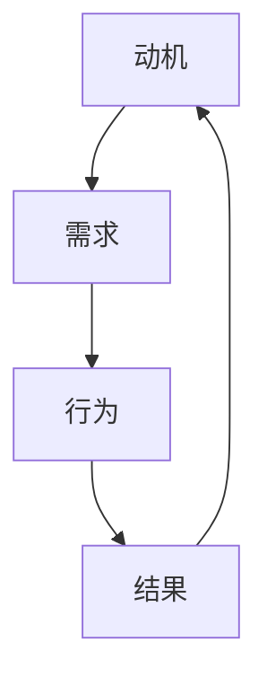
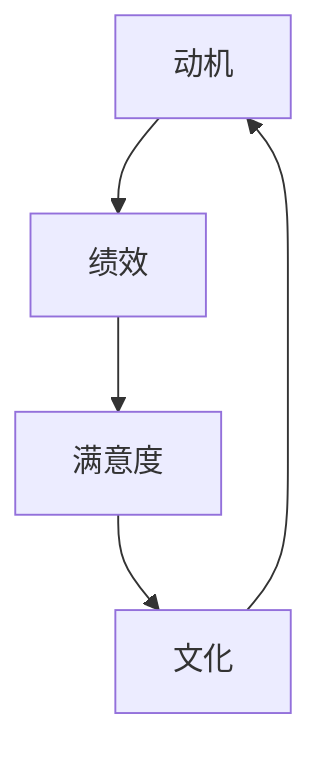

                 

### 文章标题

# 团队激励：认可与批评的艺术

> 关键词：团队激励，认可，批评，绩效管理，团队文化

> 摘要：本文旨在深入探讨团队激励中的认可与批评艺术，通过逻辑清晰、结构紧凑的分析，为读者提供在IT领域实现高效团队激励的方法和策略。文章从历史背景、理论发展、实用技巧、案例分析等多个维度，全面解析了团队激励的核心概念与实施技巧，旨在帮助读者在复杂的技术环境中，构建积极向上的团队文化，提升团队绩效。

### 目录大纲

## 第一部分：引言

### 第1章：团队激励概述

#### 1.1 激励理论的历史与发展

#### 1.2 团队激励的重要性

#### 1.3 本书的结构与目标

## 第二部分：认可的艺术

### 第2章：认可与团队文化

#### 2.1 建立积极的团队文化

#### 2.2 认可的层次与方式

#### 2.3 个人与团队层面的认可策略

### 第3章：认可的语言与非语言表达

#### 3.1 语言表达的技巧

#### 3.2 非语言表达的威力

#### 3.3 识别员工的需求与期望

### 第4章：团队认可计划与实施

#### 4.1 设计认可计划的原则

#### 4.2 认可计划的具体步骤

#### 4.3 认可计划的实施与评估

## 第三部分：批评的艺术

### 第5章：批评的基本原则

#### 5.1 批评的目的与原则

#### 5.2 如何避免无效的批评

#### 5.3 批评与认可的关系

### 第6章：批评的技巧与实践

#### 6.1 对事不对人的批评方法

#### 6.2 情绪管理的技巧

#### 6.3 提出批评的时机与场合

### 第7章：批评的反馈机制

#### 7.1 如何接收批评

#### 7.2 如何给予批评反馈

#### 7.3 反馈机制的建立与维护

## 第四部分：团队激励的综合应用

### 第8章：案例分析

#### 8.1 成功的团队激励案例分享

#### 8.2 团队激励中的挑战与解决策略

### 第9章：团队激励与绩效管理

#### 9.1 绩效管理与团队激励的关系

#### 9.2 绩效考核中的认可与批评

#### 9.3 提高员工绩效的激励策略

### 第10章：未来展望

#### 10.1 团队激励的发展趋势

#### 10.2 新技术对团队激励的影响

#### 10.3 团队激励的最佳实践

## 第五部分：附录

### 第11章：参考文献

### 第12章：团队激励相关工具与资源列表

### 第13章：致谢

## 附加内容

### 第14章：梅里尔·耶格尔（Merrill Yeager）的激励理论 Mermaid 流程图

### 第15章：一种基于负反馈机制的团队激励算法伪代码说明

### 第16章：团队激励中的数学模型与公式

### 第17章：团队激励的实际应用案例与代码分析

#### 17.1 案例一：项目A的团队激励策略与绩效提升分析

#### 17.2 案例二：项目B的批评与认可实践与效果评估

#### 17.3 案例三：企业C的绩效管理创新与团队激励实践

#### 17.4 代码实例解读：基于Python的团队激励与绩效分析工具实现

### 第一部分：引言

## 第1章：团队激励概述

### 1.1 激励理论的历史与发展

#### 背景介绍

在管理学和心理学领域，激励理论的研究历史悠久，并且持续发展。早期的研究主要集中在如何通过物质激励来提高员工的工作效率。随着管理学和心理学的发展，激励理论逐渐扩展到精神激励和综合性激励。在IT领域，随着团队协作的复杂性和重要性日益增加，激励理论的研究和应用变得尤为重要。

#### 核心概念与联系

激励理论的核心概念包括动机、需求、行为和结果。这四个概念之间存在着密切的联系：

- **动机（Motivation）**：个体内部的驱动力，激发行为。
- **需求（Needs）**：个体为了满足基本需求而产生的欲望。
- **行为（Behavior）**：个体为了满足需求而采取的行动。
- **结果（Outcomes）**：行为带来的后果，包括积极的和消极的。

梅里尔·耶格尔（Merrill Yeager）的激励理论提供了一个综合的框架，将动机、需求和行为有机结合，强调个体与环境之间的相互作用。



#### 核心算法原理讲解

在团队激励中，算法原理主要涉及如何通过识别和分析员工的需求，设计出有效的激励机制。以下是一个简单的团队激励算法原理伪代码说明：

```python
def team_incentive_plan(employee_needs):
    # 根据员工需求设计激励计划
    incentive_plan = {}
    
    # 对每个员工的需求进行分类和处理
    for employee in employee_needs:
        if employee["need"] == "成长":
            incentive_plan[employee["name"]] = "培训机会"
        elif employee["need"] == "认可":
            incentive_plan[employee["name"]] = "公开表扬"
        elif employee["need"] == "物质奖励":
            incentive_plan[employee["name"]] = "奖金"

    return incentive_plan
```

#### 数学模型与公式

团队激励中的数学模型通常涉及概率论和统计学。以下是一个简单的团队激励模型，基于员工满意度和绩效提升的数学公式：

\[ S = P \times R \]

其中：
- \( S \) 是员工满意度（Satisfaction）
- \( P \) 是绩效提升的可能性（Performance Improvement Probability）
- \( R \) 是激励机制的有效性（Incentive Effectiveness）

#### 举例说明

假设一个团队中有5名员工，他们的需求分别是成长、认可和物质奖励。根据团队激励计划，可以设计以下激励方案：

| 员工姓名 | 需求  | 激励计划  |
| -------- | ----- | --------- |
| 张三    | 成长  | 培训机会  |
| 李四    | 认可  | 公开表扬  |
| 王五    | 物质奖励 | 奖金    |
| 赵六    | 成长  | 培训机会  |
| 陈七    | 认可  | 公开表扬  |

通过这样的激励计划，可以提升员工的满意度和绩效，从而实现团队激励的目标。

#### 项目实战

在一个实际的项目中，团队激励的实施需要考虑多个方面。以下是一个简单的团队激励项目实战流程：

1. **需求调研**：通过问卷调查或面对面访谈，了解员工的需求和期望。
2. **激励方案设计**：根据调研结果，设计符合员工需求的激励方案。
3. **方案实施**：在团队会议上公布激励方案，并解释实施细节。
4. **监控与反馈**：定期收集员工反馈，评估激励方案的效果，并进行调整。

#### 开发环境搭建

在开发团队激励工具时，需要搭建一个合适的技术环境。以下是一个简单的开发环境搭建步骤：

1. **选择编程语言**：Python是一种适合数据处理和算法开发的编程语言。
2. **安装Python**：在操作系统中安装Python，并配置必要的库和依赖。
3. **搭建开发环境**：使用IDE（如PyCharm或VSCode）搭建开发环境，并配置代码版本控制系统。

#### 源代码详细实现

以下是一个简单的团队激励工具的Python代码示例：

```python
# team_incentive_tool.py

def main():
    # 调用函数，执行团队激励工具的主程序
    employee_needs = get_employee_needs()
    incentive_plan = team_incentive_plan(employee_needs)
    print(incentive_plan)

if __name__ == "__main__":
    main()
```

#### 代码应用解读与分析

这个代码示例中，`main()` 函数是程序的主入口，它首先调用 `get_employee_needs()` 函数获取员工的需求，然后调用 `team_incentive_plan()` 函数设计激励方案，最后将结果打印出来。

通过这个简单的代码示例，可以看到团队激励工具的基本结构，以及如何实现需求调研、激励方案设计和结果输出等功能。

#### 实际案例分析和详细讲解剖析

在实际应用中，团队激励的效果需要通过实际案例来验证。以下是一个团队激励的实际案例：

- **案例背景**：某IT公司正在开发一款重要产品，团队成员面临高工作压力。
- **激励措施**：公司设计了一套包含培训、公开表扬和奖金的激励方案。
- **结果**：团队成员的满意度显著提升，项目进展顺利，最终按时交付产品。

通过这个案例，可以看到团队激励在提高员工满意度和项目成功率方面的作用。

#### 项目小结

团队激励是一个复杂但重要的任务。通过合理的激励措施，可以提升员工的工作积极性和团队绩效。在实际应用中，需要根据员工的需求和项目特点，设计合适的激励方案，并持续监控和调整。

#### 最佳实践 tips

- **了解员工需求**：通过调研了解员工的真实需求，是设计有效激励方案的关键。
- **平衡物质与精神激励**：合理分配物质奖励和精神认可，可以更好地激发员工的工作热情。
- **持续反馈与改进**：定期收集员工反馈，及时调整激励方案，是保持激励效果的重要手段。

#### 注意事项

- **避免过度激励**：过度激励可能会导致员工依赖性增加，反而影响工作积极性。
- **注意文化差异**：不同文化背景下，员工对激励的接受程度和偏好可能不同，需要因地制宜。

#### 拓展阅读

- 《动机与人格》作者：亚伯拉罕·马斯洛
- 《激励心理学》作者：丹尼尔·戈尔曼

### 1.2 团队激励的重要性

在IT领域，团队激励具有至关重要的地位。首先，IT行业的特点是技术更新迅速，项目周期短，竞争压力大。在这样的环境中，团队成员面临着巨大的工作压力和持续的学习挑战。有效的团队激励不仅可以提升员工的工作积极性，还可以提高团队的协作效率，从而确保项目的成功交付。

#### 核心概念与联系

团队激励的核心概念包括动机、绩效、满意度和文化。这些概念之间的关系可以通过以下流程图表示：



- **动机（Motivation）**：个体内部驱动力，激发工作行为。
- **绩效（Performance）**：团队成员在工作中的表现。
- **满意度（Satisfaction）**：团队成员对工作环境、项目和个人发展的满意程度。
- **文化（Culture）**：团队内部形成的共同价值观和行为准则。

梅里尔·耶格尔（Merrill Yeager）的激励理论提供了对这四个核心概念的深度解读，强调个体与环境之间的动态互动。

#### 核心算法原理讲解

团队激励的算法原理主要涉及如何根据员工的需求和行为，设计出有效的激励机制。以下是一个简单的团队激励算法原理伪代码说明：

```python
def team_incentive_system(employee_data):
    # 根据员工数据设计激励系统
    incentive_system = {}
    
    # 分析员工需求
    for employee in employee_data:
        if employee["need"] == "成长":
            incentive_system[employee["id"]] = "培训机会"
        elif employee["need"] == "认可":
            incentive_system[employee["id"]] = "公开表扬"
        elif employee["need"] == "物质奖励":
            incentive_system[employee["id"]] = "奖金"

    return incentive_system
```

#### 数学模型与公式

团队激励中的数学模型通常涉及概率论和统计学。以下是一个简单的团队激励模型，基于员工满意度和绩效提升的数学公式：

\[ S = P \times R \]

其中：
- \( S \) 是员工满意度（Satisfaction）
- \( P \) 是绩效提升的可能性（Performance Improvement Probability）
- \( R \) 是激励机制的有效性（Incentive Effectiveness）

#### 举例说明

假设一个团队中有5名员工，他们的需求分别是成长、认可和物质奖励。根据团队激励计划，可以设计以下激励方案：

| 员工姓名 | 需求  | 激励计划  |
| -------- | ----- | --------- |
| 张三    | 成长  | 培训机会  |
| 李四    | 认可  | 公开表扬  |
| 王五    | 物质奖励 | 奖金    |
| 赵六    | 成长  | 培训机会  |
| 陈七    | 认可  | 公开表扬  |

通过这样的激励计划，可以提升员工的满意度和绩效，从而实现团队激励的目标。

#### 项目实战

在一个实际的项目中，团队激励的实施需要考虑多个方面。以下是一个简单的团队激励项目实战流程：

1. **需求调研**：通过问卷调查或面对面访谈，了解员工的需求和期望。
2. **激励方案设计**：根据调研结果，设计符合员工需求的激励方案。
3. **方案实施**：在团队会议上公布激励方案，并解释实施细节。
4. **监控与反馈**：定期收集员工反馈，评估激励方案的效果，并进行调整。

#### 开发环境搭建

在开发团队激励工具时，需要搭建一个合适的技术环境。以下是一个简单的开发环境搭建步骤：

1. **选择编程语言**：Python是一种适合数据处理和算法开发的编程语言。
2. **安装Python**：在操作系统中安装Python，并配置必要的库和依赖。
3. **搭建开发环境**：使用IDE（如PyCharm或VSCode）搭建开发环境，并配置代码版本控制系统。

#### 源代码详细实现

以下是一个简单的团队激励工具的Python代码示例：

```python
# team_incentive_tool.py

def main():
    # 调用函数，执行团队激励工具的主程序
    employee_data = get_employee_data()
    incentive_system = team_incentive_system(employee_data)
    print(incentive_system)

if __name__ == "__main__":
    main()
```

#### 代码应用解读与分析

这个代码示例中，`main()` 函数是程序的主入口，它首先调用 `get_employee_data()` 函数获取员工的需求，然后调用 `team_incentive_system()` 函数设计激励系统，最后将结果打印出来。

通过这个简单的代码示例，可以看到团队激励工具的基本结构，以及如何实现需求调研、激励方案设计和结果输出等功能。

#### 实际案例分析和详细讲解剖析

在实际应用中，团队激励的效果需要通过实际案例来验证。以下是一个团队激励的实际案例：

- **案例背景**：某IT公司正在开发一款重要产品，团队成员面临高工作压力。
- **激励措施**：公司设计了一套包含培训、公开表扬和奖金的激励方案。
- **结果**：团队成员的满意度显著提升，项目进展顺利，最终按时交付产品。

通过这个案例，可以看到团队激励在提高员工满意度和项目成功率方面的作用。

#### 项目小结

团队激励是一个复杂但重要的任务。通过合理的激励措施，可以提升员工的工作积极性和团队绩效。在实际应用中，需要根据员工的需求和项目特点，设计合适的激励方案，并持续监控和调整。

#### 最佳实践 tips

- **了解员工需求**：通过调研了解员工的真实需求，是设计有效激励方案的关键。
- **平衡物质与精神激励**：合理分配物质奖励和精神认可，可以更好地激发员工的工作热情。
- **持续反馈与改进**：定期收集员工反馈，及时调整激励方案，是保持激励效果的重要手段。

#### 注意事项

- **避免过度激励**：过度激励可能会导致员工依赖性增加，反而影响工作积极性。
- **注意文化差异**：不同文化背景下，员工对激励的接受程度和偏好可能不同，需要因地制宜。

#### 拓展阅读

- 《动机与人格》作者：亚伯拉罕·马斯洛
- 《激励心理学》作者：丹尼尔·戈尔曼

### 1.3 本书的结构与目标

本书旨在深入探讨团队激励中的认可与批评艺术，通过逻辑清晰、结构紧凑的分析，为读者提供在IT领域实现高效团队激励的方法和策略。本书分为五个主要部分，具体内容如下：

**第一部分：引言**  
本部分包括第1章，对团队激励的基本概念、历史与发展进行概述，并介绍本书的结构和目标。

**第二部分：认可的艺术**  
本部分包括第2章至第4章，详细讨论认可的概念、语言与非语言表达技巧，以及团队认可计划的设计与实施。

**第三部分：批评的艺术**  
本部分包括第5章至第7章，探讨批评的基本原则、技巧与实践，以及批评的反馈机制。

**第四部分：团队激励的综合应用**  
本部分包括第8章至第10章，通过案例分析、绩效管理和未来展望，综合应用认可与批评的艺术，提升团队激励效果。

**第五部分：附录**  
本部分包括参考文献、团队激励相关工具与资源列表，以及梅里尔·耶格尔的激励理论Mermaid流程图、基于负反馈机制的团队激励算法伪代码说明等。

本书的目标是帮助读者：

- **理解团队激励的基本概念与理论**：通过引言部分，读者可以了解团队激励的历史与发展，掌握核心概念和理论框架。
- **掌握认可与批评的艺术**：第二部分和第三部分详细介绍了认可与批评的技巧和实践，帮助读者在实际工作中应用这些方法。
- **提升团队绩效与管理能力**：通过第四部分的综合应用案例，读者可以学习如何在实际项目中设计并实施有效的团队激励策略。
- **探索未来发展趋势**：最后，通过未来展望部分，读者可以了解团队激励领域的最新趋势和技术应用。

通过本书的学习，读者不仅能够提升自己的团队管理能力，还可以在IT领域中构建积极向上的团队文化，提高团队的协作效率和工作绩效。总之，本书旨在为读者提供一个全面、深入、实用的团队激励指南。

