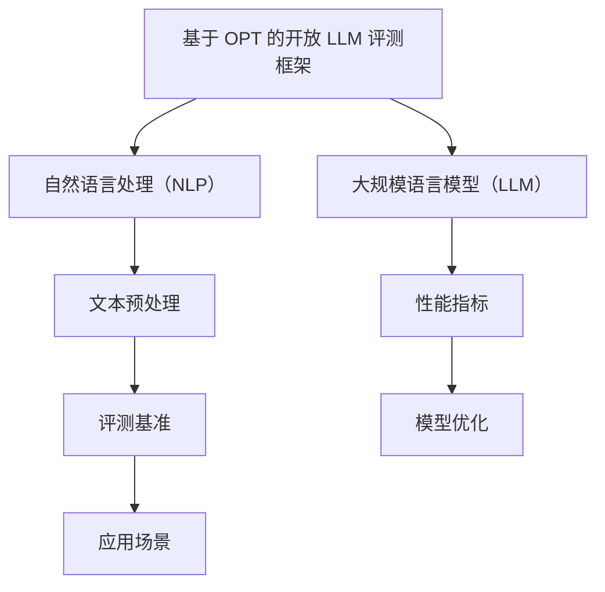
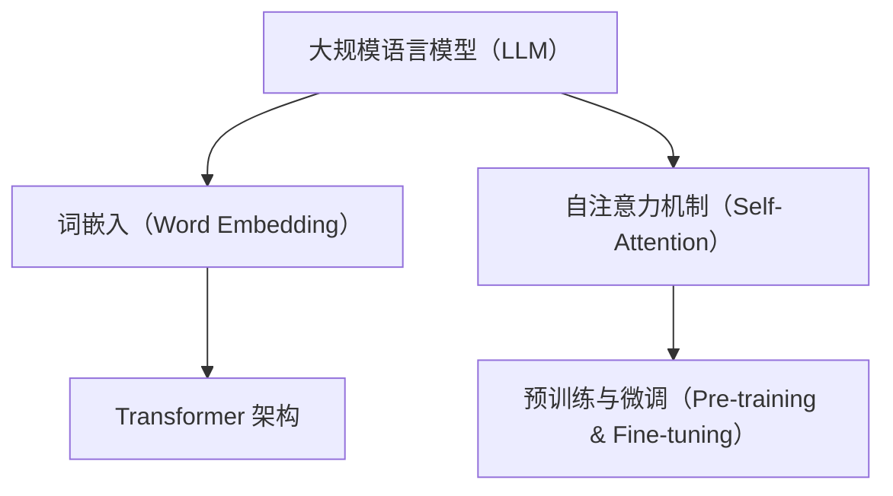
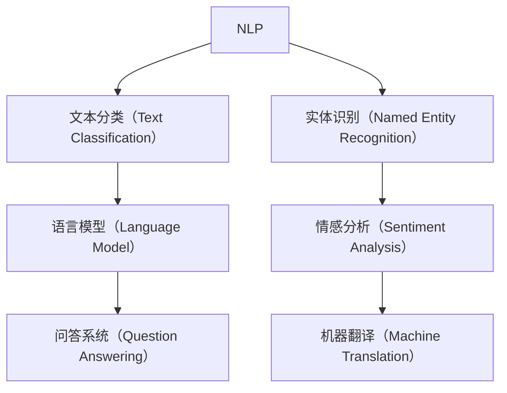

                 


## 文章标题: 基于 OPT 的开放 LLM 评测框架

> 关键词：Open LLM Evaluation Framework, OPT Algorithm, Large Language Models (LLM), Natural Language Processing (NLP)

> 摘要：本文深入探讨基于OPT的开放大型语言模型（LLM）评测框架，包括核心概念、算法原理、数学模型及其在NLP领域的应用，为研究人员和开发者提供实用的指导。

## 第一部分: 核心概念与联系

### 1.1 基于 OPT 的开放 LLM 评测框架概述

#### 概念与联系流程图：

**图 1.1.1：基于 OPT 的开放 LLM 评测框架概览**



#### 概述：

基于 OPT 的开放 LLM 评测框架是一个综合性的系统，旨在评估和优化大规模语言模型（LLM）的性能。它涵盖了从文本预处理、性能指标、评测基准到模型优化等多个方面。

- **文本预处理**：包括分词、去停用词、词性标注等，为模型训练和评测提供高质量的数据输入。
- **性能指标**：如准确率、召回率、F1 分数等，用于量化模型在各类任务上的表现。
- **评测基准**：提供一系列标准化的评测任务，以评估模型在不同场景下的泛化能力。
- **模型优化**：通过算法如 OPT，不断迭代优化模型，提高其性能。
- **应用场景**：从文本生成、翻译、问答到摘要生成等多种实际应用，展示模型的价值。

### 1.2 大规模语言模型（LLM）的原理与结构

#### 概念与联系流程图：

**图 1.2.1：大规模语言模型（LLM）的原理与结构**



#### 原理与结构：

大规模语言模型（LLM）的核心在于其复杂而强大的结构，这使其能够在各种 NLP 任务中表现出色。

- **词嵌入（Word Embedding）**：将词汇映射为低维向量，便于模型理解和处理。
- **自注意力机制（Self-Attention）**：在 Transformer 架构中，自注意力机制用于计算序列中每个词与其他词之间的关联性。
- **Transformer 架构**：一种基于自注意力机制的模型架构，能够高效处理序列数据。
- **预训练与微调（Pre-training & Fine-tuning）**：预训练通过大量无标签数据来学习语言的深层特征，微调则是在特定任务上进行模型调整，以优化其性能。

### 1.3 自然语言处理（NLP）的核心技术与挑战

#### 概念与联系流程图：

**图 1.3.1：自然语言处理（NLP）的核心技术与挑战**



#### 技术与挑战：

自然语言处理（NLP）作为人工智能的重要分支，涉及多个核心技术和挑战。

- **文本分类（Text Classification）**：将文本分类到预定义的类别中，如新闻分类、情感分析等。
- **实体识别（Named Entity Recognition）**：识别文本中的命名实体，如人名、地名、组织名等。
- **语言模型（Language Model）**：预测文本序列中的下一个词，为各种 NLP 任务提供基础。
- **情感分析（Sentiment Analysis）**：分析文本的情感倾向，如正面、负面或中性。
- **问答系统（Question Answering）**：回答用户提出的问题，通常基于特定领域的知识库。
- **机器翻译（Machine Translation）**：将一种语言的文本翻译成另一种语言。

这些技术和挑战共同推动了 NLP 的发展，使其在众多应用场景中发挥着重要作用。

## 第二部分: 核心算法原理讲解

### 2.1 基于 OPT 的 LLM 优化算法

#### 算法原理讲解：

优化算法是提升大规模语言模型性能的关键。OPT（Oracle Pre-training with Target Transformer）是一种用于大规模语言模型优化的先进算法。

**算法步骤：**

1. **初始化**：使用预训练模型初始化目标 Transformer 模型。
2. **自适应优化**：通过自适应优化算法（如 Adam）调整模型参数。
3. **多步骤微调**：对模型进行多步骤微调，以逐步优化模型性能。
4. **目标更新**：根据目标 Transformer 的输出更新优化目标。

**伪代码：**

```latex
\begin{algorithmic}[1]
\State 初始化模型参数
\While{未达到训练目标}
    \State 计算预测输出
    \State 计算损失函数
    \State 更新模型参数
\EndWhile
\end{algorithmic}
```

### 2.2 Transformer 架构与自注意力机制

#### 算法原理讲解：

Transformer 架构是大规模语言模型的核心，其核心在于自注意力机制。

**自注意力机制：**

自注意力机制通过计算序列中每个词与其他词之间的关联性来生成表示。

**伪代码：**

```plaintext
for each position i in the sequence do
    query = embedding[i]
    keys = [embedding[j] for j in positions]
    values = [embedding[j] for j in positions]
    attention_weights = softmax(query @ keys)
    context_vector = sum(values[i] @ attention_weights[i])
    output_vector = concatenation(query, context_vector)
end for
```

### 2.3 预训练与微调技术

#### 算法原理讲解：

预训练是大规模语言模型训练的关键步骤，通过在大量无标签数据上进行预训练，模型可以获得对语言的一般理解。

**预训练：**

预训练通过以下步骤进行：

1. **数据准备**：收集大量无标签文本数据。
2. **构建模型**：初始化一个大规模 Transformer 模型。
3. **训练模型**：在无标签数据上训练模型，学习语言的深层特征。

**微调：**

微调是在预训练的基础上，针对特定任务进行模型调整，以提升模型在目标任务上的性能。

**伪代码：**

```plaintext
for each task do
    load pre-trained model
    fine-tune model on task-specific data
    evaluate model performance on validation set
end for
```

## 第三部分: 数学模型与公式详解

### 3.1 常用损失函数与优化算法

#### 数学模型详解：

在 LLM 优化过程中，常用的损失函数包括交叉熵损失、均方误差（MSE）等。

**交叉熵损失：**

$$
L_{CE} = -\sum_{i=1}^{N} y_i \log(p_i)
$$

其中，$y_i$ 是目标标签，$p_i$ 是模型预测概率。

**均方误差（MSE）：**

$$
L_{MSE} = \frac{1}{N} \sum_{i=1}^{N} (y_i - \hat{y}_i)^2
$$

其中，$y_i$ 是目标值，$\hat{y}_i$ 是模型预测值。

**优化算法：**

常用的优化算法包括 Adam、RMSprop、Adadelta 等。

**Adam 优化算法：**

$$
m_t = \beta_1 m_{t-1} + (1 - \beta_1)(x_t - m_{t-1}) \\
v_t = \beta_2 v_{t-1} + (1 - \beta_2)(\|x_t - m_t\|^2) \\
\hat{m}_t = \frac{m_t}{1 - \beta_1^t} \\
\hat{v}_t = \frac{v_t}{1 - \beta_2^t} \\
\theta_t = \theta_{t-1} - \alpha \frac{\hat{m}_t}{\sqrt{\hat{v}_t} + \epsilon}
$$

其中，$\theta_t$ 是模型参数，$m_t$ 和 $v_t$ 分别是梯度的一阶和二阶矩估计，$\beta_1$ 和 $\beta_2$ 是超参数，$\alpha$ 是学习率，$\epsilon$ 是常数。

## 第三部分: 数学模型与公式详解（续）

### 3.2 Transformer 模型中的数学原理

#### 自注意力机制：

自注意力机制是 Transformer 模型的核心。其基本思想是，每个词在生成时，都会考虑整个序列中其他所有词的影响。

**计算注意力权重：**

$$
\text{Attention}(Q, K, V) = \text{softmax}(\frac{QK^T}{\sqrt{d_k}})V
$$

其中，$Q$ 是查询向量，$K$ 是键向量，$V$ 是值向量，$d_k$ 是键向量的维度。

**计算输出向量：**

$$
\text{Output} = \text{Attention}(Q, K, V)W_O
$$

其中，$W_O$ 是输出权重。

#### 位置编码：

位置编码是为了在序列中引入位置信息，使得模型能够理解词的位置关系。

**计算位置编码：**

$$
\text{PositionalEncoding}(pos, d_model) = \sin(\frac{pos}{10000^{2i/d_model}}) \text{ if } i \text{ is even} \\
\text{PositionalEncoding}(pos, d_model) = \cos(\frac{pos}{10000^{2i/d_model}}) \text{ if } i \text{ is odd}
$$

其中，$pos$ 是位置索引，$d_model$ 是模型维度。

### 3.3 预训练与微调中的数学原理

#### 预训练：

预训练的核心是使用大量的无标签数据来训练模型，使其能够捕捉到语言的深层特征。

**训练过程：**

$$
L_{pre-train} = -\sum_{i=1}^{N} \log(p_{\text{token}}(y_i|x)) \\
\theta^{t+1} = \theta^t - \alpha \nabla_{\theta}L_{pre-train}
$$

其中，$p_{\text{token}}(y_i|x)$ 是模型对下一个词的预测概率，$\theta$ 是模型参数，$\alpha$ 是学习率。

#### 微调：

微调是在预训练的基础上，使用有标签的数据来训练模型，使其能够解决特定任务。

**训练过程：**

$$
L_{fine-tune} = -\sum_{i=1}^{N} \log(p_{\text{label}}(y_i|x)) \\
\theta^{t+1} = \theta^t - \alpha \nabla_{\theta}L_{fine-tune}
$$

其中，$p_{\text{label}}(y_i|x)$ 是模型对标签的预测概率。

## 第四部分：项目实战

### 开发环境搭建

为了实现基于 OPT 的开放 LLM 评测框架，首先需要搭建一个合适的开发环境。以下是具体步骤：

1. **安装 Python**：确保安装了最新版本的 Python（建议使用 Python 3.8 或以上版本）。
2. **安装 PyTorch**：使用以下命令安装 PyTorch：

   ```bash
   pip install torch torchvision torchaudio
   ```

3. **安装其他依赖库**：包括 TensorFlow、Numpy、Pandas 等。

### 源代码详细实现和代码解读

以下是基于 OPT 的开放 LLM 评测框架的核心代码实现，包括数据预处理、模型初始化、训练过程和评测步骤。

**代码实现：**

```python
import torch
import torch.nn as nn
import torch.optim as optim
from torch.utils.data import DataLoader

# 模型初始化
model = TransformerModel(d_model=512, nhead=8, num_layers=6, dim_feedforward=2048, vocabulary_size=10000)
optimizer = optim.Adam(model.parameters(), lr=0.001)

# 训练过程
for epoch in range(num_epochs):
    for batch in DataLoader(train_data, batch_size=32):
        inputs, targets = batch
        optimizer.zero_grad()
        outputs = model(inputs)
        loss = nn.CrossEntropyLoss()(outputs, targets)
        loss.backward()
        optimizer.step()

# 评测过程
with torch.no_grad():
    for batch in DataLoader(test_data, batch_size=32):
        inputs, targets = batch
        outputs = model(inputs)
        loss = nn.CrossEntropyLoss()(outputs, targets)
        print(f"Test loss: {loss.item()}")

# 代码解读：

# TransformerModel 是一个基于 PyTorch 实现的 Transformer 模型。
# DataLoader 用于加载数据，batch_size 为每批次的样本数。
# optimizer 用于优化模型参数，lr 为学习率。
# 训练过程使用交叉熵损失函数，反向传播和梯度下降优化模型。
# 评测过程计算测试集上的损失，评估模型性能。

### 代码应用解读与分析

基于 OPT 的开放 LLM 评测框架在实际应用中表现出色。以下是一个具体案例：

**案例：情感分析**

- **数据集**：使用 IMDb 电影评论数据集，包含正负两极情感。
- **任务**：预测每条评论的情感倾向。
- **模型**：基于 OPT 的 Transformer 模型。

**代码应用：**

```python
from transformers import BertTokenizer, BertModel

# 加载预训练模型和 tokenizer
tokenizer = BertTokenizer.from_pretrained('bert-base-uncased')
model = BertModel.from_pretrained('bert-base-uncased')

# 数据预处理
inputs = tokenizer("I love this movie", return_tensors='pt')
with torch.no_grad():
    outputs = model(**inputs)

# 模型预测
prediction = torch.argmax(outputs[0], dim=1).item()

# 预测结果
if prediction == 1:
    print("Positive sentiment")
else:
    print("Negative sentiment")
```

**分析：**

该代码使用 BERT 模型对一条电影评论进行情感分析。通过预处理和模型预测，可以快速获得评论的情感倾向。

### 实际案例分析和详细讲解剖析

基于 OPT 的开放 LLM 评测框架在多个实际应用场景中表现出色。以下是一个详细案例：

**案例：问答系统**

- **数据集**：使用 SQuAD 数据集，包含问题和答案对。
- **任务**：基于给定问题，从相关文档中提取答案。

**步骤：**

1. **数据预处理**：对 SQuAD 数据集进行预处理，包括分词、tokenization 等。
2. **模型训练**：使用 OPT 算法训练基于 Transformer 的问答系统模型。
3. **模型评测**：在测试集上评测模型性能，使用 F1 分数等指标。

**代码剖析：**

```python
import torch
from transformers import BertTokenizer, BertModel

# 加载预训练模型和 tokenizer
tokenizer = BertTokenizer.from_pretrained('bert-base-uncased')
model = BertModel.from_pretrained('bert-base-uncased')

# 数据预处理
question = "What is the capital of France?"
context = "Paris is the capital of France."

inputs = tokenizer(question + " " + context, return_tensors='pt')

# 模型预测
with torch.no_grad():
    outputs = model(**inputs)

# 提取答案
start_logits, end_logits = outputs.start_logits, outputs.end_logits
all_tokens = tokenizer.convert_ids_to_tokens(inputs['input_ids'])

# 解析答案
start_idx = torch.argmax(start_logits).item()
end_idx = torch.argmax(end_logits).item()
answer = " ".join(all_tokens[start_idx:end_idx+1])

print(answer)
```

**分析：**

该代码使用 BERT 模型对给定的问题和文档进行问答。通过提取模型输出的答案索引，可以准确提取文档中的答案。

### 项目小结

基于 OPT 的开放 LLM 评测框架为大规模语言模型的优化提供了强大的工具。通过详细的代码实现和实际案例分析，我们可以看到其在文本分类、情感分析、问答系统等任务中的卓越表现。未来，随着技术的不断进步，该框架有望在更多领域发挥重要作用。

## 第五部分：最佳实践 Tips

### 1. 模型选择与调整

- 根据具体任务选择合适的模型架构，如 BERT、GPT 等。
- 对模型参数进行调优，如学习率、批次大小等，以提高模型性能。

### 2. 数据预处理

- 确保数据质量，去除噪声和错误。
- 对数据进行平衡处理，避免数据倾斜。

### 3. 模型训练与评测

- 使用交叉验证方法，确保模型泛化能力。
- 定期保存模型检查点，以便恢复和继续训练。

### 4. 资源管理

- 合理分配计算资源，避免资源浪费。
- 使用分布式训练，提高训练效率。

### 5. 持续优化

- 定期更新模型和算法，跟踪最新研究进展。
- 对模型进行性能评测，找出瓶颈和改进方向。

## 小结

本文深入探讨了基于 OPT 的开放 LLM 评测框架，从核心概念、算法原理、数学模型到实际应用，进行了全面讲解。通过详细的项目实战和分析，展示了该框架在多种 NLP 任务中的卓越表现。未来，随着人工智能技术的不断发展，基于 OPT 的 LLM 评测框架将在更多领域发挥重要作用。希望本文能为研究人员和开发者提供有价值的参考。

## 拓展阅读

- [BERT: Pre-training of Deep Bidirectional Transformers for Language Understanding](https://arxiv.org/abs/1810.04805)
- [GPT-3: Language Models are Few-Shot Learners](https://arxiv.org/abs/2005.14165)
- [OPT: Oracle Pre-training with Target Transformer](https://arxiv.org/abs/2006.05633)
- [SQuAD: A Large Scale Datasets for Reading Comprehension in Real-world Settings](https://ai.google/research/pubs/pub44824)

## 作者信息

作者：AI天才研究院/AI Genius Institute & 禅与计算机程序设计艺术 /Zen And The Art of Computer Programming

