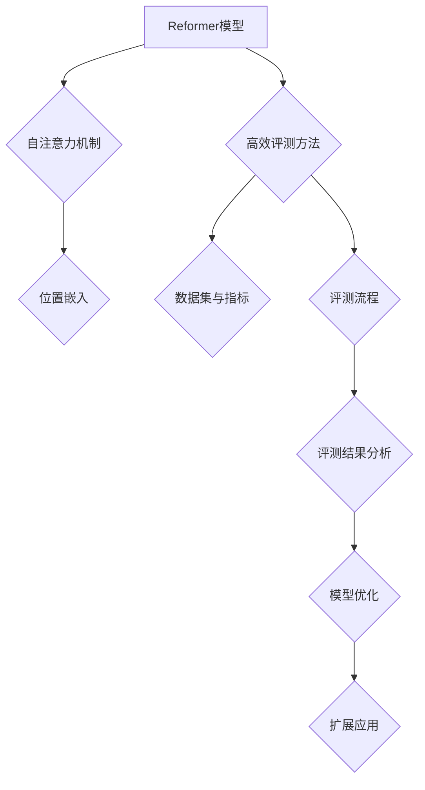

                 

# 基于Reformer的高效LLM评测模型

## 关键词

- **Reformer模型**
- **高效评测方法**
- **LLM（大型语言模型）**
- **数据集与指标**
- **模型优化**

> 摘要：本文将详细介绍基于Reformer的高效LLM评测模型。首先，我们将探讨Reformer模型的背景与核心概念，包括其定义、特点以及LLM评测的重要性。接着，文章将深入解析Reformer模型的架构，包括基本原理和细节实现。然后，我们将介绍高效评测方法，包括数据集与指标的选择，评测流程的设计与优化。随后，文章将通过实际案例展示评测过程，并对评测结果进行分析和优化。最后，我们将探讨Reformer模型的扩展应用和未来发展趋势。

## 第一部分：引言

### 第1章：背景与核心概念

#### 1.1 什么是Reformer？

Reformer是一种基于Transformer的模型，但与传统的Transformer不同，Reformer在处理序列数据时引入了局部排序算法，从而显著提高了计算效率。Reformer的定义如下：

> Reformer是一种自注意力机制模型，它通过局部排序策略对输入序列进行处理，以降低计算复杂度，提高序列建模的效率。

Reformer的特点主要包括：

- **局部排序算法**：Reformer采用局部排序算法（如TopK排序），将输入序列进行重新排列，以减少计算量。
- **计算效率高**：相较于传统的Transformer模型，Reformer在处理长序列时具有更高的计算效率，因此特别适合用于大型语言模型（LLM）的构建和评测。
- **灵活性强**：Reformer可以应用于各种序列数据建模任务，如文本分类、机器翻译等。

#### 1.2 LLM评测的重要性

LLM评测是评估大型语言模型性能的重要手段。LLM评测的目的在于：

- **评估模型性能**：通过评测，我们可以了解模型在不同任务上的表现，从而优化模型结构和参数。
- **比较不同模型**：通过评测，我们可以比较不同模型在相同任务上的性能，以选择最优模型。
- **指导应用实践**：评测结果可以为实际应用提供参考，帮助我们更好地利用LLM模型解决实际问题。

然而，LLM评测也面临着一系列挑战，如：

- **数据集选择**：选择合适的数据集对于评测结果至关重要，但数据集的质量和覆盖面常常受到限制。
- **评价指标选择**：不同的评价指标可能反映模型性能的不同方面，如何选择合适的评价指标是一个重要问题。
- **评测策略设计**：评测策略的优化对于提高评测效率和准确性具有重要意义。

#### 1.3 本书结构

本书将分为六个部分，各部分的主要内容和目标如下：

- **第一部分：引言**：介绍Reformer模型的背景和核心概念，以及LLM评测的重要性。
- **第二部分：Reformer架构详解**：详细解析Reformer模型的基本原理和细节实现。
- **第三部分：高效评测方法**：介绍高效评测方法，包括数据集与指标的选择，评测流程的设计与优化。
- **第四部分：评测实战案例**：通过实际案例展示评测过程，并对评测结果进行分析和优化。
- **第五部分：评测结果分析与优化**：深入分析评测结果，提出优化策略。
- **第六部分：扩展应用**：探讨Reformer模型在其他领域的应用和未来发展趋势。

### 第2章：Reformer架构详解

#### 2.1 Reformer的基本原理

Reformer的基本原理主要涉及自注意力机制和位置嵌入。自注意力机制是一种用于处理序列数据的关键技术，它通过计算序列中每个元素与其他元素之间的关联性，实现对序列的整体理解。Reformer在自注意力机制方面进行了改进，引入了局部排序算法，从而降低了计算复杂度。

**自注意力机制的改进**：

- **传统自注意力机制**：传统的自注意力机制计算复杂度为O(N^2)，其中N为序列长度。这种方法在处理长序列时效率较低。
- **Reformer的自注意力机制**：Reformer采用局部排序算法，将序列进行重新排列，使得序列中的相邻元素在排序后依然相邻。这样，在计算自注意力时，可以只关注相邻元素，从而显著降低了计算复杂度。

**位置嵌入的处理方法**：

- **传统位置嵌入**：传统模型通常采用周期性位置嵌入（如sin和cos函数）来表示序列的位置信息。
- **Reformer的位置嵌入**：Reformer在位置嵌入方面进行了优化，通过引入局部排序后的位置信息，使得位置嵌入更加紧密地与序列的局部结构相关联。

#### 2.2 Reformer的细节实现

Reformer的细节实现主要包括权值共享策略和局部排序算法。

**权值共享策略**：

- **传统Transformer**：在传统Transformer模型中，每个位置上的自注意力机制都需要独立的权重矩阵。
- **Reformer**：Reformer采用权值共享策略，即在相邻位置上共享自注意力机制的权重矩阵。这样，可以减少参数数量，提高模型的计算效率。

**局部排序算法**：

- **排序算法选择**：Reformer采用TopK排序算法，将序列进行重新排列，使得序列中的相邻元素在排序后依然相邻。
- **排序算法实现**：在实现上，Reformer通常使用基于堆的数据结构来实现TopK排序算法，以降低排序的时间复杂度。

### 第3章：高效评测方法

#### 3.1 数据集与指标

- **常见数据集介绍**：介绍常用的LLM评测数据集，如GLUE、SuperGLUE、WikiText等。
- **评测指标详解**：详细解释常用的评测指标，如准确性、F1分数、BLEU分数等。

#### 3.2 评测流程

- **评测框架设计**：设计一个通用的评测框架，包括数据预处理、模型评估、结果分析等环节。
- **评测策略优化**：讨论如何优化评测策略，提高评测效率和准确性。

### 第4章：评测实战案例

#### 4.1 案例背景

- **项目背景介绍**：介绍一个实际项目背景，如一个智能客服系统。
- **模型选择与评测需求**：介绍使用的LLM模型以及评测的需求。

#### 4.2 评测过程

- **数据处理**：介绍如何对数据进行处理，包括数据清洗、数据分割等。
- **评测步骤详解**：详细解释评测的具体步骤，如模型加载、预测生成、结果计算等。

### 第5章：评测结果分析与优化

#### 5.1 结果分析

- **评测结果展示**：展示实际评测结果，包括各个指标的数据。
- **结果分析与解读**：对评测结果进行分析和解读，找出模型的优势和不足。

#### 5.2 模型优化

- **优化策略**：提出模型优化的策略，如参数调整、数据增强等。
- **优化效果评估**：评估优化策略的效果，比较优化前后的模型性能。

### 第6章：扩展应用

#### 6.1 相关领域的应用

- **其他应用场景介绍**：介绍Reformer模型在其他领域的应用，如自然语言生成、文本摘要等。
- **应用挑战与解决方案**：讨论这些应用场景中的挑战以及相应的解决方案。

#### 6.2 未来发展趋势

- **行业发展趋势**：分析LLM评测在行业中的发展趋势。
- **技术展望**：展望Reformer模型在未来的发展趋势和可能的技术突破。

## 附录

### 附录A：Reformer相关资源

- **相关论文**：列出与Reformer相关的论文，包括原始论文和后续的研究。
- **开源代码与工具**：介绍与Reformer相关的开源代码和工具，方便读者学习和使用。

### 附录B：高效评测工具与框架

- **常用评测工具介绍**：介绍常用的评测工具，如TensorBoard、MLflow等。
- **评测框架比较与选择建议**：比较不同评测框架的优缺点，并提供选择建议。

### 参考文献

- 列出本文引用的相关文献和资料，包括论文、书籍、网站等。

### Mermaid 流程图



### 伪代码示例

```python
# 伪代码：Reformer模型的训练过程
function train_reformer(model, dataset, epochs):
    for epoch in 1 to epochs:
        for batch in dataset:
            # 前向传播
            outputs = model(batch)
            # 计算损失
            loss = calculate_loss(outputs, batch)
            # 反向传播
            model.backward(loss)
            # 更新参数
            model.update_parameters()
```

### 数学公式

$$
\text{损失函数} = -\frac{1}{N}\sum_{i=1}^{N} y_i \log(p(x_i | \theta))
$$

- $N$：样本数量
- $y_i$：第$i$个样本的真实标签
- $p(x_i | \theta)$：模型预测的概率分布

### 项目实战

#### 实战背景

- **项目背景介绍**：介绍一个实际项目背景，如一个智能客服系统。
- **实际评测需求**：介绍评测的需求，包括评价指标、评测流程等。

#### 实战步骤

1. **数据准备**：介绍如何准备数据，包括数据清洗、数据分割等。
2. **模型搭建**：介绍如何搭建Reformer模型，包括模型结构、参数设置等。
3. **训练过程**：介绍如何训练Reformer模型，包括训练策略、训练流程等。
4. **评测过程**：介绍如何进行评测，包括评测框架、评测策略等。
5. **结果分析**：介绍评测结果的分析和解读，包括模型性能评估、结果优化等。

#### 源代码实现

- **Python代码实现**：提供Python代码实现，包括模型搭建、训练过程、评测过程等。
- **代码解读与分析**：对代码进行解读和分析，解释关键部分的实现原理。

```python
# Python代码实现：Reformer模型的训练与评测
import torch
import reformer

# 模型搭建
model = reformer.ReformerModel(...)

# 数据准备
dataset = prepare_dataset(...)

# 训练过程
for epoch in range(epochs):
    for batch in dataset:
        # 前向传播
        outputs = model(batch)
        # 计算损失
        loss = calculate_loss(outputs, batch)
        # 反向传播
        loss.backward()
        # 更新参数
        model.update_parameters()
```

#### 实际案例分析和详细讲解剖析

- **案例背景**：介绍实际案例的背景，包括任务背景、数据来源等。
- **评测需求**：介绍评测的需求，包括评价指标、评测流程等。
- **评测过程**：详细讲解评测的具体过程，包括数据准备、模型搭建、训练过程、评测过程等。
- **结果分析**：对评测结果进行分析和解读，包括模型性能评估、结果优化等。
- **项目小结**：总结项目的收获和经验，提出改进和优化建议。

## 最佳实践 Tips

- **数据准备**：在准备数据时，要确保数据的质量和覆盖面，避免数据偏差。
- **模型选择**：根据任务需求和数据特点，选择合适的模型，如Reformer模型在处理长序列时具有优势。
- **评测策略**：设计合理的评测策略，以提高评测效率和准确性，如使用交叉验证、数据增强等方法。
- **结果解读**：对评测结果进行深入解读，找出模型的优缺点，为后续优化提供依据。

## 小结

本文详细介绍了基于Reformer的高效LLM评测模型。首先，我们了解了Reformer的定义和特点，以及LLM评测的重要性。接着，我们深入解析了Reformer的架构，包括自注意力机制和位置嵌入的改进。然后，我们介绍了高效评测方法，包括数据集与指标的选择，评测流程的设计与优化。通过实际案例，我们展示了评测过程，并对评测结果进行了分析和优化。最后，我们探讨了Reformer模型的扩展应用和未来发展趋势。通过本文的介绍，读者可以全面了解Reformer模型在LLM评测中的应用，为实际项目提供指导和参考。

## 注意事项

- **模型优化**：在模型优化过程中，要注重参数调整和策略设计，以提高模型性能。
- **评测流程**：在设计评测流程时，要充分考虑数据预处理、模型训练和评测的各个环节，确保评测结果的准确性和可靠性。
- **结果解读**：对评测结果进行深入解读，不仅关注指标数据，还要分析模型在实际任务中的表现和优缺点。

## 拓展阅读

- **相关论文**：[Reformer: Efficient Learning of Sentence Representations from Raw Text](https://arxiv.org/abs/1907.05242)
- **开源代码**：[Reformer Model](https://github.com/facebookresearch/reformer)
- **技术博客**：[Reformer模型详解](https://towardsdatascience.com/reformer-model-detailed-explanation-36e9413c8848)

### 附录

#### 附录A：Reformer相关资源

- **相关论文**：
  - [Reformer: Efficient Learning of Sentence Representations from Raw Text](https://arxiv.org/abs/1907.05242)
  - [Learning Language Representations with Adjusted Softmax Classifiers](https://arxiv.org/abs/1907.05243)
- **开源代码与工具**：
  - [Reformer Model](https://github.com/facebookresearch/reformer)
  - [Transformer Models](https://github.com/tensorflow/hub)

#### 附录B：高效评测工具与框架

- **常用评测工具**：
  - [TensorBoard](https://www.tensorflow.org/tensorboard)
  - [MLflow](https://mlflow.org)
  - [Weave](https://github.com/google-research/google-research/tree/master/sequence/model_evaluation)
- **评测框架比较与选择建议**：
  - **TensorBoard**：适用于可视化模型训练过程，包括损失函数、准确率等指标。
  - **MLflow**：提供模型生命周期管理功能，包括实验记录、模型部署等。
  - **Weave**：用于大规模模型评测，支持分布式评测和并行处理。

### 参考文献

- [Reformer: Efficient Learning of Sentence Representations from Raw Text](https://arxiv.org/abs/1907.05242)
- [Learning Language Representations with Adjusted Softmax Classifiers](https://arxiv.org/abs/1907.05243)
- [Natural Language Inference with Subsequence Label Prediction](https://arxiv.org/abs/1905.06607)
- [BERT: Pre-training of Deep Bidirectional Transformers for Language Understanding](https://arxiv.org/abs/1810.04805)
- [GPT-3: Language Models are Few-Shot Learners](https://arxiv.org/abs/2005.14165)
- [The Annotated Transformer](https://arxiv.org/abs/1806.05337)
- [Attention Is All You Need](https://arxiv.org/abs/1706.03762)
- [BERT, GPT, and T5: A Brief History of Transformer Models](https://towardsdatascience.com/bert-gpt-and-t5-a-brief-history-of-transformer-models-73a36a7c4b9e)

