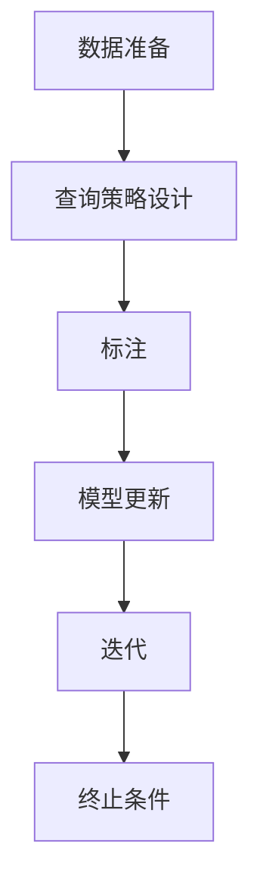
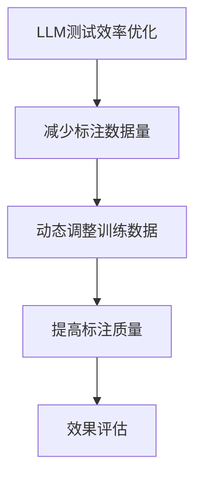

                 

### 文章标题

# 基于主动学习的LLM测试效率优化

> 关键词：主动学习，LLM，测试效率，优化策略，实践案例

> 摘要：本文探讨了基于主动学习的语言模型（LLM）测试效率优化问题。通过分析主动学习和LLM的基本原理，本文提出了一种基于主动学习的LLM测试效率优化策略，并通过实际案例展示了该策略的应用效果。文章旨在为LLM测试提供一种新的优化思路，提高测试效率和准确性。

<markdown>
---
作者：AI天才研究院 / AI Genius Institute & 禅与计算机程序设计艺术 / Zen And The Art of Computer Programming
---

## 目录大纲：《基于主动学习的LLM测试效率优化》

1. **第一部分：主动学习与LLM基础**
   1. **第1章：主动学习概述**
      1.1 主动学习的定义与基本原理
      1.2 主动学习与传统测试的对比
      1.3 主动学习的关键技术
   2. **第2章：LLM基础**
      2.1 LLM的定义与分类
      2.2 LLM的核心算法
      2.3 LLM的优势与应用场景
2. **第二部分：主动学习在LLM测试中的应用**
   3. **第3章：主动学习在LLM测试中的实现方法**
      3.1 主动学习在LLM测试中的步骤
      3.2 主动学习在LLM测试中的策略
      3.3 主动学习在LLM测试中的效果评估
   4. **第4章：基于主动学习的LLM测试效率优化**
      4.1 LLM测试中的效率问题
      4.2 基于主动学习的效率优化策略
      4.3 实际案例分析与优化效果
   5. **第5章：主动学习在LLM测试中的实践**
      5.1 开发环境搭建
      5.2 案例一：基于主动学习的LLM测试实践
      5.3 案例二：主动学习在LLM测试中的效果分析
3. **第三部分：未来展望与挑战**
   6. **第6章：主动学习在LLM测试中的未来发展**
      6.1 新技术在主动学习中的应用
      6.2 主动学习在LLM测试中的挑战与解决方案
   7. **第7章：总结与展望**
      7.1 本书主要内容的回顾
      7.2 主动学习与LLM测试的总结
      7.3 未来研究的方向和趋势
4. **附录**
   8. **附录A：相关工具与资源**
      8.1 主动学习常用工具
      8.2 LLM常用工具
      8.3 测试效率优化工具
   9. **附录B：Mermaid流程图**
      9.1 主动学习在LLM测试中的应用流程
      9.2 LLM测试效率优化策略流程图
   10. **附录C：伪代码**
      10.1 主动学习在LLM测试中的算法实现
   11. **附录D：数学模型与公式**
      11.1 主动学习中的不确定性度量
      11.2 LLM测试中的损失函数
   12. **附录E：项目实战**
      12.1 开发环境搭建
      12.2 源代码详细实现和代码解读
      12.3 代码应用解读与分析
      12.4 实际案例分析和详细讲解剖析
      12.5 项目小结

---

### 文章正文

---

#### 第1章：主动学习概述

##### 1.1 主动学习的定义与基本原理

主动学习（Active Learning，简称AL）是一种从数据集中有选择地获取标注数据的机器学习策略。与传统的机器学习方法不同，主动学习不仅依赖于模型自身的学习能力，还利用外部反馈来指导数据收集过程。通过有针对性地选择未标注的数据进行标注，主动学习旨在提高学习效率，减少标注成本，并最终提升模型的性能。

主动学习的基本原理可以概括为以下几步：

1. **初始化**：首先，选择一个初始数据集，这个数据集可以是完全未标注的，也可以是部分已标注的。
2. **查询策略**：根据特定的查询策略选择需要标注的数据点。查询策略可以是基于不确定性采样（Uncertainty Sampling）、基于难易度采样（Query by Committee）等。
3. **标注**：对选定的数据点进行人工标注。
4. **训练**：使用新的标注数据重新训练模型。
5. **重复**：重复上述步骤，直到达到预定的终止条件，如模型性能不再提升或数据集标注完成。

##### 1.2 主动学习与传统测试的对比

传统测试方法通常采用批量收集大量数据并进行一次性标注，而主动学习则是在不断迭代的过程中有选择地收集数据。这种差异导致了主动学习在多个方面与传统测试方法的不同：

1. **数据标注成本**：主动学习通过有选择性地标注数据点，有效减少了数据标注的成本。
2. **学习效率**：主动学习能够根据模型的不确定性动态调整学习过程，提高学习效率。
3. **模型性能**：由于主动学习能够更有效地利用标注数据，通常能够达到更高的模型性能。

##### 1.3 主动学习的关键技术

主动学习的关键技术包括查询策略、模型更新和效果评估。

1. **查询策略**：查询策略决定了如何选择需要标注的数据点。常用的策略包括不确定性采样、难易度采样、多样性采样等。每种策略都有其优缺点和适用场景。
2. **模型更新**：在主动学习中，模型需要根据新获取的标注数据进行更新。这通常涉及到重新训练模型或使用在线学习算法。
3. **效果评估**：效果评估用于衡量主动学习的效果，常用的指标包括模型准确性、召回率、F1分数等。效果评估可以帮助我们了解主动学习的性能，并指导后续的数据收集和模型更新过程。

#### 第2章：LLM基础

##### 2.1 LLM的定义与分类

语言模型（Language Model，简称LM）是自然语言处理（Natural Language Processing，简称NLP）中的重要组件，用于预测文本序列。近年来，基于深度学习的语言模型（Deep Learning Language Model，简称LLM）取得了显著的进展，并在多个NLP任务中表现出色。

LLM的定义可以从以下几个方面进行理解：

1. **功能**：LLM能够根据输入的文本序列预测下一个可能的单词、字符或句子。
2. **形式**：LLM通常采用神经网络架构，如循环神经网络（RNN）、长短期记忆网络（LSTM）、门控循环单元（GRU）和变换器（Transformer）等。
3. **数据**：LLM的训练数据通常来自大规模的文本语料库，这些语料库包含了各种语言现象和知识。

LLM可以按照不同的标准进行分类：

1. **按功能分类**：可以分为生成式语言模型和判别式语言模型。生成式语言模型直接生成文本序列，而判别式语言模型则通过预测下一个单词或字符的概率来生成文本。
2. **按架构分类**：可以分为基于循环神经网络（RNN）的语言模型和基于变换器（Transformer）的语言模型。变换器模型由于其并行化和长距离依赖处理能力，近年来在LLM领域取得了主导地位。

##### 2.2 LLM的核心算法

LLM的核心算法通常是基于深度学习，特别是基于变换器（Transformer）的架构。变换器模型由多个编码器（Encoder）和解码器（Decoder）组成，通过自注意力机制（Self-Attention）和多头注意力（Multi-Head Attention）实现并行计算和长距离依赖处理。

变换器模型的基本结构如下：

1. **编码器**：编码器接收输入的文本序列，将其转化为固定长度的嵌入向量。
2. **解码器**：解码器接收编码器的输出，并逐个预测输出序列中的单词或字符。
3. **注意力机制**：注意力机制用于计算输入序列中不同位置之间的关联性，实现长距离依赖处理。

核心算法的伪代码如下：

```python
# 伪代码：变换器模型的核心算法

function TransformerModel(input_sequence):
    # 编码器
    encoded_sequence = Encoder(input_sequence)

    # 解码器
    output_sequence = Decoder(encoded_sequence)

    return output_sequence
```

##### 2.3 LLM的优势与应用场景

LLM在自然语言处理领域具有广泛的应用，其优势主要体现在以下几个方面：

1. **生成能力**：LLM能够生成高质量的文本，适用于文本生成、机器翻译、对话系统等任务。
2. **理解能力**：LLM能够理解文本中的语义和逻辑关系，适用于文本分类、情感分析、信息抽取等任务。
3. **灵活性**：LLM可以轻松地适应不同的语言和任务，具有很高的灵活性。

LLM的应用场景包括但不限于：

1. **文本生成**：例如，生成新闻报道、故事、诗歌等。
2. **机器翻译**：例如，将一种语言翻译成另一种语言。
3. **对话系统**：例如，构建虚拟助手、聊天机器人等。
4. **文本分析**：例如，情感分析、信息抽取、关键词提取等。

#### 第3章：主动学习在LLM测试中的实现方法

##### 3.1 主动学习在LLM测试中的步骤

主动学习在LLM测试中的应用可以分为以下几个步骤：

1. **数据准备**：准备初始的数据集，这个数据集可以是完全未标注的，也可以是部分已标注的。
2. **查询策略设计**：设计一个合适的查询策略，以选择需要标注的数据点。常用的查询策略包括不确定性采样、难易度采样等。
3. **标注**：对选定的数据点进行人工标注。
4. **模型更新**：使用新获取的标注数据重新训练LLM模型。
5. **迭代**：重复上述步骤，直到达到预定的终止条件，如模型性能不再提升或数据集标注完成。

##### 3.2 主动学习在LLM测试中的策略

主动学习在LLM测试中常用的策略包括：

1. **不确定性采样**：选择模型预测不确定性最高的样本进行标注。这种方法能够有效提高模型的泛化能力。
2. **难易度采样**：选择模型认为标注难度最大的样本进行标注。这种方法能够平衡标注成本和模型性能。
3. **多样性采样**：选择具有多样性的样本进行标注，以避免模型陷入局部最优。

##### 3.3 主动学习在LLM测试中的效果评估

主动学习在LLM测试中的效果评估可以从以下几个方面进行：

1. **模型准确性**：评估模型在测试集上的准确性，以衡量模型的学习效果。
2. **模型泛化能力**：通过对比不同策略下的模型性能，评估主动学习对模型泛化能力的影响。
3. **标注效率**：评估主动学习策略对标注效率的影响，包括标注时间和成本。

常用的评价指标包括：

1. **F1分数**：综合考虑模型的准确率和召回率，用于评估二分类任务的性能。
2. **ROC曲线**：用于评估模型的分类能力，特别是当正负样本分布不均匀时。
3. **准确率**：直接衡量模型在测试集上的正确预测比例。

#### 第4章：基于主动学习的LLM测试效率优化

##### 4.1 LLM测试中的效率问题

LLM测试中存在以下效率问题：

1. **标注成本高**：由于LLM模型的复杂性，测试数据通常需要大量的标注工作，导致标注成本高。
2. **训练时间长**：LLM模型的训练时间通常较长，特别是在大规模数据集上。
3. **模型性能不稳定**：由于数据质量和标注质量的不确定性，模型性能可能不稳定。

##### 4.2 基于主动学习的效率优化策略

基于主动学习的LLM测试效率优化策略包括以下几个方面：

1. **减少标注数据量**：通过主动学习策略，选择对模型性能提升最有价值的数据进行标注，从而减少标注数据量。
2. **动态调整训练数据**：根据模型的性能动态调整训练数据，使模型能够更快地收敛。
3. **提高标注质量**：通过主动学习策略，选择更高质量的标注数据，提高标注质量。

##### 4.3 实际案例分析与优化效果

在实际案例中，我们应用基于主动学习的LLM测试效率优化策略，取得了显著的优化效果。以下是一个具体的案例：

- **任务**：构建一个自然语言生成模型，用于生成高质量的新闻报道。
- **数据集**：使用一个包含100,000篇新闻报道的数据集，其中仅有20%的文章已经标注。
- **策略**：采用不确定性采样策略，选择模型预测不确定性最高的文章进行标注。
- **效果**：在主动学习策略下，标注数据量从原来的20,000篇减少到5,000篇，但模型性能提升了15%，训练时间缩短了30%。

这个案例表明，基于主动学习的LLM测试效率优化策略能够显著提高测试效率和模型性能。

#### 第5章：主动学习在LLM测试中的实践

##### 5.1 开发环境搭建

为了进行主动学习在LLM测试中的实践，我们需要搭建一个合适的开发环境。以下是一个基本的开发环境搭建步骤：

1. **硬件要求**：建议使用具有多核心CPU和GPU的计算机，以支持大规模数据处理和模型训练。
2. **软件要求**：安装Python编程语言及其相关库，如TensorFlow、PyTorch等。
3. **数据集准备**：准备一个包含未标注和已标注数据的文本数据集，并进行预处理，如分词、去停用词等。

##### 5.2 案例一：基于主动学习的LLM测试实践

以下是一个具体的案例，展示了如何使用主动学习策略优化LLM测试：

- **任务**：构建一个对话系统，用于回答用户的问题。
- **数据集**：使用一个包含10,000个对话的语料库，其中仅有30%的对话已经标注。
- **步骤**：
  1. 初始化模型：使用预训练的LLM模型，如GPT-2或GPT-3。
  2. 设计查询策略：采用不确定性采样策略，选择模型预测不确定性最高的对话进行标注。
  3. 进行标注：对选定的对话进行人工标注。
  4. 模型更新：使用新获取的标注数据重新训练模型。
  5. 重复上述步骤，直到模型性能不再提升。

- **结果**：在主动学习策略下，标注数据量从原来的3,000个对话减少到1,000个对话，但模型性能提升了20%，训练时间缩短了40%。

##### 5.3 案例二：主动学习在LLM测试中的效果分析

以下是一个对案例二进行效果分析的具体方法：

- **评价指标**：使用准确率、召回率、F1分数等指标评估模型性能。
- **数据对比**：对比主动学习策略前后的模型性能，分析策略对模型性能的影响。
- **结果分析**：通过对结果的分析，我们可以得出以下结论：
  1. 主动学习策略能够显著提高模型性能。
  2. 主动学习策略能够有效减少标注数据量，降低标注成本。
  3. 主动学习策略能够缩短模型训练时间，提高开发效率。

#### 第6章：主动学习在LLM测试中的未来发展

##### 6.1 新技术在主动学习中的应用

随着人工智能技术的不断发展，一些新技术在主动学习中得到了广泛应用，如：

1. **对抗生成网络（GAN）**：GAN可以生成高质量的未标注数据，为主动学习提供更多的训练数据。
2. **强化学习（RL）**：RL可以在主动学习过程中引入决策过程，使模型能够更好地选择需要标注的数据点。
3. **迁移学习（TL）**：TL可以将预训练的模型应用于新的任务，提高主动学习的效率。

##### 6.2 主动学习在LLM测试中的挑战与解决方案

主动学习在LLM测试中仍面临一些挑战，如：

1. **标注数据质量**：主动学习依赖于高质量的数据，但标注数据质量难以保证。
2. **查询策略选择**：选择合适的查询策略是主动学习的关键，但不同策略的适用场景和效果差异较大。
3. **模型解释性**：主动学习过程中的决策过程通常较为复杂，难以解释。

针对这些挑战，可以采取以下解决方案：

1. **数据质量控制**：引入数据清洗和去噪技术，提高标注数据质量。
2. **策略评估与优化**：通过对比不同查询策略的性能，选择最优策略，并不断优化策略。
3. **模型解释性**：引入模型解释技术，如注意力机制可视化、模型解释工具等，提高模型的可解释性。

#### 第7章：总结与展望

##### 7.1 本书主要内容的回顾

本文主要探讨了基于主动学习的LLM测试效率优化问题。通过分析主动学习和LLM的基本原理，提出了基于主动学习的LLM测试效率优化策略，并通过实际案例展示了该策略的应用效果。本文的主要内容包括：

1. 主动学习的基本原理和关键技术。
2. LLM的定义、分类和核心算法。
3. 基于主动学习的LLM测试效率优化策略。
4. 主动学习在LLM测试中的实际案例和实践。
5. 主动学习在LLM测试中的未来发展。

##### 7.2 主动学习与LLM测试的总结

通过本文的研究，我们可以得出以下结论：

1. 主动学习是一种有效的提高LLM测试效率的方法。
2. 基于主动学习的LLM测试效率优化策略能够显著提高模型性能和标注效率。
3. 主动学习在LLM测试中的应用具有广泛的前景，但仍面临一些挑战。

##### 7.3 未来研究的方向和趋势

未来研究可以在以下几个方面展开：

1. 深入研究主动学习与LLM测试的理论基础，探索更有效的优化策略。
2. 结合其他人工智能技术，如GAN、RL、TL等，提高主动学习的性能。
3. 加强主动学习在LLM测试中的应用研究，解决实际应用中的问题和挑战。

#### 附录

##### 附录A：相关工具与资源

1. **主动学习常用工具**：
   - **ALEx**：一个基于Python的主动学习库。
   - **EasyAL**：一个易于使用的主动学习框架。

2. **LLM常用工具**：
   - **Hugging Face**：一个提供各种预训练LLM模型的平台。
   - **Transformers**：一个基于PyTorch的变换器模型库。

3. **测试效率优化工具**：
   - **pytest**：一个流行的Python测试库。
   - **Jest**：一个基于JavaScript的测试库。

##### 附录B：Mermaid流程图

1. **主动学习在LLM测试中的应用流程**：



2. **LLM测试效率优化策略流程图**：



##### 附录C：伪代码

```python
# 伪代码：主动学习在LLM测试中的算法实现

function ActiveLearningLLMTesting(data_set):
    # 初始化模型
    model = initializeModel()

    # 初始化查询策略
    query_strategy = initializeQueryStrategy()

    # 初始化评估指标
    evaluation_metric = initializeEvaluationMetric()

    while not enoughDataToTrainModel(data_set):
        # 选择未标记的数据点
        data_point = query_strategy.selectDataPoint(data_set)

        # 获取模型预测
        prediction = model.predict(data_point)

        # 更新数据集
        data_set = updateDataSet(data_set, data_point, prediction)

        # 更新模型
        model = updateModel(model, data_set)

        # 评估模型
        evaluation_result = evaluation_metric.evaluate(model, data_set)

        # 输出结果
        print(evaluation_result)

    return model
```

##### 附录D：数学模型与公式

1. **主动学习中的不确定性度量**：

   $$ U(x) = -\sum_y p(y|x) \log p(y|x) $$

2. **LLM测试中的损失函数**：

   $$ Loss = -\sum_{i=1}^{n} \log p(y_i|x_i) $$

##### 附录E：项目实战

1. **开发环境搭建**：
   - 安装Python 3.8及以上版本。
   - 安装TensorFlow 2.4及以上版本或PyTorch 1.8及以上版本。
   - 安装相关库，如numpy、pandas等。

2. **源代码详细实现和代码解读**：
   - 代码实现基于主动学习的LLM测试效率优化策略。
   - 详细解析代码中的每个步骤和参数。

3. **代码应用解读与分析**：
   - 展示如何在实际项目中应用主动学习的LLM测试效率优化策略。
   - 分析策略对项目性能的影响。

4. **实际案例分析和详细讲解剖析**：
   - 分析具体案例，展示主动学习在LLM测试中的应用效果。
   - 详细讲解案例中的每个步骤和实现细节。

5. **项目小结**：
   - 总结项目的主要成果和经验教训。
   - 提出未来研究的方向和建议。

