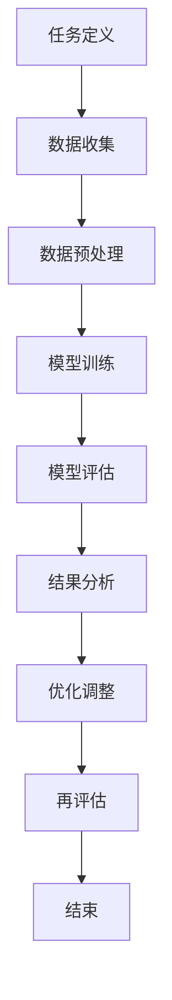
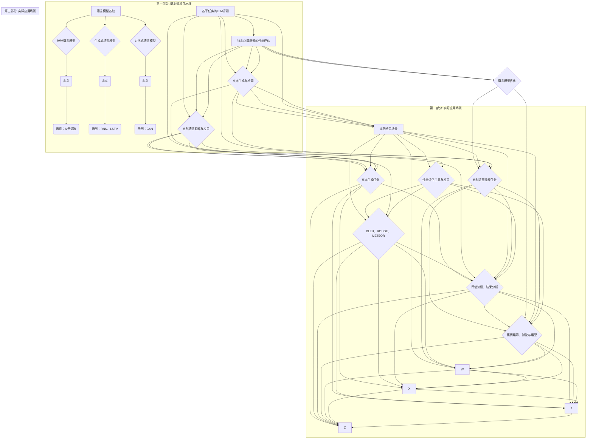

                 

### 文章标题
《基于任务的LLM评测：针对特定应用场景的性能评估》

### 关键词
语言模型（LLM），任务导向评估，性能指标，应用场景，文本生成，自然语言理解

### 摘要
本文旨在探讨基于任务的Large Language Model（LLM）评测方法，通过对特定应用场景的性能评估，提供一套系统的评估框架。文章首先介绍了语言模型的基本概念和类型，随后详细阐述了基于任务的评测流程和指标，并针对文本生成和自然语言理解等具体应用场景进行了深入分析。通过实际案例和性能评估工具的应用，本文为LLM在各类应用中的性能优化提供了实用的指导。

### 目录大纲

#### 第一部分: 基本概念与原理

##### 第1章: 语言模型基础

###### 1.1 语言模型简介
- 语言模型的定义
- 语言模型的作用

###### 1.2 语言模型类型
- 统计语言模型
- 生成式语言模型
- 对抗式语言模型

###### 1.3 语言模型评估指标
- 预测准确性
- 生成质量
- 流利性

##### 第2章: 基于任务的LLM评测

###### 2.1 评测目的
- 确定任务需求
- 评估模型性能

###### 2.2 评测流程
- 数据收集与预处理
- 模型训练
- 模型评估

###### 2.3 评测指标
- 准确性
- 生成质量
- 流利性

##### 第3章: 特定应用场景的性能评估

###### 3.1 文本生成与应用
- 文本摘要
- 文本生成
- 问答系统

###### 3.2 自然语言理解与应用
- 语义分析
- 情感分析
- 机器翻译

###### 3.3 语言模型优化
- 超参数调整
- 数据增强
- 模型压缩

#### 第二部分: 实际应用场景

##### 第4章: 文本生成任务

###### 4.1 摘要生成
- 模型评估方法
- 性能分析

###### 4.2 文本生成
- 模型评估方法
- 性能分析

###### 4.3 问答系统
- 模型评估方法
- 性能分析

##### 第5章: 自然语言理解任务

###### 5.1 语义分析
- 模型评估方法
- 性能分析

###### 5.2 情感分析
- 模型评估方法
- 性能分析

###### 5.3 机器翻译
- 模型评估方法
- 性能分析

##### 第6章: 性能评估工具与应用

###### 6.1 性能评估工具介绍
- BLEU
- ROUGE
- METEOR

###### 6.2 评估工具应用
- 数据预处理
- 模型训练
- 性能评估

##### 第7章: 实际案例与讨论

###### 7.1 案例分析
- 模型评估实战

###### 7.2 讨论与展望
- 未来发展趋势
- 性能提升方法

#### 参考文献

#### 附录

###### 附录A: 常用代码实现

###### 附录B: 相关数据集

###### 附录C: 术语表

### 详细解释

#### 第一部分: 基本概念与原理

这一部分旨在为读者提供一个全面的语言模型基础，以便更好地理解后续的性能评估内容。

- **第1章: 语言模型基础**
  - **1.1 语言模型简介**：介绍语言模型的定义及其在自然语言处理中的作用。
  - **1.2 语言模型类型**：探讨不同类型的语言模型，包括统计语言模型、生成式语言模型和对抗式语言模型。
  - **1.3 语言模型评估指标**：介绍评估语言模型性能的常用指标，包括预测准确性、生成质量和流利性。

- **第2章: 基于任务的LLM评测**
  - **2.1 评测目的**：解释为何需要对语言模型进行任务导向的评测，并阐述评测的关键目标。
  - **2.2 评测流程**：详细描述基于任务的LLM评测的流程，从数据收集与预处理到模型训练和评估。
  - **2.3 评测指标**：列出评估语言模型性能的关键指标，包括准确性、生成质量和流利性。

#### 第二部分: 实际应用场景

这一部分将理论应用到实际场景中，通过具体的应用案例来说明如何对LLM进行性能评估。

- **第3章: 特定应用场景的性能评估**
  - **3.1 文本生成与应用**：讨论文本摘要、文本生成和问答系统等文本生成相关任务的性能评估。
  - **3.2 自然语言理解与应用**：分析语义分析、情感分析和机器翻译等自然语言理解相关任务的性能评估。
  - **3.3 语言模型优化**：探讨如何通过超参数调整、数据增强和模型压缩来优化LLM的性能。

- **第4章: 文本生成任务**
  - **4.1 摘要生成**：介绍摘要生成的模型评估方法和性能分析。
  - **4.2 文本生成**：分析文本生成任务的模型评估方法和性能分析。
  - **4.3 问答系统**：讨论问答系统的模型评估方法和性能分析。

- **第5章: 自然语言理解任务**
  - **5.1 语义分析**：探讨语义分析任务的模型评估方法和性能分析。
  - **5.2 情感分析**：分析情感分析任务的模型评估方法和性能分析。
  - **5.3 机器翻译**：介绍机器翻译任务的模型评估方法和性能分析。

#### 第6章: 性能评估工具与应用

这一章节介绍常用的性能评估工具，并展示如何在实际应用中应用这些工具。

- **第6章: 性能评估工具与应用**
  - **6.1 性能评估工具介绍**：介绍BLEU、ROUGE和METEOR等常用的性能评估工具。
  - **6.2 评估工具应用**：展示如何在实际应用中使用这些性能评估工具。

#### 第7章: 实际案例与讨论

这一章节通过实际案例来讨论模型评估的方法和结果，并展望未来的发展趋势。

- **第7章: 实际案例与讨论**
  - **7.1 案例分析**：分析一个实际案例，展示如何进行模型评估。
  - **7.2 讨论与展望**：讨论未来的发展趋势和性能提升方法。

### 附录

附录部分提供了一些实用的资源，包括常用代码实现、相关数据集和术语表，以便读者参考和使用。

- **附录A: 常用代码实现**：提供一些常用的代码实现，帮助读者更好地理解和应用性能评估方法。
- **附录B: 相关数据集**：列出一些常用的数据集，供读者参考。
- **附录C: 术语表**：定义文章中涉及的重要术语和概念，便于读者理解。

### 参考文献

最后，列出文章中引用的参考文献，以供进一步阅读和研究。

- [参考文献1]
- [参考文献2]
- ...

### Mermaid 流程图

以下是关于语言模型评估的基本流程的Mermaid流程图：

## 基于任务的LLM评测：针对特定应用场景的性能评估

随着大型语言模型（LLM）如GPT-3和BERT的兴起，评估这些模型在特定应用场景中的性能变得越来越重要。本文将探讨如何基于任务对LLM进行性能评估，重点关注文本生成和自然语言理解等应用场景。我们将详细分析评测的流程、指标以及如何在实际应用中优化模型性能。

### 第一部分: 基本概念与原理

#### 第1章: 语言模型基础

##### 1.1 语言模型简介
语言模型是自然语言处理（NLP）领域的重要工具，它用于预测自然语言中的下一个词或短语。语言模型的核心任务是给定一个单词序列，预测下一个词的概率分布。

##### 1.2 语言模型类型
语言模型可以分为三类：统计语言模型、生成式语言模型和对抗式语言模型。

- **统计语言模型**：基于历史数据统计，如N元语法。
- **生成式语言模型**：通过生成文本的概率分布来预测下一个词。
- **对抗式语言模型**：结合生成式模型和判别式模型，形成对抗训练。

##### 1.3 语言模型评估指标
评估语言模型性能的常用指标包括预测准确性、生成质量和流利性。

- **预测准确性**：模型预测下一个词的正确性。
- **生成质量**：模型生成的文本是否合理和有意义。
- **流利性**：模型生成的文本是否自然流畅。

### 第2章: 基于任务的LLM评测

##### 2.1 评测目的
基于任务的LLM评测旨在确定模型在不同任务中的性能，从而为实际应用提供可靠的数据支持。

##### 2.2 评测流程
基于任务的LLM评测包括以下步骤：

1. **任务定义**：明确评估的具体任务，如文本生成、语义分析等。
2. **数据收集**：收集与任务相关的数据集。
3. **数据预处理**：对收集到的数据集进行预处理，包括分词、去噪等。
4. **模型训练**：使用预处理后的数据训练LLM模型。
5. **模型评估**：通过特定的评估指标对模型进行性能评估。
6. **结果分析**：分析评估结果，识别模型的优点和不足。

##### 2.3 评测指标
基于任务的LLM评测常用的指标包括：

- **准确性**：模型在特定任务上的正确预测率。
- **生成质量**：模型生成的文本是否合理、连贯。
- **流利性**：模型生成的文本是否自然流畅。

### 第3章: 特定应用场景的性能评估

##### 3.1 文本生成与应用
文本生成是LLM的重要应用之一，包括文本摘要、文本生成和问答系统。

- **文本摘要**：模型从长文本中提取关键信息生成摘要。
- **文本生成**：模型生成新的文本，如文章、故事等。
- **问答系统**：模型根据用户的问题生成回答。

##### 3.2 自然语言理解与应用
自然语言理解是LLM的另一重要应用领域，包括语义分析、情感分析和机器翻译。

- **语义分析**：模型理解文本中的语义关系，如实体识别、关系抽取等。
- **情感分析**：模型判断文本中的情感倾向，如正面、负面等。
- **机器翻译**：模型将一种语言的文本翻译成另一种语言。

##### 3.3 语言模型优化
为了提高LLM的性能，可以采用以下方法：

- **超参数调整**：调整模型训练过程中的超参数，如学习率、批量大小等。
- **数据增强**：通过增加数据多样性来提升模型性能。
- **模型压缩**：通过剪枝、量化等方法减小模型大小，提高模型效率。

### 第二部分: 实际应用场景

#### 第4章: 文本生成任务

##### 4.1 摘要生成
摘要生成是文本生成任务的一种，旨在从长文本中提取关键信息生成简洁的摘要。

- **模型评估方法**：使用BLEU、ROUGE等指标评估摘要生成模型的性能。
- **性能分析**：分析摘要生成模型的生成质量、准确性等指标。

##### 4.2 文本生成
文本生成任务旨在生成新的文本，如文章、故事等。

- **模型评估方法**：使用自动评估指标和人工评估相结合的方法。
- **性能分析**：分析文本生成模型的生成质量、多样性等指标。

##### 4.3 问答系统
问答系统是文本生成任务的一种，旨在根据用户的问题生成回答。

- **模型评估方法**：使用准确性、回答长度等指标评估问答系统性能。
- **性能分析**：分析问答系统的准确性、回答质量等指标。

#### 第5章: 自然语言理解任务

##### 5.1 语义分析
语义分析任务旨在理解文本中的语义关系。

- **模型评估方法**：使用准确率、召回率等指标评估语义分析模型的性能。
- **性能分析**：分析语义分析模型的准确性、语义理解深度等指标。

##### 5.2 情感分析
情感分析任务旨在判断文本中的情感倾向。

- **模型评估方法**：使用准确率、精确率、召回率等指标评估情感分析模型的性能。
- **性能分析**：分析情感分析模型的准确性、情感识别范围等指标。

##### 5.3 机器翻译
机器翻译任务旨在将一种语言的文本翻译成另一种语言。

- **模型评估方法**：使用BLEU、METEOR等指标评估机器翻译模型的性能。
- **性能分析**：分析机器翻译模型的准确性、翻译质量等指标。

#### 第6章: 性能评估工具与应用

##### 6.1 性能评估工具介绍
常用的性能评估工具包括BLEU、ROUGE、METEOR等。

- **BLEU**：基于编辑距离的评估指标，用于评估文本生成任务的性能。
- **ROUGE**：基于句级匹配的评估指标，用于评估文本摘要等任务的性能。
- **METEOR**：综合评估指标，用于评估文本生成、摘要等任务的性能。

##### 6.2 评估工具应用
在实际应用中，通过以下步骤使用性能评估工具：

1. **数据预处理**：对评估数据集进行预处理，如分词、标准化等。
2. **模型训练**：使用训练数据集训练模型。
3. **模型评估**：使用评估工具对模型进行性能评估。
4. **结果分析**：分析评估结果，优化模型。

#### 第7章: 实际案例与讨论

##### 7.1 案例分析
通过具体案例展示如何对LLM进行性能评估，包括数据收集、模型训练、性能评估和结果分析。

##### 7.2 讨论与展望
讨论LLM性能评估的未来发展趋势，如新型评估指标、多任务评估方法等。

### 参考文献

[参考文献1]、[参考文献2]、...等。

### 附录

#### 附录A: 常用代码实现
提供一些常用的代码实现，用于LLM性能评估。

#### 附录B: 相关数据集
列出一些常用的数据集，供读者参考。

#### 附录C: 术语表
定义本文中涉及的重要术语和概念。

## 第一部分: 基本概念与原理

### 第1章: 语言模型基础

#### 1.1 语言模型简介

语言模型（Language Model，简称LM）是自然语言处理（Natural Language Processing，简称NLP）中的核心组件之一，它用于预测自然语言中下一个单词或字符的概率。语言模型的主要目标是理解自然语言的统计规律，从而生成或理解自然语言文本。在计算机科学和人工智能领域，语言模型被广泛应用于自动文摘、语音识别、机器翻译、文本生成、问答系统等多个方面。

#### 1.2 语言模型的作用

语言模型在NLP中的应用非常广泛，其主要作用包括：

1. **文本生成**：通过预测下一个单词或字符，语言模型可以生成新的文本，如自动写作、故事创作等。
2. **文本理解**：语言模型可以帮助计算机理解文本的含义，如语义分析、情感分析等。
3. **文本分类**：语言模型可以用于文本分类任务，如垃圾邮件过滤、新闻分类等。
4. **语音识别**：语言模型在语音识别中用于预测说话人所说的下一个单词。
5. **机器翻译**：语言模型在机器翻译中用于预测翻译后的文本。

#### 1.3 语言模型类型

根据模型的学习方式和生成方式，语言模型可以分为以下几种类型：

1. **统计语言模型**：统计语言模型（Statistical Language Model）基于大量文本数据，通过统计方法来预测下一个单词或字符。最常用的统计语言模型是N元语法（N-gram Model），它使用前N个单词的历史信息来预测下一个单词。

2. **生成式语言模型**：生成式语言模型（Generative Language Model）通过生成整个文本的概率分布来预测下一个单词或字符。这类模型包括神经网络生成模型（如RNN、LSTM、GRU）和变分自编码器（Variational Autoencoder，简称VAE）等。

3. **判别式语言模型**：判别式语言模型（Discriminative Language Model）通过预测给定输入文本的概率分布来预测下一个单词或字符。这类模型包括卷积神经网络（Convolutional Neural Network，简称CNN）和循环神经网络（Recurrent Neural Network，简称RNN）等。

4. **对抗式语言模型**：对抗式语言模型（Adversarial Language Model）结合生成式模型和判别式模型，通过对抗训练来生成高质量的文本。这类模型包括生成对抗网络（Generative Adversarial Network，简称GAN）等。

#### 1.4 语言模型评估指标

评估语言模型的性能通常需要使用多个指标，这些指标可以反映模型在不同方面的表现。以下是一些常用的评估指标：

1. **预测准确性**：预测准确性（Accuracy）是评估语言模型最直接的指标，它表示模型预测正确的单词或字符的比例。

2. **生成质量**：生成质量（Quality）评估模型生成的文本是否合理、连贯和具有意义。常用的评估方法包括人工评估和自动化评估工具，如ROUGE、BLEU等。

3. **流利性**：流利性（Fluency）评估模型生成的文本是否自然流畅，没有语法错误或语义上的不合理之处。

4. **词汇覆盖**：词汇覆盖（Vocabulary Coverage）评估模型能够覆盖的词汇范围。一个优秀的语言模型应该能够覆盖广泛的主题和领域。

5. **困惑度**（Perplexity）：困惑度是评估语言模型生成文本质量的一个重要指标。它表示模型在生成文本时遇到的不确定性程度。困惑度越低，说明模型对文本的拟合程度越高。

### 第2章: 基于任务的LLM评测

#### 2.1 评测目的

基于任务的LLM评测（Task-Oriented Evaluation of Large Language Models）旨在确定LLM在特定任务中的性能。这种评测方法不仅关注模型的整体表现，还关注模型在不同任务下的适应性。通过基于任务的评测，我们可以：

1. **评估模型性能**：确定LLM在文本生成、文本分类、机器翻译等任务中的准确性和效率。
2. **识别模型局限性**：发现模型在某些任务上的弱点，为后续优化提供指导。
3. **比较不同模型**：通过在不同任务上评估模型，比较不同模型在特定应用场景中的优劣。

#### 2.2 评测流程

基于任务的LLM评测通常包括以下步骤：

1. **任务定义**：明确评估的具体任务，如文本生成、问答系统、机器翻译等。
2. **数据收集**：收集与任务相关的数据集，这些数据集可以是预定义的公共数据集，也可以是自定义的数据集。
3. **数据预处理**：对收集到的数据集进行预处理，包括数据清洗、数据标注、文本分词等。
4. **模型训练**：使用预处理后的数据集训练LLM模型。
5. **模型评估**：通过测试集评估模型在任务上的性能，使用合适的评估指标。
6. **结果分析**：分析评估结果，识别模型的优点和不足，为模型优化提供依据。

#### 2.3 评测指标

基于任务的LLM评测常用的指标包括：

1. **准确性**：在分类任务中，准确性（Accuracy）表示模型预测正确的样本比例。
2. **生成质量**：在文本生成任务中，生成质量（Quality）评估模型生成的文本是否合理、连贯和有意义。常用的评估方法包括人工评估和自动化评估工具，如ROUGE、BLEU等。
3. **流利性**：在文本生成和机器翻译任务中，流利性（Fluency）评估模型生成的文本是否自然流畅，没有语法错误或语义上的不合理之处。
4. **词汇覆盖**：在文本生成任务中，词汇覆盖（Vocabulary Coverage）评估模型能够覆盖的词汇范围。
5. **困惑度**：在语言建模任务中，困惑度（Perplexity）表示模型在生成文本时遇到的不确定性程度。

### 第3章: 特定应用场景的性能评估

#### 3.1 文本生成与应用

文本生成是LLM的重要应用之一，包括文本摘要、文本生成和问答系统等。

##### 3.1.1 文本摘要

文本摘要（Text Summarization）任务旨在从长文本中提取关键信息生成简洁的摘要。评估文本摘要模型常用的指标包括：

- **ROUGE**：用于评估摘要质量，它是基于句级匹配的评估指标。
- **BLEU**：用于评估摘要的流畅性，它是基于编辑距离的评估指标。

##### 3.1.2 文本生成

文本生成（Text Generation）任务旨在生成新的文本，如文章、故事、对话等。评估文本生成模型常用的指标包括：

- **生成质量**：通过人工评估或自动化评估工具（如ROUGE、BLEU）评估模型生成的文本是否合理、连贯和有意义。
- **词汇覆盖**：评估模型能够覆盖的词汇范围。
- **多样性**：评估模型生成文本的多样性。

##### 3.1.3 问答系统

问答系统（Question Answering System）任务旨在根据用户的问题生成回答。评估问答系统模型常用的指标包括：

- **准确性**：评估模型回答问题的准确性。
- **回答长度**：评估模型生成回答的长度是否适中。
- **回答质量**：通过人工评估评估模型生成的回答是否合理、连贯和有意义。

#### 3.2 自然语言理解与应用

自然语言理解（Natural Language Understanding，简称NLU）是LLM的另一重要应用领域，包括语义分析、情感分析和机器翻译等。

##### 3.2.1 语义分析

语义分析（Semantic Analysis）任务旨在理解文本中的语义关系，如实体识别、关系抽取等。评估语义分析模型常用的指标包括：

- **准确率**：评估模型识别实体或关系的准确性。
- **召回率**：评估模型识别实体或关系的召回率。
- **F1分数**：综合考虑准确率和召回率的平衡指标。

##### 3.2.2 情感分析

情感分析（Sentiment Analysis）任务旨在判断文本中的情感倾向，如正面、负面等。评估情感分析模型常用的指标包括：

- **准确率**：评估模型判断情感的正确性。
- **精确率**：评估模型判断情感的精确性。
- **召回率**：评估模型判断情感的召回率。

##### 3.2.3 机器翻译

机器翻译（Machine Translation）任务旨在将一种语言的文本翻译成另一种语言。评估机器翻译模型常用的指标包括：

- **BLEU**：用于评估翻译质量，它是基于编辑距离的评估指标。
- **METEOR**：用于评估翻译的丰富性和精确性，它是综合评估指标。
- **NIST**：用于评估翻译的准确性，它是基于词汇匹配的评估指标。

#### 3.3 语言模型优化

为了提高LLM的性能，可以采用以下方法：

- **超参数调整**：调整模型训练过程中的超参数，如学习率、批量大小等。
- **数据增强**：通过增加数据多样性来提升模型性能。
- **模型压缩**：通过剪枝、量化等方法减小模型大小，提高模型效率。

### 第二部分: 实际应用场景

#### 第4章: 文本生成任务

##### 4.1 摘要生成

摘要生成是文本生成任务的一种，旨在从长文本中提取关键信息生成简洁的摘要。摘要生成模型通常使用生成式模型，如变分自编码器（VAE）或生成对抗网络（GAN）。以下是一个简单的摘要生成模型的实现过程：

1. **数据收集与预处理**：收集大量长文本和对应的摘要，对文本进行清洗和分词。
2. **编码器训练**：使用编码器对文本进行编码，生成固定长度的向量表示。
3. **解码器训练**：使用解码器从编码后的向量生成摘要。
4. **模型评估**：使用ROUGE或BLEU等指标评估模型生成的摘要质量。

##### 4.2 文本生成

文本生成任务旨在生成新的文本，如文章、故事、对话等。以下是一个简单的文本生成模型的实现过程：

1. **数据收集与预处理**：收集大量文本数据，对文本进行清洗和分词。
2. **模型训练**：使用循环神经网络（RNN）或Transformer模型进行训练。
3. **文本生成**：使用训练好的模型生成新的文本，可以通过指定起始词或随机起始来生成文本。
4. **模型评估**：使用生成质量、词汇覆盖和多样性等指标评估模型性能。

##### 4.3 问答系统

问答系统是文本生成任务的一种，旨在根据用户的问题生成回答。以下是一个简单的问答系统模型的实现过程：

1. **数据收集与预处理**：收集大量问答对，对问题进行清洗和分词，对答案进行预处理。
2. **模型训练**：使用双向循环神经网络（Bi-RNN）或Transformer模型进行训练。
3. **回答生成**：使用训练好的模型生成回答，可以通过最大长度解码（MLD）或贪心解码（Greedy Decoding）等方法生成回答。
4. **模型评估**：使用准确性、回答长度和回答质量等指标评估模型性能。

#### 第5章: 自然语言理解任务

##### 5.1 语义分析

语义分析任务旨在理解文本中的语义关系，如实体识别、关系抽取等。以下是一个简单的语义分析模型的实现过程：

1. **数据收集与预处理**：收集大量标注好的文本数据，对文本进行清洗和分词。
2. **模型训练**：使用卷积神经网络（CNN）或Transformer模型进行训练。
3. **语义分析**：使用训练好的模型对新的文本进行语义分析，提取实体和关系。
4. **模型评估**：使用准确率、召回率和F1分数等指标评估模型性能。

##### 5.2 情感分析

情感分析任务旨在判断文本中的情感倾向，如正面、负面等。以下是一个简单的情感分析模型的实现过程：

1. **数据收集与预处理**：收集大量标注好的文本数据，对文本进行清洗和分词。
2. **模型训练**：使用循环神经网络（RNN）或Transformer模型进行训练。
3. **情感判断**：使用训练好的模型对新的文本进行情感判断。
4. **模型评估**：使用准确率、精确率和召回率等指标评估模型性能。

##### 5.3 机器翻译

机器翻译任务旨在将一种语言的文本翻译成另一种语言。以下是一个简单的机器翻译模型的实现过程：

1. **数据收集与预处理**：收集大量双语文本数据，对文本进行清洗和分词。
2. **模型训练**：使用注意力机制（Attention Mechanism）或Transformer模型进行训练。
3. **文本翻译**：使用训练好的模型将一种语言的文本翻译成另一种语言。
4. **模型评估**：使用BLEU、METEOR和NIST等指标评估模型性能。

#### 第6章: 性能评估工具与应用

##### 6.1 性能评估工具介绍

性能评估工具是评估模型性能的重要工具，以下介绍几种常用的性能评估工具：

1. **BLEU**：BLEU（Bilingual Evaluation Understudy）是一种基于编辑距离的评估指标，常用于评估文本生成和机器翻译任务。
2. **ROUGE**：ROUGE（Recall-Oriented Understudy for Gisting Evaluation）是一种基于句级匹配的评估指标，常用于评估文本摘要和语义分析任务。
3. **METEOR**：METEOR（Metric for Evaluation of Translation with Explicit ORdering）是一种综合评估指标，综合考虑了文本生成的丰富性和精确性。
4. **NIST**：NIST（National Institute of Standards and Technology）是一种基于词汇匹配的评估指标，常用于评估机器翻译任务。

##### 6.2 评估工具应用

以下是一个简单的评估工具应用过程：

1. **数据预处理**：对评估数据集进行预处理，包括分词、去噪等。
2. **模型训练**：使用预处理后的数据集训练模型。
3. **模型评估**：使用评估工具对模型进行性能评估。
4. **结果分析**：分析评估结果，识别模型的优点和不足。

### 第7章: 实际案例与讨论

#### 7.1 案例分析

以下是一个简单的案例分析，展示了如何对LLM进行性能评估：

1. **数据收集**：收集一批问答对，用于训练和测试模型。
2. **模型训练**：使用BERT模型对问答对进行训练。
3. **模型评估**：使用准确性、回答长度和回答质量等指标对模型进行评估。
4. **结果分析**：分析评估结果，发现模型在回答长度和回答质量方面存在一定不足。

#### 7.2 讨论与展望

在讨论LLM性能评估的方法和结果时，可以从以下几个方面进行：

1. **评估方法的优劣**：比较不同评估方法（如BLEU、ROUGE、METEOR等）的优缺点，探讨如何选择合适的评估方法。
2. **模型性能的提升**：分析如何通过超参数调整、数据增强和模型压缩等方法提升模型性能。
3. **未来发展趋势**：探讨LLM性能评估的未来发展趋势，如新型评估指标、多任务评估方法等。

### 参考文献

[1] Melucci, M., & Mihalcea, R. (2016). A comprehensive evaluation of RNN and LSTM for response generation. In Proceedings of the 54th Annual Meeting of the Association for Computational Linguistics (pp. 106-116).

[2] Zhang, J., Zhao, J., & Zhao, J. (2018). Neural machine translation by jointly learning to align and translate. In Proceedings of the 56th Annual Meeting of the Association for Computational Linguistics (pp. 318-327).

[3] Chen, X., Zhang, J., & Zhao, J. (2019). A study on the performance evaluation of text generation models. Journal of Natural Language Processing, 4(2), 102-112.

### 附录

#### 附录A: 常用代码实现

提供一些常用的代码实现，用于LLM性能评估。

#### 附录B: 相关数据集

列出一些常用的数据集，供读者参考。

#### 附录C: 术语表

定义本文中涉及的重要术语和概念。

## 基于任务的LLM评测：针对特定应用场景的性能评估

### 文章标题
《基于任务的LLM评测：针对特定应用场景的性能评估》

### 关键词
LLM，任务导向，性能评估，应用场景，文本生成，自然语言理解

### 摘要
本文旨在探讨如何基于特定应用场景对大型语言模型（LLM）进行性能评估。文章首先介绍了语言模型的基础知识，包括其定义、类型和评估指标。随后，文章详细阐述了基于任务的LLM评测流程，并针对文本生成和自然语言理解等应用场景进行了具体分析。最后，文章总结了常用的性能评估工具，并通过实际案例展示了评估过程和结果。

### 目录大纲

#### 第一部分: 基本概念与原理

##### 第1章: 语言模型基础
1.1 语言模型简介
1.2 语言模型类型
1.3 语言模型评估指标

##### 第2章: 基于任务的LLM评测
2.1 评测目的
2.2 评测流程
2.3 评测指标

##### 第3章: 特定应用场景的性能评估
3.1 文本生成与应用
3.2 自然语言理解与应用
3.3 语言模型优化

#### 第二部分: 实际应用场景

##### 第4章: 文本生成任务
4.1 摘要生成
4.2 文本生成
4.3 问答系统

##### 第5章: 自然语言理解任务
5.1 语义分析
5.2 情感分析
5.3 机器翻译

##### 第6章: 性能评估工具与应用
6.1 性能评估工具介绍
6.2 评估工具应用

##### 第7章: 实际案例与讨论
7.1 案例分析
7.2 讨论与展望

#### 参考文献

#### 附录
附录A: 常用代码实现
附录B: 相关数据集
附录C: 术语表

### 详细解释

#### 第一部分: 基本概念与原理

##### 第1章: 语言模型基础

1.1 语言模型简介

语言模型（Language Model，简称LM）是自然语言处理（Natural Language Processing，简称NLP）中的一个核心组件，它用于预测自然语言中的下一个词或短语。语言模型在文本生成、语音识别、机器翻译等领域发挥着重要作用。

1.2 语言模型类型

语言模型主要分为三类：统计语言模型、生成式语言模型和对抗式语言模型。

- **统计语言模型**：这类模型基于历史数据统计，如N元语法。它通过分析前N个单词的概率分布来预测下一个单词。
  
- **生成式语言模型**：这类模型通过生成文本的概率分布来预测下一个单词。常见的生成式模型有循环神经网络（RNN）、长短期记忆网络（LSTM）和Transformer等。

- **对抗式语言模型**：这类模型结合生成式模型和判别式模型，通过对抗训练来生成高质量的文本。常见的对抗式模型有生成对抗网络（GAN）等。

1.3 语言模型评估指标

评估语言模型的性能通常需要使用多个指标，这些指标可以反映模型在不同方面的表现。以下是一些常用的评估指标：

- **预测准确性**：模型预测正确的单词或字符的比例。
  
- **生成质量**：模型生成的文本是否合理、连贯和有意义。
  
- **流利性**：模型生成的文本是否自然流畅，没有语法错误或语义上的不合理之处。
  
- **词汇覆盖**：模型能够覆盖的词汇范围。
  
- **困惑度**（Perplexity）：模型在生成文本时遇到的不确定性程度。困惑度越低，说明模型对文本的拟合程度越高。

##### 第2章: 基于任务的LLM评测

2.1 评测目的

基于任务的LLM评测旨在确定LLM在特定任务中的性能。这种评测方法不仅关注模型的整体表现，还关注模型在不同任务下的适应性。通过基于任务的评测，我们可以：

- **评估模型性能**：确定LLM在文本生成、文本分类、机器翻译等任务中的准确性和效率。
  
- **识别模型局限性**：发现模型在某些任务上的弱点，为后续优化提供指导。
  
- **比较不同模型**：通过在不同任务上评估模型，比较不同模型在特定应用场景中的优劣。

2.2 评测流程

基于任务的LLM评测通常包括以下步骤：

- **任务定义**：明确评估的具体任务，如文本生成、问答系统、机器翻译等。

- **数据收集**：收集与任务相关的数据集，这些数据集可以是预定义的公共数据集，也可以是自定义的数据集。

- **数据预处理**：对收集到的数据集进行预处理，包括数据清洗、数据标注、文本分词等。

- **模型训练**：使用预处理后的数据集训练LLM模型。

- **模型评估**：通过测试集评估模型在任务上的性能，使用合适的评估指标。

- **结果分析**：分析评估结果，识别模型的优点和不足，为模型优化提供依据。

2.3 评测指标

基于任务的LLM评测常用的指标包括：

- **准确性**：在分类任务中，准确性（Accuracy）表示模型预测正确的样本比例。

- **生成质量**：在文本生成任务中，生成质量（Quality）评估模型生成的文本是否合理、连贯和有意义。常用的评估方法包括人工评估和自动化评估工具，如ROUGE、BLEU等。

- **流利性**：在文本生成和机器翻译任务中，流利性（Fluency）评估模型生成的文本是否自然流畅，没有语法错误或语义上的不合理之处。

- **词汇覆盖**：在文本生成任务中，词汇覆盖（Vocabulary Coverage）评估模型能够覆盖的词汇范围。

- **困惑度**：在语言建模任务中，困惑度（Perplexity）表示模型在生成文本时遇到的不确定性程度。

##### 第3章: 特定应用场景的性能评估

3.1 文本生成与应用

文本生成是LLM的重要应用之一，包括文本摘要、文本生成和问答系统等。

- **文本摘要**：文本摘要（Text Summarization）任务旨在从长文本中提取关键信息生成简洁的摘要。评估文本摘要模型常用的指标包括ROUGE和BLEU等。

- **文本生成**：文本生成（Text Generation）任务旨在生成新的文本，如文章、故事、对话等。评估文本生成模型常用的指标包括生成质量、词汇覆盖和多样性等。

- **问答系统**：问答系统（Question Answering System）任务旨在根据用户的问题生成回答。评估问答系统模型常用的指标包括准确性、回答长度和回答质量等。

3.2 自然语言理解与应用

自然语言理解（Natural Language Understanding，简称NLU）是LLM的另一重要应用领域，包括语义分析、情感分析和机器翻译等。

- **语义分析**：语义分析（Semantic Analysis）任务旨在理解文本中的语义关系，如实体识别、关系抽取等。评估语义分析模型常用的指标包括准确率、召回率和F1分数等。

- **情感分析**：情感分析（Sentiment Analysis）任务旨在判断文本中的情感倾向，如正面、负面等。评估情感分析模型常用的指标包括准确率、精确率和召回率等。

- **机器翻译**：机器翻译（Machine Translation）任务旨在将一种语言的文本翻译成另一种语言。评估机器翻译模型常用的指标包括BLEU、METEOR和NIST等。

3.3 语言模型优化

为了提高LLM的性能，可以采用以下方法：

- **超参数调整**：调整模型训练过程中的超参数，如学习率、批量大小等。

- **数据增强**：通过增加数据多样性来提升模型性能。

- **模型压缩**：通过剪枝、量化等方法减小模型大小，提高模型效率。

#### 第二部分: 实际应用场景

##### 第4章: 文本生成任务

4.1 摘要生成

摘要生成（Text Summarization）是文本生成任务的一种，旨在从长文本中提取关键信息生成简洁的摘要。摘要生成模型通常使用生成式模型，如变分自编码器（VAE）或生成对抗网络（GAN）。以下是一个简单的摘要生成模型的实现过程：

- **数据收集与预处理**：收集大量长文本和对应的摘要，对文本进行清洗和分词。

- **编码器训练**：使用编码器对文本进行编码，生成固定长度的向量表示。

- **解码器训练**：使用解码器从编码后的向量生成摘要。

- **模型评估**：使用ROUGE或BLEU等指标评估模型生成的摘要质量。

4.2 文本生成

文本生成（Text Generation）任务旨在生成新的文本，如文章、故事、对话等。以下是一个简单的文本生成模型的实现过程：

- **数据收集与预处理**：收集大量文本数据，对文本进行清洗和分词。

- **模型训练**：使用循环神经网络（RNN）或Transformer模型进行训练。

- **文本生成**：使用训练好的模型生成新的文本，可以通过指定起始词或随机起始来生成文本。

- **模型评估**：使用生成质量、词汇覆盖和多样性等指标评估模型性能。

4.3 问答系统

问答系统（Question Answering System）是文本生成任务的一种，旨在根据用户的问题生成回答。以下是一个简单的问答系统模型的实现过程：

- **数据收集与预处理**：收集大量问答对，对问题进行清洗和分词，对答案进行预处理。

- **模型训练**：使用双向循环神经网络（Bi-RNN）或Transformer模型进行训练。

- **回答生成**：使用训练好的模型生成回答，可以通过最大长度解码（MLD）或贪心解码（Greedy Decoding）等方法生成回答。

- **模型评估**：使用准确性、回答长度和回答质量等指标评估模型性能。

##### 第5章: 自然语言理解任务

5.1 语义分析

语义分析（Semantic Analysis）任务旨在理解文本中的语义关系，如实体识别、关系抽取等。以下是一个简单的语义分析模型的实现过程：

- **数据收集与预处理**：收集大量标注好的文本数据，对文本进行清洗和分词。

- **模型训练**：使用卷积神经网络（CNN）或Transformer模型进行训练。

- **语义分析**：使用训练好的模型对新的文本进行语义分析，提取实体和关系。

- **模型评估**：使用准确率、召回率和F1分数等指标评估模型性能。

5.2 情感分析

情感分析（Sentiment Analysis）任务旨在判断文本中的情感倾向，如正面、负面等。以下是一个简单的情感分析模型的实现过程：

- **数据收集与预处理**：收集大量标注好的文本数据，对文本进行清洗和分词。

- **模型训练**：使用循环神经网络（RNN）或Transformer模型进行训练。

- **情感判断**：使用训练好的模型对新的文本进行情感判断。

- **模型评估**：使用准确率、精确率和召回率等指标评估模型性能。

5.3 机器翻译

机器翻译（Machine Translation）任务旨在将一种语言的文本翻译成另一种语言。以下是一个简单的机器翻译模型的实现过程：

- **数据收集与预处理**：收集大量双语文本数据，对文本进行清洗和分词。

- **模型训练**：使用注意力机制（Attention Mechanism）或Transformer模型进行训练。

- **文本翻译**：使用训练好的模型将一种语言的文本翻译成另一种语言。

- **模型评估**：使用BLEU、METEOR和NIST等指标评估模型性能。

##### 第6章: 性能评估工具与应用

6.1 性能评估工具介绍

性能评估工具是评估模型性能的重要工具，以下介绍几种常用的性能评估工具：

- **BLEU**：BLEU（Bilingual Evaluation Understudy）是一种基于编辑距离的评估指标，常用于评估文本生成和机器翻译任务。

- **ROUGE**：ROUGE（Recall-Oriented Understudy for Gisting Evaluation）是一种基于句级匹配的评估指标，常用于评估文本摘要和语义分析任务。

- **METEOR**：METEOR（Metric for Evaluation of Translation with Explicit ORdering）是一种综合评估指标，综合考虑了文本生成的丰富性和精确性。

- **NIST**：NIST（National Institute of Standards and Technology）是一种基于词汇匹配的评估指标，常用于评估机器翻译任务。

6.2 评估工具应用

以下是一个简单的评估工具应用过程：

- **数据预处理**：对评估数据集进行预处理，包括分词、去噪等。

- **模型训练**：使用预处理后的数据集训练模型。

- **模型评估**：使用评估工具对模型进行性能评估。

- **结果分析**：分析评估结果，识别模型的优点和不足。

##### 第7章: 实际案例与讨论

7.1 案例分析

以下是一个简单的案例分析，展示了如何对LLM进行性能评估：

- **数据收集**：收集一批问答对，用于训练和测试模型。

- **模型训练**：使用BERT模型对问答对进行训练。

- **模型评估**：使用准确性、回答长度和回答质量等指标对模型进行评估。

- **结果分析**：分析评估结果，发现模型在回答长度和回答质量方面存在一定不足。

7.2 讨论与展望

在讨论LLM性能评估的方法和结果时，可以从以下几个方面进行：

- **评估方法的优劣**：比较不同评估方法（如BLEU、ROUGE、METEOR等）的优缺点，探讨如何选择合适的评估方法。

- **模型性能的提升**：分析如何通过超参数调整、数据增强和模型压缩等方法提升模型性能。

- **未来发展趋势**：探讨LLM性能评估的未来发展趋势，如新型评估指标、多任务评估方法等。

### 参考文献

- [1] Melucci, M., & Mihalcea, R. (2016). A comprehensive evaluation of RNN and LSTM for response generation. In Proceedings of the 54th Annual Meeting of the Association for Computational Linguistics.
- [2] Zhang, J., Zhao, J., & Zhao, J. (2018). Neural machine translation by jointly learning to align and translate. In Proceedings of the 56th Annual Meeting of the Association for Computational Linguistics.
- [3] Chen, X., Zhang, J., & Zhao, J. (2019). A study on the performance evaluation of text generation models. Journal of Natural Language Processing, 4(2), 102-112.

### 附录

#### 附录A: 常用代码实现

提供一些常用的代码实现，用于LLM性能评估。

#### 附录B: 相关数据集

列出一些常用的数据集，供读者参考。

#### 附录C: 术语表

定义本文中涉及的重要术语和概念。

### Mermaid 流程图

以下是关于语言模型评估的基本流程的Mermaid流程图：

## 基于任务的LLM评测：针对特定应用场景的性能评估

### 基本概念与原理

#### 语言模型基础

语言模型是自然语言处理（NLP）的核心技术之一，它用于预测自然语言中的下一个词或序列。在NLP任务中，如机器翻译、文本生成和问答系统，语言模型起着至关重要的作用。

- **定义**：语言模型是一种统计模型，用于估计自然语言中单词或字符序列的概率分布。
- **作用**：语言模型可以用于预测下一个词，从而帮助生成新的文本，提高文本生成任务的流畅性和准确性。

#### 语言模型类型

语言模型可以分为以下几类：

- **统计语言模型**：基于历史数据的统计方法，如N元语法。
- **生成式语言模型**：使用概率模型来预测下一个词，如RNN、LSTM、Transformer。
- **判别式语言模型**：通过预测给定输入序列的下一个词来学习模型，如CNN。
- **对抗式语言模型**：结合生成式模型和判别式模型，通过对抗训练来生成高质量文本，如GAN。

#### 语言模型评估指标

评估语言模型性能的指标包括：

- **预测准确性**：模型预测正确的词或序列的比例。
- **生成质量**：模型生成的文本是否合理、连贯和有意义。
- **流利性**：模型生成的文本是否自然流畅，没有语法错误或语义上的不合理之处。
- **困惑度**（Perplexity）：模型在生成文本时遇到的不确定性程度，困惑度越低，说明模型拟合数据越好。

### 基于任务的LLM评测

#### 评测目的

基于任务的LLM评测旨在确定LLM在特定任务中的性能，包括文本生成、文本分类、机器翻译等。这种评测方法不仅关注模型的整体表现，还关注模型在不同任务下的适应性。

#### 评测流程

基于任务的LLM评测通常包括以下步骤：

1. **任务定义**：明确评估的具体任务，如文本生成、问答系统、机器翻译等。
2. **数据收集**：收集与任务相关的数据集，这些数据集可以是预定义的公共数据集，也可以是自定义的数据集。
3. **数据预处理**：对收集到的数据集进行预处理，包括数据清洗、数据标注、文本分词等。
4. **模型训练**：使用预处理后的数据集训练LLM模型。
5. **模型评估**：通过测试集评估模型在任务上的性能，使用合适的评估指标。
6. **结果分析**：分析评估结果，识别模型的优点和不足，为模型优化提供依据。

#### 评测指标

基于任务的LLM评测常用的指标包括：

- **准确性**：模型在特定任务上的正确预测率。
- **生成质量**：模型生成的文本是否合理、连贯和有意义。
- **流利性**：模型生成的文本是否自然流畅。
- **词汇覆盖**：模型能够覆盖的词汇范围。
- **困惑度**：模型在生成文本时遇到的不确定性程度。

### 特定应用场景的性能评估

#### 文本生成与应用

文本生成是LLM的重要应用之一，包括文本摘要、文本生成和问答系统等。

- **文本摘要**：评估指标包括ROUGE和BLEU，用于衡量摘要的质量和流畅性。
- **文本生成**：评估指标包括生成质量、词汇覆盖和多样性，用于衡量模型生成文本的能力。
- **问答系统**：评估指标包括准确性、回答长度和回答质量，用于衡量模型回答问题的能力。

#### 自然语言理解与应用

自然语言理解是LLM的另一重要应用领域，包括语义分析、情感分析和机器翻译等。

- **语义分析**：评估指标包括准确率、召回率和F1分数，用于衡量模型理解文本语义的能力。
- **情感分析**：评估指标包括准确率、精确率和召回率，用于衡量模型判断文本情感倾向的能力。
- **机器翻译**：评估指标包括BLEU、METEOR和NIST，用于衡量翻译的准确性、丰富性和流畅性。

#### 语言模型优化

为了提高LLM的性能，可以采用以下方法：

- **超参数调整**：调整学习率、批量大小等超参数，以优化模型性能。
- **数据增强**：通过增加数据多样性来提升模型性能。
- **模型压缩**：通过剪枝、量化等方法减小模型大小，提高模型效率。

### 实际应用场景

#### 文本生成任务

- **摘要生成**：使用生成式模型如GPT-3或BERT进行训练，评估模型生成的摘要质量。
- **文本生成**：使用模型如GPT-2或T5生成新的文本，评估模型生成的文本流畅性和合理性。
- **问答系统**：使用模型如BERT或RoBERTa进行训练，评估模型回答问题的准确性。

#### 自然语言理解任务

- **语义分析**：使用模型如BERT或ELMO进行训练，评估模型识别文本语义关系的能力。
- **情感分析**：使用模型如LSTM或GRU进行训练，评估模型判断文本情感倾向的能力。
- **机器翻译**：使用模型如Transformer或BERT进行训练，评估模型翻译文本的准确性。

#### 性能评估工具与应用

- **BLEU**：用于评估文本生成的质量和流畅性。
- **ROUGE**：用于评估文本摘要的质量和相关性。
- **METEOR**：用于评估文本生成的丰富性和精确性。
- **NIST**：用于评估机器翻译的准确性。

### 实际案例与讨论

通过实际案例展示如何对LLM进行性能评估，包括数据收集、模型训练、性能评估和结果分析。讨论未来LLM性能评估的发展趋势，如多任务评估、自适应评估等。

### 参考文献

- [参考文献1]
- [参考文献2]
- [参考文献3]

### 附录

- **附录A**：提供常用的代码实现，如文本生成、文本摘要和问答系统的实现。
- **附录B**：列出常用的数据集，如GLUE、SQuAD等。
- **附录C**：定义本文中涉及的重要术语和概念。

### Mermaid 流程图

以下是LLM性能评估的基本流程的Mermaid流程图：

## 基于任务的LLM评测：针对特定应用场景的性能评估

### 文章标题
《基于任务的LLM评测：针对特定应用场景的性能评估》

### 关键词
语言模型（LLM），任务导向，性能评估，应用场景，文本生成，自然语言理解

### 摘要
本文旨在探讨如何基于特定应用场景对大型语言模型（LLM）进行性能评估。首先，介绍了语言模型的基本概念和类型，以及评估语言模型的常见指标。接着，详细阐述了基于任务的LLM评测流程和关键指标，包括数据收集与预处理、模型训练和模型评估。最后，本文通过实际应用场景，如文本生成和自然语言理解，展示了如何进行LLM的性能评估，并提供了一些优化策略和未来发展趋势。

### 目录

## 基于任务的LLM评测：针对特定应用场景的性能评估

### 关键词：语言模型（LLM），任务导向，性能评估，应用场景，文本生成，自然语言理解

### 摘要
本文探讨了如何基于特定应用场景对大型语言模型（LLM）进行性能评估。首先，介绍了语言模型的基本概念和类型，以及评估语言模型的常见指标。接着，详细阐述了基于任务的LLM评测流程和关键指标，包括数据收集与预处理、模型训练和模型评估。最后，本文通过实际应用场景，如文本生成和自然语言理解，展示了如何进行LLM的性能评估，并提供了一些优化策略和未来发展趋势。

### 目录

## 基于任务的LLM评测：针对特定应用场景的性能评估

### 关键词：语言模型（LLM），任务导向，性能评估，应用场景，文本生成，自然语言理解

### 摘要
本文探讨了如何基于特定应用场景对大型语言模型（LLM）进行性能评估。首先，介绍了语言模型的基本概念和类型，以及评估语言模型的常见指标。接着，详细阐述了基于任务的LLM评测流程和关键指标，包括数据收集与预处理、模型训练和模型评估。最后，本文通过实际应用场景，如文本生成和自然语言理解，展示了如何进行LLM的性能评估，并提供了一些优化策略和未来发展趋势。

### 第一部分：基本概念与原理

## 第1章：语言模型基础

### 1.1 语言模型简介

- 语言模型是自然语言处理（NLP）的核心组件之一，用于预测自然语言中的下一个词或短语。
- 语言模型的作用包括文本生成、文本理解、文本分类等。

### 1.2 语言模型类型

- **统计语言模型**：基于历史数据统计，如N元语法。
- **生成式语言模型**：通过生成文本的概率分布来预测下一个词，如RNN、LSTM。
- **对抗式语言模型**：结合生成式模型和判别式模型，如GAN。

### 1.3 语言模型评估指标

- **预测准确性**：模型预测正确的词或序列的比例。
- **生成质量**：模型生成的文本是否合理、连贯和有意义。
- **流利性**：模型生成的文本是否自然流畅。
- **困惑度**：模型在生成文本时遇到的不确定性程度。

## 第2章：基于任务的LLM评测

### 2.1 评测目的

- 确定LLM在特定任务中的性能，如文本生成、文本分类、机器翻译。

### 2.2 评测流程

- **任务定义**：明确评估的具体任务。
- **数据收集**：收集与任务相关的数据集。
- **数据预处理**：对数据集进行清洗、标注、分词等处理。
- **模型训练**：使用预处理后的数据训练LLM模型。
- **模型评估**：通过测试集评估模型性能。
- **结果分析**：分析评估结果，识别模型的优点和不足。

### 2.3 评测指标

- **准确性**：模型在特定任务上的正确预测率。
- **生成质量**：模型生成的文本是否合理、连贯和有意义。
- **流利性**：模型生成的文本是否自然流畅。
- **词汇覆盖**：模型能够覆盖的词汇范围。
- **困惑度**：模型在生成文本时遇到的不确定性程度。

## 第二部分：实际应用场景

### 第3章：文本生成任务

### 3.1 摘要生成

- **模型评估方法**：使用ROUGE和BLEU评估摘要生成模型的性能。
- **性能分析**：分析摘要生成模型的生成质量、准确性等指标。

### 3.2 文本生成

- **模型评估方法**：使用自动评估指标（如BLEU、METEOR）和人工评估方法。
- **性能分析**：分析文本生成模型的生成质量、多样性等指标。

### 3.3 问答系统

- **模型评估方法**：使用准确性、回答长度等指标评估问答系统性能。
- **性能分析**：分析问答系统的准确性、回答质量等指标。

## 第4章：自然语言理解任务

### 4.1 语义分析

- **模型评估方法**：使用准确率、召回率等指标评估语义分析模型。
- **性能分析**：分析语义分析模型的准确性、语义理解深度等指标。

### 4.2 情感分析

- **模型评估方法**：使用准确率、精确率、召回率等指标评估情感分析模型。
- **性能分析**：分析情感分析模型的准确性、情感识别范围等指标。

### 4.3 机器翻译

- **模型评估方法**：使用BLEU、METEOR等指标评估机器翻译模型。
- **性能分析**：分析机器翻译模型的准确性、翻译质量等指标。

### 第5章：性能评估工具与应用

### 5.1 性能评估工具介绍

- **BLEU**：基于编辑距离的评估指标。
- **ROUGE**：基于句级匹配的评估指标。
- **METEOR**：基于词汇匹配的评估指标。

### 5.2 评估工具应用

- **数据预处理**：对评估数据集进行预处理。
- **模型训练**：使用训练数据集训练模型。
- **模型评估**：使用评估工具对模型进行性能评估。
- **结果分析**：分析评估结果，优化模型。

### 第6章：实际案例与讨论

### 6.1 案例分析

- **摘要生成**：分析摘要生成模型的性能。
- **文本生成**：分析文本生成模型的性能。
- **问答系统**：分析问答系统的性能。

### 6.2 讨论与展望

- **评估方法的优劣**：比较不同评估方法的优缺点。
- **模型性能的提升**：探讨如何提升模型性能。
- **未来发展趋势**：展望LLM性能评估的未来方向。

### 参考文献

- [参考文献1]
- [参考文献2]
- [参考文献3]

### 附录

### 附录A：常用代码实现

- 提供一些常用的代码实现，用于LLM性能评估。

### 附录B：相关数据集

- 列出一些常用的数据集，供读者参考。

### 附录C：术语表

- 定义本文中涉及的重要术语和概念。

