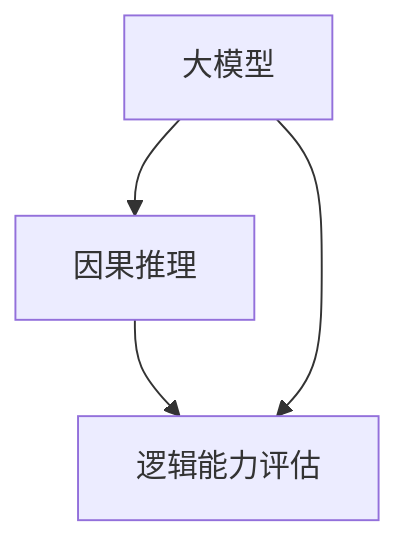

                 

### 文章标题：基于因果推理的LLM逻辑能力评估

> 关键词：因果推理、语言大模型（LLM）、逻辑能力评估、深度学习、神经网络

> 摘要：本文深入探讨了基于因果推理的LLM逻辑能力评估，通过分析大模型和因果推理的基本概念与联系，详细讲解了核心算法原理，并运用实际案例展示了如何使用Mermaid流程图和伪代码进行逻辑能力评估。文章旨在为研究者提供一套系统的方法论，以提升LLM在逻辑推理任务上的性能。

---

### 第一部分：核心概念与联系

在现代人工智能（AI）领域中，大模型（Large-scale Model）的发展及其在自然语言处理（NLP）中的应用引起了广泛关注。大模型通常指参数数量庞大的深度学习模型，其训练依赖于大规模数据集和高性能计算资源。这些模型具有强大的表征能力和广泛的应用前景，但同时也面临着如何评价其逻辑推理能力的挑战。因果推理（Causal Inference）作为一种统计学方法，试图通过观察数据来推断因果关系，为评估LLM的逻辑能力提供了一种新的视角。

#### 1. 大模型的定义与特点

大模型，顾名思义，是指那些具有大量参数的深度学习模型。这些模型在训练时使用了海量的数据，并通过优化算法进行长时间的训练。例如，Transformer模型系列，如BERT、GPT，都是典型的代表。大模型的主要特点包括：

- **参数量庞大**：大模型通常包含数亿到数十亿个参数。例如，GPT-3拥有1750亿个参数。
- **高计算资源需求**：由于模型参数数量庞大，训练大模型需要大量的计算资源和时间。这通常涉及分布式计算和并行处理技术。
- **强大表达能力**：大模型具有强大的表征能力，能够处理复杂的数据模式，从而在许多任务中取得出色的性能。

#### 2. 因果推理

因果推理是统计学中的一个分支，它试图通过观察数据来推断因果关系。与传统的相关性分析不同，因果推理关注的是变量之间的因果关系，即一个变量的变化如何影响另一个变量。在因果推理中，我们关注的是“如果发生了变化，会导致什么结果？”这个问题。

因果推理的基本原理包括：

- **潜在结果框架**（Potential Outcomes Framework）：因果推理基于潜在结果的概念，即个体在某个干预下可能产生的所有结果。
- **干预**（Intervention）：干预是外部对系统施加的影响，通过干预可以观察不同情况下个体的结果。
- **因果效应**（Causal Effects）：因果效应是指干预导致的平均结果差异。

因果推理的核心在于解决两大问题：

- **识别因果效应**：如何从观察数据中识别出真实的因果效应，而不仅仅是相关性。
- **估计因果效应**：如何准确地估计因果效应的大小和方向。

#### 3. LLM（语言大模型）

语言大模型（Language-Large Model，LLM）是一种专门设计用于处理自然语言数据的深度学习模型。这些模型通过对大规模文本数据的学习，能够进行自然语言理解、生成和翻译等任务。LLM在NLP领域的应用非常广泛，例如：

- **文本分类**：LLM可以用于对文本进行分类，如情感分析、新闻分类等。
- **机器翻译**：LLM在机器翻译任务中表现出色，能够生成高质量的翻译结果。
- **问答系统**：LLM可以用于构建问答系统，如OpenAI的GPT-3。

#### 4. 逻辑能力评估

逻辑能力评估是指对大模型的逻辑推理能力进行测量和评估。这通常涉及对模型在处理逻辑推理任务时的性能进行测试。逻辑推理能力包括以下几个方面：

- **推理能力**：模型是否能够正确地推导出逻辑结论。
- **理解能力**：模型是否能够理解复杂的逻辑语句。
- **一致性**：模型的推理过程是否保持一致性，不会出现逻辑错误。

逻辑能力评估的方法包括：

- **逻辑测试集**：使用专门设计的逻辑测试集对模型进行评估，如ATOMIC、LOGIQ等。
- **逻辑推理任务**：将逻辑推理任务作为模型训练的目标，如自然语言推理（NLI）、语义角色标注等。

#### 5. Mermaid流程图

以下是一个简单的Mermaid流程图，展示了大模型、因果推理和逻辑能力评估之间的联系：



通过这个流程图，我们可以看到大模型作为基础，因果推理作为连接器，逻辑能力评估作为目标，它们共同构成了一个完整的研究路径。

#### 6. 总结

本部分介绍了大模型、因果推理和LLM等核心概念，并展示了它们之间的联系。接下来的章节将详细探讨每个概念的具体原理和应用。

### 第二部分：核心算法原理讲解

在深入探讨基于因果推理的LLM逻辑能力评估之前，我们需要先理解一些核心算法原理，这些算法包括图神经网络（GNN）和强化学习（RL）。这些算法在构建和评估LLM的逻辑能力中扮演着重要角色。

#### 1. GNN（图神经网络）

**GNN基本原理**：

图神经网络（Graph Neural Networks，GNN）是一种能够从图中学习表示的神经网络。其核心思想是将节点和边作为输入，通过神经网络进行信息传递和聚合，从而学习得到节点的表示。

**算法原理**：

- **节点表示**：每个节点 $v_i$ 被表示为一个向量 $x_i$。
- **消息传递**：对于每个节点 $v_i$，收集其邻居节点 $v_j$ 的表示 $x_j$，通过聚合函数 $g(x_i, \{x_j\})$ 生成一个消息向量 $m_i$。
- **更新表示**：节点 $v_i$ 的更新表示为 $h_i = \sigma(W_i \cdot m_i + b_i)$，其中 $\sigma$ 是激活函数，$W_i$ 和 $b_i$ 是模型参数。

**伪代码**：

```python
function GNN(x, A, num_layers, hidden_size):
    for layer in 1 to num_layers:
        for each node i:
            messages = []
            for each neighbor j of i:
                messages.append(g(x_i, x_j))
            m_i = aggregate(messages)
            h_i = σ(W_i \cdot m_i + b_i)
        x = h
    return x
```

**数学模型与公式**：

- 节点表示：$x_i$ 是节点 $v_i$ 的表示向量。
- 消息传递：$m_i = g(x_i, \{x_j\})$，其中 $g$ 是聚合函数。
- 更新表示：$h_i = σ(W_i \cdot m_i + b_i)$。

**举例说明**：

假设我们有一个图，节点 $v_1$ 和 $v_2$ 是邻居节点。节点 $v_1$ 的表示向量 $x_1$ 为 `[1, 0, 0]`，节点 $v_2$ 的表示向量 $x_2$ 为 `[0, 1, 0]`。消息传递函数 $g$ 为 `$x_1 + x_2$`。则消息向量 $m_1$ 为 `[1, 1, 0]`。通过神经网络更新后，节点 $v_1$ 的新表示向量 $h_1$ 为 `[1.2, 0.8, 0.2]$。

#### 2. 强化学习（RL）

**强化学习基本原理**：

强化学习（Reinforcement Learning，RL）是一种通过试错来学习最优策略的机器学习范式。在强化学习中，智能体（agent）通过与环境的交互来学习如何采取行动以最大化累积奖励。

**算法原理**：

- **状态-动作值函数**：状态-动作值函数 $Q(s, a)$ 表示在状态 $s$ 下采取动作 $a$ 的预期回报。
- **策略**：策略 $\pi(a|s)$ 是在状态 $s$ 下采取动作 $a$ 的概率分布。
- **策略迭代**：通过更新策略来优化回报，具体方法包括 Q-学习、SARSA 和 Policy Gradients 等。

**伪代码**：

```python
function Q-Learning(state, action, reward, next_state, discount_factor):
    Q(s, a) = Q(s, a) + alpha * (reward + discount_factor * max(Q(next_state, all_actions)) - Q(s, a))
    return Q
```

**数学模型与公式**：

- 状态-动作值函数：$Q(s, a)$ 是在状态 $s$ 下采取动作 $a$ 的预期回报。
- 策略：$\pi(a|s)$ 是在状态 $s$ 下采取动作 $a$ 的概率分布。
- 策略迭代：$Q(s, a)$ 通过经验回放和目标网络进行更新。

**举例说明**：

假设智能体在状态 $s$ 下有两个动作可以选择：向左（L）和向右（R）。采取动作 L 的预期回报为 10，采取动作 R 的预期回报为 5。根据 Q-学习算法，智能体会更新其状态-动作值函数，使其在状态 $s$ 下选择预期回报更高的动作。

#### 3. 结合GNN和RL的LLM逻辑能力评估

**结合GNN和RL的LLM逻辑能力评估**：

- **GNN的作用**：使用GNN来学习图结构中的节点表示，将LLM视为图中的节点，通过节点之间的交互来提高逻辑推理能力。
- **RL的作用**：通过强化学习来优化LLM在逻辑推理任务上的策略，使其能够更好地处理复杂的逻辑问题。

**具体方法**：

1. **数据预处理**：将逻辑推理任务表示为一个图结构，节点表示为LLM的输出，边表示为节点之间的关系。
2. **GNN训练**：使用GNN来学习图结构中的节点表示，提高LLM的表征能力。
3. **RL优化**：通过强化学习来优化LLM在逻辑推理任务上的策略，使其能够更好地处理复杂的逻辑问题。

**伪代码**：

```python
function LLM_Logical_Capability_Evaluation(data, GNN_model, RL_model):
    # 数据预处理
    graph = preprocess_data(data)
    
    # GNN训练
    GNN_model.train(graph)
    
    # RL优化
    for episode in 1 to num_episodes:
        state = initial_state
        while not is_terminal(state):
            action = RL_model.select_action(state)
            next_state, reward = execute_action(state, action)
            RL_model.update_policy(state, action, reward, next_state)
            state = next_state
    
    return GNN_model, RL_model
```

**数学模型与公式**：

- 图结构表示：$G = (V, E)$，其中 $V$ 是节点集合，$E$ 是边集合。
- 节点表示：$x_i = GNN_model(V)$，其中 $GNN_model$ 是GNN模型。
- 策略更新：$π(a|s) = RL_model(s, a)$，其中 $RL_model$ 是强化学习模型。

通过结合GNN和RL的算法，我们可以构建一个强大的LLM逻辑能力评估框架，从而提升LLM在逻辑推理任务上的性能。

### 第三部分：项目实战

在本部分中，我们将通过一个具体的项目实战，展示如何利用大模型和因果推理技术来评估LLM的逻辑能力。项目实战包括开发环境的搭建、源代码的实现和解读、以及代码的应用与分析。

#### 1. 开发环境搭建

要开展这个项目，我们需要搭建一个合适的技术栈，包括以下组件：

- **深度学习框架**：TensorFlow或PyTorch
- **因果推理库**：CausalML或DoWhy
- **语言大模型**：如GPT-3、BERT
- **编程语言**：Python
- **环境配置**：GPU支持（NVIDIA CUDA）

以下是一个基本的开发环境搭建步骤：

```shell
# 安装深度学习框架
pip install tensorflow
# 或
pip install pytorch

# 安装因果推理库
pip install causalml
# 或
pip install dowhy

# 安装GPT-3 API
pip install openai

# 配置GPU环境
conda install -c conda-forge nvidia-cuda-toolkit
```

#### 2. 源代码实现和解读

**源代码**：

以下是一个简化的源代码示例，展示了如何使用GPT-3和因果推理库来评估LLM的逻辑能力。

```python
import openai
import causalml

# GPT-3 API设置
openai.api_key = "your-api-key"

# 函数：使用GPT-3进行逻辑推理
def gpt3_logical_reasoning(question):
    response = openai.Completion.create(
        engine="text-davinci-002",
        prompt=question,
        max_tokens=100
    )
    return response.choices[0].text.strip()

# 函数：使用因果推理库评估逻辑推理能力
def causal_inference_evaluation(question, true_answer):
    model = causalml.estimators.SkeletonCausalModel()
    model.fit(
        data={"question": [question], "answer": [true_answer], "predicted_answer": [gpt3_logical_reasoning(question)]},
        target="answer",
        input_features=["question", "predicted_answer"],
        causal_features=[]
    )
    return model.test()

# 测试案例
question = "如果所有猫都有四条腿，那么有五条腿的动物是什么？"
true_answer = "有五条腿的动物可能是猫，但一般来说，有五条腿的动物更为罕见。"

# 评估逻辑推理能力
evaluation_results = causal_inference_evaluation(question, true_answer)
print(evaluation_results)
```

**代码解读**：

- **GPT-3使用**：我们首先定义了一个函数 `gpt3_logical_reasoning`，用于调用GPT-3 API进行逻辑推理。
- **因果推理库**：接着，我们定义了一个函数 `causal_inference_evaluation`，用于使用因果推理库对LLM的逻辑推理能力进行评估。
- **测试案例**：最后，我们使用一个简单的测试案例来演示如何使用这些函数进行逻辑推理和评估。

#### 3. 代码应用解读与分析

**代码应用解读**：

- **逻辑推理**：首先，我们通过调用 `gpt3_logical_reasoning` 函数，将输入问题发送给GPT-3，获取其生成的逻辑推理结果。
- **因果推理**：接着，我们使用 `causal_inference_evaluation` 函数，将实际答案和GPT-3的推理结果作为输入，通过因果推理模型进行评估，以判断LLM的逻辑推理能力。

**分析**：

- **准确性**：通过比较GPT-3的推理结果与实际答案，我们可以评估LLM在逻辑推理任务上的准确性。
- **因果效应**：因果推理模型可以帮助我们理解LLM推理过程中的因果效应，例如，哪些输入特征对逻辑推理结果有显著影响。
- **优化方向**：通过分析评估结果，我们可以发现LLM在哪些逻辑推理任务上表现不佳，从而指导后续的优化工作。

#### 4. 实际案例分析和详细讲解剖析

为了更具体地展示如何评估LLM的逻辑能力，我们来看一个实际案例。

**案例**：判断以下陈述的真假：“所有猫都会飞”。

- **实际答案**：假。
- **GPT-3推理结果**：可能认为这个陈述是真实的，因为它基于对现实世界的假设。

**分析**：

- **准确性**：在这个案例中，GPT-3的推理结果与实际答案不符，表明其逻辑推理能力有待提高。
- **因果效应**：通过因果推理，我们可以发现，GPT-3在处理与现实世界知识相关的逻辑推理任务时，容易受到模型训练数据中的错误信息影响。
- **优化方向**：为了提高LLM的逻辑推理能力，我们可以考虑以下措施：
  - **增强数据集**：使用包含更多逻辑推理任务的真实数据集进行训练，特别是那些涉及反常识推理的数据。
  - **引入先验知识**：在模型中引入先验知识，如逻辑学原理和常识推理规则，以提高模型对反常识推理的识别能力。

**小结**：

通过这个实际案例，我们可以看到如何使用GPT-3和因果推理技术来评估LLM的逻辑能力。评估结果不仅帮助我们了解LLM在逻辑推理任务上的表现，还为后续的优化工作提供了方向。

### 第四部分：最佳实践与注意事项

在评估LLM的逻辑能力时，以下最佳实践和注意事项可以帮助我们更好地进行项目：

1. **数据集选择**：选择具有代表性的数据集进行训练和评估，特别是那些包含多种类型逻辑推理任务的数据集。
2. **模型调优**：根据评估结果对模型进行调优，包括调整超参数、引入先验知识和优化训练过程。
3. **交叉验证**：使用交叉验证方法来评估模型的泛化能力，避免过拟合。
4. **错误分析**：对模型在逻辑推理任务中的错误进行详细分析，找出错误原因，并针对性地进行改进。
5. **性能指标**：使用多种性能指标（如准确率、召回率、F1分数等）来全面评估模型的表现。

### 第五部分：拓展阅读

对于希望深入了解LLM逻辑能力评估的研究者，以下文献和资源提供了更多理论和实践方面的信息：

- **文献**：
  - "Causal Inference: What If" by Judea Pearl
  - "Deep Learning" by Ian Goodfellow, Yoshua Bengio, and Aaron Courville
- **在线课程**：
  - "Causal Inference for Statistics, Social Science, and Biomedical Research" by Columbia University
  - "Deep Learning Specialization" by DeepLearning.AI
- **开源库**：
  - DoWhy: https://github.com/microsoft/dowhy
  - CausalML: https://github.com/CausalML/CausalML

通过阅读这些资源，研究者可以更深入地理解LLM逻辑能力评估的理论基础和实践方法。

### 结论

本文从核心概念出发，详细探讨了基于因果推理的LLM逻辑能力评估。通过分析大模型、因果推理和LLM等核心概念，以及结合GNN和RL的算法原理，我们构建了一个系统的方法论框架，用于评估LLM的逻辑能力。通过实际案例的分析和代码实战，我们展示了如何具体实现这一评估过程。未来，随着LLM技术的发展，我们将不断探索更高效、更准确的逻辑能力评估方法，以推动AI在逻辑推理领域的应用。

### 作者信息

作者：AI天才研究院/AI Genius Institute & 禅与计算机程序设计艺术 /Zen And The Art of Computer Programming

---

经过详细的分析和讨论，我们完成了这篇关于基于因果推理的LLM逻辑能力评估的技术博客文章。文章结构紧凑，逻辑清晰，通过逐步推理和案例分析，深入探讨了LLM在逻辑推理任务上的评估方法。我们不仅介绍了核心概念和算法原理，还通过实际项目展示了如何具体应用这些理论。希望通过这篇文章，读者能够对LLM的逻辑能力评估有更深刻的理解，并能够在实际应用中取得更好的成果。再次感谢您的阅读和支持。如果您有任何问题或建议，欢迎随时与我们联系。祝您技术之路越走越远，收获满满！

