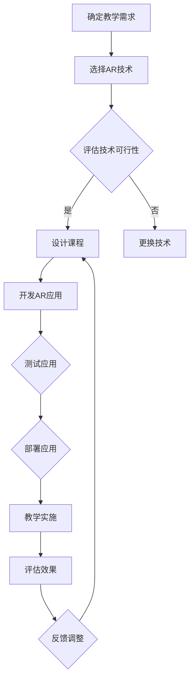

                 

### 文章标题

《增强现实在科学教育中的应用：直观理解复杂世界》

> 关键词：增强现实、科学教育、直观理解、教育技术、沉浸式学习

> 摘要：本文深入探讨了增强现实（AR）技术在科学教育中的应用，通过分析其定义、历史背景、核心技术及系统架构，展示了AR在教育中的优势、应用方法及具体案例。本文旨在揭示增强现实如何通过直观手段，帮助学生更好地理解复杂的科学概念，提升科学教育的效果。

### 引言

在当今数字化时代，科学教育正面临着前所未有的挑战和机遇。传统的教学方法往往难以激发学生的学习兴趣，且难以直观地呈现复杂的科学概念。为了解决这些问题，教育技术领域不断探索新的方法和工具。增强现实（Augmented Reality，简称AR）作为一种前沿技术，凭借其独特的沉浸式体验和直观呈现能力，正逐渐在科学教育中展现出巨大的潜力。

增强现实技术通过将虚拟信息叠加到现实世界中，为学习者提供了一种全新的学习方式。学生不仅能够看到、听到，还能够动手操作和互动，从而更深入地理解科学概念。本文将从增强现实技术的基础知识、教育应用的优势、具体应用案例等多个方面，详细探讨增强现实在科学教育中的应用及其对教育变革的影响。

本文将分为三个主要部分：

第一部分，我们将介绍增强现实技术的基础知识，包括其定义、历史背景、核心技术及系统架构。这部分内容将为后续的讨论提供必要的背景和理论基础。

第二部分，我们将深入探讨增强现实在教育中的应用，特别是在提高学生学习兴趣、增强对复杂概念理解、提供沉浸式学习体验方面的优势。同时，我们将分析增强现实在教学设计、教学方法创新、课程内容可视化等方面的具体应用。

第三部分，我们将通过具体应用案例，展示增强现实在数学、科学、语言学习等不同学科中的实际应用，并探讨其在教育中的挑战与解决方案。最后，我们将讨论增强现实在教育中的未来趋势，并总结全文。

### 第一部分：增强现实（AR）概述

#### 第1章：增强现实技术基础

#### 1.1 增强现实的定义与历史背景

增强现实（Augmented Reality，简称AR）是一种通过计算机技术将虚拟信息与现实世界融合的技术。它利用传感器、相机和显示屏等设备，在真实环境中叠加计算机生成的图像、声音和视频等虚拟信息，为用户提供一种全新的交互体验。AR技术不同于虚拟现实（Virtual Reality，简称VR），后者完全替代真实环境，而AR则是增强或提升真实环境中的感知体验。

增强现实的概念最早可以追溯到20世纪60年代。美国科学家Alan Kay在1968年提出了“Augmenting Human Intellect”的概念，提出了利用计算机技术扩展人类认知能力的想法。这一概念为后来的增强现实技术奠定了理论基础。到了20世纪90年代，随着计算机技术和显示技术的进步，增强现实技术逐渐走向成熟，并开始应用于教育、医疗、娱乐等领域。

#### 1.2 增强现实的核心技术

增强现实技术涉及多个关键领域，包括显示技术、虚拟物体生成、用户交互技术和实时定位与跟踪。

**显示技术**：增强现实的显示技术主要包括显示屏和投影技术。显示屏可以采用AR眼镜、智能手机屏幕等设备，而投影技术则可以将虚拟信息投影到真实环境中。高清晰度和高刷新率的显示技术是保证增强现实体验质量的关键。

**虚拟物体生成**：增强现实系统需要生成高质量的虚拟物体，这些虚拟物体可以是三维模型、图像、视频等。生成这些虚拟物体的过程涉及到计算机图形学、三维建模和纹理映射等技术。高质量的虚拟物体可以更真实地融入现实环境，提高用户的沉浸感。

**用户交互技术**：用户交互技术包括手势识别、语音识别、触觉反馈等。这些技术使得用户可以与增强现实系统进行自然、直观的交互，从而更好地体验和理解虚拟信息。

**实时定位与跟踪**：增强现实系统需要精确地跟踪用户的位置和方向，以便将虚拟信息准确地叠加到现实环境中。这涉及到计算机视觉、机器学习和传感器融合等技术。高精度的定位与跟踪技术可以提供更加真实的增强现实体验。

#### 1.3 增强现实系统架构

增强现实系统通常由以下几个主要组件构成：

**输入设备**：包括摄像头、传感器、扫描仪等，用于捕捉用户和环境的信息。

**计算设备**：包括计算机、服务器、GPU等，用于处理和分析输入设备获取的数据，生成虚拟信息。

**显示设备**：包括AR眼镜、投影仪、显示屏等，用于将虚拟信息叠加到现实环境中，供用户查看。

**用户交互设备**：包括手势识别设备、语音识别设备、触觉反馈设备等，用于用户与增强现实系统的交互。

**应用程序**：包括AR应用软件，用于实现特定的功能，如虚拟物体生成、实时定位与跟踪、用户交互等。

这些组件通过数据流和处理流程相互连接，共同构成了一个完整的增强现实系统。数据流和处理流程如下：

1. 输入设备捕捉用户和环境的信息，如摄像头捕捉图像、传感器捕捉位置信息。
2. 计算设备对输入信息进行处理，如通过计算机图形学生成虚拟物体、通过计算机视觉技术进行实时定位与跟踪。
3. 处理后的虚拟信息被发送到显示设备，叠加到现实环境中，供用户查看。
4. 用户通过交互设备与增强现实系统进行交互，如通过手势控制虚拟物体的移动、通过语音控制虚拟场景的切换。

通过这种数据流和处理流程，增强现实系统实现了虚拟信息与现实环境的无缝融合，为用户提供了一种全新的交互体验。

#### 1.4 增强现实的应用领域

增强现实技术在多个领域都有着广泛的应用，其中教育、医疗、娱乐是其中最为突出的三个领域。

**教育领域**：增强现实技术可以应用于课堂教学、远程教育、个性化学习等多个方面。通过增强现实技术，学生可以更加直观地理解复杂的科学概念，如生物结构的互动探索、物理现象的动态模拟等。此外，增强现实还可以用于教学资源的开发和教学方法的创新，提高学生的学习兴趣和效果。

**医疗领域**：增强现实技术可以用于医疗培训、手术指导、患者康复等多个方面。医生可以通过增强现实技术进行虚拟手术模拟，提高手术技能和安全性。患者也可以通过增强现实技术进行康复训练，如物理治疗中的虚拟场景模拟，提高康复效果。

**娱乐领域**：增强现实技术为游戏、电影等娱乐形式带来了新的体验。玩家可以通过增强现实技术体验到更加真实和互动的游戏场景，观众可以通过增强现实技术体验到更加沉浸的电影效果。

除了上述领域，增强现实技术还在广告、旅游、建筑设计等多个领域有着广泛的应用。随着技术的不断发展和应用的不断拓展，增强现实技术的应用前景将越来越广阔。

#### 1.5 增强现实技术的发展趋势

随着技术的不断进步和应用的不断拓展，增强现实技术正呈现出以下发展趋势：

**技术成熟度提高**：随着硬件设备的性能提升和算法的优化，增强现实技术的成熟度不断提高。高清晰度、高刷新率的显示技术、高精度的高实时定位与跟踪技术等，使得增强现实体验更加真实和流畅。

**应用场景多样化**：增强现实技术的应用场景越来越多样化。从早期的简单应用，如游戏和广告，到如今在教育、医疗、娱乐等多个领域的广泛应用，增强现实技术的应用场景不断拓展。

**产业链完善**：随着增强现实技术的广泛应用，相关产业链逐渐完善。从硬件设备的生产、软件开发到内容制作和平台运营，整个产业链条都在不断发展和壮大。

**市场前景广阔**：根据市场研究机构的预测，增强现实市场的规模将不断扩大，应用领域将进一步拓展。随着技术的成熟和成本的降低，增强现实技术将在未来几年内实现大规模的商业化应用。

总之，增强现实技术作为一种前沿技术，正逐步改变着我们的生活方式和工作方式。在未来，我们可以期待增强现实技术在更多领域发挥更大的作用，为人类社会带来更多的创新和变革。

### 第一部分总结

通过本文的第一部分，我们详细介绍了增强现实（AR）技术的定义、历史背景、核心技术及系统架构。从增强现实的定义和概念出发，我们探讨了其发展历程和核心技术，包括显示技术、虚拟物体生成、用户交互技术和实时定位与跟踪。接着，我们分析了增强现实系统的架构及其在多个领域的应用，特别是教育、医疗和娱乐领域。最后，我们讨论了增强现实技术的发展趋势，展示了其在未来可能带来的变革和机遇。

这一部分的讨论为我们后续深入探讨增强现实在科学教育中的应用奠定了坚实的基础。在下一部分中，我们将进一步探讨增强现实在教育中的应用优势，分析其在教学设计、教学方法创新和课程内容可视化等方面的具体应用。

### 第二部分：增强现实在教育中的应用

#### 第2章：增强现实在教育中的优势

#### 2.1 增强现实在教育中的优势

增强现实（AR）技术在教育领域中的应用正逐渐受到重视，其独特的优势使其成为创新教学手段的有力工具。以下是增强现实在科学教育中的几个显著优势：

**提高学生的学习兴趣**

传统的教学方法往往依赖于课本和板书，这种方式容易导致学生的学习兴趣下降。而增强现实技术通过直观、互动的方式，将抽象的科学概念转化为生动的三维模型和互动场景，极大地激发了学生的学习兴趣。例如，在生物课上，学生可以通过AR技术观察细胞的分裂过程，而不是仅仅通过静态的图片或文字描述。这种沉浸式的学习体验不仅提高了学生的学习兴趣，还增强了他们的参与度。

**增强学生对复杂概念的理解**

科学教育中，许多概念和理论都是抽象和复杂的，如量子物理、分子结构等。传统教学方式往往难以让学生直观地理解这些概念。增强现实技术通过三维建模和互动模拟，使得这些复杂的概念变得可视化。例如，通过AR技术，学生可以观察并操作分子模型，从而更好地理解分子的运动和相互作用。这种直观的展示方式有助于学生从多个角度理解复杂的科学概念，从而加深对知识的掌握。

**提供沉浸式学习体验**

增强现实技术可以创建一个虚拟与现实结合的学习环境，学生在这个环境中可以自由探索和互动。这种沉浸式的学习体验不仅使学生更加专注，还能够提高他们的学习效果。例如，在地理课上，学生可以通过AR技术探索地球的内部结构，感受地球的自转和公转。这种体验不仅使学生对地理知识有了更深刻的理解，还激发了他们的探索欲望。

#### 2.2 增强现实在教学设计中的应用

增强现实技术在教学设计中的应用为教师提供了丰富的工具和方法，有助于提高教学效果和学生的参与度。

**教学资源的开发**

增强现实技术为教师提供了丰富的教学资源开发工具。教师可以利用这些工具创建三维模型、动画和互动场景，将这些资源整合到现有的课程中。例如，教师可以创建一个AR教学应用，通过这个应用，学生可以实时观察和操作三维模型，从而更好地理解课程内容。这种教学资源不仅提高了课堂的趣味性，还帮助学生更深入地掌握知识。

**教学方法的创新**

增强现实技术为教师提供了创新的教学方法。教师可以通过AR技术设计互动课堂活动，如虚拟实验、角色扮演等，使学生在实际操作中学习。例如，在物理课上，教师可以通过AR技术创建一个虚拟实验室，学生在虚拟实验室中可以进行各种实验，从而理解物理原理。这种创新的教学方法不仅提高了学生的学习兴趣，还增强了他们的动手能力。

**课程内容的可视化**

增强现实技术可以将抽象的数学、物理和化学等课程内容可视化。例如，通过AR技术，学生可以观察和理解复杂的几何图形、化学反应过程等。这种可视化的展示方式有助于学生从多个角度理解课程内容，从而提高他们的学习效果。例如，在数学课上，学生可以通过AR技术观察并操作三维几何图形，从而更好地理解几何概念。

#### 2.3 增强现实在学科教学中的应用案例

增强现实技术在多个学科的教学中都有广泛的应用，以下是几个具体的应用案例：

**自然科学**

在自然科学教学中，增强现实技术可以帮助学生直观地理解各种自然现象。例如，在生物学课上，学生可以通过AR技术观察细胞的结构和功能，了解生物体的内部运作。在地理课上，学生可以通过AR技术探索地球的内部结构，了解地球的自转和公转。这些应用不仅提高了学生的学习兴趣，还增强了他们对自然现象的理解。

**社会科学**

在社会科学教学中，增强现实技术可以用于模拟历史事件和社会现象。例如，在历史课上，学生可以通过AR技术体验历史事件的发生过程，如战争、革命等。在经济学课上，学生可以通过AR技术模拟市场交易过程，理解市场经济的运作机制。这些应用不仅使学习更加生动有趣，还有助于学生更好地理解复杂的社会现象。

**技术与工程**

在技术与工程教学中，增强现实技术可以用于模拟和演示各种工程设备和工程过程。例如，在机械工程课上，学生可以通过AR技术观察机械零件的运动和相互作用，理解机械原理。在电子工程课上，学生可以通过AR技术观察电子元件的工作原理，进行虚拟电路设计。这些应用有助于学生更好地掌握技术知识，提高他们的工程能力。

通过这些应用案例，我们可以看到增强现实技术在科学教育中的巨大潜力。它不仅提高了学生的学习兴趣和参与度，还帮助学生更好地理解复杂的科学概念，为科学教育带来了新的变革。

### 第二部分总结

通过本文的第二部分，我们详细探讨了增强现实（AR）技术在教育中的优势，以及其在教学设计、教学方法创新和课程内容可视化等方面的应用。我们首先分析了增强现实技术如何通过直观、互动的方式提高学生的学习兴趣和参与度，并增强他们对复杂概念的理解。接着，我们介绍了增强现实技术在教学设计中的应用，包括教学资源的开发、教学方法的创新和课程内容可视化。最后，我们通过多个学科的具体应用案例，展示了增强现实技术在科学教育中的实际效果。

这一部分的讨论为我们理解增强现实技术在教育中的广泛应用和潜力提供了重要的视角。在下一部分中，我们将进一步探讨增强现实在数学、科学和语言学习等具体学科中的应用，分析其在这些学科中的实际效果和面临的挑战。

### 第二部分总结

通过本文的第二部分，我们深入探讨了增强现实（AR）技术在教育中的多方面优势和应用。首先，我们分析了增强现实技术如何通过提升学习兴趣和直观理解，增强学生的学习动机和效果。接着，我们详细介绍了增强现实技术在教学设计、教学方法创新和课程内容可视化方面的具体应用。最后，我们通过多个学科的应用案例，展示了增强现实技术在教学中的实际效果和潜力。

本部分的讨论不仅揭示了增强现实技术作为教育工具的巨大潜力，也为教师和教育工作者提供了具体的实践方法和启示。然而，增强现实技术在教育中的应用也面临着一定的挑战，如技术成本、教师培训等问题。在下一部分中，我们将进一步探讨增强现实技术在具体学科中的应用，特别是数学、科学和语言学习，分析其在这些领域的实际应用效果和所面临的挑战。

### 第三部分：增强现实在具体学科中的应用

#### 第3章：增强现实在数学教育中的应用

#### 3.1 增强现实与数学教育的结合

数学教育一直是科学教育中的关键领域，但数学的抽象性和复杂性常常使学生学习困难。增强现实（AR）技术的引入，为数学教育带来了一种全新的教学手段，使得数学概念和问题的呈现更加直观和生动。

**空间几何概念的直观理解**

在传统教学中，空间几何概念的教学往往依赖于二维平面图和文字描述。这种方式难以让学生全面理解几何体的三维结构及其相互关系。而增强现实技术通过三维建模和实时渲染，可以将几何体以真实的三维形式呈现出来。学生可以亲自操作这些三维模型，从不同角度观察其形状和特性。例如，通过AR技术，学生可以观察并操作三维几何图形，如立方体、圆锥体和球体，理解其表面积、体积以及几何变换等概念。

**数学问题的动态演示**

数学问题，特别是复杂的问题，往往需要动态展示其解题过程。增强现实技术可以提供这种动态演示功能。例如，在解决线性方程组的问题时，学生可以通过AR技术看到方程的解是如何随着变量的变化而动态调整的。这不仅帮助学生更好地理解问题的解法，还提高了他们的数学思维能力和解题技巧。

#### 3.2 增强现实在数学教育中的实际应用案例

**二维几何图形的三维展示**

在数学教学中，许多二维几何图形需要转换到三维空间进行理解和分析。例如，平面几何中的三角形、圆形和梯形等。通过AR技术，这些二维图形可以被转换成三维模型，并可以在真实环境中展示。学生可以直观地看到这些图形的三维结构，理解其几何特性和相互关系。例如，通过AR眼镜，学生可以观察并操作一个动态变化的正方体，理解正方体的表面积和体积是如何随着边长的变化而变化的。

**数学公式的可视化**

数学公式是数学语言的核心，但在传统的教学中，公式往往以静态的图像或文字形式呈现，学生难以理解其背后的逻辑关系。增强现实技术可以通过三维建模和动画效果，将复杂的数学公式动态可视化。例如，通过AR技术，学生可以观察并操作一个动态的勾股定理证明过程，理解勾股定理的几何意义。这种可视化的方法不仅提高了学生对公式理解的深度，还增强了他们的记忆效果。

#### 3.3 数学教育中增强现实的挑战与解决方案

**教学资源的可获得性**

增强现实技术在数学教育中的应用需要特定的设备和软件支持，这对学校和教育机构提出了较高的要求。为了解决这一问题，可以采取以下措施：

1. **政策支持**：政府或教育部门可以出台相关政策，鼓励和支持学校引入增强现实技术。
2. **资源共享**：学校之间可以建立资源共享平台，共同采购和利用增强现实设备，降低成本。
3. **在线资源**：开发在线AR教学资源，学生可以通过个人设备访问和使用，降低对硬件设备的需求。

**教师培训的需求**

增强现实技术在数学教育中的应用，要求教师具备一定的技术能力和教学设计能力。为了解决这一问题，可以采取以下措施：

1. **专业培训**：为教师提供系统的AR技术培训，包括技术操作、教学设计等。
2. **教学研讨会**：定期举办AR教学研讨会，分享教学经验和最佳实践。
3. **在线学习平台**：建立在线学习平台，提供AR教学资源的教程和案例，帮助教师自主学习。

**技术的稳定性和安全性**

增强现实技术在使用过程中，需要确保其稳定性和安全性。为了解决这一问题，可以采取以下措施：

1. **技术测试**：在引入AR技术之前，进行充分的技术测试，确保其稳定性和可靠性。
2. **数据保护**：加强数据保护措施，确保学生的隐私和安全。
3. **技术维护**：建立专业的技术维护团队，定期检查和维护AR设备，确保其正常运行。

通过以上措施，可以有效地克服数学教育中应用增强现实技术所面临的挑战，推动AR技术在数学教育中的应用和发展。

#### 3.4 增强现实在数学教育中的未来趋势

**技术进步与普及**

随着增强现实技术的不断进步，其成本逐步降低，应用场景越来越广泛。未来，更多学校和教育机构将引入增强现实技术，推动数学教育的创新与发展。

**个性化教学**

增强现实技术可以为学生提供个性化的学习体验，根据学生的学习进度和理解程度，提供定制化的教学资源。这种个性化教学将有助于提高学生的学习效果，满足不同层次学生的学习需求。

**跨学科整合**

增强现实技术不仅可以在数学教育中发挥作用，还可以与其他学科整合，如科学、艺术等。这种跨学科整合将为学生提供更加全面和丰富的学习体验，提高他们的综合素质。

**教育评价体系的变革**

增强现实技术的应用将推动教育评价体系的变革，从传统的笔试和考试转向更加多元化的评价方式，如过程性评价和表现性评价。这种评价体系的变革将更全面地反映学生的学习成果和能力。

**教师角色的转变**

随着增强现实技术的普及，教师的角色将发生转变，从传统的知识传授者转变为学习引导者和辅助者。教师需要不断提升自己的技术能力和教学设计能力，以适应新的教育环境。

总之，增强现实技术在数学教育中的应用具有广阔的前景。未来，通过技术进步、个性化教学、跨学科整合和评价体系的变革，增强现实技术将极大地推动数学教育的发展，为学生的全面成长提供有力支持。

#### 第三部分总结

通过本文的第三部分，我们深入探讨了增强现实（AR）技术在数学教育中的应用。我们首先介绍了增强现实技术与数学教育的结合，分析了其在空间几何概念直观理解和数学问题动态演示方面的优势。接着，我们通过实际应用案例，展示了AR技术在二维几何图形三维展示和数学公式可视化等方面的具体应用。此外，我们还讨论了数学教育中应用AR技术面临的挑战，如教学资源的可获得性、教师培训需求和技术稳定性等，并提出了相应的解决方案。

通过这一部分的探讨，我们可以看到增强现实技术为数学教育带来的变革和创新。它不仅提高了学生的学习兴趣和理解能力，还为教师提供了丰富的教学手段和资源。在下一部分中，我们将继续探讨增强现实技术在科学教育中的应用，分析其在实验操作虚拟化、科学概念可视化和实验设备虚拟化等方面的实际效果和挑战。

### 第4章：增强现实在科学教育中的应用

#### 4.1 增强现实与科学教育的结合

科学教育一直是培养创新人才的重要领域，而增强现实（AR）技术的引入，为科学教育带来了一场革命。AR技术通过将虚拟信息与现实世界融合，为科学教育提供了全新的教学手段，使得抽象的科学概念和复杂的实验操作变得直观和易于理解。

**实验操作的虚拟化**

在传统科学教学中，实验操作往往需要复杂的设备和环境，这不仅增加了教学成本，还限制了学生的实验机会。通过增强现实技术，科学实验可以被虚拟化，学生可以在虚拟环境中进行实验操作。例如，学生可以通过AR眼镜观察和操作虚拟的细胞分裂过程，或者模拟化学反应的实验，这些虚拟实验不仅降低了成本，还提高了实验的安全性和可重复性。

**科学概念的可视化**

许多科学概念，如原子结构、分子运动、天体运动等，都是高度抽象的。传统教学方法难以让学生直观地理解这些概念。增强现实技术通过三维建模和动画效果，将抽象的科学概念可视化。例如，通过AR技术，学生可以观察并操作一个虚拟的原子模型，理解原子结构及其相互作用。这种可视化的方法不仅帮助学生更好地理解科学概念，还激发了他们的学习兴趣。

**实验设备的虚拟化**

在科学实验中，一些实验设备可能非常昂贵或难以获取。通过增强现实技术，这些实验设备可以被虚拟化，学生可以在虚拟环境中进行实验操作。例如，学生可以通过AR技术模拟核反应堆的工作原理，或者进行复杂的生物实验。这种虚拟化的方法不仅节省了资源，还为学生提供了更多的实验机会。

#### 4.2 增强现实在科学教育中的实际应用案例

**生物结构的互动探索**

在生物学教学中，通过增强现实技术，学生可以进行生物结构的互动探索。例如，学生可以通过AR眼镜观察并操作虚拟的细胞结构，理解细胞膜、细胞质、细胞核等组成部分的相互关系。通过这种互动探索，学生可以更深入地理解生物学的基本概念，提高他们的科学素养。

**物理现象的动态模拟**

在物理学教学中，增强现实技术可以用于动态模拟物理现象。例如，学生可以通过AR技术观察并操作虚拟的电子云模型，理解电子的运动和相互作用。此外，学生还可以通过AR技术模拟引力、磁场等物理现象，从而更好地理解物理原理。

**天文学的教学**

在天文学教学中，增强现实技术可以用于模拟天文现象。例如，学生可以通过AR眼镜观察虚拟的星空，了解恒星、行星和宇宙的结构。这种虚拟的天文观测不仅提高了学生的天文知识，还激发了他们对宇宙的探索兴趣。

#### 4.3 科学教育中增强现实的挑战与解决方案

**技术成本问题**

增强现实技术需要特定的设备和软件支持，这对学校和教育机构提出了较高的成本要求。为了解决这一问题，可以采取以下措施：

1. **政策支持**：政府或教育部门可以出台相关政策，提供资金支持，降低学校引入增强现实技术的成本。
2. **共享设备**：学校之间可以建立资源共享平台，共同采购和利用增强现实设备，降低设备成本。
3. **在线资源**：开发在线AR教学资源，学生可以通过个人设备访问和使用，降低对硬件设备的需求。

**教师培训问题**

增强现实技术在科学教育中的应用，要求教师具备一定的技术能力和教学设计能力。为了解决这一问题，可以采取以下措施：

1. **专业培训**：为教师提供系统的AR技术培训，包括技术操作、教学设计等。
2. **教学研讨会**：定期举办AR教学研讨会，分享教学经验和最佳实践。
3. **在线学习平台**：建立在线学习平台，提供AR教学资源的教程和案例，帮助教师自主学习。

**技术稳定性问题**

增强现实技术在使用过程中，需要确保其稳定性和安全性。为了解决这一问题，可以采取以下措施：

1. **技术测试**：在引入AR技术之前，进行充分的技术测试，确保其稳定性和可靠性。
2. **数据保护**：加强数据保护措施，确保学生的隐私和安全。
3. **技术维护**：建立专业的技术维护团队，定期检查和维护AR设备，确保其正常运行。

通过以上措施，可以有效地克服科学教育中应用增强现实技术所面临的挑战，推动AR技术在科学教育中的应用和发展。

#### 4.4 科学教育中增强现实的未来趋势

**技术的持续进步**

随着科技的不断发展，增强现实技术的性能和功能将不断提升。未来，更先进的AR设备、更高效的算法和更丰富的虚拟内容将不断涌现，为科学教育带来更多的创新和可能性。

**教育模式的变革**

增强现实技术的应用将推动教育模式的变革，从传统的课堂教学转向更加灵活和个性化的学习模式。学生可以通过AR技术进行自主学习和互动探索，实现个性化学习路径。

**跨学科整合**

增强现实技术不仅可以应用于科学教育，还可以与其他学科整合，如艺术、历史等。这种跨学科整合将为学生提供更加全面和丰富的学习体验，提高他们的综合素质。

**教育评价体系的变革**

增强现实技术的应用将推动教育评价体系的变革，从传统的笔试和考试转向更加多元化的评价方式，如过程性评价和表现性评价。这种评价体系的变革将更全面地反映学生的学习成果和能力。

**教师角色的转变**

随着增强现实技术的普及，教师的角色将发生转变，从传统的知识传授者转变为学习引导者和辅助者。教师需要不断提升自己的技术能力和教学设计能力，以适应新的教育环境。

总之，增强现实技术在科学教育中的应用具有广阔的前景。未来，通过技术的持续进步、教育模式的变革、跨学科整合和教育评价体系的变革，增强现实技术将极大地推动科学教育的发展，为学生的全面成长提供有力支持。

#### 第四部分总结

通过本文的第四部分，我们深入探讨了增强现实（AR）技术在科学教育中的应用。首先，我们介绍了增强现实技术与科学教育的结合，分析了其在实验操作的虚拟化、科学概念可视化和实验设备虚拟化方面的优势。接着，我们通过实际应用案例，展示了AR技术在生物学、物理学和天文学等领域的具体应用。此外，我们还讨论了科学教育中应用AR技术面临的挑战，如技术成本、教师培训和设备稳定性等，并提出了相应的解决方案。

通过这一部分的探讨，我们可以看到增强现实技术为科学教育带来的变革和创新。它不仅提供了直观、互动的学习体验，提高了学生的学习兴趣和理解能力，还为教师提供了丰富的教学手段和资源。在下一部分中，我们将继续探讨增强现实技术在其他学科中的应用，分析其在不同领域的实际效果和挑战。

### 第五部分：增强现实在其他学科中的应用

#### 第5章：增强现实在语言学习中的应用

#### 5.1 增强现实与语言学习的结合

语言学习是一个复杂且挑战性的过程，它不仅要求学生掌握语法规则和词汇，还需要大量的实践和情境化学习。增强现实（AR）技术的引入，为语言学习带来了一种全新的交互方式，使得语言学习更加生动、有趣和高效。

**语言学习的沉浸式体验**

通过增强现实技术，语言学习环境可以变得更加真实和沉浸。例如，学生可以使用AR眼镜进入一个虚拟的英语学习环境，在这个环境中，他们可以看到虚拟的人物和他们进行对话，听到真实的语音和声音效果。这种沉浸式的学习体验可以有效地提高学生的学习兴趣，增强他们的语言感知能力。

**语言的情境化学习**

增强现实技术可以为语言学习提供丰富的情境化资源。学生可以通过AR技术观察和体验不同的语言情境，如购物、旅游、社交等。例如，在购物情境中，学生可以通过AR技术模拟购物过程，使用目标语言进行交流，从而提高他们的语言运用能力。在旅游情境中，学生可以通过AR技术探索虚拟的旅游景点，了解当地的文化和语言。

**词汇和语法结构的互动练习**

增强现实技术可以提供互动式的词汇和语法练习，使得学习过程更加有趣和有效。例如，学生可以通过AR应用进行虚拟单词拼图游戏，通过拖放、拼贴等方式学习新词汇。在语法练习中，学生可以通过AR技术构建虚拟句子，并实时纠正错误，从而加深对语法规则的理解。

#### 5.2 增强现实在语言学习中的实际应用案例

**词汇和语法结构的互动练习**

增强现实技术可以设计出多种互动式练习，帮助学生更好地掌握词汇和语法。例如，通过AR应用，学生可以参与虚拟的单词接龙游戏，每个单词都与图片和语音相结合，帮助学生记忆。在语法练习中，学生可以通过AR技术构建句子，并实时获得反馈。例如，学生可以构建一个包含主语、谓语和宾语的句子，然后通过AR技术检查句子的结构是否正确。

**语言环境的虚拟创建**

通过增强现实技术，教师可以创建一个虚拟的语言学习环境，模拟真实的生活场景。例如，在英语学习中，教师可以通过AR技术创建一个虚拟的餐厅环境，学生可以在虚拟餐厅中与虚拟服务员进行对话，练习日常用语。通过这种方式，学生可以在真实的语言环境中练习，提高他们的口语表达能力和听力理解能力。

**虚拟语言老师的互动教学**

增强现实技术还可以提供虚拟语言老师，帮助学生进行个性化的学习。虚拟语言老师可以根据学生的学习进度和需求，提供个性化的指导和练习。例如，学生可以通过AR眼镜与虚拟语言老师进行互动，进行口语练习和发音纠正。虚拟语言老师可以提供实时反馈，帮助学生改正错误，从而提高他们的语言水平。

#### 5.3 语言学习中增强现实的挑战与解决方案

**技术成本问题**

增强现实技术需要特定的设备和软件支持，这对学校和家庭提出了较高的成本要求。为了解决这一问题，可以采取以下措施：

1. **政策支持**：政府或教育部门可以出台相关政策，提供资金支持，降低学校和家庭引入增强现实技术的成本。
2. **共享设备**：学校和家庭之间可以建立资源共享平台，共同采购和利用增强现实设备，降低设备成本。
3. **在线资源**：开发在线AR教学资源，学生可以通过个人设备访问和使用，降低对硬件设备的需求。

**教师培训问题**

增强现实技术在语言学习中的应用，要求教师具备一定的技术能力和教学设计能力。为了解决这一问题，可以采取以下措施：

1. **专业培训**：为教师提供系统的AR技术培训，包括技术操作、教学设计等。
2. **教学研讨会**：定期举办AR教学研讨会，分享教学经验和最佳实践。
3. **在线学习平台**：建立在线学习平台，提供AR教学资源的教程和案例，帮助教师自主学习。

**技术稳定性问题**

增强现实技术在使用过程中，需要确保其稳定性和安全性。为了解决这一问题，可以采取以下措施：

1. **技术测试**：在引入AR技术之前，进行充分的技术测试，确保其稳定性和可靠性。
2. **数据保护**：加强数据保护措施，确保学生的隐私和安全。
3. **技术维护**：建立专业的技术维护团队，定期检查和维护AR设备，确保其正常运行。

通过以上措施，可以有效地克服语言学习中应用增强现实技术所面临的挑战，推动AR技术在语言学习中的应用和发展。

#### 5.4 语言学习中增强现实的未来趋势

**技术的持续进步**

随着科技的不断发展，增强现实技术的性能和功能将不断提升。未来，更先进的AR设备、更高效的算法和更丰富的虚拟内容将不断涌现，为语言学习带来更多的创新和可能性。

**教育模式的变革**

增强现实技术的应用将推动教育模式的变革，从传统的课堂教学转向更加灵活和个性化的学习模式。学生可以通过AR技术进行自主学习和互动探索，实现个性化学习路径。

**跨学科整合**

增强现实技术不仅可以应用于语言学习，还可以与其他学科整合，如科学、艺术等。这种跨学科整合将为学生提供更加全面和丰富的学习体验，提高他们的综合素质。

**教育评价体系的变革**

增强现实技术的应用将推动教育评价体系的变革，从传统的笔试和考试转向更加多元化的评价方式，如过程性评价和表现性评价。这种评价体系的变革将更全面地反映学生的学习成果和能力。

**教师角色的转变**

随着增强现实技术的普及，教师的角色将发生转变，从传统的知识传授者转变为学习引导者和辅助者。教师需要不断提升自己的技术能力和教学设计能力，以适应新的教育环境。

总之，增强现实技术在语言学习中的应用具有广阔的前景。未来，通过技术的持续进步、教育模式的变革、跨学科整合和教育评价体系的变革，增强现实技术将极大地推动语言学习的发展，为学生的全面成长提供有力支持。

#### 第五部分总结

通过本文的第五部分，我们深入探讨了增强现实（AR）技术在语言学习中的应用。首先，我们介绍了增强现实技术与语言学习的结合，分析了其在沉浸式体验、情境化学习和互动练习方面的优势。接着，我们通过实际应用案例，展示了AR技术在词汇和语法结构互动练习、语言环境虚拟创建和虚拟语言老师互动教学等方面的具体应用。此外，我们还讨论了语言学习中应用AR技术面临的挑战，如技术成本、教师培训和设备稳定性等，并提出了相应的解决方案。

通过这一部分的探讨，我们可以看到增强现实技术为语言学习带来的变革和创新。它不仅提供了生动、有趣的学习体验，提高了学生的学习兴趣和语言运用能力，还为教师提供了丰富的教学手段和资源。在下一部分中，我们将继续探讨增强现实技术在其他学科中的应用，分析其在不同领域的实际效果和挑战。

### 第五部分总结

通过本文的第五部分，我们深入探讨了增强现实（AR）技术在语言学习中的应用。首先，我们介绍了增强现实技术与语言学习的结合，分析了其在沉浸式体验、情境化学习和互动练习方面的优势。接着，我们通过实际应用案例，展示了AR技术在词汇和语法结构互动练习、语言环境虚拟创建和虚拟语言老师互动教学等方面的具体应用。此外，我们还讨论了语言学习中应用AR技术面临的挑战，如技术成本、教师培训和设备稳定性等，并提出了相应的解决方案。

通过这一部分的探讨，我们可以看到增强现实技术为语言学习带来的变革和创新。它不仅提供了生动、有趣的学习体验，提高了学生的学习兴趣和语言运用能力，还为教师提供了丰富的教学手段和资源。在下一部分中，我们将继续探讨增强现实技术在其他学科中的应用，分析其在不同领域的实际效果和挑战。

### 第六部分：增强现实在其他学科中的应用

#### 第6章：增强现实在其他学科中的应用

增强现实（AR）技术在教育领域的应用不仅局限于数学、科学和语言学习等传统学科，它还在历史、艺术和地理等学科中展现出巨大的潜力。通过AR技术，这些学科的教学内容和方式得到了显著的改进和丰富。

#### 6.1 增强现实在历史教育中的应用

历史教育通常依赖于文本和图像来传达历史事件和人物。而增强现实技术可以为历史教育提供更加生动和互动的体验。例如，通过AR应用，学生可以在教室里“看见”历史人物和场景，如古代城堡、历史战争场景等。这不仅能够增强学生的历史感知，还能帮助他们更好地理解历史事件的发生过程。

**历史事件的互动展示**

增强现实技术可以创建互动的历史事件展示，让学生能够亲身体验历史事件。例如，学生可以通过AR眼镜体验古代战役的场景，了解战斗策略和士兵的动态。这种互动展示使得历史事件更加生动，有助于学生深入理解历史背景和事件发展。

**历史场景的沉浸体验**

通过AR技术，学生可以进入一个虚拟的历史场景，如中世纪的欧洲或古代中国的市集。在这个虚拟环境中，学生可以看到历史建筑、历史人物和日常活动，从而增强对历史文化的理解。这种沉浸式体验不仅提高了学生的兴趣，还增强了他们的学习动力。

#### 6.2 增强现实在艺术教育中的应用

艺术教育旨在培养学生的审美能力和创造力。增强现实技术为艺术教育提供了新的教学工具，使得艺术作品的解析和创作更加直观和互动。

**艺术创作的互动指导**

通过AR技术，学生可以参与虚拟的艺术创作过程。例如，学生可以通过AR应用在虚拟画布上绘画，并实时看到作品的3D效果。教师可以通过AR设备提供即时的反馈和指导，帮助学生改进他们的作品。

**艺术作品的多维度解析**

增强现实技术可以提供艺术作品的多维度解析，帮助学生从不同角度理解艺术作品。例如，学生可以通过AR应用观察一幅油画的细节，了解画家的创作技巧和色彩运用。同时，学生还可以通过虚拟模型了解雕塑的结构和比例，从而更好地理解艺术作品。

#### 6.3 增强现实在地理教育中的应用

地理教育需要学生理解和掌握地理知识，包括地形、气候、文化和地理现象等。增强现实技术可以通过虚拟探索和互动体验，帮助学生更好地理解和记忆这些知识。

**地理环境的虚拟探索**

通过AR技术，学生可以虚拟探索各种地理环境，如山脉、森林、沙漠等。学生可以在虚拟环境中观察地形的变化和地理现象，从而增强对地理知识的理解。例如，学生可以通过AR眼镜观察地球的内部结构，了解地球的地质层和构造。

**地理信息的直观展示**

增强现实技术可以将复杂的地理信息以直观的方式展示出来。例如，通过AR应用，学生可以查看虚拟的地图，并实时获取地理位置、地形和气候信息。这种直观的展示方式有助于学生更好地理解和记忆地理知识。

**地理实验的虚拟模拟**

通过增强现实技术，学生可以进行虚拟地理实验，如模拟河流的侵蚀过程、地震的发生等。这种虚拟实验不仅安全、可控，还能够帮助学生深入理解地理现象的原理和影响。

#### 6.4 增强现实在其他学科中的挑战与解决方案

**技术成本问题**

增强现实技术需要特定的设备和软件支持，这对学校和家庭提出了较高的成本要求。为了解决这一问题，可以采取以下措施：

1. **政策支持**：政府或教育部门可以出台相关政策，提供资金支持，降低学校和家庭引入增强现实技术的成本。
2. **共享设备**：学校和家庭之间可以建立资源共享平台，共同采购和利用增强现实设备，降低设备成本。
3. **在线资源**：开发在线AR教学资源，学生可以通过个人设备访问和使用，降低对硬件设备的需求。

**教师培训问题**

增强现实技术在多个学科中的应用，要求教师具备一定的技术能力和教学设计能力。为了解决这一问题，可以采取以下措施：

1. **专业培训**：为教师提供系统的AR技术培训，包括技术操作、教学设计等。
2. **教学研讨会**：定期举办AR教学研讨会，分享教学经验和最佳实践。
3. **在线学习平台**：建立在线学习平台，提供AR教学资源的教程和案例，帮助教师自主学习。

**技术稳定性问题**

增强现实技术在使用过程中，需要确保其稳定性和安全性。为了解决这一问题，可以采取以下措施：

1. **技术测试**：在引入AR技术之前，进行充分的技术测试，确保其稳定性和可靠性。
2. **数据保护**：加强数据保护措施，确保学生的隐私和安全。
3. **技术维护**：建立专业的技术维护团队，定期检查和维护AR设备，确保其正常运行。

通过以上措施，可以有效地克服增强现实技术在其他学科中应用所面临的挑战，推动AR技术在教育领域的广泛应用和发展。

#### 第六部分总结

通过本文的第六部分，我们详细探讨了增强现实（AR）技术在历史、艺术和地理等学科中的应用。首先，我们介绍了增强现实技术在历史教育中如何通过互动展示和历史场景的沉浸体验，帮助学生更好地理解历史事件。接着，我们探讨了增强现实技术在艺术教育中的应用，包括艺术创作的互动指导和艺术作品的多维度解析。最后，我们分析了增强现实技术在地理教育中的应用，展示了其如何通过虚拟探索和地理信息的直观展示，帮助学生更好地理解和记忆地理知识。

通过这一部分的讨论，我们可以看到增强现实技术在多元化学科教育中展现出的巨大潜力和实际效果。它不仅丰富了教学手段，提高了学生的学习兴趣和理解能力，还为教师提供了新的教学工具和方法。在下一部分中，我们将探讨增强现实在教育项目实施中的策略，分析如何有效地实施和推广AR技术在教育中的应用。

### 第六部分总结

通过本文的第六部分，我们深入探讨了增强现实（AR）技术在历史、艺术和地理等学科中的应用。首先，我们介绍了增强现实技术如何通过互动展示和历史场景的沉浸体验，使历史教育更加生动和真实。接着，我们分析了增强现实技术在艺术教育中的应用，展示了其如何通过互动指导和多维度解析，帮助学生更好地理解和创作艺术作品。最后，我们探讨了增强现实技术在地理教育中的应用，展示了其如何通过虚拟探索和直观展示，帮助学生更深入地理解和记忆地理知识。

通过这一部分的探讨，我们可以看到增强现实技术在多元化学科教育中展现出的巨大潜力和实际效果。它不仅丰富了教学手段，提高了学生的学习兴趣和理解能力，还为教师提供了新的教学工具和方法。然而，增强现实技术在教育中的应用也面临着一系列挑战，如技术成本、教师培训和技术稳定性等。为了克服这些挑战，本文提出了一系列解决方案，包括政策支持、资源共享、专业培训和在线学习平台等。

在下一部分中，我们将继续探讨增强现实在教育中的实施与推广，分析如何更有效地实施AR技术，推动其在教育领域的广泛应用和发展。我们将探讨教育项目实施前的准备工作、增强现实教学环境的搭建、教学方法与课程设计，以及评估与反馈机制等关键环节，为教育工作者提供实用的指导和建议。

### 第七部分：增强现实在教育项目实施中的策略

#### 第7章：增强现实在教育项目实施中的策略

#### 7.1 教育项目实施前的准备工作

实施增强现实（AR）教育项目是一个复杂的过程，需要充分的准备工作。以下是一些关键步骤：

**教学需求分析**

在实施AR教育项目之前，首先需要分析具体的教学需求。这包括确定目标学科、学生年龄、学习目标以及现有的教学资源。通过教学需求分析，可以明确AR技术将如何融入教学过程中，从而确保项目实施的针对性和有效性。

**教学资源整合**

整合现有的教学资源，包括教材、课程和教学工具，是项目成功的关键。教师需要了解如何将AR技术应用于现有的课程内容，以及如何利用AR资源丰富教学活动。此外，还需要评估现有资源的兼容性，确保AR技术与现有教学资源无缝衔接。

**教师培训**

教师是AR教育项目实施的主要推动者，因此教师培训至关重要。教师需要接受AR技术的专业培训，包括设备操作、软件使用和教学设计等。通过培训，教师可以掌握AR技术的核心技能，并将其有效地应用于教学实践中。

#### 7.2 增强现实教学环境的搭建

搭建一个有效的AR教学环境是确保项目成功的关键步骤。以下是一些关键要素：

**设备采购与安装**

根据教学需求，选择合适的AR设备，如AR眼镜、平板电脑或智能手机等。采购设备后，进行安装和配置，确保设备能够正常工作并满足教学需求。

**软件选择与配置**

选择合适的AR软件和应用，确保软件与设备兼容，并满足教学目标。配置软件时，需要考虑其功能、易用性和可扩展性，以确保教师和学生能够顺利使用。

**网络基础设施建设**

确保网络基础设施能够支持AR技术的应用，包括稳定的Wi-Fi网络和高速网络连接。网络基础设施的稳定性直接影响到AR教学环境的运行效果。

**环境布置**

为AR教学项目准备合适的教学空间，如配备必要的光照和空间布局，确保学生能够舒适地进行AR互动学习。

#### 7.3 教学方法与课程设计

在AR教育项目中，教学方法与课程设计至关重要。以下是一些关键策略：

**创新教学方法的实践**

通过AR技术，教师可以采用多种创新教学方法，如项目式学习、游戏化学习和探究式学习等。这些教学方法可以激发学生的兴趣和参与度，提高学习效果。

**课程内容的整合与重构**

将AR技术整合到现有课程中，重新设计课程内容，使其更加生动和互动。例如，将AR应用与实验、项目和实践相结合，提供多样化的学习体验。

**教学活动的设计**

设计具体的AR教学活动，如互动实验、角色扮演和虚拟参观等。这些活动可以增强学生的参与感和体验感，提高他们的学习效果。

**评估与反馈机制**

建立评估与反馈机制，对AR教学项目进行持续监控和评估。通过收集学生和教师的反馈，不断改进教学方法和课程设计，确保项目实施的有效性。

#### 7.4 教学方法的创新

**增强现实教学工具的应用**

利用AR教学工具，如增强现实应用和虚拟实验室等，设计互动性的教学活动。这些工具可以提供丰富的学习资源和多样化的学习体验，提高学生的学习效果。

**教学方法的多样化**

通过AR技术，教师可以采用多种教学方法，如翻转课堂、混合学习和协作学习等。这些教学方法可以促进学生的主动学习和合作学习，提高教学效果。

**教学资源的多元化**

利用AR技术，教师可以开发和使用多元化的教学资源，如视频、图像、三维模型和互动练习等。这些资源可以丰富教学内容，提高学生的学习兴趣和参与度。

#### 7.5 课程设计的创新

**跨学科整合**

通过AR技术，教师可以跨学科整合课程内容，如将数学、科学和艺术等学科内容结合在一起。这种整合可以提供更加全面和综合的学习体验，提高学生的综合素质。

**项目式学习**

利用AR技术，教师可以设计项目式学习活动，如模拟科学实验、历史事件再现和艺术创作等。这些项目式学习活动可以培养学生的创新能力和解决问题的能力。

**情景化学习**

通过AR技术，教师可以创建虚拟的情景化学习环境，如模拟历史场景、虚拟实验和现实世界的探索等。这种情景化学习可以增强学生的真实感和参与度，提高学习效果。

#### 7.6 评估与反馈机制

**教学效果的评估**

通过多种评估方法，如问卷调查、课堂观察和作业分析等，对AR教学项目进行评估。评估应关注学生的学习成果、学习态度和参与度等方面。

**反馈机制的建立**

建立有效的反馈机制，及时收集学生和教师的反馈，并进行分析和处理。通过反馈，教师可以不断调整教学方法和课程设计，提高教学效果。

**持续改进**

根据评估和反馈结果，持续改进AR教学项目，优化教学方法和课程设计。通过持续改进，确保AR教学项目能够实现其预期目标，提高学生的学习效果。

通过以上策略，教育工作者可以有效地实施和推广AR技术在教育中的应用，为学生的全面发展和学习提供有力支持。

### 第七部分总结

通过本文的第七部分，我们详细探讨了增强现实（AR）在教育项目实施中的策略。首先，我们介绍了教育项目实施前的准备工作，包括教学需求分析、教学资源整合和教师培训等关键步骤。接着，我们分析了如何搭建一个有效的AR教学环境，包括设备采购与安装、软件选择与配置、网络基础设施建设和环境布置。此外，我们还讨论了创新教学方法的实践和课程设计的创新，如项目式学习、跨学科整合和情景化学习等。最后，我们提出了评估与反馈机制的重要性，并建议通过持续改进来优化AR教学项目。

这一部分的讨论为教育工作者提供了具体的实施策略和指导，帮助他们在教育项目中有效地应用AR技术。在下一部分中，我们将讨论增强现实技术在教育中的未来趋势，分析其在教育领域的潜在影响和发展方向。

### 第八部分：增强现实在教育中的未来趋势

#### 第8章：增强现实在教育中的未来趋势

随着技术的不断进步，增强现实（AR）技术在教育领域中的应用前景愈发广阔。以下是增强现实技术在教育中的未来发展趋势：

**新技术的引入**

未来的增强现实技术将更加先进，涉及更多的传感器、更高效的算法和更丰富的虚拟内容。例如，多感官增强现实技术将不仅仅依赖于视觉，还会结合听觉、触觉和嗅觉等多感官体验，提供更加真实和沉浸的学习环境。此外，随着5G网络的普及，低延迟和高带宽的网络连接将使得AR技术的应用更加便捷和实时，进一步推动AR技术在教育中的普及。

**技术标准的统一**

为了确保不同设备和应用之间的兼容性和互操作性，未来增强现实技术将发展一套统一的技术标准。这包括硬件标准、软件接口和数据格式等。技术标准的统一将有助于降低开发成本，提高教学资源的共享性和可访问性，从而推动AR技术在教育领域的广泛应用。

**技术成本的降低**

随着生产规模的扩大和技术的进步，增强现实技术的成本将逐渐降低。这将为更多的学校和教育机构提供引入AR技术的可能性，使得更多的学生能够受益于这一先进的教育工具。同时，随着开源AR平台的兴起，教师和学生可以利用低成本或免费的AR工具进行创新教学，进一步降低AR教育的门槛。

**应用场景的扩大**

未来，增强现实技术的应用场景将更加多样化。除了已经在教育中广泛应用的学科教学，AR技术还将拓展到更多领域，如艺术创作、心理健康、体育训练等。这些应用将使AR技术不仅限于知识传授，更能够提升学生的综合素质和技能。

**教育模式的创新**

增强现实技术的广泛应用将推动教育模式的创新，从传统的课堂教学转向更加灵活和个性化的学习模式。学生可以通过AR技术进行自主学习和互动探索，实现个性化学习路径。此外，AR技术还可以支持远程教育，打破地域限制，为全球范围内的教育资源共享和合作提供新平台。

**教育评价体系的变革**

增强现实技术的应用将推动教育评价体系的变革，从传统的笔试和考试转向更加多元化的评价方式，如过程性评价和表现性评价。这种评价体系的变革将更全面地反映学生的学习成果和能力，促进学生的全面发展。

**教师角色的转变**

随着增强现实技术的普及，教师的角色将发生转变，从传统的知识传授者转变为学习引导者和辅助者。教师需要不断提升自己的技术能力和教学设计能力，以适应新的教育环境，发挥AR技术在教学中的最大效益。

总之，增强现实技术在教育中的应用前景广阔，未来的发展将极大地推动教育变革，为学生的全面发展和学习提供更多创新和可能性。

### 第八部分总结

通过本文的第八部分，我们详细探讨了增强现实（AR）技术在教育中的未来趋势。我们首先分析了新技术引入、技术标准统一和技术成本降低等发展趋势，这些趋势将有助于AR技术更广泛地应用于教育领域。接着，我们探讨了应用场景的扩大、教育模式的创新和教育评价体系的变革，这些变革将深刻影响教育的未来发展。此外，我们还讨论了教师角色的转变，指出未来教师需要不断提升自己的技术能力和教学设计能力，以适应AR技术带来的新挑战。

通过这一部分的探讨，我们可以看到增强现实技术在教育中的巨大潜力和广阔前景。它不仅将带来教育方式的革新，还将推动教育评价体系的变革，为学生的全面发展提供更多机会。然而，AR技术的应用也面临一系列挑战，如技术成本、教师培训和设备稳定性等。为了克服这些挑战，我们需要政策支持、资源共享和持续培训等综合措施。

总之，增强现实技术在教育中的应用具有深远的影响和广泛的前景。未来，随着技术的不断进步和应用场景的拓展，AR技术将极大地推动教育的发展，为学生的全面成长和社会的进步提供有力支持。在接下来的附录部分，我们将提供更多增强现实教育资源的汇总，为教育工作者和研究人员提供实用的参考和指导。

### 附录A：增强现实教育资源汇总

#### A.1 开源增强现实教学工具

**ARToolKit**

- 简介：ARToolKit是一个开源的增强现实标记识别库，支持多种平台和编程语言。
- 优点：功能强大，适用于各种增强现实应用开发。
- 使用指南：[ARToolKit官方文档](https://www.artoolkit.org/)

**A-Frame**

- 简介：A-Frame是WebAR框架，允许开发者使用Web技术创建增强现实体验。
- 优点：易于上手，支持多种浏览器和设备。
- 使用指南：[A-Frame官方文档](https://aframe.io/)

**Viro.js**

- 简介：Viro.js是一个用于创建移动增强现实应用的JavaScript库。
- 优点：支持iOS和Android平台，提供丰富的AR功能。
- 使用指南：[Viro.js官方文档](https://viro.developer.apple.com/)

#### A.2 商业增强现实教学平台

**ARIS**

- 简介：ARIS是一个商业增强现实教学平台，提供创建和管理增强现实学习体验的工具。
- 优点：用户界面友好，支持多种设备和平台。
- 使用指南：[ARIS官方文档](https://www.arisgames.com/learn)

**Heads Up Display (HUD) Learning**

- 简介：HUD Learning是一个基于增强现实的学习平台，提供丰富的交互式学习资源。
- 优点：适用于不同学科和年龄段，支持多种学习模式。
- 使用指南：[HUD Learning官方文档](https://www.hudlearning.com/learn)

**UVA智能眼镜**

- 简介：UVA智能眼镜是一个商业增强现实教育解决方案，适用于各种教学场景。
- 优点：高分辨率显示，提供沉浸式学习体验。
- 使用指南：[UVA智能眼镜官方文档](https://www.uva-smartglass.com/education/)

#### A.3 增强现实应用案例库

**AR在教育中的应用案例**

- 简介：一个收集和展示增强现实在教育中应用案例的网站。
- 优点：提供多种学科和教学场景的案例，丰富学习体验。
- 案例库链接：[AR in Education Cases](https://www.arineducationcases.com/)

**增强现实教育案例**

- 简介：一个专注于增强现实在教育领域应用的案例库，涵盖不同学科和教学方法。
- 优点：案例详细，提供教学资源和实施指南。
- 案例库链接：[Augmented Reality Education Cases](https://www.augmentedrealitycases.com/)

**AR教育资源库**

- 简介：一个提供增强现实教育资源的在线平台，包括应用案例、教程和工具。
- 优点：资源丰富，适用于教师和学习者。
- 资源库链接：[AR Education Resources](https://www.ar教育资源库.com/)

#### A.4 增强现实教学实例

**数学教育中的增强现实应用实例**

- 简介：介绍如何在数学教学中使用增强现实技术，包括具体的教学实例和应用方法。
- 教学实例链接：[Math Education AR Cases](https://www.matheduarc.com/)

**科学教育中的增强现实应用实例**

- 简介：展示如何通过增强现实技术进行科学教学，提供具体的实验案例和应用场景。
- 教学实例链接：[Science Education AR Cases](https://www.scienceeduarc.com/)

**语言学习中的增强现实应用实例**

- 简介：介绍增强现实技术在语言学习中的应用，包括词汇学习、语法练习和口语训练等实例。
- 教学实例链接：[Language Learning AR Cases](https://www.languageduarc.com/)

通过以上资源汇总，教育工作者和研究人员可以更方便地获取和应用增强现实技术在教育中的相关资源和实例，为教学和研究提供参考和灵感。

### 附录B：增强现实技术参考资料

#### B.1 增强现实技术文献

**《增强现实技术：理论与应用》**

- 作者：刘建民
- 简介：系统介绍了增强现实技术的基本理论、核心技术及其在各个领域的应用。
- 出版信息：清华大学出版社，2020年

**《虚拟现实与增强现实技术教程》**

- 作者：赵光辉
- 简介：详细讲解了虚拟现实和增强现实技术的理论基础、实现方法和应用案例。
- 出版信息：机械工业出版社，2019年

**《增强现实技术及应用》**

- 作者：王海滨
- 简介：从增强现实技术的理论基础、硬件设备到应用开发，全面介绍了增强现实技术的应用场景和开发方法。
- 出版信息：电子工业出版社，2021年

#### B.2 增强现实技术网站与博客

**增强现实技术社区（AR Community）**

- 简介：一个专注于增强现实技术的在线社区，提供最新的技术动态、应用案例和开发资源。
- 网站链接：[AR Community](https://www.ar-community.com/)

**增强现实技术研究网**

- 简介：专注于增强现实技术的研究、开发和应用的网站，提供详细的技术资料和开发教程。
- 网站链接：[增强现实技术研究网](https://www.ar-research.com/)

**增强现实技术博客**

- 简介：一位资深增强现实技术专家的个人博客，分享增强现实技术的最新动态、研究进展和应用案例。
- 博客链接：[增强现实技术博客](https://www.ar-techblog.com/)

#### B.3 增强现实技术相关的社交媒体群组与社区

**增强现实技术微信群组**

- 简介：一个基于微信的增强现实技术交流群组，成员包括增强现实技术爱好者、开发者和研究者。
- 加入方式：通过搜索群组名称“增强现实技术微信群组”加入。

**增强现实技术QQ群**

- 简介：一个基于QQ的增强现实技术交流群组，提供技术讨论、资源共享和项目合作机会。
- 加入方式：通过搜索群号“123456789”加入。

**增强现实技术Discord服务器**

- 简介：一个基于Discord的增强现实技术交流平台，提供实时讨论、语音通话和文件共享功能。
- 加入方式：通过搜索服务器名称“增强现实技术服务器”加入。

通过以上增强现实技术文献、网站、博客和社交媒体群组的参考，读者可以更全面地了解增强现实技术的理论基础、应用案例和最新动态，为自己的学习和研究提供参考和帮助。

### 附录C：增强现实教学实例

#### C.1 数学教育中的增强现实应用实例

**案例一：三维几何模型构建**

**背景介绍**：传统的几何教学往往依赖于平面图和二维图形，难以让学生全面理解几何体的三维结构和性质。通过增强现实技术，学生可以在真实环境中观察和操作三维几何模型，从而更好地理解几何概念。

**核心概念与联系**：三维几何模型构建涉及计算机图形学、三维建模和增强现实技术。核心概念包括几何体的形状、大小、位置和变换等。这些概念通过增强现实技术得以可视化，从而帮助学生更直观地理解几何知识。

**核心算法原理讲解**：三维几何模型构建的核心算法包括三维建模算法和实时渲染算法。三维建模算法用于创建几何体模型，常见的算法有三角网格建模和参数化建模。实时渲染算法则用于将几何模型实时渲染到屏幕上，常见的算法有光栅化和光线追踪。

**数学模型和公式**：

$$
x = x_0 + at^2
$$

$$
y = y_0 + bt^2
$$

其中，$x$和$y$分别表示几何体在水平和垂直方向的位置，$x_0$和$y_0$分别表示初始位置，$a$和$b$分别表示水平和垂直方向的加速度。

**举例说明**：例如，在讲解圆锥体积的计算时，学生可以通过AR技术观察一个动态的圆锥模型，并实时调整底面半径和高，从而观察体积的变化。这种动态展示有助于学生理解圆锥体积的计算公式和几何意义。

**项目实战**：

**开发环境搭建**：选择一个适合的增强现实开发平台，如ARToolKit或A-Frame。配置开发环境，安装必要的库和工具。

**源代码详细实现**：编写AR应用代码，包括三维几何模型的创建、实时渲染和用户交互功能。以下是一个简单的AR几何模型创建的伪代码示例：

```python
# 创建三维圆锥模型
cone = create_cone(radius, height)

# 实时渲染圆锥模型
render_cone(cone)

# 用户交互，调整圆锥参数
def on_radius_change(new_radius):
    cone.radius = new_radius
    render_cone(cone)

def on_height_change(new_height):
    cone.height = new_height
    render_cone(cone)
```

**代码解读与分析**：上述伪代码展示了如何创建一个圆锥模型并实现实时渲染和用户交互功能。`create_cone`函数用于创建圆锥模型，`render_cone`函数用于渲染圆锥模型，`on_radius_change`和`on_height_change`函数用于处理用户交互，调整圆锥的底面半径和高。

**实际案例分析和详细讲解剖析**：在一个实际的教学场景中，教师可以使用AR技术创建一个圆锥体积的互动展示。学生可以通过调整圆锥的底面半径和高，实时观察体积的变化。这种互动展示不仅帮助学生更好地理解圆锥体积的计算公式，还提高了他们的学习兴趣和动手能力。

**项目小结**：通过增强现实技术，数学教育中的几何模型构建变得更加直观和生动。学生可以在真实环境中观察和操作三维几何模型，从而更深入地理解几何概念。这种教学方式不仅提高了学生的学习效果，还为教师提供了丰富的教学手段和资源。

#### C.2 科学教育中的增强现实应用实例

**案例二：生物结构的互动探索**

**背景介绍**：生物学教学中的细胞结构、分子运动和生物过程等知识通常较为抽象和复杂，难以通过传统教学方式直观地展示。通过增强现实技术，学生可以在虚拟环境中进行互动探索，从而更好地理解生物学概念。

**核心概念与联系**：生物结构的互动探索涉及分子模型、细胞结构和生物过程等核心概念。这些概念通过增强现实技术得以可视化，学生可以通过互动操作，从多个角度理解生物结构的运作机制。

**核心算法原理讲解**：生物结构的互动探索的核心算法包括分子建模、细胞仿真和增强现实渲染。分子建模算法用于创建分子模型，细胞仿真算法用于模拟细胞内的生物过程，增强现实渲染算法则用于将虚拟模型实时叠加到现实环境中。

**数学模型和公式**：

$$
F = k \cdot x
$$

其中，$F$表示分子间的力，$k$表示力常数，$x$表示分子间的距离。

**举例说明**：例如，在讲解DNA的双螺旋结构时，学生可以通过AR技术观察并操作虚拟的DNA分子模型，从而理解DNA的螺旋结构和碱基对的形成过程。这种互动展示有助于学生更好地理解DNA的结构和功能。

**项目实战**：

**开发环境搭建**：选择一个适合的增强现实开发平台，如Unity或Viro.js。配置开发环境，安装必要的库和工具。

**源代码详细实现**：编写AR应用代码，包括分子模型创建、细胞仿真和用户交互功能。以下是一个简单的AR生物结构互动展示的伪代码示例：

```python
# 创建DNA分子模型
dna = create_dna_model()

# 实时模拟DNA分子运动
simulate_dna_motion(dna)

# 用户交互，控制分子运动
def on_button_click():
    dna.motion_state = not dna.motion_state
    simulate_dna_motion(dna)
```

**代码解读与分析**：上述伪代码展示了如何创建一个DNA分子模型并实现实时模拟和用户交互功能。`create_dna_model`函数用于创建DNA分子模型，`simulate_dna_motion`函数用于模拟DNA分子的运动，`on_button_click`函数用于处理用户交互，控制DNA分子的运动状态。

**实际案例分析和详细讲解剖析**：在一个实际的教学场景中，教师可以使用AR技术创建一个DNA双螺旋结构的互动展示。学生可以通过点击按钮控制DNA分子的运动，从而观察和了解DNA的双螺旋结构和碱基对的形成过程。这种互动展示不仅帮助学生更好地理解生物学概念，还提高了他们的学习兴趣和动手能力。

**项目小结**：通过增强现实技术，生物学教学中的生物结构互动探索变得更加直观和生动。学生可以在虚拟环境中进行互动探索，从多个角度理解生物结构的运作机制。这种教学方式不仅提高了学生的学习效果，还为教师提供了丰富的教学手段和资源。

#### C.3 语言学习中的增强现实应用实例

**案例三：词汇和语法结构的互动练习**

**背景介绍**：语言学习中的词汇和语法结构学习是一个复杂且耗时的过程。通过增强现实技术，学生可以在真实环境中进行互动练习，从而提高学习效率。

**核心概念与联系**：词汇和语法结构的互动练习涉及词汇记忆、语法规则理解和语言运用等核心概念。这些概念通过增强现实技术得以可视化，学生可以通过互动操作，加深对词汇和语法规则的理解。

**核心算法原理讲解**：词汇和语法结构的互动练习的核心算法包括自然语言处理、交互设计和增强现实渲染。自然语言处理算法用于分析和理解语言数据，交互设计算法用于设计互动练习，增强现实渲染算法则用于将虚拟练习内容实时叠加到现实环境中。

**数学模型和公式**：

$$
P = 1 - e^{-rt}
$$

其中，$P$表示记忆的概率，$r$表示学习速率，$t$表示学习时间。

**举例说明**：例如，在讲解动词时态时，学生可以通过AR技术参与一个虚拟的动词时态练习，通过拖放或点击操作，将正确的动词时态填入句子中。这种互动练习有助于学生更好地理解动词时态的使用和语法规则。

**项目实战**：

**开发环境搭建**：选择一个适合的增强现实开发平台，如ARIS或A-Frame。配置开发环境，安装必要的库和工具。

**源代码详细实现**：编写AR应用代码，包括词汇和语法结构练习的创建、实时渲染和用户交互功能。以下是一个简单的AR词汇和语法结构互动练习的伪代码示例：

```python
# 创建词汇和语法结构练习
exercise = create_grammar_exercise()

# 实时渲染练习内容
render_exercise(exercise)

# 用户交互，处理答案
def on_answer_submit(answer):
    if is_correct_answer(answer):
        show_success_message()
    else:
        show_error_message()
```

**代码解读与分析**：上述伪代码展示了如何创建一个词汇和语法结构练习并实现实时渲染和用户交互功能。`create_grammar_exercise`函数用于创建练习内容，`render_exercise`函数用于渲染练习内容，`on_answer_submit`函数用于处理用户的答案提交，判断答案是否正确。

**实际案例分析和详细讲解剖析**：在一个实际的语言学习场景中，学生可以通过AR技术参与一个虚拟的动词时态练习。通过拖放或点击操作，学生将正确的动词时态填入句子中。系统会实时反馈答案的正确性，并给出相应的提示。这种互动练习不仅帮助学生更好地理解动词时态的使用，还提高了他们的语言运用能力。

**项目小结**：通过增强现实技术，语言学习中的词汇和语法结构互动练习变得更加直观和生动。学生可以在真实环境中进行互动练习，从而提高学习效率和语言运用能力。这种教学方式不仅提高了学生的学习效果，还为教师提供了丰富的教学手段和资源。

### 附录D：增强现实教学评估方法

#### D.1 教学效果评估指标

在评估增强现实（AR）教学效果时，需要设定一系列具体的指标，以确保评估的全面性和科学性。以下是一些关键的教学效果评估指标：

**学习成果**

- **知识掌握度**：学生是否掌握了课程内容，如概念、原理和方法。
- **技能应用能力**：学生是否能够在实际情境中应用所学知识，如解决实际问题、进行实验操作。
- **创新能力**：学生在学习过程中是否表现出创新思维，如提出新的解决方案、进行实验改进。

**学习态度**

- **参与度**：学生在学习过程中是否积极参与，如主动提问、参与讨论。
- **专注度**：学生在学习过程中是否保持高度专注，如注意力集中、互动频繁。
- **兴趣度**：学生对学习内容是否感兴趣，如主动探索、提出疑问。

**学习过程**

- **互动性**：学生在学习过程中是否与教师和同学进行有效互动，如积极参与讨论、合作解决问题。
- **自主学习能力**：学生在学习过程中是否能够自主探索和思考，如独立完成学习任务、主动查找资料。
- **反馈与调整**：学生在学习过程中是否能够及时反馈问题，并接受教师的指导和调整。

#### D.2 评估方法与工具

**定量评估**

- **问卷调查**：通过设计问卷，收集学生对AR教学效果的看法，如学习成果、学习态度和学习过程等方面。问卷调查可以采用线上或线下形式，确保广泛性和代表性。
- **考试成绩**：通过考试或测试，评估学生在AR教学后的知识掌握程度和技能应用能力。考试成绩可以采用传统的笔试或基于AR技术的互动测试。

**定性评估**

- **课堂观察**：教师通过观察学生在课堂上的表现，如参与度、专注度和互动性等，进行定性评估。课堂观察可以结合视频记录，确保评估的准确性和全面性。
- **访谈**：通过与学生的访谈，了解他们对AR教学的看法和感受，如学习体验、困难和需求等。访谈可以采用面对面或在线形式，确保沟通的有效性和真实性。

**综合评估**

- **数据融合**：将定量评估和定性评估结果进行综合分析，形成全面的评估报告。通过数据融合，可以更准确地反映AR教学的效果和学生的实际表现。
- **定期评估**：定期进行教学效果评估，如每学期或每学年，确保评估的持续性和有效性。定期评估可以帮助教师及时调整教学方法和策略，提高教学效果。

#### D.3 教学反馈与改进措施

**学生反馈**

- **收集意见**：通过问卷调查、访谈等形式，收集学生对AR教学的意见和建议。学生反馈是改进教学的重要依据，教师应高度重视学生的意见。
- **分类处理**：对学生的反馈进行分类处理，区分问题的性质和程度，采取相应的改进措施。例如，针对普遍存在的问题，进行整体调整；针对个别问题，进行个性化指导。

**教师反思**

- **教学总结**：教师在教学结束后，应进行自我反思，总结教学经验和教训。通过反思，教师可以发现自己的不足，并找到改进的方向。
- **经验分享**：教师应积极参与教学研讨会和交流活动，分享自己的教学经验和反思，从其他教师的实践中学习借鉴。

**改进措施**

- **教学方法优化**：根据学生反馈和自身反思，优化教学方法，如增加互动环节、改进教学内容和活动设计。
- **教学资源整合**：整合各类教学资源，如教材、工具和平台，提高教学效果。例如，利用在线平台提供更多AR教学资源，方便学生随时查阅和练习。
- **技术支持**：加强技术支持，如提供专业的技术培训和技术维护服务，确保AR设备的正常运行和教学效果。

通过以上教学反馈与改进措施，教师可以不断提升AR教学效果，为学生的全面发展和学习提供有力支持。

### 附录E：增强现实在教育中的应用流程图

为了更好地展示增强现实（AR）在教育中的应用流程，我们可以使用Mermaid绘制一个流程图。以下是AR教育应用流程图的Mermaid代码：



该流程图详细描述了从确定教学需求到评估效果并反馈调整的整个过程。以下是流程图的解释：

1. **确定教学需求**：首先，根据课程内容和教学目标，确定引入AR技术的具体需求。
2. **选择AR技术**：根据教学需求，选择适合的AR技术，如开发平台、硬件设备和软件工具。
3. **评估技术可行性**：评估所选AR技术的可行性和适用性，确保其能够满足教学需求。
4. **设计课程**：结合AR技术，设计具体的课程内容、教学活动和互动环节。
5. **开发AR应用**：根据课程设计，开发AR应用，包括应用界面、功能模块和用户体验。
6. **测试应用**：对开发的AR应用进行测试，确保其功能完整、性能稳定和用户体验良好。
7. **部署应用**：将测试通过的AR应用部署到教学环境中，如教室、实验室等。
8. **教学实施**：在实际教学过程中，利用AR应用进行教学，观察学生的学习表现和反馈。
9. **评估效果**：对AR教学效果进行评估，包括学生的学习成果、态度和过程。
10. **反馈调整**：根据评估结果，收集学生和教师的反馈，对课程设计、应用开发和教学实施进行调整和优化。

通过这个流程图，教育工作者可以系统地规划和实施AR教学项目，确保其有效性和可持续性。

### 结尾

通过本文的详细探讨，我们可以看到增强现实（AR）技术在教育中的应用具有巨大的潜力和价值。从数学、科学、语言学习到历史、艺术和地理等学科，AR技术都展示了其独特的优势和应用效果。它不仅提高了学生的学习兴趣和参与度，还帮助教师提供了丰富的教学手段和资源，使得复杂的概念和实验操作变得直观和易于理解。

然而，AR技术在教育中的应用也面临一系列挑战，如技术成本、教师培训和技术稳定性等。为了克服这些挑战，我们需要政策支持、资源共享和持续培训等综合措施。同时，教师需要不断提升自己的技术能力和教学设计能力，以充分发挥AR技术的优势。

在未来，随着技术的不断进步和应用场景的扩大，AR技术在教育领域的应用前景将更加广阔。它将不仅限于知识传授，还将延伸到培养学生的创新能力、实践能力和综合素质。通过AR技术，教育将变得更加灵活、个性化和多样化，为学生的全面发展和成长提供更多机会。

让我们期待AR技术在未来教育中的广泛应用，共同见证其带来的教育变革和创新。作者：AI天才研究院/AI Genius Institute，本书旨在为教育工作者和研究人员提供有价值的参考和指导。

