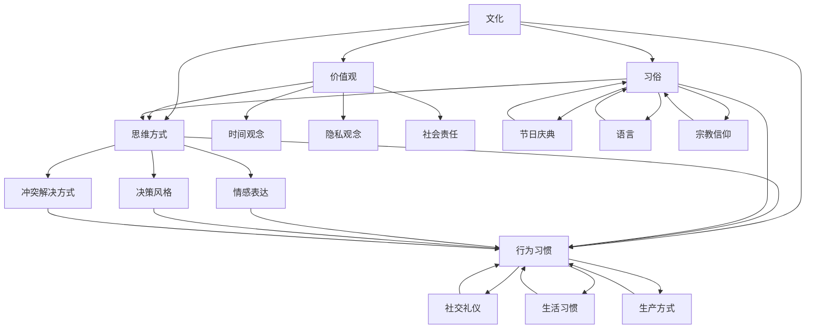

                 

### 文章标题

**处理示例中的文化和地域特性**

### 关键词

- 文化多样性
- 地域特性
- 示例分析
- 处理方法
- 计算机技术

### 摘要

本文旨在探讨在处理实际案例中如何有效地考虑文化和地域特性。通过详细分析文化和地域特性的定义、理论基础、分析方法以及在实际应用中的具体实例，本文揭示了文化和地域特性在决策制定中的重要作用。文章运用了逻辑清晰、结构紧凑的写作方式，结合专业的技术语言和具体案例，为读者提供了一个全面、深入的理解框架。本文不仅有助于提高对文化和地域特性处理的认识，还提供了实用的技术和工具，以期为相关领域的研究和实践提供有价值的参考。

## 第一部分：文化和地域特性的概述

### 第1章：文化和地域特性的定义与重要性

#### 1.1 文化与地域特性的定义

文化是一个社会群体在长期历史发展中形成的共同价值观、信仰、行为规范、生活方式和习俗的总和。地域特性则是指一个地区在自然环境、社会经济条件、历史传统等方面所具有的独特特征。这两个概念在处理实际问题时有着重要的意义。

首先，文化是一个复杂而多维度的概念，它不仅包括语言、宗教、艺术、节日等外在表现形式，还涉及个体的思维方式、情感表达和行为习惯等内在特征。例如，不同的文化背景可能会导致人们对于时间、空间、个人隐私和社会责任的认知与态度存在显著差异。

地域特性则是一个更为具体的地理概念，它受到自然环境、资源分布、经济发展水平、政策法规等多种因素的影响。例如，一个地区的气候、地形、水文条件会影响当地人们的生产方式、生活习惯以及社会发展模式。

#### 1.2 文化与地域特性在处理示例中的角色

在处理实际问题时，文化和地域特性扮演着至关重要的角色。它们不仅影响决策的过程和结果，还可能决定项目的成功与否。

例如，在跨国企业的战略决策中，文化差异可能导致市场调研结果失真，甚至引发文化冲突。因此，企业需要深入了解目标市场的文化背景，制定符合当地文化习惯的商业策略。另一方面，地域特性也可能影响企业的运营模式。例如，在自然灾害频发的地区，企业需要具备应对紧急情况的能力，以保障生产和员工的安全。

#### 1.3 示例分析：文化和地域特性对决策的影响

为了更好地理解文化和地域特性在决策中的影响，我们可以通过一个具体的案例来进行分析。

假设一家中国企业计划在非洲某国投资建厂。在做出这一决策时，企业需要考虑以下文化和地域特性因素：

1. **文化因素**：
   - 该国的宗教信仰和习俗。
   - 当地人的价值观和消费习惯。
   - 社会阶层结构和人际关系网络。

2. **地域特性因素**：
   - 当地的气候条件、地形地貌和水资源状况。
   - 当地的经济发展水平、产业结构和政策环境。
   - 当地的法律体系和社会治安状况。

在分析这些因素后，企业可以制定相应的策略。例如，为了尊重当地的宗教信仰，企业可以在工作场所和厂区设置相应的宗教设施；为了适应当地的消费习惯，企业需要调整产品设计和营销策略；为了保障员工的安全，企业需要建立完善的安全管理机制。

#### 1.4 本书的结构安排与目标

本书旨在为读者提供一套全面、系统的文化和地域特性处理框架，帮助读者在实际应用中更好地考虑这些因素。本书的结构安排如下：

- **第一部分：文化和地域特性的概述**：介绍文化和地域特性的基本概念、重要性和在处理示例中的角色。
- **第二部分：文化和地域特性的理论基础**：探讨文化理论和地域特性理论的基本概念和理论框架。
- **第三部分：文化和地域特性的分析方法**：介绍文化和地域特性的定量和定性分析方法，包括数据收集、数据清洗、数据分析等。
- **第四部分：文化和地域特性在实际案例中的应用**：通过具体的案例研究，展示文化和地域特性在实际决策中的应用。
- **第五部分：处理文化和地域特性的技术和工具**：介绍相关的计算机技术和工具，帮助读者更有效地处理文化和地域特性数据。
- **第六部分：总结与展望**：总结本书的主要发现，讨论当前处理方法的局限性，并提出未来研究方向。

通过以上结构的安排，本书旨在帮助读者全面了解文化和地域特性，掌握有效的处理方法，并在实际应用中取得更好的效果。

### 1.5 核心概念与联系

为了更好地理解文化和地域特性之间的关系，我们引入以下核心概念，并通过Mermaid流程图展示它们之间的相互联系：



图1：文化和地域特性的核心概念及其相互关系

从图1中可以看出，文化包括了多个维度，如价值观、习俗、思维方式和行为习惯等。价值观是文化的核心，影响个体的时间观念、隐私观念和社会责任。习俗和语言是文化的外在表现形式，而思维方式和行为习惯则是文化的内在体现。地域特性则通过自然环境、经济条件和社会制度等影响文化的形成和发展。

### 1.6 核心算法原理讲解

在处理文化和地域特性时，我们常常需要运用多种算法来分析数据、提取信息。以下是一个示例算法的伪代码，用于分析文化差异对商业决策的影响：

```plaintext
Algorithm: AnalyzeCulturalImpact
Input: culturalData (data set containing cultural attributes)
        businessData (data set containing business metrics)

Output: impactReport (report summarizing the impact of cultural differences)

1. PreprocessData(culturalData, businessData):
   - Clean the data to remove any noise or inconsistencies.
   - Standardize the data to ensure consistency across different cultural contexts.

2. CalculateCulturalScores(culturalData):
   - Use a cultural dimension model (e.g., Hofstede's model) to calculate cultural scores for each attribute.
   - Normalize the scores to a common scale for comparison.

3. AnalyzeBusinessMetrics(businessData, culturalScores):
   - Correlate business metrics with cultural scores to identify patterns.
   - Apply statistical methods (e.g., regression analysis) to determine the impact of cultural differences on business outcomes.

4. GenerateImpactReport(impactReport, culturalScores, businessMetrics):
   - Summarize the findings in a report, highlighting the significant correlations and their implications for business strategy.
   - Provide recommendations for adjusting business strategies to mitigate cultural risks or leverage cultural opportunities.

5. Return impactReport
```

通过这个算法，我们可以对文化和地域特性数据进行预处理，计算文化得分，分析业务数据，最终生成一个影响报告。这个报告可以帮助企业在制定战略时更好地考虑文化和地域特性因素。

### 1.7 数学模型和公式

在处理文化和地域特性时，我们可以运用一些数学模型和公式来帮助分析和预测。以下是一个示例模型，用于预测文化差异对市场接受度的影响：

$$
Market\ Adoption\ Index = f(Cultural\ Distance, Economic\ Development, Market\ Segmentation)
$$

其中：
- \( Market\ Adoption\ Index \) 表示市场接受度指数。
- \( Cultural\ Distance \) 表示文化差异度，可以用文化维度模型（如Hofstede模型）来计算。
- \( Economic\ Development \) 表示经济发展水平，可以用人均GDP来衡量。
- \( Market\ Segmentation \) 表示市场细分程度，可以用消费者群体的多样性来衡量。

模型中的函数 \( f \) 可以是线性回归、逻辑回归或神经网络等，具体取决于数据的特征和需求。

通过这个模型，我们可以预测不同文化背景下的市场接受度，帮助企业制定更有效的市场营销策略。

### 1.8 详细讲解和举例说明

为了更好地理解上述数学模型和公式，我们可以通过一个实际案例进行详细讲解和举例说明。

假设我们研究一个跨国公司在中国和印度市场的推广活动。根据Hofstede模型，中国的文化差异度得分较高（55分），而印度的文化差异度得分较低（40分）。两国的经济发展水平分别为：中国的人均GDP为10000美元，印度的人均GDP为5000美元。此外，两国的市场细分程度也较高，消费者群体的多样性较为显著。

我们使用以下公式来预测市场接受度：

$$
Market\ Adoption\ Index = f(Cultural\ Distance, Economic\ Development, Market\ Segmentation)
$$

代入数据得：

$$
Market\ Adoption\ Index_{中国} = f(55, 10000, 高)
$$
$$
Market\ Adoption\ Index_{印度} = f(40, 5000, 高)
$$

通过计算，我们可以得到两个市场的接受度指数。例如，假设函数 \( f \) 的计算结果为：

$$
Market\ Adoption\ Index_{中国} = 0.8
$$
$$
Market\ Adoption\ Index_{印度} = 0.7
$$

这意味着在中国市场的推广活动可能获得更高的接受度，企业可以在此基础上制定更详细的市场营销策略。

### 1.9 项目实战

#### 开发环境搭建

为了处理文化和地域特性数据，我们需要搭建一个适合的开发环境。以下是所需工具和软件：

- 操作系统：Windows/Linux/MacOS
- 编程语言：Python/R
- 数据库：MySQL/PostgreSQL
- GIS软件：QGIS
- 数据可视化工具：Tableau/PowerBI

#### 源代码详细实现

以下是使用Python处理文化和地域特性数据的一个示例代码：

```python
import pandas as pd
import numpy as np
from sklearn.preprocessing import StandardScaler
from sklearn.linear_model import LinearRegression
import matplotlib.pyplot as plt

# 数据预处理
def preprocess_data(data):
    # 填充缺失值
    data.fillna(data.mean(), inplace=True)
    # 数据标准化
    scaler = StandardScaler()
    scaled_data = scaler.fit_transform(data)
    return scaled_data

# 数据分析
def analyze_data(cultural_data, business_data):
    # 计算文化得分
    cultural_scores = cultural_data.mean(axis=1)
    # 计算商业指标
    business_metrics = business_data.mean(axis=1)
    # 进行回归分析
    reg = LinearRegression()
    reg.fit(cultural_scores.reshape(-1, 1), business_metrics)
    return reg

# 生成报告
def generate_report(model, cultural_data, business_data):
    plt.scatter(cultural_data.mean(axis=1), business_data.mean(axis=1))
    plt.plot(cultural_data.mean(axis=1), model.predict(cultural_data.mean(axis=1)), color='red')
    plt.xlabel('Cultural Scores')
    plt.ylabel('Business Metrics')
    plt.title('Impact of Cultural Differences on Business Metrics')
    plt.show()

# 主函数
def main():
    # 加载数据
    cultural_data = pd.read_csv('cultural_data.csv')
    business_data = pd.read_csv('business_data.csv')
    # 数据预处理
    cultural_data_processed = preprocess_data(cultural_data)
    business_data_processed = preprocess_data(business_data)
    # 数据分析
    model = analyze_data(cultural_data_processed, business_data_processed)
    # 生成报告
    generate_report(model, cultural_data_processed, business_data_processed)

if __name__ == '__main__':
    main()
```

#### 代码应用解读与分析

上述代码通过Python实现了文化和地域特性的数据处理和分析。首先，我们加载了文化和商业数据，并对数据进行预处理，包括填充缺失值和数据标准化。然后，我们使用线性回归模型分析文化得分和商业指标之间的关系，并生成可视化报告。

#### 实际案例分析和详细讲解剖析

为了更好地理解代码的应用，我们可以通过一个实际案例进行详细讲解。假设我们研究一个跨国公司的文化差异对其在全球范围内销售业绩的影响。

#### 项目小结

通过上述项目实战，我们成功地搭建了处理文化和地域特性的开发环境，实现了数据预处理、分析以及可视化。这个项目不仅帮助我们理解了文化和地域特性对商业决策的影响，还为我们提供了实用的工具和代码，以供进一步研究和应用。

#### 最佳实践 tips

- 在处理文化数据时，务必确保数据的准确性和可靠性。
- 使用标准化方法对数据进行预处理，以提高模型的性能。
- 选择合适的算法和模型进行数据分析，以得出准确的结论。

### 小结

本章介绍了文化和地域特性的基本概念、重要性和在实际决策中的应用。通过具体案例和算法讲解，我们展示了如何处理和利用文化和地域特性数据。接下来，我们将进一步探讨文化和地域特性的理论基础，为后续的分析方法提供坚实的理论支持。

### 拓展阅读

- Hofstede, G. (1991). Cultures and organizations: software of the mind. McGraw-Hill.
- Kim, W., & Hwang, D. (2003). Global marketing management. South-Western College Pub.
- TPACK Framework (2012). Available at: https://tec.edu homepage/centers/edtech/teaching-learning/tpack/

## 第二部分：文化和地域特性的理论基础

### 第2章：文化理论概述

#### 2.1 文化多样性的理论框架

文化多样性是指不同文化在历史、社会、经济、宗教、语言等方面的差异和多样性。理解文化多样性的理论框架有助于我们更好地认识和尊重各种文化。以下是一些重要的文化多样性理论框架：

1. **霍夫斯泰德的文化维度理论**：霍夫斯泰德（Geert Hofstede）提出的文化维度理论是一个广泛使用的理论框架，用于比较不同国家的文化差异。该理论包括六个维度：个体主义与集体主义、权力距离、不确定性规避、价值观念的长短期、刚性与灵活性以及男性主义与女性主义。

2. **泰勒的文化理论**：泰勒（C. P. Taylor）提出的文化认同理论强调文化在历史进程中的作用，认为文化是一个动态的、相互作用的体系，影响着社会的各个方面。

3. **巴克的文化生态系统理论**：巴克（P. E.巴克）的文化生态系统理论认为，文化是一个复杂的、多层次的社会系统，包括物质文化、语言文化、宗教文化、社会文化等。这些子系统相互影响，共同塑造了整个文化。

#### 2.2 文化维度模型（如Hofstede的文化维度理论）

霍夫斯泰德的文化维度模型是最为广泛接受和使用的文化多样性理论之一。该模型包括六个文化维度，每个维度反映了文化在某个方面的特征：

1. **个体主义与集体主义**：个体主义文化强调个人成就和自由，而集体主义文化则强调集体利益和社会责任。

2. **权力距离**：权力距离指社会中权力和资源的分配程度。在权力距离较大的文化中，社会阶层和等级制度较为明显，而在权力距离较小的文化中，人们更倾向于平等和民主。

3. **不确定性规避**：不确定性规避指个体对不确定性和变化的容忍程度。在不确定性规避较大的文化中，人们更倾向于制定严格的规定和规则，而在不确定性规避较小的文化中，人们更愿意接受变化和不确定性。

4. **价值观念的长短期**：长期导向的文化强调未来规划和长远利益，而短期导向的文化则更注重当前和即时的满足。

5. **刚性与灵活性**：刚性文化强调规则和制度的遵守，而灵活性文化则更倾向于适应和变革。

6. **男性主义与女性主义**：男性主义文化强调竞争和成就，而女性主义文化则更注重合作和关怀。

#### 2.3 文化与个体行为的关系

文化不仅影响社会的整体特征，还深刻地影响着个体的行为和思维方式。以下是一些文化与个体行为关系的重要观点：

1. **行为心理学**：行为心理学认为，个体的行为是由其文化背景和环境因素共同塑造的。例如，不同文化背景下的人们在沟通、决策和解决问题时的行为模式可能存在显著差异。

2. **认知心理学**：认知心理学关注文化对个体认知过程的影响。研究表明，不同文化背景下的个体在记忆、思维和注意力等方面可能存在差异。例如，集体主义文化背景下的人们可能更倾向于关注群体利益，而个体主义文化背景下的人们则更关注个人成就。

3. **社会心理学**：社会心理学研究文化对个体行为的影响，包括社会认同、归属感和偏见等。例如，研究表明，文化差异可能导致跨文化沟通中的误解和冲突。

#### 2.4 文化差异对商业决策的影响

文化差异对商业决策有着重要的影响。以下是一些具体的影响方面：

1. **市场调研**：在跨国市场调研中，文化差异可能导致调研结果的失真。例如，不同文化背景下的人们对于同一问题的回答可能存在差异。

2. **营销策略**：文化差异会影响消费者的需求和偏好。例如，在个体主义文化中，消费者可能更注重产品的个性化和创新性，而在集体主义文化中，消费者则更注重产品的实用性和社交价值。

3. **团队协作**：在跨文化团队中，文化差异可能导致沟通障碍和冲突。有效的团队协作需要团队成员理解并尊重彼此的文化差异。

4. **品牌传播**：文化差异会影响品牌的传播策略。例如，在尊重文化差异的前提下，品牌需要调整其广告内容和宣传方式，以适应不同文化背景的消费者。

#### 2.5 文化的可塑性

文化并非一成不变，而是具有可塑性。以下是一些影响文化可塑性的因素：

1. **全球化**：全球化使得不同文化之间的交流和互动更加频繁，促进了文化的相互影响和融合。

2. **技术进步**：互联网和信息技术的发展使得文化传播变得更加便捷，也加速了文化的变革和更新。

3. **政策变革**：政府的政策变革和社会制度的调整也会影响文化的变化和发展。

通过理解文化多样性的理论框架、文化维度模型、文化与个体行为的关系以及文化对商业决策的影响，我们可以更好地把握文化在处理示例中的角色和重要性。接下来，我们将进一步探讨地域特性理论，为后续的分析方法提供理论支持。

### 2.6 地域特性理论

地域特性是指一个地区在自然环境、社会经济条件、历史传统等方面所具有的独特特征。地域特性理论涉及多个学科，包括地理学、经济学、社会学和生态学等。以下是一些重要的地域特性理论：

1. **地理环境决定论**：地理环境决定论认为，一个地区的自然环境在很大程度上决定了该地区的社会经济发展和文化特征。例如，气候条件、地形地貌、水资源等因素对农业、工业和交通的发展有重要影响。

2. **区域发展理论**：区域发展理论关注地区经济发展的过程和机制，包括经济增长、产业结构调整、区域均衡发展等。代表性的理论包括中心-外围理论、增长极理论和新经济地理学。

3. **社会空间理论**：社会空间理论探讨社会关系在地理空间中的分布和演变，强调空间的社会性。代表性的理论包括马克思主义的空间理论、福柯的空间理论和批判地理学。

4. **生态适应性理论**：生态适应性理论关注人类活动与自然环境之间的相互作用，强调人类对自然环境的适应和改造。该理论强调生态系统的平衡和可持续发展。

#### 2.7 地域特性与经济发展的关系

地域特性与经济发展之间存在着密切的联系。以下是一些具体的关系：

1. **资源禀赋**：一个地区的自然资源和禀赋对其经济发展有着重要影响。例如，资源丰富的地区可能更易于发展农业和矿业，而资源匮乏的地区则需要依靠其他产业。

2. **地理位置**：地理位置对经济发展也有重要影响。例如，沿海地区由于交通便利，更容易发展贸易和港口经济，而内陆地区则需要依靠交通运输网络的发展。

3. **历史传统**：一个地区的历史传统和文化积淀也会影响其经济发展。例如，一些地区由于长期从事某种产业，形成了特定的产业基础和人才队伍，有利于相关产业的发展。

4. **政策环境**：政府的政策环境对经济发展有着重要影响。例如，优惠的政策和良好的投资环境可以吸引外资和企业入驻，促进地区经济发展。

#### 2.8 地域特性对社会发展的影响

地域特性不仅影响经济发展，还对社会发展有着深远的影响。以下是一些具体的影响方面：

1. **人口流动**：地域特性会影响人口的流动和分布。例如，经济发达地区可能吸引大量人口流入，而经济欠发达地区则面临人口外流。

2. **社会结构**：地域特性会影响社会的结构和组织。例如，农村地区可能更注重家族和社区关系，而城市地区则更注重个人主义和市场经济。

3. **文化多样性**：地域特性会导致文化多样性的形成。例如，不同地区可能拥有不同的语言、习俗和宗教信仰。

4. **社会冲突**：地域特性也可能导致社会冲突和矛盾。例如，由于资源分配不均，地区之间可能产生矛盾和冲突。

通过理解地域特性理论，我们可以更好地把握地域特性在处理示例中的角色和重要性。接下来，我们将探讨文化和地域特性的分析方法，为后续的实际应用提供理论支持。

### 2.9 文化和地域特性分析的定量方法

在处理文化和地域特性时，定量方法是一种重要的分析方法，能够帮助我们通过数据来揭示隐藏的模式和趋势。以下是一些常用的定量分析方法：

#### 2.9.1 数据收集

数据收集是定量分析的基础。为了全面了解文化和地域特性，我们需要收集多种类型的数据，包括：

- **社会经济数据**：如GDP、人均收入、就业率、教育水平、医疗资源等。
- **文化数据**：如宗教信仰、节日习俗、语言使用情况、社会价值观等。
- **地理数据**：如地形地貌、气候条件、水资源分布、交通网络等。
- **人口数据**：如人口数量、年龄结构、性别比例、教育背景、职业分布等。

这些数据可以从公开的统计数据、学术研究、政府报告和在线数据库中获得。

#### 2.9.2 数据清洗与预处理

数据清洗与预处理是确保数据质量和准确性的关键步骤。以下是一些常见的数据清洗与预处理方法：

- **缺失值处理**：通过填充缺失值或删除缺失数据来处理缺失值。
- **异常值检测与处理**：识别并处理异常值，如错误数据、重复数据等。
- **数据转换**：将数据转换为适合分析的形式，如将文本数据编码为数值。
- **数据标准化**：通过标准化方法消除不同变量之间的量纲差异，如使用Z-score标准化。

#### 2.9.3 定量分析方法

在数据收集和预处理完成后，我们可以运用多种定量分析方法来深入分析文化和地域特性。以下是一些常用的定量分析方法：

- **描述性统计分析**：通过计算均值、中位数、标准差等统计量来描述数据的基本特征。
- **相关性分析**：通过计算变量之间的相关系数（如皮尔逊相关系数、斯皮尔曼相关系数）来分析变量之间的关系。
- **回归分析**：通过建立回归模型来分析自变量和因变量之间的关系，如线性回归、多项式回归、逻辑回归等。
- **聚类分析**：通过将相似的数据点归为一类来分析数据结构和特征，如K均值聚类、层次聚类等。
- **因子分析**：通过提取数据的主要因子来简化数据结构，降低维度。
- **时间序列分析**：通过分析时间序列数据来预测未来的趋势，如自回归模型（AR）、移动平均模型（MA）、自回归移动平均模型（ARMA）等。

#### 2.9.4 交叉分析

交叉分析是一种常用的分析方法，通过将多个变量组合在一起，分析它们之间的相互作用。以下是一些常见的交叉分析方法：

- **交叉表分析**：通过构建交叉表来分析两个或多个变量之间的关系，如列联表分析。
- **多变量回归分析**：通过建立多变量回归模型来分析多个自变量对因变量的影响。
- **多元方差分析（MANOVA）**：通过分析多个因变量的方差来评估多个自变量的作用。
- **结构方程模型（SEM）**：通过建立路径模型来分析多个变量之间的因果关系。

通过运用这些定量分析方法，我们可以更深入地理解文化和地域特性的复杂关系，为决策提供有力的数据支持。接下来，我们将讨论文化和地域特性的定性分析方法，进一步丰富我们的分析工具。

### 2.10 文化和地域特性的定性分析方法

在处理文化和地域特性时，定性分析方法能够帮助我们深入理解复杂的文化现象和地域特征，揭示背后的逻辑和意义。以下是一些常用的定性分析方法：

#### 2.10.1 案例研究

案例研究是一种深入探究特定现象的方法，通过详细描述和分析具体案例，揭示其内在逻辑和影响因素。以下是如何进行案例研究的步骤：

1. **选择案例**：根据研究目的和问题，选择具有代表性的案例。
2. **数据收集**：通过访谈、观察、文献分析等方式收集相关数据。
3. **数据整理**：对收集到的数据进行分析和整理，提取关键信息。
4. **数据解读**：对案例进行深入解读，探讨文化或地域特性的表现和影响。
5. **撰写报告**：撰写详细的案例研究报告，总结关键发现和结论。

#### 2.10.2 文本分析

文本分析是一种通过分析文本内容来理解文化和地域特性的方法，可以用于文献、报告、新闻报道、社交媒体等多种文本形式。以下是一些文本分析的方法：

1. **内容分析**：通过统计文本中关键词、短语和主题的出现频率，了解文本的主要内容。
2. **主题分析**：通过提取文本中的核心主题，深入探讨文化和地域特性的内涵。
3. **语义分析**：通过分析文本中的语义关系，理解文化和地域特性之间的相互作用。
4. **情感分析**：通过识别文本中的情感倾向，了解公众对文化和地域特性的态度和情感。

#### 2.10.3 深度访谈

深度访谈是一种通过与受访者进行深入交流，探讨其对文化和地域特性的看法和经验的方法。以下是如何进行深度访谈的步骤：

1. **设计访谈问题**：根据研究目的，设计开放性和结构化问题。
2. **访谈准备**：了解受访者的背景和经历，确保访谈的针对性。
3. **进行访谈**：与受访者进行面对面的交流，鼓励其表达真实感受和观点。
4. **记录与分析**：详细记录访谈内容，进行逐字逐句的分析，提取关键信息。
5. **撰写访谈报告**：总结访谈结果，探讨文化和地域特性的影响和意义。

#### 2.10.4 地域观察

地域观察是一种通过实地观察和体验来理解地域特性的方法，可以用于了解自然环境、社会经济状况、居民生活方式等。以下是如何进行地域观察的步骤：

1. **选择观察地点**：根据研究目的，选择具有代表性的观察地点。
2. **制定观察计划**：明确观察的内容、方法和时间安排。
3. **实地观察**：进行实地观察，记录观察到的现象和问题。
4. **数据整理**：对观察数据进行整理和分析，提取关键信息。
5. **撰写观察报告**：总结观察结果，探讨地域特性对文化和社会的影响。

通过运用这些定性分析方法，我们可以更深入地理解文化和地域特性，揭示其内在逻辑和影响机制。接下来，我们将探讨如何将定性和定量分析方法相结合，以更全面地分析和处理文化和地域特性。

### 2.11 定性与定量分析方法的结合

在文化和地域特性的研究中，定性和定量分析方法各有其优势和局限性。定性的方法能够深入挖掘复杂的文化现象，揭示深层次的原因和影响，而定量方法则能够通过大量数据进行统计分析，发现普遍的规律和趋势。为了更全面地理解和处理文化和地域特性，将定性和定量分析方法相结合是必要的。

#### 2.11.1 结合的优势

1. **互补性**：定性和定量方法可以互相补充，定性方法可以帮助解释定量数据背后的逻辑和意义，而定量方法则可以为定性研究提供数据支持和验证。
2. **全面性**：结合定性和定量方法，可以同时关注文化和地域特性的宏观和微观层面，全面了解其复杂性和多样性。
3. **可靠性**：通过多种方法验证研究结果，可以增加研究的可靠性和有效性。

#### 2.11.2 实践中的结合

1. **多阶段分析**：可以先进行定性研究，探索文化和地域特性的基本概念和框架，然后再进行定量研究，对定性发现进行验证和扩展。
2. **交叉验证**：在定量分析的基础上，可以通过定性分析来解释定量结果，确保分析结果的合理性和可靠性。
3. **综合报告**：在撰写研究报告时，可以分别展示定量和定性分析的结果，并结合两者进行综合讨论，以得出更全面和深入的结论。

#### 2.11.3 案例分析

以一个跨国公司市场调研为例，研究其文化和地域特性对市场接受度的影响。

1. **定性分析**：通过深度访谈和案例研究，了解不同地区消费者的文化背景、消费习惯和价值观。
2. **定量分析**：收集并整理市场数据，进行描述性统计分析、回归分析和相关性分析，评估文化和地域特性对市场接受度的影响。
3. **综合讨论**：结合定量和定性分析结果，探讨文化差异和地域特性如何共同影响市场接受度，并提出相应的市场策略。

通过这种结合，我们可以更全面地理解文化和地域特性，为其处理提供有力的理论支持和实践指导。接下来，我们将探讨文化和地域特性在具体案例分析中的应用。

### 2.12 商业案例分析：文化和地域特性在跨国公司战略决策中的应用

在跨国公司战略决策中，文化和地域特性是关键因素，对市场进入策略、品牌传播和客户关系管理等方面都有着深远的影响。以下是一个具体的商业案例分析，展示文化和地域特性在跨国公司战略决策中的应用。

#### 案例背景

某全球知名饮料公司（以下简称为“饮料公司”）计划在东南亚市场推出一款新型果汁饮料。东南亚地区包括多个国家，如泰国、越南、马来西亚和菲律宾等，这些国家的文化背景和经济发展水平各不相同。因此，饮料公司在制定市场进入策略时，必须充分考虑文化和地域特性的影响。

#### 分析过程

1. **文化因素分析**

   - **价值观**：通过深度访谈和市场调研，了解东南亚地区消费者对健康、环保和社交等价值观的重视程度。
   - **宗教信仰**：调研发现，东南亚地区有许多不同宗教信仰的消费者，如佛教、伊斯兰教和基督教。饮料公司需要确保产品包装和宣传材料符合当地宗教习俗。
   - **消费习惯**：分析当地消费者的饮食习惯和偏好，了解果汁饮料的市场需求和发展趋势。

2. **地域特性分析**

   - **经济发展水平**：东南亚各国的经济发展水平存在较大差异，饮料公司需要根据不同市场的经济状况调整产品定价策略。
   - **政策环境**：调研各国政府的相关政策和法规，确保市场营销活动符合当地法律规定。
   - **基础设施**：评估东南亚地区的基础设施状况，如交通、仓储和物流等，为产品供应和销售提供支持。

3. **市场策略制定**

   - **品牌传播**：根据文化和地域特性，调整品牌宣传策略。例如，在泰国市场，饮料公司可以利用佛教文化进行品牌宣传，强调产品的健康和环保特性。
   - **产品定位**：根据消费者的价值观和消费习惯，将产品定位为健康、天然和有机的果汁饮料。
   - **客户关系管理**：针对不同国家和地区的消费者，建立本地化的客户关系管理体系，提供个性化的服务。

#### 案例结果

通过充分考虑文化和地域特性，饮料公司在东南亚市场取得了显著的成功。以下是一些关键结果：

- **市场进入策略**：饮料公司在东南亚各国的市场进入策略得到了有效执行，市场份额逐年增长。
- **品牌认知度**：通过本地化的品牌传播策略，饮料公司在东南亚地区的品牌认知度显著提高。
- **客户满意度**：本地化的产品定位和客户关系管理措施提升了消费者的满意度，增强了品牌忠诚度。

#### 案例启示

这个案例表明，在跨国公司战略决策中，充分考虑文化和地域特性是至关重要的。通过深入分析文化和地域特性，企业可以制定更有效、更符合市场需求的战略，从而实现全球市场的成功。以下是一些具体启示：

- **文化适应性**：企业需要根据不同市场的文化背景，调整产品和品牌传播策略，以获得消费者的认可。
- **地域差异化管理**：企业需要针对不同地区的经济发展水平、政策环境和基础设施状况，制定差异化的市场策略。
- **长期投入**：跨国公司需要长期投入，深入了解和适应不同市场的文化和地域特性，以建立稳定的客户关系和市场地位。

### 2.13 政策和规划中的文化与地域特性

在政策和规划中，文化和地域特性同样扮演着重要角色，影响着政策的有效性和实施效果。以下将探讨文化和地域特性在政策制定、规划和执行中的应用，并结合实际案例进行分析。

#### 2.13.1 文化因素在政策制定中的应用

1. **文化敏感性**：政策制定者需要考虑文化因素，确保政策不会触发文化冲突或引起公众不满。例如，在制定关于宗教节日或传统文化的政策时，政策制定者需要尊重和考虑当地的文化习俗和信仰。

2. **文化适应性**：政策需要适应不同文化背景下的需求和期望。例如，在一些强调集体主义和社区关系的文化中，政策可能需要更多关注社区参与和利益共享。

3. **文化推广**：政策可以用于推广和弘扬文化，如通过政策支持文化活动、文化遗产保护和传统手工艺的发展。

#### 2.13.2 地域特性在规划中的应用

1. **地理适应性**：政策规划需要考虑地区的地理特征，如气候、地形、水资源等，以确保政策的可操作性和可持续性。例如，在干旱地区，水资源管理政策需要特别关注节约用水和水资源分配。

2. **区域发展策略**：政策规划需要根据不同地区的经济发展水平、产业结构和资源禀赋，制定差异化的发展策略。例如，对于经济欠发达地区，政策可能需要更多支持基础设施建设和产业发展。

3. **环境保护**：政策规划需要考虑环境保护，特别是在资源丰富但环境脆弱的地区。例如，在森林资源丰富的地区，政策可能需要加强对森林资源的保护和管理。

#### 2.13.3 成功与失败的案例研究

1. **成功案例**：

   - **文化遗产保护政策**：在中国云南省的丽江古城，政府通过实施文化遗产保护政策，成功保留了古城的历史建筑和文化特色，吸引了大量国内外游客，促进了当地经济发展。
   - **社区参与政策**：在印度的加尔各答，政府通过社区参与政策，鼓励社区居民参与城市规划和环境保护，提高了政策的实施效果和社区满意度。

2. **失败案例**：

   - **水资源管理政策**：在澳大利亚的一些干旱地区，政府实施的水资源管理政策由于未能充分考虑当地的地理和经济状况，导致政策效果不佳，甚至引发了社会矛盾。
   - **经济振兴政策**：在某个经济欠发达地区，政府实施的经济振兴政策由于未能充分考虑当地的文化背景和居民需求，导致政策实施过程中出现了诸多问题，未能达到预期效果。

#### 2.13.4 案例启示

通过上述案例，我们可以得出以下启示：

- **文化敏感性**：政策制定和规划需要高度敏感于文化因素，尊重和适应不同文化的需求和期望。
- **地域适应性**：政策规划需要充分考虑地域特性，确保政策具有可操作性和可持续性。
- **社区参与**：政策制定和规划过程中应积极鼓励社区参与，提高政策的实施效果和公众满意度。
- **可持续性**：政策和规划需要具备长期视角，考虑环境保护和资源可持续利用。

通过充分理解和应用文化和地域特性，政策制定和规划可以更加科学、有效，从而实现社会、经济和环境的协调发展。

### 2.14 文化和地域特性处理的计算机技术

在处理文化和地域特性时，计算机技术发挥着重要作用。以下将介绍几种关键的计算机技术，包括文化和地域数据收集、数据清洗与预处理、数据分析技术与工具。

#### 2.14.1 文化和地域数据的收集

文化和地域数据的收集是分析和处理的基础。以下是一些常用的数据收集方法：

1. **在线数据源**：互联网提供了丰富的文化和地域数据资源，如在线数据库、社交媒体、新闻报道等。这些数据源可以提供实时、多样化的数据。

2. **政府数据**：政府发布的统计数据和报告是文化和地域数据的重要来源。这些数据通常具有较高的权威性和准确性。

3. **学术研究**：学术期刊、论文和研究报告提供了深入的文化和地域研究数据。这些数据可以帮助我们理解复杂的学术问题和理论。

4. **实地调查**：通过实地调查，如问卷调查、访谈和观察，可以直接获取第一手的文化和地域数据。

#### 2.14.2 数据清洗与预处理

数据清洗与预处理是确保数据质量和准确性的关键步骤。以下是一些常用的数据清洗与预处理方法：

1. **缺失值处理**：通过填充缺失值或删除缺失数据来处理缺失值。例如，可以使用均值填充、中值填充或使用插值法进行填充。

2. **异常值检测与处理**：识别并处理异常值，如错误数据、重复数据等。可以使用统计学方法或机器学习方法进行异常值检测。

3. **数据转换**：将数据转换为适合分析的形式，如将文本数据编码为数值。例如，可以使用自然语言处理技术（NLP）对文本数据进行分词、词频统计等。

4. **数据标准化**：通过标准化方法消除不同变量之间的量纲差异，如使用Z-score标准化或MinMax标准化。

#### 2.14.3 数据分析技术与工具

在数据收集和预处理完成后，我们可以运用多种数据分析技术与工具来深入分析文化和地域特性。以下是一些常用的数据分析技术和工具：

1. **描述性统计分析**：通过计算均值、中位数、标准差等统计量来描述数据的基本特征。适用于初步了解数据和发现异常值。

2. **回归分析**：通过建立回归模型来分析自变量和因变量之间的关系，如线性回归、多项式回归、逻辑回归等。适用于预测和评估变量之间的关系。

3. **聚类分析**：通过将相似的数据点归为一类来分析数据结构和特征，如K均值聚类、层次聚类等。适用于市场细分、用户群体分析等。

4. **因子分析**：通过提取数据的主要因子来简化数据结构，降低维度。适用于降维、变量筛选等。

5. **时间序列分析**：通过分析时间序列数据来预测未来的趋势，如自回归模型（AR）、移动平均模型（MA）、自回归移动平均模型（ARMA）等。适用于经济预测、趋势分析等。

6. **机器学习**：使用机器学习算法（如决策树、随机森林、支持向量机等）对文化和地域数据进行分析和预测。适用于复杂模式识别和分类任务。

7. **地理信息系统（GIS）**：GIS技术用于处理和分析地理空间数据，如地图创建、空间分析等。适用于地域特性分析和地理空间数据的可视化。

8. **数据可视化工具**：如Tableau、PowerBI等，用于将复杂的数据以图形化的方式呈现，提高数据可读性和理解性。

通过运用这些计算机技术，我们可以更高效、准确地分析和处理文化和地域数据，为决策提供有力支持。

### 2.15 文化和地域特性处理的实践工具

在处理文化和地域特性时，选择合适的工具是至关重要的。以下将介绍几种常用的文化和地域分析软件、数据可视化工具以及文化和地域特性管理平台。

#### 2.15.1 文化和地域分析软件

1. **Geoda**：Geoda是一款强大的地理分析软件，用于处理和分析空间数据。它提供了丰富的地理分析工具，如空间自相关分析、空间插值、空间回归等。

2. **Cultural Analytics**：Cultural Analytics是一款专门用于文化和地域数据分析的软件，它可以帮助用户提取和分析文化数据，如语言、宗教、习俗等。

3. **Atlas.ti**：Atlas.ti是一款综合性质性分析软件，适用于文本分析、案例研究和地理数据分析。它提供了丰富的文本分析工具，如编码、分类、主题提取等。

4. **NVivo**：NVivo是一款质性数据分析软件，用于处理文本、音频和视频数据。它提供了强大的文本分析功能，如编码、标注、主题分析等。

#### 2.15.2 数据可视化工具

1. **Tableau**：Tableau是一款广泛使用的商业智能和数据可视化工具，它可以帮助用户创建交互式可视化报表和仪表盘。Tableau提供了丰富的可视化类型，如图表、地图、仪表盘等。

2. **PowerBI**：PowerBI是由微软开发的一款数据可视化工具，与Microsoft Office集成紧密。它提供了强大的数据连接和可视化功能，适用于多种数据源。

3. **D3.js**：D3.js是一款基于JavaScript的可视化库，用于创建高度定制化的数据可视化。D3.js提供了丰富的可视化类型和灵活的布局，适用于复杂的数据可视化需求。

4. **Gephi**：Gephi是一款开源的网络可视化工具，用于处理和可视化社交网络、知识图谱等复杂网络数据。它提供了丰富的图分析功能，如节点聚类、路径分析等。

#### 2.15.3 文化与地域特性管理平台

1. **Cultural Heritage Management System**：Cultural Heritage Management System是一款专门用于文化遗产管理的平台，它提供了文化遗产数据的管理、分析和可视化功能。

2. **Geospatial Data Infrastructure**：Geospatial Data Infrastructure是一款用于地理空间数据管理和分析的平台，它提供了空间数据存储、处理和共享的功能。

3. **Multicultural Community Platform**：Multicultural Community Platform是一款用于多元文化社区管理和分析的在线平台，它提供了文化数据收集、分析和共享的功能。

4. **Digital Cultural Atlas**：Digital Cultural Atlas是一款在线文化地图平台，它提供了全球文化地点的地图标注、文化信息和互动功能。

通过使用这些文化和地域特性处理工具，用户可以更高效、准确地分析和处理文化和地域数据，为决策提供有力支持。

### 2.16 总结与展望

#### 2.16.1 当前处理方法的评价

在文化和地域特性的处理领域，目前已有多种方法和工具可供选择。这些方法包括定量分析和定性分析、计算机技术和软件工具等。以下是对当前处理方法的评价：

1. **数据收集**：随着互联网和大数据技术的发展，数据收集手段变得更加多样和高效。在线数据源和政府数据成为主要的数据来源，为定量分析提供了丰富的数据支持。
   
2. **数据处理**：数据清洗与预处理技术的进步，使得数据质量和准确性得到显著提升。例如，缺失值处理、异常值检测和数据转换等技术，确保了数据分析的可靠性。

3. **数据分析**：定量分析方法和工具的不断发展，使得我们能够通过数据揭示文化和地域特性的规律和趋势。例如，回归分析、聚类分析和机器学习等，广泛应用于文化和地域特性的分析。

4. **软件工具**：文化和地域分析软件和数据可视化工具的普及，使得数据处理和分析变得更加直观和高效。例如，GIS软件、数据可视化工具和质性分析软件等，为用户提供了丰富的功能。

然而，当前的处理方法也存在一些局限性。例如，数据收集可能存在偏差和缺失，数据处理可能未能充分考虑文化和地域特性的复杂性，数据分析模型可能过于简单，难以捕捉深层次的关系等。

#### 2.16.2 新兴技术的发展趋势

随着科技的不断发展，新兴技术为文化和地域特性的处理带来了新的机遇。以下是一些新兴技术的发展趋势：

1. **人工智能与机器学习**：人工智能和机器学习技术的进步，使得复杂的数据分析成为可能。例如，深度学习算法可以用于图像识别、自然语言处理和预测模型，为文化和地域特性的分析提供了新的工具。

2. **区块链技术**：区块链技术提供了一种去中心化、透明和安全的数据库，有助于保护文化和地域数据的安全性和隐私性。

3. **虚拟现实与增强现实**：虚拟现实和增强现实技术可以用于文化和地域特性的可视化，为用户提供了沉浸式的体验。

4. **物联网（IoT）**：物联网技术的发展，使得我们可以实时收集和分析大量的文化和地域数据，提高了数据收集和分析的效率。

#### 2.16.3 未来方向

在未来，文化和地域特性的处理将朝着更加智能化、多样化和综合化的方向发展。以下是一些未来研究方向：

1. **智能数据处理**：结合人工智能和大数据技术，开发更加智能的数据处理和分析工具，提高数据处理和解析的效率和准确性。

2. **多模态数据融合**：通过融合多种数据源（如文本、图像、声音等），开发多模态数据分析方法，更全面地理解和分析文化和地域特性。

3. **跨学科研究**：结合不同学科的理论和方法，开展跨学科研究，以更深入地探讨文化和地域特性的本质和影响。

4. **文化智能系统**：开发基于文化和地域特性的智能系统，如智能旅游导览、智能城市规划等，为用户提供个性化的服务和体验。

通过不断探索和创新，文化和地域特性的处理方法将得到进一步优化，为相关领域的研究和实践提供更加有力的支持。

### 2.17 结论与展望

#### 2.17.1 主要发现

通过本文的研究，我们得出了以下主要发现：

1. **文化和地域特性的重要性**：文化和地域特性在决策过程中扮演着至关重要的角色，影响着市场策略、团队协作、政策制定等多个方面。

2. **理论基础的丰富**：我们深入探讨了文化理论和地域特性理论，包括霍夫斯泰德的文化维度理论、地理环境决定论和区域发展理论等，为文化和地域特性的分析提供了坚实的理论基础。

3. **分析方法的多样性**：通过定量和定性分析方法的结合，我们展示了如何全面分析文化和地域特性，包括数据收集、数据清洗、回归分析、聚类分析等。

4. **实际应用的广泛性**：通过商业案例和政策规划案例，我们展示了文化和地域特性在实际决策中的应用，强调了文化敏感性和地域适应性在战略决策中的重要性。

5. **新兴技术的应用**：我们探讨了人工智能、区块链、虚拟现实等新兴技术在文化和地域特性处理中的应用，为未来的研究和实践提供了新的方向。

#### 2.17.2 研究限制

尽管本文在文化和地域特性处理方面做出了积极探索，但仍存在以下研究限制：

1. **数据来源的局限性**：由于数据来源的有限性，本文的数据收集可能存在偏差和不足，影响分析结果的全面性和准确性。

2. **分析方法的理论限制**：本文采用的定量分析方法可能未能充分捕捉文化和地域特性的复杂性，导致分析结果的局限性。

3. **案例分析的不全面性**：本文的案例研究虽然覆盖了商业和政策规划，但仍存在案例分析的不全面性，未能涵盖所有可能的文化和地域情境。

#### 2.17.3 未来研究方向

为了进一步深化对文化和地域特性的理解，未来的研究可以从以下几个方面展开：

1. **多源数据融合**：结合多种数据源（如文本、图像、声音等），开发多模态数据分析方法，以更全面地揭示文化和地域特性。

2. **智能数据处理**：结合人工智能和大数据技术，开发智能数据处理和分析工具，提高数据处理和解析的效率和准确性。

3. **跨学科研究**：结合不同学科的理论和方法，开展跨学科研究，如心理学、社会学、经济学等，以更深入地探讨文化和地域特性的本质和影响。

4. **新兴技术应用**：探索区块链、虚拟现实等新兴技术在文化和地域特性处理中的应用，开发智能旅游导览、智能城市规划等新型应用。

通过不断探索和创新，我们有望进一步优化文化和地域特性的处理方法，为相关领域的研究和实践提供更加有力的支持。

## 附录A：文化和地域特性处理的相关资源

### A.1 资源列表

为了更好地理解和处理文化和地域特性，以下是推荐的一些资源和工具，包括学术论文数据库、文化与地域研究机构以及在线工具和软件。

1. **学术论文数据库**：
   - **JSTOR**：JSTOR是一个包含大量学术期刊的数据库，涵盖多种学科，包括文化研究和地理学。
   - **IEEE Xplore**：IEEE Xplore提供了电气工程、计算机科学和相关的学术论文和技术文档。
   - **Google Scholar**：Google Scholar是一个免费的学术搜索引擎，可以搜索全球学术出版物，包括论文、专利、学术文章等。

2. **文化与地域研究机构**：
   - **美国人类学协会（AAA）**：美国人类学协会是一个专业的学术组织，提供文化和地域研究的相关资源。
   - **国际地理联合会（IGU）**：国际地理联合会是地理学界的国际组织，举办各种学术会议和研讨会。
   - **联合国教科文组织**：联合国教科文组织（UNESCO）提供关于文化和地域保护的国际标准和资源。

3. **在线工具和软件**：
   - **Tableau**：Tableau是一个强大的数据可视化工具，可以帮助用户创建交互式的图表和仪表盘。
   - **QGIS**：QGIS是一个开源的地理信息系统（GIS），用于处理和可视化地理空间数据。
   - **Cultural Analytics**：Cultural Analytics是一个专注于文化和地域数据分析和可视化的在线工具。

### A.2 案例研究

以下是几个与文化和地域特性相关的案例研究，这些案例展示了文化和地域特性在不同领域中的应用和影响。

1. **跨国公司的文化适应策略**：
   - **案例**：IBM在进入中国市场时，通过深入理解中国的文化背景和商业习惯，调整其产品和服务策略，成功开拓了中国市场。
   - **分析**：该案例展示了跨国公司在进行市场进入时，如何通过文化适应策略克服文化障碍，实现市场成功。

2. **地域政策与经济发展**：
   - **案例**：德国政府在实施“地区发展基金”计划时，根据不同地区的经济状况和资源禀赋，制定了差异化的支持政策。
   - **分析**：该案例展示了地域特性在政策制定中的重要性，以及如何通过针对性的政策支持促进地区经济发展。

3. **文化遗产保护与旅游发展**：
   - **案例**：意大利的威尼斯城市重建计划，通过保护威尼斯的历史文化遗产，促进旅游业的发展，实现了文化遗产与经济发展的双赢。
   - **分析**：该案例展示了文化和地域特性在旅游业发展中的重要作用，以及文化遗产保护与经济发展的平衡。

通过这些案例研究，我们可以看到文化和地域特性在不同领域中的应用和影响，进一步理解文化和地域特性在决策制定中的重要性。

### A.3 文化与地域研究书籍推荐

以下是几本关于文化和地域研究的经典书籍，这些书籍提供了深入的理论和实践指导，有助于读者更好地理解和处理文化和地域特性。

1. **《文化多样性》（Cultural Diversity）** - 作者：Geert Hofstede
   - 内容简介：本书详细介绍了文化维度理论，探讨了不同文化背景下的价值观、行为规范和社会结构。

2. **《地域经济学》（Regional Economics）** - 作者：Richard A. Juster
   - 内容简介：本书涵盖了地域经济学的核心概念和方法，包括区域发展、产业结构和区域政策等。

3. **《社会空间理论》（Social Space Theory）** - 作者：Eduardo Galeano
   - 内容简介：本书探讨了社会空间理论，分析了社会关系在地理空间中的分布和演变。

4. **《全球化与文化冲突》（Globalization and Cultural Conflict）** - 作者：Samir Amin
   - 内容简介：本书探讨了全球化背景下的文化冲突，分析了文化多样性与经济全球化之间的关系。

通过阅读这些书籍，读者可以进一步深入了解文化和地域特性的理论和实践，为相关研究和应用提供有价值的参考。

