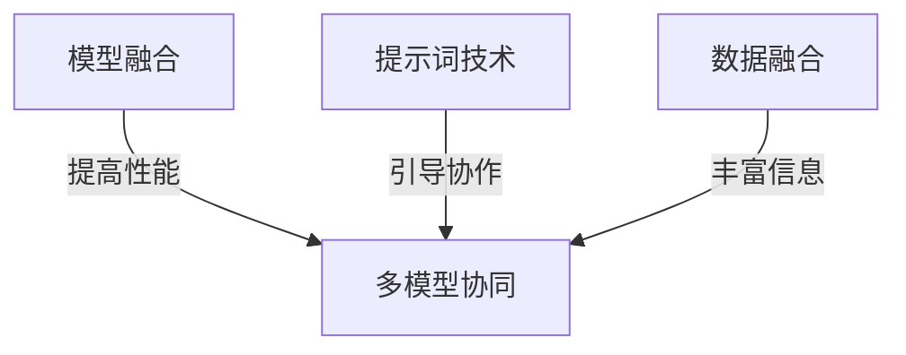
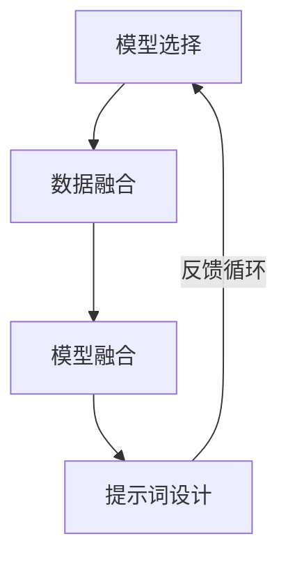
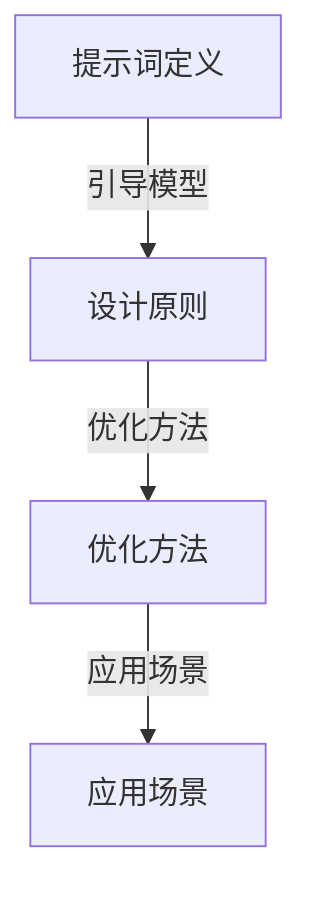
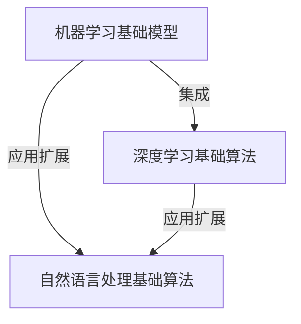
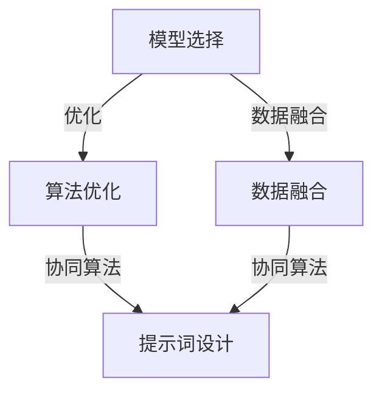
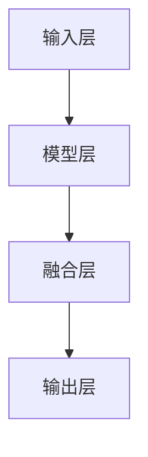
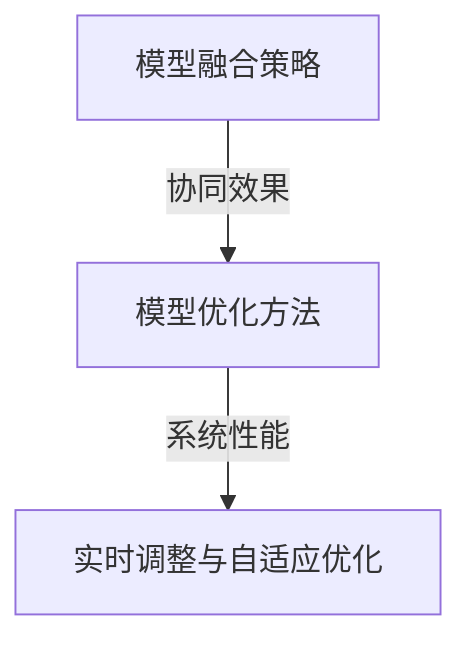

                 

### 文章标题

# 多模型协同：利用提示词整合不同AI能力

### 关键词

- 多模型协同
- 提示词
- AI能力整合
- 机器学习
- 深度学习
- 自然语言处理

### 摘要

本文将探讨多模型协同在人工智能领域的应用，特别是通过提示词技术来整合不同AI能力的具体方法。文章首先介绍了多模型协同的定义、意义与基本框架，然后详细解析了提示词的基本概念、设计与优化方法，以及其在多模型协同中的角色与作用。接下来，文章从基础模型与算法介绍、多模型协同架构设计与实现，到实际应用和性能优化等方面，逐步深入分析多模型协同的实践过程。最后，文章讨论了多模型协同中的挑战与解决策略，并展望了未来的发展趋势。通过本文的阅读，读者将能够全面理解多模型协同的概念、技术细节和实践应用，为在AI领域进行深入研究和开发提供有力支持。

#### 第一部分：多模型协同基础

### 第1章 多模型协同概述

多模型协同是近年来人工智能领域的一个重要研究方向，其核心理念是将不同的AI模型通过某种方式结合起来，以实现更强大的功能。在传统的单模型AI系统中，每个模型通常专注于特定任务，如图像识别、自然语言处理或推荐系统。然而，单一模型的局限性在复杂任务面前显得尤为突出。多模型协同通过整合多种AI能力，能够更灵活地应对多变的环境和复杂的任务，从而显著提升系统的整体性能。

#### 核心概念与联系

多模型协同涉及多个核心概念，包括模型融合、提示词技术、数据融合等。模型融合是将多个模型的输出进行整合，以获得更准确的结果；提示词技术则是通过设计特定的提示词来引导模型之间的协作；数据融合则是将不同来源的数据进行整合，以提供更丰富的信息。以下是这些概念之间的关系架构图：



#### 第1节 多模型协同的定义与背景

多模型协同，顾名思义，是指将多个模型协同工作，以实现单一模型难以达成的任务。这种协同不仅仅是在技术上的一种结合，更是一种思维上的转变。传统的单模型AI系统在处理复杂任务时，往往因为模型自身的局限性而无法胜任。例如，一个专注于图像识别的模型在处理包含大量文本信息的任务时，可能无法充分利用图像外的其他信息；而一个专注于自然语言处理的模型在处理图像时，可能缺乏对图像内容的理解。多模型协同通过整合不同模型的能力，使得系统能够在多种任务中表现出色。

多模型协同的背景可以追溯到早期的人工智能研究。早期的人工智能系统大多基于单一模型，如规则系统或决策树。随着深度学习技术的发展，神经网络在图像识别、自然语言处理等领域取得了显著的进展。然而，这些单一模型在处理复杂任务时仍然存在很多局限性。例如，图像识别模型难以处理包含大量噪声的数据，自然语言处理模型则难以理解图像中的视觉信息。为了克服这些局限性，研究者开始探索如何将不同模型的优势结合起来，从而实现更强大的AI系统。

#### 第2节 多模型协同的意义与应用场景

多模型协同的意义在于，它能够通过整合多个模型的能力，使得系统能够在多种任务中表现出色。具体来说，多模型协同有以下几点意义：

1. **提升系统性能**：通过整合多个模型，系统能够更好地处理复杂任务，提高准确率和鲁棒性。
2. **增强任务灵活性**：多模型协同使得系统能够在多种任务中灵活切换，适应不同的应用场景。
3. **提供更全面的解决方案**：多模型协同能够结合不同领域的数据和知识，提供更全面的解决方案。

多模型协同的应用场景非常广泛，包括但不限于以下几个方面：

1. **图像识别与自然语言处理**：将图像识别模型和自然语言处理模型结合起来，可以更好地处理包含图像和文本信息的问题。
2. **推荐系统**：在推荐系统中，多模型协同可以通过整合用户历史行为、图像、文本等多种信息，提供更个性化的推荐。
3. **医疗诊断**：多模型协同可以将医学图像识别、自然语言处理和医学知识图谱等技术结合起来，提高疾病诊断的准确率。

#### 第3节 多模型协同的基本框架

多模型协同的基本框架通常包括以下几个关键组成部分：

1. **模型选择**：根据任务需求，选择合适的模型，包括机器学习模型、深度学习模型、自然语言处理模型等。
2. **数据融合**：将来自不同模型的数据进行整合，提供更丰富的信息。
3. **模型融合**：将不同模型的输出进行融合，以获得更准确的结果。
4. **提示词设计**：设计特定的提示词，引导模型之间的协作。

以下是多模型协同的基本框架图：



在这个框架中，模型选择和数据融合是基础，模型融合和提示词设计是核心。通过不断的反馈循环，系统能够不断优化，提高整体性能。

### 第2章 提示词技术在多模型协同中的应用

提示词技术是多模型协同中的一个关键组成部分，它通过提供特定的提示词，引导不同模型之间的协作，从而实现更强大的功能。在多模型协同中，提示词的设计与优化至关重要，它直接影响模型的协同效果和系统的整体性能。

#### 核心概念与联系

提示词技术涉及多个核心概念，包括提示词的定义、设计原则、优化方法和应用场景。以下是这些概念之间的联系：



#### 第1节 提示词的基本概念

提示词（Prompt）是一种引导模型进行特定任务的语言或信息。在多模型协同中，提示词的作用是指导不同模型如何协同工作，以实现更复杂的任务。提示词可以包含具体的指令、背景信息、预期目标等，通过这些信息，模型能够更好地理解任务要求，从而提高协同效果。

提示词的基本特点包括：

1. **明确性**：提示词需要清晰明确，避免歧义，以便模型能够准确理解任务要求。
2. **灵活性**：提示词应该具有一定的灵活性，能够适应不同的任务场景和模型特点。
3. **引导性**：提示词需要能够引导模型之间的协作，使得各模型能够有效配合，共同完成任务。

#### 第2节 提示词的设计与优化

提示词的设计与优化是确保多模型协同效果的关键。以下是设计提示词时需要考虑的几个原则：

1. **任务导向性**：提示词的设计应该紧密结合具体任务，明确任务目标，指导模型如何协作。
2. **模型适应性**：不同的模型具有不同的特点和能力，提示词的设计需要考虑模型的适应性，以确保模型能够有效配合。
3. **可解释性**：提示词应该具有一定的可解释性，使得模型决策过程能够被理解和解释，提高系统的可信度。
4. **通用性**：提示词应该具备一定的通用性，能够适应不同任务场景和模型组合。

优化提示词的方法包括：

1. **实验调整**：通过多次实验，调整提示词的参数和结构，以找到最优的提示词设计。
2. **用户反馈**：结合用户反馈，不断优化提示词，使其更符合用户需求和预期。
3. **机器学习**：利用机器学习方法，自动优化提示词设计，提高协同效果。

#### 第3节 提示词在多模型协同中的角色与作用

在多模型协同中，提示词扮演着重要的角色，其作用主要体现在以下几个方面：

1. **任务引导**：提示词能够明确任务要求，引导模型进行特定任务，提高任务的完成度。
2. **模型协作**：提示词能够引导不同模型之间的协作，使得各模型能够共享信息和资源，共同完成任务。
3. **性能优化**：提示词的设计和优化能够提高模型的协同效果，从而优化系统的整体性能。

通过提示词技术，多模型协同能够更好地发挥各个模型的优势，实现更复杂的任务。以下是提示词在多模型协同中的具体作用：

1. **提高准确性**：通过明确任务要求和指导模型协作，提示词能够提高模型的准确性，减少错误率。
2. **增强鲁棒性**：提示词能够引导模型在复杂环境中进行工作，增强系统的鲁棒性，提高对噪声和异常数据的处理能力。
3. **优化资源利用**：提示词能够引导模型共享信息和资源，优化系统的资源利用效率，提高系统的整体性能。

### 第3章 基础模型与算法介绍

在探讨多模型协同的实现之前，我们需要首先了解构成这一协同体系的基础模型和算法。多模型协同涉及多种类型的模型，包括机器学习基础模型、深度学习基础算法以及自然语言处理基础算法。本章将分别介绍这些基础模型和算法，为后续的多模型协同实现提供理论和技术支持。

#### 核心概念与联系

多模型协同中的基础模型和算法包括以下几类：

1. **机器学习基础模型**：包括线性回归、逻辑回归、支持向量机（SVM）等。
2. **深度学习基础算法**：包括卷积神经网络（CNN）、循环神经网络（RNN）和Transformer等。
3. **自然语言处理基础算法**：包括词袋模型、递归神经网络（RNN）、长短时记忆网络（LSTM）等。

以下是这些模型和算法之间的关系架构图：



在这个框架中，机器学习基础模型和深度学习基础算法是多模型协同的核心，自然语言处理基础算法则是对这些核心的补充和应用扩展。

#### 第1节 机器学习基础模型

机器学习基础模型是构建多模型协同系统的基石。以下是一些常用的机器学习基础模型：

1. **线性回归**：线性回归是一种简单的机器学习模型，用于预测连续值。其基本原理是通过拟合一条直线，将输入特征映射到输出值。线性回归的数学模型如下：

   $$ y = \beta_0 + \beta_1 \cdot x $$

   其中，$y$ 是输出值，$x$ 是输入特征，$\beta_0$ 和 $\beta_1$ 是模型参数。

2. **逻辑回归**：逻辑回归是一种用于分类问题的模型，其输出是概率值。逻辑回归的数学模型如下：

   $$ P(y=1) = \frac{1}{1 + e^{-(\beta_0 + \beta_1 \cdot x)}} $$

   其中，$y$ 是分类标签，$x$ 是输入特征，$\beta_0$ 和 $\beta_1$ 是模型参数。

3. **支持向量机（SVM）**：SVM 是一种二分类模型，其核心思想是找到一个最佳的超平面，将不同类别的数据点尽可能分开。SVM 的目标是最小化分类间隔，其数学模型如下：

   $$ \min_{\beta, \beta_0} \frac{1}{2} ||\beta||^2 + C \sum_{i=1}^{n} \max(0, 1 - y_i (\beta^T x_i + \beta_0)) $$

   其中，$x_i$ 是数据点，$y_i$ 是标签，$C$ 是惩罚参数。

这些基础模型通过不同的数学原理和优化方法，实现了对数据的分类和回归任务，是构建复杂AI系统的基础。

#### 第2节 深度学习基础算法

深度学习基础算法在多模型协同中扮演着核心角色，其强大的特征提取和表示能力使得复杂任务得以实现。以下是一些重要的深度学习基础算法：

1. **卷积神经网络（CNN）**：CNN 是一种用于图像处理和识别的深度学习算法。其核心思想是利用卷积层提取图像的特征，并通过池化层降低数据的维度。CNN 的基本结构包括卷积层、池化层和全连接层。以下是一个简单的CNN算法伪代码：

   ```python
   def conv2d(input, filter):
       return [filter[i][j] * input[i][j] for i in range(input.shape[0]) for j in range(input.shape[1])]
   
   def pooling(layer):
       return [max(layer[i][j] for i in range(layer.shape[0]) for j in range(layer.shape[1])])

   def cnn(input, filters, pool_size):
       conv_output = conv2d(input, filters)
       pool_output = pooling(conv_output)
       return pool_output
   ```

2. **循环神经网络（RNN）**：RNN 是一种用于序列数据处理的深度学习算法，其特点是能够记住前面的输入信息，从而处理长序列数据。RNN 的基本结构包括输入层、隐藏层和输出层。以下是一个简单的RNN算法伪代码：

   ```python
   def rnn(input, hidden_state, weight):
       return weight * (input + hidden_state)
   
   def rnn_sequence(sequence, hidden_state, weight):
       for input in sequence:
           hidden_state = rnn(input, hidden_state, weight)
       return hidden_state
   ```

3. **Transformer**：Transformer 是一种基于自注意力机制的深度学习算法，其在自然语言处理领域取得了显著的成果。Transformer 的核心思想是利用多头自注意力机制，捕捉序列中的长距离依赖关系。以下是一个简单的Transformer算法伪代码：

   ```python
   def self_attention(inputs, hidden_size):
       Q = K = inputs
       V = inputs
       attention_scores = dot(Q, K.T) / sqrt(hidden_size)
       attention_weights = softmax(attention_scores)
       output = dot(attention_weights, V)
       return output
   ```

这些深度学习基础算法通过复杂的网络结构和优化方法，实现了对图像、序列和自然语言等数据的处理和建模，是构建多模型协同系统的重要工具。

#### 第3节 自然语言处理基础算法

自然语言处理（NLP）基础算法是深度学习在文本数据上的重要应用，对于多模型协同中的文本处理任务至关重要。以下是一些重要的NLP基础算法：

1. **词袋模型（Bag of Words, BoW）**：词袋模型是一种将文本转换为向量表示的方法，其核心思想是忽略文本的顺序，将文本表示为单词的集合。词袋模型的数学模型如下：

   $$ \text{vec}(x) = \sum_{i=1}^{n} x_i \cdot v_i $$

   其中，$x_i$ 是单词 $i$ 在文本中出现的次数，$v_i$ 是单词 $i$ 的向量表示。

2. **递归神经网络（RNN）**：RNN 是一种用于处理序列数据的深度学习算法，其特点是能够记住前面的输入信息，从而处理长序列数据。RNN 的基本结构包括输入层、隐藏层和输出层。以下是一个简单的RNN算法伪代码：

   ```python
   def rnn(input, hidden_state, weight):
       return weight * (input + hidden_state)
   
   def rnn_sequence(sequence, hidden_state, weight):
       for input in sequence:
           hidden_state = rnn(input, hidden_state, weight)
       return hidden_state
   ```

3. **长短时记忆网络（LSTM）**：LSTM 是一种改进的RNN模型，其核心思想是引入门控机制，解决RNN在处理长序列数据时出现的梯度消失和梯度爆炸问题。LSTM 的基本结构包括输入门、遗忘门和输出门。以下是一个简单的LSTM算法伪代码：

   ```python
   def lstm(input, hidden_state, cell_state, weight):
       input_gate = sigmoid(dot(input, input_gate_weight) + dot(hidden_state, input_gate_bias))
       forget_gate = sigmoid(dot(input, forget_gate_weight) + dot(hidden_state, forget_gate_bias))
       output_gate = sigmoid(dot(input, output_gate_weight) + dot(hidden_state, output_gate_bias))
       
       new_cell_state = forget_gate * cell_state + input_gate * tanh(dot(input, input_weight) + dot(hidden_state, hidden_weight))
       new_hidden_state = output_gate * tanh(new_cell_state)
       
       return new_hidden_state, new_cell_state
   ```

这些NLP基础算法通过复杂的网络结构和优化方法，实现了对文本数据的处理和建模，为多模型协同中的文本处理任务提供了重要支持。

### 第4章 多模型协同架构设计与实现

在理解了多模型协同的基础模型和算法之后，我们接下来需要探讨如何设计和实现一个多模型协同架构。这一章将详细讨论多模型协同架构的概述、算法选择与优化、系统实现流程，以及如何在实际项目中应用这些技术。

#### 核心概念与联系

多模型协同架构涉及以下几个核心概念：

1. **模型选择**：根据任务需求，选择合适的模型。
2. **算法优化**：优化模型融合和协同算法，提高系统性能。
3. **数据融合**：整合来自不同模型的数据，提供更丰富的信息。
4. **提示词设计**：设计特定的提示词，引导模型之间的协作。

以下是这些概念之间的联系架构图：



在这个架构中，模型选择和算法优化是基础，数据融合和提示词设计是核心。通过不断的反馈循环，系统能够不断优化，提高整体性能。

#### 第1节 多模型协同架构概述

多模型协同架构的设计目标是实现多个模型的高效协同工作，以应对复杂的任务需求。一个典型的多模型协同架构通常包括以下几个关键组成部分：

1. **输入层**：接收外部数据输入，如文本、图像、语音等。
2. **模型层**：根据任务需求，选择并集成多种模型，如机器学习模型、深度学习模型、自然语言处理模型等。
3. **融合层**：将不同模型的输出进行融合，生成最终的结果。
4. **输出层**：将融合后的结果输出给用户或进一步处理。

以下是多模型协同架构的基本框架图：



在这个框架中，输入层接收外部数据，模型层进行特征提取和任务处理，融合层整合不同模型的结果，输出层提供最终结果。各层之间通过数据流和反馈机制相互连接，形成一个完整的协同系统。

#### 第2节 多模型协同算法的选择与优化

多模型协同算法的选择和优化是确保系统性能的关键。以下是一些常用的多模型协同算法：

1. **模型融合算法**：模型融合算法通过将多个模型的输出进行整合，生成最终的结果。常见的融合算法包括加权平均、投票法、集成学习方法等。以下是加权平均融合算法的伪代码：

   ```python
   def weighted_average(model_outputs, weights):
       total_score = 0
       for i in range(len(model_outputs)):
           total_score += model_outputs[i] * weights[i]
       return total_score / sum(weights)
   ```

2. **协同优化算法**：协同优化算法通过优化模型参数，提高系统的整体性能。常见的协同优化算法包括基于梯度的优化算法（如梯度下降、随机梯度下降等）和基于启发式的优化算法（如遗传算法、粒子群优化等）。以下是梯度下降优化算法的伪代码：

   ```python
   def gradient_descent(parameters, learning_rate, epochs):
       for epoch in range(epochs):
           gradients = compute_gradients(parameters)
           parameters = subtract(parameters, multiply(gradients, learning_rate))
       return parameters
   ```

3. **自适应协同算法**：自适应协同算法根据任务需求和模型性能，动态调整模型参数和融合策略，以提高系统的适应性。自适应协同算法通常结合了模型评估和参数调整机制，以实现实时优化。以下是自适应协同算法的伪代码：

   ```python
   def adaptive协同算法(data, models, threshold):
       while not converged:
           evaluate_models(models, data)
           adjust_parameters(models, threshold)
           if model_performance_improved(models):
               converged = True
       return models
   ```

在选择和优化多模型协同算法时，需要考虑以下几个因素：

1. **任务需求**：根据具体任务的需求，选择合适的模型融合算法和协同优化算法。
2. **数据特性**：分析数据特性，选择适合的数据融合方法，以提高模型的协同效果。
3. **系统性能**：优化模型参数和算法，提高系统的整体性能，包括准确性、鲁棒性和效率等。

#### 第3节 多模型协同系统实现流程

实现一个多模型协同系统通常包括以下几个关键步骤：

1. **需求分析**：明确系统的任务需求，确定需要集成的模型类型和数量。
2. **模型选择**：根据需求分析结果，选择合适的模型，并进行初步训练。
3. **数据准备**：收集和预处理数据，包括数据清洗、归一化、特征提取等。
4. **模型融合**：将不同模型的输出进行融合，生成最终的结果。可以采用加权平均、投票法、集成学习等方法。
5. **系统优化**：通过协同优化算法，动态调整模型参数和融合策略，提高系统性能。
6. **系统集成**：将模型融合和协同优化集成到系统中，形成完整的协同系统。
7. **测试与评估**：对系统进行测试和评估，确保其性能满足需求。

以下是多模型协同系统实现流程的伪代码：

```python
def multi_model协同系统(data, models, algorithm):
    # 需求分析
    requirements = analyze_requirements(data)
    
    # 模型选择
    selected_models = select_models(requirements)
    
    # 数据准备
    processed_data = preprocess_data(data)
    
    # 模型融合
    fused_output = fusion_models(selected_models, processed_data, algorithm)
    
    # 系统优化
    optimized_models = optimize_models(selected_models, fused_output, algorithm)
    
    # 系统集成
    integrated_system = integrate_system(optimized_models)
    
    # 测试与评估
    evaluate_system(integrated_system, data)
    
    return integrated_system
```

通过上述步骤，可以实现一个高效的多模型协同系统，满足复杂任务的需求。

### 第4节 提示词在多模型协同中的实际应用

提示词技术在多模型协同中的应用，为系统的灵活性和协同效果提供了重要支持。以下将详细探讨提示词在多模型协同中的实际应用，包括图像识别、自然语言处理和推荐系统等领域的具体案例。

#### 第1节 提示词在图像识别中的应用

在图像识别任务中，提示词可以通过提供特定的信息，引导模型关注图像中的重要特征，从而提高识别准确性。以下是一个具体的应用案例：

**案例背景**：假设我们有一个图像识别系统，需要识别图片中的猫和狗。传统的图像识别模型可能仅依靠图像的像素值和特征点进行分类，但这种方式容易受到噪声和背景的干扰。

**解决方案**：通过设计提示词，可以引导模型关注图像中的关键特征。例如，我们可以设计以下提示词：

```
请识别图片中的猫和狗，重点观察它们的耳朵、眼睛和嘴巴特征。
```

**实现方法**：在训练模型时，可以将这些提示词嵌入到训练数据中，使得模型在训练过程中能够学习到这些关键特征。以下是一个简单的提示词设计流程：

1. **数据预处理**：将原始图像数据与提示词组合，形成新的训练数据。
2. **模型训练**：使用新的训练数据对模型进行训练，使得模型能够学习到提示词中的关键信息。
3. **模型评估**：通过测试数据评估模型的识别准确性，与无提示词的模型进行对比。

**代码示例**：

```python
def train_model_with_prompt(images, labels, prompt):
    # 数据预处理：将图像和提示词组合
    combined_data = [image + " " + prompt for image in images]
    
    # 模型训练：使用新数据训练模型
    model = create_model()
    model.fit(combined_data, labels)
    
    return model
```

通过上述方法，提示词可以帮助模型更好地识别图像中的猫和狗，提高系统的准确性。

#### 第2节 提示词在自然语言处理中的应用

在自然语言处理（NLP）任务中，提示词可以引导模型理解文本中的语义和上下文，从而提高模型的解析能力和生成质量。以下是一个具体的应用案例：

**案例背景**：假设我们有一个文本生成系统，需要根据给定的提示词生成相关的文章摘要。传统的文本生成模型可能仅依赖文本的词频和句法结构，但这种方式难以捕捉到深层次的语义关系。

**解决方案**：通过设计提示词，可以引导模型关注文本中的关键信息，并生成更高质量的摘要。例如，我们可以设计以下提示词：

```
请根据以下文本生成一篇关于人工智能的摘要，重点介绍其应用领域和未来发展趋势。
```

**实现方法**：在训练和生成文本时，可以将这些提示词嵌入到文本中，使得模型能够学习到提示词中的关键信息。以下是一个简单的提示词设计流程：

1. **数据预处理**：将原始文本与提示词组合，形成新的训练数据。
2. **模型训练**：使用新的训练数据对模型进行训练，使得模型能够学习到提示词中的关键信息。
3. **文本生成**：使用训练好的模型生成文本，并根据提示词生成相关摘要。

**代码示例**：

```python
def generate_summary(text, prompt):
    # 数据预处理：将文本和提示词组合
    combined_text = text + " " + prompt
    
    # 文本生成：使用模型生成摘要
    summary = model.generate(combined_text)
    
    return summary
```

通过上述方法，提示词可以帮助模型更好地理解文本中的关键信息，生成更高质量的摘要。

#### 第3节 提示词在推荐系统中的应用

在推荐系统中，提示词可以引导模型关注用户的行为和偏好，从而生成更个性化的推荐结果。以下是一个具体的应用案例：

**案例背景**：假设我们有一个电子商务推荐系统，需要根据用户的历史行为生成个性化的商品推荐。传统的推荐系统可能仅依赖用户的点击和购买记录，但这种方式难以捕捉到用户的兴趣变化。

**解决方案**：通过设计提示词，可以引导模型关注用户的行为和偏好，并生成更个性化的推荐。例如，我们可以设计以下提示词：

```
请根据以下用户行为，推荐相关商品：用户最近浏览了智能手机，购买了运动鞋，并经常浏览户外装备。
```

**实现方法**：在训练和推荐时，可以将这些提示词嵌入到用户行为数据中，使得模型能够学习到提示词中的关键信息。以下是一个简单的提示词设计流程：

1. **数据预处理**：将用户行为数据和提示词组合，形成新的训练数据。
2. **模型训练**：使用新的训练数据对模型进行训练，使得模型能够学习到提示词中的关键信息。
3. **商品推荐**：使用训练好的模型生成商品推荐，并根据提示词生成个性化的推荐结果。

**代码示例**：

```python
def recommend_products(user_actions, prompt):
    # 数据预处理：将用户行为和提示词组合
    combined_data = [action + " " + prompt for action in user_actions]
    
    # 商品推荐：使用模型生成推荐结果
    recommendations = model.generate(combined_data)
    
    return recommendations
```

通过上述方法，提示词可以帮助模型更好地理解用户的行为和偏好，生成更个性化的推荐结果。

### 第5节 多模型协同中的挑战与解决策略

尽管多模型协同在理论上具有显著优势，但在实际应用中仍然面临诸多挑战。以下将详细讨论多模型协同中的主要挑战，并提出相应的解决策略。

#### 挑战1：模型融合的准确性问题

模型融合的准确性是影响多模型协同效果的关键因素。由于不同模型可能具有不同的准确性和偏好，简单的融合方法可能导致整体准确性下降。

**解决策略**：

1. **加权融合**：通过给不同模型赋予不同的权重，调整其贡献度，提高整体准确性。权重可以根据模型的性能和历史表现进行动态调整。
2. **集成学习**：使用集成学习方法（如随机森林、梯度提升树等），结合多个模型的优点，提高融合效果。集成学习可以通过训练多个弱模型，然后进行投票或平均，以获得更准确的预测。

#### 挑战2：数据不一致性问题

多模型协同通常涉及来自不同领域的数据，这些数据可能在格式、分布和特征上存在显著差异，导致模型难以有效协同。

**解决策略**：

1. **数据预处理**：对原始数据进行清洗、归一化和特征提取，确保数据的一致性和可融合性。可以使用数据标准化技术、缺失值处理和特征降维等方法。
2. **数据对齐**：通过数据对齐技术，将不同数据源进行匹配和整合，以消除数据差异。常见的方法包括基于规则的数据对齐、基于机器学习的数据对齐和基于语义的数据对齐。

#### 挑战3：模型解释性问题

多模型协同系统通常是一个复杂的黑盒系统，其内部决策过程难以解释，这给系统的可解释性和可信度带来了挑战。

**解决策略**：

1. **模型解释**：通过模型解释技术，揭示模型内部的决策过程和特征重要性。常见的方法包括决策树、LIME（Local Interpretable Model-agnostic Explanations）和SHAP（SHapley Additive exPlanations）等。
2. **可解释性设计**：在设计多模型协同系统时，优先考虑可解释性，将可解释性作为系统设计的关键指标。可以通过设计透明的模型结构、提供解释性输出和用户友好的界面等方式，提高系统的可解释性。

#### 挑战4：实时调整与自适应问题

多模型协同系统需要具备实时调整和自适应能力，以应对环境变化和动态任务需求。然而，模型的实时调整和自适应是一个复杂的挑战。

**解决策略**：

1. **实时监测与反馈**：通过实时监测系统性能和用户反馈，动态调整模型参数和融合策略，以适应环境变化。
2. **自适应算法**：开发自适应算法，根据环境变化和任务需求，动态调整模型结构和参数。常见的自适应算法包括遗传算法、粒子群优化和强化学习等。

通过上述解决策略，多模型协同系统可以在面对挑战时保持高准确性和高效性，实现更好的协同效果。

### 第6章 多模型协同性能优化

多模型协同性能的优化是确保系统在实际应用中表现出色的重要环节。优化策略主要集中在模型融合策略、模型优化方法和实时调整与自适应优化等方面。以下将详细探讨这些优化方法，并给出具体实例和实现方法。

#### 核心概念与联系

多模型协同性能优化涉及以下几个核心概念：

1. **模型融合策略**：通过调整模型权重和融合方法，优化不同模型之间的协同效果。
2. **模型优化方法**：通过调整模型参数和算法，提高模型本身的性能。
3. **实时调整与自适应优化**：通过实时监测和动态调整，优化系统的响应速度和准确性。

以下是这些概念之间的联系架构图：



在这个框架中，模型融合策略是基础，模型优化方法是核心，实时调整与自适应优化则是动态调整，以实现最佳系统性能。

#### 第1节 模型融合策略

模型融合策略的核心思想是通过结合多个模型的输出，提高系统的整体性能。以下是一些常用的模型融合策略：

1. **加权融合**：通过给不同模型赋予不同的权重，调整其贡献度，实现模型融合。加权融合的公式如下：

   $$ \text{ fused\_output} = \sum_{i=1}^{n} w_i \cdot \text{ model\_output}_i $$

   其中，$w_i$ 是模型 $i$ 的权重，$n$ 是模型的数量。

   **实例**：假设有两个模型 A 和 B，模型 A 的预测结果为 $[0.8, 0.2]$，模型 B 的预测结果为 $[0.6, 0.4]$。给定权重 $w_A = 0.6$ 和 $w_B = 0.4$，则融合后的预测结果为：

   $$ \text{ fused\_output} = 0.6 \cdot [0.8, 0.2] + 0.4 \cdot [0.6, 0.4] = [0.68, 0.28] $$

2. **投票法**：通过多数投票决定最终结果。投票法适用于分类问题，特别是当模型数量较多时。

   **实例**：假设有三个模型 A、B 和 C，对某个样本进行预测，模型 A 预测为类别 1，模型 B 预测为类别 2，模型 C 预测为类别 1。最终结果为类别 1，因为有两个模型预测为类别 1。

3. **集成学习**：通过训练多个弱模型，然后进行投票或平均，以获得更准确的预测。常见的集成学习方法包括随机森林、梯度提升树等。

   **实例**：使用随机森林进行集成学习，首先随机选择特征子集和样本子集，训练多个决策树，然后通过投票或平均决定最终结果。

#### 第2节 模型优化方法

模型优化方法的目标是提高模型本身的性能，从而提升系统的整体性能。以下是一些常用的模型优化方法：

1. **参数调整**：通过调整模型参数，优化模型性能。常用的参数包括学习率、正则化参数、层的大小等。

   **实例**：在训练神经网络时，可以通过调整学习率和正则化参数来优化模型性能。例如，设置较小的学习率可以减小梯度，防止模型过拟合。

2. **算法改进**：通过改进训练算法，提高模型训练速度和性能。常用的改进算法包括随机梯度下降、Adam优化器等。

   **实例**：使用 Adam 优化器代替传统的随机梯度下降，可以加快模型训练速度并提高性能。

3. **数据增强**：通过数据增强技术，增加训练数据多样性，提高模型泛化能力。常见的数据增强方法包括旋转、缩放、裁剪、噪声添加等。

   **实例**：在训练图像识别模型时，可以通过随机旋转、缩放和裁剪图像，增加数据的多样性，提高模型的泛化能力。

#### 第3节 实时调整与自适应优化

实时调整与自适应优化的目标是确保系统在动态环境中保持最佳性能。以下是一些常用的实时调整与自适应优化方法：

1. **在线学习**：通过在线学习技术，实时调整模型参数，适应新数据和任务需求。

   **实例**：在推荐系统中，通过在线学习，实时更新用户兴趣模型，以提供更个性化的推荐。

2. **自适应调整**：通过自适应调整算法，根据系统性能和用户反馈，动态调整模型参数和策略。

   **实例**：在自适应推荐系统中，通过自适应调整算法，根据用户的行为和反馈，动态调整推荐策略，提高用户满意度。

3. **强化学习**：通过强化学习技术，训练智能体在动态环境中进行决策，实现自适应优化。

   **实例**：在自适应路由系统中，通过强化学习，智能体可以根据网络状况和流量，动态调整路由策略，提高网络传输效率。

通过上述优化方法，多模型协同系统可以在面对复杂任务和动态环境时，保持高效和准确的性能。

### 第7章 多模型协同中的挑战与解决策略

尽管多模型协同技术在人工智能领域展示了巨大的潜力，但在实际应用中仍然面临诸多挑战。这些挑战主要包括数据多样性与数据偏差问题、模型解释性与可解释性问题，以及跨模型协同与模型冲突问题。以下将详细探讨这些挑战，并提出相应的解决策略。

#### 挑战1：数据多样性与数据偏差问题

数据多样性与数据偏差问题是多模型协同中的一个关键挑战。不同模型通常依赖于不同类型的数据，而这些数据可能在格式、分布和特征上存在显著差异，导致模型难以有效协同。

**解决策略**：

1. **数据预处理**：通过数据清洗、归一化和特征提取等预处理技术，消除数据之间的不一致性，提高数据质量。例如，可以使用数据标准化技术来统一不同数据源的尺度。

2. **数据融合**：将不同来源的数据进行整合，以提供更丰富的信息。可以使用数据融合技术，如集成学习、模型集成和知识图谱等方法，将多源数据进行融合，提高模型的协同效果。

3. **数据增强**：通过数据增强技术，增加训练数据的多样性，提高模型的泛化能力。例如，可以使用数据增强技术来生成虚拟数据或增加数据噪声，以训练出更鲁棒的模型。

#### 挑战2：模型解释性与可解释性问题

多模型协同系统通常是一个复杂的黑盒系统，其内部决策过程难以解释，这给系统的可解释性和可信度带来了挑战。特别是当模型融合时，每个模型可能都有不同的解释性和可解释性，使得整个系统的解释性更加复杂。

**解决策略**：

1. **模型解释技术**：使用模型解释技术，揭示模型内部的决策过程和特征重要性。例如，可以使用决策树、LIME（Local Interpretable Model-agnostic Explanations）和SHAP（SHapley Additive exPlanations）等方法，为每个模型提供解释性。

2. **透明模型设计**：在设计多模型协同系统时，优先考虑透明性，选择可解释性强的模型。例如，可以使用基于规则的模型或简单的线性模型，以提高系统的可解释性。

3. **可视化工具**：开发可视化工具，将模型的决策过程和特征重要性以图形化的方式展示，帮助用户理解系统的行为。例如，可以使用热力图、决策路径图和影响力分析图等，直观地展示模型的工作原理。

#### 挑战3：跨模型协同与模型冲突问题

多模型协同中的跨模型协同是一个复杂的任务，不同模型可能在目标函数、特征选择和决策规则上存在冲突，导致系统难以协调各个模型的能力。

**解决策略**：

1. **任务导向的模型融合**：根据具体任务需求，设计专门的融合策略，优先考虑任务相关的模型和特征。例如，在图像识别和自然语言处理的协同任务中，可以优先使用图像识别模型中的视觉特征和自然语言处理模型中的语义特征。

2. **模型协商机制**：通过引入模型协商机制，使不同模型能够相互沟通和协调。例如，可以使用基于博弈论的方法，使模型在协同过程中进行策略调整，以最大化整体性能。

3. **动态调整策略**：根据系统性能和任务需求，动态调整模型权重和融合策略。例如，可以使用在线学习技术，实时调整模型参数，以适应不同的任务环境和数据分布。

通过上述解决策略，多模型协同系统可以在面对挑战时保持高效和准确，实现更好的协同效果。

### 第8章 未来发展趋势与展望

多模型协同作为人工智能领域的一项重要技术，具有广阔的应用前景和巨大的发展潜力。随着人工智能技术的不断进步和应用的深入，多模型协同技术也在不断演进和优化。以下将探讨多模型协同技术的未来发展趋势、提示词技术的应用前景，以及多模型协同在人工智能领域的未来发展。

#### 未来发展趋势

1. **深度学习与多模型协同的结合**：随着深度学习技术的不断发展，深度学习模型在图像识别、自然语言处理和推荐系统等领域取得了显著的成果。未来，深度学习模型将在多模型协同中发挥更大作用，通过与其他模型（如机器学习模型、自然语言处理模型等）的协同，实现更强大的功能。

2. **多模态数据融合**：多模型协同的发展将更加注重多模态数据的融合。通过整合不同类型的数据（如文本、图像、音频等），可以提供更丰富的信息，从而提高系统的准确性和鲁棒性。例如，在医疗领域，将医疗图像、患者病史和医生知识等多模态数据融合，可以显著提高疾病诊断的准确率。

3. **实时动态协同**：未来的多模型协同将更加注重实时动态协同。通过引入实时监测和自适应调整机制，系统能够根据任务需求和环境变化，动态调整模型参数和融合策略，实现高效和准确的协同效果。

4. **跨领域协同**：多模型协同技术将逐渐跨越不同领域，实现跨领域的协同应用。例如，在智能交通领域，通过整合交通数据、车辆数据和用户行为数据，可以优化交通流量管理，提高交通效率。在金融领域，通过整合金融数据、用户行为数据和社交网络数据，可以实现更精准的风险评估和投资决策。

#### 提示词技术的应用前景

提示词技术在多模型协同中扮演着重要角色，其应用前景非常广阔。以下是一些具体的应用领域：

1. **智能客服**：通过设计特定的提示词，引导智能客服系统理解用户的问题和需求，提供更准确和高效的回复。例如，在电商客服中，通过提示词“请提供您的订单号”，可以引导用户提供关键信息，加快问题解决速度。

2. **智能推荐**：在推荐系统中，通过提示词引导模型关注用户的关键行为和偏好，提供更个性化的推荐结果。例如，在电影推荐中，通过提示词“根据您的观影历史，我们为您推荐以下电影”，可以引导模型关注用户的观影偏好。

3. **智能医疗**：在医疗领域，通过提示词引导医生关注患者的关键病史和检查结果，提高诊断的准确性。例如，在肺炎诊断中，通过提示词“请注意患者是否有发热、咳嗽等症状”，可以引导医生关注患者的关键症状。

4. **智能翻译**：在翻译系统中，通过提示词引导模型关注文本的关键信息和上下文，提供更准确和自然的翻译结果。例如，在机器翻译中，通过提示词“请将以下英文句子翻译为中文”，可以引导模型关注句子的结构和语义。

#### 多模型协同在人工智能领域的未来发展

多模型协同技术在人工智能领域具有广阔的应用前景，以下是一些未来的发展方向：

1. **智能决策支持系统**：通过多模型协同，可以构建智能决策支持系统，为不同领域的决策者提供科学、准确的决策依据。例如，在金融领域，通过整合市场数据、企业数据和用户行为数据，可以提供投资决策支持。

2. **智能自动化**：通过多模型协同，可以实现智能自动化，提高生产效率和质量。例如，在制造业中，通过整合视觉识别、自然语言处理和机器人控制等技术，可以实现自动化生产线。

3. **智能交互系统**：通过多模型协同，可以构建智能交互系统，提供更自然、更智能的人机交互体验。例如，在智能音箱中，通过整合语音识别、自然语言处理和语音合成技术，可以实现更智能的语音交互。

4. **智能教育**：通过多模型协同，可以构建智能教育系统，为学习者提供个性化、智能化的学习支持。例如，通过整合知识图谱、自然语言处理和机器学习技术，可以为学习者提供个性化的学习路径和学习资源。

总之，多模型协同技术在人工智能领域具有巨大的发展潜力，随着技术的不断进步和应用的深入，其将在更多领域发挥重要作用，推动人工智能技术的发展和应用。

### 附录

#### 附录A 多模型协同常用工具与库

在多模型协同的研究和开发过程中，常用的工具和库能够极大地简化开发和提高效率。以下是一些在多模型协同中广泛使用的工具和库：

1. **TensorFlow**：Google开发的开源机器学习框架，支持多种深度学习模型的构建和训练，是构建多模型协同系统的基础工具之一。
   
2. **PyTorch**：由Facebook开发的开源深度学习框架，以其灵活的动态图操作和强大的社区支持，成为深度学习领域的重要工具。

3. **Scikit-learn**：一个用于机器学习的Python库，提供了多种基础机器学习算法的实现，适用于多模型协同系统的初步构建。

4. **SpaCy**：一个强大的自然语言处理库，提供了高效的文本处理和实体识别功能，适用于多模型协同中的文本数据预处理。

5. **Transformers**：由Hugging Face维护的开源库，提供了基于Transformer模型的预训练模型和工具，适用于自然语言处理的多个任务。

#### 附录B 多模型协同实验数据集与资源列表

为了进行多模型协同的研究和开发，需要大量的实验数据集和资源。以下是一些常用的数据集和资源列表：

1. **ImageNet**：一个大规模的图像识别数据集，包含数百万张标注图像，是深度学习模型训练和评估的重要数据集。

2. **COCO**：一个用于目标检测和分割的数据集，包含大量标注的物体和场景，适用于图像识别和计算机视觉任务。

3. **GLUE**：通用语言理解评估（General Language Understanding Evaluation）数据集，包含了多个自然语言处理任务的数据集，适用于评估和比较不同NLP模型。

4. **OpenSubtitles**：一个包含大量电影和电视剧字幕的文本数据集，适用于自然语言处理和语言建模。

5. **MovieLens**：一个包含用户评分和电影信息的推荐系统数据集，适用于推荐系统和用户行为分析。

#### 附录C 提示词设计指南与案例

提示词的设计在多模型协同中起着关键作用，以下是一些提示词设计指南和实际案例：

**设计指南**：

1. **明确任务要求**：设计提示词时应明确任务目标，避免歧义，确保模型能够准确理解任务要求。
   
2. **引导模型协作**：根据任务需求，设计能够引导不同模型之间协作的提示词，使得模型能够共享信息和资源，共同完成任务。

3. **灵活性与适应性**：提示词应具有一定的灵活性和适应性，能够适应不同的任务场景和模型组合。

**案例**：

1. **图像识别**：提示词：“请识别图片中的主要对象和其属性，包括颜色、形状和位置。”

2. **文本生成**：提示词：“请根据以下文本生成一篇关于人工智能的未来发展趋势的文章，重点讨论其在医疗、教育和交通等领域的应用。”

3. **推荐系统**：提示词：“请根据用户的历史行为和偏好，推荐相关商品，包括用户可能感兴趣的类型和品牌。”

通过合理的提示词设计，可以显著提高多模型协同的效果，实现更智能和高效的AI系统。

