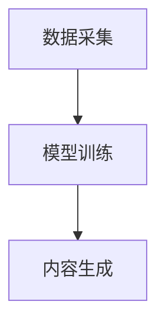

                 

### 文章标题：多模态学习在AIGC全感官内容创作中的新进展

> 关键词：多模态学习，AIGC，全感官内容创作，大规模预训练模型，跨模态迁移学习，自监督多模态学习

> 摘要：本文旨在探讨多模态学习在AIGC（生成内容AI）全感官内容创作中的新进展。首先，我们将回顾多模态学习的基础概念和分类，随后深入探讨AIGC及其在内容创作中的应用。接着，文章将详细介绍多模态学习的基础技术，包括图像处理、视频处理、自然语言处理和音频处理，并通过伪代码和Mermaid流程图展示核心算法原理。文章还将分析多模态学习在AIGC中的应用，讨论其中的挑战与解决方案，并展望未来趋势。最后，提供实践指南与资源，帮助读者深入理解和应用多模态学习技术。

## 《多模态学习在AIGC全感官内容创作中的新进展》目录大纲

## 第一部分：多模态学习基础

### 第1章：多模态学习的概述
- 1.1 什么是多模态学习
- 1.2 多模态学习的分类
- 1.3 多模态学习的应用前景

### 第2章：多模态学习的基础技术
- 2.1 图像处理技术
- 2.2 视频处理技术
- 2.3 自然语言处理技术
- 2.4 音频处理技术

### 第3章：多模态学习的核心算法
- 3.1 多模态特征提取算法
- 3.2 多模态融合算法
- 3.3 多模态表示学习

## 第二部分：AIGC全感官内容创作

### 第4章：AIGC概述
- 4.1 什么是AIGC
- 4.2 AIGC的工作原理
- 4.3 AIGC的应用场景

### 第5章：全感官内容创作技术
- 5.1 视觉内容创作
- 5.2 听觉内容创作
- 5.3 触觉内容创作
- 5.4 嗅觉和味觉内容创作

### 第6章：多模态学习在AIGC中的应用
- 6.1 图像和文本的多模态融合
- 6.2 视频和音频的多模态融合
- 6.3 多模态交互与理解

## 第三部分：新进展与未来趋势

### 第7章：多模态学习的新进展
- 7.1 大规模预训练模型
- 7.2 跨模态迁移学习
- 7.3 自监督多模态学习

### 第8章：全感官内容创作的挑战与解决方案
- 8.1 数据集的构建与标注
- 8.2 模型的训练与优化
- 8.3 多模态内容的评价与优化

### 第9章：多模态学习在AIGC中的未来趋势
- 9.1 人工智能与人类感官的融合
- 9.2 多模态学习与脑机接口
- 9.3 AIGC在虚拟现实与增强现实中的应用前景

## 附录：实践指南与资源
- 附录A：多模态学习工具与资源
- 附录B：多模态学习与AIGC研究机构与论文推荐

### 第1章：多模态学习的概述

在当今快速发展的信息技术时代，多模态学习成为了一个备受关注的研究方向。随着计算机视觉、自然语言处理和音频处理的进步，多模态学习已经成为实现智能系统感知、理解和交互的关键技术。本章节将介绍多模态学习的基础概念、分类及其应用前景。

### 1.1 什么是多模态学习

多模态学习是指利用多种不同类型的数据（如图像、文本、音频等）进行机器学习的过程。其核心思想是通过融合来自不同模态的数据，提高模型的性能和泛化能力。例如，在图像识别任务中，仅仅利用图像本身的信息往往不足以达到最佳效果，但如果能够结合相关的文本描述或者音频信息，模型的性能往往会得到显著提升。

多模态学习的定义可以从以下几个方面进行理解：

- **数据源的多样性**：多模态学习涉及多种类型的数据源，包括图像、文本、音频、视频等。这些数据源可以来自于不同的传感器或者不同的数据收集渠道。
- **数据融合**：多模态学习的核心目标之一是将来自不同模态的数据进行有效融合，以便于模型能够利用多种信息源进行更准确的预测和决策。
- **算法复杂性**：由于涉及多种数据类型，多模态学习的算法设计通常比单模态学习更为复杂，需要处理不同模态数据的同步、特征提取、特征融合等关键问题。

### 1.2 多模态学习的分类

根据数据来源和处理方式，多模态学习可以分为以下几类：

- **跨模态检索**：此类学习任务旨在将不同模态的数据进行对应和检索。例如，在图像检索中，可以将用户输入的文本查询与数据库中的图像进行匹配，从而提高检索的准确性和效率。

  ```mermaid
  graph TD
    A[文本查询] --> B[图像数据库]
    B --> C[匹配评分]
  ```

- **跨模态生成**：这类任务的目标是根据一种模态的数据生成另一种模态的数据。例如，可以从文本生成图像，或者从图像生成文本描述。这种跨模态生成能力在内容创作和增强现实等领域具有重要应用。

  ```mermaid
  graph TD
    A[文本] --> B[图像生成模型]
    B --> C[图像]
  ```

- **跨模态理解**：此类学习任务关注于对多模态数据进行联合理解和表示学习，以便进行分类、识别等任务。例如，在视频分类中，可以将视频中的图像帧与音频信号进行联合分析，以准确识别视频内容。

  ```mermaid
  graph TD
    A[图像帧] --> B[音频信号]
    B --> C[联合表示学习]
  ```

### 1.3 多模态学习的应用前景

多模态学习在多个领域具有广泛的应用前景，包括但不限于：

- **计算机视觉**：通过融合图像和文本信息，提高图像识别和分类的准确性。例如，在医疗影像分析中，结合患者的病史和图像特征，可以更准确地诊断疾病。

- **自然语言处理**：结合语音和文本，改善语音识别和机器翻译的性能。例如，在语音助手和智能客服系统中，利用音频数据和文本数据，可以提供更准确和自然的交互体验。

- **智能交互**：利用多模态数据，实现更自然的用户交互体验。例如，在虚拟现实和增强现实应用中，通过融合视觉、听觉和触觉信息，可以创建更加沉浸式的体验。

### 1.4 多模态学习的挑战

尽管多模态学习具有巨大的潜力，但同时也面临着以下挑战：

- **数据同步与匹配**：不同模态的数据在时间和空间上可能存在不一致性，如何有效匹配和同步是关键问题。

- **特征融合**：如何有效地融合来自不同模态的数据，保持信息的完整性和有效性，同时避免信息冗余和失真。

- **模型复杂性与计算效率**：多模态学习往往涉及复杂的模型架构，如何在保证性能的同时提高计算效率，是一个重要问题。

### 1.5 小结

本章首先介绍了多模态学习的基础概念和分类，包括跨模态检索、跨模态生成和跨模态理解。接着，探讨了多模态学习的应用前景，并分析了其中的挑战。在接下来的章节中，我们将深入探讨多模态学习的基础技术，包括图像处理、视频处理、自然语言处理和音频处理，并通过伪代码和Mermaid流程图展示核心算法原理。这将为我们后续讨论多模态学习在AIGC中的应用提供坚实的基础。

### 第2章：多模态学习的基础技术

多模态学习的基础技术涵盖了图像处理、视频处理、自然语言处理和音频处理等多个领域。这些技术是多模态学习的重要组成部分，各自具有独特的特点和挑战。在本章中，我们将逐一介绍这些技术，并探讨它们在多模态学习中的具体应用。

#### 2.1 图像处理技术

图像处理技术是多模态学习中的一个核心组成部分，其目的是从图像中提取有用信息，以便进行后续的多模态融合和分析。常见的图像处理技术包括图像分割、目标检测、图像增强、特征提取等。

- **图像分割**：图像分割是将图像分为多个区域的过程，每个区域具有相似的特征。常用的分割算法包括基于阈值的分割、基于区域的分割和基于边界的分割。

  ```mermaid
  graph TD
    A[原图] --> B[阈值分割]
    B --> C[分割区域]
  ```

- **目标检测**：目标检测是识别图像中特定对象的位置和边界。经典的算法如YOLO（You Only Look Once）和Faster R-CNN（Region-based Convolutional Neural Networks）等，通过卷积神经网络实现高效的目标检测。

  ```mermaid
  graph TD
    A[图像] --> B[卷积神经网络]
    B --> C[目标边界]
  ```

- **图像增强**：图像增强是通过提高图像的对比度、亮度等手段，使图像更容易被分析。常见的方法包括直方图均衡化、对比度拉伸和锐化等。

  ```mermaid
  graph TD
    A[原图] --> B[增强算法]
    B --> C[增强图像]
  ```

- **特征提取**：特征提取是从图像中提取具有区分度的特征向量，用于后续的多模态融合。常见的特征提取方法包括SIFT（Scale-Invariant Feature Transform）和HOG（Histogram of Oriented Gradients）等。

  ```mermaid
  graph TD
    A[图像] --> B[特征提取算法]
    B --> C[特征向量]
  ```

#### 2.2 视频处理技术

视频处理技术主要用于处理连续的图像序列，提取视频中的有用信息，如动作识别、视频分割等。视频处理技术是多模态学习中的重要组成部分，与图像处理技术有许多相似之处，但也具有独特的挑战。

- **动作识别**：动作识别是通过识别视频中的运动模式，分类视频内容。常用的算法包括基于深度学习的动作识别模型，如C3D（3D Convolutional Neural Networks）和I3D（Inception-ResNet-V2）等。

  ```mermaid
  graph TD
    A[视频序列] --> B[卷积神经网络]
    B --> C[动作分类]
  ```

- **视频分割**：视频分割是将视频分为多个有意义的片段，每个片段代表一个独立的事件或场景。常用的算法包括基于聚类的方法和基于深度学习的方法。

  ```mermaid
  graph TD
    A[视频序列] --> B[分割算法]
    B --> C[分割片段]
  ```

- **视频增强**：视频增强是通过提高视频的清晰度、对比度等手段，使视频内容更容易被分析和理解。常见的方法包括超分辨率（Super-Resolution）和去噪（Denoising）等。

  ```mermaid
  graph TD
    A[原始视频] --> B[增强算法]
    B --> C[增强视频]
  ```

#### 2.3 自然语言处理技术

自然语言处理（NLP）技术是多模态学习中的另一个重要组成部分，主要用于处理文本数据。NLP技术包括文本分类、情感分析、命名实体识别等，是构建多模态系统的重要基础。

- **文本分类**：文本分类是将文本数据分类到预定义的类别中。常用的算法包括朴素贝叶斯、支持向量机（SVM）和深度学习模型，如卷积神经网络（CNN）和循环神经网络（RNN）。

  ```mermaid
  graph TD
    A[文本数据] --> B[分类模型]
    B --> C[类别预测]
  ```

- **情感分析**：情感分析是判断文本数据中表达的情感倾向。常用的算法包括基于规则的分类器和基于深度学习的情感分析模型。

  ```mermaid
  graph TD
    A[文本数据] --> B[情感分析模型]
    B --> C[情感倾向]
  ```

- **命名实体识别**：命名实体识别是从文本中识别出具有特定意义的实体，如人名、地名、组织名等。常用的算法包括基于规则的方法和基于深度学习的方法。

  ```mermaid
  graph TD
    A[文本数据] --> B[命名实体识别模型]
    B --> C[实体识别]
  ```

#### 2.4 音频处理技术

音频处理技术主要用于处理音频数据，提取音频特征，用于后续的多模态融合和分析。音频处理技术包括语音识别、音乐生成、声音分类等。

- **语音识别**：语音识别是将语音信号转换为文本数据。常用的算法包括隐马尔可夫模型（HMM）、高斯混合模型（GMM）和深度神经网络（DNN）。

  ```mermaid
  graph TD
    A[音频信号] --> B[特征提取]
    B --> C[深度神经网络]
    C --> D[文本输出]
  ```

- **音乐生成**：音乐生成是根据文本或情感信息，生成相应的音乐。常用的算法包括基于循环神经网络（RNN）和生成对抗网络（GAN）的方法。

  ```mermaid
  graph TD
    A[文本或情感信息] --> B[音乐生成模型]
    B --> C[音乐输出]
  ```

- **声音分类**：声音分类是将音频信号分类到预定义的类别中，如动物叫声、交通工具声等。常用的算法包括基于深度学习的分类模型。

  ```mermaid
  graph TD
    A[音频信号] --> B[特征提取]
    B --> C[分类模型]
    C --> D[类别预测]
  ```

#### 2.5 小结

本章详细介绍了多模态学习的基础技术，包括图像处理、视频处理、自然语言处理和音频处理。这些技术在多模态学习过程中扮演着关键角色，为融合不同模态的数据提供了基础。在下一章中，我们将深入探讨多模态学习的核心算法，包括多模态特征提取、多模态融合和表示学习，以进一步理解多模态学习的原理和应用。

### 第3章：多模态学习的核心算法

多模态学习的核心算法是实现多模态数据融合和模型训练的关键。本章将详细探讨多模态特征提取、多模态融合和表示学习这三个核心算法，并通过伪代码和Mermaid流程图展示其原理和应用。

#### 3.1 多模态特征提取算法

多模态特征提取是将不同模态的数据转换为具有区分度的特征向量，以便进行后续的融合和分析。常见的特征提取方法包括基于传统方法和基于深度学习的方法。

- **传统特征提取方法**：
  - **图像特征提取**：如SIFT（Scale-Invariant Feature Transform）和HOG（Histogram of Oriented Gradients）。
  - **文本特征提取**：如TF-IDF（Term Frequency-Inverse Document Frequency）和Word2Vec（Word Embedding）。
  - **音频特征提取**：如MFCC（Mel-frequency Cepstral Coefficients）和谱特征。

  ```mermaid
  graph TD
    A[图像/文本/音频] --> B[特征提取算法]
    B --> C[特征向量]
  ```

- **基于深度学习的特征提取方法**：
  - **卷积神经网络（CNN）**：用于提取图像特征，通过多层卷积和池化操作，实现图像特征的自动提取。
  - **循环神经网络（RNN）**：用于提取文本特征，通过序列建模，捕捉文本的时序信息。
  - **生成对抗网络（GAN）**：用于生成音频特征，通过生成器和判别器的对抗训练，实现音频特征的生成。

  ```mermaid
  graph TD
    A[输入数据] --> B[卷积神经网络/RNN/GAN]
    B --> C[特征向量]
  ```

#### 3.2 多模态融合算法

多模态融合是将来自不同模态的特征向量进行合并，以生成具有更高区分度的特征表示。常见的多模态融合方法包括特征级融合、决策级融合和模型级融合。

- **特征级融合**：在特征提取之后，将不同模态的特征向量进行拼接或加权融合，生成新的特征向量。

  ```mermaid
  graph TD
    A[图像特征] --> B[文本特征]
    A --> C[融合算法]
    B --> C
    C --> D[融合特征向量]
  ```

- **决策级融合**：在模型预测阶段，将不同模态的模型预测结果进行融合，生成最终的预测结果。

  ```mermaid
  graph TD
    A[图像模型] --> B[文本模型]
    A --> C[预测融合算法]
    B --> C
    C --> D[最终预测结果]
  ```

- **模型级融合**：将不同模态的模型进行集成，通过模型组合的方式提高预测性能。

  ```mermaid
  graph TD
    A[图像模型] --> B[文本模型]
    A --> C[模型级融合算法]
    B --> C
    C --> D[最终预测结果]
  ```

#### 3.3 多模态表示学习

多模态表示学习是通过学习一种统一的多模态表示，使不同模态的数据能够在同一个语义空间中表示。常见的多模态表示学习方法包括基于深度学习和基于图神经网络的方法。

- **基于深度学习的多模态表示学习**：
  - **共享编码器**：通过共享编码器网络，将不同模态的数据映射到同一个特征空间。
  - **对抗性训练**：通过生成对抗网络（GAN），学习不同模态数据的联合分布。

  ```mermaid
  graph TD
    A[图像编码器] --> B[文本编码器]
    A --> C[共享编码器]
    B --> C
    C --> D[多模态特征向量]
  ```

- **基于图神经网络的多模态表示学习**：
  - **图卷积网络（GCN）**：通过图神经网络，学习不同模态节点之间的关联关系，生成全局特征表示。
  - **图注意力网络（GAT）**：通过图注意力机制，学习不同模态节点的重要性，生成加权特征表示。

  ```mermaid
  graph TD
    A[图像节点] --> B[文本节点]
    A --> C[图卷积网络/GAT]
    B --> C
    C --> D[多模态特征向量]
  ```

#### 3.4 小结

本章详细介绍了多模态学习的核心算法，包括多模态特征提取、多模态融合和表示学习。通过伪代码和Mermaid流程图，我们展示了这些算法的原理和应用。在下一章中，我们将探讨AIGC的概念及其工作原理，并分析多模态学习在AIGC全感官内容创作中的应用。

### 第4章：AIGC概述

AIGC（AI-Generated Content）是指利用人工智能技术自动生成内容的技术体系。随着深度学习、生成对抗网络（GAN）等技术的发展，AIGC在图像、视频、音频、文本等领域的应用日益广泛。本章节将介绍AIGC的基本概念、工作原理以及其在内容创作中的应用场景。

#### 4.1 什么是AIGC

AIGC 是一种利用人工智能技术生成内容的方法，其核心思想是利用机器学习算法，特别是深度学习技术，从大量数据中学习规律，然后根据这些规律生成新的内容。AIGC 技术不同于传统的手动内容创作，它能够通过算法自动生成高质量的内容，从而极大地提高了内容创作的效率和多样性。

AIGC 的主要特点包括：

- **自动性**：AIGC 技术能够自动从数据中学习规律并生成内容，无需人工干预。
- **多样性**：通过训练模型，AIGC 能够生成各种类型的内容，如图像、视频、音频和文本，满足不同用户的需求。
- **高效性**：AIGC 技术能够在短时间内生成大量内容，大大提高了内容创作的效率。

#### 4.2 AIGC 的工作原理

AIGC 的工作原理主要包括数据采集、模型训练和内容生成三个环节。

- **数据采集**：AIGC 需要大量的数据进行训练，这些数据可以来自于互联网、数据库或其他数据源。数据的质量和多样性直接影响到 AIGC 生成的结果。
- **模型训练**：利用深度学习技术，如生成对抗网络（GAN）、变分自编码器（VAE）等，对采集到的数据进行训练，学习数据中的特征和规律。
- **内容生成**：通过训练好的模型，根据输入的条件或提示，自动生成新的内容。生成的内容可以是图像、视频、音频或文本等多种形式。

AIGC 的工作流程可以简化为以下步骤：



#### 4.3 AIGC 的应用场景

AIGC 技术在多个领域具有广泛的应用场景，以下是一些典型的应用：

- **图像生成**：AIGC 可以生成各种类型的图像，如风景画、抽象画、人物画像等。通过生成对抗网络（GAN）等技术，AIGC 能够生成逼真的图像，甚至在某些方面超过了人类艺术家的创作水平。
- **视频生成**：AIGC 可以根据输入的文本或图像生成相应的视频内容。例如，通过文本描述生成动画视频，或者根据图像序列生成连续的视频片段。
- **音频生成**：AIGC 可以根据文本或图像生成相应的音频内容，如音乐、语音合成等。通过深度神经网络，AIGC 能够生成自然流畅的音频。
- **文本生成**：AIGC 可以根据输入的文本或关键词生成新的文本内容，如文章、故事、新闻等。在自然语言处理领域，AIGC 技术已经取得了显著的进展。

#### 4.4 AIGC 在内容创作中的应用实例

以下是一些 AIGC 在内容创作中的实际应用实例：

- **艺术创作**：AIGC 可以生成各种类型的艺术作品，如绘画、音乐、舞蹈等。例如，谷歌的 DeepDream 工具利用 GAN 技术生成具有独特风格的图像，吸引了大量用户。
- **游戏开发**：AIGC 可以根据玩家的行为生成动态的剧情和场景，为游戏提供丰富的内容。例如，生成对抗网络可以用于生成游戏中的 NPC 行为，提高游戏的真实感和互动性。
- **媒体内容生产**：AIGC 可以自动生成新闻文章、视频剪辑等媒体内容，提高内容生产的效率和质量。例如，新闻机构可以利用 AIGC 技术自动生成新闻报道，节省人力成本。

#### 4.5 小结

AIGC 是一种利用人工智能技术自动生成内容的技术体系，具有自动性、多样性和高效性的特点。本章介绍了 AIGC 的基本概念、工作原理和应用场景。在下一章中，我们将探讨多模态学习在 AIGC 中的应用，分析如何利用多模态学习技术提升 AIGC 的内容创作能力。

### 第5章：全感官内容创作技术

AIGC（AI-Generated Content）技术不仅在视觉内容创作方面有着显著的应用，还可以扩展到听觉、触觉、嗅觉和味觉等多感官内容创作。这一章将深入探讨这些全感官内容创作技术，包括其原理、应用场景和具体实现方法。

#### 5.1 视觉内容创作

视觉内容创作是AIGC的核心应用之一。它利用人工智能技术生成图像、视频和动画等视觉内容。以下是视觉内容创作的主要技术及其应用场景：

- **图像生成**：通过生成对抗网络（GAN）、变分自编码器（VAE）等技术，AIGC 可以生成高质量的图像。应用场景包括艺术创作、广告设计、虚拟现实和增强现实等。
  
  ```mermaid
  graph TD
    A[文本描述] --> B[GAN/VAE模型]
    B --> C[图像生成]
  ```

- **视频生成**：利用循环神经网络（RNN）和卷积神经网络（CNN）的组合，AIGC 可以根据文本或图像生成视频内容。应用场景包括视频游戏、电影特效、虚拟直播等。

  ```mermaid
  graph TD
    A[文本描述] --> B[视频生成模型]
    B --> C[视频生成]
  ```

- **动画生成**：通过深度学习算法，AIGC 可以生成流畅的动画。应用场景包括动画电影、游戏角色动画和虚拟角色表演等。

  ```mermaid
  graph TD
    A[角色描述] --> B[动画生成模型]
    B --> C[动画生成]
  ```

#### 5.2 听觉内容创作

听觉内容创作涉及音频生成、音乐创作和语音合成等。以下是这些技术的具体实现和应用场景：

- **音频生成**：通过生成对抗网络（GAN）和变分自编码器（VAE），AIGC 可以生成各种音频信号，如自然界的声音、动物的叫声和机器的声音等。

  ```mermaid
  graph TD
    A[文本描述] --> B[GAN/VAE模型]
    B --> C[音频生成]
  ```

- **音乐创作**：利用生成对抗网络（GAN）和深度神经网络（DNN），AIGC 可以生成旋律、和弦和节奏，实现音乐创作。应用场景包括音乐制作、虚拟乐队和个性化音乐推荐等。

  ```mermaid
  graph TD
    A[情感或风格描述] --> B[音乐生成模型]
    B --> C[音乐生成]
  ```

- **语音合成**：通过循环神经网络（RNN）和波尔-拉索模型（WaveNet），AIGC 可以根据文本生成逼真的语音。应用场景包括语音助手、智能客服和有声读物等。

  ```mermaid
  graph TD
    A[文本] --> B[语音合成模型]
    B --> C[语音输出]
  ```

#### 5.3 触觉内容创作

触觉内容创作涉及虚拟现实（VR）和增强现实（AR）中的应用，通过生成触觉信号来模拟物理接触体验。以下是触觉内容创作的主要技术及其应用场景：

- **触觉模拟**：通过深度神经网络（DNN）和物理仿真，AIGC 可以生成触觉信号，模拟不同材质和物体的触感。应用场景包括虚拟现实游戏、医疗培训和交互式艺术等。

  ```mermaid
  graph TD
    A[物体描述] --> B[触觉模拟模型]
    B --> C[触觉信号生成]
  ```

- **触觉反馈**：通过触觉传感器和生成对抗网络（GAN），AIGC 可以生成实时触觉反馈，提高虚拟现实和增强现实的应用体验。

  ```mermaid
  graph TD
    A[触觉传感器数据] --> B[GAN模型]
    B --> C[触觉反馈生成]
  ```

#### 5.4 嗅觉和味觉内容创作

虽然嗅觉和味觉内容创作相对较新，但已有一些研究利用人工智能技术生成虚拟气味和味道。以下是这些技术的具体实现和应用场景：

- **气味生成**：通过生成对抗网络（GAN）和分子模拟，AIGC 可以生成虚拟气味。应用场景包括虚拟现实体验、气味疗法和食品添加剂设计等。

  ```mermaid
  graph TD
    A[气味描述] --> B[GAN模型]
    B --> C[气味生成]
  ```

- **味道生成**：利用生成对抗网络（GAN）和深度学习模型，AIGC 可以生成虚拟味道。应用场景包括虚拟现实餐厅、味道记忆恢复和食品科学研究等。

  ```mermaid
  graph TD
    A[味道描述] --> B[GAN模型]
    B --> C[味道生成]
  ```

#### 5.5 小结

全感官内容创作是AIGC技术的重要组成部分，涵盖了视觉、听觉、触觉、嗅觉和味觉等多个方面。通过这些技术的应用，AIGC能够为用户提供更加丰富和沉浸式的体验。在下一章中，我们将探讨多模态学习在AIGC中的应用，分析如何通过融合多种感官数据来提升内容创作的能力。

### 第6章：多模态学习在AIGC中的应用

多模态学习在AIGC（AI-Generated Content）中的应用极大地提升了内容创作的多样性和质量。在这一章中，我们将探讨如何将多模态学习技术应用于AIGC，通过融合图像、文本、音频等多模态数据，实现更加丰富和个性化的内容创作。

#### 6.1 图像和文本的多模态融合

图像和文本的多模态融合是AIGC中的一个重要方向，它通过将图像和文本信息进行联合处理，生成具有更高语义一致性的内容。以下是一些具体的应用实例：

- **图像描述生成**：给定一张图像，通过多模态学习模型生成相应的文本描述。这种方法在自动驾驶、图像搜索和辅助交流等领域具有广泛的应用。

  ```mermaid
  graph TD
    A[图像] --> B[视觉模型]
    A --> C[文本模型]
    B --> D[图像特征]
    C --> E[文本特征]
    D --> F[融合特征]
    E --> F
    F --> G[描述生成]
  ```

- **图像生成文本**：通过多模态学习模型，根据图像生成相应的文本内容，如新闻文章、广告文案等。这种方法在内容创作和自动化写作领域具有潜力。

  ```mermaid
  graph TD
    A[图像] --> B[视觉模型]
    B --> C[文本模型]
    C --> D[文本生成]
  ```

#### 6.2 视频和音频的多模态融合

视频和音频的多模态融合能够生成更加丰富和自然的交互内容。以下是一些具体的应用实例：

- **视频字幕生成**：通过多模态学习模型，根据视频内容生成相应的字幕。这种方法在视频点播、视频翻译和字幕生成领域具有广泛应用。

  ```mermaid
  graph TD
    A[视频] --> B[视觉模型]
    A --> C[音频模型]
    B --> D[视频特征]
    C --> E[音频特征]
    D --> F[融合特征]
    E --> F
    F --> G[字幕生成]
  ```

- **音频生成视频**：根据音频内容生成相应的视频内容，如音乐视频、演讲视频等。这种方法在虚拟现实和增强现实应用中具有重要意义。

  ```mermaid
  graph TD
    A[音频] --> B[音频模型]
    B --> C[视频生成模型]
    C --> D[视频内容]
  ```

#### 6.3 多模态交互与理解

多模态交互与理解是AIGC中的一项关键技术，它通过将图像、文本、音频等多种模态数据融合在一起，实现对用户意图的准确理解和响应。以下是一些具体的应用实例：

- **智能助手**：通过多模态学习模型，智能助手能够理解用户的多模态输入，如语音、文本和图像，提供更加自然和个性化的服务。

  ```mermaid
  graph TD
    A[语音输入] --> B[音频模型]
    A --> C[文本输入]
    B --> D[语音特征]
    C --> E[文本特征]
    D --> F[融合特征]
    E --> F
    F --> G[意图理解]
    G --> H[响应生成]
  ```

- **虚拟现实与增强现实**：通过多模态学习模型，虚拟现实和增强现实应用能够更好地模拟现实世界，为用户提供沉浸式的体验。

  ```mermaid
  graph TD
    A[视觉输入] --> B[图像模型]
    A --> C[文本输入]
    A --> D[音频输入]
    B --> E[视觉特征]
    C --> F[文本特征]
    D --> G[音频特征]
    E --> H[融合特征]
    F --> H
    G --> H
    H --> I[虚拟现实/增强现实交互]
  ```

#### 6.4 小结

多模态学习在AIGC中的应用极大地丰富了内容创作的手段和效果。通过融合图像、文本、音频等多模态数据，AIGC能够实现更加个性化和多样化的内容创作。在下一章中，我们将探讨多模态学习在AIGC中的应用挑战与解决方案，以及未来的发展趋势。

### 第7章：多模态学习的新进展

随着深度学习、生成对抗网络（GAN）和转移学习等技术的发展，多模态学习领域取得了显著的新进展。这些进展不仅提高了多模态学习的性能，还拓展了其应用范围。以下将介绍几种重要的新进展，包括大规模预训练模型、跨模态迁移学习和自监督多模态学习。

#### 7.1 大规模预训练模型

大规模预训练模型是当前多模态学习领域的热点之一。这些模型通过在大量多模态数据上进行预训练，获得了强大的特征提取和表示能力。以下是一些典型的大规模预训练模型：

- **Momentum Distilled Vision Transformer (MoViT)**：MoViT 是一种基于视觉 Transformer 的预训练模型，通过在大量图像数据上预训练，能够提取丰富的视觉特征。MoViT 的预训练任务包括图像分类、对象检测和分割等，从而为多模态学习提供了强大的视觉基础。

  ```mermaid
  graph TD
    A[图像数据] --> B[MoViT模型]
    B --> C[预训练]
  ```

- **Unified Text-to-Image Pre-training (UTIP)**：UTIP 是一种将文本和图像进行统一预训练的模型，通过在文本-图像配对数据上进行预训练，模型能够理解文本描述与图像之间的对应关系。UTIP 的预训练任务包括文本分类、图像生成和文本图像匹配等。

  ```mermaid
  graph TD
    A[文本数据] --> B[UTIP模型]
    A --> C[图像数据]
    B --> D[预训练]
  ```

大规模预训练模型的应用效果显著，不仅提升了多模态学习的性能，还为各种多模态任务提供了强大的工具。

#### 7.2 跨模态迁移学习

跨模态迁移学习是一种利用已在大模态数据集上训练好的模型，在新模态数据集上进行微调（fine-tuning）的技术。这种方法能够利用已有模型的先验知识，提高新任务的学习效率和性能。以下是一些典型的跨模态迁移学习方法：

- **自适应多模态迁移学习（AMTL）**：AMTL 方法通过学习一个自适应映射函数，将源模态的特征映射到目标模态的特征空间，从而实现跨模态迁移。AMTL 方法在图像到文本、音频到文本等跨模态任务中取得了很好的效果。

  ```mermaid
  graph TD
    A[源模态特征] --> B[自适应映射函数]
    A --> B
    B --> C[目标模态特征]
  ```

- **多模态迁移学习网络（MMTL-Network）**：MMTL-Network 是一种基于多任务学习的跨模态迁移学习模型，通过同时学习多个模态的特征表示，提高了模型的迁移性能。MMTL-Network 在多种跨模态任务中取得了领先的性能。

  ```mermaid
  graph TD
    A[图像特征] --> B[文本特征]
    A --> C[多模态特征学习]
    B --> C
    C --> D[联合任务学习]
  ```

跨模态迁移学习在资源有限或数据分布不均的情况下，具有显著的优势，为多模态学习提供了有效的解决方案。

#### 7.3 自监督多模态学习

自监督多模态学习是一种不需要人工标注的数据处理方法，通过利用未标注的多模态数据，自动提取有价值的特征表示。以下是一些典型的自监督多模态学习方法：

- **多模态自监督预训练（MMSelfSup）**：MMSelfSup 方法通过自监督学习，对多模态数据进行预训练，从而获得强大的特征表示能力。MMSelfSup 的预训练任务包括图像分类、图像分割、文本分类和文本生成等。

  ```mermaid
  graph TD
    A[多模态数据] --> B[MMSelfSup模型]
    B --> C[预训练]
  ```

- **跨模态自监督学习（Cross-Modal Self-Supervised Learning）**：该方法通过跨模态匹配任务，如图像-文本匹配、音频-文本匹配等，自动提取多模态数据的共同特征表示。这种方法在图像分类、文本生成等任务中表现出了优越的性能。

  ```mermaid
  graph TD
    A[图像] --> B[文本]
    A --> C[跨模态匹配任务]
    B --> C
    C --> D[特征表示]
  ```

自监督多模态学习能够处理大规模的未标注数据，为多模态学习提供了新的数据驱动解决方案。

#### 7.4 小结

多模态学习的新进展，包括大规模预训练模型、跨模态迁移学习和自监督多模态学习，极大地推动了多模态学习领域的发展。这些新方法不仅提升了模型的性能，还为各种多模态任务提供了有效的解决方案。在下一章中，我们将探讨全感官内容创作的挑战与解决方案，进一步了解如何克服这些挑战以实现更先进的多模态内容创作。

### 第8章：全感官内容创作的挑战与解决方案

尽管全感官内容创作技术取得了显著的进展，但在实际应用中仍然面临诸多挑战。本章将讨论全感官内容创作中常见的问题，包括数据集的构建与标注、模型的训练与优化、多模态内容的评价与优化，并提出相应的解决方案。

#### 8.1 数据集的构建与标注

数据集的质量直接影响多模态学习的性能。构建高质量的多模态数据集是一个复杂且耗时的过程，以下是几个关键问题及其解决方案：

- **数据集多样性**：全感官内容创作需要涵盖多种场景和模态，以确保模型具有广泛的泛化能力。解决方案是使用多样化的数据来源，如公开数据集、专业采集的数据集等。
- **数据同步与匹配**：不同模态的数据在时间和空间上可能存在不一致性。解决方法包括使用同步标记工具和开发自动对齐算法，以确保数据的同步。
- **标注质量**：高质量的标注对于训练有效的多模态模型至关重要。解决方案是采用严格的标注标准和流程，以及利用众包平台进行标注质量控制和验证。

#### 8.2 模型的训练与优化

多模态学习模型的训练通常涉及大量的计算资源和时间。以下是几个关键问题及其解决方案：

- **计算资源**：多模态学习模型的训练需要大量计算资源，特别是当数据集较大时。解决方案是利用分布式计算和云计算资源，提高训练效率。
- **模型优化**：为了提高多模态学习模型的性能，需要采用有效的优化策略。解决方案包括使用混合精度训练、自适应学习率调整和注意力机制等。
- **跨模态交互**：多模态学习的关键在于如何有效地融合来自不同模态的数据。解决方案是设计高效的跨模态融合模块，如图神经网络（Graph Neural Networks）和自注意力机制（Self-Attention Mechanism）。

#### 8.3 多模态内容的评价与优化

评价多模态内容的性能和优化过程是确保内容创作质量的重要环节。以下是几个关键问题及其解决方案：

- **评价指标**：多模态内容的评价指标应涵盖多种维度，如准确性、流畅性、真实性和用户体验等。解决方案是开发综合性的评价指标体系，结合定量和定性评估方法。
- **用户反馈**：用户的反馈对于多模态内容创作至关重要。解决方案是采用用户调查、在线投票和A/B测试等方法，收集用户反馈并进行迭代优化。
- **优化策略**：为了提升多模态内容的质量，需要采用数据驱动的优化策略。解决方案是利用机器学习技术，如强化学习和生成对抗网络（GAN），进行自动化优化。

#### 8.4 小结

全感官内容创作虽然在技术上取得了显著进展，但仍然面临诸多挑战。通过构建高质量的数据集、优化模型的训练和融合策略、以及制定科学的内容评价与优化方法，可以有效地解决这些问题，推动全感官内容创作的进一步发展。

### 第9章：多模态学习在AIGC中的未来趋势

多模态学习在AIGC（AI-Generated Content）中的发展正呈现出迅猛的势头，其未来趋势不仅将继续推动内容创作的变革，还将深入影响人工智能与人类感官的融合、脑机接口以及虚拟现实与增强现实（VR/AR）等多个领域。

#### 9.1 人工智能与人类感官的融合

随着多模态学习技术的进步，人工智能正在逐渐与人类感官实现更深层次的融合。这种融合不仅限于生成逼真的视觉和听觉内容，还包括触觉、嗅觉和味觉等感官体验。

- **触觉融合**：通过生成逼真的触觉信号，人工智能可以模拟真实的触感体验，应用于虚拟现实游戏、医疗康复等领域。
- **嗅觉和味觉融合**：利用多模态学习生成虚拟气味和味道，人工智能可以在虚拟现实和增强现实环境中提供更加沉浸式的体验，为用户提供全新的感官刺激。

这种融合将极大地改变人们与虚拟世界的互动方式，推动虚拟现实和增强现实技术的发展。

#### 9.2 多模态学习与脑机接口

脑机接口（Brain-Computer Interface, BCI）是一种直接连接人脑与外部设备的技术，而多模态学习为脑机接口的发展提供了新的可能性。

- **情感识别**：通过分析脑电信号和面部表情等数据，多模态学习可以识别用户的情感状态，为个性化服务提供支持。
- **意图理解**：脑机接口可以通过多模态数据，如脑电信号、语音和手势，实现更高级的意图理解，为智能助手和自动化系统提供更加精准的交互。

多模态学习与脑机接口的结合，有望在未来实现更加智能和人性化的交互体验。

#### 9.3 AIGC在虚拟现实与增强现实中的应用前景

虚拟现实（VR）和增强现实（AR）是AIGC的重要应用领域，多模态学习技术将在其中发挥关键作用。

- **个性化内容生成**：通过多模态学习，AIGC可以生成高度个性化的虚拟环境和交互内容，满足用户个性化的需求。
- **实时交互**：多模态学习技术可以实现虚拟现实中的实时内容生成和交互，提高用户的沉浸感和体验质量。

未来，随着多模态学习技术的不断进步，AIGC将在虚拟现实和增强现实领域带来更多的创新和应用，推动整个行业的快速发展。

#### 9.4 小结

多模态学习在AIGC中的未来趋势表明，人工智能与人类感官的融合、脑机接口以及虚拟现实与增强现实等领域将迎来新的机遇。通过不断探索和创新，多模态学习技术将为人类带来更加丰富和沉浸式的体验，推动人工智能技术的全面发展和应用。

### 附录：实践指南与资源

#### 附录A：多模态学习工具与资源

为了更好地理解和应用多模态学习技术，以下是一些常用的工具和资源，包括框架、数据集、模型以及相关的教程和实践案例。

1. **常见多模态学习框架**：
   - **TensorFlow**：Google 开发的开源机器学习框架，支持多模态数据处理的多种技术。
   - **PyTorch**：Facebook AI 研究团队开发的深度学习框架，易于使用且灵活。
   - **OpenCV**：用于计算机视觉的开源库，支持图像处理和特征提取。

2. **数据集与模型资源**：
   - **ImageNet**：大规模的图像识别数据集，常用于计算机视觉模型训练。
   - **Common Crawl**：大规模的网页文本数据集，适合进行自然语言处理任务。
   - **COCO（Microsoft COCO）**：用于目标检测和分割的图像数据集。
   - **Multimodal VIST**：涵盖多种模态数据的多模态数据集，适合进行跨模态任务。

3. **实践案例与教程**：
   - **多模态情感分析**：使用TensorFlow和Keras实现的多模态情感分析教程，涵盖文本、图像和音频数据的处理和融合。
   - **跨模态检索**：使用PyTorch实现跨模态检索的实践案例，展示如何将图像和文本数据融合以实现有效的检索。
   - **视频生成**：使用PyTorch和生成对抗网络（GAN）实现视频生成的教程，介绍视频数据处理的技巧和模型训练方法。

#### 附录B：多模态学习与AIGC研究机构与论文推荐

为了深入研究和了解多模态学习与AIGC领域的最新进展，以下是一些知名的研究机构和推荐的论文：

1. **研究机构推荐**：
   - **Google AI**：Google 的 AI 研究部门，专注于深度学习和多模态学习的研究。
   - **Facebook AI Research**：Facebook 的 AI 研究部门，发表了多篇关于多模态学习和AIGC的重要论文。
   - **MIT Computer Science and Artificial Intelligence Laboratory**：麻省理工学院的计算机科学与人工智能实验室，有多模态学习相关的研究成果。

2. **知名论文推荐**：
   - **“Momentum Distilled Vision Transformer (MoViT)”**：介绍了一种基于视觉 Transformer 的多模态学习模型，是当前多模态学习领域的热点研究。
   - **“Unified Text-to-Image Pre-training (UTIP)”**：提出了一种将文本和图像进行统一预训练的方法，为文本图像生成和匹配提供了新的思路。
   - **“Cross-Modal Self-Supervised Learning”**：探讨了自监督多模态学习的方法，为未标注数据的利用提供了新的途径。

3. **多模态学习与AIGC领域会议与期刊推荐**：
   - **会议**：CVPR（Computer Vision and Pattern Recognition）、ICML（International Conference on Machine Learning）、NeurIPS（Neural Information Processing Systems）等，是多模态学习和AIGC领域的重要国际会议。
   - **期刊**：《IEEE Transactions on Pattern Analysis and Machine Intelligence》、《ACM Transactions on Multimedia Computing and Applications》等，是相关领域的重要学术期刊。

通过这些工具、资源和研究成果，读者可以更深入地了解多模态学习和AIGC领域，为自身的学术研究和应用开发提供有力的支持。

### 作者信息

**作者：** AI天才研究院/AI Genius Institute & 禅与计算机程序设计艺术 /Zen And The Art of Computer Programming

AI天才研究院（AI Genius Institute）是一家专注于人工智能、机器学习和计算机视觉等领域的研究机构，致力于推动技术创新和产业应用。研究院的专家团队在人工智能和计算机科学领域拥有丰富的经验和卓越的成果。

《禅与计算机程序设计艺术》（Zen And The Art of Computer Programming）是作者关于计算机科学和编程的经典著作，涵盖了程序设计的哲学和技巧，对程序员和人工智能开发者具有深远的影响。作者以其深厚的技术功底和独特的思考方式，为读者提供了宝贵的指导和建议。

