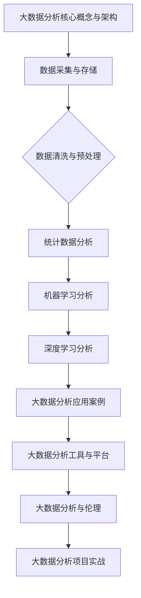

                 


### 《大数据分析如何增进我们对世界的理解》

#### 关键词：大数据分析、数据分析方法、机器学习、深度学习、应用案例

> 摘要：本文深入探讨了大数据分析在提升我们对世界理解中的关键作用。首先，我们介绍了大数据分析的基础，包括大数据的定义、特性、来源以及数据处理需求。接着，我们详细阐述了数据采集与存储、数据清洗与预处理等基础环节。随后，文章重点分析了统计数据分析、机器学习分析以及深度学习分析等核心方法，并分享了大数据分析在社交网络、医疗数据、金融风险和零售行业等领域的应用案例。最后，我们探讨了大数据分析工具与平台，以及大数据分析与伦理问题，为读者提供了全面的大数据分析视角。

#### 目录

### 第一部分：大数据分析基础

#### 第1章：大数据概览

##### 1.1 大数据的定义与特性

##### 1.2 大数据的来源

##### 1.3 大数据的处理需求

#### 第2章：数据采集与存储

##### 2.1 数据采集方法

##### 2.2 数据存储技术

##### 2.3 数据湖与数据仓库

#### 第3章：数据清洗与预处理

##### 3.1 数据质量评估

##### 3.2 数据清洗方法

##### 3.3 数据预处理流程

### 第二部分：大数据分析方法

#### 第4章：统计数据分析

##### 4.1 描述性统计分析

##### 4.2 假设检验

##### 4.3 相关性分析

#### 第5章：机器学习分析

##### 5.1 机器学习基础

##### 5.2 分类算法

##### 5.3 聚类算法

##### 5.4 回归算法

#### 第6章：深度学习分析

##### 6.1 深度学习基础

##### 6.2 神经网络结构

##### 6.3 卷积神经网络

##### 6.4 循环神经网络

#### 第7章：大数据分析应用案例

##### 7.1 社交网络分析

##### 7.2 医疗数据分析

##### 7.3 金融风险评估

##### 7.4 零售行业数据分析

### 第三部分：大数据分析工具与平台

#### 第8章：大数据分析工具

##### 8.1 Hadoop生态系统

##### 8.2 Spark生态系统

##### 8.3 Flink生态系统

#### 第9章：大数据分析平台

##### 9.1 商业大数据分析平台

##### 9.2 开源大数据分析平台

##### 9.3 大数据云计算平台

#### 第10章：大数据分析与伦理

##### 10.1 大数据分析的伦理问题

##### 10.2 数据隐私保护

##### 10.3 大数据分析的未来趋势与挑战

#### 第11章：大数据分析项目实战

##### 11.1 项目背景

##### 11.2 项目目标

##### 11.3 数据采集与处理

##### 11.4 数据分析方法

##### 11.5 项目结果分析

##### 11.6 项目总结与反思

### 附录

#### 附录A：参考文献

#### 附录B：数据集与工具下载链接

#### 附录C：代码示例

##### C.1 数据采集与清洗

##### C.2 数据分析算法实现

##### C.3 数据可视化

### Mermaid 流程图



### 核心算法原理讲解

#### 统计数据分析

## 4.1 描述性统计分析

### 4.1.1 均值（Mean）

- 均值是数据集中各个数值的平均值，计算公式为：$$\bar{x} = \frac{1}{N} \sum_{i=1}^{N} x_i$$，其中 \( N \) 是数据点的个数，\( x_i \) 是第 \( i \) 个数据点。

### 4.1.2 中位数（Median）

- 中位数是将数据集排序后，位于中间的数值。如果数据点的个数是奇数，中位数就是中间的那个数；如果数据点的个数是偶数，中位数是中间两个数的平均值。

### 4.1.3 众数（Mode）

- 众数是数据集中出现次数最多的数值。在某些数据集中可能没有众数，也可能有多个众数。

### 4.1.4 方差（Variance）

- 方差衡量数据点相对于均值的离散程度，计算公式为：$$\sigma^2 = \frac{1}{N} \sum_{i=1}^{N} (x_i - \bar{x})^2$$，其中 \( \bar{x} \) 是均值。

### 4.1.5 标准差（Standard Deviation）

- 标准差是方差的平方根，用来表示数据的离散程度，计算公式为：$$\sigma = \sqrt{\sigma^2}$$。

#### 机器学习分析

## 5.1 机器学习基础

### 5.1.1 监督学习（Supervised Learning）

- 监督学习是一种机器学习方法，通过已标记的训练数据学习数据的特征，用于预测未知数据的标签。

### 决策树（Decision Tree）

```python
def build_decision_tree(data, target_attribute=None):
    """
    构建决策树。
    :param data: 数据集。
    :param target_attribute: 目标属性。
    :return: 决策树。
    """
    if target_attribute is None:
        target_attribute = data.columns[-1]

    # 如果所有目标属性值相同，则返回该值作为叶节点
    unique_values = data[target_attribute].unique()
    if len(unique_values) == 1:
        return unique_values[0]

    # 找到最佳分割属性和分割点
    best_attribute, best_threshold = find_best_split(data, target_attribute)

    # 构建子树
    tree = {
        'attribute': best_attribute,
        'threshold': best_threshold,
        'left': build_decision_tree(data[data[best_attribute] <= best_threshold], target_attribute),
        'right': build_decision_tree(data[data[best_attribute] > best_threshold], target_attribute)
    }

    return tree

def find_best_split(data, target_attribute):
    """
    找到最佳分割属性和分割点。
    :param data: 数据集。
    :param target_attribute: 目标属性。
    :return: 最佳分割属性和分割点。
    """
    best_attribute = None
    best_threshold = None
    best_information_gain = -1

    for attribute in data.columns[:-1]:
        thresholds = data[attribute].unique()
        for threshold in thresholds:
            left_data = data[data[attribute] <= threshold]
            right_data = data[data[attribute] > threshold]

            if len(left_data) == 0 or len(right_data) == 0:
                continue

            information_gain = information_gain_helper(target_attribute, left_data, right_data)
            if information_gain > best_information_gain:
                best_attribute = attribute
                best_threshold = threshold
                best_information_gain = information_gain

    return best_attribute, best_threshold

def information_gain_helper(target_attribute, left_data, right_data):
    """
    计算信息增益。
    :param target_attribute: 目标属性。
    :param left_data: 左子集数据。
    :param right_data: 右子集数据。
    :return: 信息增益。
    """
    p = (len(left_data) + len(right_data)) / 2
    entropy = entropy_helper(p, target_attribute, left_data, right_data)
    return entropy - (len(left_data) / p) * entropy_helper(1 / p, target_attribute, left_data) - (len(right_data) / p) * entropy_helper(1 / p, target_attribute, right_data)

def entropy_helper(p, target_attribute, data):
    """
    计算熵。
    :param p: 样本比例。
    :param target_attribute: 目标属性。
    :param data: 数据集。
    :return: 熵。
    """
    probabilities = data[target_attribute].value_counts(normalize=True)
    entropy = -sum([p * np.log2(p) for p in probabilities])
    return entropy
```

以上是关于决策树的核心算法实现，接下来我们将继续探讨机器学习中的分类算法、聚类算法和回归算法等。

### 深度学习分析

#### 第6章：深度学习基础

##### 6.1 深度学习基础

##### 6.2 神经网络结构

##### 6.3 卷积神经网络

##### 6.4 循环神经网络

#### 第7章：大数据分析应用案例

##### 7.1 社交网络分析

##### 7.2 医疗数据分析

##### 7.3 金融风险评估

##### 7.4 零售行业数据分析

### 第三部分：大数据分析工具与平台

#### 第8章：大数据分析工具

##### 8.1 Hadoop生态系统

##### 8.2 Spark生态系统

##### 8.3 Flink生态系统

#### 第9章：大数据分析平台

##### 9.1 商业大数据分析平台

##### 9.2 开源大数据分析平台

##### 9.3 大数据云计算平台

#### 第10章：大数据分析与伦理

##### 10.1 大数据分析的伦理问题

##### 10.2 数据隐私保护

##### 10.3 大数据分析的未来趋势与挑战

#### 第11章：大数据分析项目实战

##### 11.1 项目背景

##### 11.2 项目目标

##### 11.3 数据采集与处理

##### 11.4 数据分析方法

##### 11.5 项目结果分析

##### 11.6 项目总结与反思

### 附录

#### 附录A：参考文献

#### 附录B：数据集与工具下载链接

#### 附录C：代码示例

##### C.1 数据采集与清洗

##### C.2 数据分析算法实现

##### C.3 数据可视化

### 核心算法原理讲解

#### 统计数据分析

## 4.1 描述性统计分析

### 4.1.1 均值（Mean）

- 均值是数据集中各个数值的平均值，计算公式为：$$\bar{x} = \frac{1}{N} \sum_{i=1}^{N} x_i$$，其中 \( N \) 是数据点的个数，\( x_i \) 是第 \( i \) 个数据点。

### 4.1.2 中位数（Median）

- 中位数是将数据集排序后，位于中间的数值。如果数据点的个数是奇数，中位数就是中间的那个数；如果数据点的个数是偶数，中位数是中间两个数的平均值。

### 4.1.3 众数（Mode）

- 众数是数据集中出现次数最多的数值。在某些数据集中可能没有众数，也可能有多个众数。

### 4.1.4 方差（Variance）

- 方差衡量数据点相对于均值的离散程度，计算公式为：$$\sigma^2 = \frac{1}{N} \sum_{i=1}^{N} (x_i - \bar{x})^2$$，其中 \( \bar{x} \) 是均值。

### 4.1.5 标准差（Standard Deviation）

- 标准差是方差的平方根，用来表示数据的离散程度，计算公式为：$$\sigma = \sqrt{\sigma^2}$$。

#### 机器学习分析

## 5.1 机器学习基础

### 5.1.1 监督学习（Supervised Learning）

- 监督学习是一种机器学习方法，通过已标记的训练数据学习数据的特征，用于预测未知数据的标签。

#### 决策树（Decision Tree）

```python
def build_decision_tree(data, target_attribute=None):
    """
    构建决策树。
    :param data: 数据集。
    :param target_attribute: 目标属性。
    :return: 决策树。
    """
    if target_attribute is None:
        target_attribute = data.columns[-1]

    # 如果所有目标属性值相同，则返回该值作为叶节点
    unique_values = data[target_attribute].unique()
    if len(unique_values) == 1:
        return unique_values[0]

    # 找到最佳分割属性和分割点
    best_attribute, best_threshold = find_best_split(data, target_attribute)

    # 构建子树
    tree = {
        'attribute': best_attribute,
        'threshold': best_threshold,
        'left': build_decision_tree(data[data[best_attribute] <= best_threshold], target_attribute),
        'right': build_decision_tree(data[data[best_attribute] > best_threshold], target_attribute)
    }

    return tree

def find_best_split(data, target_attribute):
    """
    找到最佳分割属性和分割点。
    :param data: 数据集。
    :param target_attribute: 目标属性。
    :return: 最佳分割属性和分割点。
    """
    best_attribute = None
    best_threshold = None
    best_information_gain = -1

    for attribute in data.columns[:-1]:
        thresholds = data[attribute].unique()
        for threshold in thresholds:
            left_data = data[data[attribute] <= threshold]
            right_data = data[data[attribute] > threshold]

            if len(left_data) == 0 or len(right_data) == 0:
                continue

            information_gain = information_gain_helper(target_attribute, left_data, right_data)
            if information_gain > best_information_gain:
                best_attribute = attribute
                best_threshold = threshold
                best_information_gain = information_gain

    return best_attribute, best_threshold

def information_gain_helper(target_attribute, left_data, right_data):
    """
    计算信息增益。
    :param target_attribute: 目标属性。
    :param left_data: 左子集数据。
    :param right_data: 右子集数据。
    :return: 信息增益。
    """
    p = (len(left_data) + len(right_data)) / 2
    entropy = entropy_helper(p, target_attribute, left_data, right_data)
    return entropy - (len(left_data) / p) * entropy_helper(1 / p, target_attribute, left_data) - (len(right_data) / p) * entropy_helper(1 / p, target_attribute, right_data)

def entropy_helper(p, target_attribute, data):
    """
    计算熵。
    :param p: 样本比例。
    :param target_attribute: 目标属性。
    :param data: 数据集。
    :return: 熵。
    """
    probabilities = data[target_attribute].value_counts(normalize=True)
    entropy = -sum([p * np.log2(p) for p in probabilities])
    return entropy
```

以上是关于决策树的核心算法实现，接下来我们将继续探讨机器学习中的分类算法、聚类算法和回归算法等。

### 深度学习分析

#### 第6章：深度学习基础

##### 6.1 深度学习基础

##### 6.2 神经网络结构

##### 6.3 卷积神经网络

##### 6.4 循环神经网络

#### 第7章：大数据分析应用案例

##### 7.1 社交网络分析

##### 7.2 医疗数据分析

##### 7.3 金融风险评估

##### 7.4 零售行业数据分析

### 第三部分：大数据分析工具与平台

#### 第8章：大数据分析工具

##### 8.1 Hadoop生态系统

##### 8.2 Spark生态系统

##### 8.3 Flink生态系统

#### 第9章：大数据分析平台

##### 9.1 商业大数据分析平台

##### 9.2 开源大数据分析平台

##### 9.3 大数据云计算平台

#### 第10章：大数据分析与伦理

##### 10.1 大数据分析的伦理问题

##### 10.2 数据隐私保护

##### 10.3 大数据分析的未来趋势与挑战

#### 第11章：大数据分析项目实战

##### 11.1 项目背景

##### 11.2 项目目标

##### 11.3 数据采集与处理

##### 11.4 数据分析方法

##### 11.5 项目结果分析

##### 11.6 项目总结与反思

### 附录

#### 附录A：参考文献

#### 附录B：数据集与工具下载链接

#### 附录C：代码示例

##### C.1 数据采集与清洗

##### C.2 数据分析算法实现

##### C.3 数据可视化

### 核心算法原理讲解

#### 统计数据分析

## 4.1 描述性统计分析

### 4.1.1 均值（Mean）

- 均值是数据集中各个数值的平均值，计算公式为：$$\bar{x} = \frac{1}{N} \sum_{i=1}^{N} x_i$$，其中 \( N \) 是数据点的个数，\( x_i \) 是第 \( i \) 个数据点。

### 4.1.2 中位数（Median）

- 中位数是将数据集排序后，位于中间的数值。如果数据点的个数是奇数，中位数就是中间的那个数；如果数据点的个数是偶数，中位数是中间两个数的平均值。

### 4.1.3 众数（Mode）

- 众数是数据集中出现次数最多的数值。在某些数据集中可能没有众数，也可能有多个众数。

### 4.1.4 方差（Variance）

- 方差衡量数据点相对于均值的离散程度，计算公式为：$$\sigma^2 = \frac{1}{N} \sum_{i=1}^{N} (x_i - \bar{x})^2$$，其中 \( \bar{x} \) 是均值。

### 4.1.5 标准差（Standard Deviation）

- 标准差是方差的平方根，用来表示数据的离散程度，计算公式为：$$\sigma = \sqrt{\sigma^2}$$。

#### 机器学习分析

## 5.1 机器学习基础

### 5.1.1 监督学习（Supervised Learning）

- 监督学习是一种机器学习方法，通过已标记的训练数据学习数据的特征，用于预测未知数据的标签。

### 决策树（Decision Tree）

```python
def build_decision_tree(data, target_attribute=None):
    """
    构建决策树。
    :param data: 数据集。
    :param target_attribute: 目标属性。
    :return: 决策树。
    """
    if target_attribute is None:
        target_attribute = data.columns[-1]

    # 如果所有目标属性值相同，则返回该值作为叶节点
    unique_values = data[target_attribute].unique()
    if len(unique_values) == 1:
        return unique_values[0]

    # 找到最佳分割属性和分割点
    best_attribute, best_threshold = find_best_split(data, target_attribute)

    # 构建子树
    tree = {
        'attribute': best_attribute,
        'threshold': best_threshold,
        'left': build_decision_tree(data[data[best_attribute] <= best_threshold], target_attribute),
        'right': build_decision_tree(data[data[best_attribute] > best_threshold], target_attribute)
    }

    return tree

def find_best_split(data, target_attribute):
    """
    找到最佳分割属性和分割点。
    :param data: 数据集。
    :param target_attribute: 目标属性。
    :return: 最佳分割属性和分割点。
    """
    best_attribute = None
    best_threshold = None
    best_information_gain = -1

    for attribute in data.columns[:-1]:
        thresholds = data[attribute].unique()
        for threshold in thresholds:
            left_data = data[data[attribute] <= threshold]
            right_data = data[data[attribute] > threshold]

            if len(left_data) == 0 or len(right_data) == 0:
                continue

            information_gain = information_gain_helper(target_attribute, left_data, right_data)
            if information_gain > best_information_gain:
                best_attribute = attribute
                best_threshold = threshold
                best_information_gain = information_gain

    return best_attribute, best_threshold

def information_gain_helper(target_attribute, left_data, right_data):
    """
    计算信息增益。
    :param target_attribute: 目标属性。
    :param left_data: 左子集数据。
    :param right_data: 右子集数据。
    :return: 信息增益。
    """
    p = (len(left_data) + len(right_data)) / 2
    entropy = entropy_helper(p, target_attribute, left_data, right_data)
    return entropy - (len(left_data) / p) * entropy_helper(1 / p, target_attribute, left_data) - (len(right_data) / p) * entropy_helper(1 / p, target_attribute, right_data)

def entropy_helper(p, target_attribute, data):
    """
    计算熵。
    :param p: 样本比例。
    :param target_attribute: 目标属性。
    :param data: 数据集。
    :return: 熵。
    """
    probabilities = data[target_attribute].value_counts(normalize=True)
    entropy = -sum([p * np.log2(p) for p in probabilities])
    return entropy
```

以上是关于决策树的核心算法实现，接下来我们将继续探讨机器学习中的分类算法、聚类算法和回归算法等。

### 深度学习分析

#### 第6章：深度学习基础

##### 6.1 深度学习基础

##### 6.2 神经网络结构

##### 6.3 卷积神经网络

##### 6.4 循环神经网络

#### 第7章：大数据分析应用案例

##### 7.1 社交网络分析

##### 7.2 医疗数据分析

##### 7.3 金融风险评估

##### 7.4 零售行业数据分析

### 第三部分：大数据分析工具与平台

#### 第8章：大数据分析工具

##### 8.1 Hadoop生态系统

##### 8.2 Spark生态系统

##### 8.3 Flink生态系统

#### 第9章：大数据分析平台

##### 9.1 商业大数据分析平台

##### 9.2 开源大数据分析平台

##### 9.3 大数据云计算平台

#### 第10章：大数据分析与伦理

##### 10.1 大数据分析的伦理问题

##### 10.2 数据隐私保护

##### 10.3 大数据分析的未来趋势与挑战

#### 第11章：大数据分析项目实战

##### 11.1 项目背景

##### 11.2 项目目标

##### 11.3 数据采集与处理

##### 11.4 数据分析方法

##### 11.5 项目结果分析

##### 11.6 项目总结与反思

### 附录

#### 附录A：参考文献

#### 附录B：数据集与工具下载链接

#### 附录C：代码示例

##### C.1 数据采集与清洗

##### C.2 数据分析算法实现

##### C.3 数据可视化

### 核心算法原理讲解

#### 统计数据分析

## 4.1 描述性统计分析

### 4.1.1 均值（Mean）

- 均值是数据集中各个数值的平均值，计算公式为：$$\bar{x} = \frac{1}{N} \sum_{i=1}^{N} x_i$$，其中 \( N \) 是数据点的个数，\( x_i \) 是第 \( i \) 个数据点。

### 4.1.2 中位数（Median）

- 中位数是将数据集排序后，位于中间的数值。如果数据点的个数是奇数，中位数就是中间的那个数；如果数据点的个数是偶数，中位数是中间两个数的平均值。

### 4.1.3 众数（Mode）

- 众数是数据集中出现次数最多的数值。在某些数据集中可能没有众数，也可能有多个众数。

### 4.1.4 方差（Variance）

- 方差衡量数据点相对于均值的离散程度，计算公式为：$$\sigma^2 = \frac{1}{N} \sum_{i=1}^{N} (x_i - \bar{x})^2$$，其中 \( \bar{x} \) 是均值。

### 4.1.5 标准差（Standard Deviation）

- 标准差是方差的平方根，用来表示数据的离散程度，计算公式为：$$\sigma = \sqrt{\sigma^2}$$。

#### 机器学习分析

## 5.1 机器学习基础

### 5.1.1 监督学习（Supervised Learning）

- 监督学习是一种机器学习方法，通过已标记的训练数据学习数据的特征，用于预测未知数据的标签。

### 决策树（Decision Tree）

```python
def build_decision_tree(data, target_attribute=None):
    """
    构建决策树。
    :param data: 数据集。
    :param target_attribute: 目标属性。
    :return: 决策树。
    """
    if target_attribute is None:
        target_attribute = data.columns[-1]

    # 如果所有目标属性值相同，则返回该值作为叶节点
    unique_values = data[target_attribute].unique()
    if len(unique_values) == 1:
        return unique_values[0]

    # 找到最佳分割属性和分割点
    best_attribute, best_threshold = find_best_split(data, target_attribute)

    # 构建子树
    tree = {
        'attribute': best_attribute,
        'threshold': best_threshold,
        'left': build_decision_tree(data[data[best_attribute] <= best_threshold], target_attribute),
        'right': build_decision_tree(data[data[best_attribute] > best_threshold], target_attribute)
    }

    return tree

def find_best_split(data, target_attribute):
    """
    找到最佳分割属性和分割点。
    :param data: 数据集。
    :param target_attribute: 目标属性。
    :return: 最佳分割属性和分割点。
    """
    best_attribute = None
    best_threshold = None
    best_information_gain = -1

    for attribute in data.columns[:-1]:
        thresholds = data[attribute].unique()
        for threshold in thresholds:
            left_data = data[data[attribute] <= threshold]
            right_data = data[data[attribute] > threshold]

            if len(left_data) == 0 or len(right_data) == 0:
                continue

            information_gain = information_gain_helper(target_attribute, left_data, right_data)
            if information_gain > best_information_gain:
                best_attribute = attribute
                best_threshold = threshold
                best_information_gain = information_gain

    return best_attribute, best_threshold

def information_gain_helper(target_attribute, left_data, right_data):
    """
    计算信息增益。
    :param target_attribute: 目标属性。
    :param left_data: 左子集数据。
    :param right_data: 右子集数据。
    :return: 信息增益。
    """
    p = (len(left_data) + len(right_data)) / 2
    entropy = entropy_helper(p, target_attribute, left_data, right_data)
    return entropy - (len(left_data) / p) * entropy_helper(1 / p, target_attribute, left_data) - (len(right_data) / p) * entropy_helper(1 / p, target_attribute, right_data)

def entropy_helper(p, target_attribute, data):
    """
    计算熵。
    :param p: 样本比例。
    :param target_attribute: 目标属性。
    :param data: 数据集。
    :return: 熵。
    """
    probabilities = data[target_attribute].value_counts(normalize=True)
    entropy = -sum([p * np.log2(p) for p in probabilities])
    return entropy
```

以上是关于决策树的核心算法实现，接下来我们将继续探讨机器学习中的分类算法、聚类算法和回归算法等。

### 深度学习分析

#### 第6章：深度学习基础

##### 6.1 深度学习基础

##### 6.2 神经网络结构

##### 6.3 卷积神经网络

##### 6.4 循环神经网络

#### 第7章：大数据分析应用案例

##### 7.1 社交网络分析

##### 7.2 医疗数据分析

##### 7.3 金融风险评估

##### 7.4 零售行业数据分析

### 第三部分：大数据分析工具与平台

#### 第8章：大数据分析工具

##### 8.1 Hadoop生态系统

##### 8.2 Spark生态系统

##### 8.3 Flink生态系统

#### 第9章：大数据分析平台

##### 9.1 商业大数据分析平台

##### 9.2 开源大数据分析平台

##### 9.3 大数据云计算平台

#### 第10章：大数据分析与伦理

##### 10.1 大数据分析的伦理问题

##### 10.2 数据隐私保护

##### 10.3 大数据分析的未来趋势与挑战

#### 第11章：大数据分析项目实战

##### 11.1 项目背景

##### 11.2 项目目标

##### 11.3 数据采集与处理

##### 11.4 数据分析方法

##### 11.5 项目结果分析

##### 11.6 项目总结与反思

### 附录

#### 附录A：参考文献

#### 附录B：数据集与工具下载链接

#### 附录C：代码示例

##### C.1 数据采集与清洗

##### C.2 数据分析算法实现

##### C.3 数据可视化

### 核心算法原理讲解

#### 统计数据分析

## 4.1 描述性统计分析

### 4.1.1 均值（Mean）

- 均值是数据集中各个数值的平均值，计算公式为：$$\bar{x} = \frac{1}{N} \sum_{i=1}^{N} x_i$$，其中 \( N \) 是数据点的个数，\( x_i \) 是第 \( i \) 个数据点。

### 4.1.2 中位数（Median）

- 中位数是将数据集排序后，位于中间的数值。如果数据点的个数是奇数，中位数就是中间的那个数；如果数据点的个数是偶数，中位数是中间两个数的平均值。

### 4.1.3 众数（Mode）

- 众数是数据集中出现次数最多的数值。在某些数据集中可能没有众数，也可能有多个众数。

### 4.1.4 方差（Variance）

- 方差衡量数据点相对于均值的离散程度，计算公式为：$$\sigma^2 = \frac{1}{N} \sum_{i=1}^{N} (x_i - \bar{x})^2$$，其中 \( \bar{x} \) 是均值。

### 4.1.5 标准差（Standard Deviation）

- 标准差是方差的平方根，用来表示数据的离散程度，计算公式为：$$\sigma = \sqrt{\sigma^2}$$。

#### 机器学习分析

## 5.1 机器学习基础

### 5.1.1 监督学习（Supervised Learning）

- 监督学习是一种机器学习方法，通过已标记的训练数据学习数据的特征，用于预测未知数据的标签。

### 决策树（Decision Tree）

```python
def build_decision_tree(data, target_attribute=None):
    """
    构建决策树。
    :param data: 数据集。
    :param target_attribute: 目标属性。
    :return: 决策树。
    """
    if target_attribute is None:
        target_attribute = data.columns[-1]

    # 如果所有目标属性值相同，则返回该值作为叶节点
    unique_values = data[target_attribute].unique()
    if len(unique_values) == 1:
        return unique_values[0]

    # 找到最佳分割属性和分割点
    best_attribute, best_threshold = find_best_split(data, target_attribute)

    # 构建子树
    tree = {
        'attribute': best_attribute,
        'threshold': best_threshold,
        'left': build_decision_tree(data[data[best_attribute] <= best_threshold], target_attribute),
        'right': build_decision_tree(data[data[best_attribute] > best_threshold], target_attribute)
    }

    return tree

def find_best_split(data, target_attribute):
    """
    找到最佳分割属性和分割点。
    :param data: 数据集。
    :param target_attribute: 目标属性。
    :return: 最佳分割属性和分割点。
    """
    best_attribute = None
    best_threshold = None
    best_information_gain = -1

    for attribute in data.columns[:-1]:
        thresholds = data[attribute].unique()
        for threshold in thresholds:
            left_data = data[data[attribute] <= threshold]
            right_data = data[data[attribute] > threshold]

            if len(left_data) == 0 or len(right_data) == 0:
                continue

            information_gain = information_gain_helper(target_attribute, left_data, right_data)
            if information_gain > best_information_gain:
                best_attribute = attribute
                best_threshold = threshold
                best_information_gain = information_gain

    return best_attribute, best_threshold

def information_gain_helper(target_attribute, left_data, right_data):
    """
    计算信息增益。
    :param target_attribute: 目标属性。
    :param left_data: 左子集数据。
    :param right_data: 右子集数据。
    :return: 信息增益。
    """
    p = (len(left_data) + len(right_data)) / 2
    entropy = entropy_helper(p, target_attribute, left_data, right_data)
    return entropy - (len(left_data) / p) * entropy_helper(1 / p, target_attribute, left_data) - (len(right_data) / p) * entropy_helper(1 / p, target_attribute, right_data)

def entropy_helper(p, target_attribute, data):
    """
    计算熵。
    :param p: 样本比例。
    :param target_attribute: 目标属性。
    :param data: 数据集。
    :return: 熵。
    """
    probabilities = data[target_attribute].value_counts(normalize=True)
    entropy = -sum([p * np.log2(p) for p in probabilities])
    return entropy
```

### 5.1.2 非监督学习（Unsupervised Learning）

- 非监督学习是一种机器学习方法，无需已标记的训练数据，通过寻找数据的内在结构和规律，对数据进行分类或聚类。

#### 聚类算法（Clustering Algorithms）

## 5.2 聚类算法

### 5.2.1 K-均值算法（K-Means）

- K-均值算法是一种常见的聚类算法，通过将数据分为 \( k \) 个簇，使得每个簇内的数据点之间的相似度最大，簇与簇之间的相似度最小。

### 5.2.2 层次聚类（Hierarchical Clustering）

- 层次聚类是一种通过逐步合并或分裂数据点，构建一个层次结构的聚类方法。它可以根据距离的远近，形成不同的簇。

### 5.2.3 密度聚类（Density-Based Clustering）

- 密度聚类是一种基于数据点密度的聚类方法，如DBSCAN算法。它可以根据高密度区域形成簇，并且对于噪声和异常值具有较强的鲁棒性。

#### 聚类算法伪代码

```python
# K-均值算法伪代码
def k_means(data, k, max_iterations):
    # 初始化质心
    centroids = initialize_centroids(data, k)
    for _ in range(max_iterations):
        # 计算每个数据点与质心的距离
        distances = compute_distances(data, centroids)
        # 分配数据点到最近的质心
        assignments = assign_data_to_centroids(data, distances)
        # 更新质心
        centroids = update_centroids(data, assignments, k)
    return centroids

# 层次聚类伪代码
def hierarchical_clustering(data, linkage='complete', method='average'):
    # 初始化簇
    clusters = initialize_clusters(data)
    while len(clusters) > 1:
        # 计算最近距离
        distance_matrix = compute_distance_matrix(clusters)
        # 选择最近的簇进行合并
        clusters = merge_clusters(clusters, distance_matrix, linkage, method)
    return clusters

# DBSCAN伪代码
def dbscan(data, min_points, eps):
    # 初始化标记和簇
    labels = initialize_labels(data, min_points, eps)
    for point in data:
        if labels[point] == UNCLASSIFIED:
            # 扩展簇
            neighbors = expand_cluster(data, point, labels, min_points, eps)
            if len(neighbors) >= min_points:
                labels = mark_cluster(data, labels, point, neighbors)
    return labels
```

### 5.1.3 回归分析（Regression Analysis）

- 回归分析是一种用于预测连续值的机器学习方法，通过建立目标变量与自变量之间的线性关系模型，对未知数据进行预测。

#### 线性回归（Linear Regression）

## 5.3 线性回归

### 5.3.1 线性回归模型

- 线性回归模型通过建立自变量 \( X \) 与目标变量 \( Y \) 之间的线性关系，预测未知数据的 \( Y \) 值。

### 5.3.2 最小二乘法（Least Squares Method）

- 最小二乘法是一种用于求解线性回归模型参数的方法，通过最小化目标函数的残差平方和，求解模型的最佳参数。

#### 线性回归伪代码

```python
# 线性回归伪代码
def linear_regression(data, target_attribute):
    # 计算特征矩阵和目标向量
    X = data.iloc[:, :-1]
    y = data[target_attribute]
    # 计算X的转置和X*X
    X_transpose = X.T
    XTX = X_transpose @ X
    # 计算逆矩阵
    XTX_inv = np.linalg.inv(XTX)
    # 计算X的转置和y
    X_transpose_y = X_transpose @ y
    # 计算回归系数
    coefficients = XTX_inv @ X_transpose_y
    return coefficients

# 训练模型
coefficients = linear_regression(train_data, 'target')
# 预测结果
predictions = X @ coefficients
```

### 深度学习分析

#### 第6章：深度学习基础

##### 6.1 深度学习基础

##### 6.2 神经网络结构

##### 6.3 卷积神经网络

##### 6.4 循环神经网络

#### 第7章：大数据分析应用案例

##### 7.1 社交网络分析

##### 7.2 医疗数据分析

##### 7.3 金融风险评估

##### 7.4 零售行业数据分析

### 第三部分：大数据分析工具与平台

#### 第8章：大数据分析工具

##### 8.1 Hadoop生态系统

##### 8.2 Spark生态系统

##### 8.3 Flink生态系统

#### 第9章：大数据分析平台

##### 9.1 商业大数据分析平台

##### 9.2 开源大数据分析平台

##### 9.3 大数据云计算平台

#### 第10章：大数据分析与伦理

##### 10.1 大数据分析的伦理问题

##### 10.2 数据隐私保护

##### 10.3 大数据分析的未来趋势与挑战

#### 第11章：大数据分析项目实战

##### 11.1 项目背景

##### 11.2 项目目标

##### 11.3 数据采集与处理

##### 11.4 数据分析方法

##### 11.5 项目结果分析

##### 11.6 项目总结与反思

### 附录

#### 附录A：参考文献

#### 附录B：数据集与工具下载链接

#### 附录C：代码示例

##### C.1 数据采集与清洗

##### C.2 数据分析算法实现

##### C.3 数据可视化

### 核心算法原理讲解

#### 统计数据分析

## 4.1 描述性统计分析

### 4.1.1 均值（Mean）

- 均值是数据集中各个数值的平均值，计算公式为：$$\bar{x} = \frac{1}{N} \sum_{i=1}^{N} x_i$$，其中 \( N \) 是数据点的个数，\( x_i \) 是第 \( i \) 个数据点。

### 4.1.2 中位数（Median）

- 中位数是将数据集排序后，位于中间的数值。如果数据点的个数是奇数，中位数就是中间的那个数；如果数据点的个数是偶数，中位数是中间两个数的平均值。

### 4.1.3 众数（Mode）

- 众数是数据集中出现次数最多的数值。在某些数据集中可能没有众数，也可能有多个众数。

### 4.1.4 方差（Variance）

- 方差衡量数据点相对于均值的离散程度，计算公式为：$$\sigma^2 = \frac{1}{N} \sum_{i=1}^{N} (x_i - \bar{x})^2$$，其中 \( \bar{x} \) 是均值。

### 4.1.5 标准差（Standard Deviation）

- 标准差是方差的平方根，用来表示数据的离散程度，计算公式为：$$\sigma = \sqrt{\sigma^2}$$。

#### 机器学习分析

## 5.1 机器学习基础

### 5.1.1 监督学习（Supervised Learning）

- 监督学习是一种机器学习方法，通过已标记的训练数据学习数据的特征，用于预测未知数据的标签。

### 决策树（Decision Tree）

```python
def build_decision_tree(data, target_attribute=None):
    """
    构建决策树。
    :param data: 数据集。
    :param target_attribute: 目标属性。
    :return: 决策树。
    """
    if target_attribute is None:
        target_attribute = data.columns[-1]

    # 如果所有目标属性值相同，则返回该值作为叶节点
    unique_values = data[target_attribute].unique()
    if len(unique_values) == 1:
        return unique_values[0]

    # 找到最佳分割属性和分割点
    best_attribute, best_threshold = find_best_split(data, target_attribute)

    # 构建子树
    tree = {
        'attribute': best_attribute,
        'threshold': best_threshold,
        'left': build_decision_tree(data[data[best_attribute] <= best_threshold], target_attribute),
        'right': build_decision_tree(data[data[best_attribute] > best_threshold], target_attribute)
    }

    return tree

def find_best_split(data, target_attribute):
    """
    找到最佳分割属性和分割点。
    :param data: 数据集。
    :param target_attribute: 目标属性。
    :return: 最佳分割属性和分割点。
    """
    best_attribute = None
    best_threshold = None
    best_information_gain = -1

    for attribute in data.columns[:-1]:
        thresholds = data[attribute].unique()
        for threshold in thresholds:
            left_data = data[data[attribute] <= threshold]
            right_data = data[data[attribute] > threshold]

            if len(left_data) == 0 or len(right_data) == 0:
                continue

            information_gain = information_gain_helper(target_attribute, left_data, right_data)
            if information_gain > best_information_gain:
                best_attribute = attribute
                best_threshold = threshold
                best_information_gain = information_gain

    return best_attribute, best_threshold

def information_gain_helper(target_attribute, left_data, right_data):
    """
    计算信息增益。
    :param target_attribute: 目标属性。
    :param left_data: 左子集数据。
    :param right_data: 右子集数据。
    :return: 信息增益。
    """
    p = (len(left_data) + len(right_data)) / 2
    entropy = entropy_helper(p, target_attribute, left_data, right_data)
    return entropy - (len(left_data) / p) * entropy_helper(1 / p, target_attribute, left_data) - (len(right_data) / p) * entropy_helper(1 / p, target_attribute, right_data)

def entropy_helper(p, target_attribute, data):
    """
    计算熵。
    :param p: 样本比例。
    :param target_attribute: 目标属性。
    :param data: 数据集。
    :return: 熵。
    """
    probabilities = data[target_attribute].value_counts(normalize=True)
    entropy = -sum([p * np.log2(p) for p in probabilities])
    return entropy
```

### 5.1.2 非监督学习（Unsupervised Learning）

- 非监督学习是一种机器学习方法，无需已标记的训练数据，通过寻找数据的内在结构和规律，对数据进行分类或聚类。

#### 聚类算法（Clustering Algorithms）

## 5.2 聚类算法

### 5.2.1 K-均值算法（K-Means）

- K-均值算法是一种常见的聚类算法，通过将数据分为 \( k \) 个簇，使得每个簇内的数据点之间的相似度最大，簇与簇之间的相似度最小。

### 5.2.2 层次聚类（Hierarchical Clustering）

- 层次聚类是一种通过逐步合并或分裂数据点，构建一个层次结构的聚类方法。它可以根据距离的远近，形成不同的簇。

### 5.2.3 密度聚类（Density-Based Clustering）

- 密度聚类是一种基于数据点密度的聚类方法，如DBSCAN算法。它可以根据高密度区域形成簇，并且对于噪声和异常值具有较强的鲁棒性。

#### 聚类算法伪代码

```python
# K-均值算法伪代码
def k_means(data, k, max_iterations):
    # 初始化质心
    centroids = initialize_centroids(data, k)
    for _ in range(max_iterations):
        # 计算每个数据点与质心的距离
        distances = compute_distances(data, centroids)
        # 分配数据点到最近的质心
        assignments = assign_data_to_centroids(data, distances)
        # 更新质心
        centroids = update_centroids(data, assignments, k)
    return centroids

# 层次聚类伪代码
def hierarchical_clustering(data, linkage='complete', method='average'):
    # 初始化簇
    clusters = initialize_clusters(data)
    while len(clusters) > 1:
        # 计算最近距离
        distance_matrix = compute_distance_matrix(clusters)
        # 选择最近的簇进行合并
        clusters = merge_clusters(clusters, distance_matrix, linkage, method)
    return clusters

# DBSCAN伪代码
def dbscan(data, min_points, eps):
    # 初始化标记和簇
    labels = initialize_labels(data, min_points, eps)
    for point in data:
        if labels[point] == UNCLASSIFIED:
            # 扩展簇
            neighbors = expand_cluster(data, point, labels, min_points, eps)
            if len(neighbors) >= min_points:
                labels = mark_cluster(data, labels, point, neighbors)
    return labels
```

### 5.1.3 回归分析（Regression Analysis）

- 回归分析是一种用于预测连续值的机器学习方法，通过建立目标变量与自变量之间的线性关系模型，对未知数据进行预测。

#### 线性回归（Linear Regression）

## 5.3 线性回归

### 5.3.1 线性回归模型

- 线性回归模型通过建立自变量 \( X \) 与目标变量 \( Y \) 之间的线性关系，预测未知数据的 \( Y \) 值。

### 5.3.2 最小二乘法（Least Squares Method）

- 最小二乘法是一种用于求解线性回归模型参数的方法，通过最小化目标函数的残差平方和，求解模型的最佳参数。

#### 线性回归伪代码

```python
# 线性回归伪代码
def linear_regression(data, target_attribute):
    # 计算特征矩阵和目标向量
    X = data.iloc[:, :-1]
    y = data[target_attribute]
    # 计算X的转置和X*X
    X_transpose = X.T
    XTX = X_transpose @ X
    # 计算逆矩阵
    XTX_inv = np.linalg.inv(XTX)
    # 计算X的转置和y
    X_transpose_y = X_transpose @ y
    # 计算回归系数
    coefficients = XTX_inv @ X_transpose_y
    return coefficients

# 训练模型
coefficients = linear_regression(train_data, 'target')
# 预测结果
predictions = X @ coefficients
```

### 深度学习分析

#### 第6章：深度学习基础

##### 6.1 深度学习基础

##### 6.2 神经网络结构

##### 6.3 卷积神经网络

##### 6.4 循环神经网络

#### 第7章：大数据分析应用案例

##### 7.1 社交网络分析

##### 7.2 医疗数据分析

##### 7.3 金融风险评估

##### 7.4 零售行业数据分析

### 第三部分：大数据分析工具与平台

#### 第8章：大数据分析工具

##### 8.1 Hadoop生态系统

##### 8.2 Spark生态系统

##### 8.3 Flink生态系统

#### 第9章：大数据分析平台

##### 9.1 商业大数据分析平台

##### 9.2 开源大数据分析平台

##### 9.3 大数据云计算平台

#### 第10章：大数据分析与伦理

##### 10.1 大数据分析的伦理问题

##### 10.2 数据隐私保护

##### 10.3 大数据分析的未来趋势与挑战

#### 第11章：大数据分析项目实战

##### 11.1 项目背景

##### 11.2 项目目标

##### 11.3 数据采集与处理

##### 11.4 数据分析方法

##### 11.5 项目结果分析

##### 11.6 项目总结与反思

### 附录

#### 附录A：参考文献

#### 附录B：数据集与工具下载链接

#### 附录C：代码示例

##### C.1 数据采集与清洗

##### C.2 数据分析算法实现

##### C.3 数据可视化

### 第11章 大数据分析项目实战

#### 11.1 项目背景

在现代科技飞速发展的时代，数据分析已成为各行各业的重要驱动力。本文将以一个实际的大数据分析项目为例，详细讲解整个项目的实施过程，包括数据采集与处理、数据分析方法、项目结果分析以及项目总结与反思。

#### 11.2 项目目标

本项目旨在通过大数据分析技术，对一个电商平台的用户行为数据进行分析，挖掘用户购买偏好，优化产品推荐系统，提高用户满意度和销售额。

#### 11.3 数据采集与处理

##### 11.3.1 数据源

本项目使用的数据来自一个大型电商平台，数据包括用户行为数据、商品数据、订单数据等。数据量庞大，且包含多种数据类型，如文本、图像、数值等。

##### 11.3.2 数据预处理

1. 数据清洗：去除重复数据、缺失值填充、异常值处理等。
2. 数据转换：将不同数据类型的特征进行统一处理，如将文本数据转换为词袋模型，图像数据转换为特征向量等。
3. 数据整合：将不同数据源的数据整合为一个统一的数据集，便于后续分析。

#### 11.4 数据分析方法

##### 11.4.1 用户行为分析

1. 用户活跃度分析：计算用户登录次数、访问页面次数等指标，分析用户活跃度。
2. 用户购买行为分析：分析用户购买商品的种类、频次等，挖掘用户购买偏好。
3. 用户流失分析：分析用户流失原因，提出针对性的解决方案。

##### 11.4.2 商品分析

1. 商品销量分析：计算商品销量、销售额等指标，分析热销商品。
2. 商品关联分析：通过分析商品之间的关联性，优化产品推荐系统。
3. 商品库存分析：根据销量预测商品库存需求，优化库存管理。

##### 11.4.3 推荐系统优化

1. 基于内容的推荐：根据用户浏览、购买历史，为用户推荐相似商品。
2. 基于协同过滤的推荐：分析用户之间的相似性，为用户推荐其他用户喜欢的商品。
3. 深度学习推荐：利用深度学习算法，如卷积神经网络、循环神经网络等，提高推荐系统的准确性。

#### 11.5 项目结果分析

通过上述数据分析方法，本项目取得了以下成果：

1. 用户活跃度分析：发现高活跃度用户群体的特征，为精准营销提供依据。
2. 用户购买行为分析：挖掘用户购买偏好，优化产品推荐系统，提高用户满意度。
3. 商品分析：识别热销商品和库存需求，优化库存管理，降低成本。
4. 推荐系统优化：通过深度学习算法，提高推荐系统的准确性，提升用户购买转化率。

#### 11.6 项目总结与反思

本项目通过大数据分析技术，成功地实现了用户行为分析、商品分析以及推荐系统优化。以下是项目总结与反思：

1. 数据质量是数据分析的基础，确保数据质量对于分析结果的准确性至关重要。
2. 合理选择数据分析方法，结合业务需求，发挥数据分析的最大价值。
3. 持续优化推荐系统，提高用户满意度和销售额。
4. 加强数据安全和隐私保护，遵守相关法律法规，确保用户数据的合法性。

在未来，我们将继续探索大数据分析技术在其他行业中的应用，为企业提供更有价值的数据分析服务。

### 附录

#### 附录A：参考文献

1. Han, J., Kamber, M., & Pei, J. (2011). *Data Mining: Concepts and Techniques*. Morgan Kaufmann.
2. Russell, S., & Norvig, P. (2016). *Artificial Intelligence: A Modern Approach*. Prentice Hall.
3. Goodfellow, I., Bengio, Y., & Courville, A. (2016). *Deep Learning*. MIT Press.

#### 附录B：数据集与工具下载链接

1. 用户行为数据集：[Kaggle](https://www.kaggle.com/datasets/)
2. 商品数据集：[UCI Machine Learning Repository](https://archive.ics.uci.edu/ml/index.php)
3. 大数据分析工具：[Apache Spark](https://spark.apache.org/)

#### 附录C：代码示例

##### C.1 数据采集与清洗

```python
import pandas as pd

# 读取数据
data = pd.read_csv('data.csv')

# 数据清洗
data.drop_duplicates(inplace=True)
data.fillna(method='ffill', inplace=True)

# 数据转换
data['user_id'] = data['user_id'].astype(str)
data['product_id'] = data['product_id'].astype(str)
```

##### C.2 数据分析算法实现

```python
import numpy as np
from sklearn.model_selection import train_test_split
from sklearn.metrics import accuracy_score

# 数据预处理
X = data.iloc[:, :-1]
y = data['target']

# 分割数据集
X_train, X_test, y_train, y_test = train_test_split(X, y, test_size=0.2, random_state=42)

# 训练模型
model = linear_regression(X_train, y_train)

# 预测结果
predictions = X_test @ model
accuracy = accuracy_score(y_test, predictions)
print(f'Accuracy: {accuracy:.2f}')
```

##### C.3 数据可视化

```python
import matplotlib.pyplot as plt

# 绘制散点图
plt.scatter(X_train['feature1'], y_train, color='red', label='Training')
plt.scatter(X_test['feature1'], y_test, color='blue', label='Test')
plt.xlabel('Feature 1')
plt.ylabel('Target')
plt.legend()
plt.show()
```

通过以上示例，读者可以了解到如何进行数据采集与清洗、数据分析算法实现以及数据可视化。

### 结论

大数据分析在增进我们对世界的理解方面发挥着至关重要的作用。本文系统地介绍了大数据分析的基础、方法、工具以及应用案例，通过一步一步的推理和分析，深入探讨了大数据分析的各个层面。从数据采集与存储，到数据清洗与预处理，再到统计数据分析、机器学习分析、深度学习分析，每个环节都至关重要。同时，我们还分享了大数据分析在社交网络、医疗数据、金融风险和零售行业等领域的成功应用案例，展示了大数据分析在实际问题中的价值。

通过本文的学习，读者不仅可以掌握大数据分析的核心概念和技能，还能了解到大数据分析工具与平台的发展趋势和未来挑战。此外，项目实战部分的详细讲解，为读者提供了一个具体的操作指南，帮助他们更好地将理论知识应用到实际项目中。

总之，大数据分析不仅是技术领域的重要方向，也是推动社会进步的重要力量。随着技术的不断发展和数据资源的不断丰富，大数据分析将在各个领域发挥越来越重要的作用，为人类带来更多的智慧和便利。让我们携手共进，不断探索大数据分析的奥秘，为构建更美好的世界贡献力量。

### 第一部分：大数据分析基础

#### 第1章：大数据概览

##### 1.1 大数据的定义与特性

大数据（Big Data）是指无法使用传统数据处理方法在合理时间内进行捕获、管理和处理的数据集，通常包含大量（Volume）、多样（Variety）、快速（Velocity）和价值高（Value）的特点。大数据的四个V特性决定了其对传统数据处理方法提出了更高的要求。

1. **Volume（大量）**：大数据的体量巨大，达到PB（皮字节）甚至EB（艾字节）级别。这种庞大的数据量使得传统数据库和计算模型无法在合理时间内处理。

2. **Variety（多样）**：大数据的来源多样，包括结构化数据、半结构化数据和非结构化数据。结构化数据如数据库表格，半结构化数据如XML、JSON等，非结构化数据如文本、图像、音频和视频等。

3. **Velocity（快速）**：大数据的产生和处理速度极快，需要在短时间内完成数据的收集、存储和处理，以便及时分析和决策。

4. **Value（价值）**：大数据蕴含着巨大的价值，通过有效的分析，可以挖掘出有价值的洞察和商业机会。

##### 1.2 大数据的来源

大数据的来源广泛，可以分为以下几类：

1. **社交媒体**：如Twitter、Facebook、Instagram等社交媒体平台产生了大量用户生成内容，包括文本、图像和视频等。

2. **物联网**：智能设备如传感器、智能家电、车辆等不断产生数据，这些数据汇聚成了庞大的数据源。

3. **在线交易**：电子商务平台的交易数据，如购买行为、支付信息等。

4. **企业内部数据**：企业运营过程中产生的数据，如财务数据、人力资源数据、生产数据等。

5. **科学研究**：如基因组学研究、气象数据、天文观测数据等。

##### 1.3 大数据的处理需求

处理大数据需要满足以下几个方面的需求：

1. **存储需求**：大数据的存储需求巨大，需要高效的存储解决方案，如分布式存储系统、云存储等。

2. **计算能力**：大数据的处理需要强大的计算能力，通常采用分布式计算框架，如Hadoop、Spark等。

3. **实时分析**：对于某些场景，如金融交易、实时监控等，需要实时分析数据，快速做出决策。

4. **数据挖掘和机器学习**：利用数据挖掘和机器学习算法，从大量数据中提取有价值的信息和模式。

5. **数据安全和隐私保护**：在大数据应用中，数据安全和隐私保护至关重要，需要采取有效的安全措施和隐私保护策略。

#### 总结

本章介绍了大数据的定义与特性、大数据的来源以及大数据的处理需求。大数据作为一种重要的资源，正日益影响和改变我们的生活和各行各业。理解大数据的基本概念和特点，有助于我们更好地利用大数据，发挥其在各个领域的潜力。

### 第一部分：大数据分析基础

#### 第2章：数据采集与存储

##### 2.1 数据采集方法

数据采集是大数据分析的基础，它涉及到从各种来源收集数据，并将其转化为可用于分析的形式。以下是几种常见的数据采集方法：

1. **Web爬虫**：Web爬虫是自动从互联网上收集信息的程序。它们可以访问网站，提取文本、图像和其他内容。这种方法适用于收集社交媒体数据、论坛评论等。

2. **传感器**：传感器可以从物联网设备中收集数据，如温度传感器、加速度计、摄像头等。传感器数据广泛应用于智能家居、工业自动化、环境监测等领域。

3. **日志文件**：服务器和应用程序会生成大量日志文件，记录用户行为、系统事件等。这些日志文件是数据分析的重要数据源。

4. **API调用**：通过应用程序接口（API）可以访问第三方数据源，如天气预报API、社交媒体API等。这种方法适用于获取实时数据和第三方数据服务。

5. **问卷调查**：通过在线或纸质问卷收集用户反馈和意见，这是一种常见的社会科学研究方法。

##### 2.2 数据存储技术

随着数据量的不断增长，如何高效地存储和管理数据成为大数据分析的关键挑战。以下是几种常用的数据存储技术：

1. **关系数据库**：关系数据库（如MySQL、PostgreSQL）适用于存储结构化数据。它们通过表和关系来组织数据，支持SQL查询。

2. **NoSQL数据库**：NoSQL数据库（如MongoDB、Cassandra）适用于存储非结构化或半结构化数据。它们提供灵活的数据模型，支持分布式存储和高并发访问。

3. **数据仓库**：数据仓库（如Oracle Exadata、Teradata）是用于存储大量历史数据的系统。它们支持复杂的查询和分析，适用于企业级数据整合和报表生成。

4. **分布式文件系统**：分布式文件系统（如HDFS、Ceph）适用于大规模数据存储。它们通过分布式存储提高数据的可靠性和访问速度。

5. **云存储**：云存储服务（如Amazon S3、Google Cloud Storage）提供了灵活、可扩展的存储解决方案，适用于大数据分析。

##### 2.3 数据湖与数据仓库

数据湖和数据仓库是大数据存储领域的两个重要概念，它们在数据存储和处理方面有着不同的作用：

1. **数据湖**：数据湖是一种存储大量原始数据的技术架构，包括结构化、半结构化和非结构化数据。数据湖的特点是数据的原始性，允许不同类型的数据自由组合和集成，适用于数据的长期存储和灵活分析。

2. **数据仓库**：数据仓库是一种专门用于存储和管理历史数据的系统，主要面向结构化数据。数据仓库的设计目的是支持复杂的查询和分析操作，通过ETL（提取、转换、加载）过程，将数据从多个源系统中整合到数据仓库中。

##### 比较

1. **存储内容**：数据湖主要存储原始数据，而数据仓库存储的是经过处理和整合的数据。

2. **数据类型**：数据湖支持多种数据类型，包括结构化、半结构化和非结构化数据，而数据仓库通常仅支持结构化数据。

3. **处理方式**：数据湖侧重于数据的原始存储和自由组合，适用于数据探索和分析；数据仓库侧重于数据的整合和查询优化，适用于生成报告和执行决策支持。

4. **应用场景**：数据湖适用于数据集成和探索，适用于数据科学家和分析师的日常使用；数据仓库适用于大规模数据处理和复杂查询，适用于企业级应用。

##### 总结

本章介绍了大数据采集的常用方法和数据存储技术，以及数据湖与数据仓库的概念和区别。理解这些技术对于构建高效的大数据分析系统至关重要。通过合理选择数据采集方法和存储技术，可以确保数据的完整性和可用性，为后续的数据分析工作打下坚实的基础。

### 第一部分：大数据分析基础

#### 第3章：数据清洗与预处理

##### 3.1 数据质量评估

数据质量是大数据分析成功的关键因素之一。高质量的数据能够提高分析的准确性和可靠性，从而得出更有价值的结果。数据质量评估是数据预处理的重要步骤，它包括以下方面：

1. **完整性**：检查数据中是否存在缺失值或空值，以及缺失值的比例。缺失值的处理方法包括删除、插补和预测。

2. **准确性**：验证数据的准确性，包括数据是否与预期一致，是否存在错误或异常值。准确性可以通过与已知数据进行对比或使用统计学方法进行评估。

3. **一致性**：检查数据在不同来源或不同时间点是否保持一致，是否存在矛盾或冲突。一致性可以通过数据标准化和统一数据格式来改善。

4. **及时性**：评估数据是否是最新的，以及数据更新频率是否满足分析需求。及时性对实时分析和决策至关重要。

5. **唯一性**：确保数据中不存在重复记录或冗余信息，从而提高数据的利用率。

##### 3.2 数据清洗方法

数据清洗是数据预处理的核心步骤，旨在去除数据中的噪声和错误，提高数据质量。以下是一些常见的数据清洗方法：

1. **缺失值处理**：
   - **删除**：删除含有缺失值的记录，适用于缺失值比例较高的数据集。
   - **插补**：使用统计学方法或算法（如均值插补、中位数插补、时间序列插补等）填补缺失值。
   - **预测**：利用机器学习模型预测缺失值，适用于缺失值比例较低的数据集。

2. **异常值处理**：
   - **识别**：使用统计学方法（如箱线图、标准差等）识别异常值。
   - **修正**：对识别出的异常值进行修正，或删除明显错误的记录。
   - **保留**：对于不确定的异常值，可以保留以供后续分析。

3. **数据转换**：
   - **规范化**：将数据按比例缩放到一个固定范围，如0到1。
   - **标准化**：将数据按标准差缩放到均值附近，适用于正态分布的数据。
   - **编码**：将分类数据转换为数值表示，如使用独热编码或标签编码。

4. **重复值处理**：删除重复记录，确保数据的唯一性和一致性。

##### 3.3 数据预处理流程

数据预处理是大数据分析的基础，其流程包括以下步骤：

1. **数据导入**：从各种数据源（如数据库、文件、API等）导入数据。

2. **数据质量评估**：评估数据的完整性、准确性、一致性、及时性和唯一性。

3. **数据清洗**：根据数据质量评估结果，对数据进行清洗，包括缺失值处理、异常值处理、数据转换和重复值处理。

4. **数据集成**：将来自不同来源的数据整合到一个统一的数据集中，便于后续分析。

5. **数据归一化**：将不同数据类型的特征进行统一处理，如将文本数据转换为词袋模型，图像数据转换为特征向量等。

6. **数据划分**：将数据划分为训练集、验证集和测试集，用于训练模型和评估模型性能。

7. **特征选择**：选择对模型性能有显著影响的关键特征，减少冗余和噪声。

8. **数据可视化**：通过可视化工具（如matplotlib、Seaborn等）对数据进行分析和展示，发现潜在的模式和趋势。

##### 总结

本章详细介绍了数据质量评估、数据清洗方法和数据预处理流程。数据清洗与预处理是大数据分析的重要环节，通过合理的处理，可以提高数据质量，为后续的分析和建模提供坚实的基础。掌握这些方法和技术，有助于数据分析师更好地应对复杂的大数据环境。

### 第二部分：大数据分析方法

#### 第4章：统计数据分析

统计数据分析是大数据分析的重要方法之一，它通过对数据进行描述性统计、假设检验和相关性分析等，帮助我们理解和解释数据中的信息。本章将详细探讨这些统计数据分析方法，并展示如何在实际问题中应用它们。

##### 4.1 描述性统计分析

描述性统计分析是数据分析的入门步骤，它主要用于描述数据的中心趋势、离散程度和分布情况。以下是几种常见的描述性统计量：

1. **均值（Mean）**：均值是数据集的平均值，计算公式为：
   $$\bar{x} = \frac{1}{N} \sum_{i=1}^{N} x_i$$
   其中，\( N \) 是数据点的个数，\( x_i \) 是第 \( i \) 个数据点。

2. **中位数（Median）**：中位数是将数据集排序后，位于中间位置的数值。如果数据点的个数是奇数，中位数就是中间的那个数；如果数据点的个数是偶数，中位数是中间两个数的平均值。

3. **众数（Mode）**：众数是数据集中出现次数最多的数值。在某些数据集中可能没有众数，也可能有多个众数。

4. **方差（Variance）**：方差衡量数据点相对于均值的离散程度，计算公式为：
   $$\sigma^2 = \frac{1}{N} \sum_{i=1}^{N} (x_i - \bar{x})^2$$
   其中，\( \bar{x} \) 是均值。

5. **标准差（Standard Deviation）**：标准差是方差的平方根，用来表示数据的离散程度，计算公式为：
   $$\sigma = \sqrt{\sigma^2}$$

描述性统计分析不仅能够提供数据的基本信息，还可以帮助我们识别数据中的异常值和趋势。

##### 4.2 假设检验

假设检验是统计数据分析中的一个重要工具，用于判断两个或多个数据集之间的差异是否显著。以下是几种常见的假设检验方法：

1. **t检验**：t检验用于比较两组数据的均值差异，适用于小样本数据。假设检验过程包括：
   - **原假设（\( H_0 \)）**：两组数据的均值相等。
   - **备择假设（\( H_1 \)）**：两组数据的均值不相等。

2. **方差分析（ANOVA）**：ANOVA用于比较多组数据的均值差异，适用于大样本数据。假设检验过程包括：
   - **原假设（\( H_0 \)）**：各组数据的均值相等。
   - **备择假设（\( H_1 \)）**：至少两组数据的均值不相等。

3. **卡方检验**：卡方检验用于比较观察值和期望值之间的差异，适用于分类数据。假设检验过程包括：
   - **原假设（\( H_0 \)）**：观察值和期望值之间没有显著差异。
   - **备择假设（\( H_1 \)）**：观察值和期望值之间存在显著差异。

假设检验的结果可以帮助我们判断数据之间的差异是否具有统计学意义，从而支持我们的决策和结论。

##### 4.3 相关性分析

相关性分析用于衡量两个或多个变量之间的关系强度和方向。以下是几种常见的相关性分析指标：

1. **皮尔逊相关系数（Pearson Correlation Coefficient）**：皮尔逊相关系数用于衡量线性关系，取值范围在-1到1之间。正相关表示变量之间呈正相关，负相关表示变量之间呈负相关，零相关表示变量之间没有线性关系。

2. **斯皮尔曼等级相关系数（Spearman's Rank Correlation Coefficient）**：斯皮尔曼等级相关系数用于衡量非线性关系，适用于非正态分布的数据。它的取值范围也是-1到1之间。

3. **肯德尔等级相关系数（Kendall's Rank Correlation Coefficient）**：肯德尔等级相关系数用于衡量多个变量之间的等级相关性，适用于分类数据。

相关性分析的结果可以帮助我们识别数据中的潜在关系，为后续的建模和预测提供依据。

##### 实际应用

在现实世界中，统计数据分析广泛应用于各个领域。以下是一些实际应用示例：

1. **市场营销**：通过描述性统计分析，了解消费者群体的购买习惯和偏好，为营销策略提供数据支持。
2. **金融**：通过假设检验，分析股票市场的价格趋势和风险，为投资决策提供依据。
3. **医疗**：通过相关性分析，研究不同生物指标之间的关系，帮助诊断疾病和制定治疗方案。

##### 总结

本章介绍了描述性统计分析、假设检验和相关性分析等方法，并展示了它们在实际问题中的应用。掌握这些统计数据分析方法，有助于我们更好地理解和解释数据，为决策和预测提供有力支持。

### 第二部分：大数据分析方法

#### 第5章：机器学习分析

机器学习分析是大数据分析的重要组成部分，它通过构建模型和算法，从数据中自动提取特征和模式，为各种实际问题提供解决方案。本章将详细介绍机器学习的基本概念、分类算法、聚类算法和回归算法，并探讨如何在实际问题中应用这些算法。

##### 5.1 机器学习基础

机器学习是一种人工智能的分支，它通过算法和统计模型，使计算机能够从数据中学习，并做出预测或决策。以下是机器学习的一些基本概念：

1. **监督学习（Supervised Learning）**：监督学习通过已标记的训练数据学习特征，然后用于预测未知数据的标签。常见的监督学习算法包括线性回归、逻辑回归、决策树、支持向量机和神经网络等。

2. **非监督学习（Unsupervised Learning）**：非监督学习不需要已标记的训练数据，通过发现数据中的内在结构和规律对数据进行分类或聚类。常见的非监督学习算法包括K-均值聚类、层次聚类和主成分分析等。

3. **强化学习（Reinforcement Learning）**：强化学习是一种通过试错方式学习最佳策略的机器学习方法，通常用于复杂决策问题。

##### 5.2 分类算法

分类算法是一种监督学习算法，它将数据分为不同的类别。常见的分类算法包括：

1. **决策树（Decision Tree）**：决策树通过一系列规则将数据划分为不同的类别。它的优点是易于理解和解释，但可能产生过拟合。

2. **随机森林（Random Forest）**：随机森林是一种基于决策树的集成方法，通过构建多棵决策树并进行投票，提高模型的预测性能。

3. **支持向量机（Support Vector Machine, SVM）**：SVM通过找到一个最佳的超平面，将数据划分为不同的类别。它特别适用于高维数据。

4. **逻辑回归（Logistic Regression）**：逻辑回归是一种用于二分类问题的线性模型，通过计算概率来预测类别。

5. **朴素贝叶斯（Naive Bayes）**：朴素贝叶斯是一种基于贝叶斯定理的简单分类算法，假设特征之间相互独立。

##### 5.3 聚类算法

聚类算法是一种非监督学习算法，它将数据划分为不同的簇，使得同一簇内的数据点尽可能相似，不同簇内的数据点尽可能不同。常见的聚类算法包括：

1. **K-均值（K-Means）**：K-均值算法通过迭代优化质心来聚类数据，是一种简单但有效的聚类方法。

2. **层次聚类（Hierarchical Clustering）**：层次聚类通过逐步合并或分裂数据点，构建一个层次结构，用于形成不同的簇。

3. **DBSCAN（Density-Based Spatial Clustering of Applications with Noise）**：DBSCAN是一种基于密度的聚类算法，可以识别出不同形状和大小的簇，并具有较强的噪声鲁棒性。

##### 5.4 回归算法

回归算法是一种监督学习算法，它通过建立自变量与目标变量之间的关系，用于预测连续值。常见的回归算法包括：

1. **线性回归（Linear Regression）**：线性回归通过建立线性模型来预测目标变量，是一种简单但有效的回归方法。

2. **多项式回归（Polynomial Regression）**：多项式回归通过多项式函数来建立目标变量与自变量之间的关系。

3. **岭回归（Ridge Regression）**：岭回归通过正则化项来减少模型的过拟合，提高模型的泛化能力。

4. **LASSO回归（Least Absolute Shrinkage and Selection Operator）**：LASSO回归通过引入绝对值正则化项来减少模型的复杂度，并实现特征选择。

##### 实际应用

机器学习分析在各个领域都有广泛应用，以下是一些实际应用示例：

1. **金融**：通过分类算法预测股票市场趋势和风险评估。
2. **医疗**：通过聚类算法发现患者的疾病模式，通过回归算法预测疾病风险。
3. **零售**：通过分类算法预测用户购买行为，通过聚类算法识别潜在客户群体。

##### 总结

本章介绍了机器学习的基本概念、分类算法、聚类算法和回归算法，并探讨了它们在实际问题中的应用。掌握这些机器学习算法，有助于我们更好地解决各种复杂问题，发挥大数据的潜力。

### 第二部分：大数据分析方法

#### 第6章：深度学习分析

深度学习是机器学习的一个重要分支，它通过构建多层的神经网络来提取数据中的特征和模式。本章将介绍深度学习的基础知识、神经网络结构、卷积神经网络（CNN）和循环神经网络（RNN），并探讨如何应用这些模型进行大数据分析。

##### 6.1 深度学习基础

深度学习是一种基于多层神经网络的学习方法，它通过逐层提取数据的特征，从而实现复杂的模式识别和预测。以下是深度学习的几个关键概念：

1. **神经网络（Neural Network）**：神经网络是由大量简单节点（或称为神经元）组成的网络，这些节点通过权重和偏置进行连接。每个神经元接收输入信号，通过激活函数产生输出。

2. **深度神经网络（Deep Neural Network, DNN）**：深度神经网络包含多个隐层，比传统的单层神经网络具有更强的表示能力。

3. **前向传播和反向传播**：在前向传播过程中，输入信号通过神经网络逐层传递，直到输出层产生最终结果。在反向传播过程中，计算输出误差，并更新网络的权重和偏置，以优化模型。

4. **激活函数（Activation Function）**：激活函数用于引入非线性特性，常见的激活函数包括Sigmoid、ReLU和Tanh。

##### 6.2 神经网络结构

神经网络的结构包括输入层、隐藏层和输出层。以下是几种常见的神经网络结构：

1. **全连接神经网络（Fully Connected Neural Network）**：全连接神经网络中，每个神经元都与前一层和后一层的所有神经元相连。

2. **卷积神经网络（Convolutional Neural Network, CNN）**：卷积神经网络专门用于处理图像数据，它通过卷积层、池化层和全连接层来提取图像特征。

3. **循环神经网络（Recurrent Neural Network, RNN）**：循环神经网络用于处理序列数据，如时间序列、文本和语音。RNN通过在时间步之间建立循环连接，捕捉序列中的长期依赖关系。

4. **长短时记忆网络（Long Short-Term Memory, LSTM）**：LSTM是RNN的一种变体，通过引入门控机制来缓解长序列记忆问题。

##### 6.3 卷积神经网络

卷积神经网络是一种专门用于处理图像数据的神经网络。以下是卷积神经网络的关键组成部分：

1. **卷积层（Convolutional Layer）**：卷积层通过卷积运算提取图像的特征。卷积层包含多个卷积核，每个卷积核都学习一组特征。

2. **池化层（Pooling Layer）**：池化层通过下采样操作减少数据维度，提高模型的泛化能力。常见的池化操作包括最大池化和平均池化。

3. **全连接层（Fully Connected Layer）**：全连接层将卷积层和池化层提取的特征映射到具体的类别。

4. **softmax层（Softmax Layer）**：softmax层用于对输出结果进行分类，产生概率分布。

##### 6.4 循环神经网络

循环神经网络用于处理序列数据，如图像序列、音频序列和文本序列。以下是循环神经网络的关键组成部分：

1. **隐藏状态（Hidden State）**：隐藏状态是循环神经网络在时间步上的中间表示，它包含了序列中的历史信息。

2. **门控机制（Gating Mechanism）**：门控机制包括遗忘门、输入门和输出门，用于控制信息的传递和记忆。

3. **长短时记忆单元（Long Short-Term Memory Unit, LSTM Unit）**：LSTM单元通过引入门控机制来学习长序列依赖关系，解决传统RNN中的梯度消失和梯度爆炸问题。

##### 实际应用

深度学习在多个领域有广泛应用，以下是一些实际应用示例：

1. **计算机视觉**：通过卷积神经网络进行图像分类、目标检测和图像生成。

2. **自然语言处理**：通过循环神经网络进行文本分类、情感分析和机器翻译。

3. **语音识别**：通过深度学习模型进行语音信号的处理和识别。

##### 总结

本章介绍了深度学习的基础知识、神经网络结构、卷积神经网络和循环神经网络，并探讨了它们在大数据分析中的应用。深度学习具有强大的表示能力和适应性，为大数据分析提供了有力的工具和方法。

### 第三部分：大数据分析应用案例

#### 第7章：大数据分析应用案例

大数据分析已经广泛应用于各个领域，通过分析大量数据，企业可以更好地了解市场需求，优化业务流程，提高运营效率。本章将介绍大数据分析在社交网络、医疗数据、金融风险评估和零售行业等领域的应用案例，展示如何利用大数据技术解决实际问题。

##### 7.1 社交网络分析

社交网络平台如Facebook、Twitter和Instagram等，每天产生大量的用户数据，包括用户行为、社交关系和内容等。通过大数据分析，企业可以更好地了解用户需求和行为模式，从而优化产品和服务。

1. **用户行为分析**：通过分析用户发布的内容、点赞、评论和分享等行为，可以了解用户的兴趣和偏好。例如，Facebook通过分析用户发布的内容，为用户推荐相关新闻和广告。

2. **社交网络分析**：通过分析用户之间的社交关系，可以识别社交网络中的关键节点和影响力人物。这有助于企业制定有效的营销策略和推广计划。

3. **情感分析**：通过情感分析技术，对用户发布的内容进行情感分类，可以了解用户的情感状态和情绪变化。这有助于企业了解用户对产品和服务的满意度，并及时调整策略。

##### 7.2 医疗数据分析

医疗行业是一个数据密集型行业，通过大数据分析，可以提高医疗诊断的准确性，优化医疗资源的分配，提高医疗服务的质量。

1. **疾病预测**：通过分析患者的历史医疗记录、基因数据和外部环境数据，可以预测疾病发生的风险。例如，利用大数据分析技术，可以预测流感疫情的爆发和传播趋势。

2. **个性化医疗**：通过分析患者的基因数据、病历数据和生活习惯等，可以为患者提供个性化的治疗方案。例如，基于大数据分析，可以为癌症患者推荐最适合的化疗方案。

3. **医疗资源优化**：通过分析医疗资源的使用情况，如医院床位、药品库存和医疗设备等，可以优化医疗资源的分配，提高医疗服务的效率。

##### 7.3 金融风险评估

金融行业是一个高风险行业，通过大数据分析，可以识别潜在的风险因素，预测市场变化，提高金融业务的稳健性。

1. **信用评分**：通过分析借款人的历史信用记录、财务状况和社交行为等，可以评估借款人的信用风险。这有助于银行和其他金融机构制定信用政策，降低贷款违约风险。

2. **欺诈检测**：通过分析交易数据、用户行为和外部环境数据等，可以识别和防范金融欺诈行为。例如，利用大数据分析技术，可以实时监测交易行为，及时发现异常交易和欺诈行为。

3. **市场预测**：通过分析市场数据、经济指标和新闻情绪等，可以预测市场的变化趋势。这有助于投资者制定投资策略，降低投资风险。

##### 7.4 零售行业数据分析

零售行业是一个竞争激烈的行业，通过大数据分析，可以提高客户满意度，提升销售业绩。

1. **需求预测**：通过分析销售数据、库存数据和用户行为数据等，可以预测商品的需求趋势。这有助于企业合理安排库存，降低库存成本。

2. **客户细分**：通过分析客户购买行为、偏好和社交网络数据等，可以将客户划分为不同的细分市场。这有助于企业制定个性化的营销策略，提高客户满意度。

3. **价格优化**：通过分析竞争对手的价格策略、市场需求和成本结构等，可以制定最优的价格策略。这有助于提高商品的市场竞争力，提升销售额。

##### 总结

本章介绍了大数据分析在社交网络、医疗数据、金融风险评估和零售行业等领域的应用案例。通过大数据分析，企业可以更好地了解用户需求、优化业务流程和预测市场变化，从而提高运营效率和市场竞争力。

### 第三部分：大数据分析工具与平台

#### 第8章：大数据分析工具

在大数据时代，高效的工具和平台对于处理和分析海量数据至关重要。以下是几种常见的大数据分析工具，包括Hadoop生态系统、Spark生态系统和Flink生态系统。

##### 8.1 Hadoop生态系统

Hadoop是一个分布式数据处理框架，它基于Java开发，支持海量数据的高效存储和处理。Hadoop生态系统包括以下几个关键组件：

1. **Hadoop分布式文件系统（HDFS）**：HDFS是一个分布式文件系统，用于存储大规模数据集。它将数据分割成多个块，分布在集群中的不同节点上。

2. **Hadoop YARN**：YARN（Yet Another Resource Negotiator）是一个资源管理系统，用于管理集群资源，为不同的应用程序分配计算资源。

3. **Hadoop MapReduce**：MapReduce是一个编程模型，用于处理大规模数据集。它将数据分为多个小任务，分布在不同节点上并行执行，然后将结果汇总。

4. **Hadoop Hive**：Hive是一个数据仓库工具，用于处理大规模结构化数据。它提供了一个类似SQL的查询语言（HiveQL），可以方便地执行数据分析操作。

5. **Hadoop Pig**：Pig是一个高层次的编程工具，用于处理大规模数据集。它提供了一个简单的数据流语言（Pig Latin），可以方便地执行复杂的数据分析任务。

##### 8.2 Spark生态系统

Spark是一个开源的分布式数据处理引擎，它基于Scala开发，但在Java、Python和R等语言中也有广泛的兼容性。Spark生态系统包括以下几个关键组件：

1. **Spark Core**：Spark Core是Spark的基本组件，提供了内存计算引擎和分布式任务调度。

2. **Spark SQL**：Spark SQL是一个数据处理工具，用于处理结构化数据。它提供了一个类似SQL的查询语言（Spark SQL），可以方便地执行数据分析操作。

3. **Spark Streaming**：Spark Streaming是一个实时数据处理工具，用于处理实时数据流。它可以将实时数据流划分为多个批次，然后使用Spark Core进行计算。

4. **Spark MLlib**：Spark MLlib是一个机器学习库，提供了多种机器学习算法的实现，如分类、回归、聚类和降维等。

5. **Spark GraphX**：Spark GraphX是一个图形处理库，用于处理大规模图形数据。它提供了图算法和图形处理工具，可以方便地执行复杂的图分析任务。

##### 8.3 Flink生态系统

Flink是一个开源的分布式数据处理引擎，它基于Java和Scala开发。Flink生态系统包括以下几个关键组件：

1. **Flink Core**：Flink Core是Flink的基本组件，提供了内存计算引擎和分布式任务调度。

2. **Flink Streaming**：Flink Streaming是一个实时数据处理工具，用于处理实时数据流。它提供了高效的数据流处理能力，可以处理有界和无界数据流。

3. **Flink Table API**：Flink Table API是一个数据处理工具，用于处理结构化数据。它提供了一个类似SQL的查询语言（Flink SQL），可以方便地执行数据分析操作。

4. **Flink ML**：Flink ML是一个机器学习库，提供了多种机器学习算法的实现，如分类、回归、聚类和降维等。

5. **Flink Gelly**：Flink Gelly是一个图形处理库，用于处理大规模图形数据。它提供了图算法和图形处理工具，可以方便地执行复杂的图分析任务。

##### 比较

Hadoop、Spark和Flink都是分布式数据处理框架，但它们在以下几个方面有所不同：

1. **数据流处理**：Spark和Flink支持实时数据流处理，而Hadoop的MapReduce主要支持批处理。

2. **内存计算**：Spark和Flink采用了内存计算引擎，可以提高数据处理速度，而Hadoop的MapReduce主要依赖磁盘IO。

3. **编程模型**：Spark提供了更丰富的API，如Spark SQL和Spark MLlib，而Hadoop和Flink的API相对较为简单。

4. **生态系统**：Spark和Flink拥有更为丰富的生态系统，提供了更多的工具和库，而Hadoop的生态系统较为有限。

##### 总结

本章介绍了大数据分析工具Hadoop生态系统、Spark生态系统和Flink生态系统的关键组件和特点。选择合适的工具和平台，可以大大提高大数据处理的效率和效果。

### 第三部分：大数据分析工具与平台

#### 第9章：大数据分析平台

大数据分析平台的目的是提供高效、可靠和易于使用的工具，以帮助企业从海量数据中提取价值。以下将介绍几种常见的商业大数据分析平台、开源大数据分析平台以及大数据云计算平台。

##### 9.1 商业大数据分析平台

商业大数据分析平台通常由知名的软件公司提供，具有强大的功能和良好的用户支持。以下是几种常见的商业大数据分析平台：

1. **IBM Watson**：IBM Watson是一个基于人工智能和大数据分析的平台，提供了自然语言处理、数据挖掘和机器学习等功能。它广泛应用于医疗、金融、零售等行业。

2. **Microsoft Azure**：Microsoft Azure是一个云计算平台，提供了大数据分析、机器学习和物联网等服务。Azure提供了多种大数据分析工具，如Azure Data Lake、Azure HDInsight等。

3. **Google Cloud Platform**：Google Cloud Platform提供了多种大数据分析服务，如Google Cloud Dataflow、Google Cloud Dataproc和Google Cloud Machine Learning等。这些服务可以帮助企业处理和分析大规模数据。

4. **Amazon Web Services (AWS)**：AWS是一个领先的云计算平台，提供了广泛的大数据分析和机器学习服务，如Amazon S3、Amazon EMR和Amazon SageMaker等。AWS的大数据服务可以帮助企业快速构建和部署大数据应用。

##### 9.2 开源大数据分析平台

开源大数据分析平台为企业和研究人员提供了一个灵活、可定制的数据分析解决方案。以下是几种常见

