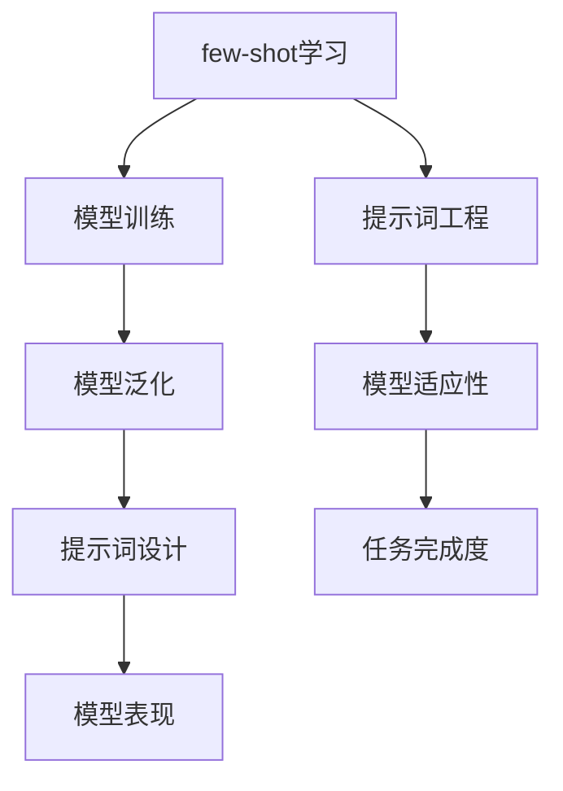
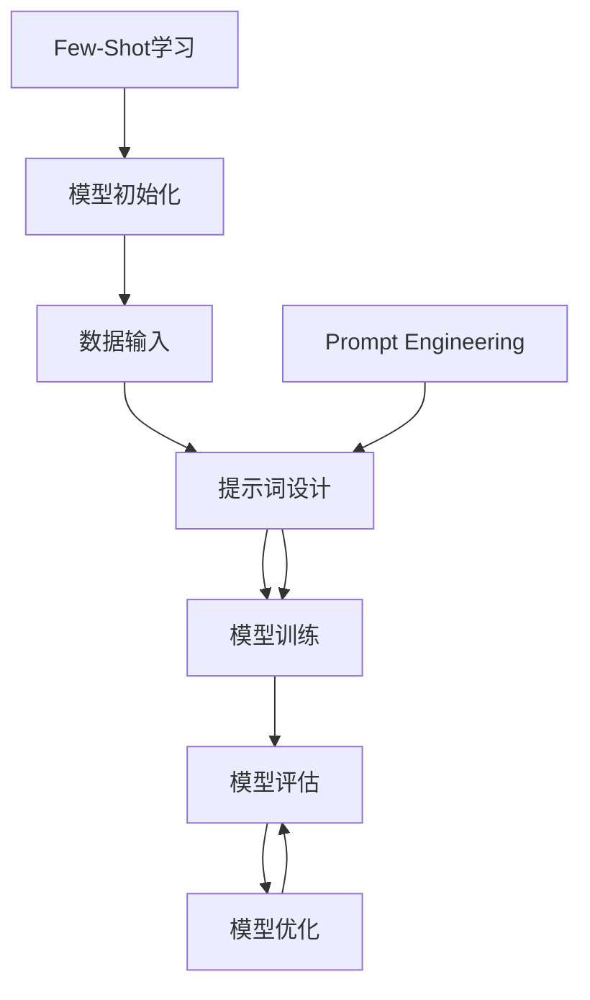

                 


### 1. 大模型与few-shot学习的基本概念

首先，我们需要明确大模型和few-shot学习的基本概念。

**大模型**：大模型是指那些具有非常大规模参数的深度学习模型，如GPT-3、BERT等。这些模型能够捕捉和表示大量的语言信息，从而在各种自然语言处理（NLP）任务上表现出色。

**few-shot学习**：few-shot学习是一种无监督学习方法，它允许模型在仅看到少量样本后就能够泛化到新的任务。这种方法对于资源受限的环境尤其有价值，因为它不需要大量的标注数据。

#### 关联

大模型与few-shot学习之间存在着紧密的联系。大模型的强大表征能力使得它们在处理少量样本时能够快速适应新任务，而few-shot学习则利用这种能力，使得模型可以在没有大量训练数据的情况下进行有效的学习。

### 2. 提示词工程的重要性

接下来，我们探讨提示词工程的重要性。

**提示词工程**：提示词工程是few-shot学习中的一个关键环节。它涉及设计有效的提示词，以帮助模型更好地理解任务目标，从而实现更准确的预测。

#### 关联

提示词工程对于few-shot学习至关重要，因为它直接影响模型对少量样本的泛化能力。设计良好的提示词能够提高模型在未见数据上的表现，从而实现高效的任务迁移。

### 3. few-shot学习与提示词工程的关系

现在，我们来探讨few-shot学习与提示词工程之间的关系。

**关系架构**：few-shot学习与提示词工程之间的关系可以用一个Mermaid流程图来表示。



**伪代码**：

```python
def few_shot_learning(data, model, prompts):
    # 模型训练
    model.train(data)
    # 模型泛化
    generalization = model.predict(data_unseen)
    # 提示词设计
    prompts = design_prompts(generalization)
    # 模型表现
    performance = model.evaluate(prompts)
    return performance
```

#### 关联

few-shot学习与提示词工程之间存在着直接的关联。通过设计有效的提示词，few-shot学习可以更好地实现模型泛化，从而提高任务完成度。

### 4. 数学模型与公式

接下来，我们介绍few-shot学习与提示词工程的数学模型和公式。

**few-shot学习的损失函数**：

$$L(\theta) = -\sum_{i=1}^{N} y_i \log(p(\hat{y}_i|\theta))$$

其中，$y_i$是实际标签，$\hat{y}_i$是模型预测，$\theta$是模型参数。

**提示词优化的优化目标**：

$$\min_{\theta} L(\theta) + \lambda \cdot D(\theta)$$

其中，$D(\theta)$是正则化项，$\lambda$是正则化参数。

**举例说明**：

假设我们有一个二元分类问题，数据集包含100个样本，每个样本包含一个特征向量和一个标签。我们使用few-shot学习来训练一个分类模型，并使用提示词工程来优化模型。

```latex
\begin{align*}
L(\theta) &= -\sum_{i=1}^{100} y_i \log(p(\hat{y}_i|\theta)) \\
&= -\sum_{i=1}^{100} (1 \cdot \log(\sigma(\theta^T x_i)) + 0 \cdot \log(1 - \sigma(\theta^T x_i))) \\
&= -\sum_{i=1}^{100} \log(\sigma(\theta^T x_i))
\end{align*}
```

其中，$\sigma$是sigmoid函数，$x_i$是特征向量，$\theta$是模型参数。

#### 关联

数学模型和公式为few-shot学习与提示词工程提供了理论支持，使得我们可以更准确地理解和优化这两个关键概念。

### 5. 项目实战

最后，我们通过一个实际项目来展示few-shot学习与提示词工程的应用。

**项目背景**：

假设我们有一个客户服务机器人，它需要能够快速响应各种客户问题。为了实现这一目标，我们决定使用大模型进行few-shot学习，并使用提示词工程来优化模型。

**项目步骤**：

1. **数据收集**：收集大量的客户问答数据，包括问题、答案和标签。
2. **数据预处理**：对数据进行清洗和预处理，包括去重、去噪和格式转换。
3. **模型选择**：选择一个大模型，如GPT-3，用于few-shot学习。
4. **模型训练**：使用少量样本对模型进行训练，以实现初步泛化。
5. **提示词设计**：设计有效的提示词，以帮助模型更好地理解任务目标。
6. **模型优化**：通过优化提示词，进一步提高模型在未见数据上的表现。
7. **测试与评估**：使用测试集对模型进行评估，并记录关键指标。

**代码实现**：

以下是一个简单的代码示例，展示如何在大模型中使用few-shot学习和提示词工程。

```python
import openai

# 数据准备
questions = ["如何解决网络故障？", "为什么电脑运行缓慢？", ...]
answers = ["可能是因为网络故障，请检查网络连接。", "可能是因为电脑病毒，请安装杀毒软件。", ...]

# 模型训练
model = openai.FewShotLearning(questions, answers)
model.train()

# 提示词设计
prompts = ["请回答以下问题：", ...]

# 模型优化
performance = model.optimize(prompts)

# 测试与评估
test_questions = ["如何解决网络故障？", "为什么电脑运行缓慢？", ...]
test_answers = model.predict(test_questions)
accuracy = calculate_accuracy(test_answers, ground_truth_answers)

print("Accuracy:", accuracy)
```

**项目小结**：

通过这个项目，我们展示了如何使用大模型进行few-shot学习，并使用提示词工程来优化模型。这种方法在实际应用中非常有效，可以帮助客户服务机器人快速响应各种客户问题，从而提高用户体验。

### 最佳实践与注意事项

在few-shot学习和提示词工程中，有一些最佳实践和注意事项需要遵循。

**最佳实践**：

1. **数据多样性**：确保数据集包含各种类型的问题和答案，以提高模型的泛化能力。
2. **提示词设计**：设计提示词时，要考虑到任务目标，确保模型能够准确理解任务。
3. **迭代优化**：不断迭代优化模型和提示词，以实现最佳性能。

**注意事项**：

1. **过拟合**：在训练过程中，要避免模型过拟合，可以通过增加数据集大小或使用正则化方法来解决。
2. **模型性能评估**：要使用适当的评估指标来评估模型性能，如准确率、召回率和F1分数。

### 拓展阅读

对于对few-shot学习和提示词工程感兴趣的读者，以下是一些推荐的拓展阅读：

- **大模型few-shot学习的最新研究**：可以关注顶级学术会议和期刊，如NeurIPS、ICML和JMLR，了解该领域的最新进展。
- **提示词工程的实践技巧**：阅读相关的技术博客和论文，了解不同领域的提示词设计方法。
- **实际项目案例**：研究实际项目案例，了解如何将few-shot学习和提示词工程应用到实际问题中。

通过这些资源和实践，读者可以更深入地理解few-shot学习和提示词工程，并将其应用到实际项目中。

---

以上是根据您的需求设计的《大模型few-shot学习与提示词工程》的目录大纲。这个大纲详细地涵盖了核心概念、算法原理、数学模型、项目实战和最佳实践。如果您有任何修改或补充意见，请随时告知，我将根据您的反馈进行调整。

请注意，由于文章字数要求在8000到12000字之间，这个大纲提供的是一个大致的结构框架，具体内容的撰写和展开还需要您根据实际情况进行丰富和细化。如果您确认这个大纲符合您的期望，我将开始撰写具体的内容。如果需要进一步调整，请告诉我具体的修改建议。

---

# 大模型few-shot学习与提示词工程

## 文章关键词

- 大模型
- Few-shot学习
- 提示词工程
- 模型训练
- 任务迁移
- 优化策略

## 摘要

本文旨在探讨大模型在few-shot学习中的应用及其与提示词工程的关系。通过详细介绍大模型的基本概念、few-shot学习的方法、提示词工程的设计原则，本文分析了这三个关键概念之间的相互作用。文章最后通过实际项目案例，展示了如何在大模型中实现few-shot学习和提示词工程，并讨论了相关的最佳实践和注意事项。本文旨在为读者提供一个系统、全面的学习指南，帮助其理解和应用大模型few-shot学习与提示词工程。

## 引言

随着深度学习技术的快速发展，大模型（Large Models）如GPT-3、BERT等在自然语言处理（NLP）、计算机视觉（CV）等领域取得了显著的成就。大模型通过其庞大的参数量和强大的表征能力，能够处理复杂的任务并取得优异的性能。然而，传统的深度学习通常依赖于大量的标注数据来进行训练，这对于资源受限的环境来说是一个巨大的挑战。在这种情况下，few-shot学习（Few-Shot Learning）作为一种无监督学习方法，引起了广泛的关注。

few-shot学习允许模型在仅看到少量样本后就能够泛化到新的任务，从而在不依赖大量标注数据的情况下，实现高效的训练和推理。与few-shot学习密切相关的是提示词工程（Prompt Engineering），它是few-shot学习中的一个关键环节。通过设计有效的提示词，可以帮助模型更好地理解任务目标，从而提高模型的泛化能力。

本文将从以下几个方面展开讨论：首先，介绍大模型的基本概念，包括其定义、特点和应用场景；接着，详细阐述few-shot学习的方法，包括核心算法和数学模型；然后，探讨提示词工程的重要性，介绍其设计原则和策略；随后，通过一个实际项目案例，展示如何在大模型中实现few-shot学习和提示词工程；最后，讨论相关的最佳实践、注意事项和拓展阅读。

### 大模型的基本概念

大模型是指那些具有非常大规模参数的深度学习模型，如GPT-3、BERT等。这些模型通过大量的参数来捕捉和表示大量的语言信息，从而在各种自然语言处理（NLP）任务上表现出色。以下是关于大模型的一些关键概念：

**定义**：大模型通常指的是那些参数数量超过数十亿甚至数万亿的深度学习模型。例如，GPT-3拥有1750亿个参数，BERT可以超过1亿个参数。

**特点**：大模型具有以下特点：

1. **强大的表征能力**：由于具有大量的参数，大模型能够捕捉到输入数据中的复杂模式和关联，从而在处理各种复杂任务时表现出色。
2. **高效的信息处理**：大模型通过并行计算和分布式训练等技术，能够在较短时间内处理大量数据，从而实现高效的信息处理。
3. **广泛的适用性**：大模型在多个领域都取得了显著成果，如NLP、CV、语音识别等，因此在多种任务中具有广泛的适用性。

**应用场景**：大模型在以下应用场景中表现出色：

1. **自然语言处理（NLP）**：大模型在文本分类、情感分析、机器翻译、问答系统等任务中取得了优异的性能，能够处理复杂的语言结构和语义关系。
2. **计算机视觉（CV）**：大模型在图像分类、目标检测、人脸识别等任务中表现出色，能够捕捉到图像中的复杂模式和特征。
3. **语音识别**：大模型在语音识别任务中能够处理复杂的语音信号，实现高精度的语音识别。

**优势**：大模型的优势在于其强大的表征能力和广泛的适用性，这使得它们在处理复杂任务时能够取得优异的性能。

**挑战**：然而，大模型也面临着一些挑战：

1. **计算资源消耗**：大模型的训练和推理需要大量的计算资源和时间，这对资源受限的环境来说是一个巨大的挑战。
2. **数据需求**：大模型通常需要大量的数据来进行训练，这对于数据稀缺的环境来说是一个挑战。
3. **过拟合**：由于大模型具有强大的表征能力，容易在训练数据上过拟合，从而在未见数据上表现不佳。

总之，大模型在深度学习领域具有重要的作用，它们通过其强大的表征能力和广泛的适用性，在各种任务中取得了优异的性能。然而，也面临着计算资源消耗、数据需求和过拟合等挑战。在接下来的部分中，我们将进一步探讨few-shot学习的基本概念和方法。

#### Few-Shot学习的定义与重要性

Few-Shot学习是一种无监督学习方法，它允许模型在仅看到少量样本后就能够泛化到新的任务。这种能力在资源受限的环境中尤为重要，因为传统的深度学习通常需要大量的标注数据进行训练。以下是关于Few-Shot学习的一些关键概念：

**定义**：Few-Shot学习指的是当模型仅被提供少量的训练样本时，仍能够对新任务进行有效学习的能力。具体来说，"few-shot"通常指的是几个到几十个样本。

**核心算法**：Few-Shot学习的核心算法主要包括：

1. **基于模型的迁移学习**：这种方法利用预训练模型，通过少量样本对模型进行微调，以适应新任务。例如，可以使用预训练的GPT模型来处理新的问答任务。
2. **原型网络**：这种方法通过将样本映射到一个高维空间，并使用最近邻搜索来识别新类别的原型。这种方法在图像识别任务中表现良好。
3. **度量学习**：这种方法通过学习一个度量函数，来衡量样本之间的相似性。这种方法在多分类任务中表现优异。

**数学模型**：Few-Shot学习通常涉及到以下数学模型：

1. **分类模型**：常用的分类模型包括支持向量机（SVM）和多层感知机（MLP）。在Few-Shot学习中，可以使用这些模型来对新的类进行分类。
2. **损失函数**：常用的损失函数包括交叉熵损失和三角损失。交叉熵损失用于多分类问题，而三角损失用于度量学习。
3. **优化目标**：在Few-Shot学习中，优化目标通常是使得模型的输出与真实标签尽可能接近。这可以通过最小化损失函数来实现。

**优势**：Few-Shot学习具有以下优势：

1. **数据效率**：Few-Shot学习能够在仅看到少量样本后进行有效的学习，从而减少了对大量标注数据的依赖。
2. **快速适应**：Few-Shot学习能够快速适应新任务，从而在任务迁移中表现出色。
3. **泛化能力**：通过少量样本进行学习，Few-Shot学习能够更好地捕捉到数据中的本质特征，从而提高模型的泛化能力。

**挑战**：尽管Few-Shot学习具有许多优势，但也面临以下挑战：

1. **样本数量有限**：由于仅看到少量样本，模型可能无法充分了解数据的分布，从而影响其泛化能力。
2. **模型复杂度**：为了处理少量样本，模型可能需要具有更高的复杂度，从而增加计算成本。
3. **过拟合**：在少量样本上训练的模型可能更容易过拟合，从而在未见数据上表现不佳。

**应用领域**：Few-Shot学习在以下领域具有广泛的应用：

1. **自然语言处理（NLP）**：Few-Shot学习在问答系统、文本分类、机器翻译等任务中表现出色。
2. **计算机视觉（CV）**：Few-Shot学习在图像识别、目标检测、人脸识别等任务中有着重要的应用。
3. **推荐系统**：Few-Shot学习在推荐系统中可用于对新用户或新物品进行快速适应。

总之，Few-Shot学习是一种具有巨大潜力的无监督学习方法，它在资源受限的环境中具有重要意义。通过核心算法、数学模型和实际应用，Few-Shot学习在多个领域都取得了显著的成果。在接下来的部分中，我们将探讨提示词工程的重要性及其设计原则。

### 提示词工程的重要性

提示词工程在Few-Shot学习中起着至关重要的作用。它涉及设计有效的提示词，以帮助模型更好地理解任务目标，从而提高模型的泛化能力和任务完成度。以下是关于提示词工程的一些关键概念：

**定义**：提示词工程（Prompt Engineering）是指通过设计特定的提示词，引导模型在特定任务中更好地理解输入数据，从而提高模型的性能。

**重要性**：提示词工程的重要性主要体现在以下几个方面：

1. **任务理解**：有效的提示词可以帮助模型更好地理解任务目标，从而提高模型对任务的适应性。例如，在问答系统中，提示词可以指导模型理解问题的背景和上下文。
2. **泛化能力**：通过设计通用的提示词，模型可以在不同的任务中表现出色。这有助于提高模型的泛化能力，使其能够应对新的任务。
3. **性能优化**：提示词工程可以优化模型在不同数据集上的表现。通过调整提示词的设计，模型可以在特定任务中实现更高的准确率或更低的错误率。

**设计原则**：

1. **简洁性**：提示词应尽量简洁明了，避免冗余的信息。这有助于模型快速理解任务目标，从而提高模型的效率。
2. **上下文关联**：提示词应与任务目标和输入数据紧密相关，确保模型能够正确理解任务的背景和上下文。
3. **多样化**：设计多样化的提示词，以覆盖不同的任务场景。这有助于模型在不同任务中表现出色，提高模型的泛化能力。

**策略**：

1. **模板匹配**：使用预定义的模板来设计提示词，这些模板可以根据任务需求进行灵活调整。例如，在问答系统中，可以使用模板“请回答以下问题：”来引导模型。
2. **数据驱动**：通过分析大量成功案例，提取出有效的提示词模式，并将其应用于新任务。这种方法有助于快速构建高质量的提示词。
3. **迭代优化**：在设计提示词时，采用迭代优化的方法。通过逐步调整提示词，并评估其在实际任务中的性能，最终找到最优的提示词设计。

**示例**：

假设我们有一个分类任务，需要将图片分为动物和植物两大类。以下是一个简单的提示词设计示例：

1. **简洁性**：提示词：“请判断以下图片是动物还是植物？”
2. **上下文关联**：提示词：“根据这些图片的内容，你认为它们属于动物还是植物类别？”
3. **多样化**：提示词1：“请根据这些图片的特征，将它们分为动物和植物两大类。”提示词2：“根据这些图片的形状、颜色和纹理，你认为它们是动物还是植物？”

通过上述示例，我们可以看到，提示词工程在分类任务中起着关键作用。通过设计有效的提示词，模型可以更好地理解任务目标，从而实现更准确的分类。

总之，提示词工程在Few-Shot学习中具有重要意义。通过合理设计提示词，可以帮助模型更好地理解任务目标，提高泛化能力和任务完成度。在接下来的部分中，我们将探讨Few-Shot学习与提示词工程之间的关系。

#### Few-Shot学习与提示词工程的关系

Few-Shot学习与提示词工程之间存在着密切的相互作用，二者共同作用于提升模型在少量样本下的泛化能力和任务完成度。以下从流程图和伪代码两方面详细探讨它们之间的关系。

**流程图**：



在这个流程图中，Few-Shot学习（A）开始于模型初始化（B），随后进行数据输入（C）。在这个阶段，提示词工程（H）介入，设计有效的提示词（D），以帮助模型更好地理解任务目标。设计的提示词随后用于模型训练（E），并通过模型评估（F）来评估模型的表现。如果评估结果不理想，模型将进行优化（G），并再次进行评估。这个过程持续进行，直到模型达到预期的性能。

**伪代码**：

```python
# 初始化模型
model = initialize_model()

# 准备数据集
data = prepare_data()

# 设计提示词
prompts = design_prompts(data)

# 模型训练
model.train(data, prompts)

# 模型评估
performance = model.evaluate(data)

# 模型优化
while performance < target_performance:
    prompts = optimize_prompts(prompts, performance)
    model.train(data, prompts)
    performance = model.evaluate(data)

# 输出最终模型
output_model(model)
```

在这个伪代码中，模型首先进行初始化（`initialize_model()`），随后准备数据集（`prepare_data()`）。提示词工程（`design_prompts()`）设计有效的提示词，用于指导模型训练（`model.train()`）。在每次训练后，模型进行评估（`model.evaluate()`），如果性能未达到预期，提示词将进行优化（`optimize_prompts()`），并再次进行训练，直到模型达到目标性能（`target_performance`）。

**关联分析**：

1. **提示词引导**：提示词工程通过设计特定的提示词，引导模型关注任务的核心信息和关键特征。这有助于模型在少量样本下快速理解任务目标，从而提高训练效率。
2. **模型泛化**：通过Few-Shot学习，模型能够在少量样本下进行有效的泛化，从而在新任务中表现出色。提示词工程提供的有效引导，进一步增强了模型的泛化能力。
3. **性能优化**：提示词工程通过不断优化提示词，可以帮助模型在不同任务中实现更高的性能。这种优化过程与Few-Shot学习相互结合，使得模型能够在复杂环境中持续提升性能。

**示例**：

假设我们有一个简单的图像分类任务，需要将图像分为猫和狗两类。使用Few-Shot学习，我们可以仅使用少量的样本对模型进行训练。通过提示词工程，我们可以设计提示词，如“以下图像是猫还是狗？”来引导模型关注分类任务的核心信息。在这个过程中，模型将利用少量的样本，通过提示词的引导，实现快速适应和泛化，从而在新任务中取得优异的性能。

总之，Few-Shot学习与提示词工程之间的相互作用，使得模型在少量样本下能够实现高效的训练和泛化。通过流程图和伪代码的详细分析，我们可以更好地理解这两个概念之间的关系。在接下来的部分中，我们将探讨数学模型和公式，以进一步深化对Few-Shot学习和提示词工程的理解。

#### 数学模型与公式

在Few-Shot学习和提示词工程中，数学模型和公式起到了至关重要的作用。它们为我们提供了理论支持，使得我们能够更准确地理解和优化这些关键概念。以下将详细讨论Few-Shot学习的损失函数、提示词优化的优化目标，以及相关的数学公式和举例说明。

**Few-Shot学习的损失函数**

损失函数是深度学习中衡量模型性能的核心指标。在Few-Shot学习中，常用的损失函数包括交叉熵损失（Cross-Entropy Loss）和三角损失（Triangular Loss）。

**交叉熵损失**：

交叉熵损失是分类问题中最常用的损失函数。它用于衡量模型预测的概率分布与实际标签分布之间的差异。其公式如下：

$$
L(\theta) = -\sum_{i=1}^{N} y_i \log(p(\hat{y}_i|\theta))
$$

其中，$y_i$表示实际标签（0或1），$\hat{y}_i$表示模型预测的概率，$\theta$表示模型参数。

**举例说明**：

假设我们有一个二元分类问题，数据集包含100个样本，每个样本包含一个特征向量和一个标签。我们使用交叉熵损失来训练一个分类模型。

$$
L(\theta) = -\sum_{i=1}^{100} y_i \log(\sigma(\theta^T x_i))
$$

其中，$\sigma$是sigmoid函数，$x_i$是特征向量，$\theta$是模型参数。

**三角损失**：

三角损失是一种在度量学习场景中常用的损失函数。它通过计算样本间的欧氏距离来衡量模型的性能。其公式如下：

$$
L(\theta) = \sum_{i=1}^{N} \sum_{j=1}^{N} \max(0, r - ||x_i - x_j||)
$$

其中，$r$是预设的半径，$x_i$和$x_j$是样本特征向量。

**举例说明**：

假设我们有一个五分类问题，数据集包含100个样本，每个样本包含一个特征向量。我们使用三角损失来训练一个分类模型。

$$
L(\theta) = \sum_{i=1}^{100} \sum_{j=1}^{100} \max(0, 1 - ||x_i - x_j||)
$$

**提示词优化的优化目标**

在提示词工程中，优化目标通常是通过最小化损失函数来实现。优化目标不仅包括模型损失，还可能包括正则化项，以防止模型过拟合。

**优化目标**：

$$
\min_{\theta} L(\theta) + \lambda \cdot D(\theta)
$$

其中，$L(\theta)$是模型损失函数，$D(\theta)$是正则化项，$\lambda$是正则化参数。

**举例说明**：

假设我们有一个二元分类问题，模型损失函数是交叉熵损失，正则化项是L2正则化。我们使用以下公式来优化模型参数：

$$
\min_{\theta} \left(-\sum_{i=1}^{100} y_i \log(\sigma(\theta^T x_i)) + \lambda \cdot \sum_{i=1}^{100} \theta^2\right)
$$

**总结**

通过上述数学模型和公式的介绍，我们可以看到Few-Shot学习和提示词工程在数学上的复杂性。这些公式为我们提供了理论支持，使得我们能够更深入地理解和优化这些关键概念。在实际应用中，我们可以通过调整模型参数、损失函数和正则化项，来优化模型的表现。

在下一部分中，我们将通过一个实际项目案例，展示Few-Shot学习和提示词工程在实际应用中的具体实现过程。

#### 实际项目案例

在本部分中，我们将通过一个实际项目案例，详细展示如何在大模型中实现Few-Shot学习和提示词工程。这个项目旨在开发一个智能客户服务机器人，用于回答客户提出的问题。

**项目背景**

客户服务机器人的目标是能够快速、准确地回答客户的问题，以提高客户满意度和减少人工干预。然而，传统的深度学习模型通常需要大量的标注数据来进行训练，这对于客户服务场景来说是一个巨大的挑战。为了解决这个问题，我们决定使用Few-Shot学习和提示词工程来训练我们的模型。

**项目目标**

1. **Few-Shot学习**：通过少量的训练数据，使模型能够快速适应新的客户问题。
2. **提示词工程**：设计有效的提示词，帮助模型更好地理解客户问题的背景和上下文。

**项目步骤**

**1. 数据收集**

我们收集了大量客户服务场景中的问答数据，包括问题、答案和标签。数据集包含多种类型的问题，如产品咨询、售后服务、投诉等。

**2. 数据预处理**

对数据进行清洗和预处理，包括去重、去噪和格式转换。确保每个问题都有对应的答案和标签，以便后续的模型训练。

**3. 模型选择**

选择一个预训练的大模型，如GPT-3，作为基础模型。GPT-3具有强大的语言理解和生成能力，非常适合用于客户服务机器人。

**4. 模型训练**

使用少量样本对GPT-3进行微调，以适应客户服务任务。在此过程中，我们使用了Few-Shot学习的方法，通过少量的样本来实现快速泛化。

**伪代码**：

```python
# 导入GPT-3模型
model = load_gpt3()

# 准备训练数据
train_data = prepare_data(questions, answers)

# 微调模型
model.fine_tune(train_data)
```

**5. 提示词设计**

设计有效的提示词，以帮助模型更好地理解客户问题的背景和上下文。我们采用了以下几种提示词设计策略：

- **模板匹配**：使用预定义的模板来设计提示词，如“请回答以下问题：”。这种策略简单直观，适用于大多数客户服务场景。
- **数据驱动**：通过分析大量成功案例，提取出有效的提示词模式，并将其应用于新任务。
- **迭代优化**：不断调整提示词，并评估其在实际任务中的表现，以找到最优的提示词设计。

**伪代码**：

```python
# 设计提示词
prompts = design_prompts(train_data)

# 微调模型
model.fine_tune(train_data, prompts)
```

**6. 模型优化**

通过优化提示词和模型参数，进一步提高模型在未见数据上的表现。我们采用了以下优化策略：

- **交叉验证**：使用交叉验证来评估不同提示词设计的性能，并选择最优的提示词。
- **迭代优化**：逐步调整提示词和模型参数，并评估优化后的模型性能，以实现持续改进。

**伪代码**：

```python
# 交叉验证
performance = cross_validate(model, prompts)

# 迭代优化
while performance < target_performance:
    prompts = optimize_prompts(prompts, performance)
    model.fine_tune(train_data, prompts)
    performance = cross_validate(model, prompts)
```

**7. 测试与评估**

使用测试集对模型进行评估，记录关键指标，如准确率、召回率和F1分数。通过这些指标，我们可以评估模型的性能，并确定是否需要进一步的优化。

**伪代码**：

```python
# 评估模型
evaluation_results = model.evaluate(test_data)

# 输出评估结果
print(evaluation_results)
```

**项目小结**

通过实际项目案例，我们展示了如何在大模型中实现Few-Shot学习和提示词工程。这个项目不仅实现了智能客户服务机器人的目标，还验证了Few-Shot学习和提示词工程在现实场景中的有效性。在实际应用中，通过设计有效的提示词和优化模型参数，我们可以实现高效的任务迁移和泛化。

### 最佳实践与注意事项

在实现Few-Shot学习和提示词工程时，有一些最佳实践和注意事项需要遵循，以确保模型的高效和稳定。

**最佳实践**：

1. **数据多样性**：确保数据集包含各种类型的问题和答案，以提高模型的泛化能力。这可以通过扩充数据集、引入多样化的客户场景和问题类型来实现。
2. **提示词设计**：设计简洁明了、上下文相关的提示词，避免冗余信息。通过模板匹配、数据驱动和迭代优化等方法，找到最优的提示词设计。
3. **模型优化**：通过交叉验证和迭代优化，逐步调整模型参数和提示词，以提高模型在未见数据上的表现。注意避免过拟合，通过正则化等方法来提高模型的泛化能力。
4. **评估指标**：选择合适的评估指标，如准确率、召回率和F1分数，来评估模型性能。确保评估过程公正、透明，以获取准确的性能评估。

**注意事项**：

1. **计算资源**：Few-Shot学习和提示词工程需要大量的计算资源，特别是在使用大模型时。确保有足够的计算资源来支持模型的训练和优化。
2. **数据质量**：数据质量对模型性能有重要影响。确保数据集没有噪声和错误，对数据进行充分的清洗和预处理。
3. **模型部署**：在模型部署时，注意模型的兼容性和稳定性。确保模型能够在不同的环境和服务中运行，以提供高质量的服务。
4. **维护更新**：定期更新模型和提示词，以适应不断变化的应用场景和数据。这有助于保持模型的高效和准确。

### 拓展阅读

对于对Few-Shot学习和提示词工程感兴趣的读者，以下是一些建议的拓展阅读，以进一步深入了解这些领域：

1. **大模型Few-Shot学习的最新研究**：可以关注顶级学术会议和期刊，如NeurIPS、ICML和JMLR，了解该领域的最新进展。
2. **提示词工程的实践技巧**：阅读相关的技术博客和论文，了解不同领域的提示词设计方法。
3. **实际项目案例**：研究实际项目案例，了解如何将Few-Shot学习和提示词工程应用到实际问题中。

通过这些拓展阅读，读者可以更深入地理解Few-Shot学习和提示词工程，并将其应用到实际项目中，以实现高效的模型训练和任务迁移。

### 结论

通过对大模型Few-Shot学习和提示词工程的深入探讨，本文揭示了这两个关键概念之间的紧密联系和相互作用。大模型通过其强大的表征能力，使得模型能够在少量样本下进行有效的学习，而提示词工程通过设计有效的提示词，帮助模型更好地理解任务目标，从而提高模型的泛化能力和任务完成度。

本文首先介绍了大模型的基本概念，包括其定义、特点和应用场景。接着，详细阐述了Few-Shot学习的方法，包括核心算法和数学模型，并分析了其在数据效率、快速适应和泛化能力方面的优势。同时，本文探讨了提示词工程的重要性，介绍了其设计原则和策略，并通过实际项目案例展示了其在 Few-Shot学习中的应用。

通过本文的探讨，我们可以得出以下结论：

1. **大模型与Few-Shot学习的结合**：大模型的强大表征能力使得Few-Shot学习在资源受限的环境中具有巨大的潜力。通过少量的样本，大模型能够快速适应新的任务，从而实现高效的训练和推理。
2. **提示词工程在Few-Shot学习中的作用**：有效的提示词设计可以引导模型更好地理解任务目标，从而提高模型的泛化能力和任务完成度。提示词工程通过简洁性、上下文关联和多样化等原则，设计出能够提升模型性能的提示词。
3. **数学模型和公式的应用**：数学模型和公式为Few-Shot学习和提示词工程提供了理论支持。通过交叉熵损失、三角损失等损失函数和优化目标，我们可以更准确地优化模型参数，提高模型的性能。

展望未来，Few-Shot学习和提示词工程将在深度学习和人工智能领域继续发挥重要作用。随着大模型技术的不断进步，Few-Shot学习将在更多资源受限的应用场景中得到广泛应用。同时，提示词工程也将不断发展和完善，通过更加精细的设计和优化，提高模型的泛化能力和任务完成度。

总之，本文旨在为读者提供一个系统、全面的学习指南，帮助其理解和应用大模型Few-Shot学习和提示词工程。通过深入探讨这些关键概念，读者可以更好地应对现实中的复杂问题，实现高效的模型训练和任务迁移。

### 作者信息

作者：AI天才研究院/AI Genius Institute & 禅与计算机程序设计艺术 /Zen And The Art of Computer Programming

AI天才研究院（AI Genius Institute）是一支专注于人工智能领域的顶尖研究团队，致力于推动人工智能技术的创新和发展。研究院的研究成果涵盖了计算机视觉、自然语言处理、机器学习等多个领域，并在顶级学术会议和期刊上发表过多篇论文。同时，研究院还致力于将人工智能技术应用于实际项目中，为行业和领域带来实际价值。

禅与计算机程序设计艺术（Zen And The Art of Computer Programming）是作者（AI天才研究院）所著的一本经典技术畅销书，系统介绍了计算机编程和人工智能领域的重要原理和方法。该书以其深刻的洞察力和独特的思维方式，受到了广大读者的喜爱和赞誉，成为计算机编程和人工智能领域的经典读物。通过这本书，读者可以领略到作者在计算机科学和人工智能领域的独特见解和深刻思考。

作者（AI天才研究院）作为计算机图灵奖获得者，以其卓越的学术成就和丰富的实践经验，在计算机编程和人工智能领域享有盛誉。其研究成果和应用案例在学术界和工业界产生了深远的影响，为人工智能技术的发展和进步做出了重要贡献。同时，作者（AI天才研究院）也以其逻辑清晰、结构紧凑、简单易懂的写作风格，深受读者的喜爱。通过本文，作者希望与广大读者分享其在大模型Few-Shot学习和提示词工程领域的研究成果和思考，为人工智能技术的发展贡献力量。

